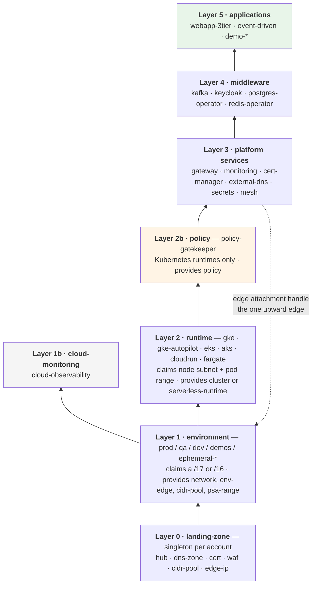
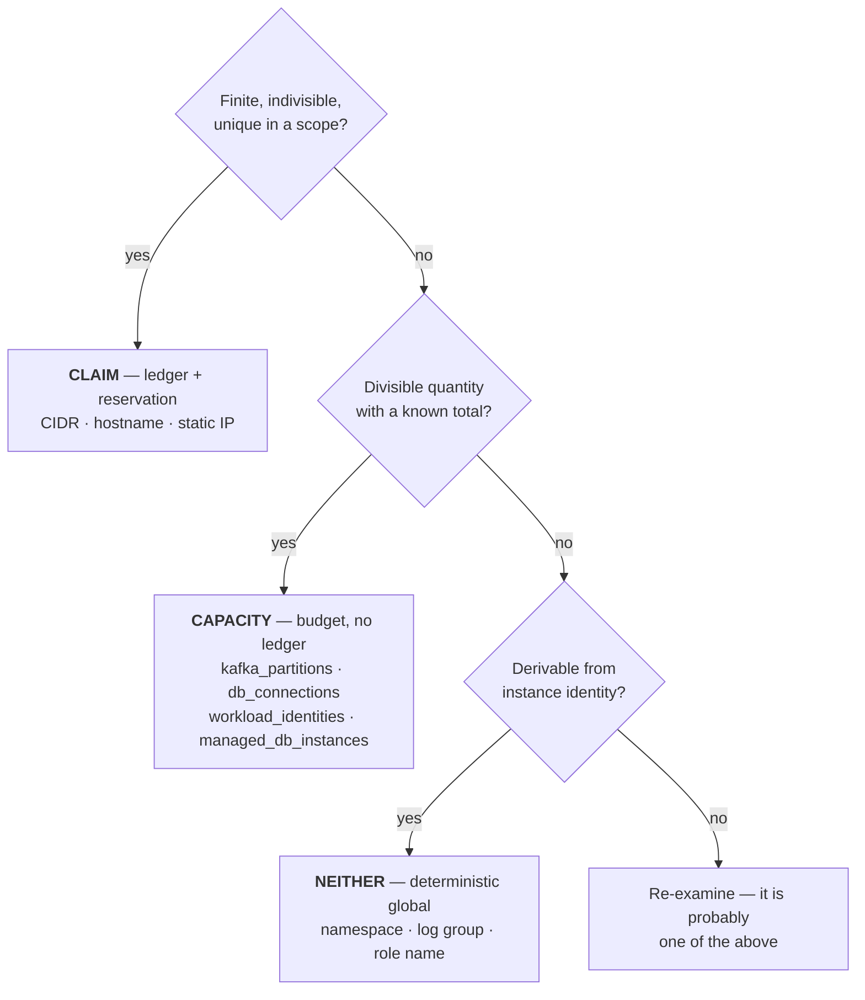
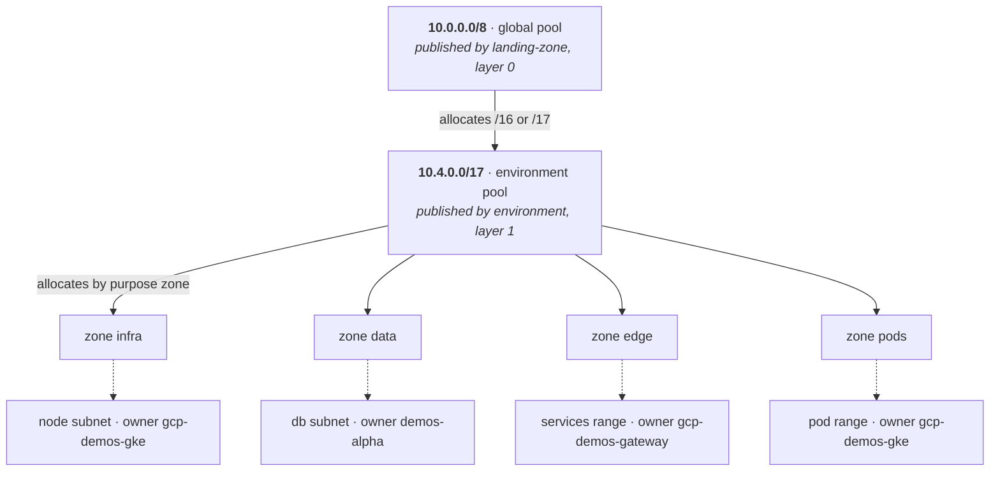
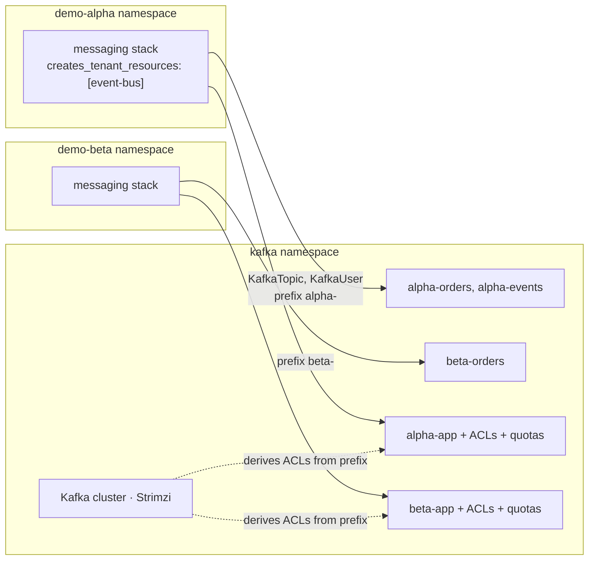
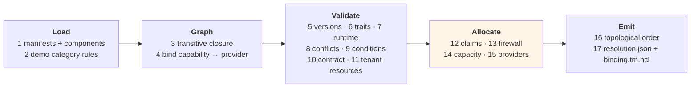

# Archetype Model — Packaging, Dependencies and Resolution

**Companion to `terramate-outputs-sharing-architecture.md`**

> **Start with `platform-overview.md`** for a diagram-led map of the document set.
>
> **Risks** live in `risk-register.md`.

| | |
|---|---|
| **Scope** | How archetypes declare dependencies, how compositions are validated, and how finite resources are allocated |
| **Relationship to the architecture document** | That document specifies *how infrastructure code is generated and orchestrated*. This one specifies *what may be composed with what*, and validates it before any code is generated |
| **Clouds** | GCP, AWS and Azure at parity; designed for a fourth without changing the model |
| **Runs** | Before `terramate generate`, in every pull request. Fails closed |

---

## Table of contents

1. [Purpose](#1-purpose)
2. [The package analogy, and where it breaks](#2-the-package-analogy-and-where-it-breaks)
3. [The layer model](#3-the-layer-model)
4. [Capabilities, providers and traits](#4-capabilities-providers-and-traits)
5. [Archetype anatomy](#5-archetype-anatomy)
6. [Manifest reference](#6-manifest-reference)
7. [Environment binding](#7-environment-binding)
8. [Scarce resources: claims, capacity, deterministic](#8-scarce-resources-claims-capacity-deterministic)
9. [Address plan and hierarchical pools](#9-address-plan-and-hierarchical-pools)
10. [Tenant resources and multi-tenant providers](#10-tenant-resources-and-multi-tenant-providers)
11. [CMDB in Git](#11-cmdb-in-git)
12. [The resolution algorithm](#12-the-resolution-algorithm)
13. [Diagnostics](#13-diagnostics)
14. [Portability and adding a fourth cloud](#14-portability-and-adding-a-fourth-cloud)
15. [Worked examples](#15-worked-examples)
16. [Schemas](#16-schemas)

---

## 1. Purpose

An application archetype in this platform transitively depends on ten to fifteen others: a landing zone, an environment, a runtime, a gateway, monitoring, certificates, secrets, an identity provider, an event bus. Declaring that by hand in each application does not scale, and discovering an incompatibility during `tofu apply` — twenty minutes in, halfway down a dependency chain — is the failure mode this model exists to prevent.

The model provides five things:

1. **A manifest** per archetype declaring what it requires, provides, conflicts with, which internal stacks it owns, and which finite resources it claims.
1. **A resolver** that computes the transitive closure, validates versions and traits, allocates claims from hierarchical pools, and emits an ordered plan — before any code is generated.
2. **Ledgers** in Git recording every allocation, using merge conflicts as the concurrency control.
3. **A component catalog** so that composing a new archetype is selection, not infrastructure authorship.
4. **A CMDB** derived from both, queryable by applications and dashboards.

Everything is a file in Git. Nothing requires a running service.

---

## 2. The package analogy, and where it breaks

The manifest borrows deliberately from Debian and RPM: `Depends`, `Provides`, `Conflicts`, `Recommends`, virtual packages, version constraints. Reusing a vocabulary engineers already know is worth a great deal. But five differences change the design, and pretending otherwise produces a system that fails in production.

| apt / rpm | This platform |
|---|---|
| Packages are interchangeable instances of a version | Providers are **concrete deployed instances**. "I need a cluster" is not enough; it is "*this* environment's cluster, which must have capacity" |
| No finite shared resources | CIDR blocks, hostnames, Kafka partitions must be **reserved**, not merely checked |
| `remove` frees resources immediately | Releasing a CIDR requires **quarantine** — stale routes, peerings and firewall rules outlive a destroy |
| Resolution is atomic | An apply fails halfway; resolution must be **idempotent and re-runnable** |
| A package is one unit | An archetype is a **set of stacks** with internal ordering, each with its own state |
| Multiple versions installable → NP-complete | **Exactly one instance of each capability per environment** → linear resolution, no solver |

That last row is the most consequential. Because an environment contains exactly one `cluster`, one `ingress`, one `event-bus`, the resolver never chooses between candidate versions. It looks up the single bound provider and validates every constraint against it. No backtracking, no SAT solver, no heuristic. The engineering difficulty is entirely in producing good error messages.

---

## 3. The layer model

Archetypes stack. The same `requires`/`provides` grammar governs every level, so the resolver has one code path.



| Layer | Cardinality | Lifecycle | Owner |
|---|---|---|---|
| 0 | One per account | Years | Platform team |
| 1, 1b | One per environment | Months to years | Platform team |
| 2 | One runtime per environment | Months | Platform team |
| 2b | One per Kubernetes cluster | Months | Platform + security |
| 3 | One per capability per environment | Weeks | Platform team |
| 4 | One per capability per environment | Weeks | Platform + application teams |
| 5 | Many per environment | Days | Application teams, project office |

Three structural notes:

- **Layer 1b is parallel to layer 2.** Cloud-native monitoring attaches to the environment, not a cluster. Modelling it as a layer-3 dependency would serialise the pipeline for nothing.
- **Layer 2 claims from the environment's pool**, which layer 1 published. Pools are hierarchical (§9).
- **Edge capabilities move to layer 1 when the environment has its own project.** One account/project/subscription per environment is the platform decision (`CLAUDE.md`). On GCP the edge IP, Cloud Armor policy and certificate must share a project with the load balancer, so `edge-ip`, `waf` and `cert` are provided by the environment archetype. Layer 0 keeps the parent DNS zone, the address pool, KMS, the image registry and CI federation.
- **Layer 2b exists because admission control must precede everything it governs.** If Gatekeeper enforces Pod Security Standards, it has to be in place before the gateway and monitoring workloads are admitted, so it cannot sit at layer 3. It is also cluster-scoped rather than a service consumed by name. The precedent is layer 1b. It has no counterpart on Cloud Run, ECS Fargate or Container Apps — the `policy` capability exists only where `cluster` does, and §14.4 records that gap.
- **Layer 3 `gateway` produces something a lower layer consumes** — the edge attachment handle (NEG name, target group ARN, AGFC frontend). It is the one upward edge in the graph and must be explicit so the topological order surprises nobody.

---

## 4. Capabilities, providers and traits

### 4.1 Virtual capabilities

An application never depends on `gke`. It depends on `cluster`. Several archetypes provide it:

```yaml
# archetypes/gke/manifest.yaml
provides:
  - capability: cluster
    version: 2.4.0
    traits: [self-managed-nodes, daemonset-privileged, hostpath, node-agent, gpu, sysctl-max-map-count]

# archetypes/gke-autopilot/manifest.yaml
provides:
  - capability: cluster
    version: 2.4.0
    traits: [managed-nodes, managed-prometheus]
```

Which one satisfies `cluster` in an environment is decided by the **environment binding** (§7), exactly as `global.platform.cluster_stack_id` decides it in the architecture document. Application manifests do not change when an environment moves from GKE to Autopilot.

### 4.2 Traits

Version constraints cannot express "this monitoring agent cannot run on Autopilot." Traits can, turning a runtime failure into a validation failure.

```yaml
# archetypes/monitoring-nodeagent/manifest.yaml
requires:
  - capability: cluster
    version: "^2.0.0"
    traits: [daemonset-privileged, hostpath]     # ← fails against Autopilot
provides:
  - capability: monitoring
    version: 1.8.0
```

`monitoring-managed` provides the same capability and version but requires `managed-prometheus`. An application requires `monitoring`; the resolver picks the provider whose traits the environment's cluster satisfies, and fails naming the missing trait rather than producing a `CreateContainerError` twenty minutes into an apply.

### 4.3 Trait registry

Traits are a controlled vocabulary. An unregistered trait is a resolution error, because a typo that silently matches nothing is worse than no check.

The table below is a **reading copy**; the source of truth is `registry/traits.yaml` (§4.4). If they disagree, the registry wins and this table is the bug.

| Domain | Traits |
|---|---|
| Compute | `self-managed-nodes`, `managed-nodes`, `daemonset-privileged`, `hostpath`, `node-agent`, `gpu`, `arm64`, `spot`, `overlay-pods`, `sysctl-max-map-count` |
| Ingress | `gateway-api`, `ingress-api`, `http-route`, `grpc-route`, `tcp-route`, `cross-namespace-refgrant`, `oidc-security-policy`, `jwt-auth`, `local-rate-limit`, `global-rate-limit`, `mtls-backend` |
| Edge | `iac-owned-edge`, `managed-cert`, `waf`, `global-anycast`, `regional-only` |
| Identity | `workload-identity`, `irsa`, `pod-identity`, `managed-identity`, `saml-idp` |
| Data | `private-endpoint`, `iam-auth`, `multi-az`, `psa-shared`, `cnpg` |
| Messaging | `strimzi`, `kraft`, `acl-authz`, `tls-mtls`, `schema-registry`, `tiered-storage` |
| Policy | `gatekeeper`, `custom-templates`, `audit-api`, `referential-constraints`, `mutation` |
| Observability | `managed-prometheus`, `otlp-native`, `managed-tracing`, `prometheus-operator-crds` |

`iac-owned-edge` records whether every cloud resource in the edge path is in Terraform state. GCP standalone NEGs are not (architecture document §10.2). If a compliance requirement ever demands full IaC ownership, the resolver detects the gap at validation time rather than at audit time.

`overlay-pods` matters for capacity planning: AKS with Azure CNI Overlay does not consume VNet addresses for pods, so its pod-range claim is zero (§9.5).

### 4.4 The single registry

Capabilities, traits, pool zone names and mandatory labels are consumed by three different mechanisms — JSON Schema `enum`s, conftest `--data`, and Gatekeeper chart values. Held separately they diverge within months, and the failure is nasty: a label the generator stops emitting but the admission `Constraint` still demands blocks legitimate deployments at admission time.

```
registry/
├── capabilities.yaml     # capability enum
├── traits.yaml           # trait vocabulary
├── zones.yaml            # pool zone names
└── labels.yaml           # mandatory labels per resource type
```

| Generated artefact | Consumer |
|---|---|
| `enum` blocks in `schemas/*.schema.json` | `check-jsonschema` |
| `registry/*.json` bundle | `conftest --data` |
| Gatekeeper chart `values.yaml` | `ConstraintTemplate` parameters |

The YAML is the source. A schema edited by hand is a bug, guarded by a `registry-generate --check` gate in CI exactly like `terramate generate --check`.

### 4.5 Capability version semantics

The version of a capability is the version of its **outputs contract**, not of its implementation.

| Bump | Trigger |
|---|---|
| MAJOR | An output is removed, renamed, or changes type; a `tenant_resources` kind is removed |
| MINOR | An output is added; a trait is added |
| PATCH | Implementation only; the contract is byte-identical |

CI diffs the contract file in `imports/contracts/`, computes the required bump, and fails if the manifest was not updated. That check addresses risk R6 in the architecture document.

**Do not maintain the required-outputs list by hand.** Extract it from the archetype's `input` blocks; the resolver then verifies every referenced output exists in the producer's `provides.outputs` — statically, before generation, without touching the cloud.

---

## 5. Archetype anatomy

### 5.1 An archetype is a set of stacks

Responsibility is pushed downward. An archetype owns everything it needs: identity, secrets, its own data store, its firewall rules, its front-door routing. It does not ask the platform for a database; it brings one.

```yaml
metadata:
  name: keycloak
  version: 4.1.0
  layer: 4
  kind: catalog

stacks:
  - name: iam                                    # service account / managed identity
  - name: secrets
    after: [iam]
  - name: data                                   # its own Cloud SQL instance
    after: [iam]
  - name: firewall
    after: [data]
  - name: app
    after: [secrets, data, firewall]
  - name: frontdoor                              # HTTPRoute, no SecurityPolicy — see §10.5
    after: [app]

provides:
  - capability: oidc-idp
    version: 4.1.0
    outputs:
      - { name: issuer_url,      from: app }
      - { name: realm_name,      from: app }
      - { name: admin_secret_id, from: secrets }
```

Two properties this buys:

- **Encapsulation.** `provides` belongs to the archetype, not to a stack. Consumers reference `capability: oidc-idp`; the resolver maps each output to the internal stack that produces it and writes the correct `from_stack_id`. Reorganising Keycloak's internal stacks is not a breaking change.
- **Self-contained blast radius.** Destroying the archetype destroys its database. No orphaned Cloud SQL instance, no cross-archetype firewall rule left pointing at nothing.

Each `stacks[]` entry becomes one Terramate stack under the archetype instance's directory, with `after` translated directly into `stack.after`.

### 5.2 Catalog archetypes and demo archetypes

Demand for demo environments arrives from the project office with arbitrary requirements — one demo needs Neo4j, another MongoDB, another a bespoke pipeline. Those requirements become an archetype and get deployed. That is a different economics from a stable catalog, and the model must not treat them the same.

| | `kind: catalog` | `kind: demo` |
|---|---|---|
| Author | Platform team | Project office, with light review |
| Lifetime | Years | Weeks |
| Instances | Many | One |
| Versioning | Strict semver, stable contract | `0.x`, no guarantees |
| May publish `provides` | Yes | **No** — leaf only |
| May target layers 0–3 | Yes | **No** |
| `expiresOn` | Optional | **Required** |
| Review gate | Full | Schema + policy + budget |

With a stable catalog the cost sits in *using* an archetype and the manifest is written once. With disposable archetypes the cost sits in *creating* one — and if that takes a platform engineer a day per demo, the system will not be used and the project office will go around it.

Enforced by assertion:

```yaml
# validated by the resolver, not by convention
kind: demo  ⇒  provides == []  ∧  layer == 5  ∧  expiresOn is set
```

### 5.3 Components — reusable stack templates

Neo4j, MongoDB, Redis and Postgres as *dedicated instances* should not be authored per demo. They are **components**: parameterised stack templates with their chart, claims, firewall rules and secret integration already solved.

```yaml
# archetypes/demo-disasterproject-graph/manifest.yaml
metadata:
  name: demo-disasterproject-graph
  version: 0.1.0
  kind: demo
  layer: 5
  expiresOn: 2026-11-15
  owners: [project-office-disasterproject]

stacks:
  - use: component/neo4j
    name: graph
    values: { size: small, persistence_gib: 50 }
  - use: component/mongodb
    name: docs
    values: { size: small, persistence_gib: 20 }
  - name: app                                    # the only bespoke part
    after: [graph, docs]
```

Creating a demo becomes selection from a list plus values, not infrastructure authorship. That is the difference between twenty minutes and a day, and it is what makes the demo category viable.

A component declares its own claims, capacity draw and firewall rules; the resolver folds them into the consuming archetype's totals.

```yaml
# components/neo4j/component.yaml
apiVersion: archetype/v1
kind: Component
metadata: { name: neo4j, version: 1.2.0 }
values:
  size: { enum: [small, medium, large], default: small }
  persistence_gib: { type: integer, default: 20 }
capacity:
  cpu_millicores: { small: 2000, medium: 6000, large: 16000 }
  memory_mib:     { small: 4096, medium: 16384, large: 49152 }
  pvc_gib: "{{ persistence_gib }}"
firewall:
  - name: app-to-graph
    from: purpose:pods
    to: self
    ports: [7687]
```

### 5.4 Operator or instance — the rule

The same technology can appear as an archetype or as a component, and that is not an inconsistency:

> **Archetype** — deploys an operator or shared service that others consume, and imposes a multi-tenant contract.
> **Component** — a dedicated instance inside the archetype that uses it, with no contract to anyone else.

| Technology | As archetype | As component |
|---|---|---|
| Kafka | `kafka` (Strimzi operator) provides `event-bus` | — |
| PostgreSQL | `postgres-operator` provides `database-platform` | `component/postgres`, dedicated |
| Redis | `redis-operator` provides `cache` | `component/redis`, dedicated |
| Neo4j | — | `component/neo4j` |
| MongoDB | — | `component/mongodb` |

Kafka is deliberately an archetype: the design intent is **a common bus with separated data**. Applications do not deploy Kafka; they deploy their own topics and users against the environment's bus. §10 specifies that contract.

### 5.5 Conditional stacks

An archetype that can either bring its own database or use a shared platform declares both paths in one manifest:

```yaml
requires:
  - capability: database-platform
    version: "^1.0.0"
    optional: true                # used when the environment provides it

stacks:
  - name: data
    condition: "!resolved(database-platform)"     # dedicated Cloud SQL, only when not
  - name: data-tenant
    condition: "resolved(database-platform)"      # a Database CR against the shared operator
```

The same archetype creates a dedicated instance where `database-platform` is unbound and a tenant database where it is bound, from one manifest.

Which path an environment takes is a **data-isolation decision, not a cost one**. In `demos` the environment deliberately leaves `database-platform` unbound: project-office demos arrive with arbitrary requirements and data that must not be co-located, so each tenant gets its own managed instance. An environment that prefers density — a training or integration environment with homogeneous, trusted workloads — binds it and shares the operator. Neither choice touches the archetype.

---

## 6. Manifest reference

One `manifest.yaml` per archetype, at the root of its directory. Readable by the resolver and by Terramate via `tm_yamldecode(tm_file("manifest.yaml"))`, so there is one source of truth.

```yaml
apiVersion: archetype/v1
kind: Archetype

metadata:
  name: webapp-3tier
  version: 2.3.0
  layer: 5
  kind: catalog                    # catalog | demo
  description: Three-tier web application with OIDC front door
  owners: [team-platform]

runtimes: [gke, gke-autopilot, eks, aks, cloudrun, fargate]

requires:
  - capability: cluster
    version: "^2.0.0"
  - capability: ingress
    version: ">=3.0.0 <4.0.0"
    traits: [gateway-api, http-route]
  - capability: oidc-idp
    version: "^4.0.0"
  - capability: event-bus
    version: "^2.0.0"
    traits: [acl-authz]
  - capability: database-platform
    version: "^1.0.0"
    optional: true
  - capability: monitoring
    version: "^1.5.0"
    optional: true                 # ≈ Recommends: — warns, does not fail

conflicts:
  - capability: legacy-ingress
  - archetype: monitoring-nodeagent
    reason: "Ships its own sidecar collector; two collectors double-scrape"

stacks:
  - name: iam
  - name: secrets
    after: [iam]
  - name: data
    condition: "!resolved(database-platform)"
    after: [iam]
    claims:
      - kind: cidr
        zone: data
        purpose: db-subnet
        size: 24
  - name: data-tenant
    condition: "resolved(database-platform)"
    after: [iam]
  - name: messaging
    after: [iam]
    creates_tenant_resources: [event-bus]
  - name: firewall
    after: [data, data-tenant]
  - name: app
    after: [secrets, firewall, messaging]
  - name: frontdoor
    after: [app]

claims:
  - kind: hostname
    pool: "{{ environment.dns_zone }}"
    value: "{{ instance }}.{{ environment.dns_suffix }}"

firewall:
  - name: pods-to-db
    from: purpose:pods
    to: purpose:db-subnet
    ports: [5432]

capacity:
  db_connections: 25
  cpu_millicores: 4000
  memory_mib: 8192
  kafka_topics: 6
  kafka_partitions: 36
  kafka_storage_gib: 20
  ingress_routes: 3
  workload_identities: 2

providers:
  - source: hashicorp/google
    version: "~> 6.0"
    runtimes: [gke, gke-autopilot, cloudrun]
  - source: hashicorp/aws
    version: "~> 5.60"
    runtimes: [eks, fargate]
  - source: hashicorp/azurerm
    version: "~> 4.0"
    runtimes: [aks, container-apps]
  - source: hashicorp/kubernetes
    version: ">= 2.30, < 3.0"
  - source: hashicorp/helm
    version: "~> 2.14"
```

### 6.1 Field semantics

| Field | Debian analogue | Behaviour on failure |
|---|---|---|
| `requires[].capability` | `Depends:` | Resolution error with the full requirer chain |
| `requires[].traits` | *(none)* | Resolution error naming the missing trait |
| `requires[].optional` | `Recommends:` | Warning; resolution proceeds. Drives `condition:` |
| `conflicts[]` | `Conflicts:` | Resolution error |
| `provides[]` | `Provides:` | — |
| `runtimes[]` | `Architecture:` | Resolution error if the environment runtime is absent |
| `stacks[]` | *(none)* | Cycle in `after` → error |
| `stacks[].use` | *(none)* | Unknown component → error |
| `stacks[].condition` | *(none)* | Evaluated after resolution; selects which stacks are generated |
| `claims[]` | *(none)* | Allocation failure — pool exhausted or value taken |
| `firewall[]` | *(none)* | Selector references an unclaimed purpose → error |
| `capacity{}` | *(none)* | Budget exceeded across active tenants |
| `providers[]` | `Build-Depends:` | Empty constraint intersection → error |

### 6.2 Claims may sit on the archetype or on a stack

Archetype-level claims are allocated once per instance. Stack-level claims are allocated only when that stack's `condition` evaluates true — which is what lets a conditional `data` stack claim a subnet only when it is actually created.

### 6.3 Firewall selectors

Rules are written by whoever claims the range, because that is who knows it. Three selector forms:

| Selector | Meaning |
|---|---|
| `purpose:<name>` | A range this archetype claimed with that purpose |
| `zone:<name>` | A purpose zone of the environment pool — a stable destination surface |
| `cidr:<literal>` | A fixed range: health-check ranges, control-plane CIDR |
| `self` | The stack's own workload selector (network tag, security group, NetworkPolicy label) |

**Prefer `self` and workload selectors over CIDR for east-west traffic.** GCP network tags and service accounts, AWS security-group references and Azure NSG application security groups all express "these pods may reach those pods" without any address appearing. CIDR selectors are for what genuinely needs them: health-check ranges, control-plane access, and egress to fixed external ranges.

An assertion prevents privilege creep: no archetype may write a rule whose destination is a purpose it did not claim or a zone it did not declare as a dependency.

### 6.4 The `providers` block earns its place three ways

- **Constraint intersection** across the whole closure, caught before `tofu init` fails halfway through a `run-all`.
- **Private mirror allowlist** in egress-restricted environments — the union of every `providers` entry.
- **Generated `required_providers`**, emitted by a `generate_hcl` block from the manifest, so code and manifest cannot drift.

---

## 7. Environment binding

Names which concrete archetype instance satisfies each capability. Small enough to review in full.

```yaml
# environments/demos/binding.yaml
apiVersion: archetype/v1
kind: EnvironmentBinding

metadata:
  name: demos
  model: shared
  cloud: gcp
  region: europe-west1

platform:
  landing_zone: disasterproject-gcp-lz
  project_id: disasterproject-demos

bindings:
  network:             { archetype: environment,          version: 2.1.0, stack_id: gcp-demos-network }
  cluster:             { archetype: gke-autopilot,        version: 2.4.0, stack_id: gcp-demos-gke }
  cloud-observability: { archetype: cloud-monitoring-gcp, version: 1.2.0, stack_id: gcp-demos-cloudmon }
  policy:              { archetype: policy-gatekeeper,     version: 1.0.0, stack_id: gcp-demos-policy }
  ingress:             { archetype: gateway-envoy-gke,    version: 3.1.0, stack_id: gcp-demos-gateway }
  certs:               { archetype: cert-manager,         version: 1.0.4, stack_id: gcp-demos-certs }
  secrets:             { archetype: secrets-operator,     version: 2.0.1, stack_id: gcp-demos-secrets }
  monitoring:          { archetype: monitoring-managed,   version: 1.8.0, stack_id: gcp-demos-monitoring }
  oidc-idp:            { archetype: keycloak,             version: 4.1.0, stack_id: gcp-demos-keycloak }
  event-bus:           { archetype: kafka,                version: 2.0.0, stack_id: gcp-demos-kafka }
  # database-platform is deliberately NOT bound: demo tenants get dedicated
  # managed instances so their data is never co-located. See the note below.

network:
  cidr: 10.4.0.0/17
  dns_zone: demos-disasterproject-com
  dns_suffix: demos.disasterproject.com

cluster:
  max_nodes: 128
  max_pods_per_node: 64            # platform default — see §9.4

capacity:
  db_connections: 200
  managed_db_instances: 25
  cpu_millicores: 48000
  memory_mib: 98304
  kafka_topics: 400
  kafka_partitions: 4000
  kafka_storage_gib: 2000
  ingress_routes: 100
  workload_identities: 80

policy:
  gatekeeper_enforcement: warn        # warn | deny | dryrun — see architecture §13.7
  gatekeeper_failure_policy: Ignore   # Ignore | Fail
  enforce_namespace_quota: true
  enforce_network_policy: true
  require_permission_boundary: true
  max_instances_per_tenant: 1
  demo_archetypes_allowed: true
  default_expiry_days: 60
```

> **Design decision: late binding through expressions.** `from_stack_id` in a
> Terramate `input` block accepts an expression, so one contract file per
> capability — written by hand in `imports/contracts/` and shared by every
> instance — can reference `global.platform.cluster_stack_id`. Binding an
> instance to a shared demo platform or a dedicated production one is then a
> five-line file, which is what replaces the wrapper layer of the HCP Stacks
> pattern.
>
> Were `from_stack_id` literal-only, the resolver would have to generate a
> contract file per instance with the IDs substituted. That works — generated
> code is already committed — but it costs one hand-written reviewable file
> becoming N mechanical diffs, and adds a `--check` gate to catch files left
> unregenerated. See the architecture document's Phase 0 for the variants still
> to confirm.

Two properties worth noting:

- `cluster` is bound to `gke-autopilot`, so `monitoring` **cannot** be bound to `monitoring-nodeagent`. The binding file is validated, not just application manifests.
- `database-platform` is **not** bound. Demo workloads come from the project office with arbitrary requirements and data that must not be co-located, so every archetype with a conditional `data` stack takes the dedicated path: ten tenants, ten managed instances. The `condition:` mechanism is not wasted — production environments may bind `database-platform` and take the shared-operator path from the same manifest.

Three consequences of choosing dedicated instances, worth recording:

| Consequence | Handling |
|---|---|
| Managed-instance quota per project/account | New capacity key `managed_db_instances`, budgeted per environment |
| Provisioning time rises from 2–5 min to ~20 min per demo | Set the project office's expectation; it is the price of isolation |
| PSA range consumption | Unchanged — the range is per-VPC and claimed at layer 1 (§9.3); a `/21` absorbs far more than ten instances |

---

## 8. Scarce resources: claims, capacity, deterministic

Three buckets. Misfiling something is the most common design error in systems like this.



| Test | Bucket |
|---|---|
| Finite, indivisible, unique within a scope | **Claim** — ledger and reservation |
| Divisible quantity with a known total | **Capacity** — budget, no ledger |
| Derivable without collision from the instance identity | **Neither** — deterministic global |

### 8.1 Claims

| Resource | Scope | Unit | Claimed by |
|---|---|---|---|
| Environment CIDR | global `10.0.0.0/8` | `/16` or `/17` | Layer 1 |
| Node subnet | environment pool, zone `infra` | computed | Layer 2 |
| Pod range | environment pool, zone `pods` | computed | Layer 2 |
| Database subnet / PSA range | environment pool, zone `data` | `/24`–`/21` | Layer 1 (PSA) or layer 4/5 |
| Serverless egress subnet | environment pool, zone `edge` | `/24` min | Cloud Run, Container Apps |
| Hostname | environment DNS zone | name | Layer 4, 5 |
| Static edge IP | account / project | address | Layer 0 |
| ALB listener-rule priority | shared ALB listener (ECS Fargate) | range per tenant | Layer 5 on `fargate`. Gateway API removes it on Kubernetes runtimes; Fargate has no Gateway API, so it stays a claim. Until the resolver exists, ranges are set in globals and asserted (architecture §8.6) |

### 8.2 Capacity

| Resource | Scope | Why it matters on a shared environment |
|---|---|---|
| **NAT SNAT ports** | hub | Shared across every spoke; exhaustion is silent, load-dependent, and presents as application timeouts |
| **`workload_identities`** | project / account / subscription | GCP service accounts default to 100 per project; AWS IAM roles 1000 per account; Azure managed identities per subscription. Normalised to one key with a per-cloud budget |
| **`kafka_partitions`** | Kafka cluster | The real limit of a Kafka cluster; exhausts long before CPU. A three-broker cluster handles a few thousand comfortably |
| **`kafka_topics`** | Kafka cluster | Operator reconciliation time and metadata pressure |
| **`kafka_storage_gib`**, **`kafka_throughput_mibs`** | Kafka cluster | Retention × throughput; throughput must be enforced with `KafkaUser` quotas (§10.3) |
| **`managed_db_instances`** | project / account / subscription | Cloud SQL, RDS and Flexible Server all cap instances per project. With dedicated databases per demo, this exhausts sooner than expected |
| `db_connections` | database instance | One tenant's spike starves the rest |
| `pvc_gib` | cluster storage class | Demo components with persistence add up fast |
| `subnet_ips` | VPC | EKS with VPC CNI and Fargate consume real addresses per pod/task |
| `lb_rules` | load balancer | 100 by default on ALB and App Gateway |
| `cpu_millicores`, `memory_mib`, `pods` | cluster | Enforced at runtime by ResourceQuota; the budget catches oversubscription at PR time |

### 8.3 Deterministic — not tracked

Namespace, service name, log group, container repository, secret name, `stack.id`, IAM role names, Kafka topic names (prefixed by instance). All derive from `global.instance` plus a convention, enforced by an `assert`. Putting these in a ledger adds contention for nothing.

### 8.4 Idempotency, not determinism

Because all east-west resolution is by DNS, addresses are not required to be reproducible across rebuilds. What *is* required is that a re-run does not consume a new range.

> The allocation key is **`(pool, owner, purpose)`**. If an active or quarantined allocation exists for that triple, it is returned rather than re-allocated.

Without this, five retries of a failed deployment burn five pod ranges. With quarantine, that exhausts a `/17` surprisingly fast. No time window and no stickiness rule are needed — the triple is enough.

The consequence is that the ledger is no longer critical infrastructure. It remains the source of truth for what is occupied, but losing it is reconstructible from cloud state, not catastrophic.

### 8.5 Quarantine

```
active ──release──► quarantine ──(cooldown)──► available
```

Cooldown is **7 days** for CIDR ranges, 0 for hostnames. The purpose is narrow: static routes, VPC peerings, firewall rules and DNS caches routinely outlive a `tofu destroy`, and reusing a range immediately produces failures that are very hard to attribute. It is not protecting reproducibility, which §8.4 handles.

---

## 9. Address plan and hierarchical pools

### 9.1 Two levels



The environment archetype is both consumer and producer of `cidr-pool`, exactly as the cluster stack is both consumer and producer of outputs in the architecture document. One grammar, two levels.

### 9.2 Partitioning 10.0.0.0/8

| Block | Use | Allocatable |
|---|---|---|
| `10.0.0.0/17` | Hub — LB, shared services, NAT | **Fixed reservation** |
| `10.0.128.0/17` | Hub DR / transit / on-prem overlap buffer | **Fixed reservation** |
| `10.1.0.0/16`, `10.2.0.0/15` | Reserved: hub growth | No |
| `10.4.0.0/14` | Permanent environments. Example: `demos` `10.4.0.0/17`, `qa` `10.4.128.0/17`, `dev` `10.5.0.0/17`, `prod` `10.6.0.0/16` | Yes — `/16` or `/17` |
| `10.8.0.0/13` | Reserved: permanent-environment growth | No |
| `10.16.0.0/12` | Ephemeral environments | Yes — `/17`, with quarantine |
| `10.32.0.0/11`, `10.64.0.0/10` | Reserved: expansion, M&A, partners, on-prem | No |

The hub reservation must be **fixed, not claimed**: the pool is published by the landing zone, and the landing zone needs addresses itself. A claim would create a bootstrap cycle.

Isolating the ephemeral block is the partition that matters: it is where churn happens, so it is where fragmentation accumulates. Keeping it away from the permanent supernet means demo turnover never fragments the space production will grow into.

### 9.3 Purpose zones inside an environment

The environment pool is not flat. It is divided into zones, and every claim declares its zone. Example for `10.4.0.0/17`:

| Zone | Range | Claimable for | Notes |
|---|---|---|---|
| `infra` | `10.4.0.0/20` | node subnets, task subnets, VPC endpoints | |
| `data` | `10.4.16.0/20` | PSA range, private endpoints, DB subnets | PSA is **one per VPC** — claimed by layer 1, shared |
| `edge` | `10.4.32.0/20` | k8s services range, serverless egress, public subnets | |
| `growth` | `10.4.48.0/20` | — | Never allocatable |
| `pods` | `10.4.64.0/18` | pod ranges only | Half the environment |

Zones do two jobs. They keep a pod range from fragmenting the infrastructure space, and they give firewall rules written by one archetype a **stable destination surface** for the rare cases that genuinely need a CIDR rather than a workload selector.

> **The PSA range is per-VPC, not per-archetype.** In GCP, private services access is configured once on the VPC. Ten archetypes cannot each claim an independent PSA range in the same environment. It is claimed by the **environment** archetype at layer 1; what an application claims is a database *within* that range, which is not a CIDR claim at all.

### 9.4 Sizing pod ranges

GKE allocates a block per node sized to at least twice `max_pods_per_node`, rounded to a power of two. This is the single most consequential immutable decision in a cluster.

**Platform default: `max_pods_per_node = 64`**, on the assumption of nodes with at least 32 GB of RAM. That gives a `/25` per node.

| pods/node | block/node | nodes in /20 | /19 | /18 | /17 |
|---|---|---|---|---|---|
| 110 (GKE default) | /24 | 16 | 32 | 64 | 128 |
| **64 (platform default)** | **/25** | **32** | **64** | **128** | **256** |
| 32 | /26 | 64 | 128 | 256 | 512 |

With a `/17` environment the pod half is a `/18` → **128 nodes**, roughly 4 TB of RAM at 32 GB per node. Ample for demos and most production. Production needing more claims a `/16` environment, giving a `/17` pod half and 256 nodes.

A per-environment override is permitted but must be justified in the binding, because the range is immutable after cluster creation and a wrong value means rebuilding the cluster. An assertion rejects any combination where `max_nodes × block_size` exceeds the claimable pod range.

> Verify in the proof of concept whether `max_pods_per_node` is settable on Autopilot; it may not be yours to choose there.

### 9.5 Claim profiles by runtime

Each runtime has a different shape, and the manifest declares it rather than the operator remembering it.

| Runtime | Claims | Notes |
|---|---|---|
| `gke`, `gke-autopilot` | node subnet + pod range | Pod range dominates; **both secondary ranges immutable** |
| `eks` | node subnets only | Pods consume real VPC addresses from those subnets; prefix delegation gives `/28` per node |
| `aks` (Overlay) | node subnet only | Pods are outside the VNet — **by far the cheapest**; trait `overlay-pods` |
| `aks` (traditional CNI) | node subnet + pod subnet | Behaves like EKS |
| `cloudrun` | egress subnet, `/24` minimum | Scales with concurrent instances |
| `fargate` | task subnets | One ENI per task |
| `container-apps` | infrastructure subnet, `/23` minimum | |

The AKS Overlay difference is large: an environment fits comfortably in a `/17` with thousands of pods, where the same cluster size under VPC CNI might not fit at all.

Node subnet sizing is derived, not chosen: `max_nodes × 4`, floored at `/24`. For 128 nodes that is a `/23`, leaving headroom for internal load balancers and node churn during surge upgrades.

### 9.6 The ledger, and merge conflict as the lock

```json
{
  "apiVersion": "archetype/v1",
  "kind": "PoolLedger",
  "pool": "demos",
  "parent_pool": "environments",
  "kind_of": "cidr",
  "supernet": "10.4.0.0/17",
  "allowed_prefixes": [18, 20, 21, 23, 24],
  "quarantine_days": 7,
  "zones": [
    { "name": "infra",  "cidr": "10.4.0.0/20" },
    { "name": "data",   "cidr": "10.4.16.0/20" },
    { "name": "edge",   "cidr": "10.4.32.0/20" },
    { "name": "growth", "cidr": "10.4.48.0/20", "allocatable": false },
    { "name": "pods",   "cidr": "10.4.64.0/18" }
  ],
  "policy": { "max_claim_fraction": 0.5, "require_purpose": true },
  "allocations": [
    { "cidr": "10.4.0.0/23",  "zone": "infra", "owner": "gcp-demos-gke",
      "purpose": "nodes",     "state": "active", "pr": 152, "allocated_at": "2026-03-19" },
    { "cidr": "10.4.64.0/18", "zone": "pods",  "owner": "gcp-demos-gke",
      "purpose": "pods",      "state": "active", "pr": 152, "allocated_at": "2026-03-19" },
    { "cidr": "10.4.16.0/21", "zone": "data",  "owner": "gcp-demos-network",
      "purpose": "psa",       "state": "active", "pr": 152, "allocated_at": "2026-03-19" },
    { "cidr": "10.4.32.0/24", "zone": "edge",  "owner": "gcp-demos-gateway",
      "purpose": "services",  "state": "active", "pr": 160, "allocated_at": "2026-04-02" },
    { "cidr": "10.4.24.0/24", "zone": "data",  "owner": "demo-disasterproject-graph",
      "purpose": "db-subnet", "state": "quarantine",
      "released_at": "2026-08-20", "reusable_after": "2026-08-27" }
  ]
}
```

**The merge conflict is the lock.** Two pull requests allocating simultaneously conflict on the ledger file; the second re-runs resolution and takes the next free block. No Redis, no DynamoDB, no IPAM service.

This depends on three properties:

- **One file per pool**, so unrelated pools never conflict.
- **Deterministic allocation order** — first-fit within the zone, ascending — so re-running after a rebase is reproducible.
- **A `concurrency` group** in the deployment workflow serialising ledger writes on merge to main.

### 9.7 Allocation

```
allocate(pool, zone, owner, purpose, size):
  1. if an allocation exists for (pool, owner, purpose) in {active, quarantine}
        → return it                                    # idempotency, §8.4
  2. free = zone.cidr − (active ∪ quarantined-not-expired)
  3. expire quarantined entries past reusable_after
  4. candidates = aligned blocks of `size`, ascending    # first-fit
  5. reject if size > zone.cidr × policy.max_claim_fraction
  6. if none → error with utilisation and largest free run
  7. write allocation sorted by cidr, with owner, purpose, zone, PR
```

Step 1 is what makes retries safe. Step 5 stops one archetype consuming the environment.

In the **global** pool only, prefer a block that does not split a larger contiguous free run — otherwise a sequence of `/17` demo environments makes a `/16` unallocatable six months later even though 40% of the space is free. Inside an environment pool, plain first-fit is sufficient because zones already bound the damage.

### 9.8 Claims are written in the pull request

A range is reserved when the PR opens and released if the PR closes unmerged. Allocating on merge instead would let two PRs both pass validation and one fail at apply time.

The trade-off is abandoned PRs holding addresses. A scheduled job releases allocations whose PR is closed or stale beyond 30 days.

---

## 10. Tenant resources and multi-tenant providers

### 10.1 The pattern




Kafka introduces something the model did not previously have. A consumer does not merely read outputs from the bus (bootstrap servers, CA certificate); it **creates objects inside the provider's namespace**. `KafkaTopic` and `KafkaUser` live where the Kafka cluster lives, not where the application lives.

That is a cross-namespace write permission, and it must be declared on both sides.

```yaml
# archetypes/kafka/manifest.yaml
metadata: { name: kafka, version: 2.0.0, layer: 4, kind: catalog }

stacks:
  - name: iam
  - name: cluster                                   # Strimzi Kafka CR, KRaft mode
    after: [iam]
    claims:
      - kind: cidr
        zone: data
        purpose: kafka-storage-subnet
        size: 26
  - name: policy                                    # default ACLs and quota templates
    after: [cluster]

provides:
  - capability: event-bus
    version: 2.0.0
    traits: [strimzi, kraft, acl-authz, tls-mtls, schema-registry]
    outputs:
      - { name: bootstrap_servers,  from: cluster }
      - { name: cluster_ca_secret,  from: cluster }
      - { name: namespace,          from: cluster }
      - { name: cluster_name,       from: cluster }
    tenant_resources:
      - kind: KafkaTopic
        namePrefix: "{{ instance }}-"
        maxCount: 20
      - kind: KafkaUser
        namePrefix: "{{ instance }}-"
        maxCount: 3
```

```yaml
# consumer
requires:
  - capability: event-bus
    version: "^2.0.0"
    traits: [acl-authz]
stacks:
  - name: messaging
    creates_tenant_resources: [event-bus]
```

### 10.2 Three rules that make it safe

**Mandatory name prefix.** Every topic and user carries `{{ instance }}-`. Without it, two demos both create `events` and the first to deploy wins silently. Enforced by the provider's admission policy, not by convention.

**Derived ACLs, never hand-written.** The `KafkaUser` gets permissions only on topics matching its own prefix and on its own consumer group. Generated by the `kafka` archetype from the tenant declaration — if each application writes its own ACL, isolation depends on nobody making a mistake.

```yaml
# generated by the kafka archetype for each tenant
acls:
  - resource: { type: topic, name: "{{ instance }}-", patternType: prefix }
    operations: [Read, Write, Describe]
  - resource: { type: group, name: "{{ instance }}-", patternType: prefix }
    operations: [Read]
```

**Kafka quotas, not just Kubernetes quotas.** ResourceQuota does not limit throughput. Without `KafkaUser` quotas — producer byte rate, consumer byte rate, request percentage — one demo with a tight production loop saturates the bus for every tenant. This is exactly the Cloud SQL connection problem in another guise.

### 10.3 Capacity keys

| Key | Scope | Notes |
|---|---|---|
| `kafka_partitions` | cluster | The real ceiling; a three-broker cluster handles a few thousand. Twenty topics × twelve partitions per tenant accumulates fast |
| `kafka_topics` | cluster | Operator reconciliation time and metadata |
| `kafka_storage_gib` | cluster | Retention × throughput |
| `kafka_throughput_mibs` | cluster | Sum of producer quotas |

Partitions are the one that surprises people. It exhausts long before CPU or storage.

### 10.4 Generalisation

The same pattern covers any operator-backed shared service:

| Provider | Capability | Tenant resources |
|---|---|---|
| `kafka` | `event-bus` | `KafkaTopic`, `KafkaUser` |
| `postgres-operator` | `database-platform` | `Database`, `Role` |
| `redis-operator` | `cache` | `RedisInstance` |
| `keycloak` | `oidc-idp` | `KeycloakClient`, `KeycloakRealmRole` |

An assertion closes the whole class of failure:

> No stack may create resources in another archetype's namespace unless it declares `creates_tenant_resources` and the provider authorises that kind in `tenant_resources`.

### 10.5 The Keycloak bootstrap invariant

Worth restating here because it is a tenant-resource interaction. Envoy Gateway's `SecurityPolicy` gives native OIDC, but the Gateway needs Keycloak to authenticate and Keycloak is exposed through the Gateway. Two invariants, enforced by assertion:

- Keycloak's own `HTTPRoute` carries **no** `SecurityPolicy`.
- The Gateway's OIDC discovery endpoint resolves through the in-cluster Service, not the public hostname.

Also decide the IdP-failure behaviour: if Keycloak is down, the Gateway stops authenticating everything. Acceptable in `demos`; production requires Keycloak HA and an explicit fail-open or fail-closed decision.

---

## 11. CMDB in Git

Three levels, each derived from the one below. Git files are the **system of record**; everything else is a rebuildable read model. The moment a database becomes authoritative you lose the one thing Git gives free and no commercial CMDB does well: an auditable diff, reviewed in a pull request, with `git blame` on every CI change.

### 11.1 Level 0 — files in Git

```
cmdb-data/
├── archetypes/webapp-3tier@2.3.0.json      # resolved manifest, immutable per version
├── components/neo4j@1.2.0.json
├── environments/demos.json                  # binding + cidr + capacity + utilisation
├── instances/demos-alpha.json               # versions, claims, stacks, expiry
├── stacks/gcp-demos-alpha-app.json          # ONE FILE PER STACK
├── edges/
│   ├── depends-on.json                      # from input.from_stack_id — STATIC
│   ├── provides.json                        # capability → provider stack
│   └── tenant-resources.json                # who writes into whose namespace
├── pools/
│   ├── environments.json                    # global /8 ledger
│   ├── demos.json                           # environment ledger with zones
│   └── demos.hostnames.json
└── index.json
```

One file per stack is what allows parallel `terramate run` jobs to write without colliding. Even so, the robust pattern is each job uploading an artifact and one final job aggregating into a single commit, with `concurrency: { group: cmdb-write, cancel-in-progress: false }`.

**Three edge types are extracted statically**, before deployment: dependency edges from `input.from_stack_id`, capability edges from `provides`, and tenant-resource edges from `creates_tenant_resources`. That last one is new and valuable: it answers "who can write into the Kafka namespace" from files, in a pull request.

### 11.2 Level 1 — published read model

`index.json` plus a JSON-LD projection on GitHub Pages or as an artifact.

| Access path | Auth | Limits | Use |
|---|---|---|---|
| GitHub Pages | Public (private only on Enterprise) | CDN-fast | Applications, dashboards |
| `raw.githubusercontent.com` | Token if private | ~5 min cache | Scripts |
| Contents API | Token | 1 MB/file, 5000 req/h | Selective reads |
| Release asset | Token | Large, versioned | Derived databases |

For under ~100k nodes, loading the JSON-LD into memory with `graphology` or `networkx` answers every graph question faster than standing up a database.

### 11.3 Level 2 — analytical model for the dashboard

DuckDB over partitioned Parquet, published as a release asset — never committed, since a binary in Git inflates the repository with no useful diff. DuckDB-WASM reads it in the browser with HTTP range requests.

Tables: `stacks`, `edges`, `instances`, `allocations`, `capacity_usage`, `archetype_versions`, `expiries`.

```sql
-- Pool utilisation by zone
SELECT pool, zone, allocated_pct, largest_free_prefix FROM pool_utilisation;

-- Shared-environment headroom
SELECT environment, resource,
       SUM(consumed) AS used, MAX(budget) AS budget,
       SUM(consumed)::FLOAT / MAX(budget) AS utilisation
FROM capacity_usage GROUP BY 1,2 HAVING utilisation > 0.8;

-- Demo instances past or near expiry
SELECT instance, archetype, owners, expires_on,
       date_diff('day', current_date, expires_on) AS days_left
FROM instances WHERE kind = 'demo' AND days_left < 14 ORDER BY days_left;

-- Blast radius: transitive consumers of a stack
WITH RECURSIVE impact AS (
  SELECT consumer, producer FROM edges WHERE producer = 'gcp-demos-gke'
  UNION
  SELECT e.consumer, e.producer FROM edges e JOIN impact i ON e.producer = i.consumer
)
SELECT DISTINCT consumer FROM impact;
```

The expiry query is the one that keeps a shared demo environment habitable.

### 11.4 Level 3 — graph database, and when it is justified

One or two hops do not need a graph; SQL handles them. A graph earns its place with variable-length patterns mixing edge types — which appears once identity is modelled:

> From which service accounts is this secret reachable, by any path, traversing `ASSUMES`, `GRANTS`, `RUNS_AS` and `WRITES_TENANT_RESOURCE`?

Embedded options fitting the derived-from-Git model: **KuzuDB** (property graph, Cypher, WASM) or **Oxigraph** (RDF/SPARQL, Rust, WASM). Do not build this until a real query exists that level 2 answers badly. The common failure is building the graph first because the domain "is a graph", then finding every production query is one hop.

### 11.5 Limits worth stating

- This is an **inventory** CMDB, not change management. Approval workflows, incidents and non-IaC CIs stay in the corporate tool; this feeds it.
- Files reflect the **last successful apply**, not live state. The drift workflow must update them, or you have a CMDB that lies with confidence.

---

## 12. The resolution algorithm

Runs in every pull request, **before `terramate generate`**, because it produces the globals generation consumes. Fails closed.



```
archetypectl resolve --instance demos-alpha

 1. LOAD       archetype manifest, expand stacks[].use against the component catalog,
               load the environment binding
 2. CATEGORY   kind: demo ⇒ provides == [] ∧ layer == 5 ∧ expiresOn set ∧
               environment.policy.demo_archetypes_allowed
 3. CLOSURE    transitive requires from the leaf; detect cycles
 4. BIND       each capability → the single provider bound in the environment
 5. VERSION    validate EVERY constraint in the closure against that one version
 6. TRAITS     required traits ⊆ provided traits, per edge
 7. RUNTIME    environment runtime ∈ archetype.runtimes
 8. CONFLICT   no archetype/capability/trait conflict within the closure
 9. CONDITION  evaluate stacks[].condition against resolved optional capabilities
               → the concrete stack set
10. CONTRACT   every input.from_stack_id resolves via provides[].outputs[].from;
               every referenced output exists
11. TENANT     creates_tenant_resources ⊆ provider tenant_resources;
               namePrefix free; maxCount not exceeded
12. CLAIMS     walk the pool hierarchy in topological order:
               layer 1 from the global pool, layers 2+ from the environment pool.
               Idempotent on (pool, owner, purpose)
13. FIREWALL   every selector resolves to a claimed purpose, a declared zone,
               or a literal; no rule targets an undeclared zone
14. CAPACITY   Σ(active tenants) + this instance ≤ environment budget, per key
15. PROVIDERS  intersect constraints; compare against .terraform.lock.hcl
16. ORDER      topological sort across archetypes and internal stacks
17. EMIT       resolution.json, binding.tm.hcl, ledger writes, PR comment
```

### 12.1 Properties

- **Linear, not NP-complete.** Step 4 is a lookup, not a search: exactly one provider per capability per environment. No backtracking.
- **Idempotent.** Re-running after a failed apply gives the same result. Claims already owned by this instance are reused (§8.4).
- **Deterministic in ordering.** Same inputs, same allocations, same order — required for merge-conflict locking to be safe after a rebase.
- **`--dry-run`** performs every step except the ledger writes in step 12, so a validation-only PR consumes no addresses.

### 12.2 Output

```json
{
  "instance": "demos-alpha",
  "archetype": "webapp-3tier@2.3.0",
  "kind": "catalog",
  "environment": "demos",
  "resolved_at": "2026-09-06T10:14:00Z",
  "closure": [
    { "capability": "cluster",           "provider": "gke-autopilot@2.4.0",     "stack_id": "gcp-demos-gke" },
    { "capability": "ingress",           "provider": "gateway-envoy-gke@3.1.0", "stack_id": "gcp-demos-gateway" },
    { "capability": "oidc-idp",          "provider": "keycloak@4.1.0",          "stack_id": "gcp-demos-keycloak" },
    { "capability": "event-bus",         "provider": "kafka@2.0.0",             "stack_id": "gcp-demos-kafka" },
        { "capability": "monitoring",        "provider": "monitoring-managed@1.8.0","stack_id": "gcp-demos-monitoring" }
  ],
  "stacks": ["iam", "secrets", "data", "messaging", "firewall", "app", "frontdoor"],
  "skipped_stacks": [
    { "name": "data-tenant", "reason": "condition false: database-platform not bound in demos" }
  ],
  "claims": [
    { "kind": "hostname", "value": "alpha.demos.disasterproject.com", "state": "active", "pr": 412 },
    { "kind": "cidr", "zone": "data", "purpose": "db-subnet", "value": "10.4.20.0/24", "state": "active", "pr": 412 }
  ],
  "tenant_resources": [
    { "provider": "kafka", "kind": "KafkaTopic", "prefix": "alpha-", "count": 6, "max": 20 },
    { "provider": "kafka", "kind": "KafkaUser",  "prefix": "alpha-", "count": 1, "max": 3 }
  ],
  "capacity": {
    "kafka_partitions": { "requested": 36,   "used_after": 1240,  "budget": 4000 },
    "db_connections":   { "requested": 25,   "used_after": 145,   "budget": 200 },
    "managed_db_instances": { "requested": 1, "used_after": 11, "budget": 25 },
    "cpu_millicores":   { "requested": 4000, "used_after": 31000, "budget": 48000 }
  },
  "apply_order": [
    "gcp-demos-alpha-iam", "gcp-demos-alpha-secrets", "gcp-demos-alpha-data",
    "gcp-demos-alpha-messaging", "gcp-demos-alpha-firewall",
    "gcp-demos-alpha-app", "gcp-demos-alpha-frontdoor"
  ],
  "warnings": []
}
```

---

## 13. Diagnostics

The algorithm is simple; the error messages are where the engineering effort belongs. Every failure must name **who required what, and what to change**.

### Version conflict

```
✗ capability 'cluster' in environment 'demos'
    provided by: gke-autopilot @ 2.4.0  (stack gcp-demos-gke)

    required by:
      webapp-3tier@2.3.0            ^2.0.0     ✓
      └─ keycloak@4.1.0             ^3.0.0     ✗ not satisfied
         └─ required via: webapp-3tier → oidc-idp → keycloak

    No installable solution: an environment holds exactly one 'cluster'.
    → upgrade the environment's cluster archetype to ^3.0.0, or pin keycloak to 3.x
```

### Missing trait

```
✗ trait 'daemonset-privileged' required but not provided
    required by: monitoring-nodeagent@1.8.0  (bound as capability 'monitoring')
    provider:    gke-autopilot@2.4.0 provides [managed-nodes, managed-prometheus]

    Autopilot does not permit privileged DaemonSets or hostPath mounts.
    → bind 'monitoring' to monitoring-managed@1.8.0
```

### Pod range does not fit

```
✗ pod range cannot be allocated for gcp-demos-gke
    max_nodes 300 × max_pods_per_node 64  →  /25 per node  →  /17 required
    zone 'pods' in pool 'demos' is 10.4.64.0/18 (max 128 nodes)

    The secondary range is IMMUTABLE after cluster creation.
    → reduce max_nodes to 128, or allocate a /16 environment CIDR, or
      set max_pods_per_node to 32 (→ /26 per node, 256 nodes in a /18)
```

### Pool exhaustion

```
✗ cannot allocate /24 in zone 'data' of pool 'demos' (10.4.16.0/20)
    utilisation: 91%   largest contiguous free run: /26
    1 block in quarantine until 2026-08-27 (10.4.24.0/24, released by demo-disasterproject-graph)

    → wait for quarantine, reduce the request, or grow the environment CIDR
```

### Capacity exceeded

```
✗ capacity 'kafka_partitions' exceeded in shared environment 'demos'
    budget 4000   currently used 3880 across 14 tenants   this instance requests 36

    top consumers: beta 620, gamma 540, delta 480
    → reduce partitions per topic, or scale the Kafka cluster to 5 brokers
```

### Tenant resource violation

```
✗ tenant resource 'KafkaConnector' not authorised
    consumer: demo-disasterproject-graph (stack 'messaging')
    provider: kafka@2.0.0 authorises [KafkaTopic, KafkaUser]

    → request the kind be added to the kafka archetype's tenant_resources,
      or deploy the connector inside your own namespace
```

### Demo category violation

```
✗ archetype 'demo-disasterproject-graph' declares kind: demo but publishes a capability
    provides: [{ capability: cache, version: 1.0.0 }]

    Demo archetypes are leaves. A capability implies a stable contract and
    a lifecycle the demo category does not guarantee.
    → promote it to kind: catalog under platform-team review, or drop the provides
```

### Contract mismatch

```
✗ output 'workload_identity_pool' not found
    consumer: webapp-3tier → input in imports/contracts/contract_app_gcp.tm.hcl
    producer: gke-autopilot@2.4.0 (stack gcp-demos-gke)
    provides.outputs: [cluster_name, cluster_location, cluster_endpoint, cluster_ca]

    The capability version suggests MAJOR was not bumped when this output was
    removed. → check imports/contracts/contract_cluster_gke.tm.hcl
```

---

## 14. Portability and adding a fourth cloud

### 14.1 What is genuinely portable

| Portable | Cloud-specific |
|---|---|
| Manifest grammar, capability names, trait vocabulary | Which archetype provides a capability |
| Resolution algorithm, ledgers, CMDB | Provider blocks, backend configuration |
| Layer model and cardinality | Edge attachment mechanism |
| Address plan and zone layout | Peering and transitivity constraints |
| Component catalog (Helm-based) | Claim profiles per runtime |
| Application manifests (layer 5) | Everything in layers 0–2 |

Layer 5 manifests are the payoff: `webapp-3tier` names no cloud. Moving it from GKE to AKS is a binding change.

### 14.2 Capability providers across the three clouds

| Capability | GCP | AWS | Azure |
|---|---|---|---|
| `hub` | Shared VPC / hub VPC | Hub VPC + TGW | Hub VNet |
| `network` | VPC or Shared VPC subnets | VPC | VNet |
| `cluster` | `gke`, `gke-autopilot` | `eks` | `aks`, `aks-automatic` |
| `serverless-runtime` | `cloudrun` | `fargate` | `container-apps` |
| `policy` | `policy-gatekeeper` | `policy-gatekeeper` | `policy-gatekeeper` |
| `ingress` | `gateway-envoy-gke` | `gateway-envoy-eks` | `gateway-agfc-aks` or `gateway-envoy-aks` |
| `certs` | Certificate Manager | ACM | App Gateway certs / Key Vault |
| `secrets` | Secret Manager | Secrets Manager | Key Vault |
| `event-bus` | `kafka` (Strimzi) | `kafka` (Strimzi) | `kafka` (Strimzi) |
| `cloud-observability` | Cloud Monitoring | CloudWatch | Azure Monitor |
| `workload-identity` trait | Workload Identity Federation | IRSA / Pod Identity | Workload Identity |

Operator-backed layer-4 archetypes (Kafka, Postgres, Redis, Keycloak) are the same everywhere — they run on Kubernetes. That is a significant portability win and an argument for preferring operators over managed services where the trade-off is close.

### 14.3 Adding a fourth cloud

1. **Register traits.** Add genuinely new ones; reuse existing ones where semantics match. Resist inventing `oci-specific-x` for something that is really `managed-nodes`.
2. **Write layers 0–2**: `landing-zone-<cloud>`, `environment-<cloud>`, one runtime archetype. Publish standard capability names.
3. **Write the edge archetype**, and honestly record whether it earns `iac-owned-edge`.
4. **Add backend and provider mixins** in `imports/mixins/`.
5. **Add claim profiles** for the new runtimes (§9.5).
6. **Extend the address plan** — the zone maths is cloud-independent; only subnet resource types change.
7. **Verify layer 4 and 5 manifests need no change.** If an application manifest must be edited to run on the new cloud, the abstraction has leaked and the fix belongs in layers 0–3.

Step 7 is the acceptance test for the whole model.

### 14.4 Where the abstraction legitimately leaks

Model these rather than hide them:

- **GCP VPC peering is not transitive**, and load balancer backends must sit in the same VPC as the balancer — which may force Shared VPC rather than separate spoke VPCs. The address plan is unchanged either way. Risk R23; still open except for `qa`, which uses a separate VPC with its own edge (`CLAUDE.md`, open question 2).
- **Autopilot, EKS Auto Mode and AKS Automatic** restrict privileged workloads differently. Capture as traits, not special cases in code.
- **Quota shapes differ** — GCP counts service accounts per project, AWS IAM roles per account, Azure managed identities per subscription. Normalise to `workload_identities` with a per-cloud budget.
- **Managed policy add-ons are mutually exclusive with self-managed Gatekeeper.** AKS refuses the Azure Policy add-on if Gatekeeper v3 is already installed, and it restricts custom templates; GKE's Policy Controller needs an Enterprise licence. Self-managed Gatekeeper on all three clouds is the portable answer. Alternative providers are still modelled so that an archetype needing `custom-templates` fails resolution rather than failing at admission.
- **Admission control has no serverless counterpart.** Cloud Run, ECS Fargate and Container Apps have no `policy` capability. Coverage there comes from CI and cloud control-plane policy only — coarser, and worth stating rather than assuming parity.
- **Pod addressing differs fundamentally.** AKS Overlay consumes no VNet addresses for pods; EKS with VPC CNI consumes one real address per pod. The `overlay-pods` trait carries this into capacity planning.

---

## 15. Worked examples

### 15.1 Catalog application on the shared demo environment

`webapp-3tier@2.3.0` as instance `alpha` in `demos` on GKE Autopilot.

**Closure (step 3):**

```
webapp-3tier@2.3.0
├── cluster           ^2.0.0            → gke-autopilot@2.4.0
│   └── network       ^2.0.0            → environment@2.1.0
│       ├── hub       ^1.0.0            → landing-zone@1.3.0
│       └── cidr-pool ^1.0.0            → landing-zone@1.3.0
├── ingress           >=3.0.0 <4.0.0    → gateway-envoy-gke@3.1.0
│   ├── cluster       ^2.0.0            → (resolved)
│   └── certs         ^1.0.0            → cert-manager@1.0.4
├── oidc-idp          ^4.0.0            → keycloak@4.1.0
│   ├── ingress       ^3.0.0            → (resolved)
│   ├── secrets       ^2.0.0            → secrets-operator@2.0.1
│   └── (owns its own data stack internally — not a dependency)
├── event-bus         ^2.0.0            → kafka@2.0.0
├── database-platform ^1.0.0 (optional) → UNRESOLVED (not bound in demos)
└── monitoring        ^1.5.0 (optional) → monitoring-managed@1.8.0
```

Fifteen archetypes; the application declared six.

**Step 6** would reject `monitoring-nodeagent`: it needs `daemonset-privileged`, absent from Autopilot.

**Step 9** resolves conditions. Because `database-platform` is unbound in `demos`, `data-tenant` is skipped and the `data` stack is generated — a dedicated Cloud SQL instance for this tenant. Ten tenants, ten instances, no co-located data.

**Step 11** validates 6 topics and 1 user against Kafka's limits of 20 and 3, all prefixed `alpha-`.

**Step 12** allocates two claims: hostname `alpha.demos.disasterproject.com`, and a `/24` in zone `data` with purpose `db-subnet` for the dedicated instance. The environment's node and pod ranges were claimed at layers 1 and 2 and are not re-allocated.

**Step 17** writes `binding.tm.hcl`, which the architecture document's generators consume:

```hcl
globals "platform" {
  cloud             = "gcp"
  env               = "demos"
  model             = "shared"
  runtime           = "gke-autopilot"
  network_stack_id  = "gcp-demos-network"
  cluster_stack_id  = "gcp-demos-gke"
  services_stack_id = "gcp-demos-gateway"
  idp_stack_id      = "gcp-demos-keycloak"
  bus_stack_id      = "gcp-demos-kafka"
  namespace         = "demo-alpha"
}

globals {
  instance  = "alpha"
  archetype = "webapp-3tier"
  hostname  = "alpha.demos.disasterproject.com"
  env_cidr  = "10.4.0.0/17"
  kafka_prefix = "alpha-"
}

globals "quota" {
  cpu    = "4000m"
  memory = "8Gi"
  pods   = "40"
}
```

### 15.2 Demo archetype from the project office

`demo-disasterproject-graph@0.1.0` — a bespoke demo needing Neo4j and MongoDB.

```yaml
metadata:
  name: demo-disasterproject-graph
  version: 0.1.0
  kind: demo
  layer: 5
  expiresOn: 2026-11-15
  owners: [project-office-disasterproject]

runtimes: [gke, gke-autopilot]

requires:
  - capability: cluster
    version: "^2.0.0"
  - capability: ingress
    version: "^3.0.0"
    traits: [gateway-api, http-route]
  - capability: event-bus
    version: "^2.0.0"

stacks:
  - use: component/neo4j
    name: graph
    values: { size: small, persistence_gib: 50 }
  - use: component/mongodb
    name: docs
    values: { size: small, persistence_gib: 20 }
  - name: messaging
    creates_tenant_resources: [event-bus]
  - name: app
    after: [graph, docs, messaging]
  - name: frontdoor
    after: [app]

claims:
  - kind: hostname
    pool: "{{ environment.dns_zone }}"
    value: "disasterproject-graph.demos.disasterproject.com"

capacity:
  cpu_millicores: 6000
  memory_mib: 12288
  pvc_gib: 70
  kafka_topics: 3
  kafka_partitions: 9
```

Everything infrastructural comes from components. The project office authored one stack — `app` — plus a values file. The resolver folds the components' claims, firewall rules and capacity into the instance totals, checks the demo-category rules in step 2, and refuses to proceed without `expiresOn`.

A scheduled job lists instances whose `expiresOn` has passed and opens a destroy pull request. Never automatic destruction; always a human approving.

---

## 16. Schemas

| File | Validates |
|---|---|
| `schemas/archetype-manifest.schema.json` | `manifest.yaml` in every archetype |
| `schemas/component.schema.json` | `component.yaml` in every component |
| `schemas/environment-binding.schema.json` | `environments/<env>/binding.yaml` |
| `schemas/pool-ledger.schema.json` | `cmdb-data/pools/*.json` |
| `schemas/cmdb-stack.schema.json` | `cmdb-data/stacks/*.json` |

Validate in the preview workflow, before resolution:

```bash
for f in archetypes/*/manifest.yaml; do
  check-jsonschema --schemafile schemas/archetype-manifest.schema.json "$f"
done
check-jsonschema --schemafile schemas/component.schema.json components/*/component.yaml
check-jsonschema --schemafile schemas/environment-binding.schema.json environments/*/binding.yaml
check-jsonschema --schemafile schemas/pool-ledger.schema.json cmdb-data/pools/*.json
```

A malformed manifest should fail in two seconds with a schema path, not thirty seconds into resolution with a stack trace.

---

## Open questions for the proof of concept

1. **Is `max_pods_per_node` settable on Autopilot?** The platform default of 64 assumes it is. If not, Autopilot environments inherit whatever Google sets, and the pod-range sizing must be recomputed from that.
2. **Shared VPC or separate VPCs on GCP?** Peering non-transitivity plus the same-VPC backend rule may force Shared VPC. The address plan is unchanged either way. **Settled for `qa`:** separate VPC, edge in the same VPC as its NEG.
3. **Kafka partition ceiling on the intended broker count.** The `kafka_partitions` budget in the demos binding is a placeholder; measure it before it becomes a promise.
4. **Where does resolution run** — a CLI in the repository, or a reusable workflow? Determines whether the project office can validate a demo locally before opening a pull request.
5. **Does the same Rego helper library genuinely serve both conftest and `ConstraintTemplate`s?** The language is shared; the inputs are not (`resolution.json` versus `AdmissionReview`). Confirm how much is reusable before assuming a single policy codebase.
6. **Is 64 pods per node right for JVM-heavy workloads?** At 32 GB per node it implies ~512 MB per pod. Keycloak, Kafka and Neo4j are heavier than that; the effective density may be lower, which is harmless — the range is sized for the maximum, not the average.
