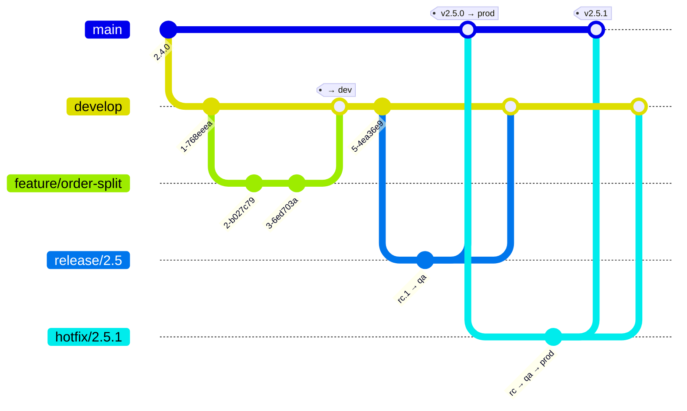

# Developer Guide — Branching, Versioning, Build and Rollback

**Companion to `archetype-model.md` and `terramate-outputs-sharing-architecture.md`**

> **Start with `platform-overview.md`** for a diagram-led map of the document set.
>
> **Risks** live in `risk-register.md`. **Settled decisions** live in `CLAUDE.md`.

| | |
|---|---|
| **Audience** | Application developers. Not the platform team |
| **Scope** | How an application is laid out, branched, versioned, built, deployed and — where possible — rolled back |
| **Out of scope** | Everything below layer 4. You do not write OpenTofu; the archetype does |
| **Relationship to the other documents** | `archetype-model.md` specifies *what may be composed with what*. This one specifies *what you do in your own repository* so the composition works |
| **Runs** | Every pull request, every merge, every tag. Fails closed |

**Three things you must be able to answer after reading this.** If you cannot, the guide has failed and that is a bug worth filing:

1. **Which branch deploys where** — §3.
2. **Which version bump your change requires** — §4.2.
3. **What you can and cannot roll back** — §6.

---

## Table of contents

1. [Repository model](#1-repository-model)
2. [The manifest is the only spec file](#2-the-manifest-is-the-only-spec-file)
3. [Branches and environments](#3-branches-and-environments)
4. [Versioning](#4-versioning)
5. [Change detection and re-tagging](#5-change-detection-and-re-tagging)
6. [Rollback](#6-rollback)
7. [Migrations](#7-migrations)
8. [Java](#8-java)
9. [Python](#9-python)
10. [Node and the React frontend](#10-node-and-the-react-frontend)
11. [Probes, resources and the shared-environment budget](#11-probes-resources-and-the-shared-environment-budget)
12. [Settled decisions — do not reopen](#12-settled-decisions--do-not-reopen)
13. [Open questions](#13-open-questions)

---

## 1. Repository model

**One repository per application. Every service of that application lives in it.** One `manifest.yaml` at the root, one archetype, one stack per service.

```
orders-app/
├── manifest.yaml                 ← the archetype. THE source of truth
├── services/
│   ├── api/                      ← stack: api        (Java)
│   ├── worker/                   ← stack: worker     (Python)
│   ├── migrations/               ← stack: migrations (Python + Alembic)
│   └── web/                      ← stack: web        (React, condition: "hasFrontend")
├── libs/
│   └── common/                   ← shared code. Changing it rebuilds every dependent service
├── charts/                       ← Helm values overlays only. The charts come from the platform
└── .github/workflows/
```

| Decision | Rationale |
|---|---|
| **Monorepo per application, not per service** | One version, one pull request, one CI run for a change that crosses two services. A cross-service contract change split across two repositories cannot be reviewed, tested or rolled back as one unit |
| **Not a monorepo per organisation** | Change detection, CODEOWNERS and release cadence all become the platform team's problem instead of yours. The application boundary is the ownership boundary |
| **One archetype per application** | The archetype is the deployable unit. Its `requires` closure is resolved once (`archetype-model.md` §12), not once per service |
| **One stack per service** | `stacks[].after` gives you deployment ordering for free, and it is the same mechanism the platform uses. See `archetype-model.md` §5.1 |
| **Frontend is a stack like any other** | `condition: "hasFrontend"` (§2). An application without a UI generates no `web` stack and claims no hostname |

`libs/` is not free. Every service that lists it in `build.deps` is rebuilt when it changes — see §5. If that is rebuilding all six services on every commit, the library is too coarse.

---

## 2. The manifest is the only spec file

Build and deploy specs are an **extension of `manifest.yaml`**, never new files.

> A parallel `build.yaml` / `deploy.yaml` creates a third place to declare the same dependency, and the three drift. The manifest is already read by the resolver **and** by Terramate via `tm_yamldecode(tm_file("manifest.yaml"))`. Adding a second file means adding a second reader, a second schema, a second CI gate and a second thing to forget to update.

```yaml
apiVersion: archetype/v1
kind: Archetype

metadata:
  name: orders-app
  version: 2.4.0                 # GENERATED. Do not edit — see §4.1
  layer: 5
  kind: catalog
  owners: [team-orders]

runtimes: [gke, eks, aks]

requires:
  - capability: cluster
    version: "^2.0.0"
  - capability: ingress
    version: "^3.0.0"
    traits: [gateway-api, http-route]
  - capability: database-platform
    version: "^1.0.0"
    optional: true

frontend:                        # presence makes hasFrontend true
  routes: [/, /orders, /orders/*]

stacks:
  - name: api
    build:
      language: java             # enum from registry/languages.yaml
      context: services/api
      deps: [libs/common]
    deploy:
      chart: service
      port: 8080

  - name: worker
    after: [api]
    build:
      language: python
      context: services/worker
      deps: [libs/common]
    deploy:
      chart: worker

  - name: migrations
    build:
      language: python
      context: services/migrations
    deploy:
      chart: job
      phase: pre-deploy          # §7 — runs before the app stacks, as its own step

  - name: web
    condition: "hasFrontend"
    after: [api]
    build:
      language: node
      variant: spa
      context: services/web
    deploy:
      chart: spa

capacity:
  cpu_millicores: 4000
  memory_mib: 8192
  db_connections: 25
  ingress_routes: 3
  workload_identities: 2
```

| Addition | Where it lands |
|---|---|
| `frontend` | New top-level block. Its presence is what `hasFrontend` evaluates |
| `stacks[].build` | `language`, `variant`, `context`, `dockerfile`, `deps` |
| `stacks[].deploy` | `chart`, `port`, `phase`, `probes` overrides |
| `hasFrontend` | New predicate in the `condition:` vocabulary, alongside `resolved(<capability>)` |

**`archetype-manifest.schema.json` sets `additionalProperties: false`,** so these blocks do not validate until the schema is extended. The schema is **generated from `registry/`** (`CLAUDE.md`, "The registry is load-bearing") — so `language` becomes `registry/languages.yaml` and a typo like `java17` fails at schema validation in seconds rather than at `docker build` in minutes. Do not hand-edit the enum; that is the failure mode behind risk R34.

---

## 3. Branches and environments

GitFlow. The branch decides the environment; nothing else does. There is no "deploy this branch to prod" button.



| Branch | Environment | Trigger | Approval | Image tag | Built or promoted |
|---|---|---|---|---|---|
| `feature/*` | **none** | PR opened or pushed | — | `pr-<n>.g<sha>` | built, scanned, pushed, **not deployed** |
| `develop` | `dev` | merge | none — automatic | `2.5.0-dev.<n>.g<sha>` | built |
| `release/x.y` | `qa` | merge or push | none — automatic | `2.5.0-rc.<n>` | built |
| `main` | `prod` | tag `vX.Y.Z` | **manual** — GitHub Environment `production`, required reviewers | `2.5.0` | **promoted.** Re-tag of the rc digest. Never rebuilt |
| `hotfix/*` | `qa` → `prod` | branch from `main` | manual for prod, same gate, expedited queue | `2.5.1-rc.<n>` → `2.5.1` | built, then promoted |

Four consequences worth stating plainly:

- **A feature branch gets no environment.** It gets a full PR preview — build, unit tests, image scan, `archetypectl resolve --dry-run`, `tofu preview` with mocks on (architecture §14.1) — but nothing is applied. If you need a running environment, request an `ephemeral-*` one explicitly; it is a claim against the ephemeral supernet (`archetype-model.md` §9.2) and it is destroyed on PR close.
- **`prod` deploys the digest `qa` already ran.** The promotion gate refuses a digest with no recorded successful `qa` deployment. That is what makes "promoted, not rebuilt" checkable rather than aspirational — see §5.
- **`hotfix/*` is the fast path, not a different path.** It skips `develop` and the release branch; it does not skip `qa`, the image scan, or the production approval. What it buys is ordering: it goes to the front of the queue and does not wait for whatever is in flight on `develop`.
- **A hotfix that is not merged back is lost.** `hotfix/*` merges to `main` **and** to `develop` (and to the open `release/x.y` if one exists). A CI gate blocks the merge to `main` until the back-merge PR to `develop` exists — because the alternative is the fix silently disappearing at the next release, and being rediscovered in production as a regression nobody can explain.

---

## 4. Versioning

**One version for the application, not one per service.** `metadata.version` is the version of the whole archetype. A change to one service bumps the application.

> The alternative — a version per service — sounds more precise and is worse. It makes "which versions of these six services were running together on Tuesday" a question you cannot answer from a tag, and it removes the only thing a rollback can target: a set of digests known to work together.

### 4.1 The version is the Git tag

| | |
|---|---|
| **Source of truth** | The annotated Git tag `vX.Y.Z` on `main` |
| **`metadata.version`** | **Generated** by the pipeline from the tag. Committed, so the manifest is self-contained and Terramate can read it, but not authored |
| **CI gate** | `archetypectl version --check` recomputes the version from the ref and fails if `metadata.version` differs |

The gate exists for the same reason G0 (`terramate generate --check`) exists: the value is committed, so somebody will edit it. When they do, three things silently disagree — the image tag, the CMDB record, and the mandatory `app.kubernetes.io/version` label from `registry/labels.yaml`, which Gatekeeper validates at admission. The deployment is then rejected in the cluster, which is the worst place to find out.

Pre-release versions, per branch:

| Branch | Version | Image tag |
|---|---|---|
| `feature/*` | — | `pr-412.g1a2b3c4` |
| `develop` | `2.5.0-dev.17+g1a2b3c4` | `2.5.0-dev.17.g1a2b3c4` |
| `release/2.5` | `2.5.0-rc.3` | `2.5.0-rc.3` |
| `main` @ `v2.5.0` | `2.5.0` | `2.5.0` |

**`+` is legal in semver and illegal in an OCI tag.** The tag charset is `[a-zA-Z0-9_][a-zA-Z0-9._-]{0,127}`. The pipeline replaces `+` with `.` when deriving the image tag; do not do it by hand and do not be surprised that the two strings differ by one character.

### 4.2 Which bump

| Change | Bump | Why |
|---|---|---|
| Endpoint or field removed, or its semantics changed | **MAJOR** | consumers break |
| Change to a capability this archetype `provides` | **MAJOR** | the output contract is the thing others depend on (risk R6) |
| **Irreversible migration** — `DROP COLUMN`, `DROP TABLE`, `NOT NULL` on an existing column, a narrowing type change | **MAJOR** — *even when the code diff is one line* | see below |
| Endpoint or optional field added, backwards compatible | MINOR | |
| Expand-phase migration — nullable column, new table, `CREATE INDEX CONCURRENTLY` | MINOR | reversible; nothing reads it yet |
| New service (new stack) added to the application | MINOR | |
| New `requires` entry, or a widened version range | MINOR | resolution changes; the closure is bigger |
| Bug fix with no contract change | PATCH | |
| Dependency bump with no behaviour change | PATCH | |
| Resource or replica change in `capacity` | PATCH | but see §11 — an increase in a shared environment needs platform review |
| Docs, tests, CI config only | **no release** | |

> **An irreversible migration is MAJOR even if the code diff is one line.**
>
> The size of the diff is not the measure; the size of what you cannot undo is. `ALTER TABLE orders DROP COLUMN legacy_ref;` is eighteen characters of SQL and it permanently removes the ability to run any earlier version of the application against that database. After it runs, every `2.x` image is unrunnable — not degraded, unrunnable. MAJOR is the only place in the version string where that is visible to someone deciding whether to roll back at 03:00.
>
> This is the single rule in this document most often argued with, and it is not negotiable. If the argument is "but it is a tiny change", you have just described the reason the rule exists.

The bump is computed by the pipeline from the migration files and the API diff where it can be, and asserted against the label on the pull request. It is not guessed.

---

## 5. Change detection and re-tagging

Only changed services are rebuilt. That is worth real minutes and it has one failure mode that has to be designed out.

### 5.1 What triggers a rebuild

| Changed path | Rebuilds |
|---|---|
| `services/api/**` | `api` |
| `libs/common/**` | every stack listing `libs/common` in `build.deps` |
| `manifest.yaml`, root lockfile, base Dockerfile | **all** |
| `charts/**` | nothing — redeploys only |
| `docs/**`, `README.md`, `.github/ISSUE_TEMPLATE/**` | nothing |

Detection is `git diff --name-only <merge-base>..<head>` mapped onto `build.context` and `build.deps`. A path that matches no rule rebuilds everything — failing safe is cheaper than a stale image nobody notices.

### 5.2 The re-tagging rule

> **Every service in the application carries the application's version tag after every release, whether or not it was rebuilt.**

Without this rule, a release where only `api` changed produces `api:2.5.0` while `worker` and `web` are still on `2.4.0`. Nothing is broken and everything is now wrong: `kubectl get deploy` shows three different versions for one application, the CMDB records a version that exists for one service, and "roll back to 2.4.0" has no single meaning. A release must not leave any service on an old tag.

The mechanism has two parts:

**A release lockfile.** The pipeline writes `release.lock.json` on every release — service → digest — and commits it alongside the tag:

```json
{
  "version": "2.5.0",
  "services": {
    "api":        "sha256:9f2c…",
    "worker":     "sha256:41ab…",
    "migrations": "sha256:41ab…",
    "web":        "sha256:7d30…"
  }
}
```

For a service that was not rebuilt, the digest is copied from the previous version's lockfile. There is no lookup against the registry and no "latest" anywhere.

**A registry-side re-tag, not a rebuild:**

```bash
docker buildx imagetools create -t registry/orders-worker:2.5.0 registry/orders-worker@sha256:41ab…
```

| Property | Value |
|---|---|
| Time | 200–500 ms per service — a manifest copy inside the registry |
| Bytes transferred | zero. No layer is pulled or pushed |
| Digest | **unchanged**, so the cosign signature, the SBOM and the provenance attestation still verify |
| Alternative (rebuild) | 2–6 min per service, **and a different digest** — which silently breaks the promise that prod runs what qa ran |

**Deploy by digest, never by tag.** The tag is a human-facing alias and it is mutable; the digest is the identity. The rendered Helm values carry `image: registry/orders-api@sha256:9f2c…`. This is also what makes the promotion gate in §3 enforceable: prod refuses a digest that `release.lock.json` does not show as successfully deployed to `qa`.

---

## 6. Rollback

Read this section before you need it. Four mechanisms, and they are not interchangeable.

| Mechanism | Time | Reversible | Blast radius | Use it |
|---|---|---|---|---|
| **Redeploy a previous image digest** | 30–90 s | yes | the service | **Always first.** This is the rollback |
| **`helm rollback`** | 1–5 min | usually | the whole release: config, RBAC, CRs, probes, PVC claims | When the chart or values changed, not just the image |
| **`tofu apply` of an earlier commit** | 10–40 min | **no** | **can destroy infrastructure** | Never as an incident response |
| **Database migration** | — | **no** | the data | **There is no migration rollback.** §7 |

### 6.1 Redeploying a previous digest is cheap

It is a `spec.template.spec.containers[].image` change and a rolling update. The digest comes from the previous `release.lock.json`, so "roll back to 2.4.0" is exact and complete — every service goes back, together, to bytes that were tested together.

The one precondition: **2.4.0's code must still be able to run against the current database.** That is what §7 exists to guarantee, and it is the only thing that can take this option away from you.

### 6.2 `helm rollback` is harder than it looks

It restores the previous release manifest, which is more than the image. Three things it does not do cleanly:

- **Hooks re-run.** A `pre-upgrade` hook — a migration Job, say — runs again on the rollback. This is the main reason §7 keeps migrations out of Helm hooks entirely.
- **CRDs are not rolled back.** Helm does not manage CRD upgrades; a rollback leaves the new CRD version in place while installing charts that expect the old one.
- **Immutable fields fail mid-rollback.** A changed `Deployment.spec.selector` or a resized PVC cannot be reverted in place. The rollback fails partway and you are now in a third state that is neither version.

If the only thing that changed is the image, do not use `helm rollback` — use §6.1.

### 6.3 A `tofu apply` of an earlier commit can destroy resources

This is the one that surprises people, so be concrete:

| Revert | What OpenTofu plans |
|---|---|
| A commit that **added** a resource | `destroy` |
| A commit that changed a **name** or any `ForceNew` attribute | `destroy` **then** `create` — a new resource, a new identity, a new IP |
| A commit that raised a node pool's disk size | replacement of the node pool on several providers |
| A commit that enabled `deletion_protection` | removes the protection, then whatever the next plan wants |

There is no "undo" in the infrastructure layer. **Roll forward.** Write the change that restores the desired state, put it through the normal gates, and read the plan. If a plan in an incident shows `destroy` on anything you did not intend to destroy, stop and escalate to the platform team — that plan is the last checkpoint before the damage.

### 6.4 The sentence someone will ignore

> **Reverting a merge does not undo a migration.**

Reverting the merge reverts *code*. The database is still on the new schema. What you have now deployed is an old application that expects the old schema, against a database that no longer has it — so instead of one broken release you have a broken release *and* a broken rollback path, and the incident gets longer.

If a migration has run, your options are §7's, not Git's. Reverting the merge is a legitimate way to stop further deployments of bad code. It is not a way to undo a schema change, and it never will be.

---

## 7. Migrations

**Migrations are separated from deployment.** They are their own stack (`phase: pre-deploy`) and their own pipeline step, with their own approval in `prod`.

| Where a migration must not run | Why |
|---|---|
| The application entrypoint | N replicas race. Alembic takes no cross-backend advisory lock by default |
| An `initContainer` | Runs once per pod, so the same race, plus on every restart and every scale-up |
| A Helm `pre-upgrade` hook | Re-runs on `helm rollback` (§6.2), and a failed hook leaves the release in a state neither Helm nor you can describe |

It runs as a `Job` in its own pipeline step, before the application stacks deploy. That ordering only works because of the next rule.

### 7.1 Expand–contract

Every schema change is split across releases so that **at every point, the currently deployed code and the previous release's code both work against the current schema.** That is the property that keeps §6.1 available.

| Release | Migration | Code | Can you roll back? |
|---|---|---|---|
| **N — expand** | Add the nullable column / table / index. Backfill in batches | Writes old **and** new. Reads old | **Yes.** Nothing reads the new column |
| **N+1 — migrate** | none | Reads new. Still writes both | **Yes.** N's code still finds what it needs |
| **N+2 — contract** | `DROP` the old column | Reads and writes new only | **No.** This is the MAJOR bump from §4.2 |

Two rules on top of the table:

- **Contract is never in the same release as the code that stopped writing the old column.** At minimum one full release in between, and not before the production rollback window — **14 days** — has passed on N+1. If you contract on Tuesday and need to roll back to N on Wednesday, you cannot.
- **Backfill in batches with a bounded statement time.** A single `UPDATE` over a large table takes a lock for its whole duration; the migration Job's timeout then kills it mid-transaction and the retry starts from zero. Batch by primary key, commit per batch, make the job resumable and idempotent.

### 7.2 Alembic specifics

| Rule | Why |
|---|---|
| Review every autogenerated migration by hand | `--autogenerate` misses server defaults, constraint renames, and several type changes. It also happily emits a `DROP` for a table it does not know about |
| One head. A merge that produces two heads is a broken build | `alembic heads` in CI, failing on more than one |
| `down_revision` existing ≠ the migration being reversible | A `downgrade()` that drops a column restores the schema and not the data. Do not let its presence in the file imply a rollback exists |
| Take an advisory lock at the start of the migration | `SELECT pg_advisory_lock(...)` on PostgreSQL. Cheap insurance against a second Job being started by a retry |

---

## 8. Java

### 8.1 Lockfile

Maven and Gradle resolve dependencies fresh on every build. Without a lock, two builds of the same commit three weeks apart produce different bytes — which makes §5's digest promise meaningless.

| Build tool | Lock | Gate |
|---|---|---|
| **Gradle** | `dependencyLocking { lockAllConfigurations() }` → `gradle.lockfile` committed | `./gradlew dependencies --write-locks && git diff --exit-code` |
| **Gradle, checksums too** | `./gradlew --write-verification-metadata sha256` → `verification-metadata.xml` | committed; any mismatch fails the build |
| **Maven** | `maven-lockfile` → `lockfile.json` committed | regenerate and `git diff --exit-code` |
| **Maven, minimum** | `maven-enforcer` with `banDynamicVersions` and `requireReleaseDeps` | fails on any range or `-SNAPSHOT` |

The gate is the same shape as G0 in the platform pipeline, for the same reason: the file is committed, so without a gate it goes stale and nobody notices until a transitive dependency changes under you.

### 8.2 Startup is slow, and the probes must know it

A Spring Boot service needs **20–45 s** to first ready on a 1-core request; more with a large context or Hibernate schema validation. The default probe shapes are written for something that starts in two seconds.

| Probe | Setting | Value | Why |
|---|---|---|---|
| `startupProbe` | `periodSeconds` × `failureThreshold` | 5 × 30 = **150 s budget** | Covers the slowest cold start, including a node under CPU pressure |
| `livenessProbe` | `periodSeconds` / `failureThreshold` / `timeoutSeconds` | 10 / 3 / 2 | Only starts after the startup probe passes. Detects a genuine hang in ≤30 s |
| `readinessProbe` | `periodSeconds` / `failureThreshold` | 5 / 2 | Out of the Service endpoints within 10 s of going unhealthy |
| `terminationGracePeriodSeconds` | | 45 | Longer than the longest in-flight request |
| `preStop` | `sleep` | 5 | Endpoint removal is asynchronous; without it you 502 requests that were routed just before the pod stopped |

**Use a `startupProbe`, not `livenessProbe.initialDelaySeconds`.** With `initialDelaySeconds: 30` on a service that takes 45 s, the liveness probe kills the pod at 30 s, the restart is slower because the node is now busier, and you get a `CrashLoopBackOff` that looks exactly like an application bug. Setting the delay to 180 s instead "fixes" it and leaves you three minutes blind to a real hang. The startup probe exists precisely so you do not have to trade one against the other.

**Startup is CPU-bound.** With `requests.cpu: 100m` the JVM is throttled during class loading and takes 4–5× longer. Request **≥ 500m** for a Java service; the pod gives it back once warm.

### 8.3 `-XX:MaxRAMPercentage`, with numbers

```
-XX:MaxRAMPercentage=75.0 -XX:InitialRAMPercentage=75.0 \
-XX:MaxMetaspaceSize=256m -XX:+UseG1GC -XX:+ExitOnOutOfMemoryError
```

| `resources.limits.memory` | `MaxRAMPercentage` | Max heap | Left for non-heap |
|---|---|---|---|
| 1024 MiB | 75.0 | 768 MiB | 256 MiB |
| 2048 MiB | 75.0 | 1536 MiB | 512 MiB |
| 4096 MiB | 80.0 | 3276 MiB | 820 MiB |
| 8192 MiB | 80.0 | 6553 MiB | 1639 MiB |

Non-heap is metaspace (128–256 MiB), code cache (64–240 MiB), thread stacks (1 MiB each — 200 threads is 200 MiB), direct byte buffers and GC structures. It is **not** optional and it is not counted in `-Xmx`.

Three ways this kills a pod, all of them with **exit code 137, `OOMKilled` in `kubectl describe pod`, and nothing whatsoever in the application log** — the kernel sends `SIGKILL`; the JVM gets no chance to write anything:

| Failure | What happens |
|---|---|
| **Old JVM on a cgroups v2 node** — JDK 8 before 8u372, JDK 11 before 11.0.16, anything before 15 | `UseContainerSupport` silently falls back to the **host's** memory. On a 64 GiB node the JVM sizes a 16 GiB heap inside a 2 GiB pod. It does not fail at startup; it fails the first time the heap grows |
| **No flag, modern JVM** | Default `MaxRAMPercentage` is **25%** — 512 MiB of heap in a 2 GiB pod. Not a crash, just 75% of the memory you are paying for going unused until traffic pushes GC into a death spiral |
| **`-Xmx` set to the full limit** | The "fix" that looks right. `-Xmx2g` in a 2 GiB pod leaves zero for the 250–400 MiB of non-heap, and RSS crosses the limit under load |

Two more that are not memory but look like it:

- **`limits.cpu: 1`** makes the JVM see one processor, and its ergonomics then select **SerialGC** (the heuristic is fewer than 2 CPUs or less than 1792 MB). Long stop-the-world pauses that look like a network problem. Set `-XX:+UseG1GC` explicitly.
- **Set `requests.memory == limits.memory`** for JVM pods. The JVM sizes itself from the limit; if the request is lower the scheduler oversubscribes the node and the pod is evicted under pressure through a completely different mechanism.

---

## 9. Python

### 9.1 `uv.lock` is mandatory

| Rule | Command |
|---|---|
| `uv.lock` is committed | — |
| CI fails if the lock is stale | `uv lock --check` |
| The image installs from the lock, never resolves | `uv sync --frozen --no-dev` |

`--frozen` installs exactly what the lock says and does not re-resolve. Combined with the `uv lock --check` gate, a build cannot silently pick up a version that was never reviewed. `pip install -r requirements.txt` without hashes is not an acceptable substitute — it resolves transitive dependencies at build time, which is the thing being prevented.

### 9.2 Multi-stage image

```dockerfile
FROM ghcr.io/astral-sh/uv:python3.12-bookworm-slim AS build
ENV UV_COMPILE_BYTECODE=1 UV_LINK_MODE=copy UV_PYTHON_DOWNLOADS=never
WORKDIR /app
COPY pyproject.toml uv.lock ./
RUN --mount=type=cache,target=/root/.cache/uv uv sync --frozen --no-dev --no-install-project
COPY . .
RUN --mount=type=cache,target=/root/.cache/uv uv sync --frozen --no-dev

FROM python:3.12-slim
COPY --from=build --chown=1000:1000 /app /app
ENV PATH="/app/.venv/bin:$PATH"
USER 1000
CMD ["uvicorn", "app.main:app", "--host", "0.0.0.0", "--port", "8080"]
```

| | Single stage | Multi-stage |
|---|---|---|
| Image size | ~1.1 GB | **~180 MB** |
| Contains a compiler toolchain | yes — every `gcc` CVE is yours | no |
| Pull time on a cold node | 25–40 s | 4–7 s |

Copying `pyproject.toml` and `uv.lock` before the source is what makes the dependency layer cacheable: a source-only change reinstalls nothing. `UV_COMPILE_BYTECODE=1` pre-compiles `.pyc` at build time, which removes a few hundred milliseconds from the first request of each worker.

### 9.3 Alembic

Migrations are Alembic, and they follow §7 without exception. The `migrations` stack builds from the same lock as the service that owns the schema, so the migration runs against exactly the SQLAlchemy models the application will use.

Python services start in **2–5 s**, so `startupProbe` at 5 × 12 = 60 s is generous and `livenessProbe` at 10 / 3 is fine.

---

## 10. Node and the React frontend

The frontend is **served by nginx inside the cluster, behind the same Gateway as the API**. Not a bucket, not a CDN origin of its own — see §12 for why.

Same hostname, path-based routing on the `HTTPRoute`: `/api/*` to the API service, everything else to the `web` service. One hostname means no CORS, no preflight, and one certificate.

Build stage is Node, runtime stage is nginx:

```dockerfile
FROM node:22-slim AS build
WORKDIR /app
COPY package.json package-lock.json ./
RUN npm ci                                   # ci, not install: fails on a stale lock
COPY . .
RUN npm run build                            # → /app/dist

FROM nginxinc/nginx-unprivileged:1.27-alpine
COPY --from=build /app/dist /usr/share/nginx/html
COPY nginx.conf /etc/nginx/conf.d/default.conf
COPY docker-entrypoint.d/10-env.sh /docker-entrypoint.d/10-env.sh
```

Build stage ~1.2 GB, runtime image ~55 MB.

### 10.1 Four details, all discovered on the first deployment

| # | Detail | Symptom if missing | Blocks the deployment? |
|---|---|---|---|
| 1 | `nginxinc/nginx-unprivileged` | Pod rejected at admission, or `CrashLoopBackOff` on a read-only filesystem | **Yes, completely** |
| 2 | Runtime config via `env.js` | Works in dev, then the qa image cannot be promoted to prod | **Yes, completely** — the promotion is what breaks |
| 3 | Asymmetric `Cache-Control` | Users see the previous bundle after a deploy; chunk 404s and a white screen | No — it deploys, and appears not to have |
| 4 | `try_files $uri /index.html` | Any client route 404s on reload or on a shared link | No — it deploys, and is broken for everyone who did not enter through `/` |

The two that block are worth failing on early. The two that do not block are worse, because the deployment reports success.

### 10.2 The image must be `nginx-unprivileged`

Stock `nginx` starts as **root** and binds **port 80**. Both are incompatible with what the platform enforces:

| Requirement | Where it comes from | What stock nginx does |
|---|---|---|
| `runAsNonRoot: true` | PSS `restricted`, enforced by the namespace label `pod-security.kubernetes.io/enforce` in `registry/labels.yaml` | runs as root — pod **rejected at admission** |
| Ports ≥ 1024 without `NET_BIND_SERVICE` | PSS `restricted` drops all capabilities | binds 80 — fails |
| `readOnlyRootFilesystem: true` | platform baseline | writes `/var/run/nginx.pid`, `/var/cache/nginx/*` — fails at startup |

`nginxinc/nginx-unprivileged` runs as uid **101** and listens on **8080**. It still needs writable scratch space, so mount `emptyDir` at `/var/cache/nginx` and `/tmp`:

```yaml
securityContext:
  runAsNonRoot: true
  runAsUser: 101
  allowPrivilegeEscalation: false
  readOnlyRootFilesystem: true
  capabilities: { drop: ["ALL"] }
  seccompProfile: { type: RuntimeDefault }
volumeMounts:
  - { name: cache,  mountPath: /var/cache/nginx }
  - { name: tmp,    mountPath: /tmp }
  - { name: envcfg, mountPath: /usr/share/nginx/html/config }
volumes:
  - { name: cache,  emptyDir: {} }
  - { name: tmp,    emptyDir: {} }
  - { name: envcfg, emptyDir: {} }
```

### 10.3 Configuration at startup, not at build

**The wrong way, and it is the way every tutorial shows:**

```bash
VITE_API_URL=https://api.qa.acme.com npm run build
```

Vite substitutes `import.meta.env.VITE_API_URL` as a **string literal at build time**. The URL is baked into the bundle. That produces **one image per environment**, and it breaks promotion: the artefact you tested in `qa` is not the artefact you deploy to `prod` — it is a different build, from the same source, with different bytes and a different digest. Every guarantee in §5 evaporates, and the first time it costs you something will be a prod-only bug that qa cannot reproduce because qa never ran that image.

**The right way** — one image, configured when the container starts. The entrypoint script writes `env.js` into the mounted `emptyDir`:

```bash
#!/bin/sh
# /docker-entrypoint.d/10-env.sh — runs before nginx starts
set -eu
cat > /usr/share/nginx/html/config/env.js <<EOF
window.__ENV__ = {
  API_URL:     "${API_URL}",
  ENVIRONMENT: "${ENVIRONMENT}",
  SENTRY_DSN:  "${SENTRY_DSN:-}"
};
EOF
```

```html
<!-- index.html, BEFORE the bundle -->
<script src="/config/env.js"></script>
<script type="module" src="/assets/index-a3f9c1.js"></script>
```

```js
// one accessor, so a missing key fails loudly in one place
export const env = window.__ENV__ ?? {};
```

Three rules that go with it:

- **`env.js` is served with `Cache-Control: no-store`.** It is as unhashed as `index.html` and changes per environment.
- **Nothing secret goes in it.** It is delivered to the browser. API URLs, feature flags, a public Sentry DSN — yes. Anything with authority — no, ever.
- **The values come from the deploy stack**, which gets them from the resolved globals, so `API_URL` in `prod` is not something a developer typed.

### 10.4 `Cache-Control`, asymmetric

```nginx
location = /index.html {
    add_header Cache-Control "no-store, must-revalidate";
}
location = /config/env.js {
    add_header Cache-Control "no-store, must-revalidate";
}
location /assets/ {
    add_header Cache-Control "public, max-age=31536000, immutable";
    try_files $uri =404;
}
```

| File | Hashed filename | `Cache-Control` | Because |
|---|---|---|---|
| `index.html` | **no** | `no-store, must-revalidate` | It is the only unhashed entry point. It is the thing that names which bundle to load |
| `/assets/*-<hash>.js`, `.css` | **yes** | `public, max-age=31536000, immutable` | The name changes when the content changes, so it can be cached for a year. `immutable` also stops the revalidation request on reload |
| `/config/env.js` | no | `no-store, must-revalidate` | §10.3 |

**If `index.html` is cached, the deployment looks like it did not work.** Users hold the old `index.html`, which names the old asset filenames, so they keep running the previous bundle — for five minutes, or an hour, or until they hard-refresh, depending on whose cache. You will be told the deploy failed. It did not; it succeeded and is invisible.

It gets worse than invisible. The old `index.html` references `/assets/index-a3f9c1.js`, which exists only in the *previous image* — the new pod has never heard of it. The request 404s, nginx serves the 404 body, and the browser reports `Unexpected token '<'` or a `ChunkLoadError`: a blank white page and a stack trace that points at nothing. `try_files $uri =404` under `/assets/` at least makes it an honest 404 instead of an HTML document pretending to be JavaScript.

### 10.5 `try_files` for client-side routes

```nginx
location / {
    try_files $uri $uri/ /index.html;
}
```

React Router routes are not files. `/orders/42` exists only after the bundle has loaded and taken over the URL. When a user reloads that page, or opens a link someone sent them, nginx looks for a file called `orders/42`, does not find it, and returns 404 — the application never gets a chance to run.

`try_files $uri $uri/ /index.html` serves `index.html` for anything that is not a real file, the bundle boots, and the router reads the URL. The entry path stops mattering.

**Keep it out of `/assets/`.** That is what the `try_files $uri =404;` in §10.4 is for: inside `/assets/`, a missing file must 404. If the catch-all applies there, a missing chunk returns `index.html` with `Content-Type: text/html`, the browser tries to parse HTML as a module, and you get the `Unexpected token '<'` above — the same symptom from a different cause, and a genuinely slow thing to debug.

### 10.6 Node build hygiene

| Rule | Why |
|---|---|
| `npm ci`, never `npm install` | `ci` fails on a lock out of sync with `package.json`. `install` quietly rewrites it |
| `package-lock.json` (or `pnpm-lock.yaml`) committed | Same reason as §8.1 and §9.1 |
| The Node stage never reaches the runtime image | It is a build tool. Shipping it ships a 1.2 GB attack surface to serve static files |
| nginx probes | Ready in <1 s. `readinessProbe` 5 / 2, no `startupProbe` needed |

---

## 11. Probes, resources and the shared-environment budget

| | Java | Python | nginx / SPA |
|---|---|---|---|
| Time to first ready | 20–45 s | 2–5 s | <1 s |
| `startupProbe` budget | 5 × 30 = 150 s | 5 × 12 = 60 s | not needed |
| `livenessProbe` | 10 / 3 / 2 | 10 / 3 / 2 | 10 / 3 / 2 |
| `readinessProbe` | 5 / 2 | 5 / 2 | 5 / 2 |
| `requests.cpu` | ≥ 500m | 100–250m | 10–50m |
| `requests.memory` == `limits.memory` | **required** | recommended | 32–64 MiB |

Your `capacity` block is a **budget draw against the environment**, not a request that is always granted (`archetype-model.md` §8.2). The resolver sums every active tenant's draw and fails the pull request when the environment's total is exceeded — with a diagnostic naming who is holding what.

**Raising `capacity` in a shared environment requires platform review.** It is settled, and it is not a comment on your judgement: in a shared environment the memory you add is memory another tenant no longer has, and the resolver is the only thing that can see the whole picture. The pull request comment shows the capacity delta; a positive delta against a shared environment adds the platform team as a required reviewer. In a dedicated environment it is yours.

---

## 12. Settled decisions — do not reopen

These were decided with reasons. Bring new evidence or leave them alone.

| Decision | Rationale |
|---|---|
| **Monorepo per application** | One version, one pull request, one CI run for a change crossing two services. §1 |
| **The image is promoted between environments, never rebuilt** | A rebuild produces a different digest, and then "prod runs what qa tested" is a claim nobody can check. Promotion is a registry-side re-tag: 200–500 ms, zero bytes, same digest, signatures still valid. §5.2 |
| **The frontend is nginx in the cluster, not a bucket + CDN** | Same Gateway, same hostname, same certificate, same `HTTPRoute` mechanism, same OIDC `SecurityPolicy`, same network policy, same observability. A bucket needs a second edge path, a second identity model and a second invalidation story — for an artefact that is already sitting in an image the cluster has pulled. Revisit when the traffic profile actually justifies it, not before |
| **Platform review to raise `capacity` in a shared environment** | The resolver is the only component that sees every tenant's draw. §11 |
| **Build and deploy specs extend `manifest.yaml`** | A parallel spec file is a third place to declare the same dependency, and it drifts. §2 |
| **One version per application, not per service** | Otherwise "what was running together on Tuesday" has no answer, and a rollback has no target. §4 |
| **Deploy by digest, tag by version** | The tag is mutable, the digest is not. §5.2 |

---

## 13. Open questions

To settle in the proof of concept, not by assumption:

1. **Does `archetypectl new-app` scaffold, or does a template repository?** Scaffolding is what stops teams copy-pasting from another application and inheriting its mistakes — including every one in §10. Until it exists, this document is the only thing standing between a new team and those four nginx details.
2. **Where does the version bump get computed?** The migration-file and API-diff heuristics of §4.2 cover most cases. What the pipeline does with a change it cannot classify — fail, or default to MINOR and require a label — is not decided.
3. **Ephemeral environment per feature branch: opt-in or automatic?** Automatic is friendlier and draws against the ephemeral supernet on every open pull request. Measure the claim rate on a real sprint before choosing.
4. **Backfill throughput.** §7.1 says "batches" without a number, because the right batch size depends on the table and the backend. Establish a default from the first real migration.
5. **Does the promotion gate live in the pipeline or in the resolver?** Refusing a digest that `qa` never ran is a policy question, which argues for conftest over a shell step in the workflow.
