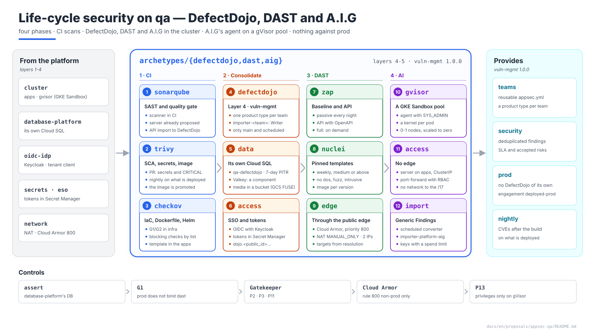

# Software and AI life-cycle security on `qa` — DefectDojo, DAST and A.I.G

| | |
|---|---|
| **Status** | Proposal · revision 2 · A.I.G in the cluster: agent on a gVisor `gvisor` pool, server on `apps` (§5, DA8); revision 1: A.I.G on an isolated VM |
| **Scope** | The four analysis phases the life cycle asks for — code (SonarQube), dependencies (Trivy), infrastructure and containers (Checkov, Trivy), runtime (OWASP ZAP, Nuclei, A.I.G) — and their consolidation in **DefectDojo**: where each tool runs, when it blocks, how its results reach DefectDojo, and the three new archetypes (`defectdojo`, `dast`, `aig`). Includes the template of the application repositories' reusable workflow |
| **Why now** | SonarQube already has a proposal and Checkov already sits in the infrastructure pipeline's G1/G2 gates, but each tool leaves its results in its own place. Nobody sees an application as a whole, nor what changes between two versions, nor what was accepted as a risk |
| **Basis** | `sonarqube-qa` (S1, S2) and its Cloud SQL variant; `keycloak-qa` §6 (clients as tenant resources); `postgres-cloudsql-qa`; `edge-qa` §3 (Cloud Armor); `network-qa` (Cloud NAT, DW3); `gke-qa` §5 (`system` and `apps` pools, DN11); `gatekeeper-qa`; `cmdb-qa` (observed half); `infra-repo-qa` (workflows); `landing-zone-qa` §6 (image mirroring) |
| **Reference specification** | `archetype-model.md` (AM §n), `terramate-outputs-sharing-architecture.md` (§n), `developer-guide.md` (DG §n) |
| **Diagrams** | `diagrams/*.mmd` (Mermaid source) and `diagrams/*.svg` (rendered). The SVG is regenerated from the `.mmd`; never edited by hand. `diagrams/03-presentation-blocks.svg` (1920×1080, for presentations) is generated by `03-presentation-blocks.py`, not Mermaid |
| **Own identifiers** | Decisions `DA1…`, candidate risks `RA1…`, verifications `VA1…`, questions `QA1…` |

Source: [`diagrams/01-ciclo.mmd`](diagrams/01-ciclo.mmd)

It reopens no decision in `CLAUDE.md`. Taking the requested scheme to `qa` brings up six things the scheme does not say:

1. **The tools do not all run in the same place.** SonarQube (the scanner), Trivy and Checkov run in CI, on every pull request and every merge. The cluster holds **two shared servers**: SonarQube, which already exists, and DefectDojo, which is new. ZAP and Nuclei are scheduled **jobs** in the cluster. A.I.G goes into the cluster too, but not on the usual pools (point 3).
2. **There is no `staging` environment: it is `qa`.** Environment names are normalised (`CLAUDE.md`) and `qa` is the one that mirrors production. DAST runs against `qa` and **never against `prod`**: an active scan creates, changes and deletes data.
3. **A.I.G has no authentication and its agent asks for `SYS_ADMIN` with seccomp disabled** (the project's `docker-compose.images.yml`; the README warns against deploying it on public networks). Neither fits a shared cluster under PSS `restricted`, and the agent also runs third-party code (MCP servers, skills). The agent goes on a **pool of its own with GKE Sandbox (gVisor)**, with its own kernel and scaled to zero; the server, unprivileged, on `apps`, with no edge route and reachable only through `port-forward` (§5).
4. **A DAST that goes through the public edge tests Cloud Armor, not the application.** The OWASP and `scannerdetection` rules block ZAP and Nuclei, and the per-IP limit throttles them. A Cloud Armor rule letting the scanner through is needed, and that requires its egress IP to be fixed (§4.2).
5. **DefectDojo with pull request results is noise.** Every pull request would produce findings closed by the next push. Only what is on `main` and what scheduled scans find goes into DefectDojo; a pull request's results stay in the pull request, as a gate (DA6).
6. **Scanning the image at build time is not enough.** A CVE published after the build shows up in no CI scan: the image is no longer rebuilt, it is promoted (DG §5). A nightly scan of the **deployed digests**, taken from the CMDB, closes that gap (§3.4).

Source: [`diagrams/03-presentation-blocks.py`](diagrams/03-presentation-blocks.py) — presentation view; the detail is in §0–§8.

---

## 0. Context

### 0.1 The four phases, on `qa`

| Phase | Tool | What it finds | Where it runs | When | Blocks? | To DefectDojo |
|---|---|---|---|---|---|---|
| Code | **SonarQube** (SAST) | Bugs, vulnerabilities and hotspots in the code | Scanner in CI; server in the cluster (already proposed) | `push` to `main` (`sonarqube-qa` §4.11) | Quality gate | **SonarQube API Import** parser: DefectDojo reads the server's issues through its API, per project |
| Dependencies | **Trivy** `fs` (SCA and secrets) | CVEs in libraries; secrets in the repository | CI | Pull request and `main` | Pull request: secrets always; `CRITICAL` CVEs with a fix available | **Trivy Scan** (JSON), from `main` only |
| Infra and containers | **Checkov** | Insecure configuration in OpenTofu, Dockerfile, Helm, workflows | CI (G1/G2 in `infra`; the template in applications) | Pull request and `main` | In `infra`, the G1/G2 policy; in applications, the `CHECKOV_BLOCKING_CHECKS` list | **Checkov Scan** (JSON) |
| | **Trivy** `image` | OS and library CVEs in the image | CI at build time; **nightly over what is deployed** | Build; every night | Build: `CRITICAL` with a fix | **Trivy Scan** |
| Runtime (`qa`) | **OWASP ZAP** | Web and API vulnerabilities at runtime (headers, cookies, injections, XSS…) | Jobs in the cluster, `apps` pool | Passive every night; active on demand | No: it reports | **ZAP Scan** (XML) |
| | **Nuclei** | Exposures and known CVEs, by template | Jobs in the cluster | Weekly | No | **Nuclei Scan** (JSONL) |
| | **A.I.G** (AI-Infra-Guard) | CVEs in AI components, risks in MCP servers and skills, model jailbreaks | Cluster: agent on the `gvisor` pool (gVisor), server on `apps` (§5) | On demand, by the security team | No | **Generic Findings Import**, through a converter (there is no A.I.G parser) |
| Consolidation | **DefectDojo** | Deduplicates, tracks each finding's life cycle, accepted risks, SLAs | Cluster, `apps` pool | Always | — | — |

Parsers checked in `dojo/tools/` of the DefectDojo repository on 2026-10-03: `sonarqube`, `trivy`, `checkov`, `zap`, `nuclei`, `generic`, `sarif`. None for A.I.G.

### 0.2 Versions

| Tool | Version | Licence |
|---|---|---|
| DefectDojo | 3.3.300, chart `defectdojo` 1.9.54 | BSD-3-Clause |
| Trivy | 0.75.0 | Apache-2.0 |
| Checkov | 3.3.22 | Apache-2.0 |
| OWASP ZAP | 2.17.0 | Apache-2.0 |
| Nuclei | 3.11.1 (templates pinned separately) | MIT |
| A.I.G | 4.6.4 | Apache-2.0 |

Latest published versions as of 2026-10-03. Pinned in `.mise.toml` (CLIs) or by digest in `images/third-party.yaml` (images, `landing-zone-qa` §6.2).

---

## 1. Where each thing runs (DA1)

Source: [`diagrams/02-despliegue.mmd`](diagrams/02-despliegue.mmd)

| Place | What | Why there |
|---|---|---|
| **CI** (GitHub Actions) | SonarQube scanner, Trivy `fs` and `image`, Checkov | Static analysis needs the code and the freshly built image, and its result is a gate on the pull request |
| **`qa` cluster, `apps` pool** | DefectDojo (`defectdojo`, layer 4); ZAP and Nuclei jobs (`dast`, layer 5) | DefectDojo is a service with a database, SSO and an API, like SonarQube. ZAP and Nuclei need a known egress IP (§4.2) and long run times |
| **`qa`'s cluster, `gvisor` pool** (GKE Sandbox) | A.I.G's agent (`aig`, layer 5); its server, on `apps` | A privileged agent running third-party code needs a kernel of its own; the server has no authentication and is not published (§5) |
| **Scheduled in `infra`** | Trivy over the deployed digests | The digest list comes from the CMDB (`cmdb-observed`), which lives in `infra` |

No tool runs on the `system` pool: they are layers 4 and 5 (`gke-qa` DN11).

---

## 2. DefectDojo — the `defectdojo` archetype (layer 4)

### 2.1 Why an archetype, and which layer

Others consume it — every team's pipelines and the `dast` and `aig` archetypes — and it imposes a multi-tenant contract: one product type per team, importer accounts per team, nobody writes into another team's products. By the rule in `CLAUDE.md` it is an **archetype**, and since layer-5 archetypes consume it through outputs sharing, it goes in **layer 4**, like `keycloak`. It provides a new capability, **`vuln-mgmt` 1.0.0** (DA9):

| Output | Type | For |
|---|---|---|
| `api_url` | Outputs sharing, from `app` | `dast`, `aig`, and the organisation variable `DEFECTDOJO_URL` |
| `importer_secret_ids` | Outputs sharing, from `tenants` | Map team → Secret Manager id of the secret holding its importer account's token. References, never values (`CLAUDE.md`) |
| `internal_service` | Outputs sharing, from `app` | The `dast` jobs upload through the internal Service, without going through the edge |

### 2.2 Installation

The official `defectdojo` chart **1.9.54** (DefectDojo 3.3.300), wrapped in the archetype's chart like the rest (`CLAUDE.md`, "Avoid `kubernetes_manifest`"). The `defectdojo/defectdojo-django` and `defectdojo/defectdojo-nginx` images mirrored by digest to the `third-party` repository (Gatekeeper P2).

| Chart value | On `qa` | Reason |
|---|---|---|
| `postgresql.enabled` | `false` | The database is the global `database-platform` provider's (§2.3) |
| `cloudsql.enabled` | `false` | The chart's block uses the v1 proxy (`gce-proxy` 1.38, on `gcr.io`). The platform uses the **Cloud SQL Auth Proxy v2** as a native sidecar, like SonarQube and Keycloak (Cloud SQL variant), added through `extraInitContainers` on uwsgi, celery and the initializer |
| `valkey.enabled` | `true`, no persistence | A component (§2.3, DA4) |
| `django.replicas` / HPA | 2–3 | Availability during an `apps` pool upgrade |
| `celery.worker` | 2 replicas; `DD_ASYNC_FINDING_IMPORT=True` | Large imports do not block the HTTP request (§2.6) |
| `django.mediaPersistentVolume` | A GCS bucket through the Cloud Storage FUSE CSI driver (§2.4) | uwsgi and celery read the same files |
| `createSecret` and the like | `false` | ESO materialises the secrets from Secret Manager (`secrets`, trait `eso`) |
| `host`, `siteUrl` | `dojo.<public_id>.disasterproject.com` | A public name without the environment name (`CLAUDE.md`) |
| `securityContext` | `runAsNonRoot`, `drop: [ALL]`, `seccompProfile: RuntimeDefault`; `readOnlyRootFilesystem` **to be verified (VA1)** | PSS `restricted`; if an image writes outside its volumes, a by-name exception to P3 (`gatekeeper-qa` §5.1), never for the whole namespace |

### 2.3 Data

| Piece | Design |
|---|---|
| PostgreSQL | Cloud SQL, `qa`'s global `database-platform` provider (`CLAUDE.md`), the `data` path: its own instance `qa-defectdojo`, `db-custom-2-7680`, `ZONAL`, automated backups with 7 days of PITR. The `data-tenant` path (CloudNativePG) is kept for environments binding `postgres-operator`, as with SonarQube |
| Valkey | Celery broker and cache. A **component** inside the archetype: no persistence, one replica. Losing it retries the tasks in flight; it loses no findings, which are in PostgreSQL (DA4) |

**Why not Memorystore for Valkey.** "Managed first" (`CLAUDE.md`) applies where the service is equivalent and the platform offers it: the `cache` capability exists in the registry, but no provider is proposed. Valkey here is an ephemeral broker holding no data anyone depends on. When a `cache` provider exists, DefectDojo consumes it and the component goes away.

### 2.4 Uploaded files (DA5)

DefectDojo keeps in `media` the reports it receives and the findings' attachments. With asynchronous import, uwsgi receives the file and a Celery worker processes it: **both pods need the same volume**, `ReadWriteMany`.

| Option | How | Cost |
|---|---|---|
| **A. A bucket through the Cloud Storage FUSE CSI driver** (recommended) | Bucket `disasterproject-<public_id>-defectdojo-media`, regional, 7-day soft delete; mounted on uwsgi and celery with GKE's driver; access through the `qa-defectdojo` KSA's Workload Identity | Enabling the `GcsFuseCsiDriver` addon on `gke` (a change to `gke-qa` §4). GKE injects the FUSE sidecar: it must be checked against PSS `restricted` **(VA3)** |
| B. Filestore | Managed NFS, RWX | The minimum tier is 1 TiB to hold a few GiB |
| C. A single pod with an RWO disk | uwsgi and celery in the same pod | No replicas: a pool upgrade takes DefectDojo and the imports down |

### 2.5 Identity and access

| Who | How |
|---|---|
| People | SSO with Keycloak, realm `disasterproject`, a confidential OIDC client `defectdojo` declared as a tenant resource (`keycloak-qa` §6.1, ConfigMap `client-defectdojo-main`). Client secret in Secret Manager, read by ESO. Keycloak is reached from DefectDojo through the internal Service, not the edge |
| Groups → permissions | An archetype reconciler reads `teams.yaml` (the same source as SonarQube's groups) and applies through the API: one product type per team, its members with the **Reader** role and the team's leads with **Owner**. If DefectDojo 3.3 syncs groups from the OIDC claim, the reconciler only creates the product types **(VA2)** |
| Pipelines | One service account per team, `importer-<team>`, with the **Writer** role on its team's product type only. Its API v2 token is kept in Secret Manager and published as the `DEFECTDOJO_TOKEN` secret in the team's repositories, through the same mechanism as `SONAR_TOKEN` (`sonarqube-qa` D9). DefectDojo tokens do not expire: the reconciler rotates them every 90 days (RA8) |
| `dast` and `aig` | Their own accounts, `importer-platform-dast` and `importer-platform-aig`, Writer on the product types of the teams whose applications they scan, nothing more |
| Administration | A local administrator with its password in Secret Manager, for break-glass only; day-to-day use is through SSO |

### 2.6 Data model and import (DA6)

| DefectDojo concept | What it is in the platform |
|---|---|
| Product type | A team in `teams.yaml` |
| Product | An application (repository, DG §1) or a platform product (`infra`, `platform-images`) |
| Engagement | One continuous engagement per product: `ci-main` for CI, `dast-qa` for runtime, `deployed-qa` and `deployed-prod` for the deployed images |
| Test | One per tool and stable title (`trivy-fs`, `trivy-image`, `checkov`, `zap-baseline`, `nuclei`…). `reimport-scan` on the same test **closes what no longer appears** (`close_old_findings`): DefectDojo's state is that of the last run, not the sum of them all |

Only what is on `main`, scheduled runs and manual runs from `main` are imported. The `defectdojo-upload` action checks this and uploads nothing otherwise: a pull request can fail its gate, but it does not pollute DefectDojo.

Import is asynchronous. The `reimport-scan` request ends when the file is in `media`; a 50 MB report goes through Cloud Armor, the GLB, Envoy and DefectDojo's nginx **(VA4)**.

### 2.7 Publication

| Piece | Value |
|---|---|
| Hostname | `dojo.<public_id>.disasterproject.com`, under the environment's wildcard (`edge-qa`) |
| `HTTPRoute` | **No `SecurityPolicy`**: pipelines use the API with a token, and the UI has its own SSO. Like SonarQube |
| Cloud Armor | Field exclusions on `POST /api/v2/reimport-scan/` and `/api/v2/import-scan/`: a Trivy JSON or a ZAP XML report contains attack payloads **as text** (the findings') and trips the `sqli` and `xss` rules. Like SonarQube's `/api/ce/submit` (`edge-qa` §3.2): the `file` field is excluded on those paths, never the rules for the whole environment |
| Timeouts | `timeouts.request: 120s` on the `HTTPRoute`; with asynchronous import it is more than enough |

### 2.8 Resources

| Pod | Replicas | `requests` | Memory limit |
|---|---|---|---|
| uwsgi (+ nginx in the same pod) | 2 | 500m / 1 GiB + 100m / 128 MiB | 1 GiB + 256 MiB |
| celery worker | 2 | 500m / 1 GiB | 2 GiB |
| celery beat | 1 | 100m / 256 MiB | 256 MiB |
| valkey | 1 | 100m / 256 MiB | 512 MiB |
| Auth Proxy (sidecar) | in every pod with a database connection | 50m / 64 MiB | 128 MiB |

`capacity`: 3000 m of CPU and 6144 MiB, already added to the `apps` pool (`gke-qa` §5.2). No CPU limit (DG §8.3).

### 2.9 Observability and backups

| Signal | How |
|---|---|
| Availability | Blackbox probe of `/login` through the edge (monitoring) |
| Celery queue | Queue length in Valkey through the Redis exporter; alert if it grows for 30 min: imports are not being processed |
| Failed imports | The CI actions fail with `--fail-with-body`; a failed import is a red job, not silence |
| Backups | Cloud SQL backups with PITR; soft delete on the `media` bucket. Everything else is rebuilt: findings are re-imported by the next run |

---

## 3. CI integration

### 3.1 The applications' reusable workflow

A central workflow, `disasterproject/ci-workflows/.github/workflows/appsec.yml`, called from every application repository, like SonarQube's (`sonarqube-qa` §4.11: 200 copies of a workflow drift apart). Template: [`templates/workflows/appsec.yml`](templates/workflows/appsec.yml), with the action [`templates/actions/defectdojo-upload/action.yml`](templates/actions/defectdojo-upload/action.yml).

| Job | Tool | Gate on pull request | On `main` |
|---|---|---|---|
| `dependencies` | `trivy fs --scanners vuln,secret` | Any secret; a `CRITICAL` CVE with a fixed version | Also uploads to DefectDojo (`trivy-fs`) |
| `iac` | Checkov over Dockerfile, Helm, Kubernetes and workflows | Only the checks in `CHECKOV_BLOCKING_CHECKS` (an organisation variable) | Uploads everything (`checkov`) |
| `image` | `trivy image` over the freshly built digest | A `CRITICAL` CVE with a fixed version | Uploads (`trivy-image`) |

The gates read the JSON with `jq` instead of repeating the scan with other flags. Checked with Trivy 0.75.0 on 2026-10-03: `.Results[].Vulnerabilities[]` with `Severity` and `FixedVersion`, and `.Results[].Secrets[]` with a test GitHub token (AWS's example keys do not count: Trivy ignores them). The upload runs even when the gate fails (`if: !cancelled()`): a blocking finding must be in DefectDojo too.

Template validation: `actionlint` 1.7 with `shellcheck` 0.11 and GitHub's JSON Schema, no errors. They have not been run on GitHub.

### 3.2 The `infra` repository

Checkov already runs in `preview` as G1 (static) and G2 (over the plan) (architecture §14.1). What is missing is the upload, and it belongs in neither existing workflow: `preview` is for pull requests, which are not imported (DA6), and `deploy` would mix DefectDojo's token with the apply identities. A new scheduled workflow, `appsec-infra.yml`, runs Checkov over `main` every night and uploads to the `infra` product, engagement `ci-main`. It is one more row in `infra-repo-qa` §5's workflow table.

### 3.3 Trivy's database

Trivy downloads its vulnerability database on every run. With 200 repositories and several jobs per pull request, that is thousands of downloads a day from an external registry, and a rate limit breaks every pull request at once. `infra`'s `image-mirror` workflow copies `trivy-db` and `trivy-java-db` into the `third-party` repository every 6 hours with `oras`, and the jobs use `TRIVY_DB_REPOSITORY` and `TRIVY_JAVA_DB_REPOSITORY` **(VA8)**. If the copy fails, scans carry on with an old database without warning: a step fails if the database is more than 48 hours old (RA7).

### 3.4 Nightly scan of what is deployed

A scheduled workflow in `infra`, `appsec-deployed.yml`, reads the digests deployed on `qa` and `prod` from the `cmdb-observed` branch and runs `trivy image` over each one with the read-only identity `image-scan@`. It uploads to each product's `deployed-qa` and `deployed-prod` engagements. This is what finds a CVE published after the build in an image already in production.

---

## 4. DAST — the `dast` archetype (layer 5)

### 4.1 What is scanned

The targets are **not written by hand**: they come from resolution. Every instance claiming a hostname on `qa` (`ingress` claims) is a ZAP and Nuclei target, with its DefectDojo product. An instance may declare an OpenAPI specification for the API scan, or opt out with a reason and a review date. Both need a new block in the manifest, `security.dast`, added from the registry, never by hand in the schema (`CLAUDE.md`; pending with DA9).

| Scan | Tool | Frequency | Aggressiveness |
|---|---|---|---|
| Baseline | `zap-baseline.py` (passive: spider and observe) | Every night, all targets | Changes nothing |
| API | `zap-api-scan.py` with the OpenAPI specification | Every night, targets with OpenAPI | Active on the API: creates and deletes test resources |
| Templates | Nuclei, severity `medium` or higher, without the `dos`, `fuzz` or `intrusive` tags | Weekly | Low |
| Full | `zap-full-scan.py` | **On demand only**, per instance that enables it (`security.dast.active: true`), with approval | Active on everything: it can corrupt `qa` data (RA5) |

The Nuclei templates are baked into an image of our own with a fixed version (`platform/nuclei:<version>-templates-<version>`), built in CI. At run time, `-duc` disables the update check: this week's scan and last week's use the same templates, and a template change is a pull request.

### 4.2 Which path the scan takes (DA7)

| Option | How | What it tests | Cost |
|---|---|---|---|
| **A. Through the public edge, with Cloud Armor letting it through** (recommended) | The jobs leave through `qa`'s Cloud NAT towards `https://<app>.<public_id>.disasterproject.com`. A priority-800 Cloud Armor rule (before the exclusions and OWASP) allows `qa`'s egress IPs | The application as a user sees it: the GLB's TLS, headers, `Secure` cookies, HSTS, Envoy's redirects | `qa`'s NAT moves from `AUTO_ONLY` to `MANUAL_ONLY` with 2 reserved IPs (a change to `network-qa` DW3, which already anticipated it "if a third party filters by IP") |
| B. Straight to Envoy inside the cluster | The job talks to Envoy's Service over HTTP with the `Host` header | The application, without TLS or what the GLB adds | ZAP and Nuclei build URLs from the hostname; rewriting `Host` in each is fragile, and exactly the TLS and header findings are lost |
| C. Through the edge with no exception | — | Cloud Armor | `scannerdetection` blocks ZAP: the scan measures the WAF |

**What A concedes.** With `MANUAL_ONLY`, **all** of `qa`'s egress uses those 2 IPs, so any `qa` pod bypasses the WAF towards `qa`'s hostnames. Accepted on `qa`: it is already inside. The rule is limited to the environment's own hostnames and **never exists in `prod`** (RA4). Two IPs: NAT gives 64,512 ports per IP, and with dynamic allocation of 256–8192 ports per node (DW3), 15 nodes may ask for up to 122,880.

### 4.3 Execution

| Piece | Design |
|---|---|
| Namespace | `dast`, PSS `restricted`, no Workload Identity: it does not need GCP |
| CronJobs | One per scan type and target, generated from resolution. `concurrencyPolicy: Forbid`; at most 2 at a time in the namespace (`ResourceQuota`) |
| Containers | The scan runs in an init container that writes the report to an `emptyDir`; the main container uploads it to DefectDojo through the internal Service (`vuln-mgmt`'s `internal_service`) with `importer-platform-dast`'s token, read by ESO |
| ZAP | `ghcr.io/zaproxy/zaproxy:stable` 2.17.0 by digest; user `zap` (uid 1000), `HOME` on an `emptyDir`; JVM with `-Xmx2g`, `requests` 1 CPU / 3 GiB |
| `NetworkPolicy` | Egress only to the internet (`qa`'s edge, through NAT) and to DefectDojo's Service; nothing towards other namespaces |
| On demand | `dast-active.yml` workflow in `infra`, `workflow_dispatch` with the instance, Environment `qa-dast` with reviewers: it creates the Job from the `zap-full-scan` CronJob |

### 4.4 Authenticated scanning (QA1, open)

Without a session, ZAP only sees the login page of an application protected by Envoy's OIDC `SecurityPolicy`. To get in it needs a user. Keycloak does not solve it alone: users come from Entra ID and client service accounts are forbidden (`keycloak-qa` §6.2, `serviceAccountsEnabled: false`, because of privilege escalation). The way out is an **Entra test user per application**, with `qa` roles only, whose password Secret Manager keeps and which ZAP uses with its browser-based authentication. It depends on the identity team, like SonarQube's Q10. Until then, authenticated scanning only covers APIs that accept a JWT the job itself can obtain.

---

## 5. A.I.G — the `aig` archetype (layer 5)

### 5.1 What it brings

| Module | For what on `qa` |
|---|---|
| AI infrastructure scan | Known CVEs (more than 2000 rules, more than 100 components: vLLM, Ollama, ComfyUI, n8n…) in the deployed AI services |
| MCP servers and agent skills | 14 risk categories, over the source code or a URL |
| Agent Scan | Agent workflows (Dify, Coze and others) |
| Jailbreak evaluation | A model's robustness against attack datasets; it needs the target model's URL and key |

It is a **security team** tool, on demand: there is no A.I.G scan per pull request.

### 5.2 Why a `gvisor` pool and not `apps` (DA8)

| Fact (A.I.G repository, 2026-10-03) | Consequence |
|---|---|
| "Currently lacks an authentication mechanism and should not be deployed on public networks" | No `HTTPRoute` and no `SecurityPolicy`: the server is a `ClusterIP` `Service`, reached through `port-forward` |
| The agent runs with `cap_add: SYS_ADMIN`, `seccomp:unconfined` and `shm_size: 2gb` | Incompatible with PSS `restricted` on `apps`: it would put a `SYS_ADMIN` container on the node's kernel, next to SonarQube and Keycloak |
| The agent analyses MCP servers and skills, and in dynamic mode runs them | Third-party code, unreviewed, with privileges: it needs a kernel of its own |
| A server on SQLite (`DB_PATH=/app/db/tasks.db`) | One replica, one PVC |

**The agent runs on a third pool, `gvisor`, with GKE Sandbox (gVisor).** Every pod on the pool has its own user-space kernel: the agent's `SYS_ADMIN` acts on that kernel, not the node's **(verify, VA5)**. It is the exception to the two pools that `gke-qa` DN11 admits when data justify it: third-party, privileged code does not share a kernel with the platform. The pool scales to zero: when nobody scans, there is no node.

**What is conceded compared with a VM.** The boundary is gVisor's kernel, not a hypervisor: a gVisor flaw leaves the attacker on the node. Accepted on `qa` because that node hosts nothing else (the pool's taint, P11), its service account has no useful permissions, and there is no path from the agent to the rest of the cluster (§5.3). An organisation that requires a hypervisor has DA8's alternative.

The **server** needs no privileges: it goes on `apps`, under PSS `restricted`, like any other layer-5 service.

### 5.3 In the cluster

| Piece | Value |
|---|---|
| `gvisor` pool | `sandbox_config { sandbox_type = "gvisor" }`, `e2-standard-4` (the agent starts a headless browser), **0–1 nodes** in one zone, autoscaled. GKE adds the `sandbox.gke.io/runtime=gvisor:NoSchedule` taint; only the `aig` namespace tolerates it (P11) |
| The pool's node SA | `gke-gvisor-qa@`, created by the landing zone (`landing-zone-qa` §6.3): `logging.logWriter`, `monitoring.metricWriter` and reader of `third-party`. Nothing more: whoever escapes gVisor reaches an empty node with a worthless identity |
| Agent | `aig-agent` `Deployment` with **0 replicas** by default; the `appsec-redteam@` group scales it to 1 (RBAC `deployments/scale` in `aig` only) and the pool brings up a node in minutes. `runtimeClassName: gvisor`, `capabilities.add: [SYS_ADMIN]`, seccomp `Unconfined`, `shm` on a 2 GiB memory `emptyDir`; no Workload Identity and `automountServiceAccountToken: false`. Admitted only by P13 |
| Server | `aig-server` `Deployment` on `apps`, one replica, PSS `restricted`; a 50 GiB `pd-balanced` PVC for `db/`, `uploads/` and `logs/`, with a daily `VolumeSnapshot` kept 7 days; a `ClusterIP` `Service`, **no `HTTPRoute`** |
| Images | `zhuquelab/aig-server` and `zhuquelab/aig-agent` 4.6.4, by digest from `third-party` (the project publishes `latest`) |
| Access | `kubectl port-forward` to the server, through the control plane DNS endpoint (IAM `container.clusters.connect`) and RBAC `pods/portforward` in `aig` for `appsec-redteam@` only. Every session lands in Kubernetes' audit logs |
| Network | `aig` namespace with default-deny (P10). Agent: egress to the server and to `0.0.0.0/0` **except** the environment's `/17` and the private VIP — it scans through the NAT towards the public hostnames, which Cloud Armor's rule 800 admits as it does DAST (§4.2); no ingress. Server: ingress only from the agent and the converter |
| Model keys | The team enters them in A.I.G's UI and they stay in its SQLite, on the server's PVC. Keys from each provider's **test projects** are used, with a spending cap, never production ones (RA9) |

### 5.4 Results to DefectDojo

DefectDojo has no A.I.G parser. A `CronJob` in the `aig` namespace, on `apps` and unprivileged, queries the server's API (`GET` of finished tasks' results), converts each finding to the **Generic Findings Import** format (title, severity, description, component, CVE if any, references) and uploads it to the scanned service's product, engagement `ai-redteam`, with the `importer-platform-aig` token ESO materialises. The agent never sees that token. The converter is small and lives in `platform-tools` with its tests **(VA7)**. Jailbreak results are not vulnerabilities in a component: they go as one finding per model and dataset, with the attack success rate, so the risk is accepted or mitigated in DefectDojo like any other.

---

## 6. The archetype and the stacks

| Archetype | Layer | `requires` | `provides` | Stacks |
|---|---|---|---|---|
| `defectdojo` | 4 | `cluster`, `policy`, `ingress` (`http-route`), `secrets` (`eso`), `monitoring`, `database-platform`, `oidc-idp` | `vuln-mgmt` 1.0.0 | `iam` (KSA `qa-defectdojo`, `media` bucket), `secrets`, `data` / `data-tenant`, `app`, `tenants` (reconciler: teams, accounts, tokens), `frontdoor`, `observability` |
| `dast` | 5 | `cluster`, `policy`, `secrets` (`eso`), `vuln-mgmt` | — | `secrets`, `jobs` (CronJobs generated from resolution) |
| `aig` | 5 | `cluster`, `policy`, `secrets` (`eso`), `vuln-mgmt` | — | `secrets`, `app` (server, agent on `gvisor`, converter) |

| Sharing input | Producer | Consumers | Mock |
|---|---|---|---|
| `api_url` | `gcp-qa-defectdojo-app` | `dast-jobs`, `aig-app` | `https://mock-dojo.example.invalid` |
| `internal_service` | `gcp-qa-defectdojo-app` | `dast-jobs` | `mock-defectdojo.mock.svc` |
| `importer_secret_ids` | `gcp-qa-defectdojo-tenants` | `dast-secrets`, `aig-secrets` | `{ "platform-dast" = "mock-secret-dast", "platform-aig" = "mock-secret-aig" }` (a map, like the real one) |

Every `input` with its `after = ["tag:vuln-mgmt"]` (`CLAUDE.md`: the forgotten `after` is R2).

---

## 7. Policies

| Where | Rule |
|---|---|
| `defectdojo` `assert` | `cloudsql.enabled == false` and `postgresql.enabled == false`: the database is `database-platform`'s; `DD_ASYNC_FINDING_IMPORT` on |
| `dast` `assert` | No target outside the environment's hostnames; `zap-full-scan` only for instances with `security.dast.active` |
| `aig` `assert` | No `HTTPRoute` for the server; the agent only with `runtimeClassName: gvisor` and the `gvisor` pool's selector; `automountServiceAccountToken: false` on the agent |
| Gatekeeper P13 | A pod that adds capabilities beyond `restricted` is admitted only in `aig`, with `runtimeClassName: gvisor` and the `gvisor` pool's selector (`gatekeeper-qa` P13) |
| G1 | The `prod` environment does not bind `dast`. The priority-800 Cloud Armor rule exists only in non-production environments |
| G1 | The environment lists in `DRIFT_ENVS`, `first-deploy` and `destroy` also cover `dast-active`'s (`infra-repo-qa` RR4) |
| Gatekeeper | P2 (registries by digest), P3 (read-only root) and P11 (no layer 4–5 workload on `system`; only `aig` on `gvisor`) cover DefectDojo, ZAP, Nuclei and A.I.G's server. One new rule, P13, for the agent |

---

## 8. `prod` and `demos`

| | `qa` | `prod` | `demos` |
|---|---|---|---|
| DefectDojo | The only instance, for every environment (DA2) | None: its findings go to `qa`'s (engagement `deployed-prod`) | None |
| DAST | Yes | **Never** | Optional, baseline only, no active scans |
| A.I.G | §5's `gvisor` pool | No | No |
| Cloud Armor rule for the scanner | Yes | **Never** | Only if `dast` is bound |

**DefectDojo on `qa` (DA2).** It is the same decision as with SonarQube: the teams' tools live on `qa`. But DefectDojo holds the **map of production's vulnerabilities** in a non-production project, where the boundary between environments is naming and review, not the project (`CLAUDE.md`, R54). It is accepted with SSO, per-team permissions, no anonymous access, auditing and Cloud Armor. When a shared tools environment exists, DefectDojo and SonarQube move together.

---

## 9. Candidate risks

| # | Risk | Likelihood | Impact | Mitigation |
|---|---|---|---|---|
| RA1 | **The map of production's vulnerabilities in a non-production project** | Medium | High — an attacker on `qa` knows how to get into `prod` | SSO and per-team permissions; no anonymous access; auditing; move with SonarQube to a tools environment (DA2) |
| RA2 | **A.I.G published by mistake**: it has no authentication | Low with the controls | High — anyone launches scans or reads results | A `ClusterIP` `Service`; no `HTTPRoute` (`assert`); access only through `port-forward` with RBAC in `aig` |
| RA3 | **Escape from A.I.G's agent**, privileged and running third-party code | Medium | Medium — up to gVisor's kernel; with a gVisor flaw, up to a node that hosts nothing else | GKE Sandbox; a pool with its own taint, scaled to zero; a node SA with no useful permissions; no Workload Identity and no token; network only to the server and outside the `/17`. A hypervisor boundary requires DA8's alternative |
| RA4 | **Any `qa` pod bypasses the WAF towards `qa`** through the scanner's rule | High (it is the design) | Low on `qa` | The rule only for the environment's hostnames; never in `prod` (G1) |
| RA5 | **An active scan corrupts `qa` data** | Medium | Medium | Active scans on demand only, per instance that enables them, with approval |
| RA6 | **Noise**: duplicate findings, or findings that never close | High without §2.6's model | Medium — nobody looks at DefectDojo | One test per tool with a stable title; `reimport-scan` with `close_old_findings`; `main` only |
| RA7 | **An out-of-date Trivy database** with no warning | Medium | High — scans pass without seeing new CVEs | Copy every 6 hours; failure if the database is more than 48 hours old |
| RA8 | **Leaked importer tokens with no expiry** | Medium | Medium — someone writes false findings, or closes real ones, in a team's products | One account per team, Writer on its product type only; rotation every 90 days |
| RA9 | **Model keys in A.I.G's SQLite** | Medium | Medium — spend or abuse of the provider account | Test-project keys only, with a spending cap |

---

## 10. Verifications

| # | Verification | Result that closes it |
|---|---|---|
| VA1 | DefectDojo 3.3.300 under PSS `restricted` and `readOnlyRootFilesystem` | Pods admitted with no exceptions, or the exact list of paths that need an `emptyDir` |
| VA2 | SSO with Keycloak and groups in DefectDojo | A member of `team-<x>` signs in and sees only their team's product type |
| VA3 | `media` through the Cloud Storage FUSE CSI driver under PSS `restricted` | uwsgi receives a report, a worker on another node processes it |
| VA4 | `reimport-scan` of a 50 MB report through Cloud Armor, GLB, Envoy and nginx | Imported with no 403 or 413; excluding `file` is enough |
| VA5 | A.I.G's agent on GKE Sandbox | A pod with `runtimeClassName: gvisor`, `SYS_ADMIN` and seccomp `Unconfined` is admitted and starts; the headless browser works; the four §5.1 modules finish a task. If one does not work under gVisor, record which and decide between doing without it and DA8's alternative |
| VA9 | The agent's isolation | From the agent's pod: nothing in the `/17` answers except the server; the metadata server hands out no credentials; no ServiceAccount token is mounted |
| VA6 | Priority-800 Cloud Armor rule with the NAT's IPs | ZAP completes the baseline unblocked; from another IP, `scannerdetection` still blocks |
| VA7 | A.I.G to Generic Findings Import converter | A vLLM scan and an MCP scan appear as findings with severity and references |
| VA8 | Trivy with `TRIVY_DB_REPOSITORY` and `TRIVY_JAVA_DB_REPOSITORY` in Artifact Registry | A scan with no access to external registries finds the same CVEs |

Open question **QA1**: Entra test users for authenticated DAST (§4.4), with the identity team.

---

## 11. Changes to other documents

| Document | Change | Status |
|---|---|---|
| `gke-qa` §5.2 | `defectdojo` and `dast` capacity on the `apps` pool | **Applied** (in the same revision as DN11) |
| `registry/capabilities.yaml` | `vuln-mgmt` capability in layer 4 | Proposed (DA9) |
| Manifest schema, from the registry | `security.dast` block (`openapi`, `active`, opt-out with reason and date) | Proposed (DA9) |
| `network-qa` DW3 | `qa`'s NAT on `MANUAL_ONLY` with 2 reserved IPs, claim `nat-egress` | Proposed (DA7) |
| `edge-qa` §3 | Priority-800 rule: `allow` from the environment's NAT IPs to its hostnames; `file` field exclusions on DefectDojo's import paths | Proposed (DA7) |
| `gke-qa` §4 | `GcsFuseCsiDriver` addon | Proposed (DA5) |
| `gke-qa` §5.1 | `gvisor` pool (GKE Sandbox, 0–1 nodes) as DN11's documented exception | **Applied** (DA8) |
| `gatekeeper-qa` P11, P13 | The `gvisor` pool's owners; rule P13 for privileged pods only on gVisor | **Applied** (DA8) |
| `landing-zone-qa` §6.3 | SA `gke-gvisor-<env>@` with three roles | **Applied** (DA8) |
| `infra-repo-qa` §5 | Workflows `appsec-infra.yml`, `appsec-deployed.yml` and `dast-active.yml`; Environment `qa-dast`; `image-mirror` also copies `trivy-db` and `trivy-java-db` | Proposed |
| `landing-zone-qa` §5.1, §6.2 | DefectDojo, ZAP, Nuclei and A.I.G images in `images/third-party.yaml`; read-only identity `image-scan@`, reached by application repositories through the `github-apps` provider — `github-oidc` admits only `infra` | Proposed |

---

## 12. Decisions

| # | Decision | Status | Recommendation | Alternative |
|---|---|---|---|---|
| DA1 | Where each tool runs | Proposed | Static analysis in CI; DefectDojo, DAST and A.I.G's server in the cluster (`apps`); A.I.G's agent on the `gvisor` pool | A.I.G on an isolated VM |
| DA2 | Where DefectDojo lives | Proposed | On `qa`, one instance for every environment, like SonarQube | A tools environment, which does not exist yet |
| DA3 | Database | Consequence | The global `database-platform` provider (Cloud SQL on `qa`), with Auth Proxy v2 | The chart's PostgreSQL |
| DA4 | Valkey | Proposed | A component in the cluster, no persistence | Memorystore once a `cache` provider exists |
| DA5 | `media` files | Proposed | A bucket through the Cloud Storage FUSE CSI driver | Filestore; a single pod with an RWO disk |
| DA6 | What is imported | Proposed | Only `main`, scheduled runs and manual runs from `main`; `reimport-scan` with `close_old_findings` | Everything, pull requests included |
| DA7 | DAST path | Proposed | Through the edge, with a Cloud Armor rule for 2 reserved NAT IPs | Straight to Envoy inside the cluster |
| DA8 | A.I.G | **Revised** (revision 2) | Agent on a GKE Sandbox `gvisor` pool, scaled to zero, a node SA without permissions and P13; server on `apps` with no `HTTPRoute`; access through `port-forward` | An isolated VM with no public IP, access through IAP: a hypervisor boundary, for organisations that require it; an exception on `apps`: never |
| DA9 | Contract | Proposed | New capability `vuln-mgmt` 1.0.0; `security.dast` block in the manifest | DefectDojo as an application with no contract; DAST targets by hand |

---

## 13. Implementation plan

| Phase | Content | Exit criterion | Estimate |
|---|---|---|---|
| **0 · Verifications** | VA1, VA3, VA5, VA9 on an ephemeral environment | DefectDojo's security context and `media` decided; A.I.G's agent works on GKE Sandbox and is isolated | 1 day |
| **1 · DefectDojo** | `defectdojo` archetype, Cloud SQL, SSO, team reconciler; VA2, VA4 | A team signs in through SSO and a manual import shows in its product | 3 days |
| **2 · CI** | `appsec.yml` and `defectdojo-upload` in `ci-workflows`; Trivy database copy; `appsec-infra.yml`, `appsec-deployed.yml`; VA8 | Three pilot repositories upload on every merge; the nightly scan of what is deployed works | 2 days |
| **3 · DAST** | NAT and Cloud Armor rule (DA7); `dast` archetype; Nuclei image; VA6 | The three pilots' nightly baseline in DefectDojo | 2 days |
| **4 · A.I.G** | `gvisor` pool (`gke-qa`), P13, `aig` archetype, converter; VA7 | A scan of a `qa` AI service shows in DefectDojo | 2 days |

Ten days for one person, not counting QA1, which depends on the identity team.
