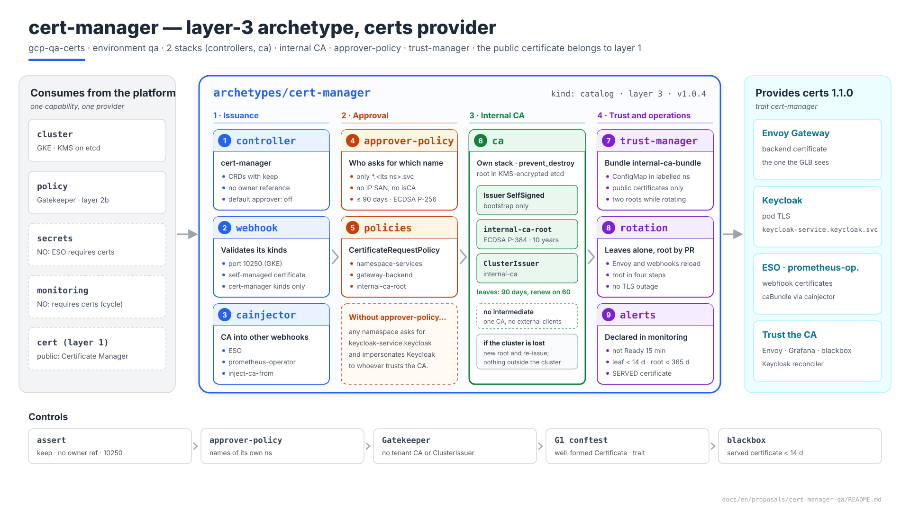
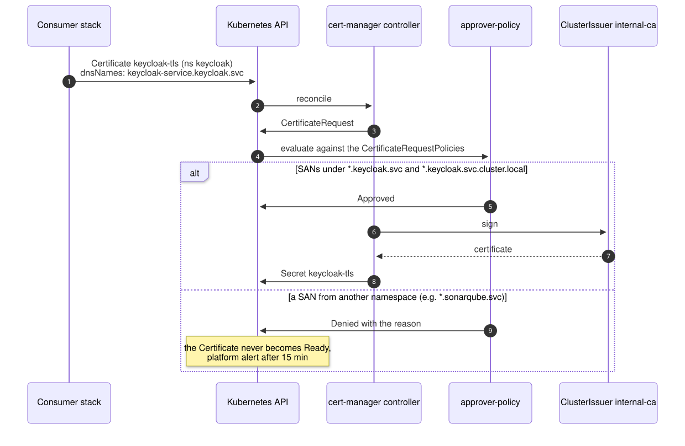

# cert-manager on `qa` — `cert-manager` archetype (layer 3), provider of `certs`

| | |
|---|---|
| **Status** | Proposal · revision 1 |
| **Scope** | The layer 3 `cert-manager` archetype on `qa`: which certificates it issues and which it does not, the internal CA, who may request which name, how trust is distributed, renewal and rotation, network, the `certs` contract, stacks, policies, execution and plan |
| **Why now** | ESO (§4.1), monitoring (§8.3), Keycloak (§4, §7, §8) and SonarQube (S1 §4.5) already request certificates from the internal `ClusterIssuer` and trust its CA, and each one took it for granted |
| **Reference specification** | `archetype-model.md` (AM §n), `terramate-outputs-sharing-architecture.md` (§n), `risk-register.md` |
| **Diagrams** | `diagrams/*.mmd` (Mermaid source) and `diagrams/*.svg` (rendered). The SVG is regenerated from the `.mmd`; never hand-edited. `diagrams/06-bloques-presentacion.svg` (1920×1080, for presentations) is generated by `06-bloques-presentacion.py`, not Mermaid |
| **Local identifiers** | Decisions `DT1…`, candidate risks `RT1…`, verifications `VT1…`. Risks get an `R54+` number in `risk-register.md` if adopted, after those of the earlier proposals |

Nothing in this document reopens a `CLAUDE.md` decision or one of S1 (no ACME: the public certificate comes from Certificate Manager).



Source: [`diagrams/06-bloques-presentacion.py`](diagrams/06-bloques-presentacion.py) — presentation view; the detail is in §2–§9.

---

## 0. Context

| Question | Answer | Consequence |
|---|---|---|
| What it is | `cert-manager` archetype, `kind: catalog`, **layer 3**, provides **`certs` 1.1.0** with the new **`cert-manager`** trait | The `qa` binding already binds it: `certs: { archetype: cert-manager, version: 1.0.4, stack_id: gcp-qa-certs }` |
| Stacks | 2: `gcp-qa-certs-controllers` and `gcp-qa-certs-ca` in `stacks/platforms/gcp/qa/certs/` | The CA has a different lifecycle from the controllers (§8.2) |
| Components | cert-manager (controller, webhook, cainjector), **approver-policy**, **trust-manager** | The last two come from the same project as cert-manager |
| CA | Internal, self-signed, in the cluster | §2 |
| What it does **not** do | The public edge certificate; ACME; the Gatekeeper webhook certificate | §1 |
| Model | Dedicated `qa` | No `capacity` budgets enforced (S1 §0) |



Source: [`diagrams/01-contexto.mmd`](diagrams/01-contexto.mmd)

---

## 1. Which certificates it issues and which it does not

| Certificate | Who issues it | Reason |
|---|---|---|
| **Public** `*.qa.disasterproject.com` on the GLB | **Certificate Manager**, layer 1 `cert` capability (S1 §3.3) | Must be in the same project as the load balancer; validation is by DNS; nobody in the cluster touches it |
| Backend that Envoy presents to the GLB | cert-manager | TLS on the GLB → Envoy leg (S1 §4.5) |
| Keycloak pod TLS (`keycloak-service.keycloak.svc`) | cert-manager | Tokens travel over the back-channel (Keycloak §4) |
| ESO and prometheus-operator webhooks | cert-manager, with the CA injected by **cainjector** | ESO §4.1, monitoring §8.3 |
| **Gatekeeper** webhook | **Gatekeeper**, with its own rotator | Gatekeeper is in layer 2b, **before** cert-manager: it cannot depend on it (AM §3) |
| cert-manager's own webhook | cert-manager, self-managed | It cannot request a certificate from itself before it exists |
| Internet-facing certificates issued by ACME | **Nobody** | No internet egress; the edge already has its certificate |

**Correction to AM §14.2.** The per-cloud provider table assigns "Certificate Manager / ACM / App Gateway certs" to `certs`. That describes the edge `cert` capability, not `certs`: AM itself binds `certs` to `cert-manager` in `demos` (AM §7). The proposal is to split the rows: `cert` → Certificate Manager, ACM, App Gateway certs; `certs` → `cert-manager` on all three clouds, like Kafka or Keycloak (§11).

**GLB → Envoy: encryption, not authentication.** The global external load balancer encrypts traffic to the backend but, unless backend authentication is configured with a `TrustConfig`, does not validate its certificate **(verify, VT8)**. On `qa` this is accepted: the leg runs over Google's network inside the VPC. Turning validation on would tie the internal root to a layer 1 resource, and every root rotation would require changing the edge (DT7).

---

## 2. The internal CA



Source: [`diagrams/02-cadena.mmd`](diagrams/02-cadena.mmd)

### 2.1 Options

| Option | Verdict |
|---|---|
| **A. Self-signed root in the cluster** (`SelfSigned` → root `Certificate` → CA-type `ClusterIssuer`) | **Yes** (DT1): nothing outside the cluster; the key in a `Secret` encrypted in etcd with the `gke-secrets` KMS key (S1 §4.14) |
| B. Google Certificate Authority Service + `google-cas-issuer` | For production: key in an HSM, managed audit and revocation. On `qa` it adds a monthly cost per CA and one more dependency for traffic that never leaves the VPC |
| C. Root generated outside and stored in Secret Manager | The key ends up in a cluster `Secret` anyway (ESO materialises it); it only survives a cluster rebuild, and with option A re-issuing is enough (§2.3) |

### 2.2 Parameters

| Setting | Value | Reason |
|---|---|---|
| Root | `internal-ca-root`, ECDSA P-384, **10 years**, `privateKey.rotationPolicy: Never` | A root rotation is a procedure (§5.2), not something that should happen on its own |
| Issuer | `ClusterIssuer` **`internal-ca`**, CA type over that root | Contract output (§7.1) |
| Leaves | ECDSA P-256, **90 days**, renewal at **60**, `rotationPolicy: Always` | New key on every renewal |
| Intermediate | No | With a single CA and no external clients, an intermediate adds no isolation and doubles the rotation |
| `enableCertificateOwnerRef` | **`false`** | A certificate's `Secret` is not owned by the `Certificate`: deleting the CRD does not delete the `Secret`s (the same cascade as ESO RE1) |

### 2.3 If the cluster is lost

The root is lost with it. Recreating `gcp-qa-certs-ca` produces a new root; trust-manager distributes the new bundle, every leaf is re-issued and nobody outside the cluster trusts the old root. Without backend validation on the GLB (§1), the rebuild touches nothing outside the cluster.

---

## 3. Who may request which name



Source: [`diagrams/03-aprobacion.mmd`](diagrams/03-aprobacion.mmd)

With a shared `ClusterIssuer` and cert-manager's default approver, **any namespace gets a certificate for any name**: a consumer could request `keycloak-service.keycloak.svc` and, with any way of diverting traffic inside the cluster, impersonate Keycloak to Envoy and Grafana, which trust the internal CA (RT1).

**approver-policy** replaces the default approver (it is disabled in the controller) and only approves what a `CertificateRequestPolicy` allows (DT2):

| Policy | Who | What it allows |
|---|---|---|
| `namespace-services` | Any namespace | `dnsNames` in `*.<its namespace>.svc` and `*.<its namespace>.svc.cluster.local`; no IP SANs, no URIs, no `isCA`; ECDSA P-256; duration ≤ 90 days |
| `gateway-backend` | Only the Gateway namespace (`envoy-gateway-system`) | In addition, the name the GLB expects for the backend **(verify the name the GLB uses, VT8)** |
| `platform-webhooks` | ESO, monitoring and cert-manager namespaces | The names of their webhook Services (already covered by `namespace-services`); kept separate so it can be tightened without touching the rest |
| `internal-ca-root` | Only `cert-manager` | `isCA: true`, for the root (§2.2) |

A request that matches none is left **Denied** with the reason; the `Certificate` never reaches `Ready` and the platform alert fires (§6).

**Why Gatekeeper was not enough.** A constraint on `Certificate` does not see `CertificateRequest`s created directly, which is what someone trying to bypass it would do. approver-policy decides on the signable request, the only point everything passes through.

---

## 4. How trust is distributed

Envoy (→ Keycloak), Grafana (→ Keycloak), the Keycloak reconciler and the blackbox `http_2xx_internal_ca` module need the root certificate. If each copies it on its own, the first rotation disconnects them one by one.

| Piece | Design |
|---|---|
| trust-manager `Bundle` | `internal-ca-bundle`: the current root certificate (and the next one during a rotation, §5.2) |
| Target | `ConfigMap` `internal-ca-bundle`, key `ca.crt`, in **every namespace carrying the label** `trust.disasterproject.com/internal-ca: "true"` |
| Who sets the label | Each consumer's `iam` stack, in its namespace |
| Use | Keycloak's `BackendTLSPolicy` (`caCertificateRefs` to that `ConfigMap`); a volume in Grafana, the blackbox and the reconciler |
| What is not distributed | Any private key: trust-manager only copies public certificates |

---

## 5. Renewal and rotation



Source: [`diagrams/05-rotacion.mmd`](diagrams/05-rotacion.mmd)

### 5.1 Leaves: automatic, except for whoever does not reload

| Consumer | Does it reload the renewed certificate? |
|---|---|
| Envoy | Yes, it receives it over SDS from Envoy Gateway |
| ESO, prometheus-operator, approver-policy, trust-manager webhooks | Yes, they watch the files **(verify each one, VT5)** |
| Keycloak | Yes, periodic certificate reload in version 26 **(verify the option and its period, VT5)** |
| Any consumer that reads the certificate only at startup | No: its renewal procedure includes a restart, and there is a month of margin between renewal (day 60) and expiry (day 90) |

The risk is not that cert-manager fails to renew, but that someone **keeps serving** the old certificate (RT3). That is why the served certificate is watched as well (§6).

### 5.2 Root: planned

1. New root `internal-ca-root-2`.
2. The `Bundle` includes **both** roots; trust-manager distributes them and everyone trusts both.
3. The `ClusterIssuer` points to the new one; re-issuance of every leaf is forced.
4. When no leaf in use is signed by the old one, the `Bundle` keeps only the new one.

Each step is a PR against `gcp-qa-certs-ca`. With a 10-year lifetime, the realistic case is not expiry but a key compromise; the procedure is the same, with step 4 on the same day.

---

## 6. Observability

The rules are declared by the monitoring archetype (monitoring §5.1): `monitoring` requires `certs` for its webhook, so `certs` cannot require `monitoring` (the same cycle as ESO §9.1).

| Alert | Signal | Threshold |
|---|---|---|
| Certificate not `Ready` | `certmanager_certificate_ready_status` | > 15 min — almost always a request denied by approver-policy |
| Leaf about to expire | `certmanager_certificate_expiration_timestamp_seconds` | < 14 days: the day-60 renewal has been failing for two weeks (S1 §4.7) |
| Root about to expire | Same, for `internal-ca-root` | < 365 days |
| **Served certificate** about to expire | Blackbox `probe_ssl_earliest_cert_expiry` against the internal endpoints (Keycloak, Envoy backend) | < 14 days: catches whoever did not reload even though cert-manager did renew (RT3) |
| Denied requests | approver-policy events | Any outside a deployment |

---

## 7. The `certs` 1.1.0 contract

### 7.1 Outputs and trait

| Output | Value on `qa` | Use |
|---|---|---|
| `namespace` | `cert-manager` | `NetworkPolicy` and RBAC |
| `cluster_issuer` | `internal-ca` | `issuerRef` of the `Certificate`s and of the ESO and prometheus-operator webhooks |
| `ca_bundle_configmap` | `internal-ca-bundle` (key `ca.crt`) | `BackendTLSPolicy`, trust volumes |
| `ca_bundle_label` | `trust.disasterproject.com/internal-ca: "true"` | Namespace label to receive the bundle |

Deterministic: contract outputs that consumers receive as globals. Three are new compared with the version they already consume (`^1.0.0`), so the contract version goes up to **1.1.0** (MINOR, AM §4.5).

**`cert-manager` trait** (new, in `registry/traits.yaml`): the `certs` provider is cert-manager and its CRDs and cainjector exist. ESO, monitoring and Keycloak require it, just as they require `eso` or `prometheus-operator-crds`: a `certs` binding to anything else fails at resolution, not with a `Certificate` nobody reconciles.

### 7.2 What a consumer writes

```yaml
apiVersion: cert-manager.io/v1
kind: Certificate
metadata: { name: keycloak-tls, namespace: keycloak }
spec:
  secretName: keycloak-tls
  issuerRef: { kind: ClusterIssuer, name: internal-ca }     # = cluster_issuer output
  dnsNames:
    - keycloak-service.keycloak.svc
    - keycloak-service.keycloak.svc.cluster.local
  duration: 2160h                                          # 90 days
  renewBefore: 720h                                        # renews on day 60
  privateKey: { algorithm: ECDSA, size: 256, rotationPolicy: Always }
```

| Rule | Why |
|---|---|
| Only names in its own namespace | approver-policy (§3) |
| `duration` ≤ 90 days | Likewise; limits the damage of a leaked key |
| No CA-type `Issuer`s of its own to serve others | A tenant CA is trusted by nobody; Gatekeeper prevents it (§9.2) |
| Namespace carries the bundle label if it needs to trust the CA | §4 |

---

## 8. The archetype

### 8.1 Manifest

```yaml
# archetypes/cert-manager/manifest.yaml
apiVersion: archetype/v1
kind: Archetype

metadata:
  name: cert-manager
  version: 1.0.4
  layer: 3
  kind: catalog
  description: cert-manager with internal CA, approver-policy and trust-manager; certificates inside the cluster
  owners: [team-platform]

runtimes: [gke, eks, aks]

requires:
  - capability: cluster
    version: "^2.0.0"
  - capability: policy
    version: "^1.0.0"

provides:
  - capability: certs
    version: 1.1.0
    traits: [cert-manager]
    outputs:
      - { name: namespace,           from: controllers }
      - { name: cluster_issuer,      from: ca }
      - { name: ca_bundle_configmap, from: ca }
      - { name: ca_bundle_label,     from: ca }

stacks:
  - name: controllers
  - name: ca
    after: [controllers]

capacity:
  cpu_millicores: 400
  memory_mib: 768
  pods: 8
  workload_identities: 0
```

The archetype version stays at **1.0.4**, the one the `qa` and `demos` bindings already pin; what goes up is the contract's. `runtimes: [gke, eks, aks]`: nothing in this archetype is GCP-specific. **No `secrets` or `monitoring`**: both require `certs`.

### 8.2 The stacks

| Stack | Contents | Inputs via sharing |
|---|---|---|
| `controllers` | `cert-manager` namespace (PSS `restricted`); `helm_release` of cert-manager (CRDs with `keep`, `enableCertificateOwnerRef: false`, default approver disabled, webhook on 10250), of approver-policy and of trust-manager; `NetworkPolicy` (§9.3) | `cluster_endpoint`, `cluster_ca` (gke) |
| `ca` | `SelfSigned` `Issuer`, root `Certificate`, `ClusterIssuer` `internal-ca`, `Bundle` `internal-ca-bundle`, the `CertificateRequestPolicy`s of §3 and their RBAC; `prevent_destroy` on the `helm_release` | `cluster_*` |

**Why two stacks.** A cert-manager upgrade is routine; touching the root is not. In separate stacks, a version PR never plans a change to the CA, and destroying the CA requires an explicit PR that removes `prevent_destroy`.

---

## 9. Policies and network

### 9.1 `assert` at generation

```hcl
assert {
  assertion = global.certmanager_values.crds.keep && !global.certmanager_values.enableCertificateOwnerRef
  message   = "certs: CRDs with keep and no owner reference on the Secrets — deleting them must not delete certificates (RT4)"
}
assert {
  assertion = tm_contains(global.certmanager_values.disableControllers, "certificaterequests-approver")
  message   = "certs: the default approver approves any name; approver-policy replaces it (RT1)"
}
assert {
  assertion = global.certmanager_values.webhook.securePort == 10250
  message   = "certs: webhook on 10250; any other port needs a firewall rule to the nodes (RT5)"
}
```

### 9.2 Gatekeeper and conftest

| Rule | Where | What it checks |
|---|---|---|
| **New:** no tenant `ClusterIssuer`s | Gatekeeper | Only this archetype's `ClusterIssuer`s exist |
| **New:** no CA-type or `SelfSigned` `Issuer` outside `cert-manager` | Gatekeeper | A tenant does not set up its own CA |
| **New:** well-formed `Certificate` | G1 | `issuerRef` = `internal-ca`, `duration` ≤ 90 days, `dnsNames` from its own namespace (the same rule as approver-policy, brought forward to the PR) |
| **New:** trait | G1 | An archetype whose chart contains a `Certificate` or the `cert-manager.io/inject-ca-from` annotation requires `certs` with the `cert-manager` trait |

### 9.3 Network



Source: [`diagrams/04-red.mmd`](diagrams/04-red.mmd)

| Source | Destination | Port | Note |
|---|---|---|---|
| GKE control plane | cert-manager, approver-policy and trust-manager webhooks | **10250** | The port GKE already opens to private nodes (as ESO §7 and monitoring §8.3) **(verify the default port of approver-policy and trust-manager, VT3)** |
| Prometheus | Controller and components | 9402 and metrics | |
| Controller, cainjector, approver-policy, trust-manager | Kubernetes API | 443 | |
| All | kube-dns | 53 | |
| All | Internet | **Denied** | No ACME |

---

## 10. Execution

| What | How |
|---|---|
| First deployment | Phase B of S1 §6: right after `gcp-qa-policy` and **before** ESO, monitoring, the Gateway and Keycloak, which request certificates from it. Exit criterion: a test `Certificate` from its own namespace `Ready`, one with a foreign name `Denied`, and the bundle `ConfigMap` present in a labelled namespace |
| Upgrade | `controllers` stack; CRDs first; rehearsal in an ephemeral environment |
| Root rotation | §5.2 |
| Destruction | Stops at `prevent_destroy` on `ca`. Without the CA no certificate renews: it is torn down last |

---

## 11. Changes to other documents

| Document | Change | Status |
|---|---|---|
| `registry/traits.yaml` and the `enum` in `schemas/archetype-manifest.schema.json` | `cert-manager` trait, in the same commit and mechanically (R34) | **Applied** |
| The ESO (§10.1), monitoring (§10.1) and Keycloak (§11.1) proposals | `certs` now requires `traits: [cert-manager]` | **Applied** |
| AM §14.2 (`docs/en/` and `docs/es/`) | Split `cert` (Certificate Manager, ACM, App Gateway certs) from `certs` (`cert-manager` on all three clouds) | Proposed |
| Consumers (`iam` of Keycloak, monitoring and the Gateway) | `trust.disasterproject.com/internal-ca` label on their namespace; use of `internal-ca-bundle` | Proposed, picked up as each is implemented |

---

## 12. Decisions

| # | Decision | Status | Recommendation | Alternative |
|---|---|---|---|---|
| DT1 | CA | Proposed | Self-signed root in the cluster, 10 years, no intermediate | Certificate Authority Service (production) |
| DT2 | Approval | Proposed | approver-policy; default approver disabled | Default approver (any name) |
| DT3 | Trust | Proposed | trust-manager with a `ConfigMap` per labelled namespace | Each consumer copies the CA |
| DT4 | Leaves | Proposed | ECDSA P-256, 90 days, renewal on day 60, new key | 1 year; RSA |
| DT5 | Owner reference on `Secret` | Proposed | Disabled | Enabled: deleting the CRD drags the `Secret`s with it |
| DT6 | Stacks | Proposed | `controllers` and `ca` separate | A single one |
| DT7 | Backend validation on the GLB | Proposed | Not on `qa` | `TrustConfig` with the internal root (ties the root to layer 1) |
| DT8 | Gatekeeper | Consequence of AM §3 | Its own rotator | — (layer 2b comes first) |
| DT9 | `cert-manager` trait | Proposed, applied to the registry | Yes | No trait |

---

## 13. Candidate risks

| # | Risk | Likelihood | Impact | Mitigation |
|---|---|---|---|---|
| RT1 | **A namespace obtains a certificate for another's service** and impersonates it to whoever trusts the CA | High with the default approver | High — theft of Keycloak back-channel tokens | approver-policy (§3); G1 rule; VT1 |
| RT2 | **Loss or compromise of the root** | Low | High — all internal TLS to re-issue | Procedure in §5.2; alert at 365 days; documented rebuild (§2.3) |
| RT3 | **Certificate renewed but not reloaded**: the consumer serves an expired one | Medium | Medium — TLS failure on an internal leg | Probe of the served certificate (§6); VT5 |
| RT4 | **Deleting the CRDs** drags the `Secret`s with it | Low | High | `keep`, no owner reference, assert |
| RT5 | **Webhooks unreachable** from the control plane | Medium if the port changes | Medium — no `Certificate` gets applied | 10250 with assert; VT3 |
| RT6 | **Deployment order**: a consumer applies before the `ClusterIssuer` exists | Medium on the first deployment | Low — it retries on its own | `after` on `gcp-qa-certs-ca` in the consumers |

---

## 14. Verifications

| # | Verification | Result that closes it |
|---|---|---|
| VT1 | approver-policy with the `namespace-services` policy | A `Certificate` for `*.keycloak.svc` from `sonarqube` is left `Denied`; its own is approved |
| VT2 | trust-manager | The `ConfigMap` appears in a namespace when it is labelled and disappears when the label is removed; it updates when the `Bundle` changes |
| VT3 | cert-manager, approver-policy and trust-manager webhooks on 10250 | `apply` of each of their kinds without a timeout |
| VT4 | cainjector on the ESO and prometheus-operator webhooks | `caBundle` injected and updated after renewal |
| VT5 | Certificate reload in Envoy, Keycloak and every webhook | Forced renewal with no restart and no TLS errors |
| VT6 | Uninstall the controllers in an ephemeral environment | The certificates' `Secret`s still exist |
| VT7 | Root rotation from §5.2 in an ephemeral environment | No TLS outage in any of the four steps |
| VT8 | GLB → Envoy with the internal certificate; expected name; backend validation | Health check green; confirmed that without a `TrustConfig` it does not validate |

---

## 15. Implementation plan

| Phase | Contents | Exit criterion | Estimate |
|---|---|---|---|
| **0 · Prerequisites** | `qa` GKE and Gatekeeper; VT3, VT8 | Verifications closed | Depends on the platform |
| **1 · Skeleton** | Manifest, charts, asserts, G1 rules and constraints | `archetypectl resolve --dry-run`, `terramate generate --check`, G1 and preview with mocks green | 1 day |
| **2 · Controllers** | `controllers` | cert-manager, approver-policy and trust-manager healthy; **VT6** | 1 day |
| **3 · CA** | `ca` | Criterion from §10; **VT1**, **VT2** | 1 day |
| **4 · Consumers** | ESO and monitoring webhooks; Keycloak; Gateway | **VT4**, **VT5**; **VT7** in an ephemeral environment | With each consumer |

Three days for one person, plus verification with each consumer. It is the first thing in layer 3: ESO, monitoring, the Gateway and Keycloak request certificates from it.
