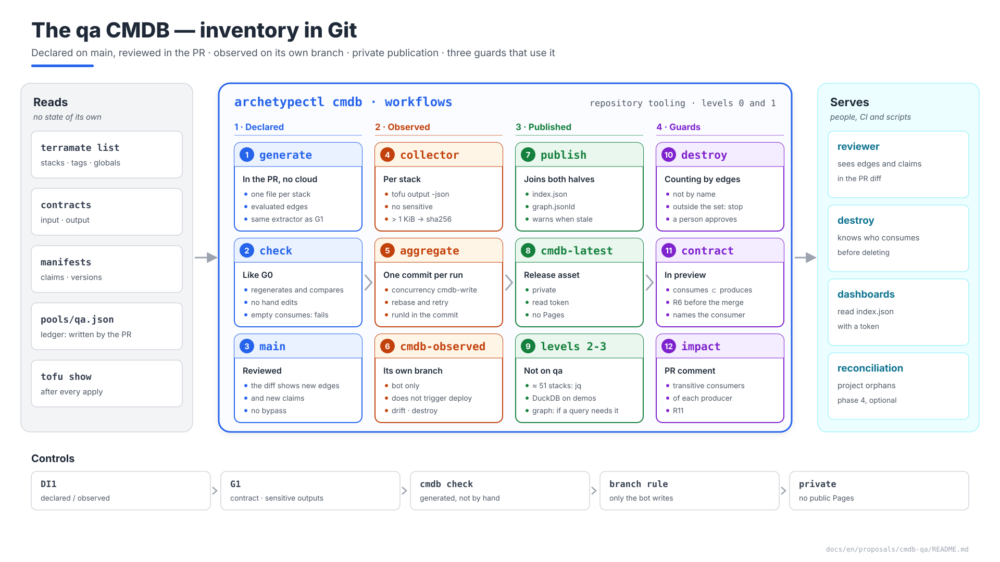
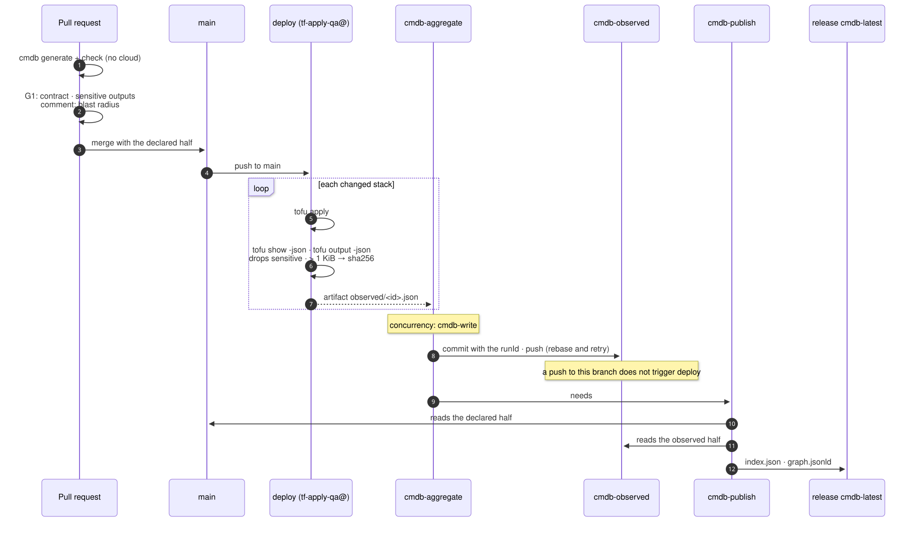

# The `qa` CMDB — inventory in Git, levels 0 and 1

| | |
|---|---|
| **Status** | Proposal · revision 2 · decisions approved and changes applied to the reference documents (§9) |
| **Scope** | The CMDB of the `qa` environment: what is inventoried, which files are written, who writes them and when, where the read model is published, which identities do it, and the three guards that use it (reference counting before a destroy, broken contract in the PR, blast radius in the PR). Levels 0 and 1 of AM §11; levels 2 and 3 are not built on `qa` (DI4) |
| **Why now** | Earlier proposals publish outputs "for the CMDB" (SonarQube, the Cloud SQL variant) and leave the ledger in `cmdb-data/pools/qa.json` (network), but nobody has said how they get there. Guard rail 3 of the architecture (§12.4) defers to the CMDB for reference counting, and the CMDB does not exist |
| **Basis** | AM §11 (three-level model), §9.6 (ledger); architecture §11.4 (identities), §12.4 (destroy guards), §12.7, §14.2 (deploy), §14.3 (drift); `schemas/cmdb-stack.schema.json`. What is already there is not repeated |
| **Reference specification** | `archetype-model.md` (AM §n), `terramate-outputs-sharing-architecture.md` (§n), `risk-register.md` |
| **Diagrams** | `diagrams/*.mmd` (Mermaid source) and `diagrams/*.svg` (rendered). The SVG is regenerated from the `.mmd`; it is not hand-edited. `diagrams/06-bloques-presentacion.svg` (1920×1080, for presentations) is generated by `06-bloques-presentacion.py`, not by Mermaid |
| **Own identifiers** | Decisions `DI1…`, candidate risks `RI1…`, verifications `VI1…`. Risks get an `R55+` number in `risk-register.md` if adopted |

It reopens no decision in `CLAUDE.md`. It applies AM §11 as it stands — Git is the system of record, everything else is rebuildable — and finds four gaps when taking it to a real repository:

1. **The sync cannot write to `main`** without bypassing its protection, and if it does, it triggers the `deploy` workflow again (RI1). Separating what is declared from what is observed solves it (§2).
2. **GitHub Pages is public** except on Enterprise: publishing level 1 there exposes the environment's inventory (RI2, §5).
3. **Guard rail 3 counts stacks with `grep`** over a name pattern (`^gcp-demos-.*-app$`) that matches nothing on `qa`: the count comes out 0 and the destroy goes through (§6.1).
4. **The edge extractor can fail silently**: if it does not evaluate a `from_stack_id`, the stack appears to have no consumers and the count is 0 again (RI3, VI1).



Source: [`diagrams/06-bloques-presentacion.py`](diagrams/06-bloques-presentacion.py) — presentation view; the detail is in §1–§8.

---

## 0. Context

| Question | Answer | Consequence |
|---|---|---|
| What it is | **Repository tooling**, not an archetype: an `archetypectl` subcommand, two steps in the deploy and drift workflows, a data branch and a release asset | No layer, no stack, no manifest. It does not appear in the binding |
| What it inventories | The `qa` stacks (≈ 50, §1), their edges, their claims, the instances and the archetype versions | One file per stack, as in AM §11.1 |
| What it is **not** | Change management, incidents or non-IaC CIs (AM §11.5). Nor live state: it reflects the **last successful apply** plus what drift detects | It feeds the corporate tool; it does not replace it |
| Project | `qa` lives in `disasterproject-nonprod`, shared with `dev`, `demos`, `sandbox` and `ephemeral-*` | Every file carries `environment` **and** `project` (§3.2): inside the shared project, what separates `qa` is the prefix and the label, not the project |



Source: [`diagrams/01-contexto.mmd`](diagrams/01-contexto.mmd)

### 0.1 What earlier proposals asked of it

| Origin | Requirement | Where it is met |
|---|---|---|
| SonarQube stage 2 §5, §9 | Outputs `url`, `image_digest`, `chart_version`, `helm_revision`, `db_rw_service`, `backup_bucket`, `secret_ids` (names) "collected by the CMDB sync" | §4.2 |
| Cloud SQL variant §7 | Outputs `db_instance_name`, `db_connection_name`, `db_name` | §4.2 |
| `network-qa` §7 | The ledger `cmdb-data/pools/qa.json` | §3.1: written by the PR that claims (AM §9.8), not by the sync |
| Architecture §12.4, guard rail 3 | Reference counting "authoritative rather than inferred from the repository" before destroying a platform | §6.1 |
| R5, R6, R11 | The CMDB says who consumes whom: destroy, renaming an output, rebuilding the cluster | §6 |
| Architecture §14.2, §14.3 | A `Sync CMDB` step after apply; scheduled drift | §4 |

---

## 1. What is inventoried on `qa`

The stacks come from each proposal's manifests, with the providers of the `qa` binding (E1 §7). Where a consumer carries both `database-platform` paths (`data` and `data-tenant`), only the one for the bound provider, `postgres-cloudsql`, counts.

| Archetype | Layer | Stacks | Instance |
|---|---|---|---|
| `environment` | 1 | `network`, `edge-base`, `edge`, `edge-l4` | — |
| `cloud-monitoring-gcp` | 1b | `cloudmon` | — |
| `gke` | 2 | `subnet`, `cluster`, `nodepools`, `access`, `baseline` | — |
| `policy-gatekeeper` | 2b | `controller`, `library`, `exemptions` | — |
| `cert-manager` | 3 | `controllers`, `ca` | — |
| `gateway-envoy-gke` | 3 | `controller`, `proxy` | — |
| `secrets-eso-gsm` | 3 | `eso` | — |
| `monitoring-oss` | 3 | 9 (`iam` … `frontdoor`) | — |
| `postgres-cloudsql` | 3 | `platform` | — |
| `kafka` | 3 | `iam`, `operator`, `cluster`, `policy`, `vpc-access` | — |
| `keycloak` | 3 | 9 (10 minus `data-tenant`) | `main` |
| `sonarqube` | 5 | 9 (10 minus `data-tenant`) | `main` |
| **Total** | | **≈ 51** | 2 |

This is a count from manifests: the definitive one is `terramate list --tags qa` once the stacks exist, and the generator writes it without anyone counting.

| File | How many on `qa` | Approximate size |
|---|---|---|
| `stacks/<id>.json` | ≈ 51 | 2–4 KiB each |
| `archetypes/<name>@<version>.json` | 12 | 1–3 KiB |
| `instances/qa-<archetype>-<instance>.json` | 2 | 1 KiB |
| `environments/qa.json`, `pools/qa.json` | 2 | 2 KiB |
| `edges/*.json` | 3 | 20 KiB in total |

Under 300 KiB. It fits in the memory of any script, which is what decides DI4.

---

## 2. Two halves: declared and observed

AM §11.1 puts everything in `cmdb-data/` and lets a final job "aggregate into a single commit". In a repository with a protected `main` that does not work as written:

| If the sync writes to `main`… | What happens |
|---|---|
| …with a direct push | It needs a bypass of `main`'s protection (required PR, CODEOWNERS). A job with that bypass can push anything, not only `cmdb-data/` |
| …and the `deploy` workflow is `on: push: branches: [main]` | The sync's commit triggers another `deploy`. With `--changed` it applies nothing, but it runs the sync step again: a loop that only a `paths-ignore` or an actor filter stops, and someone will eventually remove it (RI1) |
| …with an automatic PR per deployment | One PR per merge, which is either reviewed by someone (noise) or auto-approved (the review means nothing) |

**Proposal (DI1):** separate the two halves by **who writes them**.

| Half | What it carries | Who writes it | When | Where |
|---|---|---|---|---|
| **Declared** | Everything known without touching the cloud: `id`, `path`, `cloud`, `environment`, `project`, `capability`, `archetype`, `instance`, `model`, `tags`, `protected`, `produces`, `consumes`, `claims`, `createsTenantResources`, `expiresOn`; the edges; the instances; the resolved manifests | `archetypectl cmdb generate`, in the PR | Before the merge, with the change that motivates it | `cmdb-data/` on `main`, **reviewed in the PR** |
| **Observed** | What is only known after the apply: `lastApply` (`at`, `commit`, `runId`, `outcome`), `resourceCount`, published outputs, drift | The aggregation job, with `GITHUB_TOKEN` | After every `deploy`, `drift` and `destroy` | Branch **`cmdb-observed`**, `cmdb-data/observed/<id>.json` |

Consequences:

- `main` has no bypass at all. `cmdb-observed` has its own rule (§5.2): only the bot writes, no force-push, no deletion.
- A push to `cmdb-observed` does not trigger `deploy`, so there is no loop.
- `git blame` still works on both halves: the declared one, with the PR that changed it; the observed one, with the `runId` in each commit.
- The declared half changes **in the same PR** as the stack: a reviewer sees in the diff that the PR adds an edge towards `gcp-qa-gke` or a claim in the `data` zone. That is what AM §11.1 calls "the value of an auditable diff", and with a post-merge sync it was lost.

---

## 3. The declared half: files on `main`

### 3.1 Layout

```
cmdb-data/
├── archetypes/gke@2.5.0.json            # resolved manifest, immutable per version
├── environments/qa.json                  # binding + cidr + capacity
├── instances/qa-sonarqube-main.json      # versions, claims, stacks
├── instances/qa-keycloak-main.json
├── stacks/gcp-qa-gke.json                # ONE FILE PER STACK — declared half
├── edges/
│   ├── depends-on.json                   # from the input blocks, evaluated (VI1)
│   ├── provides.json                     # capability → provider stack
│   └── tenant-resources.json             # who writes into whose namespace
├── pools/qa.json                         # ledger: written by the PR that claims (AM §9.8)
└── index.json
```

`pools/qa.json` is not generated by `archetypectl cmdb`: it is the ledger, and its merge conflict is the lock (AM §9.6). The generator reads it to validate that every claim of a stack is in the ledger.

### 3.2 One stack

```json
{
  "apiVersion": "archetype/v1",
  "kind": "Stack",
  "id": "gcp-qa-gke",
  "path": "/stacks/platforms/gcp/qa/gke/cluster",
  "cloud": "gcp",
  "environment": "qa",
  "project": "disasterproject-nonprod",
  "capability": "cluster",
  "archetype": { "name": "gke", "version": "2.5.0", "kind": "catalog" },
  "model": "dedicated",
  "tags": ["gcp", "qa", "cluster", "platform", "producer", "protected"],
  "protected": true,
  "produces": ["cluster_endpoint", "cluster_ca", "cluster_name", "cluster_location",
               "workload_identity_pool", "node_service_account"],
  "consumes": [
    { "from_stack_id": "gcp-qa-network",    "output": "network_self_link" },
    { "from_stack_id": "gcp-qa-gke-subnet", "output": "subnet_self_link" }
  ],
  "claims": [
    { "kind": "cidr", "pool": "qa", "zone": "infra", "purpose": "nodes",    "value": "10.4.128.0/24" },
    { "kind": "cidr", "pool": "qa", "zone": "pods",  "purpose": "pods",     "value": "10.4.192.0/18" },
    { "kind": "cidr", "pool": "qa", "zone": "edge",  "purpose": "services", "value": "10.4.160.0/22" }
  ]
}
```

Claims are made by the archetype; in the file they are attributed to the stack that creates the resource (here, in fact, `gcp-qa-gke-subnet`: the example simplifies). `project` **does not exist today** in `schemas/cmdb-stack.schema.json` (§9).

### 3.3 How it is generated

| Field | Source | Without the cloud |
|---|---|---|
| `id`, `path`, `tags` | `terramate list --json` | Yes |
| `environment`, `project`, `cloud`, `capability`, `archetype`, `instance`, `model` | Stack globals (`terramate debug show globals`) | Yes |
| `produces` | `output` blocks of the imported contract | Yes |
| `consumes` | `input` blocks of the contract, **with `from_stack_id` evaluated** | Yes, if the extractor evaluates globals (VI1) |
| `claims` | Manifest + ledger `pools/qa.json` | Yes |
| `createsTenantResources`, `expiresOn` | Manifest | Yes |

**One extractor for two consumers.** The G1 rule that checks every `input` has its `after` (R2) needs exactly the same `(stack, from_stack_id)` pairs. It is written once, in `archetypectl`, and used by G1 and the CMDB: if the extractor is wrong, both are wrong at once, and it shows sooner.

**The check (DI2).** `archetypectl cmdb check` regenerates the declared half and fails if it differs from what is in the PR, like G0 with `terramate generate --check`. Without it, someone fixes a `consumes` by hand, the review approves it, and the next generation silently reverts it.

The tool does not exist yet. The branch `claude/fervent-goodall-m3r9eg` has an `archetypectl` with the `enrich` subcommand, not merged; `cmdb` would be a new subcommand.

---

## 4. The observed half: branch `cmdb-observed`

### 4.1 The flow



Source: [`diagrams/02-flujo.mmd`](diagrams/02-flujo.mmd)

| Step | Job | What it does | Identity |
|---|---|---|---|
| 1 | `deploy` (each stack) | After the apply, `tofu show -json` and `tofu output -json`; writes `observed/<id>.json` and uploads it as an artifact | `tf-apply-qa@`, the one it already has |
| 2 | `cmdb-aggregate` | Downloads the artifacts, copies them into `cmdb-observed`, one commit with the `runId`, `push` with retry and rebase | No cloud; `GITHUB_TOKEN` with `contents: write` **in this job only** |
| 3 | `cmdb-publish` | Joins the declared half from `main` and the observed half; writes `index.json` and `graph.jsonld`; uploads them to the `cmdb-latest` release | No cloud; `contents: write` |
| — | `drift` (cron) | If `tofu plan -detailed-exitcode` exits with 2: `outcome: drifted`, `driftAt` | `tf-plan-qa@` + step 2 |
| — | `destroy` | After destroying: `outcome: destroyed` | `tf-destroy-qa@` + step 2 |

`cmdb-aggregate` runs with `concurrency: { group: cmdb-write, cancel-in-progress: false }`, as AM §11.1 says: two consecutive deployments are aggregated in order, without losing either (VI2).

### 4.2 Which outputs are published

Earlier proposals publish outputs "for the CMDB". The collector gathers them like this **(DI5)**:

| Rule | Reason |
|---|---|
| Only outputs without `sensitive = true` | `tofu output -json` also returns the sensitive ones; the collector drops them by the flag, not by the name |
| Values > 1 KiB are stored as `sha256:` | `cluster_ca` and the like: not secrets, but they inflate the file and are never queried by value |
| The secret-name rule G1 already has (`terramate.contracts`, architecture §13.3) stops an `output` named `password`, `token`, `private_key`… from existing, unless it ends in `_id`, `_arn`, `_name` or `_uri` | A person sets the `sensitive` flag, and forgets (RI4); the rule does not depend on it. Secret names (`secret_ids`) are references, not values: they are published (`CLAUDE.md`, "Never share secrets through outputs sharing"). Revision 1 proposed a new rule; the existing one already covers it |

```json
{
  "apiVersion": "archetype/v1",
  "kind": "StackObserved",
  "id": "gcp-qa-sonarqube-main-app",
  "lastApply": { "at": "2026-10-05T09:12:44Z", "commit": "4730c06", "runId": "11873120455", "outcome": "ok" },
  "resourceCount": 14,
  "outputs": {
    "url": "https://sonar.tqbvzkr.disasterproject.com",
    "image_digest": "sha256:9b1c…",
    "chart_version": "2025.4.2",
    "helm_revision": 7
  }
}
```

`StackObserved` is a new `kind`, with its own schema (§9).

---

## 5. Publication and access

### 5.1 Where level 1 is published (DI3)

| Option | Access | Problem |
|---|---|---|
| GitHub Pages | **Public** except on Enterprise (AM §11.2) | Publishes internal IPs, ranges, project and secret names, versions and digests: the environment's map for whoever wants to attack it (RI2) |
| `raw.githubusercontent.com` over the branch | Token | ~5 min cache; the two halves must be joined in the client |
| **Asset of the `cmdb-latest` release** | Repository read token | Nothing relevant with ≈ 50 stacks: one file, versioned, replaced on each publication |

**Proposal:** an asset of the `cmdb-latest` release (`index.json` and `graph.jsonld`); the history is the `cmdb-observed` branch. If the repository moves to Enterprise with private Pages, Pages can be added without changing anything else.

### 5.2 Permissions

| Who | What it may do | How it is guaranteed |
|---|---|---|
| `preview` jobs | Generate and check the declared half | No cloud, `contents: read` |
| `cmdb-aggregate`, `cmdb-publish` | Write to `cmdb-observed` and to the release | `contents: write` at job level; the rest of the workflow stays at `read` |
| Any job with `contents: write` | **Not** write to `main` | `main`'s rule has no bypass for `github-actions`; `GITHUB_TOKEN` cannot get round it (VI3) |
| People | Read `cmdb-observed`; neither push nor delete | Branch rule: only `github-actions` pushes, no force-push, no deletion |
| Readers (dashboards, scripts) | Read the release | Read-only GitHub App token |

---

## 6. The guards that use it

### 6.1 Reference counting before a destroy (DI6)

Guard rail 3 of the architecture (§12.4) counts `^gcp-demos-.*-app$`. On `qa` no consumer of `gcp-qa-gke` is named like that (`gcp-qa-policy`, `gcp-qa-kafka-cluster`, `gcp-qa-keycloak-main-app`, …): the count is 0 and the destroy goes through. With the CMDB it counts **edges**, not names:

```bash
# Live consumers of a stack: inbound edges whose origin is not in the destroy set itself
jq -r --arg p "$STACK" --argjson set "$DESTROY_SET" '
  . as $idx
  | [.edges[] | select(.producer == $p) | .consumer]
  | map(select(. as $c | ($set | index($c)) == null))
  | map(select($idx.stacks[.].observed.lastApply.outcome != "destroyed"))
  | .[]' index.json
```

If any name comes out, the destroy stops with the list. Destroying the producer **together with** all its consumers (the same set) is allowed: that is destroying the environment, and the destroy group approves it (architecture §11.4).

Limit (RI5): only consumers **that are stacks** are counted. The 200 pipelines that use SonarQube over HTTP are not in the CMDB; destroying `sonarqube` leaves them without service even though the count is 0. That is what the human approval of the destroy is still there for.

### 6.2 Broken contract in the PR (DI7)

With `produces` and `consumes` in the declared half, a conftest rule over the PR's `index.json` checks that **every `consumes.output` exists in its producer's `produces`**. A PR that removes or renames an output someone reads fails in preview, naming the consumer. It is R6 caught before the merge instead of in the consumer's apply.

### 6.3 Blast radius in the PR

The preview comments on the PR with the transitive consumers of each producer stack that changes, using AM §11.3's recursive query done in `jq` over `edges/depends-on.json`. A PR that touches `gcp-qa-gke` shows that it affects nearly every other stack on `qa`, and the reviewer sees it before approving (R11).

---

## 7. Reconciliation with the cloud (optional, phase 4)

In the shared project, an orphaned `qa` resource — created by hand, or one that survived a failed destroy — is billed to `qa` by its label and appears in no state.

| What | How |
|---|---|
| Cloud inventory | Cloud Asset Inventory: `gcloud asset search-all-resources --scope=projects/disasterproject-nonprod --query='labels.environment=qa'` |
| IaC inventory | The resource IDs from `tofu show -json`, stored by the collector in `observed/resources/<id>.json` |
| Result | The difference both ways: in the cloud without state (orphan), and in state without the `environment=qa` label (wrong label) |
| Identity | `cmdb-reader@` from the landing zone, `roles/cloudasset.viewer` on `disasterproject-nonprod`. It sees metadata of every environment in the project; it filters by label. Not `tf-plan-qa@`, which must not see `dev` |
| Limit | Not every GCP resource supports labels; those that do not are compared by name against the `qa-` prefix |

---

## 8. `prod` and `demos`

| Setting | `qa` | `prod` | `demos` |
|---|---|---|---|
| Stacks | ≈ 51 | Similar to `qa` | Platform + one set per demo |
| Level 2 (DuckDB) | No (DI4) | No | **Yes** once there are several demos: the expiry query (AM §11.3) is the one that keeps the environment habitable |
| Reconciliation | Optional | Recommended: `prod` has its own project, and everything in it should be in some state | Recommended: demos expire and leave remnants |
| `cmdb-observed` branch | The same one for all environments | The same | The same |

One CMDB for all environments: the blast radius crosses environments where it crosses the landing zone (`tofu-state` key, image registry).

---

## 9. Changes to other documents

| Document | Change | Status |
|---|---|---|
| AM §11.1 | Two halves: declared on `main`, generated in the PR; observed on the `cmdb-observed` branch (DI1, DI2) | **Applied** |
| AM §11.2 | GitHub Pages does not work unless the repository is Enterprise; release asset (DI3) | **Applied** |
| AM §16 | Row for `schemas/cmdb-observed.schema.json` | **Applied** |
| Architecture §12.4, guard rail 3 | Counting by CMDB edges, not by name (DI6) | **Applied** |
| Architecture §12.7 | Summary of the two halves and a pointer to this proposal | **Applied** |
| Architecture §14.2, §14.3 | Per-stack collector; reusable `cmdb-sync` workflow (`aggregate` + `publish`) called by `deploy` and `drift`; drift writes `drifted` | **Applied** |
| `schemas/cmdb-stack.schema.json` | Add `project`; move `lastApply` and `resourceCount` to a new schema `cmdb-observed.schema.json` (`kind: StackObserved`, with `driftAt`, `outputs` and an `outcome` that admits `destroyed`) | **Applied** |
| G1 (architecture §13.3) | Two rules in `terramate.contracts`: a consumed output the producer does not produce (DI7), and a producer not in the inventory. The secret-name rule already existed (DI5) | **Applied** |
| `risk-register.md`, glossary | RI1 → R55, RI3 → R56, RI4 → R57; entries for the declared and observed halves | **Applied** |
| `CLAUDE.md` | Settled decision: two halves, private publication, guard by edges | **Applied** |

---

## 10. Candidate risks

| # | Risk | Likelihood | Impact | Mitigation |
|---|---|---|---|---|
| RI1 | **The sync writes to `main`**: a protection bypass and a `deploy` loop | High if AM §11.1 is followed to the letter | Medium — a job that can push to `main` without review | DI1: the observed half on its own branch |
| RI2 | **Level 1 on public Pages** | Medium | High — the environment's map exposed | DI3: release asset |
| RI3 | **Silently empty edges**: the extractor does not evaluate a `from_stack_id` and the count is 0 | Medium until VI1 is closed | Critical — allows destroying a platform with consumers (R5) | `cmdb check` fails if a stack has `input` blocks and an empty `consumes`; VI1; the same extractor as G1 |
| RI4 | **A sensitive output without `sensitive = true`** ends up in the CMDB | Medium | High — a secret in a file anyone with repository access reads | The existing G1 secret-name rule; private publication; the collector never reads secrets, only outputs |
| RI5 | **Consumers outside the repository** | High (SonarQube) | Medium — the count is 0 with real users | Human approval of the destroy; external consumers listed in the manifest if needed (not proposed now) |
| RI6 | **A CMDB that lies with confidence**: the observed half goes stale if the aggregator fails | Medium | Medium | `lastApply.at` in the index; `cmdb-publish` warns about stacks with no observation in the last N days; daily drift refreshes it |

---

## 11. Verifications

| # | Verification | Result that closes it |
|---|---|---|
| VI1 | Evaluate the `input` blocks with the pinned Terramate version | For the phase-0 stacks of `CLAUDE.md`, the extractor returns the `from_stack_id` already resolved (inherited and interpolated global), same as the hand-written list |
| VI2 | Two near-simultaneous `deploy` runs | Both commits reach `cmdb-observed`, in order, with neither lost |
| VI3 | `main`'s protection against `GITHUB_TOKEN` | A test push from `cmdb-aggregate` to `main` is rejected; to `cmdb-observed` it goes in |
| VI4 | Destroy guard | Destroying `gcp-qa-gke` with live consumers stops with the list; destroying the whole set passes |
| VI5 | Collector and sensitive outputs | A test `sensitive` output appears neither in the artifact nor in the index |
| VI6 | Drift | A manual change to a `qa` resource shows as `drifted` in the next day's index |
| VI7 | Cloud Asset Inventory by label (phase 4) | Returns the `qa` resources and none of `dev` |

---

## 12. Decisions

| # | Decision | Status | Recommendation | Alternative |
|---|---|---|---|---|
| DI1 | Where the observed half lives | **Approved** | The `cmdb-observed` branch; the declared half on `main` | Everything on `main` with a bypass and `paths-ignore`; an automatic PR per deployment; a database |
| DI2 | When the declared half is written | **Approved** | In the PR, generated and checked like G0 | After the merge; by hand |
| DI3 | Level 1 publication | **Approved** | Asset of the `cmdb-latest` release, private | GitHub Pages; reading the branch directly |
| DI4 | Levels 2 and 3 on `qa` | **Approved** | No: ≈ 50 stacks, `jq` is enough. Level 2 when `demos` has several demos; level 3 when a real query exists that level 2 answers badly (AM §11.4) | DuckDB from the start |
| DI5 | Which outputs are published | **Approved** | All non-sensitive ones; > 1 KiB as a hash; the secret-name rule G1 already has | An explicit list per manifest (`cmdb_outputs`) |
| DI6 | Reference counting | **Approved** | By CMDB edges, excluding the destroy set itself | `grep` by name (architecture §12.4) |
| DI7 | Contract in the PR | **Approved** | Every `consumes.output` exists in the producer's `produces` | Finding out at apply |
| DI8 | Reconciliation | **Approved** | Phase 4, optional on `qa`, with `cmdb-reader@` | No reconciliation; using `tf-plan-qa@` |

---

## 13. Implementation plan

| Phase | Content | Exit criterion | Estimate |
|---|---|---|---|
| **0 · Extractor** | **VI1**, together with phase 0 of `CLAUDE.md` | Evaluated edges for the test stacks | 0.5 days |
| **1 · Declared** | `archetypectl cmdb generate` and `check`; the `qa` files; the two G1 contract rules (DI7); the blast-radius comment | The preview of a PR that touches `gcp-qa-gke` lists its consumers and fails if it breaks a contract | 2 days |
| **2 · Observed** | Collector, `cmdb-aggregate`, the branch and its rule, drift; **VI2**, **VI3**, **VI5**, **VI6** | After a `deploy`, `cmdb-observed` has a commit with the `runId` | 2 days |
| **3 · Publication and guards** | `cmdb-publish`, destroy guard; **VI4** | `index.json` in `cmdb-latest`; a destroy with live consumers stops | 1.5 days |
| **4 · Reconciliation** (optional) | `cmdb-reader@`, orphan report; **VI7** | Weekly report with no differences on `qa` | 1 day |

Six days for one person without phase 4. It depends on the stacks of phase A of E1 §6 existing, to have something to inventory; phases 0 and 1 can start with the phase-0 stacks of `CLAUDE.md`.
