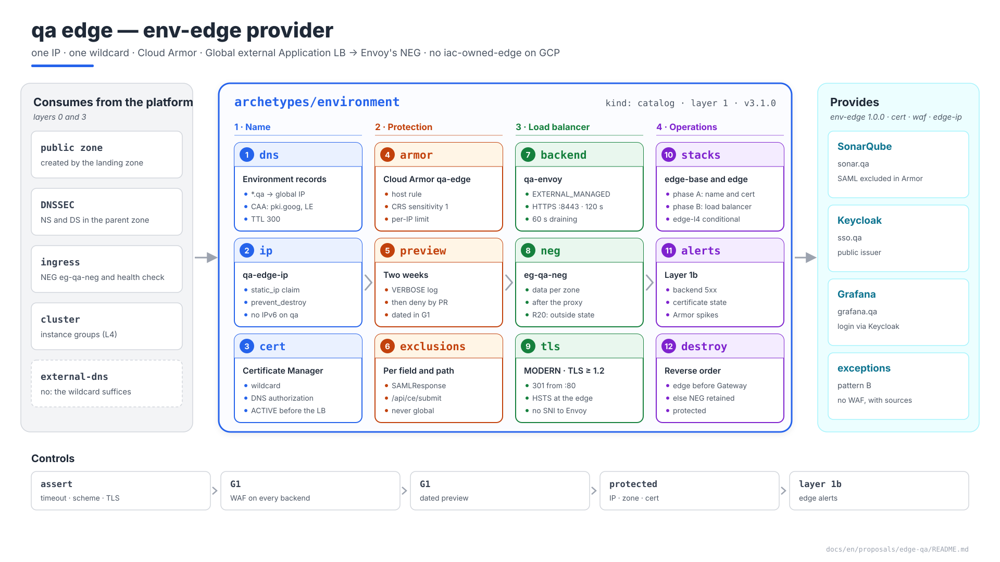

# The `qa` edge — `environment` archetype (layer 1), provider of `env-edge`

| | |
|---|---|
| **Status** | Proposal · revision 6 |
| **Scope** | The public edge of `qa`: IP, public DNS zone and records, certificate, Cloud Armor, the Global external Application LB towards Envoy's NEG, TLS, L4 exceptions (pattern B), observability, the `env-edge` contract, stacks, policies, execution and plan |
| **Why now** | It is the last piece before SonarQube, Keycloak and Grafana can be reached. The Envoy Gateway proposal left it requirements (health check, draining, `after`, NEG as `data`) and SonarQube's two more (120 s timeout and Cloud Armor exclusions) |
| **Base** | S1 §4.5 (publication), §4.15 (separate VPC and own edge); Envoy Gateway proposal §1, §2, §4.4, §5.2, §7.1; `network-qa` proposal; architecture §10.2 and §10.8; AM §3 (edge capabilities in layer 1). What is there is not repeated |
| **Reference specification** | `archetype-model.md` (AM §n), `terramate-outputs-sharing-architecture.md` (§n), `risk-register.md` |
| **Diagrams** | `diagrams/*.mmd` (Mermaid source) and `diagrams/*.svg` (rendered). The SVG is regenerated from the `.mmd`; never hand-edited. `diagrams/06-bloques-presentacion.svg` (1920×1080, for presentations) is generated by `06-bloques-presentacion.py`, not Mermaid |
| **Local identifiers** | Decisions `DL1…`, candidate risks `RL1…`, verifications `VL1…`. Risks get an `R54+` number in `risk-register.md` if adopted, after those of the earlier proposals |

It reopens no decision of `CLAUDE.md`. It applies the decision to keep environments outside the landing zone's project: the IP, Cloud Armor and the certificate live with the load balancer in the shared non-prod project (`disasterproject-nonprod`), with the `qa` prefix on every name. It adds to the `environment` archetype what the network proposal left for later, as a minor version.



Source: [`diagrams/06-bloques-presentacion.py`](diagrams/06-bloques-presentacion.py) — presentation view; the detail is in §1–§8.

---

## 0. Context

| Question | Answer | Consequence |
|---|---|---|
| What it is | The edge of the `environment` archetype (layer 1), version **3.1.0**. Provides **`env-edge` 1.0.0**, and `cert`, `waf` and `edge-ip`, which move to layer 1 with environments outside the landing zone's project (AM §3) | Stacks `gcp-qa-edge-base` and `gcp-qa-edge`; `gcp-qa-edge-l4` only if there are exceptions |
| What it publishes | `sonar.tqbvzkr.disasterproject.com`, `sso.tqbvzkr.disasterproject.com`, `grafana.tqbvzkr.disasterproject.com`: the claimed hostnames | One wildcard certificate, one IP, one Gateway |
| What it does **not** do | Route by host (Envoy does), authenticate (each application, or `SecurityPolicy`), expose Kafka (it never leaves the VPC) | The URL map has a single backend |
| Trait `iac-owned-edge` | **No** on GCP: the NEG is created by GKE's controller (R20) | The absence is declared instead of hidden (AM §4.3) |



Source: [`diagrams/01-contexto.mmd`](diagrams/01-contexto.mmd)

### 0.1 What the earlier proposals asked of it

| Origin | Requirement | Where it is met |
|---|---|---|
| S1 §4.5, R45 | Backend service timeout of **120 s** | §4 |
| S2 §9 | Cloud Armor exclusions on `/api/ce/submit` | §3.2 |
| Envoy Gateway §5.2, §7.1 | HTTP health check on the readiness port (the contract's `health_check`); `connection_draining_timeout_sec: 60`; NEG `eg-qa-neg` as `data` per zone; `after` on the `proxy` stack | §4 |
| Envoy Gateway §2.1 | HTTP → HTTPS in the URL map; HTTP towards the backend (Envoy Gateway DG14) | §4, §6 |
| Envoy Gateway §4.4 | Passthrough load balancer per exception (pattern B), with `sources` in the rule | §5 |
| S1 §4.15 | Zone `tqbvzkr.disasterproject.com` delegated; wildcard created once | §1 |

---

## 1. Public DNS

| Piece | Design | Reason |
|---|---|---|
| Public identifier `tqbvzkr` | 7 **random** lowercase letters, generated once by the landing zone (`random_string`, no digits, no uppercase) when the environment is onboarded, and pinned in the binding (`network.public_id`). The value in this document is an example | Every name visible from outside carries the identifier instead of `qa`: the zone and hostnames, the wildcard (which lands in the public Certificate Transparency logs) and bucket names, which are global. It must not be derivable from the name: anyone can compute the first 7 characters of `sha256("qa")` (DL10) |
| Zone `tqbvzkr.disasterproject.com` | Public Cloud DNS zone in `disasterproject-nonprod`, **created by the landing zone**, like the project; DNSSEC enabled | The delegation needs the child zone's name servers, which Cloud DNS assigns on creation. If the environment created it, the landing zone (layer 0) would have to read a layer-1 output to write the `NS` in the parent zone. With the landing zone creating it, zone, delegation and the DNSSEC `DS` record are in one stack (DL2) |
| Who writes records | The environment (`gcp-qa-edge-base`), with `roles/dns.admin` **on that zone** | The landing zone creates the container; the content is the environment's |
| `*.tqbvzkr.disasterproject.com` | `A` → the §2 global IP, TTL 300 | One record for every hostname (S1 §4.5). Hostnames are still claims: the wildcard resolves, the ledger guarantees uniqueness |
| `CAA` | `0 issue "pki.goog"` and `0 issue "letsencrypt.org"` on `tqbvzkr.disasterproject.com` | Only the two CAs Certificate Manager uses for managed certificates can issue for the domain **(verify, VL3)**. Without `CAA`, any public CA can |
| Authorization record | `CNAME` `_acme-challenge.tqbvzkr.disasterproject.com` from the `google_certificate_manager_dns_authorization` | §2 |
| No external-dns | `dns` unbound (S1 §3.3) | One Gateway and one IP per environment: the wildcard is enough |

**What carries the identifier and what does not (DL10).** It is carried by what someone without credentials sees: hostnames and the public zone, the certificate, bucket names and the Keycloak realm name, which appears in OIDC and SAML URLs (which is why the realm is called `disasterproject` in every environment, not `qa`). It is **not** carried by internal names — project resources, labels (billing goes by `environment`), KSA prefixes, stack IDs, namespaces, the private `qa.internal` zone —: whoever sees them already has access to the project, and changing them only makes operations worse. The public zone's resource name is `qa-public`: internal, with the environment prefix like everything else.

**Subdomain, not hyphen.** `sonar.tqbvzkr.disasterproject.com`, not `sonar-tqbvzkr.disasterproject.com`. With a subdomain, the wildcard `*.tqbvzkr…` is the only thing that reaches CT logs; with a hyphen it would take a certificate listing every name (all of them in CT, grouped by the suffix) or `*.disasterproject.com`, which would also be valid for `prod`'s names. Besides, the delegated zone stays the environment's, and a cookie with `Domain=.tqbvzkr.disasterproject.com` does not reach other environments.

**Changing it means renaming the edge.** A new certificate, cookies and sessions invalidated, SAML/OIDC URLs and the redirect registered in Entra ID, CI integrations that call SonarQube. It is generated once and does not rotate.

---

## 2. IP and certificate

| Piece | Design | Reason |
|---|---|---|
| IP | `qa-edge-ip`, `google_compute_global_address` `EXTERNAL`, IPv4; an environment **claim** (`kind: static_ip`) and `prevent_destroy` | If released, the wildcard points at an IP that may end up with another Google customer |
| IPv6 | Not on `qa` | No requirement; added with another address and another forwarding rule without touching the rest (DL8) |
| Certificate | Certificate Manager: `*.tqbvzkr.disasterproject.com` with **DNS authorization**, in a `certificate_map` with one entry for the wildcard | DNS authorization needs neither the load balancer nor traffic to exist: the certificate is `ACTIVE` before the Gateway (DL1) |
| Renewal | Automatic, by Google | The alert watches the state, not the date (§7) |

---

## 3. Cloud Armor

### 3.1 The `qa-edge` policy

| Priority | Rule | Action on `qa` | Reason |
|---|---|---|---|
| 100 | Host outside `*.tqbvzkr.disasterproject.com` (`!request.headers['host'].endsWith('.tqbvzkr.disasterproject.com')`) | `deny(403)` | Scanners arrive by IP or with made-up hosts. Envoy would return 404, but this way they never reach the cluster (RL5) |
| 900–990 | §3.2 exclusions | Exclude fields from specific rules, not whole paths | — |
| 1000–1090 | OWASP CRS preconfigured rules: `sqli`, `xss`, `lfi`, `rfi`, `rce`, `scannerdetection`, `protocolattack`, `sessionfixation`, sensitivity 1 | **Preview** for two weeks, then `deny(403)` | A new rule in `deny` that has never seen real traffic breaks the login before it stops an attacker (RL1) |
| 2000 | Per-IP limit: 1200 requests/min, `throttle` | Preview | A GitHub runner makes few requests; 1200/min is only reached by abuse |
| 2147483647 | Default | `allow` | — |

| Setting | Value |
|---|---|
| Body inspection | First 64 KB (`request_body_inspection_size`) **(verify the maximum at the date, VL1)** |
| JSON parsing | `STANDARD` |
| Log | `VERBOSE` on `qa` while the rules are in preview; `NORMAL` afterwards |
| Adaptive Protection | Enabled; its alerts, in layer 1b **(verify what it offers without Cloud Armor Enterprise)** |

### 3.2 Known false positives

| Path | What triggers | Exclusion |
|---|---|---|
| SonarQube `POST /api/ce/submit` | The analysis report is a binary ZIP: `protocolattack` and `rce` see arbitrary sequences in the body (S2 §9) | Exclude the body from those rules on that path; the path requires a SonarQube token |
| SonarQube `POST /oauth2/callback/saml` | The SAML response is base64 signed XML in the `SAMLResponse` field: `xss` and `protocolattack` fire on XML | Exclude `SAMLResponse` from `xss` and `protocolattack` on that path. **Without this nobody logs into SonarQube** once the rules go to `deny` (RL1) |
| Keycloak `POST /realms/disasterproject/broker/entra/endpoint` | Entra ID's `code`, `state`, `id_token` parameters | Exclude `id_token` from `sqli` and `xss` if the preview shows it |

The final list comes out of the two weeks of preview: a field is excluded on a path, never a rule for the whole environment.

---

## 4. The load balancer



Source: [`diagrams/02-borde.mmd`](diagrams/02-borde.mmd)

| Piece | Value | Reason |
|---|---|---|
| Scheme | `EXTERNAL_MANAGED` (Global external Application LB) | The classic (`EXTERNAL`) is the previous generation; the managed one supports advanced traffic management and is the one that gets new features (DL3) |
| Backend service | `qa-envoy`, `protocol = HTTP` towards 8080, **120 s** timeout (R45), `connection_draining_timeout_sec = 60`, `security_policy = qa-edge`, logs at 100 % on `qa` | Envoy Gateway §2.2 and §5.2 |
| Backends | One `eg-qa-neg` NEG per zone (`b`, `c`, `d`), read with `data "google_compute_network_endpoint_group"`; `balancing_mode = RATE`, `max_rate_per_endpoint = 1000` | The NEG is created by GKE's controller (R20). `RATE` is mandatory with NEGs; the value distributes, it does not cut **(verify the behaviour at saturation, VL4)** |
| Health check | HTTP, `USE_FIXED_PORT` to the `health_check` port of the `ingress` contract (`/ready`) | Against 8080 a request with no host returns 404 (Envoy Gateway §5.2) |
| Response headers | `Strict-Transport-Security: max-age=31536000; includeSubDomains` in `custom_response_headers` | Once at the edge, for every application |
| URL map `qa-https` | A single default backend, no host rules | Envoy decides the host (Envoy Gateway DG2); duplicating it here makes two places that drift |
| HTTPS proxy | The §2 `certificate_map`; `ssl_policy` `qa-modern`: `MODERN` profile, TLS ≥ 1.2 | TLS 1.0 and 1.1 out |
| HTTP | Forwarding rule on port 80 with URL map `qa-redirect` (`https_redirect = true`, 301) | Envoy Gateway §2.1: no HTTP listener in Envoy |
| Forwarding rules | 443 and 80 on `qa-edge-ip` | — |
| Towards the backend | **HTTP**, no certificate | Public TLS terminates here. The edge depends on no layer-3 certificate: with HTTPS, Envoy's came from cert-manager, an upward edge, and the GLB did not validate it. Google encrypts GLB traffic to backends in the VPC at the network level **(verify, VL4)** (DL9) |
| Firewall | The rule for the health check and GFE ranges is declared by Envoy Gateway (§5.2): whoever claims writes the rule | — |

**`after` and mock.** The `gcp-qa-edge` stack declares `after` on Envoy Gateway's `proxy` stack: it is AM §3's upward edge. In a PR preview, the NEG `data` fails if the Gateway does not exist yet and the mock is used (`--mock-on-fail`); in deployment, the mock is forbidden (`CLAUDE.md`).

**Destruction order.** `gcp-qa-edge` first: the backend service releases the NEG. The other way round, the NEG is retained (architecture §10.8).

---

## 5. L4 exceptions (pattern B)

`qa` has none today. The design is fixed so that the first one does not invent its own.

| Piece | Design |
|---|---|
| Stack | `gcp-qa-edge-l4`, which only exists if some bound instance declares `exposures` with `pattern: passthrough` (a resolver condition) |
| Per exception | A claimed regional IP (`kind: static_ip`); a regional `EXTERNAL` backend service, TCP or UDP; a TCP health check on the `nodePort`; a forwarding rule on the published `port`; a firewall rule from `sources` to the nodes on the `nodePort` (or `port` with `externalIPs`) |
| Backends | The instance groups of the nodes of the pool where the `Service` runs. Their URLs are **not** deterministic (they change if the pool is recreated): they arrive via outputs sharing from GKE's `nodepools` stack, with its `after` (DL7) |
| No Cloud Armor | Passthrough load balancers have no WAF. The compensating controls are the consumer's (Envoy Gateway §4.4) |
| Expiry | A past `review_by` fails the next PR (G1, Envoy Gateway §4.4) |

---

## 6. End-to-end TLS

| Segment | Certificate | Who validates |
|---|---|---|
| Client → GLB | Certificate Manager wildcard | The client |
| GLB → Envoy | **None**: HTTP; Google's network encryption (§4, DL9) | — |
| Envoy → application | `internal-ca`, with `BackendTLSPolicy` where the backend demands it (trait `backend-tls`) | Envoy |
| L4 exception | The application's (Envoy Gateway §4.4, open question on ACME) | The client |

---

## 7. Observability

All in layer 1b (`gcp-qa-cloudmon`): Prometheus sees nothing of what happens before Envoy.

| Alert | Signal | Threshold |
|---|---|---|
| Backends down as seen from the GLB | `loadbalancing.googleapis.com/https/backend_request_count`, 5xx of `backend` origin | > 5 % for 10 min (Envoy Gateway §6) |
| Edge latency | `https/total_latencies` p95 | > 5 s for 15 min |
| Certificate | Certificate Manager state other than `ACTIVE` | Any, for 1 h |
| Cloud Armor | Requests denied per rule | A ×10 jump over the 7-day average: a new false positive or an attack |
| Adaptive Protection | Its own alerts | Any |

Blackbox (monitoring §3) still probes the public hostnames from the cluster: it leaves via NAT and comes back through the GLB, so it covers the whole path.

---

## 8. The contract and the archetype

### 8.1 `env-edge` 1.0.0

| Value | How it arrives | Value on `qa` |
|---|---|---|
| `edge_ip` | Global (claim) | The assigned IP |
| `dns_suffix`, `public_zone` | Globals | `tqbvzkr.disasterproject.com`, `qa-public` |
| `certificate_map` | Global | `qa-edge` |
| `security_policy` | Global | `qa-edge` |

Nobody consumes it via sharing today: applications only need their hostname, which is already a claim. The contract exists so that an archetype publishing something outside the Gateway (an L4 exception) knows where everything is without guessing.

### 8.2 Manifest

```yaml
# archetypes/environment/manifest.yaml — 3.1.0: adds the edge to 3.0.0's network
apiVersion: archetype/v1
kind: Archetype

metadata:
  name: environment
  version: 3.1.0
  layer: 1
  kind: catalog
  description: An environment with its own VPC (own project in prod, shared in non-prod) — network, public edge and DNS
  owners: [team-platform]

requires:
  - capability: cidr-pool
    version: "^1.0.0"

provides:
  - capability: network
    version: 3.0.0
    traits: [psa-shared]
    outputs:
      - { name: network_self_link,     from: network }
      - { name: private_service_range, from: network }
      - { name: project_id,            from: network }
  - capability: env-edge
    version: 1.0.0
    traits: [managed-cert, waf, global-anycast]          # no iac-owned-edge: the NEG is not in state (R20)
  - capability: cert
    version: 1.0.0
    traits: [managed-cert]
  - capability: waf
    version: 1.0.0
    traits: [waf]
  - capability: edge-ip
    version: 1.0.0
    traits: [global-anycast]

claims:
  - kind: cidr
    zone: data
    purpose: psa
    size: 21
  - kind: static_ip
    purpose: edge

stacks:
  - name: network
  - name: edge-base
  - name: edge
    after: [edge-base]                                    # and ingress's proxy stack: added by the resolver (§4)
  - name: edge-l4
    after: [edge-base]
    condition: "any_exposure(passthrough)"
```

### 8.3 The stacks

| Stack | Contents | When | Inputs via sharing |
|---|---|---|---|
| `edge-base` | IP, DNS records (wildcard, `CAA`, authorization), certificate and map, Cloud Armor policy, SSL policy | Phase A of S1 §6, with the network | — |
| `edge` | Health check, backend service, URL maps, proxies, forwarding rules | Phase B, after Envoy Gateway's `proxy` stack | — (the NEG is `data`; `neg_name` and `health_check` are globals of the `ingress` contract) |
| `edge-l4` | §5 | Only with exceptions | Instance groups from GKE's `nodepools` stack |

**Why two stacks.** The certificate takes time to become `ACTIVE`, and the IP and Cloud Armor depend on nothing in the cluster. In a separate stack they are applied in phase A and are ready when the Gateway arrives; `edge` only waits for the NEG (DL1).

---

## 9. Policies, execution, risks and verifications

### 9.1 `assert`

```hcl
assert {
  assertion = global.edge.backend_timeout_sec >= 120
  message   = "env-edge: backend timeout ≥ 120 s — the 30 s default cuts SonarQube uploads (R45)"
}
assert {
  assertion = global.edge.load_balancing_scheme == "EXTERNAL_MANAGED" && global.edge.security_policy != ""
  message   = "env-edge: managed load balancer with Cloud Armor — no public path without a WAF"
}
assert {
  assertion = global.edge.ssl_policy.min_tls_version == "TLS_1_2"
  message   = "env-edge: TLS ≥ 1.2 at the edge"
}
```

| Rule (conftest, G1) | What it checks |
|---|---|
| No backend without a policy | Every `google_compute_backend_service` with an external scheme carries `security_policy`, except those of `edge-l4` (passthrough, no WAF possible) |
| Dated preview rules | A Cloud Armor rule in preview carries a comment with the date it moves to `deny`; past the date, the PR fails. A forgotten preview is a WAF that blocks nothing |

### 9.2 Execution

| What | How |
|---|---|
| Bootstrap | The landing zone creates the public zone, delegates it with `DS` and grants `dns.admin` on it |
| Phase A | `edge-base` alongside the network: the certificate is `ACTIVE` before the cluster |
| Phase B | `edge` after `gcp-qa-gateway-proxy`. Exit criterion: `https://sso.tqbvzkr.disasterproject.com/realms/disasterproject/.well-known/openid-configuration` answers 200 from the internet |
| Cloud Armor rules | Two weeks of preview → log review → `deny` by PR |
| Destruction | `edge` before the Gateway; `edge-base` and the zone, with the destroy identity and the `protected` tag |

### 9.3 Candidate risks

| # | Risk | Likelihood | Impact | Mitigation |
|---|---|---|---|---|
| RL1 | **WAF false positives on critical paths**: the SAML response or the analysis report blocked | High if the rules go straight to `deny` | High — nobody logs into SonarQube, or analyses fail with 403 | Two-week preview; exclusions per field and path (§3.2); VL1 |
| RL2 | **Certificate not activated** on first deployment: the DNS authorization does not resolve because the delegation does not exist | Medium | High — HTTPS does not work | Landing zone's zone and delegation before `edge-base`; state alert; VL3 |
| RL3 | **Forgotten preview**: rules that log and never block | Medium | High — a feeling of protection with no protection | Dated G1 rule (§9.1) |
| RL4 | **Broken DNSSEC** after a key or zone change without updating the `DS` in the parent | Low | Critical — no validating resolver resolves the environment | Zone and `DS` in the same landing zone stack (DL2) |
| RL5 | **Traffic with an arbitrary host** reaching the cluster | High without the rule | Low — Envoy returns 404, but it consumes and pollutes the logs | Cloud Armor rule 100 |
| RL6 | **Edge IP released** by a `destroy` or a rename | Low | High — the wildcard points at an IP that can be reassigned | Claim, `prevent_destroy`, `protected` tag |
| RL7 | **A public identifier that gives the environment away**: derived from the name (a hash of `qa`), the environment elsewhere in the public name, or a walkable zone | Medium | Medium — the map of environments, and of what runs in each, in plain sight | Random and generated by the landing zone; `environment.public_names` in G1 (binding: `public_id` and `dns_suffix`) and `terraform.public_names` in G3 (plan: buckets, public DNS records, certificate domains), architecture §13.3–§13.4; the realm `assert` in Keycloak; NSEC3 on the zone (VL7) |

### 9.4 Verifications

| # | Verification | Result that closes it |
|---|---|---|
| VL1 | SAML login to SonarQube and an analysis upload with the rules in `deny` and the §3.2 exclusions | Login works; a 100 MiB `/api/ce/submit` without 403 (= Envoy Gateway's VG11) |
| VL2 | 120 s timeout | A 90 s request finishes without 502 (= S1's V6) |
| VL3 | Certificate with DNS authorization in the delegated zone, with `CAA` | `ACTIVE` before the load balancer exists; `CAA` does not prevent issuance |
| VL4 | `EXTERNAL_MANAGED` with standalone NEG, HTTP to 8080; network encryption from the GLB to backends confirmed in current documentation | All three NEGs healthy; Envoy receives the right host (= VG1) |
| VL5 | Host rule | A request to the IP with an arbitrary `Host` → 403 at the edge; health checks unaffected |
| VL6 | `X-Forwarded-For` with the managed scheme | Envoy logs the client's real IP (= VG5) |
| VL7 | Public identifier | crt.sh shows only `*.tqbvzkr.disasterproject.com`; the DNSSEC-signed zone answers with NSEC3 and cannot be walked; no public name contains `qa` |

---

## 10. `prod` and `demos`

| Setting | `qa` | `prod` | `demos` |
|---|---|---|---|
| CRS rules | Preview → `deny` | `deny` from day one, with the exclusions already proven on `qa` | As `qa` |
| Backend log | 100 % | 10 % | 100 % |
| Cloud Armor Enterprise | No | To be assessed (supported DDoS protection, Threat Intelligence) | No |
| IPv6 | No | If users need it | No |
| Public identifier | Yes | Yes: customer-facing product names, if any, are aliases in front of the edge, decided by the product | Yes, one for the environment; demos hang off it |

---

## 11. Changes to other documents

| Document | Change | Status |
|---|---|---|
| S1 §4.5, §4.15 and §6 | Two edge stacks (`gcp-qa-edge-base` in phase A, `gcp-qa-edge` in B); the public zone and its delegation belong to the landing zone | **Applied** (DL1, DL2) |
| Envoy Gateway proposal §11 | The requirement on `gcp-qa-edge` is resolved here | **Applied** |
| S2 §9 | The `gcp-qa-edge` row is resolved (§3.2, §4) | **Applied** |
| GKE proposal §7.1 and §7.3 | New sharing output `node_pool_instance_groups` from `nodepools`, for `edge-l4` | **Applied** (DL7) |
| Monitoring proposal §10.3 | The §7 edge alerts in layer 1b | **Applied** |
| `network-qa` proposal §8.2 | The manifest becomes 3.1.0 with the edge | **Applied** |
| Envoy Gateway (§1, §2.1, DG14), cert-manager (§1, DT7) and SonarQube S1 §4.5 proposals | The GLB → Envoy leg becomes HTTP; `gateway-backend-tls` disappears (DL9) | **Applied** |
| Every `qa` proposal, AM §7, §10 and §15, architecture §10.6, overview; `schemas/environment-binding.schema.json`; `CLAUDE.md` | Hostnames under `tqbvzkr.disasterproject.com` (example); buckets `disasterproject-tqbvzkr-…`; realm `disasterproject`; zone `qa-public`; field `network.public_id` in the binding (DL10) | **Applied** |
| Architecture §13.3, §13.4 and §14.4; Keycloak (§9.1) and monitoring (§4.3) proposals | Rules `environment.public_names` (G1, over each binding) and `terraform.public_names` (G3, over the plan); the realm `assert`; the Keycloak URL convention becomes `/realms/disasterproject` (RL7) | **Applied** |

---

## 12. Decisions

| # | Decision | Status | Recommendation | Alternative |
|---|---|---|---|---|
| DL1 | Stacks | **Approved** | `edge-base` (phase A) and `edge` (after the Gateway) | A single `gcp-qa-edge` in phase B |
| DL2 | Public zone | **Approved** | Created by the landing zone with the delegation and the `DS`; the environment writes records | Created by the environment, with the landing zone reading its name servers |
| DL3 | Load balancer scheme | **Approved** | `EXTERNAL_MANAGED` | Classic `EXTERNAL` |
| DL4 | Cloud Armor | **Approved** | CRS at sensitivity 1, preview → `deny`, exclusions per field and path, host rule, per-IP limit | Own rules only |
| DL5 | TLS at the edge | **Approved** | `MODERN` profile, TLS ≥ 1.2, HSTS at the edge, 301 redirect | TLS 1.3 mandatory (`RESTRICTED`) |
| DL6 | `CAA` | **Approved** | `pki.goog` and `letsencrypt.org` | No `CAA` |
| DL7 | L4 exceptions | **Approved** | Conditional stack; instance groups via sharing from GKE | Instance groups read as `data` by name |
| DL8 | IPv6 | **Approved** | Not on `qa` | Dual stack |
| DL9 | GLB → Envoy leg | **Approved** | HTTP: the edge depends only on layer 0 and on itself | HTTPS with the internal CA (an edge towards layer 3); CAS + `TrustConfig` |
| DL10 | The environment name in public names | **Approved** | A random 7-letter identifier in whatever is visible from outside (zone, hostnames, certificate, buckets, realm); the environment name internally; subdomain, not hyphen | The environment name everywhere; a hash of the name; the identifier in internal names too |

---

## 13. Implementation plan

| Phase | Contents | Exit criterion | Estimate |
|---|---|---|---|
| **0 · Landing zone** | Public zone, delegation, DNSSEC, `dns.admin` | `dig NS tqbvzkr.disasterproject.com` and `DS` correct | 0.5 days (the landing zone's) |
| **1 · Base** | `edge-base`; **VL3** | Certificate `ACTIVE`; Cloud Armor created | 0.5 days |
| **2 · Load balancer** | `edge` after the Gateway; **VL4**, **VL5**, **VL6**, **VL2** | Keycloak answers from the internet | 1 day |
| **3 · Cloud Armor** | Two weeks of preview; exclusions; **VL1**; move to `deny` | SAML login and analyses with the rules in `deny` | 1 day of work, spread out |

Three days for one person, plus half a day of the landing zone's and the two weeks of preview.
