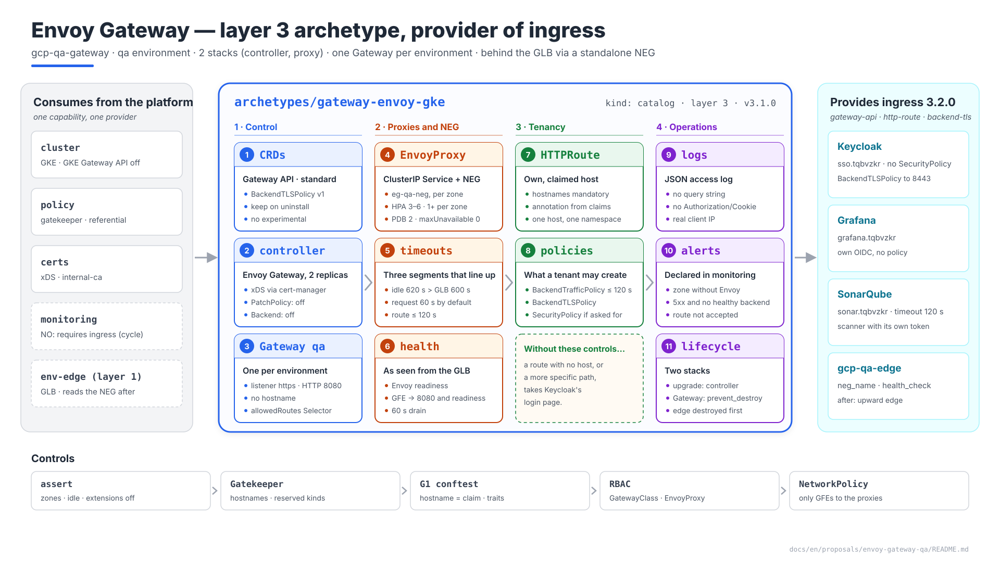
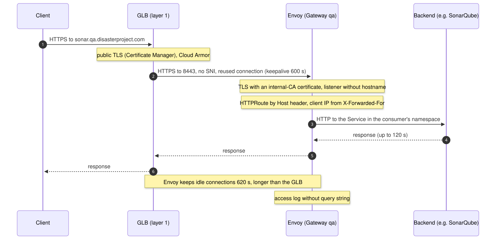

# Envoy Gateway on `qa` — `gateway-envoy-gke` archetype (layer 3), provider of `ingress`

| | |
|---|---|
| **Status** | Proposal · revision 7 |
| **Scope** | The layer 3 `gateway-envoy-gke` archetype on `qa`: the path of a request from the GLB to the pod, the environment's single Gateway, who may attach which route and with which policy, the Gateway API CRDs, the proxy fleet and its relationship with the NEG, timeouts, observability, network, the `ingress` contract, stacks, policies, execution and plan |
| **Why now** | SonarQube (S1 §4.5, S2 §5.8), Keycloak (§8), monitoring (Grafana) and cert-manager (§1, §3) already publish routes on the `qa` Gateway or issue it certificates, and each one took it for granted. S2 §9 left it three open requirements |
| **Reference specification** | `archetype-model.md` (AM §n), `terramate-outputs-sharing-architecture.md` (§n), `risk-register.md` |
| **Diagrams** | `diagrams/*.mmd` (Mermaid source) and `diagrams/*.svg` (rendered). The SVG is regenerated from the `.mmd`; never hand-edited. `diagrams/06-bloques-presentacion.svg` (1920×1080, for presentations) is generated by `06-bloques-presentacion.py`, not Mermaid |
| **Local identifiers** | Decisions `DG1…`, candidate risks `RG1…`, verifications `VG1…`. Risks get an `R54+` number in `risk-register.md` if adopted, after those of the earlier proposals |

Nothing in this document reopens a decision of `CLAUDE.md` (Envoy Gateway for ingress; one Gateway per environment; Gateway API resources in the chart with `helm_release`, never `kubernetes_manifest`) or of S1 (`qa`'s own edge in `disasterproject-nonprod`, standalone NEG, separate VPC).



Source: [`diagrams/06-bloques-presentacion.py`](diagrams/06-bloques-presentacion.py) — presentation view; the detail is in §2–§9.

---

## 0. Context

| Question | Answer | Consequence |
|---|---|---|
| What it is | Archetype `gateway-envoy-gke`, `kind: catalog`, **layer 3**, provides **`ingress` 3.2.0** | The `qa` binding already binds it: `ingress: { archetype: gateway-envoy-gke, version: 3.1.0, stack_id: gcp-qa-gateway }` |
| Stacks | 2: `gcp-qa-gateway-controller` and `gcp-qa-gateway-proxy` in `stacks/platforms/gcp/qa/gateway/` | Deleting the Gateway deletes the NEG and leaves the environment without an edge: its own lifecycle (§8.2) |
| Components | Envoy Gateway controller; Envoy proxy fleet; Gateway API CRDs (standard channel) and Envoy Gateway CRDs | All Apache-2.0 |
| What it does **not** do | The GLB, Cloud Armor, the IP and the public certificate (layer 1, `gcp-qa-edge`); DNS (wildcard in `env-edge`); OIDC for SonarQube, Grafana or Keycloak, which authenticate on their own | §1 |
| Consumers on `qa` | Keycloak, Grafana and SonarQube: **three routes, none with a `SecurityPolicy`** | The Gateway's OIDC machinery is ready for future applications, unused on day one |
| Model | `qa` dedicated | No `capacity` budgets enforced (S1 §0) |



Source: [`diagrams/01-contexto.mmd`](diagrams/01-contexto.mmd)

---

## 1. What the Gateway does and what it does not

| Segment or function | Who | Reason |
|---|---|---|
| Global IP, `*.tqbvzkr.disasterproject.com` certificate, Cloud Armor, backend service, URL map | **`gcp-qa-edge`**, layer 1 (S1 §4.15) | Must share a project with the load balancer |
| NEG `eg-qa-neg` | The **GKE NEG controller**, from the annotation on the Service that Envoy Gateway generates | Outside Terraform state (§10.2, R20); `gcp-qa-edge` reads it as a `data` source |
| GLB → Envoy leg | **HTTP**, no certificate (DG14) | Public TLS terminates at the GLB with the layer-1 certificate. A certificate from the internal CA on this leg made the edge (layer 1) depend on cert-manager (layer 3), and the GLB did not validate it: it encrypted without authenticating |
| Routing by host and path, traffic policies | This archetype: the `qa` Gateway and the consumers' `HTTPRoute`s | Gateway API: the route lives with whoever publishes it (§10.6) |
| User authentication | **Each application**; the OIDC `SecurityPolicy` only if the consumer asks for it (§4.3) | SonarQube (S1 §4.6), Grafana and Keycloak cannot carry one |
| East-west traffic | **Nobody**: the Service's DNS name | `CLAUDE.md`; Envoy is not a mesh |

**The upward edge.** `gcp-qa-edge` (layer 1) consumes the NEG that this layer 3 creates: it is the one edge pointing down the graph (AM §3), declared with `after` (§8.3).

---

## 2. The path of a request



Source: [`diagrams/02-camino-peticion.mmd`](diagrams/02-camino-peticion.mmd)

### 2.1 The listener

| Setting | Value | Reason |
|---|---|---|
| Listener | One, `http`, **port 8080**, `protocol: HTTP` | Above 1024: no port remapping and no capabilities in the container. Only the GFE ranges reach it (§5.2, §9.3) |
| Listener `hostname` | **None** | The host is decided in the `HTTPRoute`s, by the `Host` header (DG2): one place where which name goes to which service is declared |
| Certificate | **None** on the listener | cert-manager still issues the controller's xDS certificates (DG9) and those for `BackendTLSPolicy` towards backends that require it; none goes towards the edge |
| HTTPS listener | **No** | The client only speaks TLS to the GLB; the HTTP-to-HTTPS redirect is done by the GLB's URL map. The application knows the origin was HTTPS from `X-Forwarded-Proto` and from its pinned base URL (`sonar.core.serverBaseURL`, Keycloak's `hostname`) (VG1) |
| `allowedRoutes` | `kinds: [HTTPRoute]`, `namespaces.from: Selector` with `gateway.disasterproject.com/routes: "true"` | §4.1 |

### 2.2 Timeouts

Three segments, each with its own timeouts. If they do not line up, the failure is an intermittent 502 with nothing in the application's logs.

| Segment | Setting | Value | Reason |
|---|---|---|---|
| GLB → Envoy, keepalive | Fixed in the GLB | 600 s | Google decides it |
| Envoy, idle client connection | `ClientTrafficPolicy` `timeout.http.idleTimeout` | **620 s** | Must exceed the GLB keepalive. If Envoy closes first, the GLB reuses a dead connection and returns 502 (RG2, VG4) |
| GLB, backend response | Backend service timeout (`gcp-qa-edge`) | 120 s | R45 |
| Envoy, request | `BackendTrafficPolicy` on the **Gateway**: `timeout.http.requestTimeout: 60s` as the default | 60 s | Envoy applies **15 s** to every route by default unless something changes it **(verify on the pinned version, VG6)**: a large analysis upload would be cut there (RG9) |
| Envoy, request on a specific route | `HTTPRoute` `rules[].timeouts.request` (standard channel) | ≤ 120 s | The route overrides the Gateway value. Above 120 s it is useless: the GLB cuts first |

### 2.3 Body size

S2 §9 asked for "a body limit no lower than 100 MiB". Envoy does **not** limit the body while streaming it. A limit only appears with filters that buffer it (`ext_authz` with body, transformations, Wasm). The requirement is met **without** configuring any limit and without enabling those filters on the Gateway. An assert protects this (§9.1), and VG11 checks it with a 100 MiB upload through the GLB.

### 2.4 Client IP

The GLB appends `<client IP>,<GLB IP>` to `X-Forwarded-For`. A `ClientTrafficPolicy` with `clientIPDetection.xForwardedFor.numTrustedHops: 2` makes Envoy log and pass on the real client IP **(verify the exact number with a real request, VG5)**. Without it, access logs and any per-IP limiting see only the GFE IPs.

---

## 3. Gateway API CRDs

| Option | Verdict |
|---|---|
| **A. This archetype installs them** (Envoy Gateway's CRD chart, **standard channel**) and GKE's Gateway API is **disabled** | **Yes** (DG3). One version, the one Envoy Gateway expects |
| B. GKE installs them (`gateway_api_config.channel = CHANNEL_STANDARD`) | No. GKE manages the CRDs, upgrades them with the cluster and does not allow modifying them, so the version stops being the one Envoy Gateway asks for. The `gke-l7-*` `GatewayClass`es also appear, and with them anyone who creates a `Gateway` would get a Google load balancer without Cloud Armor (RG5) |

| Setting | Value |
|---|---|
| Channel | **Standard**. `BackendTLSPolicy` has been in it since Gateway API v1.4, and it is the only thing needed beyond `Gateway`, `HTTPRoute` and `ReferenceGrant` |
| Experimental channel | **No**: no `TCPRoute`, `TLSRoute` or `UDPRoute`. Consistent with not offering `tcp-route` (§7.1) |
| Envoy Gateway version | The latest stable minor at implementation time, **≥ 1.6**, the first to implement Gateway API v1.4 **(verify, VG10)** |
| CRD annotation | `helm.sh/resource-policy: keep`: uninstalling the chart does not delete anyone's `HTTPRoute`s (the same pattern as ESO RE1 and cert-manager RT4) |
| GKE | `gateway_api_config { channel = "CHANNEL_DISABLED" }` on `gcp-qa-gke`: a new requirement on S1 §4.1 (§11) |

---

## 4. Who may attach what



Source: [`diagrams/03-tenencia.mmd`](diagrams/03-tenencia.mmd)

With a shared Gateway, Gateway API precedence decides between routes **from different namespaces**. The most specific path match wins, wherever it comes from. A tenant's `HTTPRoute` with host `sso.tqbvzkr.disasterproject.com` and `Exact: /realms/disasterproject/protocol/openid-connect/auth` would take Keycloak's login page. An `HTTPRoute` **without `hostnames`** applies to every host on the listener. This is the archetype's main risk (RG1).

### 4.1 Attaching a route

| Control | Where | What it prevents |
|---|---|---|
| Label `gateway.disasterproject.com/routes: "true"` on the namespace | The Gateway's `allowedRoutes` | Any namespace at all publishing. Set by the consumer's `iam` stack |
| Annotation `gateway.disasterproject.com/hostnames` on the namespace, with the hostnames resolution allocated to the instance | `iam` stack, from the claims (AM §8) | — (it is the data the next two rules use) |
| `HTTPRoute` with mandatory `hostnames`, no wildcards, contained in that annotation | Gatekeeper (§9.2) | Routes with no host, and another tenant's hosts |
| One hostname, one namespace | Gatekeeper with `referential-constraints` (synced `HTTPRoute` data) | Two namespaces publishing the same host, even on different paths |
| The hostname is a claim of the instance | conftest G1 against the claims ledger | The `iam` stack writing a host that is not its own into the annotation. All `qa` stacks are applied with the same pipeline identity, so this is the underlying control; Gatekeeper checks shape (the same split as S2 §5.5) |
| `parentRefs` only to the `qa` Gateway in `envoy-gateway-system`, section `https` | Gatekeeper | Routes attached to another Gateway |
| `backendRefs` only to Services in the route's own namespace | Gatekeeper, unless an authorised `ReferenceGrant` exists (§4.3) | A route serving another tenant's Service |

### 4.2 What a tenant may **not** create

| Kind | Reason | How |
|---|---|---|
| `Gateway` outside `envoy-gateway-system` | Every `Gateway` creates its own Envoy fleet and Service. A tenant Gateway reintroduces the fan-in (§10.6) and could try to claim the same NEG name | Gatekeeper |
| `GatewayClass`, `EnvoyProxy` | They configure the fleet and the edge Service | RBAC (cluster-scoped, or in the Gateway's namespace) and Gatekeeper |
| `ClientTrafficPolicy` | Attaches to the Gateway: affects everyone | Gatekeeper: only in `envoy-gateway-system` |
| `EnvoyPatchPolicy` | Patches xDS by hand: anything at all, including another route | **Disabled** in the controller (`extensionApis.enableEnvoyPatchPolicy: false`) and denied by Gatekeeper |
| `Backend` (Envoy Gateway CRD) | A backend at an arbitrary IP or FQDN: from the Gateway one could reach `169.254.169.254` (the metadata server) or any IP in the VPC | **Disabled** (`extensionApis.enableBackend: false`) and denied |
| `EnvoyExtensionPolicy` | Wasm, Lua or `ext_proc` running **inside** the shared proxy | Gatekeeper: denied outside `envoy-gateway-system` |
| `Service` of type `LoadBalancer` or `NodePort`, and `externalIPs` | A Google load balancer beside the Gateway, without Cloud Armor (RG5) | Rules P5 and P6 of `policy-gatekeeper` (Gatekeeper proposal §4.1): they are not kinds of this archetype. For non-HTTP protocols, an exception by name with a business justification (§4.4) |

### 4.3 What a tenant may create, within limits

| Kind | Limit | Reason |
|---|---|---|
| `HTTPRoute` | §4.1 | — |
| `BackendTrafficPolicy` on its routes | `requestTimeout` ≤ 120 s; no `targetRefs` to the Gateway | Above 120 s the GLB cuts first (§2.2) |
| `BackendTLSPolicy` on its Services | `caCertificateRefs` to the `internal-ca-bundle` `ConfigMap` or to `WellKnownCACertificates: System` | Keycloak §8.1; trust distributed by trust-manager (cert-manager §4) |
| OIDC or JWT `SecurityPolicy` on its routes | Only in namespaces labelled `gateway.disasterproject.com/security-policy: "true"`, which the generator sets if the manifest requires the `oidc-security-policy` or `jwt-auth` trait. Never on Keycloak's route (R22). Always with `provider.backendRefs` to `internal_service` (Keycloak §8.2) | A `SecurityPolicy` breaks machine clients (R44); it is opted into, not inherited |
| `ReferenceGrant` | **Only** in the `keycloak` namespace, named `sp-<instance>`, `from` = `SecurityPolicy` in its own namespace, `to` = the Keycloak Service | `provider.backendRefs` crosses namespaces: without a `ReferenceGrant` at the destination, Envoy Gateway rejects it **(verify, VG7)**. A new Keycloak tenant resource (§11) |

**No `SecurityPolicy` at Gateway level.** It would authenticate everything, including SonarQube's CI and Keycloak itself (R22, R44). An assert in `proxy` prevents it (§9.1).

**Fail-closed.** With Keycloak down, a route with a `SecurityPolicy` denies (Keycloak DK6). On `qa` there are none on day one.

### 4.4 Non-HTTP traffic: exceptions to `LoadBalancer` and `NodePort`



Source: [`diagrams/07-excepciones.mmd`](diagrams/07-excepciones.mmd)

`qa`'s edge is an L7 load balancer and carries only HTTP(S). The default rule of §4.2 (no `LoadBalancer` or `NodePort` `Service`) leaves non-HTTP protocols with no way out. For those cases an **exception by name** is allowed, with a business justification that is reviewed in the PR and expires (DG13). The exception is always **direct L4 communication** (pattern B): the load balancer terminates nothing, the source IP arrives intact and TLS, if any, terminates in the application.

**A `NodePort` on its own publishes nothing.** `qa`'s nodes are private, and the org policy forbids public IPs on them (S1 §5). A `NodePort` opens a port in the 30000–32767 range on **every** node, visible only from inside the VPC. For a third party to reach an SSH service, a load balancer is needed in front, and which one is the real decision:

| Pattern | What sits in front | In Terraform state? | Client IP at the application | Verdict |
|---|---|---|---|---|
| A. `Service` `LoadBalancer` | A passthrough network load balancer that GKE creates per Service | **No** | Yes | **Not allowed**. A controller creates and deletes it: outside state, no review of the edge in the PR, and the IP tied to the Service's lifecycle |
| **B. Fixed `NodePort` + external passthrough network load balancer in `gcp-qa-edge`** | Regional backend service in Terraform over the nodes' instance groups | Yes | **Yes** | **Chosen pattern** (DG13) for all non-HTTP traffic: direct communication, unchanged source IP (auditing, source lists), TCP and UDP, and end-to-end TLS |
| C. `ClusterIP` with a standalone NEG + external proxy network load balancer (TCP) in `gcp-qa-edge` | The same model as the HTTP path (§10.2) | Yes, except the NEG | Only with PROXY protocol in the application | **Discarded**: it puts a proxy in between, loses the source IP unless the application understands PROXY protocol, does not support UDP and terminates connections that must be direct |
| D. Internal (`networking.gke.io/load-balancer-type: Internal`) | **Internal** passthrough network load balancer towards the hub or on-premises | Yes, declared in Terraform like B | Yes | The internal variant of B. Only if the peering or VPN exists (S1 §4.15); goes through the same exception |

**A passthrough does not translate ports.** The load balancer delivers the packet with its original destination IP and port. If the published port is 22, the node receives `load balancer IP:22`, not the `nodePort`. There are two ways for it to reach the pod:

| Way | When | Condition |
|---|---|---|
| The published port **is** the `nodePort` (30000–32767) | The counterparty can use a high port | None |
| The `Service` declares `externalIPs: [load balancer IP]` and kube-proxy captures that destination on every node | The port is imposed (22 for SFTP, 25 for SMTP) | `externalIPs` lets a `Service` hijack traffic to any IP (CVE-2020-8554). Gatekeeper only admits it with the IP claimed by that same exception **(verify, VG13)** |

**Certificate for an exception with TLS (open question, formerly Q-B1 of the Kafka proposal).** With pattern B, TLS terminates in the pod, and an internet counterparty expects a public name. The internal CA does not sign those (cert-manager DT10), and the Certificate Manager certificate is not exported to a pod. There are two options:
- an ACME `ClusterIssuer` with DNS-01, bounded to the names of approved `exposures`;
- a private CA that the counterparty installs.

The first is recommended, because the counterparty does not have to trust anything of ours. Until it is decided, only exceptions whose protocol does not depend on our certificate (SFTP authenticates the server by its host key) or of pattern D are admitted.

**Admissible cases**: the protocol is not HTTP and the counterparty cannot change it.

| Case | Port | Why there is no implicit option | Required business justification | Pattern |
|---|---|---|---|---|
| **SFTP with third parties** (banks, public administrations, suppliers) | 22 published; the container listens on 2222 | The third party only delivers or collects over SFTP; it has no API and no HTTPS | The contract or third-party specification that requires it; the business process that depends on the exchange; volume and frequency; data classification | B, with the third party's IP list |
| **Git over SSH** to an in-house Git server | 22 | Almost never: HTTPS with a token covers it through the Gateway | An external tool that only supports SSH, identified by name and version | B; rejected if HTTPS works |
| **MQTT or AMQP from devices** | 8883, 5671 | Pinned firmware that does not speak MQTT over WebSocket (the implicit option, which does pass through the Gateway) | Device fleet, firmware version and the planned upgrade date | B, TLS only |
| **mTLS terminated in the application** (regulated client certificate) | 443 on its own IP | The GLB terminates TLS. Its mTLS at the edge (with a `TrustConfig`) passes the certificate data in headers, which is the implicit option and is usually enough | A cited regulation that requires the application to validate the client's full chain | B |
| **Inbound SMTP mail** | 25 (and 587 if third parties send authenticated) | A process receives documents by email (invoices, orders) | The process, the volume, and why a managed mail service delivering by HTTP webhook (the implicit option) does not work | B, with mandatory STARTTLS |
| **LDAPS** to an in-house directory | 636 | Third-party or legacy applications that only authenticate against LDAP | Application, version, and why it supports neither OIDC nor SAML against Keycloak (the implicit option) | D if the application is on the corporate network; B only with an IP list |
| **RADIUS** | UDP 1812/1813 | Network or Wi-Fi equipment that authenticates users against the environment | Equipment inventory and the access process that depends on it | D preferred; B with an IP list |
| **Industrial protocols** (OPC UA) | 4840 | Plant equipment and gateways that only speak OPC UA | Plant, equipment and the data collected | B with OPC UA in `SignAndEncrypt` mode; unencrypted ones (Modbus TCP 502) only through D |
| **Healthcare** (HL7 v2 over MLLP, DICOM) | 2575, 104/11112 | Clinical equipment and hospital integrations that do not speak FHIR/HTTP | Site, equipment and clinical flow; health data, highest classification | D, or B with TLS; never in clear over the internet |
| **Finance** (FIX, ISO 8583) | The one agreed with the counterparty | Markets or payment processors with an imposed protocol | Contract with the counterparty and its connectivity specification | B with TLS and the counterparty's IP list, or D over the dedicated line |
| **SNMP traps and syslog from managed equipment** | UDP 162, 514/6514 | Equipment that only notifies over SNMP or syslog | Equipment inventory and the operations process that depends on the alerts | B (passthrough supports UDP) or D |
| **Voice** (SIP and RTP) | 5060/5061, RTP range | PBXs and an operator's SIP trunks | Contract with the operator and a bounded RTP port range | B, with SIP over TLS (5061) and SRTP |

**Never a valid exception:**

| Request | Alternative |
|---|---|
| Administrative SSH to nodes or pods | `kubectl exec` with the pipeline's access (S1 §4.13), IAP for nodes |
| A database exposed to external tools (BI, SQL clients) | Private connectivity (pattern D) or an export; never a database port on the internet |
| Debugging, testing or "temporary" | An ephemeral environment; `kubectl port-forward` |
| Getting around Cloud Armor, the timeouts or the Gateway's body size | Fix it in the Gateway (§2.2, §2.3) |
| A VPN terminated in a pod (IPsec, WireGuard) | Cloud VPN or Interconnect at layer 0 or 1 |
| An in-house authoritative DNS | Cloud DNS |
| An unencrypted protocol over the internet (Modbus, HL7 MLLP in clear, SNMPv1/v2c) | Pattern D over the private network, or the same protocol with TLS |
| gRPC or WebSocket | They are HTTP: they go through the Gateway (gRPC with the `grpc-route` trait when it is offered, §7.1) |
| Kafka from outside the VPC | None: Kafka is an internal bus. VPC clients outside the cluster are served by the archetype itself through an internal load balancer (Kafka proposal §6.3, DB8) |

**How it is declared.** A new `exposures` block in the manifest. It is a schema extension that comes in through `registry/`, not by hand (R34); **proposed, not applied**:

```yaml
exposures:
  - name: sftp-partners
    service: sftp                   # Service in the own namespace
    protocol: TCP
    tls: true                       # SFTP is encrypted; without TLS only with pattern: internal
    port: 22                        # port published on the load balancer
    targetPort: 2222
    nodePort: 30022                 # fixed: deterministic firewall rules and health check
    externalIP: claim               # 22 is imposed: the Service declares externalIPs with the claimed IP
    pattern: passthrough            # passthrough (B, external) | internal (D, internal variant)
    sources: [203.0.113.0/28]       # 0.0.0.0/0 only with public: true and a second approval
    justification:
      business_owner: team-integrations
      reason: "Daily file delivery from <third party> over SFTP (contract <ref>)"
      alternative_rejected: "The third party offers no API or HTTPS (<ref>)"
      data_classification: confidential
      review_by: 2027-03-31
```

| Control | Where | What it checks |
|---|---|---|
| Complete declaration | G1 | Every `LoadBalancer` or `NodePort` `Service` in the chart has its `exposures` entry; the `justification` fields are non-empty; `review_by` has not passed. An expired exception **fails the next PR** and forces a review |
| Bounded source | G1 | `sources` is not `0.0.0.0/0` unless `public: true`, which requires security's approval as well as the platform's |
| Encryption | G1 | A protocol declared without TLS (`tls: false`) is only admitted with `pattern: internal` |
| Approval | `CODEOWNERS` on `exposures` | Platform and security review the PR, like raising `capacity` in a shared environment (developer guide, `CLAUDE.md`) |
| Admission exemption | Gatekeeper (`policy-gatekeeper`) | The exemption is per `namespace/Service`, generated by the resolver into the constraint's parameters, **never for a whole namespace**. Pattern A (`LoadBalancer` without `internal`) is always denied |
| `externalIPs` | Gatekeeper | Only on a `Service` with an exception and only with the IP it claimed; denied on any other (CVE-2020-8554) |
| The load balancer | `gcp-qa-edge-l4` (`edge-qa` proposal §5) | Forwarding rule, backend service and firewall rule per exception, with `sources` in the rule. The IP is a claim of the environment (AM §8) |
| Compensating controls | Consumer archetype | Without Cloud Armor at L7, the application authenticates with keys, never passwords (SFTP), logs the source IP, and its `NetworkPolicy` admits only the published port |

---

## 5. The proxy fleet and the NEG



Source: [`diagrams/05-despliegue.mmd`](diagrams/05-despliegue.mmd)

### 5.1 `EnvoyProxy`

| Setting | Value | Reason |
|---|---|---|
| Service | `type: ClusterIP` with `cloud.google.com/neg: '{"exposed_ports":{"8080":{"name":"eg-qa-neg"}}}'` | No load balancer per Service; deterministic NEG name (§10.2) |
| Replicas | HPA **3–6**, CPU at 70 % | Zonal NEG: ≥ 1 pod per `europe-west1` zone (b, c, d); assert `minReplicas ≥ zones` (§10.2, RG3) |
| Spread | `topologySpreadConstraints` by `topology.kubernetes.io/zone`, `maxSkew: 1`, `DoNotSchedule`; by node, `ScheduleAnyway` | A zone without pods leaves its NEG empty |
| Node pool | The general one, not `sonar` | The `sonar` pool is single-zone and tainted (S1 §4.1) |
| `PodDisruptionBudget` | `minAvailable: 2` | A node upgrade does not leave a zone without Envoy |
| Rollout | `maxUnavailable: 0`, `maxSurge: 1`, `minReadySeconds: 30` | The new pod takes time to show as healthy in the GLB. With a standalone NEG there is no *readiness gate* to wait for that **(verify, VG3)**, so a fast rollout leaves the GLB with no healthy backends for a few seconds (RG4) |
| Draining | `shutdown.drainTimeout: 60s`; `terminationGracePeriodSeconds: 90`; `connection_draining_timeout_sec: 60` on the backend service | The GLB stops sending before Envoy closes |
| Resources per pod | Request 500m / 512 MiB; memory limit 1 GiB | A starting point; tuned from the metrics of phase 3 |
| Security | PSS `restricted`: non-root, `drop: [ALL]`, `seccompProfile: RuntimeDefault` | Port 8080 does not need `NET_BIND_SERVICE` **(verify the `shutdown-manager` sidecar, VG12)** |
| Access log | JSON to stdout; path as **`%REQ_WITHOUT_QUERY(:PATH)%`**; `x-request-id`, route name, `%RESPONSE_FLAGS%`, client IP (§2.4) | The OIDC callback's query carries `code` and `state`, and Keycloak's carries session codes: they must not end up in Loki (RG8). No `Authorization` or `Cookie` headers |

### 5.2 Health as seen from the GLB

| Setting | Value | Reason |
|---|---|---|
| Health check | HTTP, `USE_FIXED_PORT` to Envoy's readiness port, path `/ready` **(port to confirm on the pinned version, VG2)** | Against 8080, a request with no known host returns 404 and the GLB would mark every backend down |
| VPC firewall | `35.191.0.0/16` and `130.211.0.0/22` → nodes, TCP 8080 and the readiness port | Both data traffic and GLB health checks arrive from those ranges. A legitimate `cidr:` selector (AM §6.3); declared by this manifest (§8.1) |

### 5.3 The controller

| Setting | Value | Reason |
|---|---|---|
| Replicas | 2, with leader election | If it goes down, the proxies keep the last configuration; only changes freeze |
| xDS certificates (controller ↔ proxies) | From **cert-manager** (`internal-ca`), instead of the chart's `certgen` Job **(verify support on the pinned version, VG8)** | `certgen`'s certificates do not renew themselves, so when they expire the proxies lose the control plane (RG10). With cert-manager they renew, and cert-manager's alerts (§6) watch them |
| Extensions | `enableEnvoyPatchPolicy: false`, `enableBackend: false` | §4.2 |
| `mergeGateways` | No | A single Gateway (§10.6) |

---

## 6. Observability

The monitoring archetype declares the rules (monitoring §5.1): `monitoring` requires `ingress` to publish Grafana, so `ingress` cannot require `monitoring`. This is the same cycle as ESO §9.1 and cert-manager §6.

| Alert | Signal | Threshold |
|---|---|---|
| Zone without Envoy | kube-state-metrics: `Ready` proxy pods per zone | 0 in any zone for 5 min: its NEG is empty |
| 5xx errors per route | `envoy_cluster_upstream_rq_xx{envoy_response_code_class="5"}` | > 5 % for 10 min |
| No healthy backend | `%RESPONSE_FLAGS%` `UH` and `UF` in the access log, or `envoy_cluster_membership_healthy == 0` | Any, for 5 min |
| Routes not accepted | kube-state-metrics (custom resource state) on the `HTTPRoute`'s `status.parents[].conditions` | `Accepted=False` or `ResolvedRefs=False` > 10 min: almost always a wrong hostname or `parentRefs` |
| Gateway not programmed | Same, on the `Gateway` | `Programmed=False` > 5 min |
| Controller | Controller metrics (xDS translation errors) **(names to confirm, VG10)** | Any, sustained |
| xDS certificates | cert-manager §6 | < 14 days |
| Backends down as seen from the GLB | Cloud Monitoring, `loadbalancing.googleapis.com/https/backend_request_count` by response class. A metric-based alert of **layer 1b** (`cloud-observability`) | 5xx of `backend` origin > 5 % for 10 min |

The last one is the only alert that sees what Prometheus cannot: a GLB with no healthy backends never reaches Envoy.

---

## 7. The `ingress` 3.2.0 contract

### 7.1 Outputs and traits

| Output | Value on `qa` | Use |
|---|---|---|
| `gateway_name` | `qa` | `parentRefs` of the `HTTPRoute`s (S2 §5.8) |
| `gateway_namespace` | `envoy-gateway-system` | Same; the consumers' `NetworkPolicy` (Envoy → their Service) |
| `listener_name` | `https` | `parentRefs[].sectionName` |
| `route_namespace_label` | `gateway.disasterproject.com/routes: "true"` | Namespace label required to attach routes |
| `security_policy_label` | `gateway.disasterproject.com/security-policy: "true"` | Namespace label required to create a `SecurityPolicy` |
| `neg_name` | `eg-qa-neg` | `gcp-qa-edge`: `data "google_compute_network_endpoint_group"` per zone |
| `health_check` | `{ port: 19003, path: "/ready" }` (port to confirm, VG2) | `gcp-qa-edge`: the backend service's health check |

All are deterministic; consumers receive them as globals. `gcp-qa-edge` also needs `after`: the NEG does not exist until there are ready proxies (§8.3). The last five are new and compatible with the version already consumed (`>=3.0.0 <4.0.0`), so the contract goes to **3.2.0** (MINOR, AM §4.5).

| Trait | Offered? | Reason |
|---|---|---|
| `gateway-api`, `http-route` | Yes | — |
| `cross-namespace-refgrant` | Yes | `ReferenceGrant` to Keycloak (§4.3) |
| `oidc-security-policy`, `jwt-auth` | Yes | Envoy Gateway `SecurityPolicy` |
| `local-rate-limit` | Yes | `BackendTrafficPolicy` |
| **`backend-tls`** (new) | Yes | `BackendTLSPolicy`, standard channel. Keycloak uses it (§8.1 of its proposal) and until now no trait could express it (DG11) |
| `grpc-route` | **No** | The GLB's backend service speaks HTTPS (HTTP/1.1) to Envoy. gRPC would require HTTP/2 at the edge; it will be offered when someone needs it |
| `tcp-route` | **No** | Experimental channel, and it does not pass through an L7 load balancer anyway |
| `global-rate-limit` | **No** | Needs the rate-limit service and Redis |
| `mtls-backend` | **No** | Nobody on `qa` asks for it |
| `ingress-api` | **No** | No classic `Ingress` |

### 7.2 What a consumer writes

```yaml
apiVersion: gateway.networking.k8s.io/v1
kind: HTTPRoute
metadata: { name: sonarqube, namespace: sonarqube }
spec:
  parentRefs:
    - { name: qa, namespace: envoy-gateway-system, sectionName: https }   # = gateway_name, gateway_namespace, listener_name
  hostnames: [sonar.tqbvzkr.disasterproject.com]                               # = the instance's claim
  rules:
    - matches: [{ path: { type: PathPrefix, value: / } }]
      backendRefs: [{ name: sonarqube, port: 9000 }]
      timeouts: { request: 120s }                                         # ≤ backend service timeout
```

| Rule | Why |
|---|---|
| `hostnames` mandatory, no wildcards, equal to its claims | §4.1 |
| `timeouts.request` on the route, not a `BackendTrafficPolicy` | Standard channel; does not tie the consumer to an Envoy kind (§11) |
| Namespace with `route_namespace_label` | `allowedRoutes` |
| The consumer's `NetworkPolicy`: ingress from `envoy-gateway-system` to the Service's port | Every namespace is default-deny |

---

## 8. The archetype

### 8.1 Manifest

```yaml
# archetypes/gateway-envoy-gke/manifest.yaml
apiVersion: archetype/v1
kind: Archetype

metadata:
  name: gateway-envoy-gke
  version: 3.1.0
  layer: 3
  kind: catalog
  description: Envoy Gateway with one Gateway per environment, behind the GLB through a standalone NEG
  owners: [team-platform]

runtimes: [gke]

requires:
  - capability: cluster
    version: "^2.0.0"
  - capability: policy
    version: "^1.0.0"
    traits: [gatekeeper, referential-constraints]
  - capability: certs
    version: "^1.1.0"
    traits: [cert-manager]

provides:
  - capability: ingress
    version: 3.2.0
    traits: [gateway-api, http-route, backend-tls, cross-namespace-refgrant,
             oidc-security-policy, jwt-auth, local-rate-limit]
    outputs:
      - { name: gateway_name,          from: proxy }
      - { name: gateway_namespace,     from: controller }
      - { name: listener_name,         from: proxy }
      - { name: route_namespace_label, from: proxy }
      - { name: security_policy_label, from: proxy }
      - { name: neg_name,              from: proxy }
      - { name: health_check,          from: proxy }

stacks:
  - name: controller
  - name: proxy
    after: [controller]

firewall:                             # to the nodes where the proxies run (self)
  - name: glb-gfe-to-envoy
    from: cidr:35.191.0.0/16
    to: self
    ports: [8080, 19003]              # 19003: proxy readiness, to confirm (VG2)
  - name: glb-legacy-to-envoy
    from: cidr:130.211.0.0/22
    to: self
    ports: [8080, 19003]

capacity:
  cpu_millicores: 3200
  memory_mib: 3584
  pods: 8
  workload_identities: 0
```

`runtimes: [gke]`: the NEG is GKE's; EKS and AKS have other archetypes (`gateway-envoy-eks`, `gateway-agfc-aks`, AM §14.2). The archetype stays at **3.1.0**, the version the `qa` and `demos` bindings pin; what goes up is the contract, as in cert-manager §8.1. **It does not require `monitoring`**, because monitoring requires `ingress`. Nor `secrets`: the Gateway holds no secret, and OIDC client secrets belong to each consumer (Keycloak §6.5). Nor `oidc-idp`, because Keycloak requires `ingress`.

### 8.2 The stacks

| Stack | Contents | Inputs via sharing |
|---|---|---|
| `controller` | Namespace `envoy-gateway-system` (PSS `restricted`); `helm_release` of the CRDs (standard channel, `keep`) and of the Envoy Gateway controller (§5.3); xDS `Certificate`; `NetworkPolicy` (§9.3); the `ConstraintTemplate`s for the Gateway API and Envoy Gateway kinds | `cluster_endpoint`, `cluster_ca` |
| `proxy` | Own chart with `GatewayClass` `envoy-qa`, `EnvoyProxy` `edge-proxy`, `Gateway` `qa`, `ClientTrafficPolicy`, default `BackendTrafficPolicy`, HPA, PDB and the `Constraint`s of §9.2; `prevent_destroy` on the `helm_release` | `cluster_*` |

**Why two stacks.** Upgrading Envoy Gateway is routine; deleting the Gateway is not. Deleting it deletes the Service, the NEG controller deletes `eg-qa-neg`, and the GLB is left with no backends, taking the whole environment out of service. With separate stacks, a version PR never plans a change to the Gateway, and destroying it takes an explicit PR that removes `prevent_destroy`. This is the same reasoning as cert-manager's CA, §8.2.

### 8.3 Order

| Edge | Type | Reason |
|---|---|---|
| `proxy` → `gcp-qa-certs-ca` | `after` | The backend `Certificate` needs the `ClusterIssuer` (cert-manager RT6) |
| `gcp-qa-edge` → `proxy` | `after` + NEG `data` source | The upward edge (§1). In preview, the `data` source fails and the mock is used (`--mock-on-fail`, §10.2) |
| Consumers (`frontdoor` of Keycloak, Grafana and SonarQube) → `proxy` | `after` | An `HTTPRoute` created before the Gateway sits at `Accepted=False` until it exists. It breaks nothing, but it muddles the exit criterion |

Destruction runs in reverse order: `gcp-qa-edge` first (the backend service lets go of the NEG), then the Gateway. The other way round, the NEG is retained because it is still referenced (§10.8).

---

## 9. Policies and network

### 9.1 `assert` at generation

```hcl
assert {
  assertion = global.gateway_values.proxy.hpa.minReplicas >= length(global.cluster.zones)
  message   = "ingress: minReplicas below the number of zones leaves a NEG empty (RG3)"
}
assert {
  assertion = !tm_can(global.gateway_values.gateway.listeners[0].hostname)
  message   = "ingress: the listener carries no hostname; routes decide the host (DG2)"
}
assert {
  assertion = global.gateway_values.clientTrafficPolicy.idleTimeoutSeconds > 600
  message   = "ingress: Envoy idle timeout above the GLB's 600 s keepalive (RG2)"
}
assert {
  assertion = !global.gateway_values.controller.enableEnvoyPatchPolicy && !global.gateway_values.controller.enableBackend
  message   = "ingress: EnvoyPatchPolicy and Backend disabled (RG6)"
}
assert {
  assertion = !tm_can(global.gateway_values.gateway.securityPolicy) && !tm_can(global.gateway_values.gateway.bodyBuffering)
  message   = "ingress: no SecurityPolicy or buffering at Gateway level (R22, R44, S2 §9)"
}
```

### 9.2 Gatekeeper and conftest

This archetype deploys the `ConstraintTemplate`s, because whoever defines a kind defines its admission rules (ESO §10.2). That is why it requires `policy`.

| Rule | Where | What it checks |
|---|---|---|
| **New:** `HTTPRoute` with its own host | Gatekeeper | `hostnames` non-empty, no wildcard, contained in the namespace annotation (§4.1) |
| **New:** unique host | Gatekeeper (`referential-constraints`) | No other `HTTPRoute` in another namespace uses the same host |
| **New:** `parentRefs` and `backendRefs` | Gatekeeper | Only the `qa` Gateway; `backendRefs` in the own namespace unless an authorised `ReferenceGrant` exists |
| **New:** reserved kinds | Gatekeeper | `Gateway`, `ClientTrafficPolicy`, `EnvoyProxy`, `EnvoyPatchPolicy`, `EnvoyExtensionPolicy` and `Backend` only in `envoy-gateway-system` |
| **New:** tenant `BackendTrafficPolicy` | Gatekeeper | `requestTimeout` ≤ 120 s; no `targetRefs` to a `Gateway` |
| **New:** `SecurityPolicy` only where asked for | Gatekeeper | Namespace with `security_policy_label`. Replaces the generic rule S2 §7.4 proposed. Keycloak §12's rules (never on its route; `backendRefs` to `internal_service`) stay |
| **New:** `ReferenceGrant` | Gatekeeper | Only `sp-<instance>` in `keycloak`, with the shape of §4.3 |
| **New:** claimed hostname | G1 | Every `hostnames` entry of an `HTTPRoute` in the chart is a claim of the instance in `resolution.json` |
| **New:** traits | G1 | A chart with a `SecurityPolicy` requires `oidc-security-policy` or `jwt-auth`; with a `BackendTLSPolicy`, `backend-tls`; with a `ReferenceGrant`, `cross-namespace-refgrant` |

### 9.3 Network



Source: [`diagrams/04-red.mmd`](diagrams/04-red.mmd)

Default-deny ingress and egress `NetworkPolicy` in `envoy-gateway-system`:

| Source | Destination | Port | Note |
|---|---|---|---|
| GLB GFEs (`35.191.0.0/16`, `130.211.0.0/22`) | Proxies | 8080 and readiness | `ipBlock`. The only ingress from outside the cluster, and the only one that reaches the HTTP listener |
| Prometheus | Proxies and controller | Metrics (19001 on the proxy) **(verify, VG10)** | |
| Proxies | Controller | 18000 (xDS) | |
| Proxies | Namespaces with `route_namespace_label` | Their Services' ports | Each consumer's `NetworkPolicy` restricts the port (§7.2) |
| Proxies | `keycloak` | 8443 | `SecurityPolicy` (`backendRefs`) and Keycloak's route |
| Controller | Kubernetes API | 443 | |
| All | kube-dns | 53 | |
| All | Internet | **Denied** | No OIDC against external IdPs: the IdP is Keycloak, in the cluster |

**No internal traffic goes through Envoy.** Grafana → Keycloak, the reconciler → Keycloak and any service-to-service call go through the Service (east-west by DNS, `CLAUDE.md`). That is why ingress to the proxies is limited to the GFEs.

---

## 10. Execution

| What | How |
|---|---|
| First deployment | Phase B of S1 §6, after `gcp-qa-policy` and `gcp-qa-certs-ca`, **before** `gcp-qa-edge`, Keycloak and monitoring. Exit criterion: `Gateway` `Programmed=True`; `eg-qa-neg` in all three zones with healthy endpoints in the GLB; a test `HTTPRoute` with a claimed host answers through the GLB; one without `hostnames` is rejected at admission |
| Envoy Gateway upgrade | `controller` stack: CRDs first, then the controller. The controller updates the proxies' image and rolls them out with `maxUnavailable: 0`. Rehearse in an ephemeral environment under load (VG3) |
| Gateway configuration change | `proxy` stack; a PR to the `ClientTrafficPolicy` or `EnvoyProxy` restarts the proxies if it changes the Deployment |
| Destruction | `gcp-qa-edge` first (§8.3). The `proxy` stack stops at `prevent_destroy` |

---

## 11. Changes to other documents

| Document | Change | Status |
|---|---|---|
| `registry/traits.yaml` and the `enum` in `schemas/archetype-manifest.schema.json` | Trait `backend-tls`, in the same commit and mechanically (R34) | **Applied** |
| AM §4.3 (`docs/en/` and `docs/es/`) | Add `backend-tls` to the Ingress row. The reading copy also lacked `eso` and `cert-manager`, so Secrets and Certs rows were added: by the AM's own rule, where it differs from the registry, the table is the bug | **Applied** |
| Keycloak proposal (§6.1, §8.2, §11.1, §12.3) | `ingress` `>=3.2.0` with `traits: [gateway-api, http-route, backend-tls, cross-namespace-refgrant]`; a new tenant resource `ReferenceGrant` `sp-{{ instance }}` (maxCount 1) for the consumers' `SecurityPolicy`s, and its shape constraint | **Applied** |
| SonarQube S2 §5.8 (and the chart tree, diagrams 11 and 14) | `timeouts.request: 120s` on the `HTTPRoute` instead of a `BackendTrafficPolicy` | **Applied** |
| SonarQube S2 §9, §7.4 and changes from S1; S1 §4.5 | The Gateway requirement is met: no body limit (§2.3), tenant `BackendTrafficPolicy` allowed within limits and `SecurityPolicy` only in labelled namespaces (§9.2) | **Applied** |
| SonarQube S1 §4.1 | `gateway_api_config.channel = CHANNEL_DISABLED` in the GKE table | **Applied** |
| cert-manager proposal §1, §3, §4.1 | `gateway-backend` policy removed: the internal CA only signs internal names, and external validation belongs to the load balancers with SNI and wildcards (cert-manager DT10). The backend certificate `envoy-qa.envoy-gateway-system.svc` is covered by `namespace-services` | **Applied** |
| `policy-gatekeeper`, `registry/` and the manifest schema, `gcp-qa-edge` | Rule: no `LoadBalancer` or `NodePort` `Service` except an exception by name; an `exposures` block with a business justification and expiry; one L4 load balancer per exception at the edge (§4.4) | **Applied** in `policy-gatekeeper` (P5, P6) and in the schema (`exposures`); the edge, pending its proposal |
| `gcp-qa-edge` (S1 §4.15) | Health check on Envoy's readiness port; `connection_draining_timeout_sec: 60`; `after` to `gcp-qa-gateway-proxy`; reads `neg_name` and `health_check` | **Resolved** in the `edge-qa` proposal (§4) |
| `iam` stacks of SonarQube (S2 §5.1, generator `gen_tenant_namespace`), Keycloak (§11.2) and monitoring (§10.2) | The `route_namespace_label` label and the `gateway.disasterproject.com/hostnames` annotation with the claimed hostnames; no `security_policy_label`, because none requires `oidc-security-policy` | **Applied** |

---

## 12. Decisions

| # | Decision | Status | Recommendation | Alternative |
|---|---|---|---|---|
| DG1 | Gateways | Consequence of §10.6 | One, `qa`, in `envoy-gateway-system` | One per tenant (fan-in, one NEG per Gateway) |
| DG2 | Listener | Proposal | HTTP 8080 without `hostname`; routes decide the host | Listener with `*.tqbvzkr.disasterproject.com` |
| DG3 | Gateway API CRDs | Proposal | Installed by the archetype, standard channel; GKE's Gateway API disabled | Managed by GKE |
| DG4 | Hostname ownership | Proposal | Claim + namespace annotation + referential Gatekeeper + G1 | Trust the tenants |
| DG5 | Envoy Gateway extensions | Proposal | `EnvoyPatchPolicy` and `Backend` disabled; `EnvoyExtensionPolicy` only in the Gateway's namespace | Available to tenants |
| DG6 | Timeouts | Proposal | Idle 620 s; request 60 s by default on the Gateway, ≤ 120 s per route | Envoy's defaults (15 s request) |
| DG7 | Fleet | Proposal | HPA 3–6, spread by zone, PDB 2, `maxUnavailable: 0`, 60 s drain | Fixed replicas |
| DG8 | GLB health check | Proposal | Envoy's readiness port | 8080 with a direct-response `/healthz` route |
| DG9 | xDS certificates | Proposal, pending VG8 | cert-manager | `certgen` Job without renewal |
| DG10 | Stacks | Proposal | `controller` and `proxy` separate, `prevent_destroy` on `proxy` | A single one |
| DG11 | `backend-tls` trait | Proposal, applied to the registry | Yes | No trait (Keycloak could not ask for it) |
| DG12 | Access log | Proposal | No query string and no credential headers | Default format |
| DG13 | Non-HTTP traffic | **Decided**: pattern B | Exception by name, declared in `exposures`, with a business justification, a bounded source and an expiry; direct L4 communication through a passthrough load balancer in `gcp-qa-edge` (D as the internal variant) | Pattern C (TCP proxy with NEG); a `LoadBalancer` `Service` created by GKE |
| DG14 | GLB → Envoy leg | **Approved** | HTTP: public TLS terminates at the GLB; the edge depends on no layer-3 certificate | HTTPS with the internal CA (an upward dependency, unvalidated); HTTPS with a platform CA (CAS) and a `TrustConfig`, if authenticating the leg is ever required |

---

## 13. Candidate risks

| # | Risk | Likelihood | Impact | Mitigation |
|---|---|---|---|---|
| RG1 | **Route hijacking**: a tenant's `HTTPRoute` with no `hostnames`, or with another tenant's host and a more specific path, captures its traffic (for example Keycloak's login) | Medium without controls | High — credential theft | §4.1; Gatekeeper and G1; VG9 |
| RG2 | **Intermittent 502s** because Envoy closes idle connections before the GLB does | High with the defaults | Medium — random errors that are hard to diagnose | Idle 620 s with an assert; VG4 |
| RG3 | **Zone without a proxy**: NEG empty or missing; `gcp-qa-edge` fails to apply or loses capacity | Medium | Medium | HPA ≥ zones with an assert; `DoNotSchedule` spread; alert; PDB |
| RG4 | **Rollout faster than the GLB**: 502s during an upgrade | Medium | Medium | `maxUnavailable: 0`, `minReadySeconds`, draining; VG3 |
| RG5 | **Parallel edge without Cloud Armor**: a tenant `Gateway`, a GKE `GatewayClass` or a `LoadBalancer` `Service` | Low with the controls | High — exposure without WAF | GKE's Gateway API disabled; Gatekeeper (§4.2) |
| RG6 | **Dangerous extensions**: `EnvoyPatchPolicy` rewrites any route; `Backend` reaches the metadata server | Low if disabled | High | Disabled in the controller, asserts and Gatekeeper |
| RG7 | **CRD drift**: the Gateway API version is not the one Envoy Gateway expects after an upgrade | Medium | Medium — routes not accepted | The archetype's own CRDs, standard channel, first in the upgrade; VG10 |
| RG8 | **Codes and tokens in the access logs** | High with the default format | Medium | `REQ_WITHOUT_QUERY`; no credential headers |
| RG9 | **15 s default timeout** on routes without `timeouts` | High if VG6 confirms it | Medium — large analyses cut off | 60 s default on the Gateway; `timeouts.request` on the route |
| RG10 | **xDS certificate expiry**: the proxies lose the control plane | Medium with `certgen` | High — configuration frozen, and a restarted proxy comes up with none | cert-manager (DG9); cert-manager alerts |
| RG11 | **An L4 exception that becomes permanent**: a port exposed without WAF that nobody reviews when the business changes | Medium | High — attack surface without Cloud Armor | `review_by` that fails the next PR; bounded `sources`; security approval; compensating controls (§4.4) |

---

## 14. Verifications

| # | Verification | Result that closes it |
|---|---|---|
| VG1 | GLB → Envoy over HTTP to 8080 | Health check and traffic green; Google's current documentation confirms that GLB traffic to backends in the VPC is encrypted at the network level; SonarQube and Keycloak receive `X-Forwarded-Proto: https` and generate `https://` URLs (SAML and OIDC logins complete) |
| VG2 | Proxy readiness port and path on the pinned version | GLB health check green through the firewall |
| VG3 | Proxy rollout under constant load through the GLB | Zero 502s across a full upgrade; confirmed whether a *readiness gate* exists for standalone NEGs |
| VG4 | Keepalive: 30-minute test with idle connections interleaved | Zero 502s |
| VG5 | `numTrustedHops` | The client IP in the access log is the real one |
| VG6 | A route's default timeout; `timeouts.request` in the standard channel | A 90 s request passes with the Gateway value, and a 130 s one is cut by the GLB, not Envoy |
| VG7 | `SecurityPolicy` with `backendRefs` to another namespace | Rejected without a `ReferenceGrant`; with one, login works (together with Keycloak VK2) |
| VG8 | xDS certificates from cert-manager | Forced renewal without disconnecting the proxies |
| VG9 | Hijacking attempts | `HTTPRoute` with no host, with another tenant's host and with a duplicate host: all three denied at admission |
| VG10 | Envoy Gateway version ≥ 1.6, standard v1.4 CRDs, metric names | `BackendTLSPolicy` `v1` accepted; the alerts of §6 with real series |
| VG11 | 100 MiB upload through GLB, Cloud Armor and Envoy | No 413 and no cut |
| VG12 | PSS `restricted` with the proxy pods and `shutdown-manager` | Admitted without an exemption |
| VG13 | Pattern B with a test SFTP on port 22 (`externalIPs`) and with a UDP service | The source IP reaches the server; an IP outside `sources` cannot connect; a `Service` with a foreign `externalIPs` is denied; the UDP datagram is delivered |

---

## 15. Implementation plan

| Phase | Contents | Exit criterion | Estimate |
|---|---|---|---|
| **0 · Prerequisites** | `qa` GKE with Gateway API disabled; Gatekeeper; cert-manager; VG1, VG2, VG10 | Verifications closed | Depends on the platform |
| **1 · Skeleton** | Manifest, charts, asserts, G1 rules and constraints | `archetypectl resolve --dry-run`, `terramate generate --check`, G1 and preview with mocks green | 1 day |
| **2 · Controller** | `controller` | Healthy controller; xDS certificates from cert-manager (**VG8**); **VG12** | 1 day |
| **3 · Gateway** | `proxy`, then `gcp-qa-edge` | The criterion of §10; **VG4**, **VG5**, **VG6**, **VG9**, **VG11** | 2 days |
| **4 · Consumers** | Keycloak, Grafana and SonarQube; **VG3** in an ephemeral environment under load | Three routes `Accepted`; **VG7** with a test application | With each consumer |

Four days for one person, plus verification with each consumer. It comes after cert-manager and before everything that publishes a route.
