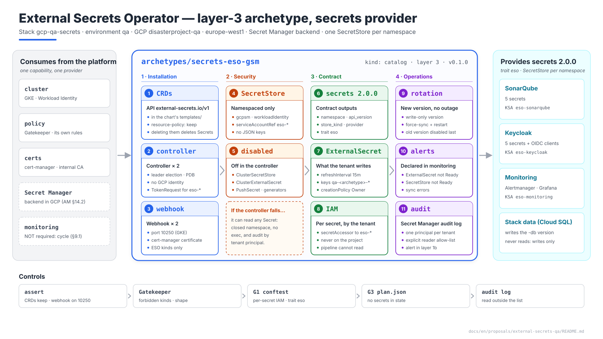
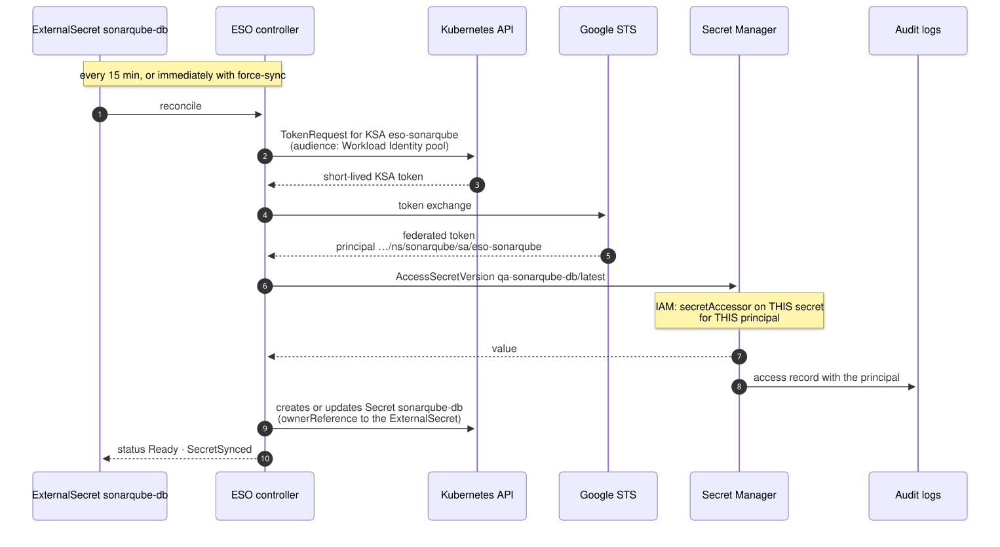
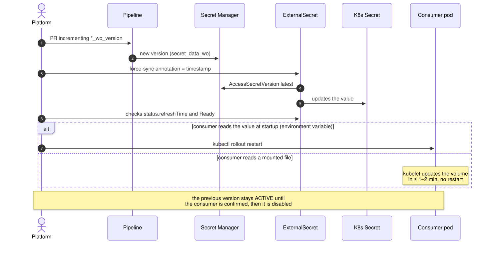

# External Secrets Operator on `qa` — `secrets-eso-gsm` archetype (layer 3), provider of `secrets`

| | |
|---|---|
| **Status** | Proposal · revision 2 |
| **Scope** | The layer 3 `secrets-eso-gsm` archetype on `qa`: security model, installation, the `secrets` 2.0.0 contract consumers use, rotation, network, availability, observability, policies, execution and plan |
| **Why now** | SonarQube (S1 §4.3, S2 §5.2), the Cloud SQL variant (§5) and Keycloak (§6.5, §7) already depend on ESO and have each, separately, pinned down parts of its contract. This document gathers them in one place and completes them |
| **Reference specification** | `archetype-model.md` (AM §n; AM §14.2 assigns Secret Manager to `secrets` on GCP), `terramate-outputs-sharing-architecture.md` (§n), `risk-register.md` |
| **Diagrams** | `diagrams/*.mmd` (Mermaid source) and `diagrams/*.svg` (rendered). The SVG is regenerated from the `.mmd`; never hand-edited. `diagrams/06-bloques-presentacion.svg` (1920×1080, for presentations) is generated by `06-bloques-presentacion.py`, not Mermaid |
| **Local identifiers** | Decisions `DE1…`, candidate risks `RE1…`, verifications `VE1…`. Risks get an `R54+` number in `risk-register.md` if adopted, after those of the earlier proposals |

Nothing in this document reopens a `CLAUDE.md` decision or D1 of S1 (ESO + Secret Manager; OpenBao out of `qa`). It implements the "never share secrets through outputs sharing" trap (R8) from the provider's side.



Source: [`diagrams/06-bloques-presentacion.py`](diagrams/06-bloques-presentacion.py) — presentation view; the detail is in §3–§10.

---

## 0. Context

| Question | Answer | Consequence |
|---|---|---|
| What it is | `secrets-eso-gsm` archetype, `kind: catalog`, **layer 3**, provides **`secrets` 2.0.0** with the new **`eso`** trait | The `qa` binding already binds it: `secrets: { archetype: secrets-eso-gsm, version: 0.1.0, stack_id: gcp-qa-secrets }` |
| Stack | **One**: `gcp-qa-secrets` in `stacks/platforms/gcp/qa/secrets/` | Layer 3 lives in `stacks/platforms/` (`CLAUDE.md`, layout) |
| Backend | **Secret Manager** in `disasterproject-qa`, user-managed replication in `europe-west1` | AM §14.2; S1 D1 |
| Interface in the cluster | ESO: `SecretStore` and `ExternalSecret` in each consumer's namespace; a Kubernetes `Secret` as the result | Charts read ordinary `Secret`s; nothing in them knows about Secret Manager |
| Consumers on `qa` | SonarQube (5 secrets), Keycloak (5), monitoring (Alertmanager receiver credentials, Grafana admin), the Keycloak OIDC client secrets (§6.5 of its proposal) | About a dozen `ExternalSecret`s to start with; nothing that needs sizing |
| Model | Dedicated `qa` | No `capacity` budgets enforced (S1 §0) |



Source: [`diagrams/01-contexto.mmd`](diagrams/01-contexto.mmd)

---

## 1. What ESO imposes on the design

Facts about ESO in the current stable version; anything that depends on the pinned version is marked **(verify)**.

| Fact | Consequence for the design |
|---|---|
| Three components: the **controller**, the validation **webhook** for its CRDs, and the **cert-controller** that issues the webhook's certificate | The webhook certificate is issued by cert-manager, which is already there (§4): one controller fewer |
| **`external-secrets.io/v1`** API is stable; `v1beta1` deprecated **(verify in which version it stops being served)** | The API version is a contract output (§5.1); consumer charts read it from there |
| GCP authentication via Workload Identity: the controller asks the Kubernetes API for a **token for the KSA the `SecretStore` names** (`TokenRequest`) and exchanges it at STS for a federated token | The controller **needs no GCP identity of its own**: it always acts as each tenant's KSA (§3). With the direct federated principal, no GCP service account **(verify, VE1)** |
| A namespaced `SecretStore` can only use KSAs **from its own namespace** | Isolation between tenants comes from the namespace and per-secret IAM, not from a list in ESO |
| The generated `Secret` carries an `ownerReference` to the `ExternalSecret` (`creationPolicy: Owner`) | Deleting an `ExternalSecret` deletes its `Secret`; **deleting the CRD deletes them all** (§4.2, RE1) |
| Periodic refresh (`refreshInterval`) and forced refresh with the `force-sync` annotation **(verify the name, VE5)** | Rotations without waiting for the next cycle (§6) |
| `ClusterSecretStore`, `ClusterExternalSecret` and `PushSecret` exist and can be disabled in the controller | They are disabled (§3.3): none is needed and all three widen what a mistake or an abuse can reach |
| Webhook on port **10250** by default in the chart | On GKE with private nodes, the control plane reaches nodes only on 443 and 10250 without extra firewall rules. **Not changed** (§7, RE3) |
| Prometheus metrics for the state of each `ExternalSecret` and `SecretStore` | Alerts in §9 |

---

## 2. Why ESO

Decided in S1 (D1). Summarised here so the contract in §5 has context:

| Option | Verdict |
|---|---|
| **ESO + Secret Manager** | **Yes.** Charts consume Kubernetes `Secret`s without knowing where they come from; changing backend (OpenBao, AWS, Azure) means changing the provider archetype, not the consumers |
| Secret Manager add-on for GKE (CSI driver) | No: it mounts files; the SonarQube charts and the Keycloak CR read environment variables or `Secret`s, and CNPG requires a `Secret` (S1 §4.3) |
| The application calls Secret Manager | No: every application with its own client, cache and rotation logic; impossible in third-party charts |
| OpenBao | Out of `qa` (D1): unseal, Raft and recovery keys to operate for a test environment |

---

## 3. Security model

### 3.1 Who holds what



Source: [`diagrams/02-sincronizacion.mmd`](diagrams/02-sincronizacion.mmd)

| Actor | Permission | On what |
|---|---|---|
| Pipeline (`tf-apply-qa@`) | Manage secret **containers** and their IAM; add versions (`secret_data_wo`) | Project `disasterproject-qa`. **No** `secretAccessor`: it never reads a value (S1 §4.3) |
| Each tenant's `eso-<archetype>` KSA | `roles/secretmanager.secretAccessor` | **Each secret** of its archetype, one by one. Never at project level (§11) |
| ESO controller (its own KSA) | None in GCP | — |
| ESO controller in Kubernetes | Read its CRDs; create and update `Secret`s; **`create` on `serviceaccounts/token`** | The whole cluster: ESO's design requires it |
| SRE | Just-in-time `secretAccessor` via PAM | One secret, 1 h maximum (S1 §4.3) |

### 3.2 What the controller could do if compromised

This has to be said plainly: the controller **can read and write any `Secret` in the cluster and request a token for any KSA**. With the token of an `eso-*` it gets whatever that KSA can read in Secret Manager. In other words, compromising the controller amounts to access to every secret in `qa`. This is inherent to any cluster-scoped secret synchroniser, and what is done is to reduce the likelihood and make it visible:

| Measure | Effect |
|---|---|
| `external-secrets` namespace for the platform only; PSS `restricted`; image by digest from Artifact Registry | Minimal surface |
| No `exec`/`attach`/`port-forward` in that namespace for anyone except break-glass | Nobody gets into the pod through the API |
| Controller **without a GCP identity**: every access goes out with a tenant's principal | The Secret Manager audit log says which tenant was read, not "ESO" in general (§9.2) |
| Audit alert: access to a secret by a principal outside the list (`eso-*` and explicit readers) | Anomalous use of a token shows up in the log with its principal |

### 3.3 What is disabled

| Feature | Why it is out |
|---|---|
| `ClusterSecretStore` | A cluster store uses an identity shared by every namespace: it breaks per-principal isolation (R15) |
| `ClusterExternalSecret` | Replicates a secret into many namespaces: exactly what per-secret IAM avoids |
| `PushSecret` | Writes from the cluster **to** Secret Manager. Nobody needs it, and an `eso-*` KSA only has read access; better that the controller does not even try |
| ESO generators (passwords, registry tokens) | Passwords are generated by OpenTofu with `ephemeral` resources and write-only attributes (R40) |

Two layers: the reconcilers switched off in the controller (§4.1) **and** Gatekeeper denying those kinds (§11). The second protects against someone switching the first back on.

---

## 4. Installation

### 4.1 Chart and values

Official `external-secrets/external-secrets` chart, pinned version, in a `helm_release` in the `gcp-qa-secrets` stack. Keys **(verify against the pinned version)**:

```yaml
installCRDs: true
crds:
  annotations:
    helm.sh/resource-policy: keep          # §4.2 — without this, uninstalling deletes every Secret
replicaCount: 2
leaderElect: true
processClusterStore: false                 # §3.3
processClusterExternalSecret: false
processPushSecret: false
image:
  repository: europe-docker.pkg.dev/disasterproject-lz/platform/external-secrets
  tag: "@sha256:<digest>"
resources:
  requests: { cpu: 50m, memory: 128Mi }
  limits:   { memory: 256Mi }
podDisruptionBudget: { enabled: true, minAvailable: 1 }
webhook:
  replicaCount: 2
  port: 10250                              # §7 — the GKE control plane already reaches this port
  certManager:
    enabled: true
    cert:
      issuerRef: { kind: ClusterIssuer, name: internal-ca }   # global from gcp-qa-certs
  podDisruptionBudget: { enabled: true, minAvailable: 1 }
certController:
  create: false                            # the webhook certificate is issued by cert-manager
serviceMonitor:
  enabled: false                           # the scrape is declared by the monitoring archetype (§9.1)
```

The chart's default `securityContext`: non-root, read-only root filesystem, no capabilities. It meets PSS `restricted` as is **(verify, VE6)**.

### 4.2 The CRDs and the deletion cascade

Every `Secret` ESO generates is owned by its `ExternalSecret`. If the `ExternalSecret` CRD disappears, Kubernetes deletes every `ExternalSecret` and, through the `ownerReference`, **every `Secret` feeding every application in `qa`**, within seconds. A `helm uninstall`, a `tofu destroy` of the stack, or a chart change that moves the CRDs elsewhere is enough to trigger it (RE1).

| Protection | Where |
|---|---|
| `helm.sh/resource-policy: keep` on the CRDs | Chart values (§4.1) |
| `assert` that fails generation if that annotation is missing | §11.1 |
| `lifecycle { prevent_destroy = true }` on the `helm_release` | The stack destroy stops; removing it is an explicit PR |
| Uninstall rehearsal in an ephemeral environment | VE3: the `Secret`s survive |

---

## 5. The `secrets` 2.0.0 contract

### 5.1 Outputs and trait

| Output | Value on `qa` | Use |
|---|---|---|
| `namespace` | `external-secrets` | `NetworkPolicy` and RBAC selectors |
| `api_version` | `external-secrets.io/v1` | `apiVersion` of consumers' `SecretStore` and `ExternalSecret` |
| `store_kind` | `SecretStore` | The only store kind admitted (§3.3) |
| `provider` | `gcpsm` | Branch of the `gen_secrets.tm.hcl` generator |

All deterministic: they are published as contract outputs (AM §5.1) and consumers receive them as globals, with no outputs sharing edge (S1 §6 already noted it this way).

**`eso` trait** (new, in `registry/traits.yaml`): the `secrets` provider is ESO and its CRDs are installed. Consumers whose charts create `SecretStore` and `ExternalSecret` require it, just as they require `prometheus-operator-crds` to create a `PodMonitor`. A binding to another provider (the CSI driver, for example) fails at resolution, not at the first `helm install`.

### 5.2 What a consumer writes



Source: [`diagrams/03-propiedad.mmd`](diagrams/03-propiedad.mmd)

Each archetype's `secrets` stack, generated by `gen_secrets.tm.hcl` (S2 §5.2), creates the containers and their IAM in Secret Manager, and in its chart:

```yaml
# one SecretStore per namespace
apiVersion: external-secrets.io/v1               # = api_version output
kind: SecretStore
metadata: { name: gcpsm, namespace: sonarqube }
spec:
  provider:
    gcpsm:
      projectID: disasterproject-qa
      auth:
        workloadIdentity:
          clusterLocation: europe-west1
          clusterName: qa                        # global.platform.cluster_name
          clusterProjectID: disasterproject-qa
          serviceAccountRef: { name: eso-sonarqube }
---
# one ExternalSecret per Secret Manager secret
apiVersion: external-secrets.io/v1
kind: ExternalSecret
metadata: { name: sonarqube-db, namespace: sonarqube }
spec:
  refreshInterval: 15m
  secretStoreRef: { kind: SecretStore, name: gcpsm }
  target:
    name: sonarqube-db
    creationPolicy: Owner
    deletionPolicy: Retain                       # if the secret disappears from Secret Manager, the Secret is kept
  dataFrom:
    - extract: { key: qa-sonarqube-db }          # JSON {"username", "password"}
```

| Rule | Why |
|---|---|
| One `SecretStore` per namespace, `serviceAccountRef` to `eso-<archetype>` | Exact principal (R15); the `eso-` name is what the audit alert recognises |
| `remoteRef.key` / `extract.key` with the `qa-<archetype>-` prefix | IAM already denies the rest; the rule makes the error surface at admission rather than as `SecretSyncedError` |
| `refreshInterval: 15m` | A rotated secret arrives in ≤ 15 min without intervention; the S1 §4.7 alert fires at 15 min |
| `creationPolicy: Owner` | The `Secret` disappears with its `ExternalSecret` when the consumer is torn down |
| `deletionPolicy: Retain` | An accidental deletion in Secret Manager does not immediately leave the application without its `Secret` |
| `latest` version | The version is decided at write time, with `*_wo_version` (Cloud SQL variant §5); pinning versions in the `ExternalSecret` would duplicate that decision |

### 5.3 Cost of reads

Each refresh is one `AccessSecretVersion` and one *Data Access audit log* entry. With a dozen secrets every 15 min that comes to ≈ 1,150 accesses a day: negligible cost and log volume. Dropping to 1 min would multiply both by 15 with no benefit: rotations have `force-sync` (§6).

---

## 6. Rotation and reload



Source: [`diagrams/05-rotacion.mmd`](diagrams/05-rotacion.mmd)

ESO updates the `Secret`; it does **not** restart whoever uses it. How the new value arrives depends on how it is read:

| The consumer reads… | It arrives | Examples on `qa` |
|---|---|---|
| An environment variable | Only when the pod restarts | SonarQube's JDBC password, Keycloak's DB credentials |
| A file from a `Secret` volume | The kubelet updates it in 1–2 min | Mounted certificates, `x509-certificate-exporter` |

Procedure: new version in Secret Manager → `force-sync` on the `ExternalSecret` → check `Ready` and `refreshTime` → restart the consumer if it reads variables → disable the previous version in Secret Manager once the consumer is using the new one. It is the same order the Cloud SQL variant already requires (RC4); here it is generalised.

**No Reloader** (DE6). A controller that restarts pods when a `Secret` changes needs to read every `Secret` in the cluster and decides restarts on its own. With planned and infrequent rotations, an explicit restart is more predictable.

---

## 7. Network



Source: [`diagrams/04-red.mmd`](diagrams/04-red.mmd)

Default-deny `NetworkPolicy` in `external-secrets`:

| Source | Destination | Port | Note |
|---|---|---|---|
| GKE control plane | Webhook | **10250** | VPC firewall rule GKE already creates for private nodes (443 and 10250). Changing the port to 9443 would require another rule, and without it every `apply` of an `ExternalSecret` fails on a webhook timeout (RE3) |
| Prometheus | Controller, webhook | 8080 | Metrics |
| Controller | Kubernetes API | 443 | |
| Controller | `secretmanager.googleapis.com`, `sts.googleapis.com` via Private Google Access | 443 | No NAT, no internet |
| Controller, webhook | kube-dns | 53 | |
| All | Internet | **Denied** | |

---

## 8. Availability and failure behaviour

ESO is **not in the request path**: applications read Kubernetes `Secret`s that already exist.

| If this goes down… | Effect | Not affected |
|---|---|---|
| The controller | No `Secret`s are created or refreshed; a rotation does not arrive | Everything already running, and pod restarts (the `Secret` is still there) |
| The webhook | The `apply` of any `SecretStore` or `ExternalSecret` fails (its `failurePolicy` is `Fail`, but **only for ESO kinds**: it cannot lock the cluster the way Gatekeeper can) | Everything else |
| Secret Manager or STS | `ExternalSecret`s in error; `Secret`s keep their last value | Applications |
| A tenant's Workload Identity misconfigured | That namespace's `SecretStore` never reaches `Ready` | Other tenants |

2 replicas of each component with a `minAvailable: 1` PDB: a node or a GKE upgrade does not leave the platform without a webhook during a deployment.

---

## 9. Observability

### 9.1 Who declares the scrape and the alerts

The monitoring archetype needs secrets (Alertmanager receiver credentials, Grafana admin): it **requires `secrets`**. If `secrets-eso-gsm` required `monitoring` to create its `PodMonitor` and `PrometheusRule`, there would be a cycle between two layer 3 capabilities, and the resolver rejects it (AM §12, step 3). Therefore:

- `secrets-eso-gsm` does **not** require `monitoring`; `serviceMonitor.enabled: false`.
- `monitoring-oss` includes the scrape and the rules for the platform components that come before it (Gatekeeper, cert-manager, ESO), using the selectors published in the `secrets` contract (`namespace`).

The general rule is now written down: **between capabilities of the same layer, observability is declared by the monitoring one**.

### 9.2 Alerts

| Alert | Signal | Threshold | Replaces |
|---|---|---|---|
| `ExternalSecret` not synchronised | `Ready=False` condition on the `ExternalSecret` | > 15 min, **in any namespace**, routed to the owner by the namespace's `archetype` label | SonarQube's own alert (S1 §4.7, S2 §5.9) |
| `SecretStore` not ready | `Ready=False` condition | > 5 min — almost always the tenant's IAM or Workload Identity | — |
| Synchronisation errors | Error rate of provider calls | > 10 % over 15 min | — |
| Controller or webhook without replicas | kube-state-metrics | < 1 ready for 5 min | — |
| **Read of a secret by an unauthorised principal** | Secret Manager *Data Access audit log*, log-based alert from layer 1b | Any `AccessSecretVersion` whose principal is neither `…/sa/eso-*` nor on the explicit readers list | S1 §4.3, extended with the list |

**Explicit readers list.** The Keycloak reconciler reads OIDC client secrets with its own identity (Keycloak proposal §6.5), not through ESO: its principal `…/ns/keycloak/sa/keycloak-config` goes on the list. Without it, the S1 §4.3 alert would fire on every reconciler pass. A new reader is a reviewed PR to that list.

---

## 10. The archetype

### 10.1 Manifest

```yaml
# archetypes/secrets-eso-gsm/manifest.yaml
apiVersion: archetype/v1
kind: Archetype

metadata:
  name: secrets-eso-gsm
  version: 0.1.0
  layer: 3
  kind: catalog
  description: External Secrets Operator with GCP Secret Manager as backend; SecretStore per namespace
  owners: [team-platform]

runtimes: [gke]

requires:
  - capability: cluster
    version: "^2.0.0"
  - capability: policy
    version: "^1.0.0"
  - capability: certs
    version: "^1.0.0"

provides:
  - capability: secrets
    version: 2.0.0
    traits: [eso]
    outputs:
      - { name: namespace,   from: eso }
      - { name: api_version, from: eso }
      - { name: store_kind,  from: eso }
      - { name: provider,    from: eso }

stacks:
  - name: eso

capacity:
  cpu_millicores: 200
  memory_mib: 768
  pods: 4
  workload_identities: 0                             # the controller has no GCP identity; each tenant counts its own eso-*
```

`runtimes: [gke]`: the `gcpsm` branch is GCP only. The variants for AWS (Secrets Manager) and Azure (Key Vault) would be sibling archetypes with the same contract and the same trait, changing `provider`. **No `monitoring`** in `requires`, because of the cycle in §9.1.

### 10.2 The `gcp-qa-secrets` stack

| | |
|---|---|
| **Generator** | `gen_helm_stack.tm.hcl` |
| **Resources** | `external-secrets` namespace (PSS `restricted`, mandatory labels); ESO `helm_release` (§4.1) with `prevent_destroy`; `helm_release` of the archetype chart with the `NetworkPolicy` (§7) and the Gatekeeper `ConstraintTemplate`/`Constraint` for the ESO kinds (§11.2) |
| **GCP resources** | None. Each tenant creates the IAM on its own secrets |
| **Inputs via sharing** | `cluster_endpoint`, `cluster_ca` (from `gcp-qa-gke`) |
| **Globals used** | Internal `ClusterIssuer` (from `gcp-qa-certs`) |
| **`after`** | `gcp-qa-gke`, `gcp-qa-policy`, `gcp-qa-certs` |
| **Outputs** | §5.1 |

The `ConstraintTemplate`s are deployed by the provider itself, just as the `gateway` archetype restricts `SecurityPolicy`: **whoever defines a kind defines its admission rules**. It requires `policy` precisely for that.

---

## 11. Policies

### 11.1 `assert` at generation

```hcl
assert {
  assertion = global.eso_values.crds.annotations["helm.sh/resource-policy"] == "keep"
  message   = "secrets: ESO CRDs must carry resource-policy keep — deleting them deletes every Secret (RE1)"
}
assert {
  assertion = global.eso_values.webhook.port == 10250
  message   = "secrets: webhook on 10250; any other port needs a firewall rule to the nodes (RE3)"
}
assert {
  assertion = !global.eso_values.processClusterStore && !global.eso_values.processPushSecret
  message   = "secrets: ClusterSecretStore and PushSecret disabled (§3.3)"
}
```

### 11.2 Gatekeeper (deployed by this archetype)

| Constraint | What it denies |
|---|---|
| Forbidden kinds | Any `ClusterSecretStore`, `ClusterExternalSecret` or `PushSecret` |
| `SecretStore` shape | Provider other than `gcpsm`; authentication other than `workloadIdentity` (no `secretRef` to a JSON key); `serviceAccountRef` without the `eso-` prefix; `projectID` other than the environment's project |
| `ExternalSecret` shape | `secretStoreRef.kind` other than `SecretStore`; remote keys without the `qa-<namespace archetype label>-` prefix; `refreshInterval` outside 5 min – 1 h |
| `external-secrets` namespace | Pods other than the chart's (by label), so nobody uses the controller's KSA |

### 11.3 conftest (G1)

| Rule | What it checks |
|---|---|
| **New:** per-resource Secret Manager IAM | In archetype stacks, `secretmanager.*` only as `google_secret_manager_secret_iam_member`; never `google_project_iam_*` (S2 §7.2, generalised) |
| **New:** IAM member | The `member` of each `secretAccessor` is `…/sa/eso-<the same archetype>` or a principal on the explicit readers list (§9.2) |
| **New:** trait | An archetype whose chart contains `SecretStore` or `ExternalSecret` requires `secrets` with the `eso` trait |
| Existing (R8, R40) | No output exports values; no plaintext `secret_data` in `plan.json` |

---

## 12. Execution

### 12.1 First deployment

Phase B of S1 §6: after `gcp-qa-policy` and `gcp-qa-certs`, before monitoring, Keycloak and any layer 4–5 archetype. Exit criterion: a test `ExternalSecret` in a test namespace reaches `Ready` with its `eso-*` and is recorded in the audit log with that principal.

### 12.2 Upgrades

| What | Care |
|---|---|
| Chart version | Read the release notes for API changes. First in an ephemeral environment with an `ExternalSecret` of every shape used on `qa` |
| `api_version` change (e.g. removal of `v1beta1`) | It is a change to the `api_version` output: a **MAJOR** of the `secrets` contract (AM §4.5). Consumers pinned to `^2.0.0` fail at resolution until they are updated, not at `apply` |
| CRDs | Updated by the chart (they are in `templates/` with `keep`). A CRD that changes shape incompatibly is treated as MAJOR |

### 12.3 Destruction

It stops at `prevent_destroy`. Tearing down ESO without tearing down its consumers leaves their `Secret`s in place (CRDs with `keep`) but without refresh: it is done last and with an explicit PR.

---

## 13. Changes to other documents

| Document | Change | Status |
|---|---|---|
| `registry/traits.yaml` and the `enum` in `schemas/archetype-manifest.schema.json` | `eso` trait, in the same commit and mechanically (R34) | **Applied** |
| S2 §3 (SonarQube), Cloud SQL variant §9.1, Keycloak proposal §11.1 | `secrets` now requires `traits: [eso]` | **Applied** |
| S1 §4.3 and §4.7 | The audit alert admits the explicit readers list (§9.2) | **Applied** |
| S1 §4.7 and S2 §5.9 | The "`ExternalSecret` not synchronised" alert becomes a platform alert (§9.2) and leaves SonarQube, the only archetype that declared it | **Applied** |
| S2 §9, `secrets-eso-gsm` row | Requirement met: ESO with Workload Identity in a namespaced `SecretStore` | — |

---

## 14. Decisions

| # | Decision | Status | Recommendation | Alternative |
|---|---|---|---|---|
| DE1 | Secrets interface in the cluster | Inherited from D1 | ESO + Secret Manager | CSI driver; OpenBao |
| DE2 | Store type | Proposed | Namespaced `SecretStore` only | `ClusterSecretStore` with a shared identity |
| DE3 | Identity towards GCP | Proposed | `eso-<archetype>` KSA per tenant, direct federated principal; controller without identity | GCP service account per tenant, with an annotation on the KSA (if VE1 fails) |
| DE4 | Webhook certificate | Proposed | cert-manager, internal `ClusterIssuer` | ESO cert-controller |
| DE5 | Refresh | Proposed | 15 min + `force-sync` on rotations | 1 h (default) |
| DE6 | Consumer reload | Proposed | Explicit restart in the procedure | Reloader |
| DE7 | ESO features | Proposed | No `ClusterSecretStore`, `ClusterExternalSecret`, `PushSecret` or generators | Leave them available |
| DE8 | Observability | Proposed | Declared by the monitoring archetype (cycle, §9.1) | `PodMonitor` in this archetype with optional `monitoring` |
| DE9 | `eso` trait | Proposed, applied to the registry | Yes | No trait: failure at `helm install` if the provider is not ESO |

---

## 15. Candidate risks

| # | Risk | Likelihood | Impact | Mitigation |
|---|---|---|---|---|
| RE1 | **Deletion of the CRDs** drags down every `ExternalSecret` and its `Secret` | Low with `keep` | Critical — every application on `qa` without secrets | `keep`, assert, `prevent_destroy`, VE3 |
| RE2 | **Controller compromise** = access to every secret | Low | Critical | §3.2: locked-down namespace, no `exec`, per-principal auditing |
| RE3 | **Webhook unreachable** from the control plane if someone changes its port | Medium | Medium — no `ExternalSecret` can be applied | Port 10250 with an assert; VE4 |
| RE4 | **Rotation that does not reach** a consumer reading environment variables | Medium | Medium — the application keeps the old value until it restarts, and fails if the old version is disabled first | Procedure in §6: disable the old version last |
| RE5 | **Noisy audit alert** from legitimate readers outside ESO | High without a list | Low — the alert gets ignored and stops protecting | Explicit readers list reviewed by PR (§9.2) |
| RE6 | **ESO API change** breaks consumer charts on an upgrade | Medium | Medium | `api_version` as a contract output; MAJOR; ephemeral rehearsal (§12.2) |
| RE7 | **`SecretStore` with a static credential** (JSON key) introduced by a consumer | Low | High — a long-lived key in the cluster | Gatekeeper (§11.2); org policy preventing service account key creation (architecture §11.7) |

---

## 16. Verifications

| # | Verification | Result that closes it |
|---|---|---|
| VE1 | `gcpsm` with Workload Identity and a direct federated principal, without a GCP service account annotation, in the pinned ESO version | `ExternalSecret` in `Ready`; the audit log shows the `…/sa/eso-<archetype>` principal. Otherwise, the DE3 alternative |
| VE2 | `ClusterSecretStore`, `ClusterExternalSecret` and `PushSecret` reconcilers switched off by the chart values | An object of those kinds created with Gatekeeper in `dryrun` is not reconciled |
| VE3 | Uninstall the chart in an ephemeral environment | CRDs, `ExternalSecret`s and `Secret`s still exist |
| VE4 | Webhook on 10250 reachable from the control plane with private nodes | `apply` of an `ExternalSecret` without timeout |
| VE5 | `force-sync` annotation | Immediate refresh visible in `status.refreshTime` |
| VE6 | ESO under PSS `restricted` with the chart's default values | Pods admitted without exemptions |
| VE7 | Audit alert filter with the readers list | Fires with an unlisted reader; stays silent with `eso-*` and `keycloak-config` |
| VE8 | Webhook certificate issued by cert-manager and injected into the `ValidatingWebhookConfiguration` | Webhook healthy after the certificate is renewed |

---

## 17. Implementation plan

| Phase | Content | Exit criterion | Estimate |
|---|---|---|---|
| **0 · Prerequisites** | `qa` GKE, Gatekeeper and cert-manager; VE1, VE4 | Both verifications closed | Depends on the platform |
| **1 · Skeleton** | Manifest, archetype chart (NetworkPolicy, constraints), asserts, conftest rules | `archetypectl resolve --dry-run`, `terramate generate --check`, G1 and mocked preview green | 1 day |
| **2 · Deployment** | `gcp-qa-secrets` stack | ESO healthy with 2 replicas; VE2, VE3, VE6, VE8 | 1–2 days |
| **3 · Contract** | `gcpsm` branch of `gen_secrets.tm.hcl`; test tenant | Test `ExternalSecret` in `Ready`; **VE5**, **VE7** | 1 day |
| **4 · Observability** | Rules and scrape in `monitoring-oss` | Each alert fired once in a provoked test | 0.5 days |

One week for one person. It goes before Keycloak and SonarQube in phase B: both need it for their first deployment.
