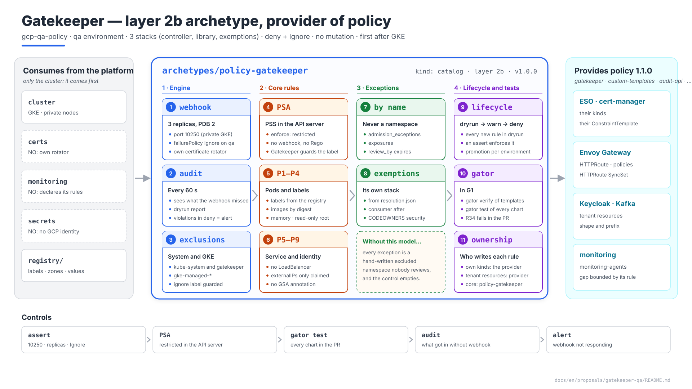

# Gatekeeper on `qa` — `policy-gatekeeper` archetype (layer 2b), provider of `policy`

| | |
|---|---|
| **Status** | Proposal · revision 4 |
| **Scope** | The layer 2b `policy-gatekeeper` archetype on `qa`: installation and high availability, the webhook's reach, who owns each rule, the consolidated catalogue of rules from every proposal, a rule's lifecycle, the exceptions model, registry data, CI tests, observability, network, the `policy` contract, stacks, execution and plan |
| **Why now** | Every earlier proposal has left it rules: SonarQube, Keycloak, ESO, monitoring, cert-manager, Envoy Gateway and Kafka. Today they are spread across nine documents, nobody has checked that they fit together, and several depend on an exceptions mechanism that is not specified |
| **Reference specification** | `terramate-outputs-sharing-architecture.md` §13 (architecture), `archetype-model.md` (AM §n), `risk-register.md` (R33–R37) |
| **Diagrams** | `diagrams/*.mmd` (Mermaid source) and `diagrams/*.svg` (rendered). The SVG is regenerated from the `.mmd`; never hand-edited. `diagrams/06-bloques-presentacion.svg` (1920×1080, for presentations) is generated by `06-bloques-presentacion.py`, not Mermaid |
| **Local identifiers** | Decisions `DP1…`, candidate risks `RP1…`, verifications `VP1…`. Risks get an `R54+` number in `risk-register.md` if adopted, after those of the earlier proposals |

Nothing in this document reopens a decision of `CLAUDE.md`: Gatekeeper and not Kyverno; self-managed on all three clouds; layer 2b; no mutation; `failurePolicy: Fail` only in production; the registry as the single source.



Source: [`diagrams/06-bloques-presentacion.py`](diagrams/06-bloques-presentacion.py) — presentation view; the detail is in §2–§9.

---

## 0. Context

| Question | Answer | Consequence |
|---|---|---|
| What it is | Archetype `policy-gatekeeper`, `kind: catalog`, **layer 2b**, provides **`policy` 1.1.0** | The `qa` binding already binds it: `policy: { archetype: policy-gatekeeper, version: 1.0.0, stack_id: gcp-qa-policy }`, with `gatekeeper_enforcement: deny` and `gatekeeper_failure_policy: Ignore` |
| Stacks | 3: `controller`, `library` and `exemptions` in `stacks/platforms/gcp/qa/policy/` | Different lifecycles (§8.3) |
| Components | Gatekeeper: validating webhook, audit and its own certificate rotator | Apache-2.0 |
| What it does **not** do | Mutation; rules for other archetypes' kinds; Pod Security Standards in Rego | §1, §3 |
| Consumes | Only `cluster` | It comes before cert-manager, secrets and monitoring: it cannot depend on any of them (cert-manager DT8) |
| Model | `qa` dedicated, `deny` + `Ignore` | Architecture §13.7 |



Source: [`diagrams/01-contexto.mmd`](diagrams/01-contexto.mmd)

---

## 1. Who owns each rule

The earlier proposals already applied a criterion without naming it: ESO deploys the rules for `SecretStore`, Envoy Gateway those for `HTTPRoute`, Kafka those for `KafkaTopic`. It is fixed here (DP2):

| Rule about… | Owner | Reason |
|---|---|---|
| A kind an archetype defines (CRDs of Strimzi, ESO, cert-manager, Gateway API, Envoy Gateway) | **The archetype that installs the CRD** | It knows the semantics; its rules change with its version; they are deployed with its chart |
| A tenant resource in a provider's namespace (Keycloak client `ConfigMap`, `ReferenceGrant`, `ExternalSecret` in `kafka`) | **The provider** | It protects its multi-tenant contract (AM §10) |
| Kubernetes core kinds applied to everyone (`Pod`, `Service`, `Namespace`, `ServiceAccount`, `RoleBinding`) | **`policy-gatekeeper`** | No other archetype owns `Service` |
| A namespace with special permissions (`monitoring-agents`) | **The namespace's archetype**, over a gap `policy-gatekeeper` opens | The one who needs the exception bounds it (§5) |

`policy-gatekeeper` does **not** know anyone else's kinds. It supplies the engine, the exceptions model, the shared Rego library and the core rules. That way a Strimzi upgrade does not touch layer 2b.

---

## 2. Installation

### 2.1 The controller

| Setting | Value | Reason |
|---|---|---|
| Version | The latest stable Gatekeeper 3.x minor at implementation time **(verify, VP10)** | One version on all three clouds (`CLAUDE.md`) |
| Webhook replicas | **3**, spread by zone, `PodDisruptionBudget` `minAvailable: 2` | R33; a lost zone does not leave the webhook without a quorum |
| Audit | 1 replica, `auditInterval: 60s`, `constraintViolationsLimit: 50`, audit from the cache | It sees what the webhook did not (webhook down, objects older than the rule) |
| Webhook port | **10250** (`controllerManager.port`) | On GKE with private nodes the control plane only reaches the nodes on 443 and 10250. With the default 8443 the webhook is unreachable, and with `Ignore` that means **no policy applied, with no error** (RP1, VP1). The same setting as ESO and cert-manager |
| Webhook certificate | Gatekeeper's own rotator | It comes before cert-manager (cert-manager DT8) |
| `failurePolicy` | `global.policy.gatekeeper_failure_policy`: `Ignore` on `qa` | Architecture §13.7; `Fail` only in production |
| Mutation | **Disabled** (`mutations.enable: false`); no `mutation` trait | `CLAUDE.md` |
| External data providers | Disabled | No outbound calls from admission |
| CRDs | `helm.sh/resource-policy: keep` | Uninstalling does not delete the other archetypes' `Constraint`s |
| PSS of its own namespace | `restricted` | Gatekeeper complies as is **(verify, VP10)** |

### 2.2 What does not go through the webhook

| Namespace | Mechanism | Reason |
|---|---|---|
| `kube-system`, `gatekeeper-system` | The controller's `--exempt-namespace` and `Config.spec.match` with `processes: ["*"]` | Gatekeeper does not block its own recovery (R33) |
| `kube-node-lease`, `kube-public`, `gke-managed-*`, `gke-gmp-system` | `Config.spec.match` | GKE manages them; a cluster upgrade must not depend on our rules (RP6, VP5) |
| The `admission.gatekeeper.sh/ignore` label | Only in the namespaces of the two rows above; denied anywhere else (P7) | Otherwise anyone who can label a namespace escapes every rule |

---

## 3. Pod Security Standards: with PSA, not with Rego

| Option | Verdict |
|---|---|
| **A. Pod Security Admission** (built into Kubernetes) with the label `pod-security.kubernetes.io/enforce: restricted` on every namespace, and Gatekeeper **guarding the label** | **Yes** (DP3). The API server itself evaluates it: no webhook, no Rego to maintain, and no gap if Gatekeeper goes down |
| B. Gatekeeper's library with the PSS rules rewritten in Rego | No: it duplicates what Kubernetes already does and falls with the webhook |

The label is already mandatory in `registry/labels.yaml`. Gatekeeper prevents lowering it: a namespace with `enforce` other than `restricted` is denied, except those on the list of §5.2 (`monitoring-agents`, `privileged`).

**What PSS `restricted` does not cover** is added by `policy-gatekeeper` (§4): read-only root, allowed registries, memory limits. These are the rules the proposals took for granted.

---

## 4. The catalogue



Source: [`diagrams/05-propiedad.mmd`](diagrams/05-propiedad.mmd)

### 4.1 Core rules (`policy-gatekeeper`)

| # | Rule | Kinds | What it denies | Origin | Initial mode on `qa` |
|---|---|---|---|---|---|
| P1 | Mandatory labels | `Namespace`, workloads, `PersistentVolumeClaim` | A label from `registry/labels.yaml` missing | Architecture §13.6, R34 | `deny` |
| P2 | Allowed registries | `Pod` and workload templates | An image outside the landing zone's Artifact Registry, or **without a digest** (`@sha256:`) | S2 §7.4, Keycloak, cert-manager | `deny` |
| P3 | Read-only root | Containers | `readOnlyRootFilesystem` other than `true` | S1 §4.2 | `dryrun` → `deny` after reviewing the audit |
| P4 | Memory limit | Containers | No `resources.limits.memory` or no `requests.memory`. It does **not** require a CPU limit | DG §8.3 (exit 137), S1 §4.12 | `deny` |
| P5 | `Service` types | `Service` | `LoadBalancer` always (pattern A); `NodePort` except with an exception | Envoy Gateway §4.2, §4.4 | `deny` |
| P6 | `externalIPs` | `Service` | Any `externalIPs` except the IP claimed by an exception (CVE-2020-8554) | Envoy Gateway §4.4 | `deny` |
| P7 | Namespace labels | `Namespace` | `pod-security.kubernetes.io/enforce` ≠ `restricted` outside §5.2; `admission.gatekeeper.sh/ignore` outside §2.2 | §2.2, §3 | `deny` |
| P8 | Identity annotation | `ServiceAccount` | `iam.gke.io/gcp-service-account`. The platform uses direct Workload Identity on the KSA's principal; that annotation would let a KSA impersonate a GCP service account | S2 §5.1, R15 | `deny` |
| P9 | Anonymous access | `RoleBinding`, `ClusterRoleBinding` | Subjects `system:anonymous` or `system:unauthenticated` | — | `deny` |
| P10 | Default `NetworkPolicy` | `Namespace` (referential) | A tenant namespace without a default-deny `NetworkPolicy` | Every proposal | **Audit only**: the policy arrives after the namespace in the same deployment |
| P11 | Tolerations for tainted pools | `Pod` and workload templates | A toleration for a pool's taint from a namespace that does not belong to its owners (the binding's `cluster.node_pools[].owners`, along the §7.1 path). With two pools (GKE DN11), the only tainted one is `system`, and its owners are the layer 2b and 3 archetypes plus `kube-system` | GKE proposal §5.3, RN5 | `deny` |
| P12 | Environment prefix on KSAs | `ServiceAccount` | A name starting with the prefix of **another** environment of the same project (`dev-`, `demos-`, `sandbox-`… in the `qa` cluster). The Workload Identity pool is one per project: without this rule, a `qa-eso-sonarqube` KSA created in the `dev` cluster would be `qa`'s identity in GCP | `CLAUDE.md`, R54 | `deny` |

### 4.2 Provider rules (each deploys its own)

| Owner | Rules | Proposal |
|---|---|---|
| `secrets-eso-gsm` | Forbidden kinds (`ClusterSecretStore`, `ClusterExternalSecret`, `PushSecret`); shape of `SecretStore` and `ExternalSecret`; foreign pods in `external-secrets` | ESO §11.2 |
| `monitoring-oss` | The `prometheus=qa` label on the monitoring CRDs; `monitoring-agents` with its two images by digest, no `privileged`, closed `hostPath` | Monitoring §11 |
| `cert-manager` | No tenant `ClusterIssuer`; no CA or `SelfSigned` `Issuer` outside `cert-manager` | cert-manager §9.2 |
| `gateway-envoy-gke` | `HTTPRoute` with its own unique host; `parentRefs` and `backendRefs`; reserved kinds; `BackendTrafficPolicy` ≤ 120 s; `SecurityPolicy` only where asked for; `ReferenceGrant` | Envoy Gateway §9.2 |
| `keycloak` | Shape of the client `ConfigMap`; no `SecurityPolicy` on its route; shape of the `ReferenceGrant` `sp-<instance>` | Keycloak §12.3 |
| `kafka` | Shape of `KafkaTopic` (`topicName` pinned), `KafkaUser` (SCRAM, derived ACLs, quotas) and `ExternalSecret` in `kafka`; reserved kinds; no `HTTPRoute` to a `KafkaBridge` | Kafka §9.2 |

**Overlaps resolved.** Two catalogue rules touched the same thing:

| Overlap | Resolution |
|---|---|
| The generic `SecurityPolicy` rule of S2 §7.4 and that of Envoy Gateway §9.2 | Envoy Gateway's stays (`security_policy_label`); S2 §7.4 already points to it |
| The `LoadBalancer` `Service` rule Envoy Gateway asked of "the `policy` archetype" | It is P5, here |

A `gator` test in CI checks that no combination of rules denies a chart that should pass (§6.2).

---

## 5. Exceptions



Source: [`diagrams/03-excepciones.mmd`](diagrams/03-excepciones.mmd)

### 5.1 By name, derived from resolution

An exception is never hand-written in a `Constraint`. It is declared in the consumer's manifest, resolution validates it, and a dedicated stack generates it (DP4).

| Piece | Design |
|---|---|
| Where it is declared | In the consumer's manifest. `exposures` already exists for P5 and P6 (Envoy Gateway §4.4); `admission_exceptions` is added for the rest, with the same justification fields |
| Shape | `{ rule: P3, kind: StatefulSet, name: sonarqube, reason, business_owner, review_by }`. Always one object by name, **never a whole namespace** |
| Who generates it | The `exemptions` stack (`gcp-qa-policy-exemptions`), from `resolution.json`: it writes the list into the parameters of `policy-gatekeeper`'s `Constraint`s |
| Order | The consumer stack that needs the exception declares `after` to `gcp-qa-policy-exemptions`. `exemptions` depends only on resolution, not on the consumer: there is no cycle |
| Expiry | G1 fails the next PR if `review_by` has passed (the same mechanism as `exposures`) |
| Approval | Platform and security `CODEOWNERS` on `admission_exceptions` and `exposures` |

Known exceptions on `qa`:

| Consumer | Rule | Object | Reason | Status |
|---|---|---|---|---|
| SonarQube | P3 | `StatefulSet` `sonarqube` | Only if V2 shows SonarQube does not start with a read-only root (S1 §4.2) | Conditional |
| Any pattern B exception with an imposed port | P5, P6 | The declared `Service` | Envoy Gateway §4.4 | Per exception |

### 5.2 Namespaces with PSS other than `restricted`

| Namespace | PSS | Who bounds the gap |
|---|---|---|
| `monitoring-agents` | `privileged` | `monitoring-oss`: only its two images by digest, no `privileged: true`, `hostPath` from a closed list (monitoring §4) |

The list lives in the `policy-gatekeeper` chart values, generated from the registry. Adding a namespace is a PR to that list and requires the namespace's archetype to bring its own restrictive rule.

---

## 6. A rule's lifecycle and tests



Source: [`diagrams/02-ciclo-regla.mmd`](diagrams/02-ciclo-regla.mmd)

### 6.1 From `dryrun` to `deny`

| Step | What | Who decides |
|---|---|---|
| 1 | The rule enters with `enforcementAction: dryrun`, in every environment | PR by the rule's owner |
| 2 | The audit evaluates it against what already exists; the results are reviewed | Owner + platform |
| 3 | The objects that break it are fixed, or exceptions are declared (§5) | Consumers |
| 4 | It is promoted per environment: `warn` in ephemerals and `demos`, `deny` in `dev` and `qa`, `deny` in `prod` | A PR that changes the value in the environment's globals |

Each `Constraint` carries its action in the chart values: `enforcement: { default: <the environment's>, overrides: { <constraint>: dryrun } }`. Promoting means deleting the `overrides` entry. An assert prevents a new rule from entering straight into `deny` without having gone through `dryrun` on `qa` (§9.1).

### 6.2 Tests: `gator` in CI

| Test | Where | What it detects |
|---|---|---|
| `conftest verify` on `policy/*_test.rego` | G1, existing | CI rules that never fire (R36) |
| **`gator verify`** on the `ConstraintTemplate`s with their test cases | G1, new | Admission rules that never fire, or fire too much |
| **`gator test`**: the rendered manifests of every changed chart, against **every** `Constraint` of the environment with its parameters | G1, new | A deployment Gatekeeper is going to reject, **in the PR** and not at `apply` (RP4) |

The third is what turns R34 into a CI failure. If the generator stops emitting a label the `Constraint` still requires, the PR fails before reaching the cluster.

### 6.3 Shared Rego (open question no. 5 of `CLAUDE.md`)

| Piece | Design |
|---|---|
| Library | `policy/lib/`: image-reference parsing, registry labels, instance prefixes, exception helpers |
| In conftest | Imported directly |
| In Gatekeeper | Embedded in each `ConstraintTemplate`'s `libs` field when the chart is built. It is generated, not hand-copied, and G0 protects it |
| Measurement | At the close of phase 3, count what part of each admission rule is shared library. If it is small, the common library is dropped and each side keeps its own. This is the measurement `CLAUDE.md` asks for before planning a single policy codebase |

---

## 7. Registry data and synced data

### 7.1 From the registry to the chart

| Data | Source | Reaches Gatekeeper as |
|---|---|---|
| Mandatory labels | `registry/labels.yaml` | P1 parameters |
| Allowed registries | Landing zone globals: the Artifact Registry project and the repositories **of the environment's region** (`multi-environment` DX6) | P2 parameters |
| Namespaces with special PSS | `policy-gatekeeper` values (§5.2) | P7 parameters |
| Exceptions | `resolution.json` | Parameters written by the `exemptions` stack |
| Owners of tainted pools | Environment binding (`cluster.node_pools[].owners`), via `resolution.json` | P11 parameters, written by the `exemptions` stack |
| Prefixes of the project's other environments | The bindings of the environments sharing the project, via `resolution.json`. Names are prefix-free (G1 `environment.names`), so no prefix in the list matches this environment's own KSAs (`multi-environment` DX3) | P12 parameters |

`registry-generate` generates the first three into the chart's `values.yaml` (architecture §13.8). The test of §6.2 runs on that same `values.yaml`.

### 7.2 Synced data for referential rules

Rules that look at other objects (Envoy Gateway's unique host, namespace annotations, P10) need Gatekeeper to hold those objects in its cache.

| Mechanism | A `SyncSet` per archetype: each owner declares what its rule needs **(verify `SyncSet` availability in the pinned version, VP6)** |
|---|---|
| `policy-gatekeeper` | `Namespace`, `NetworkPolicy` |
| `gateway-envoy-gke` | `HTTPRoute` |
| Never | `Secret`: Gatekeeper's cache must not hold secrets |

Each synced kind takes memory in every webhook replica. The limits of §2.1 are revisited with VP7's measurement.

---

## 8. The `policy` 1.1.0 contract and the archetype

### 8.1 Outputs and traits

| Output | Value on `qa` | Use |
|---|---|---|
| `namespace` | `gatekeeper-system` | `NetworkPolicy` and exclusions |
| `template_api_version` | `templates.gatekeeper.sh/v1` | The providers' `ConstraintTemplate`s |
| `enforcement_action` | `deny` | Default value of the providers' `Constraint`s |
| `exemptions_stack_id` | `gcp-qa-policy-exemptions` | `after` of consumers with exceptions (§5.1) |

The last three are new: MINOR, **1.1.0**.

| Trait | Offered? |
|---|---|
| `gatekeeper`, `custom-templates`, `audit-api`, `referential-constraints` | Yes |
| `mutation` | **No** (`CLAUDE.md`) |

### 8.2 Manifest

```yaml
# archetypes/policy-gatekeeper/manifest.yaml
apiVersion: archetype/v1
kind: Archetype

metadata:
  name: policy-gatekeeper
  version: 1.0.0
  layer: 2b
  kind: catalog
  description: Self-managed Gatekeeper; core rules, exceptions by name and a shared Rego library
  owners: [team-platform, team-security]

runtimes: [gke, eks, aks]

requires:
  - capability: cluster
    version: "^2.0.0"

provides:
  - capability: policy
    version: 1.1.0
    traits: [gatekeeper, custom-templates, audit-api, referential-constraints]
    outputs:
      - { name: namespace,            from: controller }
      - { name: template_api_version, from: controller }
      - { name: enforcement_action,   from: library }
      - { name: exemptions_stack_id,  from: exemptions }

conflicts:
  - archetype: policy-controller-gke
  - archetype: policy-azure-aks

stacks:
  - name: controller
  - name: library
    after: [controller]
  - name: exemptions
    after: [library]

capacity:
  cpu_millicores: 1600
  memory_mib: 2560
  pods: 4
  workload_identities: 0
```

The archetype version stays at **1.0.0**, the one the bindings pin; the contract's goes up. `runtimes: [gke, eks, aks]`: the engine and the rules are the same on all three clouds; only the webhook port and the provider namespaces of §2.2 change.

### 8.3 The stacks

| Stack | Contents | Inputs via sharing |
|---|---|---|
| `controller` | Namespace `gatekeeper-system`; `helm_release` of Gatekeeper (§2.1) with CRDs with `keep`; `Config` with exclusions and its own `SyncSet`; `NetworkPolicy` | `cluster_endpoint`, `cluster_ca` |
| `library` | Own chart with the `ConstraintTemplate`s and `Constraint`s of P1–P12, with parameters generated from the registry (§7.1) | `cluster_*` |
| `exemptions` | The exception parameters of P3, P5 and P6, generated from `resolution.json` (§5.1) | `cluster_*` |

**Why three stacks.** An engine upgrade must not touch the rules; a rules change must not reinstall the engine; and a consumer's new exception must not replan either the engine or the rules. Each has its own owner in `CODEOWNERS`: platform, platform and security, and security.

---

## 9. Policies on the archetype itself, network and observability

### 9.1 `assert` at generation

```hcl
assert {
  assertion = global.gatekeeper_values.controllerManager.port == 10250
  message   = "policy: webhook on 10250 — with another port, private-node GKE cannot reach it and Ignore leaves everything unenforced (RP1)"
}
assert {
  assertion = global.gatekeeper_values.replicas >= 3 && global.gatekeeper_values.pdb.minAvailable >= 2
  message   = "policy: ≥ 3 webhook replicas with a PDB (R33)"
}
assert {
  assertion = global.policy.gatekeeper_failure_policy == "Ignore" || global.platform.env == "prod"
  message   = "policy: failurePolicy Fail only in production (architecture §13.7, R33)"
}
assert {
  assertion = !global.gatekeeper_values.mutations.enable
  message   = "policy: no mutation — the generator writes the labels, Gatekeeper validates them (CLAUDE.md)"
}
assert {
  assertion = alltrue([for c in global.policy.new_constraints : tm_contains(keys(global.policy.enforcement.overrides), c)])
  message   = "policy: a new rule enters in dryrun (§6.1)"
}
```

### 9.2 Network



Source: [`diagrams/04-red.mmd`](diagrams/04-red.mmd)

| Source | Destination | Port | Note |
|---|---|---|---|
| GKE control plane | Webhook | **10250** | §2.1 |
| Webhook and audit | Kubernetes API | 443 | |
| Prometheus | Webhook and audit | 8888 (metrics) | |
| kubelet | Webhook and audit | 9090 (health) | |
| All | kube-dns | 53 | |
| All | Internet | **Denied** | No external data providers |

### 9.3 Observability

The monitoring archetype declares the rules (monitoring §5.1), for the same cycle as the layer 3 capabilities: monitoring requires `policy`.

| Alert | Signal | Threshold | Why |
|---|---|---|---|
| **Webhook not responding** | `gatekeeper_validation_request_count` at zero with traffic on the API server, or `apiserver_admission_webhook_rejection_count` with a call `error_type` | Any, for 5 min | With `Ignore`, a webhook that is down blocks nothing: it **stops enforcing**. This is the only way to find out (RP1) |
| Audit stalled | Timestamp of the last audit | > 10 min | Without audit there is no safety net |
| Violations in `deny` rules | `gatekeeper_violations{enforcement_action="deny"}` | > 0 | Something got in without going through the webhook, or existed before the rule |
| Webhook latency | p99 of `gatekeeper_validation_request_duration_seconds` | > 1 s | Every `apply` on the cluster pays that latency |
| Violations in `dryrun` | Same, `dryrun` | Weekly report, **not** an alert | It is the material for step 2 of §6.1 |

---

## 10. Execution

| What | How |
|---|---|
| First deployment | Phase B of S1 §6: **the first thing** after `gcp-qa-gke`. `controller`, `library` and `exemptions` before cert-manager, ESO, the Gateway and monitoring. Exit criterion: a pod with an image without a digest rejected; a namespace with `enforce: baseline` rejected; the webhook reachable from the control plane (VP1) |
| New rule | §6.1 |
| Gatekeeper upgrade | `controller` stack, CRDs first; a rehearsal in an ephemeral environment with every rule in `deny` and `gator test` of every chart |
| Recovery if the webhook blocks (in `prod`, with `Fail`) | `kube-system` and `gatekeeper-system` are exempt: Gatekeeper can be scaled or reinstalled. As a last resort, delete the `ValidatingWebhookConfiguration`: the audit keeps working and reports what gets in meanwhile |
| Destruction | The last thing in the environment. The providers' `Constraint`s fall with the CRDs only if `keep` is removed |

---

## 11. Changes to other documents

| Document | Change | Status |
|---|---|---|
| `schemas/archetype-manifest.schema.json` | `metadata.layer` admits `"1b"` and `"2b"` in addition to 0–5. AM defines those sub-layers (AM §3), but the schema could not express them, and this manifest did not validate | **Applied** |
| SonarQube S1 §4.2 | Pod Security with PSA and the namespace label; Gatekeeper guards the label (§3). The read-only-root exception by name moves to `admission_exceptions` (§5.1) | **Applied** |
| SonarQube S2 §7.4 | The constraints table points to the catalogue (§4) | **Applied** |
| Envoy Gateway §4.2 and §11 | The `LoadBalancer`/`NodePort` `Service` rule is P5 and the `externalIPs` rule is P6, here | **Applied** |
| Manifest schema | `exposures` and `admission_exceptions` blocks with a common justification definition (`review_by` mandatory). Added by hand, like `managed_db_instances`, until `registry-generate` exists and emits them (R34) | **Applied** |
| Architecture §13.8 | `registry-generate` also emits the parameters of P1, P2 and P7 | **Applied** |
| `CLAUDE.md`, open question no. 5 | The measurement method of §6.3; the question stays open until measured | No change until phase 3 |

---

## 12. Decisions

| # | Decision | Status | Recommendation | Alternative |
|---|---|---|---|---|
| DP1 | Engine | Consequence of `CLAUDE.md` | Self-managed Gatekeeper, no mutation | Managed Policy Controller |
| DP2 | Rule ownership | Proposal | Own kinds and tenant resources, the provider's; Kubernetes core, `policy-gatekeeper`'s | Every rule in `policy-gatekeeper` |
| DP3 | Pod Security | Proposal | PSA with the namespace label; Gatekeeper guards the label | PSS rewritten in Rego |
| DP4 | Exceptions | Proposal | By name, declared in the manifest, generated by a stack from resolution, with an expiry | Hand-written `excludedNamespaces` in each `Constraint` |
| DP5 | A rule's lifecycle | Consequence of architecture §13.7 | `dryrun` → audit review → `warn`/`deny` per environment, with an assert | Entering in `deny` |
| DP6 | Tests | Proposal | `gator verify` and `gator test` of every chart in G1 | Only `conftest verify` |
| DP7 | Webhook port | Proposal | 10250 | 8443 with a firewall rule to the nodes |
| DP8 | Images | Proposal | Only from the landing zone's Artifact Registry and by digest | By tag |
| DP9 | Synced data | Proposal, pending VP6 | A `SyncSet` per owner; never `Secret` | One central `Config` with everything |
| DP10 | Shared Rego | Proposal, to be measured | A library embedded in `libs` at build time; measured in phase 3 | Two separate codebases from the start |

---

## 13. Candidate risks

| # | Risk | Likelihood | Impact | Mitigation |
|---|---|---|---|---|
| RP1 | **Webhook unreachable with `Ignore`**: no policy enforced and no error | High with the default port on private GKE | High — the environment runs without controls and nobody knows | Port 10250 with an assert; webhook-not-responding alert; audit; VP1 |
| RP2 | **Contradictory rules** between providers and the core | Medium | Medium — legitimate deployments rejected | A single catalogue (§4); `gator test` of every chart against every rule |
| RP3 | **Exceptions that pile up** | Medium | Medium — the control empties | By name, with a `review_by` that fails the PR; security approval |
| RP4 | **Registry drift** (R34) discovered at admission | Medium | High | `gator test` in G1 with the same generated values |
| RP5 | **Cache memory** with many synced objects | Low on `qa` | Medium — webhook restarted by OOM, and with `Ignore`, no controls | Minimal `SyncSet`; measured limits (VP7); restart alert |
| RP6 | **A GKE upgrade blocked** by rules on managed namespaces | Medium without exclusions | High in `prod` with `Fail` | The exclusions of §2.2; VP5 |
| RP7 | **A rule forgotten in `dryrun`** | High without a process | Low — a control that looks active and is not | Weekly `dryrun` report; the rules in `overrides` are listed at every phase review |

---

## 14. Verifications

| # | Verification | Result that closes it |
|---|---|---|
| VP1 | Webhook on 10250 on GKE with private nodes | `apply` of an object that breaks a rule is rejected; with the default port, admitted with no error (reproduces RP1) |
| VP2 | PSA `restricted` + P7 | A privileged pod rejected by PSA; a namespace with `enforce: baseline` rejected by Gatekeeper |
| VP3 | `gator test` in CI with a chart that omits a mandatory label | The PR fails with the same message admission would give |
| VP4 | Webhook down with `Ignore` | The `apply`s pass, the §9.3 alert fires, and the audit later reports what was admitted |
| VP5 | GKE node and control-plane upgrade with every rule in `deny` | No rejections in managed namespaces |
| VP6 | `SyncSet` in the pinned version | Envoy Gateway's unique-host rule sees `HTTPRoute`s from other namespaces |
| VP7 | Webhook memory with `qa`'s synced kinds | Limit set with margin over the measured consumption |
| VP8 | One exception end to end | Declared in the manifest, generated by `exemptions`, admitted only for that object; once `review_by` passes, the next PR fails |
| VP9 | P2 against GKE system images | No rejections in the excluded namespaces; an image without a digest rejected in a tenant namespace |
| VP10 | Gatekeeper version; PSS `restricted` in its own namespace; metric names | The alerts of §9.3 with real series |

---

## 15. Implementation plan

| Phase | Contents | Exit criterion | Estimate |
|---|---|---|---|
| **0 · Prerequisites** | `qa` GKE; **VP1**, VP10 | Webhook reachable | 1 day |
| **1 · Engine** | `controller` | Webhook with 3 replicas, audit, exclusions; **VP4**, **VP5** | 1 day |
| **2 · Core rules** | `library` with P1–P12 in `dryrun`; `registry-generate` of the parameters; `gator` in CI | **VP2**, **VP3**, **VP9**; audit report reviewed | 2 days |
| **3 · Exceptions and promotion** | `exemptions`; `admission_exceptions` in the registry; promotion to `deny` of what was reviewed; measurement of the shared Rego | **VP8**; P1, P2, P4–P9 in `deny` | 2 days |
| **4 · Providers** | Each provider deploys its rules with its own archetype; **VP6**, **VP7** | `gator test` of every chart green | With each provider |

Six days for one person. It is the first thing on the platform after GKE: everything else is admitted through it.
