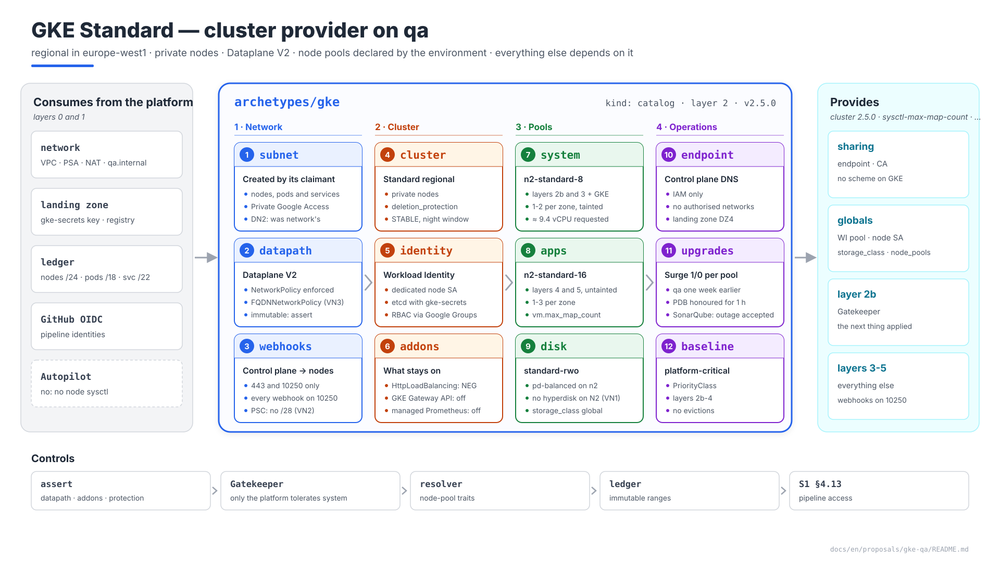

# GKE on `qa` — `gke` archetype (layer 2), provider of `cluster`

| | |
|---|---|
| **Status** | Proposal · revision 7 · two node pools, `system` and `apps` (DN11) |
| **Scope** | The `qa` cluster as an archetype: addresses and subnet, control plane and access, node security, node pools and how consumers are assigned to them, storage, cluster networking, upgrades, the `cluster` contract, stacks, policies, execution and plan |
| **Why now** | Everything deployed in the earlier proposals runs on it, and each of them left it a requirement (§0.1). It is everyone's dependency: the last link before the network and the edge |
| **Base** | S1 §4.1 (runtime), §4.13 (pipeline access), §4.14 (KMS), §4.15 (separate VPC); architecture §5.2–§5.7 (GKE guide and security baseline); AM §9 (pools and ranges). This document **does not repeat** what is there: it makes it concrete and closes the gaps |
| **Reference specification** | `archetype-model.md` (AM §n), `terramate-outputs-sharing-architecture.md` (§n), `risk-register.md` |
| **Diagrams** | `diagrams/*.mmd` (Mermaid source) and `diagrams/*.svg` (rendered). The SVG is regenerated from the `.mmd`; never hand-edited. `diagrams/06-bloques-presentacion.svg` (1920×1080, for presentations) is generated by `06-bloques-presentacion.py`, not Mermaid |
| **Local identifiers** | Decisions `DN1…`, candidate risks `RN1…`, verifications `VN1…`. Risks get an `R54+` number in `risk-register.md` if adopted, after those of the earlier proposals |

It reopens no decision of `CLAUDE.md`. It does correct three points of documents already closed, because as written they did not work or contradicted each other: the disk type (§6), who creates the node subnet (§1.2) and the traits that depend on a node pool (§5.3). All three are **applied** (§11).



Source: [`diagrams/06-bloques-presentacion.py`](diagrams/06-bloques-presentacion.py) — presentation view; the detail is in §1–§9.

---

## 0. Context

| Question | Answer | Consequence |
|---|---|---|
| What it is | Archetype `gke`, `kind: catalog`, **layer 2**, provides **`cluster` 2.5.0** | Stack `gcp-qa-gke` and its siblings (§7.3) |
| Mode | GKE **Standard**, **regional** in `europe-west1` (zones `b`, `c`, `d`) | Autopilot does not allow node sysctls (S1 §4.1). Open question no. 1 of `CLAUDE.md` does not apply to `qa` |
| Project and network | `disasterproject-nonprod`, `qa`'s own VPC (S1 §4.15) | No Shared VPC and no transit through the hub |
| Who consumes it | Everything from layer 2b upwards: Gatekeeper, cert-manager, ESO, monitoring, Envoy Gateway, Kafka, Keycloak, SonarQube | Endpoint and CA via outputs sharing; the rest, globals (§7.1) |



Source: [`diagrams/01-contexto.mmd`](diagrams/01-contexto.mmd)

### 0.1 What the earlier proposals asked of it

| Origin | Requirement | Where it is met |
|---|---|---|
| S1 §4.1 | Private nodes, Workload Identity, `deletion_protection`, sysctl `vm.max_map_count` on SonarQube's pool (`apps` since DN11) | §2, §3, §5 |
| S1 §4.13, landing zone DZ4 | Pipeline access to the control plane through the **DNS endpoint**, IAM only; no authorised networks and no intermediary service | §2.2 |
| S1 §4.14 | etcd secrets encryption with the landing zone's `gke-secrets` key | §3 |
| Monitoring §1 | `SYSTEM_COMPONENTS` in logs and metrics; `managed_prometheus.enabled = false` | §4 |
| Envoy Gateway §3 | `gateway_api_config { channel = "CHANNEL_DISABLED" }` | §4 |
| Envoy Gateway §5.1 | Standalone NEG for the edge | §4: it **requires** the `HttpLoadBalancing` addon (RN2) |
| Kafka §2.1 | One broker per zone (revision 6: a `kafka` pool with a taint; with DN11, on `apps`) | §5 |
| SonarQube S2 §9 | `vm.max_map_count` on its node (revision 6: `sonar` pool; with DN11, `apps`); `workload_identity_pool` output | §5, §7.1 |
| Gatekeeper, ESO, monitoring, CNPG | Webhooks on **10250**: the control plane only reaches private nodes on 443 and 10250 | §2.3 (VN2) |
| Keycloak VK6 | `FQDNNetworkPolicy` towards Entra ID | §4: Dataplane V2 (VN3) |

---

## 1. Addresses and subnet

### 1.1 Claims in the `qa` pool

`qa` is `10.4.128.0/17` (AM §9.2). The zones of `registry/zones.yaml` split it as: `infra` `10.4.128.0/20`, `data` `10.4.144.0/20`, `edge` `10.4.160.0/20`, `growth` `10.4.176.0/20`, `pods` `10.4.192.0/18`.

| Claim | Zone | Size | First fit if `gke` claims first | Calculation |
|---|---|---|---|---|
| Node subnet | `infra` | **/24** | `10.4.128.0/24` | `max_nodes × 4` with a /24 floor (AM §9.5): 32 × 4 = 128 → /25 → /24 |
| Pod range | `pods` | **/18**, the whole zone | `10.4.192.0/18` | 64 pods/node → /25 per node → 128 nodes. One cluster per environment: the zone has no other use, and the range is immutable (R26) |
| Service range | `edge` | **/22** | `10.4.160.0/22` | 1024 `Service`s. Also immutable; a /24 (256) falls short with Kafka's per-broker `Service`s and those of each CNPG `Cluster`, and enlarging it means rebuilding (DN6) |

The exact values are assigned by the ledger (AM §9.7); the table shows the result if the cluster claims before anyone else. The AM §9.4 `assert` checks `max_nodes × block ≤ pod range`: 32 × /25 = /20 ≤ /18.

**No /28 for the control plane.** New private clusters use Private Service Connect and claim no range for the control plane **(verify on the pinned provider version, VN2)**. If the provider creates a peering-based cluster, a /28 in `infra` is needed.

### 1.2 Who creates the subnet

The architecture (§5.2) puts the subnet and its secondary ranges in the network stack, and the cluster receives their names via outputs sharing. AM (§3, §9.5) says the opposite: **the runtime claims** the node subnet and the pod range, because each runtime has a different shape (GKE: subnet + two ranges; EKS: subnets; AKS Overlay: subnet only; Cloud Run: egress subnet). With the architecture's version, the `environment` archetype would have to know every runtime's shape.

**Proposal (DN2):** the node subnet and its two secondary ranges are created by the `gke` archetype itself, in its first stack (`subnet`), on the VPC that `network` publishes. Consequences:

| Before (architecture §5.2) | After |
|---|---|
| `network` creates the subnet and ranges; outputs `subnet_self_link`, `gke_pods_range_name`, `gke_services_range_name` | `network` publishes the VPC, the PSA range, Cloud NAT (`ALL_SUBNETWORKS_ALL_IP_RANGES`) and the `qa.internal` zone; it does **not** know the runtime |
| The claim's owner (`gcp-qa-gke` in the ledger) is not who creates the resource | Claim owner = creator = writer of its firewall rules (`CLAUDE.md`) |
| Rebuilding the cluster for R26 touches the network stack | It touches only `gke` stacks |

Private Google Access is enabled on the node subnet: `gke` creates it, so `gke` enables it.

**Also EKS and AKS.** The same rule now applies to the EKS and AKS guides (architecture §6.2, §9.2): each runtime creates its subnets in its own `*-subnets` stack, and on EKS the subnet-tagging cycle can no longer arise.

---

## 2. Control plane and access

### 2.1 Cluster

| Setting | Value | Reason |
|---|---|---|
| Name | `qa` (global `cluster_name`) | Deterministic: breaks cycles and avoids a sharing output |
| Location | `europe-west1`, regional | Control plane replicated across 3 zones |
| Release channel | `STABLE` | S1 §4.1 (DN8) |
| Maintenance window | Monday to Thursday, 22:00–04:00 `Europe/Madrid` | `qa` is upgraded on working days and before `prod`, whose window is one week later (DN8) |
| `deletion_protection` | `true` | S1 §4.1; `assert` in §9.1 |
| Default pool | `remove_default_node_pool = true`, `initial_node_count = 1` | Pools are managed in their own stack (§7.3) |
| Cluster autoscaling | `BALANCED` profile; **no** node auto-provisioning | A pool created by NAP would carry no deliberate taints or sysctls |

### 2.2 Endpoint

| Setting | Value | Reason |
|---|---|---|
| Nodes | `enable_private_nodes = true` | §5.7 |
| Public IP endpoint | **Disabled**; the private IP endpoint stays for traffic inside the VPC | No authorised networks to maintain (landing zone DZ4) |
| DNS endpoint | `control_plane_endpoints_config.dns_endpoint_config.allow_external_traffic = true`: the API server on a Google DNS name, reachable from a hosted runner and controlled **by IAM only** | Replaces S1 §4.13's procedure and the `access` service, which the `run.allowedIngress` org policy made unreachable (landing zone §3.2) **(verify the field names on the pinned provider version, VZ5)** |
| Who can use it | `container.clusters.connect` granted **on this cluster** to `qa`'s pipeline identities and to the `gke-qa-admins@` group; RBAC after that | Without the network barrier, IAM is the only one: access by principals outside that list is alerted in layer 1b (monitoring §10.3) |

### 2.3 Control plane firewall

GKE creates the rule that lets the control plane reach the nodes on **443 and 10250**. That is why every platform webhook listens on 10250 (Gatekeeper RP1, ESO RE3, monitoring VM3, CNPG VO1). The archetype adds no rules: any other webhook port would need one, and each provider's `assert` prevents it **(verify with PSC, VN2)**.

**The other direction.** The VPC denies egress by default (`network-qa` DW6). The nodes reach the control plane through the environment's internal allow: with PSC its private endpoint is an address in the node subnet, inside the `/17` **(verify, VN2)**. A peering-based cluster's `/28` sits outside it, and then this archetype writes the egress allow to it on tcp 443 and **8132** — the konnectivity tunnel through which the control plane reaches webhooks, `logs` and `exec`; without 8132 every admission webhook times out.

---

## 3. Node security and identity

| Control | Value | Reference |
|---|---|---|
| Node SA | `gke-nodes-qa@disasterproject-nonprod`, dedicated, **created by the landing zone** and received as a global: the `cluster` stack does not create it (landing zone DZ5). Roles `logging.logWriter`, `monitoring.metricWriter`, `stackdriver.resourceMetadata.writer` on the project; `artifactregistry.reader` **on the landing zone's repositories** | §5.7; the landing zone can only grant on its registry to an identity that already exists |
| Workload Identity | `workload_pool = "disasterproject-nonprod.svc.id.goog"`; `workload_metadata_config.mode = "GKE_METADATA"` on every pool. The pool is the **project's**, shared with the other non-prod clusters: every KSA holding GCP IAM is named `qa-<name>` (Gatekeeper P12) | §5.7, R15, R54 |
| Metadata | `disable-legacy-endpoints = true` | §5.7 |
| Nodes | Shielded (secure boot, integrity), `COS_CONTAINERD`, no external IP | §5.7, org policies §11.7 |
| Secrets in etcd | `database_encryption { state = "ENCRYPTED", key_name = <gke-secrets> }` | S1 §4.14 |
| Grant on `gke-secrets` | Given by the **landing zone** to `disasterproject-nonprod`'s GKE service agent | `qa`'s identity cannot write IAM on a landing zone key; the landing zone creates the project and knows its number. The agent is **one per project** and the non-prod clusters share it: the per-environment key separates encryption by convention, not by IAM (accepted in non-production) |
| RBAC | Google Groups for RBAC (`authenticator_groups_config.security_group = gke-security-groups@<domain>`); `cluster-admin` bound to `gke-qa-admins@` | §5.7 **(verify the group in the domain, VN4)** |
| Binary Authorization | `PROJECT_SINGLETON_POLICY_ENFORCE`. The policy is **one per project** and **only the landing zone** writes it, with one rule per cluster generated from the bindings and `ALWAYS_DENY` by default (landing zone DZ6); this archetype does not declare the resource. On `qa`, the rule admits the `apps` and `third-party` repositories and requires attestation in *dry-run* | If every `gke` wrote the policy, the last `apply` would erase the other non-prod environments' rules. §5.7 asks for attestation and nothing generates it yet: S1 §4.10's signature is cosign's. Enforce on `prod` once the pipeline creates attestations (DN10) |

---

## 4. Cluster networking and addons

| Setting | Value | Reason |
|---|---|---|
| Datapath | **`ADVANCED_DATAPATH`** (Dataplane V2) | Enforces `NetworkPolicy` (S1 §4.8 and every proposal) and, with `enable_fqdn_network_policy`, `FQDNNetworkPolicy` (Keycloak VK6, VN3). **Immutable**: without it at creation, every platform `NetworkPolicy` is decorative, with no error at all (RN3) |
| `HttpLoadBalancing` | **Enabled** | The NEG controller that creates Envoy's standalone NEG lives in this addon. Disabling it because "we don't use GKE Ingress" leaves the edge with no backends (RN2) |
| GKE Gateway API | `CHANNEL_DISABLED` | Envoy Gateway §3 |
| Logs and metrics | `SYSTEM_COMPONENTS`; `managed_prometheus.enabled = false` | Monitoring §1 |
| Persistent Disk CSI | Enabled | §6 |
| DNS | kube-dns (the default); **no** NodeLocal DNSCache | The DNS rules of every `NetworkPolicy` already written point at kube-dns. Enabling the cache later means reviewing them all (DN9) |
| `qa.internal` | Resolves from pods: kube-dns forwards to the metadata server, which resolves the private zones bound to the VPC | S1 §4.15 |
| Cost allocation | `cost_management_config.enabled = true` | Cost per namespace with no extra tooling |

---

## 5. Node pools

### 5.1 Two pools: `system` and `apps` (DN11)

Every platform cluster has **two** node pools, with the same criterion in every environment: **`system`** for what governs and serves the cluster (layers 2b and 3, and GKE's components), and **`apps`** for what is deployed on top (layers 4 and 5). Revision 6 had three pools on `qa` (`general`, `sonar`, `kafka`): each archetype with node requirements asked for its own pool, and each new pool added a taint, owners, an upgrade window and a minimum of nodes to pay for even when empty.



Source: [`diagrams/03-node-pools.mmd`](diagrams/03-node-pools.mmd)

| Pool | For | Machine | Zones | Nodes | Taint | Specific | Upgrade |
|---|---|---|---|---|---|---|---|
| `system` | Layers 2b and 3: Gatekeeper, cert-manager, ESO, monitoring, Envoy Gateway; GKE managed components | **n2-standard-8** (8 vCPU, 32 GB) | `b`, `c`, `d` | **1–2 per zone**, autoscaled | `components.gke.io/gke-managed-components=true:NoSchedule` | — | Surge `max_surge = 1`, `max_unavailable = 0` |
| `apps` | Layers 4 and 5: Keycloak, Kafka, CloudNativePG, SonarQube, DefectDojo (`appsec-qa`)… | **n2-standard-16** (16 vCPU, 64 GB) | `b`, `c`, `d` | **1–3 per zone**, autoscaled | — | `linux_node_config.sysctls = { "vm.max_map_count" = "524288" }` | Surge 1/0; Strimzi's PDB (`maxUnavailable: 1`) serialises the brokers |

All: 64 pods per node, `COS_CONTAINERD`, Shielded, `GKE_METADATA`, SA `gke-nodes-qa@`, auto-upgrade and auto-repair on. GKE honours PDBs for one hour and then forces the drain: a PDB that is never satisfied does not block an upgrade, it only delays it.

**Why GKE's taint on `system`.** `components.gke.io/gke-managed-components` is the key GKE's managed components (kube-dns, metrics-server, konnectivity) already tolerate, so they can keep scheduling on `system` without the platform touching their manifests **(verify, VN8)**. A taint of our own (`dedicated=system`) would push them to `apps`. `apps` has no taint: it is the default destination, and whatever does not ask for `system` ends up there.

**`vm.max_map_count` on all of `apps`.** Elasticsearch, inside SonarQube, requires it; with a `sonar` pool only its node had it. On `apps` every node carries it: raising the limit on mapped memory areas does not change the behaviour of a process that does not use them, and SonarQube can schedule on any node of the pool in its zone.

**The one documented third pool: `gvisor`.** Where an archetype must run third-party code with privileges — A.I.G's agent, with `SYS_ADMIN` (`appsec-qa` §5, DA8) — it goes on a third pool with GKE Sandbox (`sandbox_config { sandbox_type = "gvisor" }`): each pod gets its own user-space kernel, so the privilege never reaches the node's. `e2-standard-4`, **0–1 nodes** in one zone, autoscaled to zero; GKE's taint `sandbox.gke.io/runtime=gvisor:NoSchedule`, tolerated only by its owners (P11); its own node SA, `gke-gvisor-<env>@`, created by the landing zone with logging, metrics and `third-party` read only. It is the data-backed exception of DN11, not a third general pool: nothing else is scheduled there, and an environment that binds no such archetype has no `gvisor` pool.

**What is lost compared with dedicated pools**, and why it is accepted on `qa`:

| Pool that goes away | It gave | With two pools | Mitigation |
|---|---|---|---|
| `sonar` | A node for SonarQube alone; a noisy neighbour does not slow the CE | SonarQube shares a node with other layer 4–5 workloads | Real `requests` (4 vCPU, 12 GiB, S1 §4.12): the scheduler does not place it where it does not fit; with no CPU limit, it uses what is spare |
| `kafka` | The system page cache for the brokers alone, without competition | The brokers share the node's page cache | One broker per zone with `topologySpreadConstraints` and anti-affinity between brokers; memory `requests` that reserve the cache headroom (Kafka §2.1). If `prod` measures queue latency caused by the cache, a third pool is an exception justified by data, not the starting point (DN11) |

### 5.2 Size of each pool

Sum of the `capacity` of the manifests already proposed, per pool:

| Archetype | Layer | Pool | CPU (m) | Memory (MiB) |
|---|---|---|---|---|
| `policy-gatekeeper` | 2b | `system` | 1600 | 2560 |
| `cert-manager` | 3 | `system` | 400 | 768 |
| `secrets-eso-gsm` | 3 | `system` | 200 | 768 |
| `monitoring-oss` | 3 | `system` | 3000 | 8192 |
| `gateway-envoy-gke` | 3 | `system` | 3200 | 3584 |
| GKE system | — | `system` | ≈ 1000 | ≈ 2048 |
| **`system` total** | | | **≈ 9400** | **≈ 17,900** |
| `keycloak` | 4 | `apps` | 2300 | 4864 |
| `kafka` | 4 | `apps` | 7200 | 27,648 |
| `sonarqube` | 5 | `apps` | 8000 | 28,672 |
| `defectdojo` (`appsec-qa`) | 4 | `apps` | 3000 | 6144 |
| `dast` (`appsec-qa`), nightly jobs | 5 | `apps` | 2000 | 4096 |
| **`apps` total** | | | **≈ 22,500** | **≈ 71,400** |

| Pool | Allocatable per node | Minimum (1 per zone) | Requested occupancy | One zone lost |
|---|---|---|---|---|
| `system` | ≈ 7.9 vCPU, ≈ 28 GiB | 3 nodes: ≈ 23.7 vCPU, ≈ 85 GiB | 40 % CPU, 21 % memory | 2 nodes: 59 % CPU; the autoscaler adds the second per zone |
| `apps` | ≈ 15.8 vCPU, ≈ 57 GiB | 3 nodes: ≈ 47 vCPU, ≈ 172 GiB | 48 % CPU, 41 % memory | 2 nodes: 71 % CPU, 61 % memory; still fits |

DaemonSets (node-exporter, Fluent Bit) add per node in both pools and fit in that margin.

**Why n2-standard-16 for `apps`.** The largest pod sets the minimum size of a shared pool: SonarQube requests 4 vCPU and 12 GiB, and a Kafka broker 2 vCPU and 8 GiB. They fit on n2-standard-8, but with three of them spread across zones the pool would need two nodes per zone from the start; with n2-standard-16, one per zone is enough and each node repeats the DaemonSet cost once (DN4). **Cost:** the minimum goes from 44 vCPU (revision 6: 3 × 8 + 1 × 8 + 3 × 4) to 72 vCPU (3 × 8 + 3 × 16). Half of the difference is the capacity of `appsec-qa`, which was not there before; the rest is the price of not having tailor-made pools.

### 5.3 How each workload reaches its pool

| Piece | Design |
|---|---|
| Declaration | Pools belong to the **environment**: they live in the binding (`cluster.node_pools`), not in the `gke` manifest or the consumer's. That way `prod` can size differently without touching any archetype |
| Platform (layers 2b and 3) | The generator adds `nodeSelector: { cloud.google.com/gke-nodepool: system }` and the toleration for `system`'s taint to the values of every layer 2b or 3 chart, from the `node_pools` global. No archetype writes it by hand: **one writer, one validator** (`CLAUDE.md`, "No Gatekeeper mutation") |
| Applications (layers 4 and 5) | **Nothing.** With no selector and no toleration, `system`'s taint leaves them on `apps`. A consumer setting `nodeSelector: … apps` would gain nothing and tie the chart to the pool's name |
| DaemonSets | The platform's (node-exporter, Fluent Bit) tolerate `system`'s taint to cover both pools |
| Who may tolerate | Gatekeeper rule P11: only the namespaces of a pool's owners may tolerate its taint. `system`'s owners are the binding's layer 2b and 3 archetypes, plus `kube-system`. Without it, a tenant adds the toleration and lands next to Gatekeeper or Prometheus (RN5) |
| Pool traits | `sysctl-max-map-count`, `gpu`, `spot` and `arm64` are properties of **one** pool, not of the cluster. The resolver treats those traits as present only if a pool in the binding declares them (AM §4.2, DN5). With two pools, `apps` declares `sysctl-max-map-count`; a trait only a new pool could provide (`gpu`) is exactly the case in which a third pool is justified |

```yaml
# environments/qa/binding.yaml — cluster block (DN5, DN11)
cluster:
  max_nodes: 32
  max_pods_per_node: 64
  node_pools:
    - name: system
      machine_type: n2-standard-8
      zones: [europe-west1-b, europe-west1-c, europe-west1-d]
      autoscaling: { min_per_zone: 1, max_per_zone: 2 }
      taint: components.gke.io/gke-managed-components=true:NoSchedule
      owners: [policy-gatekeeper, cert-manager, secrets-eso-gsm, monitoring-oss, gateway-envoy-gke]
    - name: apps
      machine_type: n2-standard-16
      zones: [europe-west1-b, europe-west1-c, europe-west1-d]
      autoscaling: { min_per_zone: 1, max_per_zone: 3 }
      sysctls: { vm.max_map_count: "524288" }
      traits: [sysctl-max-map-count]
```

`system`'s `owners` is not written freely: an `assert` (§9.1) requires it to be exactly the set of layer 2b and 3 archetypes the binding binds, which the resolver publishes in `binding.tm.hcl` as `global.platform.layer_2b_3_archetypes`. A new platform archetype enters the list in the same pull request that binds it, or `generate` fails.

`max_nodes: 32` is the cluster's ceiling, not its size: 6 + 9 = 15 nodes at most, plus one surge node per pool during an upgrade.

---

## 6. Storage

**The problem.** S1 §4.1 sets the StorageClass to `hyperdisk-balanced`, and the pools are n2. According to the Compute Engine compatibility table, **the N2 series does not support Hyperdisk Balanced**: only Persistent Disk, and Hyperdisk Extreme or Throughput at large sizes **(verify at implementation date, VN1)**. With `WaitForFirstConsumer` nothing fails when the StorageClass or the PVC is created: it fails when the pod is scheduled, and the pod stays `Pending` (RN1). It affects SonarQube (ES and CNPG), Prometheus and the Kafka brokers.

| Option | Disk | Machine | Performance for S1 §4.12 (3000 IOPS on 50 GiB) | Cost of the change |
|---|---|---|---|---|
| **A (recommended)** | `pd-balanced` through the `standard-rwo` StorageClass GKE already ships (`WaitForFirstConsumer`, expansion enabled) | n2, unchanged | 3000 baseline IOPS plus 6 per GiB: ≈ 3300 on 50 GiB | Change the StorageClass name in four places |
| B | `hyperdisk-balanced` | n4 or c3 in all three pools | Configurable IOPS | Change the machines; c3 is already evaluated for the CE in S1 V4 |

**And the name leaves the consumers (DN3).** The `cluster` contract publishes a `storage_class` global (`standard-rwo` on GKE with option A) and consumers use it, never a disk type. S2 already had a `global.storage_class`; what changes is where it comes from. S1 §4.1's high-availability alternative still exists with option A: regional `pd-balanced` (`replication-type: regional-pd`).

---

## 7. The contract and the archetype

### 7.1 `cluster` 2.5.0 contract

| Value | How it arrives | Value on `qa` | Change |
|---|---|---|---|
| `cluster_endpoint` | Outputs sharing, from `cluster` | Endpoint IP, **no scheme** (`CLAUDE.md` trap) | — |
| `cluster_ca` | Outputs sharing, from `cluster`, `sensitive` | Base64 | — |
| `cluster_name`, `cluster_location` | Global | `qa`, `europe-west1` | Still outputs too, for compatibility |
| `workload_identity_pool` | **Global** | `disasterproject-nonprod.svc.id.goog` | Was a sharing output. It is deterministic (the project), so it becomes a global: one edge fewer in every consumer (DN7). The output stays, deprecated, until 3.0.0 |
| `node_service_account` | Global | `gke-nodes-qa@disasterproject-nonprod.iam.gserviceaccount.com` | Same |
| `node_pool_instance_groups` | Outputs sharing, from `nodepools`, **new** | Instance group URLs per pool | For the edge's L4 exceptions (`edge-qa` proposal §5). Not deterministic: they change if a pool is recreated |
| `storage_class` | Global, **new** | `standard-rwo` | §6 |
| `node_pools` | Global, **new**, from the binding | Name, taint and owners of each pool | §5.3 |

A minor version: nothing disappears, and consumers requiring `^2.0.0` still resolve.

### 7.2 Manifest

```yaml
# archetypes/gke/manifest.yaml
apiVersion: archetype/v1
kind: Archetype

metadata:
  name: gke
  version: 2.5.0
  layer: 2
  kind: catalog
  description: Regional GKE Standard with private nodes; node pools declared by the environment
  owners: [team-platform]

runtimes: [gke]

requires:
  - capability: network
    version: "^3.0.0"

provides:
  - capability: cluster
    version: 2.5.0
    traits: [self-managed-nodes, daemonset-privileged, hostpath, node-agent, gpu, sysctl-max-map-count]
    outputs:
      - { name: cluster_endpoint,       from: cluster }
      - { name: cluster_ca,             from: cluster }
      - { name: cluster_name,           from: cluster }
      - { name: cluster_location,       from: cluster }
      - { name: workload_identity_pool, from: cluster }     # deprecated: a global since 2.5.0
      - { name: node_service_account,   from: cluster }
      - { name: node_pool_instance_groups, from: nodepools }   # for edge-l4 (edge-qa proposal §5)

claims:
  - kind: cidr
    zone: infra
    purpose: nodes
    computed: "from(max_nodes)"
  - kind: cidr
    zone: pods
    purpose: pods
    computed: "from(max_nodes, max_pods_per_node)"
  - kind: cidr
    zone: edge
    purpose: services
    size: 22

stacks:
  - name: subnet
  - name: cluster
    after: [subnet]
  - name: nodepools
    after: [cluster]
  - name: baseline
    after: [nodepools]
```

`gpu` and `sysctl-max-map-count` stay in `traits` because the archetype **can** offer them; with the §5.3 proposal, the resolver treats them as present only if a pool in the binding declares them.

### 7.3 The stacks

| Stack | Contents | Inputs via sharing |
|---|---|---|
| `subnet` | Node subnet with its two secondary ranges, Private Google Access and flow logs from the environment's `flow_logs` global (`network-qa` proposal §2) | `network_self_link` |
| `cluster` | `google_container_cluster` (§2–§4) with the landing zone's node SA; that SA's project roles | `network_self_link`, `subnet_self_link` (from its own `subnet`) |
| `nodepools` | One `google_container_node_pool` per entry in `cluster.node_pools`; publishes `node_pool_instance_groups` | — (globals) |
| `baseline` | `PriorityClass` `platform-critical` for layers 2b–4, so a tenant cannot evict Gatekeeper or the Gateway; nothing else | `cluster_endpoint`, `cluster_ca` |

**Why `nodepools` is separate.** A pool change (size, taint, a new pool) must not plan the cluster, and a cluster `plan` must not show the pools. It is also the stack that differs most between environments.

---

## 8. Execution

| What | How |
|---|---|
| First deployment | Phase A of S1 §6, after `gcp-qa-network`: `subnet` → `cluster` → `nodepools` → `baseline`. Gatekeeper comes next |
| Control plane upgrade | Automatic via the channel, in the window (§2.1). `qa` one week before `prod` |
| Pool upgrade | Automatic after the control plane; surge 1/0 per pool. Upgrading `apps` **takes SonarQube down** when its node's turn comes (one replica, zonal PVC): accepted on `qa` (R53); the window keeps it out of working hours |
| Resizing a pool | PR to the binding → `nodepools` |
| Changing a range, the datapath or pods per node | **Rebuilding the cluster** (immutable). An `assert` fails at `generate` if the binding tries to change `max_pods_per_node` on an existing cluster |
| Destruction | `deletion_protection` and the `protected` tag; only with the destroy identity (§11.4) |

---

## 9. Policies, risks and verifications

### 9.1 `assert`

```hcl
assert {
  assertion = global.gke.datapath_provider == "ADVANCED_DATAPATH"
  message   = "cluster: Dataplane V2 — without it, NetworkPolicies are not enforced and the fix is a rebuild (RN3)"
}
assert {
  assertion = global.gke.addons.http_load_balancing
  message   = "cluster: HttpLoadBalancing enabled — without it there is no standalone NEG for the edge (RN2)"
}
assert {
  assertion = global.gke.deletion_protection && global.gke.private_nodes && global.gke.workload_identity_enabled
  message   = "cluster: deletion_protection, private nodes and Workload Identity (§5.7)"
}
assert {
  assertion = alltrue([for p in global.cluster.node_pools : p.taint == null || length(p.owners) > 0])
  message   = "cluster: a tainted pool needs owners — otherwise nobody can use it, or everybody can (RN5)"
}
assert {
  assertion = tm_length(global.cluster.node_pools) == 2 && tm_toset([for p in global.cluster.node_pools : p.name]) == tm_toset(["system", "apps"])
  message   = "cluster: two pools, system and apps (DN11); a third one is an exception approved by changing this assert"
}
assert {
  assertion = tm_toset([for p in global.cluster.node_pools : p.owners if p.name == "system"][0]) == tm_toset(global.platform.layer_2b_3_archetypes)
  message   = "cluster: system's owners are exactly the binding's layer 2b and 3 archetypes (§5.3)"
}
```

### 9.2 Candidate risks

| # | Risk | Likelihood | Impact | Mitigation |
|---|---|---|---|---|
| RN1 | **Disk incompatible with the machine**: `hyperdisk-balanced` PVCs do not attach on n2 | High with the current design | High — SonarQube, Prometheus and Kafka do not start; the error appears when the pod is scheduled | §6, option A; `storage_class` as a global; VN1 |
| RN2 | **`HttpLoadBalancing` addon disabled**: the standalone NEG is not created | Medium | High — the edge has no backends | `assert`; VN5 |
| RN3 | **Cluster without Dataplane V2**: `NetworkPolicy` objects are admitted and not enforced | Low with the `assert` | Critical — no network isolation, no error; fixing it is a rebuild | `assert` |
| RN4 | *Retired*: with no authorised networks there is nothing an `apply` can revert (landing zone DZ4) | — | — | — |
| RN5 | **A tenant lands on `system`** by adding the toleration | Medium without the rule | High — it competes with Gatekeeper, Envoy or Prometheus, and a platform outage affects everyone | Gatekeeper rule P11 (§5.3) |
| RN6 | **Automatic upgrade of `apps` during working hours** (takes SonarQube down and moves brokers) | Medium | Low on `qa` | Maintenance window; exclusions around delivery dates |
| RN7 | **Pool trait resolved without the pool** | High without the proposal | Medium — the consumer fails at start-up | §5.3: the resolver checks the pool |
| RN8 | **Noisy neighbour on `apps`**: a large SonarQube CE analysis or a Kafka page storm slows the other layer 4–5 workloads | Medium | Medium on `qa` | Real `requests` in every manifest; per-node saturation alerts (monitoring); a third pool only with data (DN11) |

### 9.3 Verifications

| # | Verification | Result that closes it |
|---|---|---|
| VN1 | Hyperdisk Balanced compatibility with N2 and `pd-balanced` performance on 50 GiB | Compute Engine table at the date; `fio` on the ES PVC ≥ 3000 IOPS |
| VN2 | Private cluster with PSC: no /28; automatic control-plane rule to 443 and 10250 | Gatekeeper, ESO, monitoring and CNPG webhooks answer (= VP1, VE4, VM3, VO1) |
| VN3 | `FQDNNetworkPolicy` on GKE Standard with Dataplane V2 | = Keycloak's VK6 |
| VN4 | Google Groups for RBAC with `gke-security-groups@<domain>` | A member of `gke-qa-admins@` is `cluster-admin`; any other user gets nothing |
| VN5 | Standalone NEG with `HttpLoadBalancing` enabled and `CHANNEL_DISABLED` | Envoy's NEG exists and the edge backend service sees it healthy |
| VN6 | `vm.max_map_count` via `linux_node_config` on `apps` | = S1's V1 |
| VN7 | `apps` pool upgrade with surge 1/0 | SonarQube's PVC is remounted on a new node in its zone; the outage is measured |
| VN8 | Taint `components.gke.io/gke-managed-components` on `system` | kube-dns, metrics-server and konnectivity schedule on `system`; no layer 4–5 pod does |

---

## 10. `prod` and `demos`

| Setting | `qa` | `prod` | `demos` |
|---|---|---|---|
| Environment | `/17` | `/16`: pods `/17`, 256 nodes | `/17` |
| Pools | `system` and `apps` | `system` and `apps`, with more nodes; a third only with data that justify it (DN11) | Autopilot (`gke-autopilot`), no pools |
| Window | Monday to Thursday | One week after `qa` | Any |
| Binary Authorization | Attestation in *dry-run* | **Enforce** | *Dry-run* |

---

## 11. Changes to other documents

| Document | Change | Status |
|---|---|---|
| S1 §6 (`docs/en/` and `docs/es/`) | The `…-data-tenant → gcp-qa-postgres-operator` edge changes from outputs sharing to a global (`operator_version`, `postgres-operator-qa` proposal §7.1): fixes what was left un-updated in the previous commit | **Applied** |
| S1 §4.1 and §4.12, S2 §4.2, §5.3 and §6.1, monitoring §3.1, S1 diagram 08 | `hyperdisk-balanced` → the `storage_class` global (`standard-rwo`, `pd-balanced`); S1 §4.1's HA alternative becomes regional `pd-balanced` | **Applied** (DN3) |
| Architecture §3.1, §4.3, §4.4, §5.1–§5.3 and §6.8; `platform-overview` | The subnet and secondary ranges are created by `gke` in its `gke-subnet` stack, not `network`; the `network` contract loses `subnet_self_link` and the range names and gains `private_service_range` | **Applied** (DN2) |
| `schemas/environment-binding.schema.json` and the `qa` bindings (S1 §7, Cloud SQL variant) | `cluster.node_pools` block (§5.3), with `owners` required when there is a taint; `gke` 2.5.0 in the binding | **Applied** (DN5) |
| AM §4.2 and `registry/traits.yaml` | Pool traits: present only if a pool in the binding declares them; marked in the registry | **Applied** (DN5) |
| Gatekeeper §4.1 and §7.1 | Rule P11: tolerate a pool's taint only from its owners' namespaces; its parameters come from the binding | **Applied** (DN5); with DN11, the only tainted pool is `system` |
| S1 §4.1, §4.12; S2 §6.1; Kafka §2.1; Cloud SQL variant; Envoy Gateway; diagrams | `sonar` and `kafka` pools replaced by `apps`; no `nodeSelector` or tolerations in the consumers | **Applied** (DN11) |
| Consumers of `workload_identity_pool` | Read it as a global; the output remains until 3.0.0 | **Proposed** (DN7) |
| Landing zone §3.2, §6.3 and §8; S1 §4.13 | DNS endpoint instead of authorised networks and the `access` stack (DZ4); node SA created by the landing zone (DZ5); Binary Authorization written only by the landing zone (DZ6) | **Applied** |

---

## 12. Decisions

| # | Decision | Status | Recommendation | Alternative |
|---|---|---|---|---|
| DN1 | Mode and access | Consequence of S1 §4.1; access revised by landing zone DZ4 | Regional Standard, private nodes, public IP endpoint disabled, DNS endpoint with IAM only | Autopilot; public endpoint with authorised networks opened per job (the original S1 §4.13) |
| DN2 | Who creates the node subnet | **Approved** | `gke`, which claims it | `network`, as in architecture §5.2 |
| DN3 | Disk | **Approved**; VN1 confirms it | `pd-balanced` (`standard-rwo`) on n2; `storage_class` as a global | Hyperdisk Balanced with n4 or c3 |
| DN4 | Pool machines | Proposed | `system`: n2-standard-8, 1–2 per zone; `apps`: n2-standard-16, 1–3 per zone | n2-standard-8 for both, `apps` with 2–6 per zone |
| DN5 | Pools | **Approved** | Declared in the binding; pool traits checked by the resolver; tolerations restricted by Gatekeeper | Pools fixed in the `gke` manifest |
| DN6 | Service range | Proposed | /22 | /24 |
| DN7 | `workload_identity_pool` | Proposed | Global | Outputs sharing |
| DN8 | Upgrades | Proposed | `STABLE` in both environments, `qa`'s window one week before `prod`'s | `REGULAR` on `qa`, `STABLE` on `prod` |
| DN9 | Cluster DNS | Proposed | kube-dns without NodeLocal DNSCache | With the cache, reviewing every DNS rule |
| DN10 | Binary Authorization | Proposed | Registry allow-list enforced; attestation in *dry-run* on `qa` | No Binary Authorization, only Gatekeeper rule P2 |
| DN11 | Number of pools | **Requested** | Two in every cluster: `system` (layers 2b–3 and GKE, tainted) and `apps` (layers 4–5, untainted); a third only as an exception backed by data | One pool per archetype with node requirements (revision 6: `general`, `sonar`, `kafka`) |

---

## 13. Implementation plan

| Phase | Contents | Exit criterion | Estimate |
|---|---|---|---|
| **0 · Verifications** | VN1 and VN2 in an ephemeral with a minimal cluster | Disk decided; webhook on 10250 reachable | 1 day |
| **1 · Cluster** | `subnet`, `cluster`, `nodepools`; §9.1 `assert`s | Both pools healthy; `kubectl` from a runner through the DNS endpoint | 1 day |
| **2 · Access** | DNS endpoint; per-resource `container.clusters.connect`; alert on access outside the list (monitoring §10.3); **VZ5** | `helm`, `kubernetes` and `kubectl` against the cluster from a hosted runner, with no authorised networks | 0.5 days |
| **3 · Baseline** | `baseline`; VN4, VN5, VN6, VN7, VN8 | Gatekeeper installable (phase B of S1 §6) | 1 day |

Four and a half days for one person. What it unblocks is everything else.
