# Deployment repository — `disasterproject/infra`

| | |
|---|---|
| **Status** | Proposal · revision 2 · G1 with `--all-namespaces` and the registry bundle; inventory over `debug show metadata`; `scripts` experiment; `ci/fetch-observed.sh`; deploy marker tied to the apply step (`poc/RESULTS.md` A8) |
| **Scope** | How the repository the platform is deployed from is organised: which repositories exist and what goes in each, the directory layout, the branch model (and why there is no `qa` branch), the GitHub configuration (rulesets, Environments, variables, CODEOWNERS), the workflows and an environment's life cycle. Includes validated workflow **templates** in [`templates/`](templates/) |
| **Why now** | This repository (`proposal_documents`) is documentation and proposals only. The `qa` proposals describe stacks, identities and guards, but none says where they live or which workflow applies them; and the architecture's deploy workflow could not apply `qa` at all (§5.1) |
| **Basis** | Architecture §4.11 (first deployment), §11.2–§11.4 (pipeline identities), §12.4 (destroy), §14 (CI/CD); `landing-zone-qa` §1, §5, §10; `cmdb-qa` §2–§6; `developer-guide.md` §1, §3; `poc/RESULTS.md`. What is already there is not repeated |
| **Reference specification** | `archetype-model.md` (AM §n), `terramate-outputs-sharing-architecture.md` (§n), `developer-guide.md` (DG §n) |
| **Diagrams** | `diagrams/*.mmd` (Mermaid source) and `diagrams/*.svg` (rendered). The SVG is regenerated from the `.mmd`; never edited by hand |
| **Own identifiers** | Decisions `DR1…`, candidate risks `RR1…`, verifications `VR1…` |

It reopens no decision in `CLAUDE.md`. Taking the architecture to a real repository, it finds four things:

1. **There is no `qa` branch, and there must not be one.** In the infrastructure repository an environment is a **directory** (`environments/qa/`, `stacks/platforms/gcp/qa/`) and a **GitHub Environment** (`qa`), not a branch. A branch per environment would make `qa` and `prod` run different versions of the same generators and modules, and the difference would surface at merge time (§3.2). The per-environment branches in the developer guide (`release/*` → `qa`) belong to **application** repositories, and remain valid there.
2. **A Terramate project is one repository** (measured, `poc/RESULTS.md`). Everything that passes values through outputs sharing — the landing zone, the platforms, the archetypes and their instances — has to live in the same repository. That clashes with the developer guide, which puts an application's stacks in the application's repository (DR6, open, §8).
3. **The architecture's deploy was a single job with `environment: production`**, while each environment's apply identity can only be impersonated from the Environment of that name (architecture §11.2). That job could not have applied `qa`. Fixed in architecture §14.2: one job per environment (§5.1).
4. **Terramate facts measured while writing the templates** (0.16.0 and 0.17.3): tags cannot contain `:` (`instance:alpha` breaks the configuration load; now `instance/alpha`), `terramate list` has no `--json`, and `experimental eval` does not expose `after` (the inventory comes from `ci/stacks-json.sh`, over `debug show metadata`); `script` blocks still need the `scripts` experiment on 0.17.3 (`poc/RESULTS.md` A8). Fixed in `CLAUDE.md`, the architecture, the glossary and the affected proposals (§12).

---

## 0. Context



Source: [`diagrams/01-repositorios.mmd`](diagrams/01-repositorios.mmd)

Four kinds of repository, each with a single purpose:

| Repository | Holds | Who writes | What it deploys |
|---|---|---|---|
| `aescanero/proposal_documents` (this one) | Reference documents, proposals, `poc/` as evidence | Platform, by pull request | Nothing |
| **`disasterproject/infra`** | Everything Terramate applies: landing zone, platforms, archetypes, instances, a pinned copy of the registry, policies, CMDB | Platform; application teams by pull request to their instances | **Everything**, from its workflows |
| `disasterproject/platform-tools` | `archetypectl`, `registry-generate`: Go code with its tests and releases | Platform | Versioned binaries, which `infra` pins with `mise` |
| Application repositories (`orders-app`, …) | Code, `manifest.yaml`, Helm values overlays (DG §1) | Each team | Images and charts to the registry; **no** infrastructure (DR6) |

---

## 1. What goes in each repository

### 1.1 `infra` is a single Terramate project (DR1)

The PoC measured that Terramate takes the project root from the git root and rejects `required_version` and `config.experiments` anywhere else: one project cannot be nested in another nor split across two repositories. Outputs sharing only resolves `from_stack_id` inside the project. Consequences:

- **The landing zone and the environments go together.** `gcp-qa-gke` reads from `gcp-lz-*` (the node SA, DZ5; the key ring) and from `gcp-qa-network`.
- **`qa` and `prod` go together.** They share generators (`imports/generators/v<N>/`), contracts and modules; a change to a generator is one pull request with one plan per environment (architecture §14.1), not N pull requests in N repositories.
- **Archetype instances go in `infra`**, application ones included: they consume `cluster`, `ingress`, `database-platform`… through outputs sharing (§8).

### 1.2 The tools go elsewhere (DR3)

`archetypectl` and `registry-generate` are programs with their own test and release cycle. `infra` uses them as binaries pinned in `.mise.toml`; upgrading is a one-line pull request whose preview runs G1 with the new version. So a resolver change cannot reach `prod` without passing through an `infra` pull request.

### 1.3 Seeds in this repository's branches

This repository has branches with code that is **not** merged here: it is implementation, and this repository is documentation. They remain as seeds for the target repositories:

| Branch | Content | Destination |
|---|---|---|
| `claude/hopeful-gauss-572zzq` | `poc/`, the Phase 0 PoC | **Integrated here** as evidence (`poc/`), because the documents cite it |
| `claude/charming-fermat-mtdnfb` | `tools/registry-generate` and the blocking registry gate | `platform-tools` |
| `claude/fervent-goodall-m3r9eg` | `tools/archetypectl` with the `enrich` subcommand (roadmap 2c.2) | `platform-tools` |
| `claude/docs-glossary-u5wfnz` | G1 policies in Rego (`policy/terramate_*.rego`, `archetype_composition.rego`) with their tests | `infra/policy/` |
| `claude/focused-euler-avgf3y`, `dev` | Already merged into `main` (PR #1) or with no content of their own | Delete |

The three seeds branch from a `main` more than 80 commits old: they are copied as a starting point, not merged, and reviewed against what the documents say today (`instance/<id>` tags, `ci/stacks-json.sh`, `--detailed-exit-code`).

### 1.4 `registry/` and `schemas/`: normative here, a pinned copy in `infra` (DR4)

This repository is the normative specification and stays so: `registry/` is written here, and `schemas/` is generated from it here (`CLAUDE.md`, "The registry is load-bearing"). Its consumer is `infra` — conftest, the schemas' `enum`s, the Gatekeeper values — which carries a **byte-identical copy pinned to a commit** of this repository. A copy is the drift R34 describes unless something checks it, so two blocking checks run in `gates`, in opposite directions ([`ci/spec-sync.sh`](templates/ci/spec-sync.sh)):

| Check | Catches |
|---|---|
| `spec-sync.sh --check` — the files against `spec.lock.json` (`{spec_repo, commit, files: {path: sha256}}`) | A hand edit in `infra`, or a file added beside the copy |
| `spec-sync.sh --upstream <clone>` — `spec.lock.json` against the pinned commit of this repository | A lock edited by hand to make the first check pass |

A registry change is made **here first**, by pull request; raising the pin in `infra` is a second pull request (`spec-sync.sh --update`) whose diff shows exactly which capabilities, traits or schema fields changed. The schemas are copied unannotated: JSON Schema carries no comments, and a `$comment` would break the exact-equality check. Provenance lives in the lock.

---

## 2. Layout of `disasterproject/infra`

```
disasterproject/infra/
├── terramate.tm.hcl                 single root: version, experiments, sharing_backend
├── config.tm.hcl                    organisation globals (domain, region, lz project)
├── .mise.toml                       terramate, tofu, checkov, conftest, platform-tools
├── spec.lock.json                   pin of registry/ and schemas/: origin commit + sha256 per file (DR4)
├── registry/                        COPY of the specification's registry, never edited here
├── schemas/                         COPY of the specification's schemas, never edited here
├── environments/
│   ├── qa/binding.yaml              the environment binding (AM §7)
│   └── prod/binding.yaml
├── archetypes/<name>/               manifest.yaml and chart of each catalogue archetype
├── imports/
│   ├── mixins/                      backend and providers per cloud (_backend.tf, _providers.tf)
│   ├── generators/v1/               one generator per capability
│   ├── contracts/                   output/input blocks per capability
│   └── scripts/                     preview, deploy, destroy (architecture §4.8)
├── modules/                         own OpenTofu modules
├── stacks/
│   ├── landing-zone/gcp/
│   │   ├── bootstrap/               gcp-lz-bootstrap — applied by a person (DZ8)
│   │   ├── org/  projects/  identities/  kms/  registry/  dns/  environments/  binauthz/
│   ├── platforms/gcp/
│   │   ├── qa/                      config.tm.hcl, binding.tm.hcl (generated), network/, edge/,
│   │   │                            gke-subnets/, gke/, policy/, certs/, secrets/, gateway/, monitoring/
│   │   └── prod/
│   └── archetypes/<archetype>/
│       ├── archetype.tm.hcl
│       └── instances/<instance>/    binding.tm.hcl (generated), instance.tm.hcl (digest, version)
├── policy/                          conftest Rego and its *_test.rego
├── charts/policy-gatekeeper/        ConstraintTemplates and values generated from the registry
├── cmdb-data/                       declared half of the CMDB (cmdb-qa §3); the observed half, on its branch
├── images/third-party.yaml          third-party images to mirror (landing-zone-qa §6.2)
├── ci/                              g1.sh, changed-envs.sh, stacks-json.sh, fetch-observed.sh, spec-sync.sh
├── .gitattributes                   _*.tf linguist-generated: the diff collapses, so a hand edit stands out
├── docs/runbooks/                   lz-bootstrap.md, env-onboarding.md, break-glass.md
└── .github/
    ├── workflows/                   §5
    ├── actions/setup/               pinned tools + GCP identity
    └── CODEOWNERS
```

| Path | Written by | Reviewed by |
|---|---|---|
| `archetypes/`, `imports/`, `modules/`, `policy/` | People, by pull request | Platform (and security for `policy/`) |
| `registry/`, `schemas/`, `spec.lock.json` | `ci/spec-sync.sh --update`, from a commit of the specification | Platform and security; `spec-sync.sh --check` and `--upstream` fail a hand edit |
| `environments/<env>/binding.yaml` | People, by pull request | Platform; `prod` also its approvers |
| `stacks/**/stack.tm.hcl`, `instance.tm.hcl` | People, by pull request | Platform, or the team that owns the instance |
| `stacks/**/_*.tf`, `binding.tm.hcl`, `cmdb-data/` | **Generated**, committed in the same pull request | G0 and `archetypectl cmdb check` fail if they differ |
| `cmdb-observed` branch | Only `cmdb-sync` | Nobody: they are observations |

Conventions that change from earlier drafts and that the templates already apply: tags `instance/<id>` and `archetype/<name>` (not `:`); every stack carries its environment as a tag (`qa`, `prod`) and the landing zone's carry `landing-zone`; the bootstrap stack also carries `bootstrap`.

---

## 3. Branches



Source: [`diagrams/02-flujo.mmd`](diagrams/02-flujo.mmd)

### 3.1 The model (DR2)

| Branch | Lifetime | Who writes | What it triggers |
|---|---|---|---|
| `main` | Permanent | Only by merged pull request (squash), never a direct push | `deploy`: every changed environment, with its Environment |
| `<type>/<description>` (`feat/`, `fix/`, `chore/`, `lz/`) | Hours or days | People | `preview`: G0, G1 and one plan per touched environment |
| `cmdb-observed` | Permanent, data branch | Only `cmdb-sync` | Nothing |

**Trunk-based.** `main` is the truth for every environment: what is on `main` is what should be deployed in each one, and the daily drift (§5) checks that it is. A change that must not reach `prod` yet is not held back on a branch: it is written in `qa`'s files (`environments/qa/`, `stacks/platforms/gcp/qa/`), or in a new generator `v<N+1>` that only `qa` uses, and promoted later by another pull request that takes it to `prod`.

### 3.2 Why there is no `qa` branch

| With a branch per environment (`qa`, `prod`) | With directories per environment on `main` |
|---|---|
| `qa` and `prod` run **different commits** of the shared generators, contracts, modules and policies. What was tested in `qa` is not what is applied in `prod`, just like rebuilding an image instead of promoting it (DG §5) | Both run the same code; only their bindings and environment files differ, and that difference is visible in a directory `diff` |
| Promoting is merging `qa` → `prod`: it drags along everything on `qa`, wanted or not, and conflicts surface at the merge, far from the change that caused them | Promoting is a pull request that touches `prod`'s files; its preview plans only `prod`, and its review is its approvers' |
| The deploy knows the environment from the branch; `prod` hotfixes have to be carried back to `qa` and `dev` by hand, and some get lost (DG §3 describes the same trap) | The deploy knows the environment from the stack's tags (`--tags qa`) and the GitHub Environment; there is nothing to carry back |
| Terramate computes changes against a base branch: with branches per environment, `--changed` compares branches that diverge by design | `--changed` compares against the environment's last successful deploy (architecture §14.2) |
| Branch protection, CODEOWNERS and rulesets are duplicated per branch | One protected branch; CODEOWNERS protects `prod` by path |

What a `qa` branch was meant to give — that a change passes through `qa` before `prod` — three things give instead: the deploy order (non-production first, `prod` only if nothing failed), the `prod` Environment with its reviewers, and the option of writing the change in `qa`'s files only.

**Application repositories do have branches per environment** (DG §3: `develop` → `dev`, `release/x.y` → `qa`, a tag on `main` → `prod`). There the branch decides which **image** is built and which environment it is proposed to; deploying that image is a pull request in `infra` that changes a digest (§8). They are two different levels and they do not contradict each other.

---

## 4. GitHub configuration

### 4.1 Repository

| Setting | Value | Why |
|---|---|---|
| Visibility | Private | The stack tree is the environment's map (the same reason as the CMDB's private asset, `cmdb-qa` §5) |
| Merging | Squash only; delete the branch on merge | One commit per change on `main`: the deploy marker and `--changed` work per commit |
| Actions | Only actions from an allow list, **pinned by SHA** (maintained by Renovate) (DR8) | A third-party action with `id-token: write` can request tokens for any identity the job can reach |
| Default `GITHUB_TOKEN` | Read-only | Each workflow asks for what it needs; only `cmdb-sync` writes |
| Workflows from forks | Disabled | Private; no external forks |

### 4.2 Rulesets

| Ruleset | Target | Rules |
|---|---|---|
| `main` | `refs/heads/main` | Pull request required; 1 approval, 2 if it touches `prod` (CODEOWNERS); CODEOWNERS review; required checks `gates`, `plan` and `plan-prod` (a skipped check counts as passing); linear history; no force-push or deletion; **no bypass**, administrators included |
| `cmdb-observed` | `refs/heads/cmdb-observed` | Only the GitHub Actions app can update it; no force-push or deletion. If it is rewritten, the deploy marker points to a commit not on `main` and `changed-envs.sh` fails instead of over-deploying (RR2) |
| Work branches | `refs/heads/*` except the above | Names `<type>/<description>`; no push restrictions |

### 4.3 GitHub Environments (DR5)

| Environment | Used by | Reviewers | Branches | Variables | Identity it enables |
|---|---|---|---|---|---|
| `landing-zone` | `deploy`, `first-deploy` | Platform **and** security | `main` | `GCP_APPLY_SA` | `tf-apply-lz@` |
| `landing-zone-destroy` | None planned | A different group | `main` | `GCP_DESTROY_SA` | `tf-destroy-lz@` |
| `qa` | `deploy`, `first-deploy` | None (automatic) or platform | `main` | `GCP_APPLY_SA` | `tf-apply-qa@` |
| `qa-destroy` | `destroy` | Platform | `main` | `GCP_DESTROY_SA` | `tf-destroy-qa@` |
| `prod` | `deploy`, `first-deploy` | `prod-approvers`; 5-minute wait | `main` | `GCP_APPLY_SA` | `tf-apply-prod@` |
| `prod-destroy` | `destroy` | `prod-approvers` and security | `main` | `GCP_DESTROY_SA` | `tf-destroy-prod@` |
| `prod-plan` | `prod` preview (DR7) | `prod-approvers` | All | — | `tf-plan-prod@` |
| `prod-drift` | `prod` drift (DR7) | None | `main` only | — | `tf-plan-prod@` |
| `image-mirror` | `image-mirror` | None | `main` | — | `image-mirror@` |

**No secrets.** All GCP access is federated; the variables are not sensitive. The repository variables are `GCP_WIF_PROVIDER`, `GCP_LZ_PROJECT` and `DRIFT_ENVS` (`["landing-zone","qa"]`; `prod` has its own job).

The Environments are created by hand when each environment is onboarded (§6.1); they are the one piece of configuration not in the repository. A weekly job compares them with this table (RR3).

### 4.4 CODEOWNERS

Template: [`templates/CODEOWNERS`](templates/CODEOWNERS). Three ideas: layer 0, the pipeline (`.github/`, `ci/`) and the policies require security, because a change there changes who can apply what; generated code requires platform even though nobody edits it by hand, so that a hand-touched `_main.tf` does not pass unseen (G0 detects it, CODEOWNERS makes it visible); `prod` requires its approvers by path.

---

## 5. Workflows

| Workflow | Trigger | Jobs | Identity | Environment | Writes |
|---|---|---|---|---|---|
| [`preview.yml`](templates/workflows/preview.yml) | Pull request against `main` | `gates` (G0, G1, Checkov) once; `plan` per touched non-production environment; `plan-prod` | `tf-plan-<env>@` | `prod-plan` for `prod` (DR7) | Pull request summary |
| [`deploy.yml`](templates/workflows/deploy.yml) | Push to `main` | `changes`; `landing-zone`; `nonprod` (matrix); `prod`; `cmdb` | `tf-apply-<env>@` | `<env>` | Observation artifacts |
| [`apply-env.yml`](templates/workflows/apply-env.yml) | Called by `deploy` | `apply` of one environment | The Environment's | `<env>` | — |
| [`first-deploy.yml`](templates/workflows/first-deploy.yml) | Manual, from `main` | Staged apply of an environment with no marker (architecture §4.11) | `tf-apply-<env>@` | `<env>` | The first marker |
| [`destroy.yml`](templates/workflows/destroy.yml) | Manual, from `main` | `guards` with no credentials; `destroy` of one instance | `tf-destroy-<env>@` | `<env>-destroy` | `destroyed` observations |
| [`drift.yml`](templates/workflows/drift.yml) | Daily and manual | `drift` per environment; `drift-prod` | `tf-plan-<env>@` | `prod-drift` for `prod` | `drifted` observations |
| [`cmdb-sync.yml`](templates/workflows/cmdb-sync.yml) | Called by the above | `aggregate`, `publish` | `GITHUB_TOKEN` with `contents: write` | — | `cmdb-observed`, release `cmdb-latest` |
| [`image-mirror.yml`](templates/workflows/image-mirror.yml) | Change to `images/third-party.yaml`; weekly | `mirror` | `image-mirror@` | `image-mirror` | Artifact Registry `third-party` |

Composite action [`templates/actions/setup/action.yml`](templates/actions/setup/action.yml): installs the versions in `.mise.toml` and, if given a service account, authenticates through federation. Every job uses it, so the `terramate` or `tofu` version cannot differ between preview and deploy.

### 5.1 One job per environment

Every job that touches a cloud acts for **one** environment with **its** identity (architecture §14.1, §14.2). This is not aesthetics: `tf-apply-qa@` only accepts tokens with `environment=qa`, and `tf-plan-qa@` only reads the `qa/` prefix of the state bucket. A job that authenticated once and applied several environments would need an identity able to handle all of them, which is what the segregation in §11.4 forbids.

Deploy order: the landing zone first and alone; then the non-production environments in parallel (`fail-fast: false`: a failure in `dev` does not stop `qa`); then `prod`, only if nothing before it failed. Each Environment serialises its own runs (`concurrency: deploy-<env>`, never cancelled).

### 5.2 The deploy marker

`--changed` against `HEAD^` loses changes: if a deploy fails or is cancelled — and GitHub cancels a concurrency group's pending runs when another arrives — the next merge no longer sees the stacks left unapplied. So each environment's change base is **its last successful deploy**, kept in `cmdb-data/observed/deployed/<env>.json` on the `cmdb-observed` branch:

```json
{ "sha": "9f2c41e…", "run": 1284 }
```

`apply-env` writes it only if the apply step finished cleanly, whatever happens to the observation after it; `cmdb-sync` only moves it forward (higher `run`); `changed-envs.sh` reads it and fails if that commit is not in `main`'s history. An environment with no marker is not deployed by `deploy`: its first deployment is `first-deploy`.

### 5.3 Before the bootstrap

While `GCP_WIF_PROVIDER` does not exist, the plan jobs are skipped (`if: vars.GCP_WIF_PROVIDER != ''`) and the preview runs only G0 and G1. That is what lets the bootstrap pull request merge before there is any federation (`landing-zone-qa` §1.2).

### 5.4 Templates and how they were validated

| Template | Destination in `infra` |
|---|---|
| `templates/workflows/*.yml` | `.github/workflows/` |
| `templates/actions/setup/action.yml` | `.github/actions/setup/action.yml` |
| `templates/ci/*.sh` | `ci/` |
| `templates/CODEOWNERS` | `.github/CODEOWNERS` |
| `templates/mise.toml` | `.mise.toml` |
| `templates/terramate.tm.hcl` | `terramate.tm.hcl` |

Validated on 2026-09-28: the workflows with `actionlint` 1.7 (with `shellcheck` 0.11 over every `run:`) and against GitHub's JSON Schema (`check-jsonschema --builtin-schema vendor.github-workflows`), with no errors; the `ci/` scripts with `shellcheck`; `terramate.tm.hcl` loaded by Terramate 0.17.3; the G1 Rego of the architecture evaluated by conftest 0.70.1. They have not been **run** on GitHub: that is VR1–VR6. Actions appear by tag (`@v4`) for readability; in `infra` Renovate pins them by SHA (DR8).

What the templates do **not** include: the Checkov configuration (`.checkov/`), the Terramate scripts (`imports/scripts/`, architecture §4.8) and the `archetypectl` subcommands, which belong to `platform-tools`.

---

## 6. Life cycle

### 6.1 Onboarding an environment

It is step 0 of architecture §4.11, in order:

| # | What | Where | Who |
|---|---|---|---|
| 1 | Only the first time in the organisation: landing zone bootstrap | `landing-zone-qa` §1 (`docs/runbooks/lz-bootstrap.md`) | *Break-glass* account |
| 2 | Onboarding pull request: the environment in `global.lz.environments`, `environments/<env>/binding.yaml`, the environment in `DRIFT_ENVS` and in the `first-deploy` and `destroy` options | `infra` | Platform; `deploy` applies it with `tf-apply-lz@` |
| 3 | GitHub Environments `<env>` and `<env>-destroy`, with reviewers and `GCP_APPLY_SA` / `GCP_DESTROY_SA` | Repository settings | Repository administrator |
| 4 | Pull request with the environment's stacks (`stacks/platforms/gcp/<env>/…`) | `infra` | Platform; its preview plans with `tf-plan-<env>@`; `deploy` ignores it (no marker) |
| 5 | `first-deploy` with `env=<env>`: layered apply and first marker | Actions, manual | The Environment's reviewers |
| 6 | From here on, every change is a pull request and `deploy` applies it | — | — |

### 6.2 A normal change

Pull request → `preview` (G0, G1, Checkov; one plan per touched environment) → review (CODEOWNERS) → squash to `main` → `deploy` (landing zone, non-production, `prod`, each with its approval) → `cmdb-sync` (observations and markers) → the next day's `drift` confirms there is no difference.

### 6.3 Destroying an instance

Manual `destroy` with the environment and the instance id, repeated as confirmation. The `guards` job, with no credentials, applies the three guards of architecture §12.4 **before** asking for approval: tag selector (`<env>:instance/<id>`), no `protected` stack in the set, no live consumer outside the set according to the CMDB edges. Only then does the `destroy` job wait for the `<env>-destroy` Environment. Destroying an environment's platform is not a workflow: it is the *break-glass* runbook.

---

## 7. Identities per workflow

Summary of who impersonates whom; the role detail is in `landing-zone-qa` §5.1 and architecture §11.4.

| Federation principal | Identity | From |
|---|---|---|
| `attribute.repository/disasterproject/infra` | `tf-plan-lz@`, `tf-plan-qa@` (and the other non-production ones) | Any job in the repository |
| `attribute.environment/prod-plan`, `attribute.environment/prod-drift` | `tf-plan-prod@` | Environments `prod-plan` (pull request, with approval) and `prod-drift` (`main` only) (DR7) |
| `attribute.environment/<env>` | `tf-apply-<env>@` | Environment `<env>` |
| `attribute.environment/<env>-destroy` | `tf-destroy-<env>@` | Environment `<env>-destroy` |
| `attribute.environment/landing-zone` | `tf-apply-lz@` | Environment `landing-zone` |
| `attribute.environment/image-mirror` | `image-mirror@` | Environment `image-mirror` |

---

## 8. Applications: where their stacks live (DR6, open)

The developer guide puts one stack per service **in the application's repository** (DG §1). The PoC measures that a Terramate project is one repository and that `from_stack_id` only resolves inside the project. A stack of `orders-app` cannot read `gcp-qa-*`'s `cluster` or `ingress` through outputs sharing if it lives in another repository.

| Option | How | Cost |
|---|---|---|
| **A. Instances live in `infra`** (recommended) | The application repository builds, signs and publishes images and chart; its `manifest.yaml` is published as a versioned artefact. A release opens a pull request in `infra` that changes `stacks/archetypes/<app>/instances/<instance>/instance.tm.hcl` (version and digests from `release.lock.json`). It is the same pattern as SonarQube (`image_digest` in `instance.tm.hcl`) | The application team opens pull requests in a repository that is not theirs; CODEOWNERS gives them ownership of their instances directory |
| B. Each application is its own Terramate project | Its stacks read the platform with `terraform_remote_state` or a published-outputs data source, not with outputs sharing | The `imports/contracts/` contracts are lost, G1 does not see its edges, the CMDB does not count them and the destroy guard counts 0 (R56) |

With A, the promotion DG §3 and §5 describe does not change — `prod` deploys the digest `qa` already ran —; only **where** the digest is written changes: in `infra`, where the preview plans it and `deploy` applies it with the environment's identity. DG §1 and §3 need adjusting to this if it is approved; **they have not been changed yet**, because it is as much the application teams' decision as the platform's.

---

## 9. `prod` and `demos`

| | `qa` | `prod` | `demos` |
|---|---|---|---|
| Apply Environment | `qa`, no reviewers or platform | `prod`, `prod-approvers`, 5-minute wait | `demos`, no reviewers |
| Plan in pull request | `tf-plan-qa@`, no approval | `tf-plan-prod@` via `prod-plan`, with approval (DR7) | `tf-plan-demos@`, no approval |
| Drift | In `DRIFT_ENVS` | Own job, Environment `prod-drift` | In `DRIFT_ENVS` |
| Order in `deploy` | With the non-production ones | Last, only if nothing failed | With the non-production ones |
| Instance destroy | `qa-destroy` | `prod-destroy`, plus security | `demos-destroy`; in addition, the expiry of ephemeral instances (architecture §12.5) opens the pull request |

---

## 10. Candidate risks

| # | Risk | Likelihood | Impact | Mitigation |
|---|---|---|---|---|
| RR1 | **Plan identities are reachable by anyone with write access**: a `pull_request` workflow runs the pull request's code, which can request a `tf-plan-<env>@` token and read that environment's state | Medium | Medium in non-production; high in `prod` | Read-only identities; never secrets in state (references only, `CLAUDE.md`); `prod` only with approval (`prod-plan`, DR7) |
| RR2 | **Deploy marker lost or rewritten** | Low | High — `deploy` would see no changes, or all of them | `cmdb-observed` ruleset with no force-push or deletion; `changed-envs.sh` fails if the marker is not on `main`; an environment with no marker is not deployed |
| RR3 | **Hand-configured Environments drift** from this table (reviewers removed, wrong variable) | Medium | High — an apply without approval, or with another environment's identity | The identity depends on the claim, not the variable: a wrong `GCP_APPLY_SA` fails at federation. A weekly job compares the API's Environments with §4.3 |
| RR4 | **Environment list repeated** in `DRIFT_ENVS` and in the `first-deploy` and `destroy` options | Medium | Low — an environment with no drift or no destroy | A G1 rule compares those lists with `environments/*` |
| RR5 | **Compromised third-party action** with `id-token: write` | Low | Critical | Allow list and pinned SHA (DR8); `id-token: write` only in the jobs that use it |

---

## 11. Verifications

| # | Verification | Result that closes it |
|---|---|---|
| VR1 | Preview before the bootstrap | The `gcp-lz-bootstrap` pull request passes `gates` and skips `plan` without error |
| VR2 | Reusable workflow with matrix and `environment` | A `nonprod` job receives a token with `environment=qa` and impersonates `tf-apply-qa@`; a job with no Environment cannot (with VZ3) |
| VR3 | Marker under a burst of merges | Three merges in a row with the second cancelled: the third applies the changes of all three; the marker ends on the third |
| VR4 | `prod-plan` and `prod-drift` | A pull request touching `prod` waits for approval before planning; one that does not touch it does not ask. A pull request workflow declaring `environment: prod-drift` is rejected by the Environment's branch policy |
| VR5 | Destroy guards | A selector that includes a `protected` stack or has a live consumer outside the set stops in `guards`, before asking for approval |
| VR6 | Image mirroring | A declared digest that does not match the published one makes `image-mirror` fail without copying anything |

---

## 12. Changes to other documents

Applied in this revision:

| Document | Change |
|---|---|
| Architecture §4.11 | Step 0: landing zone bootstrap and environment onboarding, before the first apply; the first apply from `first-deploy` |
| Architecture §11.4 | Environments per job: `landing-zone`, `<env>`, `<env>-destroy` |
| Architecture §12.4 | Guard 2 with `--tags protected:instance/<id>` (two `--tags` are OR, not AND) |
| Architecture §14.1–§14.4 | Preview with one plan per environment; deploy with one job per environment, order and marker; drift per environment; `ci/stacks-json.sh` |
| `landing-zone-qa` §1, §5, §14 | Bootstrap runbook; `tf-plan-lz@`; `landing-zone-destroy`; DZ8 |
| `CLAUDE.md`, glossary, `sonarqube-qa`, `cmdb-qa` | Tags `instance/<id>`, `archetype/<name>`; `--detailed-exit-code`; no `list --json`; PoC results |

Pending DR6's approval: DG §1 (application repository layout) and §3 (who deploys each branch).

---

## 13. Decisions

| # | Decision | Status | Recommendation | Alternative |
|---|---|---|---|---|
| DR1 | Deployment repository | **Proposed** | One, `disasterproject/infra`, for the landing zone and every environment | One per environment or per layer: breaks outputs sharing, which only resolves inside a Terramate project |
| DR2 | Branches | **Proposed** | Trunk-based; environments as directories and GitHub Environments; **no `qa` branch** | A branch per environment (§3.2) |
| DR3 | Tools | **Proposed** | A `platform-tools` repository, binaries pinned with `mise` | Inside `infra` |
| DR4 | `registry/` and `schemas/` | **Proposed** — revision 2 | Normative here; a byte-identical copy in `infra`, pinned in `spec.lock.json` and checked both ways by `ci/spec-sync.sh` | Move them to `infra` (the specification would stop being the origin of what the pipeline admits); an unchecked copy (R34) |
| DR5 | Environments | **Proposed** | `<env>`, `<env>-destroy`, `landing-zone`, `landing-zone-destroy`, `prod-plan`, `prod-drift`, `image-mirror` | One `production` Environment for everything: cannot work with per-environment identities |
| DR6 | Application stacks | **Open** | In `infra`; the application publishes and opens a pull request with digests (§8) | Each application, its own Terramate project |
| DR7 | `prod` plan | **Proposed** | In pull requests, with approval via `prod-plan`; the daily drift via `prod-drift`, with no approval and from `main` only | From any branch, like non-production: anyone with write access reads `prod`'s state (RR1) |
| DR8 | Third-party actions | **Proposed** | Allow list, pinned by SHA with Renovate | By tag |

---

## 14. Implementation plan

| Phase | Content | Exit criterion | Estimate |
|---|---|---|---|
| **0 · Repository** | Create `infra` and `platform-tools`; settings, rulesets, CODEOWNERS; copy `registry/` and `schemas/` with `spec-sync.sh --update` (DR4); `.mise.toml`, `terramate.tm.hcl`, `ci/`, workflows | An empty pull request passes `gates`; **VR1** | 1 day |
| **1 · Seeds** | `registry-generate` and `archetypectl` from their branches to `platform-tools`, with a release; G1 policies to `infra/policy/`, reviewed against the `instance/` tags | `ci/g1.sh` green in `infra` | 2 days |
| **2 · Landing zone** | `landing-zone-qa` §1 and its phases; `landing-zone*` Environments | `first-deploy` of `landing-zone` with a marker; **VR2** | As in `landing-zone-qa` §15 |
| **3 · `qa`** | `qa` onboarding (§6.1); the stacks of the `qa` proposals | `first-deploy` of `qa`; a later change applied by `deploy`; **VR3**, **VR5** | As in each proposal |
| **4 · Operation** | `drift`, `image-mirror`, Environments audit | One week of drift with no false positives; **VR6** | 1 day |

Phases 0 and 1: three days for one person. The rest is in each piece's proposal.
