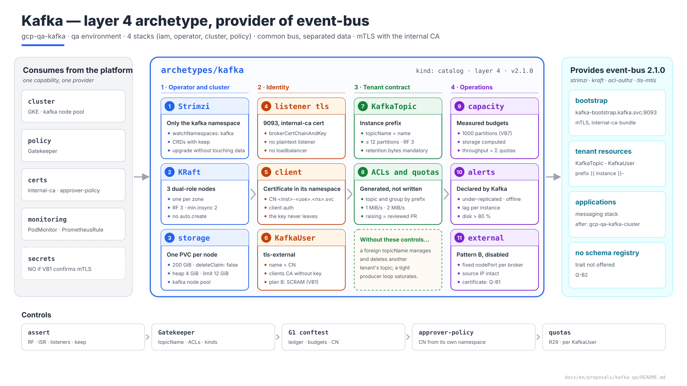
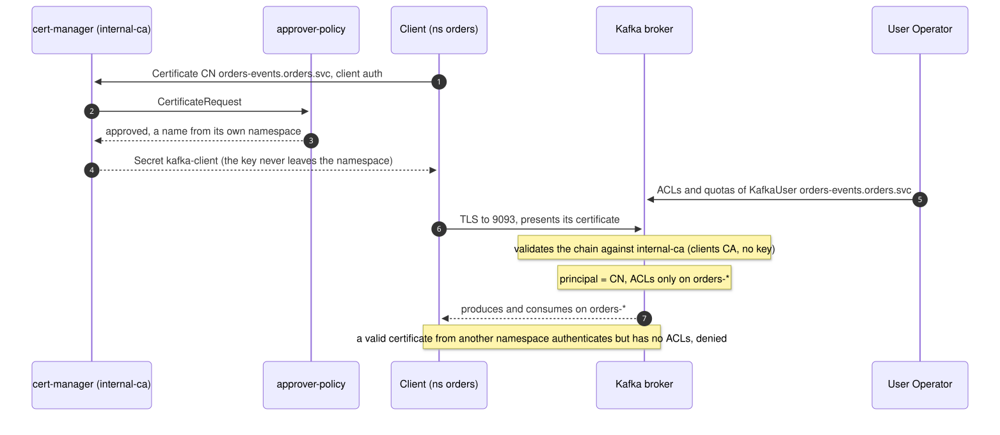

# Kafka on `qa` — `kafka` archetype (layer 4), provider of `event-bus`

| | |
|---|---|
| **Status** | Proposal · revision 1 |
| **Scope** | The layer 4 `kafka` archetype on `qa`: operator, KRaft topology, storage and zones, mTLS authentication with the internal CA, the multi-tenant contract (topics, users, ACLs and quotas), capacity, network, access from outside the cluster, observability, stacks, policies, execution and plan |
| **Why now** | AM §10 defines Kafka as the common bus with separated data, but only as an example in `demos`. `qa` does not bind it. With the internal CA (cert-manager DT10) and the L4 exposure pattern B (Envoy Gateway §4.4) now decided, how a client authenticates and how the bus leaves the cluster can be fixed |
| **Reference specification** | `archetype-model.md` (AM §n), `terramate-outputs-sharing-architecture.md` (§n), `risk-register.md` |
| **Diagrams** | `diagrams/*.mmd` (Mermaid source) and `diagrams/*.svg` (rendered). The SVG is regenerated from the `.mmd`; never hand-edited. `diagrams/06-bloques-presentacion.svg` (1920×1080, for presentations) is generated by `06-bloques-presentacion.py`, not Mermaid |
| **Local identifiers** | Decisions `DB1…`, candidate risks `RB1…`, verifications `VB1…`, questions `Q-B1…`. Risks get an `R54+` number in `risk-register.md` if adopted, after those of the earlier proposals |

Nothing in this document reopens a decision of `CLAUDE.md`: Kafka is an archetype, not a component; common bus and separated data; mandatory prefix, derived ACLs and `KafkaUser` quotas (AM §10.2, R29, R30).



Source: [`diagrams/06-bloques-presentacion.py`](diagrams/06-bloques-presentacion.py) — presentation view; the detail is in §2–§10.

---

## 0. Context

| Question | Answer | Consequence |
|---|---|---|
| What it is | Archetype `kafka`, `kind: catalog`, **layer 4**, provides **`event-bus` 2.1.0** | The `qa` binding gains `event-bus: { archetype: kafka, version: 2.1.0, stack_id: gcp-qa-kafka }` (§12) |
| Environment | `qa` (dedicated). The contract is the same as in `demos`; §11 records what changes there | Several applications also share `qa`: the multi-tenant contract applies just the same |
| Stacks | 4: `iam`, `operator`, `cluster`, `policy` in `stacks/archetypes/kafka/` | The operator and the cluster have different lifecycles (§8.2) |
| Components | Strimzi (Cluster Operator, Entity Operator with the Topic and User Operators), Kafka in KRaft mode, Kafka Exporter, Cruise Control | All Apache-2.0 |
| Clients | In-cluster applications by **mTLS with the internal CA**; from outside, only with a pattern B exception | §3, §6 |
| What it does **not** do | Schema registry, Kafka Connect, MirrorMaker, Kafka Bridge as a tenant service | §7.1 |



Source: [`diagrams/01-contexto.mmd`](diagrams/01-contexto.mmd)

---

## 1. The operator

| Option | Verdict |
|---|---|
| **Strimzi** | **Yes**. It is the operator AM §10 and the `strimzi` and `kraft` traits already pin. CNCF, Apache-2.0, and `KafkaTopic` and `KafkaUser` are exactly the contract's tenant resources |
| Managed Kafka (Confluent Cloud, Google's Managed Service for Apache Kafka) | Not in this archetype. It would be another `event-bus` provider with another contract: ACLs and quotas would not be CRDs in the cluster |

| Setting | Value | Reason |
|---|---|---|
| Operator scope | `watchNamespaces: [kafka]` | It sees only its own namespace. A `Kafka` created in another namespace does not exist for it |
| CRDs | `helm.sh/resource-policy: keep` | Deleting the `KafkaTopic` CRD deletes every `KafkaTopic`, and the Topic Operator deletes the topics in Kafka (RB2) |
| Version | The latest Strimzi supporting the chosen Kafka version and `qa`'s Kubernetes version **(verify, VB10)** | Strimzi publishes each release with a supported Kafka range |

---

## 2. The cluster



Source: [`diagrams/05-topologia.mmd`](diagrams/05-topologia.mmd)

### 2.1 Topology

| Setting | `qa` | Reason |
|---|---|---|
| Mode | **KRaft**, no ZooKeeper | `kraft` trait; ZooKeeper no longer exists in Kafka 4 |
| `KafkaNodePool` | One, `dual`, **3 nodes with the `controller` and `broker` roles** | Enough on `qa`: a quorum of 3 and 3 replicas. On `prod` and `demos`, separate controller and broker pools (§11) |
| Zones | One node per `europe-west1` zone; `rack.topologyKey: topology.kubernetes.io/zone` | Kafka places each partition's replicas in different zones: losing a zone loses no data |
| GKE node pool | **`kafka`**: 3 × `n2-standard-4` (4 vCPU, 16 GB), one per zone, taint `dedicated=kafka:NoSchedule` | Kafka lives off the OS page cache: sharing a node with other workloads empties it. A new requirement on S1 §4.1 (§12) |
| Resources per Kafka node | Request 2 CPU / 8 GiB; memory limit 12 GiB; heap `-Xms4g -Xmx4g` | Small, fixed heap; the rest of the memory is page cache. Never `-Xmx` equal to the limit (DG §8.3) |

### 2.2 Storage

| Setting | Value | Reason |
|---|---|---|
| Type | `jbod` with one `persistent-claim` volume per node, 200 GiB | A starting point; `kafka_storage_gib` fixes it (§5) |
| StorageClass | The one of S1 §4.1, `WaitForFirstConsumer`, `allowVolumeExpansion: true` | The disk is created in the pod's zone |
| `deleteClaim` | `false` | Deleting the `Kafka` does not delete the data |
| Tiered storage | No | `tiered-storage` trait not offered |

### 2.3 Broker defaults

| Parameter | Value | Reason |
|---|---|---|
| `default.replication.factor` | 3 | One replica per zone |
| `min.insync.replicas` | 2 | With `acks=all`, a lost zone does not stop writes |
| `auto.create.topics.enable` | `false` | Every topic is a prefixed `KafkaTopic`; otherwise a client creates `events` and bypasses the contract (R30) |
| `unclean.leader.election.enable` | `false` | Losing messages is never the default way out |
| `offsets.topic.replication.factor`, `transaction.state.log.replication.factor` | 3 | Same for the internal topics |
| `transaction.state.log.min.isr` | 2 | |

---

## 3. Authentication: mTLS with the internal CA



Source: [`diagrams/03-autenticacion.mmd`](diagrams/03-autenticacion.mmd)

The platform uses a single CA for all TLS and mTLS inside the cluster (cert-manager DT10). Kafka aligns with it.

| Segment | CA | Reason |
|---|---|---|
| Client → broker (`tls` listener) | **`internal-ca`**: listener certificate issued by cert-manager and mounted with `brokerCertChainAndKey` | Clients already trust `internal-ca-bundle`, which is in every namespace (S2 §5.1) |
| Client certificate | **`internal-ca`**: the consumer requests it in **its own** namespace; the key never leaves it | No passwords to distribute: nothing goes through Secret Manager or ESO |
| Broker ↔ broker and controller | **Strimzi**'s cluster CA | Traffic that never leaves the `kafka` namespace; Strimzi manages and renews it. Replacing it adds nothing and complicates every rotation |

### 3.1 Client identity

| Piece | Value | Why |
|---|---|---|
| Client `Certificate` | In the consumer's namespace, `issuerRef: internal-ca`, `usages: [client auth]`, `dnsNames: [<instance>-<purpose>.<namespace>.svc]`, `commonName` equal to that name | approver-policy (`namespace-services`) only issues names from the own namespace and requires `commonName` = first `dnsName` (cert-manager §3): the identity is truthful by construction |
| `KafkaUser` | Name = that `commonName`; `authentication.type: tls-external` | Strimzi does not issue the certificate; Kafka authenticates by the `CN` **(verify the principal format, VB2)** |
| Instance prefix | The name starts with `<instance>-` | Meets the AM §10.2 rule with no exceptions |
| Source namespace | The `.<namespace>.svc` suffix | Says which namespace the client comes from, and approver-policy prevents forging it |

Example on `qa` for an `orders` application: `orders-events.orders.svc`. In `demos`, instance `alpha`: `alpha-orders.demo-alpha.svc`.

**Trust is not authorisation** (cert-manager RT7). Any namespace can obtain a client certificate from `internal-ca`. Kafka authenticates it but grants it **nothing**: without a `KafkaUser` with its exact name, the principal has no ACLs and `authorization: simple` denies everything.

### 3.2 The condition: a clients CA without its private key

For `tls-external`, Strimzi must trust `internal-ca` as the clients CA (`clientsCa.generateCertificateAuthority: false`). The `internal-ca` private key **never leaves** the `cert-manager` namespace, so Strimzi is given only the certificate.

| VB1 result | Design |
|---|---|
| Strimzi accepts a clients CA without its key when every user is `tls-external` | **mTLS** as described here (DB3) |
| Strimzi requires the key | **SCRAM-SHA-512 over TLS**. The password belongs to the consumer: secret `qa-<instance>-kafka` in Secret Manager, with `secretAccessor` for the `eso-kafka` KSA granted by the consumer (the same pattern as Keycloak §6.5). ESO materialises it in `kafka` for the `KafkaUser` (`password.valueFrom`) and in the consumer's namespace for the application. The archetype then requires `secrets` with the `eso` trait |

The `internal-ca` key is never copied to another namespace to satisfy Strimzi: the CA would sign anything from there.

---

## 4. The multi-tenant contract



Source: [`diagrams/02-tenencia.mmd`](diagrams/02-tenencia.mmd)

The consumer creates its `KafkaTopic`s and `KafkaUser`s **in the `kafka` namespace**, from its `messaging` stack (`creates_tenant_resources: [event-bus]`, AM §10.1). What it may write is bounded.

### 4.1 Topics

| Field | Rule | Reason |
|---|---|---|
| `metadata.name` | `<instance>-<name>` | R30 |
| `spec.topicName` | **Absent** or equal to `metadata.name` | Otherwise a `KafkaTopic` named `alpha-x` with `topicName: beta-orders` would manage another tenant's topic, and could delete it (RB1) |
| `partitions` | ≤ 12 | Counts against `kafka_partitions` (§5) |
| `replicas` | Exactly 3 | One per zone |
| `config` | Allow-list: `retention.ms` ≤ 7 days, `retention.bytes` **mandatory** and ≤ 5 GiB per partition, `cleanup.policy` (`delete` or `compact`), `max.message.bytes` ≤ 1 MiB, `compression.type` | A topic without `retention.bytes` can fill a broker's disk and stop the bus for everyone (RB5) |
| Forbidden in `config` | `min.insync.replicas` other than 2, `unclean.leader.election.enable` | Durability is not negotiable per tenant |

### 4.2 Users, ACLs and quotas

| Field | Rule | Reason |
|---|---|---|
| `metadata.name` | `<instance>-<purpose>.<namespace>.svc`, equal to the certificate's `CN` | §3.1 |
| `authentication` | `tls-external` (or `scram-sha-512` if VB1 fails) | §3.2 |
| `authorization.acls` | **Generated** by the `gen_messaging` generator, never written by the tenant | AM §10.2 |
| `quotas` | Mandatory | R29 |

Generated ACLs for instance `alpha`:

```yaml
authorization:
  type: simple
  acls:
    - resource: { type: topic, name: "alpha-", patternType: prefix }
      operations: [Read, Write, Describe]
    - resource: { type: group, name: "alpha-", patternType: prefix }
      operations: [Read]
    - resource: { type: transactionalId, name: "alpha-", patternType: prefix }   # only if it declares transactions
      operations: [Write, Describe]
```

| Quota per `KafkaUser` | Default | Reason |
|---|---|---|
| `producerByteRate` | 1 MiB/s | A tight production loop does not saturate the bus (R29) |
| `consumerByteRate` | 2 MiB/s | |
| `requestPercentage` | 25 | Broker CPU time |
| `controllerMutationRate` | 1 | Creating or deleting partitions in bursts loads the controller |

Raising a quota is a PR with platform review: it adds to `kafka_throughput_mibs` (§5), like raising `capacity` in a shared environment.

### 4.3 What a tenant may not create

| Kind | Reason |
|---|---|
| `Kafka`, `KafkaNodePool` | The cluster belongs to the archetype |
| `KafkaConnect`, `KafkaConnector`, `KafkaMirrorMaker2` | They run third-party code and credentials inside the `kafka` namespace. An application that needs Connect deploys its own `KafkaConnect` as a component in its namespace, against the bus and with its own `KafkaUser` |
| `KafkaBridge` | The HTTP option (Envoy Gateway §4.4) is deployed by the consumer in its own namespace, with its own user |
| `KafkaRebalance` | Cruise Control belongs to the platform |

All are denied by Gatekeeper outside what the archetype itself deploys (§9.2). AM §13 already shows the resolution error for `KafkaConnector`.

---

## 5. Capacity

| Key | `qa` | How it is counted |
|---|---|---|
| `kafka_topics` | 200 | Number of `KafkaTopic`s |
| `kafka_partitions` | **1000** | Leader partitions. With replication 3 that is 3000 replicas on 3 brokers: 1000 per broker |
| `kafka_storage_gib` | 450 (3 × 200 GiB × 75 %) | Σ `partitions × replicas × retention.bytes`: the resolver computes it; above it, the PR fails |
| `kafka_throughput_mibs` | 60 | Σ `producerByteRate` across all `KafkaUser`s |

**The partition ceiling (open question no. 3 of `CLAUDE.md`).** `qa`'s 1000 is a prudent starting point, not a measurement. VB7 measures it: 3 brokers, with growing partition counts, measuring controller failover time, p99 produce latency and broker start-up time. The resulting number sets `qa`'s budget and replaces `demos`'s provisional 4000.

On `qa` the budgets are not enforced (dedicated model, S1 §0), but they are computed and published: they are the measurement `demos` is missing.

---

## 6. Network and access from outside



Source: [`diagrams/04-red.mmd`](diagrams/04-red.mmd)

### 6.1 Listeners

| Listener | Port | Type | Authentication | Who |
|---|---|---|---|---|
| `tls` | 9093 | `internal` | mTLS (`tls-external`) | In-cluster applications |
| `external` | 9094 and one per broker | `nodeport` | mTLS | **Disabled.** Enabled by a pattern B exception (Envoy Gateway §4.4) |
| Replication and controller | 9090, 9091 | Strimzi internal | mTLS with Strimzi's CA | Only between `kafka` pods |

No plaintext listener (9092). No `loadbalancer` listener: that would be pattern A, which is forbidden.

### 6.2 `NetworkPolicy`

| Source | Destination | Port | Note |
|---|---|---|---|
| Namespaces labelled `kafka.disasterproject.com/client: "true"` | Brokers | 9093 | The listener's `networkPolicyPeers`; Strimzi generates the policy. `gen_tenant_namespace` sets the label if the manifest requires `event-bus` (§12) |
| Operator and Entity Operator | Brokers and controllers | 9091, 9093 | Generated by Strimzi |
| Brokers ↔ brokers ↔ controllers | | 9090, 9091 | Generated by Strimzi |
| Prometheus | Brokers, Kafka Exporter, Cruise Control | 9404 and metrics | |
| Cruise Control | Brokers | 9091 | |
| All | Internet | **Denied** | |

### 6.3 Clients outside the cluster: pattern B

If an external producer or consumer justifies it (Envoy Gateway §4.4, Kafka row), the `external` listener is enabled like this:

| Piece | Value | Reason |
|---|---|---|
| Listener type | `nodeport`, with a **fixed** `nodePort` for the bootstrap and for each broker (`overrides`) | Deterministic firewall and load balancer rules |
| `externalTrafficPolicy` | `Local` | No extra hop between nodes and the source IP intact. The load balancer's TCP health check on the `nodePort` only marks healthy the node that has the broker |
| Load balancer | One passthrough in `gcp-qa-edge`: one IP, one port for the bootstrap and one per broker | Every client talks to every broker at its advertised address |
| `advertisedHost` and `advertisedPort` | The load balancer's IP (or name) and each broker's port | If the node's IP is advertised, the external client cannot reach it |
| Authentication | mTLS | The same as inside |

**The external listener's certificate is open question Q-B1.** With pattern B, TLS terminates at the broker, so the broker presents the certificate. An external client expects a public name. The internal CA does not sign public names (cert-manager DT10), and the Certificate Manager certificate cannot be exported to a pod. There are two ways out, and it is not a Kafka decision but one for every pattern B exception with TLS:

| Option | How | Cost |
|---|---|---|
| **A. Public ACME `ClusterIssuer`** (Let's Encrypt with DNS-01 against the `qa.disasterproject.com` zone) | Only for the names of an approved `exposures` entry; approver-policy limits it to those names | cert-manager needs egress to the public CA and write permission on Cloud DNS; revisits cert-manager §1's "no ACME" |
| B. A private CA for counterparties (Certificate Authority Service) | The counterparty installs our CA | Another CA to operate and distribute out of band |

Recommendation: **A**, because the counterparty does not have to trust anything of ours. Until Q-B1 is decided, the `external` listener is not enabled.

---

## 7. The `event-bus` 2.1.0 contract

### 7.1 Outputs and traits

| Output | Value on `qa` | Use |
|---|---|---|
| `bootstrap_servers` | `qa-kafka-kafka-bootstrap.kafka.svc:9093` | Client configuration |
| `namespace` | `kafka` | Tenant resources |
| `cluster_name` | `qa-kafka` | `strimzi.io/cluster` label on `KafkaTopic` and `KafkaUser` |
| `client_auth` | `tls-external` | Shape of the `KafkaUser` and of the client `Certificate` (§3.1) |
| `ca_bundle_configmap` | `internal-ca-bundle` | The client's truststore: already in its namespace |
| `client_namespace_label` | `kafka.disasterproject.com/client: "true"` | For the listener's `NetworkPolicy` |
| `cluster_ca_secret` | Deprecated; removed in 3.0.0 | Clients no longer trust Strimzi's CA |

The last four are new or change use without breaking anyone consuming `^2.0.0`: MINOR, **2.1.0**.

| Trait | Offered? | Reason |
|---|---|---|
| `strimzi`, `kraft`, `acl-authz` | Yes | — |
| `tls-mtls` | Yes | §3 |
| `schema-registry` | **No** | There is no registry in this version. AM §10.1 lists it in its example; a consumer that requires it fails at resolution, which is correct (Q-B2) |
| `tiered-storage` | No | §2.2 |

### 7.2 What a consumer writes

In its `messaging` stack (the generator fills in ACLs, quotas and labels):

```yaml
apiVersion: kafka.strimzi.io/v1beta2
kind: KafkaTopic
metadata:
  name: orders-events                       # <instance>-<name>
  namespace: kafka
  labels: { strimzi.io/cluster: qa-kafka }
spec:
  partitions: 6
  replicas: 3
  config: { retention.ms: 604800000, retention.bytes: 1073741824, cleanup.policy: delete }
---
apiVersion: kafka.strimzi.io/v1beta2
kind: KafkaUser
metadata:
  name: orders-events.orders.svc            # = the certificate's CN
  namespace: kafka
  labels: { strimzi.io/cluster: qa-kafka }
spec:
  authentication: { type: tls-external }
  # authorization and quotas: generated by gen_messaging (§4.2)
```

And in its own namespace:

```yaml
apiVersion: cert-manager.io/v1
kind: Certificate
metadata: { name: kafka-client, namespace: orders }
spec:
  secretName: kafka-client
  issuerRef: { kind: ClusterIssuer, name: internal-ca }
  commonName: orders-events.orders.svc
  dnsNames: [orders-events.orders.svc]
  usages: [client auth]
  duration: 2160h
  renewBefore: 720h
  privateKey: { algorithm: ECDSA, size: 256, rotationPolicy: Always }
```

The client uses `ssl.keystore.type=PEM` with the `kafka-client` `Secret` and `ssl.truststore.type=PEM` with `internal-ca-bundle`. A client that reads its keystore only at start-up needs a restart on renewal: there is a month of margin (cert-manager §5.1).

---

## 8. The archetype

### 8.1 Manifest

```yaml
# archetypes/kafka/manifest.yaml
apiVersion: archetype/v1
kind: Archetype

metadata:
  name: kafka
  version: 2.1.0
  layer: 4
  kind: catalog
  description: Common Kafka bus with separated data; Strimzi, KRaft, mTLS with the internal CA
  owners: [team-platform]

runtimes: [gke, eks, aks]

requires:
  - capability: cluster
    version: "^2.0.0"
  - capability: policy
    version: "^1.0.0"
    traits: [gatekeeper]
  - capability: certs
    version: "^1.1.0"
    traits: [cert-manager]
  - capability: monitoring
    version: "^1.5.0"
    traits: [prometheus-operator-crds]

provides:
  - capability: event-bus
    version: 2.1.0
    traits: [strimzi, kraft, acl-authz, tls-mtls]
    outputs:
      - { name: bootstrap_servers,      from: cluster }
      - { name: namespace,              from: iam }
      - { name: cluster_name,           from: cluster }
      - { name: client_auth,            from: cluster }
      - { name: ca_bundle_configmap,    from: cluster }
      - { name: client_namespace_label, from: cluster }
      - { name: cluster_ca_secret,      from: cluster }    # deprecated; removed in 3.0.0
    tenant_resources:
      - kind: KafkaTopic
        namePrefix: "{{ instance }}-"
        maxCount: 20
      - kind: KafkaUser
        namePrefix: "{{ instance }}-"
        maxCount: 3

stacks:
  - name: iam
  - name: operator
    after: [iam]
  - name: cluster
    after: [operator]
  - name: policy
    after: [cluster]

capacity:
  cpu_millicores: 7200
  memory_mib: 27648
  pods: 8
  workload_identities: 0
```

`runtimes: [gke, eks, aks]`: nothing is GCP-specific except the StorageClass (AM §14.2: `event-bus` is Strimzi on all three clouds). **No `ingress`**: Kafka does not speak HTTP. **No `secrets`** as long as VB1 confirms mTLS; with SCRAM, `secrets` with the `eso` trait (§3.2).

**No subnet claim.** AM §10.1's example claims a `/26` in the `data` zone with purpose `kafka-storage-subnet`. Kafka on Kubernetes keeps its data on persistent volumes, not in a subnet, and its pods use the cluster's pod range. Removing it from AM is proposed (§12).

### 8.2 The stacks

| Stack | Contents | Inputs via sharing |
|---|---|---|
| `iam` | Namespace `kafka` (`gen_tenant_namespace`, PSS `restricted`) | `cluster_*` |
| `operator` | `helm_release` of Strimzi with `watchNamespaces: [kafka]` and CRDs with `keep` | `cluster_*` |
| `cluster` | `Kafka`, `KafkaNodePool`, the listener `Certificate` (`internal-ca`), Kafka Exporter, Cruise Control, `PodMonitor` and `PrometheusRule`; `prevent_destroy` on the `helm_release` | `cluster_*` |
| `policy` | `ConstraintTemplate`s and `Constraint`s for the Strimzi kinds (§9.2); the quota and topic defaults `gen_messaging` uses | `cluster_*` |

**Why `operator` and `cluster` are separate.** A Strimzi upgrade must not plan changes to the Kafka cluster, which holds data. Destroying the cluster takes an explicit PR that removes `prevent_destroy` (the same reasoning as cert-manager §8.2 and Envoy Gateway §8.2).

### 8.3 The consumer side

| Piece | Where |
|---|---|
| `requires: event-bus ^2.1.0` with `traits: [acl-authz, tls-mtls]` | The consumer's manifest |
| `messaging` stack with `creates_tenant_resources: [event-bus]` and `after` to `gcp-qa-kafka-cluster` | Generated by `gen_messaging` |
| Client `Certificate` | `messaging` stack, in the consumer's namespace |
| `kafka.disasterproject.com/client` label | `gen_tenant_namespace` (§12) |

---

## 9. Policies

### 9.1 `assert` at generation

```hcl
assert {
  assertion = global.kafka_values.config["min.insync.replicas"] == 2 && global.kafka_values.config["default.replication.factor"] == 3
  message   = "event-bus: replication 3 and min ISR 2 — a lost zone does not stop writes"
}
assert {
  assertion = !global.kafka_values.config["auto.create.topics.enable"]
  message   = "event-bus: no automatic topic creation — every topic is a prefixed KafkaTopic (R30)"
}
assert {
  assertion = alltrue([for l in global.kafka_values.listeners : l.tls && l.type != "loadbalancer"])
  message   = "event-bus: no plaintext listener and none of type loadbalancer (pattern A forbidden)"
}
assert {
  assertion = global.kafka_values.crds.keep && global.kafka_values.watchNamespaces == ["kafka"]
  message   = "event-bus: CRDs with keep and the operator limited to its namespace (RB2)"
}
```

### 9.2 Gatekeeper and conftest

| Rule | Where | What it checks |
|---|---|---|
| **New:** `KafkaTopic` shape | Gatekeeper | §4.1: prefix = instance label; `spec.topicName` absent or equal to the name; partition, replica and `config` limits |
| **New:** `KafkaUser` shape | Gatekeeper | §4.2: name `<instance>-*.<namespace>.svc`; `tls-external`; ACLs equal to those derived from the prefix; quotas present |
| **New:** reserved kinds | Gatekeeper | §4.3 |
| **New:** tenant resources | G1 | The `messaging` stack declares `creates_tenant_resources: [event-bus]`; its instance's prefix; `maxCount` |
| **New:** capacity | G1 | Partitions, storage and quotas summed against the budgets (§5) |
| **New:** certificate and user | G1 | The client `Certificate`'s `commonName` equals the name of a `KafkaUser` of the same instance |
| **New:** `after` | G1 (existing, R2) | `messaging` has `after` to `gcp-qa-kafka-cluster` |

All `qa` stacks are applied with the same pipeline identity, so the underlying control over which instance writes what is G1 against the ledger; Gatekeeper checks shape (the same split as Keycloak §6.4).

---

## 10. Observability

Kafka is layer 4 and requires `monitoring`: it declares its own rules, unlike the layer 3 capabilities.

| Alert | Signal | Threshold |
|---|---|---|
| Under-replicated partitions | `kafka_server_replicamanager_underreplicatedpartitions` | > 0 for 5 min |
| Offline partitions | `kafka_controller_kafkacontroller_offlinepartitionscount` | > 0 |
| Active controller | Sum of `activecontrollercount` | ≠ 1 for 1 min |
| Disk | The PVC's `kubelet_volume_stats_used_bytes` | > 80 % |
| Consumer lag | Kafka Exporter's `kafka_consumergroup_lag`, **per instance** | A threshold declared by the consumer; the alert goes to the instance's team (monitoring §5.2) |
| Quotas | Throttle time per user | Sustained > 0: the tenant is at its limit |
| Certificates | cert-manager §6 | Listener and clients < 14 days |
| Budget | Partitions used / `kafka_partitions` | > 80 % |

Metric names depend on Strimzi's JMX exporter configuration **(verify, VB10)**.

---

## 11. `demos` and `prod`

| Topic | `qa` | `demos` | `prod` |
|---|---|---|---|
| Nodes | 3 dual-role | 3 controllers + 3 brokers | 3 controllers + ≥ 3 brokers |
| Budgets | Computed, not enforced | **Enforced** in the PR (AM §8) | Enforced |
| Quotas | The defaults of §4.2 | Lower: many small tenants | Per application |
| GKE | Standard with a `kafka` node pool | Autopilot: no dedicated node pool; a compute class with enough disk and memory **(verify Strimzi on Autopilot, VB11)** | Standard |
| Partition ceiling | Measured by VB7 | VB7's number replaces the provisional 4000 | Same |

---

## 12. Changes to other documents

| Document | Change | Status |
|---|---|---|
| `qa` binding (S1 §7) | `event-bus: { archetype: kafka, version: 2.1.0, stack_id: gcp-qa-kafka }`; the budgets of §5 | Proposed |
| S1 §4.1 | `kafka` node pool: 3 × `n2-standard-4`, one per zone, taint `dedicated=kafka:NoSchedule` | Proposed |
| `gen_tenant_namespace` (S2 §5.1) | Label `kafka.disasterproject.com/client: "true"` if the manifest requires `event-bus` | Proposed |
| AM §10.1 | Remove the `kafka-storage-subnet` claim; `KafkaUser` named as the client certificate's `CN`; `schema-registry` out of the example traits; contract 2.1.0 with the outputs of §7.1 | Proposed |
| cert-manager §1 | If option A of Q-B1 is chosen, an ACME `ClusterIssuer` bounded to approved `exposures` | Pending Q-B1 |
| Envoy Gateway §4.4 | Kafka row: already points to §6.3 | No change |

---

## 13. Decisions

| # | Decision | Status | Recommendation | Alternative |
|---|---|---|---|---|
| DB1 | Operator | Consequence of AM §10 | Strimzi, limited to the `kafka` namespace | Managed Kafka (another provider) |
| DB2 | Topology on `qa` | Proposal | KRaft, 3 dual-role nodes, one per zone, `kafka` node pool | Separate controllers and brokers (on `demos` and `prod`) |
| DB3 | Authentication | Proposal, pending VB1 | mTLS `tls-external` with `internal-ca`; certificate requested by the consumer in its namespace | SCRAM-SHA-512 with the consumer's password via Secret Manager and ESO |
| DB4 | CAs | Proposal | `internal-ca` for everything clients see; Strimzi's CA only between brokers and controllers | Strimzi's CA distributed to clients |
| DB5 | User name | Proposal | `<instance>-<purpose>.<namespace>.svc` = `CN` | Free name with prefix |
| DB6 | ACLs and quotas | Consequence of AM §10.2 | Generated; Gatekeeper requires them to match | Written by the tenant |
| DB7 | Topic limits | Proposal | ≤ 12 partitions, replication 3, mandatory `retention.bytes`, ≤ 7 days | No per-topic limits |
| DB8 | External access | Proposal | Pattern B with a fixed `nodePort` per broker, disabled until Q-B1 | Strimzi `loadbalancer` (pattern A) |
| DB9 | Initial partition budget on `qa` | Proposal | 1000, until VB7 measures | 4000 as in `demos` |
| DB10 | Extra services | Proposal | Kafka Exporter and Cruise Control for the platform; no shared registry, Connect or Bridge | Offering them as a service |

---

## 14. Candidate risks

| # | Risk | Likelihood | Impact | Mitigation |
|---|---|---|---|---|
| RB1 | **`spec.topicName` points to another tenant's topic** and manages or deletes it | Medium without a rule | High — another tenant's data lost | Gatekeeper (§9.2); VB4 |
| RB2 | **Deleting the Strimzi CRDs** deletes every topic | Low | High — the whole bus | CRDs with `keep`, assert, VB9 |
| RB3 | **Clients CA**: Strimzi requires the `internal-ca` key | Medium | Medium — the design moves to SCRAM | VB1 before phase 1; plan B of §3.2 |
| RB4 | **Noisy tenant** | Medium | High on `demos` | Mandatory quotas (R29) |
| RB5 | **Disk full** from a topic without a limit | Medium without `retention.bytes` | High — the broker stops, and everyone with it | Mandatory `retention.bytes`, storage budget, alert at 80 % |
| RB6 | **Listener certificate renewal** restarts the brokers | Medium | Low with RF 3 and ISR 2 | Strimzi's rolling restart; VB3 |
| RB7 | **Lost zone** | Low | Medium | Replication 3 across zones, ISR 2; VB6 |
| RB8 | **Partition ceiling** reached earlier than expected | Medium | Medium — no new topics | A budget of 1000 until measured (VB7) |

---

## 15. Verifications

| # | Verification | Result that closes it |
|---|---|---|
| VB1 | Strimzi with `clientsCa.generateCertificateAuthority: false` and only the `internal-ca` certificate (no key), every user `tls-external` | The cluster reconciles and a client with an `internal-ca` certificate authenticates. If not, SCRAM (§3.2) |
| VB2 | Principal of a `tls-external` user | The ACLs of §4.2 apply to the principal Kafka derives from the `CN` |
| VB3 | Listener with `brokerCertChainAndKey` from the cert-manager `Secret` | Forced renewal: a rolling restart of brokers with no client errors under `acks=all` |
| VB4 | `KafkaTopic` with a foreign `topicName`; `KafkaUser` with non-derived ACLs | Both denied at admission |
| VB5 | Quotas | A producer at 10 times its quota is throttled; the others' p99 latency does not change |
| VB6 | Lost zone (cordon and drain a zone) | Zero offline partitions; producers with `acks=all` carry on |
| VB7 | Partition ceiling with 3 brokers | A published number with controller failover time, p99 latency and broker start-up; sets the budget |
| VB8 | `external` listener with pattern B and `externalTrafficPolicy: Local` | Source IP intact; the client reaches each broker at its advertised address |
| VB9 | Uninstall the operator in an ephemeral environment | Topics, users and data still exist |
| VB10 | Strimzi and Kafka versions; metric names | The alerts of §10 with real series |
| VB11 | Strimzi on GKE Autopilot (`demos`) | Brokers with their zonal PVC and spread across zones |
| VB12 | PSS `restricted` with the Strimzi pods | Admitted without an exemption |

---

## 16. Open questions

| # | Question | Recommendation |
|---|---|---|
| Q-B1 | Certificate for a listener exposed by pattern B with a public name | An ACME `ClusterIssuer` with DNS-01, bounded to approved `exposures` (§6.3) |
| Q-B2 | Is a schema registry needed? | Not until an application asks for one; then Apicurio Registry as a separate archetype, with its own contract |

---

## 17. Implementation plan

| Phase | Contents | Exit criterion | Estimate |
|---|---|---|---|
| **0 · Prerequisites** | `kafka` node pool; `qa` binding; **VB1**, VB10, VB12 | Authentication decided (mTLS or SCRAM) | 1 day |
| **1 · Skeleton** | Manifest, charts, asserts, G1 rules and constraints, `gen_messaging` | `archetypectl resolve --dry-run`, `terramate generate --check`, G1 and preview with mocks green | 2 days |
| **2 · Operator and cluster** | `iam`, `operator`, `cluster`, `policy` | Cluster `Ready`; **VB2**, **VB3**, **VB4**, **VB9** | 2 days |
| **3 · Load tests** | A test application with two instances | **VB5**, **VB6**, **VB7** | 2 days |
| **4 · External access** | Only once there is an approved exception and Q-B1 is decided | **VB8** | With the exception |

Seven days for one person. VB1 comes first: it decides whether the archetype needs `secrets`.
