# Kafka on `qa` — `kafka` archetype (layer 4), provider of `event-bus`

| | |
|---|---|
| **Status** | Proposal · revision 3 |
| **Scope** | The layer 4 `kafka` archetype on `qa`: operator, KRaft topology, storage and zones, SCRAM authentication over TLS with the internal CA, the multi-tenant contract (topics, users, ACLs and quotas), capacity, network, access from outside the cluster, observability, stacks, policies, execution and plan |
| **Why now** | AM §10 defines Kafka as the common bus with separated data, but only as an example in `demos`. `qa` does not bind it. With the internal CA (cert-manager DT10) and the L4 exposure pattern B (Envoy Gateway §4.4) now decided, how a client authenticates and how far the bus reaches can be fixed: never outside the VPC |
| **Reference specification** | `archetype-model.md` (AM §n), `terramate-outputs-sharing-architecture.md` (§n), `risk-register.md` |
| **Diagrams** | `diagrams/*.mmd` (Mermaid source) and `diagrams/*.svg` (rendered). The SVG is regenerated from the `.mmd`; never hand-edited. `diagrams/06-bloques-presentacion.svg` (1920×1080, for presentations) is generated by `06-bloques-presentacion.py`, not Mermaid |
| **Local identifiers** | Decisions `DB1…`, candidate risks `RB1…`, verifications `VB1…`, questions `Q-B1…`. Risks get an `R54+` number in `risk-register.md` if adopted, after those of the earlier proposals |

Nothing in this document reopens a decision of `CLAUDE.md`: Kafka is an archetype, not a component; common bus and separated data; mandatory prefix, derived ACLs and `KafkaUser` quotas (AM §10.2, R29, R30).


Source: [`diagrams/06-bloques-presentacion.py`](diagrams/06-bloques-presentacion.py) — presentation view; the detail is in §2–§10.

---

## 0. Context

| Question | Answer | Consequence |
|---|---|---|
| What it is | Archetype `kafka`, `kind: catalog`, **layer 4**, provides **`event-bus` 2.1.0** | The `qa` binding gains `event-bus: { archetype: kafka, version: 2.1.0, stack_id: gcp-qa-kafka }` (§12) |
| Environment | `qa` (dedicated). The contract is the same as in `demos`; §11 records what changes there | Several applications also share `qa`: the multi-tenant contract applies just the same |
| Stacks | 5: `iam`, `operator`, `cluster`, `policy` and `vpc-access` (empty with no VPC clients) in `stacks/archetypes/kafka/` | The operator and the cluster have different lifecycles (§8.2) |
| Components | Strimzi (Cluster Operator, Entity Operator with the Topic and User Operators), Kafka in KRaft mode, Kafka Exporter, Cruise Control | All Apache-2.0 |
| Clients | All by **SCRAM-SHA-512 over TLS**, with TLS from the internal CA: in-cluster applications and clients in `qa`'s VPC outside the cluster (through an **internal** load balancer). **Never outside the VPC** | §3, §6 |
| What it does **not** do | Schema registry, Kafka Connect, MirrorMaker, Kafka Bridge as a tenant service | §7.1 |


Source: [`diagrams/01-contexto.mmd`](diagrams/01-contexto.mmd)

---

## 1. The operator

| Option | Verdict |
|---|---|
| **Strimzi** | **Yes**. It is the operator AM §10 and the `strimzi` and `kraft` traits already pin. CNCF, Apache-2.0, and `KafkaTopic` and `KafkaUser` are exactly the contract's tenant resources |
| Managed Kafka (Confluent Cloud, Google's Managed Service for Apache Kafka) | Not in this archetype. It would be another `event-bus` provider with another contract: ACLs and quotas would not be CRDs in the cluster |

| Setting | Value | Reason |
|---|---|---|
| Operator scope | `watchNamespaces: [kafka]` | It sees only its own namespace. A `Kafka` created in another namespace does not exist for it |
| CRDs | `helm.sh/resource-policy: keep` | Deleting the `KafkaTopic` CRD deletes every `KafkaTopic`, and the Topic Operator deletes the topics in Kafka (RB2) |
| Version | The latest Strimzi supporting the chosen Kafka version and `qa`'s Kubernetes version **(verify, VB10)** | Strimzi publishes each release with a supported Kafka range |

---

## 2. The cluster


Source: [`diagrams/05-topologia.mmd`](diagrams/05-topologia.mmd)

### 2.1 Topology

| Setting | `qa` | Reason |
|---|---|---|
| Mode | **KRaft**, no ZooKeeper | `kraft` trait; ZooKeeper no longer exists in Kafka 4 |
| `KafkaNodePool` | One, `dual`, **3 nodes with the `controller` and `broker` roles** | Enough on `qa`: a quorum of 3 and 3 replicas. On `prod` and `demos`, separate controller and broker pools (§11) |
| Zones | One node per `europe-west1` zone; `rack.topologyKey: topology.kubernetes.io/zone` | Kafka places each partition's replicas in different zones: losing a zone loses no data |
| GKE node pool | **`kafka`**: 3 × `n2-standard-4` (4 vCPU, 16 GB), one per zone, taint `dedicated=kafka:NoSchedule` | Kafka lives off the OS page cache: sharing a node with other workloads empties it. A new requirement on S1 §4.1 (§12) |
| Resources per Kafka node | Request 2 CPU / 8 GiB; memory limit 12 GiB; heap `-Xms4g -Xmx4g` | Small, fixed heap; the rest of the memory is page cache. Never `-Xmx` equal to the limit (DG §8.3) |

### 2.2 Storage

| Setting | Value | Reason |
|---|---|---|
| Type | `jbod` with one `persistent-claim` volume per node, 200 GiB | A starting point; `kafka_storage_gib` fixes it (§5) |
| StorageClass | The one of S1 §4.1, `WaitForFirstConsumer`, `allowVolumeExpansion: true` | The disk is created in the pod's zone |
| `deleteClaim` | `false` | Deleting the `Kafka` does not delete the data |
| Tiered storage | No | `tiered-storage` trait not offered |

### 2.3 Broker defaults

| Parameter | Value | Reason |
|---|---|---|
| `default.replication.factor` | 3 | One replica per zone |
| `min.insync.replicas` | 2 | With `acks=all`, a lost zone does not stop writes |
| `auto.create.topics.enable` | `false` | Every topic is a prefixed `KafkaTopic`; otherwise a client creates `events` and bypasses the contract (R30) |
| `unclean.leader.election.enable` | `false` | Losing messages is never the default way out |
| `offsets.topic.replication.factor`, `transaction.state.log.replication.factor` | 3 | Same for the internal topics |
| `transaction.state.log.min.isr` | 2 | |

---

## 3. Authentication: SCRAM over TLS


Source: [`diagrams/03-autenticacion.mmd`](diagrams/03-autenticacion.mmd)

**Every client uses SCRAM-SHA-512 (DB3)**, in the cluster and in the VPC. The listener's TLS still comes from the internal CA, so the client validates the broker with `internal-ca-bundle`, which is already in every namespace (S2 §5.1).

| Segment | Mechanism | Reason |
|---|---|---|
| Client → broker | TLS with an `internal-ca` certificate on the `tls` and `vpc` listeners (`brokerCertChainAndKey`), and SCRAM-SHA-512 inside | Encryption and server authentication with the platform's single CA (cert-manager DT10); client authentication by password |
| Broker ↔ broker and controller | **Strimzi**'s cluster CA | Traffic that never leaves the `kafka` namespace; Strimzi manages and renews it |

**Why SCRAM and not mTLS.** mTLS with `tls-external` required Strimzi to accept `internal-ca` as the clients CA without its private key, which was unverified. Besides, VPC clients outside the cluster needed SCRAM anyway. With a single mechanism, one user works on any listener, there are not two ways of naming users, and Strimzi keeps its own clients CA, left unused. The `internal-ca` key never leaves cert-manager.

### 3.1 The password belongs to the consumer

The same pattern as Keycloak's OIDC clients (§6.5 of its proposal): the consumer creates and owns it, and the value never passes through the pipeline or outputs sharing (R8).

| Step | Who |
|---|---|
| Secret `qa-<instance>-kafka-<purpose>` in Secret Manager, value generated and **write-only** (`secret_data_wo`) | The consumer's `secrets` stack |
| `secretAccessor` on **that** secret for the `eso-kafka` KSA of the `kafka` namespace and for the client's identity (its KSA, or its service account if it is outside the cluster) | The consumer's `secrets` stack |
| `ExternalSecret` `<instance>-<purpose>` in the `kafka` namespace (the archetype's `gsm` `SecretStore`), which materialises the `Secret` of the same name | The consumer's `messaging` stack, as a tenant resource |
| `KafkaUser` `<instance>-<purpose>` with `authentication.password.valueFrom.secretKeyRef` to that `Secret` | The consumer's `messaging` stack |
| The application reads the password: with its own `ExternalSecret` if it is in the cluster; under its GCP identity if it is in the VPC | Consumer |

**One password, one user.** Strimzi applies the `Secret`'s password as the user's SCRAM credential. Neither the `kafka` archetype nor the platform knows the value.

### 3.2 Rotation without an outage

Kafka keeps one SCRAM credential per user and mechanism. If the password changes, a client still using the old one fails until it reloads (RB3). So rotation uses two users:

1. Create `<instance>-<purpose>-b` with a new password, the same ACLs and the same quota. During the rotation it counts against `maxCount`.
2. The application switches to `-b`.
3. When no connection uses the old user (connections-per-principal metric), delete it.

The next rotation goes back to the unsuffixed name. Each step is a PR by the consumer.

---

## 4. The multi-tenant contract


Source: [`diagrams/02-tenencia.mmd`](diagrams/02-tenencia.mmd)

The consumer creates its `KafkaTopic`s, `KafkaUser`s and the `ExternalSecret` for each password **in the `kafka` namespace**, from its `messaging` stack (`creates_tenant_resources: [event-bus]`, AM §10.1). What it may write is bounded.

### 4.1 Topics

| Field | Rule | Reason |
|---|---|---|
| `metadata.name` | `<instance>-<name>` | R30 |
| `spec.topicName` | **Absent** or equal to `metadata.name` | Otherwise a `KafkaTopic` named `alpha-x` with `topicName: beta-orders` would manage another tenant's topic, and could delete it (RB1) |
| `partitions` | ≤ 12 | Counts against `kafka_partitions` (§5) |
| `replicas` | Exactly 3 | One per zone |
| `config` | Allow-list: `retention.ms` ≤ 7 days, `retention.bytes` **mandatory** and ≤ 5 GiB per partition, `cleanup.policy` (`delete` or `compact`), `max.message.bytes` ≤ 1 MiB, `compression.type` | A topic without `retention.bytes` can fill a broker's disk and stop the bus for everyone (RB5) |
| Forbidden in `config` | `min.insync.replicas` other than 2, `unclean.leader.election.enable` | Durability is not negotiable per tenant |

### 4.2 Users, ACLs and quotas

| Field | Rule | Reason |
|---|---|---|
| `metadata.name` | `<instance>-<purpose>`; `<instance>-<purpose>-b` during a rotation | §3.2 |
| `authentication` | `scram-sha-512` with `password.valueFrom` to the `Secret` materialised by the instance's `ExternalSecret`; never `tls` or `tls-external` | §3 |
| `authorization.acls` | **Generated** by the `gen_messaging` generator, never written by the tenant | AM §10.2 |
| `quotas` | Mandatory | R29 |

Generated ACLs for instance `alpha`:

```yaml
authorization:
  type: simple
  acls:
    - resource: { type: topic, name: "alpha-", patternType: prefix }
      operations: [Read, Write, Describe]
    - resource: { type: group, name: "alpha-", patternType: prefix }
      operations: [Read]
    - resource: { type: transactionalId, name: "alpha-", patternType: prefix }   # only if it declares transactions
      operations: [Write, Describe]
```

| Quota per `KafkaUser` | Default | Reason |
|---|---|---|
| `producerByteRate` | 1 MiB/s | A tight production loop does not saturate the bus (R29) |
| `consumerByteRate` | 2 MiB/s | |
| `requestPercentage` | 25 | Broker CPU time |
| `controllerMutationRate` | 1 | Creating or deleting partitions in bursts loads the controller |

Raising a quota is a PR with platform review: it adds to `kafka_throughput_mibs` (§5), like raising `capacity` in a shared environment.

### 4.3 What a tenant may not create

| Kind | Reason |
|---|---|
| `Kafka`, `KafkaNodePool` | The cluster belongs to the archetype |
| `KafkaConnect`, `KafkaConnector`, `KafkaMirrorMaker2` | They run third-party code and credentials inside the `kafka` namespace. An application that needs Connect deploys its own `KafkaConnect` as a component in its namespace, against the bus and with its own `KafkaUser` |
| `KafkaBridge` | Not in the consumer's namespace either if it is published: an HTTP bridge with an `HTTPRoute` would take the bus outside the VPC (DB8). Gatekeeper denies an `HTTPRoute` to a `KafkaBridge` Service |
| `KafkaRebalance` | Cruise Control belongs to the platform |

All are denied by Gatekeeper outside what the archetype itself deploys (§9.2). AM §13 already shows the resolution error for `KafkaConnector`.

---

## 5. Capacity

| Key | `qa` | How it is counted |
|---|---|---|
| `kafka_topics` | 200 | Number of `KafkaTopic`s |
| `kafka_partitions` | **1000** | Leader partitions. With replication 3 that is 3000 replicas on 3 brokers: 1000 per broker |
| `kafka_storage_gib` | 450 (3 × 200 GiB × 75 %) | Σ `partitions × replicas × retention.bytes`: the resolver computes it; above it, the PR fails |
| `kafka_throughput_mibs` | 60 | Σ `producerByteRate` across all `KafkaUser`s |

**The partition ceiling (open question no. 3 of `CLAUDE.md`).** `qa`'s 1000 is a prudent starting point, not a measurement. VB7 measures it: 3 brokers, with growing partition counts, measuring controller failover time, p99 produce latency and broker start-up time. The resulting number sets `qa`'s budget and replaces `demos`'s provisional 4000.

On `qa` the budgets are not enforced (dedicated model, S1 §0), but they are computed and published: they are the measurement `demos` is missing.

---

## 6. Network: an internal bus, never outside the VPC


Source: [`diagrams/04-red.mmd`](diagrams/04-red.mmd)

**Kafka is an internal bus (DB8).** It is consumed by in-cluster applications and, when needed, by clients in **`qa`'s VPC** outside the cluster (virtual machines, Cloud Run with direct VPC egress, Dataflow). **It is never exposed outside the VPC**: no external listener, no pattern B, and no exception that opens it. Nor is it reachable through the hub peering, a VPN or Interconnect.

### 6.1 Listeners

| Listener | Port | Type | Authentication | Who |
|---|---|---|---|---|
| `tls` | 9093 | `internal` | SCRAM-SHA-512 over TLS | In-cluster applications |
| `vpc` | 32100 (bootstrap), 32101–32103 (brokers) | `nodeport` behind an **internal** load balancer | SCRAM-SHA-512 over TLS | Clients in `qa`'s VPC outside the cluster. **Not configured** while there are none |
| Replication and controller | 9090, 9091 | Strimzi internal | mTLS with Strimzi's CA | Only between `kafka` pods |

No plaintext listener (9092) and none of type `loadbalancer`, which would create a load balancer outside Terraform state (pattern A, Envoy Gateway §4.4).

### 6.2 `NetworkPolicy`

| Source | Destination | Port | Note |
|---|---|---|---|
| Namespaces labelled `kafka.disasterproject.com/client: "true"` | Brokers | 9093 | The listener's `networkPolicyPeers`; Strimzi generates the policy. `gen_tenant_namespace` sets the label if the manifest requires `event-bus` (S2 §5.1) |
| Authorised VPC subnets (§6.3) | Brokers | 32100–32103 | `ipBlock`: with `externalTrafficPolicy: Local` the client's IP arrives |
| Operator and Entity Operator | Brokers and controllers | 9091, 9093 | Generated by Strimzi |
| Brokers ↔ brokers ↔ controllers | | 9090, 9091 | Generated by Strimzi |
| Prometheus | Brokers, Kafka Exporter, Cruise Control | 9404 and metrics | |
| Cruise Control | Brokers | 9091 | |
| All | Internet | **Denied** | |

### 6.3 VPC clients outside the cluster



Source: [`diagrams/07-acceso-vpc.mmd`](diagrams/07-acceso-vpc.mmd)

| Piece | Value | Reason |
|---|---|---|
| Load balancer | A regional **internal** passthrough network load balancer (the internal variant of pattern B, Envoy Gateway §4.4), in the archetype's own `vpc-access` stack, over the `kafka` node pool's instance groups | An internal load balancer only has a private VPC IP |
| IP | Reserved in the node subnet (zone `infra`, purpose `endpoints`) | Stable across Service changes |
| Ports | The fixed `nodePort`s, untranslated: 32100 for the bootstrap and 32101–32103 for each broker | A passthrough delivers the packet with its original destination port: the advertised port **is** the `nodePort` |
| `externalTrafficPolicy` | `Local` | No extra hop between nodes and the source IP intact. The TCP health check on the `nodePort` only marks healthy the node that has the broker |
| Global access | `allow_global_access = false` | Only from `qa`'s region |
| Firewall | Source: only the zones or purposes of `qa`'s VPC that host clients (for example `zone:infra`, `purpose:serverless-egress`), never a `cidr:` outside the environment pool | An internal load balancer is reachable through peering, VPN and Interconnect: the firewall is what keeps it inside the VPC. An assert checks it (§9.1) |
| Names | A private Cloud DNS zone `qa.internal`, bound only to `qa`'s VPC: `bootstrap.kafka.qa.internal` and `broker-<n>.kafka.qa.internal` → the load balancer's IP | The client validates the certificate by name. `.internal` is reserved for private use and does not exist on the internet |
| `vpc` listener certificate | `internal-ca`, with those names | They are private names, so this is consistent with cert-manager DT10. It requires approver-policy to admit `*.<namespace>.qa.internal` for the namespace requesting them (§12) |
| `advertisedHost` / `advertisedPort` | `broker-<n>.kafka.qa.internal` / `3210<n+1>` | If the node's IP were advertised, the client would bypass the load balancer |
| Authentication | SCRAM-SHA-512, the same as inside (§3) | One user works on `tls` and on `vpc`; the network decides which listener it reaches |
| Password | The consumer's (§3.1); a VPC client reads it from Secret Manager with its service account | The value never passes through the pipeline |
| `KafkaUser` | `<instance>-<purpose>`, like any other | No separate user type for the VPC |

Question Q-B1 of revision 1 (the public certificate of an external listener) no longer applies to Kafka: it moves to Envoy Gateway §4.4, where it affects pattern B exceptions with TLS.

---

## 7. The `event-bus` 2.1.0 contract

### 7.1 Outputs and traits

| Output | Value on `qa` | Use |
|---|---|---|
| `bootstrap_servers` | `qa-kafka-kafka-bootstrap.kafka.svc:9093` | Client configuration |
| `namespace` | `kafka` | Tenant resources |
| `cluster_name` | `qa-kafka` | `strimzi.io/cluster` label on `KafkaTopic` and `KafkaUser` |
| `client_auth` | `scram-sha-512` | Shape of the `KafkaUser` and the client's SASL configuration (§3) |
| `ca_bundle_configmap` | `internal-ca-bundle` | The client's truststore: already in its namespace |
| `client_namespace_label` | `kafka.disasterproject.com/client: "true"` | For the listener's `NetworkPolicy` |
| `cluster_ca_secret` | Deprecated; removed in 3.0.0 | Clients no longer trust Strimzi's CA |
| `vpc_bootstrap_servers` | `bootstrap.kafka.qa.internal:32100`, empty while there are no VPC clients | VPC clients outside the cluster (§6.3) |

The last five are new or change use without breaking anyone consuming `^2.0.0`: MINOR, **2.1.0**.

| Trait | Offered? | Reason |
|---|---|---|
| `strimzi`, `kraft`, `acl-authz` | Yes | — |
| `tls-mtls` | **No** | Clients authenticate by SCRAM (§3) |
| `schema-registry` | **No** | There is no registry in this version. AM §10.1 lists it in its example; a consumer that requires it fails at resolution, which is correct (Q-B2) |
| `tiered-storage` | No | §2.2 |

### 7.2 What a consumer writes

In its `secrets` stack, the secret `qa-orders-kafka-events` (write-only) and its two `secretAccessor` grants (§3.1). In its `messaging` stack (the generator fills in ACLs, quotas and labels):

```yaml
apiVersion: kafka.strimzi.io/v1beta2
kind: KafkaTopic
metadata:
  name: orders-events                       # <instance>-<name>
  namespace: kafka
  labels: { strimzi.io/cluster: qa-kafka }
spec:
  partitions: 6
  replicas: 3
  config: { retention.ms: 604800000, retention.bytes: 1073741824, cleanup.policy: delete }
---
apiVersion: external-secrets.io/v1
kind: ExternalSecret
metadata: { name: orders-events, namespace: kafka }   # tenant resource, instance prefix
spec:
  secretStoreRef: { kind: SecretStore, name: gsm }
  target: { name: orders-events }
  data:
    - secretKey: password
      remoteRef: { key: qa-orders-kafka-events }
---
apiVersion: kafka.strimzi.io/v1beta2
kind: KafkaUser
metadata:
  name: orders-events                       # <instance>-<purpose>
  namespace: kafka
  labels: { strimzi.io/cluster: qa-kafka }
spec:
  authentication:
    type: scram-sha-512
    password:
      valueFrom: { secretKeyRef: { name: orders-events, key: password } }
  # authorization and quotas: generated by gen_messaging (§4.2)
```

The application uses `security.protocol=SASL_SSL`, `sasl.mechanism=SCRAM-SHA-512`, `ssl.truststore.type=PEM` over `internal-ca-bundle`, and the password from its own `ExternalSecret`, in its namespace, to the same Secret Manager secret.

---

## 8. The archetype

### 8.1 Manifest

```yaml
# archetypes/kafka/manifest.yaml
apiVersion: archetype/v1
kind: Archetype

metadata:
  name: kafka
  version: 2.1.0
  layer: 4
  kind: catalog
  description: Common Kafka bus with separated data; Strimzi, KRaft, SCRAM over TLS with the internal CA
  owners: [team-platform]

runtimes: [gke, eks, aks]

requires:
  - capability: cluster
    version: "^2.0.0"
  - capability: policy
    version: "^1.0.0"
    traits: [gatekeeper]
  - capability: certs
    version: "^1.1.0"
    traits: [cert-manager]
  - capability: monitoring
    version: "^1.5.0"
    traits: [prometheus-operator-crds]
  - capability: secrets
    version: "^2.0.0"
    traits: [eso]                                      # the consumers' SCRAM passwords (§3.1)

provides:
  - capability: event-bus
    version: 2.1.0
    traits: [strimzi, kraft, acl-authz]
    outputs:
      - { name: bootstrap_servers,      from: cluster }
      - { name: namespace,              from: iam }
      - { name: cluster_name,           from: cluster }
      - { name: client_auth,            from: cluster }
      - { name: ca_bundle_configmap,    from: cluster }
      - { name: client_namespace_label, from: cluster }
      - { name: cluster_ca_secret,      from: cluster }    # deprecated; removed in 3.0.0
      - { name: vpc_bootstrap_servers,  from: vpc-access }
    tenant_resources:
      - kind: KafkaTopic
        namePrefix: "{{ instance }}-"
        maxCount: 20
      - kind: KafkaUser
        namePrefix: "{{ instance }}-"
        maxCount: 3
      - kind: ExternalSecret
        namePrefix: "{{ instance }}-"
        maxCount: 3

stacks:
  - name: iam
  - name: operator
    after: [iam]
  - name: cluster
    after: [operator]
  - name: policy
    after: [cluster]
  - name: vpc-access                                   # empty while there are no VPC clients
    after: [cluster]

capacity:
  cpu_millicores: 7200
  memory_mib: 27648
  pods: 8
  workload_identities: 1                             # eso-kafka
```

`runtimes: [gke, eks, aks]`: nothing is GCP-specific except the StorageClass (AM §14.2: `event-bus` is Strimzi on all three clouds). **No `ingress`**: Kafka does not speak HTTP. **It requires `secrets`** with the `eso` trait: the `kafka` namespace's `gsm` `SecretStore` materialises the consumers' passwords (§3.1). The `eso-kafka` KSA is the archetype's only GCP identity, and it reads only the secrets each consumer grants it.

**No subnet claim.** AM §10.1's example claims a `/26` in the `data` zone with purpose `kafka-storage-subnet`. Kafka on Kubernetes keeps its data on persistent volumes, not in a subnet, and its pods use the cluster's pod range. It has already been removed from AM (§12).

### 8.2 The stacks

| Stack | Contents | Inputs via sharing |
|---|---|---|
| `iam` | Namespace `kafka` (`gen_tenant_namespace`, PSS `restricted`); the `eso-kafka` KSA and the `gsm` `SecretStore` | `cluster_*`, `workload_identity_pool` |
| `operator` | `helm_release` of Strimzi with `watchNamespaces: [kafka]` and CRDs with `keep` | `cluster_*` |
| `cluster` | `Kafka`, `KafkaNodePool`, the listener `Certificate` (`internal-ca`), Kafka Exporter, Cruise Control, `PodMonitor` and `PrometheusRule`; `prevent_destroy` on the `helm_release` | `cluster_*` |
| `policy` | `ConstraintTemplate`s and `Constraint`s for the Strimzi kinds (§9.2); the quota and topic defaults `gen_messaging` uses | `cluster_*` |
| `vpc-access` | If there are VPC clients: internal IP, internal passthrough load balancer, health check, firewall rules and records in the private `qa.internal` zone. With no clients, it creates nothing | `cluster_*` |

**Why `operator` and `cluster` are separate.** A Strimzi upgrade must not plan changes to the Kafka cluster, which holds data. Destroying the cluster takes an explicit PR that removes `prevent_destroy` (the same reasoning as cert-manager §8.2 and Envoy Gateway §8.2).

### 8.3 The consumer side

| Piece | Where |
|---|---|
| `requires: event-bus ^2.1.0` with `traits: [acl-authz]` | The consumer's manifest |
| `messaging` stack with `creates_tenant_resources: [event-bus]` and `after` to `gcp-qa-kafka-cluster` | Generated by `gen_messaging` |
| The Secret Manager secret and its `secretAccessor` grants; its own `ExternalSecret` for the application | The consumer's `secrets` stack |
| `kafka.disasterproject.com/client` label | `gen_tenant_namespace` (§12) |

---

## 9. Policies

### 9.1 `assert` at generation

```hcl
assert {
  assertion = global.kafka_values.config["min.insync.replicas"] == 2 && global.kafka_values.config["default.replication.factor"] == 3
  message   = "event-bus: replication 3 and min ISR 2 — a lost zone does not stop writes"
}
assert {
  assertion = !global.kafka_values.config["auto.create.topics.enable"]
  message   = "event-bus: no automatic topic creation — every topic is a prefixed KafkaTopic (R30)"
}
assert {
  assertion = alltrue([for l in global.kafka_values.listeners : l.tls && tm_contains(["internal", "nodeport"], l.type)])
  message   = "event-bus: only internal or nodeport listeners, always with TLS; nothing in plaintext, no loadbalancer"
}
assert {
  assertion = !global.kafka_vpc.allow_global_access && alltrue([for s in global.kafka_vpc.firewall_sources : tm_startswith(s, "zone:") || tm_startswith(s, "purpose:")])
  message   = "event-bus: the bus never leaves the VPC — no global access and only sources from the environment pool (DB8)"
}
assert {
  assertion = global.kafka_values.crds.keep && global.kafka_values.watchNamespaces == ["kafka"]
  message   = "event-bus: CRDs with keep and the operator limited to its namespace (RB2)"
}
```

### 9.2 Gatekeeper and conftest

| Rule | Where | What it checks |
|---|---|---|
| **New:** `KafkaTopic` shape | Gatekeeper | §4.1: prefix = instance label; `spec.topicName` absent or equal to the name; partition, replica and `config` limits |
| **New:** `KafkaUser` shape | Gatekeeper | §4.2: prefixed name; `scram-sha-512` with `password.valueFrom` to a `Secret` of the same name; never `tls` or `tls-external`; ACLs equal to those derived from the prefix; quotas present |
| **New:** reserved kinds | Gatekeeper | §4.3 |
| **New:** tenant resources | G1 | The `messaging` stack declares `creates_tenant_resources: [event-bus]`; its instance's prefix; `maxCount` |
| **New:** capacity | G1 | Partitions, storage and quotas summed against the budgets (§5) |
| **New:** secret and user | G1 and Gatekeeper | The `ExternalSecret` in `kafka` is prefixed, uses the `gsm` `SecretStore`, and its `remoteRef` is a `qa-<same instance>-kafka-*` secret; the consumer grants `secretAccessor` to `eso-kafka` on that secret only |
| **New:** `after` | G1 (existing, R2) | `messaging` has `after` to `gcp-qa-kafka-cluster` |

All `qa` stacks are applied with the same pipeline identity, so the underlying control over which instance writes what is G1 against the ledger; Gatekeeper checks shape (the same split as Keycloak §6.4).

---

## 10. Observability

Kafka is layer 4 and requires `monitoring`: it declares its own rules, unlike the layer 3 capabilities.

| Alert | Signal | Threshold |
|---|---|---|
| Under-replicated partitions | `kafka_server_replicamanager_underreplicatedpartitions` | > 0 for 5 min |
| Offline partitions | `kafka_controller_kafkacontroller_offlinepartitionscount` | > 0 |
| Active controller | Sum of `activecontrollercount` | ≠ 1 for 1 min |
| Disk | The PVC's `kubelet_volume_stats_used_bytes` | > 80 % |
| Consumer lag | Kafka Exporter's `kafka_consumergroup_lag`, **per instance** | A threshold declared by the consumer; the alert goes to the instance's team (monitoring §5.2) |
| Quotas | Throttle time per user | Sustained > 0: the tenant is at its limit |
| Certificates | cert-manager §6 | Listeners < 14 days |
| Budget | Partitions used / `kafka_partitions` | > 80 % |

Metric names depend on Strimzi's JMX exporter configuration **(verify, VB10)**.

---

## 11. `demos` and `prod`

| Topic | `qa` | `demos` | `prod` |
|---|---|---|---|
| Nodes | 3 dual-role | 3 controllers + 3 brokers | 3 controllers + ≥ 3 brokers |
| Budgets | Computed, not enforced | **Enforced** in the PR (AM §8) | Enforced |
| Quotas | The defaults of §4.2 | Lower: many small tenants | Per application |
| GKE | Standard with a `kafka` node pool | Autopilot: no dedicated node pool; a compute class with enough disk and memory **(verify Strimzi on Autopilot, VB11)** | Standard |
| Partition ceiling | Measured by VB7 | VB7's number replaces the provisional 4000 | Same |
| Access | Cluster and VPC, never outside | Same | Same |

---

## 12. Changes to other documents

| Document | Change | Status |
|---|---|---|
| `qa` binding (S1 §7) | `event-bus: { archetype: kafka, version: 2.1.0, stack_id: gcp-qa-kafka }`; the budgets of §5 | **Applied** |
| S1 §4.1 and §4.12 | `kafka` node pool: 3 × `n2-standard-4`, one per zone, taint `dedicated=kafka:NoSchedule` | **Applied** |
| `gen_tenant_namespace` (S2 §5.1) | Label `kafka.disasterproject.com/client: "true"` if the manifest requires `event-bus` | **Applied** |
| AM §10.1 and `registry/zones.yaml` | No `kafka-storage-subnet` claim (and no such purpose in the `data` zone); neither `schema-registry` nor `tls-mtls` in the example traits; a paragraph on SCRAM authentication and the 2.1.0 contract | **Applied** |
| cert-manager §3 | `private-names` policy: approver-policy admits `*.<namespace>.qa.internal` for the namespace requesting them; names from the private zone, never public ones (DT10) | **Applied** |
| Envoy Gateway §4.4 | Kafka leaves the admissible cases: never outside the VPC. Q-B1 moves there as a question for exceptions with TLS | **Applied** |
| ESO §9.2 and §11.3 | `eso-kafka` and the service accounts of VPC clients on the explicit readers list, scoped to `qa-<instance>-kafka-*` | **Applied** |
| S1 §4.15 (network) | A private Cloud DNS zone `qa.internal`, bound only to `qa`'s VPC, owned by the network stack | **Applied** |

---

## 13. Decisions

| # | Decision | Status | Recommendation | Alternative |
|---|---|---|---|---|
| DB1 | Operator | Consequence of AM §10 | Strimzi, limited to the `kafka` namespace | Managed Kafka (another provider) |
| DB2 | Topology on `qa` | Proposal | KRaft, 3 dual-role nodes, one per zone, `kafka` node pool | Separate controllers and brokers (on `demos` and `prod`) |
| DB3 | Authentication | **Decided** | SCRAM-SHA-512 over TLS for every client; the consumer's password in Secret Manager (§3.1) | mTLS `tls-external` with `internal-ca` (discarded: it depended on a clients CA without its key) |
| DB4 | CAs | Proposal | `internal-ca` for the listeners' TLS; Strimzi's CA only between brokers and controllers | Strimzi's CA distributed to clients |
| DB5 | User name | Proposal | `<instance>-<purpose>`, with `-b` during a rotation | Free name with prefix |
| DB6 | ACLs and quotas | Consequence of AM §10.2 | Generated; Gatekeeper requires them to match | Written by the tenant |
| DB7 | Topic limits | Proposal | ≤ 12 partitions, replication 3, mandatory `retention.bytes`, ≤ 7 days | No per-topic limits |
| DB8 | Reach of the bus | **Decided** | Internal bus: `tls` listener in the cluster and `vpc` through an internal load balancer for VPC clients; **never outside the VPC**, nor through peering, VPN or Interconnect | External listener through pattern B |
| DB9 | Initial partition budget on `qa` | Proposal | 1000, until VB7 measures | 4000 as in `demos` |
| DB10 | Extra services | Proposal | Kafka Exporter and Cruise Control for the platform; no shared registry, Connect or Bridge | Offering them as a service |
| DB11 | Password rotation | Proposal | Two alternating users (§3.2) | In-place change, with an outage for whoever does not reload |

---

## 14. Candidate risks

| # | Risk | Likelihood | Impact | Mitigation |
|---|---|---|---|---|
| RB1 | **`spec.topicName` points to another tenant's topic** and manages or deletes it | Medium without a rule | High — another tenant's data lost | Gatekeeper (§9.2); VB4 |
| RB2 | **Deleting the Strimzi CRDs** deletes every topic | Low | High — the whole bus | CRDs with `keep`, assert, VB9 |
| RB3 | **Password rotation** that cuts off clients that do not reload | Medium | Medium | Rotation with two users (§3.2); VB1 |
| RB4 | **Noisy tenant** | Medium | High on `demos` | Mandatory quotas (R29) |
| RB5 | **Disk full** from a topic without a limit | Medium without `retention.bytes` | High — the broker stops, and everyone with it | Mandatory `retention.bytes`, storage budget, alert at 80 % |
| RB6 | **Listener certificate renewal** restarts the brokers | Medium | Low with RF 3 and ISR 2 | Strimzi's rolling restart; VB3 |
| RB7 | **Lost zone** | Low | Medium | Replication 3 across zones, ISR 2; VB6 |
| RB8 | **Partition ceiling** reached earlier than expected | Medium | Medium — no new topics | A budget of 1000 until measured (VB7) |
| RB9 | **The bus reachable outside the VPC** through peering, VPN or Interconnect | Medium if the firewall uses broad ranges | High — bus data outside the perimeter | Internal load balancer without global access; firewall with pool sources only (assert §9.1); VB8 |

---

## 15. Verifications

| # | Verification | Result that closes it |
|---|---|---|
| VB1 | SCRAM with `password.valueFrom` from the ESO `Secret` | A client authenticates with the consumer's password; a change in Secret Manager reaches the user through ESO and Strimzi |
| VB2 | Principal of a SCRAM user | The ACLs of §4.2 apply to `User:<name>` |
| VB3 | Listener with `brokerCertChainAndKey` from the cert-manager `Secret` | Forced renewal: a rolling restart of brokers with no client errors under `acks=all` |
| VB4 | `KafkaTopic` with a foreign `topicName`; `KafkaUser` with non-derived ACLs | Both denied at admission |
| VB5 | Quotas | A producer at 10 times its quota is throttled; the others' p99 latency does not change |
| VB6 | Lost zone (cordon and drain a zone) | Zero offline partitions; producers with `acks=all` carry on |
| VB7 | Partition ceiling with 3 brokers | A published number with controller failover time, p99 latency and broker start-up; sets the budget |
| VB8 | `vpc` listener with an internal load balancer | A VM in the VPC reaches each broker by name and with its source IP; from a peered network or over VPN, the connection is refused |
| VB9 | Uninstall the operator in an ephemeral environment | Topics, users and data still exist |
| VB10 | Strimzi and Kafka versions; metric names | The alerts of §10 with real series |
| VB11 | Strimzi on GKE Autopilot (`demos`) | Brokers with their zonal PVC and spread across zones |
| VB12 | PSS `restricted` with the Strimzi pods | Admitted without an exemption |

---

## 16. Open questions

| # | Question | Recommendation |
|---|---|---|
| Q-B1 | Certificate for a listener exposed to the internet | **Does not apply**: Kafka never leaves the VPC. Moved to Envoy Gateway §4.4 |
| Q-B2 | Is a schema registry needed? | Not until an application asks for one; then Apicurio Registry as a separate archetype, with its own contract |

---

## 17. Implementation plan

| Phase | Contents | Exit criterion | Estimate |
|---|---|---|---|
| **0 · Prerequisites** | `kafka` node pool; `qa` binding; VB10, VB12 | Versions pinned | 1 day |
| **1 · Skeleton** | Manifest, charts, asserts, G1 rules and constraints, `gen_messaging` | `archetypectl resolve --dry-run`, `terramate generate --check`, G1 and preview with mocks green | 2 days |
| **2 · Operator and cluster** | `iam`, `operator`, `cluster`, `policy` | Cluster `Ready`; **VB1**, **VB2**, **VB3**, **VB4**, **VB9** | 2 days |
| **3 · Load tests** | A test application with two instances | **VB5**, **VB6**, **VB7** | 2 days |
| **4 · Access from the VPC** | Only when a client outside the cluster needs it: the `qa.internal` zone, the approver-policy policy, `vpc-access` | **VB8** | 1 day, with the first client |

Seven days for one person.
