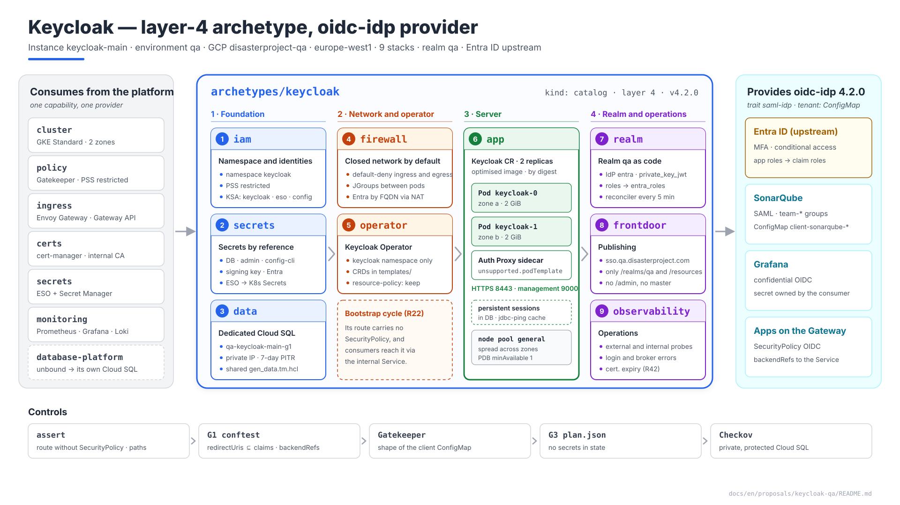
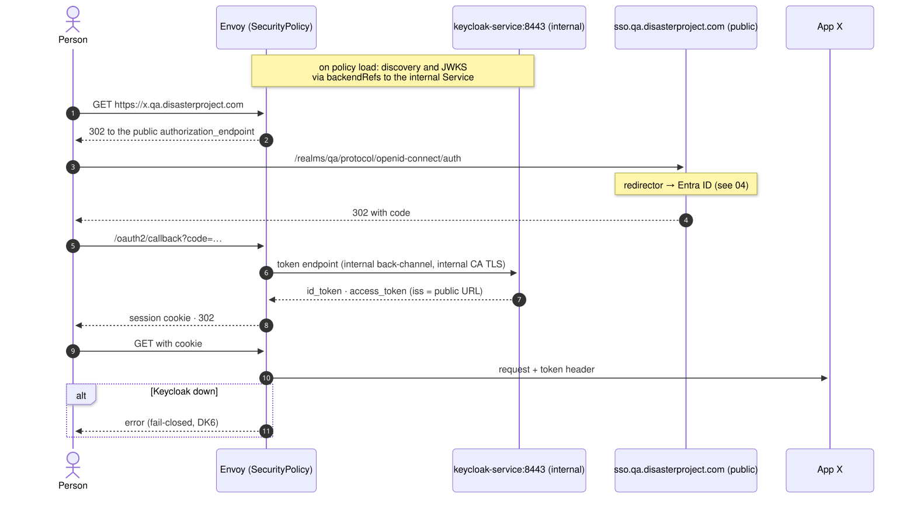

# Keycloak on `qa` — `keycloak` archetype (layer 4), provider of `oidc-idp`

| | |
|---|---|
| **Status** | Proposal · revision 2 |
| **Scope** | The layer 4 `keycloak` archetype on `qa`: installation, data, configuration, `qa` realm with Entra ID as upstream IdP, consumer clients as tenant resources, keys, publishing, network, availability, observability, stacks, policies, execution and plan |
| **Data assumption** | The Cloud SQL variant ([`../sonarqube-qa-cloudsql/`](../sonarqube-qa-cloudsql/README.md), DC1): `database-platform` unbound on `qa`, so Keycloak brings its own instance (DC8 of that variant). If DC1 is rejected, the same manifest takes the `data-tenant` path with a CNPG `Cluster` (AM §5.5) and only §3 changes |
| **Known consumers** | SonarQube over SAML ([`../sonarqube-qa/`](../sonarqube-qa/README.md), S1/S2), Grafana over OIDC, future applications with an OIDC `SecurityPolicy` on the Gateway |
| **Reference specification** | `archetype-model.md` (AM §n), `terramate-outputs-sharing-architecture.md` (§n), `developer-guide.md` (DG §n), `risk-register.md` |
| **Diagrams** | `diagrams/*.mmd` (Mermaid source) and `diagrams/*.svg` (rendered). The SVG is regenerated from the `.mmd`; never hand-edited. `diagrams/09-bloques-presentacion.svg` (1920×1080, for presentations) is generated by `09-bloques-presentacion.py`, not Mermaid |
| **Local identifiers** | Decisions `DK1…`, candidate risks `RK1…`, verifications `VK1…`. Risks get an `R54+` number in `risk-register.md` if adopted; those of the Cloud SQL variant (`RC*`) go first |

Nothing in this document reopens a `CLAUDE.md` decision. It implements two of its traps as checked invariants: the Keycloak ↔ Gateway bootstrap cycle (R22) and the `SecurityPolicy` that breaks machine clients (R44).

---

## 0. Context

| Question | Answer | Consequence |
|---|---|---|
| What it is | `keycloak` archetype, `kind: catalog`, **layer 4**, provides **`oidc-idp` 4.2.0** with the `saml-idp` trait | One provider per environment (AM §7). It is what the `qa` binding binds |
| Instance | `keycloak-main` → stacks `gcp-qa-keycloak-main-<stack>` in `stacks/archetypes/keycloak/instances/main/` | Same convention as `sonarqube-main` |
| Hostname | `sso.qa.disasterproject.com` — **claim** in the ledger | Already used by S1 §4.6 and S2 §6.2 |
| Realm | `qa`, one per environment | Shared by every `qa` consumer |
| Source of identities | **Entra ID**, managed by the identity team; Keycloak acts as **broker** (S1 §4.6, D4) | Keycloak stores no passwords for people. MFA and conditional access happen in Entra |
| Data | Dedicated Cloud SQL for PostgreSQL, `qa-keycloak-main-g1` (§3) | Same `gen_data.tm.hcl` generator as SonarQube |
| Availability | **2 replicas** spread across zones; zonal database (§9) | Keycloak down blocks login for all of `qa` except SonarQube CI |
| Model | Dedicated `qa` | No `capacity` budgets enforced (S1 §0) |



Source: [`diagrams/09-bloques-presentacion.py`](diagrams/09-bloques-presentacion.py) — presentation view; the detail is in §11.2.

---

## 1. What Keycloak imposes on the design

Facts about Keycloak 26.x. The exact version is pinned in phase 0; anything marked **(verify)** depends on it.

| Fact | Consequence for the design |
|---|---|
| **Build** options (database engine, health, metrics, features) are separate from **startup** options; without a prior build, every start recompiles | **Custom optimised image** (`kc.sh build`) and `startOptimized: true` (§2.2) |
| Health and metrics on the **management port 9000**, not the service port | `NetworkPolicy` and `PodMonitor` on 9000; that port is never published |
| **Persistent user sessions** by default: every login writes to the database **(verify in the version)** | Sessions survive a pod restart; the database is sized for session writes, not only configuration |
| Distributed cache with **`jdbc-ping`** by default: pods discover each other through the database **(verify)** | No headless Service for discovery; JGroups between pods on 7800 and 57800 (§8.3) |
| **Hostname v2**: `hostname` is the full public URL; the tokens' `iss` comes from it | The issuer is always `https://sso.qa.disasterproject.com/realms/qa`, whichever way the request arrives |
| **Temporary bootstrap admin** (`KC_BOOTSTRAP_ADMIN_*`) | Created once from Secret Manager and kept as the break-glass account (§5.4) |
| **Database migrations on starting a new version**, with no way back | Same treatment as R52: on-demand backup before every upgrade (§13.1) |
| The Keycloak Operator only **imports** complete realms (`KeycloakRealmImport`), without reconciling changes | Realm configuration with **keycloak-config-cli** (S2 §5.5), not with the operator (§6) |
| The admin console and the `master` realm live on the same hostname as everything else | The public route exposes only `/realms/qa/` and `/resources/` (§8.1) |
| JVM with `MaxRAMPercentage=70` by default in the official image **(verify)** | Memory limit = request; no hand-set `-Xmx` (DG §8.3) |

---

## 2. Installation

### 2.1 Operator, chart or nothing

| Option | What it is | Verdict |
|---|---|---|
| **A. Official Keycloak Operator** | Maintained by the Keycloak project; `Keycloak` CR for the instance | **Yes** (DK1): tracks Keycloak releases, manages server configuration and the update strategy. Cost: the proxy sidecar goes in through `unsupported.podTemplate` (§3.2) |
| B. `keycloakx` chart (codecentric) | StatefulSet with values | Valid alternative: first-class sidecars (`extraContainers`). Community-maintained, lags behind Keycloak releases |
| C. Bitnami chart | StatefulSet with values | **No**: Bitnami stopped publishing its versioned images for free in 2025; the chart is tied to images we do not control |

It is an **archetype** and not a component even though it deploys an operator: what decides it is that it provides a shared service with a multi-tenant contract (AM §5.4). The operator is an implementation detail.

### 2.2 The operator and its CRDs

| Rule | Why |
|---|---|
| Its own `operator` stack, one `helm_release` of the archetype chart with `operator.enabled=true` | Upgrading the operator is a different change from upgrading Keycloak, with its own PR and its own plan |
| **CRDs in `templates/`, not in `crds/`**, with the `helm.sh/resource-policy: keep` annotation | Helm never upgrades what is in `crds/`: a new operator with old CRDs fails. And a CRD in `templates/` without `keep` is deleted when the release is uninstalled, **taking the `Keycloak` CR with it** |
| The operator watches only the `keycloak` namespace | No cluster permissions beyond its CRDs |
| Operator image by digest from Artifact Registry | Allowed-registries constraint (S2 §7.4) |

### 2.3 Keycloak image

`FROM quay.io/keycloak/keycloak:<version>` + `kc.sh build --db=postgres --health-enabled=true --metrics-enabled=true`, built, scanned with Trivy and signed with cosign in the same pipeline as the SonarQube image (S1 §4.10). Deployed by digest. No custom themes or extensions at the start: every extension ties the Keycloak upgrade to its own pace.

---

## 3. Data

### 3.1 Cloud SQL instance

`gen_data.tm.hcl` (Cloud SQL variant §9.3) with the Keycloak globals. Everything not listed matches the SonarQube instance (Cloud SQL variant §3): private, `ENCRYPTED_ONLY`, backups in `europe-west1`, 7-day PITR, final backup, double deletion protection, Sunday maintenance.

| Setting | Value | Reason |
|---|---|---|
| Name | `qa-keycloak-main-g1` | `${env}-${instance}-g${generation}` |
| Tier | `db-custom-1-3840` (1 vCPU, 3.75 GB) | `qa` load: hundreds of people, scattered logins. Review after SonarQube phase 6 with real data (VK9) |
| Availability | `ZONAL` | Consistent with SonarQube; §9 explains why it is not raised |
| `max_connections` | `100` | 2 pods × pool of 30 (`db-pool-max-size`) + reconciler + margin |
| Secret | `qa-keycloak-db`, version written by `data` with the same `*_wo` pattern (Cloud SQL variant §5) | |

### 3.2 Connection: Auth Proxy inside the operator's CR

The `Keycloak` CR has no field for sidecars. The way in is `spec.unsupported.podTemplate`, which the operator merges into the pod it generates. "Unsupported" means no compatibility guarantee across operator versions, not that it does not work (DK3, RK4).

| Option | Verdict |
|---|---|
| **Auth Proxy as a native sidecar via `unsupported.podTemplate`** | **Yes**: the same pattern as SonarQube (IAM authorisation + TLS without CA management). Tested on every operator upgrade (VK1) |
| Direct private IP with `sslmode=verify-ca` | Plan B if `podTemplate` does not merge `initContainers` with `restartPolicy: Always`: no sidecar, server CA in a `ConfigMap` |

`db-url-host=127.0.0.1`, `db-url-port=5432`, `db-username` and `db-password` from the `keycloak-db` `Secret` (ESO). The proxy's IAM is that of Cloud SQL variant §4.2 with the `keycloak` KSA.

---

## 4. The server

```yaml
# archetype chart, templates/keycloak.yaml — effective values (keys: verify against the pinned CRD)
apiVersion: k8s.keycloak.org/v2alpha1
kind: Keycloak
metadata: { name: keycloak, namespace: keycloak }
spec:
  instances: 2
  image: europe-docker.pkg.dev/disasterproject-lz/platform/keycloak@sha256:<digest>
  startOptimized: true
  bootstrapAdmin:
    user: { secret: keycloak-admin }                 # §5.4 — break-glass
  db:
    vendor: postgres
    host: 127.0.0.1
    port: 5432
    database: keycloak
    usernameSecret: { name: keycloak-db, key: username }
    passwordSecret: { name: keycloak-db, key: password }
    poolMaxSize: 30
  http:
    httpEnabled: false
    tlsSecret: keycloak-tls                          # Certificate from the internal CA (§7)
  hostname:
    hostname: https://sso.qa.disasterproject.com
    strict: true
    backchannelDynamic: false
  proxy:
    headers: xforwarded
  additionalOptions:
    - { name: log-console-output, value: json }
    - { name: http-management-port, value: "9000" }
  resources:
    requests: { cpu: "1", memory: 2Gi }
    limits:   { memory: 2Gi }                        # no CPU limit (DG §8.3)
  scheduling:
    topologySpreadConstraints:
      - { maxSkew: 1, topologyKey: topology.kubernetes.io/zone, whenUnsatisfiable: DoNotSchedule }
  unsupported:
    podTemplate:
      spec:
        serviceAccountName: keycloak
        automountServiceAccountToken: false
        initContainers:
          - name: cloud-sql-proxy                    # native sidecar, same as SonarQube
            image: europe-docker.pkg.dev/disasterproject-lz/platform/cloud-sql-proxy@sha256:<digest>
            restartPolicy: Always
            args: [--private-ip, --port=5432, --structured-logs, --health-check,
                   --http-address=0.0.0.0, --prometheus, --max-sigterm-delay=30s,
                   "disasterproject-qa:europe-west1:qa-keycloak-main-g1"]
```

| Choice | Why |
|---|---|
| HTTPS only on the pod (`httpEnabled: false`) | Tokens and authorisation codes travel over the back-channel. TLS with the cert-manager internal CA, like GLB → Envoy (S1 §4.5) |
| Public `hostname` and `strict: true` | A single `iss`; a request with a different `Host` does not change the frontend URLs |
| `backchannelDynamic: false` | Envoy and Grafana reach the internal Service but request the public URLs, which internal routing resolves (§8.2). Enabling it would make the discovery document depend on how the request arrives |
| 2 replicas spread by zone | A node or a cluster zone does not take login down. The zonal database remains the single point (§9) |
| `requests.memory == limits.memory` | DG §8.3 |

---

## 5. The `qa` realm

The realm's base configuration is code: a document in the archetype chart applied by the reconciler (§6.3). Nothing is configured by hand in the console.

### 5.1 Realm settings

| Setting | Value | Reason |
|---|---|---|
| `sslRequired` | `all` | All traffic is HTTPS, internal included |
| User registration, remember me, local password change | Disabled | People have no credential in Keycloak |
| Browser flow | **Identity Provider Redirector** with `defaultProvider = entra`; local form hidden | One click fewer and no login screen of our own to attack |
| Brute-force protection | Enabled | In case someone enables a local credential by mistake |
| Access token lifetime | 5 min | Short; consumers refresh |
| SSO idle / max | 30 min / 10 h | One working day |
| Login and admin events | Enabled, to stdout (JSON) → Loki | Auditing without storing events in the database |

### 5.2 Entra ID as identity provider

| Setting | Value | Reason |
|---|---|---|
| Type | OpenID Connect v1.0, alias `entra` | The redirect URI registered in Entra is `https://sso.qa.disasterproject.com/realms/qa/broker/entra/endpoint` (S1 §4.6) |
| Discovery | `https://login.microsoftonline.com/<tenant-id>/v2.0/.well-known/openid-configuration` | Single tenant, not `common` |
| Client authentication | **`private_key_jwt`** with a certificate (S1 §4.6, R42) | No client secret expiring silently |
| `syncMode` | `FORCE` | A change of app roles in Entra is reflected at the next login |
| First login | Automatic creation, no profile review screen; `trustEmail = true` | The identity is already verified in Entra |
| Identifier | Entra `sub` (per application and stable) for the link; `preferred_username` as the username | The UPN can change; the `sub` cannot |

### 5.3 From app roles to groups, without configuring each role

S1 §4.6 originally proposed one *claim to group* mapper per app role; it was simplified as follows (DK5), and S1 §4.6 now reflects it:

| Step | Mechanism |
|---|---|
| 1 | **Attribute Importer** mapper on the `entra` IdP: claim `roles` → multivalued user attribute `entra_roles`, `syncMode FORCE` |
| 2 | The `entra_roles` attribute is **declared in the realm's user profile**, visible and editable only by administration **(verify the user profile in the version, VK5)** |
| 3 | On each client, a user attribute mapper → SAML attribute `groups` or OIDC claim `groups` |

Result: Keycloak keeps no list of roles. Onboarding a team goes from three places (app role in Entra + mapper in Keycloak + `teams.yaml` in SonarQube) to **two** (app role in Entra + `teams.yaml`), and both are necessary. SonarQube receives the same `groups` attribute it expected (S2 §6.2).

### 5.4 Administration

| Who | How | Where |
|---|---|---|
| Reconciler | `keycloak-config-cli` service account client in the `master` realm, with the admin roles of the `qa-realm` client (only the `qa` realm, not `master`) | Secret `qa-keycloak-config-cli` |
| Break-glass | `master` admin user created by `bootstrapAdmin` | Secret `qa-keycloak-admin`; just-in-time read for SRE (S1 §4.3) |
| Console | **Not published.** `kubectl port-forward` to the Service, with the SRE's identity and the control-plane access of S1 §4.13 | — |

Contract 4.1.0 exported `admin_secret_id` (AM §5.1). A consumer does not need admin credentials for the IdP — S2 §5.5 already rejected giving them to the pipeline — so in 4.2.0 the output is **deprecated**: it is kept because removing it is MAJOR (AM §4.5), a conftest rule forbids consuming it (§12.2), and it is removed in 5.0.0.

---

## 6. Consumer clients



Source: [`diagrams/05-clientes-tenant.mmd`](diagrams/05-clientes-tenant.mmd)

### 6.1 The tenant resource

AM §10.4 named `KeycloakClient` as the tenant resource. That CRD belonged to the old operator; the current one does not have it (S2 §5.5). AM §10.4 is now updated. The manifest declares what is actually created:

```yaml
tenant_resources:
  - kind: ConfigMap
    namePrefix: "client-{{ instance }}-"
    maxCount: 3
```

Each `ConfigMap` carries the labels `keycloak.disasterproject.com/realm: qa` and `archetype.disasterproject.com/instance: <instance>`, and the client representation in `data.client.json`. `KeycloakRealmRole` (AM §10.4) is not offered: groups come from Entra (§5.3).

### 6.2 What a client may declare

Allow-list. Any other field is rejected:

| Field | Allowed |
|---|---|
| `clientId`, `name`, `description` | Yes |
| `protocol` | `saml` or `openid-connect` |
| `redirectUris`, `webOrigins`, SAML ACS and logout attributes | Yes, **only under hostnames claimed by the same instance** (§6.4). No `*` wildcard |
| `publicClient` | `false` |
| `standardFlowEnabled` | `true` |
| `serviceAccountsEnabled`, `directAccessGrantsEnabled`, `implicitFlowEnabled` | **`false`** — a service account with `realm-management` roles is privilege escalation |
| `protocolMappers` | Only types from a closed list: user property (`username`, `email`, `firstName`, `lastName`), attribute `entra_roles` → `groups` |
| `secretRef` | Confidential OIDC only: name of the secret in Secret Manager (§6.5) |
| `fullScopeAllowed`, `defaultClientScopes`, roles, `authenticationFlowBindingOverrides` | **No** |

### 6.3 The reconciler

| Element | Design |
|---|---|
| What | `CronJob` `keycloak-config` every 5 min, `concurrencyPolicy: Forbid`, plus a hash-named `Job` that runs on every deployment of the `realm` stack (`wait_for_jobs`) |
| Step 1 | **Merges** the realm's base configuration (§5) and **all** labelled `ConfigMap`s into a single realm document |
| Step 2 | keycloak-config-cli with `import.remote-state.enabled=true` and `import.managed.client=full`: manages **only what it created**. A hand-created client is left alone; a deleted `ConfigMap` deletes its client |
| Why merge | keycloak-config-cli processes files one by one. With several partial files and `full` management, each file could delete the others' clients (RK1). A single document removes the problem at the root |
| If nothing changed | Compares the hash of the merged document with that of the last successful run and exits without calling Keycloak |
| Identity | KSA `keycloak-config`; credential `qa-keycloak-config-cli` via ESO; `get`/`list` on `ConfigMap` only in the `keycloak` namespace |
| Delay | Up to 5 min between the apply of a consumer's `sso` and the client being available. SonarQube's first login may fail during that window; acceptable |

### 6.4 Controls on what a tenant declares

On `qa` every stack is applied with the same pipeline identity (`tf-apply-qa@`): at admission there is no way to know which instance created a `ConfigMap`. The real control is in CI, which does see the ledger.

| Control | Where | What it checks |
|---|---|---|
| Claimed hostnames | **conftest (G1)** | Every URI in `redirectUris`, `webOrigins` and ACS is under a hostname claimed in the ledger **by the same instance** that signs the label and the prefix. This is what stops a tenant registering a client that redirects to another |
| Shape | **Gatekeeper** | Name prefix = `client-<instance label>-`; `data.client.json` parses and respects the §6.2 allow-list; no client `ConfigMap` for the `master` realm |
| Declaration | Resolver (AM §12, step 11) | The stack declares `creates_tenant_resources: [oidc-idp]` and does not exceed `maxCount` |

### 6.5 Secrets of confidential OIDC clients

Envoy (`SecurityPolicy`) and Grafana need a client secret. It is **created and owned by the consumer**:

| Step | Who |
|---|---|
| Secret `qa-<instance>-oidc`, write-only value | Consumer's `secrets` stack |
| `secretAccessor` on **that** secret for the principal of the `keycloak-config` KSA | Consumer's `secrets` stack |
| `secretRef: qa-<instance>-oidc` in the client's `ConfigMap` | Consumer's `sso` stack |
| Reading the value and creating the client with that secret | Reconciler, under its own identity, at run time |
| Materialisation for Envoy or Grafana | ESO in the consumer's namespace |

The value never passes through the pipeline or outputs sharing (R8). Rotation is the consumer's job: new secret version, the reconciler applies it on its next pass, and ESO carries it to the consumer.

### 6.6 Platform clients

Grafana's and any other platform component's clients are declared by the `realm` stack in the base configuration, not as tenant resources: they have no instance and no claimed hostname of their own outside the monitoring archetype.

---

## 7. Keys and certificates



Source: [`diagrams/07-claves.mmd`](diagrams/07-claves.mmd)

| Key | Use | Origin | Rotation |
|---|---|---|---|
| Realm signing (RSA 3072, RS256) | SAML and OIDC token signing | Bootstrap script, once: private key + certificate in `qa-keycloak-realm-signing`; **the public certificate also in Git** as the value of `saml_idp_certificate` | Yearly, §13.3 |
| Credential towards Entra | `private_key_jwt` of the `entra` IdP | Bootstrap script: `qa-keycloak-entra-cert`; the identity team uploads the public certificate to the app registration | Before expiry; Entra accepts several certificates at once, so there is no outage |
| Internal TLS | Pod HTTPS | cert-manager `Certificate` with the internal `ClusterIssuer`, SAN `keycloak-service.keycloak.svc` | Automatic |

**Why the signing certificate is supplied and not generated by Keycloak.** SonarQube needs the public signing certificate as a static value (S2 §5.6). If Keycloak generated it, it would have to be read from the live realm at plan time, which fails on the first deployment and in previews. Supplied, the certificate is **deterministic**: it lives in `instance.tm.hcl` and the `realm` stack publishes it as a contract output without querying anything. The private key never enters state: a script outside OpenTofu generates it and the reconciler carries it to Keycloak.

**Separating the Entra key from the signing key.** Keycloak picks the active key by algorithm. If realm signing uses RS256 and the assertion towards Entra PS256, each has its own key and they rotate separately. If Entra or Keycloak does not allow it (VK4), a single key remains and its rotation is coordinated with the identity team and with SonarQube.

**Expiry alert (R42).** `x509-certificate-exporter` reads the `Secret` that ESO materialises from `qa-keycloak-entra-cert` (RBAC limited to that `Secret` by `resourceNames`) and exposes its expiry date; alerts at 30 days, routed to the identity team.

---

## 8. Publishing and network

### 8.1 Public route

| Element | Value |
|---|---|
| `HTTPRoute` `keycloak` | Host `sso.qa.disasterproject.com`; `PathPrefix` **only** `/realms/qa/` and `/resources/`; `parentRefs` to the `qa` Gateway |
| `/admin/`, `/realms/master/`, port 9000 | **Not routed**: 404 at Envoy |
| `SecurityPolicy` | **None** (R22). Enforced by an assert and Gatekeeper (§12) |
| Envoy → Keycloak | `BackendTLSPolicy` with the internal CA and hostname `keycloak-service.keycloak.svc` |
| Cloud Armor | Environment default rules. With no local credentials, the brute-force surface is in Entra |

### 8.2 The two cold-start invariants



Source: [`diagrams/03-arranque-en-frio.mmd`](diagrams/03-arranque-en-frio.mmd)

AM §10.5 and architecture §10.7 require two things; this is how they are met:

| Invariant | How |
|---|---|
| Keycloak's route carries no `SecurityPolicy` | §8.1; assert in the `frontdoor` stack; Gatekeeper constraint that denies a `SecurityPolicy` targeting that route |
| The Gateway's OIDC discovery resolves through the internal Service, not the public hostname | In each consumer's `SecurityPolicy`: `provider.issuer` = public URL (must match `iss`), and **`provider.backendRefs`** → `keycloak-service.keycloak:8443` with `BackendTLSPolicy`. Envoy requests the public URLs but the connections go to the Service **(verify `backendRefs` support in the OIDC provider in the pinned Envoy Gateway version, VK2)** |

So Envoy needs neither the GLB nor public DNS to talk to Keycloak, and a cold environment starts in the order of the figure. The archetype publishes `internal_service` in its contract so that consumers do not write the name by hand.



Source: [`diagrams/08-oidc-gateway.mmd`](diagrams/08-oidc-gateway.mmd)

### 8.3 NetworkPolicies



Source: [`diagrams/06-red.mmd`](diagrams/06-red.mmd)

Default-deny ingress and egress in `keycloak`:

| Source | Destination | Port | Note |
|---|---|---|---|
| Envoy | Keycloak | 8443 | Routes and `backendRefs` of the `SecurityPolicy`s |
| Namespaces with a confidential OIDC client (Grafana) | Keycloak | 8443 | Token back-channel and JWKS through the internal Service. Selector by namespace label |
| Prometheus | Keycloak / proxy | 9000 / 9090 | |
| Keycloak | Keycloak | 7800, 57800 | JGroups with `jdbc-ping` **(verify ports, VK3)** |
| Reconciler | Keycloak | 8443 | |
| Keycloak pods (proxy) | PSA range `qa-psa` | 3307 | As SonarQube |
| Proxy, reconciler | `sqladmin` / `secretmanager.googleapis.com` via Private Google Access | 443 | |
| Keycloak | `login.microsoftonline.com` via Cloud NAT | 443 | **By FQDN** (GKE `FQDNNetworkPolicy`, **verify availability on Standard, VK6**). Plan B: 443 to any destination outside RFC 1918, for Keycloak pods only |
| Operator | Kubernetes API | 443 | |
| All | kube-dns | 53 | |

---

## 9. Availability and failure behaviour

| If this fails… | What stops working | What keeps working |
|---|---|---|
| A pod or a node | Nothing: the other replica serves; sessions are in the database | Everything |
| A cluster zone | Nothing, unless it is the Cloud SQL zone | Everything |
| **Cloud SQL** (zonal) or **all of Keycloak** | New logins to SonarQube, Grafana and apps with a `SecurityPolicy`. Envoy sessions expire with the access token (5 min) and cannot be refreshed | **SonarQube CI**: analysis tokens do not go through Keycloak (S1 §4.6). Sessions already open in SonarQube and Grafana until they expire |
| **Entra ID** | Same as the above | Same |

**Fail-closed decision** (DK6, AM §10.5): with Keycloak down, the `SecurityPolicy` denies. Never fail-open: an OIDC-protected app would be left open to the internet.

**Why a zonal database with Keycloak spread.** Raising Cloud SQL to `REGIONAL` doubles its cost to cover the loss of one specific zone, on `qa`. It is noted as the first change if `qa` becomes critical for someone; in production it is mandatory (AM §10.5).

---

## 10. Observability

| Signal | Collection | Alert |
|---|---|---|
| External availability | Blackbox → `https://sso.qa.disasterproject.com/realms/qa/.well-known/openid-configuration` | ≠ 200 for 5 min |
| Internal availability | Blackbox → `https://keycloak-service.keycloak:8443/realms/qa/.well-known/openid-configuration` | ≠ 200 for 2 min. Distinguishes a Keycloak failure from an edge failure |
| Login and broker errors | Keycloak event metrics on 9000 **(verify metric names)** | Rate of `LOGIN_ERROR` or `IDENTITY_PROVIDER_LOGIN_ERROR` > 20 % over 15 min — usually Entra or the credential towards Entra |
| JVM and container | `PodMonitor` · kube-state-metrics | Heap > 90 %; `OOMKilled` |
| Replicas | kube-state-metrics | Fewer than 2 ready for 10 min |
| Reconciler | `CronJob` status | Last successful run > 30 min |
| Credential towards Entra | `x509-certificate-exporter` | Expiry < 30 days (R42) |
| Cloud SQL | `data` stack alerts (Cloud SQL variant §8) | The same as SonarQube |
| Logs | Fluent Bit → Loki | Admin events outside the reconciler (someone touched the console) |

---

## 11. The archetype

### 11.1 Manifest

```yaml
# archetypes/keycloak/manifest.yaml
apiVersion: archetype/v1
kind: Archetype

metadata:
  name: keycloak
  version: 4.2.0
  layer: 4
  kind: catalog
  description: Keycloak as the environment's identity broker; OIDC and SAML towards consumers
  owners: [team-platform]

runtimes: [gke, eks, aks]

requires:
  - capability: cluster
    version: "^2.0.0"
  - capability: policy
    version: "^1.0.0"
  - capability: ingress
    version: ">=3.0.0 <4.0.0"
    traits: [gateway-api, http-route]
  - capability: certs
    version: "^1.0.0"
  - capability: secrets
    version: "^2.0.0"
    traits: [eso]
  - capability: monitoring
    version: "^1.5.0"
    traits: [prometheus-operator-crds]
  - capability: database-platform
    version: "^1.0.0"
    traits: [cnpg]
    optional: true
    reason: "Without database-platform, the archetype brings its own managed instance (AM §5.5)"

provides:
  - capability: oidc-idp
    version: 4.2.0
    traits: [saml-idp]
    outputs:
      - { name: issuer_url,           from: realm }
      - { name: realm_name,           from: realm }
      - { name: saml_sso_url,         from: realm }     # new in 4.2.0
      - { name: saml_idp_certificate, from: realm }     # new in 4.2.0
      - { name: internal_service,     from: app }       # new in 4.2.0
      - { name: admin_secret_id,      from: secrets }   # deprecated; removed in 5.0.0 (§5.4)
    tenant_resources:
      - kind: ConfigMap
        namePrefix: "client-{{ instance }}-"
        maxCount: 3

stacks:
  - name: iam
  - name: secrets
    after: [iam]
  - name: data
    condition: "!resolved(database-platform)"
    after: [iam, secrets]
  - name: data-tenant
    condition: "resolved(database-platform)"
    after: [iam, secrets]
    creates_tenant_resources: [database-platform]
  - name: firewall
    after: [data, data-tenant]
  - name: operator
    after: [iam]
  - name: app
    after: [secrets, firewall, operator]
  - name: realm
    after: [app]
  - name: frontdoor
    after: [app]
  - name: observability
    after: [app]

claims:
  - kind: hostname
    pool: "{{ environment.dns_zone }}"
    value: "sso.{{ environment.dns_suffix }}"

firewall:
  - name: gateway-to-keycloak
    from: zone:pods
    to: self
    ports: [8443]

capacity:
  cpu_millicores: 2300                               # 2 × 1000 + proxy, operator, reconciler
  memory_mib: 4864                                   # 2 × 2048 + 2 × 128 + operator + reconciler
  managed_db_instances: 1
  ingress_routes: 1
  workload_identities: 3                             # proxy→Cloud SQL, ESO→Secret Manager, reconciler→Secret Manager
```

Three new outputs are MINOR: `oidc-idp` goes from 4.1.0 to **4.2.0**, which is the version SonarQube already requires (S2 §3).

### 11.2 The stacks



Source: [`diagrams/02-stacks-arquetipo.mmd`](diagrams/02-stacks-arquetipo.mmd)

| Stack | Generator | Contents | Inputs via sharing |
|---|---|---|---|
| `iam` | `gen_tenant_namespace.tm.hcl` | Namespace `keycloak` (PSS `restricted`); KSAs `keycloak`, `eso-keycloak`, `keycloak-config` | `cluster_*` (gke) |
| `secrets` | `gen_secrets.tm.hcl` | `qa-keycloak-db` (no version), `-admin`, `-config-cli` (generated write-only), `-realm-signing`, `-entra-cert` (version from the bootstrap script); `SecretStore` and `ExternalSecret` | `cluster_*`, `workload_identity_pool` |
| `data` | `gen_data.tm.hcl` | §3.1 | `workload_identity_pool`, `notification_channel_id` |
| `firewall` | `gen_helm_stack.tm.hcl` | §8.3 | `cluster_*` |
| `operator` | `gen_helm_stack.tm.hcl` | Operator and CRDs (§2.2) | `cluster_*` |
| `app` | `gen_app.tm.hcl`, helm branch | `Keycloak` CR (§4), internal `Certificate`, PDB `minAvailable: 1` | `cluster_*` |
| `realm` | `gen_helm_stack.tm.hcl` | Base configuration (§5), reconciler (§6.3), platform clients (§6.6); **contract outputs** | `cluster_*` |
| `frontdoor` | `gen_helm_stack.tm.hcl` | `HTTPRoute`, `BackendTLSPolicy` | `cluster_*` |
| `observability` | `gen_helm_stack.tm.hcl` | `PodMonitor`, `PrometheusRule`, `Probe` × 2, `x509-certificate-exporter`, dashboard | `cluster_*` |

`data` keeps its `after` to `gcp-qa-network` with no input (Cloud SQL variant §9.3).

### 11.3 Contract outputs

All are deterministic; they are published as contract outputs so that consumers do not depend on how they are obtained (AM §5.1).

| Output | Value on `qa` | Origin |
|---|---|---|
| `issuer_url` | `https://sso.qa.disasterproject.com/realms/qa` | Hostname claim + realm |
| `realm_name` | `qa` | Global |
| `saml_sso_url` | `https://sso.qa.disasterproject.com/realms/qa/protocol/saml` | Likewise |
| `saml_idp_certificate` | PEM of the public signing certificate | `instance.tm.hcl` (§7) |
| `internal_service` | `keycloak-service.keycloak.svc:8443` | Name of the Service the operator creates |
| `admin_secret_id` | `qa-keycloak-admin` | Deprecated (§5.4) |

```hcl
# imports/contracts/contract_oidc_idp_saml.tm.hcl (S2 §2) — producer side, realm stack
output "saml_sso_url"         { backend = "tofu"  value = "${global.keycloak.issuer_url}/protocol/saml" }
output "saml_idp_certificate" { backend = "tofu"  value = global.keycloak.saml_signing_certificate }
```

No secret values: the certificate is public (R8).

---

## 12. Policies

### 12.1 `assert` at generation

```hcl
assert {
  assertion = !tm_can(global.keycloak_values.frontdoor.securityPolicy)
  message   = "keycloak: its own route carries no SecurityPolicy — bootstrap cycle (R22)"
}
assert {
  assertion = tm_alltrue([for p in global.keycloak_values.frontdoor.paths : tm_contains(["/realms/qa/", "/resources/"], p)])
  message   = "keycloak: the public route exposes only /realms/qa/ and /resources/ (§8.1)"
}
assert {
  assertion = tm_startswith(global.keycloak.hostname, "https://")
  message   = "keycloak: hostname v2 requires the full public URL"
}
```

### 12.2 conftest (G1)

| Rule | What it checks |
|---|---|
| **New:** client hostnames | §6.4: URIs of each client `ConfigMap` under hostnames claimed by the same instance |
| **New:** `SecurityPolicy` through the internal Service | Every OIDC `SecurityPolicy` in a consumer archetype carries `provider.backendRefs` to `internal_service` (second invariant of R22) |
| **New:** deprecated output | No `input` consumes `admin_secret_id` |
| Tenant resources | Consumers' `sso` declares `creates_tenant_resources: [oidc-idp]`; name with its instance's prefix |
| `input` ↔ `after` | Existing (R2): a consumer of `saml_*` has `after` to the `realm` stack |

### 12.3 Gatekeeper

| Constraint | Effect |
|---|---|
| **New:** shape of the client `ConfigMap` | §6.4 |
| **New:** no `SecurityPolicy` on Keycloak's route | First invariant of R22, at admission too |
| Existing | PSS `restricted`, mandatory labels, allowed registries (operator, Keycloak, proxy by digest) |

---

## 13. Execution

### 13.1 Upgrades

| What | Procedure |
|---|---|
| **Operator** | PR changing its version in the `operator` stack. Before that, in an ephemeral environment: VK1 (the sidecar via `podTemplate` still works) |
| **Keycloak** | New image (§2.3) and a PR changing the digest. Before merging, on-demand backup of `qa-keycloak-main-g1` (as SonarQube, Cloud SQL variant §13). `Recreate` update strategy for minor and major changes: 1–3 min without login; SonarQube CI does not notice |
| If it fails after migrating the database | In-place restore of the backup and a PR with the previous digest (R52) |

### 13.2 First deployment

| Step | Who |
|---|---|
| 1 | Bootstrap script: signing and Entra key pairs → Secret Manager; signing certificate → `instance.tm.hcl`; Entra certificate → identity team (Q-K1) |
| 2 | Stacks `iam` → `secrets` → `data` → `firewall` → `operator` → `app` |
| 3 | `realm`: the deployment `Job` creates the reconciler's client in `master` using the bootstrap admin, applies the base configuration and exits. From then on the reconciler uses its own credential |
| 4 | `frontdoor`, `observability` |
| 5 | Consumers (phase C of S1 §6) |

### 13.3 Signing key rotation

1. Script: new pair → new version of `qa-keycloak-realm-signing`.
2. One PR, one deployment: the `realm` stack adds the new key with **higher priority** and leaves the old one active for verification only; `saml_idp_certificate` changes in `instance.tm.hcl`; SonarQube (`app`) picks up the new certificate in the same run through its `after` to the `realm` stack.
3. Later PR: the old key is retired.

OIDC consumers read the JWKS and notice nothing. SonarQube may reject logins during the minutes between the `realm` step and its `app` step (RK5).

### 13.4 Destruction

It stops at the Cloud SQL instance (double protection) and at `qa-keycloak-realm-signing` and `qa-keycloak-entra-cert` (`prevent_destroy`): regenerating them requires coordinating with the identity team and with every SAML consumer.

---

## 14. SonarQube requirements and changes to other documents

### 14.1 What S2 §9 asked of `keycloak`

| Requirement (S2 §9) | Where it is met |
|---|---|
| Client reconciler via `ConfigMap` | §6.3 |
| Outputs `saml_sso_url` and `saml_idp_certificate`; `oidc-idp` 4.2.0 | §11.1, §11.3 |
| Restrict which `ConfigMap` each tenant creates (prefix `client-<instance>-`) | §6.4 — with the refinement that the real control is conftest against the ledger, not Gatekeeper |
| Entra groups towards SonarQube | §5.3 — no per-role mapper |

### 14.2 Changes

| Document | Change | Status |
|---|---|---|
| S2 §5 (`app` `stack.tm.hcl` pattern), in `docs/es/` and `docs/en/` | `after` to `/stacks/platforms/gcp/qa/keycloak` → `/stacks/archetypes/keycloak/instances/main/realm`: Keycloak is layer 4 and lives in `stacks/archetypes/` (`CLAUDE.md`, layout) | **Applied** with this proposal |
| S1 §4.6, rows "Mapping in Keycloak" and "Toward SonarQube", and S2 §5.5 | Per-role mapper → import of the `roles` claim as an attribute (§5.3) | **Applied** |
| AM §10.4, and S2 §5.5 and §7.2 | `keycloak` tenant resource: `KeycloakClient`, `KeycloakRealmRole` → `ConfigMap` with prefix `client-{{ instance }}-` | **Applied** |
| `registry/` | No new trait | — |

---

## 15. Decisions

| # | Decision | Status | Recommendation | Alternative |
|---|---|---|---|---|
| DK1 | Installation | Proposed | Official Keycloak Operator | `keycloakx` chart |
| DK2 | Data | Inherited from DC1/DC8 | Own Cloud SQL | CNPG `Cluster` if DC1 is rejected |
| DK3 | Database connection | Proposed | Auth Proxy via `unsupported.podTemplate` | Private IP with `verify-ca` |
| DK4 | Realm and client configuration | Proposed | keycloak-config-cli with merged document and remote state | `KeycloakRealmImport` (create only); OpenTofu provider (admin credentials in the pipeline, S2 §5.5) |
| DK5 | Groups | Proposed | `entra_roles` attribute imported from the `roles` claim | Per-app-role mapper (S1 §4.6) |
| DK6 | IdP failure | Proposed | Fail-closed | — (fail-open exposes the apps) |
| DK7 | Admin console | Proposed | Not published; just-in-time port-forward | Internal route restricted by IP |
| DK8 | Signing key | Proposed | Supplied; public certificate in Git | Generated by Keycloak and read at plan |
| DK9 | `admin_secret_id` | Proposed | Deprecated in 4.2.0, removed in 5.0.0 | Keep it |
| DK10 | Replicas | Proposed | 2, spread by zone | 1 (and accept that a restart cuts login) |

---

## 16. Candidate risks

Existing risks this archetype mitigates directly: **R22** (§8.2), **R42** (§7), **R43** (unchanged: SonarQube's daily reconciliation), **R44** (§12).

| # | Risk | Likelihood | Impact | Mitigation |
|---|---|---|---|---|
| RK1 | **The reconciler deletes clients** of other tenants or created by hand | Medium without merging | High — consumers without login | Merged document; remote state; VK7 |
| RK2 | **A tenant registers a client redirecting to another hostname** | Medium | High — theft of authorisation codes | conftest against the ledger (§6.4); allow-list |
| RK3 | **Escalation through a client service account** with `realm-management` roles | Low with allow-list | Critical | `serviceAccountsEnabled: false` mandatory (§6.2) |
| RK4 | **`unsupported.podTemplate` stops merging the sidecar** after an operator upgrade | Medium | High — Keycloak without database | VK1 in an ephemeral environment before every upgrade; plan B of §3.2 |
| RK5 | **Signing key rotation out of sync** with SonarQube | Medium | Medium — minutes without login to SonarQube | Single PR and deployment (§13.3) |
| RK6 | **Console or `master` realm exposed** by a broader route | Low with assert | Critical | Route assert; Gatekeeper; probe expecting 404 on `/admin/` |
| RK7 | **Dependency on Entra ID**: an outage or a conditional-access change cuts all login on `qa` | Low | High | Accepted; break-glass to administer Keycloak; CI does not depend on it |

---

## 17. Verifications

| # | Verification | Result that closes it |
|---|---|---|
| VK1 | `unsupported.podTemplate` merges an `initContainer` with `restartPolicy: Always` in the pinned operator version | Proxy starting before Keycloak; Keycloak connects to Cloud SQL |
| VK2 | OIDC `SecurityPolicy` with `provider.backendRefs` to the internal Service and a public `issuer` | Successful login; no Envoy connection to the GLB IP; cold start without public DNS |
| VK3 | Two-pod cluster with `jdbc-ping` under the §8.3 `NetworkPolicy`s | Session survives the loss of a pod; ports confirmed |
| VK4 | PS256 key for `private_key_jwt` towards Entra, separate from the RS256 signing key | Login through Entra with the PS256 key; otherwise a single key (§7) |
| VK5 | Attribute Importer from the `roles` claim (array) to a multivalued attribute declared in the user profile | Attribute with all roles; `groups` in SonarQube's SAML assertion (closes V8 of S1) |
| VK6 | `FQDNNetworkPolicy` towards `login.microsoftonline.com` on GKE Standard | Keycloak reaches Entra; another FQDN denied |
| VK7 | keycloak-config-cli with merged document and remote state: create, change and delete a client, with a hand-created one present | Only the managed client changes (extends V12 of S2) |
| VK8 | Console not reachable: `/admin/` and `/realms/master/` via the public URL | 404 |
| VK9 | Database load with persistent sessions during the SonarQube pilot | `db-custom-1-3840` confirmed or adjusted |

Open question with third parties:

- **Q-K1.** With the identity team: registering Keycloak's certificate in the app registration, the deadline for renewing it after the 30-day alert, and whether they accept PS256 (VK4). Extends Q10 of S1.

---

## 18. Implementation plan

| Phase | Content | Exit criterion | Estimate |
|---|---|---|---|
| **0 · Prerequisites** | `qa` platform up to Gateway, cert-manager, ESO and monitoring; PSA; app registration in Entra (Q-K1); VK1, VK2, VK6 | The three verifications closed | Depends on the platform |
| **1 · Skeleton** | Manifest, archetype chart in parts, new asserts and rules, key bootstrap script | `archetypectl resolve --dry-run`, `terramate generate --check`, G1 and preview with mocks green | 3 days |
| **2 · Server** | `iam`, `secrets`, `data`, `firewall`, `operator`, `app` | Two pods ready against Cloud SQL; **VK3**; database restore rehearsed | 3 days |
| **3 · Realm and Entra** | `realm`, `frontdoor` | A person logs in through Entra with the test account; **VK4**, **VK5**, **VK8** | 3 days |
| **4 · Tenants** | Reconciler with test clients; conftest and Gatekeeper rules | **VK7**; a client with someone else's hostname rejected in CI | 2 days |
| **5 · Observability** | `observability` | Each alert fired once in a provoked test | 1–2 days |

About two weeks for one person with the platform available. It is SonarQube's critical path: its phase 4 (S2 §11) starts when this phase 4 ends.
