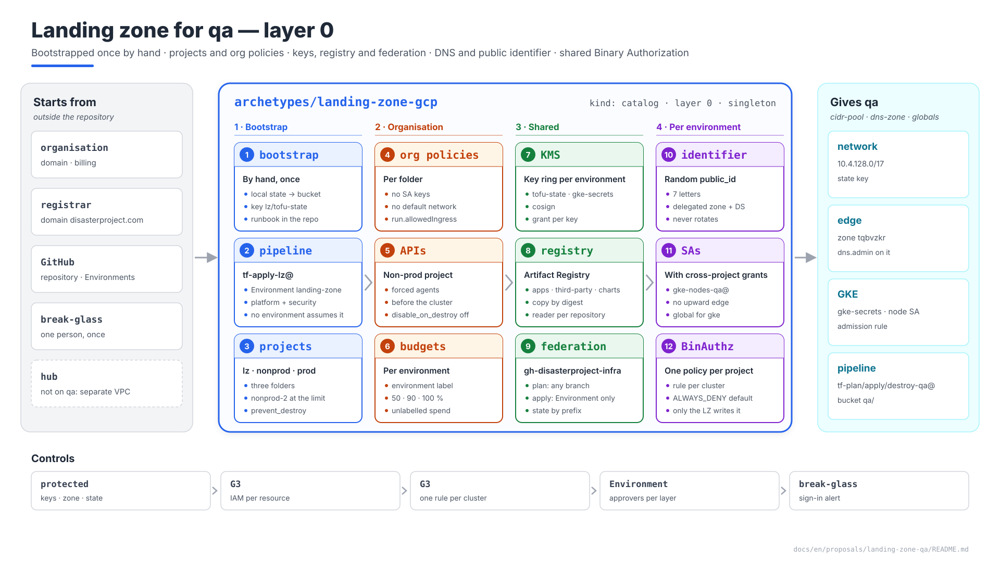
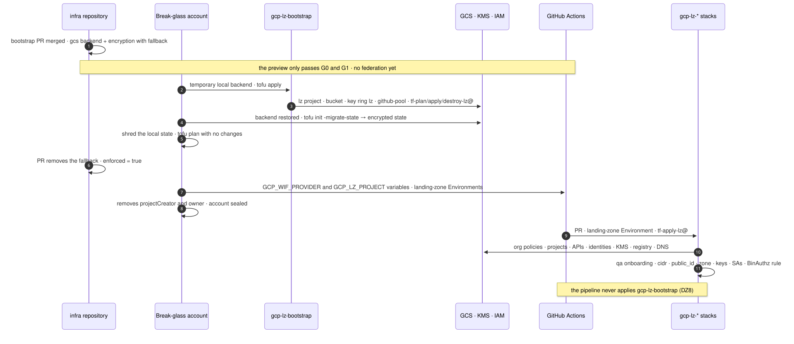

# Landing zone for `qa` — `landing-zone-gcp` archetype (layer 0)

| | |
|---|---|
| **Status** | Proposal · revision 5 · security review: bounded IAM administration, enumerated plan roles, the state listing condition, the migration fallback only in the environment (measured, `poc/RESULTS.md` A9), committed federation coordinates, the control-plane variant (§3.2), DZ12–DZ16; revision 4: DZ4, DZ5 and DZ6 approved and applied (§13); §1 expanded into the bootstrap runbook, new DZ8; revision 4: preflight, DATA_READ audit, the adopted-project variant (§1.5), minimum layer-0 set (§15.1), DZ9–DZ11 |
| **Scope** | What layer 0 has to provide for `qa` to start: the landing zone's own bootstrap, projects and folders, org policies, the non-prod project's APIs, Cloud KMS keys, Artifact Registry, GitHub Actions federation and pipeline identities, the state bucket, the parent DNS zone and the delegated zone, the public identifier, the global address pool, Binary Authorization, budgets. `hub` and `prod` only where they change something |
| **Why now** | Every `qa` proposal leaves it requirements (§0.1) and none describes it. It is the first thing applied and the only thing bootstrapped by hand |
| **Basis** | S1 §4.13 (control plane access), §4.14 (KMS), §4.15 (separate VPC); architecture §11.2 (pipeline identity), §11.4 (segregation), §11.5 (state); AM §3 (layers), §7 (binding), §9.2 (global pool). What is already there is not repeated |
| **Reference specification** | `archetype-model.md` (AM §n), `terramate-outputs-sharing-architecture.md` (§n), `risk-register.md` |
| **Diagrams** | `diagrams/*.mmd` (Mermaid source) and `diagrams/*.svg` (rendered). The SVG is regenerated from the `.mmd`; it is not hand-edited. `diagrams/06-bloques-presentacion.svg` (1920×1080, for presentations) is generated by `06-bloques-presentacion.py`, not by Mermaid |
| **Own identifiers** | Decisions `DZ1…`, candidate risks `RZ1…`, verifications `VZ1…`. Risks get an `R58+` number in `risk-register.md` if adopted |

It reopens no decision in `CLAUDE.md`. It gathers what earlier proposals left "to the landing zone" and finds three problems none of them could see on its own:

1. **Binary Authorization is one policy per project** (§8). If every `gke` stack writes its rule, the last `apply` erases the other non-production environments' rules: an N→1 fan-in (`CLAUDE.md`, outputs-sharing trap) in the shape of a single resource.
2. **Cross-project grants on identities that do not exist yet** (§6.3). The landing zone grants `artifactregistry.reader` to `qa`'s node SA and `cryptoKeyEncrypterDecrypter` to the GKE agent; if layer 2 creates those identities, layer 0 has to wait for layer 2 to apply: an upward edge.
3. **The `run.allowedIngress` org policy clashes with the GKE `access` service** (§3.2). S1 §4.13 exposes it to GitHub runners over the internet; the policy that protects R14 makes it unreachable.



Source: [`diagrams/06-bloques-presentacion.py`](diagrams/06-bloques-presentacion.py) — presentation view; the detail is in §1–§10.

---

## 0. Context

| Question | Answer | Consequence |
|---|---|---|
| What it is | Archetype `landing-zone-gcp`, `kind: catalog`, **layer 0**, instance `disasterproject-gcp-lz` (the value of `platform.landing_zone` in `qa`'s binding). A singleton per organisation | Stacks `gcp-lz-*`; only its own identity applies them (§5.2) |
| Provides | `cidr-pool` (the `/8` and the global ledger, AM §9.2), `dns-zone` (the parent zone) and `hub` (out of scope: `qa` does no peering, S1 §4.15). `cert`, `waf` and `edge-ip` belong to layer 1 (AM §3) | Everything else it gives — keys, registry, federation, state bucket, identities, projects — are **deterministic globals**, not capabilities: one possible provider, names known without reading state (S1 §4.14) |
| Projects | `disasterproject-lz` (the landing zone itself), `disasterproject-nonprod` (`dev`, `qa`, `demos`, `sandbox`, `ephemeral-*`), `disasterproject-prod` | The landing zone creates them; environments only create resources inside (`CLAUDE.md`) |
| What it does **not** do | Anything inside an environment's VPC; any resource named after an environment beyond what layer 1 needs to start (keys, zone, identities) | Layer 1 keeps its ownership (`network-qa`, `edge-qa`) |



Source: [`diagrams/01-contexto.mmd`](diagrams/01-contexto.mmd)

### 0.1 What earlier proposals asked of it

| Origin | Requirement | Where it is met |
|---|---|---|
| S1 §4.14 | Key ring `qa` with `tofu-state`, `gke-secrets`, `cosign`; protection against destruction | §4 |
| `network-qa` §1, §2, §5, §9.2 | Non-prod project with APIs enabled; `compute.skipDefaultNetworkCreation`; `compute.restrictVpcPeering` admitting `servicenetworking` | §2, §3 |
| `edge-qa` §1, DL2, DL10 | The environment's public zone created here, delegated with `DS` and DNSSEC, `dns.admin` to the environment on that zone; a random public identifier | §7 |
| `gke-qa` §3 | `gke-secrets` for the project's GKE agent; `artifactregistry.reader` on the repository for the node SA; Binary Authorization per cluster | §4, §6.3, §8 |
| Gatekeeper P2, `postgres-operator-qa`, Cloud SQL variant | A single Artifact Registry, images by digest, copies of third-party images (CNPG, Cloud SQL Auth Proxy) | §6 |
| Architecture §11.2, §11.4 | GitHub Actions federation; `tf-plan-qa@`, `tf-apply-qa@`, `tf-destroy-qa@` | §5 |
| `cmdb-qa` §7 | `cmdb-reader@` with `cloudasset.viewer` on the non-prod project | §5.1 |
| `CLAUDE.md` | Billing split by labels in the shared project | §9 |

---

## 1. Bootstrapping the landing zone itself

The landing zone is the one thing the pipeline cannot deploy, because it creates the pipeline: its state bucket, its state key and the federation GitHub authenticates with. Before the bootstrap there is no identity a GitHub job could assume and nowhere to keep state. So it is bootstrapped **once**, by hand, with local state, and that state is then moved into the bucket the bootstrap has just created.



Source: [`diagrams/02-arranque.mmd`](diagrams/02-arranque.mmd)

| Step | Who | What | State |
|---|---|---|---|
| 1 | Normal pull request review | The `gcp-lz-bootstrap` stack's code lands on `main` in its final form: `gcs` backend, encryption with `lz/tofu-state`, **no plaintext fallback and no variable to fill in**: the federation coordinates are committed in `ci/federation.env` (DZ12) | — |
| 2 | The *break-glass* account, from a workstation | `tofu apply` of the stack with a temporary local backend, unencrypted: project, bucket, key ring, federation, the landing zone's identities | **Local**, unencrypted: there is nowhere to keep it yet |
| 3 | The same account | Restores the generated backend and runs `tofu init -migrate-state` with the plaintext fallback **only in `TF_ENCRYPTION`**, never on disk (DZ15); `tofu plan` without it shows no changes | In the bucket, encrypted |
| 4 | Normal pull request review | One line: `enforced = true` on `state` and `plan`. It cannot ship in step 1: it forbids even a fallback injected through the environment (`poc/RESULTS.md` A9c–d) | In the bucket, encrypted |
| 5 | Repository administrator | The GitHub Environments `landing-zone`, `landing-zone-destroy` and their reviewers. **No variables**: the identities are derived from the committed coordinates (DZ12) | — |
| 6 | Pipeline, `tf-apply-lz@` | The rest of the `gcp-lz-*` stacks (§2–§10): the first time with the manual `first-deploy` workflow for `landing-zone`, which writes its deploy marker; afterwards through pull requests (`infra-repo-qa` §6) | In the bucket, encrypted |

The procedure for steps 2 and 3 is kept in the deployment repository as `docs/runbooks/lz-bootstrap.md` (`infra-repo-qa` §2), because the next time it is needed will be to rebuild the organisation and nobody will remember it (RZ1). This section is that runbook.

### 1.1 What the stack creates

`stacks/landing-zone/gcp/bootstrap/`, id `gcp-lz-bootstrap`, tags `gcp`, `landing-zone`, `bootstrap`, `protected`. It creates **only** what the pipeline needs in order to exist; everything else belongs to the `gcp-lz-*` stacks the pipeline applies.

| Resource | Name | Detail |
|---|---|---|
| Project | `disasterproject-lz` | Directly under the organisation, not in a folder: that way no later stack moves it and changes its org policy inheritance. The organisation's billing account |
| APIs | `storage`, `cloudkms`, `iam`, `iamcredentials`, `sts`, `cloudresourcemanager`, `serviceusage`, `cloudbilling`, `orgpolicy` | Those used by steps 2–6 themselves. The environment projects' APIs are enabled by `gcp-lz-projects` (§2.1) |
| State bucket | `disasterproject-tfstate-gcp` | `europe-west1`; uniform access; public access prevention enforced; versioning, noncurrent versions kept 30 days; `prevent_destroy` |
| Audit of state reads | `google_project_iam_audit_config` on `disasterproject-lz`, service `storage.googleapis.com`, `DATA_READ` and `DATA_WRITE` | Answers *who read the state*: Cloud Audit Logs, which no bucket setting can switch off. **Not** GCS bucket access logging: it requires granting the bucket to `group:cloud-storage-analytics@google.com`, which `iam.allowedPolicyMemberDomains` (§3.1) forbids; without that grant a `logging` block is configured and inert — no log is ever written and the code looks right |
| Key ring and key | `lz` / `tofu-state` | `europe-west1`; 90-day rotation; `prevent_destroy`. Environment key rings are created by `gcp-lz-kms` (§4) |
| Federation pool and provider | `gh-disasterproject-infra` / `github-oidc` | `attribute_condition` on the repository **and** the numeric `repository_owner_id` (architecture §11.2); mapping of `repository`, `environment` and `ref` |
| Identities | `tf-plan-lz@`, `tf-apply-lz@`, `tf-destroy-lz@` | In `disasterproject-lz`. `tf-plan-lz@` ← `attribute.repository/disasterproject/infra`; `tf-apply-lz@` ← `attribute.environment/landing-zone`; `tf-destroy-lz@` ← `attribute.environment/landing-zone-destroy` |
| Grants to `tf-apply-lz@` | Organisation: `resourcemanager.folderCreator` (not `folderAdmin`, which carries `setIamPolicy` on every project in the folder), `resourcemanager.projectCreator`, `orgpolicy.policyAdmin`, `iam.organizationRoleAdmin`; billing account: `billing.user`; `disasterproject-lz`: `cloudkms.admin`, `artifactregistry.admin`, `dns.admin`, `iam.serviceAccountAdmin`; bucket: `storage.admin` | `storage.admin` on the bucket, not the project: it is what lets it set the per-prefix conditions on the environment identities (§5.1). On each environment project, `resourcemanager.projectIamAdmin` **bounded by role** (DZ13): one binding per chunk of ≤10 roles of `global.identities`, each with `api.getAttribute('iam.googleapis.com/modifiedGrantsByRole', []).hasOnly([...])`. It can grant exactly the roles the platform's identities hold and nothing else — not `owner`, not `editor`, not itself |
| Grants to `tf-plan-lz@` | Organisation: `browser`, `orgpolicy.policyViewer`, `iam.securityReviewer`; `disasterproject-lz`: the enumerated read list of §5.1, **never `roles/viewer`** (DZ14); bucket: read on the `lz/` prefix with the listing half of the condition (§5.1) | Read-only, for the landing zone's preview and drift |
| Grants on `tofu-state` | `cryptoKeyEncrypterDecrypter` to the three `lz` identities | Per key, never per key ring |
| Module validations | — | Refused at plan time: `owner`, `editor`, `resourcemanager.projectIamAdmin`, `iam.securityAdmin`, `iam.serviceAccountTokenCreator`, `iam.workloadIdentityPoolAdmin` or any `resourcemanager.*` in the grantable list; a pool id starting with `gcp-` (reserved); a pool `display_name` over 32 bytes; a state bucket name over 63 characters. Each is an API limit or an escalation path, and each fails the apply halfway if not caught here |

The environment identities (`tf-*-qa@`) are **not** the bootstrap's: `gcp-lz-identities` creates them when the environment is onboarded (§10).

The stack has two particularities in its code:

```hcl
# stacks/landing-zone/gcp/bootstrap/stack.tm.hcl
stack {
  id          = "gcp-lz-bootstrap"
  name        = "GCP landing zone — bootstrap"
  tags        = ["gcp", "landing-zone", "bootstrap", "protected"]
  description = "Applied by a person only (DZ8). Runbook: docs/runbooks/lz-bootstrap.md"
}
```

```hcl
# _backend.tf, generated by imports/mixins/backend_gcp.tm.hcl for this stack
terraform {
  backend "gcs" {
    bucket = "disasterproject-tfstate-gcp"
    prefix = "lz/bootstrap"
  }

  encryption {
    key_provider "gcp_kms" "lz" {
      kms_encryption_key = "projects/disasterproject-lz/locations/europe-west1/keyRings/lz/cryptoKeys/tofu-state"
      key_length         = 32
    }
    method "aes_gcm" "lz" {
      keys = key_provider.gcp_kms.lz
    }
    state {
      method = method.aes_gcm.lz       # no fallback here: step 3 injects it through TF_ENCRYPTION
    }
    plan {
      method = method.aes_gcm.lz
    }
  }
}
```

**The pipeline never applies it (DZ8).** `deploy` selects the landing zone with `--tags landing-zone --no-tags bootstrap`; preview and drift do plan it with `tf-plan-lz@`, so a divergence shows. A change to the bootstrap (one more API, a grant to `tf-apply-lz@`) is reviewed through a pull request and applied by the *break-glass* account from `main`, with remote state by then. The reason: `tf-apply-lz@` must not be able to widen its own permissions or touch the federation it authenticates with.

### 1.2 Prerequisites

| | |
|---|---|
| **Account** | The *break-glass* account (§5.3) — or a just-in-time elevation that grants those roles only for the run, approved and alerted — never a day-to-day account with standing `owner`: `organizationAdmin` on the organisation and `billing.admin` on the billing account. A physical security key |
| **Temporary roles** | `organizationAdmin` does not create projects by itself: the account grants itself `resourcemanager.projectCreator` on the organisation before step 2 and removes it at the end. Creating the project makes it `owner` of `disasterproject-lz`, which is removed too |
| **Workstation** | A clone of `disasterproject/infra` at step 1's commit on `main`; `mise install` (pinned `tofu` and `terramate`); `gcloud` |
| **Data** | The organisation's numeric id, the billing account id, the GitHub organisation's numeric `repository_owner_id`. They go in the stack's `globals`, reviewed in step 1's pull request |
| **Step 1 done** | The bootstrap pull request is merged. Its preview ran G0 and G1 only: `ci/federation.env` still holds the placeholder project number, a committed and reviewed state, so the plan jobs are skipped. The pull request after the bootstrap writes the real number; from then on a plan job that cannot authenticate fails instead of being skipped (`infra-repo-qa` §5.3) |

### 1.3 Step by step

```bash
# --- 0. Preparation -----------------------------------------------------------
git clone git@github.com:disasterproject/infra.git && cd infra
git checkout <sha-of-step-1-merge>
mise install
gcloud auth login breakglass-1@disasterproject.com
gcloud auth application-default login
gcloud organizations add-iam-policy-binding "$ORG_ID" \
  --member=user:breakglass-1@disasterproject.com --role=roles/resourcemanager.projectCreator

terramate generate --detailed-exit-code    # 0: generated code is main's
cd stacks/landing-zone/gcp/bootstrap

# --- 1b. Preflight: nothing else holds our names -------------------------------
# A name already taken is not in our state: the plan says "create", the API says
# 409 thirty resources later, and the landing zone is left half applied.
gcloud storage buckets describe gs://disasterproject-tfstate-gcp >/dev/null 2>&1 && echo "TAKEN bucket"
gcloud iam workload-identity-pools describe gh-disasterproject-infra \
  --location=global --project="$LZ_PROJECT" >/dev/null 2>&1 && echo "TAKEN pool (or deleted < 30 days)"
gcloud kms keyrings describe lz --location=europe-west1 --project="$LZ_PROJECT" >/dev/null 2>&1 && echo "TAKEN key ring"
for sa in tf-plan-lz tf-apply-lz tf-destroy-lz; do
  gcloud iam service-accounts describe "$sa@$LZ_PROJECT.iam.gserviceaccount.com" >/dev/null 2>&1 && echo "TAKEN $sa"
done
gcloud org-policies describe iam.allowedPolicyMemberDomains --organization="$ORG_ID"   # shapes every grant (§1.1)

# --- 2. Apply with local state ------------------------------------------------
mv _backend.tf _backend.tf.final           # gcs backend + encryption: neither exists yet
cat > _backend_local.tf <<'HCL'
terraform {
  backend "local" {}                       # temporary; never committed
}
HCL
tofu init
tofu apply                                 # review the plan: ~30 resources, all "create"

# --- 3. Migration to the bucket, encrypted ------------------------------------
rm _backend_local.tf
mv _backend.tf.final _backend.tf
TF_ENCRYPTION='
method "unencrypted" "migrate" {}
state {
  method = method.aes_gcm.lz
  fallback { method = method.unencrypted.migrate }
}' tofu init -migrate-state -force-copy     # the fallback lives only in this process (A9b)
tofu plan                                  # without TF_ENCRYPTION: "No changes." — reads the bucket, encrypted
gcloud storage cat gs://disasterproject-tfstate-gcp/lz/bootstrap/default.tfstate | head -c 300
                                           # must show "encrypted_data", not resources in plaintext
shred -u terraform.tfstate*               # plaintext state: must not survive
git status --porcelain                     # empty: nothing from step 2 is left in the tree

# --- the committed coordinates match what was created ---------------------------
diff <(tofu output -json federation | jq -r 'to_entries[] | "\(.key)=\(.value)"' | sort) \
     <(sed 's/ *#.*//; /^$/d' ../../../../ci/federation.env | sort)
```

After step 3, a pull request (step 4) adds `enforced = true` to the `state` and `plan` blocks of this stack's mixin — one line; there is no fallback in the code to remove. From then on OpenTofu refuses any unencrypted method, including one injected through `TF_ENCRYPTION` later (`poc/RESULTS.md` A9e).

**Step 5, in GitHub** (repository administrator, `infra-repo-qa` §5): the Environments `landing-zone` (platform and security reviewers, `main` only) and `landing-zone-destroy` (a different approver group). Nothing else: the workflows read `ci/federation.env` and derive `tf-<role>-<env>@` (DZ12, §5.1).

**Closing.** The account removes its `projectCreator` and its `owner` on `disasterproject-lz`; it keeps `organizationAdmin` and is sealed again, with an alert on every sign-in (§5.3). The first pull request that touches `gcp-lz-org` checks the rest: preview with `tf-plan-lz@`, apply with `tf-apply-lz@` from the `landing-zone` Environment (VZ1, VZ3).

> **Measured (`poc/RESULTS.md` A9, OpenTofu 1.10.6).** A plaintext state cannot be migrated into an encrypted backend without a fallback (A9a). With the fallback only in `TF_ENCRYPTION` it migrates, and the committed configuration alone plans no changes (A9b). `enforced = true` forbids even that injected fallback and the environment cannot relax it (A9c–d), which is why it ships in step 4, not step 1. VZ1 still confirms it against GCS and KMS.

Steps 1b and 2 run against a project the bootstrap creates, so in the reference shape only the bucket name — global across Google Cloud — can collide. In an adopted project (§1.5) every line of the preflight matters, and a `TAKEN` stops the run: our names change, never theirs.

### 1.4 If something goes wrong

| Situation | What to do |
|---|---|
| Step 2's `apply` fails halfway | Run `tofu apply` again: the local state has what was created. Do not delete `terraform.tfstate` until step 3 finishes |
| The local state was lost before step 3 | The resources exist and the state does not. The stack carries `import.tf.example` with one `import` block per resource; copy it to `import.tf`, `tofu apply` with the local backend and continue at step 3. Never recreate the bucket or the key by hand |
| Step 3's migration fails | The local state is still there; the bucket may hold a half-written object. Delete that object (versioned: it stays recoverable) and repeat `tofu init -migrate-state` |
| The `tofu-state` key was lost | It should not be possible: `prevent_destroy`, 30 days minimum to destroy a version, and nobody with `cloudkms.admin` except `tf-apply-lz@` (RZ5). If it happens, the encrypted state is unrecoverable; rebuild it with `import.tf.example` |
| The organisation must be rebuilt | The same runbook, from step 2, against the new organisation. The code does not change except for the id `globals` |
| A later change to the bootstrap | Reviewed pull request; the *break-glass* account applies it from `main` with `tofu apply`, with the remote backend. Steps 2–4 are not repeated |
| `apply` fails with **409 already exists** | The name belongs to something outside our state — the preflight was skipped or the project is shared. **Never `import` it**: someone else's resource in our state is destroyed by our next `destroy`. Rename ours (the pool id and the SA names carry the repository), plan again, and run the preflight first |
| A **403** on an organisation grant | The account has no permission on the organisation — the usual case in an adopted project (§1.5). `grant_org_roles = false`; the organisation's owner applies those grants outside the stack, and the runbook records who and when |
| A **412** *users do not belong to a permitted customer* | A grant to a member outside the organisation's domains, blocked by `iam.allowedPolicyMemberDomains`. Remove the grant and whatever depends on it in the same change (the `logging` block of a bucket, for instance); never request an exception for a pipeline grant |


### 1.5 Variant: an adopted project

The reference shape gives layer 0 its own project, created by the bootstrap. When nobody holds `billing.user` and `resourcemanager.projectCreator`, no project can be created, and the landing zone **adopts** one that already exists: in practice the non-production project, alongside the environments it serves. It is a legitimate shape for non-production; `prod` keeps its own project in either shape.

| What changes | Reference shape | Adopted project |
|---|---|---|
| `create_project` | `true` | `false`; the project id is an input of the bootstrap |
| `grant_org_roles` | `true` | `false`: the organisation's grants are applied by its owner, outside the stack (§1.4) |
| `gcp-lz-org`, `gcp-lz-projects` | Applied | **Not applied.** The org policies of §3.1 belong to the organisation's owner: they become prerequisites, checked by VZ6, not written |
| Minimum set to deploy an environment | §15.1 | The same, without `org` and `projects` |
| Preflight (§1.3, 1b) | Only the bucket name can collide | **Mandatory**: pools, key rings and service accounts can already exist under our names (RZ7) |
| Separation between the landing zone and the environments | The project boundary | Only two controls carry it: state access conditioned on the environment's **object prefix**, and KMS access on its **own key** |
| Identities already in the project | None | Any `owner`, `editor` or `storage.admin` granted at **project** level reads and writes every state object, the landing zone's included. Narrowing them to resource level is a **prerequisite** of step 2, not hygiene (RZ6) |
| `tf-apply-lz@` | In a project nobody else uses | In a project several environments share: a bigger target. The break-glass alerts of §5.3 also cover changes to its IAM policy |
| Environment identities | Roles on **their own** resources, or project-level roles in a project only they use | If they get project-level roles in the shared project, `tf-apply-qa@` can change `dev`'s cluster, network, secrets and databases: **lateral movement** between environments. Not accepted as design: IAM conditions on `resource.name` by environment prefix where the service supports them (Secret Manager, KMS, Storage, Compute — verify each), and a G3 alert on any change outside the identity's prefix |
| Binary Authorization policy | Created by `gcp-lz-binauthz` | It may **already exist** with other clusters' rules. The first write reads it and imports it in a reviewed pull request — the one exception to "never import what we did not create", because writing it from scratch erases those rules (§8) |
| `cloudkms.admin` and `owner` held by people | Nobody outside the landing zone | People with `owner` on the shared project can destroy key versions and make every state unreadable. List them, alert on `DestroyCryptoKeyVersion`, and set `cloudkms.minimumDestroyScheduledDuration` where the organisation allows it |

Every entry is a consequence stated up front rather than discovered on the first `apply`. None of them arises in the reference shape.

---

## 2. Organisation, folders and projects

| Folder | Project | Contains | Reason |
|---|---|---|---|
| `platform` | `disasterproject-lz` | State bucket, keys, Artifact Registry, federation, pipeline identities, parent zone `disasterproject.com` | What every environment shares; an environment identity cannot touch it |
| `nonprod` | `disasterproject-nonprod` | The resources of `dev`, `qa`, `demos`, `sandbox`, `ephemeral-*`, each with its prefix; each environment's delegated public zones | `CLAUDE.md`: shared project, a VPC per environment |
| `prod` | `disasterproject-prod` | Only `prod` | `prod`'s isolation boundary |

Org policies apply per folder (§3), so `nonprod` and `prod` can differ without repeating the list.

**When the non-prod project reaches a limit** (CPU quotas, IPs, SAs per project), `disasterproject-nonprod-2` is added in the same folder and new environments go there; none is split across two projects (`CLAUDE.md`). The environment's binding already carries `platform.project_id`, so moving it is changing that value and rebuilding, not redesigning.

### 2.1 APIs of the non-prod project

Those listed in `network-qa` §1.1, enabled by the `gcp-lz-projects` stack with `disable_on_destroy = false`. To that list one piece is added that `network-qa` could not see:

| Piece | Reason |
|---|---|
| `google_project_service_identity` for `container.googleapis.com`, `sqladmin.googleapis.com`, `secretmanager.googleapis.com` and `storage` | A product's service agent is created **the first time it is used**, not when the API is enabled. The landing zone has to grant it roles on keys (§4) before the environment creates the first cluster; without forcing its creation, the grant fails with "service account does not exist" **(verify, VZ2)** |

---

## 3. Org policies

### 3.1 List

| Policy | Value | Folders | Origin |
|---|---|---|---|
| `iam.disableServiceAccountKeyCreation` | Enforce | All | Architecture §11.2 |
| `iam.allowedPolicyMemberDomains` | The organisation's domain | All | Architecture §11.2 |
| `compute.skipDefaultNetworkCreation` | Enforce | All | `network-qa` §2 |
| `compute.restrictVpcPeering` | Only `projects/*/global/networks/servicenetworking` and the hubs | `nonprod`, `prod` | `network-qa` §5, RW4 |
| `compute.vmExternalIpAccess` | Deny all | `nonprod`, `prod` | Nodes without external IPs (`gke-qa`) |
| `compute.requireShieldedVm` | Enforce | `nonprod`, `prod` | Architecture §11.2 |
| `sql.restrictPublicIp` | Enforce | `nonprod`, `prod` | Cloud SQL through PSA only |
| `storage.publicAccessPrevention` | Enforce | All | No public bucket, the state bucket included |
| `storage.uniformBucketLevelAccess` | Enforce | All | Bucket IAM with per-prefix conditions (§5.1) |
| `gcp.resourceLocations` | `in:europe-west1-locations` (and `global` for what is not regional) | All | Residency; KMS and buckets must also match the cluster (S1 §4.14) |
| `cloudkms.minimumDestroyScheduledDuration` | 30 days | `platform` | Rescue window for a key version (S1 §4.14) |
| `run.allowedIngress` | `internal-and-cloud-load-balancing` | `nonprod`, `prod` | R14; see §3.2 |

### 3.2 `run.allowedIngress` and the GKE `access` service

S1 §4.13 decided to open the control plane's authorised networks through an intermediate service on Cloud Run (`gke-qa`, stack `access`), called by GitHub runners **from the internet**. With `run.allowedIngress` set to `internal-and-cloud-load-balancing`, that service is unreachable: the policy does not tell one service from another.

| Option | What it does | Cost |
|---|---|---|
| **A. Control plane DNS endpoint** (recommended) | GKE exposes the API server on a DNS name controlled **by IAM only**, with no IP lists. The `access` service, the orphan-IP reconciler and the race between jobs of S1 §4.13 all disappear | Reopens S1 §4.13, which already noted this alternative. The `kubernetes`/`helm` providers and `kubectl` must be verified against that endpoint from a hosted runner **(VZ5)** |
| B. A policy exception on `nonprod` | `run.allowedIngress` also admits `all` on the folder | Any Cloud Run service in the project can publish itself without a load balancer or Cloud Armor: R14 comes back for all of them |
| C. A load balancer in front of `access` | A GLB with a serverless backend | A load balancer, a certificate and a Cloud Armor policy for a function that opens and closes an IP |
| D. A `/32` per job (variant, only where the organisation forbids any Kubernetes endpoint reachable from the internet) | Public IP endpoint with authorised networks always on; each apply or destroy job adds its runner's IP as `gha-<run_id>-<attempt>` and removes **its own** entry with `if: always()` | The IP belongs to the hosting provider's **shared** runner pool: other tenants of that IP reach the endpoint during the window (IAM and RBAC still guard it). A runner that dies leaves its entry. The apply identity needs `container.clusters.update`. `preview` and `drift` cannot plan the stacks that talk to the API server, because a plan identity reachable from any PR must not open the network. Mandatory controls: a scheduled job that removes `gha-*` entries older than the longest job; an alert on any change to authorised networks made outside the pipeline; a cap on entries. The way out is a self-hosted runner in the VPC with the private endpoint |

**Decision (DZ4, approved):** A. It resolves the clash and also removes the most fragile part of S1 §4.13, which is revised; R38 and R39 are retired. **D is a documented variant (DZ16)**, not an alternative default: it is chosen only when the organisation forbids A, with its controls, and it brings back R64.

---

## 4. Cloud KMS keys

S1 §4.14's design applies as is; here is where and who.

| Piece | Value |
|---|---|
| Project | `disasterproject-lz` |
| Key ring | One per environment: `qa`, in `europe-west1` (the etcd key must be in the cluster's location). Plus `lz`, from the bootstrap |
| `qa` keys | `tofu-state`, `gke-secrets`, `cosign` (S1 §4.14). The optional `gcs-cmek` and `secrets-cmek` are not created on `qa` |
| Grants | On **each key**, never on the key ring or the project: `tofu-state` → `tf-plan-qa@`, `tf-apply-qa@`, `tf-destroy-qa@`; `gke-secrets` → the GKE agent of `disasterproject-nonprod`; `cosign` → the build identity |
| Protection | `prevent_destroy`; no environment identity has `cloudkms.admin`; version destruction with a 30-day minimum (§3.1) |

**The GKE agent is one per project** (`gke-qa` §3): `qa`'s `gke-secrets` grant is in practice also received by any non-production cluster. The per-environment key separates by convention, not by IAM: accepted for non-production, like R54.

---

## 5. Federation and pipeline identities

### 5.1 Identities

All in `disasterproject-lz`, not in the environment's project: so a `qa` identity cannot modify its own IAM policy or another's.

| Identity | Principal that uses it (federation) | Permissions, on `disasterproject-nonprod` unless stated |
|---|---|---|
| `tf-plan-qa@` | `attribute.repository/disasterproject/infra` (any branch) | An **enumerated** read list — `compute.viewer`, `compute.networkViewer`, `container.viewer`, `dns.reader`, `iam.serviceAccountViewer`, `iam.roleViewer`, `certificatemanager.viewer`, `cloudkms.viewer`, `secretmanager.viewer` (metadata only), `cloudsql.viewer`, `monitoring.viewer`, `serviceusage.serviceUsageViewer` — **never `roles/viewer`** (DZ14): this identity is reachable from any pull request, and `roles/viewer` reads every service's configuration. Never `secretmanager.secretAccessor`, never `cryptoKeyDecrypter` beyond its own `tofu-state`. Read of the state bucket's `qa/` prefix; `qa`'s `tofu-state` |
| `tf-apply-qa@` | `attribute.environment/qa` (only with the GitHub Environment `qa`) | The roles of architecture §11.2; write on the `qa/` prefix; `dns.admin` **on `qa`'s zone**; `qa`'s `tofu-state` |
| `tf-destroy-qa@` | `attribute.environment/qa-destroy` (an Environment with another approver group) | Like `tf-apply-qa@`, plus the `delete`s it does not have (architecture §11.4) |
| `tf-plan-lz@` | `attribute.repository/disasterproject/infra` | Read on the organisation and the `lz/` prefix; the landing zone's preview and drift (§1.1) |
| `tf-apply-lz@` | `attribute.environment/landing-zone` | Organisation, folders, projects, KMS, Artifact Registry, parent zone. Landing zone only; created by the bootstrap (§1.1) |
| `tf-destroy-lz@` | `attribute.environment/landing-zone-destroy` | Like `tf-apply-lz@`, with a different approver group |
| `cmdb-reader@` | Reconciliation job (`cmdb-qa` §7) | `cloudasset.viewer` on `disasterproject-nonprod` |
| `image-mirror@` | Image copy workflow (§6.2) | `artifactregistry.writer` on the `third-party` repository |
| `image-build@` | Build workflow | `artifactregistry.writer` on `apps`; `signerVerifier` on `cosign` |
| `image-scan@` | Application repositories, through `github-apps` (below) | `artifactregistry.reader` on the `apps` repository; nothing else |

**State bucket.** `disasterproject-tfstate-gcp`, one prefix per environment (`qa/`, `dev/`…). Permissions carry an IAM condition on the prefix: `resource.name.startsWith("projects/_/buckets/disasterproject-tfstate-gcp/objects/qa/") || api.getAttribute("storage.googleapis.com/objectListPrefix", "").startsWith("qa/")`. The second half is not a widening: `storage.objects.list` is checked against the bucket, not an object, so without it the first plan cannot list its own prefix, and with it the listing stays inside the prefix. `tf-plan-qa@` can read the state of producers in its own environment for outputs sharing; not another environment's. Versioning on, with 30-day retention for previous versions: an `apply` that corrupts state is recovered from the previous version.

**One list of roles, read twice.** The roles of every pipeline and node identity live once, in `global.identities` (apply, plan, node). `gcp-lz-identities` grants them, and the bound on `tf-apply-lz@`'s IAM administration (DZ13) is generated from the same list: a role added to one place and not the other fails with a 403, by design, instead of drifting. Roles for log-based alerts are the custom `logNotificationRuleEditor` (`logging.notificationRules.*`), never `logging.configWriter`, which also creates **sinks** — a channel to export every log.

**Committed federation coordinates (DZ12).** The pool, the provider, the landing zone project and its number live in `ci/federation.env`, reviewed by security (CODEOWNERS); the workflows derive `tf-<role>-<env>@` from the job's GitHub Environment. They are identifiers, not secrets: what grants access is each identity's binding to `attribute.environment/<env>`, and a GitHub Environment's protection is what produces that claim. Variables would hold the same values, editable without review or trace. G1 fails if a workflow reads `vars.GCP_*`, if the file and the modules disagree, or if an `env` used for an identity is not a directory of `environments/`.

**Application repositories federate through a second provider.** `github-oidc` admits only `disasterproject/infra` (repository and owner id). Application repositories use `github-apps` in the same pool: `attribute_condition` on `repository_owner_id` **and** `assertion.repository` in an allowlist generated from `teams.yaml`. Its only bindings are `image-scan@` (read `apps`) and `image-build@`, the latter per repository (`attribute.repository/<org>/<app>`). Never a pipeline identity: an application repository can never impersonate a `tf-*@`, and a G1 rule fails on any `tf-*@` binding that names `github-apps`.

**Environments are discovered** from `environments/*/binding.yaml`, not listed: a new environment gets its key ring, zone and identities at the landing zone's next apply. That apply goes through the `landing-zone` Environment with reviewers, and `/environments/` has platform and security as CODEOWNERS: adding a file is creating identities.

### 5.2 Who applies the landing zone

Only `tf-apply-lz@`, from a GitHub Environment `landing-zone` with reviewers from the platform and security teams. No environment identity can assume it. The `gcp-lz-*` stacks carry the `landing-zone` and `protected` tags; environment workflows select by `--tags qa`, which does not include them, and even if they did, without `tf-apply-lz@` they could not apply them.

### 5.3 Break-glass

A personal account with `organizationAdmin`, not used day to day, with an alert on every sign-in (the landing zone's layer 1b). It is the one that ran the bootstrap, the only one that can redo it and the only one that applies changes to `gcp-lz-bootstrap` (DZ8). Outside those moments it holds no `projectCreator` and no `owner` on any project (§1.3). **Without such an account**, a just-in-time elevation (Privileged Access Manager or equivalent) is acceptable: `owner` granted for the run only, with approval and an alert. A day-to-day account holding standing `owner` is not: its session or token is the federation and every state.

---

## 6. Artifact Registry

### 6.1 Repositories

| Repository | Content | Who writes | Who reads |
|---|---|---|---|
| `apps` | Application images, promoted between environments by re-tagging (DG §5) | `image-build@` | Each environment's node SA |
| `third-party` | Copies by digest of third-party images: SonarQube, Keycloak, CNPG and its catalog, Cloud SQL Auth Proxy, Envoy, Gatekeeper… | `image-mirror@` | Each environment's node SA |
| `charts` | The archetypes' own OCI charts | `image-build@` | `tf-apply-<env>@` |

In `europe-docker.pkg.dev`, inside the perimeter of each VPC's private `pkg.dev` zone (`network-qa` §4). Gatekeeper P2 only admits images from these repositories, and by digest.

### 6.2 Copying third-party images

A scheduled workflow reads a list declared in the repository (image, version, expected digest), copies with `crane copy` by digest, and fails if the published digest does not match the declared one. Updating a version is a PR that changes the list, reviewed like any other. Images are never pulled from their source registry at run time.

### 6.3 Grants to identities that higher layers create

The landing zone grants `artifactregistry.reader` to `qa`'s node SA and `cryptoKeyEncrypterDecrypter` to the GKE agent. If the `gke` stack (layer 2) creates the node SA, layer 0 cannot apply that grant until it exists: the landing zone would depend on layer 2.

| Option | Consequence |
|---|---|
| **A. The landing zone creates the SAs that receive cross-project grants** (recommended) | `gke-nodes-qa@disasterproject-nonprod` is created by `gcp-lz-identities`, with a deterministic name; the `gke` stack uses it as a global, without creating it. The GKE agent exists from §2.1. No upward edge |
| B. The `gke` stack makes the grant | `qa`'s identity would need `setIamPolicy` on a landing zone repository, and with it could grant access to other environments' images |
| C. A project-level grant (`artifactregistry.reader` on `disasterproject-lz`) | Any SA with that role reads every repository, including those not meant for it |

**Decision (DZ5, approved):** A. `gke-qa` §3 receives the node SA as a landing zone global.

---

## 7. DNS and public identifier

| Piece | Design |
|---|---|
| Parent zone | `disasterproject.com`, in `disasterproject-lz`, with DNSSEC. The domain registrar registers it; the `DS` at the registrar is updated by hand on every key change (RL4) |
| Public identifier | A `random_string` of 7 lowercase letters (no digits or uppercase), one per environment, generated by `gcp-lz-environments` (`edge-qa` DL10). If it contains an environment word, G1 rejects the binding and it is regenerated (`taint`) |
| Environment zone | `<public_id>.disasterproject.com`, created in `disasterproject-nonprod` with DNSSEC and NSEC3; the resource is named `qa-public`. The landing zone writes the child's `NS` and `DS` into the parent (DL2) |
| Permission | `roles/dns.admin` for `tf-apply-qa@` **on that zone**, not on the project. Project-level `dns.admin` would let an environment write the apex and the other environments' zones: subdomain takeover, changing their `CAA`, DNS-01 certificates for their names. A G3 rule rejects any project-level `roles/dns.admin` for an environment identity |
| How it reaches the binding | The landing zone publishes `public_id`, `public_zone` and `dns_suffix` as outputs; the PR that onboards the environment copies them into the binding (`network.public_id`, `dns_zone`, `dns_suffix`), and G1 checks the binding (architecture §13.3). From then on they are deterministic globals: nobody reads them through outputs sharing |

**The identifier does not rotate** (`edge-qa` DL10). A `destroy` or an accidental `taint` of the `random_string` would change every public name of the environment: `prevent_destroy` and `lifecycle { ignore_changes = all }` on it.

---

## 8. Binary Authorization

The Binary Authorization policy is **one per project** (`google_binary_authorization_policy`), with per-cluster admission rules (`cluster_admission_rules`, keyed `<location>.<cluster>`). In the non-prod project, the clusters of `dev`, `qa`, `demos`… share that single resource.

| If it is written by… | What happens |
|---|---|
| Each `gke` stack (what `gke-qa` §3 suggests) | Every `apply` rewrites the whole policy with **its** rule: the last environment erases the others' rules. With no error, and the affected cluster falls back to the default rule |
| **The landing zone** (recommended, DZ6) | `gcp-lz-binauthz` generates one rule per cluster from the bindings of the project's environments (cluster names are deterministic). A new environment is a change to the landing zone, reviewed |

**The first write reads the policy.** In a project that already has clusters, the policy may already exist with their rules: `gcp-lz-binauthz` imports it in a reviewed pull request before its first apply, and its plan shows every existing rule it keeps.

The project's default rule is **deny**: a cluster without its own rule admits no pods, which is a visible failure instead of a silent one. On `qa`: an admission list of the `apps` and `third-party` repositories, attestation in *dry-run* (`gke-qa` DN10).

---

## 9. Billing and budgets

| Piece | Design |
|---|---|
| Billing account | One, linked to the three projects |
| Split | By the `environment` label every resource carries (`registry/labels.yaml`); the billing export to BigQuery groups by it |
| Budgets | One per environment, filtered by the `environment` label and by project; alerts at 50, 90 and 100 %. `qa` has its own threshold even though it shares a project |
| Unlabelled resources | A weekly report of spend without `environment` in the non-prod project: spend that is not split and, often, an orphan (`cmdb-qa` §7) |

---

## 10. Global pool and onboarding an environment

| Piece | Value |
|---|---|
| Pool | `10.0.0.0/8`, ledger `cmdb-data/pools/environments.json` (AM §9.2) |
| `qa` | `10.4.128.0/17`, assigned by the PR that onboards the environment |
| Reservations | The hub's and the landing zone's ranges, fixed, not claimed (AM §9.2: a claim would create a bootstrap cycle) |

**Onboarding a non-production environment** — what the landing zone does, in a single PR that adds `environments/<env>/binding.yaml` (the landing zone discovers environments from that directory, §5.1):

1. Assigns the `/17` in the global ledger.
2. Generates the public identifier and creates the delegated zone (§7).
3. Creates the key ring and its keys (§4).
4. Creates the environment's identities and their federation bindings (§5), and the node SA (§6.3).
5. Adds the cluster's Binary Authorization rule (§8) and the budget (§9).
6. Publishes the environment's globals; the binding's PR copies them.

---

## 11. Policies, execution, risks and verifications

### 11.1 `assert` and conftest

```hcl
assert {
  assertion = tm_alltrue([for e in global.lz.environments : e.project_id != "disasterproject-prod" || e.name == "prod"])
  message   = "landing-zone: only prod lives in disasterproject-prod (CLAUDE.md)"
}
assert {
  assertion = tm_alltrue([for k in global.lz.kms_keys : k.location == "europe-west1"])
  message   = "landing-zone: keys in europe-west1 — the etcd key must be in the cluster's location (S1 §4.14)"
}
```

| New rule (conftest) | What it checks |
|---|---|
| G3: landing zone IAM at resource level | No `google_project_iam_member` grants an environment identity a role on `disasterproject-lz`; grants on keys, repositories and zones are per resource |
| G3: Binary Authorization | The plan of `gcp-lz-binauthz` has one rule per cluster declared in the project's bindings, and the default rule is `ALWAYS_DENY` |
| G3: no project-level `dns.admin` | No `google_project_iam_member` grants `roles/dns.admin` to an environment identity; DNS writes are per zone |
| G3: plan identities enumerated | No `tf-plan-*@` holds `roles/viewer`, `roles/editor`, `secretmanager.secretAccessor` or a decrypter outside its own state key |
| G1: federation coordinates | `ci/check-federation.sh`: no workflow reads `vars.GCP_*`; `ci/federation.env` matches the bootstrap module; every `env` that names an identity is a directory of `environments/` |

### 11.2 Execution

| What | How |
|---|---|
| First deployment | Bootstrap by hand (§1); then `gcp-lz-org` → `gcp-lz-projects` → `gcp-lz-identities`, `gcp-lz-kms`, `gcp-lz-registry`, `gcp-lz-dns` → `gcp-lz-environments` → `gcp-lz-binauthz` |
| Changes | By PR, with the `landing-zone` Environment; an environment's pipeline never selects them |
| Destruction | Not contemplated outside shutting down the organisation. Keys, parent zone, state bucket and projects with `prevent_destroy` |

### 11.3 Candidate risks

| # | Risk | Likelihood | Impact | Mitigation |
|---|---|---|---|---|
| RZ1 | **An unrepeatable bootstrap**: nobody remembers how it was started when a rebuild is needed | Medium | High — the organisation cannot be recreated from the repository | A runbook in the repository; the bootstrap stack stays in the code and is applied with remote state afterwards |
| RZ2 | **Binary Authorization rewritten by an environment** | High if every `gke` writes it | High — other environments' rules erased silently | Only the landing zone writes it (§8); `ALWAYS_DENY` default rule |
| RZ3 | **A project-level grant where a resource-level one would do** | Medium | High — an environment identity reads or writes another's resources | G3 rule (§11.1); SAs created by the landing zone (§6.3) |
| RZ4 | **Public identifier regenerated** by a `taint` or a `destroy` | Low | High — every public name of the environment changes | `prevent_destroy` and `ignore_changes` (§7) |
| RZ5 | **Loss of the state key** | Low | Critical — state unreadable, unrecoverable (S1 §4.14) | No `cloudkms.admin` outside the landing zone; a 30-day minimum to destroy a version |
| RZ6 | **State readable through project-level grants** in an adopted project (§1.5): pre-existing identities with `owner`, `editor` or `storage.admin` on the project | High in an adopted project | Critical — every environment's state, the landing zone's included, readable and writable outside the pipeline | Narrow them to resource level before step 2; state and keys granted per prefix and per key; DATA_READ audit (§1.1) shows who read what |
| RZ7 | **Name collision in an adopted project**: the bucket, the pool, a key ring or an SA already exists under our name | Medium in an adopted project | High — `409` halfway through the bootstrap, a landing zone half applied | Preflight (§1.3, 1b); names that carry the repository (`gh-disasterproject-infra`); never `import` a resource we did not create |
| RZ8 | **The IAM-administration bound out of step with the roles it guards**: a role added to `global.identities` without updating the bound, or a privileged role slipped into the list | Medium | High — a 403 (safe) in the first case; an escalation path in the second | One list read by both (§5.1); module validations refuse privileged roles (§1.1); the bootstrap change is reviewed by security |
| RZ9 | **Orphan authorised networks** in the `/32` variant (§3.2, D): a runner that dies leaves its IP from a shared pool authorised | Medium in the variant | Medium — IAM and RBAC still guard the endpoint, the network barrier does not | Scheduled cleanup of stale `gha-*` entries, an alert on changes outside the pipeline, a cap; the way out is a self-hosted runner in the VPC |

### 11.4 Verifications

| # | Verification | Result that closes it |
|---|---|---|
| VZ1 | Bootstrap and state migration (§1.3) | `gcp-lz-bootstrap` with state in the bucket, encrypted (`encrypted_data`, not plaintext resources), and `tofu plan` with no changes; `enforced = true` after step 4; the *break-glass* account without `projectCreator` or `owner` |
| VZ2 | Forced service agents | The `gke-secrets` grant is applied before the first cluster, without "service account does not exist" |
| VZ3 | Federation | `tf-apply-qa@` cannot be assumed from a job without `environment: qa`; `tf-plan-qa@` cannot read the bucket's `dev/` prefix |
| VZ4 | Shared Binary Authorization | Two non-production clusters with different rules; a landing zone `apply` alters neither; a cluster without a rule admits no pods |
| VZ5 | Control plane DNS endpoint (DZ4) | `helm`, `kubernetes` and `kubectl` work from a hosted runner with IAM only; no authorised networks |
| VZ6 | Org policies | `run.allowedIngress` rejects a service with `ingress=all`; `compute.restrictVpcPeering` admits the PSA connection (= VW5) |
| VZ7 | Preflight and audit (§1.3, §1.5) | The preflight prints no `TAKEN`; a read of `lz/` by `tf-plan-qa@` is refused and appears in the DATA_READ audit; in an adopted project, no principal outside §5.1 holds a project-level storage role |
| VZ8 | Negative tests of identity | `tf-apply-lz@` cannot grant `roles/owner` (403 from the bound); `tf-plan-qa@` cannot read a secret's payload nor `dev/` objects; a job without `environment: qa` cannot impersonate `tf-apply-qa@`; a workflow that reads `vars.GCP_WIF_PROVIDER` fails G1 |

---

## 12. `prod` and `demos`

| Setting | `qa` | `prod` | `demos` |
|---|---|---|---|
| Project | `disasterproject-nonprod` | `disasterproject-prod`, alone | `disasterproject-nonprod` |
| Key ring | `qa` | `prod`, with `secrets-cmek` and `gcs-cmek` | `demos` |
| Binary Authorization | The cluster's rule in the shared policy, attestation in *dry-run* | The project's own policy, attestation **required** | The cluster's rule in the shared policy |
| GKE agent | Shared with the non-production clusters | Its own | Shared |
| Environment approvers | Platform | Platform and security | Platform |

---

## 13. Changes to other documents

| Document | Change | Status |
|---|---|---|
| `gke-qa` proposal §3 and §7 | The node SA `gke-nodes-qa@` is created by the landing zone and arrives as a global (DZ5); the Binary Authorization rule is written by the landing zone (DZ6) | **Applied** |
| S1 §4.13 and the `gke-qa` proposal (stack `access`) | Control plane DNS endpoint instead of the `access` service and authorised networks (DZ4) | **Applied** |
| `network-qa` §1.1 | Service agents forced with `google_project_service_identity` | **Applied** |
| Architecture §11.2 | Pipeline identities in the landing zone project; per-prefix IAM condition on the state bucket | **Applied** |
| `risk-register.md` | RZ1–RZ3 as R58–R60 | **Applied** |
| `risk-register.md` | RZ6–RZ7 as R61–R62 | **Applied** |
| Architecture §11.2, §11.10 | Pool id `gh-disasterproject-infra` (DZ9); DATA_READ audit on the state, not bucket access logs (DZ11) | **Applied** |

---

## 14. Decisions

| # | Decision | Status | Recommendation | Alternative |
|---|---|---|---|---|
| DZ1 | Bootstrap | **Proposed** | A bootstrap stack applied once by hand, with state migrated afterwards; a runbook in the repository | The console; a script outside the repository |
| DZ2 | Projects | **Proposed** | `lz`, `nonprod`, `prod` in three folders; a `nonprod-2` when limits are reached | One project per environment |
| DZ3 | Identities | **Proposed** | In the landing zone project; per-resource grants; state with a per-prefix condition | In the environment's project |
| DZ4 | Control plane access | **Approved** — revises S1 §4.13 | DNS endpoint, IAM only | A `run.allowedIngress` exception; a load balancer in front of `access` |
| DZ5 | SAs with cross-project grants | **Approved** | Created by the landing zone | Created by layer 2 (an upward edge) |
| DZ6 | Binary Authorization | **Approved** | The project's policy written only by the landing zone; `ALWAYS_DENY` by default | Each `gke` writes its rule |
| DZ7 | Budgets | **Proposed** | Per environment, filtered by the `environment` label | One per project |
| DZ8 | Who applies `gcp-lz-bootstrap` after the bootstrap | **Proposed** | Only the *break-glass* account, from `main` after a pull request; the pipeline plans it but never applies it (`--no-tags bootstrap`) | `tf-apply-lz@`, which could widen its own permissions and touch the federation it authenticates with |
| DZ9 | Federation pool id | **Proposed** | One per repository, `gh-disasterproject-infra`: pool ids are per project and a deleted pool keeps its id for 30 days | A generic `github-pool`, which collides with any other pool in the same project |
| DZ10 | Project for layer 0 when one cannot be created | **Proposed** | Adopt the non-production project with the consequences of §1.5 stated up front | Wait for `billing.user`; layer 0 in an environment's own project |
| DZ11 | Who read the state | **Proposed** | DATA_READ audit logs on `storage.googleapis.com` | GCS bucket access logging: impossible under `iam.allowedPolicyMemberDomains`, and inert without its grant |
| DZ12 | Federation coordinates | **Proposed** | Committed in `ci/federation.env`, security as CODEOWNER; identities derived from the job's GitHub Environment; G1 forbids `vars.GCP_*` | Repository and Environment variables: the same values, editable without review |
| DZ13 | `tf-apply-lz@`'s IAM administration | **Proposed** | `projectIamAdmin` bounded with `modifiedGrantsByRole` to `global.identities`, ≤10 roles per binding; `folderCreator` instead of `folderAdmin` | Unbounded `folderAdmin` or `projectIamAdmin`: an escalation path |
| DZ14 | Plan identities | **Proposed** | An enumerated read list, never `roles/viewer`, for every `tf-plan-*@` | `roles/viewer`: reads every service's configuration from any PR |
| DZ15 | The migration fallback | **Proposed** — measured (A9) | Only in `TF_ENCRYPTION` during step 3; `enforced = true` in step 4 | A fallback in the committed code until a later PR removes it |
| DZ16 | Control-plane access where A is forbidden | **Proposed** — variant | D, the `/32` per job, with its four controls (§3.2) | A policy exception (B) or an intermediary (C) |

---

## 15. Implementation plan

| Phase | Content | Exit criterion | Estimate |
|---|---|---|---|
| **0 · Bootstrap** | §1; **VZ1** | The landing zone's state in the bucket, encrypted | 0.5 days |
| **1 · Organisation** | Folders, projects, org policies, APIs and agents; **VZ2**, **VZ6** | A `plan` of `gcp-qa-network` with no policy or API errors | 1 day |
| **2 · Pipeline** | Federation, identities, bucket with conditions; **VZ3** | A `qa` PR plans with `tf-plan-qa@`; `apply` only from the Environment | 1 day |
| **3 · Shared services** | KMS, Artifact Registry and image copying, DNS and identifier, Binary Authorization, budgets; **VZ4** | `qa` fully onboarded (§10) | 2 days |
| **4 · Access** | DNS endpoint (DZ4); **VZ5** | `helm` and `kubectl` against the `qa` cluster from a hosted runner | 0.5 days |

Five days for one person. It is phase 0 of S1 §6: it blocks everything else.

### 15.1 Minimum layer-0 set for an environment

The phases above build the whole landing zone. A new environment does not wait for all of it: each layer of the environment needs a specific set of landing zone stacks, and nothing more.

| For the environment to reach… | Landing zone stacks applied | Why |
|---|---|---|
| Its first `tofu init` | `bootstrap`, `kms` | The backend names the environment's key; without it `init` fails |
| A deploy job | `identities` | `tf-plan-<env>@`, `tf-apply-<env>@` and their federation bindings |
| Layer 1 (`network`, `edge-base`) | `dns` | The wildcard certificate is validated by DNS in the environment's delegated zone |
| Layer 2 (`gke`) | `identities` (node SA, DZ5), `binauthz` | A cluster without its Binary Authorization rule admits no pods (DZ6) |
| Layer 2b and above (pods) | `registry` | Images by digest from the mirror (§6.2) |
| Not on the path | `org`, `projects` (in an adopted project, §1.5), budgets | Budgets are recommended, not blocking |

The usual sequence for a new environment: bootstrap (by hand) → the real project number in `ci/federation.env` and the GitHub Environments (step 5) → `first-deploy` of `landing-zone` with `kms`, `identities`, `dns`, `binauthz`, `registry` → `first-deploy` of the environment.
