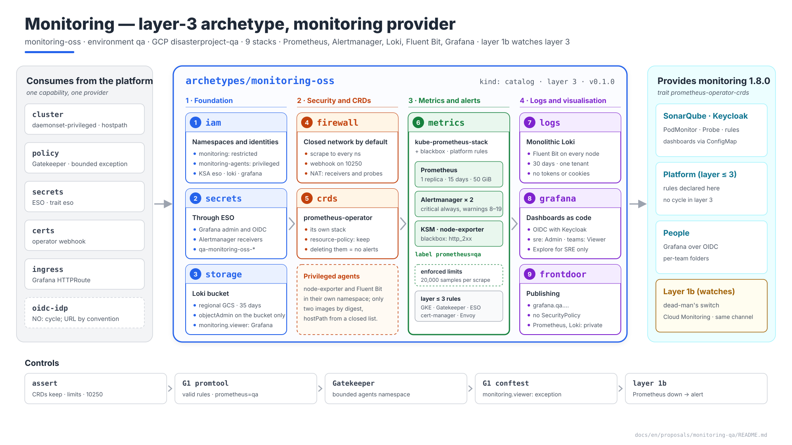

# Monitoring on `qa` — `monitoring-oss` archetype (layer 3) and layer 1b

| | |
|---|---|
| **Status** | Proposal · revision 3 |
| **Scope** | The layer 3 `monitoring-oss` archetype on `qa` (metrics, alerts, logs, dashboards, probes) and what layer 1b `cloud-monitoring-gcp` contributes alongside it: the boundary between them, stack, security, the `monitoring` contract, alert routing, who watches the watcher, network, stacks, policies, execution and plan |
| **Why now** | SonarQube (S1 §4.7, S2 §5.9), the Cloud SQL variant (§8), Keycloak (§10) and ESO (§9) already take for granted the `prometheus=qa` selector, the dashboard sidecar, the blackbox exporter, Loki and the shared notification channel. ESO also left the rules for layer 3 components here |
| **Reference specification** | `archetype-model.md` (AM §n; §3 layer 1b, §4.2 `monitoring` traits), `terramate-outputs-sharing-architecture.md` (§n), `risk-register.md` |
| **Diagrams** | `diagrams/*.mmd` (Mermaid source) and `diagrams/*.svg` (rendered). The SVG is regenerated from the `.mmd`; never hand-edited. `diagrams/06-bloques-presentacion.svg` (1920×1080, for presentations) is generated by `06-bloques-presentacion.py`, not Mermaid |
| **Local identifiers** | Decisions `DM1…`, candidate risks `RM1…`, verifications `VM1…`. Risks get an `R54+` number in `risk-register.md` if adopted, after those of the earlier proposals |

Nothing in this document reopens a `CLAUDE.md` decision or D7 of S1 (logs with Fluent Bit → Loki).



Source: [`diagrams/06-bloques-presentacion.py`](diagrams/06-bloques-presentacion.py) — presentation view; the detail is in §2–§10.

---

## 0. Context

| Question | Answer | Consequence |
|---|---|---|
| What it is | `monitoring-oss` archetype, `kind: catalog`, **layer 3**, provides **`monitoring` 1.8.0** with the `prometheus-operator-crds` trait | The `qa` binding already binds it: `monitoring: { archetype: monitoring-oss, version: 0.1.0, stack_id: gcp-qa-monitoring }` |
| Stacks | 9, `gcp-qa-monitoring-<stack>` in `stacks/platforms/gcp/qa/monitoring/` | Layer 3 lives in `stacks/platforms/` |
| Stack contents | kube-prometheus-stack (operator, Prometheus, Alertmanager, kube-state-metrics, node-exporter), blackbox exporter, Loki, Fluent Bit, Grafana | S1 §3.3, unchanged |
| Alongside it | Layer 1b `cloud-monitoring-gcp` (`gcp-qa-cloudmon`): notification channel, log-based alerts, watching Prometheus itself | §1 sets the boundary |
| Size of `qa` | One regional cluster, ~6–10 nodes, a dozen namespaces | A single Prometheus with no federation and no long-term storage (§3.2) |
| Model | Dedicated `qa` | No `capacity` budgets enforced (S1 §0) |



Source: [`diagrams/01-contexto.mmd`](diagrams/01-contexto.mmd)

---

## 1. Layer 3 and layer 1b: who does what

AM §3 puts cloud-native monitoring in **layer 1b**, in parallel with the runtime, and cluster monitoring in **layer 3**. On `qa` both exist and each signal has exactly one owner:

| Signal | Owner | Why there |
|---|---|---|
| Pod, node and application metrics; alerts on them | Layer 3 (Prometheus + Alertmanager) | That is where consumers' `PodMonitor`s and `PrometheusRule`s live |
| Application logs | Layer 3 (Fluent Bit → Loki) | S1 D7 |
| Managed service metrics (Cloud SQL) | Layer 1b, but **the alerts are created by each consumer's `data` stack** (Cloud SQL variant §8) | Native Cloud Monitoring metrics; nothing to operate |
| GCP audit logs and their alerts (secrets, authorised networks, KMS) | Layer 1b | They do not pass through the cluster; S1 §4.7 |
| **Is Prometheus alive? And Alertmanager?** | **Layer 1b** (§6) | If the alerting system goes down, it cannot report that it has gone down |
| Notification channel | Layer 1b creates and publishes it (`notification_channel_id`); Alertmanager delivers to the **same destination** | One single place where every alert arrives |
| GKE control plane and system component logs | Cloud Logging (layer 1b) | GKE collects them; there is no in-cluster alternative |

**What leaves Cloud Logging.** GKE is configured with `logging_config.enable_components = ["SYSTEM_COMPONENTS"]`: workload logs go only to Loki. Sending them to Cloud Logging as well would double the ingestion cost for no gain (S1 §3.3: "Cloud Logging reduced to audit and control plane").

**Managed Service for Prometheus disabled.** GKE Standard enables managed collection by default on new clusters **(verify in the pinned version, VM1)**. With our own Prometheus, two systems would collect the same metrics and we would pay for managed ingestion without using it. `monitoring_config.managed_prometheus.enabled = false` in `gcp-qa-gke` (§12).

---

## 2. Why `monitoring-oss` and not `monitoring-managed`

AM §4.2 describes two `monitoring` providers: `monitoring-nodeagent` and `monitoring-managed` (Managed Service for Prometheus, `managed-prometheus` trait). `qa` binds a third, and the reason is a trait:

| | `monitoring-managed` (GMP) | **`monitoring-oss`** |
|---|---|---|
| CRDs consumers create | `PodMonitoring`, `Rules` (GMP's own) | **`PodMonitor`, `PrometheusRule`, `Probe`** (prometheus-operator) |
| Satisfies `prometheus-operator-crds`? | **No** | Yes |
| Storage | Managed, 24 months | PVC, 15 days |
| Cost | Per ingested sample; grows with cardinality with no ceiling of its own | Nodes and disks, fixed |
| Alertmanager | Managed, limited configuration | Our own, full routing (§5) |
| Logs and dashboards | Separate (Cloud Logging, separate Grafana) | Loki and Grafana in the same stack |

SonarQube (S2 §3) and Keycloak (§11.1 of its proposal) require `monitoring` with `prometheus-operator-crds`: a binding to `monitoring-managed` would fail resolution, which is exactly what the trait exists for. Switching provider would first require changing the consumers' charts, and that is not worth it on `qa`.

---

## 3. The stack

### 3.1 Components

| Component | Replicas | Resources (request = memory limit) | Storage |
|---|---|---|---|
| Prometheus operator | 1 | 100m / 256 MiB | — |
| Prometheus | **1** | 1 vCPU / 4 GiB | PVC 50 GiB `hyperdisk-balanced`, `retention: 15d`, `retentionSize: 45GB` |
| Alertmanager | 2 (gossip cluster) | 50m / 128 MiB | PVC 1 GiB (silences) |
| kube-state-metrics | 1 | 100m / 256 MiB | — |
| node-exporter | 1 per node | 50m / 64 MiB | — |
| blackbox exporter | 1 | 50m / 64 MiB | — |
| Loki (monolithic) | 1 | 500m / 1 GiB | PVC 20 GiB (WAL) + GCS bucket |
| Fluent Bit | 1 per node | 100m / 128 MiB | `hostPath` for positions |
| Grafana | 1 | 100m / 256 MiB | PVC 5 GiB (SQLite) |

Initial values; revised with the data from SonarQube phase 6.

### 3.2 What is not included

| Piece | Why not |
|---|---|
| Second Prometheus replica | Doubles disk and memory to cover a restart of a few minutes. A Prometheus outage is detected by layer 1b (§6), which is what matters |
| Thanos or Mimir | Long retention and global query: `qa` needs no more than 15 days of metrics |
| Tracing (Tempo) | No application on `qa` emits traces yet; added when one does, with the `otlp-native` trait |
| Scalable Loki (separate read/write) | `qa`'s volume fits in a monolithic deployment |

### 3.3 Limits that protect Prometheus from its consumers

A `PodMonitor` exposing metrics with a high-cardinality label (a user ID, a URL with parameters) can run Prometheus out of memory, and with it every alert on `qa` (RM2).

| Limit | Value | Effect |
|---|---|---|
| `enforcedSampleLimit` | 20,000 samples per scrape | A target exceeding it is dropped entirely and `TargetScrapeSampleLimit` fires |
| `enforcedLabelLimit` / `enforcedLabelValueLengthLimit` | 30 / 200 | Absurd labels dropped |
| `enforcedTargetLimit` | 50 per `PodMonitor` | An overly broad selector does not multiply targets |
| `promtool check rules` | CI gate | A badly written rule fails in the PR, not on load (§11.2) |

---

## 4. Security

### 4.1 Two namespaces



Source: [`diagrams/04-namespaces.mmd`](diagrams/04-namespaces.mmd)

node-exporter needs `hostPID`, `hostNetwork` and the node's `/proc` and `/sys`; Fluent Bit needs to read `/var/log` and write its positions on the node. Neither fits PSS `restricted`, nor even `baseline`. Instead of relaxing the whole namespace:

| Namespace | PSS | Contents |
|---|---|---|
| `monitoring` | `restricted` | Everything else |
| `monitoring-agents` | `privileged` | node-exporter and Fluent Bit, nothing else |

Gatekeeper bounds the exception: in `monitoring-agents` only the two images are admitted, by digest, without `privileged: true`, with `hostPath` from a closed list (read-only except `/var/lib/fluent-bit`). This is the by-name exemption that S1 §4.2 requires in preference to relaxing a constraint for the whole environment. That is why the archetype requires `cluster` with the **`daemonset-privileged`** and **`hostpath`** traits, like `monitoring-nodeagent` in AM §4.2.

### 4.2 Access

| Who | What they see | How |
|---|---|---|
| People with the `sre` role | Everything: Grafana as Admin, Explore over metrics and logs | OIDC with Keycloak |
| Teams (`team-*`) | Their team's dashboards; **no Explore** | OIDC; Grafana folders per team |
| Prometheus, Alertmanager, Loki | Not published | `kubectl port-forward` (SRE) |
| Grafana to Cloud Monitoring | Project metrics, read-only | KSA `grafana` with `roles/monitoring.viewer` at project level (§11.2, justified exception) |

**Logs in a single Loki tenant** (DM4). Multi-tenant Loki per team would require Fluent Bit to label the tenant, one datasource per team and per-user headers. On `qa` the choice is a single tenant and **removing Explore from teams**: a logs panel on a team's dashboard filters by its namespaces, but nobody outside SRE queries Loki freely. The risk remains that a log contains sensitive data from another team (RM3); Fluent Bit strips the `Authorization` and `Cookie` headers and known token patterns before sending.

### 4.3 Grafana and Keycloak without an upward edge

Grafana logs in with OIDC against Keycloak, but Keycloak (layer 4) requires `monitoring` (layer 3). If `monitoring-oss` required `oidc-idp`, there would be a cycle. This is how it is avoided:

| Piece | How |
|---|---|
| Keycloak URLs | By environment convention: `https://sso.<dns_suffix>/realms/<env>`, the same that the `oidc-idp` contract publishes (Keycloak §11.3). An assert in `keycloak` checks that its hostname and realm follow the convention |
| Grafana's OIDC client | Declared by Keycloak's `realm` stack as a platform client (Keycloak §6.6) |
| Client secret | `qa-monitoring-oss-grafana-oidc`, created by this archetype's `secrets` stack with `secretAccessor` for the `keycloak-config` principal (Keycloak §6.5). The principal can be granted before the KSA exists |
| Before Keycloak exists | Grafana starts; OIDC login fails until then. Local `admin` account (`qa-monitoring-oss-grafana-admin`) as break-glass |
| Groups → roles | `groups` claim (`entra_roles` attribute, Keycloak §5.3): `sre` → Admin, `team-*` → Viewer on its folder |

The convention couples two archetypes without the resolver seeing it (RM6). That is the price of avoiding the cycle, and it is covered by the assert and by VM7.

---

## 5. Alerts



Source: [`diagrams/03-alertas.mmd`](diagrams/03-alertas.mmd)

### 5.1 Rules

| Origin | Who writes them | Examples |
|---|---|---|
| Each layer 4–5 archetype | Its `observability` stack (`PrometheusRule` with `prometheus=qa`) | SonarQube CE queue, Keycloak broker errors |
| Layer ≤ 3 components | **This archetype** (ESO §9.1): a layer 3 capability does not require `monitoring`, so its rules live here | GKE (nodes, PVCs, `OOMKilled`), Gatekeeper, cert-manager (certificates < 14 days), ESO (`ExternalSecret` not `Ready`), Envoy Gateway |
| Monitoring itself | This archetype | Targets down, `TargetScrapeSampleLimit`, Loki not ingesting, Fluent Bit retrying, Prometheus disk > 80 % |
| **Watchdog** | kube-prometheus-stack | Always firing; used to check that the chain works (§6) |

### 5.2 Alertmanager routes

| Route | Condition | Destination | Hours |
|---|---|---|---|
| Critical | `severity=critical` | SRE channel | Always. On `qa` there are few: loss of data or of access (failed backup, database down, Entra credential about to expire) |
| Warning | `severity=warning` | SRE channel | Working days 08:00–19:00; outside those hours they are grouped and delivered at the start of the next |
| Team | `team=<team>` (from the namespace label) | **Also** the team's channel | That of its severity |
| Identity | `team=identity` | Identity team | Expiry of Keycloak's credential in Entra (R42) |
| Watchdog | `alertname=Watchdog` | Null receiver | — (§6) |

**On `qa` nothing wakes anyone up.** There is no on-call. The concrete destination of each channel (SRE, teams, identity) **is not set by this proposal**: it is deployment configuration, and the design does not depend on it. The receivers' credentials (webhook URL, SMTP, depending on the destination) are Secret Manager secrets delivered by ESO (§8.2).

Inhibitions: `NodeNotReady` inhibits alerts for the pods on that node; `KubeAPIDown` inhibits those for everything that depends on the API server.

---

## 6. Who watches the watcher

If Prometheus or Alertmanager go down, no alert goes out, **not even the one that would say they have gone down** (RM1). The watching has to be outside the stack:

| Mechanism | Where | What it detects |
|---|---|---|
| **Dead-man's switch in Cloud Monitoring** | Layer 1b | Alerting policy on the system metrics GKE already collects from every container: absence of the `prometheus` or `alertmanager` containers in `monitoring` for 10 min, or repeated restarts. Notifies through the layer 1b channel, which does not go through Alertmanager **(verify the metric and the absence condition, VM4)** |
| Watchdog | Layer 3 | Goes to a null receiver today. If an external heartbeat service is contracted later, the Watchdog is sent there and also detects a Prometheus that is alive but not evaluating rules |

The dead-man's switch does not see a running Prometheus that is not evaluating rules, or an Alertmanager that cannot deliver. For `qa` this is accepted; the external heartbeat remains an improvement (DM6).

---

## 7. Logs

| Step | Design |
|---|---|
| Collection | Fluent Bit (DaemonSet in `monitoring-agents`) reads `/var/log/containers`; adds `namespace`, `pod`, `container` and the `app.kubernetes.io/*` and `archetype` labels |
| Processing | Parses JSON when the line is JSON (SonarQube, Keycloak and ESO emit it that way); strips sensitive headers and token patterns; drops probe health checks |
| Shipping | `loki` output to the `loki.monitoring:3100` Service |
| Storage | Monolithic Loki; chunks in `gs://disasterproject-qa-loki` (regional `europe-west1`, uniform access, no public access), via Workload Identity with `objectAdmin` **on that bucket only** |
| Retention | **30 days** with Loki's compactor; bucket lifecycle rule at 35 days as a safety net. No retention lock or versioning: they would prevent the compactor from deleting (same reason as S1 §4.9) |
| Labels | Only low-cardinality ones as Loki labels (`namespace`, `container`, `archetype`); the rest in the line content |

---

## 8. Contract, secrets and network

### 8.1 `monitoring` 1.8.0 contract

| Output | Value on `qa` | Use |
|---|---|---|
| `namespace` | `monitoring` | `NetworkPolicy` selectors in consumers (ingress from Prometheus) |
| `rules_selector` | `{ prometheus = "qa" }` | Mandatory label on `PodMonitor`, `ServiceMonitor`, `Probe` and `PrometheusRule` (S2 §4.1 already uses it as a global) |
| `dashboard_label` | `{ grafana_dashboard = "1" }` | Label on the dashboard `ConfigMap` that Grafana's sidecar picks up |
| `prober_url` | `blackbox-exporter.monitoring.svc:9115` | `prober` field of `Probe`s |
| `probe_modules` | `http_2xx`, `http_2xx_internal_ca` | The second trusts the internal CA, for probes against Services with internal TLS (Keycloak §10) |

All deterministic: contract outputs that consumers receive as globals. Version **1.8.0**, the same that `monitoring-managed` publishes in `demos` (AM §7): it is the contract version, not the provider's.

### 8.2 Secrets

| Secret | Consumer | Note |
|---|---|---|
| `qa-monitoring-oss-grafana-admin` | Grafana | Break-glass (§4.3) |
| `qa-monitoring-oss-grafana-oidc` | Grafana and Keycloak's reconciler | IAM for `eso-monitoring-oss` and for `keycloak-config` (ESO §9.2 explicit readers list). Grafana's platform client in the realm (Keycloak §6.6) references it with `secretRef` |
| `qa-monitoring-oss-alertmanager-receivers` | Alertmanager | Chat webhook URL and SMTP credentials, as JSON |

All through ESO with the `eso-monitoring-oss` KSA (ESO §5.2); names follow the `qa-<archetype>-` prefix that ESO §5.2 requires. **Requires `secrets` with the `eso` trait.**

### 8.3 Network



Source: [`diagrams/05-red.mmd`](diagrams/05-red.mmd)

| Source | Destination | Port | Note |
|---|---|---|---|
| GKE control plane | Operator webhook | **10250** | kube-prometheus-stack uses that port precisely because of GKE's private nodes (as ESO §7). cert-manager certificate |
| Envoy | Grafana | 3000 | The only published route |
| Prometheus | Pods in all namespaces | Metrics ports | Ingress is authorised by each consumer in its `NetworkPolicy` (S1 §4.8) |
| Prometheus | node-exporter | 9100 | Host network |
| Fluent Bit | Loki | 3100 | |
| Grafana | Prometheus, Loki | 9090, 3100 | |
| Grafana | Keycloak | 8443 | OIDC back-channel through the internal Service (Keycloak §8.3) |
| Loki, Grafana | `storage` / `monitoring.googleapis.com` via Private Google Access | 443 | |
| Alertmanager, blackbox | Internet via Cloud NAT | 443 (and 587 if SMTP) | Receivers and probes against public URLs |

---

## 9. Publishing Grafana

| Element | Value |
|---|---|
| Hostname | `grafana.qa.disasterproject.com` — claim in the ledger |
| `HTTPRoute` | The whole host to Grafana; **no `SecurityPolicy`**: Grafana does its own OIDC because it needs the identity for its roles |
| Unpublished routes | Prometheus, Alertmanager, Loki |
| Anonymous | Forbidden; no public dashboards or external snapshots |

---

## 10. The archetype

### 10.1 Manifest

```yaml
# archetypes/monitoring-oss/manifest.yaml
apiVersion: archetype/v1
kind: Archetype

metadata:
  name: monitoring-oss
  version: 0.1.0
  layer: 3
  kind: catalog
  description: kube-prometheus-stack, Loki, Fluent Bit, blackbox and Grafana; rules for the platform components
  owners: [team-platform]

runtimes: [gke, eks, aks]

requires:
  - capability: cluster
    version: "^2.0.0"
    traits: [daemonset-privileged, hostpath]        # node-exporter and Fluent Bit (§4.1)
  - capability: policy
    version: "^1.0.0"
  - capability: secrets
    version: "^2.0.0"
    traits: [eso]
  - capability: certs
    version: "^1.0.0"
    traits: [cert-manager]
  - capability: ingress
    version: ">=3.0.0 <4.0.0"
    traits: [gateway-api, http-route]
  # NOT oidc-idp: Keycloak requires monitoring; the URL comes by convention (§4.3)

provides:
  - capability: monitoring
    version: 1.8.0
    traits: [prometheus-operator-crds]
    outputs:
      - { name: namespace,       from: metrics }
      - { name: rules_selector,  from: metrics }
      - { name: dashboard_label, from: grafana }
      - { name: prober_url,      from: metrics }
      - { name: probe_modules,   from: metrics }

stacks:
  - name: iam
  - name: secrets
    after: [iam]
  - name: storage
    after: [iam]
  - name: firewall
    after: [iam]
  - name: crds
    after: [iam]
  - name: metrics
    after: [secrets, firewall, crds]
  - name: logs
    after: [storage, firewall]
  - name: grafana
    after: [secrets, metrics, logs]
  - name: frontdoor
    after: [grafana]

claims:
  - kind: hostname
    pool: "{{ environment.dns_zone }}"
    value: "grafana.{{ environment.dns_suffix }}"

capacity:
  cpu_millicores: 3000
  memory_mib: 8192
  pvc_gib: 80
  ingress_routes: 1
  workload_identities: 3                              # eso-monitoring-oss, loki→GCS, grafana→Cloud Monitoring
```

`runtimes: [gke, eks, aks]`: the stack is the same; only the Loki bucket (GCS, S3, Blob) and the identity change, as branches of the `storage` generator.

### 10.2 The stacks



Source: [`diagrams/02-stacks-arquetipo.mmd`](diagrams/02-stacks-arquetipo.mmd)

| Stack | Contents | Inputs via sharing |
|---|---|---|
| `iam` | Namespaces `monitoring` (`restricted`; labels `trust.disasterproject.com/internal-ca: "true"` and `gateway.disasterproject.com/routes: "true"` and annotation `gateway.disasterproject.com/hostnames: grafana.qa.disasterproject.com`, S2 §5.1) and `monitoring-agents` (`privileged`; `trust.disasterproject.com/internal-ca: "true"`, no routes label because it publishes none); KSAs `eso-monitoring-oss`, `loki`, `grafana` | `cluster_*` |
| `secrets` | §8.2: containers, per-secret IAM, `SecretStore` and `ExternalSecret` | `cluster_*`, `workload_identity_pool` |
| `storage` | Loki bucket, lifecycle, `objectAdmin` for `loki`; `monitoring.viewer` for `grafana` | `workload_identity_pool` |
| `firewall` | §8.3 | `cluster_*` |
| `crds` | prometheus-operator CRDs with `helm.sh/resource-policy: keep` | `cluster_*` |
| `metrics` | Operator, Prometheus, Alertmanager, kube-state-metrics, node-exporter, blackbox; platform rules (§5.1); Gatekeeper constraints for `monitoring-agents` | `cluster_*` |
| `logs` | Loki and Fluent Bit | `cluster_*` |
| `grafana` | Grafana, datasources (Prometheus, Loki, Cloud Monitoring), OIDC, per-team folders, platform dashboards | `cluster_*` |
| `frontdoor` | Grafana's `HTTPRoute` | `cluster_*` |

**CRDs in their own stack with `keep`.** Deleting the `PrometheusRule` CRD deletes every rule of every archetype, and `PodMonitor` every scrape: `qa` would be left without alerts with nothing failing (RM5). A separate stack so that an upgrade of the monitoring stack does not touch the CRDs without an explicit PR.

### 10.3 Layer 1b on `qa` (`gcp-qa-cloudmon`)

| Resource | Note |
|---|---|
| Notification channels, with the destination configured at deployment (§16) | Output `notification_channel_id` (Cloud SQL variant §8) |
| Log-based alerts | Secret reads outside the list (ESO §9.2), changes to authorised networks outside the intermediate service (S1 §4.13), destruction of KMS key versions (S1 §4.14) |
| Dead-man's switch | §6 |
| *Data Access audit logs* | Enabled for Secret Manager and Cloud KMS; not for the rest (cost) |

---

## 11. Policies

### 11.1 `assert` at generation

```hcl
assert {
  assertion = global.monitoring_values.crds.annotations["helm.sh/resource-policy"] == "keep"
  message   = "monitoring: the prometheus-operator CRDs carry resource-policy keep (RM5)"
}
assert {
  assertion = global.monitoring_values.prometheus.enforcedSampleLimit > 0
  message   = "monitoring: Prometheus without a per-scrape sample limit is exposed to the cardinality of any consumer (RM2)"
}
assert {
  assertion = global.monitoring_values.prometheusOperator.tls.internalPort == 10250
  message   = "monitoring: operator webhook on 10250; any other port needs a firewall rule towards the nodes"
}
```

### 11.2 CI and admission

| Rule | Where | What it checks |
|---|---|---|
| **New:** valid rules | G1 | `promtool check rules` over every `PrometheusRule` rendered from the PR's charts |
| **New:** selector label | G1 and Gatekeeper | Every `PodMonitor`, `ServiceMonitor`, `Probe` and `PrometheusRule` carries `prometheus=qa`; without it, Prometheus silently ignores it |
| **New:** project IAM exception | G1 | The rule "project IAM only with a resource condition" (Cloud SQL variant §10.2) admits one named exception: `roles/monitoring.viewer` for the `grafana` principal. It is read-only and does not support per-resource binding |
| **New:** agents namespace | Gatekeeper | In `monitoring-agents`, only the two images by digest, without `privileged: true`, `hostPath` from the closed list |
| Existing | — | PSS `restricted` in `monitoring`; mandatory labels; allowed registries |

---

## 12. Requirements on other archetypes

| Archetype / stack | Requirement |
|---|---|
| `gcp-qa-gke` | `logging_config.enable_components = ["SYSTEM_COMPONENTS"]`; `monitoring_config` with `SYSTEM_COMPONENTS` and **`managed_prometheus.enabled = false`** (§1) |
| `cloud-monitoring-gcp` (`gcp-qa-cloudmon`) | §10.3 |
| `keycloak` | Hostname and realm convention assert (§4.3); Grafana platform client (already in §6.6 of its proposal) |
| All consumers | `prometheus=qa` label; ingress from `monitoring` in their `NetworkPolicy`; `archetype` and `team` labels on the namespace for routing (§5.2) |

Requirements **accepted**. The `gcp-qa-gke` one is recorded in S1 §4.1 and the convention assert in the Keycloak proposal (§12.1).

---

## 13. Execution

| What | How |
|---|---|
| First deployment | Phase B of S1 §6: after `gcp-qa-secrets` and before Keycloak and any layer 4–5 archetype. Exit criterion: the Watchdog reaches the null receiver, a test alert reaches the SRE channel and the dead-man's switch fires when Prometheus is scaled to 0 |
| kube-prometheus-stack upgrade | CRDs first, in their stack; then `metrics`. Rehearsed in an ephemeral environment |
| Loss of the Prometheus PVC | Up to 15 days of metrics are lost; alerts return as soon as it starts. Accepted on `qa` |
| Loss of the Loki bucket | `prevent_destroy` on the bucket; GCS soft delete of 7 days |

---

## 14. Decisions

| # | Decision | Status | Recommendation | Alternative |
|---|---|---|---|---|
| DM1 | `monitoring` provider | Inherited from S1 §3.3 | `monitoring-oss` | `monitoring-managed` (GMP): does not satisfy `prometheus-operator-crds` |
| DM2 | Namespaces | Proposed | `monitoring` (`restricted`) + `monitoring-agents` (`privileged`, bounded) | A single `privileged` namespace |
| DM3 | Prometheus | Proposed | 1 replica, 15 days, no long-term storage | 2 replicas; Thanos |
| DM4 | Logs | Proposed | Monolithic Loki on GCS, one tenant, no Explore for teams | Multi-tenant per team |
| DM5 | Notification | Proposed | No on-call on `qa`; criticals always, warnings in working hours | On-call |
| DM6 | Watching the watcher | Proposed | Dead-man's switch in Cloud Monitoring | External Watchdog heartbeat (later improvement) |
| DM7 | Grafana ↔ Keycloak | Proposed | URL convention + assert in Keycloak; no `oidc-idp` requirement | Requirement: cycle |
| DM8 | GKE managed collection | Proposed | Disabled | Leave it: double collection and cost |
| DM9 | Protecting Prometheus | Proposed | Enforced per-scrape limits + `promtool` in CI | Trust the consumers |
| DM10 | Layer ≤ 3 rules | Inherited from ESO DE8 | In this archetype | In each layer 3 archetype: cycle |

---

## 15. Candidate risks

| # | Risk | Likelihood | Impact | Mitigation |
|---|---|---|---|---|
| RM1 | **Prometheus or Alertmanager down** and nobody notices | Medium | High — `qa` without alerts | Dead-man's switch in layer 1b (§6); VM4 |
| RM2 | **Cardinality explosion** from a consumer runs Prometheus out of memory | Medium | High | Enforced limits (§3.3); `TargetScrapeSampleLimit` alert |
| RM3 | **Logs with sensitive data visible** to other teams | Medium | Medium | No Explore for teams; redaction in Fluent Bit; VM8 |
| RM4 | **Abuse of the privileged namespace** to run something else | Low | High — node access | Gatekeeper: images by digest and closed `hostPath` |
| RM5 | **Deletion of the prometheus-operator CRDs** removes every rule and scrape | Low | High — total silence | `keep`, own stack, assert |
| RM6 | **The Grafana → Keycloak convention diverges** (different hostname or realm) | Low | Medium — Grafana without OIDC login | Assert in Keycloak; VM7 |
| RM7 | **Double collection** with GKE managed collection active | Medium by default | Low — cost | `managed_prometheus.enabled = false`; VM1 |

---

## 16. Verifications

| # | Verification | Result that closes it |
|---|---|---|
| VM1 | Managed collection disabled in the pinned GKE version | No Managed Service for Prometheus metrics billed in the project after 24 h |
| VM2 | node-exporter and Fluent Bit admitted in `monitoring-agents`; the rest in `restricted` with no exemptions | Pods admitted; an extra pod in `monitoring-agents` rejected |
| VM3 | Operator webhook on 10250 with a cert-manager certificate | `apply` of a `PrometheusRule` without timeout |
| VM4 | System metric and absence condition for the dead-man's switch | Alert in the SRE channel 10 min after scaling Prometheus to 0 |
| VM5 | `enforcedSampleLimit` with a noisy test target | Target dropped and `TargetScrapeSampleLimit` fired |
| VM6 | Loki retention | Chunks older than 30 days disappear from the bucket |
| VM7 | Grafana login with Keycloak and per-group roles | `sre` gets in as Admin; `team-x` sees only its folder and has no Explore |
| VM8 | Redaction in Fluent Bit | A line with `Authorization: Bearer …` reaches Loki without the token |
| VM9 | Alertmanager routes | Alert with `team=identity` in the identity channel; `warning` out of hours held until the morning |

**Out of scope: the notification destination.** Which mailing group, chat space or channel receives the alerts of the SRE team, each team and the identity team is not decided here. Alertmanager reads its receivers from the `qa-monitoring-oss-alertmanager-receivers` secret and layer 1b creates the Cloud Monitoring channels with whatever destination is configured at deployment; changing it changes no stack and no rule.

---

## 17. Implementation plan

| Phase | Contents | Exit criterion | Estimate |
|---|---|---|---|
| **0 · Prerequisites** | GKE with the settings in §12; ESO; notification destinations configured (§16); VM1, VM3 | Verifications closed | Depends on the platform |
| **1 · Skeleton** | Manifest, charts, asserts, CI rules and constraints | `archetypectl resolve --dry-run`, `terramate generate --check`, G1 and preview with mocks green | 2 days |
| **2 · Metrics and alerts** | `iam`, `secrets`, `firewall`, `crds`, `metrics`; layer 1b | Watchdog and test alert delivered; **VM2**, **VM4**, **VM5**, **VM9** | 3 days |
| **3 · Logs** | `storage`, `logs` | Logs from every namespace in Loki; **VM6**, **VM8** | 2 days |
| **4 · Grafana** | `grafana`, `frontdoor` | Login with local account; platform dashboards; **VM7** once Keycloak exists | 2 days |

A little over two weeks for one person. It goes in phase B, before Keycloak and SonarQube, which create their `PodMonitor`s and `PrometheusRule`s against these CRDs.
