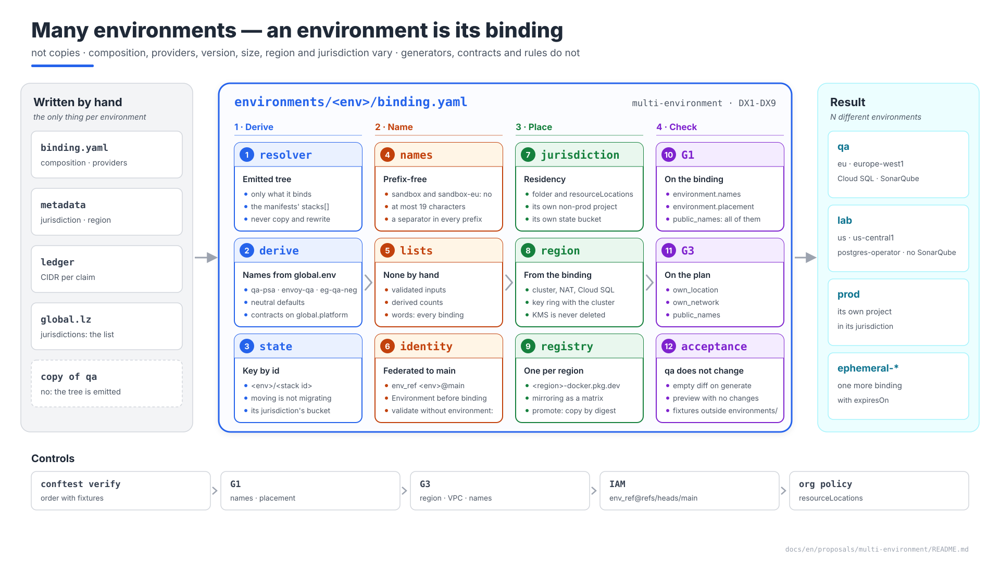

# Many environments, in different regions — an environment is its binding

| | |
|---|---|
| **Status** | Proposal · revision 2 · jurisdiction without residency, emitted tree, bounded names, no hand-kept list, state key by id, federation bound to `main` (§1, §3, §4, §7, DX8, DX9); revision 1: an environment is its binding |
| **Scope** | How the platform carries N environments that are **not copies** of each other: different composition, providers, size, region and jurisdiction. What is written by hand per environment and what is derived; what may vary and what may not; how they are named; what is regional, what belongs to the jurisdiction and what is global; what changes in the landing zone; how location is checked; and how the derivation is introduced without touching `qa` |
| **Why now** | The `qa` proposals describe one environment. The second environment, in another region and with another composition, is the one that shows whether the archetype model generalises or whether `qa` was written by hand in the shape of a template. Three things in the design only worked with one environment (§3, §6) |
| **Base** | AM §7 (binding), §9 (pools), §12 (resolution); architecture §4.11 (first deployment), §12 (environment management), §13.3–§13.4 (G1, G3); `landing-zone-qa` §2–§6; `gatekeeper-qa` P2, P12; `network-qa` DW8. What is there is not repeated |
| **Reference specification** | `archetype-model.md` (AM §n), `terramate-outputs-sharing-architecture.md` (§n), `risk-register.md` |
| **Diagrams** | `diagrams/*.mmd` (Mermaid source) and `diagrams/*.svg` (rendered). The SVG is regenerated from the `.mmd`; never hand-edited. `diagrams/02-presentation-blocks.svg` (1920×1080, for presentations) is generated by `02-presentation-blocks.py`, not Mermaid |
| **Local identifiers** | Decisions `DX1…`, candidate risks `RX1…`, verifications `VX1…` |

It reopens no decision of `CLAUDE.md`: `prod` keeps its project, the non-production environments share one — now one **per jurisdiction** —, one provider per capability and environment. It finds four things:

1. **A bug in a G1 rule.** `terramate.order` took the environment out of the stack id with `split(id, "-")[1]`. With an environment `sandbox` and another `sandbox-eu`, correctly wired, it gives two false positives (measured with conftest 0.70.1); with any `ephemeral-*`, always. The environment is never parsed out of an id (§3).
2. **Prefixes without a separator confuse environments and regions.** `sandbox-` is a prefix of `sandbox-eu-`: P12, the IAM condition of `network-qa` DW8 and the `terraform.own_network` rule would give `sandbox` the KSAs and zones of `sandbox-eu`. `europe-west1` is a prefix of `europe-west10`. Environment names are prefix-free, and every prefix comparison carries its separator (§3).
3. **A contradiction in the landing zone.** The image registry was in `europe-docker.pkg.dev`, a multi-region location that the `gcp.resourceLocations` org policy itself (`in:europe-west1-locations`) forbids; the mirror template used `europe-west1`. It becomes one regional repository per environment region (§6).
4. **Region is not enough: jurisdiction is needed.** If an environment is in another region because its data must stay in another territory, sharing a project and a state bucket with the others turns residency into a matter of care. Jurisdiction becomes an attribute of the binding, with its folder, its non-production project and its state bucket (§4).



Source: [`diagrams/01-jurisdictions.mmd`](diagrams/01-jurisdictions.mmd)



Source: [`diagrams/02-presentation-blocks.py`](diagrams/02-presentation-blocks.py) — presentation view; the detail is in §1–§7.

---

## 0. Context

| What already exists | Where | What it did not solve |
|---|---|---|
| The binding chooses archetype, version and provider per capability and environment | AM §7 | Nothing about region beyond `metadata.region`, and nothing about residency |
| The resolver computes the concrete stack set, the claims and the order, and emits `binding.tm.hcl` | AM §12 | Names that are not claims (ranges, zones, NEG, `GatewayClass`, state key) stayed written by hand in each environment's configuration |
| The landing zone discovers environments in `environments/*/binding.yaml` | `landing-zone-qa` §5, architecture §4.11 0b | A single region: keys, registry, bucket and `resourceLocations` in `europe-west1` |
| `own_network` keeps an environment's network resources on its VPC | `network-qa` DW8 | Nobody checks where regional resources are located |

---

## 1. An environment is its binding (DX1)

The only thing written by hand per environment is `environments/<env>/binding.yaml`. Everything else is output: of the resolver (`binding.tm.hcl`, ledger, `resolution.json`) or of a common derivation, `imports/platform/environment.tm.hcl`, which reads `global.env`, `global.region` and the binding.

| What | Origin | Example on `qa` |
|---|---|---|
| Composition, versions, provider of each capability, platform stack ids | Binding (`bindings.*`) | `database-platform: postgres-cloudsql` |
| Region, jurisdiction, project, tier (`prod`/`nonprod`) | Binding (`metadata`, `platform`) | `europe-west1`, `eu`, `disasterproject-nonprod` |
| CIDR ranges | Ledger, per claim (AM §9); literals in the globals, compared with the ledger in G1 (`network-qa` DW9) | `10.4.144.0/21` |
| Size, capacities, Gatekeeper mode | Binding | `max_nodes`, `capacity.*`, `policy.*` |
| Names of resources that are not claims | **Derivation**, from `global.env` | `qa-psa`, `qa-internal`, `qa-pods`, `eg-qa-neg`, `envoy-qa`, `qa-edge` |
| Zones of the region | Derivation from `global.region`, with the three-zone `assert` | `europe-west1-b`, `-c`, `-d` |
| The environment's key ring and state key | Derivation: `<env>` in the environment's region (§6) | `keyRings/qa` in `europe-west1` |
| Registries admitted by P2 | Derivation: the repositories of the environment's region (§6) | `europe-west1-docker.pkg.dev/disasterproject-lz/{apps,third-party}/` |
| Foreign prefixes for P12 | Derivation: the other bindings **of the same project** | `dev-`, `demos-`, `sandbox-` |
| Instance stack ids (`keycloak_data_stack_id`…) | The instance's `binding.tm.hcl` | `gcp-qa-keycloak-main-data` |
| Each stack's state key | Derivation: `<env>/<stack id>`, **never the stack's path** (DX8) | `qa/gcp-qa-network` |

**Different composition, different tree.** An environment only has the stacks of what it binds: a `sandbox` without `sonarqube` has no SonarQube stacks, no SAML client and no secrets for it. Two consequences for whoever writes archetypes:

- **A platform module does not know its consumers.** The Keycloak realm does not create SonarQube's client: SonarQube declares it as a tenant resource (`keycloak-qa` §6). A module that names a consumer makes that consumer mandatory in every environment.
- **The stack tree is emitted, never copied.** The resolver emits it from the binding and the manifests' `stacks[]` (AM §12, steps 9 and 17). A scaffolder that copies another environment's `stack.tm.hcl` files and rewrites `"qa"` into `"<env>"` both over- and under-matches (`qa.internal`, prefixes inside values, `ksa_prefix`) and drifts from the original with every later change (RX5).
- **A contract never carries a literal `from_stack_id`.** It reads `global.platform.*_stack_id` (AM §7, "late binding"). A G1 rule fails on `from_stack_id = "<cloud>-` in `imports/`.

**No default is a real environment's value (DX2).** A chart whose default is `gatewayClassName: envoy-qa` works on `qa` even if the generator does not pass the value, and in the second environment silently creates an `envoy-qa`. Chart and module defaults are neutral placeholders (`envoy`, `gateway`, `eg-neg`, `internal`) or do not exist; the generator always passes the derived value. A missing override shows in the first environment, not the second.

---

## 2. What may vary between environments

| Axis | Declared in | Varies per environment? | Consequence |
|---|---|---|---|
| Composition (which archetypes) | `bindings` | Yes | A different stack tree; parity is "same generators", not "same stacks" |
| Provider of each capability | `bindings.<cap>.archetype` | Yes, one per capability (`CLAUDE.md`) | `postgres-cloudsql` on `qa`, `postgres-operator` where chosen |
| Version of each archetype | `bindings.<cap>.version` | Yes | It is what lets a version be promoted between environments |
| Region | `metadata.region` | Yes, inside its jurisdiction | §4–§6 |
| Jurisdiction | `metadata.jurisdiction` | Yes | Folder, non-production project and state bucket (§4) |
| Project | `platform.project_id` | Determined by jurisdiction and tier | G1 checks it (§5) |
| Size and capacities | `cluster`, `capacity` | Yes | — |
| Node pools | `cluster.node_pools` | Their size does; **the two pools do not** | `system` and `apps` always exist (`CLAUDE.md`, `gke-qa` DN11): the generator puts layers 2b and 3 on `system`, and Keycloak (layer 4) runs on `apps`. An environment without layer-5 applications shrinks `apps`, it does not drop it |
| Exposure, Gatekeeper mode, expiry | `policy`, manifests | Yes | Architecture §13.7 |
| Naming conventions, contracts, generators, G1/G3 rules | The platform | **No** | If an environment needs another convention, it is another platform |

---

## 3. Names (DX3)

| Rule | Why | Check |
|---|---|---|
| **Environment names are prefix-free**: no `<a>-` is a prefix of `<b>-` (`sandbox` and `sandbox-eu` cannot coexist; `ephemeral-pr12` and `ephemeral-pr123` can, because `ephemeral-pr12-` is not a prefix of `ephemeral-pr123-`; there is no environment called `ephemeral`) | The `<env>-` prefix is a security boundary in the shared project: KSAs and Workload Identity (P12), DNS zones (`network-qa` DW8), resource names. An ambiguous prefix gives one environment another's resources | G1 `environment.names` over every `environments/*/binding.yaml`; an `assert` in the derivation |
| **Region is an attribute, not part of the name.** An environment in `us-central1` may be called `lab`; if the name includes the region, it is just a name | The name does not change when the region does, and rules do not infer the region from it | — |
| **The environment is never parsed out of a stack id.** It is read from `global.env` or the environment tag; to pair stacks of the same environment, compare everything before their suffix | `<cloud>-<env>-<capability>` is ambiguous as soon as `<env>` or `<capability>` contains `-` | The corrected `terramate.order` rule and its fixtures (architecture §13.3) |
| **Every prefix comparison carries its separator.** `<env>-`, `<region>-`, `managedZones/<env>-` | `europe-west1` is a prefix of `europe-west10`; `sandbox` of `sandbox-eu` | In every rule that compares prefixes |
| **Length ≤ 19 and `^[a-z][a-z0-9-]*[a-z0-9]$`** | A service account id has 6–30 characters: `tf-destroy-<env>` leaves 19 for the name, `<env>-gke-nodes` 20. A longer name passes the binding and fails in the landing zone, halfway through its `apply` | G1 `environment.names` |

**No list of environments is kept by hand (DX8).** The only list is `environments/*/`. Manual workflow inputs are a `string` validated against that directory, not a `choice` whose options must be extended at every onboarding; expected counts are derived; the words forbidden in public names are the fixed ones **plus every binding's name** (architecture §13.3–§13.4), not a list someone adds the new one to. A hand-kept list is a second source that drifts, and the word list drifts silently: a public name carrying another environment's name used to pass.

**An environment has no identity until it has its protected GitHub Environment (DX9).** GitHub creates on the fly, **with no protection rules**, an Environment that a job names and that does not exist. If the landing zone federates `tf-apply-<env>@` with `attribute.environment/<env>` before an administrator creates that Environment, anyone with write access to the repository impersonates it from a workflow on their branch. Two defences: the `apply` and `destroy` identities are bound to the Environment **and** to `refs/heads/main` in the attribute itself (`attribute.env_ref = assertion.environment + "@" + assertion.ref`, architecture §11.2), and onboarding creates the Environments before the binding merges (§4.11 0b). A workflow that receives the environment as text validates it in a job **without** `environment:` before another job names it, and never interpolates it into a script.

---

## 4. Region and jurisdiction (DX4)

A **jurisdiction** is a territory an environment's data does not leave: `eu` today; `us` or another when needed. Each binding declares it, together with its region:

```yaml
metadata:
  name: lab
  cloud: gcp
  jurisdiction: us          # folder, non-production project and state bucket
  region: us-central1       # one of the jurisdiction's regions
platform:
  project_id: disasterproject-nonprod-us
```

The landing zone describes the jurisdictions once; nothing else lists them:

```hcl
# stacks/landing-zone/config.tm.hcl — the only list of jurisdictions
globals "lz" {
  region = "europe-west1"                     # the landing zone's region: lz ring, its state, federation
  jurisdictions = {
    eu = {
      residency       = true
      regions         = ["europe-west1"]
      nonprod_project = "disasterproject-nonprod"        # the existing one: not renamed
      state_bucket    = "disasterproject-tfstate-gcp"
      state_region    = "europe-west1"
    }
    us = {
      residency       = true
      regions         = ["us-central1"]
      nonprod_project = "disasterproject-nonprod-us"
      state_bucket    = "disasterproject-tfstate-gcp-us"
      state_region    = "us-central1"
    }
  }
}
```

| Piece | Where it lives | Why |
|---|---|---|
| Subnets, Cloud Router and NAT, cluster, Cloud SQL, the environment's buckets, disks | **The environment's region** | They are the environment |
| The environment's key ring (`tofu-state`, `gke-secrets`, `cosign`) | **The environment's region**, in `disasterproject-lz` | `gke-secrets` must be in the cluster's location; a key ring has a single location, so the whole ring goes with it. **KMS key rings and keys are never deleted**: their location is decided before the first `apply`, and a mistake leaves an orphan ring forever |
| The environment's state | **Its jurisdiction's bucket**, prefix `<env>/` | State carries the environment's topology and names; it does not leave the jurisdiction |
| Non-production project | **One per jurisdiction** (and `-2` inside it when a limit is reached, `landing-zone-qa` §2) | `resourceLocations` applies per folder: a project shared across jurisdictions could only have the union |
| `prod` | Its project, in its jurisdiction's `prod` folder | As today |
| Image registry (`apps`, `third-party`, `charts`) | **One regional per distinct region** of the bindings, in `disasterproject-lz` | Pull in the same region; images are not people's data, so they need no jurisdiction, but they do need an allowed region |
| `lz` ring, the landing zone's state, federation, pipeline identities | `global.lz.region`, once | What every environment shares |
| Global load balancer, Cloud Armor, certificates, DNS zones (public and private) | Global | They have no region |
| `/8` address pool | Global, one ledger | Ranges do not overlap across jurisdictions: a future interconnect needs no renumbering |

**Folders.** `platform` (project `disasterproject-lz`, `resourceLocations` = the union of every jurisdiction's regions, because it hosts the registries and rings of all of them) and one folder per jurisdiction, `eu` and `us`, with `nonprod` and `prod` inside. `gcp.resourceLocations` is set on the jurisdiction's folder with its regions; the other policies on `nonprod` and `prod` as today (`landing-zone-qa` §3).

**A region for latency, not residency.** A region chosen for proximity or cost, not because the data must stay there, creates no jurisdiction: it goes in a jurisdiction with `residency = false`, whose `regions` may span continents, and its state may live in that jurisdiction's bucket even in another region. Its key ring may not: `gke-secrets` follows the cluster. What is not valid is the mix — a region chosen for residency with its state outside it —: either the jurisdiction has residency, with its project, bucket and ring, or it does not and says so.

**Degraded mode.** Where the org policies are not ours (an adopted project with an unrestricted `gcp.resourceLocations`), residency rests on G1 `environment.placement` and G3 `own_location` alone. It is recorded as a deployment assumption, with the date the policy was measured; it is never the default design.

---

## 5. Checking location (DX5)

`resourceLocations` prevents leaving the jurisdiction; inside it, nothing prevents a `lab` resource from landing in another region of the same one. Two rules close it:

| Rule | What it checks |
|---|---|
| G1 `environment.placement` | In each binding: `jurisdiction` exists in `global.lz.jurisdictions`; `region` is in its `regions`; `project_id` is the jurisdiction's `nonprod_project` (or a `prod` project in its folder); the name is prefix-free against every other (§3) |
| G3 `terraform.own_location` | In an environment's plan, every resource with `region`, `location` or `zone` is in the binding's region or one of its zones (`europe-west1` or `europe-west1-*`, never `europe-west10`); `global` is admitted. Architecture §13.4 |

The G3 rule runs on environment stacks; the landing zone's deliberately create resources in several regions and have their own rules (`landing-zone-qa` §11.1). Tested with conftest 0.70.1: a cluster, an upper-case bucket (`EUROPE-WEST1`), a router, a zonal instance and a `global` certificate pass; a Cloud SQL instance in another region, a multi-region `EU` bucket and a router in `europe-west10` fail.

---

## 6. The landing zone, multi-region (DX6)

| Piece | Before | Now |
|---|---|---|
| Key rings | All in `europe-west1`; `assert` "keys in europe-west1" | The environment's, in its region; `lz`, in `global.lz.region`. The `assert` checks each ring against its owner |
| State bucket | One | One per jurisdiction, in `state_region`; each identity's per-prefix condition (`landing-zone-qa` §5.1) applies on its jurisdiction's bucket |
| Non-production projects | `disasterproject-nonprod` | One per jurisdiction, from `global.lz.jurisdictions` |
| Registry | `europe-docker.pkg.dev` (multi-region, outside `resourceLocations`) | `<region>-docker.pkg.dev/disasterproject-lz/{apps,third-party,charts}`, once per distinct region of the bindings. Reader: the node SA of each environment **in that region** |
| Image mirroring | One copy to `europe-west1` | A matrix over `yq '.metadata.region' environments/*/binding.yaml \| sort -u` (`image-mirror.yml` template); the same digest in each region |
| Application image promotion | Re-tag in the registry (DG §5) | The same within a region; **across regions, a copy by digest** (`crane copy`): digest and signatures are kept, the bytes travel |
| P2 (admitted registries) | One list | The repositories of the environment's region, derived (§1) |
| `resourceLocations` | `europe-west1` on every folder | The jurisdiction's regions on its folder; the union on `platform` |
| Binary Authorization | One policy in `disasterproject-nonprod` | One per project, with one rule per cluster `<location>.<cluster>` of that project's bindings |
| P12 (foreign prefixes) | The project's environments | The same, now from the bindings with the same `project_id` |
| Audit log destination | One sink project | One log bucket per jurisdiction in that project |

Everything still comes from `environments/*/binding.yaml` and `global.lz.jurisdictions`: adding an environment in a new region of an existing jurisdiction touches nothing in the landing zone by hand; adding a jurisdiction is one entry in that map, reviewed by platform and security (`CODEOWNERS`).

---

## 7. Introducing the derivation without changing `qa` (DX7)

`qa` exists with its names written by hand. The derivation is introduced in a pull request of its own, whose acceptance criterion is that **nothing changes**:

| Step | Criterion |
|---|---|
| `imports/platform/environment.tm.hcl` with the derivations of §1; `qa`'s configuration keeps only the binding path, the ledger literals and the size | `terramate generate` leaves `git diff --exit-code` empty across `stacks/` |
| Contracts with `global.platform.*` instead of literal ids | The same; G1 fails on a `from_stack_id = "<cloud>-` in `imports/` |
| `GatewayClass` and the other values passed by the generator; neutral defaults (DX2) | The same (`envoy-qa` now comes from `"envoy-${global.env}"`) |
| `preview` of `qa` | "No changes" on every stack |
| State key by id (DX8), if `qa` is already deployed with path keys | **Outside** that pull request: a key change is a state move, one per stack (`tofu init -migrate-state`), in its own pull request with the environment quiet; afterwards, moving a directory changes no `plan` |
| Fixtures of a **second, different environment** (another jurisdiction, another composition, a name with `-`) in `policy/fixtures/` | G1 and G3 pass with it and fail with its broken variants |

**Fixtures never go in `environments/`.** The landing zone discovers environments there (§6): a test binding would create identities, a key ring and a public zone.

---

## 8. Two environments that are not copies

| | `qa` | `lab` (example) |
|---|---|---|
| Jurisdiction, region | `eu`, `europe-west1` | `us`, `us-central1` |
| Project | `disasterproject-nonprod` | `disasterproject-nonprod-us` |
| Composition | Full platform, Keycloak, SonarQube, Kafka | Platform, Keycloak; no SonarQube or Kafka |
| `database-platform` | `postgres-cloudsql` | `postgres-operator` |
| State | `gs://disasterproject-tfstate-gcp/qa/` | `gs://disasterproject-tfstate-gcp-us/lab/` |
| Key ring | `keyRings/qa`, `europe-west1` | `keyRings/lab`, `us-central1` |
| Registry | `europe-west1-docker.pkg.dev/disasterproject-lz/…` | `us-central1-docker.pkg.dev/disasterproject-lz/…` |
| P12 foreign prefixes | `dev-`, `demos-`, `sandbox-` | None (the only environment in its project) |
| Node pools | `system`, `apps` | `system`, `apps`, smaller |
| What is the same | Generators, contracts, conventions, rules | The same |

---

## 9. Risks and verifications

### 9.1 Candidate risks

| # | Risk | Likelihood | Impact | Mitigation |
|---|---|---|---|---|
| RX1 | **Environment or region names that are a prefix of others**: `sandbox` and `sandbox-eu`, `europe-west1` and `europe-west10` | Medium as soon as there are several environments | High — one environment's KSAs, DNS zones and conditioned grants reach the other's; a location rule lets another region through | Prefix-free names (G1 `environment.names`); a separator in every prefix comparison (DX3) |
| RX2 | **A rule that parses the environment out of the stack id** | Certain with names containing `-` | Medium — false positives that block, or a false negative that lets a missing edge through | It is never parsed; fixtures with a second environment and names with `-` (DX3, VX1) |
| RX3 | **A resource outside its environment's region or jurisdiction** | Medium with several regions | High — data outside its territory; cross-region latency and cost | `resourceLocations` per jurisdiction folder; G3 `own_location`; G1 `environment.placement` (DX4, DX5) |
| RX4 | **A default equal to a real environment's value**: the missing override does not show until the second environment | High without the rule | Medium — the second environment creates resources with the first one's name, or collides with them | Neutral defaults; acceptance by empty diff and fixtures of a second environment (DX2, DX7) |
| RX5 | **An environment created by copying another's stacks, or a list of environments kept by hand** | High at the second environment | Medium — copies that drift; a public name carrying another environment's name that passes; a workflow that does not offer the new environment | Tree emitted by the resolver; lists derived from `environments/` (DX1, DX8) |
| RX6 | **An environment identity federated before its protected GitHub Environment exists**, or federated without binding the branch | Medium at each onboarding | Critical — `tf-apply-<env>@` or `tf-destroy-<env>@` impersonable from any branch: GitHub creates the Environment on the fly, unprotected | `attribute.env_ref` with `@refs/heads/main`; Environments created before the binding merges; validation without `environment:` (DX9, VX7) |

### 9.2 Verifications

| # | Verification | Result that closes it |
|---|---|---|
| VX1 | Corrected `terramate.order` | `conftest verify`: two environments `sandbox`/`sandbox-eu` wired correctly pass; a missing `after` and a cross-environment `after` fail (done in the design, architecture §13.3) |
| VX2 | `own_location` | Passes and fails as in §5 (done in the design); on `qa`'s first real plan, zero false positives |
| VX3 | Introducing the derivation | Empty diff after `terramate generate` and `preview` with no changes for `qa` (§7) |
| VX4 | `resourceLocations` per folder | A test resource in a region of another jurisdiction is refused in its folder |
| VX5 | Regional registry | A node in `europe-west1` pulls from `europe-west1-docker.pkg.dev` through the private `pkg.dev` zone (`network-qa` §4); P2 refuses an image from another region's registry |
| VX6 | State key by id | Move a stack's directory and regenerate: its `plan` does not change |
| VX7 | Federation bound to `main` | A workflow on a branch with `environment: <env>` gets a token but **cannot** impersonate `tf-apply-<env>@` (`Permission 'iam.serviceAccounts.getAccessToken' denied`); from `main`, it can; a plan job without `environment:` still exchanges its token (the `has()` guard of the mapping) |

---

## 10. Changes to other documents

| Document | Change | Status |
|---|---|---|
| AM §7 | `metadata.jurisdiction`; prefix-free names; what is written by hand and what is derived | **Applied** (DX1, DX3, DX4) |
| Architecture §4.11 0b | Onboarding derives jurisdiction, region, state bucket and ring | **Applied** (DX6) |
| Architecture §12.8 (new) | Many environments, many regions | **Applied** |
| Architecture §13.3 | `terramate.order` without parsing the environment out of the id, with fixtures; G1 rules `environment.names`, `environment.placement`, contracts without literal ids | **Applied** (DX3, DX5) |
| Architecture §13.4 | G3 rule `terraform.own_location` | **Applied** (DX5) |
| `landing-zone-qa` §2, §3, §4, §6, §11.1 | Folders per jurisdiction, `resourceLocations` per folder, rings in their owner's region, one regional registry per region, state bucket per jurisdiction | **Applied** (DX4, DX6) |
| `gatekeeper-qa` P2, P12 | Registries of the environment's region; prefixes of the environments in the same project, prefix-free | **Applied** |
| `envoy-gateway-qa` | `GatewayClass` `envoy-<env>`, passed by the generator; neutral defaults | **Applied** (DX2) |
| `infra-repo-qa` (`image-mirror.yml` template) | A matrix over the bindings' regions | **Applied** (DX6) |
| Architecture §11.2 | `attribute.env_ref`; the `apply` and `destroy` identities bound to the Environment and to `main` | **Applied** (DX9) |
| Architecture §13.3–§13.4 | The words forbidden in public names include every binding's name, in G1 and in G3 | **Applied** (DX8) |
| `landing-zone-qa` §5.1, `infra-repo-qa` §4.3 | Principals `attribute.env_ref/<env>@refs/heads/main` | **Applied** (DX9) |
| `infra-repo-qa` (`first-deploy.yml`, `destroy.yml`, `ci/g1.sh` templates) | Environment as text, validated in a job without `environment:`; `environments.json` for G1 and G3 | **Applied** (DX8, DX9) |
| Risk register | R67 (RX1, RX2), R68 (RX3), R69 (RX4), R70 (RX5), R71 (RX6) | **Applied** |

---

## 11. Decisions

| # | Decision | Status | Recommendation | Alternative |
|---|---|---|---|---|
| DX1 | What an environment is | **Proposed** | Its binding; everything else derived or resolved | A directory copied from `qa` and edited: each copy diverges silently |
| DX2 | Defaults | **Proposed** | Neutral or absent; the generator always passes the value | `qa`'s defaults: they work on `qa` and fail in the second environment |
| DX3 | Names | **Proposed** | Prefix-free; region as an attribute; never parse the environment out of an id; a separator in every prefix | Validate name by name in each rule |
| DX4 | Region and jurisdiction | **Approved** | Explicit jurisdiction: folder, non-production project and state bucket per jurisdiction; the environment's ring in its region | Region only, one project and one bucket (residency rests on G3); one project per region (multiplies projects needlessly) |
| DX5 | Checking location | **Proposed** | G1 `environment.placement` and G3 `own_location`, on top of `resourceLocations` | The org policy alone, which cannot tell regions apart inside the jurisdiction |
| DX6 | Multi-region landing zone | **Proposed** | Everything derived from the bindings and `global.lz.jurisdictions`; one regional registry per region | A multi-region registry (outside `resourceLocations`) |
| DX7 | Introducing the derivation | **Proposed** | One pull request whose acceptance criterion is an empty diff and `preview` with no changes; fixtures of a second environment outside `environments/` | Derive and rename at once |
| DX8 | What derives from the list of environments | **Proposed** | No hand-kept list: workflow inputs validated against `environments/`, derived counts, public-name words with every binding; state key `<env>/<stack id>` | Lists extended at each onboarding; key by path (moving a stack moves its state) |
| DX9 | Federation of the environment identities | **Proposed** | `apply` and `destroy` bound to `attribute.env_ref/<env>@refs/heads/main`; Environments created before the binding merges | `attribute.environment/<env>` alone: depends on the Environment existing and having a branch policy |

---

## 12. Implementation plan

| Phase | Contents | Exit criterion |
|---|---|---|
| **1 · Rules** | Corrected `terramate.order`, `environment.names` (with length), `environment.placement`, `own_location`, `public_names` with every binding, `from_stack_id` guard; fixtures of the second environment; `attribute.env_ref` (**VX7**) | `conftest verify` green; each rule seen failing with its broken fixture |
| **2 · Derivation** | `imports/platform/environment.tm.hcl`; contracts with `global.platform.*`; neutral defaults | **VX3**: empty diff and `preview` with no changes for `qa` |
| **3 · Landing zone** | `global.lz.jurisdictions`; folders per jurisdiction; rings per region; regional registries; mirroring as a matrix | Landing zone `plan` with no changes for `eu` except the new regional registry; **VX4**, **VX5** |
| **4 · Second environment** | A real binding in another region or jurisdiction | Its first deployment (architecture §4.11) without editing by hand anything outside `environments/<env>/` and the ledger |

The multi-region registry is migrated in phase 3: the regional repositories are created, mirrored, P2 is changed, and the old one is retired once no pod uses it. A `prevent_destroy` on the old one until then.
