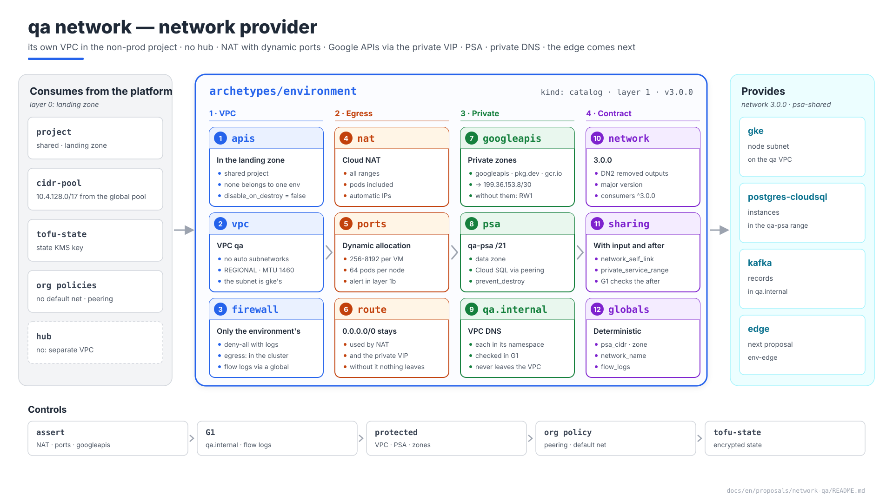

# The `qa` network — `environment` archetype (layer 1), provider of `network`

| | |
|---|---|
| **Status** | Proposal · revision 5 |
| **Scope** | The network part of the environment archetype on `qa`: project APIs, VPC, baseline firewall, Cloud NAT, private access to Google APIs, private services access (PSA), private DNS zones, the environment's address pool, the `network` contract, stacks, policies, execution and plan. The edge (`env-edge`, `gcp-qa-edge`) is the next proposal |
| **Why now** | It is the first thing applied on `qa` after the landing zone, and six proposals have left it requirements (§0.1). The GKE proposal took the node subnet away from it (DN2), so its contract changes |
| **Base** | S1 §4.14 (KMS), §4.15 (separate VPC); architecture §5.2 (network stack), §11.7 (org policies), §11.9 (network baseline); AM §8–§9 (claims and pools). What is there is not repeated |
| **Reference specification** | `archetype-model.md` (AM §n), `terramate-outputs-sharing-architecture.md` (§n), `risk-register.md` |
| **Diagrams** | `diagrams/*.mmd` (Mermaid source) and `diagrams/*.svg` (rendered). The SVG is regenerated from the `.mmd`; never hand-edited. `diagrams/06-bloques-presentacion.svg` (1920×1080, for presentations) is generated by `06-bloques-presentacion.py`, not Mermaid |
| **Local identifiers** | Decisions `DW1…`, candidate risks `RW1…`, verifications `VW1…`. Risks get an `R54+` number in `risk-register.md` if adopted, after those of the earlier proposals |

It reopens no decision of `CLAUDE.md`: it applies the separate VPC that `CLAUDE.md` already settles for `qa`. It finds a gap that affects every `NetworkPolicy` towards Google APIs (§4, RW1) and a version change owed to the DN2 correction (§8.1).

Revision 5 denies VPC egress by default with an explicit allow list (DW6), resolves the private zones' DNS permission without project-level `dns.admin` and keeps every network resource of the environment on its own VPC (DW8), ties the CIDR literals to the ledger (DW9), and makes the `assert`s and the G1 and G3 rules part of phase 1's exit criterion (§13).



Source: [`diagrams/06-bloques-presentacion.py`](diagrams/06-bloques-presentacion.py) — presentation view; the detail is in §1–§9.

---

## 0. Context

| Question | Answer | Consequence |
|---|---|---|
| What it is | Archetype `environment`, `kind: catalog`, **layer 1**, instance `qa`. Provides **`network` 3.0.0** and, in the next proposal, `env-edge` | Stack `gcp-qa-network`; `gcp-qa-edge` later. APIs belong to the project, not the environment: the landing zone enables them (§1) |
| Project | `disasterproject-nonprod`, the project **shared** by the non-production environments (`CLAUDE.md`), **created by the landing zone** with its project number, billing account, org policies and APIs | The environment has no organisation permissions and does not own the project: it creates its resources inside it, all with the `qa` prefix, and billing is split by the `environment` label — except for what takes no label (`google_compute_network`, firewall rules, routes, Cloud NAT), which is attributed by the `qa-` name prefix |
| VPC | `qa`'s own, no Shared VPC and no peering with the hub (S1 §4.15) | Nothing transits the hub; R23 does not apply |
| What it does **not** do | It creates no runtime subnets (`gke` does, DN2), nor the edge, nor the alert channel (layer 1b, `gcp-qa-cloudmon`) | Its contract carries only what every runtime shares |



Source: [`diagrams/01-contexto.mmd`](diagrams/01-contexto.mmd)

### 0.1 What the earlier proposals asked of it

| Origin | Requirement | Where it is met |
|---|---|---|
| S1 §4.15, Kafka §6.3 | Private zone `qa.internal`, bound only to the `qa` VPC | §6 |
| S1 §4.15, Keycloak, monitoring | Cloud NAT: Keycloak → Entra ID, Alertmanager and blackbox → internet | §3, and the egress allows of §2 |
| S1 §4.8, ESO, monitoring, CNPG, Cloud SQL variant | Google APIs without internet (Private Google Access) | §4 |
| Cloud SQL variant, `postgres-cloudsql` | PSA: range `qa-psa` in the `data` zone and `google_service_networking_connection`; `sqladmin` API | §5 |
| S1 §4.14 | `gcp-qa-network` is the first stack encrypted with `qa`'s `tofu-state` key | §9.3 |
| GKE DN2 | The network publishes the VPC; it creates no runtime subnets | §8 |

---

## 1. The archetype and its stacks

| Stack | Contents | Why separate |
|---|---|---|
| APIs (**in the landing zone**) | `google_project_service` for the APIs the project's environments use (§1.1), with `disable_on_destroy = false`, in the stack that creates the project | In a shared project an API belongs to no environment: if `qa`'s stack enabled it, destroying `qa` could leave `dev` without it. Enabling takes minutes; doing it when the project is created avoids retries in `network` |
| `network` | VPC, baseline firewall, Cloud Router and Cloud NAT, PSA, private DNS zones | The core; it changes little and everything consumes it |
| `edge` | Global IP, certificate, Cloud Armor, load balancer, public zone | **Next proposal** |

### 1.1 Project APIs

| API | Who needs it |
|---|---|
| `compute`, `container`, `servicenetworking`, `dns` | Network, GKE, PSA, private zones |
| `sqladmin` | `postgres-cloudsql` and its consumers |
| `secretmanager`, `iamcredentials`, `sts` | ESO, Workload Identity |
| `logging`, `monitoring` | GKE (`SYSTEM_COMPONENTS`), layer 1b |
| `certificatemanager` | Edge |
| Service agents | Forced with `google_project_service_identity` before the first cluster, so the landing zone can grant them roles on keys (landing zone §2.1). `run` and `cloudscheduler` are no longer needed: GKE's `access` stack is gone (landing zone DZ4) |
| `binaryauthorization`, `containeranalysis` | GKE DN10 |
| `cloudkms` | State and etcd encryption use landing zone keys; enabled here in case the calls count against the calling project **(verify)** |

The resolver should derive the list from the bound archetypes, so that a new archetype does not depend on someone remembering to edit it: each manifest would declare the APIs it uses in a new field (`cloud_apis`), which does not exist in the schema today **(DW1)**. Until it does, it is the table above in the project's globals, in the landing zone.

**Whatever the list's source, the plan checks it.** A read-only step of the plan job compares `gcloud services list --enabled` with the list (the plan identity holds `serviceusage.serviceUsageViewer`) and fails naming each missing API. An API nobody enabled then fails in the pull request, not thirty resources into the `apply`, and the check works the same whether the landing zone created the project or adopted it.

---

## 2. VPC and baseline firewall

| Setting | Value | Reason |
|---|---|---|
| Name | `qa` (global `network_name`); self link `projects/disasterproject-nonprod/global/networks/qa` | Deterministic |
| Mode | `auto_create_subnetworks = false` | Every subnet is a claim with an owner (AM §8.1) |
| Routing | `REGIONAL` | Everything is in `europe-west1` |
| MTU | 1460 (the default) | Changing it later requires no VMs in the VPC: set now and left alone |
| Default route | `0.0.0.0/0` to the internet gateway, **kept** | Cloud NAT and the `private.googleapis.com` VIPs need it; without it there is no egress and no Google APIs |
| `default` network | Does not exist: org policy `compute.skipDefaultNetworkCreation` in the landing zone | A `default` network with its open `allow-internal` and `allow-ssh` rules is the first leak of any new project |

**The environment's baseline firewall.** Only what belongs to the environment; each range's rules are written by whoever claims it (`CLAUDE.md`): GKE those of its nodes, Envoy Gateway those of the GLB health checks, Kafka those of its internal load balancer.

| Rule | Priority | What it does | Reason |
|---|---|---|---|
| `qa-deny-all-ingress` | 65534 | Denies all ingress, **with logs** | The same as the implied rule, but visible in the logs: a blocked health check or client appears as denied instead of as an untraceable timeout |
| `qa-deny-all-egress` | 65534 | Denies all egress, **with logs** | Defence in depth under the cluster's `NetworkPolicy`: a `hostNetwork` pod or a compromised node escapes the `NetworkPolicy`, not the VPC firewall. Logged, so a missing allow appears as a denial and not as a timeout (RW7) |
| `qa-allow-egress-https` | 1000 | tcp:443 to `0.0.0.0/0` | Everything the environment's archetypes send outside (Entra ID, alert receivers, probes) is HTTPS. Which pod may leave is still decided in the cluster (`FQDNNetworkPolicy`) |
| `qa-allow-egress-internal` | 1000 | All protocols to the environment's `/17` | Traffic inside the environment is egress too: a pod to kube-dns on another node, the nodes to the control plane's private endpoint (an address in the node subnet with PSC, `gke-qa` §2.3), a pod to Cloud SQL through the PSA range |
| `qa-allow-egress-google-apis` | 900 | tcp:443 to `199.36.153.8/30` | The private VIP (§4). Redundant while 443 is open to every destination; it keeps Google APIs working the day 443 is narrowed (§10) |
| Any other port | 1000 | One rule per entry of `global.network.egress_extra` (`{ port, protocol, owner, reason }`), declared by the archetype that needs it and reviewed | SMTP submission (587) for Alertmanager when a receiver is mail (`monitoring-qa` §8.3). The VPC rule opens the port for the nodes; the `NetworkPolicy` narrows it to the pod |
| SSH via IAP (`35.235.240.0/20` → 22) | — | **Not created** | Emergency access to nodes: opened through a temporary exception, like the pipeline's access to the control plane |

**The internal allow is the one that hurts to forget.** Without it nothing fails at `apply`: the cluster is created, and the first admission webhook times out. With `failurePolicy: Fail` that is the lock-out of `CLAUDE.md` — the webhook rejects everything, its own recovery included. A control plane outside the `/17` (a peering-based cluster's `/28`) needs its own egress allow on tcp 443 and **8132**, the konnectivity tunnel through which the control plane reaches webhooks, `logs` and `exec`; GKE writes it, because it claims the range (`gke-qa` §2.3). VW6 checks the list before Gatekeeper is installed.

**Flow logs.** Enabled by whoever creates each subnet, with the environment's values: global `flow_logs = { aggregation_interval = "INTERVAL_5_SEC", flow_sampling = 0.5, metadata = "INCLUDE_ALL_METADATA" }` and an `assert` in the subnet generators (DW6). On `qa` the only subnet is GKE's node subnet.

---

## 3. Internet egress: Cloud NAT

| Setting | Value | Reason |
|---|---|---|
| Cloud Router | `qa-router`, `europe-west1` | One per region |
| Scope | `ALL_SUBNETWORKS_ALL_IP_RANGES` | Includes the secondary ranges: pods leave with their own alias IP, and without this Keycloak does not reach Entra ID. It also covers any future subnet without touching this stack |
| IPs | `AUTO_ONLY` | S1 §0: no IP filtering on `qa`, so nobody needs a fixed egress IP. If a third party demands an IP allow-list, switch to `MANUAL_ONLY` with IPs reserved as an environment claim |
| Ports | **Dynamic allocation**: minimum 256, maximum 8192 per VM; `enable_endpoint_independent_mapping = false` (dynamic allocation requires it) | With 64 pods per node, all of a node's pods share **that VM's** ports. With the default minimum of 64 ports, a burst of connections to Entra ID or an alert receiver exhausts them and shows up as application timeouts (AM §8.2, RW2) |
| Timeouts | Defaults, except `tcp_time_wait_timeout_sec = 30` | Frees the ports of short connections sooner |
| Logs | Errors only | Translation logs for every connection are expensive and nobody reads them |

The exhausted-ports alert (`nat/dropped_sent_packets_count` with reason `OUT_OF_RESOURCES`) is declared by layer 1b (`gcp-qa-cloudmon`), not this stack: it is cloud monitoring, not cluster monitoring.

---

## 4. Google APIs without internet

**The gap.** S1 §4.8 and the ESO, monitoring, CNPG and Cloud SQL variant proposals let their pods out to Google APIs "via Private Google Access". There are two ways to write that rule, and only one works as is:

| Rule in the `NetworkPolicy` | What happens without a private DNS zone | What happens with it |
|---|---|---|
| `ipBlock` to `199.36.153.8/30` (`private.googleapis.com`) | `secretmanager.googleapis.com` resolves to a public Google IP, **outside** that /30: the policy blocks it. ESO does not sync, Loki does not write, backups fail (RW1) | Resolves to `199.36.153.8/30` and the rule allows exactly that |
| `FQDNNetworkPolicy` by name | Works, but depends on VN3 (availability on GKE Standard) and every API must be listed | Same |

**Proposal (DW2):** Cloud DNS private zones bound to the `qa` VPC that send Google APIs to the private VIP. The `ipBlock` then has a stable destination, and the traffic never goes through NAT.

| Private zone | Records |
|---|---|
| `googleapis.com.` | `private.googleapis.com.` A `199.36.153.8`–`.11`; `*.googleapis.com.` CNAME `private.googleapis.com.` |
| `pkg.dev.` | Apex `A` to the four VIPs; `*.pkg.dev.` CNAME `pkg.dev.` — Artifact Registry (`europe-west1-docker.pkg.dev`) for node pulls |
| `gcr.io.` | Apex `A` to the four VIPs; `*.gcr.io.` CNAME `gcr.io.` — GKE system images still served from there **(verify, VW1)** |

A `CNAME` cannot sit at a zone's apex, and `gcr.io` itself is a registry host (`gcr.io/<project>/<image>`), so the apex carries the `A` records and the wildcard points at the apex of its own zone. Every name in the three zones resolves to the four VIPs, and each zone resolves without depending on another.

**In the shared project**, each environment has its own zones (resources `qa-googleapis`, `qa-pkg-dev`, `qa-gcr-io`), bound only to its VPC: the same DNS name can sit in several private zones of the project as long as each is bound to a different VPC. The other side of that: a zone bound to a second VPC changes that environment's resolution — `dev`'s Google APIs answered by addresses `qa` chose. The G3 rule `terraform.own_network` rejects it (§9.1, DW8).

`restricted.googleapis.com` (VPC Service Controls) is not used: `qa` has no VPC-SC perimeter, and the restricted VIP rejects APIs that do not support it.

Nodes resolve through the metadata server, which uses the VPC's private zones; pods through kube-dns, which forwards to the same server. Both see the same answer. Private Google Access is enabled on each subnet (GKE §1.2).

---

## 5. Private services access (PSA)

| Setting | Value | Reason |
|---|---|---|
| Range | `qa-psa`, `google_compute_global_address` with `purpose = VPC_PEERING` | Deterministic name: global `psa_range_name` |
| Size | **/21** in the `data` zone: `10.4.144.0/21` if it is the zone's first claim | Cloud SQL reserves a block per region and service inside the range; a /24 runs out with a few instances on `prod` (AM §8.1, `managed_db_instances`). /21 leaves 2048 addresses and half the zone free (DW4) |
| Connection | `google_service_networking_connection` to `servicenetworking.googleapis.com` with `[qa-psa]` | One per VPC (AM §9.3) |
| Enlargement | Add another range to the same connection, without recreating it | The range is not immutable like GKE's: a connection accepts several |
| Routes | Peering exports subnet routes by default: the secondary ranges (pods) reach Cloud SQL | The Cloud SQL proxy runs in the pod **(verify, VW3)** |
| Protection | `prevent_destroy` on range and connection; `protected` tag | Deleting the connection makes every Cloud SQL instance in the environment unreachable (RW5) |

The landing zone's `compute.restrictVpcPeering` org policy must allow `projects/<servicenetworking project>/global/networks/servicenetworking`, or the connection fails on creation (RW4, VW5).

---

## 6. Private DNS: `qa.internal`

| Setting | Value |
|---|---|
| Zone | `qa-internal`, DNS `qa.internal.`, **private**, bound only to the `qa` VPC |
| Who writes records | Each archetype, only under `<its namespace>.qa.internal` (Kafka: `bootstrap.kafka.qa.internal`, `broker-<n>.kafka.qa.internal`) |
| How it is checked | New conftest rule (G1): a stack only declares `google_dns_record_set` in `qa-internal` with a name under its namespace. Gatekeeper does not see Cloud DNS, so the check is on the plan (DW7) |
| Permissions | Creating a private zone is a project-level permission, and project-level `dns.admin` would reach the other environments' public zones, which live in the same project (`landing-zone-qa` §7: DNS-01 certificates for their names). `tf-apply-qa@` gets `dns.admin` on the project **conditioned on the zone name** (`managedZones/qa-`), never unconditioned **(verify, VW7)**; DW8 has the alternative if Cloud DNS does not honour the condition. There is no per-archetype identity, so inside `qa`'s zones the limit is the G1 rule, not IAM |
| Outside the VPC | It does not resolve: neither from the hub nor from the internet. If there is ever peering with the hub, it is bound there on purpose (S1 §4.15) |
| Client certificates | Certificates for those names are issued by `internal-ca` under the `private-names` policy (cert-manager DT10) |

The public zone `tqbvzkr.disasterproject.com` (delegated from the landing zone) belongs to the edge: next proposal.

---

## 7. The environment's address pool



Source: [`diagrams/02-red.mmd`](diagrams/02-red.mmd)

| Level | What | Where it is declared |
|---|---|---|
| Global → environment | `10.4.128.0/17` from `10.4.0.0/14` (AM §9.2) | The environment binding: `network.pool` and `network.cidr` (assigned by the global ledger). The manifest's claim schema only knows the environment's zones, so this claim belongs to the binding, not the manifest |
| Zones | `infra` `10.4.128.0/20` · `data` `10.4.144.0/20` · `edge` `10.4.160.0/20` · `growth` `10.4.176.0/20` · `pods` `10.4.192.0/18` | `registry/zones.yaml`; the ledger `cmdb-data/pools/qa.json` |
| Claims on `qa` | PSA `/21` (this archetype); nodes `/24`, pods `/18`, services `/22` (GKE §1.1); Kafka's internal IP if there are VPC clients | Each archetype's manifest |

The environment **publishes** the pool (the ledger) and **claims** only the PSA in it. Everything else belongs to whoever uses it (AM §9.1).

**A CIDR written as a literal is still the ledger's.** The resolver writes ranges into the globals as literals, so that a ledger edit cannot move a live range; the price is that a literal can drift from the ledger. A range in the globals with no `active` allocation for its `(pool, owner, purpose)` is a claim nobody else sees, and the next allocation can hand it out again. A G1 rule compares the two in both directions (DW9).

---

## 8. The contract and the archetype

### 8.1 `network` 3.0.0 contract

GKE's DN2 correction already removed `subnet_self_link`, `gke_pods_range_name` and `gke_services_range_name` from the network contract (architecture §5.2). Removing outputs **breaks** whoever read them: it is a major version, not a fix. Consumers move to requiring `^3.0.0` (DW5).

| Value | How it arrives | Value on `qa` |
|---|---|---|
| `network_self_link` | Outputs sharing, from `network` | `projects/disasterproject-nonprod/global/networks/qa` |
| `private_service_range` | Outputs sharing, from `network` | `qa-psa` |
| `project_id` | Outputs sharing and global | `disasterproject-nonprod` |
| `network_name`, `psa_range_name`, `psa_cidr`, `internal_zone` | Deterministic globals | `qa`, `qa-psa`, `10.4.144.0/21`, `qa-internal` |
| `flow_logs` | Global | §2 |

`network_self_link` and `private_service_range` stay on sharing even though they are deterministic: with an `input`, G1 checks that the consumer has its `after` (R2). An `after` without an `input` is checked by nobody (Cloud SQL variant §9.3).

### 8.2 Manifest

```yaml
# archetypes/environment/manifest.yaml
apiVersion: archetype/v1
kind: Archetype

metadata:
  name: environment
  version: 3.0.0
  layer: 1
  kind: catalog
  description: An environment with its own VPC (own project in prod, shared in non-prod) — VPC, NAT, private Google APIs, PSA and private DNS
  owners: [team-platform]

requires:
  - capability: cidr-pool
    version: "^1.0.0"

provides:
  - capability: network
    version: 3.0.0
    traits: [psa-shared]
    outputs:
      - { name: network_self_link,     from: network }
      - { name: private_service_range, from: network }
      - { name: project_id,            from: network }

claims:
  - kind: cidr
    zone: data
    purpose: psa
    size: 21

stacks:
  - name: network
```

`env-edge` and the edge stacks are added by version **3.1.0** of this same archetype: the full manifest is in the `edge-qa` proposal §8.2.

---

## 9. Policies, execution, risks and verifications

### 9.1 `assert` and conftest

```hcl
assert {
  assertion = global.network.nat.enable_dynamic_port_allocation && global.network.nat.min_ports_per_vm >= 256
  message   = "network: NAT with dynamic allocation and ≥ 256 ports per VM — 64 pods share the node's ports (RW2)"
}
assert {
  assertion = global.network.nat.source_subnetwork_ip_ranges_to_nat == "ALL_SUBNETWORKS_ALL_IP_RANGES"
  message   = "network: NAT for every range — otherwise pods do not get out (§3)"
}
assert {
  assertion = contains(global.network.private_zones, "googleapis.com.")
  message   = "network: private googleapis.com zone — without it, NetworkPolicies towards 199.36.153.8/30 block Google APIs (RW1)"
}
```

| New rule (conftest) | What it checks |
|---|---|
| G1: `qa.internal` records | A stack only writes names under `<its namespace>.qa.internal` (§6) |
| G1: flow logs | Every `google_compute_subnetwork` carries the `log_config` of the `flow_logs` global (§2) |
| G1: ledger | Every CIDR in an environment's globals has an `active` ledger allocation with the same `(pool, owner, purpose)`, and every `active` allocation is in some globals (§7, DW9) |
| G1: extra egress | Each `egress_extra` entry carries `owner` and `reason`, names one port and one protocol, and none is `all` (§2) |
| G3: `terraform.own_network` | In an environment's plan, every firewall rule, subnet, router, route and PSA connection names that environment's VPC; every private zone is visible only to it; every DNS record and zone carries its prefix (§4, §6, DW8; architecture §13.4) |

### 9.2 Execution

| What | How |
|---|---|
| Bootstrap | The landing zone creates the project, grants the cross-project permissions and the `tofu-state` key (S1 §4.14) |
| First deployment | Phase A of S1 §6: project APIs (landing zone) → `network` → GKE. `postgres-cloudsql` can run in parallel with GKE as soon as the PSA exists |
| Changes | Infrequent; `plan` reviewed by the platform team (CODEOWNERS) |
| Destruction | `protected` tag, `prevent_destroy` on the VPC, the PSA range and connection, and the zones; only with the destroy identity. Destroying the network is destroying the environment |

### 9.3 Encrypted state

`gcp-qa-network` is the first `qa` stack with encrypted state, under `qa`'s own `tofu-state` key — key ring `qa`, created by the landing zone (`landing-zone-qa` §4; S1 §4.14), not the landing zone's `lz` key. No `qa` stack writes state in the clear, and the grant is per key: the `qa` identities decrypt `qa`'s state and nothing else, so even in the shared project `dev`'s state cannot be decrypted with `qa`'s key.

### 9.4 Candidate risks

| # | Risk | Likelihood | Impact | Mitigation |
|---|---|---|---|---|
| RW1 | **`NetworkPolicy` towards `199.36.153.8/30` without a private zone**: Google APIs resolve to public IPs and the policy blocks them | High without §4 | High — ESO, backups, Loki and the Cloud SQL proxy fail at once | §4 private zones; `assert`; VW1 |
| RW2 | **NAT port exhaustion**: a node's pods share its ports | Medium with defaults | Medium — intermittent timeouts towards Entra ID and receivers, hard to attribute | Dynamic allocation 256–8192; alert in layer 1b; VW2 |
| RW3 | **PSA range exhausted** | Low on `qa` | Medium — no Cloud SQL instances can be created | /21; extendable with another range on the same connection |
| RW4 | **Org policy blocks the PSA peering** | Medium on first deployment | High — no Cloud SQL at all | Allowed peerings list in the landing zone; VW5 |
| RW5 | **Deletion of the PSA connection or the VPC** | Low | Critical — every database in the environment unreachable, or the whole environment | `prevent_destroy`, `protected` tag, separate destroy identity |
| RW6 | **An archetype writes in `qa.internal` outside its namespace** | Medium | Medium — impersonation of an internal name inside the VPC; TLS with `internal-ca` detects it, a non-verifying client does not | G1 rule (§6) |
| RW7 | **Egress denied by default blocks a legitimate flow**: a port other than 443, or the internal allow missing | Medium with each new archetype | High if it is the internal allow (admission webhooks time out; with `failurePolicy: Fail`, lock-out); Medium otherwise | Logged deny rule; the §2 allow list written before the cluster; `egress_extra` per archetype; VW6 before Gatekeeper |
| RW8 | **One environment's network or DNS resource bound to another's** in the shared project: a private zone visible to `dev`'s VPC, a firewall rule or route on it, a record in its zones | Low by mistake, possible by intent | High — another environment's Google APIs or internal names answered by addresses this one chose; its traffic opened or redirected; with record write on its public zone, certificates for its names | G3 `terraform.own_network`; `dns.admin` conditioned on the zone prefix, never unconditioned (VW7); per-environment state prefix; review (DW8) |

### 9.5 Verifications

| # | Verification | Result that closes it |
|---|---|---|
| VW1 | Private zones `googleapis.com`, `pkg.dev`, `gcr.io` | From a pod: `secretmanager.googleapis.com` resolves to `199.36.153.8/30` and ESO syncs with the `NetworkPolicy` applied; nodes pull images from `europe-west1-docker.pkg.dev` and GKE's system images |
| VW2 | NAT with dynamic allocation under load | A burst of 1000 outbound connections from one node with no packets dropped for `OUT_OF_RESOURCES` |
| VW3 | PSA reachable from the pod range | The Cloud SQL proxy connects from a pod (= VC1 and VC9 of the Cloud SQL variant) |
| VW4 | `qa.internal` | Resolves from a pod and from a VM in the VPC; not from outside |
| VW5 | Peering org policy | `google_service_networking_connection` is created without error |
| VW6 | Egress allow list, **before Gatekeeper** | With egress denied, from a node and from a pod: kube-dns on another node, the control-plane endpoint, a Cloud SQL private IP, `199.36.153.8:443` and an external `:443` answer; an external `:80` and `:22` do not, and appear in the logs under `qa-deny-all-egress` |
| VW7 | `dns.admin` conditioned on the zone name | With the project-level grant conditioned on `managedZones/qa-`, `tf-apply-qa@` creates `qa-googleapis` and writes records in it, and is refused on a zone named `dev-…`. If the condition is not honoured, DW8's alternative applies |

---

## 10. `prod` and `demos`

| Setting | `qa` | `prod` | `demos` |
|---|---|---|---|
| Pool | `/17` | `/16`, PSA `/20` | `/17` |
| NAT | `AUTO_ONLY` | `MANUAL_ONLY` if a third party filters by IP | `AUTO_ONLY` |
| VPC egress | Denied by default; 443, the `/17` and the VIP allowed | Denied by default; 443 narrowed to known destinations where possible | As `qa` |
| Private Google zones | Yes | Yes | Yes |
| Peering with the hub | No | Depending on what it needs from on-premise | `CLAUDE.md` open question no. 2 |

---

## 11. Changes to other documents

| Document | Change | Status |
|---|---|---|
| Architecture §5.2 | The network contract becomes 3.0.0: a major version because of the outputs DN2 removed | **Applied** (DW5) |
| GKE (§7.2) and `postgres-cloudsql` (§7) manifests | `network` `^3.0.0` | **Applied** (DW5) |
| `qa` bindings (S1 §7 and Cloud SQL variant) | `environment` 3.0.0 | **Applied** (DW5) |
| S1 §4.8 and proposals with egress to Google APIs | The rule to `199.36.153.8/30` depends on the §4 private zones; this proposal is cited | **Applied** (DW2) |
| GKE proposal §7.3 | The `subnet` stack applies the `flow_logs` global | **Applied** (DW6) |
| Landing zone | Org policies `compute.skipDefaultNetworkCreation` and `compute.restrictVpcPeering` with `servicenetworking` allowed | **Applied** (requirement on the landing zone) |
| Architecture §11.9 | Workload egress on GKE: VPC egress denied by default, with the environment's range, 443 and the private VIP allowed | **Applied** (DW6) |
| Architecture §13.4 | G3 rule `terraform.own_network` | **Applied** (DW8) |
| `gke-qa` §2.3 | The nodes reach the control plane through the internal allow; a peering-based control plane's egress allow (443, 8132) belongs to GKE | **Applied** (DW6) |
| `monitoring-qa` §8.3 | SMTP (587) is an `egress_extra` entry | **Applied** (DW6) |
| `landing-zone-qa` §5.1, §7, §11.1 | `dns.admin` on the project only conditioned on the environment's zone prefix; the G3 rule rejects an unconditioned grant | **Applied** (DW8) |
| Risk register | R65 (RW8), R66 (RW7) | **Applied** |

---

## 12. Decisions

| # | Decision | Status | Recommendation | Alternative |
|---|---|---|---|---|
| DW1 | Stacks and APIs | **Approved**; revised for the shared project | `network` in the environment; APIs in the landing zone when the project is created; list derived from the bound archetypes | APIs in an environment stack |
| DW2 | Google APIs | **Approved** | Private zones towards `private.googleapis.com` | Public VIP with `FQDNNetworkPolicy`; `restricted.googleapis.com` with VPC-SC |
| DW3 | Cloud NAT | **Approved** | `AUTO_ONLY`, dynamic allocation 256–8192, error logs | Fixed IPs; default static ports |
| DW4 | PSA | **Approved** | `/21` in `data` | `/24` |
| DW5 | Contract version | **Approved** | `network` 3.0.0 | 2.x without the outputs, breaking silently |
| DW6 | Firewall and flow logs | **Revised** (revision 5) | Deny-all ingress **and egress** with logs at priority 65534; allows for 443, the environment's `/17` and the private VIP; any other port per archetype in `egress_extra`; flow logs via a global | Egress open in the VPC and controlled only in the cluster (revision 4): a `hostNetwork` pod or a compromised node escapes it |
| DW7 | Records in `qa.internal` | **Approved** | Each archetype under its namespace, checked in G1 | One zone per archetype |
| DW8 | Network and DNS resources in the shared project | **Proposed** | G3 `terraform.own_network`; `dns.admin` on the project conditioned on the zone prefix (VW7) | If the condition is not honoured: the landing zone creates the private zones, bound to the VPC by its deterministic URL, in a stack that runs after `gcp-<env>-network` (an upward edge, named in G1 like the NEG's) and grants `dns.admin` per zone. Never unconditioned project-level `dns.admin` |
| DW9 | CIDRs and the ledger | **Proposed** | Literals in the globals, compared with the ledger in G1 both ways | CIDRs computed from the ledger at generation (a ledger edit moves a live range) |

---

## 13. Implementation plan

| Phase | Contents | Exit criterion | Estimate |
|---|---|---|---|
| **0 · Landing zone** | Project, org policies, `tofu-state` key, `qa` identities; **VW5** | APIs enabled; `plan` of `gcp-qa-network` with encrypted state | 1 day (the landing zone's) |
| **1 · Network** | `network`; `assert`s, G1 and G3 rules; **VW7** | VPC, NAT, PSA and zones created; the three `assert`s and the G1 and G3 rules of §9.1 blocking, each shown failing on a negative case; `prevent_destroy` on the VPC, the PSA range and connection, and the zones | 1.5 days |
| **2 · With GKE** | **VW6** before Gatekeeper; **VW1**, **VW2**, **VW4** with the GKE proposal's cluster | Pods that leave via NAT and reach Google APIs through the private VIP | 0.5 days |
| **3 · With Cloud SQL** | **VW3** with the first instance | The proxy connects from a pod | 0.5 days |

Two and a half days for one person, plus the landing zone's. **A control that is in no exit criterion does not get built**: a phase closes when its resources exist, and nothing then asks for the `assert`s or the rules. That is why phase 1 names them.
