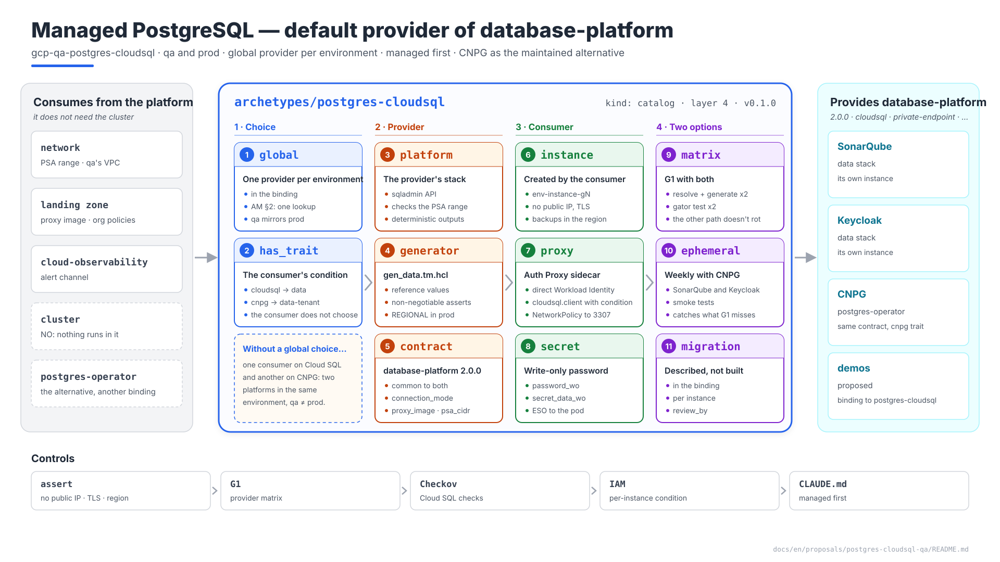

# PostgreSQL on `qa` — `postgres-cloudsql` archetype (layer 4), default provider of `database-platform`

| | |
|---|---|
| **Status** | Proposal · revision 2 |
| **Scope** | The managed `database-platform` provider: the global-provider-per-environment rule, the contract shared with CloudNativePG, what the provider supplies and what each consumer creates, the reference Cloud SQL instance, identity, network, backup, observability, the provider matrix in CI, stacks, policies, execution and plan |
| **Why now** | The strategy is agnostic with managed services first (`CLAUDE.md`): in production PostgreSQL is Cloud SQL, and `qa` mirrors production. CloudNativePG stays as a supported alternative. Until now Cloud SQL was not a provider but the "`database-platform` unbound" case (AM §5.5), and SonarQube and Keycloak had taken different paths |
| **Base** | SonarQube's Cloud SQL variant ([`../sonarqube-qa-cloudsql/`](../sonarqube-qa-cloudsql/README.md), DC §n) already settled the instance, the connection, the secrets and the backup. This document generalises them for any consumer and **does not repeat** what is there |
| **Reference specification** | `archetype-model.md` (AM §n), `terramate-outputs-sharing-architecture.md` (§n), `risk-register.md` |
| **Diagrams** | `diagrams/*.mmd` (Mermaid source) and `diagrams/*.svg` (rendered). The SVG is regenerated from the `.mmd`; never hand-edited. `diagrams/06-bloques-presentacion.svg` (1920×1080, for presentations) is generated by `06-bloques-presentacion.py`, not Mermaid |
| **Local identifiers** | Decisions `DQ1…`, candidate risks `RQ1…`, verifications `VQ1…`. Risks get an `R54+` number in `risk-register.md` if adopted, after those of the earlier proposals |

It reopens no decision of `CLAUDE.md`: it applies the three recorded with it (managed first, a global provider per environment, and two `database-platform` providers).



Source: [`diagrams/06-bloques-presentacion.py`](diagrams/06-bloques-presentacion.py) — presentation view; the detail is in §1–§8.

---

## 0. Context

| Question | Answer | Consequence |
|---|---|---|
| What it is | Archetype `postgres-cloudsql`, `kind: catalog`, **layer 4**, provides **`database-platform` 2.0.0** with the `cloudsql` trait | The `qa` binding becomes `database-platform: { archetype: postgres-cloudsql, version: 0.1.0, stack_id: gcp-qa-postgres-cloudsql }` |
| The other provider | `postgres-operator` (CloudNativePG), `cnpg` trait, same contract | Its proposal follows this one |
| Who chooses | **The environment binding**, one per environment (AM §2) | No consumer chooses a provider |
| Consumers on `qa` | SonarQube and Keycloak, each with **its own instance** | Data are never shared, with either provider |
| What it does **not** do | It runs nothing in the cluster and creates no instances: each consumer creates its own in its `data` stack | §2 |



Source: [`diagrams/01-contexto.mmd`](diagrams/01-contexto.mmd)

---

## 1. A global provider per environment

### 1.1 The rule



Source: [`diagrams/02-eleccion.mmd`](diagrams/02-eleccion.mmd)

| Piece | Design |
|---|---|
| Who chooses | The environment binding, with a `database-platform` entry like any other capability |
| What it chooses | `postgres-cloudsql` by default (managed first); `postgres-operator` if the client wants everything in the cluster |
| Resolution | Still a lookup: step 4 of AM §12 finds a single provider, and step 9 evaluates the conditions with its traits |
| Consumer | Carries **both paths** and does not choose: `data` with `has_trait(database-platform, cloudsql)` and `data-tenant` with `has_trait(database-platform, cnpg)` (AM §5.5) |
| Parity | `qa` uses the same provider as `prod`. A client that chooses CNPG chooses it in all its environments |

**No per-consumer selection (DQ1).** It would break parity (what is tested on `qa` would not be what runs on `prod`), force two platforms to be operated in one environment, and split the capacity budgets. If a consumer **needs** a specific provider, it expresses that as a constraint: it requires the `cloudsql` or `cnpg` trait, and resolution fails in the PR if the environment binds the other.

### 1.2 The migration exception (described, not built)

The only case where two providers make sense side by side is a migration from one to the other, consumer by consumer. It is described so that, if it comes, nothing is improvised:

```yaml
# NOT implemented extension of an environment's binding
bindings:
  database-platform: { archetype: postgres-operator, version: 0.1.0, stack_id: <env>-postgres-operator }
  migrations:
    database-platform:
      to: { archetype: postgres-cloudsql, version: 0.1.0, stack_id: <env>-postgres-cloudsql }
      instances: [sonarqube-main]           # those already migrated
      review_by: 2027-06-30                 # G1 fails afterwards: the migration must finish
```

The platform declares it in the binding, never the consumer; it is per instance and it expires. When it ends, the binding goes back to a single provider. It is not built until there is a real migration (DQ7).

### 1.3 `demos`

Today `demos` leaves `database-platform` unbound so that each demo gets its own managed instance (AM §5.5, §7). With this provider, `demos` bound to `postgres-cloudsql` means exactly the same, and resolution stops depending on the "unbound" case. Proposed, not applied (§10).

---

## 2. What the provider supplies and what each consumer creates



Source: [`diagrams/03-proveedor-consumidor.mmd`](diagrams/03-proveedor-consumidor.mmd)

| Piece | Who | Where |
|---|---|---|
| PSA range `qa-psa` and `google_service_networking_connection` | Environment (`gcp-qa-network`) | S1 §4.15, variant §11 |
| The `sqladmin.googleapis.com` API; a check that PSA exists | **Provider**, `platform` stack | §7.2 |
| Cloud SQL Auth Proxy image copied by digest and signed | Landing zone; the provider publishes the digest | `proxy_image` output |
| Org policies `sql.restrictPublicIp` and `sql.restrictAuthorizedNetworks` | Landing zone (above the pipeline, architecture §11.7) | — |
| Reference values for the instance (§3) and **the generator** `gen_data.tm.hcl`, GCP branch | **Provider** | The archetype version pins the generator version |
| Instance, database, user, write-only password, proxy IAM, alerts | **Each consumer**, `data` stack | Variant §3–§8 |
| The Auth Proxy sidecar in the pod | Each consumer, `app` stack | Variant §4.1 |

**Why the provider does not create the instances.** One instance per consumer, in its own stack, with its own lifecycle: destroying the application destroys its database (AM §5.1), and one's state is not in the same file as another's. It is the same split as with CNPG, where the operator is shared and each `Cluster` belongs to the consumer.

---

## 3. The reference instance

The values of variant §3 become **the generator's defaults**, and each consumer adjusts only what it declares.

| Setting | `qa` | `prod` | Why they differ |
|---|---|---|---|
| Edition | `ENTERPRISE` | `ENTERPRISE_PLUS` if the application's SLA requires it | 99.99 % and near-zero-downtime maintenance (DC2) |
| Availability | `ZONAL`, the workload's zone | `REGIONAL` | Synchronous replica in another zone |
| Network | No public IP, PSA, `ssl_mode = ENCRYPTED_ONLY` | Same | — |
| Backups | Daily, **`location` = the environment's region**, PITR 7 days, final backup 30 days | PITR per edition | Without `location` they go to the multi-region (RC6) |
| Protection | `deletion_protection` and `deletion_protection_enabled` | Same | The two protections (variant §3) |
| Name | `<env>-<instance>-g<generation>` | Same | A deleted name cannot be reused for a week (RC5) |
| Maintenance | Sunday 03:00 UTC, `stable` | Same, announced | It restarts the instance (RC2) |
| Size | Declared by the consumer (`db-custom-*`) | Same | Counts against `managed_db_instances` |

The asserts of §8.1 prevent a consumer from turning off what is non-negotiable (public IP, the backup `location`, the two protections, TLS).

---

## 4. The `database-platform` 2.0.0 contract

One contract for both providers. It goes to **2.0.0** (MAJOR): what being bound means changes, and consumers that required `^1.0.0` with the `cnpg` trait must be reviewed.

### 4.1 Provider outputs

| Output | `postgres-cloudsql` | `postgres-operator` |
|---|---|---|
| `provider` | `cloudsql` | `cnpg` |
| `connection_mode` | `proxy-sidecar` | `service` |
| `postgres_versions` | Majors Cloud SQL offers | Majors of the supported CNPG images |
| `backup_region` | The environment's region | The backup bucket's region |
| `proxy_image` | Digest of the Auth Proxy image | — |
| `psa_cidr` | CIDR of the PSA range, for the consumer's `NetworkPolicy` | — |
| `operator_version` | — | The CNPG version (the former `cnpg_version`, S2 §5.3) |
| `image_catalog` | — | Name of the `ClusterImageCatalog` (`postgres-operator-qa` proposal §2) |

All are deterministic and arrive as globals.

### 4.2 What each consumer gets from its own stack

| Value | `data` path (Cloud SQL) | `data-tenant` path (CNPG) |
|---|---|---|
| Endpoint | `127.0.0.1:5432`, through the sidecar | `<name>-rw.<namespace>.svc:5432` |
| Database | `<archetype>` | Same |
| Secret | `qa-<instance>-db` in Secret Manager; ESO materialises it | Same |
| TLS | Provided by the proxy | The `Cluster`'s certificate |

They are deterministic from the instance and the provider, so the application needs no outputs sharing to connect: its chart picks the branch by `global.database_platform.connection_mode`.

### 4.3 Traits

| Trait | `postgres-cloudsql` | `postgres-operator` |
|---|---|---|
| `cloudsql` (new) | Yes | — |
| `cnpg` | — | Yes |
| `private-endpoint` | Yes (PSA) | — |
| `iam-auth` | Yes, for human access (variant §4.3) | — |
| `multi-az` | Yes, with `REGIONAL` | Yes, with instances in several zones |

An agnostic consumer **does not require** `cloudsql` or `cnpg`: at most it requires common traits (`multi-az` in production).

---

## 5. Identity and network

Unchanged from the variant, generalised per consumer:

| Piece | Design | Reference |
|---|---|---|
| Proxy identity | The consumer's KSA through direct Workload Identity; no GCP service account unless VQ2 fails | Variant §4.2, VC1 |
| IAM | `roles/cloudsql.client` at project level with the condition `resource.name == "projects/<p>/instances/<instance>"` | Architecture §7.4 (fixed) |
| Human access | Privileged Access Manager and IAM database authentication for the SRE group | Variant §4.3 |
| `NetworkPolicy` | Pod egress to the `psa_cidr` CIDR on **3307** and to `sqladmin.googleapis.com` through Private Google Access on 443 | Variant §6 |
| Proxy image | `proxy_image` by digest: Gatekeeper rule P2 admits it | Gatekeeper §4.1 |

---

## 6. Keeping two providers: the matrix in CI



Source: [`diagrams/04-matriz.mmd`](diagrams/04-matriz.mmd)

Keeping two options has a concrete cost. The path no environment uses **breaks silently**: a change to the SonarQube chart made with Cloud SQL in mind breaks the CNPG branch, and nobody sees it until a client chooses that branch (RQ1).

| Control | Where | What it checks |
|---|---|---|
| **Resolution matrix** | G1, on every PR touching a `database-platform` consumer | `archetypectl resolve --dry-run` and `terramate generate` against a binding with each provider. Both must resolve and generate |
| **`gator test` of both paths** | G1 | The chart rendered with `connection_mode: proxy-sidecar` and with `service` passes the admission rules (Gatekeeper §6.2) |
| **CNPG ephemeral environment** | Scheduled, weekly | An ephemeral with `postgres-operator` deploys SonarQube and Keycloak and runs their smoke tests |
| **Consumer rule** | G1 | A consumer requiring `database-platform` declares both conditional stacks, or explicitly requires a provider trait |

---

## 7. The archetype

### 7.1 Manifest

```yaml
# archetypes/postgres-cloudsql/manifest.yaml
apiVersion: archetype/v1
kind: Archetype

metadata:
  name: postgres-cloudsql
  version: 0.1.0
  layer: 4
  kind: catalog
  description: Managed PostgreSQL (Cloud SQL); prerequisites and generator; each consumer creates its instance
  owners: [team-platform]

runtimes: [gke, eks, aks]

requires:
  - capability: network
    version: "^3.0.0"

provides:
  - capability: database-platform
    version: 2.0.0
    traits: [cloudsql, private-endpoint, iam-auth, multi-az]
    outputs:
      - { name: provider,          from: platform }
      - { name: connection_mode,   from: platform }
      - { name: postgres_versions, from: platform }
      - { name: backup_region,     from: platform }
      - { name: proxy_image,       from: platform }
      - { name: psa_cidr,          from: platform }

stacks:
  - name: platform

capacity:
  workload_identities: 0
```

`runtimes: [gke, eks, aks]` describes where the **consumers** run. The managed resource depends on the cloud: RDS on AWS and Flexible Server on Azure are other generator branches, which do not exist today. An assert fails `generate` if they are attempted (variant §9.3). The provider **does not require `cluster`**: it runs nothing in it.

### 7.2 The `platform` stack

| | |
|---|---|
| **Resources** | `google_project_service` `sqladmin.googleapis.com`; `data "google_compute_global_address"` for the PSA range (it fails if the environment did not create it); the outputs of §4.1 |
| **Inputs** | None via sharing: everything is deterministic from the binding |
| **Consumers** | Their `data` stack declares `after` to `gcp-qa-postgres-cloudsql-platform` and to `gcp-qa-network` |

---

## 8. Policies and observability

### 8.1 `assert` in the generator

```hcl
assert {
  assertion = !global.db.ipv4_enabled && global.db.ssl_mode == "ENCRYPTED_ONLY"
  message   = "database-platform: Cloud SQL without a public IP and TLS only"
}
assert {
  assertion = global.db.backup_location == global.platform.region
  message   = "database-platform: backups in the environment's region; without location they go to the multi-region (RC6)"
}
assert {
  assertion = global.db.deletion_protection && global.db.deletion_protection_enabled
  message   = "database-platform: both deletion protections (OpenTofu and API)"
}
assert {
  assertion = global.platform.env != "prod" || global.db.availability_type == "REGIONAL"
  message   = "database-platform: REGIONAL in production"
}
```

### 8.2 conftest and Checkov

| Rule | Where | What it checks |
|---|---|---|
| **New:** agnostic consumer | G1 | §6, consumer rule |
| **New:** provider matrix | G1 | §6 |
| Existing | G2 and G3 | Checkov's Cloud SQL checks: no public IP, TLS, backups, log flags |
| Existing | G1 | `cloudsql.client` IAM with a per-instance condition, never unconditioned (variant §10.2) |

### 8.3 Observability

The consumer's `data` stack creates the per-instance alerts in Cloud Monitoring, layer 1b (variant §8): CPU, disk, connections, replication lag on `REGIONAL`, last backup and scheduled maintenance. They go to the channel Alertmanager also uses. In Grafana, a Cloud Monitoring datasource is optional (monitoring §1).

---

## 9. Execution

| What | How |
|---|---|
| First deployment | After `gcp-qa-network` (PSA). The `platform` stack does not depend on GKE; it can be applied in phase A of S1 §6 |
| New consumer | Its `data` stack creates the instance; `after` to `platform` and to the network |
| Changing an environment's provider | It is a data migration of each consumer (dump and restore, with an outage), not a binding change. Without the exception of §1.2, it is done with the environment in maintenance |
| Destruction | The `platform` stack is only destroyed when no consumer has a live instance: an assert checks it against the ledger |

---

## 10. Changes to other documents

| Document | Change | Status |
|---|---|---|
| `CLAUDE.md` and `CLAUDE.es.md` | Managed first; a global provider per environment; two `database-platform` providers | **Applied** |
| AM §4.3, §5.5 and §14.2 (`docs/en/` and `docs/es/`) | The `cloudsql` trait; conditions by provider trait; a `database-platform` row per cloud; the paragraph that preferred operators corrected to "managed first" | **Applied** |
| `registry/traits.yaml` and the schema `enum` | The `cloudsql` trait (R34) | **Applied** |
| `qa` binding (S1 §7) | `database-platform: postgres-cloudsql` | **Applied** |
| SonarQube S1 §4.4 and D2 | The engine is decided by the global provider; on `qa`, Cloud SQL (variant); CNPG as a supported path | **Applied** |
| SonarQube S2 §3 | `database-platform ^2.0.0` with no provider trait; `data` and `data-tenant` stacks with `has_trait` | **Applied** |
| Cloud SQL variant | No longer an alternative: it is the `qa` path with the default provider. DC1 and DC8 become consequences of this proposal | **Applied** |
| Keycloak proposal | `database-platform ^2.0.0`; stacks with `has_trait`; its data assumption and DK2 point here | **Applied** |
| AM §7 (`demos`) | Bind `database-platform` to `postgres-cloudsql`, with the same semantics as today | Proposed |
| AM §10.4 | `postgres-operator` tenant resources: `Cluster` and `ScheduledBackup` instead of `Database` and `Role` | In the CNPG proposal |

---

## 11. Decisions

| # | Decision | Status | Recommendation | Alternative |
|---|---|---|---|---|
| DQ1 | Choosing the provider | **Decided** (`CLAUDE.md`) | Global per environment, in the binding | Per-consumer selection |
| DQ2 | Provider for `qa` and `prod` | **Decided** (`CLAUDE.md`) | `postgres-cloudsql` | `postgres-operator` |
| DQ3 | Maintained providers | **Decided** (`CLAUDE.md`) | Both, behind a common 2.0.0 contract | Cloud SQL only |
| DQ4 | Consumer conditions | Proposal | `has_trait(database-platform, cloudsql|cnpg)` | `!resolved` / `resolved` |
| DQ5 | Provider/consumer split | Proposal | The provider supplies prerequisites and the generator; each consumer creates its instance | Instances created by the provider |
| DQ6 | Keeping the unused path | Proposal | Resolution matrix in G1 and a weekly CNPG ephemeral | Trusting nobody breaks it |
| DQ7 | Migrating between providers | Proposal | Exception described and not built | Building it now |
| DQ8 | `demos` | Proposal | Bind to `postgres-cloudsql` | Leave it unbound |

---

## 12. Candidate risks

| # | Risk | Likelihood | Impact | Mitigation |
|---|---|---|---|---|
| RQ1 | **The unused path breaks** without anyone noticing | High without a control | High — the first CNPG client finds a broken chart | Matrix in G1; weekly ephemeral (§6) |
| RQ2 | **Behavioural differences** between providers: extensions, versions, `max_connections`, collations | Medium | Medium — an application tested on one fails on the other | `postgres_versions` in the contract; smoke tests in the CNPG ephemeral |
| RQ3 | **Per-instance cost** with many small consumers | Medium | Medium | `managed_db_instances` as a budget; minimum sizes per consumer |
| RQ4 | **Changing an environment's provider** treated as a binding change | Low | High — orphaned data or loss | §9: it is a per-consumer data migration, with a procedure |
| RQ5 | **A consumer requires a provider trait** without needing it | Medium | Low — it ties the consumer to one provider | A G1 rule asking to justify the trait |

---

## 13. Verifications

| # | Verification | Result that closes it |
|---|---|---|
| VQ1 | `has_trait` conditions in the resolver | The same consumer generates `data` with one binding and `data-tenant` with the other |
| VQ2 | Auth Proxy with a direct federated principal | = VC1 of the variant |
| VQ3 | `final_backup_config` in the OpenTofu provider version | = VC6 |
| VQ4 | `password_wo` and `secret_data_wo` in the same apply | = VC3 |
| VQ5 | Connectivity from a GKE pod to the PSA range on 3307 with the `NetworkPolicy` | Connection established; without the rule, denied |
| VQ6 | Restore by clone to a new generation | = the procedure of variant §7 |
| VQ7 | Matrix in CI with SonarQube and Keycloak | Both providers resolve and generate in the same PR |

---

## 14. Implementation plan

| Phase | Contents | Exit criterion | Estimate |
|---|---|---|---|
| **0 · Prerequisites** | PSA in `gcp-qa-network`; the proxy image in Artifact Registry; org policies | **VQ5** | 1 day |
| **1 · Provider** | Manifest, `platform` stack, `gen_data.tm.hcl` generator with the values of §3 and the asserts | `resolve` and `generate` with the `qa` binding | 1 day |
| **2 · Matrix** | A test binding with `postgres-operator`; the matrix in G1; the scheduled ephemeral | **VQ1**, **VQ7** | 2 days |
| **3 · Consumers** | SonarQube and Keycloak through the `data` path | VQ2–VQ4, VQ6 (the variant's) | With each consumer |

Four days for one person, plus verification with each consumer.
