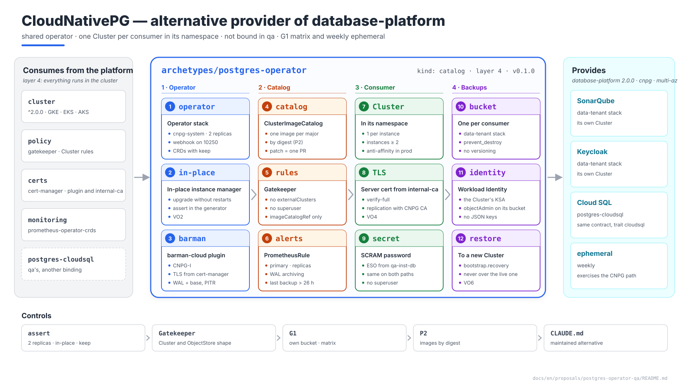

# PostgreSQL with CloudNativePG — `postgres-operator` archetype (layer 4), alternative provider of `database-platform`

| | |
|---|---|
| **Status** | Proposal · revision 2 |
| **Scope** | The CloudNativePG provider of `database-platform`: the operator and its backup plugin, what a consumer may create, the shape of a `Cluster`, images, TLS, backups, operator availability, upgrades, observability, network, contract, stacks, policies, execution and plan |
| **Why now** | It is the provider for customers who want everything in the cluster (`CLAUDE.md`: managed first, CNPG as a maintained alternative). SonarQube already designed its CNPG path (E2 §5.3) and left requirements for it (E2 §9). `qa` does **not** bind it: it is exercised by the G1 matrix and the weekly ephemeral environment (`postgres-cloudsql` proposal §6) |
| **Reference specification** | `archetype-model.md` (AM §n), `terramate-outputs-sharing-architecture.md` (§n), `risk-register.md` |
| **Diagrams** | `diagrams/*.mmd` (Mermaid source) and `diagrams/*.svg` (rendered). The SVG is regenerated from the `.mmd`; never hand-edited. `diagrams/06-bloques-presentacion.svg` (1920×1080, for presentations) is generated by `06-bloques-presentacion.py`, not Mermaid |
| **Local identifiers** | Decisions `DO1…`, candidate risks `RO1…`, verifications `VO1…`. Risks get an `R54+` number in `risk-register.md` if adopted, after those of the earlier proposals |

It reopens no decision of `CLAUDE.md`. The contract is the one in the `postgres-cloudsql` proposal (§4): this document specifies the CNPG side.



Source: [`diagrams/06-bloques-presentacion.py`](diagrams/06-bloques-presentacion.py) — presentation view; the detail is in §1–§8.

---

## 0. Context

| Question | Answer | Consequence |
|---|---|---|
| What it is | Archetype `postgres-operator`, `kind: catalog`, **layer 4**, provides **`database-platform` 2.0.0** with trait `cnpg` | Same contract as `postgres-cloudsql` |
| Where it is bound | In the environments of customers who choose CNPG. **Not in this platform's `qa` or `prod`** | Its quality is held up by the G1 matrix and the weekly ephemeral |
| Stacks | 2: `operator` and `catalog` | Operator upgrade separated from images and rules (§7.2) |
| Components | CloudNativePG operator, **barman-cloud** plugin (CNPG-I) for backups to object storage | Apache-2.0 |
| What it does **not** do | It creates no databases: each consumer creates its `Cluster` in **its own** namespace | §1 |



Source: [`diagrams/01-contexto.mmd`](diagrams/01-contexto.mmd)

---

## 1. What a consumer creates

### 1.1 In its own namespace

Unlike Kafka or Keycloak, CNPG's tenant resources do **not** live in the provider's namespace: the operator reconciles in every namespace, and each consumer creates its `Cluster` in its own. Data separated by construction: one namespace, one `Cluster`, one bucket, one identity.

| Kind | Purpose | Limit |
|---|---|---|
| `Cluster` | The consumer's PostgreSQL instance | 1 per consumer instance |
| `ObjectStore` (`barmancloud.cnpg.io`) | Destination of its backups: **its** bucket | 1 |
| `ScheduledBackup` | Daily base backup | 1 |
| `Backup` | On-demand backup before an upgrade (E2 §8.3) | No limit; purged by retention |
| `Pooler` | PgBouncer in front of the `Cluster`, if the consumer needs it | 1 |

**Correction to AM §10.4.** There the `postgres-operator` provider authorised `Database` and `Role`, the model of one logical database in a shared `Cluster`. SonarQube rejected it (E1 §4.4, option A: noisy neighbour both ways) and no consumer uses it. The row changes to the kinds in the table above, and AM §10.4 clarifies that, for an operator that reconciles in every namespace, tenant resources are created in the consumer's namespace (§11).

### 1.2 What a consumer may not do

| Forbidden | Reason | How |
|---|---|---|
| `externalClusters` pointing to another namespace or outside the cluster | A `Cluster` that bootstraps or replicates from another reads another tenant's data | Gatekeeper; only recovery from **its own** `ObjectStore` is admitted |
| `enableSuperuserAccess: true` | A superuser with a password in a `Secret` | Gatekeeper |
| Free `imageName` | Uncontrolled images | Only `imageCatalogRef` to the platform catalog (§2) |
| `barmanObjectStore` inside the `Cluster` | Legacy backup configuration, replaced by the plugin | Gatekeeper |
| Dangerous `postgresql.parameters` | `archive_command`, `shared_preload_libraries` outside the allow-list, `ssl*` | Gatekeeper, allow-list |
| Static GCS credentials in the `ObjectStore` | Long-lived JSON key | Gatekeeper: only `googleCredentials.gkeEnvironment: true` (Workload Identity) |

---

## 2. Images: a platform catalog

| Piece | Design |
|---|---|
| `ClusterImageCatalog` `postgresql` | Published by the `catalog` stack: one image per supported major version, **by digest**, copied into the landing zone's Artifact Registry (Gatekeeper rule P2) |
| The consumer | References `imageCatalogRef: { kind: ClusterImageCatalog, name: postgresql, major: <N> }`, never `imageName` |
| Patch updates | The platform changes the digest in the catalog; CNPG rolls every `Cluster` of that major, replica by replica with a switchover at the end |
| Contract output | `postgres_versions`: the catalog's majors |

So a PostgreSQL CVE is **one** platform PR, not one per consumer (DO3).

---

## 3. TLS and authentication

| Segment | Design | Reason |
|---|---|---|
| Application → `Cluster` | Server certificate from **`internal-ca`**: the consumer creates a `Certificate` for `<cluster>-rw.<namespace>.svc` and passes it in `spec.certificates.serverTLSSecret` and `serverCASecret` **(verify, VO4)** | The platform's single CA for internal TLS (cert-manager DT10); the client already trusts `internal-ca-bundle` |
| Replication between instances | Certificates managed by CNPG | Traffic internal to the `Cluster` |
| Application authentication | Password (SCRAM) from the `Secret` that ESO materialises from `qa-<instance>-db` | The same secret on both paths (`postgres-cloudsql` proposal §4.2) |
| `ssl_min_protocol_version` | `TLSv1.3` | Nothing to negotiate inside the cluster |

---

## 4. Backups



Source: [`diagrams/03-backups.mmd`](diagrams/03-backups.mmd)

| Piece | Design | Reference |
|---|---|---|
| Destination | One bucket **per consumer**, `gs://disasterproject-<env>-<instance>-pgbackup` (with the environment: the non-prod project is shared), created by the consumer's `data-tenant` stack | E2 §5.3 |
| Identity | The `Cluster`'s KSA (`serviceAccountTemplate`), with the environment prefix (`qa-<instance>-db`, R54), through direct Workload Identity; `objectAdmin` on **that** bucket | E1 §4.4 |
| Plugin | barman-cloud: daily base (`ScheduledBackup`) and continuous WAL, with PITR | — |
| Retention | 14 days in the `ObjectStore`; GCS soft delete 7 days; **no** versioning or retention lock, which break barman's purge | E1 §4.9 |
| Deleting the `Cluster` | The bucket belongs to another stack and carries `prevent_destroy`: backups outlive the `Cluster` | RO1 |
| Restore | To a **new** `Cluster` with `bootstrap.recovery` from its `ObjectStore`, never over the existing one | E1 V5 |

---

## 5. The operator

| Setting | Value | Reason |
|---|---|---|
| Namespace | `cnpg-system`, PSS `restricted` | — |
| Replicas | **2**, leader election, `PodDisruptionBudget` | A `Cluster`'s failover is decided by the operator: without the operator, a failed primary is not replaced (RO2) |
| Webhook | Port **10250** **(verify the chart option, VO1)** | Same reason as Gatekeeper, ESO and cert-manager: GKE with private nodes |
| Instance manager update | In place (`ENABLE_INSTANCE_MANAGER_INPLACE_UPDATES`) **(verify, VO2)** | Without it, **every operator upgrade restarts every database of every consumer** (RO3) |
| barman-cloud plugin | In `cnpg-system`; its TLS with the operator is issued by **cert-manager** | A plugin requirement: that is why the archetype requires `certs` |
| CRDs | `helm.sh/resource-policy: keep` | Deleting the `Cluster` CRD deletes every `Cluster`, and their PVCs with them (RO1) |

---

## 6. Observability and network

### 6.1 Alerts

This provider is layer 4 and requires `monitoring`: it declares its own rules, for **every** `Cluster`, routed to the owner by the namespace label (monitoring §5.2).

| Alert | Signal | Threshold |
|---|---|---|
| No primary or no replicas | `Cluster` status (`cnpg_collector_*`) | Any, for 5 min |
| Replica lag | `cnpg_pg_replication_lag` | > 30 s |
| WAL archiving failing | `cnpg_pg_stat_archiver_failed_count` increasing | Any: no WAL, no PITR |
| Last successful backup | Timestamp of the last backup | > 26 h (E1 §4.7) |
| Disk | PVC > 80 % | — |
| Connections | > 80 % of `max_connections` | — |
| Operator | Ready operator replicas | < 1 for 5 min |

### 6.2 Network

| Source | Destination | Port | Note |
|---|---|---|---|
| GKE control plane | Operator webhook | 10250 | §5 |
| Operator | Instances of each `Cluster` | 8000 | Instance manager status; the consumer's `NetworkPolicy` admits it (E1 §4.8) |
| Operator and plugin | Kubernetes API | 443 | |
| Operator ↔ plugin | gRPC with TLS from cert-manager | Plugin port **(verify, VO3)** | |
| Instances | `storage.googleapis.com` through Private Google Access | 443 | Backups |
| Prometheus | Instances | 9187 | |

---

## 7. The contract and the archetype

### 7.1 Outputs (`database-platform` 2.0.0 contract)

| Output | Value | Use |
|---|---|---|
| `provider` | `cnpg` | Branch of the consumer's chart |
| `connection_mode` | `service` | Endpoint `<cluster>-rw.<namespace>.svc:5432` |
| `postgres_versions` | Majors in the `ClusterImageCatalog` | The consumer picks its own |
| `backup_region` | The environment's | Bucket location |
| `operator_version` | The CNPG version pinned by the archetype | The consumer's assert on the API its chart uses (E2 §5.3). **It is a global**, not outputs sharing: the archetype version pins it, and with it E2 §5.10's mock exception disappears |
| `image_catalog` | `postgresql` | `imageCatalogRef` |

### 7.2 Manifest

```yaml
# archetypes/postgres-operator/manifest.yaml
apiVersion: archetype/v1
kind: Archetype

metadata:
  name: postgres-operator
  version: 0.1.0
  layer: 4
  kind: catalog
  description: Shared CloudNativePG; each consumer creates its own Cluster in its namespace
  owners: [team-platform]

runtimes: [gke, eks, aks]

requires:
  - capability: cluster
    version: "^2.0.0"
  - capability: policy
    version: "^1.1.0"
    traits: [gatekeeper]
  - capability: certs
    version: "^1.1.0"
    traits: [cert-manager]
  - capability: monitoring
    version: "^1.5.0"
    traits: [prometheus-operator-crds]

provides:
  - capability: database-platform
    version: 2.0.0
    traits: [cnpg, multi-az]
    outputs:
      - { name: provider,          from: catalog }
      - { name: connection_mode,   from: catalog }
      - { name: postgres_versions, from: catalog }
      - { name: backup_region,     from: catalog }
      - { name: operator_version,  from: operator }
      - { name: image_catalog,     from: catalog }
    tenant_resources:                                  # in the consumer's namespace (§1.1)
      - kind: Cluster
        namePrefix: "{{ archetype }}-"
        maxCount: 1
      - kind: ObjectStore
        namePrefix: "{{ archetype }}-"
        maxCount: 1
      - kind: ScheduledBackup
        namePrefix: "{{ archetype }}-"
        maxCount: 1
      - kind: Backup
        namePrefix: "{{ archetype }}-"
        maxCount: 20
      - kind: Pooler
        namePrefix: "{{ archetype }}-"
        maxCount: 1

stacks:
  - name: operator
  - name: catalog
    after: [operator]

capacity:
  cpu_millicores: 600
  memory_mib: 1024
  pods: 3
  workload_identities: 0
```

`runtimes: [gke, eks, aks]`: the only GCP-specific parts are the backup destination and its identity, which are branches of the `data-tenant` generator. The provider has no GCP identity: each `Cluster` uses its own.

### 7.3 The stacks

| Stack | Contents | Inputs via sharing |
|---|---|---|
| `operator` | Namespace `cnpg-system`; `helm_release` of CNPG (CRDs with `keep`, 2 replicas, webhook on 10250, in-place instance manager) and of the barman-cloud plugin with its `Certificate`; `NetworkPolicy` | `cluster_*` |
| `catalog` | `ClusterImageCatalog` `postgresql`; `ConstraintTemplate` and `Constraint` for §1.2; `PrometheusRule` for §6.1 | `cluster_*` |

**Why two stacks.** A PostgreSQL patch (a digest change in the catalog) must not re-plan the operator, and an operator upgrade must not touch the catalog or the rules.

---

## 8. Policies and execution

### 8.1 `assert`

```hcl
assert {
  assertion = global.cnpg_values.replicaCount >= 2
  message   = "database-platform: 2 operator replicas — without it there is no failover (RO2)"
}
assert {
  assertion = global.cnpg_values.config.data.ENABLE_INSTANCE_MANAGER_INPLACE_UPDATES == "true"
  message   = "database-platform: in-place instance manager — otherwise every upgrade restarts every database (RO3)"
}
assert {
  assertion = global.cnpg_values.crds.keep
  message   = "database-platform: CRDs with keep — deleting the Cluster CRD deletes the data (RO1)"
}
```

### 8.2 Gatekeeper and conftest

| Rule | Where | What it checks |
|---|---|---|
| **New:** `Cluster` shape | Gatekeeper | §1.2; `instances` ≥ 2 except in ephemerals; `imageCatalogRef` mandatory; zone anti-affinity in `prod` |
| **New:** `ObjectStore` shape | Gatekeeper | Destination `gs://…-<instance>-pgbackup`; Workload Identity only |
| **New:** own bucket | G1 | The `ObjectStore` destination is the bucket of the same instance's `data-tenant` stack |
| Existing | Gatekeeper | P2 (catalog images by digest), P4 (the `Cluster`'s memory limit) |

### 8.3 Execution

| What | How |
|---|---|
| First deployment | In an environment that binds CNPG: after Gatekeeper and cert-manager, before any consumer. On this platform, only in the weekly ephemeral |
| Operator upgrade | `operator` stack; in place, without restarting the databases (VO2); rehearsed in the ephemeral |
| PostgreSQL patch | `catalog` stack: new digest; rolling with switchover |
| PostgreSQL major | The consumer's: a new `Cluster` with import, or a declarative major upgrade if the pinned CNPG version supports it **(verify, VO5)**; always with a `Backup` first (E2 §8.3) |
| Destroying the provider | Only with no live `Cluster`: an assert checks it against the ledger |

---

## 9. Candidate risks

| # | Risk | Likelihood | Impact | Mitigation |
|---|---|---|---|---|
| RO1 | **Cascading data deletion**: the `Cluster` CRD, or a `Cluster`, is deleted and takes its PVCs with it | Low | Critical | CRDs with `keep`; backups in a bucket with `prevent_destroy`; restore to a new `Cluster` |
| RO2 | **Operator down**: no automatic failover | Medium | High | 2 replicas with a PDB; alert |
| RO3 | **Operator upgrade restarts every database** | High without the setting | High — simultaneous outage of every consumer | In-place instance manager with an assert; VO2 |
| RO4 | **A `Cluster` reads another's data** through `externalClusters` | Low with the rule | Critical | Gatekeeper (§1.2) |
| RO5 | **Unused path broken** on this platform | High without a control | High | G1 matrix and weekly ephemeral (`postgres-cloudsql` proposal §6) |

---

## 10. Verifications

| # | Verification | Result that closes it |
|---|---|---|
| VO1 | Operator webhook on 10250 in GKE with private nodes | `apply` of an invalid `Cluster` rejected by the webhook |
| VO2 | Operator upgrade with in-place instance manager | No PostgreSQL pod restarted |
| VO3 | barman-cloud plugin with TLS from cert-manager | `ScheduledBackup` complete and in the bucket (= E2's V11) |
| VO4 | Server certificate from `internal-ca` in `spec.certificates` | The client connects with `sslmode=verify-full` against `internal-ca-bundle` |
| VO5 | Declarative major upgrade on the pinned version | New major with no data loss in an ephemeral; if unsupported, the import procedure |
| VO6 | Restore to a new `Cluster` | = E1's V5 |

---

## 11. Changes to other documents

| Document | Change | Status |
|---|---|---|
| AM §10.4 (`docs/en/` and `docs/es/`) | `postgres-operator` row: `Cluster`, `ObjectStore`, `ScheduledBackup`, `Backup`, `Pooler`; note on tenant resources in the consumer's namespace | **Applied** |
| SonarQube E2 §5.3 and §5.10 | `cnpg_version` becomes `operator_version`, a global: the sharing input and the mock exception disappear. `imageName` becomes `imageCatalogRef` | **Applied** |
| SonarQube E2 §9 | The requirement on `postgres-operator` is resolved here | **Applied** |

---

## 12. Decisions

| # | Decision | Status | Recommendation | Alternative |
|---|---|---|---|---|
| DO1 | Data model | Consequence of E1 §4.4 | One `Cluster` per consumer in its namespace | `Database` and `Role` in a shared `Cluster` |
| DO2 | Backups | Proposed | barman-cloud plugin, one bucket per consumer, Workload Identity | `barmanObjectStore` in the `Cluster` |
| DO3 | Images | Proposed | Platform `ClusterImageCatalog`, by digest | `imageName` per consumer |
| DO4 | TLS | Proposed, pending VO4 | Server with `internal-ca`; replication with the CNPG CA | Everything with the CNPG CA |
| DO5 | Operator | Proposed | 2 replicas; in-place instance manager; webhook on 10250 | 1 replica; rolling every database on each upgrade |
| DO6 | `operator_version` | Proposed | Deterministic global | Outputs sharing with an exceptional mock |

---

## 13. Implementation plan

| Phase | Contents | Exit criterion | Estimate |
|---|---|---|---|
| **0 · Prerequisites** | GKE, Gatekeeper and cert-manager in an ephemeral; **VO1** | Webhook reachable | 1 day |
| **1 · Operator** | `operator` stack; **VO2**, **VO3** | Operator and plugin healthy; upgrade without restarts | 1 day |
| **2 · Catalog and rules** | `catalog` stack; rules of §8.2 | `gator test` of SonarQube's chart on the CNPG branch green | 1 day |
| **3 · Consumers** | SonarQube and Keycloak through `data-tenant` in the ephemeral; **VO4**, **VO6**; VO5 | Smoke tests green; weekly ephemeral scheduled | 2 days |

Five days for one person. Its ongoing use on this platform is the weekly ephemeral.
