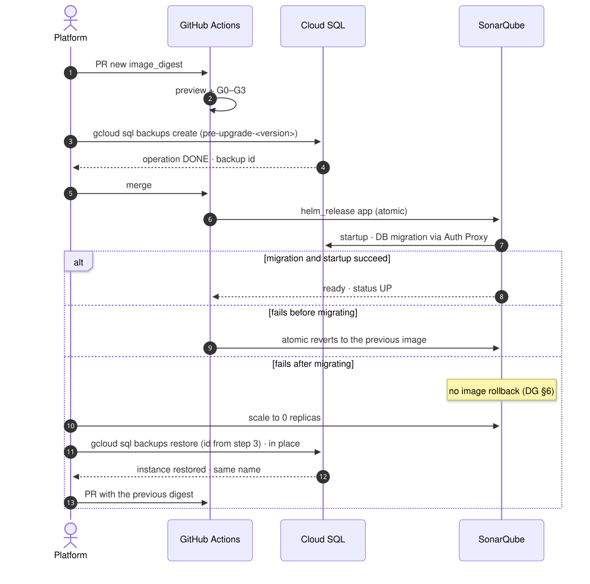

# SonarQube Community on `qa` with Cloud SQL for PostgreSQL — data variant

| | |
|---|---|
| **Status** | Proposal · revision 2 · **variant** of [`../sonarqube-qa/`](../sonarqube-qa/README.md) |
| **Scope** | Replace SonarQube's CloudNativePG `Cluster` with a dedicated **Cloud SQL for PostgreSQL** instance: model, instance, connectivity, identity, secrets, network, backup, observability, stacks, policies, execution and plan |
| **Base** | Stage 1 [`README.md`](../sonarqube-qa/README.md) (S1 §n) and stage 2 [`02-archetype-sonarqube.md`](../sonarqube-qa/02-archetype-sonarqube.md) (S2 §n). **Anything this document does not mention stays as in the base** |
| **Reference specification** | `archetype-model.md` (AM §n), `terramate-outputs-sharing-architecture.md` (§n), `developer-guide.md` (DG §n), `risk-register.md` |
| **Diagrams** | `diagrams/*.mmd` (Mermaid source) and `diagrams/*.svg` (rendered). The SVG is regenerated from the `.mmd`; never hand-edited |
| **Local identifiers** | Decisions `DC1…`, candidate risks `RC1…`, verifications `VC1…`. Candidate risks get an `R54+` number in `risk-register.md` if the variant is adopted |

Nothing in this document reopens a `CLAUDE.md` decision. It does reopen **D2** of the base (S1 §8), which chose CNPG and left Cloud SQL as the alternative "only if the OSS requirement for data is dropped". This variant is exactly that alternative, worked out; §1 states what is gained and what is lost.

---

## 0. Summary

**SonarQube's database moves from a CNPG `Cluster` inside GKE to a dedicated Cloud SQL for PostgreSQL instance in `disasterproject-qa`, with a private IP via Private Services Access (PSA) and connections through the Cloud SQL Auth Proxy as a sidecar.**

**No new mechanism is needed.** AM §5.5 already defines the case: `database-platform` is `optional`, and the archetype declares two conditional stacks — `data` (dedicated managed instance) when the capability is unbound, `data-tenant` (operator tenant) when it is bound. Which path is taken is decided by the **environment binding**, not by the archetype. Consequence: the same `sonarqube` 0.2.0 archetype serves both the base and this variant; the difference between the two proposals is one line of the `qa` binding and the implementation of the `data` stack.

| Changes | Does not change |
|---|---|
| `qa` binding: `database-platform` **unbound**, as in `demos` (AM §7) | Runtime, `sonar` node pool, sysctl, PSS `restricted` (S1 §4.1–4.2) |
| `data-tenant` stack (CNPG) → `data` stack (Cloud SQL), generator `gen_data.tm.hcl` GCP branch | SAML authentication, Keycloak as Entra ID broker (S1 §4.6) |
| SonarQube pod: **Cloud SQL Auth Proxy** sidecar; JDBC to `127.0.0.1` | Publishing, Gateway, GLB, Cloud Armor (S1 §4.5) |
| The version of secret `qa-sonarqube-db` is written by `data`, not `secrets` (§5) | Other secrets and their ESO + Secret Manager model (S1 §4.3) |
| `NetworkPolicy`: CNPG rules go, egress to the PSA range comes in (§6) | Supply chain of the custom image (S1 §4.10) — the proxy image is added |
| Backup: managed by Cloud SQL; **the `…-pgbackup` bucket disappears** (§7) | GitHub Actions integration and CE sizing (S1 §4.11–4.12) |
| PostgreSQL metrics and alerts: Cloud Monitoring instead of the CNPG exporter (§8) | Pipeline access to the control plane (S1 §4.13), KMS (S1 §4.14), separate VPC (S1 §4.15) |
| Platform phase B: **no** `gcp-qa-postgres-operator`; Keycloak also takes Cloud SQL (§2.2) | Stacks `iam`, `secrets`, `sso`, `config`, `frontdoor`, `observability` in essence |

---

## 1. What is gained and what is lost

| Aspect | CNPG (base) | Cloud SQL (this variant) |
|---|---|---|
| Operations | Operator, barman-cloud plugin, PVCs, operator and PostgreSQL upgrades owned by the platform | Managed. Patching and maintenance by Google, inside a fixed window |
| "OSS for data" requirement | Met | **Dropped for data.** The S1 §3.3 principle "everything that runs in the cluster is OSS" still holds: Cloud SQL does not run in the cluster; it joins the "what stays in GCP" list next to KMS, Secret Manager and GCS |
| Availability | 2 instances (primary + synchronous replica) in the cluster | `ZONAL`, in the zone of the `sonar` node pool (DC3). SonarQube is already zonal (R53); a regional database does not raise the availability of the whole |
| PITR window | 14 days (WAL in GCS, §12.6) | **7 days**: the maximum `transaction_log_retention_days` on Enterprise edition. 14 daily backups retained (RC7) |
| Backups and deletion | In a bucket that outlives the `Cluster` | Tied to the instance: **deleted with it** except the final backup (RC1) |
| Restore | New `Cluster` with `bootstrap.recovery` | **In-place** restore of a backup (upgrade rollback) or **clone** to a new instance (PITR) (§7) |
| PostgreSQL major upgrade | New `Cluster` and import, or declarative upgrade depending on operator version | In place, by changing `database_version` (VC10) |
| Network | Service inside the namespace | Private IP in the PSA range + Auth Proxy; egress by `ipBlock` (§6) |
| Portability | The `data-tenant` path works the same on `eks` and `aks` | The `data` path has only a GCP branch; an `eks`/`aks` binding without `database-platform` fails at `generate` until its branches exist (§9.3) |
| Cost | Consumes cluster capacity: 2 × (2 vCPU, 8 GiB) + 2 × 100 GiB of disk | Instance billed 24 × 7: vCPU, memory, SSD and backup storage beyond the disk size. **Compare with the pricing calculator before closing DC1**; no figure is given here |
| Cluster capacity | The `general` node pool needs room for 2 pods of 8 GiB | That room is freed; the proxy adds ≈ 128 MiB to the SonarQube pod |

**Recommendation.** Cloud SQL if the team prefers not to operate PostgreSQL and accepts two things: dropping the OSS requirement for data, and a 7-day PITR window in `qa`. If either is unacceptable, the base (CNPG) remains valid, and the archetype supports both without changes (§0).

---

## 2. Fit in the archetype model

### 2.1 What resolves differently

| Resolution step (AM §12) | Result in `qa` |
|---|---|
| 4 · bind capability → provider | `database-platform` has **no provider**. It is `optional`: warning, not error |
| 9 · evaluate stack conditions | `!resolved(database-platform)` is true: `data` is generated, `data-tenant` is **skipped** |
| 12 · claims | **None new.** The Cloud SQL IP comes from the PSA range, which the environment claims in zone `data`; a database inside that range is not a CIDR claim (AM §9.3) |
| 14 · capacity | `managed_db_instances: 1`. Budgets are not applied in a dedicated environment (S1 §0); it is declared so the same manifest works in a shared environment |

### 2.2 Keycloak takes the same path — by design, not by choice

The binding decides **per environment**, not per archetype: there is exactly one provider per capability and environment (AM §7). If `qa` leaves `database-platform` unbound, **every** archetype with the pair of conditional stacks takes the dedicated path. Keycloak has it (AM §5.1: *"data — its own Cloud SQL instance"*), so in `qa` Keycloak also gets its own Cloud SQL, and `gcp-qa-postgres-operator` is **not deployed**: no consumer remains.

Mixing — Cloud SQL for SonarQube and CNPG for Keycloak — is not possible with the binding mechanism, and that is deliberate: the decision is about the environment's data isolation, not each application's (AM §5.5). Keycloak's details belong to its own proposal; here only the consequence is recorded (DC8).

### 2.3 Layers and deployment order



Source: [`diagrams/01-capas-dependencias.mmd`](diagrams/01-capas-dependencias.mmd)



Source: [`diagrams/02-orden-despliegue.mmd`](diagrams/02-orden-despliegue.mmd)

| Phase (S1 §6) | Change |
|---|---|
| **A** | `gcp-qa-network` configures PSA: range `qa-psa` in zone `data` and `google_service_networking_connection`. `gcp-qa-cloudmon` publishes `notification_channel_id` |
| **B** | `gcp-qa-postgres-operator` goes. `gcp-qa-keycloak` creates its own Cloud SQL |
| **C** | `data-tenant` → `data`. Same 9 stacks |

---

## 3. The Cloud SQL instance

| Setting | Value | Reason |
|---|---|---|
| Name | `qa-sonarqube-main-g<generation>`, starting at `g1` | **The name of a deleted instance cannot be reused for a week.** The generation suffix allows restoring by clone (§7) without hitting that rule (RC5) |
| Connection name | `disasterproject-qa:europe-west1:qa-sonarqube-main-g1` | Deterministic: a **global**, not outputs sharing (platform-overview §4) |
| Edition | `ENTERPRISE` | Enterprise Plus (99.99 %, near-zero-downtime maintenance, PITR up to 35 days) is not justified in `qa` (DC2) |
| Version | `POSTGRES_<major>`: the highest supported by the pinned SonarQube version **(verify against SonarQube's matrix)** | As with the CNPG image in S2 §5.3 |
| Tier | `db-custom-2-8192` (2 vCPU, 8 GB) | The same per-instance size as the base (S1 §4.12) |
| Availability | `ZONAL`, `location_preference.zone` = zone of the `sonar` node pool | DC3. Same zone: minimal latency and no new failure mode |
| Disk | SSD, 100 GB, `disk_autoresize = true`, `disk_autoresize_limit = 500` | The disk grows on its own but **never shrinks**; the limit stops a write loop from taking it to the product maximum |
| Network | `ipv4_enabled = false`, `private_network` = `qa` VPC, `allocated_ip_range = "qa-psa"` | No public IP. Plus org policy `constraints/sql.restrictPublicIp` on the project (architecture §7.4) |
| TLS | `ssl_mode = "ENCRYPTED_ONLY"` | Rejects unencrypted direct connections; the proxy always encrypts |
| Flags | `max_connections = 200`; `cloudsql.iam_authentication = on` | Connections as in the base. IAM auth only for just-in-time human access (§4.3), not for the application |
| Backups | Daily at 02:00 UTC, **`location = "europe-west1"`**, 14 retained | **Without `location`, Cloud SQL stores backups in the nearest multi-region (`eu`)**, which collides with region confinement (RC6) |
| PITR | `point_in_time_recovery_enabled = true`, `transaction_log_retention_days = 7` | Maximum on Enterprise (RC7) |
| Final backup | `final_backup_config { enabled = true, retention_days = 30 }` **(verify in the provider version, VC6)** | Without it, deleting the instance deletes all its backups (RC1) |
| Maintenance | Sunday 03:00 UTC, `update_track = "stable"` | Maintenance restarts the instance; outside working hours (RC2) |
| Protection | `deletion_protection = true` **and** `settings.deletion_protection_enabled = true` | Two different protections: the first is OpenTofu-only; the second is API-level and also protects against the console and `gcloud` |
| Query Insights | Enabled | Slow-query diagnosis at no cost on Enterprise |
| `postgres` user | No password set; nobody uses it | Human administrative access is via IAM, just-in-time (§4.3) |

---

## 4. Connectivity and identity



Source: [`diagrams/04-conexion-cloudsql.mmd`](diagrams/04-conexion-cloudsql.mmd)

### 4.1 How SonarQube connects

| Option | How | Verdict |
|---|---|---|
| A. Direct private IP | JDBC to the instance IP with `sslmode=verify-ca` and the server CA in a `ConfigMap` | No: the only barrier besides the network is the password; the server CA rotates and must be tracked |
| **B. Cloud SQL Auth Proxy as a sidecar** | The proxy opens `127.0.0.1:5432`; SonarQube connects there without TLS; the proxy encrypts towards the instance with an ephemeral certificate | **Yes** (DC4): IAM authorisation on top of the password, TLS with no certificate management, transparent rotation |
| C. Cloud SQL Java Connector | *Socket factory* in the JDBC URL | No: requires adding the jar to SonarQube's classpath in the image, outside `extensions/plugins`; fragile on every upgrade |

The proxy runs as a **native sidecar** (`initContainers` with `restartPolicy: Always`, Kubernetes ≥ 1.29): it starts before SonarQube, so the first connection does not fail, and stops after it, so connections are not cut during shutdown.

```yaml
# archetype chart values, part of the app stack (exact keys: verify, VC4)
sonarqube:
  initContainers:                      # or extraInitContainers, depending on the chart version
    - name: cloud-sql-proxy
      image: europe-docker.pkg.dev/disasterproject-lz/platform/cloud-sql-proxy@sha256:<digest>
      restartPolicy: Always            # native sidecar
      args:
        - --private-ip
        - --port=5432
        - --structured-logs
        - --health-check
        - --http-address=0.0.0.0
        - --prometheus
        - --max-sigterm-delay=30s
        - disasterproject-qa:europe-west1:qa-sonarqube-main-g1
      startupProbe: { httpGet: { path: /startup, port: 9090 }, periodSeconds: 1, failureThreshold: 30 }
      resources:
        requests: { cpu: 100m, memory: 128Mi }
        limits:   { memory: 128Mi }
      securityContext:
        runAsNonRoot: true
        allowPrivilegeEscalation: false
        readOnlyRootFilesystem: true
        capabilities: { drop: [ALL] }
        seccompProfile: { type: RuntimeDefault }
  jdbcOverwrite:
    enabled: true
    jdbcUrl: jdbc:postgresql://127.0.0.1:5432/sonarqube
    jdbcUsername: sonarqube
    jdbcSecretName: sonarqube-db
    jdbcSecretPasswordKey: password
```

The rest of S2 §6.1 is unchanged. The 12 GiB memory limit belongs to the `sonarqube` container; the proxy has its own, and the heap assert (S2 §7.1) remains valid as is.

### 4.2 Proxy identity and IAM

| Element | Value |
|---|---|
| Identity | KSA `sonarqube` via Workload Identity, direct principal `principal://…/subject/ns/sonarqube/sa/sonarqube`, no GCP service account. `automount_service_account_token` stays `false`: Workload Identity uses the metadata server, not the KSA token |
| Role | `roles/cloudsql.client` (`cloudsql.instances.connect`, `cloudsql.instances.get`) |
| Scope | **Project level with a condition**: the role has no instance-level binding. `resource.type == "sqladmin.googleapis.com/Instance" && resource.name == "projects/disasterproject-qa/instances/qa-sonarqube-main-g1"` |
| If VC1 fails | If the proxy or Cloud SQL does not accept the direct federated principal: service account `sonarqube-sql@disasterproject-qa`, `roles/iam.workloadIdentityUser` for the KSA and an annotation on the KSA. Role and condition unchanged |

**The condition in architecture §7.4 did not work as written.** It used `resource.name.endsWith('${var.db_connection_name}')`, but the connection name has the form `project:region:instance` and the resource name IAM evaluates is `projects/<p>/instances/<i>`. It never matches: the grant has no effect and the connection is denied. The correct form is used here (VC2); §7.4 is corrected in both languages (§12).

### 4.3 Human access

No shared administrative password. An SRE who needs into the database receives, just-in-time via Privileged Access Manager (like secret reads, S1 §4.3), `roles/cloudsql.instanceUser` and `roles/cloudsql.client` with the same condition, and connects under their own identity via `cloudsql.iam_authentication`. The IAM database user is created once for the SRE group (`google_sql_user` of type `CLOUD_IAM_GROUP`) **(verify availability of the group type in the provider version)**.

The application does **not** use IAM database authentication (DC5): it would require a GCP service account — Cloud SQL IAM users are users, service accounts or groups, not federated principals — and SonarQube starting with an empty `sonar.jdbc.password`, unverified. Left as a later improvement.

---

## 5. Secrets: the database password



Source: [`diagrams/08-secreto-db.mmd`](diagrams/08-secreto-db.mmd)

The password must be **identical** in two places: the Cloud SQL user and the `qa-sonarqube-db` secret that ESO carries into the pod. An `ephemeral` value does not cross stacks, and reading the secret from the pipeline would require `secretAccessor`, which S1 §4.3 forbids. Hence:

| Piece | Stack | What it does |
|---|---|---|
| Container `qa-sonarqube-db` | `secrets` (unchanged) | Exists, with its IAM for ESO. In the secrets map it becomes `generate = false`: `secrets` writes **no** version |
| Password | `data` | One `ephemeral "random_password"`, written in the same apply to `google_sql_user.password_wo` and to `google_secret_manager_secret_version.secret_data_wo` |
| Write version | `data` | `v = generation × 1000 + password_version`, the same in both `*_wo_version` attributes. A new generation (clone, §7) or a rotation rewrites both sides at once; with no change, neither is resent |
| `ExternalSecret sonarqube-db` | `secrets` (unchanged) | Materialises the `Secret`. On first deploy it stays unsynced until `data` writes the version; ESO retries |

Value format: JSON `{"username": "sonarqube", "password": "…"}`, same as the base's "JDBC user and password" (S1 §4.3).

**Rotation** (RC4). PostgreSQL does not drop open sessions when the password changes; SonarQube reads its password at startup. Procedure: PR incrementing `password_version` → apply of `data` → wait until the `ExternalSecret` reflects the new version → restart the pod. Restarting before ESO syncs leaves SonarQube with the old password and no connection.

`password_wo` on `google_sql_user` and `secret_data_wo` are verified together in VC3 (extends V9).

---

## 6. Network



Source: [`diagrams/05-red.mmd`](diagrams/05-red.mmd)

Default-deny ingress and egress `NetworkPolicy` in `sonarqube`, replacing the table in S1 §4.8:

| Source | Destination | Port | Change |
|---|---|---|---|
| Envoy | SonarQube | 9000 | = |
| Prometheus | SonarQube / proxy | 9000 / 9090 | 9187 (CNPG exporter) goes; 9090 (proxy metrics) comes in |
| SonarQube pod (proxy) | PSA range `qa-psa` | **3307** | New. `ipBlock` with the range CIDR: a legitimate `cidr:` selector, like the health check ranges (AM §6.3). The proxy uses 3307, not 5432 |
| SonarQube pod (proxy) | `sqladmin.googleapis.com` via Private Google Access | 443 | New |
| All | kube-dns | 53 | = |
| SonarQube | Internet | **Denied** | = |
| ~~SonarQube → CNPG, CNPG ↔ CNPG, operator → CNPG, CNPG → GCS~~ | | | **Removed** |

The `qa-psa` CIDR is deterministic (the ledger assigns it to the environment): a global, not sharing. No new VPC firewall rules: node egress is allowed and the Cloud SQL side is managed by Google.

---

## 7. Backup and recovery



Source: [`diagrams/06-datos-backup.mmd`](diagrams/06-datos-backup.mmd)

Replaces the PostgreSQL row of S1 §4.9:

| What | How | Where | Retention |
|---|---|---|---|
| PostgreSQL | Daily automated backups + transaction logs (PITR) | Cloud SQL backup storage, `europe-west1` | 14 backups; PITR 7 days |
| Before each upgrade | On-demand backup | Same | Until deleted by hand |
| On instance deletion | Final backup | Same | 30 days |

**The `disasterproject-qa-sonarqube-main-pgbackup` bucket disappears**, and with it its IAM and the Checkov exception for versioning (S2 §7.3).

| Situation | Procedure | Effect |
|---|---|---|
| Rollback of a failed upgrade (R52) | **In-place restore** of the on-demand backup (`gcloud sql backups restore`) | Overwrites the instance; same name, same connection, no configuration change. Fast |
| Data incident, PITR | **Clone** via OpenTofu: PR setting `db.generation = 2` and `db.clone_from = { instance = "…-g1", point_in_time = "<RFC 3339>" }` | `qa-sonarqube-main-g2` is created; `app` points to it in the same PR. `g1` is deleted in a later PR, removing its two protections |

Cloning via OpenTofu (the `clone` block of `google_sql_database_instance`) keeps the restored instance inside state, instead of creating it with `gcloud` and having to import it. Both paths are rehearsed before the environment is accepted (VC5, replaces V5 and V11).

---

## 8. Observability

Replaces the PostgreSQL row of S1 §4.7. Cloud SQL metrics live in Cloud Monitoring, not Prometheus.

| Option | Verdict |
|---|---|
| **Cloud Monitoring alert policies created by the `data` stack**, to the same notification channel as Alertmanager | **Yes** (DC6): native metrics, nothing to run. Layer 1b is already the GCP alerting path (audit alerts, S1 §4.7) |
| `stackdriver-exporter` in the monitoring archetype | Not for now: one more component, Monitoring API reads and one more identity, to see in Prometheus what Cloud Monitoring already alerts on |

| Alert | Signal | Threshold |
|---|---|---|
| Instance down | `cloudsql.googleapis.com/database/up` | 0 for 5 min |
| CPU | `database/cpu/utilization` | > 80 % for 15 min |
| Memory | `database/memory/utilization` | > 90 % for 15 min |
| Disk | `database/disk/utilization` | > 80 % (autoresize cushions it; the 500 GB limit does not) |
| Connections | `database/postgresql/num_backends` | > 160 (80 % of `max_connections`) |
| Failed backup | Log-based alert on the instance's backup operations | Any failure **(verify the filter, VC8)** |
| Proxy | Proxy Prometheus metrics via `PodMonitor` | Sustained connection errors (in the `observability` stack) |

The notification channel is not deterministic (the API generates it): it arrives via outputs sharing from `gcp-qa-cloudmon` (§9.4). In Grafana, a Cloud Monitoring datasource is optional and requires `monitoring.viewer` for its KSA (§11).

---

## 9. The archetype

### 9.1 Manifest — changes over S2 §3

`sonarqube` moves to **0.2.0**: making a required capability optional and adding a stack is MINOR (DG §4.2).

```yaml
# archetypes/sonarqube/manifest.yaml — only the parts that change from S2 §3
apiVersion: archetype/v1
kind: Archetype

metadata:
  name: sonarqube
  version: 0.2.0
  layer: 5
  kind: catalog
  description: SonarQube Community Build, single node, SAML against oidc-idp, dedicated PostgreSQL (CNPG or managed)
  owners: [team-platform]

runtimes: [gke, eks, aks]

requires:
  - capability: cluster
    version: "^2.0.0"
    traits: [sysctl-max-map-count]
  - capability: policy
    version: "^1.0.0"
  - capability: ingress
    version: ">=3.0.0 <4.0.0"
    traits: [gateway-api, http-route]
  - capability: secrets
    version: "^2.0.0"
    traits: [eso]
  - capability: oidc-idp
    version: "^4.2.0"
    traits: [saml-idp]
  - capability: database-platform
    version: "^1.0.0"
    traits: [cnpg]
    optional: true                                 # unbound → data stack (Cloud SQL)
    reason: "Without database-platform, the archetype brings its own managed instance (AM §5.5)"
  - capability: monitoring
    version: "^1.5.0"
    traits: [prometheus-operator-crds]

stacks:
  - name: iam
  - name: secrets
    after: [iam]
  - name: data
    condition: "!resolved(database-platform)"      # dedicated Cloud SQL
    after: [iam, secrets]
  - name: data-tenant
    condition: "resolved(database-platform)"       # CNPG Cluster, as in the base
    after: [iam, secrets]
    creates_tenant_resources: [database-platform]
  - name: firewall
    after: [data, data-tenant]                     # the resolver drops the skipped one
  - name: sso
    after: [iam]
    creates_tenant_resources: [oidc-idp]
  - name: app
    after: [secrets, firewall, sso]
  - name: config
    after: [app]
  - name: frontdoor
    after: [app]
  - name: observability
    after: [app]

claims:
  - kind: hostname
    pool: "{{ environment.dns_zone }}"
    value: "sonar.{{ environment.dns_suffix }}"

firewall:
  - name: gateway-to-sonar
    from: zone:pods
    to: self
    ports: [9000]

capacity:
  cpu_millicores: 8000                             # the larger of the two paths (CNPG)
  memory_mib: 28672
  pvc_gib: 250
  managed_db_instances: 1                          # data path; new in the schema (§12)
  ingress_routes: 1
  workload_identities: 2                           # ESO→Secret Manager; proxy→Cloud SQL or CNPG→GCS
```

`capacity` does not support conditions: the larger of the two paths is declared. In `qa`, dedicated, it is not applied (S1 §0). Validates against `schemas/archetype-manifest.schema.json` once `managed_db_instances` is added (§12).

### 9.2 `qa` binding — change over S1 §7

```yaml
# environments/qa/binding.yaml — draft, Cloud SQL variant
apiVersion: archetype/v1
kind: EnvironmentBinding
metadata: { name: qa, model: dedicated, cloud: gcp, region: europe-west1 }
platform:
  landing_zone: disasterproject-gcp-lz
  project_id: disasterproject-qa
bindings:
  network:             { archetype: environment, version: 2.1.0,          stack_id: gcp-qa-network }
  cluster:             { archetype: gke, version: 2.4.0,                  stack_id: gcp-qa-gke }
  cloud-observability: { archetype: cloud-monitoring-gcp, version: 1.2.0, stack_id: gcp-qa-cloudmon }
  policy:              { archetype: policy-gatekeeper, version: 1.0.0,    stack_id: gcp-qa-policy }
  ingress:             { archetype: gateway-envoy-gke, version: 3.1.0,    stack_id: gcp-qa-gateway }
  certs:               { archetype: cert-manager, version: 1.0.4,         stack_id: gcp-qa-certs }
  secrets:             { archetype: secrets-eso-gsm, version: 0.1.0,      stack_id: gcp-qa-secrets }
  monitoring:          { archetype: monitoring-oss, version: 0.1.0,       stack_id: gcp-qa-monitoring }
  oidc-idp:            { archetype: keycloak, version: 4.1.0,             stack_id: gcp-qa-keycloak }
  # database-platform: UNBOUND — each archetype brings its own Cloud SQL (AM §5.5), as in demos
  # dns: unbound — wildcard in env-edge
network:
  cidr: 10.4.128.0/17
  dns_zone: qa-disasterproject-com
  dns_suffix: qa.disasterproject.com
cluster:
  max_pods_per_node: 64
policy:
  gatekeeper_enforcement: deny
  gatekeeper_failure_policy: Ignore
```

### 9.3 The `data` stack and its generator

| | |
|---|---|
| **Purpose** | Cloud SQL instance, database, user, version of the password secret, proxy IAM and alerts |
| **Generator** | `gen_data.tm.hcl`, GCP branch. Generic per capability: Keycloak reuses it with other globals. The `eks` (RDS) and `aks` (Flexible Server) branches do not exist yet: an assert fails `generate` if attempted |
| **Resources** | `google_sql_database_instance`, `google_sql_database` `sonarqube`, `google_sql_user` `sonarqube` (`password_wo`), `google_secret_manager_secret_version` of `qa-sonarqube-db` (`secret_data_wo`), conditional `google_project_iam_member` `cloudsql.client`, `google_sql_user` for the SRE group (`CLOUD_IAM_GROUP`), 6 × `google_monitoring_alert_policy` |
| **No Kubernetes** | A GCP-only stack: needs neither cluster endpoint nor CA |
| **Inputs** | `workload_identity_pool` (`gcp-qa-gke`); `notification_channel_id` (`gcp-qa-cloudmon`) |
| **`after` with no input** | `gcp-qa-network`: the PSA connection must exist before the instance. G1 does not check it (there is no `input`); the stack generator declares it from the binding |
| **Outputs (CMDB)** | `db_instance_name`, `db_connection_name`, `db_name` |

```hcl
# imports/generators/v1/gen_data.tm.hcl (GCP branch, excerpt)
generate_hcl "_data.tf" {
  condition = global.capability == "data" && global.platform.cloud == "gcp"
  content {
    locals {
      instance_name = "${global.platform.env}-${global.instance}-g${global.db.generation}"
      wo_version    = global.db.generation * 1000 + global.db.password_version
      app_principal = "principal://iam.googleapis.com/projects/${data.google_project.this.number}/locations/global/workloadIdentityPools/${var.workload_identity_pool}/subject/ns/${global.platform.namespace}/sa/${global.archetype}"
    }

    data "google_project" "this" { project_id = global.platform.project_id }

    resource "google_sql_database_instance" "this" {
      name                = local.instance_name
      project             = global.platform.project_id
      region              = global.platform.region
      database_version    = global.db.version
      deletion_protection = true                                  # OpenTofu

      settings {
        edition                     = "ENTERPRISE"
        tier                        = global.db.tier
        availability_type           = global.db.availability_type # ZONAL in qa
        disk_type                   = "PD_SSD"
        disk_size                   = global.db.disk_gib
        disk_autoresize             = true
        disk_autoresize_limit       = global.db.disk_limit_gib
        deletion_protection_enabled = true                         # API: also against console and gcloud
        user_labels                 = global.labels.cloud_resource

        location_preference { zone = global.db.zone }

        ip_configuration {
          ipv4_enabled       = false
          private_network    = global.platform.network_id
          allocated_ip_range = global.platform.psa_range_name
          ssl_mode           = "ENCRYPTED_ONLY"
        }

        backup_configuration {
          enabled                        = true
          start_time                     = "02:00"
          location                       = global.platform.region  # without it: eu multi-region (RC6)
          point_in_time_recovery_enabled = true
          transaction_log_retention_days = 7
          backup_retention_settings {
            retained_backups = global.db.retained_backups
            retention_unit   = "COUNT"
          }
        }

        maintenance_window {
          day          = 7
          hour         = 3
          update_track = "stable"
        }

        database_flags {
          name  = "max_connections"
          value = "200"
        }
        database_flags {
          name  = "cloudsql.iam_authentication"
          value = "on"
        }

        insights_config { query_insights_enabled = true }
      }

      tm_dynamic "clone" {                                        # verify: evaluation of attributes when condition is false
        condition  = tm_try(global.db.clone_from, null) != null
        attributes = {
          source_instance_name = global.db.clone_from.instance
          point_in_time        = global.db.clone_from.point_in_time
        }
      }
    }

    resource "google_sql_database" "this" {
      name     = global.archetype
      project  = global.platform.project_id
      instance = google_sql_database_instance.this.name
    }

    ephemeral "random_password" "db" {
      length  = 32
      special = false
    }

    resource "google_sql_user" "app" {
      name                = global.archetype
      project             = global.platform.project_id
      instance            = google_sql_database_instance.this.name
      password_wo         = ephemeral.random_password.db.result   # never enters state (R40)
      password_wo_version = local.wo_version
    }

    resource "google_secret_manager_secret_version" "db" {
      secret                 = "projects/${global.platform.project_id}/secrets/${global.platform.env}-${global.archetype}-db"
      secret_data_wo         = jsonencode({ username = global.archetype, password = ephemeral.random_password.db.result })
      secret_data_wo_version = local.wo_version
    }

    resource "google_project_iam_member" "sql_client" {
      project = global.platform.project_id
      role    = "roles/cloudsql.client"
      member  = local.app_principal
      condition {                                                 # no per-instance binding: a condition
        title      = "only-${local.instance_name}"
        expression = "resource.type == \"sqladmin.googleapis.com/Instance\" && resource.name == \"projects/${global.platform.project_id}/instances/${local.instance_name}\""
      }
    }
  }
}
```

`final_backup_config`, the SRE group user and the alert policies are omitted from the excerpt. The instance's two new globals go in `instance.tm.hcl`; the defaults, in `archetype.tm.hcl`:

```hcl
# stacks/archetypes/sonarqube/archetype.tm.hcl — replaces db_* of S2 §4.2
globals "db" {
  version           = "POSTGRES_17"        # verify against SonarQube's matrix
  tier              = "db-custom-2-8192"
  availability_type = "ZONAL"
  zone              = "europe-west1-b"     # = zone of the sonar node pool
  disk_gib          = 100
  disk_limit_gib    = 500
  retained_backups  = 14                   # §12.6, qa column
  generation        = 1
  password_version  = 1
}

# stacks/archetypes/sonarqube/instances/main/instance.tm.hcl — only when restoring by clone (§7)
# globals "db" {
#   generation = 2
#   clone_from = { instance = "qa-sonarqube-main-g1", point_in_time = "2026-10-20T08:00:00Z" }
# }
```

`global.platform.network_id` and `global.platform.psa_range_name` are deterministic (`projects/disasterproject-qa/global/networks/qa`, `qa-psa`) and the resolver writes them to `binding.tm.hcl`, next to the other deterministic producer facts (S2 §4.1).

### 9.4 Sharing inputs table — replaces S2 §5.10

| Stack | `input` | Producer | Mock |
|---|---|---|---|
| those using Kubernetes | `cluster_endpoint` | `gcp-qa-gke` | `mock-endpoint.example.invalid` |
| those using Kubernetes | `cluster_ca` (sensitive) | `gcp-qa-gke` | `bW9jaw==` |
| `secrets`, `data` | `workload_identity_pool` | `gcp-qa-gke` | `mock-project.svc.id.goog` |
| `data` | `notification_channel_id` | `gcp-qa-cloudmon` | `projects/mock-project/notificationChannels/mock-channel` |
| `app` | `saml_sso_url` | `gcp-qa-keycloak` | `https://mock-idp.example.invalid/realms/mock/protocol/saml` |
| `app` | `saml_idp_certificate` | `gcp-qa-keycloak` | valid test PEM certificate, CN `mock-idp` |

`cnpg_version` goes, and with it the exception to the `mock-` prefix that S2 §5.10 recorded: every mock in this variant carries the prefix.

### 9.5 Other stacks

| Stack | Change |
|---|---|
| `iam` | KSA `sonarqube-db` goes (it was CNPG's identity towards GCS). `sonarqube` and `eso-sonarqube` remain |
| `secrets` | `qa-sonarqube-db` with `generate = false` (§5). No other change |
| `firewall` | Table in §6 |
| `app` | Proxy sidecar and JDBC to `127.0.0.1` (§4.1). Inputs unchanged |
| `observability` | Proxy `PodMonitor`; the CNPG replica-lag and last-backup alerts go (covered by §8) |
| `sso`, `config`, `frontdoor` | Unchanged |



Source: [`diagrams/03-stacks-arquetipo.mmd`](diagrams/03-stacks-arquetipo.mmd)

---

## 10. Policies — changes over S2 §7

### 10.1 `assert` at generation

```hcl
assert {
  assertion = global.capability != "data" || global.platform.cloud == "gcp"
  message   = "data: only the GCP branch (Cloud SQL) exists; on eks/aks bind database-platform"
}
assert {
  assertion = tm_contains(["ZONAL", "REGIONAL"], global.db.availability_type)
  message   = "data: availability_type must be ZONAL or REGIONAL"
}
assert {
  assertion = global.db.password_version >= 1 && global.db.password_version < 1000
  message   = "data: password_version out of range; it would break generation × 1000 + password_version"
}
```

### 10.2 conftest (G1/G3)

| Rule | What it checks |
|---|---|
| **New:** private, protected Cloud SQL | Every `google_sql_database_instance` with `ipv4_enabled = false`, `deletion_protection_enabled = true`, `backup_configuration.location` set and `point_in_time_recovery_enabled = true` |
| **New:** project IAM only with a resource condition | In archetype stacks, a `google_project_iam_*` is only allowed with a `condition` whose expression names a single resource with `resource.name ==`. Also catches the `endsWith(<connection name>)` form of §4.2 |
| No secret values in state (R40) | Extended to `google_sql_user`: `plan.json` with no plaintext `password`; only `password_wo` |
| Authorised tenant resources | No longer applies to `data-tenant` in `qa` (skipped) |

### 10.3 Checkov

| Check | Expected result |
|---|---|
| Cloud SQL with no public IP, SSL required and backups | Passes |
| CIS benchmark PostgreSQL logging flags (`log_connections`, `log_disconnections`, `log_lock_waits`, …) | Enable them in `database_flags` or justified exception; decide in phase 1 |
| CMEK on Cloud SQL | Exception while CMEK keys are optional (S1 §4.14) |
| Backup bucket versioning | **No longer applies**: there is no bucket |

### 10.4 Gatekeeper

The proxy image must live in the landing zone's Artifact Registry (allowed-registries constraint, S2 §7.4); it is copied by digest from Google's registry and signed like the custom image (S1 §4.10). The sidecar meets PSS `restricted` with the `securityContext` of §4.1.

---

## 11. Platform requirements — changes over S2 §9

| Archetype / stack | Requirement | Affects |
|---|---|---|
| `environment` (`gcp-qa-network`) | PSA configured: range `qa-psa` in zone `data` and `google_service_networking_connection`; `sqladmin.googleapis.com` API enabled; org policy `constraints/sql.restrictPublicIp` | `data` |
| `cloud-monitoring-gcp` (`gcp-qa-cloudmon`) | Output `notification_channel_id` (the channel Alertmanager also delivers to) | `data` |
| Landing zone | Cloud SQL Auth Proxy image copied by digest and signed in Artifact Registry | `app` |
| `postgres-operator` | **Not deployed in `qa`** (§2.2) | — |
| `keycloak` | Its own `data` stack with Cloud SQL; reuses `gen_data.tm.hcl` | Keycloak proposal |
| `monitoring-oss` | Optional: Cloud Monitoring datasource in Grafana, KSA with `monitoring.viewer` | Dashboards |
| Architecture §7.4 | `cloudsql.client` condition corrected (§4.2, §12) | Every Cloud SQL consumer |

---

## 12. Repository changes

| File | Change | Status |
|---|---|---|
| `schemas/archetype-manifest.schema.json` | Add `managed_db_instances` to `capacity`. AM §7 and §8.2 define it and the `demos` binding budgets it, but the schema did not list it and `additionalProperties: false` rejected any manifest declaring it. This is hand-written structure, not an `enum` generated from `registry/` | **Applied** with this proposal |
| `docs/en/terramate-outputs-sharing-architecture.md` §7.4 and its copy in `docs/es/` | `cloudsql.client` condition: `resource.name == "projects/<p>/instances/<i>"` instead of `endsWith(<connection name>)` | **Applied** |
| `registry/` | No new trait: the managed path requires no `database-platform` traits | — |

---

## 13. Execution — changes over S2 §8



Source: [`diagrams/07-upgrade.mmd`](diagrams/07-upgrade.mmd)

| Step (S2 §8.3) | With Cloud SQL |
|---|---|
| 3 | `gcloud sql backups create --instance=qa-sonarqube-main-g1 --description=pre-upgrade-<version>` and wait for the operation to finish (`DONE`) |
| 5 | If it fails **after** migrating: scale SonarQube to 0, `gcloud sql backups restore <id> --restore-instance=qa-sonarqube-main-g1`, PR with the previous digest. Same name and connection: nothing else changes |

**PostgreSQL major upgrade**: PR changing `global.db.version`; the provider applies it in place and Cloud SQL takes an automatic pre-upgrade backup **(verify that the provider does not plan a replacement, VC10)**. A `plan` with `destroy` on the instance stops at the two deletion protections; read the plan regardless (DG §6.3).

**Destruction** (S2 §8.4): stops at `qa-sonarqube-secret-key` (`prevent_destroy`) and, additionally, at the instance (`deletion_protection` and `deletion_protection_enabled`). Destroying requires a PR that removes all three. The final backup is kept for 30 days.

---

## 14. Decisions

| # | Decision | Status | Recommendation | Alternative |
|---|---|---|---|---|
| DC1 | SonarQube's PostgreSQL engine in `qa` | **Proposed** — reopens D2 | Cloud SQL, `database-platform` unbound | CNPG (the base) |
| DC2 | Edition | Proposed | Enterprise | Enterprise Plus: 35-day PITR and near-zero-downtime maintenance, more expensive |
| DC3 | Availability | Proposed | `ZONAL` in the `sonar` zone | `REGIONAL`, only together with the HA disk of S1 §4.1 |
| DC4 | Connection | Proposed | Auth Proxy as a native sidecar | Direct private IP with `verify-ca`; Java Connector |
| DC5 | Application authentication | Proposed | Password (in Secret Manager) + proxy IAM authorisation | IAM database authentication, with a GCP service account |
| DC6 | PostgreSQL alerts | Proposed | Cloud Monitoring from the `data` stack | `stackdriver-exporter` into Prometheus |
| DC7 | Restore | Proposed | In-place restore for upgrade rollback; clone with generation for PITR | Clone only |
| DC8 | Keycloak in `qa` | **Consequence** of DC1 | Its own Cloud SQL | — (the binding does not allow mixing, §2.2) |

---

## 15. Candidate risks

These add to R38–R53 of the base. They get an `R54+` number in `risk-register.md` if the variant is adopted. R52 (migration with no way back) still applies; its mitigation changes (§13).

| # | Risk | Likelihood | Impact | Mitigation |
|---|---|---|---|---|
| RC1 | **Backups deleted with the instance** | Low | Critical — total data loss | 30-day final backup; double deletion protection; no `cloudsql.instances.delete` for pipeline identities except the destroy one |
| RC2 | **Maintenance restarts the database** during use | Medium | Low — in-flight analyses fail and are retried | Sunday 03:00 UTC window; VC7 |
| RC3 | **Malformed IAM condition** (`endsWith` of the connection name) | High if §7.4 is copied | High — SonarQube cannot connect on first deploy | Correct form; conftest rule (§10.2); §7.4 corrected; VC2 |
| RC4 | **Out-of-sync password rotation** | Medium | Medium — SonarQube without a database until restarted with the right value | One ephemeral value for both sides; wait for ESO before restarting (§5) |
| RC5 | **Instance name not reusable** for a week after deletion | Medium during restores | Medium — the restore fails when creating the instance | Generation suffix (§3, §7) |
| RC6 | **Backups in the `eu` multi-region** by default | High without `location` | Medium — collides with region confinement | Explicit `location`; conftest rule (§10.2) |
| RC7 | **7-day PITR** versus 14 with CNPG | Certain | Low in `qa` | Accepted; 14 daily backups; Enterprise Plus if more is needed |

---

## 16. Verifications

These replace V5 and V11 of the base. V1–V4, V6–V10, V12 and V13 are unchanged; V9 is extended by VC3.

| # | Verification | Result that closes it |
|---|---|---|
| VC1 | Auth Proxy with the direct Workload Identity principal, no GCP service account | Connection established; otherwise the service-account variant of §4.2 |
| VC2 | IAM condition `resource.name == "projects/<p>/instances/<i>"` | The proxy connects to this instance and is denied another in the same project |
| VC3 | `password_wo` + `secret_data_wo` with the same version in one apply, and one rotation | `tofu show` without the value; SonarQube connects after the rotation following §5 |
| VC4 | Native sidecar with the official chart at the pinned version, under PSS `restricted` and Gatekeeper `deny` | Pod admitted; the proxy starts before and stops after SonarQube |
| VC5 | In-place restore of an on-demand backup **and** PITR clone to `-g2` via OpenTofu | SonarQube starting against each |
| VC6 | `final_backup_config` in the pinned `google` provider version | Final backup visible after deleting a test instance |
| VC7 | SonarQube during an instance restart (simulated maintenance) | Reconnects without restarting the pod |
| VC8 | Filter for the failed-backup log-based alert | The alert fires on a provoked backup failure |
| VC9 | `NetworkPolicy` with `ipBlock` to the PSA range on Dataplane V2, port 3307 | Connection allowed; any other destination denied |
| VC10 | Change of `database_version` in the provider | In-place `plan`, no replacement |

---

## 17. Implementation plan — changes over S2 §11

| Phase | Change |
|---|---|
| **0 · Prerequisites** | Platform without `postgres-operator`; PSA in `gcp-qa-network`; VC1, VC2 and VC4 join V1, V2, V3, V9 |
| **1 · Skeleton** | 0.2.0 manifest with both paths; `gen_data.tm.hcl` GCP branch; asserts and conftest rules of §10 |
| **2 · Identity, secrets and data** | `iam`, `secrets`, `data`. Exit criterion: healthy instance, secret synced by ESO, **VC3** and **VC5** passed. Same estimate: 3 days |
| **3 · Application** | `firewall`, `app` with the sidecar. VC7 and VC9 are added to the exit criterion |
| 4–7 | Unchanged |

Phase 4 remains the critical path: it depends on the `keycloak` archetype, which in this variant also needs its `data` stack.

---

## 18. Next step

The Keycloak-on-`qa` proposal inherits from here the `data` path and the `gen_data.tm.hcl` generator: its Cloud SQL instance is the environment's second and uses the same password, connection and IAM pattern.
