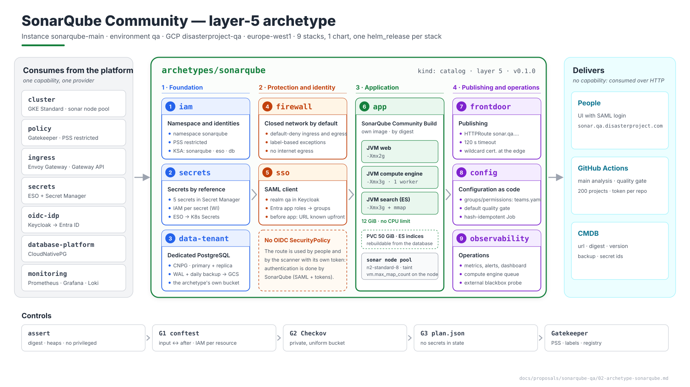
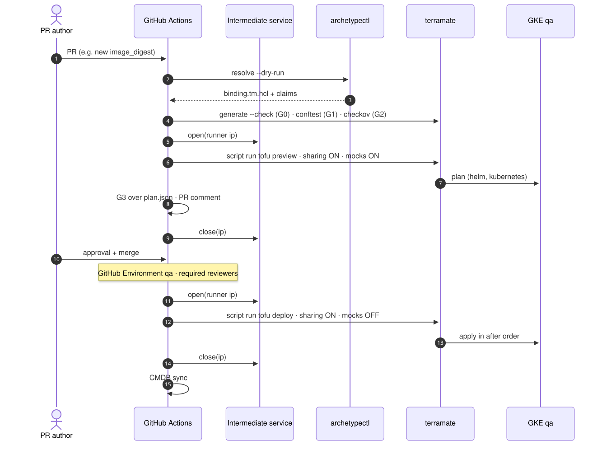
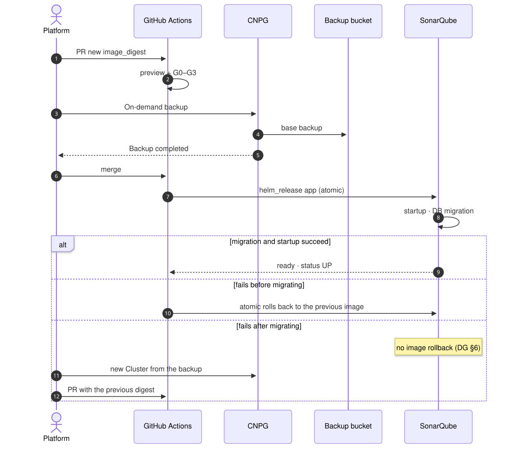
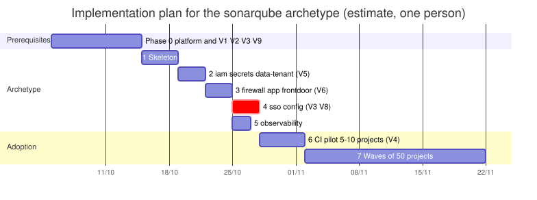

# The `sonarqube` archetype (layer 5) — Proposal and implementation plan

| | |
|---|---|
| **Status** | Proposal · stage 2 · revision 1 |
| **Part of** | [`README.md`](README.md) (stage 1: elements and dependencies, closed) |
| **Scope** | The layer-5 archetype `sonarqube`: repository structure, manifest, the stacks that make it up, each stack's template (generator), contracts, execution, configuration, policies, what it provides, and a phased implementation plan |
| **Out of scope** | `qa`'s layers 0–4 (they belong to the platform; here they appear only as producers and requirements) |
| **Reference specification** | Architecture (§n), archetype model (AM §n), developer guide (DG §n), stage 1 (S1 §n) |
| **Diagrams** | `diagrams/11-*` through `diagrams/19-*` (`.mmd` source, `.svg` rendered). `diagrams/20-bloques-presentacion.svg` (1920×1080, for presentations) is generated by `20-bloques-presentacion.py`, not by Mermaid |

The HCL and YAML blocks in this document are **design templates**: they fix the shape, the names and the contracts. The exact keys of the official SonarQube chart and of the providers are verified against the pinned versions before any code is written; where there is doubt, it is marked **(verify)**.

---

## 1. Summary



Source: [`diagrams/20-bloques-presentacion.py`](diagrams/20-bloques-presentacion.py) — presentation view; the detail is in §5.

| Aspect | Decision |
|---|---|
| Archetype | `sonarqube`, `kind: catalog`, **layer 5**, initial version `0.1.0` |
| Instance | `sonarqube-main` in `qa` (GCP, `disasterproject-qa`, `europe-west1`, dedicated model) |
| Stacks | **9**: `iam`, `secrets`, `data-tenant`, `firewall`, `sso`, `app`, `config`, `frontdoor`, `observability` |
| Provides | **No capability**. Publishes outputs for the CMDB (URL, version, digest). Its consumers are pipelines over HTTP, not stacks |
| Consumes | `cluster`, `policy`, `ingress`, `secrets`, `oidc-idp`, `database-platform`, `monitoring` |
| Persistent state | PostgreSQL (CNPG, dedicated) + the settings-encryption key in Secret Manager. Nothing else |
| Principle | SonarQube-specific logic lives in the **archetype's chart** and its values. Generators stay generic per capability (§4.7); only the cloud branches change |

### Changes from stage 1

| Change | Reason |
|---|---|
| PostgreSQL's backup bucket is created by the **archetype itself** (`data-tenant` stack); `object-store` stops being a dependency | AM §5.1: an archetype brings its own data store, and destroying it destroys that store. A shared platform bucket would force prefix-scoped IAM conditions, fragile against `objects.list` |
| `sso` now runs **before** `app` | SonarQube's URL is deterministic (a hostname claim), so the SAML client can exist before the application does. The first login works as soon as `app` comes up |
| New `config` stack | Groups, permission templates and quality gate as code. SonarQube stores that configuration in its database and has no native declarative configuration |
| The request body-size limit is no longer an archetype resource | In Envoy Gateway that limit is a `ClientTrafficPolicy` attached to the **Gateway**, which belongs to the platform. It becomes a requirement on the `gateway` archetype (§9) |

---

## 2. Repository structure

```
archetypes/sonarqube/                        # archetype definition (versioned)
├── manifest.yaml                            # §3 — single source: requires, stacks, claims, capacity
├── README.md
├── chart/                                   # the archetype's "wrapper" chart
│   ├── Chart.yaml                           # dependency: sonarqube/sonarqube (pinned version)
│   ├── values.yaml                          # safe defaults (§6.1)
│   └── templates/
│       ├── networkpolicies.yaml             # firewall stack
│       ├── secretstore.yaml                 # secrets stack
│       ├── externalsecrets.yaml             # secrets stack
│       ├── cnpg-cluster.yaml                # data-tenant stack
│       ├── httproute.yaml                   # frontdoor stack
│       ├── backendtrafficpolicy.yaml        # frontdoor stack
│       ├── podmonitor.yaml                  # observability stack
│       ├── prometheusrule.yaml              # observability stack
│       ├── probe.yaml                       # observability stack (blackbox)
│       ├── dashboard-configmap.yaml         # observability stack
│       └── config-job.yaml                  # config stack
├── config/                                  # SonarQube configuration as code (§6.3)
│   ├── teams.yaml                           # teams → group, project prefix
│   └── quality-gate.yaml
└── image/
    └── Dockerfile                           # FROM sonarqube:<v>-community + plugins (S1 §4.10)

stacks/archetypes/sonarqube/
├── archetype.tm.hcl                         # shared archetype globals (§4.2)
└── instances/main/
    ├── binding.tm.hcl                       # WRITTEN BY THE RESOLVER — never by hand
    ├── instance.tm.hcl                      # instance overrides (by hand, reviewed)
    ├── iam/            stack.tm.hcl
    ├── secrets/        stack.tm.hcl
    ├── data-tenant/    stack.tm.hcl
    ├── firewall/       stack.tm.hcl
    ├── sso/            stack.tm.hcl
    ├── app/            stack.tm.hcl
    ├── config/         stack.tm.hcl
    ├── frontdoor/      stack.tm.hcl
    └── observability/  stack.tm.hcl

imports/
├── generators/v1/
│   ├── gen_tenant_namespace.tm.hcl          # iam: namespace + KSAs (generic)
│   ├── gen_secrets.tm.hcl                   # secrets: Secret Manager + ESO (generic, GCP branch)
│   ├── gen_data_tenant_cnpg.tm.hcl          # data-tenant: bucket + IAM + CNPG Cluster
│   ├── gen_helm_stack.tm.hcl                # firewall, sso, frontdoor, observability, config
│   └── gen_app.tm.hcl                       # app (already exists in the design; helm_release branch)
└── contracts/
    ├── contract_app_gcp.tm.hcl              # existing: cluster_endpoint, cluster_ca, workload_identity_pool
    ├── contract_oidc_idp_saml.tm.hcl        # NEW: SAML inputs from keycloak
    └── contract_database_platform.tm.hcl    # NEW: CNPG operator version
```

| Rule | Why |
|---|---|
| A single archetype chart, deployed as **several `helm_release`s** (one per stack), with `values` that enable only their own part | One chart version, one place to review templates, and still each stack with its own lifecycle: changing an alert doesn't redeploy SonarQube |
| No CRD-bearing resource is created with `kubernetes_manifest` | The CRD and the API server are required at plan time; breaks previews (R24). Every CR goes in the chart |
| `binding.tm.hcl` is written by the resolver; `instance.tm.hcl` is the only instance file edited by hand | What the platform decides and what the team decides stay separate and reviewable |

### 2.1 From sources to generated code



Source: [`diagrams/13-generacion.mmd`](diagrams/13-generacion.mmd)

Only the sources on the left are edited by hand. Everything on the right is produced by the resolver and `terramate generate`, is committed, and G0 fails if anyone touches it by hand.

### 2.2 One chart, several releases



Source: [`diagrams/14-chart-releases.mmd`](diagrams/14-chart-releases.mmd)

---

## 3. Manifest

Supersedes the draft in S1 §7 (which stands as historical).

```yaml
apiVersion: archetype/v1
kind: Archetype

metadata:
  name: sonarqube
  version: 0.1.0
  layer: 5
  kind: catalog
  description: SonarQube Community Build, single node, SAML against oidc-idp, dedicated PostgreSQL
  owners: [team-platform]

runtimes: [gke, eks, aks]                          # gke-autopilot excluded by the cluster trait

requires:
  - capability: cluster
    version: "^2.0.0"
    traits: [sysctl-max-map-count]
  - capability: policy
    version: "^1.0.0"
  - capability: ingress
    version: ">=3.0.0 <4.0.0"
    traits: [gateway-api, http-route]
  - capability: secrets
    version: "^2.0.0"
  - capability: oidc-idp
    version: "^4.2.0"                              # 4.2 adds the SAML outputs (§5.5)
    traits: [saml-idp]
  - capability: database-platform
    version: "^1.0.0"
    traits: [cnpg]
  - capability: monitoring
    version: "^1.5.0"
    traits: [prometheus-operator-crds]

conflicts:
  - capability: legacy-ingress

stacks:
  - name: iam
  - name: secrets
    after: [iam]
  - name: data-tenant
    after: [iam, secrets]
    creates_tenant_resources: [database-platform]
  - name: firewall
    after: [data-tenant]
  - name: sso
    after: [iam]
    creates_tenant_resources: [oidc-idp]
  - name: app
    after: [secrets, firewall, sso]
  - name: config
    after: [app]
  - name: frontdoor
    after: [app]
  - name: observability
    after: [app]

claims:
  - kind: hostname
    pool: "{{ environment.dns_zone }}"
    value: "sonar.{{ environment.dns_suffix }}"

firewall:
  - name: gateway-to-sonar
    from: zone:pods
    to: self
    ports: [9000]

capacity:
  cpu_millicores: 8000
  memory_mib: 28672
  pvc_gib: 250
  ingress_routes: 1
  workload_identities: 2

providers:
  - source: hashicorp/google
    version: "~> 6.0"                              # write-only secret_data_wo: minimum version to pin (V9)
    runtimes: [gke]
  - source: hashicorp/kubernetes
    version: ">= 2.30, < 3.0"
  - source: hashicorp/helm
    version: "~> 2.14"
```

Validates against `schemas/archetype-manifest.schema.json` with the traits already registered.

---

## 4. Globals: what comes from where

### 4.1 `binding.tm.hcl` — written by the resolver

```hcl
# stacks/archetypes/sonarqube/instances/main/binding.tm.hcl — GENERATED by archetypectl resolve
globals "platform" {
  cloud      = "gcp"
  env        = "qa"
  model      = "dedicated"
  project_id = "disasterproject-qa"
  region     = "europe-west1"
  namespace  = "sonarqube"

  # producers, one per capability (AM §7)
  cluster_stack_id           = "gcp-qa-gke"
  policy_stack_id            = "gcp-qa-policy"
  gateway_stack_id           = "gcp-qa-gateway"
  secrets_stack_id           = "gcp-qa-secrets"
  keycloak_stack_id          = "gcp-qa-keycloak"
  postgres_operator_stack_id = "gcp-qa-postgres-operator"
  monitoring_stack_id        = "gcp-qa-monitoring"

  # deterministic facts of the producers (globals, not sharing — platform-overview §4)
  gateway_name       = "qa"
  gateway_namespace  = "envoy-gateway-system"
  keycloak_realm     = "qa"
  keycloak_namespace = "keycloak"
  rules_selector     = { "prometheus" = "qa" }
}

globals "claims" {
  hostname = "sonar.qa.disasterproject.com"
}

globals {
  archetype = "sonarqube"
  archetype_version = "0.1.0"
  instance  = "sonarqube-main"
}
```

### 4.2 `archetype.tm.hcl` — the archetype's default values

```hcl
# stacks/archetypes/sonarqube/archetype.tm.hcl
globals "sonarqube" {
  chart_version  = "0.1.0"                  # the archetype's chart
  image          = "europe-docker.pkg.dev/disasterproject-lz/platform/sonarqube"
  image_digest   = ""                        # mandatory per instance (assert §7.1)

  heap_web_mib    = 2048
  heap_ce_mib     = 3072
  heap_search_mib = 3072
  non_heap_mib    = 1536                     # 3 × ~512 MiB (DG §8.3)
  memory_limit_mib = 12288
  cpu_request_m    = 4000

  es_pvc_gib      = 50
  storage_class   = "hyperdisk-balanced"

  db_instances    = 2
  db_storage_gib  = 100
  db_cpu_m        = 2000
  db_memory_mib   = 8192
  backup_retention_days = 14                 # §12.6, qa column

  node_pool       = "sonar"
}
```

### 4.3 `instance.tm.hcl` — the instance's own decisions

```hcl
# stacks/archetypes/sonarqube/instances/main/instance.tm.hcl
globals "sonarqube" {
  image_digest = "sha256:<promoted digest>"   # never a tag (DG §5.2)
}
```

A SonarQube version change is a PR that changes **only** this line (and, if needed, the chart version). That makes it reviewable and traceable.

---

## 5. The stacks, one by one



Source: [`diagrams/11-stacks-arquetipo.mmd`](diagrams/11-stacks-arquetipo.mmd)

Every stack shares this:

```hcl
# common stack.tm.hcl pattern (example: app)
stack {
  id    = "gcp-qa-sonarqube-main-app"
  name  = "qa — sonarqube-main — app"
  tags  = ["gcp", "qa", "app", "archetype:sonarqube", "instance:sonarqube-main", "consumer"]
  after = [
    "/stacks/archetypes/sonarqube/instances/main/secrets",
    "/stacks/archetypes/sonarqube/instances/main/firewall",
    "/stacks/archetypes/sonarqube/instances/main/sso",
    "/stacks/platforms/gcp/qa/gke",                          # producer via sharing → after (R2)
    "/stacks/archetypes/keycloak/instances/main/realm",
  ]
}

globals { capability = "app" }

import { source = "/imports/mixins/backend_gcp.tm.hcl" }
import { source = "/imports/mixins/provider_gcp.tm.hcl" }
import { source = "/imports/mixins/provider_k8s_gke.tm.hcl" }   # kubernetes + helm, local token (never shared)
import { source = "/imports/mixins/labels.tm.hcl" }
import { source = "/imports/contracts/contract_app_gcp.tm.hcl" }
import { source = "/imports/contracts/contract_oidc_idp_saml.tm.hcl" }
import { source = "/imports/generators/v1/gen_app.tm.hcl" }
```

| Common rule | Application |
|---|---|
| Every `input` has its `after` pointing at the producer stack | G1 checks it (R2). Each stack's inputs table below is the list G1 compares against |
| Every `input` carries a `mock` of the correct type, prefixed `mock-` | PR preview (architecture §4.4) |
| The cluster token is fetched locally (`google_client_config`) | Never over sharing |
| Mandatory labels from `registry/labels.yaml` on the namespace, workloads and GCP resources | Emitted by `labels.tm.hcl`; validated by Gatekeeper (no mutation) |

### 5.1 `iam` — namespace and identities

| | |
|---|---|
| **Purpose** | The instance's namespace and Kubernetes service accounts. It is the first stack: everything else lives inside it |
| **Generator** | `gen_tenant_namespace.tm.hcl` (generic, cloud-agnostic except for the identity annotation) |
| **Resources** | `kubernetes_namespace` `sonarqube` (labels `archetype`, `instance`, `pod-security.kubernetes.io/enforce: restricted`); KSAs `sonarqube`, `eso-sonarqube`, `sonarqube-db`; a default `LimitRange` |
| **Does not create** | GCP service accounts. With direct Workload Identity, IAM is granted to the KSA's principal on the resource that needs it, in the stack that creates that resource |
| **Inputs** | `cluster_endpoint`, `cluster_ca` (from `gcp-qa-gke`) |
| **Outputs (CMDB)** | `namespace` |

```hcl
# imports/generators/v1/gen_tenant_namespace.tm.hcl (excerpt)
generate_hcl "_namespace.tf" {
  condition = global.capability == "iam"
  content {
    resource "kubernetes_namespace_v1" "this" {
      metadata {
        name   = global.platform.namespace
        labels = merge(global.labels.namespace, {
          "pod-security.kubernetes.io/enforce" = "restricted"
        })
      }
    }
    resource "kubernetes_service_account_v1" "ksa" {
      for_each = toset(global.tenant.service_accounts)   # ["sonarqube", "eso-sonarqube", "sonarqube-db"]
      metadata {
        name      = each.key
        namespace = kubernetes_namespace_v1.this.metadata[0].name
        labels    = global.labels.workload_base
      }
      automount_service_account_token = each.key == "eso-sonarqube"
    }
  }
}
```

`automount_service_account_token` only on ESO's KSA: SonarQube does not talk to the Kubernetes API and must not have a token mounted.

### 5.2 `secrets` — Secret Manager and External Secrets

| | |
|---|---|
| **Purpose** | Secret containers in Secret Manager, their IAM, and their materialisation in the namespace (S1 §4.3) |
| **Generator** | `gen_secrets.tm.hcl`, GCP branch |
| **GCP resources** | 5 × `google_secret_manager_secret` (`qa-sonarqube-db`, `-passcode`, `-admin`, `-secret-key`, `-saml-sp`), user-managed replication in `europe-west1`, `version_destroy_ttl = 2592000s`; initial versions via `ephemeral "random_password"` + `secret_data_wo` (V9); `google_secret_manager_secret_iam_member` `secretAccessor` **per secret** for the `eso-sonarqube` principal |
| **K8s resources** | The archetype chart's `helm_release` with `secrets.enabled=true`: `SecretStore` (namespaced, Workload Identity auth) and 5 `ExternalSecret`s |
| **Protection** | `lifecycle { prevent_destroy = true }` on `qa-sonarqube-secret-key` |
| **Inputs** | `cluster_*`, `workload_identity_pool` (from `gcp-qa-gke`) |
| **Outputs** | `secret_ids` (**names**, not values) — for the CMDB |

```hcl
# imports/generators/v1/gen_secrets.tm.hcl (GCP branch, excerpt)
generate_hcl "_secrets.tf" {
  condition = global.capability == "secrets" && global.platform.cloud == "gcp"
  content {
    locals {
      eso_principal = "principal://iam.googleapis.com/projects/${data.google_project.this.number}/locations/global/workloadIdentityPools/${var.workload_identity_pool}/subject/ns/${global.platform.namespace}/sa/eso-${global.archetype}"
    }

    resource "google_secret_manager_secret" "this" {
      for_each  = global.tenant.secrets            # map name → { generate = bool, length = n }
      project   = global.platform.project_id
      secret_id = "${global.platform.env}-${global.archetype}-${each.key}"
      labels    = global.labels.cloud_resource
      version_destroy_ttl = "2592000s"
      replication {
        user_managed { replicas { location = global.platform.region } }
      }
    }

    ephemeral "random_password" "gen" {
      for_each = { for k, v in global.tenant.secrets : k => v if v.generate }
      length   = each.value.length
      special  = false
    }

    resource "google_secret_manager_secret_version" "initial" {
      for_each               = ephemeral.random_password.gen
      secret                 = google_secret_manager_secret.this[each.key].id
      secret_data_wo         = each.value.result          # never enters state (R40)
      secret_data_wo_version = 1
    }

    resource "google_secret_manager_secret_iam_member" "eso" {
      for_each  = google_secret_manager_secret.this
      secret_id = each.value.id
      role      = "roles/secretmanager.secretAccessor"
      member    = local.eso_principal
    }
  }
}
```

`qa-sonarqube-saml-sp` (the SP's key and certificate, if SAML requests are signed) and the "user" half of `qa-sonarqube-db` are not random passwords: the first is generated by a one-time bootstrap script, the second is a fixed value (`sonarqube`) written the same way. `generate = false` in the map.

### 5.3 `data-tenant` — dedicated PostgreSQL with CloudNativePG

| | |
|---|---|
| **Purpose** | Its own PostgreSQL instance, its backups and its bucket |
| **Generator** | `gen_data_tenant_cnpg.tm.hcl`: GCP branch for the bucket and IAM, a shared part for the `helm_release` |
| **GCP resources** | `google_storage_bucket` `disasterproject-qa-sonarqube-main-pgbackup` (regional, `uniform_bucket_level_access`, `public_access_prevention = "enforced"`, **no** versioning or retention lock — S1 §4.9, 7-day soft delete); `google_storage_bucket_iam_member` `objectAdmin` for the `sonarqube-db` principal |
| **K8s resources** | `helm_release` with `database.enabled=true`: CNPG `Cluster` `sonarqube-db` (2 instances, per-node anti-affinity, `bootstrap.initdb` with `secret: sonarqube-db`), backups via the barman-cloud plugin (`ObjectStore` + daily `ScheduledBackup`) **(verify: plugin API in the pinned CNPG version)** |
| **Tenant resource** | `Cluster`, `ScheduledBackup` in its own namespace — requires `postgres-operator` to authorise them (S1 §4.4) |
| **Inputs** | `cluster_*`, `workload_identity_pool` (gke); `cnpg_version` (from `gcp-qa-postgres-operator`) |
| **Outputs** | `db_rw_service` = `sonarqube-db-rw.sonarqube.svc` · `db_name` = `sonarqube` · `backup_bucket` |

`cnpg_version` arrives via sharing so that an `assert` can compare the API the chart uses against the installed operator's: a chart written for a newer API than the operator fails at `generate`, not at apply.

```yaml
# chart/templates/cnpg-cluster.yaml (excerpt of effective values)
apiVersion: postgresql.cnpg.io/v1
kind: Cluster
metadata: { name: sonarqube-db }
spec:
  instances: 2
  imageName: ghcr.io/cloudnative-pg/postgresql:<major supported by SonarQube>   # verify
  storage: { size: 100Gi, storageClass: hyperdisk-balanced }
  resources: { requests: { cpu: "2", memory: 8Gi }, limits: { memory: 8Gi } }
  postgresql:
    parameters:
      max_connections: "200"
      shared_buffers: "2GB"
  bootstrap:
    initdb: { database: sonarqube, owner: sonarqube, secret: { name: sonarqube-db } }
  serviceAccountTemplate:
    metadata: { name: sonarqube-db }
  affinity: { enablePodAntiAffinity: true, topologyKey: kubernetes.io/hostname }
  monitoring: { enablePodMonitor: true }
```



Source: [`diagrams/15-datos-backup.mmd`](diagrams/15-datos-backup.mmd)

### 5.4 `firewall` — NetworkPolicies

| | |
|---|---|
| **Purpose** | Default-deny ingress and egress, plus S1 §4.8's exceptions |
| **Generator** | `gen_helm_stack.tm.hcl` with `firewall.enabled=true` |
| **Resources** | 7 × `NetworkPolicy`: default-deny; Envoy → 9000; Prometheus → 9000 and 9187; SonarQube → CNPG 5432; CNPG ↔ CNPG; CNPG operator → 8000; DNS; CNPG → Private Google Access 443 |
| **Selectors** | By pod and namespace label, never by CIDR, except the egress to `199.36.153.8/30` (`private.googleapis.com`) **(verify)** |
| **Why after `data-tenant`** | CNPG's selectors (`cnpg.io/cluster=sonarqube-db`) exist once the `Cluster` exists; applying earlier does not fail, but the order makes clear what protects what |

### 5.5 `sso` — SAML client in Keycloak

| | |
|---|---|
| **Purpose** | Register SonarQube as the `qa` realm's SAML client and map Entra ID roles → groups |
| **Tenant resource** | `KeycloakClient` in Keycloak's namespace (`creates_tenant_resources: [oidc-idp]`) |
| **Proposed implementation** | The `keycloak` archetype reconciles clients via **keycloak-config-cli** from `ConfigMap`s labelled `keycloak.disasterproject.com/realm=qa` in its own namespace. This stack creates that `ConfigMap` with the client's JSON |
| **Why not Keycloak's OpenTofu provider** | It needs Keycloak admin credentials in the pipeline: the pipeline would read a secret, exactly what S1 §4.3 forbids |
| **Client contents** | `clientId: https://sonar.qa.disasterproject.com` · `saml` protocol · ACS `https://sonar.qa.disasterproject.com/oauth2/callback/saml` · signed assertions · mappers `login`, `name`, `email`, `groups` (Keycloak groups, sourced from Entra's app roles, S1 §4.6) |
| **Inputs** | `cluster_*` (gke) |
| **Requirement on the `keycloak` archetype** | A `ConfigMap` reconciler; **new outputs** `saml_sso_url` and `saml_idp_certificate` (a public certificate, safe to share): a MINOR bump of the `oidc-idp` contract → 4.2.0 (AM §4.5) |

A divergence to resolve when the `keycloak` archetype is designed: AM §10.4 names the tenant resource as the `KeycloakClient` CRD, which belonged to the old operator. The current Keycloak Operator only imports whole realms (`KeycloakRealmImport`), with no reconciliation of changes. This proposal keeps the **logical name** `KeycloakClient` and changes the implementation to `ConfigMap` + keycloak-config-cli. Gatekeeper restricts, inside Keycloak's namespace, which `ConfigMap`s each tenant may create (prefix `client-<instance>-`), because RBAC does not filter by name.

### 5.6 `app` — SonarQube

| | |
|---|---|
| **Purpose** | SonarQube's `helm_release` |
| **Generator** | `gen_app.tm.hcl`, the archetype chart's `helm_release` branch with `app.enabled=true` (official subchart) |
| **Inputs** | `cluster_*` (gke) · `saml_sso_url`, `saml_idp_certificate` (keycloak) |
| **Values** | §6.1, generated from globals — never a hand-edited per-instance `values.yaml` |
| **Outputs (CMDB)** | `url`, `image_digest`, `chart_version`, `helm_revision` |

```hcl
# imports/generators/v1/gen_app.tm.hcl (archetype's helm branch, excerpt)
generate_hcl "_app.tf" {
  condition = global.capability == "app" && tm_can(global.sonarqube)
  content {
    resource "helm_release" "app" {
      name       = global.archetype
      namespace  = global.platform.namespace
      chart      = "${terramate.stack.path.to_root}/archetypes/${global.archetype}/chart"
      version    = global.sonarqube.chart_version
      atomic     = true
      wait       = true
      timeout    = 900                  # startup + DB migration on upgrades
      values     = [tm_yamlencode(global.sonarqube_values)]   # §6.1

      set {
        name  = "sonarqube.sonarProperties.sonar\\.auth\\.saml\\.certificate\\.secured"
        value = var.saml_idp_certificate            # public; not a secret
      }
      set {
        name  = "sonarqube.sonarProperties.sonar\\.auth\\.saml\\.loginUrl"
        value = var.saml_sso_url
      }
    }
  }
}
```

`atomic = true` means a failed deployment rolls back **except** for a database migration that has already run, which has no way back (DG §6). That is why a version change requires a verified backup beforehand (§8.3).

### 5.7 `config` — SonarQube configuration as code

| | |
|---|---|
| **Purpose** | Groups, per-team permission templates, the default quality gate, global settings that live in the database |
| **Mechanism** | A Kubernetes `Job` (not a Helm hook, DG §7) whose name includes a hash of `config/*.yaml`: a configuration change creates a new Job; with no changes, nothing runs |
| **What the Job does** | Calls the Web API with a `platform-config` technical user's token (in Secret Manager) and idempotently applies `teams.yaml` and `quality-gate.yaml` |
| **Why it's needed** | SAML group sync only assigns groups **that already exist** in SonarQube. Without this stack, a new team in Entra ID gets no permissions |

```yaml
# archetypes/sonarqube/config/teams.yaml
teams:
  - name: payments           # group team-payments (Entra ID app role, S1 §4.6)
    project_prefix: payments_
    permissions: [user, codeviewer, issueadmin, securityhotspotadmin, scan]
  - name: identity
    project_prefix: identity_
    permissions: [user, codeviewer, issueadmin, securityhotspotadmin, scan]
```



Source: [`diagrams/16-identidad-permisos.mmd`](diagrams/16-identidad-permisos.mmd)

Onboarding a team = an Entra ID app role (identity team) + an entry in `teams.yaml` (a PR to this repository). Nothing done manually in the UI.

### 5.8 `frontdoor` — HTTP route

| | |
|---|---|
| **Resources** | `HTTPRoute` `sonarqube` (host `sonar.qa.disasterproject.com`, `parentRefs` to the `qa` Gateway); `BackendTrafficPolicy` attached to the route: 120 s request timeout |
| **What it does not carry** | **`SecurityPolicy`** (S1 §4.6, R44) — enforced by an `assert` (§7.1) |
| **Inputs** | None via sharing: the Gateway's name and namespace are globals |
| **After `app`** | The route points at a Service that already exists |

### 5.9 `observability`

| | |
|---|---|
| **Resources** | SonarQube's `PodMonitor` (header `X-Sonar-Passcode` from the `sonarqube-passcode` Secret); `PrometheusRule` with S1 §4.7's alerts; a blackbox exporter `Probe` against `https://sonar.qa.disasterproject.com/api/system/status`; a dashboard `ConfigMap` carrying the label Grafana's sidecar picks up |
| **Inputs** | None via sharing: `rules_selector` is a global |
| **Archetype alerts** | Availability, CE queue, failed tasks, heap, OOMKilled, PVC, replica lag, last backup > 26 h, `ExternalSecret` unsynced |

### 5.10 Sharing-inputs table (what G1 compares against `after`)

| Stack | `input` | Producer | Mock |
|---|---|---|---|
| every stack using Kubernetes | `cluster_endpoint` | `gcp-qa-gke` | `mock-endpoint.example.invalid` (no scheme: GKE) |
| every stack using Kubernetes | `cluster_ca` (sensitive) | `gcp-qa-gke` | `bW9jaw==` |
| `secrets`, `data-tenant` | `workload_identity_pool` | `gcp-qa-gke` | `mock-project.svc.id.goog` |
| `data-tenant` | `cnpg_version` | `gcp-qa-postgres-operator` | `"0.0.0"`, which the assert treats as unknown during preview |
| `app` | `saml_sso_url` | `gcp-qa-keycloak` | `https://mock-idp.example.invalid/realms/mock/protocol/saml` |
| `app` | `saml_idp_certificate` | `gcp-qa-keycloak` | a valid test PEM certificate, CN `mock-idp` |

`cnpg_version`'s mock deliberately breaks the `mock-` prefix rule: the value must be a parseable semver. Noted as an exception in the contract.

---

## 6. Proposed configuration

### 6.1 SonarQube chart values

Keys of the official `sonarqube/sonarqube` chart **(verify against the pinned version)**. It does not exist as a file in the repository: it is `globals "sonarqube_values"` in `archetype.tm.hcl`, built from `globals "sonarqube"` (§4.2) and the claims, and the generator serialises it with `tm_yamlencode`. That way the asserts in §7.1 see exactly what gets deployed:

```yaml
sonarqube:
  community: { enabled: true }
  image:
    repository: europe-docker.pkg.dev/disasterproject-lz/platform/sonarqube
    tag: "@sha256:<digest>"                     # by digest
  replicaCount: 1
  nodeSelector: { cloud.google.com/gke-nodepool: sonar }
  tolerations: [{ key: dedicated, value: sonar, effect: NoSchedule }]

  initSysctl: { enabled: false }                # node sysctl (S1 §4.1) — assert §7.1
  initFs: { enabled: false }
  securityContext: { fsGroup: 1000, runAsNonRoot: true, seccompProfile: { type: RuntimeDefault } }
  containerSecurityContext:
    runAsUser: 1000
    allowPrivilegeEscalation: false
    capabilities: { drop: [ALL] }
    readOnlyRootFilesystem: true                # V2; if it fails → name-scoped exemption (S1 §4.2)

  resources:
    requests: { cpu: "4", memory: 12Gi }
    limits: { memory: 12Gi }                    # no CPU limit (DG §8.3)

  persistence: { enabled: true, storageClass: hyperdisk-balanced, size: 50Gi }

  postgresql: { enabled: false }
  jdbcOverwrite:
    enabled: true
    jdbcUrl: jdbc:postgresql://sonarqube-db-rw.sonarqube.svc:5432/sonarqube
    jdbcUsername: sonarqube
    jdbcSecretName: sonarqube-db
    jdbcSecretPasswordKey: password

  monitoringPasscodeSecretName: sonarqube-passcode
  monitoringPasscodeSecretKey: passcode
  account: { adminPasswordSecretName: sonarqube-admin }
  sonarSecretKey: sonarqube-secret-key

  plugins: { install: [] }                      # plugins baked into the image, never downloaded
  prometheusMonitoring: { podMonitor: { enabled: false } }   # created by the observability stack

  env:
    - { name: SONAR_WEB_JAVAOPTS,    value: "-Xmx2g -Xms2g -XX:+UseG1GC" }
    - { name: SONAR_CE_JAVAOPTS,     value: "-Xmx3g -Xms3g -XX:+UseG1GC" }
    - { name: SONAR_SEARCH_JAVAOPTS, value: "-Xmx3g -Xms3g" }

  sonarProperties: {}                           # §6.2
```

### 6.2 `sonar.properties` (via `sonarProperties`)

| Property | Value | Reason |
|---|---|---|
| `sonar.forceAuthentication` | `true` | No anonymous access (S1 §4.6) |
| `sonar.updatecenter.activate` | `false` | No internet egress (S1 §4.8) |
| `sonar.telemetry.enable` | `false` | No egress; a privacy decision |
| `sonar.core.serverBaseURL` | `https://sonar.qa.disasterproject.com` | Correct links and SAML behind the proxy |
| `sonar.auth.saml.enabled` | `true` | |
| `sonar.auth.saml.applicationId` | `https://sonar.qa.disasterproject.com` | = the `sso` stack's `clientId` |
| `sonar.auth.saml.providerName` | `Disasterproject SSO` | Text on the login button |
| `sonar.auth.saml.providerId` | `https://sso.qa.disasterproject.com/realms/qa` | |
| `sonar.auth.saml.loginUrl` / `certificate.secured` | from `keycloak` via sharing | §5.6 |
| `sonar.auth.saml.user.login` / `.name` / `.email` / `.group.name` | `login` / `name` / `email` / `groups` | = the client's mappers |
| `sonar.log.jsonOutput` | `true` | Structured logs for Loki **(verify availability)** |

Setting the SAML options in `sonar.properties` makes them read-only in the UI: the configuration lives in Git and nobody changes it by hand **(verify that the pinned version respects that precedence, V3)**.

### 6.3 Functional configuration

| Element | Proposal |
|---|---|
| Default quality gate | `disasterproject-way`: on new code, coverage ≥ 80%, duplication ≤ 3%, zero blocking new bugs and vulnerabilities, 100% of hotspots reviewed. Start in **informational mode** two weeks before making it blocking in CI |
| Quality profiles | The bundled ones (`Sonar way`) per language; no custom profiles until there is data on false positives |
| Plugins | None from third parties at the start: every plugin ties SonarQube upgrades to its own pace |
| Retention | Default housekeeping values; review database size at 3 months |
| Tokens | Project-scoped only, 90-day expiry, rotated by onboarding (D9) |

---

## 7. Policies



Source: [`diagrams/17-politicas.mmd`](diagrams/17-politicas.mmd)

### 7.1 `assert` at generation time (fails `terramate generate`)

```hcl
# archetypes/sonarqube — asserts imported by the instance's stacks
assert {
  assertion = global.sonarqube.image_digest != "" && tm_startswith(global.sonarqube.image_digest, "sha256:")
  message   = "sonarqube: the image is deployed by digest (DG §5.2)"
}
assert {
  assertion = (global.sonarqube.heap_web_mib + global.sonarqube.heap_ce_mib + global.sonarqube.heap_search_mib
               + global.sonarqube.non_heap_mib) <= global.sonarqube.memory_limit_mib
  message   = "sonarqube: heaps + non-heap exceed the container limit (R49)"
}
assert {
  assertion = !global.sonarqube_values.sonarqube.initSysctl.enabled && !global.sonarqube_values.sonarqube.initFs.enabled
  message   = "sonarqube: privileged init containers are forbidden; the sysctl comes from the node (R46)"
}
assert {
  assertion = !tm_can(global.sonarqube_values.frontdoor.securityPolicy)
  message   = "sonarqube: the route must not carry an OIDC SecurityPolicy — it breaks the scanner (R44)"
}
```

### 7.2 conftest (G1) — new rules, or rules this archetype exercises

| Rule | Source | What it checks |
|---|---|---|
| `input` ↔ `after` | existing (R2) | §5.10's table against each stack's `after` |
| Secret by reference | existing (R8) | No `secrets` `output` exports a value; only `secret_ids` |
| Authorised tenant resources | existing (AM §10.4) | `data-tenant` and `sso` declare `creates_tenant_resources`, and the provider authorises `Cluster`, `ScheduledBackup`, `KeycloakClient` |
| **New:** no secret values in state | R40 | `plan.json` (G3) contains no `secret_data` in the clear; only `secret_data_wo` |
| **New:** IAM per resource | S1 §4.3 | No `google_project_iam_*` with `secretmanager.*` in archetype stacks |

### 7.3 Checkov (G2/G3)

| Check | Expected result | Note |
|---|---|---|
| Bucket with uniform access and `public_access_prevention` | Passes | |
| Bucket with versioning (`CKV_GCP_78`) | **Justified exception** | Breaks barman's purge (S1 §4.9); soft delete as the substitute |
| Secret Manager with CMEK | Exception while `secrets-cmek` remains optional (S1 §4.14) | |

### 7.4 Gatekeeper (admission, layer 2b)

| Constraint | Effect on `sonarqube` |
|---|---|
| PSS `restricted` | Rejects the chart's init containers if anyone re-enables them |
| Mandatory labels | Namespace, pods and PVC carry `archetype`, `instance`, `app.kubernetes.io/*` |
| Allowed registries | Only the landing zone's Artifact Registry |
| **New:** `SecurityPolicy` in application namespaces | Denied except in the namespaces the `gateway` archetype authorises; reinforces R44 at admission |
| **New:** `ConfigMap` in Keycloak's namespace | A tenant may only create `client-<its instance>-*` (§5.5) |

---

## 8. Execution



Source: [`diagrams/12-ejecucion.mmd`](diagrams/12-ejecucion.mmd)

### 8.1 Pull request (preview)

```bash
archetypectl resolve --dry-run                     # closure, traits, claims → binding.tm.hcl
terramate generate && git diff --exit-code          # G0
conftest test ...                                   # G1
checkov -d stacks/archetypes/sonarqube              # G2
# the runner's IP is opened by the intermediate service (S1 §4.13)
terramate script run --tags instance:sonarqube-main --changed tofu preview   # sharing ON, mocks ON
conftest/checkov over plan.json                     # G3
```

### 8.2 Merge to `main` (deploy)

```bash
terramate script run --tags instance:sonarqube-main --changed tofu deploy    # sharing ON, mocks OFF
```

The order comes from the `after`s (§3). The first deployment runs all 9 stacks; later ones, only the changed ones. A GitHub Environment with required reviewers (architecture §14.2).

### 8.3 SonarQube version change



Source: [`diagrams/18-upgrade.mmd`](diagrams/18-upgrade.mmd)

| Step | Detail |
|---|---|
| 1 | New image built, scanned, signed and promoted (S1 §4.10) |
| 2 | PR changing `image_digest` (and `chart_version`, if needed) |
| 3 | **Before the merge**: an on-demand CNPG backup, verified to have finished (`Backup` in `completed`) |
| 4 | Merge → `app` is redeployed; SonarQube migrates the database on startup |
| 5 | If it fails **after** migrating: there is no image rollback; step 3's backup is restored into a new `Cluster`, and the previous image is reinstated (R52, DG §6) |

Step 3 is automated as a `pre-upgrade` stack only if version changes become frequent; at 2–4 a year, a documented procedure is enough.

### 8.4 Destruction

`terramate run --tags instance:sonarqube-main --reverse -- tofu destroy` (architecture §12.4). It stops at `qa-sonarqube-secret-key` (`prevent_destroy`) on purpose: destroying the instance requires removing that protection in an explicit PR.

---

## 9. Requirements on the platform

What this archetype needs from others, and is not yet specified:

| Archetype / stack | Requirement | Affects |
|---|---|---|
| `gcp-qa-gke` | Node pool `sonar` with sysctl and taint (S1 §4.1); output `workload_identity_pool` | `app`, `secrets`, `data-tenant` |
| `keycloak` | `ConfigMap` client reconciler; outputs `saml_sso_url` and `saml_idp_certificate`; `oidc-idp` 4.2.0 | `sso`, `app` |
| `postgres-operator` | Authorise `Cluster` and `ScheduledBackup` as tenant resources; barman-cloud plugin installed; output `cnpg_version` | `data-tenant` |
| `gateway-envoy-gke` | The Gateway's `ClientTrafficPolicy` with a body-size limit no lower than 100 MiB; allow `BackendTrafficPolicy` in application namespaces; deny `SecurityPolicy` outside the authorised ones | `frontdoor` |
| `gcp-qa-edge` | Backend-service timeout ≥ 120 s (R45); Cloud Armor exclusions on `/api/ce/submit` | Large analyses |
| `monitoring-oss` | Rule selector `prometheus=qa`; Grafana dashboard sidecar; blackbox exporter | `observability` |
| `secrets-eso-gsm` | ESO installed with Workload Identity support in a namespaced `SecretStore` | `secrets` |

---

## 10. What it provides

| To | What | How |
|---|---|---|
| Other archetypes | **Nothing** | No `provides`; no stack consumes its outputs |
| CMDB | `url`, `image_digest`, `chart_version`, `db_rw_service`, `backup_bucket`, `secret_ids` | Ordinary `output` blocks, collected by the CMDB sync |
| Application pipelines | URL, a per-repository project token, the quality gate | Automated onboarding (D9) and a reusable workflow (S1 §4.11) — outside this repository |
| People | A UI with SAML login | `sonar.qa.disasterproject.com` |

---

## 11. Implementation plan



Source: [`diagrams/19-plan-gantt.mmd`](diagrams/19-plan-gantt.mmd)

The diagram's dates are **illustrative** (assumed start on 5 October); what matters is the durations and dependencies. Phase 4 is shown in red: it is the critical path, because it depends on the `keycloak` archetype.

| Phase | Content | Exit criterion | Estimate |
|---|---|---|---|
| **0 · Prerequisites** | Roadmap phase 0; `qa`'s platform through S1 §6's phase B; V1, V2, V3, V9 | All four verifications closed | Depends on the platform |
| **1 · Skeleton** | `manifest.yaml`, the empty wrapper chart in parts, new generators and contracts, asserts, new G1 rules | `archetypectl resolve --dry-run`, `terramate generate --check`, G1 and a preview with mocks, all green | 3–4 days |
| **2 · Identity, secrets and data** | `iam`, `secrets`, `data-tenant` stacks deployed | Secrets synced by ESO; a healthy `Cluster`; a completed backup; **V5** (restore) passed | 3 days |
| **3 · Application** | `firewall`, `app`, `frontdoor` | `/api/system/status` = `UP` over the public URL; **V6** with a large analysis; OOM and latency observed for 48 h | 3 days |
| **4 · Human identity** | `sso`, `config` (`keycloak` requirements met) | **V3** and **V8**: login from Entra ID with a `team-*` group applied; `teams.yaml` applied idempotently (two runs, no changes) | 3 days |
| **5 · Observability** | `observability` | Every alert fired at least once under a deliberate test (stopping the pod, filling a test PVC, pausing backups) | 2 days |
| **6 · CI pilot** | Reusable workflow, onboarding, 5–10 projects | **V4**: average CE per-task time measured; informational quality gate | 1 week |
| **7 · Gradual rollout** | Waves of 50 projects | No sustained queue-alert firing; blocking quality gate after 2 weeks informational | 3–4 weeks |

Estimates for one person, with the platform available. Phases 2–5 can partly overlap; phase 4 depends on the `keycloak` archetype and carries the highest risk of delay.

---

## 12. Risks and verifications

The risks are S1 §9's (R38–R53); this document adds none new. Verifications this plan adds to V1–V9:

| # | Verification | Result that closes it |
|---|---|---|
| V10 | The official chart's keys (§6.1) on the pinned version, especially `community.enabled`, `jdbcOverwrite` and `sonarSecretKey` | `helm template` with §6.1's values produces the expected resources |
| V11 | CNPG's backup API (barman-cloud plugin) on the operator's version | `ScheduledBackup` completes and appears in the bucket |
| V12 | keycloak-config-cli reconciling a client `ConfigMap` without touching the rest of the realm | Adding, changing and removing a test client with no side effects |
| V13 | `sonar.properties`'s precedence over DB-stored settings for SAML | The settings show up read-only in the UI |
