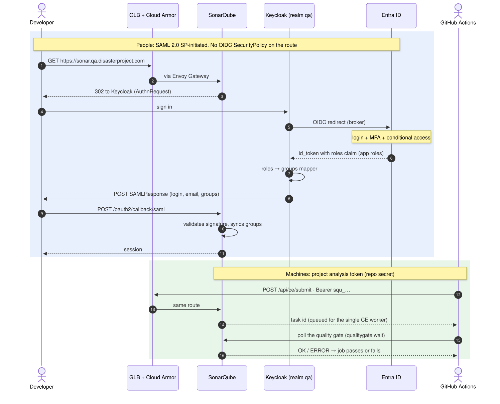
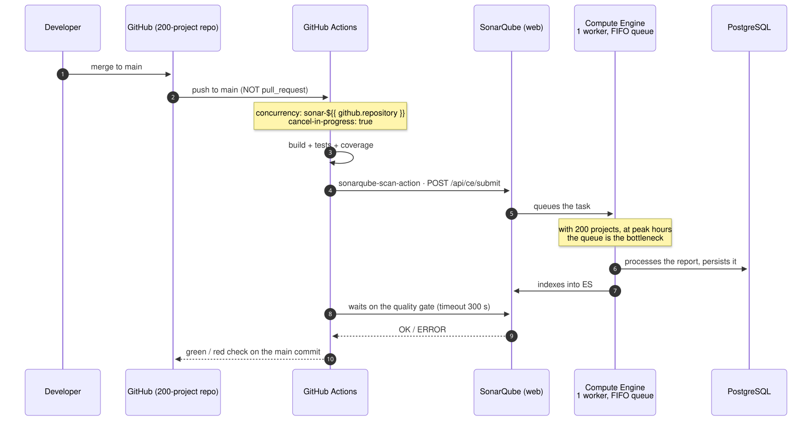
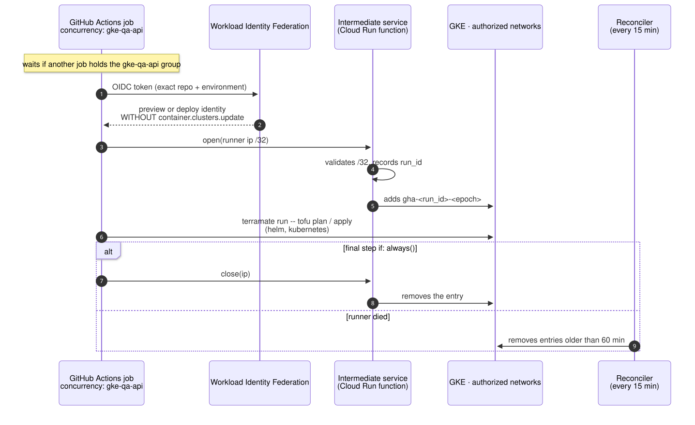

# SonarQube Community in the `qa` environment — Stage 1: elements and dependencies

| | |
|---|---|
| **Status** | Proposal · stage 1 of N · **stage 1 closed** · revision 12 (aligned with stage 2) |
| **Scope** | What elements a complete `qa` environment needs to run SonarQube Community Build, what each one depends on, and which open source tool covers it |
| **Out of scope** | Code (generators, contracts, charts), detailed per-pipeline integration, upgrade procedure. Later stages |
| **Reference specification** | `archetype-model.md` (AM §n), `terramate-outputs-sharing-architecture.md` (§n), `developer-guide.md` (DG §n), `risk-register.md` |
| **Stage 2** | [`02-archetype-sonarqube.md`](02-archetype-sonarqube.md): archetype, stacks, templates and implementation plan. Where the two differ, stage 2 governs |
| **Diagrams** | `diagrams/*.mmd` (Mermaid source) and `diagrams/*.svg` (rendered). The SVG is regenerated from the `.mmd`; never hand-edited |

Nothing in this document reopens a `CLAUDE.md` decision. Where SonarQube collides with one (PSS `restricted`, OIDC on the Gateway, `database-platform`), that is stated, with a proposal for how to fit without changing the decision.

---

## 0. Confirmed context

| Question | Answer | Main consequence |
|---|---|---|
| Cloud | **GCP** | GKE **Standard** (not Autopilot, §4.1); edge with a standalone NEG + Global external Application LB; GCS, Cloud KMS, Cloud DNS, Certificate Manager, Artifact Registry |
| CI and code | **GitHub** / GitHub Actions | SonarQube is published to the internet behind Cloud Armor (D3); project tokens as repository secrets (D9); Community only analyses `main` (§4.11) |
| Environment | **New** — nothing exists yet | SonarQube is the **first consumer** and pulls in the whole platform's closure: landing zone, environment, GKE, Gatekeeper, secrets, monitoring, CNPG and Keycloak (§6). Governed by roadmap phase 0 |
| Volume | **200 projects**, ≈ 10M lines, ≈ 4 merges/day per project | Sizing in §4.12. The bottleneck is not memory but the **single-worker compute engine queue** in Community |
| Human identity | **Entra ID** | Keycloak as an OIDC broker to Entra ID; groups via *app roles* (§4.6) |
| Region | **`europe-west1`** (Belgium) | Everything regional in the same region: cluster, disks, buckets, KMS key ring, Artifact Registry. GCP has no Ireland region |
| GCP project | **Own project**: `disasterproject-qa`. One project per environment; the hub and landing zone have theirs | The edge (IP, Cloud Armor, certificate, LB) lives in `disasterproject-qa`; KMS, Artifact Registry and GitHub WIF stay in the landing zone project with cross-project grants (§4.15) |
| Network | **Separate VPC** for `qa`, not Shared VPC | `qa`'s edge lives in its own VPC; nothing transits the hub (§4.15). Closes `CLAUDE.md` open question 2 **for `qa`** |
| Model | **Dedicated**, not shared | One platform, one instance (§12.1). The multi-tenant safeguards of §12.3 are not generated (per-tenant ResourceQuota, `capacity` budgets); isolation is the VPC and the cluster |
| Secrets | **GCP Secret Manager**; **OpenBao is not used in `qa`** | ESO as the in-cluster interface, Secret Manager as the backend (what AM §14.2 already assigns to GCP). No unseal, no Raft, no recovery keys (§4.3) |
| Entra ID | Owned by the **identity team** | App registration, app roles and group assignment are theirs; the platform only consumes the `roles` claim (§4.6) |
| IP filtering | **No** in SonarQube | D3 closed: SonarQube public behind Cloud Armor, no IP allowlists |
| Pipeline access to the cluster | The runner's IP is **opened in GKE's authorized networks** when a job starts and **closed** when it ends | Accepted procedure; four conditions for it to be safe (§4.13) |

Questions still open: §10.

---

## 1. What SonarQube Community imposes on the design

| Fact | Design consequence | Verify |
|---|---|---|
| **Single node.** High availability is a Data Center Edition (commercial) feature | `replicas: 1`, StatefulSet. Accepted in `qa`; RTO ≈ restart (2–5 min) plus reindexing if the PVC is lost | — |
| **Single compute engine worker.** Configuring more is an Enterprise Edition (commercial) feature | Every analysis for all 200 projects goes through one FIFO queue. This is the real capacity limit (§4.12) | Per-edition worker limit in the pinned version |
| **Three JVMs in one container**: web, compute engine and search (embedded Elasticsearch) | The memory limit must cover three heaps, three non-heap footprints and the ES mmap. It is DG §8.3 three times over | Default heaps of the pinned version |
| **Elasticsearch requires `vm.max_map_count ≥ 524288`** on the host | The chart solves it with a **privileged** init container, incompatible with PSS `restricted` and Gatekeeper. Solved **at the node level** (§4.1) | Whether GKE allows the sysctl on the node pool (V1) |
| **External database mandatory.** PostgreSQL supported | Dependency on `database-platform` (CloudNativePG) | Supported PostgreSQL version range |
| **The only real state is PostgreSQL.** ES indices are rebuilt from the database | Back up PostgreSQL and the encryption key only | Reindexing time with 200 projects |
| **No branch analysis or PR decoration** in Community | `main` only. An analysis launched from a PR **overwrites `main`'s history** (§4.11) | — |
| **Built-in authentication: local, SAML, LDAP, GitHub, GitLab.** Generic OIDC only via a third-party plugin | Keycloak integrates via **SAML** (§4.6) | SAML and group sync in Community (V3) |
| **Prometheus metrics at `/api/monitoring/metrics`**, protected by a passcode | Scraped with `X-Sonar-Passcode` from a Secret | — |
| **Logs to stdout** in the container image | Collected by a DaemonSet | — |
| **Plugins from the update center** by default | Plugins baked into the image; egress to the internet denied | — |

---

## 2. Where it fits in the archetype model

| Question | Answer | Reason |
|---|---|---|
| Archetype or component? | **Archetype `sonarqube`**, `kind: catalog`, **layer 5** | It does not deploy an operator or impose a multi-tenant contract (AM §5.4). Consumed by pipelines over HTTP, not by stacks through outputs sharing; it publishes no `provides` |
| Environment model? | `qa` **dedicated** (§12.1) | One SonarQube instance per environment |
| Instance and stack IDs? | `sonarqube-main` → `gcp-qa-sonarqube-main-<stack>` | Convention `<cloud>-<env>-<capability>[-<instance>]` |
| Runtime? | **`gke`** (Standard) | ES needs low-latency persistent disk and a node sysctl. Cloud Run gives neither; Autopilot doesn't give the second |

---

## 3. Inventory of elements

### 3.1 Context view



Source: [`diagrams/01-contexto.mmd`](diagrams/01-contexto.mmd)

### 3.2 Dependency closure by layer


Source: [`diagrams/02-capas-dependencias.mmd`](diagrams/02-capas-dependencias.mmd)

### 3.3 Element table

Everything is built from scratch. **Registry** states whether the capability already exists in `registry/capabilities.yaml`.

| Layer | Capability | GCP implementation | License | Why SonarQube needs it | Registry |
|---|---|---|---|---|---|
| 0 | `dns-zone` | Cloud DNS, `disasterproject.com` zone in the landing zone project, **delegating** `qa.disasterproject.com` to a zone in `disasterproject-qa` | cloud | Wildcard record `*.qa.disasterproject.com` | ✓ |
| 0 | `cidr-pool` | Model's ledger (AM §9) | — | A `/17` from the permanent block `10.4.0.0/14` (AM §9.2 example: `10.4.128.0/17`) | ✓ |
| 1 | `cert` | Certificate Manager in `disasterproject-qa`, **wildcard** certificate `*.qa.disasterproject.com` with DNS authorization | cloud | Public TLS at the edge | ✓ |
| 1 | `waf` | Cloud Armor in `disasterproject-qa` | cloud | Only viable network protection with GitHub-hosted runners (D3) | ✓ |
| 1 | `edge-ip` | Reserved global IP in `disasterproject-qa` | cloud | Wildcard target | ✓ |
| 0 | *(KMS)* | Cloud KMS in the landing zone project, `qa` key ring in `europe-west1` | cloud | OpenTofu state, etcd secrets, image signing (§4.14) | ✗ — deliberate, §4.14 |
| 0 | *(registry)* | Artifact Registry in the landing zone project: Docker Hub remote repo + standard repo; `artifactregistry.reader` for `disasterproject-qa`'s node SA | cloud | Own image with plugins, pulled by digest | ✗ — same criterion as KMS |
| 0 | *(CI identity)* | Workload Identity Federation for GitHub Actions (§11.2) | cloud | Keyless platform deployment | — |
| 1 | `network` | `qa`'s **own VPC**, subnets, Cloud NAT, **Private Google Access** | cloud | Nodes, pods, access to Google APIs without the internet | ✓ |
| 1 | `env-edge` | Backend service + URL map + proxy + forwarding rule **owned by the environment itself**, with the NEG in `qa`'s VPC | cloud | Entry point to the Gateway's NEG | ✓ |
| 1b | `cloud-observability` | Cloud Logging **reduced** to GKE audit and control-plane logs, with log-based alerts | cloud | Alerts on secret access, authorized networks and KMS (§4.7) | ✓ |
| 2 | `cluster` | **GKE Standard**, regional, `general` and `sonar` node pools | cloud | Where it runs; `sonar` supplies the sysctl | ✓ (+ trait) |
| 2b | `policy` | **OPA Gatekeeper** | Apache-2.0 | PSS `restricted`, labels, allowed registries | ✓ |
| 3 | `ingress` | **Envoy Gateway** (`gateway-envoy-gke`) | Apache-2.0 | `HTTPRoute`, traffic policies | ✓ |
| 3 | `certs` | **cert-manager** with an **internal CA** (`ClusterIssuer` CA) | Apache-2.0 | TLS from the GLB to Envoy. No ACME: the public certificate comes from Certificate Manager | ✓ |
| 3 | `dns` | **Not bound** | — | Covered by `env-edge`'s wildcard; external-dns adds nothing with one Gateway and one IP per environment (same as `demos`, AM §7) | ✓ unused |
| 3 | `secrets` | **External Secrets Operator** (interface) + **Secret Manager** (backend) | Apache-2.0 / cloud | Credentials, passcode, encryption key, SAML | ✓ |
| 3 | `monitoring` | **kube-prometheus-stack**, **Grafana**, **Loki** (on GCS), **Fluent Bit**, **Blackbox exporter** | Apache-2.0 / AGPL-3.0 | Metrics, logs, alerts, external probe | ✓ (+ trait) |
| 4 | `object-store` | **Not bound** | — | The backup bucket is created by the archetype itself (stage 2 §1); Loki's, by the monitoring archetype | ✓ unused |
| 4 | `database-platform` | **CloudNativePG** | Apache-2.0 | SonarQube and Keycloak each create their own `Cluster` | ✓ (+ trait) |
| 4 | `oidc-idp` | **Keycloak**, `qa` realm | Apache-2.0 | People, via **SAML** | ✓ (+ trait) |
| 5 | — | **SonarQube Community Build**, official `sonarqube/sonarqube` chart | LGPL-3.0 | The application | — |
| CI | — | **GitHub Actions** + `SonarSource/sonarqube-scan-action`, **Trivy**, **cosign** | — / Apache-2.0 | Analysis; building, scanning and signing the custom image | — |

Platform tooling unchanged: Terramate, OpenTofu, conftest, Checkov.

**What is cloud and what is OSS.** Everything running in the cluster is open source. What stays on GCP is what cannot, or should not, be self-operated: the edge (LB, Cloud Armor, public certificate), KMS, the **secret store**, object storage and the registry. Replacing GCS or Artifact Registry with in-cluster OSS equivalents would create circular dependencies (a backup inside the cluster it protects is not a backup) and more surface to operate. Harbor is ruled out for the same reason, and MinIO additionally because its community edition stopped shipping binaries and images in 2025.

**Licensing.** Grafana and Loki are AGPL-3.0: no impact for unmodified internal use; to be confirmed by whoever manages licensing.

---

## 4. Dependencies by domain

### 4.1 Runtime: GKE Standard and the `sonar` node pool

| Element | Proposal | Reason |
|---|---|---|
| Cluster | GKE Standard, **regional**, **private nodes**, control-plane endpoint with empty authorized networks by default (§4.13), Workload Identity, `STABLE` release channel, `deletion_protection: true` (§12.6) | Baseline from §5.7 |
| Pods per node | 64 (platform default) | The Autopilot open question does not apply |
| Node pool `sonar` | 1 **n2-standard-8** node (8 vCPU, 32 GB) in **one zone**, taint `dedicated=sonar:NoSchedule` | Isolates sysctl and memory pressure. Single zone because the PVC is zonal |
| Sysctl | `node_config.linux_node_config.sysctls = { "vm.max_map_count" = "524288" }` | Removes the privileged init container |
| `fs.file-max` | No action: the kernel sizes it from RAM, and at 32 GB it comfortably clears 131072 | Verify in V1 |
| StorageClass | `hyperdisk-balanced`, `WaitForFirstConsumer`, `allowVolumeExpansion: true` | Configurable IOPS without over-provisioning disk |
| Pipeline access to the control plane | Public control-plane endpoint with **empty authorized networks by default**; the runner's IP is opened and closed per job | Team decision (§4.13); covers R18 |

**Why not Autopilot.** It does not allow configuring node sysctl or privileged containers. A trait **`sysctl-max-map-count`** is proposed on `cluster`: `gke` has it, `gke-autopilot` does not, and a wrong binding fails at resolution rather than on first boot, with `max virtual memory areas vm.max_map_count [65530] is too low`.

**Plan B** if V1 fails: `SONAR_SEARCH_JAVAADDITIONALOPTS=-Dnode.store.allow_mmap=false`, at the cost of ES performance. With 200 projects this would need measuring before being accepted.

**Single zone.** If the zone goes down, SonarQube stays down until it recovers. Accepted for `qa`. The alternative is `hyperdisk-balanced-high-availability` (synchronous replica across two zones) with the node pool spread across those two zones: an RTO of minutes on zone loss, at double the disk cost.

### 4.2 Admission policy (layer 2b)

`qa`: `enforcementAction: deny`, `failurePolicy: Ignore` (§13.7).



| PSS `restricted` / Gatekeeper requirement | Chart adjustment |
|---|---|
| No privileged containers | `initSysctl.enabled: false` |
| No running as root | `initFs.enabled: false`; permissions via `fsGroup` |
| `runAsNonRoot`, `seccompProfile: RuntimeDefault`, `drop: [ALL]`, `allowPrivilegeEscalation: false` | Explicit `securityContext` and `containerSecurityContext` |
| Mandatory labels (`registry/labels.yaml`) | Emitted by the generator on the namespace and workload |
| `readOnlyRootFilesystem` (if a constraint requires it) | `emptyDir` for `temp` and `logs`; verify what else it writes (V2) |
| Images only from allowed registries | `europe-docker.pkg.dev/<project>/…`, by digest |

If SonarQube cannot run with a read-only root filesystem, the escape hatch is a **name-scoped exemption** for `sonarqube/sonarqube-0`, reviewed in the PR — never relaxing the constraint for the whole of `qa`.

### 4.3 Secrets



| Secret | Secret Manager secret | Consumer | Notes |
|---|---|---|---|
| JDBC user and password | `qa-sonarqube-db` | CNPG (`bootstrap.initdb.secret`) and SonarQube | One single origin for both sides |
| Monitoring passcode | `qa-sonarqube-passcode` | SonarQube and `PodMonitor` | Same namespace as the `PodMonitor` |
| Admin password | `qa-sonarqube-admin` | Chart job | Break-glass once SAML is enabled |
| Settings encryption key | `qa-sonarqube-secret-key` | `sonar.secretKeyPath` | If lost, encrypted settings become unrecoverable |
| SAML material | `qa-sonarqube-saml` | IdP certificate; SP key if requests are signed | — |
| Analysis tokens | **GitHub repository secrets** (D9) | GitHub Actions | Hosted runners have no identity in `qa` that grants Secret Manager access, and don't need one |

Three pieces, each with a single responsibility:

| Piece | Responsibility | Identity |
|---|---|---|
| **Stack `sonarqube-main-secrets`** (OpenTofu, pipeline via WIF) | Creates the secret **containers**, their mandatory labels (`registry/labels.yaml`) and their IAM | `tf-apply-qa@`: administers secrets, **has no** `secretAccessor` |
| **Values** | Generated with an `ephemeral` resource and written with the **write-only** `secret_data_wo` attribute, so the value **never enters OpenTofu state** | The same identity, in the same apply. Verify support in the pinned OpenTofu and `google` provider versions (V9). If unsupported, the initial version is created by a script outside OpenTofu |
| **ESO** in the `sonarqube` namespace | Reads the values and materialises them as Kubernetes `Secret`s | KSA `eso-sonarqube` via Workload Identity, `secretAccessor` **on each secret**, never on the project (§7.4: a project-level grant exposes everyone's secrets) |

- **`SecretStore` per namespace**, not `ClusterSecretStore`: the Workload Identity principal is exactly `ns/sonarqube/sa/eso-sonarqube` (R15).
- **Kubernetes `Secret`s sit in etcd encrypted with the `gke-secrets` KMS key** (§4.14, architecture §5.7). They are a copy, not the source of truth.
- **Why ESO and not GKE's Secret Manager add-on** (CSI driver): the add-on mounts files, but SonarQube's chart reads the JDBC password from an environment variable and CNPG requires a Kubernetes `Secret`.
- **Only secret names travel over outputs sharing**, never values (§11.6, R8).
- **Secrets live in the `qa` project**, user-managed replication in `europe-west1`.

**Human and pipeline access.** The pipeline accesses secrets via WIF to **manage** them; reading values is not part of any deployment. Human reads only for SRE, **just-in-time** via Privileged Access Manager (justification, 1-hour maximum, approval from another SRE member). Secret Manager *Data Access audit logs*, with an alert for any `AccessSecretVersion` whose principal is not an ESO KSA.

**Deletion protection.** Deleting a Secret Manager secret is immediate and irreversible. Hence: no pipeline identity other than the destroy one holds `secretmanager.secrets.delete`; `lifecycle { prevent_destroy = true }` on `qa-sonarqube-secret-key`; and deferred version destruction (`version_destroy_ttl`, 30 days) to allow undoing a mistaken rotation.

### 4.4 Data: PostgreSQL with CloudNativePG

Leaving `database-platform` unbound is `demos`'s decision. In `qa` the proposal is to **bind it** to CloudNativePG, with a **dedicated instance** per consumer:

| Option | What SonarQube creates | Recommendation |
|---|---|---|
| A. `Database` + `Role` on a shared `Cluster` | Logical database | No: SonarQube is database-intensive; a noisy neighbour in both directions |
| **B. Its own CNPG `Cluster` in `sonarqube`** | Dedicated instance, shared operator | **Yes** — common bus, separate data, same pattern as Kafka |
| C. Cloud SQL (conditional `data`) | Managed service | Only if the OSS-for-data requirement is dropped |

Requires `postgres-operator` to authorise `Cluster` and `ScheduledBackup` in `tenant_resources` (AM §10.4). Keycloak uses the same pattern: it is the environment's second `Cluster`.

Backups to GCS via **Workload Identity**: IAM `roles/storage.objectAdmin` on the bucket for the exact principal `principal://iam.googleapis.com/projects/<n>/locations/global/workloadIdentityPools/<project>.svc.id.goog/subject/ns/sonarqube/sa/sonarqube-db`. No JSON key; no wildcard.

### 4.5 Publishing

| Element | Proposal |
|---|---|
| Hostname | `sonar.qa.disasterproject.com` — a ledger **claim** even though the DNS record is a wildcard: name uniqueness remains a scarce resource |
| DNS | Wildcard record `*.qa.disasterproject.com` → global IP, created once by `gcp-qa-edge` |
| Public TLS | Certificate Manager, wildcard, on the GLB |
| Internal TLS | GLB → Envoy over HTTPS, certificate from cert-manager's internal CA |
| Gateway | One per environment, `allowedRoutes.namespaces.from: Selector` (§10.6); standalone NEG `eg-qa-neg` (§10.2, R20) |
| Backend service timeout | **120 s** (30 s by default): a large project's report upload exceeds it |
| Envoy | `BackendTrafficPolicy` on the route with a timeout ≥ 120 s. The body-size limit is a `ClientTrafficPolicy` on the **Gateway**: a requirement placed on the `gateway` archetype, not to go below 100 MiB (stage 2 §9) |
| VPC firewall | GLB health-check ranges (`35.191.0.0/16`, `130.211.0.0/22`) to Envoy's pods — a legitimate `cidr:` selector (AM §6.3) |

Gateway API resources packaged in the chart and deployed with `helm_release`, never `kubernetes_manifest` (R24).

### 4.6 Authentication and authorization



The platform expects OIDC on the Gateway via `SecurityPolicy`. **That does not work for SonarQube**: the same route is used by people and by GitHub Actions, and the scanner sends `Authorization: Bearer <SonarQube token>` to `/api/*`. An OIDC `SecurityPolicy` would redirect it to Keycloak and every analysis would fail.

| Who | Mechanism | Validated where |
|---|---|---|
| People | **SAML 2.0** against Keycloak (`qa` realm, `sonarqube` client) | SonarQube |
| GitHub Actions | **Project analysis token** (D9) | SonarQube |
| Break-glass | Local `admin` account | SonarQube |
| Anonymous | Forbidden: `sonar.forceAuthentication=true` | SonarQube |

SonarQube's `HTTPRoute` carries **no OIDC `SecurityPolicy`**, same as Keycloak's. SAML is front-channel: SonarQube needs no network path to Keycloak.

**Identities in Entra ID.** Keycloak is not the source of truth for users: it acts as a **broker** to Entra ID (an OpenID Connect identity provider in the `qa` realm) and issues SAML to SonarQube. MFA and conditional access are enforced in Entra ID, before reaching Keycloak.

| Topic | Proposal | Why |
|---|---|---|
| Entra ID registration | One *app registration* `keycloak-qa`, redirect URI `https://sso.qa.disasterproject.com/realms/qa/broker/entra/endpoint` | A single trust point with Entra for every `qa` application |
| Keycloak's credential to Entra | **Certificate** (signed client assertion), not a client secret | Entra client secrets expire (≤ 24 months) and tend to expire in production without warning. Private key in Secret Manager (`qa-keycloak-entra-cert`) |
| Groups | **App roles** on the app registration (`sonar-administrators`, `sonar-users`, `team-<x>`), assigned to Entra groups | Entra's `groups` claim carries **GUIDs**, not names, and beyond 200 groups it is replaced by an *overage* that requires a Graph call. The `roles` claim carries stable names scoped to this application only |
| Mapping in Keycloak | A *claim to group* mapper per role → Keycloak group; `force` sync on every login | A membership change in Entra takes effect on the next login |
| Toward SonarQube | SAML with the `groups` attribute = Keycloak groups | Unchanged from the earlier design |
| Network | Keycloak needs **egress** to `login.microsoftonline.com` (back-channel code exchange) via Cloud NAT | SonarQube still needs no network path to Keycloak or Entra |

Keycloak stays as the intermediary (D4) even though SonarQube could do SAML directly against Entra ID: Grafana and future `qa` applications use the same realm, and Envoy's OIDC `SecurityPolicy` for the rest of the applications was designed against Keycloak. The cost is that Keycloak sits on the login critical path.

**User offboarding.** Community has no SCIM (an Enterprise feature). Disabling someone in Entra ID stops their login, but their SonarQube user and **their personal tokens stay active**. Mitigation: forbid personal tokens in CI (project tokens only, D9) and a daily reconciliation job that disables SonarQube users whose login no longer exists or is disabled in Entra ID (Graph API + SonarQube Web API).

| Group | Permissions in SonarQube |
|---|---|
| `sonar-administrators` | Global administration |
| `sonar-users` | Browse |
| `team-<x>` | Permission template by project key prefix `<x>_*` |

Each group corresponds to an Entra ID app role; onboarding a team = new app role + assigned Entra group + permission template.

With 200 projects, permissions **only** via templates: a new project is born with its team's permissions.

### 4.7 Observability



| Signal | Collection | Proposed alerts |
|---|---|---|
| External availability | Blackbox → `https://sonar.qa.disasterproject.com/api/system/status` (through the GLB, Cloud Armor and Gateway) | ≠ `UP` for 5 min |
| **Compute engine queue** | `PodMonitor` over `/api/monitoring/metrics` | Pending > 20 for 15 min; oldest task > 10 min. **The key alert with 200 projects** |
| Failed CE tasks | Same | Failure rate > 5% in 1 h |
| JVM | Same | Heap > 90% sustained |
| Container | kube-state-metrics | `OOMKilled` (exit 137, DG §8.3); memory > 90% |
| Disk | kubelet | ES PVC > 80% (ES turns read-only past its watermark); DB PVC > 80% |
| PostgreSQL | CNPG exporter | Replica lag; connections > 80%; last successful backup > 26 h ago |
| Logs | Fluent Bit → Loki (GCS) | `ERROR` rate |
| Certificates | cert-manager | Internal CA or Envoy certificate < 14 days |
| Secrets | ESO metrics | `ExternalSecret` unsynced > 15 min (a rotated Secret Manager secret not reaching the pod) |

Alerts born from **GCP audit logs** do not go through Prometheus: they are log-based alerts from layer 1b (`cloud-observability`). Three of them: a secret read by a principal that is not ESO (§4.3), changes to the authorized networks made outside the intermediate service (§4.13), and any KMS key destroy operation (§4.14). That is why layer 1b is not reduced to zero.

`PodMonitor` and `PrometheusRule` go in the archetype's chart (CRD required at plan time, R24); hence the trait **`prometheus-operator-crds`**. Grafana logs in via OIDC to Keycloak, with no cycle.

### 4.8 Network



Default-deny `NetworkPolicy` for ingress and egress in `sonarqube`:

| Source | Destination | Port |
|---|---|---|
| Envoy | SonarQube | 9000 |
| Prometheus | SonarQube / CNPG | 9000 / 9187 |
| SonarQube | CNPG | 5432 |
| CNPG | CNPG | 5432 (replication) |
| CNPG operator | CNPG | 8000 |
| CNPG | `storage.googleapis.com` via Private Google Access | 443 |
| All | kube-dns | 53 |
| SonarQube | Internet | **Denied**; `sonar.updatecenter.activate=false` |

GKE enforces `NetworkPolicy` via Dataplane V2; egress to Google's APIs is expressed either by FQDN (`FQDNNetworkPolicy`) or by the Private Google Access ranges — verify which one the pinned version supports.

### 4.9 Backup and recovery

| What | How | Where | Retention |
|---|---|---|---|
| PostgreSQL | CNPG barman-cloud: daily base backup + continuous WAL (PITR) | `gs://disasterproject-qa-sonarqube-main-pgbackup` (owned by the archetype) | 14 days (§12.6) |
| Secrets (including SonarQube's encryption key) | Secret Manager versions; no additional backup | Secret Manager | Deletion protection (§4.3) |
| ES indices | Not backed up | — | Reindexed |
| Configuration | Git | — | — |

Regional buckets in `europe-west1` with GCS *soft delete* (7 days) as a safety net. **No** blocking retention policy and no object versioning on the CNPG bucket: barman purges its own backups per its own retention, and a policy that blocks deletes breaks that purge (or, with versioning, accumulates non-current versions without limit). Velero is not needed: all state lives in PostgreSQL, Secret Manager or Git.

Restore rehearsed once before signing the environment off (V5).

### 4.10 Image supply chain

| Step | Tool |
|---|---|
| Image `FROM sonarqube:<version>-community` + plugins in `extensions/plugins` | GitHub Actions in the archetype's repo |
| Scan | Trivy, blocking on `CRITICAL` with a fix available |
| Signing | cosign with a key in Cloud KMS (avoids publishing to Rekor's public log) |
| Registry | Artifact Registry; base image from the Docker Hub remote repo (avoids pull limits) |
| Deployment | By digest (DG: the image is promoted, not rebuilt) |

### 4.11 GitHub Actions integration



| Rule | Reason |
|---|---|
| **Analyse only on `push` to `main`**, never on `pull_request` | Community has no branches: an analysis from a PR **is recorded as `main`**, contaminating its history and the quality gate. A silent error; enforced with a conftest/actionlint rule over the workflows |
| `concurrency: { group: sonar-${{ github.repository }}, cancel-in-progress: true }` | Two merges in a row: only the last one is analysed. Eases the queue |
| `sonar.qualitygate.wait=true` with a 300 s `timeout` | The job fails if the gate fails; with a full queue the job waits and burns minutes: watch this |
| Project key `<org>_<repo>` | Permission templates by prefix |
| Reusable workflow in a central repo | 200 copies of a workflow drift apart; a reusable one changes once |
| Automated onboarding | Create project + expiring project token + `SONAR_TOKEN` repo secret, via the SonarQube and GitHub APIs (D9) |

GitHub-hosted runners come from huge, changing IP ranges: filtering by IP in Cloud Armor is not useful. Cloud Armor contributes OWASP rules (with exclusions on `/api/ce/submit`, whose multipart body triggers false positives — verify) and per-IP rate limiting; authentication is SonarQube's job.

### 4.12 Sizing for 200 projects

Confirmed estimate: a median of 50k lines per project, ≈ 10M lines in total, ≈ 4 merges to `main` per project per day.

| Resource | Initial value | Basis |
|---|---|---|
| Node pool `sonar` | 1 × n2-standard-8 (8 vCPU, 32 GB) | 12 GiB container + page cache for ES |
| SonarQube pod | request 4 vCPU / 12 GiB, limit 12 GiB, **no CPU limit** | With a low `limits.cpu`, the JVMs pick SerialGC and the CE slows down (DG §8.3) |
| Heaps | web `-Xmx2g`, CE `-Xmx3g`, search `-Xmx3g` | Σ 8 GiB + ≈ 1.5 GiB non-heap + margin = 12 GiB. **Never** heap = limit |
| ES PVC | 50 GiB `hyperdisk-balanced`, 3000 IOPS | Expandable |
| PostgreSQL | 2 instances (primary + replica), 2 vCPU / 8 GiB, 100 GiB, `max_connections` 200 | SonarQube's pool ≈ 60 per process |
| GCS backups | ≈ 2–3× the database size, with 14 days of WAL | — |

**The compute engine queue is the limit.** 200 projects × 4 analyses/day = 800 tasks daily. At 20–60 s per task that is **4.5–13 h of serial work**, concentrated within the working day. At the high end, the queue grows at peak hours and GitHub jobs wait on the quality gate. Levers, in order:

1. `main` only, and `cancel-in-progress` (already included).
2. Enough CPU for the CE: the task is mostly single-threaded; more cores don't speed it up, clock speed does (weigh c3 against n2 in V4).
3. Large monorepos outside peak hours.
4. If the queue alert fires persistently: Enterprise Edition (multiple workers, commercial) or splitting into two instances by team group.

V4 measures real per-task time with representative projects before fixing anything.

### 4.13 Pipeline access to the GKE control plane

Decided procedure: the control-plane endpoint is public but with **empty authorized networks** by default; every GitHub Actions job that needs the Kubernetes API adds its runner's IP, runs, and removes it. Covers R18 without self-hosted runners.



Works, with four conditions. Without them it fails in non-obvious ways:

| # | Problem | Condition |
|---|---|---|
| 1 | **Race between jobs.** The authorized-networks list is updated by **replacing it whole**: two concurrent jobs read, append their IP and write, and the second wipes out the first's, which loses access mid-`apply` | Serialize: `concurrency: { group: gke-qa-api, cancel-in-progress: false }` on **every** workflow that opens the IP. A job waits for the previous one |
| 2 | **Orphaned IP.** A runner that dies, or a job cancelled at the wrong moment, does not run the closing step | Close in an `if: always()` step **and** a scheduled reconciler (every 15 min) that removes any entry older than 60 min. Each entry carries `display_name = gha-<run_id>-<epoch>` so it can be expired |
| 3 | **Drift with OpenTofu.** If `gcp-qa-gke` manages `master_authorized_networks_config`, an `apply` of that stack reverts the runner's own IP mid-run, and every `plan` shows a diff | `lifecycle { ignore_changes = [master_authorized_networks_config] }` on the cluster: only the procedure manages the list; the baseline (empty) is fixed at creation |
| 4 | **Privilege escalation.** Opening the IP requires `container.clusters.update`, which allows changing **any** cluster setting. The *preview* identity (a PR, any branch, §11.2) also needs it, because the `helm`/`kubernetes` providers' plan queries the API | **Don't grant `clusters.update` to pipeline identities.** A minimal intermediate service (a Cloud Run function) holding that permission exposes only `open(ip)` / `close(ip)`, validates the IP is a /32, sets its expiry, and records who requested it. The pipeline calls it with its GitHub OIDC identity |

Even so, opening the IP authenticates nobody: the API still requires IAM. Authorized networks are a second barrier, not the first. And a hosted runner's IP is shared with other GitHub customers during the open window, though without IAM credentials they get nothing from it.

The alternative that would make all of the above unnecessary is GKE's **control-plane DNS endpoint**, controlled solely by IAM with no IP lists. Noted in case the reconciler or the intermediate service turn out costlier to operate than expected.

### 4.14 Cloud KMS keys

**What the documentation says.** KMS appears as a requirement in four places, but **not as a capability** and with no assigned owner:

| Reference | What it requires |
|---|---|
| Architecture §5.7 (GKE baseline) | Encryption of Kubernetes secrets in etcd (*application-layer secrets encryption*) with a dedicated Cloud KMS key |
| Architecture §11.5, R17, phase-0 checklist | OpenTofu state encryption (`encryption` block, `key_provider "gcp_kms"`), **recommended**, with **one key per environment**, not per stack: an outputs-sharing consumer needs the producer's key. If the state bucket uses CMEK, also `cryptoKeyDecrypter` |
| Architecture §11.6 | Key material never crosses outputs sharing; only the resource name is shared |
| Architecture §11.3 (AWS) | An SCP denying `kms:ScheduleKeyDeletion` on state keys. **Has no written GCP equivalent** |

What the documentation does **not** say: which stack creates the keys, at what layer, with what rotation, and how they are protected from destruction on GCP. It is a gap, and it shows up when building the first environment.

**Proposal: one key ring per environment at layer 0.**

| Key | Type | Consumer | IAM role, on that key only | Rotation |
|---|---|---|---|---|
| `tofu-state` | Symmetric | Every `qa` pipeline identity (`tf-plan-qa@`, `tf-apply-qa@`, `tf-destroy-qa@`) | `cryptoKeyEncrypterDecrypter` — including the *plan* one: the `plan { }` block **encrypts** the plan file | 90 days, automatic |
| `gke-secrets` | Symmetric | GKE's service agent (`service-<n>@container-engine-robot`) | `cryptoKeyEncrypterDecrypter` | 90 days |
| `cosign` | Asymmetric signing (EC P-256) | Image build identity | `signerVerifier` | Manual, with overlap |
| *(optional)* `gcs-cmek` | Symmetric | Cloud Storage's service agent | `cryptoKeyEncrypterDecrypter` | 90 days |
| *(optional)* `secrets-cmek` | Symmetric | Secret Manager's service agent | `cryptoKeyEncrypterDecrypter` | 90 days |

**Why layer 0 and not layer 1.** The state key must exist **before** `qa`'s first encrypted stack, which is `gcp-qa-network` itself. If the environment stack created it, its state would be encrypted with a key it creates itself. The landing zone is already the singleton that is bootstrapped by hand; its own state key is the only one created outside the pipeline (a documented one-time bootstrap).

**Why it is not a capability.** The names are deterministic (`projects/<p>/locations/europe-west1/keyRings/qa/cryptoKeys/<purpose>`): by platform-overview §4's decision tree, they are **globals**, with no state-read permissions or outputs-sharing edges. A capability would only make sense if there were several providers to choose between (Cloud HSM, EKM). If that requirement appears, it is added then, with traits such as `hsm`. The same reasoning applies to Artifact Registry.

**GCP restrictions to keep in mind:**

| Restriction | Consequence |
|---|---|
| The etcd key must be in the **same location as the cluster** | A regional key ring in `europe-west1`, not `global` nor `europe` |
| A bucket's CMEK key must match the bucket's location | Regional buckets in `europe-west1` |
| **A key ring and a key cannot be deleted** in Cloud KMS, only their versions | Names must be final from the start; a naming mistake stays forever |
| Destroying a version is scheduled (30 days by default) | This is the rescue window. Org policy `constraints/cloudkms.minimumDestroyScheduledDuration` to enforce a minimum |

**Destruction protection** — the GCP equivalent missing from AWS's SCP:

- No pipeline identity holds `cloudkms.admin` or `cryptoKeyVersions.destroy`. Only the landing zone stack, with its separate destroy identity (§11.4).
- `lifecycle { prevent_destroy = true }` on the keys.
- Losing `tofu-state` leaves the state unreadable, and it is unrecoverable: the environment's single most critical asset. If `secrets-cmek` is enabled, losing it leaves every secret in `qa` unreadable: same treatment.

### 4.15 Network: separate VPC and its own edge

`qa` is a **dedicated** environment, with **its own GCP project** (`disasterproject-qa`) and **its own VPC**. R23 describes the problem with a hub-and-spoke topology: VPC peering is not transitive and a load balancer's backends must sit in the same VPC as the balancer, so a balancer **in the hub** cannot reach a NEG **in `qa`**. The way out for `qa` is not to route through the hub at all: the whole edge lives in `disasterproject-qa`.

| Element | Where | Why |
|---|---|---|
| Global external Application LB (backend service, URL map, proxy, forwarding rule) | Stack `gcp-qa-edge`, layer 1, in `disasterproject-qa` | The backend service and Envoy's NEG sit in the same VPC. A global external LB needs no proxy-only subnet |
| Global IP, Cloud Armor policy, wildcard certificate | Stack `gcp-qa-edge`, layer 1, in `disasterproject-qa` | Must be in the **same project as the LB**. With one project per environment, the `cert`, `waf` and `edge-ip` capabilities are provided by the environment, not the landing zone |
| `qa.disasterproject.com` zone | In `disasterproject-qa`, delegated from `disasterproject.com` (landing zone project) | The wildcard and the certificate's DNS authorization records are written without any permission on the parent zone |
| KMS, Artifact Registry, GitHub WIF | Landing zone project | Cross-project grants: `disasterproject-qa`'s GKE agent on the `gke-secrets` key; the node SA reading the registry; pipeline identities via WIF |
| GKE control plane | Public endpoint with empty authorized networks; private nodes in `qa`'s VPC | Pipeline access per §4.13 |
| Egress | `qa`'s Cloud NAT | Keycloak → Entra ID; Cloud Armor and the LB don't use it |
| Google APIs (Secret Manager, GCS, Artifact Registry, KMS) | Private Google Access on `qa`'s subnets | No NAT, no internet |
| Peering with the hub | **Not needed for SonarQube** | None of §4.8's flows cross into the hub. If `qa` later needs on-premises access or another hub service, the peering is added knowing it is not transitive |

Addressing: a `/17` from the permanent block `10.4.0.0/14`, assigned by resolution (AM §9), with the zones from `registry/zones.yaml`. The separate VPC does not change the address plan; it does require the `/17` not to overlap with the hub in case the peering is ever added, which the ledger already guarantees.

---

## 5. GCP specifics affecting SonarQube

| Topic | Decision | Reference |
|---|---|---|
| NEG outside Terraform state | Declared as `data`, explicitly named | §10.2, R20 |
| VPC | **Separate**; `qa`'s edge and its NEG in the same VPC | §4.15, R23 |
| Node service account | Dedicated, with `artifactregistry.reader`, logging and monitoring writer | §5.7 |
| Workload Identity | Exact principal per namespace and KSA | R15 |
| Platform pipeline | GitHub WIF with `attribute_condition` on the exact repo and environment | §11.2, R12 |
| Access to the GKE API | Authorized networks opened per job through the intermediate service | §4.13, R18 |
| Region | `europe-west1` | Context (§0) |
| KMS | Regional `qa` key ring in the landing zone project, no capability, protected from destruction | §4.14 |
| Project | `disasterproject-qa`, one per environment | §0, §4.15 |
| Org policies | No SA keys, region confined, no public IPs on nodes | §11.7 |

---

## 6. Deployment order and cycles

Since the environment is new, deploying SonarQube means deploying the entire platform. One verification phase and three deployment phases, each applied by tag with mocks OFF (architecture §4.11):



| Phase | Stacks | Blocked by |
|---|---|---|
| **0** | Throwaway repository, `CLAUDE.md` checks | Nothing. Must happen first |
| **A** | Landing zone, network, GKE | Phase 0 |
| **B** | Gatekeeper, cert-manager, monitoring, ESO, buckets, CNPG, Keycloak, Gateway, edge | A |
| **C** | The 9 stacks of `gcp-qa-sonarqube-main` (stage 2 §5) | B; V1–V3 |

New edges introduced by SonarQube (each with its `after`, R2):

| Consumer | Producer | What crosses | Type |
|---|---|---|---|
| `…-iam` | `gcp-qa-gke` | `workload_identity_pool` | outputs sharing |
| `…-secrets` | `gcp-qa-secrets` | ESO's namespace and CRD version | global |
| `…-data-tenant` | `gcp-qa-postgres-operator` | Operator version | outputs sharing |
| `…-frontdoor` | `gcp-qa-gateway` | `Gateway` name and namespace | global |
| `…-sso` | `gcp-qa-keycloak` | Realm, SAML metadata URL | outputs sharing |
| `…-observability` | `gcp-qa-monitoring` | Rule selector | global |

Cycles, and how they're broken:

| Cycle | Break |
|---|---|
| Keycloak ↔ Gateway (R22) | Resolved at the platform level; SonarQube carries no `SecurityPolicy` either |
| Keycloak → secrets → Keycloak | Disappears with Secret Manager: ESO authenticates via Workload Identity, without going through Keycloak |
| `gcp-qa-network`'s encrypted state → `tofu-state` key | The key is created by the landing zone, not the environment (§4.14) |
| SonarQube SAML ↔ Keycloak | Doesn't exist: front-channel |
| Gateway → NEG → `env-edge` (layer 1) | The upward edge from §10: `gcp-qa-edge` is applied after `gcp-qa-gateway` |

---

## 7. Illustrative drafts

Not files in the repository. **The manifest below is now historical: superseded by stage 2 §3** (9 stacks, `sso` before `app`, no `object-store`, `oidc-idp` ^4.2.0).

```yaml
# archetypes/sonarqube/manifest.yaml — draft
apiVersion: archetype/v1
kind: Archetype
metadata:
  name: sonarqube
  version: 0.1.0
  layer: 5
  kind: catalog
  description: SonarQube Community Build, single node, SAML against oidc-idp
  owners: [team-platform]

runtimes: [gke, eks, aks]                     # no gke-autopilot: it lacks the trait

requires:
  - capability: cluster
    version: "^2.0.0"
    traits: [sysctl-max-map-count]            # NEW
  - capability: policy
    version: "^1.0.0"
  - capability: ingress
    version: ">=3.0.0 <4.0.0"
    traits: [gateway-api, http-route]
  - capability: secrets
    version: "^2.0.0"
  - capability: oidc-idp
    version: "^4.0.0"
    traits: [saml-idp]                        # NEW
  - capability: database-platform
    version: "^1.0.0"
    traits: [cnpg]                            # NEW
  - capability: object-store
    version: "^1.0.0"
  - capability: monitoring
    version: "^1.5.0"
    traits: [prometheus-operator-crds]        # NEW

stacks:
  - name: iam
  - name: secrets
    after: [iam]
  - name: data-tenant
    after: [iam, secrets]
    creates_tenant_resources: [database-platform]
  - name: firewall
    after: [data-tenant]
  - name: app
    after: [secrets, firewall]
  - name: sso
    after: [app]
    creates_tenant_resources: [oidc-idp]
  - name: frontdoor
    after: [app]
  - name: observability
    after: [app]

claims:
  - kind: hostname
    pool: "{{ environment.dns_zone }}"
    value: "sonar.{{ environment.dns_suffix }}"

firewall:
  - name: gateway-to-sonar
    from: zone:pods
    to: self
    ports: [9000]

capacity:
  cpu_millicores: 8000                        # 4000 SonarQube + 2 × 2000 PostgreSQL
  memory_mib: 28672                           # 12 GiB + 2 × 8 GiB
  pvc_gib: 250                                # 50 ES + 2 × 100 PostgreSQL
  ingress_routes: 1
  workload_identities: 2                      # ESO→Secret Manager, CNPG→GCS
```

```yaml
# environments/qa/binding.yaml — draft (versions: demos' where the archetype already exists; 0.1.0 for new ones)
apiVersion: archetype/v1
kind: EnvironmentBinding
metadata: { name: qa, model: dedicated, cloud: gcp, region: europe-west1 }
platform:
  landing_zone: disasterproject-gcp-lz
  project_id: disasterproject-qa
bindings:
  network:             { archetype: environment, version: 2.1.0,          stack_id: gcp-qa-network }
  cluster:             { archetype: gke, version: 2.4.0,                  stack_id: gcp-qa-gke }
  cloud-observability: { archetype: cloud-monitoring-gcp, version: 1.2.0, stack_id: gcp-qa-cloudmon }
  policy:              { archetype: policy-gatekeeper, version: 1.0.0,    stack_id: gcp-qa-policy }
  ingress:             { archetype: gateway-envoy-gke, version: 3.1.0,    stack_id: gcp-qa-gateway }
  certs:               { archetype: cert-manager, version: 1.0.4,         stack_id: gcp-qa-certs }
  secrets:             { archetype: secrets-eso-gsm, version: 0.1.0,      stack_id: gcp-qa-secrets }
  monitoring:          { archetype: monitoring-oss, version: 0.1.0,       stack_id: gcp-qa-monitoring }
  database-platform:   { archetype: postgres-operator, version: 0.1.0,    stack_id: gcp-qa-postgres-operator }  # YES in qa
  oidc-idp:            { archetype: keycloak, version: 4.1.0,             stack_id: gcp-qa-keycloak }
  # dns: not bound — wildcard on env-edge
network:
  cidr: 10.4.128.0/17               # AM §9.2 example; assigned by the ledger
  dns_zone: qa-disasterproject-com
  dns_suffix: qa.disasterproject.com
cluster:
  max_pods_per_node: 64
policy:
  gatekeeper_enforcement: deny
  gatekeeper_failure_policy: Ignore
```

### Registry changes (applied)

Added to `registry/traits.yaml`, with the `enum` in `schemas/archetype-manifest.schema.json` synced in the same commit (R34):

| File | Addition | Reason |
|---|---|---|
| `traits.yaml` · compute | `sysctl-max-map-count` | Node sysctl without privileged pods |
| `traits.yaml` · identity | `saml-idp` | `oidc-idp` also serves SAML 2.0 |
| `traits.yaml` · data | `cnpg` | `database-platform` is CloudNativePG and allows `Cluster` as a tenant resource |
| `traits.yaml` · observability | `prometheus-operator-crds` | `PodMonitor` / `PrometheusRule` exist |
| `capabilities.yaml` | *(none)* | KMS and the registry are resolved with deterministic landing-zone globals (§4.14) |

---

## 8. Decisions

| # | Decision | Status | Recommendation | Alternative |
|---|---|---|---|---|
| D1 | Secrets backend | **Closed** | ESO + Secret Manager; OpenBao out of `qa` | — |
| D2 | PostgreSQL | **Closed** | Its own CNPG `Cluster` | Cloud SQL |
| D3 | Exposure | **Closed** | Public behind the GLB + Cloud Armor, no IP filtering; auth done by SonarQube | — |
| D4 | Human authentication | **Closed** | SAML from Keycloak, brokering OIDC to Entra ID; groups via app roles | Direct SonarQube ↔ Entra ID SAML: fewer moving parts, but breaks `qa` realm consistency |
| D5 | Runtime | **Closed** | GKE Standard | — (Autopilot lacks the sysctl) |
| D6 | Branches / PRs | **Closed** | `main` only | Community branch plugin (version-coupled); Developer Edition |
| D7 | Logs | **Closed** | Fluent Bit → Loki | Grafana Alloy |
| D8 | Image registry | **Closed** | Artifact Registry | Harbor |
| D9 | CI tokens | **Closed** | One project token per repo, with expiry, created by automated onboarding | A single global analysis token as an org secret: simpler, but a leak exposes all 200 projects |
| D10 | Environment DNS | **Closed** | Wildcard + wildcard certificate; `dns` not bound | external-dns per hostname |
| D11 | Pipeline access to GKE | **Closed** | Temporary opening of the runner's IP, under §4.13's conditions | Control-plane DNS endpoint |
| D12 | Entra ID groups | **Closed** | App roles | `groups` claim (GUIDs and overage) |

---

## 9. New risks

Folded into `risk-register.md`: the platform-generic ones in their own domains (R38–R46), and SonarQube's own in domain 8 (R47–R53).

| # | Risk | Likelihood | Impact | Mitigation |
|---|---|---|---|---|
| R47 | **CE queue saturated** with 200 projects | Medium-high | Medium — slow CI, jobs waiting on the gate | `main` only, `cancel-in-progress`, queue alert, V4; documented commercial exit |
| R48 | **Analysis run from a PR** contaminates `main` | High without a control | Medium — `main`'s history and gate silently wrong | Reusable workflow triggered on `push` to `main` only; policy over the workflows |
| R46 | **Chart's privileged init container** active | High | Medium | Archetype values; node sysctl; trait at resolution |
| R49 | **Silent OOMKill** from heaps that sum past the limit | High without the calculation | High — exit 137, no log | Explicit heaps; limit = Σ heaps + margin; alert |
| R44 | **OIDC `SecurityPolicy` added to the route** for the sake of consistency | Medium | High — every analysis fails | Generator assertion; documented next to the Keycloak exception |
| R45 | **30 s GLB backend-service timeout** | High on large projects | Medium — analyses fail with intermittent 502s | 120 s on `env-edge`; V6 |
| R50 | **Loss of `sonar-secret.txt`** | Low | High | Secret Manager with `prevent_destroy` and deferred version destruction |
| R51 | **Global token leaked** from a repo | Medium if chosen | High | Project tokens (D9) |
| R52 | **Upgrade runs an irreversible DB migration** | Medium | High | Verified CNPG backup beforehand; rollback = restore DB + previous image (DG §6) |
| R53 | **Zone loss** for the PVC | Low | Medium | Accepted in `qa`; HA disk as an option (§4.1) |
| R38 | **Race in authorized networks**: one job wipes another's IP | High without serialization | Medium — `apply` cut off mid-run | A single `concurrency` group for the GKE API (§4.13) |
| R38 | **Runner IP left open** | Medium | Low — IAM still protects | `if: always()` + a reconciler expiring after 60 min |
| R39 | **`container.clusters.update` on the preview identity** | High if done the direct way | Critical — any PR can reconfigure the cluster | Intermediate service with minimal permission (§4.13) |
| R43 | **User offboarded in Entra ID keeps tokens** in SonarQube | Medium | Medium | Daily reconciliation; no personal tokens in CI |
| R41 | **Destruction of `tofu-state`** | Low | Critical — unreadable state | No destroy permissions for pipelines, `prevent_destroy`, minimum-duration org policy (§4.14) |
| R42 | **Keycloak's Entra ID credential expires** | Medium | High — nobody can log in | Certificate instead of a secret; an alert 30 days before expiry, routed to the identity team |
| R40 | **Secret values in OpenTofu state** | High if a plain `random_password` is used | High — the encrypted state becomes a parallel secret store | `ephemeral` resources and write-only attributes (V9) |

---

## 10. What to verify, and what's still open

| # | Verification | Result that closes it |
|---|---|---|
| V1 | `vm.max_map_count` in GKE's `linux_node_config.sysctls` | Node with the value set, SonarQube starting without `initSysctl` |
| V2 | SonarQube with PSS `restricted` and Gatekeeper in `deny` | Pod admitted with no exemptions |
| V3 | SAML in Community with group sync | Keycloak user with their group applied |
| V4 | CE per-task time with 5–10 representative projects; real memory of the three JVMs | Queue capacity and limits justified with data |
| V5 | CNPG restore from GCS into a new `Cluster` | SonarQube starting against the restored database |
| V6 | A large analysis through the GLB + Cloud Armor + Gateway | No 413, no 502, no WAF block |
| V7 | IP open/close under two concurrent workflows and one cancelled job | No job loses access mid-run; the reconciler removes the orphaned entry |
| V8 | Login Entra ID → Keycloak → SonarQube with app roles | User with their `team-<x>` group applied; an Entra offboarding reflected after reconciliation |
| V9 | `ephemeral` + `secret_data_wo` on the pinned OpenTofu and `google` provider versions | `tofu show` with no trace of the value; ESO syncs the secret |

Open questions:

- **Q10.** Agreement with the identity team, **estimated**, still to be confirmed: a team app role within ≤ 2 business days; renewal of Keycloak's certificate on the app registration owned by identity, triggered by the platform's 30-day alert. Onboarding a team in SonarQube inherits that lead time.

---

## 11. Stage 1 closure

| Status | Items |
|---|---|
| **Closed** | §0 context and decisions D1–D12 |
| **Applied to the repository** | New traits in `registry/` and `schemas/`; risks R38–R53 in `risk-register.md`; `qa`'s separate VPC in `CLAUDE.md` |
| **Pending on third parties** | Q10, agreement with the identity team (estimated) |
| **Pending verification** | V1–V9, in phase 0 or before phase C |

## 12. Next stage

Stage 2 under way: [`02-archetype-sonarqube.md`](02-archetype-sonarqube.md).
