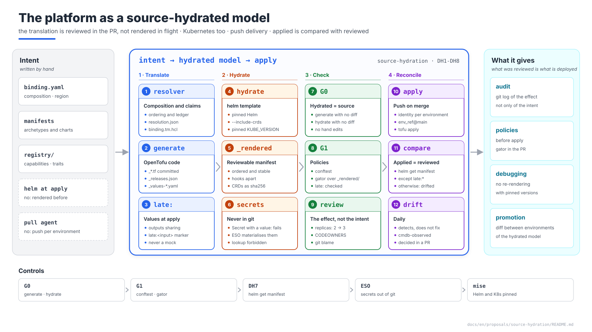

# The platform as a source-hydrated model — and the Kubernetes layer hydrated in the PR

| | |
|---|---|
| **Status** | Proposal · revision 1 |
| **Scope** | What a source-hydrated infrastructure model (SHIM) is and how it differs from classic GitOps; where the platform stands against it; and how to close the gap that remains — the Kubernetes layer, rendered today at `apply` —: rendering in the PR, an integrity gate, admission before `apply`, comparing what was applied with what was reviewed, and why delivery stays push |
| **Why now** | The platform already keeps in git the translation of intent into infrastructure, but not that of its charts: a reviewer sees "chart X changes" or "value Y changes", never the manifests, and Gatekeeper sees them for the first time at admission. That is exactly the "in-flight" rendering a hydrated model removes |
| **Base** | Architecture §4 (generation), §13.3–§13.4 (G1, G3), §14 (CI/CD); AM §12 (resolution); `gatekeeper-qa` §6.2 (`gator` in CI); `infra-repo-qa` §5 and templates; `cmdb-qa` (observed half); `multi-environment` DX1, DX9 |
| **Reference specification** | `archetype-model.md` (AM §n), `terramate-outputs-sharing-architecture.md` (§n), `risk-register.md` |
| **Diagrams** | `diagrams/*.mmd` (Mermaid source) and `diagrams/*.svg` (rendered). The SVG is regenerated from the `.mmd`; never hand-edited. `diagrams/02-presentation-blocks.svg` (1920×1080, for presentations) is generated by `02-presentation-blocks.py`, not Mermaid |
| **Local identifiers** | Decisions `DH1…`, candidate risks `RH1…`, verifications `VH1…` |

It reopens no decision of `CLAUDE.md`: delivery stays push with per-environment identities (`multi-environment` DX9), generated code is committed, and charts are still applied with `helm_release`. It finds four things, three of them measured with Helm 3.19.0 on the cert-manager v1.16.2 chart:

1. **The platform is already a source-hydrated model for infrastructure, not for Kubernetes** (§1).
2. **`--skip-crds` is not enough to separate the CRDs.** With `crds.enabled=true`, cert-manager renders its 6 CRDs from `templates/`, and `helm template --skip-crds` still emits them: they must be split by `kind` (measured).
3. **CRDs are 97 % of the render.** 1.25 MB of 1.29 MB; the rest is 38 KB that can be reviewed. They are kept as a digest (`name` and `sha256`), not whole (measured).
4. **Hooks come out of `helm template` and not of `helm get manifest`.** The four `startupapicheck` resources carry `helm.sh/hook: post-install` (measured); Helm returns them through `helm get hooks`. Comparing what was applied with what was reviewed requires splitting them.

Source: [`diagrams/01-hydration.mmd`](diagrams/01-hydration.mmd)

Source: [`diagrams/02-presentation-blocks.py`](diagrams/02-presentation-blocks.py) — presentation view; the detail is in §1–§5.

---

## 0. Source-hydrated versus classic GitOps

A **source-hydrated infrastructure model** keeps in git, versioned, the fully translated state that sits between the tenant's abstract intent and what is deployed, and does so **before** reconciling. Classic GitOps keeps the intent and leaves the translation to the controller, at sync time.

| | Classic GitOps | Source-hydrated |
|---|---|---|
| What git holds | The intent: charts, Kustomize, values | The intent **and** its translation, raw, versioned |
| Where it is translated | In the controller, at sync | In the pipeline, before merging; the result is committed |
| What is reviewed | The change of intent | The change of intent and its exact effect |
| "Why did X happen?" | Re-render, with the controller's version of the time | It is in the diff and in `git log` |
| Policies | On what reaches admission | Also on the translation, in the PR |
| Reconciliation | A pull agent, continuous, self-healing | Separate from the translation: pull or push |

| | Advantages | Drawbacks |
|---|---|---|
| **Classic GitOps** | Simple; continuous reconciliation; no target credentials in CI | The real effect is not reviewed; the controller's template engine version decides the result; cloud infrastructure needs operators |
| **Source-hydrated** | Review of the effect; nothing rendered in flight; full audit; policies before deployment; promotion as a diff | Large diffs and conflicts in generated output; needs an integrity gate; secrets are never hydrated; more CI; what is only known at apply cannot be rendered beforehand |

---

## 1. Where the platform stands (DH1)

The platform is a **source-hydrated model with push delivery**: intent is translated in the PR, the result is reviewed and merged, and CI reconciles on merge.

| Stage | In the platform | Hydrated on `main`? |
|---|---|---|
| Intent | Archetype manifests, `environments/<env>/binding.yaml` (the only file written by hand, `multi-environment` DX1), `registry/` | It is the source |
| Translation | Resolver (AM §12): composition, ordering, claims; `terramate generate` with generators and contracts | — |
| Translated model | `resolution.json`, `binding.tm.hcl`, ledger, the CMDB's declared half, `_*.tf` | **Yes**, in the same commit as the intent, under CODEOWNERS |
| Integrity gate | G0 (`terramate generate --detailed-exit-code`), `archetypectl cmdb check` | — |
| Values between stacks | Outputs sharing: the consumer receives the producer's value at `apply` | **No**: late-bound. The hydrated code carries the reference, not the value |
| Kubernetes manifests | `helm_release` renders the chart at `apply` | **No** — the gap this proposal closes |
| Reconciliation | `tofu apply` per environment on merge, with its identity; drift detected daily (`drift.yml`), recorded in `cmdb-observed`, not auto-corrected | — |

The only fully resolved artefact is the **plan**: it is reviewed in the PR but not versioned, because it changes with the state.

---

## 2. Hydrating the Kubernetes layer (DH2–DH5)

### 2.1 What is written and where (DH2)

Every stack that deploys charts carries, generated by `terramate generate` next to its `_*.tf`:

| File | Content | Written by |
|---|---|---|
| `_releases.json` | One entry per `helm_release`: name, namespace, chart (by digest, from the `charts` repository), version, values file | The generator |
| `_values-<release>.yaml` | The derived values the `helm_release` receives, the same ones | The generator |
| `_rendered/<release>.yaml` | What `helm get manifest` will return, without the CRDs, ordered by `kind`, namespace and name | `ci/hydrate.sh` |
| `_rendered/<release>.hooks.yaml` | The hooks: `helm template` renders them and `helm get manifest` does not | `ci/hydrate.sh` |
| `_rendered/<release>.crds.sha256` | One line per CRD: name and `sha256` | `ci/hydrate.sh` |

`ci/hydrate.sh` walks the `_releases.json` files, runs `helm template --include-crds --kube-version "$KUBE_VERSION"` with the Helm version pinned in `.mise.toml`, and splits the result with `ci/split-rendered.py` (templates in `infra-repo-qa/templates/ci/`). It fails if it finds no `_releases.json`: a gate that renders nothing cannot pass (architecture §14.4).

### 2.2 G0 covers the rendering (DH3)

G0 becomes two checks: `terramate generate --detailed-exit-code`, and `ci/hydrate.sh` followed by an empty `git status --porcelain -- '*/_rendered/*'`. A hand edit in `_rendered/`, or a chart bumped without re-hydrating, fails the PR. Tested on a sample stack: two renders in a row give byte-identical files, and changing `replicaCount` from 2 to 3 shows in the diff exactly as `replicas: 2 → 3`.

### 2.3 Late-bound values (DH4)

A chart value that arrives through outputs sharing is not known in the PR. The generator passes it as a `set` entry and writes it into `_values-<release>.yaml` as a named marker, `late:<input>` — never a mock, which would pass an invented value off as real, and never the real value. The reviewer sees exactly which fields resolve at `apply`. A G1 rule rejects a chart value that comes from an `input` without that marker.

### 2.4 What is not hydrated, on purpose (DH5)

| What | Why | How |
|---|---|---|
| CRDs | 97 % of the render; whole, they would make the diff unreadable | A `name sha256` digest: a CRD change shows as a different hash |
| A `Secret` with `data` or `stringData` | A secret in git never leaves its history | `split-rendered.py` fails (tested): secrets are materialised by ESO |
| Charts using the `lookup` function | They render differently without a cluster | Forbidden in our charts (G1); in third-party ones, recorded per chart and watched by DH7 |

---

## 3. Admission before `apply` (DH6)

`gator test` with `library`'s `ConstraintTemplate`s and `Constraint`s runs over `_rendered/` in G1, as `gatekeeper-qa` §6.2 now extends it: a pod breaking P11 or P13, an image without a digest (P2) or a KSA carrying another environment's prefix (P12) fail the PR, not the `apply`. Admission stays the last line; this is the first.

---

## 4. What was applied is what was reviewed (DH7)

After each `helm_release`, the deploy compares `helm get manifest` with `_rendered/<release>.yaml` (and `helm get hooks` with `.hooks.yaml`), masking only the `late:*` fields. A difference marks the observation `drifted` in the CMDB (`cmdb-observed`) and fails the step: it catches a provider Helm version different from the CLI's, a third-party chart's `lookup`, or a `KUBE_VERSION` out of step with the cluster. Without this comparison, the hydrated output would be a claim nobody checks.

---

## 5. Delivery stays push (DH8)

The hydrated model separates translation from reconciliation; it does not require a pull agent. The platform keeps push delivery because each `apply` is made by its environment's identity, bound to its GitHub Environment and to `main` (`multi-environment` DX9), and because a continuous, automatic `apply` on stateful infrastructure — databases, keys, networks — corrects drift by destroying. Drift is detected daily and decided in a PR.

### 5.1 Alternatives on Google Cloud

Google Cloud offers pieces that cover part of this design. They were considered and are rejected, except for the first one's idea:

| Product | What it does | Stance | Why |
|---|---|---|---|
| kpt | Packages of KRM manifests in git, transformed by functions; distinguishes *dry* configuration (templates, intent) from *wet* (rendered) | **Idea adopted**: `_rendered/` is the wet half, in the same commit as the intent (DH2) | One PR reviews the intent and its effect; a separate wet repository adds one more sync and a second place to review |
| Config Sync | Pull GitOps agent for GKE; can render Kustomize and Helm inside the cluster | **No** | It is pull: an identity in the cluster that writes, and continuous reconciliation, against the per-environment identity bound to `main` (DX9). Its rendering in the cluster is exactly the in-flight rendering DH2 removes |
| Policy Controller | Managed Gatekeeper, with a constraint library | **No**: self-managed Gatekeeper | Settled in `CLAUDE.md`: one version and one behaviour on all three clouds; the managed add-on restricts custom templates. `gator` in CI plays the same role before the `apply` (DH6) |
| Config Connector, Config Controller | GCP resources as Kubernetes objects, continuously reconciled by an operator; Config Controller hosts it alongside Config Sync and Policy Controller | **No** | Duplicates the role of OpenTofu and its state; continuous auto-correction on stateful infrastructure corrects drift by destroying (DH8) |
| Cloud Deploy (with Skaffold) | Renders the manifests when the release is created, once per target, and promotes that release without rendering again | **No**, with the same principle | "Render once and promote the rendering" is the rule of the image promoted and never rebuilt (`developer-guide.md`) applied to manifests. What this design adds: the rendering is reviewed in the PR and compared with what was applied (DH7) |

Google Cloud's managed path is pull with continuous reconciliation, cloud infrastructure included. The platform hydrates like kpt or Cloud Deploy, but keeps push delivery.

---

## 6. Risks and verifications

### 6.1 Candidate risks

| # | Risk | Likelihood | Impact | Mitigation |
|---|---|---|---|---|
| RH1 | **What is rendered is not what is applied**: provider Helm different from the CLI, `lookup`, `KUBE_VERSION` out of step | Medium | High — one thing is reviewed and another applied, and nobody knows | Versions pinned in `.mise.toml`; comparison after `apply` (DH7); VH1, VH2 |
| RH2 | **Noise and conflicts in `_rendered/`** | High with many PRs | Low — slow reviews | CRDs as hashes; stable ordering; on a conflict, re-hydrate, never hand-merge |
| RH3 | **A secret value hydrated into git** | Low with the rule | Critical — it never leaves the history | `split-rendered.py` fails on a `Secret` with a value; secrets only through ESO; the values file receives no secrets (`CLAUDE.md`, outputs sharing) |

### 6.2 Verifications

| # | Verification | Result that closes it |
|---|---|---|
| VH1 | Rendered equals applied | For each platform chart on `qa`: `helm get manifest` equals `_rendered/<release>.yaml`, masking `late:*` |
| VH2 | The provider's Helm version | The Helm version embedded in the pinned `helm` provider matches the CLI's in `.mise.toml` |
| VH3 | `gator` over the rendering | A chart with a `system` toleration from a foreign namespace fails G1 on P11 |
| VH4 | `hydrate.sh` | Deterministic; splits CRDs and hooks; fails without `_releases.json` and on a `Secret` with a value — **done in the design** (Helm 3.19.0, cert-manager v1.16.2) |

---

## 7. Changes to other documents

| Document | Change | Status |
|---|---|---|
| Architecture §14.4 | G0 includes `_rendered/`; the generated-files convention (`_releases.json`, `_values-*.yaml`, `_rendered/`) | **Applied** (DH2, DH3) |
| Architecture §14.5 (new) | The platform as a source-hydrated model | **Applied** (DH1, DH8) |
| `gatekeeper-qa` §6.2 | `gator test` also over `_rendered/` | **Applied** (DH6) |
| `infra-repo-qa` (`ci/hydrate.sh`, `ci/split-rendered.py`, `ci/g1.sh`, `preview.yml`, `.mise.toml` templates) | Hydration, extended G0, `gator`, pinned Helm | **Applied** (DH2, DH3, DH6) |
| Risk register | R72 (RH1), R73 (RH3) | **Applied** |

---

## 8. Decisions

| # | Decision | Status | Recommendation | Alternative |
|---|---|---|---|---|
| DH1 | What model the platform is | **Proposed** | Source-hydrated with push delivery; a table of what is hydrated, late-bound and not hydrated | Calling it GitOps and leaving unsaid what is reviewed and what is not |
| DH2 | Hydrating Kubernetes | **Proposed** | `helm template` in the PR with the same values and the same version; `_rendered/` committed | Keep rendering only at `apply` |
| DH3 | Integrity | **Proposed** | G0 extended to `_rendered/` | Trust that someone hydrates |
| DH4 | Late-bound values | **Proposed** | A `late:<input>` marker, checked in G1 | Mocks: an invented value that looks real |
| DH5 | What is not hydrated | **Proposed** | CRDs as a hash; never a `Secret` with a value; `lookup` forbidden in our charts | Whole CRDs (97 % of the render) |
| DH6 | Admission before `apply` | **Proposed** | `gator test` over `_rendered/` in G1 | Admission in the cluster only |
| DH7 | Applied is reviewed | **Proposed** | Compare `helm get manifest` / `_rendered/` after every `apply` | Assume it |
| DH8 | Delivery | **Proposed** | Push, as today | A pull agent reconciling continuously (Config Sync, Config Connector; §5.1) |

---

## 9. Implementation plan

| Phase | Contents | Exit criterion |
|---|---|---|
| **1 · Generators** | `_releases.json` and `_values-<release>.yaml` from the generators of archetypes with charts; the `late:` marker and its G1 rule | `terramate generate` emits them for every stack with a `helm_release`; the rule fails on an `input` without a marker |
| **2 · Hydration and G0** | `ci/hydrate.sh`, `ci/split-rendered.py`, pinned Helm, extended G0 | A PR that changes a value shows the change in `_rendered/`; a hand edit fails G0 |
| **3 · Admission in the PR** | `gator test` over `_rendered/` | **VH3** |
| **4 · Comparison after `apply`** | DH7 in `apply-env` and in `first-deploy` | **VH1**, **VH2** on `qa` |
