# Terramate Archetypes with Outputs Sharing

**A reference architecture for multi-cloud, multi-environment infrastructure using Terramate CLI + OpenTofu**

| | |
|---|---|
| **Scope** | Terramate CLI (OSS) + OpenTofu, no HCP Terraform, no Terraform Stacks |
| **Core mechanism** | Terramate Outputs Sharing (`sharing_backend` / `output` / `input`) |
| **Clouds covered** | Google Cloud, AWS and Azure at parity; extensible to a fourth |
| **Audience** | Platform engineering, technology architecture |
| **Status of key dependency** | Outputs Sharing is an **experimental** Terramate feature — see [§15 Risk Register](#15-risk-register) |

---

## Table of contents

1. [Why this document exists](#1-why-this-document-exists)
2. [Core concepts and vocabulary](#2-core-concepts-and-vocabulary)
3. [Architecture](#3-architecture)
4. [Element-by-element reference](#4-element-by-element-reference)
5. [Guide A — GKE platform and its dependency chain](#5-guide-a--gke-platform-and-its-dependency-chain)
6. [Guide B — EKS platform and its dependency chain](#6-guide-b--eks-platform-and-its-dependency-chain)
7. [Guide C — Cloud Run platform and its dependency chain](#7-guide-c--cloud-run-platform-and-its-dependency-chain)
8. [Guide D — ECS Fargate platform and its dependency chain](#8-guide-d--ecs-fargate-platform-and-its-dependency-chain)
9. [Guide E — AKS platform and its dependency chain](#9-guide-e--aks-platform-and-its-dependency-chain)
10. [Edge attachment across clouds](#10-edge-attachment-across-clouds)
11. [Identity, access and security baseline](#11-identity-access-and-security-baseline)
12. [Environment management: dedicated and shared](#12-environment-management-dedicated-and-shared)
13. [Policy and security validation](#13-policy-and-security-validation)
14. [CI/CD with GitHub Actions](#14-cicd-with-github-actions)
15. [Risk register](#15-risk-register) — full register in `risk-register.md`
16. [Adoption roadmap](#16-adoption-roadmap)
17. [Appendix — conventions cheat sheet](#17-appendix--conventions-cheat-sheet)

> **Start with `platform-overview.md`** for a diagram-led map of the document set.
>
> **Risks** live in `risk-register.md`, grouped by domain and reviewed at every phase gate.
>
> **Companion document.** `archetype-model.md` specifies the archetype packaging
> model — manifests, capability/trait resolution, multi-stack archetypes, the
> component catalog, hierarchical CIDR pools, tenant resources on shared
> operators, the Git-based CMDB, and the resolver that validates a composition
> and writes `binding.tm.hcl` *before* this document's generators run.

---

## 1. Why this document exists

Terraform Stacks — the `component` / `stack` / `deployment` block model published by HashiCorp — is a feature of the **hosted platform** (HCP Terraform and Terraform Enterprise 2.0+). It is not available in the open-source Terraform CLI, and it is not available in OpenTofu at all. The layered "stacks within stacks" pattern that circulates in the community therefore cannot be executed on a CLI-only toolchain.

Terramate solves the same class of problem with a fundamentally different model:

| Terraform Stacks (HCP) | Terramate (CLI) |
|---|---|
| Stacks compose by nesting `stack` blocks | Stacks are flat; **abstraction lives in code generation** |
| Inputs passed explicitly between stack layers | Data flows via **globals** (compile time) or **outputs sharing** (run time) |
| Orchestration by the platform | Orchestration by `terramate run` in your own CI |
| Registry-published, versioned artifacts | Git-versioned generators and modules in a monorepo |

The consequence is that "a landing zone base layer wrapped by a cloud-specific layer" does **not** become nested stacks. It becomes:

- **Generators** (`generate_hcl`) that emit the Terraform/OpenTofu code — the base layer.
- **Globals** overridden down the directory tree — the cloud-specific and environment-specific layers.
- **Outputs sharing** to pass runtime facts (VPC IDs, cluster endpoints, OIDC provider ARNs) between stacks that cannot be known at code-generation time.

This document specifies that architecture in full.

---

## 2. Core concepts and vocabulary

Consistent vocabulary matters here because Terraform, Terragrunt and Terramate all use the word *stack* for different things.

| Term | Definition in this architecture |
|---|---|
| **Module** | A reusable OpenTofu module — resources, variables, outputs, provider constraints. No backend. Lives in `modules/` or a registry. |
| **Stack** | A directory containing a `stack.tm.hcl`, a backend configuration and its own state file. The smallest unit Terramate orchestrates. |
| **Capability** | A functional role a stack plays: `network`, `cluster`, `data`, `platform-services`, `app`. Drives which generator applies. |
| **Platform** | A set of stacks providing shared foundations for a cloud and environment: network + cluster + platform services. Produces outputs. |
| **Archetype** | A reusable, parameterised composition of application stacks (e.g. `webapp-3tier`). A template, not a deployment. |
| **Archetype instance** | A concrete deployment of an archetype, bound to one platform and one environment. Consumes outputs. |
| **Producer stack** | A stack that declares `output` blocks. |
| **Consumer stack** | A stack that declares `input` blocks. |
| **Binding** | The act of pointing an archetype instance at a specific platform, by setting `global.platform.*` stack IDs. |
| **Dedicated environment** | A platform serving exactly one archetype instance. |
| **Shared environment** | A platform serving many archetype instances simultaneously (typical for demos). |

### How a stack is located

Every stack sits at the intersection of independent axes, and keeping them orthogonal is what makes the model scale:

| Axis | Values | Resolved by |
|---|---|---|
| **Cloud** | gcp \| aws \| azure | globals + generator `condition` — which provider and backend are generated |
| **Environment** | prod \| qa \| dev \| demos \| ephemeral-* | directory position + globals — sizing, project/account |
| **Capability** | network \| cluster \| platform-services \| data \| app | generators + stack filters — which module is called |
| **Archetype instance** | webapp-3tier/alpha, keycloak, … | directory subtree — which set of stacks exists |

The archetype axis is specified in full by the companion document: capabilities, traits, layers and the manifest grammar that decides which archetype may satisfy which requirement. This document treats it as given and covers generation.

---

## 3. Architecture

### 3.1 Logical view

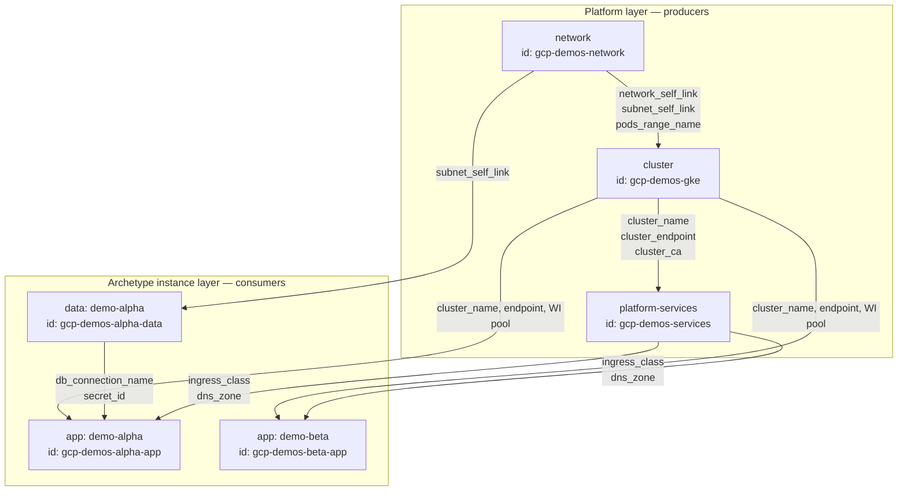

Two properties of this graph drive every design decision downstream:

1. **The platform layer is a shared publisher.** Many archetype instances consume from the same producers. A change to a platform output is a breaking change for every consumer.
2. **The edges are runtime, not compile-time.** A `cluster_endpoint` does not exist until the cluster is applied. This is exactly what outputs sharing addresses and what globals cannot address.

### 3.2 Physical view — repository layout

```
repo/
├── terramate.tm.hcl                       # root config: experiments, sharing_backend, run env
├── mise.toml                              # pinned terramate / tofu / checkov versions
├── .checkov/
│   ├── gcp.yaml
│   └── aws.yaml
│
├── modules/                               # OpenTofu modules (or a remote registry)
│   ├── gcp-network/
│   ├── gcp-gke/
│   ├── aws-network/
│   ├── aws-eks/
│   ├── app-workload/
│   └── ...
│
├── imports/                               # never contains stacks; only importable config
│   ├── mixins/
│   │   ├── backend_gcp.tm.hcl             # generate_hcl "_backend.tf" for GCS
│   │   ├── backend_aws.tm.hcl             # generate_hcl "_backend.tf" for S3
│   │   ├── provider_gcp.tm.hcl
│   │   ├── provider_aws.tm.hcl
│   │   └── labels.tm.hcl                  # common labels/tags injected into every stack
│   │
│   ├── generators/v1/                     # "the base layer": one generator per capability
│   │   ├── gen_network.tm.hcl
│   │   ├── gen_cluster.tm.hcl
│   │   ├── gen_data.tm.hcl
│   │   ├── gen_platform_services.tm.hcl
│   │   └── gen_app.tm.hcl
│   │
│   └── contracts/                         # output/input contracts per capability
│       ├── contract_network_gcp.tm.hcl
│       ├── contract_network_aws.tm.hcl
│       ├── contract_cluster_gke.tm.hcl
│       ├── contract_cluster_eks.tm.hcl
│       └── contract_data.tm.hcl
│
└── stacks/
    ├── platforms/
    │   ├── gcp/
    │   │   ├── config.tm.hcl              # globals: cloud = "gcp"
    │   │   ├── demos/               # SHARED environment
    │   │   │   ├── config.tm.hcl          # globals: env, project_id, cidrs, sizing
    │   │   │   ├── network/     stack.tm.hcl
    │   │   │   ├── gke/         stack.tm.hcl
    │   │   │   └── services/    stack.tm.hcl
    │   │   └── prod/                       # DEDICATED environment
    │   │       ├── config.tm.hcl
    │   │       ├── network/ gke/ services/
    │   └── aws/
    │       ├── config.tm.hcl              # globals: cloud = "aws"
    │       ├── demos/
    │       │   ├── config.tm.hcl
    │       │   ├── network/ eks/ services/
    │       └── prod/
    │           └── network/ eks/ services/
    │
    └── archetypes/
        ├── webapp-3tier/
        │   ├── manifest.yaml              # requires / provides / stacks / claims
        │   ├── archetype.tm.hcl           # globals common to the archetype
        │   └── instances/
        │       ├── alpha/                 # bound to gcp/demos
        │       │   ├── binding.tm.hcl     # WRITTEN BY THE RESOLVER
        │       │   ├── iam/       stack.tm.hcl
        │       │   ├── secrets/   stack.tm.hcl
        │       │   ├── data/      stack.tm.hcl
        │       │   ├── messaging/ stack.tm.hcl
        │       │   ├── firewall/  stack.tm.hcl
        │       │   ├── app/       stack.tm.hcl
        │       │   └── frontdoor/ stack.tm.hcl
        │       ├── beta/                  # bound to the SAME gcp/demos
        │       └── disasterproject-prod/             # bound to aws/prod — dedicated
        └── event-driven/
            └── ...
```

An instance's stack directories are **generated from the archetype's `stacks[]`**, and a stack whose `condition` is false has no directory at all. `binding.tm.hcl` is the resolver's output, never hand-edited.

Three rules that make this layout work:

- **`imports/` contains no stacks.** Terramate must never orchestrate anything under it. It holds only `generate_hcl`, `globals` and contract blocks that stacks import.
- **A platform stack never imports archetype config, and vice versa.** The only coupling is through outputs sharing.
- **Generated files are committed to git** and prefixed with `_` so they sort together and are easy to match in `CODEOWNERS`.

### 3.3 Data flow view — how a value travels

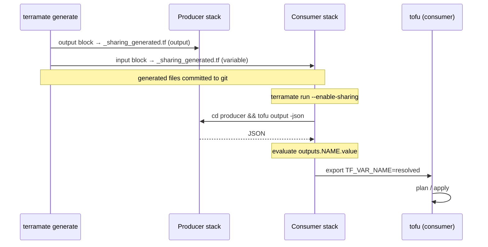

The critical implication of the third arrow: **the CI job running a consumer stack needs read access to the producer stack's state backend.** In a multi-account or multi-project topology this is a concrete IAM requirement, covered in §11.5, and per-guide in §5.6, §6.6, §7.7, §8.7 and §9.5.

---

## 4. Element-by-element reference

### 4.1 `terramate.tm.hcl` — root configuration

```hcl
# /terramate.tm.hcl
terramate {
  # Pin to a version you have verified. Outputs Sharing block semantics
  # changed in 0.10.9 (the `sensitive` field lost its default).
  required_version = ">= 0.11.0"

  config {
    # Outputs Sharing is experimental and must be opted into explicitly.
    experiments = ["outputs-sharing"]

    git {
      default_branch = "main"
      default_remote = "origin"
    }

    run {
      env {
        TF_PLUGIN_CACHE_DIR = "${terramate.root.path.fs.absolute}/.tofu-plugin-cache"
        TF_IN_AUTOMATION    = "1"
      }
    }
  }
}
```

| Element | Purpose | Notes |
|---|---|---|
| `required_version` | Guards against CLI drift between developer laptops and CI | Pin it; do not use `latest` in CI |
| `experiments` | Enables `sharing_backend`, `input`, `output` | Without this the blocks are parse errors |
| `config.git` | Baseline for change detection | `--changed` compares against `default_branch` |
| `config.run.env` | Environment injected into every `terramate run` | Good place for the plugin cache; a shared cache materially reduces CI time when you have dozens of stacks |

### 4.2 `sharing_backend` — the transport

```hcl
# /terramate.tm.hcl (same file or a sibling .tm.hcl at root)
sharing_backend "tofu" {
  type     = terraform                       # keyword, NOT a string; works for OpenTofu too
  filename = "_sharing_generated.tf"
  command  = ["tofu", "output", "-json"]
}
```

| Attribute | Type | Meaning |
|---|---|---|
| label (`"tofu"`) | string | Name referenced by every `input.backend` and `output.backend`. Use one backend per IaC engine, not per cloud. |
| `type` | keyword | Only `terraform` is supported today. It is a bare keyword — quoting it is a syntax error. |
| `filename` | string | The file Terramate generates in each stack holding the derived `variable` / `output` blocks. |
| `command` | list(string) | Executed **inside the producer stack directory**; stdout must be a JSON object. |

**Design guidance**

- Define the `sharing_backend` **once at repository root** so it is visible to every stack. Defining it per-cloud creates two namespaces that cannot reference each other, which breaks cross-cloud archetypes.
- The `command` must be *cheap and side-effect free*. `tofu output -json` requires an initialised working directory; ensure your CI runs `tofu init` on producers before consumers, or wrap the command in a script that inits on demand.
- Because it is just a command producing JSON, you can substitute a faster path later (e.g. reading a published outputs artifact from object storage) without changing any `input`/`output` block.

### 4.3 `output` — the producer contract

```hcl
# stacks/platforms/gcp/demos/network/outputs.tm.hcl
output "network_self_link" {
  backend     = "tofu"
  value       = module.network.network_self_link
  description = "Self link of the shared VPC"
}

output "gke_pods_range_name" {
  backend = "tofu"
  value   = module.network.secondary_range_names.pods
}
```

| Attribute | Required | Meaning |
|---|---|---|
| label | yes | Output name. This is the **public contract key** — treat renames as breaking changes. |
| `backend` | yes | Must match a `sharing_backend` label. |
| `value` | yes | Expression evaluated **in the generated OpenTofu code**, so it may reference `module.*`, `resource.*`, `data.*`. |
| `description` | no | Emitted into the generated `output` block. Use it — it becomes your contract documentation. |
| `sensitive` | no | Only emitted when set. See the warning below. |

> **Sensitive values.** Outputs sharing resolves values into `TF_VAR_<name>` environment variables in the consumer's process. Environment variables are visible to anything in that process tree and are easy to leak into CI logs. **Do not share secrets through outputs sharing.** Share *references* — a Secret Manager secret ID, an SSM parameter name, a KMS key ARN — and let the consumer stack read the secret through a data source under its own IAM identity.

**Where to put `output` blocks.** Put them in `imports/contracts/` and import them into the producer stack, not inline. This gives you one place to review the contract, and it makes the contract reusable across every environment that instantiates the same capability.

```hcl
# imports/contracts/contract_network_gcp.tm.hcl
# Imported by every GCP network stack.
output "network_self_link" { backend = "tofu"  value = module.network.network_self_link }
output "subnet_self_link"  { backend = "tofu"  value = module.network.subnet_self_link }
output "gke_pods_range_name"     { backend = "tofu"  value = module.network.range_pods }
output "gke_services_range_name" { backend = "tofu"  value = module.network.range_services }
output "project_id"        { backend = "tofu"  value = var.project_id }
```

```hcl
# stacks/platforms/gcp/demos/network/stack.tm.hcl
stack {
  id   = "gcp-demos-network"
  name = "GCP demos — network"
  tags = ["gcp", "demos", "network", "platform", "producer"]
}

import { source = "/imports/contracts/contract_network_gcp.tm.hcl" }
import { source = "/imports/mixins/backend_gcp.tm.hcl" }
import { source = "/imports/mixins/provider_gcp.tm.hcl" }
import { source = "/imports/generators/v1/gen_network.tm.hcl" }
```

### 4.4 `input` — the consumer contract

```hcl
# imports/contracts/contract_cluster_gke.tm.hcl — imported by GKE cluster stacks
input "network_self_link" {
  backend       = "tofu"
  from_stack_id = global.platform.network_stack_id
  value         = outputs.network_self_link.value
  mock          = "projects/mock-project/global/networks/mock-vpc"
}

input "subnet_self_link" {
  backend       = "tofu"
  from_stack_id = global.platform.network_stack_id
  value         = outputs.subnet_self_link.value
  mock          = "projects/mock-project/regions/europe-west1/subnetworks/mock-subnet"
}
```

| Attribute | Required | Meaning |
|---|---|---|
| label | yes | Becomes a generated `variable "<label>"` in the consumer. Reference it as `var.<label>` in your generated code. |
| `backend` | yes | Must match a `sharing_backend` label. |
| `from_stack_id` | yes | The **stack ID** of the producer. This is a string expression — and it is the single most important lever in this architecture. |
| `value` | yes | Expression over the `outputs.*` namespace built from the producer's JSON. |
| `mock` | no | Fallback used only when `--mock-on-fail` is passed. Essential for PR previews. |
| `sensitive` | no | Only emitted when set. |

#### The `from_stack_id` lever

Because `from_stack_id` accepts an expression, it can be driven by a global:

```hcl
# stacks/archetypes/webapp-3tier/instances/alpha/binding.tm.hcl
globals "platform" {
  cloud              = "gcp"
  env                = "demos"
  network_stack_id   = "gcp-demos-network"
  cluster_stack_id   = "gcp-demos-gke"
  services_stack_id  = "gcp-demos-services"
  # Where this instance's workloads live inside a shared cluster:
  namespace          = "demo-alpha"
}
```

```hcl
# stacks/archetypes/webapp-3tier/instances/disasterproject-prod/binding.tm.hcl
globals "platform" {
  cloud              = "aws"
  env                = "prod"
  network_stack_id   = "aws-prod-network"
  cluster_stack_id   = "aws-prod-eks"
  services_stack_id  = "aws-prod-services"
  namespace          = "disasterproject"
}
```

The archetype's `input` blocks are written **once**, in `imports/contracts/`, referencing `global.platform.cluster_stack_id`. Binding an instance to a shared demo platform or to a dedicated production platform is then a **five-line file**. This is what replaces the "wrapper stack component configuration" layer from the HCP Stacks pattern — late binding through globals instead of nesting.

> **Design decision: `from_stack_id` is an expression.** This architecture assumes
> `from_stack_id` resolves globals, which is what allows one contract file per
> capability to serve every instance. Three variants still need confirming against
> your pinned Terramate version, because the basic form working does not guarantee
> them: globals **inherited** from a parent directory rather than defined in the
> stack; **interpolation** (`"${global.env}-gke"`) rather than a bare reference; and
> `mock` behaviour under `--mock-on-fail` when the producer has no state yet.
>
> Globals in `stack.after` remain an open question, and it fails **silently** — an
> unresolved expression leaves the ordering empty rather than raising an error, so
> a consumer can run before its producer. That is risk R2. The lint in §14.4 catches
> it; if globals do not resolve there, fall back to tag-based ordering (§4.5).

#### Mocks are not optional

In any repository where a producer and a consumer can change in the same pull request, plan previews of the consumer will fail — the new outputs do not exist yet. Every `input` block should carry a `mock` whose **shape and type** match the real value. A mock of the wrong type produces a plan that succeeds locally and fails on apply.

Convention: prefix every mock with `mock-` so that a mocked value appearing in a *deployment* log is immediately recognisable as a bug.

### 4.5 `stack` — identity and ordering

```hcl
stack {
  id    = "gcp-demos-gke"
  name  = "GCP demos — GKE cluster"
  tags  = ["gcp", "demos", "cluster", "gke", "platform", "producer"]
  after = ["/stacks/platforms/gcp/demos/network"]
}
```

> **This is the most common source of production incidents in this architecture.**
> Outputs sharing **does not create execution order**. Terramate orders stacks by directory nesting and by explicit `before` / `after` only. An `input` block referencing a producer will happily run before that producer, resolve against stale state (or fail), and apply the wrong value.
>
> **Every `input` block must have a matching `after` entry.** Enforce this with a repository lint (§14.4).

`stack.id` requirements:

- **Globally unique** across the repository.
- **Stable.** It is the wire key of the sharing contract. Renaming a stack ID breaks every consumer bound to it.
- **Derivable by humans**, because you will write it by hand in binding files.

Convention: `<cloud>-<env>-<capability>[-<instance>]`

| Example | Meaning |
|---|---|
| `gcp-demos-network` | Shared demo GCP network |
| `aws-prod-eks` | Production AWS EKS cluster |
| `gcp-demos-alpha-data` | Data stack of instance `alpha` on the shared demo platform |

### 4.6 `globals` — the compile-time layer

Globals are the mechanism that replaces the "cloud-specific wrapper layer" of the HCP pattern. They are inherited down the directory tree and can be overridden at any level.

```hcl
# stacks/platforms/gcp/config.tm.hcl                      ← cloud layer
globals {
  cloud             = "gcp"
  state_bucket      = "disasterproject-tfstate-gcp"
  oidc_provider_var = "GOOGLE_WORKLOAD_IDENTITY_PROVIDER"
}
```

```hcl
# stacks/platforms/gcp/demos/config.tm.hcl          ← environment layer
globals {
  env        = "demos"
  project_id = "disasterproject-demos"
  region     = "europe-west1"
  vpc_cidr   = "10.4.0.0/17"             # claimed from the permanent block (AM §9.2)
}

globals "cluster" {
  min_nodes       = 1
  max_nodes       = 12
  machine_type    = "e2-standard-4"
  release_channel = "REGULAR"
  deletion_protection = false      # shared demo: intentionally destroyable
}

globals "policy" {
  # Shared demo platforms are multi-tenant; quotas are mandatory.
  enforce_namespace_quota = true
  enforce_network_policy  = true
}
```

```hcl
# stacks/platforms/gcp/prod/config.tm.hcl                  ← environment layer (dedicated)
globals {
  env        = "prod"
  project_id = "disasterproject-prod"
  region     = "europe-west1"
  vpc_cidr   = "10.6.0.0/16"             # production gets a /16
}

globals "cluster" {
  min_nodes           = 3
  max_nodes           = 60
  machine_type        = "n2-standard-8"
  release_channel     = "STABLE"
  deletion_protection = true
}
```

**Rule of thumb for choosing globals vs outputs sharing:**

| The value is... | Use |
|---|---|
| Known before apply (CIDR, region, machine type, naming convention, a deterministic resource name) | **Globals** |
| Only knowable after apply (generated ID, endpoint, CA certificate, OIDC provider ARN) | **Outputs sharing** |
| Known before apply but produced by another team's pipeline | **Globals**, populated from a checked-in file — do not couple pipelines needlessly |

Prefer globals wherever possible. Every outputs-sharing edge is a runtime coupling, a CI permission requirement, and a failure mode. Every global is a compile-time constant.

### 4.7 `generate_hcl` — the base layer

Generators are where the "generalised landing zone" lives. One generator per capability, selecting behaviour from globals.

```hcl
# imports/generators/v1/gen_cluster.tm.hcl
generate_hcl "_main.tf" {
  condition = global.capability == "cluster" && global.cloud == "gcp"

  content {
    module "gke" {
      source = "${terramate.stack.path.to_root}/modules/gcp-gke"

      project_id = global.project_id
      region     = global.region
      name       = "${global.env}-gke"

      # Compile-time values from globals
      min_nodes       = global.cluster.min_nodes
      max_nodes       = global.cluster.max_nodes
      machine_type    = global.cluster.machine_type
      release_channel = global.cluster.release_channel

      # Runtime values arriving via outputs sharing as generated variables
      network    = var.network_self_link
      subnetwork = var.subnet_self_link
      pods_range_name     = var.gke_pods_range_name
      services_range_name = var.gke_services_range_name

      labels = global.labels
    }
  }
}
```

| Attribute | Purpose |
|---|---|
| label | Filename generated inside each matching stack. Prefix with `_` by convention. |
| `condition` | Boolean expression over globals — the cleanest way to branch on cloud and capability. |
| `stack_filter` | Path-based selection (`project_paths`, `repository_paths`) when a condition is awkward. |
| `content` | The HCL to emit. Terramate variables and functions are interpolated; everything else passes through unchanged. |

**Generator versioning.** Put generators under `imports/generators/v1/` and gate them with `condition = global.generators.version == "v1"`. When you need a breaking change, add `v2/` alongside and migrate environments one at a time by flipping a global. This is the CLI equivalent of publishing a new version of a stack component configuration.

### 4.8 `script` — reusable workflows

`terramate script` blocks let you name a multi-step workflow once and invoke it identically from a laptop and from CI. Critically, the sharing flags are expressible here.

```hcl
# /imports/scripts/tofu.tm.hcl (imported at root)
script "tofu" "preview" {
  name        = "Plan changed stacks"
  description = "init, validate, plan with sharing and mocks"
  job {
    commands = [
      ["tofu", "init", "-lock-timeout=5m", "-input=false"],
      ["tofu", "validate"],
      ["tofu", "plan", "-out", "out.tfplan", "-lock=false", "-input=false", {
        enable_sharing = true
        mock_on_fail   = true
      }],
    ]
  }
}

script "tofu" "deploy" {
  name        = "Apply changed stacks"
  description = "init, plan, apply with sharing; mocks disabled"
  job {
    commands = [
      ["tofu", "init", "-lock-timeout=5m", "-input=false"],
      ["tofu", "plan", "-out", "out.tfplan", "-input=false", {
        enable_sharing = true
      }],
      ["tofu", "apply", "-input=false", "-auto-approve", "-lock-timeout=5m", "out.tfplan"],
    ]
  }
}
```

> **`mock_on_fail` must be `true` for previews and `false` for deployments.** A deployment that silently falls back to a mock value will apply nonsense. Keeping the two paths in separate named scripts makes that impossible to get wrong by accident.

### 4.9 `assert` — guard rails at generate time

`assert` blocks fail `terramate generate` when an invariant is violated. Use them to enforce the architecture rather than documenting it.

```hcl
# imports/contracts/guards.tm.hcl
assert {
  assertion = global.platform.cloud == global.cloud
  message   = "Archetype instance is bound to a ${global.platform.cloud} platform but sits in a ${global.cloud} tree"
}

assert {
  assertion = global.env != "prod" || global.cluster.deletion_protection
  message   = "Production clusters must enable deletion protection"
}

assert {
  assertion = !tm_contains(["demos"], global.env) || global.policy.enforce_namespace_quota
  message   = "Shared environments must enforce namespace quotas"
}
```

### 4.10 An archetype maps to several stacks

The companion document models an archetype as a **set of stacks with internal
ordering** — Keycloak owns its identity, secrets, database, firewall, application
and front-door stacks. That maps onto this document's primitives directly:

| Companion model | This document |
|---|---|
| `stacks[].name` | One directory with a `stack.tm.hcl` under the instance |
| `stacks[].after` | `stack.after` |
| `stacks[].use: component/x` | Generators emit the component's chart and resources |
| `stacks[].condition` | Which stack directories the resolver generates at all |
| `provides[].outputs[].from` | Which internal stack the consumer's `from_stack_id` points at |
| `claims[]` | Values written into `binding.tm.hcl` as globals |

The resolver runs **before** `terramate generate` and produces the
`binding.tm.hcl` that §4.4 and §4.6 consume. A stack whose `condition` evaluates
false is not generated, so its directory does not exist and Terramate never
orchestrates it.

Encapsulation matters here: `provides` belongs to the archetype, not to a stack.
Consumers reference a capability; the resolver maps each output to the internal
stack producing it. Reorganising an archetype's internal stacks is therefore not
a breaking change, provided the output names hold.

### 4.11 First deployment of a new environment

The same sequence applies to every cloud and runtime; only the tag selectors change.

```bash
terramate generate
git diff --exit-code                  # generated code must be committed

# Staged apply — sharing enabled, mocks OFF. Platform layers first.
terramate run --tags <cloud>:<env>:network  --enable-sharing -- tofu init -input=false
terramate run --tags <cloud>:<env>:network  --enable-sharing -- tofu apply -auto-approve
terramate run --tags <cloud>:<env>:cluster  --enable-sharing -- tofu init -input=false
terramate run --tags <cloud>:<env>:cluster  --enable-sharing -- tofu apply -auto-approve
terramate run --tags <cloud>:<env>:platform-services --enable-sharing -- tofu apply -auto-approve

# Once the platform exists, an instance deploys in one ordered run.
terramate run --tags instance:<name> --enable-sharing -- tofu apply -auto-approve
```

Staging is required only on a **first** apply of a new environment, because a
consumer's provider block cannot reach a cluster that does not yet exist. After
that, `terramate run --changed` resolves the whole graph in one pass.

### 4.12 Element summary table

| Element | File convention | Layer it implements | Evaluated |
|---|---|---|---|
| `terramate` | `/terramate.tm.hcl` | Repository configuration | generate + run |
| `sharing_backend` | `/terramate.tm.hcl` | Transport for runtime data | generate + run |
| `globals` | `config.tm.hcl`, `binding.tm.hcl` | Cloud / environment / instance layers | generate |
| `generate_hcl` | `imports/generators/vN/` | Base landing-zone layer | generate |
| `output` | `imports/contracts/` | Producer contract | generate + run |
| `input` | `imports/contracts/` | Consumer contract, late binding | generate + run |
| `stack` | `<stack>/stack.tm.hcl` | Identity, tags, ordering | generate + run |
| `assert` | `imports/contracts/guards.tm.hcl` | Architectural invariants | generate |
| `script` | `imports/scripts/` | Named workflows | run |

---

## 5. Guide A — GKE platform and its dependency chain

### 5.1 Dependency graph

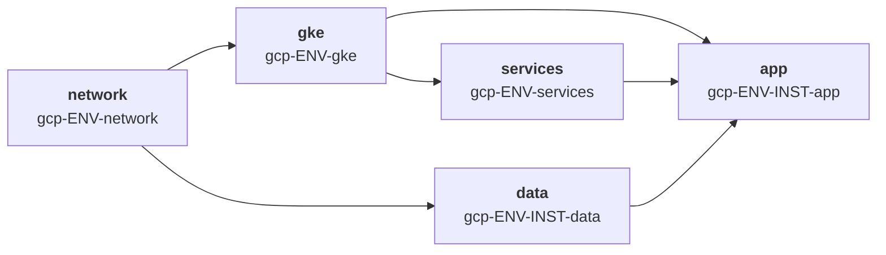

Four stacks, four applies, in this order. Stacks at the same level run in parallel.

| # | Stack | Capability | Produces | Consumes |
|---|---|---|---|---|
| 1 | `gcp-ENV-network` | network | VPC, subnet, secondary ranges, Cloud NAT, private services access | — |
| 2 | `gcp-ENV-gke` | cluster | Cluster, node pools, Workload Identity pool | network |
| 3 | `gcp-ENV-services` | platform-services | Ingress controller, external-dns, cert-manager, namespaces | gke |
| 4a | `gcp-ENV-INST-data` | data | Cloud SQL, Secret Manager entries | network |
| 4b | `gcp-ENV-INST-app` | app | Workload, service account, IAM bindings | gke, services, data |

### 5.2 Stack 1 — network (producer only)

GKE in VPC-native mode requires **secondary IP ranges for pods and services** to exist on the subnet before the cluster is created. Those range *names* are the contract.

```hcl
# imports/contracts/contract_network_gcp.tm.hcl
output "project_id"              { backend = "tofu"  value = var.project_id }
output "region"                  { backend = "tofu"  value = var.region }
output "network_self_link"       { backend = "tofu"  value = module.network.network_self_link }
output "network_name"            { backend = "tofu"  value = module.network.network_name }
output "subnet_self_link"        { backend = "tofu"  value = module.network.subnet_self_link }
output "gke_pods_range_name"     { backend = "tofu"  value = module.network.range_pods_name }
output "gke_services_range_name" { backend = "tofu"  value = module.network.range_services_name }
output "private_service_range"   { backend = "tofu"  value = module.network.psa_range_name }
```

```hcl
# stacks/platforms/gcp/demos/network/stack.tm.hcl
stack {
  id   = "gcp-demos-network"
  name = "GCP demos — network"
  tags = ["gcp", "demos", "network", "platform", "producer"]
}

globals { capability = "network" }

import { source = "/imports/mixins/backend_gcp.tm.hcl" }
import { source = "/imports/mixins/provider_gcp.tm.hcl" }
import { source = "/imports/generators/v1/gen_network.tm.hcl" }
import { source = "/imports/contracts/contract_network_gcp.tm.hcl" }
```

**Sizing the ranges is a globals concern, not a sharing concern.** Pod ranges must be sized for the maximum node count times pods-per-node; getting this wrong requires a cluster rebuild. Compute it deterministically:

```hcl
# stacks/platforms/gcp/demos/config.tm.hcl
globals {
  vpc_cidr           = "10.4.0.0/17"
  subnet_cidr        = tm_cidrsubnet(global.vpc_cidr, 3, 0)   # 10.4.0.0/20  — zone infra
  pods_cidr          = tm_cidrsubnet(global.vpc_cidr, 1, 1)   # 10.4.64.0/18 — zone pods
  services_cidr      = tm_cidrsubnet(global.vpc_cidr, 7, 32)  # 10.4.32.0/24 — zone edge, as in the AM §9.6 ledger
}
```

### 5.3 Stack 2 — GKE cluster (consumer and producer)

```hcl
# imports/contracts/contract_cluster_gke.tm.hcl

## ---- consumes from the network stack ----
input "network_self_link" {
  backend       = "tofu"
  from_stack_id = global.platform.network_stack_id
  value         = outputs.network_self_link.value
  mock          = "projects/mock-project/global/networks/mock-vpc"
}
input "subnet_self_link" {
  backend       = "tofu"
  from_stack_id = global.platform.network_stack_id
  value         = outputs.subnet_self_link.value
  mock          = "projects/mock-project/regions/europe-west1/subnetworks/mock-subnet"
}
input "gke_pods_range_name" {
  backend       = "tofu"
  from_stack_id = global.platform.network_stack_id
  value         = outputs.gke_pods_range_name.value
  mock          = "mock-pods"
}
input "gke_services_range_name" {
  backend       = "tofu"
  from_stack_id = global.platform.network_stack_id
  value         = outputs.gke_services_range_name.value
  mock          = "mock-services"
}

## ---- produces for services and app stacks ----
output "cluster_name"     { backend = "tofu"  value = module.gke.name }
output "cluster_location" { backend = "tofu"  value = module.gke.location }
output "cluster_endpoint" { backend = "tofu"  value = module.gke.endpoint }
output "cluster_ca" {
  backend   = "tofu"
  value     = module.gke.ca_certificate
  sensitive = true
}
output "workload_identity_pool" {
  backend = "tofu"
  value   = "${var.project_id}.svc.id.goog"
}
output "node_service_account" { backend = "tofu"  value = module.gke.node_sa_email }
```

```hcl
# stacks/platforms/gcp/demos/gke/stack.tm.hcl
stack {
  id    = "gcp-demos-gke"
  name  = "GCP demos — GKE"
  tags  = ["gcp", "demos", "cluster", "gke", "platform", "producer", "consumer"]
  after = ["/stacks/platforms/gcp/demos/network"]   # MANDATORY
}

globals {
  capability = "cluster"
}

globals "platform" {
  network_stack_id = "gcp-demos-network"
}
```

Note that the *platform stacks themselves* use the same `global.platform.*` binding convention as archetype instances. This keeps a single mental model and lets you build a second cluster on the same network by copying one directory and changing one global.

### 5.4 Stack 3 — platform services (consumer and producer)

This is where the Kubernetes and Helm providers first appear, and it contains the single most important GKE-specific caveat.

```hcl
# imports/generators/v1/gen_platform_services.tm.hcl
generate_hcl "_providers.tf" {
  condition = global.capability == "platform-services" && global.cloud == "gcp"

  content {
    # Short-lived token fetched at plan/apply time. NEVER shared as an output.
    data "google_client_config" "default" {}

    provider "kubernetes" {
      host                   = "https://${var.cluster_endpoint}"
      cluster_ca_certificate = base64decode(var.cluster_ca)
      token                  = data.google_client_config.default.access_token
    }

    provider "helm" {
      kubernetes {
        host                   = "https://${var.cluster_endpoint}"
        cluster_ca_certificate = base64decode(var.cluster_ca)
        token                  = data.google_client_config.default.access_token
      }
    }
  }
}
```

> **Never share credentials as outputs.** The endpoint and the CA certificate are stable facts and belong in the sharing contract. The bearer token is a 60-minute credential and must be fetched by each consumer through `google_client_config` under its own identity. Sharing a token through `TF_VAR_*` would leak it into the process environment and, sooner or later, into a CI log.

Services stack contract:

```hcl
# imports/contracts/contract_services_gcp.tm.hcl
input "cluster_endpoint" {
  backend       = "tofu"
  from_stack_id = global.platform.cluster_stack_id
  value         = outputs.cluster_endpoint.value
  mock          = "mock-endpoint.example.invalid"
}
input "cluster_ca" {
  backend       = "tofu"
  from_stack_id = global.platform.cluster_stack_id
  value         = outputs.cluster_ca.value
  sensitive     = true
  mock          = "bW9jaw=="              # base64("mock") — type-correct mock
}
input "workload_identity_pool" {
  backend       = "tofu"
  from_stack_id = global.platform.cluster_stack_id
  value         = outputs.workload_identity_pool.value
  mock          = "mock-project.svc.id.goog"
}

output "ingress_class"       { backend = "tofu"  value = "gce" }
output "dns_zone_name"       { backend = "tofu"  value = module.external_dns.zone_name }
output "cert_issuer_name"    { backend = "tofu"  value = module.cert_manager.cluster_issuer_name }
```

### 5.5 Stack 4 — archetype instance (consumers)

The application stack is where Workload Identity binding happens, and it needs facts from three producers at once.

```hcl
# imports/contracts/contract_app_gcp.tm.hcl
input "cluster_endpoint" {
  backend = "tofu"  from_stack_id = global.platform.cluster_stack_id
  value = outputs.cluster_endpoint.value  mock = "mock-endpoint.example.invalid"
}
input "cluster_ca" {
  backend = "tofu"  from_stack_id = global.platform.cluster_stack_id
  value = outputs.cluster_ca.value  sensitive = true  mock = "bW9jaw=="
}
input "workload_identity_pool" {
  backend = "tofu"  from_stack_id = global.platform.cluster_stack_id
  value = outputs.workload_identity_pool.value  mock = "mock-project.svc.id.goog"
}
input "ingress_class" {
  backend = "tofu"  from_stack_id = global.platform.services_stack_id
  value = outputs.ingress_class.value  mock = "mock-ingress"
}
input "db_connection_name" {
  backend = "tofu"  from_stack_id = global.platform.data_stack_id
  value = outputs.db_connection_name.value  mock = "mock:europe-west1:mock-db"
}
input "db_secret_id" {
  backend = "tofu"  from_stack_id = global.platform.data_stack_id
  value = outputs.db_secret_id.value  mock = "projects/mock/secrets/mock"
}
```

Workload Identity binding in the generated code:

```hcl
# imports/generators/v1/gen_app.tm.hcl (GCP branch, excerpt)
generate_hcl "_workload_identity.tf" {
  condition = global.capability == "app" && global.platform.cloud == "gcp"

  content {
    resource "google_service_account" "app" {
      account_id = "${global.instance}-${global.app.name}"
      project    = global.project_id
    }

    resource "google_service_account_iam_member" "wi" {
      service_account_id = google_service_account.app.name
      role               = "roles/iam.workloadIdentityUser"
      member             = "serviceAccount:${var.workload_identity_pool}[${global.platform.namespace}/${global.app.name}]"
    }

    resource "kubernetes_service_account" "app" {
      metadata {
        name      = global.app.name
        namespace = global.platform.namespace
        annotations = {
          "iam.gke.io/gcp-service-account" = google_service_account.app.email
        }
      }
    }
  }
}
```

Note `global.platform.namespace` — this is what allows two archetype instances to coexist on one shared cluster. Covered fully in §12.

### 5.6 GKE-specific caveats

| Caveat | Impact | Mitigation |
|---|---|---|
| **Secondary ranges are immutable** | Changing pod/service CIDRs requires cluster recreation | Size generously in globals from day one; compute with `tm_cidrsubnet` so they are reviewable |
| **Kubernetes provider needs a live cluster at plan time** | `tofu plan` on the services stack fails if the cluster is not yet applied | Use `--mock-on-fail` for PR previews; accept that a first-ever deployment of a new environment requires a staged apply (network → cluster → services) |
| **`tofu output -json` on the network stack requires state read access** | The CI job applying the cluster must read the network stack's GCS state object | Grant the cluster job `roles/storage.objectViewer` on the network state prefix. If network and cluster live in different projects, this is a cross-project grant |
| **Private cluster endpoints** | If the control plane is private, the CI runner cannot reach `cluster_endpoint` | Either run CI on a private runner inside the VPC, or authorise the runner egress IP in `master_authorized_networks` |
| **`cluster_ca` is base64** | A mock of `"mock"` breaks `base64decode()` at plan time | Mock with a valid base64 string (`"bW9jaw=="`) |
| **Deletion protection** | `deletion_protection = true` blocks `tofu destroy` | Set it from `global.cluster.deletion_protection`; `false` for demos, `true` for prod, enforced by an `assert` |

### 5.7 GKE IAM and security baseline

| Control | Requirement | Rationale |
|---|---|---|
| Node service account | Dedicated SA with `roles/logging.logWriter`, `roles/monitoring.metricWriter`, `roles/stackdriver.resourceMetadata.writer`, `roles/artifactregistry.reader` | The default compute SA holds `roles/editor`; every node would carry project-wide write |
| Workload Identity | Enabled cluster-wide and on every node pool | Without it, pods fall back to the node SA and all tenants share one identity |
| Metadata concealment | Legacy metadata endpoints disabled (`metadata.disable-legacy-endpoints = true`) | Legacy endpoints let a pod read the node SA token directly, defeating Workload Identity |
| Control plane | Private cluster, `master_authorized_networks` restricted | |
| Nodes | Shielded GKE nodes, Container-Optimized OS, secure boot, integrity monitoring | |
| Node pool | `enable_private_nodes = true`, no external IPs | |
| Secrets | Application-layer secrets encryption with a Cloud KMS key | etcd encryption at rest with a key you control |
| Image provenance | Binary Authorization requiring attestation | Blocks unscanned or untrusted images |
| RBAC | Cluster-admin bound to a **Google Group**, never to individual users | Group membership is auditable and revocable centrally |
| Namespace tenancy | One namespace per archetype instance, `pod-security.kubernetes.io/enforce = restricted` | §12.3 |
| Deployer permissions | `roles/container.admin` **plus** `roles/iam.serviceAccountUser` on the node SA | Creating a cluster that runs as an SA requires `actAs` |
| Workload Identity binding | `serviceAccount:POOL[${global.platform.namespace}/${ksa}]` — never a wildcard | A wildcard grants every pod in the cluster the GSA's permissions |

```hcl
assert {
  assertion = global.capability != "cluster" || global.cloud != "gcp" || global.gke.workload_identity_enabled
  message   = "GKE clusters must enable Workload Identity"
}

assert {
  assertion = global.capability != "cluster" || global.cloud != "gcp" || global.gke.private_nodes
  message   = "GKE node pools must use private nodes"
}
```

Organisation policies backing this up (§11.7): `constraints/compute.requireShieldedVm`, `constraints/compute.vmExternalIpAccess`, `constraints/iam.disableServiceAccountKeyCreation`.

---

## 6. Guide B — EKS platform and its dependency chain

### 6.1 Dependency graph

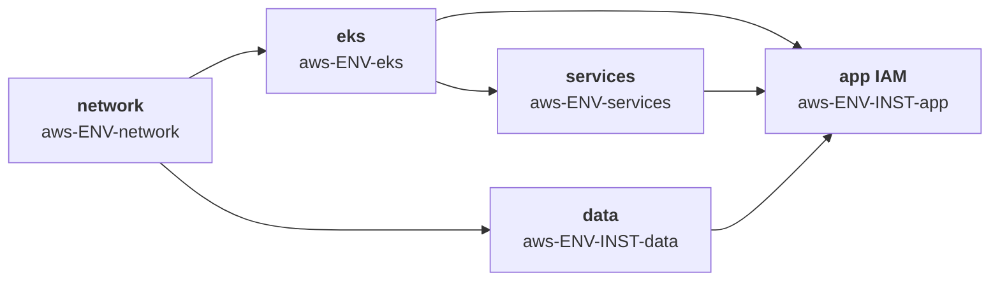

Structurally identical to GKE. The differences are entirely in *which facts* cross the boundaries.

| # | Stack | Produces | Consumes |
|---|---|---|---|
| 1 | `aws-ENV-network` | VPC, subnets, NAT, route tables, subnet tags | — |
| 2 | `aws-ENV-eks` | Cluster, node groups, **OIDC provider**, access entries | network |
| 3 | `aws-ENV-services` | AWS Load Balancer Controller, external-dns, karpenter | eks |
| 4a | `aws-ENV-INST-data` | RDS, ElastiCache, Secrets Manager entries | network |
| 4b | `aws-ENV-INST-app` | Workload, **IRSA role**, namespace resources | eks, services, data |

### 6.2 Stack 1 — network, and the circular dependency trap

```hcl
# imports/contracts/contract_network_aws.tm.hcl
output "vpc_id"             { backend = "tofu"  value = module.vpc.vpc_id }
output "vpc_cidr"           { backend = "tofu"  value = module.vpc.vpc_cidr_block }
output "private_subnet_ids" { backend = "tofu"  value = module.vpc.private_subnets }
output "public_subnet_ids"  { backend = "tofu"  value = module.vpc.public_subnets }
output "intra_subnet_ids"   { backend = "tofu"  value = module.vpc.intra_subnets }
output "azs"                { backend = "tofu"  value = module.vpc.azs }
output "nat_gateway_ips"    { backend = "tofu"  value = module.vpc.nat_public_ips }
```

> **The subnet-tagging trap.** The AWS Load Balancer Controller requires subnets tagged `kubernetes.io/cluster/<CLUSTER_NAME> = shared`, plus `kubernetes.io/role/elb` and `kubernetes.io/role/internal-elb`. Those tags belong on subnets — owned by the **network** stack — but reference the **cluster** name, produced by the **eks** stack. Wiring that with outputs sharing creates a cycle: network → eks → network.
>
> **Solution: derive the cluster name deterministically from globals, not from an output.**

```hcl
# stacks/platforms/aws/config.tm.hcl
globals {
  cloud = "aws"
}

# stacks/platforms/aws/demos/config.tm.hcl
globals {
  env          = "demos"
  account_id   = "111122223333"
  region       = "eu-west-1"
  # Deterministic: known at generate time by BOTH stacks. Breaks the cycle.
  cluster_name = "disasterproject-demos-eks"
}
```

Both the network generator (for tags) and the cluster generator (for the cluster resource) read `global.cluster_name`. No runtime edge is needed, and the cycle disappears. This is the general remedy whenever outputs sharing appears to require a cycle: **promote the shared fact to a global**.

Add an assertion so the two can never diverge:

```hcl
assert {
  assertion = tm_can(tm_regex("^[a-z0-9-]{1,38}$", global.cluster_name))
  message   = "cluster_name must be a valid EKS cluster name"
}
```

### 6.3 Stack 2 — EKS cluster

```hcl
# imports/contracts/contract_cluster_eks.tm.hcl

## ---- consumes ----
input "vpc_id" {
  backend = "tofu"  from_stack_id = global.platform.network_stack_id
  value = outputs.vpc_id.value  mock = "vpc-mock00000000000"
}
input "private_subnet_ids" {
  backend = "tofu"  from_stack_id = global.platform.network_stack_id
  value = outputs.private_subnet_ids.value
  mock  = ["subnet-mock0000000000a", "subnet-mock0000000000b", "subnet-mock0000000000c"]
}
input "intra_subnet_ids" {
  backend = "tofu"  from_stack_id = global.platform.network_stack_id
  value = outputs.intra_subnet_ids.value
  mock  = ["subnet-mock0000000000d", "subnet-mock0000000000e"]
}

## ---- produces ----
output "cluster_name"     { backend = "tofu"  value = module.eks.cluster_name }
output "cluster_endpoint" { backend = "tofu"  value = module.eks.cluster_endpoint }
output "cluster_ca" {
  backend = "tofu"  value = module.eks.cluster_certificate_authority_data  sensitive = true
}
output "cluster_version"            { backend = "tofu"  value = module.eks.cluster_version }
output "cluster_security_group_id"  { backend = "tofu"  value = module.eks.cluster_security_group_id }
output "node_security_group_id"     { backend = "tofu"  value = module.eks.node_security_group_id }
# The two facts every IRSA role in every archetype instance depends on:
output "oidc_provider_arn" { backend = "tofu"  value = module.eks.oidc_provider_arn }
output "oidc_provider_url" { backend = "tofu"  value = module.eks.oidc_provider }
```

Note the mock for `private_subnet_ids` is a **list**, matching the real type. A string mock here produces a plan that type-checks locally and explodes on apply.

```hcl
# stacks/platforms/aws/demos/eks/stack.tm.hcl
stack {
  id    = "aws-demos-eks"
  name  = "AWS demos — EKS"
  tags  = ["aws", "demos", "cluster", "eks", "platform", "producer", "consumer"]
  after = ["/stacks/platforms/aws/demos/network"]
}

globals { capability = "cluster" }
globals "platform" { network_stack_id = "aws-demos-network" }
```

### 6.4 Stack 3 — platform services

Same provider pattern as GKE, with AWS-specific token retrieval:

```hcl
generate_hcl "_providers.tf" {
  condition = global.capability == "platform-services" && global.cloud == "aws"

  content {
    data "aws_eks_cluster_auth" "this" {
      name = var.cluster_name
    }

    provider "kubernetes" {
      host                   = var.cluster_endpoint
      cluster_ca_certificate = base64decode(var.cluster_ca)
      token                  = data.aws_eks_cluster_auth.this.token
    }

    provider "helm" {
      kubernetes {
        host                   = var.cluster_endpoint
        cluster_ca_certificate = base64decode(var.cluster_ca)
        token                  = data.aws_eks_cluster_auth.this.token
      }
    }
  }
}
```

Again: endpoint and CA travel through sharing; the token is fetched locally by each consumer.

The AWS Load Balancer Controller itself needs IRSA, so the services stack is also a consumer of the OIDC outputs:

```hcl
input "oidc_provider_arn" {
  backend = "tofu"  from_stack_id = global.platform.cluster_stack_id
  value = outputs.oidc_provider_arn.value
  mock  = "arn:aws:iam::000000000000:oidc-provider/oidc.eks.eu-west-1.amazonaws.com/id/MOCK"
}
input "oidc_provider_url" {
  backend = "tofu"  from_stack_id = global.platform.cluster_stack_id
  value = outputs.oidc_provider_url.value
  mock  = "oidc.eks.eu-west-1.amazonaws.com/id/MOCK"
}

output "alb_controller_ready" { backend = "tofu"  value = helm_release.alb_controller.status }
output "ingress_class"        { backend = "tofu"  value = "alb" }
output "external_dns_zone_id" { backend = "tofu"  value = var.hosted_zone_id }
```

### 6.5 Stack 4 — archetype instance and IRSA

IRSA is the canonical outputs-sharing use case on AWS: a trust policy that literally cannot be written without a value produced by another stack's apply.

```hcl
# imports/generators/v1/gen_app.tm.hcl (AWS branch, excerpt)
generate_hcl "_irsa.tf" {
  condition = global.capability == "app" && global.platform.cloud == "aws"

  content {
    data "aws_iam_policy_document" "assume" {
      statement {
        effect  = "Allow"
        actions = ["sts:AssumeRoleWithWebIdentity"]

        principals {
          type        = "Federated"
          identifiers = [var.oidc_provider_arn]
        }

        condition {
          test     = "StringEquals"
          variable = "${var.oidc_provider_url}:sub"
          values   = ["system:serviceaccount:${global.platform.namespace}:${global.app.name}"]
        }

        condition {
          test     = "StringEquals"
          variable = "${var.oidc_provider_url}:aud"
          values   = ["sts.amazonaws.com"]
        }
      }
    }

    resource "aws_iam_role" "app" {
      name               = "${global.instance}-${global.app.name}-irsa"
      assume_role_policy = data.aws_iam_policy_document.assume.json
      tags               = global.tags
    }

    resource "kubernetes_service_account" "app" {
      metadata {
        name      = global.app.name
        namespace = global.platform.namespace
        annotations = {
          "eks.amazonaws.com/role-arn" = aws_iam_role.app.arn
        }
      }
    }
  }
}
```

The `sub` condition embeds `global.platform.namespace`. On a shared cluster, this is precisely what keeps `demo-alpha`'s IRSA role from being assumable by `demo-beta`'s pods.

### 6.6 EKS-specific caveats

| Caveat | Impact | Mitigation |
|---|---|---|
| **Subnet tagging cycle** | network ↔ eks circular dependency | Deterministic `global.cluster_name` (§6.2) |
| **OIDC provider is per-cluster** | Every archetype instance on a shared cluster consumes the *same* two outputs | Fine — but it means a cluster rebuild invalidates every IRSA role in every instance. Treat cluster replacement as a fleet-wide event |
| **`aws-auth` / access entries** | Concurrent writes from multiple stacks corrupt the ConfigMap | Own cluster access **only** in the eks stack. Use EKS Access Entries (API mode) rather than the `aws-auth` ConfigMap; archetype instances must never write to it |
| **Cross-account state reads** | The eks job runs `tofu output -json` in the network stack's directory | The CI role for the cluster job needs `s3:GetObject` on the network state key and `kms:Decrypt` on its KMS key. Add these explicitly to the OIDC role trust policy |
| **`cluster_endpoint` includes the scheme** | Unlike GKE, EKS returns `https://...` already | Do **not** prefix `https://` again in the provider block. This asymmetry between the two clouds is a common copy-paste bug |
| **Private API endpoint** | CI runner cannot reach the control plane | Private GitHub runner in the VPC, or `public_access_cidrs` allowing the runner egress |
| **`private_subnet_ids` ordering** | The list order from the VPC module is AZ-ordered but not guaranteed stable across module upgrades | Sort explicitly in the output expression if any consumer indexes into the list |

### 6.7 EKS IAM and security baseline

| Control | Requirement | Rationale |
|---|---|---|
| Cluster role and node role | Separate roles, never merged | Different trust principals and lifetimes |
| Node role policies | `AmazonEKSWorkerNodePolicy`, `AmazonEC2ContainerRegistryReadOnly` | Keep `AmazonEKS_CNI_Policy` **off** the node role — attach it via IRSA on the `aws-node` service account instead, so pods cannot assume CNI permissions through the instance profile |
| IMDS | Hop limit 1, IMDSv2 required | Prevents a compromised pod from reaching the node instance profile |
| Cluster access | **EKS Access Entries** (API auth mode), not the `aws-auth` ConfigMap | The ConfigMap has no IAM audit trail and corrupts under concurrent writes |
| Access entry ownership | Only the `eks` stack writes access entries | Archetype instances must never touch cluster access |
| IRSA trust condition | `StringEquals` on both `:sub` and `:aud`; `sub` pinned to `system:serviceaccount:NAMESPACE:SA` | `StringLike` with `*` grants every pod in the cluster the role |
| Permission boundary | Attached to every IRSA role created by an archetype instance | Prevents a tenant escalating through its own stack |
| Secrets encryption | Envelope encryption with a customer-managed KMS key | etcd at-rest encryption under a key you control |
| Control plane | Private endpoint, or `public_access_cidrs` limited to CI and admin ranges | |
| Control plane logging | `api`, `audit`, `authenticator`, `controllerManager`, `scheduler` enabled | Audit log is the only record of RBAC decisions |
| Node groups | Bottlerocket or AL2023, launch template with encrypted EBS | |
| Namespace tenancy | One namespace per instance, `restricted` Pod Security Standard, default-deny NetworkPolicy | §12.3 |

```hcl
data "aws_iam_policy_document" "assume" {
  statement {
    # ...
    condition {
      test     = "StringEquals"                      # NOT StringLike
      variable = "${var.oidc_provider_url}:sub"
      values   = ["system:serviceaccount:${global.platform.namespace}:${global.app.name}"]
    }
    condition {
      test     = "StringEquals"
      variable = "${var.oidc_provider_url}:aud"
      values   = ["sts.amazonaws.com"]
    }
  }
}

resource "aws_iam_role" "app" {
  name                 = "${global.instance}-${global.app.name}-irsa"
  assume_role_policy   = data.aws_iam_policy_document.assume.json
  permissions_boundary = var.task_role_boundary_arn   # published by the platform stack
}
```

```hcl
assert {
  assertion = global.capability != "app" || global.platform.cloud != "aws" || tm_can(global.iam.permission_boundary)
  message   = "IRSA roles must attach the platform permission boundary"
}
```

**EKS Pod Identity** is the newer alternative to IRSA and removes the OIDC trust-policy complexity entirely — association is made through the EKS API rather than an IAM trust document. If you adopt it, the cluster stack outputs a `pod_identity_agent_ready` flag instead of the two OIDC facts, and the app stack creates an association rather than a federated trust policy. The namespace-scoping property is identical.

Backing SCPs (§11.7): deny `iam:CreateUser`, deny `iam:DeleteRolePermissionsBoundary`, confine regions.

### 6.8 Contract comparison across runtimes

| Concept | GKE output | EKS output | Notes |
|---|---|---|---|
| Cluster identity | `cluster_name`, `cluster_location` | `cluster_name`, `cluster_version` | |
| API endpoint | `cluster_endpoint` (no scheme) | `cluster_endpoint` (**with** `https://`) | Asymmetry — normalise in the generator |
| CA certificate | `cluster_ca` (base64) | `cluster_ca` (base64) | Same shape |
| Auth token | *not shared* — `google_client_config` | *not shared* — `aws_eks_cluster_auth` | Never share |
| Workload identity | `workload_identity_pool` | `oidc_provider_arn` + `oidc_provider_url` | AWS needs two facts, GCP one |
| Network handle | `network_self_link`, `subnet_self_link` | `vpc_id`, `private_subnet_ids` (list) | GCP self-links are strings, AWS subnets are lists |
| Pod networking | `gke_pods_range_name`, `gke_services_range_name` | — (VPC CNI uses subnet CIDRs) | GCP requires named secondary ranges |
| Ingress class | `"gce"` | `"alb"` | Both from the services stack |

Keeping the *names* aligned where the *meaning* is aligned (`cluster_name`, `cluster_endpoint`, `cluster_ca`, `ingress_class`) is what lets one `gen_app.tm.hcl` generator serve both clouds with a single `condition` branch for the cloud-specific parts.

---

## 7. Guide C — Cloud Run platform and its dependency chain

Cloud Run removes the cluster from the topology, which changes the shape of the platform layer but not the pattern. The isolation boundary moves from *Kubernetes namespace* to *service plus its runtime service account*, and that turns out to make shared environments considerably cheaper — Cloud Run scales to zero, so an idle demo instance costs almost nothing.

### 7.1 Dependency graph

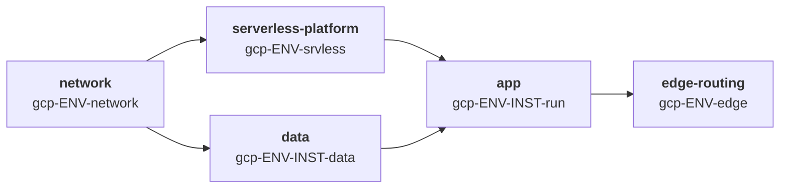

| # | Stack | Produces | Consumes |
|---|---|---|---|
| 1 | `gcp-ENV-network` | VPC, subnet, Direct VPC egress subnet or Serverless VPC connector, Cloud NAT, PSA range | — |
| 2 | `gcp-ENV-srvless` | Artifact Registry, static IP, Certificate Manager map, Cloud Armor policy, log sink | network |
| 3a | `gcp-ENV-INST-data` | Cloud SQL (private IP), Secret Manager secrets | network |
| 3b | `gcp-ENV-INST-run` | Cloud Run service, runtime SA, serverless NEG, backend service | srvless, data |
| 4 | `gcp-ENV-edge` | URL map, HTTPS proxy, forwarding rule | *see §7.5 — fan-in* |

Note the ordering inversion at step 4: the edge-routing stack runs **after** every instance, because it aggregates their backends. That fan-in is the one shape outputs sharing does not handle well, and §7.5 covers the remedy.

### 7.2 Stack 1 — network

Cloud Run reaches private resources one of two ways. Choose once, in globals, and generate accordingly.

| Mechanism | When | What the network stack must output |
|---|---|---|
| **Direct VPC egress** | Preferred for new builds — no connector to size or pay for | `direct_egress_subnet_id` (a subnet reserved for Cloud Run) |
| **Serverless VPC Access connector** | Legacy, or when you need a fixed connector CIDR for firewall rules | `vpc_connector_id` |

```hcl
# imports/contracts/contract_network_gcp_serverless.tm.hcl
output "network_self_link"        { backend = "tofu"  value = module.network.network_self_link }
output "direct_egress_subnet_id"  { backend = "tofu"  value = module.network.serverless_subnet_id }
output "vpc_connector_id"         { backend = "tofu"  value = try(module.network.connector_id, "") }
output "psa_range_name"           { backend = "tofu"  value = module.network.psa_range_name }
output "project_id"               { backend = "tofu"  value = var.project_id }
```

```hcl
# stacks/platforms/gcp/demos/config.tm.hcl (serverless additions)
globals "serverless" {
  egress_mode          = "direct"                # "direct" | "connector"
  egress_setting       = "PRIVATE_RANGES_ONLY"   # avoid ALL_TRAFFIC unless egress must be inspected
  serverless_subnet    = "10.4.40.0/24"          # zone edge; /24 minimum for Direct VPC egress
  ingress              = "INTERNAL_AND_CLOUD_LOAD_BALANCING"
}
```

> **Security baseline.** `ingress = "ALL"` on a Cloud Run service bypasses your load balancer, and with it Cloud Armor, your WAF rules and your logging. Set `INTERNAL_AND_CLOUD_LOAD_BALANCING` in globals and enforce it with an assertion — this is the single most commonly misconfigured Cloud Run setting.

```hcl
assert {
  assertion = global.serverless.ingress != "ALL"
  message   = "Cloud Run ingress=ALL bypasses the load balancer and Cloud Armor"
}
```

### 7.3 Stack 2 — serverless platform

```hcl
# imports/contracts/contract_serverless_platform.tm.hcl
input "network_self_link" {
  backend = "tofu"  from_stack_id = global.platform.network_stack_id
  value = outputs.network_self_link.value
  mock  = "projects/mock-project/global/networks/mock-vpc"
}

output "artifact_registry_repo" { backend = "tofu"  value = module.registry.repository_url }
output "artifact_registry_id"   { backend = "tofu"  value = module.registry.id }
output "static_ip_address"      { backend = "tofu"  value = module.edge.global_ip_address }
output "static_ip_name"         { backend = "tofu"  value = module.edge.global_ip_name }
output "cert_map_id"            { backend = "tofu"  value = module.edge.certificate_map_id }
output "cloud_armor_policy_id"  { backend = "tofu"  value = module.edge.security_policy_id }
output "dns_zone_name"          { backend = "tofu"  value = module.dns.zone_name }
output "run_service_agent"      { backend = "tofu"  value = "service-${var.project_number}@serverless-robot-prod.iam.gserviceaccount.com" }
```

`run_service_agent` matters: the **Cloud Run service agent**, not the runtime service account, is what pulls images from Artifact Registry. Granting `roles/artifactregistry.reader` to the wrong principal is a classic first-deployment failure.

### 7.4 Stack 3b — the Cloud Run service, and its IAM

This is where nearly all of the Cloud Run security posture lives.

```hcl
# imports/contracts/contract_app_cloudrun.tm.hcl
input "artifact_registry_repo" {
  backend = "tofu"  from_stack_id = global.platform.services_stack_id
  value = outputs.artifact_registry_repo.value
  mock  = "europe-west1-docker.pkg.dev/mock-project/mock-repo"
}
input "direct_egress_subnet_id" {
  backend = "tofu"  from_stack_id = global.platform.network_stack_id
  value = outputs.direct_egress_subnet_id.value
  mock  = "projects/mock-project/regions/europe-west1/subnetworks/mock-serverless"
}
input "cloud_armor_policy_id" {
  backend = "tofu"  from_stack_id = global.platform.services_stack_id
  value = outputs.cloud_armor_policy_id.value
  mock  = "projects/mock-project/global/securityPolicies/mock-policy"
}
input "db_connection_name" {
  backend = "tofu"  from_stack_id = global.platform.data_stack_id
  value = outputs.db_connection_name.value
  mock  = "mock-project:europe-west1:mock-db"
}
input "db_secret_id" {
  backend = "tofu"  from_stack_id = global.platform.data_stack_id
  value = outputs.db_secret_id.value
  mock  = "projects/mock-project/secrets/mock-secret"
}

# produced for the edge-routing stack and for the CMDB
output "service_name"          { backend = "tofu"  value = google_cloud_run_v2_service.this.name }
output "service_uri"           { backend = "tofu"  value = google_cloud_run_v2_service.this.uri }
output "runtime_sa_email"      { backend = "tofu"  value = google_service_account.runtime.email }
output "backend_service_id"    { backend = "tofu"  value = google_compute_backend_service.this.id }
output "neg_id"                { backend = "tofu"  value = google_compute_region_network_endpoint_group.this.id }
```

```hcl
# imports/generators/v1/gen_app_cloudrun.tm.hcl (excerpt)
generate_hcl "_service.tf" {
  condition = global.capability == "app" && global.platform.runtime == "cloudrun"

  content {
    # --- Dedicated runtime identity. NEVER the default compute service account. ---
    resource "google_service_account" "runtime" {
      account_id   = "run-${global.instance}-${global.app.name}"
      display_name = "Cloud Run runtime — ${global.instance}/${global.app.name}"
      project      = global.project_id
    }

    # --- Least-privilege grants, scoped to the exact resource, never project-wide ---
    resource "google_secret_manager_secret_iam_member" "db" {
      secret_id = var.db_secret_id
      role      = "roles/secretmanager.secretAccessor"
      member    = "serviceAccount:${google_service_account.runtime.email}"
    }

    resource "google_project_iam_member" "sql_client" {
      project = global.project_id
      role    = "roles/cloudsql.client"
      member  = "serviceAccount:${google_service_account.runtime.email}"
      # cloudsql.client has no resource-level binding; constrain with a condition instead
      condition {
        title      = "only-this-instance"
        expression = "resource.name.endsWith('${var.db_connection_name}')"
      }
    }

    resource "google_cloud_run_v2_service" "this" {
      name     = "${global.instance}-${global.app.name}"
      location = global.region
      project  = global.project_id
      ingress  = global.serverless.ingress

      template {
        service_account = google_service_account.runtime.email

        # Direct VPC egress — no connector resource to manage
        vpc_access {
          network_interfaces {
            subnetwork = var.direct_egress_subnet_id
          }
          egress = global.serverless.egress_setting
        }

        scaling {
          min_instance_count = global.app.min_instances
          max_instance_count = global.app.max_instances
        }

        containers {
          image = "${var.artifact_registry_repo}/${global.app.name}:${global.app.image_tag}"

          # Secrets arrive by reference, resolved by Cloud Run at start.
          # They are NOT plaintext environment variables in the service spec.
          env {
            name = "DB_PASSWORD"
            value_source {
              secret_key_ref {
                secret  = var.db_secret_id
                version = "latest"
              }
            }
          }

          resources {
            limits = {
              cpu    = global.app.cpu
              memory = global.app.memory
            }
          }
        }
      }

      # Traffic pinned to the latest healthy revision
      traffic {
        type    = "TRAFFIC_TARGET_ALLOCATION_TYPE_LATEST"
        percent = 100
      }
    }

    # --- Invoker: LB service agent only, never allUsers when fronted by a LB ---
    resource "google_cloud_run_v2_service_iam_member" "invoker" {
      name     = google_cloud_run_v2_service.this.name
      location = google_cloud_run_v2_service.this.location
      project  = global.project_id
      role     = "roles/run.invoker"
      member   = global.app.public ? "allUsers" : "serviceAccount:${global.app.invoker_sa}"
    }
  }
}
```

**Cloud Run IAM checklist**

| Control | Requirement | Why |
|---|---|---|
| Runtime service account | Dedicated per service; never the default compute SA | The default compute SA holds `roles/editor` project-wide |
| Deployer permissions | `roles/run.admin` **plus** `roles/iam.serviceAccountUser` on the runtime SA | Deploying a service that runs *as* an SA requires `actAs`; missing this is the most common pipeline failure |
| Secret access | `roles/secretmanager.secretAccessor` on the **specific secret** | Project-level grants expose every tenant's secrets on a shared platform |
| Cloud SQL | `roles/cloudsql.client` with an IAM condition scoping to the instance | The role has no resource-level binding; conditions are the only scoping mechanism |
| Image pull | `roles/artifactregistry.reader` to the **Cloud Run service agent** | The runtime SA does not pull images |
| Invoker | Never `allUsers` on a LB-fronted service | `allUsers` plus `ingress=ALL` makes the service directly reachable, bypassing Cloud Armor |
| Image provenance | Binary Authorization policy requiring attestation | Prevents deploying unscanned images |
| Egress | `PRIVATE_RANGES_ONLY` unless egress inspection is required | `ALL_TRAFFIC` routes internet-bound traffic through the VPC and your NAT, changing your egress attack surface and cost |

Organisation policy constraints worth enforcing above the pipeline (§11.7): `constraints/iam.disableServiceAccountKeyCreation`, `constraints/run.allowedIngress`, `constraints/sql.restrictPublicIp`.

### 7.5 Stack 4 — edge routing, and the fan-in limit

The URL map must reference the backend service of every instance. Expressed as outputs sharing, that would need one `input` block per tenant — but the tenant list is dynamic, and `input` blocks are static declarations. **This is where outputs sharing stops being the right tool.**

Two workable remedies:

**Remedy A — deterministic names plus data sources (recommended).**

```hcl
# imports/generators/v1/gen_edge_routing.tm.hcl
generate_hcl "_url_map.tf" {
  condition = global.capability == "edge-routing"

  content {
    tm_dynamic "data" {
      for_each   = global.tenants
      labels     = ["google_compute_backend_service", tm_element(each.value, 0)]
      attributes = {
        name    = "bes-${each.value.instance}-${each.value.app}"
        project = global.project_id
      }
    }

    resource "google_compute_url_map" "this" {
      name            = "${global.env}-urlmap"
      default_service = data.google_compute_backend_service.default.id

      tm_dynamic "host_rule" {
        for_each = global.tenants
        content {
          hosts        = ["${host_rule.value.instance}.${global.dns_suffix}"]
          path_matcher = host_rule.value.instance
        }
      }
    }
  }
}
```

The instance stack names its backend service deterministically (`bes-<instance>-<app>`), the edge stack looks it up. `global.tenants` is a compile-time list maintained in the platform's `config.tm.hcl` — adding a tenant is a reviewable one-line change, and `terramate generate` shows the diff.

**Remedy B — per-instance load balancer.** Each instance owns a full forwarding rule sharing only the static IP and certificate map. More resources and more cost, but zero coupling: destroying an instance cannot break another's routing. Preferable for regulated dedicated environments; wasteful for a shared demo platform.

> **The general rule.** Outputs sharing models **1-to-N** (one producer, many consumers) cleanly. It does not model **N-to-1** fan-in, because `input` blocks cannot be generated from a dynamic list. When you hit fan-in, fall back to deterministic naming plus data sources — the same remedy as the EKS subnet-tagging cycle in §6.2.
>
> **In the target architecture this problem does not arise.** Gateway API inverts the routing dependency: an `HTTPRoute` lives in the application's namespace and attaches to the Gateway, so the edge never needs to know its tenants (§10.6). Remedies A and B above are for a URL-map-based edge, which is the fallback, not the plan.

### 7.6 Shared and dedicated for Cloud Run

| Dimension | Shared demo platform | Dedicated production |
|---|---|---|
| Isolation boundary | Service + runtime service account | Project |
| Compute isolation | Per-service sandbox (gVisor) — strong by default | Same, plus project boundary |
| Data isolation | Separate Cloud SQL *database* on a shared instance, separate secrets | Separate Cloud SQL instance |
| Network | Shared VPC, shared egress subnet | Dedicated VPC |
| Cost at idle | Near zero — scales to zero | Cloud SQL and NAT still bill |
| Quota control | Per-service `max_instance_count` | Same, plus project quotas |
| Blast radius of a platform change | All tenants | One tenant |

The general model, lifecycle guard rails and destroy safety are in §12; this table records only what is specific to Cloud Run.

Because Cloud Run isolates workloads in a per-service sandbox rather than on shared kernel nodes, a shared Cloud Run platform is **materially safer than a shared GKE node pool** for untrusted or semi-trusted demo workloads. The remaining shared surfaces are the VPC, the database instance and the load balancer — all of which the table above addresses.

Per-tenant guard rails on a shared platform:

```hcl
assert {
  assertion = global.platform.model != "shared" || global.app.max_instances <= 10
  message   = "Shared Cloud Run tenants must cap max_instances to protect shared egress and DB connections"
}

assert {
  assertion = global.platform.model != "shared" || !global.app.public || global.app.cloud_armor_required
  message   = "Public services on a shared platform must sit behind Cloud Armor"
}
```

Cloud SQL connection limits are the usual shared-platform failure: ten tenants each scaling to 10 instances with a pool of 5 will exhaust a small instance. Cap `max_instances` and size the database from the sum, not the average.

### 7.7 Cloud Run caveats

| Caveat | Impact | Mitigation |
|---|---|---|
| `ingress = ALL` bypasses the LB | Cloud Armor, WAF and access logs all bypassed | Globals default + assertion + org policy `constraints/run.allowedIngress` |
| Default compute SA | Service runs with project Editor | Dedicated runtime SA, enforced by a Checkov custom policy |
| Missing `iam.serviceAccountUser` | Deploy fails with a confusing `actAs` error | Grant on the runtime SA in the same stack that creates it |
| Direct VPC egress subnet sizing | `/24` minimum; exhaustion throttles scaling | Size in globals with `tm_cidrsubnet`, review at platform level |
| Fan-in on the URL map | Cycle or unmanageable input list | Deterministic names + data sources (§7.5) |
| Revision proliferation | Old revisions retain traffic config and confuse rollbacks | Pin `traffic` to latest; prune revisions on a schedule |
| Cloud SQL connection exhaustion on shared platforms | Tenant A's traffic spike takes down tenant B | Cap `max_instances`; use the Cloud SQL connector with pooling |

---

## 8. Guide D — ECS Fargate platform and its dependency chain

ECS on Fargate is the AWS counterpart to Cloud Run in this architecture: no nodes to manage, per-task kernel isolation, and an isolation boundary that sits at the *task role* rather than a namespace. The IAM model is the most distinctive part — ECS splits execution-time and runtime permissions across **two separate roles**, and getting that split wrong is the most common security defect in ECS deployments.

> This guide covers **ECS on Fargate**. EKS Fargate profiles are a different product — see §8.8 for how they fit the EKS guide instead.

### 8.1 Dependency graph

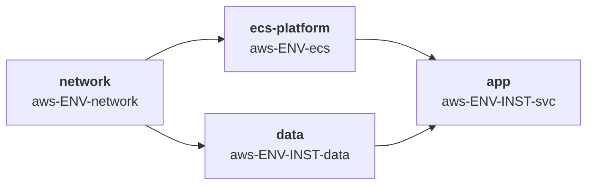

| # | Stack | Produces | Consumes |
|---|---|---|---|
| 1 | `aws-ENV-network` | VPC, private/public subnets, NAT, **VPC endpoints**, endpoint SG | — |
| 2 | `aws-ENV-ecs` | ECS cluster, ALB, WAF, ECR repos, Cloud Map namespace, log groups, ALB SG | network |
| 3a | `aws-ENV-INST-data` | RDS, Secrets Manager secret, DB security group | network |
| 3b | `aws-ENV-INST-svc` | Task definition, **task role**, **execution role**, service, target group, listener rule, service SG | ecs, data |

Unlike Cloud Run, there is no fan-in stack: ALB listener rules are separate resources that each instance owns, attached to the shared listener by ARN. Adding or removing a tenant touches only that tenant's stack.

### 8.2 Stack 1 — network, with VPC endpoints

Fargate tasks in private subnets must reach ECR, CloudWatch Logs and Secrets Manager. Routing that through a NAT gateway works but costs money and sends control-plane traffic over the internet. **VPC endpoints are the best-practice baseline** and they are a network-stack concern.

```hcl
# imports/contracts/contract_network_aws_fargate.tm.hcl
output "vpc_id"              { backend = "tofu"  value = module.vpc.vpc_id }
output "vpc_cidr"            { backend = "tofu"  value = module.vpc.vpc_cidr_block }
output "private_subnet_ids"  { backend = "tofu"  value = module.vpc.private_subnets }
output "public_subnet_ids"   { backend = "tofu"  value = module.vpc.public_subnets }
output "endpoint_sg_id"      { backend = "tofu"  value = module.vpc.vpc_endpoint_security_group_id }
output "azs"                 { backend = "tofu"  value = module.vpc.azs }
```

Required endpoints, generated from globals:

| Endpoint | Type | Why |
|---|---|---|
| `ecr.api`, `ecr.dkr` | Interface | Image pull without NAT |
| `s3` | Gateway | ECR layers are stored in S3 |
| `logs` | Interface | `awslogs` driver |
| `secretsmanager` / `ssm` | Interface | Secret injection at task start |
| `sts` | Interface | Task role credential vending |
| `ssmmessages` | Interface | Only if ECS Exec is enabled |

```hcl
assert {
  assertion = global.env == "demos" || tm_contains(global.network.vpc_endpoints, "secretsmanager")
  message   = "Non-demo environments must reach Secrets Manager over a VPC endpoint, not NAT"
}
```

### 8.3 Stack 2 — ECS platform

```hcl
# imports/contracts/contract_ecs_platform.tm.hcl
input "vpc_id" {
  backend = "tofu"  from_stack_id = global.platform.network_stack_id
  value = outputs.vpc_id.value  mock = "vpc-mock00000000000"
}
input "private_subnet_ids" {
  backend = "tofu"  from_stack_id = global.platform.network_stack_id
  value = outputs.private_subnet_ids.value
  mock  = ["subnet-mock0000000000a", "subnet-mock0000000000b"]
}
input "public_subnet_ids" {
  backend = "tofu"  from_stack_id = global.platform.network_stack_id
  value = outputs.public_subnet_ids.value
  mock  = ["subnet-mock0000000000c", "subnet-mock0000000000d"]
}

output "cluster_arn"            { backend = "tofu"  value = module.ecs.cluster_arn }
output "cluster_name"           { backend = "tofu"  value = module.ecs.cluster_name }
output "alb_arn"                { backend = "tofu"  value = module.alb.arn }
output "alb_dns_name"           { backend = "tofu"  value = module.alb.dns_name }
output "alb_zone_id"            { backend = "tofu"  value = module.alb.zone_id }
output "alb_https_listener_arn" { backend = "tofu"  value = module.alb.https_listener_arn }
output "alb_security_group_id"  { backend = "tofu"  value = module.alb.security_group_id }
output "ecr_registry_url"       { backend = "tofu"  value = module.ecr.registry_url }
output "cloudmap_namespace_id"  { backend = "tofu"  value = module.ecs.cloudmap_namespace_id }
output "log_group_prefix"       { backend = "tofu"  value = "/ecs/${var.cluster_name}" }
output "task_role_boundary_arn" { backend = "tofu"  value = aws_iam_policy.tenant_boundary.arn }
```

That last output is the multi-tenancy keystone. The platform publishes a **permission boundary policy**, and every archetype instance is required to attach it to any IAM role it creates. A tenant cannot then grant itself more than the boundary allows, even if its own stack is compromised or badly written.

```hcl
# imports/generators/v1/gen_ecs_platform.tm.hcl (excerpt)
resource "aws_iam_policy" "tenant_boundary" {
  name = "${global.env}-tenant-boundary"
  policy = jsonencode({
    Version = "2012-10-17"
    Statement = [
      {
        # Allow only the service namespaces a tenant workload legitimately needs
        Effect = "Allow"
        Action = [
          "s3:*", "sqs:*", "sns:*", "dynamodb:*",
          "secretsmanager:GetSecretValue", "kms:Decrypt",
          "logs:CreateLogStream", "logs:PutLogEvents",
          "xray:PutTraceSegments", "xray:PutTelemetryRecords"
        ]
        Resource = "*"
      },
      {
        # Hard denies that no tenant policy can override
        Effect = "Deny"
        Action = [
          "iam:CreateUser", "iam:CreateAccessKey", "iam:AttachUserPolicy",
          "iam:PutRolePolicy", "iam:AttachRolePolicy", "iam:DeleteRolePermissionsBoundary",
          "organizations:*", "account:*"
        ]
        Resource = "*"
      },
      {
        # Region confinement
        Effect = "Deny"
        NotAction = ["iam:*", "sts:*", "cloudfront:*", "route53:*"]
        Resource = "*"
        Condition = { StringNotEquals = { "aws:RequestedRegion" = global.region } }
      }
    ]
  })
}
```

### 8.4 Stack 3b — the service, and the two-role model

**This is the section to read twice.** ECS separates permissions into two roles with completely different lifetimes and threat models.

| | **Task execution role** | **Task role** |
|---|---|---|
| Used by | The ECS agent / Fargate infrastructure | Your application code |
| When | Before the container starts | For the container's whole life |
| Typical permissions | Pull image from ECR, create log streams, read secrets referenced in the task definition | S3, SQS, DynamoDB — whatever the app calls |
| Reachable from inside the container? | **No** | **Yes**, via the task metadata endpoint |
| Compromise impact | Attacker needs code execution *before* start — rare | Attacker with RCE in the container has these permissions immediately |

> **On a shared cluster, do not share the execution role between tenants.** A shared execution role must be able to read every tenant's secrets, which means the secret ARNs of tenant B are readable by the role that starts tenant A's tasks. Create a **per-instance execution role** scoped to that instance's secrets, even though it duplicates the ECR and logs permissions. The duplication is cheap; the cross-tenant secret exposure is not.

```hcl
# imports/generators/v1/gen_app_fargate.tm.hcl (excerpt)
generate_hcl "_iam.tf" {
  condition = global.capability == "app" && global.platform.runtime == "fargate"

  content {
    data "aws_iam_policy_document" "ecs_assume" {
      statement {
        effect  = "Allow"
        actions = ["sts:AssumeRole"]
        principals {
          type        = "Service"
          identifiers = ["ecs-tasks.amazonaws.com"]
        }
        # Confused-deputy protection: pin to this account and this cluster
        condition {
          test     = "ArnLike"
          variable = "aws:SourceArn"
          values   = ["arn:aws:ecs:${global.region}:${global.account_id}:*"]
        }
        condition {
          test     = "StringEquals"
          variable = "aws:SourceAccount"
          values   = [global.account_id]
        }
      }
    }

    # ---------- EXECUTION ROLE — per instance, not shared ----------
    resource "aws_iam_role" "execution" {
      name                 = "${global.instance}-${global.app.name}-exec"
      assume_role_policy   = data.aws_iam_policy_document.ecs_assume.json
      permissions_boundary = var.task_role_boundary_arn
      tags                 = global.tags
    }

    resource "aws_iam_role_policy" "execution" {
      role = aws_iam_role.execution.id
      policy = jsonencode({
        Version = "2012-10-17"
        Statement = [
          {
            Effect   = "Allow"
            Action   = ["ecr:GetAuthorizationToken"]
            Resource = "*"                                   # this action has no resource scope
          },
          {
            Effect   = "Allow"
            Action   = ["ecr:BatchGetImage", "ecr:GetDownloadUrlForLayer", "ecr:BatchCheckLayerAvailability"]
            Resource = ["arn:aws:ecr:${global.region}:${global.account_id}:repository/${global.app.name}"]
          },
          {
            Effect   = "Allow"
            Action   = ["logs:CreateLogStream", "logs:PutLogEvents"]
            Resource = ["${var.log_group_prefix}/${global.instance}/*"]
          },
          {
            # ONLY this instance's secrets
            Effect   = "Allow"
            Action   = ["secretsmanager:GetSecretValue"]
            Resource = [var.db_secret_arn]
          },
          {
            Effect   = "Allow"
            Action   = ["kms:Decrypt"]
            Resource = [var.secrets_kms_key_arn]
            Condition = {
              StringEquals = { "kms:ViaService" = "secretsmanager.${global.region}.amazonaws.com" }
            }
          }
        ]
      })
    }

    # ---------- TASK ROLE — what the application itself may do ----------
    resource "aws_iam_role" "task" {
      name                 = "${global.instance}-${global.app.name}-task"
      assume_role_policy   = data.aws_iam_policy_document.ecs_assume.json
      permissions_boundary = var.task_role_boundary_arn
      tags                 = global.tags
    }

    resource "aws_iam_role_policy" "task" {
      role = aws_iam_role.task.id
      policy = jsonencode({
        Version = "2012-10-17"
        Statement = [
          {
            Effect   = "Allow"
            Action   = ["s3:GetObject", "s3:PutObject"]
            Resource = ["arn:aws:s3:::${global.instance}-${global.app.name}-data/*"]
          }
        ]
      })
    }
  }
}
```

Task definition — note that secrets go in `secrets`, never in `environment`:

```hcl
generate_hcl "_task_definition.tf" {
  condition = global.capability == "app" && global.platform.runtime == "fargate"

  content {
    resource "aws_ecs_task_definition" "this" {
      family                   = "${global.instance}-${global.app.name}"
      requires_compatibilities = ["FARGATE"]
      network_mode             = "awsvpc"
      cpu                      = global.app.cpu
      memory                   = global.app.memory

      execution_role_arn = aws_iam_role.execution.arn
      task_role_arn      = aws_iam_role.task.arn

      runtime_platform {
        operating_system_family = "LINUX"
        cpu_architecture        = global.app.architecture   # ARM64 where possible: cheaper, smaller attack surface
      }

      container_definitions = jsonencode([{
        name      = global.app.name
        image     = "${var.ecr_registry_url}/${global.app.name}:${global.app.image_tag}"
        essential = true

        readonlyRootFilesystem = true
        user                   = "10001:10001"           # never root
        linuxParameters = {
          capabilities = { drop = ["ALL"] }
          initProcessEnabled = true
        }

        portMappings = [{ containerPort = global.app.port, protocol = "tcp" }]

        # Non-sensitive configuration only
        environment = [
          { name = "DB_HOST", value = var.db_endpoint },
          { name = "ENV",     value = global.env }
        ]

        # Sensitive values by reference — resolved by the execution role at start.
        # These never appear in DescribeTaskDefinition output.
        secrets = [
          { name = "DB_PASSWORD", valueFrom = "${var.db_secret_arn}:password::" }
        ]

        logConfiguration = {
          logDriver = "awslogs"
          options = {
            "awslogs-group"         = "${var.log_group_prefix}/${global.instance}"
            "awslogs-region"        = global.region
            "awslogs-stream-prefix" = global.app.name
          }
        }
      }])
    }

    resource "aws_ecs_service" "this" {
      name            = "${global.instance}-${global.app.name}"
      cluster         = var.cluster_arn
      task_definition = aws_ecs_task_definition.this.arn
      desired_count   = global.app.desired_count
      launch_type     = "FARGATE"
      platform_version = "LATEST"

      enable_execute_command = global.app.ecs_exec_enabled   # false by default

      network_configuration {
        subnets          = var.private_subnet_ids
        security_groups  = [aws_security_group.service.id]
        assign_public_ip = false                             # always false in private subnets
      }

      load_balancer {
        target_group_arn = aws_lb_target_group.this.arn
        container_name   = global.app.name
        container_port   = global.app.port
      }
    }
  }
}
```

Security groups reference each other, never CIDRs:

```hcl
resource "aws_security_group" "service" {
  name   = "${global.instance}-${global.app.name}-svc"
  vpc_id = var.vpc_id
}

resource "aws_vpc_security_group_ingress_rule" "from_alb" {
  security_group_id            = aws_security_group.service.id
  referenced_security_group_id = var.alb_security_group_id   # only the shared ALB
  from_port                    = global.app.port
  to_port                      = global.app.port
  ip_protocol                  = "tcp"
}

resource "aws_vpc_security_group_egress_rule" "to_db" {
  security_group_id            = aws_security_group.service.id
  referenced_security_group_id = var.db_security_group_id
  from_port                    = 5432
  to_port                      = 5432
  ip_protocol                  = "tcp"
}
```

### 8.5 Fargate IAM and security checklist

| Control | Requirement | Rationale |
|---|---|---|
| Two-role split | Execution role and task role always distinct | Task role is reachable from inside the container; execution role is not |
| Per-instance execution role | On shared clusters, never share it | A shared execution role can read every tenant's secrets |
| Permission boundary | Attached to both roles, published by the platform | Prevents privilege escalation from a tenant's own stack |
| Confused deputy | `aws:SourceArn` + `aws:SourceAccount` in the trust policy | Blocks cross-account role assumption via the ECS service principal |
| Secrets | `secrets` block, never `environment` | `environment` values are visible in `DescribeTaskDefinition` to anyone with read access |
| Root filesystem | `readonlyRootFilesystem = true` | Blocks the majority of post-exploitation tooling |
| Container user | Non-root UID, `capabilities.drop = ["ALL"]` | Fargate isolates tasks, but defence in depth still applies |
| Public IP | `assign_public_ip = false` | Tasks in private subnets egress via NAT or endpoints only |
| ECS Exec | Disabled unless justified; when enabled, require logging to CloudWatch/S3 and `ssmmessages` on the **task** role | Exec is an interactive shell into production |
| ECR | Scan on push, immutable tags, lifecycle policy | Immutable tags prevent silent image substitution |
| Log groups | Per-instance prefix, retention set, KMS-encrypted | Prevents cross-tenant log reading |
| Architecture | ARM64 where the workload allows | Lower cost and a distinct image supply chain |

Complementary guard rails above the pipeline (§11.7): SCPs denying `iam:CreateUser`, denying deletion of permission boundaries, and confining regions.

### 8.6 Shared and dedicated for ECS Fargate

| Dimension | Shared demo cluster | Dedicated production |
|---|---|---|
| Isolation boundary | Task role + execution role + security group | Account |
| Compute isolation | **Per-task VM-level isolation** — stronger than shared EKS nodes | Same |
| Network | Shared VPC, per-service SG | Dedicated VPC |
| Ingress | Shared ALB, per-tenant host-based listener rule | Dedicated ALB |
| Secrets | Per-tenant secret + per-tenant execution role | Per-account |
| Escalation control | Platform-published permission boundary | Boundary + SCP |
| Cost at idle | `desired_count = 0` outside demo hours | Always on |

The general model and destroy safety are in §12; this table records only what is specific to Fargate.

The isolation argument is worth stating plainly: **Fargate gives each task its own micro-VM.** A shared Fargate cluster does not have the shared-kernel exposure of a shared EKS node pool, which makes it the stronger default for multi-tenant demo environments where tenant code is not fully trusted.

Per-tenant listener rules on the shared ALB:

```hcl
resource "aws_lb_listener_rule" "this" {
  listener_arn = var.alb_https_listener_arn
  priority     = global.app.listener_priority        # from globals — must be unique per tenant

  action {
    type             = "forward"
    target_group_arn = aws_lb_target_group.this.arn
  }

  condition {
    host_header {
      values = ["${global.instance}.${global.dns_suffix}"]
    }
  }
}
```

```hcl
assert {
  assertion = global.platform.model != "shared" || tm_can(global.app.listener_priority)
  message   = "Shared-cluster tenants must declare a unique ALB listener priority"
}
```

Listener rule priorities are a shared, finite namespace. Allocate them from a block per tenant in the platform's `config.tm.hcl` (`alpha = 100–199`, `beta = 200–299`) so two pull requests cannot collide.

### 8.7 Fargate caveats

| Caveat | Impact | Mitigation |
|---|---|---|
| Shared execution role | Cross-tenant secret exposure | Per-instance execution role (§8.4) |
| Secrets in `environment` | Plaintext in `DescribeTaskDefinition` and in the console | Use `secrets`; add a Checkov custom policy that fails on likely secret names in `environment` |
| Listener priority collisions | Second apply fails, or worse, routes traffic wrongly | Allocate ranges per tenant in globals; enforce with an assertion |
| No VPC endpoints | Image pull and secret retrieval traverse NAT | Endpoint list in globals, asserted for non-demo environments |
| Task definition revisions accumulate | Hard to audit which revision is live | Tag revisions; prune on a schedule; record the live revision in the CMDB |
| `ecr:GetAuthorizationToken` cannot be resource-scoped | Looks like an over-broad grant in review | Document it; it grants only a token, and the pull actions are scoped |
| ECS Exec left enabled | Interactive shell into production | Default `false` in globals; assertion blocking it for `prod` |
| Fargate has no daemonsets | Sidecar-based agents must be added per task definition | Generate the sidecar from the platform layer so every tenant gets it uniformly |

### 8.8 Variant — EKS Fargate profiles

EKS Fargate profiles are a *compute option for the EKS guide*, not a separate platform. If you adopt them, the changes to §6 are:

- The `eks` stack additionally produces `fargate_profile_arn` and the **Fargate pod execution role ARN**.
- That pod execution role replaces the node role for the selected namespaces; grant it ECR pull and CloudWatch logs only.
- Fargate profiles select by **namespace and labels**, which maps directly onto `global.platform.namespace` — one profile per tenant namespace on a shared cluster gives per-tenant compute isolation without a separate cluster.
- IRSA is unchanged: `oidc_provider_arn` and `oidc_provider_url` still come from the cluster stack.
- Caveats: no DaemonSets, no privileged containers, no host networking, and a `/16`-scale IP demand on the pod subnets. Size the subnets in globals accordingly.

---

## 9. Guide E — AKS platform and its dependency chain

AKS completes the three-cloud parity. Structurally it mirrors the EKS guide; the differences are the identity model (Workload Identity via Entra ID rather than IRSA), the networking mode decision, and the edge attachment.

### 9.1 Dependency graph

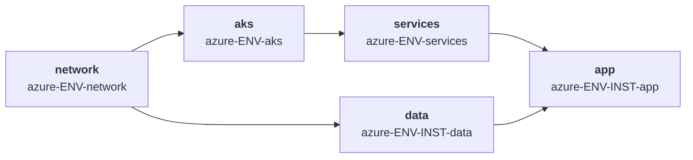

| # | Stack | Produces | Consumes |
|---|---|---|---|
| 1 | `azure-ENV-network` | VNet, subnets, NAT gateway, private DNS zones, private endpoint subnet | — |
| 2 | `azure-ENV-aks` | Cluster, node pools, OIDC issuer URL, kubelet identity | network |
| 3 | `azure-ENV-services` | AGFC or Envoy Gateway, cert integration, monitoring | aks |
| 4a | `azure-ENV-INST-data` | Flexible Server, Key Vault secrets, private endpoint | network |
| 4b | `azure-ENV-INST-app` | Workload, user-assigned managed identity, federated credential | aks, services, data |

### 9.2 Networking mode — decide once, in globals

| Mode | Pod addressing | When |
|---|---|---|
| **Azure CNI Overlay** | Pods on a private overlay CIDR, not VNet IPs | **Default choice.** Removes VNet IP pressure entirely |
| Azure CNI (traditional) | Every pod gets a VNet IP | Only when pods must be directly routable from outside the cluster |
| Azure CNI Powered by Cilium | Overlay plus eBPF dataplane | When you want NetworkPolicy at eBPF performance |

Overlay mode changes the address plan meaningfully: the pod half of the `/17` becomes reserve rather than consumed, because pod addresses come from a separate, non-routable overlay space that may be reused across environments. That is a genuine advantage over EKS with VPC CNI, and it should be recorded as a trait so capacity planning reflects it.

### 9.3 Identity — Workload Identity with Entra ID

```hcl
# imports/contracts/contract_cluster_aks.tm.hcl
input "vnet_id" {
  backend = "tofu"  from_stack_id = global.platform.network_stack_id
  value = outputs.vnet_id.value
  mock  = "/subscriptions/mock/resourceGroups/mock/providers/Microsoft.Network/virtualNetworks/mock"
}
input "node_subnet_id" {
  backend = "tofu"  from_stack_id = global.platform.network_stack_id
  value = outputs.node_subnet_id.value
  mock  = "/subscriptions/mock/.../subnets/mock-nodes"
}

output "cluster_name"     { backend = "tofu"  value = azurerm_kubernetes_cluster.this.name }
output "cluster_endpoint" { backend = "tofu"  value = azurerm_kubernetes_cluster.this.kube_config.0.host }
output "cluster_ca" {
  backend = "tofu"  value = azurerm_kubernetes_cluster.this.kube_config.0.cluster_ca_certificate
  sensitive = true
}
# The single fact every workload identity in every instance depends on:
output "oidc_issuer_url"  { backend = "tofu"  value = azurerm_kubernetes_cluster.this.oidc_issuer_url }
output "kubelet_identity_object_id" {
  backend = "tofu"  value = azurerm_kubernetes_cluster.this.kubelet_identity.0.object_id
}
```

The application stack creates a user-assigned managed identity and a federated credential scoped to exactly one namespace and service account:

```hcl
resource "azurerm_user_assigned_identity" "app" {
  name                = "${global.instance}-${global.app.name}"
  resource_group_name = global.resource_group
  location            = global.region
}

resource "azurerm_federated_identity_credential" "app" {
  name                = "${global.instance}-${global.app.name}-fic"
  resource_group_name = global.resource_group
  parent_id           = azurerm_user_assigned_identity.app.id
  audience            = ["api://AzureADTokenExchange"]
  issuer              = var.oidc_issuer_url
  # Namespace-scoped, never a wildcard
  subject             = "system:serviceaccount:${global.platform.namespace}:${global.app.name}"
}
```

The `subject` field is the exact analogue of the EKS `sub` condition and the GKE Workload Identity member string. All three are namespace-scoped, and in all three a wildcard silently grants every pod in the cluster the identity.

### 9.4 AKS IAM and security baseline

| Control | Requirement | Rationale |
|---|---|---|
| Cluster identity | User-assigned managed identity, not system-assigned | Survives cluster recreation; grantable in advance |
| Workload identity | Enabled with OIDC issuer; one UAMI per workload | The kubelet identity must never be the workload identity |
| Kubelet identity | Scoped to ACR pull only | It is reachable from the node |
| Cluster access | **Entra ID integration with Azure RBAC**, local accounts disabled | `local_account_disabled = true` removes the static admin kubeconfig |
| Admin access | Entra group, never individual users | Auditable and centrally revocable |
| API server | Private cluster, or authorized IP ranges | |
| Secrets | Key Vault via the Secrets Store CSI driver, using workload identity | Never Kubernetes Secrets as the source of truth |
| Node pools | Ephemeral OS disks, `enable_host_encryption`, Azure Linux or Ubuntu with automatic patching | |
| Registry | ACR with content trust and vulnerability scanning; ACR pull via managed identity | |
| Policy | Azure Policy add-on enforcing Pod Security Standards | Equivalent to the `restricted` PSS elsewhere |
| Deployer permissions | Scoped custom role, not Owner or Contributor at subscription level | |

Azure Policy assignments at management-group level are the equivalent of GCP Organisation Policies and AWS SCPs: deny public IPs on node pools, require private endpoints on PaaS data services, confine regions, and deny cluster creation with local accounts enabled.

### 9.5 AKS caveats

| Caveat | Impact | Mitigation |
|---|---|---|
| `kube_config` is sensitive and lands in state | State becomes a credential store | Use `local_account_disabled = true` and Entra auth; never share `kube_config` as an output |
| Node resource group | AKS creates a second, AKS-managed resource group | Do not manage its contents in Terraform; the cluster reconciler will fight you |
| Subnet delegation for AGFC | The App Gateway for Containers subnet needs delegation to `Microsoft.ServiceNetworking/TrafficController` | Reserve it in the environment address layout |
| Private DNS zones for private endpoints | Each PaaS service needs its own zone linked to the VNet | Own them in the network stack; they are shared across instances |
| Overlay vs CNI is immutable | Changing networking mode requires cluster recreation | Decide in globals before the first apply |
| Preview features | Several AKS capabilities ship behind `--enable-preview` flags | Pin the provider and record the preview dependency in the archetype manifest |

---

## 10. Edge attachment across clouds

This is the least portable element in the architecture, and the one that decides whether an environment earns the `iac-owned-edge` trait in the archetype model. The pattern is the same everywhere — Envoy Gateway (or AGFC) inside the cluster, a cloud load balancer in front, no cloud-managed external LB per Service — but the attachment mechanism differs structurally.

### 10.1 Comparison

| | GCP | AWS | Azure |
|---|---|---|---|
| Mechanism | Standalone NEG | `TargetGroupBinding` CRD | AGFC in **BYO** mode |
| Created by | GKE NEG controller | **Terraform** creates the target group | **Terraform** creates ALB + Frontend + Association |
| In Terraform state? | **No** | **Yes** | **Yes** |
| Trigger | Service annotation | `TargetGroupBinding` custom resource | Annotation on `Gateway` / `Ingress` |
| Bound by | NEG name | Target group ARN or name | Frontend resource ID |
| Zonality | One NEG per zone | Single target group | Single Frontend |
| `iac-owned-edge` trait | No | Yes | Yes |

### 10.2 GCP — standalone NEG

Terraform owns the backend service, health check, URL map, target proxy, forwarding rule, certificate and firewall rules. It does **not** own the NEG.

- Declare the NEG as a `data` source, never a `resource`, or Terraform and the controller will fight on every plan.
- Name it explicitly in the `EnvoyProxy` annotation so the lookup is deterministic.
- NEGs are **zonal**. Enforce `minReplicas ≥ number of zones` plus topology spread with an assertion, or a zone without Envoy pods produces a missing NEG and a failed apply.
- Cold start: the NEG does not exist until Envoy pods are Ready. Split into three stacks (`aks`/`gke` → `gateway` → `edge`) with `after`, and rely on `--mock-on-fail` for PR previews.

### 10.3 AWS — TargetGroupBinding

The strongest of the three for full IaC ownership. `TargetGroupBinding` exposes pods through an ALB or NLB target group provisioned entirely outside Kubernetes, while the controller manages target registration from the Kubernetes Service.

Two cautions:

- **Never use `aws_lb_target_group_attachment` alongside it.** The controller registers and deregisters targets dynamically as pods come and go; Terraform managing the same targets guarantees a fight on every plan.
- **Restrict creation with RBAC on shared clusters.** The CRD can reference any target group in the account where the cluster resides, so a tenant could import another workload's target group into its namespace and redirect traffic. In this architecture, only the `gateway` archetype creates `TargetGroupBinding` resources, and RBAC denies `create` and `update` on the CRD to application namespaces. Scope the controller's IAM policy to the specific target groups rather than `Resource: "*"`.

### 10.4 Azure — AGFC bring-your-own

BYO mode puts the Application Gateway for Containers resource, its Association and its Frontend children in Terraform. The trade-off is a coupled lifecycle: each `Gateway` or `Ingress` object requires a Frontend provisioned in advance and referenced by annotation, and deleted after the Kubernetes object is removed.

With one Gateway per environment — which the shared-platform design already mandates — that is one Frontend per environment. With a Gateway per tenant it would not scale.

One architectural difference worth deciding early: **AGFC is itself a Gateway API implementation.** Placing Envoy Gateway behind it is a double L7 hop with no gain. On Azure the real choice is AGFC directly, or Envoy Gateway behind a standard internal Load Balancer. AGFC does not expose Envoy's native `SecurityPolicy` OIDC, so a Keycloak integration needs a different mechanism there.

### 10.5 Envoy Gateway configuration

The Service carrying the edge annotation is **generated by the Envoy Gateway controller**, not written in your chart. Configure it through `EnvoyProxy`, referenced from the `GatewayClass`:

```yaml
apiVersion: gateway.envoyproxy.io/v1alpha1
kind: EnvoyProxy
metadata: { name: edge-proxy, namespace: envoy-gateway-system }
spec:
  provider:
    type: Kubernetes
    kubernetes:
      envoyService:
        type: ClusterIP                      # no per-Service cloud LB
        annotations:
          # GCP
          cloud.google.com/neg: '{"exposed_ports":{"8443":{"name":"eg-demos-neg"}}}'
      envoyDeployment:
        replicas: 3
        pod:
          topologySpreadConstraints: [ ... ]
```

**Avoid the `kubernetes_manifest` resource** for `GatewayClass`, `EnvoyProxy` and `Gateway`. It requires the CRD to exist and the API server to be reachable *at plan time*, which breaks PR previews and `--mock-on-fail`. Package the custom resources in the `gateway` archetype's own Helm chart and deploy with `helm_release`, so a plan is a values diff rather than an API call.

### 10.6 Why this eliminates the fan-in problem

Gateway API inverts the direction of the routing dependency. An `HTTPRoute` lives in the application's namespace and attaches to the Gateway with `parentRefs`; the Gateway controls who may attach via `allowedRoutes`. **The edge no longer needs to know its tenants.**

That removes three things from the architecture: the URL map generated from a `global.tenants` list (§7.5), the listener-priority ledger, and the edge-routing stack that had to run after every instance. What remains a claim is the hostname, because only one tenant can own `alpha.demos.disasterproject.com`.

Use **one Gateway per environment** with `allowedRoutes.namespaces.from: Selector`, not one per tenant — each `Gateway` spawns its own Envoy Deployment, Service and NEG, so per-tenant Gateways reintroduce exactly the fan-in they were meant to remove. If you later need several (internal and external, for instance), `mergeGateways` in `EnvoyProxy` lets them share one proxy fleet.

### 10.7 The Keycloak bootstrap cycle

Envoy Gateway provides native OIDC through `SecurityPolicy`, which likely removes the need for external authorization. But there is a cycle to design around explicitly:

> The Gateway needs Keycloak to authenticate, and Keycloak is exposed through the Gateway.

Two invariants:

- Keycloak's own `HTTPRoute` carries **no** `SecurityPolicy`.
- The Gateway's OIDC discovery endpoint resolves through the in-cluster Service, not the public hostname.

Without these, a cold environment does not start and the cause is not obvious. Also decide the IdP-failure behaviour: if Keycloak is down, the Gateway stops authenticating everything else. Acceptable in `demos`; in production it requires Keycloak HA and an explicit decision on fail-open versus fail-closed.

### 10.8 Edge risks

| Risk | Mitigation |
|---|---|
| NEG absent in a zone without Envoy pods | `minReplicas ≥ zones`, topology spread, assertion |
| `TargetGroupBinding` cross-tenant traffic redirection | RBAC denying the CRD to tenant namespaces; scoped controller IAM |
| AGFC Frontend orphaned after Gateway deletion | Frontend lifecycle owned by the same stack as the Gateway; destroy in reverse |
| Envoy Gateway is a per-environment SPOF | PDB, surge deployment, `minReplicas ≥ 3` |
| Envoy Gateway release cadence; alpha APIs in `EnvoyProxy` and `SecurityPolicy` | Pin chart and Gateway API versions; upgrade in an ephemeral environment first |
| NEG retained on `tofu destroy` | Correct reverse order — backend service must be deleted before the Kubernetes Service |
| Double L7 hop unjustified | Confirm the need for `SecurityPolicy` OIDC, mTLS or per-route rate limiting before committing |

---

## 11. Identity, access and security baseline

Everything above assumes a pipeline identity that can read and write cloud resources across several accounts and projects. That identity is the highest-value target in the whole system: it holds, by construction, more privilege than any single workload it deploys. This section specifies how it is granted, bounded and audited.

### 11.1 Principles

1. **No long-lived credentials anywhere.** No service account JSON keys, no IAM access keys in GitHub secrets. OIDC federation only.
2. **Separate plan identity from apply identity.** Plan is read-only; apply is write. A pull request from a fork must never be able to reach an apply role.
3. **Separate identity per environment.** The role that deploys `demos` must not be able to touch `prod`.
4. **Bound the blast radius above the pipeline.** Organisation Policies and SCPs are the control the pipeline cannot disable; permission boundaries are the control a tenant's own code cannot escape.
5. **Workloads never inherit pipeline privilege.** The role that creates a Cloud Run service and the service account that service runs as are different principals with disjoint permissions.
6. **Secrets are referenced, never transported.** Nothing sensitive crosses the outputs-sharing boundary.

### 11.2 Pipeline identity — GitHub Actions to Google Cloud

Workload Identity Federation, with the pool and provider owned by a bootstrap stack that the pipeline itself does not manage.

```hcl
resource "google_iam_workload_identity_pool" "github" {
  workload_identity_pool_id = "github-pool"
  project                   = var.bootstrap_project_id
}

resource "google_iam_workload_identity_pool_provider" "github" {
  workload_identity_pool_id          = google_iam_workload_identity_pool.github.workload_identity_pool_id
  workload_identity_pool_provider_id = "github-oidc"

  attribute_mapping = {
    "google.subject"         = "assertion.sub"
    "attribute.repository"   = "assertion.repository"
    "attribute.environment"  = "assertion.environment"
    "attribute.ref"          = "assertion.ref"
  }

  # WITHOUT THIS CONDITION, ANY GITHUB REPOSITORY IN THE WORLD CAN
  # IMPERSONATE THIS POOL. It is not optional.
  attribute_condition = "assertion.repository == 'disasterproject/infra' && assertion.repository_owner_id == '123456'"

  oidc {
    issuer_uri = "https://token.actions.githubusercontent.com"
  }
}
```

Two service accounts per environment, bound to *different* principal sets:

```hcl
# Plan: read-only, allowed from any branch (so PRs from feature branches work)
resource "google_service_account_iam_member" "plan" {
  service_account_id = google_service_account.tf_plan_shared_demo.name
  role               = "roles/iam.workloadIdentityUser"
  member = "principalSet://iam.googleapis.com/${google_iam_workload_identity_pool.github.name}/attribute.repository/disasterproject/infra"
}

# Apply: write, allowed ONLY from the protected GitHub Environment
resource "google_service_account_iam_member" "apply" {
  service_account_id = google_service_account.tf_apply_shared_demo.name
  role               = "roles/iam.workloadIdentityUser"
  member = "principalSet://iam.googleapis.com/${google_iam_workload_identity_pool.github.name}/attribute.environment/demos"
}
```

The `attribute.environment` claim is only present when the workflow job declares `environment:`. Binding the apply SA to that attribute means **the apply role is unreachable from a job without the environment gate**, which is what makes GitHub's required-reviewers control a real security boundary rather than a UI convenience.

| Identity | Roles | Scope |
|---|---|---|
| `tf-plan-<env>@` | `roles/viewer`, `roles/storage.objectViewer` on the state bucket prefix | Read-only; may read producer state for outputs sharing |
| `tf-apply-<env>@` | Least-privilege set per environment (`roles/container.admin`, `roles/run.admin`, `roles/compute.networkAdmin`, …) plus `roles/storage.objectAdmin` on the state prefix | Never `roles/owner`, never `roles/editor` |
| `tf-apply-<env>@` extras | `roles/iam.serviceAccountUser` on every runtime SA it must `actAs` | Scoped per SA, not project-wide |
| Runtime SAs (`run-*`, GKE node SA) | Workload-specific, minimal | Created by the pipeline, never assumable by it beyond `actAs` |

Organisation policies that the pipeline cannot override:

```
constraints/iam.disableServiceAccountKeyCreation      # no exportable keys, ever
constraints/iam.allowedPolicyMemberDomains            # no external identities in IAM policies
constraints/compute.vmExternalIpAccess                # deny by default
constraints/sql.restrictPublicIp                      # Cloud SQL private IP only
constraints/run.allowedIngress                        # blocks ingress=ALL fleet-wide
constraints/compute.requireShieldedVm                 # GKE nodes
constraints/gcp.resourceLocations                     # data residency
```

### 11.3 Pipeline identity — GitHub Actions to AWS

```hcl
resource "aws_iam_openid_connect_provider" "github" {
  url             = "https://token.actions.githubusercontent.com"
  client_id_list  = ["sts.amazonaws.com"]
  thumbprint_list = [var.github_oidc_thumbprint]
}

data "aws_iam_policy_document" "apply_trust" {
  statement {
    effect  = "Allow"
    actions = ["sts:AssumeRoleWithWebIdentity"]

    principals {
      type        = "Federated"
      identifiers = [aws_iam_openid_connect_provider.github.arn]
    }

    condition {
      test     = "StringEquals"
      variable = "token.actions.githubusercontent.com:aud"
      values   = ["sts.amazonaws.com"]
    }

    # StringEquals on the full sub, pinned to the protected environment.
    # NEVER use StringLike with "repo:disasterproject/infra:*" — that grants every
    # branch, every fork PR and every workflow in the repository.
    condition {
      test     = "StringEquals"
      variable = "token.actions.githubusercontent.com:sub"
      values   = ["repo:disasterproject/infra:environment:${var.environment}"]
    }
  }
}

resource "aws_iam_role" "tf_apply" {
  name                 = "tf-apply-${var.environment}"
  assume_role_policy   = data.aws_iam_policy_document.apply_trust.json
  permissions_boundary = aws_iam_policy.pipeline_boundary.arn
  max_session_duration = 3600
}
```

| Control | Setting | Why |
|---|---|---|
| `sub` condition | `StringEquals` on the exact `repo:ORG/REPO:environment:ENV` | `StringLike` with a wildcard is the single most common AWS OIDC misconfiguration |
| `aud` condition | Always present | Without it the trust policy accepts tokens minted for other audiences |
| Permission boundary on the pipeline role | Denies `iam:DeleteRolePermissionsBoundary`, `organizations:*`, `iam:CreateUser` | The pipeline creates IAM roles; it must not be able to create ones more powerful than itself |
| `max_session_duration` | 1 hour | Limits the window of a leaked session token |
| Session name | Set to the workflow run ID | Every CloudTrail event traces back to a specific pipeline run and commit |
| Plan role | Separate role, `ReadOnlyAccess` + state read | Reachable without the environment gate |

```yaml
- uses: aws-actions/configure-aws-credentials@v4
  with:
    role-to-assume: ${{ vars.AWS_APPLY_ROLE }}
    role-session-name: gha-${{ github.run_id }}-${{ github.run_attempt }}
    aws-region: eu-west-1
```

Service Control Policies at the organisation or OU level:

```
Deny  iam:CreateUser, iam:CreateAccessKey                 # federation only
Deny  iam:DeleteRolePermissionsBoundary                   # boundaries are immutable to workloads
Deny  organizations:LeaveOrganization
Deny  * outside approved regions (with the usual global-service exceptions)
Deny  ec2:* when aws:RequestedRegion is unapproved
Deny  s3:PutBucketPolicy granting Principal "*"
Deny  kms:ScheduleKeyDeletion for state-encryption keys
```

### 11.4 Role segregation matrix

| Job | GCP identity | AWS identity | GitHub environment gate | State access |
|---|---|---|---|---|
| `preview` (PR) | `tf-plan-<env>@` | `tf-plan-<env>` | none | read |
| `deploy` (main) | `tf-apply-<env>@` | `tf-apply-<env>` | **required reviewers** | read + write |
| `drift` (cron) | `tf-plan-<env>@` | `tf-plan-<env>` | none | read |
| `destroy` (manual) | `tf-destroy-<env>@` | `tf-destroy-<env>` | **required reviewers + separate approver group** | read + write |

Destroy deserves its own identity. On a shared platform it is the operation that can take down every tenant (§12.4), and separating it means a compromised deploy path cannot delete infrastructure.

Plan runs must use `-lock=false`, so the plan identity needs no write on the lock table or state object. That is what makes a genuinely read-only plan role possible:

```bash
tofu plan -lock=false -out out.tfplan
```

### 11.5 State backend permissions and the outputs-sharing requirement

Outputs sharing runs `tofu output -json` **inside the producer's directory**, which reads the producer's state. This is a permission requirement that does not exist in a repository without sharing, and it is the most common blocker in the first week of adoption.

| Consumer needs | GCS | S3 |
|---|---|---|
| Read producer state | `roles/storage.objectViewer` on `gs://BUCKET/PREFIX/producer/*` | `s3:GetObject` on `arn:aws:s3:::BUCKET/PREFIX/producer/*` |
| Decrypt producer state | `roles/cloudkms.cryptoKeyDecrypter` if CMEK | `kms:Decrypt` on the bucket key |
| Decrypt OpenTofu state encryption | The producer's state-encryption key | Same |
| Lock | **Not required** — `tofu output` does not lock | Not required |

> **OpenTofu client-side state encryption changes the calculus.** If you enable the `encryption` block (recommended), the consumer needs the producer's *encryption key*, not just object read. Use one key per environment rather than one per stack, or cross-stack sharing becomes a key-management problem. Document the key scope explicitly.

```hcl
# generated by the backend mixin
terraform {
  encryption {
    key_provider "gcp_kms" "env" {
      kms_encryption_key = var.state_kms_key      # one key per ENVIRONMENT
      key_length         = 32
    }
    method "aes_gcm" "default" {
      keys = key_provider.gcp_kms.env
    }
    state    { method = method.aes_gcm.default }
    plan     { method = method.aes_gcm.default }
  }
}
```

Cross-account and cross-project topologies:

- **Cross-project (GCP).** The consumer's SA needs the viewer grant on the *producer's* bucket. Grant it on the bucket prefix, not the bucket, so a `demos` consumer cannot read `prod` state.
- **Cross-account (AWS).** Either the state bucket policy grants the consumer role directly, or the consumer assumes a role in the producer's account. The former is simpler; the latter is auditable per-account. Pick one convention and apply it everywhere.
- **Blast-radius note.** Every sharing edge is also a state-read permission. Before adding one, ask whether the value could be a global instead (§4.6) — that costs zero permissions.

### 11.6 What never crosses the sharing boundary

Outputs sharing resolves values into `TF_VAR_<name>` environment variables in the consumer's process. Environment variables leak: into crash dumps, into subprocess environments, into CI debug logs, into `ps` output.

| Value | Share? | Instead |
|---|---|---|
| Database password | **No** | Secret Manager secret ID / Secrets Manager ARN |
| Cloud auth token | **No** | `google_client_config` / `aws_eks_cluster_auth` per consumer |
| TLS private key | **No** | Certificate Manager map ID / ACM certificate ARN |
| API key | **No** | The secret's reference |
| KMS key material | **No** | Key ARN or resource name |
| Cluster CA certificate | Yes, marked `sensitive` | It is a public certificate |
| Cluster endpoint, VPC ID, subnet IDs, OIDC provider ARN | Yes | — |

Enforce it mechanically rather than by review:

```bash
# scripts/lint-no-secrets-shared.sh
if grep -rEn 'output\s+"[^"]*(password|secret_value|private_key|token|credential)' \
     imports/contracts/ | grep -v '_id"\|_arn"\|_name"'; then
  echo "::error::An output block appears to export a secret value. Share a reference instead."
  exit 1
fi
```

### 11.7 Guard rails above the pipeline

Three layers, each enforcing what the layer below cannot bypass:

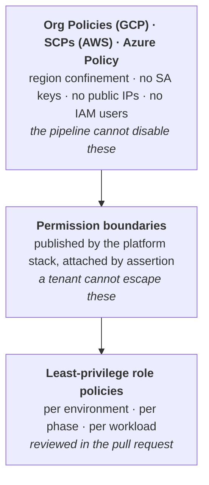

Assertion enforcing the middle layer:

```hcl
assert {
  assertion = global.capability != "app" || tm_can(global.iam.permission_boundary)
  message   = "Application stacks must attach the platform permission boundary to every IAM role"
}

assert {
  assertion = global.env != "prod" || !global.app.ecs_exec_enabled
  message   = "ECS Exec must not be enabled in production"
}
```

### 11.8 Workload identity across the guides

| Guide | Workload identity mechanism | Facts shared from platform | Where the binding is scoped |
|---|---|---|---|
| **GKE** (§5) | Workload Identity Federation for GKE | `workload_identity_pool` | `serviceAccount:POOL[NAMESPACE/KSA]` — namespace-scoped |
| **EKS** (§6) | IRSA (or EKS Pod Identity) | `oidc_provider_arn`, `oidc_provider_url` | `sub = system:serviceaccount:NAMESPACE:SA` — namespace + SA scoped |
| **Cloud Run** (§7) | Per-service runtime service account | *none* — identity is created by the app stack | The service itself is the boundary |
| **ECS Fargate** (§8) | Task role (+ separate execution role) | `task_role_boundary_arn` | The task definition is the boundary |
| **AKS** (§9) | Workload Identity (Entra ID) | `oidc_issuer_url` | `subject = system:serviceaccount:NAMESPACE:SA` — namespace + SA scoped |

Two observations that shape multi-tenant design:

- **GKE and EKS scope identity by namespace**, so the namespace *is* the tenancy boundary and must never be shared between instances.
- **Cloud Run and Fargate scope identity per service or task**, which is a finer boundary requiring no cluster-level RBAC — one reason both are better defaults for shared demo environments.

Never write a wildcard into a workload identity trust condition. `system:serviceaccount:*:*` or `POOL[*/*]` grants every pod in the cluster the role, silently defeating the entire model.

### 11.9 Network security baseline

| Control | GKE | EKS | AKS | Cloud Run | ECS Fargate |
|---|---|---|---|---|
| Private control plane | Private cluster + authorized networks | Private endpoint + `public_access_cidrs` | Private cluster + authorized IP ranges | n/a | n/a |
| Workload egress | Cloud NAT, no external IPs | NAT, `assign_public_ip=false` | NAT gateway, no node public IPs | `PRIVATE_RANGES_ONLY` | `assign_public_ip=false` |
| Private service access | PSA range for Cloud SQL | VPC endpoints | Private endpoints + private DNS zones | PSA + Direct VPC egress | VPC endpoints |
| East-west policy | NetworkPolicy default-deny | NetworkPolicy default-deny | NetworkPolicy (Cilium or Calico) | Service-to-service IAM | Security group references |
| Ingress filtering | Cloud Armor on the LB | AWS WAF on the ALB | Azure WAF on App Gateway / AGFC | Cloud Armor + `ingress` setting | AWS WAF on the ALB |
| CI runner reachability | Private runner or authorized network | Private runner or public CIDR allow | Private runner or authorized IP range | Public API | Public API |

The CI runner row is the one that bites during rollout: a fully private control plane means GitHub-hosted runners cannot plan or apply. Decide early between self-hosted runners inside the VPC and an authorized-networks allowance for the runner egress range, because it changes the pipeline design.

### 11.10 Audit and traceability

- **Session naming.** `gha-<run_id>-<run_attempt>` on AWS, and the WIF `google.subject` claim on GCP, tie every cloud API call to a workflow run and therefore to a commit.
- **Resource tagging.** Every generated resource carries `Archetype`, `Instance`, `Environment`, `ManagedBy=terramate`, `CommitSha`. This is what lets the CMDB reconcile cloud reality against the repository.
- **Log sinks.** GCP Audit Logs and AWS CloudTrail exported to a separate, append-only project or account that the pipeline identity cannot write to.
- **Generated-code provenance.** Because generated files are committed, `git blame` on a `_main.tf` line points to the generator change that produced it — a property wrapper-based orchestrators do not have.
- **`CODEOWNERS`** on `imports/contracts/**` and `imports/generators/**` requiring platform-team review: those two directories are where a single change reaches every environment.

---

## 12. Environment management: dedicated and shared

This is where the architecture earns its keep. Demo, sales-engineering and evaluation workloads need many archetype instances on **one** platform; production needs **one** archetype instance per platform. The same archetype definition must serve both.

### 12.1 The three models

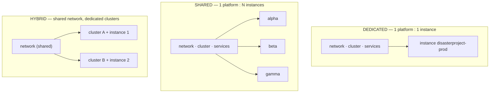

| | Dedicated | Shared | Hybrid |
|---|---|---|---|
| **Isolation boundary** | Cloud account / project | Kubernetes namespace + IAM | Cluster |
| **Blast radius of a platform change** | 1 instance | All instances | Instances on that cluster |
| **Cost per instance** | High | Very low | Medium |
| **Time to provision an instance** | 20–40 min (full platform) | 2–5 min (app stacks only) | 10–20 min |
| **Typical use** | prod, qa, regulated | demos, training, PoC | dev, integration |
| **Lifecycle coupling** | Instance destroy = platform destroy | Instance destroy must **not** touch platform | Cluster destroy = its instances |

### 12.2 The binding mechanism

Everything above is expressed by one file per archetype instance. This is the whole trick.

```hcl
# stacks/archetypes/webapp-3tier/instances/disasterproject-prod/binding.tm.hcl
# ---- DEDICATED: this instance owns its platform ----
globals "platform" {
  cloud             = "aws"
  env               = "prod"
  model             = "dedicated"

  network_stack_id  = "aws-prod-network"
  cluster_stack_id  = "aws-prod-eks"
  services_stack_id = "aws-prod-services"
  data_stack_id     = "aws-prod-disasterproject-data"

  namespace         = "disasterproject"
}

globals {
  instance = "disasterproject"
  tags = {
    Environment = "prod"
    Instance    = "disasterproject"
    Model       = "dedicated"
    Archetype   = "webapp-3tier"
  }
}
```

```hcl
# stacks/archetypes/webapp-3tier/instances/alpha/binding.tm.hcl
# ---- SHARED: this instance rents space on the shared demo platform ----
globals "platform" {
  cloud             = "gcp"
  env               = "demos"
  model             = "shared"

  network_stack_id  = "gcp-demos-network"
  cluster_stack_id  = "gcp-demos-gke"
  services_stack_id = "gcp-demos-services"
  data_stack_id     = "gcp-demos-alpha-data"

  namespace         = "demo-alpha"        # isolation boundary
}

globals {
  instance = "alpha"
  ttl_days = 14                            # demos expire
  tags = {
    Environment = "demos"
    Instance    = "alpha"
    Model       = "shared"
    Archetype   = "webapp-3tier"
    ExpiresOn   = tm_formatdate("YYYY-MM-DD", tm_timeadd(tm_timestamp(), "336h"))
  }
}
```

Not one line of the archetype's generators, contracts or modules changes between the two. Only the binding.

### 12.3 Isolation in a shared environment

A shared platform is a multi-tenant system, and it must be built like one. The archetype generator emits these per-instance whenever `global.platform.model == "shared"`:

```hcl
# imports/generators/v1/gen_app.tm.hcl (shared-model guard rails)
generate_hcl "_tenancy.tf" {
  condition = global.capability == "app" && global.platform.model == "shared"

  content {
    resource "kubernetes_namespace" "this" {
      metadata {
        name = global.platform.namespace
        labels = {
          "archetype"                          = global.archetype
          "instance"                           = global.instance
          "pod-security.kubernetes.io/enforce" = "restricted"
        }
      }
    }

    resource "kubernetes_resource_quota" "this" {
      metadata {
        name      = "tenant-quota"
        namespace = kubernetes_namespace.this.metadata[0].name
      }
      spec {
        hard = {
          "requests.cpu"    = global.quota.cpu
          "requests.memory" = global.quota.memory
          "pods"            = global.quota.pods
          "count/services.loadbalancers" = global.quota.loadbalancers
        }
      }
    }

    resource "kubernetes_limit_range" "this" {
      metadata {
        name      = "tenant-limits"
        namespace = kubernetes_namespace.this.metadata[0].name
      }
      spec {
        limit {
          type            = "Container"
          default         = { cpu = "500m", memory = "512Mi" }
          default_request = { cpu = "100m", memory = "128Mi" }
        }
      }
    }

    resource "kubernetes_network_policy" "default_deny" {
      metadata {
        name      = "default-deny-ingress"
        namespace = kubernetes_namespace.this.metadata[0].name
      }
      spec {
        pod_selector {}
        policy_types = ["Ingress"]
      }
    }
  }
}
```

Enforced by assertion, so a shared instance cannot be merged without quotas:

```hcl
assert {
  assertion = global.platform.model != "shared" || tm_can(global.quota.cpu)
  message   = "Shared-model instances must define global.quota"
}

assert {
  assertion = global.platform.model != "shared" || global.platform.namespace != "default"
  message   = "Shared-model instances must not deploy to the default namespace"
}
```

| Isolation dimension | Dedicated | Shared |
|---|---|---|
| Compute | Separate cluster | Namespace + ResourceQuota + LimitRange |
| Network | Separate VPC | NetworkPolicy default-deny + explicit allows |
| Identity | Separate cloud account/project | Per-namespace IRSA / Workload Identity binding |
| Data | Separate database instance | Separate database *within* a shared instance, separate secrets |
| Ingress | Dedicated load balancer | Shared controller, per-instance hostname |
| Cost attribution | Account-level | Namespace labels + cost-allocation tags |

### 12.4 Lifecycle: the destroy problem

The most dangerous operation in a shared environment is tearing down a demo. `terramate run -- tofu destroy --reverse` against the wrong tag selector will take the platform down with the instance, killing every other demo on it.

**Guard rail 1 — tag-scoped destroy, never path-scoped.**

```bash
# CORRECT: destroys only the instance's own stacks
terramate run \
  --tags instance:alpha \
  --reverse \
  --enable-sharing \
  -- tofu destroy -auto-approve

# WRONG: --changed or a directory selector can sweep in platform stacks
```

**Guard rail 2 — platform stacks carry a protective tag and CI refuses to destroy them outside a break-glass workflow.**

```hcl
stack {
  id   = "gcp-demos-gke"
  tags = ["gcp", "demos", "cluster", "platform", "protected"]
}
```

```bash
# In the destroy job, before running anything:
if terramate list --tags protected --tags instance:${INSTANCE} | grep -q .; then
  echo "::error::Destroy selector matched a protected platform stack. Aborting."
  exit 1
fi
```

**Guard rail 3 — reference counting before platform destroy.** A shared platform must not be destroyed while instances are bound to it. Because bindings are just globals, you can count them:

```bash
# How many instances are bound to this platform?
terramate list --json \
  | jq -r '.stacks[].id' \
  | grep -c '^gcp-demos-.*-app$'
```

Wire this into the CMDB (§12.7) so the count is authoritative rather than inferred from the repository.

### 12.5 Ephemeral shared environments

Demos are the archetypal case for shared environments, and they should expire.

```
stacks/platforms/gcp/
├── demos/          # long-lived, always on
└── ephemeral/
    ├── conf-2026-q3/     # created for an event, destroyed after
    └── poc-disasterproject/
```

An ephemeral platform is created by copying `demos/` and changing three globals (`env`, `project_id`, `vpc_cidr`). A scheduled workflow lists stacks whose `ExpiresOn` tag is in the past and opens a destroy PR — never destroying automatically, always with a human approving.

```bash
terramate list --tags ephemeral --json \
  | jq -r '.stacks[] | select(.tags[] | startswith("expires:")) | .id'
```

### 12.6 Environment promotion

Promotion is a **globals diff**, not a code diff. The same generators and contracts apply everywhere; only `config.tm.hcl` differs.

| Global | demos | dev | qa | prod |
|---|---|---|---|---|
| `cluster.min_nodes` | 1 | 2 | 3 | 3 |
| `cluster.max_nodes` | 12 | 20 | 40 | 60 |
| `cluster.release_channel` | `REGULAR` | `REGULAR` | `STABLE` | `STABLE` |
| `cluster.deletion_protection` | `false` | `false` | `true` | `true` |
| `policy.enforce_namespace_quota` | `true` | `false` | `false` | `false` |
| `data.backup_retention_days` | 1 | 7 | 14 | 35 |
| `data.multi_az` | `false` | `false` | `true` | `true` |
| `managed_db_instances` budget | 25 | 10 | 10 | per-instance |

Because `generate_hcl` is shared, a change to how a cluster is built lands in every environment at once. That is the point — and it is also why generator changes need the `v1`/`v2` versioning discipline from §4.7, so you can roll them out environment by environment.

### 12.7 CMDB integration

Terramate gives a declarative inventory independent of state, which is a better CMDB source than parsing state files. Two commands carry it:

```bash
terramate list --json                                   # logical inventory, pre-apply
terramate run --changed -- tofu show -json              # physical inventory, post-apply
```

The full model — file layout, the three levels, the edge types extracted statically from `input` blocks, and the reference counting that protects a shared platform from an instance teardown — is specified in the companion document, `archetype-model.md` §11. It is not repeated here.

## 13. Policy and security validation

Three enforcement points, applied in order of how early they catch a problem. None of the three subsumes the others.

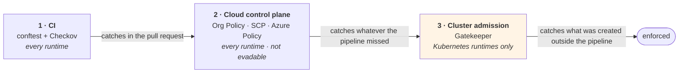

> **Runtime parity is not achievable, and the gap should be written down rather than discovered.** Cloud Run and ECS Fargate have no Kubernetes admission layer, so the `policy` capability only exists where `cluster` does. For serverless runtimes the third point is replaced by cloud control-plane controls — coarser, but not evadable from inside a workload.

### 13.1 Division of labour between the resolver and OPA

The resolver and OPA must not implement the same rules twice.

| | Resolver | OPA |
|---|---|---|
| Nature | **Computes** — closure, allocation, ordering | **Asserts** — invariants over what was computed |
| State | Writes ledgers | Stateless, no side effects |
| Input | Manifests, bindings, ledgers | `resolution.json`, `terramate list --json`, generated `.tf`, plan JSON |
| Fails at | Steps 1–17 | After resolution and after generation |
| Authored by | Platform team, in code | Platform **and** security, without touching the resolver |

OPA does not re-resolve anything. It validates that what the resolver and the generators produced is legal. That is defence in depth — a resolver bug does not pass unnoticed — and it is where organisation-specific rules live without recompiling anything.

### 13.2 Four gates

| Gate | When | Command | Blocking |
|---|---|---|---|
| **G0 — generation integrity** | Every PR | `terramate generate && git diff --exit-code` | Always |
| **G1 — structure and composition** | Every PR | `conftest test --policy policy/ --data registry/ …` | Always |
| **G2 — static security scan** | Every PR | `checkov -d . --framework terraform` | HIGH/CRITICAL |
| **G3 — plan scan** | Before apply | `checkov -f plan.json --framework terraform_plan` + `conftest --namespace terraform` | HIGH/CRITICAL |

G0 exists because generated code is committed. Without it, someone edits a `_main.tf` by hand, the scan passes, and the next `terramate generate` silently reverts the fix.

**Checkov and OPA are complementary, not alternatives.** Checkov brings the standard library of known cloud misconfigurations — hundreds of checks nobody on your team has to write. OPA carries what is specific to this platform and cannot be expressed as a generic check: the `input`↔`after` invariant, capability composition rules, demo-category rules, tenant budgets.

### 13.3 G1 — structure and composition policies

This gate **replaces** the shell lint that previously guarded the ordering invariant. That invariant is the canonical Rego use case, and it is risk R2.

```rego
package terramate.stacks

# Every stack consuming an output must declare the producer in 'after'.
deny contains msg if {
    some stack in input.stacks
    some dep in stack.consumes
    not dep.from_stack_id in stack.after_ids
    msg := sprintf(
        "stack %q consumes output %q from %q but does not declare it in 'after'",
        [stack.id, dep.output, dep.from_stack_id])
}

# Stack IDs follow the naming convention.
deny contains msg if {
    some s in input.stacks
    not regex.match(`^[a-z0-9]+-[a-z0-9-]+-[a-z0-9-]+$`, s.id)
    msg := sprintf("stack id %q does not follow <cloud>-<env>-<capability>", [s.id])
}

# Application stacks carry an instance tag, so tag-scoped destroy is safe.
deny contains msg if {
    some s in input.stacks
    s.capability == "app"
    count({t | some t in s.tags; startswith(t, "instance:")}) == 0
    msg := sprintf("application stack %q has no instance: tag", [s.id])
}
```

```rego
package terramate.contracts

secret_fragments := {"password", "private_key", "token", "credential", "secret_value"}
reference_suffixes := {"_id", "_arn", "_name", "_uri"}

# An output block must never export a secret value — only a reference.
deny contains msg if {
    some s in input.stacks
    some o in s.produces
    some frag in secret_fragments
    contains(o, frag)
    every suffix in reference_suffixes { not endswith(o, suffix) }
    msg := sprintf("stack %q exports %q — share a reference, not a value", [s.id, o])
}
```

```rego
package archetype.composition

# Demo archetypes are leaves with a mandatory expiry.
deny contains msg if {
    input.metadata.kind == "demo"
    count(input.provides) > 0
    msg := "demo archetypes must not publish capabilities"
}

deny contains msg if {
    input.metadata.kind == "demo"
    not input.metadata.expiresOn
    msg := "demo archetypes must set metadata.expiresOn"
}

deny contains msg if {
    input.metadata.kind == "demo"
    time.parse_rfc3339_ns(sprintf("%sT00:00:00Z", [input.metadata.expiresOn])) < time.now_ns()
    msg := sprintf("expiresOn %q is in the past", [input.metadata.expiresOn])
}

# Traits must exist in the registry — a typo that matches nothing is worse than no check.
deny contains msg if {
    some p in input.provides
    some t in p.traits
    not t in data.registry.traits
    msg := sprintf("unregistered trait %q in provides", [t])
}
```

**Policies need their own tests.** A rule that never fires gives false confidence. Keep `policy/*_test.rego` alongside the rules and run `conftest verify` in the same job.

### 13.4 G2 and G3 — security scanning

Static scanning sees the module *call*; plan scanning sees the module *result*. A misconfiguration inside a module reachable only with a particular globals combination shows up only in G3. On a shared platform where one generator serves five environments, that matters.

```bash
terramate run --changed --enable-sharing --mock-on-fail -- \
  sh -c 'tofu show -json out.tfplan > plan.json'

terramate run --changed -- \
  checkov -f plan.json --framework terraform_plan \
          --config-file "${TM_ROOT}/.checkov/${TM_CLOUD}.yaml"

conftest test --policy policy/ --data registry/ --namespace terraform plan.json
```

Per-cloud Checkov configuration, since checks differ:

```yaml
# .checkov/gcp.yaml
framework: [terraform, terraform_plan]
skip-check:
  # Demo clusters intentionally allow public endpoints for presenter access.
  # Scoped by directory, not globally.
  - CKV_GCP_69
directory: [stacks/platforms/gcp, stacks/archetypes]
soft-fail-on: [LOW, MEDIUM]
hard-fail-on: [HIGH, CRITICAL]
```

Every `skip-check` needs a comment naming the reason and the scope. Suppressions for `demos` must not leak into production — split the config files by environment if a single skip list starts serving both.

### 13.5 Cluster admission — Gatekeeper as layer 2b

Admission control belongs at **layer 2b**, between the runtime and platform services. It cannot sit at layer 3: if Gatekeeper enforces Pod Security Standards, it must be in place before the gateway and monitoring workloads are admitted. It is also cluster-scoped rather than a service consumed by name. The precedent is layer 1b for cloud monitoring.

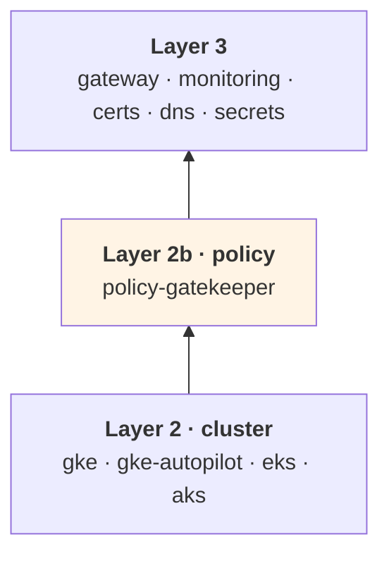

**Self-managed Gatekeeper on all three clouds.** The managed alternatives — Policy Controller on GKE, the Azure Policy add-on on AKS — are mutually exclusive with a self-managed install: AKS refuses the add-on if Gatekeeper v3 is already present. Choosing them means three different behaviours to debug, a version you do not control, restricted custom templates on Azure, and a GKE Enterprise licence. Self-managed gives one version, one set of `ConstraintTemplate`s and one exemption model everywhere. Maintaining the upgrade yourselves is cheap by comparison.

Alternative providers are modelled anyway, in case compliance ever mandates one:

```yaml
# archetypes/policy-gatekeeper/manifest.yaml   ← portable, recommended
provides:
  - capability: policy
    version: 1.0.0
    traits: [gatekeeper, custom-templates, audit-api, referential-constraints]
conflicts:
  - archetype: policy-controller-gke
  - archetype: policy-azure-aks

# archetypes/policy-azure-aks/manifest.yaml    ← only if compliance requires it
provides:
  - capability: policy
    version: 1.0.0
    traits: [gatekeeper, audit-api]            # NO custom-templates
```

An archetype needing its own templates declares `traits: [custom-templates]`, and the resolver rejects the managed Azure binding. That is precisely what traits are for.

**Rego is shared as a language, not as rules.** Gatekeeper wraps policies in `ConstraintTemplate` and the input is an `AdmissionReview`, not `resolution.json`. The team maintains one policy language and one set of helper libraries; the rules themselves are separate.

### 13.6 No mutation

Gatekeeper can inject labels and annotations automatically. Do not use it.

Mutation introduces a source of change invisible in Terraform diffs, and it splits ownership of required labels between the generator and the admission controller. The generator emits labels; Gatekeeper validates them. One writer, one validator.

This is also what makes the single registry load-bearing: if the mandatory-label list lives in two places, any divergence blocks legitimate deployments at admission — the worst possible place to discover it.

### 13.7 Enforcement mode by environment

Starting every rule in `deny` on a cluster that already carries workloads goes badly. Drive both settings from globals:

| Environment | `enforcementAction` | `failurePolicy` |
|---|---|---|
| ephemeral, demos | `warn` | `Ignore` |
| dev, qa | `deny` | `Ignore` |
| prod | `deny` | `Fail` |

New rules always enter in `dryrun`, the audit results are reviewed, and they are promoted one at a time. A badly written policy then cannot block production on the day it merges.

> **`failurePolicy: Fail` can lock you out.** If the Gatekeeper webhook is down, the cluster rejects all admission — including Gatekeeper's own recovery. Mitigate with `exemptNamespaces` for `kube-system` and the Gatekeeper namespace, at least three replicas with a PodDisruptionBudget, and `Ignore` everywhere except production.

**Deploy `ConstraintTemplate` and `Constraint` resources through the archetype's own Helm chart**, never with `kubernetes_manifest`. That provider requires the CRD to exist and the API server to be reachable at plan time, which breaks PR previews and `--mock-on-fail` — the same reason it is avoided for Gateway API resources (§10.5).

### 13.8 The single registry

Capabilities, traits, pool zone names and mandatory labels are currently expressed in several places: as `enum`s in the JSON Schemas, as `data` for conftest, and as values for the Gatekeeper chart. Left alone, they diverge within months.

```
registry/
├── capabilities.yaml     # capability enum
├── traits.yaml           # trait vocabulary
├── zones.yaml            # pool zone names
└── labels.yaml           # mandatory labels per resource type
```

Everything else is **generated** from these:

| Generated artefact | Consumer |
|---|---|
| `enum` blocks in `schemas/*.schema.json` | `check-jsonschema` |
| `registry/*.json` bundle | `conftest --data` |
| Gatekeeper chart `values.yaml` | `ConstraintTemplate` parameters |

Guard it with a `registry-generate --check` gate in CI, exactly like `terramate generate --check`. The YAML is the source; a schema edited by hand is a bug.

---

## 14. CI/CD with GitHub Actions

### 14.1 Preview workflow (pull request)

```yaml
name: preview
on:
  pull_request:
    branches: [main]

permissions:
  contents: read
  pull-requests: write
  id-token: write            # OIDC to GCP and AWS

jobs:
  preview:
    runs-on: ubuntu-latest
    steps:
      - uses: actions/checkout@v4
        with:
          fetch-depth: 0     # change detection needs history

      - uses: jdx/mise-action@v2       # pins terramate, tofu, checkov

      # --- G0: generation integrity ---
      - name: Check generated code is current
        run: |
          terramate generate
          git diff --exit-code || {
            echo "::error::Generated code is stale. Run 'terramate generate' and commit."
            exit 1
          }

      - name: List changed stacks
        id: list
        run: |
          echo "stacks<<EOF" >> "$GITHUB_OUTPUT"
          terramate list --changed >> "$GITHUB_OUTPUT"
          echo "EOF" >> "$GITHUB_OUTPUT"

      # --- G1: static scan ---
      - name: Checkov (static)
        if: steps.list.outputs.stacks != ''
        run: |
          checkov -d stacks --framework terraform \
                  --config-file .checkov/gcp.yaml
          checkov -d stacks --framework terraform \
                  --config-file .checkov/aws.yaml

      - uses: google-github-actions/auth@v2
        with:
          workload_identity_provider: ${{ vars.GCP_WIF_PROVIDER }}
          service_account: ${{ vars.GCP_PLAN_SA }}

      - uses: aws-actions/configure-aws-credentials@v4
        with:
          role-to-assume: ${{ vars.AWS_PLAN_ROLE }}
          aws-region: eu-west-1

      # --- plan with sharing + mocks ---
      - name: Plan changed stacks
        run: terramate script run --changed tofu preview

      # --- G2: plan scan ---
      - name: Checkov (plan)
        run: |
          terramate run --changed -- sh -c '
            tofu show -json out.tfplan > plan.json &&
            checkov -f plan.json --framework terraform_plan
          '

      - name: Comment plan on PR
        run: |
          {
            echo "### Changed stacks"
            echo '```'
            terramate list --changed
            echo '```'
          } >> "$GITHUB_STEP_SUMMARY"
```

Key points:

- **`terramate script run --changed tofu preview`** uses the script from §4.8, so `enable_sharing = true` and `mock_on_fail = true` are guaranteed. A raw `terramate run` invocation that forgets `--enable-sharing` produces a plan against unset variables.
- **`fetch-depth: 0`** — change detection compares against `main`; a shallow clone silently reports zero changed stacks.
- **Dual cloud auth in one job** works because the OIDC token is exchanged per provider. If your accounts are strictly segregated, split into two jobs selected by `terramate list --changed --tags gcp` / `--tags aws`.

### 14.2 Deployment workflow (merge to main)

```yaml
name: deploy
on:
  push:
    branches: [main]

permissions:
  contents: read
  id-token: write

jobs:
  deploy:
    runs-on: ubuntu-latest
    environment: production        # required reviewers gate here
    steps:
      - uses: actions/checkout@v4
        with: { fetch-depth: 0 }
      - uses: jdx/mise-action@v2

      - name: Verify generated code
        run: terramate generate && git diff --exit-code

      # ... cloud auth ...

      - name: Apply changed stacks
        run: terramate script run --changed tofu deploy   # mocks OFF

      - name: Sync CMDB
        run: ./scripts/sync-cmdb.sh
```

> **`terramate run --changed` respects the dependency order** derived from nesting and `after`. It does **not** derive order from `input` blocks. If a PR changes only the app stack but the platform's outputs also changed in a prior merge, the app stack will read the current (correct) outputs — but if both change in the same PR, ordering comes entirely from your `after` declarations. This is the reason §4.5 insists on the input↔after invariant.

### 14.3 Drift workflow (scheduled)

```yaml
name: drift
on:
  schedule:
    - cron: '0 5 * * *'

jobs:
  drift:
    runs-on: ubuntu-latest
    strategy:
      matrix:
        selector: ["gcp", "aws"]
    steps:
      - uses: actions/checkout@v4
        with: { fetch-depth: 0 }
      - uses: jdx/mise-action@v2
      # ... auth ...
      - name: Detect drift
        run: |
          terramate run --tags ${{ matrix.selector }} --enable-sharing -- \
            tofu plan -detailed-exitcode -lock=false || \
          if [ $? -eq 2 ]; then
            echo "::warning::Drift detected in ${{ matrix.selector }}"
            exit 1
          fi
```

### 14.4 Policy gate in the pipeline

The ordering invariant that previously relied on a shell script is now a Rego policy (§13.3). The pipeline runs conftest over three artefacts:

```yaml
- name: Build policy inputs
  run: |
    registry-generate --check                 # registry is the source of truth
    archetypectl resolve --dry-run > resolution.json
    terramate list --json > stacks.json
    archetypectl enrich stacks.json           # adds consumes[] and after_ids[]

- name: G1 — structure and composition
  run: |
    conftest verify --policy policy/          # the policies' own tests
    conftest test --policy policy/ --data registry/ resolution.json stacks.json
    for m in archetypes/*/manifest.yaml; do
      conftest test --policy policy/ --data registry/ "$m"
    done
```

`archetypectl enrich` is the only custom piece: `terramate list --json` does not expose `input` blocks, so the enricher scans each stack for `from_stack_id` and `after`, producing the `consumes[]` and `after_ids[]` fields the policy compares. Keeping that extraction in one small tool, rather than in the policy, keeps the Rego portable and testable against fixtures.


---

## 15. Risk register

The full register — 53 risks grouped by domain (52 active; R28 retired as a duplicate of R26), with likelihood, impact, mitigation and the section that specifies each control — is maintained in its own document, `risk-register.md`. It is reviewed at every roadmap phase gate rather than read end to end.

The five to act on first:

| Rank | Risk | Why it leads |
|---|---|---|
| 1 | **R2** — missing `after` on a consumer stack | Silent failure; applies a wrong value with no error (§14.4) |
| 2 | **R12** — wildcard `sub` in an OIDC trust policy | Any branch or fork PR can assume the apply role (§11.3) |
| 3 | **R26** — pod range sized for too few nodes | Immutable; fixed only by rebuilding the cluster (§9.2, AM §9.4) |
| 4 | **R34** — registry drift | Fails at admission, after the generator and `Constraint` diverged (§13.8) |
| 5 | **R5** — shared platform destroyed by an instance teardown | One wrong tag selector takes down every tenant (§12.4) |

---

## 16. Adoption roadmap

### Phase 0 — Validate assumptions (1 week)

Build a throwaway repository with two stacks and confirm, against your pinned Terramate version. Expression support in `from_stack_id` is taken as a design decision; what remains is confirming its variants:

- [ ] `from_stack_id` resolves a global **inherited from a parent directory**, not only one defined in the stack itself
- [ ] `from_stack_id` accepts **interpolation** (`"${global.env}-gke"`), not only a bare reference
- [ ] `stack.after` accepts a globals-derived path, **or** tag filters (`after = ["tag:network"]`) work as a fallback — this one fails silently, so test it deliberately
- [ ] `--mock-on-fail` behaves as documented when the producer has no state
- [ ] `tofu output -json` runs successfully as the `sharing_backend.command` in your CI image
- [ ] Cross-project / cross-account state reads work with your OIDC roles
- [ ] OIDC federation works end to end with a **wildcard-free** trust condition (§11.2, §11.3)
- [ ] A private control plane is reachable from your chosen runner type, or you have accepted self-hosted runners (§11.9)
- [ ] OpenTofu state encryption keys are scoped per environment, not per stack (§11.5)

If the inherited-globals or interpolation variants fail, the late-binding model in §12.2 needs replacing with a contract file generated per instance by the resolver — more machinery and noisier pull requests, but not a redesign. Better to find out now.

### Phase 0b — Resolver skeleton (1 week, parallel to Phase 1)

- JSON Schema validation of manifests, bindings and ledgers in CI
- Steps 1–8 of the resolution algorithm (no ledger writes)
- One catalog archetype and one environment binding, hand-written
- Prove that `binding.tm.hcl` generated by the resolver drives `terramate generate` unchanged

### Phase 1 — One cloud, one shared platform (2–3 weeks)

- Root config, `sharing_backend`, mixins, `gen_network` + `gen_cluster`
- `gcp/demos` or `aws/demos` platform, three stacks
- Preview + deploy workflows with G0 and G1
- One archetype with one instance

### Phase 2 — Second cloud (1–2 weeks)

- Second set of mixins and generator branches
- Prove that the archetype contract files are genuinely cloud-agnostic where §6.8 says they should be
- G2 plan scanning
- Permission boundaries published by the platform stack and asserted in app stacks

### Phase 2a — Azure parity (2 weeks)

- `landing-zone-azure`, `environment-azure`, `aks` archetypes
- Decide Azure CNI Overlay vs traditional CNI **before** the first cluster; it is immutable
- Edge: AGFC in BYO mode, or Envoy Gateway behind an internal Load Balancer — not both
- Resolve the AGFC/Keycloak OIDC gap if layer 4 is in scope on Azure
- Acceptance test: a layer-5 application manifest deploys to Azure **without being edited**

### Phase 2b — Serverless runtimes (1–2 weeks, optional but cheap)

Cloud Run and ECS Fargate reuse the same network and data stacks, so adding them is mostly a new generator branch plus a `global.platform.runtime` switch.

- `gen_app_cloudrun.tm.hcl` and `gen_app_fargate.tm.hcl` alongside the Kubernetes generators
- Prove the runtime switch: the same archetype instance deployable to `runtime = "gke"` or `runtime = "cloudrun"` by changing one global
- Validate the two-role split on Fargate and the runtime-SA pattern on Cloud Run
- Confirm the fan-in remedy for the Cloud Run edge-routing stack (§7.5)

### Phase 2c — Policy layer (2–3 weeks)

Sequenced so that nothing blocks a real deployment until it has been observed in audit mode first.

**2c.1 — Registry (2–3 days).** `registry/{capabilities,traits,zones,labels}.yaml`, the three generators (schema `enum`s, conftest `--data` bundle, Gatekeeper chart values), and the `registry-generate --check` gate. This comes first because everything after it consumes the registry. Retrofitting a single source once three copies exist is materially harder (R34).

**2c.2 — `archetypectl enrich` (2 days).** `terramate list --json` does not expose `input` blocks, so the enricher scans each stack for `from_stack_id` and `after` and emits `consumes[]` and `after_ids[]`. Keep the extraction here, not in Rego, so the policies stay portable and testable against fixtures.

**2c.3 — G1 gate, advisory (3 days).** The `input`↔`after` policy plus stack-naming and secret-output rules, running **non-blocking**. Measure the false-positive rate against the existing repository before turning it on.

**2c.4 — G1 gate, blocking (1 day).** Retire the shell lint. R2 is only mitigated once this is blocking.

**2c.5 — Policy tests (2 days).** `policy/*_test.rego` with `conftest verify` in the same job. A rule that never fires gives false confidence (R36); fixtures must cover both the passing and the failing case for each rule.

**2c.6 — `policy-gatekeeper` at layer 2b (1 week).** Self-managed, deployed via the archetype's own Helm chart — never `kubernetes_manifest`. Land it in an **ephemeral environment first**, with `enforcementAction: dryrun` and `failurePolicy: Ignore`. Review the audit output for a full working week before promoting any rule to `warn`, and promote to `deny` one rule at a time.

**Exit criteria, all required:**

- [ ] `registry-generate --check` blocking; no hand-edited `enum` remains
- [ ] G1 blocking; shell lint deleted
- [ ] Every Rego rule has a passing and a failing fixture
- [ ] Gatekeeper running in an ephemeral environment with a clean audit for five working days
- [ ] Lock-out drill rehearsed: kill the webhook with `failurePolicy: Fail` and recover, so the runbook is proven rather than theoretical (R33)
- [ ] Measured answer to the open question: **how much Rego is genuinely shared** between conftest and `ConstraintTemplate`s, given the inputs differ (`resolution.json` versus `AdmissionReview`). If the answer is "the helper library only", say so and stop planning for more

### Phase 3 — Multi-tenancy (2 weeks)

- Second and third instances on the shared platform
- Namespace/quota/NetworkPolicy generation
- Destroy guard rails and the §14.4 lint

### Phase 4 — Dedicated environments and CMDB (2–3 weeks)

- `prod` dedicated platform per cloud
- Promotion globals matrix
- CMDB level 1 and level 2 sync
- Drift workflow

### Phase 5 — Hardening

- Generator `v2` migration rehearsal
- Break-glass runbooks
- Contract deprecation process

---

## 17. Appendix — conventions cheat sheet

### Naming

| Thing | Pattern | Example |
|---|---|---|
| Stack ID | `<cloud>-<env>-<capability>[-<instance>]` | `aws-demos-eks`, `gcp-prod-disasterproject-app` |
| Stack tags | `<cloud>`, `<env>`, `<capability>`, `platform`\|`archetype:<name>`, `instance:<id>`, `producer`\|`consumer`, `protected` | |
| Generated files | `_<purpose>.tf` | `_main.tf`, `_backend.tf`, `_sharing_generated.tf` |
| Generator directory | `imports/generators/v<N>/gen_<capability>.tm.hcl` | `imports/generators/v1/gen_cluster.tm.hcl` |
| Contract file | `imports/contracts/contract_<capability>[_<cloud>].tm.hcl` | `contract_cluster_eks.tm.hcl` |
| Mock values | prefixed `mock-` / `mock` | `mock-endpoint.example.invalid` |

### Command reference

| Task | Command |
|---|---|
| Regenerate all code | `terramate generate` |
| Verify generation is current | `terramate generate && git diff --exit-code` |
| List all stacks | `terramate list` |
| List changed stacks | `terramate list --changed` |
| Inspect resolved globals | `terramate debug show globals` |
| Inspect execution order | `terramate experimental run-graph` |
| Plan with sharing + mocks | `terramate script run --changed tofu preview` |
| Apply with sharing | `terramate script run --changed tofu deploy` |
| Deploy one instance | `terramate run --tags instance:alpha --enable-sharing -- tofu apply -auto-approve` |
| Destroy one instance | `terramate run --tags instance:alpha --reverse --enable-sharing -- tofu destroy -auto-approve` |
| Drift check | `terramate run --tags prod --enable-sharing -- tofu plan -detailed-exitcode` |
| Regenerate the registry | `registry-generate` |
| Verify registry is current | `registry-generate --check` |
| Run policy tests | `conftest verify --policy policy/` |
| Run policy gate | `conftest test --policy policy/ --data registry/ resolution.json stacks.json` |
| Gatekeeper audit results | `kubectl get constraints -o json \| jq '.items[].status.violations'` |

### Decision table — globals or outputs sharing?

| Question | Answer | Use |
|---|---|---|
| Is the value known before any apply? | Yes | Globals |
| Is it a name you can make deterministic? | Yes | Globals (and break dependency cycles this way) |
| Is it generated by the cloud provider at apply time? | Yes | Outputs sharing |
| Is it a credential or secret value? | Yes | **Neither** — share a reference, fetch via data source |
| Is it a short-lived token? | Yes | **Neither** — fetch locally per consumer |
| Would sharing it create a cycle? | Yes | Promote to a global |

### Files that must exist before the first `terramate generate`

```
/terramate.tm.hcl                        # terramate block + sharing_backend
/mise.toml                               # pinned tool versions
/imports/mixins/backend_<cloud>.tm.hcl
/imports/mixins/provider_<cloud>.tm.hcl
/imports/generators/v1/gen_<capability>.tm.hcl
/imports/contracts/contract_<capability>.tm.hcl
/imports/contracts/guards.tm.hcl         # assert blocks
/stacks/platforms/<cloud>/config.tm.hcl  # globals: cloud
```

---

## Sources and further reading

- Terramate — Outputs Sharing: `https://terramate.io/docs/cli/orchestration/outputs-sharing`
- Terramate — `sharing_backend`, `input`, `output` block references: `https://terramate.io/docs/cli/reference/blocks/`
- Terramate — Order of Execution: `https://terramate.io/docs/cli/orchestration/order-of-execution`
- Terramate — HCL Code Generation: `https://terramate.io/docs/cli/code-generation/generate-hcl`
- Terramate AWS reference architecture: `https://github.com/terramate-io/terramate-quickstart-aws`
- Terramate Azure reference architecture: `https://github.com/terramate-io/terramate-quickstart-azure`
- Mattias Fjellström, *A pattern for Terraform stacks* (the HCP-native pattern this architecture adapts): `https://mattias.engineer/blog/2026/terraform-stacks-pattern/`

**Note on sources.** Comparative claims about Terramate versus other orchestrators circulating publicly are largely vendor-published. The technical block semantics documented above come from Terramate's own reference documentation and should be re-verified against the exact CLI version you pin, particularly for the experimental outputs-sharing surface.
