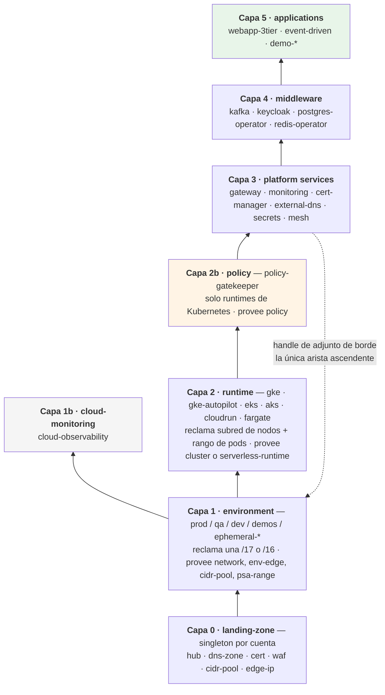
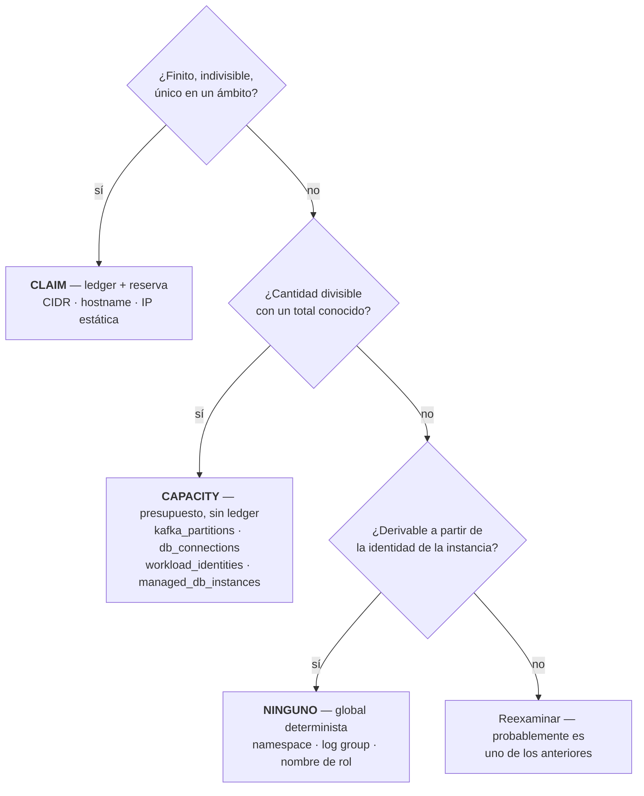
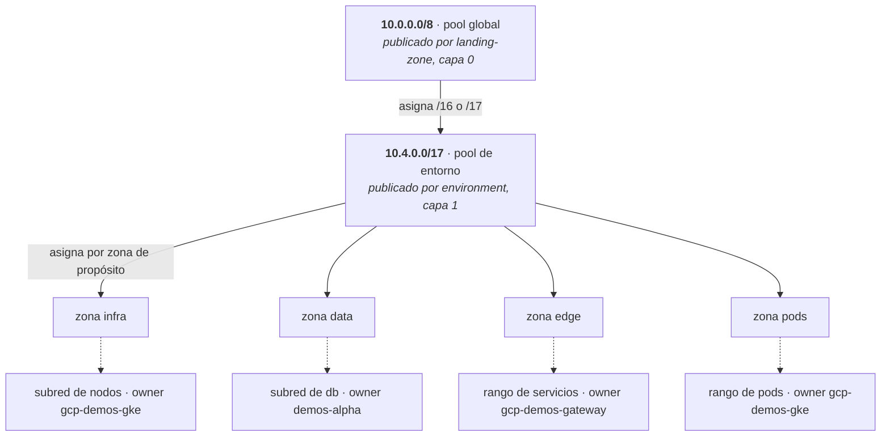
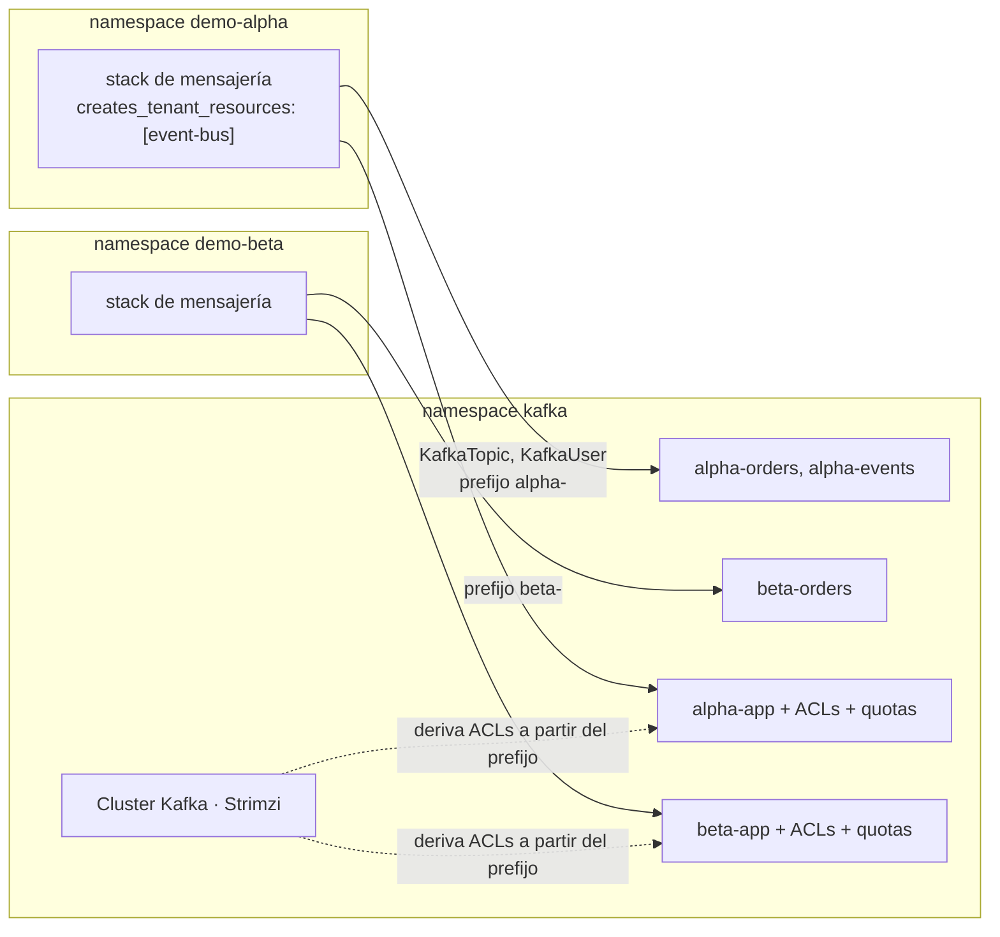
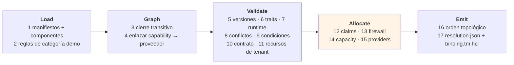

# Modelo de arquetipos — Empaquetado, dependencias y resolución

**Complementario a `terramate-outputs-sharing-architecture.md`**

> **Empieza por `platform-overview.md`** para un mapa del conjunto de documentos guiado por diagramas.
>
> **Los riesgos** viven en `risk-register.md`.

| | |
|---|---|
| **Alcance** | Cómo declaran dependencias los arquetipos, cómo se validan las composiciones, y cómo se asignan los recursos finitos |
| **Relación con el documento de arquitectura** | Ese documento especifica *cómo se genera y orquesta el código de infraestructura*. Este especifica *qué puede componerse con qué*, y lo valida antes de generar ningún código |
| **Clouds** | GCP, AWS y Azure a la par; diseñado para una cuarta sin cambiar el modelo |
| **Se ejecuta** | Antes de `terramate generate`, en cada pull request. Falla de forma cerrada |

---

## Índice

1. [Propósito](#1-purpose)
2. [La analogía de paquete, y dónde se rompe](#2-the-package-analogy-and-where-it-breaks)
3. [El modelo de capas](#3-the-layer-model)
4. [Capabilities, proveedores y traits](#4-capabilities-providers-and-traits)
5. [Anatomía de un arquetipo](#5-archetype-anatomy)
6. [Referencia del manifiesto](#6-manifest-reference)
7. [Binding de entorno](#7-environment-binding)
8. [Recursos escasos: claims, capacity, determinista](#8-scarce-resources-claims-capacity-deterministic)
9. [Plan de direcciones y pools jerárquicos](#9-address-plan-and-hierarchical-pools)
10. [Recursos de tenant y proveedores multi-tenant](#10-tenant-resources-and-multi-tenant-providers)
11. [CMDB en Git](#11-cmdb-in-git)
12. [El algoritmo de resolución](#12-the-resolution-algorithm)
13. [Diagnósticos](#13-diagnostics)
14. [Portabilidad y añadir una cuarta cloud](#14-portability-and-adding-a-fourth-cloud)
15. [Ejemplos resueltos](#15-worked-examples)
16. [Esquemas](#16-schemas)

---

## 1. Propósito

Un arquetipo de aplicación en esta plataforma depende transitivamente de entre diez y quince más: una landing zone, un entorno, un runtime, un gateway, monitorización, certificados, secretos, un proveedor de identidad, un bus de eventos. Declarar eso a mano en cada aplicación no escala, y descubrir una incompatibilidad durante `tofu apply` — veinte minutos después, a mitad de una cadena de dependencias — es el modo de fallo que este modelo existe para evitar.

El modelo aporta cinco cosas:

1. **Un manifiesto** por arquetipo que declara qué requiere, qué provee, con qué entra en conflicto, qué stacks internos posee y qué recursos finitos reclama.
1. **Un resolver** que calcula el cierre transitivo, valida versiones y traits, asigna claims desde pools jerárquicos, y emite un plan ordenado — antes de generar ningún código.
2. **Ledgers** en Git que registran cada asignación, usando los conflictos de merge como control de concurrencia.
3. **Un catálogo de componentes**, de modo que componer un arquetipo nuevo sea selección, no autoría de infraestructura.
4. **Una CMDB** derivada de ambos, consultable por aplicaciones y dashboards.

Todo es un fichero en Git. Nada requiere un servicio en ejecución.

---

## 2. La analogía de paquete, y dónde se rompe

El manifiesto toma prestado deliberadamente de Debian y RPM: `Depends`, `Provides`, `Conflicts`, `Recommends`, paquetes virtuales, restricciones de versión. Reutilizar un vocabulario que los ingenieros ya conocen vale mucho. Pero cinco diferencias cambian el diseño, y fingir lo contrario produce un sistema que falla en producción.

| apt / rpm | Esta plataforma |
|---|---|
| Los paquetes son instancias intercambiables de una versión | Los proveedores son **instancias desplegadas concretas**. "Necesito un cluster" no basta; es "*el* cluster de *este* entorno, que debe tener capacidad" |
| Sin recursos finitos compartidos | Los bloques CIDR, hostnames, particiones de Kafka deben **reservarse**, no solo comprobarse |
| `remove` libera recursos de inmediato | Liberar un CIDR requiere **cuarentena** — rutas, peerings y reglas de firewall obsoletas sobreviven a un destroy |
| La resolución es atómica | Un apply falla a medias; la resolución debe ser **idempotente y re-ejecutable** |
| Un paquete es una unidad | Un arquetipo es un **conjunto de stacks** con orden interno, cada uno con su propio estado |
| Múltiples versiones instalables → NP-completo | **Exactamente una instancia de cada capability por entorno** → resolución lineal, sin solver |

Esa última fila es la más determinante. Porque un entorno contiene exactamente un `cluster`, un `ingress`, un `event-bus`, el resolver nunca elige entre versiones candidatas. Busca el único proveedor enlazado y valida cada restricción contra él. Sin backtracking, sin solver SAT, sin heurística. La dificultad de ingeniería está enteramente en producir buenos mensajes de error.

---

## 3. El modelo de capas

Los arquetipos se apilan. La misma gramática `requires`/`provides` gobierna cada nivel, así que el resolver tiene un único camino de código.



| Capa | Cardinalidad | Ciclo de vida | Propietario |
|---|---|---|---|
| 0 | Una por cuenta | Años | Equipo de plataforma |
| 1, 1b | Una por entorno | Meses a años | Equipo de plataforma |
| 2 | Un runtime por entorno | Meses | Equipo de plataforma |
| 2b | Uno por cluster de Kubernetes | Meses | Plataforma + seguridad |
| 3 | Uno por capability por entorno | Semanas | Equipo de plataforma |
| 4 | Uno por capability por entorno | Semanas | Plataforma + equipos de aplicación |
| 5 | Muchos por entorno | Días | Equipos de aplicación, oficina de proyecto |

Tres notas estructurales:

- **La capa 1b es paralela a la capa 2.** La monitorización nativa de la cloud se adjunta al entorno, no a un cluster. Modelarla como una dependencia de capa 3 serializaría el pipeline para nada.
- **La capa 2 reclama del pool del entorno**, que la capa 1 publicó. Los pools son jerárquicos (§9).
- **Las capabilities de borde se mueven a la capa 1 cuando el entorno tiene su propio proyecto.** Una cuenta/proyecto/suscripción por entorno es la decisión de plataforma (`CLAUDE.md`). En GCP la IP de borde, la política de Cloud Armor y el certificado deben compartir proyecto con el load balancer, así que `edge-ip`, `waf` y `cert` los provee el arquetipo de entorno. La capa 0 conserva la zona DNS padre, el pool de direcciones, KMS, el registro de imágenes y la federación de CI.
- **La capa 2b existe porque el control de admisión debe preceder a todo lo que gobierna.** Si Gatekeeper aplica los Pod Security Standards, tiene que estar en su sitio antes de que se admitan las cargas de gateway y monitorización, así que no puede estar en la capa 3. También tiene alcance de cluster en lugar de ser un servicio consumido por nombre. El precedente es la capa 1b. No tiene contrapartida en Cloud Run, ECS Fargate o Container Apps — la capability `policy` solo existe donde existe `cluster`, y §14.4 registra esa brecha.
- **La capacidad `gateway` de la capa 3 produce algo que consume una capa inferior** — el handle de adjunto de borde (nombre de NEG, ARN de target group, frontend de AGFC). Es la única arista ascendente del grafo y debe ser explícita para que el orden topológico no sorprenda a nadie.

---

## 4. Capabilities, proveedores y traits

### 4.1 Capabilities virtuales

Una aplicación nunca depende de `gke`. Depende de `cluster`. Varios arquetipos la proveen:

```yaml
# archetypes/gke/manifest.yaml
provides:
  - capability: cluster
    version: 2.4.0
    traits: [self-managed-nodes, daemonset-privileged, hostpath, node-agent, gpu, sysctl-max-map-count]

# archetypes/gke-autopilot/manifest.yaml
provides:
  - capability: cluster
    version: 2.4.0
    traits: [managed-nodes, managed-prometheus]
```

Cuál de ellos satisface `cluster` en un entorno lo decide el **binding de entorno** (§7), exactamente como `global.platform.cluster_stack_id` lo decide en el documento de arquitectura. Los manifiestos de aplicación no cambian cuando un entorno pasa de GKE a Autopilot.

### 4.2 Traits

Las restricciones de versión no pueden expresar "este agente de monitorización no puede correr en Autopilot." Los traits sí, convirtiendo un fallo en tiempo de ejecución en un fallo de validación.

```yaml
# archetypes/monitoring-nodeagent/manifest.yaml
requires:
  - capability: cluster
    version: "^2.0.0"
    traits: [daemonset-privileged, hostpath]     # ← falla contra Autopilot
provides:
  - capability: monitoring
    version: 1.8.0
```

`monitoring-managed` provee la misma capability y versión pero requiere `managed-prometheus`. Una aplicación requiere `monitoring`; el resolver elige el proveedor cuyos traits satisface el cluster del entorno, y falla nombrando el trait ausente en lugar de producir un `CreateContainerError` veinte minutos dentro de un apply.

### 4.3 Registro de traits

Los traits son un vocabulario controlado. Un trait no registrado es un error de resolución, porque una errata que coincide silenciosamente con nada es peor que ninguna comprobación.

La tabla siguiente es una **copia de lectura**; la fuente de verdad es `registry/traits.yaml` (§4.4). Si discrepan, gana el registro y esta tabla es el bug.

| Dominio | Traits |
|---|---|
| Cómputo | `self-managed-nodes`, `managed-nodes`, `daemonset-privileged`, `hostpath`, `node-agent`, `gpu`, `arm64`, `spot`, `overlay-pods`, `sysctl-max-map-count` |
| Ingress | `gateway-api`, `ingress-api`, `http-route`, `grpc-route`, `tcp-route`, `cross-namespace-refgrant`, `oidc-security-policy`, `jwt-auth`, `local-rate-limit`, `global-rate-limit`, `mtls-backend` |
| Borde | `iac-owned-edge`, `managed-cert`, `waf`, `global-anycast`, `regional-only` |
| Identidad | `workload-identity`, `irsa`, `pod-identity`, `managed-identity`, `saml-idp` |
| Datos | `private-endpoint`, `iam-auth`, `multi-az`, `psa-shared`, `cnpg` |
| Mensajería | `strimzi`, `kraft`, `acl-authz`, `tls-mtls`, `schema-registry`, `tiered-storage` |
| Política | `gatekeeper`, `custom-templates`, `audit-api`, `referential-constraints`, `mutation` |
| Observabilidad | `managed-prometheus`, `otlp-native`, `managed-tracing`, `prometheus-operator-crds` |

`iac-owned-edge` registra si todo recurso cloud en el camino de borde está en el estado de Terraform. Los NEG independientes de GCP no lo están (documento de arquitectura §10.2). Si algún requisito de cumplimiento exige propiedad total en IaC, el resolver detecta la brecha en tiempo de validación en lugar de en tiempo de auditoría.

`overlay-pods` importa para la planificación de capacidad: AKS con Azure CNI Overlay no consume direcciones de la VNet para los pods, así que su claim de rango de pods es cero (§9.5).

### 4.4 El registro único

Capabilities, traits, nombres de zona de pool y etiquetas obligatorias los consumen tres mecanismos distintos — `enum`s de JSON Schema, `--data` de conftest, y valores del chart de Gatekeeper. Mantenidos por separado divergen en meses, y el fallo es desagradable: una etiqueta que el generador deja de emitir pero que el `Constraint` de admisión sigue exigiendo bloquea despliegues legítimos en el momento de la admisión.

```
registry/
├── capabilities.yaml     # enum de capabilities
├── traits.yaml           # vocabulario de traits
├── zones.yaml            # nombres de zona de pool
└── labels.yaml           # etiquetas obligatorias por tipo de recurso
```

| Artefacto generado | Consumidor |
|---|---|
| bloques `enum` en `schemas/*.schema.json` | `check-jsonschema` |
| bundle `registry/*.json` | `conftest --data` |
| `values.yaml` del chart de Gatekeeper | parámetros de `ConstraintTemplate` |

El YAML es la fuente. Un esquema editado a mano es un bug, protegido por una comprobación `registry-generate --check` en CI exactamente igual que `terramate generate --check`.

### 4.5 Semántica de versión de capability

La versión de una capability es la versión de su **contrato de salidas**, no de su implementación.

| Incremento | Disparador |
|---|---|
| MAJOR | Se elimina, renombra o cambia de tipo una salida; se elimina un tipo de `tenant_resources` |
| MINOR | Se añade una salida; se añade un trait |
| PATCH | Solo implementación; el contrato es idéntico byte a byte |

CI compara el fichero de contrato en `imports/contracts/`, calcula el incremento requerido, y falla si el manifiesto no se actualizó. Esa comprobación aborda el riesgo R6 del documento de arquitectura.

**No mantengas a mano la lista de salidas requeridas.** Extráela de los bloques `input` del arquetipo; el resolver entonces verifica que cada salida referenciada existe en `provides.outputs` del productor — de forma estática, antes de generar, sin tocar la cloud.

---

## 5. Anatomía de un arquetipo

### 5.1 Un arquetipo es un conjunto de stacks

La responsabilidad se empuja hacia abajo. Un arquetipo posee todo lo que necesita: identidad, secretos, su propio almacén de datos, sus reglas de firewall, su enrutado de puerta frontal. No pide a la plataforma una base de datos; trae una.

```yaml
metadata:
  name: keycloak
  version: 4.1.0
  layer: 4
  kind: catalog

stacks:
  - name: iam                                    # cuenta de servicio / identidad gestionada
  - name: secrets
    after: [iam]
  - name: data                                   # su propia instancia de Cloud SQL
    after: [iam]
  - name: firewall
    after: [data]
  - name: app
    after: [secrets, data, firewall]
  - name: frontdoor                              # HTTPRoute, sin SecurityPolicy — ver §10.5
    after: [app]

provides:
  - capability: oidc-idp
    version: 4.1.0
    outputs:
      - { name: issuer_url,      from: app }
      - { name: realm_name,      from: app }
      - { name: admin_secret_id, from: secrets }
```

Dos propiedades que esto compra:

- **Encapsulación.** `provides` pertenece al arquetipo, no a un stack. Los consumidores referencian `capability: oidc-idp`; el resolver mapea cada salida al stack interno que la produce y escribe el `from_stack_id` correcto. Reorganizar los stacks internos de Keycloak no es un cambio incompatible.
- **Radio de explosión autocontenido.** Destruir el arquetipo destruye su base de datos. Ninguna instancia de Cloud SQL huérfana, ninguna regla de firewall entre arquetipos apuntando a nada.

Cada entrada de `stacks[]` se convierte en un stack de Terramate bajo el directorio de la instancia del arquetipo, con `after` traducido directamente a `stack.after`.

### 5.2 Arquetipos de catálogo y arquetipos de demo

La demanda de entornos de demo llega desde la oficina de proyecto con requisitos arbitrarios — una demo necesita Neo4j, otra MongoDB, otra un pipeline a medida. Esos requisitos se convierten en un arquetipo y se despliegan. Esa es una economía distinta de la de un catálogo estable, y el modelo no debe tratarlas igual.

| | `kind: catalog` | `kind: demo` |
|---|---|---|
| Autor | Equipo de plataforma | Oficina de proyecto, con revisión ligera |
| Vida | Años | Semanas |
| Instancias | Muchas | Una |
| Versionado | Semver estricto, contrato estable | `0.x`, sin garantías |
| Puede publicar `provides` | Sí | **No** — solo hoja |
| Puede apuntar a las capas 0–3 | Sí | **No** |
| `expiresOn` | Opcional | **Obligatorio** |
| Puerta de revisión | Completa | Esquema + política + presupuesto |

Con un catálogo estable el coste está en *usar* un arquetipo y el manifiesto se escribe una vez. Con arquetipos desechables el coste está en *crear* uno — y si eso le cuesta un día a un ingeniero de plataforma por demo, el sistema no se usará y la oficina de proyecto lo sorteará.

Impuesto por aserción:

```yaml
# validado por el resolver, no por convención
kind: demo  ⇒  provides == []  ∧  layer == 5  ∧  expiresOn is set
```

### 5.3 Componentes — plantillas de stack reutilizables

Neo4j, MongoDB, Redis y Postgres como *instancias dedicadas* no deberían escribirse por demo. Son **componentes**: plantillas de stack parametrizadas con su chart, claims, reglas de firewall e integración de secretos ya resueltos.

```yaml
# archetypes/demo-disasterproject-graph/manifest.yaml
metadata:
  name: demo-disasterproject-graph
  version: 0.1.0
  kind: demo
  layer: 5
  expiresOn: 2026-11-15
  owners: [project-office-disasterproject]

stacks:
  - use: component/neo4j
    name: graph
    values: { size: small, persistence_gib: 50 }
  - use: component/mongodb
    name: docs
    values: { size: small, persistence_gib: 20 }
  - name: app                                    # la única parte a medida
    after: [graph, docs]
```

Crear una demo se convierte en selección de una lista más valores, no en autoría de infraestructura. Esa es la diferencia entre veinte minutos y un día, y es lo que hace viable la categoría demo.

Un componente declara sus propios claims, consumo de capacity y reglas de firewall; el resolver los pliega en los totales del arquetipo consumidor.

```yaml
# components/neo4j/component.yaml
apiVersion: archetype/v1
kind: Component
metadata: { name: neo4j, version: 1.2.0 }
values:
  size: { enum: [small, medium, large], default: small }
  persistence_gib: { type: integer, default: 20 }
capacity:
  cpu_millicores: { small: 2000, medium: 6000, large: 16000 }
  memory_mib:     { small: 4096, medium: 16384, large: 49152 }
  pvc_gib: "{{ persistence_gib }}"
firewall:
  - name: app-to-graph
    from: purpose:pods
    to: self
    ports: [7687]
```

### 5.4 Operador o instancia — la regla

La misma tecnología puede aparecer como arquetipo o como componente, y eso no es una inconsistencia:

> **Arquetipo** — despliega un operador o servicio compartido que otros consumen, e impone un contrato multi-tenant.
> **Componente** — una instancia dedicada dentro del arquetipo que la usa, sin contrato con nadie más.

| Tecnología | Como arquetipo | Como componente |
|---|---|---|
| Kafka | `kafka` (operador Strimzi) provee `event-bus` | — |
| PostgreSQL | `postgres-operator` provee `database-platform` | `component/postgres`, dedicado |
| Redis | `redis-operator` provee `cache` | `component/redis`, dedicado |
| Neo4j | — | `component/neo4j` |
| MongoDB | — | `component/mongodb` |

Kafka es deliberadamente un arquetipo: la intención de diseño es **un bus común con datos separados**. Las aplicaciones no despliegan Kafka; despliegan sus propios topics y usuarios contra el bus del entorno. §10 especifica ese contrato.

### 5.5 Stacks condicionales

Un arquetipo que puede traer su propia base de datos o usar una plataforma compartida declara ambos caminos en un único manifiesto:

```yaml
requires:
  - capability: database-platform
    version: "^1.0.0"
    optional: true                # se usa cuando el entorno lo provee

stacks:
  - name: data
    condition: "!resolved(database-platform)"     # Cloud SQL dedicado, solo cuando no
  - name: data-tenant
    condition: "resolved(database-platform)"      # un Database CR contra el operador compartido
```

El mismo arquetipo crea una instancia dedicada donde `database-platform` está sin enlazar y una base de datos de tenant donde está enlazado, a partir de un manifiesto.

Qué camino toma un entorno es una **decisión de aislamiento de datos, no de coste**. En `demos` el entorno deja deliberadamente `database-platform` sin enlazar: las demos de la oficina de proyecto llegan con requisitos arbitrarios y datos que no deben co-ubicarse, así que cada tenant obtiene su propia instancia gestionada. Un entorno que prefiere densidad — un entorno de formación o integración con cargas homogéneas y de confianza — lo enlaza y comparte el operador. Ninguna elección toca el arquetipo.

---

## 6. Referencia del manifiesto

Un `manifest.yaml` por arquetipo, en la raíz de su directorio. Legible por el resolver y por Terramate vía `tm_yamldecode(tm_file("manifest.yaml"))`, de modo que hay una única fuente de verdad.

```yaml
apiVersion: archetype/v1
kind: Archetype

metadata:
  name: webapp-3tier
  version: 2.3.0
  layer: 5
  kind: catalog                    # catalog | demo
  description: Three-tier web application with OIDC front door
  owners: [team-platform]

runtimes: [gke, gke-autopilot, eks, aks, cloudrun, fargate]

requires:
  - capability: cluster
    version: "^2.0.0"
  - capability: ingress
    version: ">=3.0.0 <4.0.0"
    traits: [gateway-api, http-route]
  - capability: oidc-idp
    version: "^4.0.0"
  - capability: event-bus
    version: "^2.0.0"
    traits: [acl-authz]
  - capability: database-platform
    version: "^1.0.0"
    optional: true
  - capability: monitoring
    version: "^1.5.0"
    optional: true                 # ≈ Recommends: — avisa, no falla

conflicts:
  - capability: legacy-ingress
  - archetype: monitoring-nodeagent
    reason: "Ships its own sidecar collector; two collectors double-scrape"

stacks:
  - name: iam
  - name: secrets
    after: [iam]
  - name: data
    condition: "!resolved(database-platform)"
    after: [iam]
    claims:
      - kind: cidr
        zone: data
        purpose: db-subnet
        size: 24
  - name: data-tenant
    condition: "resolved(database-platform)"
    after: [iam]
  - name: messaging
    after: [iam]
    creates_tenant_resources: [event-bus]
  - name: firewall
    after: [data, data-tenant]
  - name: app
    after: [secrets, firewall, messaging]
  - name: frontdoor
    after: [app]

claims:
  - kind: hostname
    pool: "{{ environment.dns_zone }}"
    value: "{{ instance }}.{{ environment.dns_suffix }}"

firewall:
  - name: pods-to-db
    from: purpose:pods
    to: purpose:db-subnet
    ports: [5432]

capacity:
  db_connections: 25
  cpu_millicores: 4000
  memory_mib: 8192
  kafka_topics: 6
  kafka_partitions: 36
  kafka_storage_gib: 20
  ingress_routes: 3
  workload_identities: 2

providers:
  - source: hashicorp/google
    version: "~> 6.0"
    runtimes: [gke, gke-autopilot, cloudrun]
  - source: hashicorp/aws
    version: "~> 5.60"
    runtimes: [eks, fargate]
  - source: hashicorp/azurerm
    version: "~> 4.0"
    runtimes: [aks, container-apps]
  - source: hashicorp/kubernetes
    version: ">= 2.30, < 3.0"
  - source: hashicorp/helm
    version: "~> 2.14"
```

### 6.1 Semántica de los campos

| Campo | Análogo Debian | Comportamiento en fallo |
|---|---|---|
| `requires[].capability` | `Depends:` | Error de resolución con la cadena completa de quien lo requiere |
| `requires[].traits` | *(ninguno)* | Error de resolución que nombra el trait ausente |
| `requires[].optional` | `Recommends:` | Aviso; la resolución continúa. Dirige `condition:` |
| `conflicts[]` | `Conflicts:` | Error de resolución |
| `provides[]` | `Provides:` | — |
| `runtimes[]` | `Architecture:` | Error de resolución si el runtime del entorno está ausente |
| `stacks[]` | *(ninguno)* | Ciclo en `after` → error |
| `stacks[].use` | *(ninguno)* | Componente desconocido → error |
| `stacks[].condition` | *(ninguno)* | Evaluado tras la resolución; selecciona qué stacks se generan |
| `claims[]` | *(ninguno)* | Fallo de asignación — pool agotado o valor ya tomado |
| `firewall[]` | *(ninguno)* | Un selector referencia un propósito no reclamado → error |
| `capacity{}` | *(ninguno)* | Presupuesto excedido entre los tenants activos |
| `providers[]` | `Build-Depends:` | Intersección de restricciones vacía → error |

### 6.2 Los claims pueden estar en el arquetipo o en un stack

Los claims a nivel de arquetipo se asignan una vez por instancia. Los claims a nivel de stack solo se asignan cuando la `condition` de ese stack evalúa a verdadero — que es lo que permite que un stack `data` condicional reclame una subred solo cuando realmente se crea.

### 6.3 Selectores de firewall

Las reglas las escribe quien reclama el rango, porque es quien lo conoce. Tres formas de selector:

| Selector | Significado |
|---|---|
| `purpose:<name>` | Un rango que este arquetipo reclamó con ese propósito |
| `zone:<name>` | Una zona de propósito del pool del entorno — una superficie de destino estable |
| `cidr:<literal>` | Un rango fijo: rangos de health-check, CIDR del plano de control |
| `self` | El selector de carga de trabajo propio del stack (etiqueta de red, security group, etiqueta de NetworkPolicy) |

**Prefiere `self` y los selectores de carga de trabajo sobre CIDR para el tráfico este-oeste.** Las etiquetas de red y cuentas de servicio de GCP, las referencias de security group de AWS y los application security groups de NSG en Azure expresan todos "estos pods pueden alcanzar aquellos pods" sin que aparezca ninguna dirección. Los selectores CIDR son para lo que genuinamente los necesita: rangos de health-check, acceso al plano de control, y egress hacia rangos externos fijos.

Una aserción impide la escalada de privilegios: ningún arquetipo puede escribir una regla cuyo destino sea un propósito que no reclamó o una zona que no declaró como dependencia.

### 6.4 El bloque `providers` se gana su lugar de tres maneras

- **Intersección de restricciones** en todo el cierre, detectada antes de que `tofu init` falle a mitad de un `run-all`.
- **Lista blanca del mirror privado** en entornos con egress restringido — la unión de cada entrada `providers`.
- **`required_providers` generado**, emitido por un bloque `generate_hcl` a partir del manifiesto, de modo que código y manifiesto no puedan divergir.

---

## 7. Binding de entorno

Nombra qué instancia concreta de arquetipo satisface cada capability. Lo bastante pequeño para revisarlo entero.

```yaml
# environments/demos/binding.yaml
apiVersion: archetype/v1
kind: EnvironmentBinding

metadata:
  name: demos
  model: shared
  cloud: gcp
  region: europe-west1

platform:
  landing_zone: disasterproject-gcp-lz
  project_id: disasterproject-demos

bindings:
  network:             { archetype: environment,          version: 2.1.0, stack_id: gcp-demos-network }
  cluster:             { archetype: gke-autopilot,        version: 2.4.0, stack_id: gcp-demos-gke }
  cloud-observability: { archetype: cloud-monitoring-gcp, version: 1.2.0, stack_id: gcp-demos-cloudmon }
  policy:              { archetype: policy-gatekeeper,     version: 1.0.0, stack_id: gcp-demos-policy }
  ingress:             { archetype: gateway-envoy-gke,    version: 3.1.0, stack_id: gcp-demos-gateway }
  certs:               { archetype: cert-manager,         version: 1.0.4, stack_id: gcp-demos-certs }
  secrets:             { archetype: secrets-operator,     version: 2.0.1, stack_id: gcp-demos-secrets }
  monitoring:          { archetype: monitoring-managed,   version: 1.8.0, stack_id: gcp-demos-monitoring }
  oidc-idp:            { archetype: keycloak,             version: 4.1.0, stack_id: gcp-demos-keycloak }
  event-bus:           { archetype: kafka,                version: 2.0.0, stack_id: gcp-demos-kafka }
  # database-platform se deja deliberadamente SIN enlazar: los tenants de demo
  # obtienen instancias gestionadas dedicadas para que sus datos nunca se co-ubiquen.
  # Ver la nota más abajo.

network:
  cidr: 10.4.0.0/17
  dns_zone: demos-disasterproject-com
  dns_suffix: demos.disasterproject.com

cluster:
  max_nodes: 128
  max_pods_per_node: 64            # valor por defecto de la plataforma — ver §9.4

capacity:
  db_connections: 200
  managed_db_instances: 25
  cpu_millicores: 48000
  memory_mib: 98304
  kafka_topics: 400
  kafka_partitions: 4000
  kafka_storage_gib: 2000
  ingress_routes: 100
  workload_identities: 80

policy:
  gatekeeper_enforcement: warn        # warn | deny | dryrun — ver arquitectura §13.7
  gatekeeper_failure_policy: Ignore   # Ignore | Fail
  enforce_namespace_quota: true
  enforce_network_policy: true
  require_permission_boundary: true
  max_instances_per_tenant: 1
  demo_archetypes_allowed: true
  default_expiry_days: 60
```

> **Decisión de diseño: binding tardío mediante expresiones.** `from_stack_id` en un
> bloque `input` de Terramate acepta una expresión, así que un fichero de contrato por
> capability — escrito a mano en `imports/contracts/` y compartido por cada
> instancia — puede referenciar `global.platform.cluster_stack_id`. Enlazar
> una instancia a una plataforma de demo compartida o a una de producción dedicada es entonces un
> fichero de cinco líneas, que es lo que sustituye a la capa de wrapper del patrón
> HCP Stacks.
>
> Si `from_stack_id` fuera solo literal, el resolver tendría que generar un
> fichero de contrato por instancia con los IDs sustituidos. Eso funciona — el código
> generado ya se commitea — pero cuesta que un fichero revisable escrito a mano
> se convierta en N diffs mecánicos, y añade una puerta `--check` para detectar ficheros
> que quedaron sin regenerar. Ver la Fase 0 del documento de arquitectura para las variantes
> aún por confirmar.

Dos propiedades a destacar:

- `cluster` está enlazado a `gke-autopilot`, así que `monitoring` **no puede** estar enlazado a `monitoring-nodeagent`. El fichero de binding está validado, no solo los manifiestos de aplicación.
- `database-platform` **no** está enlazado. Las cargas de demo llegan de la oficina de proyecto con requisitos arbitrarios y datos que no deben co-ubicarse, así que cada arquetipo con un stack `data` condicional toma el camino dedicado: diez tenants, diez instancias gestionadas. El mecanismo `condition:` no se desperdicia — los entornos de producción pueden enlazar `database-platform` y tomar el camino de operador compartido a partir del mismo manifiesto.

Tres consecuencias de elegir instancias dedicadas, dignas de registrarse:

| Consecuencia | Tratamiento |
|---|---|
| Cuota de instancias gestionadas por proyecto/cuenta | Nueva clave de capacity `managed_db_instances`, presupuestada por entorno |
| El tiempo de aprovisionamiento sube de 2–5 min a ~20 min por demo | Fija la expectativa de la oficina de proyecto; es el precio del aislamiento |
| Consumo del rango PSA | Sin cambios — el rango es por VPC y se reclama en la capa 1 (§9.3); un `/21` absorbe muchas más de diez instancias |

---

## 8. Recursos escasos: claims, capacity, determinista

Tres cubos. Clasificar algo mal es el error de diseño más común en sistemas como este.



| Prueba | Cubo |
|---|---|
| Finito, indivisible, único dentro de un ámbito | **Claim** — ledger y reserva |
| Cantidad divisible con un total conocido | **Capacity** — presupuesto, sin ledger |
| Derivable sin colisión a partir de la identidad de la instancia | **Ninguno** — global determinista |

### 8.1 Claims

| Recurso | Ámbito | Unidad | Reclamado por |
|---|---|---|---|
| CIDR de entorno | pool global `10.0.0.0/8` | `/16` o `/17` | Capa 1 |
| Subred de nodos | pool del entorno, zona `infra` | calculado | Capa 2 |
| Rango de pods | pool del entorno, zona `pods` | calculado | Capa 2 |
| Subred de base de datos / rango PSA | pool del entorno, zona `data` | `/24`–`/21` | Capa 1 (PSA) o capa 4/5 |
| Subred de egress serverless | pool del entorno, zona `edge` | `/24` mínimo | Cloud Run, Container Apps |
| Hostname | zona DNS del entorno | nombre | Capa 4, 5 |
| IP estática de borde | cuenta / proyecto | dirección | Capa 0 |
| Prioridad de regla de listener ALB | listener ALB compartido (ECS Fargate) | rango por tenant | Capa 5 en `fargate`. Gateway API la elimina en runtimes de Kubernetes; Fargate no tiene Gateway API, así que sigue siendo un claim. Hasta que exista el resolver, los rangos se fijan en globals y se afirman (arquitectura §8.6) |

### 8.2 Capacity

| Recurso | Ámbito | Por qué importa en un entorno compartido |
|---|---|---|
| **Puertos SNAT de NAT** | hub | Compartidos entre cada spoke; el agotamiento es silencioso, dependiente de la carga, y se presenta como timeouts de aplicación |
| **`workload_identities`** | proyecto / cuenta / suscripción | Las cuentas de servicio de GCP tienen por defecto 100 por proyecto; los roles IAM de AWS 1000 por cuenta; las identidades gestionadas de Azure por suscripción. Normalizado a una única clave con un presupuesto por cloud |
| **`kafka_partitions`** | cluster de Kafka | El límite real de un cluster de Kafka; se agota mucho antes que la CPU. Un cluster de tres brokers maneja unos pocos miles cómodamente |
| **`kafka_topics`** | cluster de Kafka | Tiempo de reconciliación del operador y presión de metadatos |
| **`kafka_storage_gib`**, **`kafka_throughput_mibs`** | cluster de Kafka | Retención × throughput; el throughput debe imponerse con cuotas de `KafkaUser` (§10.3) |
| **`managed_db_instances`** | proyecto / cuenta / suscripción | Cloud SQL, RDS y Flexible Server limitan todos las instancias por proyecto. Con bases de datos dedicadas por demo, esto se agota antes de lo esperado |
| `db_connections` | instancia de base de datos | El pico de un tenant priva de recursos a los demás |
| `pvc_gib` | storage class del cluster | Los componentes de demo con persistencia suman rápido |
| `subnet_ips` | VPC | EKS con VPC CNI y Fargate consumen direcciones reales por pod/tarea |
| `lb_rules` | load balancer | 100 por defecto en ALB y App Gateway |
| `cpu_millicores`, `memory_mib`, `pods` | cluster | Se impone en tiempo de ejecución mediante ResourceQuota; el presupuesto detecta la sobresuscripción en el momento de la PR |

### 8.3 Determinista — no rastreado

Namespace, nombre de servicio, log group, repositorio de contenedores, nombre de secreto, `stack.id`, nombres de rol IAM, nombres de topic de Kafka (prefijados por instancia). Todos se derivan de `global.instance` más una convención, impuesta por un `assert`. Poner esto en un ledger añade contención para nada.

### 8.4 Idempotencia, no determinismo

Porque toda la resolución este-oeste es por DNS, las direcciones no necesitan ser reproducibles entre reconstrucciones. Lo que *sí* se requiere es que una repetición no consuma un rango nuevo.

> La clave de asignación es **`(pool, owner, purpose)`**. Si existe una asignación activa o en cuarentena para esa tripleta, se devuelve en lugar de volver a asignarse.

Sin esto, cinco reintentos de un despliegue fallido queman cinco rangos de pods. Con cuarentena, eso agota un `/17` sorprendentemente rápido. No hace falta ninguna ventana de tiempo ni ninguna regla de fijación — la tripleta basta.

La consecuencia es que el ledger deja de ser infraestructura crítica. Sigue siendo la fuente de verdad de lo que está ocupado, pero perderlo es reconstruible a partir del estado de la cloud, no catastrófico.

### 8.5 Cuarentena

```
active ──release──► quarantine ──(cooldown)──► available
```

El cooldown es de **7 días** para rangos CIDR, 0 para hostnames. El propósito es concreto: rutas estáticas, peerings de VPC, reglas de firewall y cachés DNS sobreviven habitualmente a un `tofu destroy`, y reutilizar un rango de inmediato produce fallos muy difíciles de atribuir. No protege la reproducibilidad, de la que se ocupa §8.4.

---

## 9. Plan de direcciones y pools jerárquicos

### 9.1 Dos niveles



El arquetipo de entorno es a la vez consumidor y productor de `cidr-pool`, exactamente como el stack de cluster es a la vez consumidor y productor de salidas en el documento de arquitectura. Una gramática, dos niveles.

### 9.2 Particionado de 10.0.0.0/8

| Bloque | Uso | Asignable |
|---|---|---|
| `10.0.0.0/17` | Hub — LB, servicios compartidos, NAT | **Reserva fija** |
| `10.0.128.0/17` | Buffer de solapamiento DR / tránsito / on-prem del hub | **Reserva fija** |
| `10.1.0.0/16`, `10.2.0.0/15` | Reservado: crecimiento del hub | No |
| `10.4.0.0/14` | Entornos permanentes. Ejemplo: `demos` `10.4.0.0/17`, `qa` `10.4.128.0/17`, `dev` `10.5.0.0/17`, `prod` `10.6.0.0/16` | Sí — `/16` o `/17` |
| `10.8.0.0/13` | Reservado: crecimiento de entornos permanentes | No |
| `10.16.0.0/12` | Entornos efímeros | Sí — `/17`, con cuarentena |
| `10.32.0.0/11`, `10.64.0.0/10` | Reservado: expansión, fusiones y adquisiciones, socios, on-prem | No |

La reserva del hub debe ser **fija, no reclamada**: el pool lo publica la landing zone, y la landing zone necesita direcciones para sí misma. Un claim crearía un ciclo de arranque.

Aislar el bloque efímero es la partición que importa: es donde ocurre la rotación, así que es donde se acumula la fragmentación. Mantenerlo alejado del supernet permanente hace que la rotación de demos nunca fragmente el espacio en el que crecerá producción.

### 9.3 Zonas de propósito dentro de un entorno

El pool del entorno no es plano. Está dividido en zonas, y cada claim declara su zona. Ejemplo para `10.4.0.0/17`:

| Zona | Rango | Reclamable para | Notas |
|---|---|---|---|
| `infra` | `10.4.0.0/20` | subredes de nodos, subredes de tareas, VPC endpoints | |
| `data` | `10.4.16.0/20` | rango PSA, endpoints privados, subredes de BD | PSA es **uno por VPC** — reclamado por la capa 1, compartido |
| `edge` | `10.4.32.0/20` | rango de servicios de k8s, egress serverless, subredes públicas | |
| `growth` | `10.4.48.0/20` | — | Nunca asignable |
| `pods` | `10.4.64.0/18` | solo rangos de pods | La mitad del entorno |

Las zonas cumplen dos funciones. Impiden que un rango de pods fragmente el espacio de infraestructura, y dan a las reglas de firewall escritas por un arquetipo una **superficie de destino estable** para los casos raros que realmente necesitan un CIDR en lugar de un selector de carga de trabajo.

> **El rango PSA es por VPC, no por arquetipo.** En GCP, el acceso a servicios privados se configura una vez en la VPC. Diez arquetipos no pueden reclamar cada uno un rango PSA independiente en el mismo entorno. Lo reclama el arquetipo **environment** en la capa 1; lo que una aplicación reclama es una base de datos *dentro* de ese rango, que no es en absoluto un claim de CIDR.

### 9.4 Dimensionado de los rangos de pods

GKE asigna un bloque por nodo dimensionado al menos al doble de `max_pods_per_node`, redondeado a una potencia de dos. Esta es la decisión inmutable más determinante de un cluster.

**Valor por defecto de la plataforma: `max_pods_per_node = 64`**, asumiendo nodos con al menos 32 GB de RAM. Eso da un `/25` por nodo.

| pods/nodo | bloque/nodo | nodos en /20 | /19 | /18 | /17 |
|---|---|---|---|---|---|
| 110 (por defecto de GKE) | /24 | 16 | 32 | 64 | 128 |
| **64 (por defecto de la plataforma)** | **/25** | **32** | **64** | **128** | **256** |
| 32 | /26 | 64 | 128 | 256 | 512 |

Con un entorno `/17` la mitad de pods es un `/18` → **128 nodos**, aproximadamente 4 TB de RAM a 32 GB por nodo. Suficiente para demos y la mayor parte de producción. Producción que necesite más reclama un entorno `/16`, dando una mitad de pods `/17` y 256 nodos.

Se permite un override por entorno pero debe justificarse en el binding, porque el rango es inmutable tras la creación del cluster y un valor incorrecto significa reconstruir el cluster. Una aserción rechaza cualquier combinación en la que `max_nodes × block_size` exceda el rango de pods reclamable.

> Verificar en la prueba de concepto si `max_pods_per_node` es configurable en Autopilot; puede que ahí no sea elegible.

### 9.5 Perfiles de claim por runtime

Cada runtime tiene una forma distinta, y el manifiesto la declara en lugar de que el operador tenga que recordarla.

| Runtime | Claims | Notas |
|---|---|---|
| `gke`, `gke-autopilot` | subred de nodos + rango de pods | El rango de pods domina; **ambos rangos secundarios son inmutables** |
| `eks` | solo subredes de nodos | Los pods consumen direcciones reales de VPC de esas subredes; la delegación de prefijos da `/28` por nodo |
| `aks` (Overlay) | solo subred de nodos | Los pods están fuera de la VNet — **con mucho lo más barato**; trait `overlay-pods` |
| `aks` (CNI tradicional) | subred de nodos + subred de pods | Se comporta como EKS |
| `cloudrun` | subred de egress, `/24` mínimo | Escala con las instancias concurrentes |
| `fargate` | subredes de tareas | Un ENI por tarea |
| `container-apps` | subred de infraestructura, `/23` mínimo | |

La diferencia de AKS Overlay es grande: un entorno cabe cómodamente en un `/17` con miles de pods, donde el mismo tamaño de cluster bajo VPC CNI podría no caber en absoluto.

El dimensionado de la subred de nodos se deriva, no se elige: `max_nodes × 4`, con un suelo de `/24`. Para 128 nodos eso es un `/23`, dejando margen para load balancers internos y rotación de nodos durante actualizaciones surge.

### 9.6 El ledger, y el conflicto de merge como bloqueo

```json
{
  "apiVersion": "archetype/v1",
  "kind": "PoolLedger",
  "pool": "demos",
  "parent_pool": "environments",
  "kind_of": "cidr",
  "supernet": "10.4.0.0/17",
  "allowed_prefixes": [18, 20, 21, 23, 24],
  "quarantine_days": 7,
  "zones": [
    { "name": "infra",  "cidr": "10.4.0.0/20" },
    { "name": "data",   "cidr": "10.4.16.0/20" },
    { "name": "edge",   "cidr": "10.4.32.0/20" },
    { "name": "growth", "cidr": "10.4.48.0/20", "allocatable": false },
    { "name": "pods",   "cidr": "10.4.64.0/18" }
  ],
  "policy": { "max_claim_fraction": 0.5, "require_purpose": true },
  "allocations": [
    { "cidr": "10.4.0.0/23",  "zone": "infra", "owner": "gcp-demos-gke",
      "purpose": "nodes",     "state": "active", "pr": 152, "allocated_at": "2026-03-19" },
    { "cidr": "10.4.64.0/18", "zone": "pods",  "owner": "gcp-demos-gke",
      "purpose": "pods",      "state": "active", "pr": 152, "allocated_at": "2026-03-19" },
    { "cidr": "10.4.16.0/21", "zone": "data",  "owner": "gcp-demos-network",
      "purpose": "psa",       "state": "active", "pr": 152, "allocated_at": "2026-03-19" },
    { "cidr": "10.4.32.0/24", "zone": "edge",  "owner": "gcp-demos-gateway",
      "purpose": "services",  "state": "active", "pr": 160, "allocated_at": "2026-04-02" },
    { "cidr": "10.4.24.0/24", "zone": "data",  "owner": "demo-disasterproject-graph",
      "purpose": "db-subnet", "state": "quarantine",
      "released_at": "2026-08-20", "reusable_after": "2026-08-27" }
  ]
}
```

**El conflicto de merge es el bloqueo.** Dos pull requests que asignan simultáneamente entran en conflicto sobre el fichero del ledger; la segunda vuelve a ejecutar la resolución y toma el siguiente bloque libre. Sin Redis, sin DynamoDB, sin servicio IPAM.

Esto depende de tres propiedades:

- **Un fichero por pool**, de modo que pools no relacionados nunca entren en conflicto.
- **Orden de asignación determinista** — first-fit dentro de la zona, ascendente — de modo que volver a ejecutar tras un rebase sea reproducible.
- **Un grupo `concurrency`** en el workflow de despliegue que serializa las escrituras al ledger en el merge a main.

### 9.7 Asignación

```
allocate(pool, zone, owner, purpose, size):
  1. si existe una asignación para (pool, owner, purpose) en {active, quarantine}
        → devolverla                                    # idempotencia, §8.4
  2. free = zone.cidr − (active ∪ quarantined-not-expired)
  3. expirar entradas en cuarentena pasado reusable_after
  4. candidates = bloques alineados de `size`, ascendentes    # first-fit
  5. rechazar si size > zone.cidr × policy.max_claim_fraction
  6. si ninguno → error con utilización y mayor tramo libre
  7. escribir la asignación ordenada por cidr, con owner, purpose, zone, PR
```

El paso 1 es lo que hace seguros los reintentos. El paso 5 impide que un arquetipo consuma el entorno entero.

En el pool **global** solamente, preferir un bloque que no divida un tramo libre contiguo más grande — de lo contrario una secuencia de entornos de demo `/17` hace inasignable un `/16` seis meses después aunque el 40% del espacio esté libre. Dentro de un pool de entorno, el simple first-fit basta porque las zonas ya acotan el daño.

### 9.8 Los claims se escriben en la pull request

Un rango se reserva cuando se abre la PR y se libera si la PR se cierra sin fusionar. Asignar al hacer merge dejaría en cambio que dos PRs pasaran ambas la validación y una fallase en el momento del apply.

El compromiso es que las PRs abandonadas retienen direcciones. Un trabajo programado libera asignaciones cuya PR esté cerrada o obsoleta más de 30 días.

---

## 10. Recursos de tenant y proveedores multi-tenant

### 10.1 El patrón




Kafka introduce algo que el modelo no tenía antes. Un consumidor no se limita a leer salidas del bus (servidores bootstrap, certificado CA); **crea objetos dentro del namespace del proveedor**. `KafkaTopic` y `KafkaUser` viven donde vive el cluster de Kafka, no donde vive la aplicación.

Eso es un permiso de escritura entre namespaces, y debe declararse en ambos lados.

```yaml
# archetypes/kafka/manifest.yaml
metadata: { name: kafka, version: 2.0.0, layer: 4, kind: catalog }

stacks:
  - name: iam
  - name: cluster                                   # Kafka CR de Strimzi, modo KRaft
    after: [iam]
    claims:
      - kind: cidr
        zone: data
        purpose: kafka-storage-subnet
        size: 26
  - name: policy                                    # ACLs por defecto y plantillas de cuota
    after: [cluster]

provides:
  - capability: event-bus
    version: 2.0.0
    traits: [strimzi, kraft, acl-authz, tls-mtls, schema-registry]
    outputs:
      - { name: bootstrap_servers,  from: cluster }
      - { name: cluster_ca_secret,  from: cluster }
      - { name: namespace,          from: cluster }
      - { name: cluster_name,       from: cluster }
    tenant_resources:
      - kind: KafkaTopic
        namePrefix: "{{ instance }}-"
        maxCount: 20
      - kind: KafkaUser
        namePrefix: "{{ instance }}-"
        maxCount: 3
```

```yaml
# consumidor
requires:
  - capability: event-bus
    version: "^2.0.0"
    traits: [acl-authz]
stacks:
  - name: messaging
    creates_tenant_resources: [event-bus]
```

### 10.2 Tres reglas que lo hacen seguro

**Prefijo de nombre obligatorio.** Cada topic y usuario lleva `{{ instance }}-`. Sin él, dos demos crean ambas `events` y la primera en desplegar gana silenciosamente. Impuesto por la política de admisión del proveedor, no por convención.

**ACLs derivadas, nunca escritas a mano.** El `KafkaUser` obtiene permisos solo sobre los topics que coinciden con su propio prefijo y sobre su propio grupo de consumidores. Generadas por el arquetipo `kafka` a partir de la declaración del tenant — si cada aplicación escribe su propia ACL, el aislamiento depende de que nadie se equivoque.

```yaml
# generado por el arquetipo kafka para cada tenant
acls:
  - resource: { type: topic, name: "{{ instance }}-", patternType: prefix }
    operations: [Read, Write, Describe]
  - resource: { type: group, name: "{{ instance }}-", patternType: prefix }
    operations: [Read]
```

**Cuotas de Kafka, no solo cuotas de Kubernetes.** ResourceQuota no limita el throughput. Sin cuotas de `KafkaUser` — tasa de bytes de productor, tasa de bytes de consumidor, porcentaje de requests — una demo con un bucle de producción intenso satura el bus para cada tenant. Es exactamente el problema de conexiones de Cloud SQL bajo otra forma.

### 10.3 Claves de capacity

| Clave | Ámbito | Notas |
|---|---|---|
| `kafka_partitions` | cluster | El techo real; un cluster de tres brokers maneja unos pocos miles. Veinte topics × doce particiones por tenant se acumula rápido |
| `kafka_topics` | cluster | Tiempo de reconciliación del operador y metadatos |
| `kafka_storage_gib` | cluster | Retención × throughput |
| `kafka_throughput_mibs` | cluster | Suma de las cuotas de productor |

Las particiones son las que sorprenden a la gente. Se agotan mucho antes que la CPU o el almacenamiento.

### 10.4 Generalización

El mismo patrón cubre cualquier servicio compartido respaldado por un operador:

| Proveedor | Capability | Recursos de tenant |
|---|---|---|
| `kafka` | `event-bus` | `KafkaTopic`, `KafkaUser` |
| `postgres-operator` | `database-platform` | `Database`, `Role` |
| `redis-operator` | `cache` | `RedisInstance` |
| `keycloak` | `oidc-idp` | `KeycloakClient`, `KeycloakRealmRole` |

Una aserción cierra toda la clase de fallo:

> Ningún stack puede crear recursos en el namespace de otro arquetipo a menos que declare `creates_tenant_resources` y el proveedor autorice ese tipo en `tenant_resources`.

### 10.5 El invariante de arranque de Keycloak

Merece repetirse aquí porque es una interacción de recurso de tenant. El `SecurityPolicy` de Envoy Gateway da OIDC nativo, pero el Gateway necesita a Keycloak para autenticar y Keycloak se expone a través del Gateway. Dos invariantes, impuestos por aserción:

- El propio `HTTPRoute` de Keycloak no lleva **ningún** `SecurityPolicy`.
- El endpoint de descubrimiento OIDC del Gateway resuelve a través del Service dentro del cluster, no del hostname público.

Decide también el comportamiento ante un fallo del IdP: si Keycloak está caído, el Gateway deja de autenticar todo. Aceptable en `demos`; producción requiere Keycloak en HA y una decisión explícita de fail-open o fail-closed.

---

## 11. CMDB en Git

Tres niveles, cada uno derivado del inferior. Los ficheros en Git son el **sistema de registro**; todo lo demás es un modelo de lectura reconstruible. En el momento en que una base de datos se vuelve autoritativa se pierde lo único que Git da gratis y ninguna CMDB comercial hace bien: un diff auditable, revisado en una pull request, con `git blame` en cada cambio de CI.

### 11.1 Nivel 0 — ficheros en Git

```
cmdb-data/
├── archetypes/webapp-3tier@2.3.0.json      # manifiesto resuelto, inmutable por versión
├── components/neo4j@1.2.0.json
├── environments/demos.json                  # binding + cidr + capacity + utilización
├── instances/demos-alpha.json               # versiones, claims, stacks, caducidad
├── stacks/gcp-demos-alpha-app.json          # UN FICHERO POR STACK
├── edges/
│   ├── depends-on.json                      # a partir de input.from_stack_id — ESTÁTICO
│   ├── provides.json                        # capability → stack proveedor
│   └── tenant-resources.json                # quién escribe en el namespace de quién
├── pools/
│   ├── environments.json                    # ledger global /8
│   ├── demos.json                           # ledger del entorno con zonas
│   └── demos.hostnames.json
└── index.json
```

Un fichero por stack es lo que permite que trabajos paralelos de `terramate run` escriban sin colisionar. Aun así, el patrón robusto es que cada job suba un artefacto y un job final agregue en un único commit, con `concurrency: { group: cmdb-write, cancel-in-progress: false }`.

**Tres tipos de arista se extraen de forma estática**, antes del despliegue: aristas de dependencia a partir de `input.from_stack_id`, aristas de capability a partir de `provides`, y aristas de recurso de tenant a partir de `creates_tenant_resources`. Esa última es nueva y valiosa: responde "quién puede escribir en el namespace de Kafka" a partir de ficheros, en una pull request.

### 11.2 Nivel 1 — modelo de lectura publicado

`index.json` más una proyección JSON-LD en GitHub Pages o como artefacto.

| Camino de acceso | Auth | Límites | Uso |
|---|---|---|---|
| GitHub Pages | Público (privado solo en Enterprise) | Rápido vía CDN | Aplicaciones, dashboards |
| `raw.githubusercontent.com` | Token si es privado | Caché de ~5 min | Scripts |
| Contents API | Token | 1 MB/fichero, 5000 req/h | Lecturas selectivas |
| Release asset | Token | Grande, versionado | Bases de datos derivadas |

Para menos de ~100k nodos, cargar el JSON-LD en memoria con `graphology` o `networkx` responde cualquier pregunta de grafo más rápido que levantar una base de datos.

### 11.3 Nivel 2 — modelo analítico para el dashboard

DuckDB sobre Parquet particionado, publicado como release asset — nunca commiteado, ya que un binario en Git infla el repositorio sin ningún diff útil. DuckDB-WASM lo lee en el navegador con requests de rango HTTP.

Tablas: `stacks`, `edges`, `instances`, `allocations`, `capacity_usage`, `archetype_versions`, `expiries`.

```sql
-- Utilización del pool por zona
SELECT pool, zone, allocated_pct, largest_free_prefix FROM pool_utilisation;

-- Margen del entorno compartido
SELECT environment, resource,
       SUM(consumed) AS used, MAX(budget) AS budget,
       SUM(consumed)::FLOAT / MAX(budget) AS utilisation
FROM capacity_usage GROUP BY 1,2 HAVING utilisation > 0.8;

-- Instancias de demo caducadas o próximas a caducar
SELECT instance, archetype, owners, expires_on,
       date_diff('day', current_date, expires_on) AS days_left
FROM instances WHERE kind = 'demo' AND days_left < 14 ORDER BY days_left;

-- Radio de impacto: consumidores transitivos de un stack
WITH RECURSIVE impact AS (
  SELECT consumer, producer FROM edges WHERE producer = 'gcp-demos-gke'
  UNION
  SELECT e.consumer, e.producer FROM edges e JOIN impact i ON e.producer = i.consumer
)
SELECT DISTINCT consumer FROM impact;
```

La consulta de caducidad es la que mantiene habitable un entorno de demo compartido.

### 11.4 Nivel 3 — base de datos de grafos, y cuándo se justifica

Uno o dos saltos no necesitan un grafo; SQL los maneja. Un grafo se gana su lugar con patrones de longitud variable que mezclan tipos de arista — lo que aparece en cuanto se modela la identidad:

> ¿Desde qué cuentas de servicio es alcanzable este secreto, por cualquier camino, atravesando `ASSUMES`, `GRANTS`, `RUNS_AS` y `WRITES_TENANT_RESOURCE`?

Opciones embebidas que encajan con el modelo derivado de Git: **KuzuDB** (grafo de propiedades, Cypher, WASM) u **Oxigraph** (RDF/SPARQL, Rust, WASM). No construir esto hasta que exista una consulta real que el nivel 2 responda mal. El fallo común es construir el grafo primero porque el dominio "es un grafo", y descubrir luego que toda consulta de producción es de un salto.

### 11.5 Límites que conviene declarar

- Esto es una CMDB de **inventario**, no de gestión de cambios. Los flujos de aprobación, incidentes y CIs no-IaC se quedan en la herramienta corporativa; esta la alimenta.
- Los ficheros reflejan el **último apply exitoso**, no el estado en vivo. El workflow de drift debe actualizarlos, o se tiene una CMDB que miente con confianza.

---

## 12. El algoritmo de resolución

Se ejecuta en cada pull request, **antes de `terramate generate`**, porque produce los globals que consume la generación. Falla de forma cerrada.



```
archetypectl resolve --instance demos-alpha

 1. LOAD       manifiesto del arquetipo, expande stacks[].use contra el catálogo de componentes,
               carga el binding del entorno
 2. CATEGORY   kind: demo ⇒ provides == [] ∧ layer == 5 ∧ expiresOn set ∧
               environment.policy.demo_archetypes_allowed
 3. CLOSURE    requires transitivo desde la hoja; detecta ciclos
 4. BIND       cada capability → el único proveedor enlazado en el entorno
 5. VERSION    valida CADA restricción del cierre contra esa única versión
 6. TRAITS     traits requeridos ⊆ traits provistos, por arista
 7. RUNTIME    runtime del entorno ∈ archetype.runtimes
 8. CONFLICT   ningún conflicto de arquetipo/capability/trait dentro del cierre
 9. CONDITION  evalúa stacks[].condition contra las capabilities opcionales resueltas
               → el conjunto concreto de stacks
10. CONTRACT   cada input.from_stack_id resuelve vía provides[].outputs[].from;
               cada salida referenciada existe
11. TENANT     creates_tenant_resources ⊆ tenant_resources del proveedor;
               namePrefix libre; maxCount no excedido
12. CLAIMS     recorre la jerarquía de pools en orden topológico:
               capa 1 desde el pool global, capas 2+ desde el pool del entorno.
               Idempotente sobre (pool, owner, purpose)
13. FIREWALL   cada selector resuelve a un propósito reclamado, una zona declarada,
               o un literal; ninguna regla apunta a una zona no declarada
14. CAPACITY   Σ(tenants activos) + esta instancia ≤ presupuesto del entorno, por clave
15. PROVIDERS  intersecta restricciones; compara contra .terraform.lock.hcl
16. ORDER      orden topológico entre arquetipos y stacks internos
17. EMIT       resolution.json, binding.tm.hcl, escrituras al ledger, comentario en la PR
```

### 12.1 Propiedades

- **Lineal, no NP-completo.** El paso 4 es una búsqueda por índice, no una búsqueda combinatoria: exactamente un proveedor por capability por entorno. Sin backtracking.
- **Idempotente.** Volver a ejecutar tras un apply fallido da el mismo resultado. Los claims ya poseídos por esta instancia se reutilizan (§8.4).
- **Determinista en el orden.** Mismas entradas, mismas asignaciones, mismo orden — requerido para que el bloqueo por conflicto de merge sea seguro tras un rebase.
- **`--dry-run`** ejecuta cada paso excepto las escrituras al ledger del paso 12, de modo que una PR de solo validación no consume direcciones.

### 12.2 Salida

```json
{
  "instance": "demos-alpha",
  "archetype": "webapp-3tier@2.3.0",
  "kind": "catalog",
  "environment": "demos",
  "resolved_at": "2026-09-06T10:14:00Z",
  "closure": [
    { "capability": "cluster",           "provider": "gke-autopilot@2.4.0",     "stack_id": "gcp-demos-gke" },
    { "capability": "ingress",           "provider": "gateway-envoy-gke@3.1.0", "stack_id": "gcp-demos-gateway" },
    { "capability": "oidc-idp",          "provider": "keycloak@4.1.0",          "stack_id": "gcp-demos-keycloak" },
    { "capability": "event-bus",         "provider": "kafka@2.0.0",             "stack_id": "gcp-demos-kafka" },
        { "capability": "monitoring",        "provider": "monitoring-managed@1.8.0","stack_id": "gcp-demos-monitoring" }
  ],
  "stacks": ["iam", "secrets", "data", "messaging", "firewall", "app", "frontdoor"],
  "skipped_stacks": [
    { "name": "data-tenant", "reason": "condition false: database-platform not bound in demos" }
  ],
  "claims": [
    { "kind": "hostname", "value": "alpha.demos.disasterproject.com", "state": "active", "pr": 412 },
    { "kind": "cidr", "zone": "data", "purpose": "db-subnet", "value": "10.4.20.0/24", "state": "active", "pr": 412 }
  ],
  "tenant_resources": [
    { "provider": "kafka", "kind": "KafkaTopic", "prefix": "alpha-", "count": 6, "max": 20 },
    { "provider": "kafka", "kind": "KafkaUser",  "prefix": "alpha-", "count": 1, "max": 3 }
  ],
  "capacity": {
    "kafka_partitions": { "requested": 36,   "used_after": 1240,  "budget": 4000 },
    "db_connections":   { "requested": 25,   "used_after": 145,   "budget": 200 },
    "managed_db_instances": { "requested": 1, "used_after": 11, "budget": 25 },
    "cpu_millicores":   { "requested": 4000, "used_after": 31000, "budget": 48000 }
  },
  "apply_order": [
    "gcp-demos-alpha-iam", "gcp-demos-alpha-secrets", "gcp-demos-alpha-data",
    "gcp-demos-alpha-messaging", "gcp-demos-alpha-firewall",
    "gcp-demos-alpha-app", "gcp-demos-alpha-frontdoor"
  ],
  "warnings": []
}
```

---

## 13. Diagnósticos

El algoritmo es simple; el esfuerzo de ingeniería está en los mensajes de error. Cada fallo debe nombrar **quién requería qué, y qué cambiar**.

### Conflicto de versión

```
✗ capability 'cluster' in environment 'demos'
    provided by: gke-autopilot @ 2.4.0  (stack gcp-demos-gke)

    required by:
      webapp-3tier@2.3.0            ^2.0.0     ✓
      └─ keycloak@4.1.0             ^3.0.0     ✗ not satisfied
         └─ required via: webapp-3tier → oidc-idp → keycloak

    No installable solution: an environment holds exactly one 'cluster'.
    → upgrade the environment's cluster archetype to ^3.0.0, or pin keycloak to 3.x
```

### Trait ausente

```
✗ trait 'daemonset-privileged' required but not provided
    required by: monitoring-nodeagent@1.8.0  (bound as capability 'monitoring')
    provider:    gke-autopilot@2.4.0 provides [managed-nodes, managed-prometheus]

    Autopilot does not permit privileged DaemonSets or hostPath mounts.
    → bind 'monitoring' to monitoring-managed@1.8.0
```

### El rango de pods no cabe

```
✗ pod range cannot be allocated for gcp-demos-gke
    max_nodes 300 × max_pods_per_node 64  →  /25 per node  →  /17 required
    zone 'pods' in pool 'demos' is 10.4.64.0/18 (max 128 nodes)

    The secondary range is IMMUTABLE after cluster creation.
    → reduce max_nodes to 128, or allocate a /16 environment CIDR, or
      set max_pods_per_node to 32 (→ /26 per node, 256 nodes in a /18)
```

### Agotamiento de pool

```
✗ cannot allocate /24 in zone 'data' of pool 'demos' (10.4.16.0/20)
    utilisation: 91%   largest contiguous free run: /26
    1 block in quarantine until 2026-08-27 (10.4.24.0/24, released by demo-disasterproject-graph)

    → wait for quarantine, reduce the request, or grow the environment CIDR
```

### Capacity excedida

```
✗ capacity 'kafka_partitions' exceeded in shared environment 'demos'
    budget 4000   currently used 3880 across 14 tenants   this instance requests 36

    top consumers: beta 620, gamma 540, delta 480
    → reduce partitions per topic, or scale the Kafka cluster to 5 brokers
```

### Violación de recurso de tenant

```
✗ tenant resource 'KafkaConnector' not authorised
    consumer: demo-disasterproject-graph (stack 'messaging')
    provider: kafka@2.0.0 authorises [KafkaTopic, KafkaUser]

    → request the kind be added to the kafka archetype's tenant_resources,
      or deploy the connector inside your own namespace
```

### Violación de categoría de demo

```
✗ archetype 'demo-disasterproject-graph' declares kind: demo but publishes a capability
    provides: [{ capability: cache, version: 1.0.0 }]

    Demo archetypes are leaves. A capability implies a stable contract and
    a lifecycle the demo category does not guarantee.
    → promote it to kind: catalog under platform-team review, or drop the provides
```

### Discrepancia de contrato

```
✗ output 'workload_identity_pool' not found
    consumer: webapp-3tier → input in imports/contracts/contract_app_gcp.tm.hcl
    producer: gke-autopilot@2.4.0 (stack gcp-demos-gke)
    provides.outputs: [cluster_name, cluster_location, cluster_endpoint, cluster_ca]

    The capability version suggests MAJOR was not bumped when this output was
    removed. → check imports/contracts/contract_cluster_gke.tm.hcl
```

---

## 14. Portabilidad y añadir una cuarta cloud

### 14.1 Qué es genuinamente portable

| Portable | Específico de la cloud |
|---|---|
| Gramática del manifiesto, nombres de capability, vocabulario de traits | Qué arquetipo provee una capability |
| Algoritmo de resolución, ledgers, CMDB | Bloques provider, configuración del backend |
| Modelo de capas y cardinalidad | Mecanismo de adjunto de borde |
| Plan de direcciones y disposición de zonas | Restricciones de peering y transitividad |
| Catálogo de componentes (basado en Helm) | Perfiles de claim por runtime |
| Manifiestos de aplicación (capa 5) | Todo en las capas 0–2 |

Los manifiestos de la capa 5 son la recompensa: `webapp-3tier` no nombra ninguna cloud. Moverlo de GKE a AKS es un cambio de binding.

### 14.2 Proveedores de capability en las tres clouds

| Capability | GCP | AWS | Azure |
|---|---|---|---|
| `hub` | Shared VPC / hub VPC | Hub VPC + TGW | Hub VNet |
| `network` | VPC o subredes de Shared VPC | VPC | VNet |
| `cluster` | `gke`, `gke-autopilot` | `eks` | `aks`, `aks-automatic` |
| `serverless-runtime` | `cloudrun` | `fargate` | `container-apps` |
| `policy` | `policy-gatekeeper` | `policy-gatekeeper` | `policy-gatekeeper` |
| `ingress` | `gateway-envoy-gke` | `gateway-envoy-eks` | `gateway-agfc-aks` o `gateway-envoy-aks` |
| `certs` | Certificate Manager | ACM | App Gateway certs / Key Vault |
| `secrets` | Secret Manager | Secrets Manager | Key Vault |
| `event-bus` | `kafka` (Strimzi) | `kafka` (Strimzi) | `kafka` (Strimzi) |
| `cloud-observability` | Cloud Monitoring | CloudWatch | Azure Monitor |
| trait `workload-identity` | Workload Identity Federation | IRSA / Pod Identity | Workload Identity |

Los arquetipos de capa 4 respaldados por operador (Kafka, Postgres, Redis, Keycloak) son iguales en todas partes — corren sobre Kubernetes. Es una ventaja de portabilidad significativa y un argumento para preferir operadores frente a servicios gestionados donde el compromiso esté equilibrado.

### 14.3 Añadir una cuarta cloud

1. **Registrar traits.** Añadir los genuinamente nuevos; reutilizar los existentes donde la semántica coincida. Resistir la tentación de inventar `oci-specific-x` para algo que en realidad es `managed-nodes`.
2. **Escribir las capas 0–2**: `landing-zone-<cloud>`, `environment-<cloud>`, un arquetipo de runtime. Publicar nombres de capability estándar.
3. **Escribir el arquetipo de borde**, y registrar honestamente si se gana `iac-owned-edge`.
4. **Añadir mixins de backend y provider** en `imports/mixins/`.
5. **Añadir perfiles de claim** para los nuevos runtimes (§9.5).
6. **Extender el plan de direcciones** — las matemáticas de zona son independientes de la cloud; solo cambian los tipos de recurso de subred.
7. **Verificar que los manifiestos de capa 4 y 5 no necesitan ningún cambio.** Si un manifiesto de aplicación debe editarse para correr en la nueva cloud, la abstracción se ha filtrado y la corrección pertenece a las capas 0–3.

El paso 7 es la prueba de aceptación de todo el modelo.

### 14.4 Dónde la abstracción se filtra legítimamente

Modelar esto en lugar de ocultarlo:

- **El peering de VPC de GCP no es transitivo**, y los backends de load balancer deben estar en la misma VPC que el balanceador — lo que puede forzar Shared VPC en lugar de VPCs spoke separadas. El plan de direcciones no cambia en cualquier caso. Riesgo R23; todavía abierto salvo para `qa`, que usa una VPC separada con su propio borde (`CLAUDE.md`, pregunta abierta 2).
- **Autopilot, EKS Auto Mode y AKS Automatic** restringen las cargas privilegiadas de forma distinta. Capturarlo como traits, no como casos especiales en código.
- **Las formas de cuota difieren** — GCP cuenta las cuentas de servicio por proyecto, AWS los roles IAM por cuenta, Azure las identidades gestionadas por suscripción. Normalizar a `workload_identities` con un presupuesto por cloud.
- **Los add-ons de política gestionados son mutuamente excluyentes con un Gatekeeper autogestionado.** AKS rechaza el add-on de Azure Policy si Gatekeeper v3 ya está instalado, y restringe las plantillas personalizadas; Policy Controller de GKE necesita una licencia Enterprise. Un Gatekeeper autogestionado en las tres clouds es la respuesta portable. Los proveedores alternativos se siguen modelando de modo que un arquetipo que necesite `custom-templates` falle en la resolución en lugar de fallar en la admisión.
- **El control de admisión no tiene contrapartida serverless.** Cloud Run, ECS Fargate y Container Apps no tienen capability `policy`. La cobertura ahí viene solo de CI y de la política del plano de control de la cloud — más gruesa, y vale la pena declararlo en lugar de asumir paridad.
- **El direccionamiento de pods difiere fundamentalmente.** AKS Overlay no consume direcciones de VNet para los pods; EKS con VPC CNI consume una dirección real por pod. El trait `overlay-pods` lleva esto a la planificación de capacity.

---

## 15. Ejemplos resueltos

### 15.1 Aplicación de catálogo en el entorno de demo compartido

`webapp-3tier@2.3.0` como instancia `alpha` en `demos` sobre GKE Autopilot.

**Cierre (paso 3):**

```
webapp-3tier@2.3.0
├── cluster           ^2.0.0            → gke-autopilot@2.4.0
│   └── network       ^2.0.0            → environment@2.1.0
│       ├── hub       ^1.0.0            → landing-zone@1.3.0
│       └── cidr-pool ^1.0.0            → landing-zone@1.3.0
├── ingress           >=3.0.0 <4.0.0    → gateway-envoy-gke@3.1.0
│   ├── cluster       ^2.0.0            → (resuelto)
│   └── certs         ^1.0.0            → cert-manager@1.0.4
├── oidc-idp          ^4.0.0            → keycloak@4.1.0
│   ├── ingress       ^3.0.0            → (resuelto)
│   ├── secrets       ^2.0.0            → secrets-operator@2.0.1
│   └── (posee su propio stack de datos internamente — no es una dependencia)
├── event-bus         ^2.0.0            → kafka@2.0.0
├── database-platform ^1.0.0 (optional) → SIN RESOLVER (no enlazado en demos)
└── monitoring        ^1.5.0 (optional) → monitoring-managed@1.8.0
```

Quince arquetipos; la aplicación declaró seis.

**El paso 6** rechazaría `monitoring-nodeagent`: necesita `daemonset-privileged`, ausente en Autopilot.

**El paso 9** resuelve las condiciones. Porque `database-platform` está sin enlazar en `demos`, `data-tenant` se omite y se genera el stack `data` — una instancia de Cloud SQL dedicada para este tenant. Diez tenants, diez instancias, sin datos co-ubicados.

**El paso 11** valida 6 topics y 1 usuario contra los límites de Kafka de 20 y 3, todos prefijados `alpha-`.

**El paso 12** asigna dos claims: hostname `alpha.demos.disasterproject.com`, y un `/24` en la zona `data` con propósito `db-subnet` para la instancia dedicada. Los rangos de nodos y pods del entorno se reclamaron en las capas 1 y 2 y no se vuelven a asignar.

**El paso 17** escribe `binding.tm.hcl`, que consumen los generadores del documento de arquitectura:

```hcl
globals "platform" {
  cloud             = "gcp"
  env               = "demos"
  model             = "shared"
  runtime           = "gke-autopilot"
  network_stack_id  = "gcp-demos-network"
  cluster_stack_id  = "gcp-demos-gke"
  services_stack_id = "gcp-demos-gateway"
  idp_stack_id      = "gcp-demos-keycloak"
  bus_stack_id      = "gcp-demos-kafka"
  namespace         = "demo-alpha"
}

globals {
  instance  = "alpha"
  archetype = "webapp-3tier"
  hostname  = "alpha.demos.disasterproject.com"
  env_cidr  = "10.4.0.0/17"
  kafka_prefix = "alpha-"
}

globals "quota" {
  cpu    = "4000m"
  memory = "8Gi"
  pods   = "40"
}
```

### 15.2 Arquetipo de demo de la oficina de proyecto

`demo-disasterproject-graph@0.1.0` — una demo a medida que necesita Neo4j y MongoDB.

```yaml
metadata:
  name: demo-disasterproject-graph
  version: 0.1.0
  kind: demo
  layer: 5
  expiresOn: 2026-11-15
  owners: [project-office-disasterproject]

runtimes: [gke, gke-autopilot]

requires:
  - capability: cluster
    version: "^2.0.0"
  - capability: ingress
    version: "^3.0.0"
    traits: [gateway-api, http-route]
  - capability: event-bus
    version: "^2.0.0"

stacks:
  - use: component/neo4j
    name: graph
    values: { size: small, persistence_gib: 50 }
  - use: component/mongodb
    name: docs
    values: { size: small, persistence_gib: 20 }
  - name: messaging
    creates_tenant_resources: [event-bus]
  - name: app
    after: [graph, docs, messaging]
  - name: frontdoor
    after: [app]

claims:
  - kind: hostname
    pool: "{{ environment.dns_zone }}"
    value: "disasterproject-graph.demos.disasterproject.com"

capacity:
  cpu_millicores: 6000
  memory_mib: 12288
  pvc_gib: 70
  kafka_topics: 3
  kafka_partitions: 9
```

Todo lo infraestructural viene de componentes. La oficina de proyecto escribió un stack — `app` — más un fichero de valores. El resolver pliega los claims, reglas de firewall y capacity de los componentes en los totales de la instancia, comprueba las reglas de categoría demo en el paso 2, y se niega a continuar sin `expiresOn`.

Un trabajo programado lista las instancias cuyo `expiresOn` ha pasado y abre una pull request de destrucción. Nunca destrucción automática; siempre una persona aprobando.

---

## 16. Esquemas

| Fichero | Valida |
|---|---|
| `schemas/archetype-manifest.schema.json` | `manifest.yaml` en cada arquetipo |
| `schemas/component.schema.json` | `component.yaml` en cada componente |
| `schemas/environment-binding.schema.json` | `environments/<env>/binding.yaml` |
| `schemas/pool-ledger.schema.json` | `cmdb-data/pools/*.json` |
| `schemas/cmdb-stack.schema.json` | `cmdb-data/stacks/*.json` |

Validar en el workflow de preview, antes de la resolución:

```bash
for f in archetypes/*/manifest.yaml; do
  check-jsonschema --schemafile schemas/archetype-manifest.schema.json "$f"
done
check-jsonschema --schemafile schemas/component.schema.json components/*/component.yaml
check-jsonschema --schemafile schemas/environment-binding.schema.json environments/*/binding.yaml
check-jsonschema --schemafile schemas/pool-ledger.schema.json cmdb-data/pools/*.json
```

Un manifiesto malformado debe fallar en dos segundos con una ruta de esquema, no treinta segundos dentro de la resolución con un stack trace.

---

## Preguntas abiertas para la prueba de concepto

1. **¿Es `max_pods_per_node` configurable en Autopilot?** El valor por defecto de la plataforma de 64 asume que sí. Si no, los entornos Autopilot heredan lo que Google fije, y el dimensionado del rango de pods debe recalcularse a partir de eso.
2. **¿Shared VPC o VPCs separadas en GCP?** La no transitividad del peering más la regla de mismo-VPC-para-backends puede forzar Shared VPC. El plan de direcciones no cambia en cualquier caso. **Resuelto para `qa`:** VPC separada, borde en la misma VPC que su NEG.
3. **Techo de particiones de Kafka en función del número de brokers previsto.** El presupuesto de `kafka_partitions` en el binding de demos es un placeholder; medirlo antes de que se convierta en una promesa.
4. **Dónde se ejecuta la resolución** — ¿una CLI en el repositorio, o un workflow reutilizable? Determina si la oficina de proyecto puede validar una demo localmente antes de abrir una pull request.
5. **¿Sirve genuinamente la misma librería de ayuda Rego tanto a conftest como a los `ConstraintTemplate`s?** El lenguaje es compartido; las entradas no (`resolution.json` frente a `AdmissionReview`). Confirmar cuánto es reutilizable antes de asumir un único código base de política.
