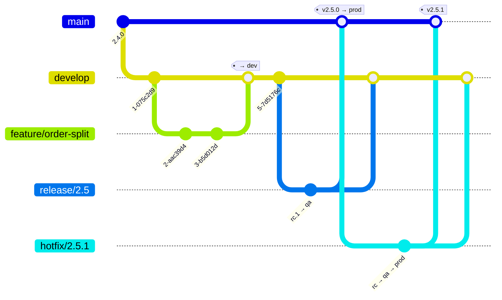

# Guía del desarrollador — Branching, versionado, build y rollback

**Complementa a `archetype-model.md` y `terramate-outputs-sharing-architecture.md`**

> **Empieza por `platform-overview.md`** para un mapa guiado por diagramas del conjunto de documentos.
>
> Los **riesgos** viven en `risk-register.md`. Las **decisiones asentadas** viven en `CLAUDE.md`.

| | |
|---|---|
| **Audiencia** | Desarrolladores de aplicaciones. No el equipo de plataforma |
| **Alcance** | Cómo se organiza, se ramifica (branching), se versiona, se construye, se despliega y — donde sea posible — se revierte una aplicación |
| **Fuera de alcance** | Todo lo que está por debajo de la capa 4. Tú no escribes OpenTofu; lo hace el archetype |
| **Relación con los otros documentos** | `archetype-model.md` especifica *qué se puede componer con qué*. Este especifica *qué haces en tu propio repositorio* para que la composición funcione |
| **Se ejecuta** | En cada pull request, cada merge, cada tag. Falla cerrado |

**Tres cosas que debes poder responder tras leer esto.** Si no puedes, la guía ha fallado y eso vale la pena reportarlo como bug:

1. **Qué rama despliega dónde** — §3.
2. **Qué incremento de versión requiere tu cambio** — §4.2.
3. **Qué puedes y qué no puedes revertir** — §6.

---

## Tabla de contenidos

1. [Modelo de repositorio](#1-modelo-de-repositorio)
2. [El manifest es el único archivo de especificación](#2-el-manifest-es-el-único-archivo-de-especificación)
3. [Ramas y environments](#3-ramas-y-environments)
4. [Versionado](#4-versionado)
5. [Detección de cambios y re-etiquetado](#5-detección-de-cambios-y-re-etiquetado)
6. [Rollback](#6-rollback)
7. [Migraciones](#7-migraciones)
8. [Java](#8-java)
9. [Python](#9-python)
10. [Node y el frontend en React](#10-node-y-el-frontend-en-react)
11. [Probes, recursos y el presupuesto del environment compartido](#11-probes-recursos-y-el-presupuesto-del-environment-compartido)
12. [Decisiones asentadas — no reabrir](#12-decisiones-asentadas--no-reabrir)
13. [Preguntas abiertas](#13-preguntas-abiertas)

---

## 1. Modelo de repositorio

**Un repositorio por aplicación. Cada servicio de esa aplicación vive en él.** Un `manifest.yaml` en la raíz, un archetype, un stack por servicio.

```
orders-app/
├── manifest.yaml                 ← el archetype. LA fuente de verdad
├── services/
│   ├── api/                      ← stack: api        (Java)
│   ├── worker/                   ← stack: worker     (Python)
│   ├── migrations/               ← stack: migrations (Python + Alembic)
│   └── web/                      ← stack: web        (React, condition: "hasFrontend")
├── libs/
│   └── common/                   ← código compartido. Cambiarlo reconstruye cada servicio dependiente
├── charts/                       ← solo overlays de values de Helm. Los charts vienen de la plataforma
└── .github/workflows/
```

| Decisión | Justificación |
|---|---|
| **Monorepo por aplicación, no por servicio** | Una versión, una pull request, una ejecución de CI para un cambio que cruza dos servicios. Un cambio de contrato entre servicios repartido en dos repositorios no puede revisarse, probarse ni revertirse como una unidad |
| **No un monorepo por organización** | La detección de cambios, CODEOWNERS y el cadencia de releases se vuelven problema del equipo de plataforma en lugar del tuyo. El límite de la aplicación es el límite de propiedad |
| **Un archetype por aplicación** | El archetype es la unidad desplegable. Su clausura `requires` se resuelve una vez (`archetype-model.md` §12), no una vez por servicio |
| **Un stack por servicio** | `stacks[].after` te da el orden de despliegue gratis, y es el mismo mecanismo que usa la plataforma. Ver `archetype-model.md` §5.1 |
| **El frontend es un stack como cualquier otro** | `condition: "hasFrontend"` (§2). Una aplicación sin UI no genera stack `web` y no reclama ningún hostname |

`libs/` no es gratis. Cada servicio que lo lista en `build.deps` se reconstruye cuando cambia — ver §5. Si eso significa reconstruir los seis servicios en cada commit, la librería es demasiado gruesa.

---

## 2. El manifest es el único archivo de especificación

Las especificaciones de build y deploy son una **extensión de `manifest.yaml`**, nunca archivos nuevos.

> Un `build.yaml` / `deploy.yaml` paralelo crea un tercer lugar donde declarar la misma dependencia, y los tres divergen. El manifest ya lo lee el resolver **y** Terramate vía `tm_yamldecode(tm_file("manifest.yaml"))`. Añadir un segundo archivo significa añadir un segundo lector, un segundo esquema, una segunda puerta de CI y una segunda cosa que se olvida actualizar.

```yaml
apiVersion: archetype/v1
kind: Archetype

metadata:
  name: orders-app
  version: 2.4.0                 # GENERADO. No editar — ver §4.1
  layer: 5
  kind: catalog
  owners: [team-orders]

runtimes: [gke, eks, aks]

requires:
  - capability: cluster
    version: "^2.0.0"
  - capability: ingress
    version: "^3.0.0"
    traits: [gateway-api, http-route]
  - capability: database-platform
    version: "^1.0.0"
    optional: true

frontend:                        # su presencia hace que hasFrontend sea true
  routes: [/, /orders, /orders/*]

stacks:
  - name: api
    build:
      language: java             # enum desde registry/languages.yaml
      context: services/api
      deps: [libs/common]
    deploy:
      chart: service
      port: 8080

  - name: worker
    after: [api]
    build:
      language: python
      context: services/worker
      deps: [libs/common]
    deploy:
      chart: worker

  - name: migrations
    build:
      language: python
      context: services/migrations
    deploy:
      chart: job
      phase: pre-deploy          # §7 — corre antes de los stacks de la app, como paso propio

  - name: web
    condition: "hasFrontend"
    after: [api]
    build:
      language: node
      variant: spa
      context: services/web
    deploy:
      chart: spa

capacity:
  cpu_millicores: 4000
  memory_mib: 8192
  db_connections: 25
  ingress_routes: 3
  workload_identities: 2
```

| Añadido | Dónde aterriza |
|---|---|
| `frontend` | Nuevo bloque de nivel superior. Su presencia es lo que evalúa `hasFrontend` |
| `stacks[].build` | `language`, `variant`, `context`, `dockerfile`, `deps` |
| `stacks[].deploy` | `chart`, `port`, `phase`, overrides de `probes` |
| `hasFrontend` | Nuevo predicado en el vocabulario de `condition:`, junto a `resolved(<capability>)` |

**`archetype-manifest.schema.json` fija `additionalProperties: false`,** así que estos bloques no validan hasta que se extienda el esquema. El esquema está **generado a partir de `registry/`** (`CLAUDE.md`, "The registry is load-bearing") — así que `language` se convierte en `registry/languages.yaml` y una errata como `java17` falla en la validación de esquema en segundos en lugar de en el `docker build` en minutos. No editar el enum a mano; ese es el modo de fallo detrás del riesgo R34.

---

## 3. Ramas y environments

GitFlow. La rama decide el environment; nada más lo hace. No existe un botón "desplegar esta rama a prod".



| Rama | Environment | Disparador | Aprobación | Tag de imagen | Construido o promovido |
|---|---|---|---|---|---|
| `feature/*` | **ninguno** | PR abierta o pusheada | — | `pr-<n>.g<sha>` | construido, escaneado, pusheado, **no desplegado** |
| `develop` | `dev` | merge | ninguna — automático | `2.5.0-dev.<n>.g<sha>` | construido |
| `release/x.y` | `qa` | merge o push | ninguna — automático | `2.5.0-rc.<n>` | construido |
| `main` | `prod` | tag `vX.Y.Z` | **manual** — GitHub Environment `production`, revisores obligatorios | `2.5.0` | **promovido.** Re-etiquetado del digest del rc. Nunca reconstruido |
| `hotfix/*` | `qa` → `prod` | rama desde `main` | manual para prod, misma puerta, cola expeditada | `2.5.1-rc.<n>` → `2.5.1` | construido, luego promovido |

Cuatro consecuencias que vale la pena decir con claridad:

- **Una rama feature no obtiene ningún environment.** Obtiene una PR preview completa — build, tests unitarios, escaneo de imagen, `archetypectl resolve --dry-run`, `tofu preview` con mocks activados (architecture §14.1) — pero no se aplica nada. Si necesitas un environment corriendo, solicita uno `ephemeral-*` explícitamente; es un claim contra la supernet efímera (`archetype-model.md` §9.2) y se destruye al cerrar la PR.
- **`prod` despliega el digest que `qa` ya ejecutó.** La puerta de promoción rechaza un digest sin un despliegue exitoso registrado en `qa`. Eso es lo que hace que "promovido, no reconstruido" sea verificable en lugar de aspiracional — ver §5.
- **`hotfix/*` es el camino rápido, no un camino distinto.** Salta `develop` y la rama de release; no salta `qa`, el escaneo de imagen, ni la aprobación de producción. Lo que compra es orden: va al frente de la cola y no espera lo que esté en curso en `develop`.
- **Un hotfix que no se fusiona de vuelta se pierde.** `hotfix/*` se fusiona a `main` **y** a `develop` (y a la `release/x.y` abierta si existe una). Una puerta de CI bloquea el merge a `main` hasta que exista la PR de back-merge a `develop` — porque la alternativa es que el fix desaparezca silenciosamente en el siguiente release, y se redescubra en producción como una regresión que nadie puede explicar.

---

## 4. Versionado

**Una versión para la aplicación, no una por servicio.** `metadata.version` es la versión de todo el archetype. Un cambio en un servicio incrementa la aplicación.

> La alternativa — una versión por servicio — suena más precisa y es peor. Convierte "qué versiones de estos seis servicios corrían juntas el martes" en una pregunta que no puedes responder desde un tag, y elimina lo único que un rollback puede apuntar: un conjunto de digests que se sabe que funcionan juntos.

### 4.1 La versión es el tag de Git

| | |
|---|---|
| **Fuente de verdad** | El tag anotado de Git `vX.Y.Z` en `main` |
| **`metadata.version`** | **Generado** por el pipeline a partir del tag. Commiteado, para que el manifest sea autocontenido y Terramate pueda leerlo, pero no escrito a mano |
| **Puerta de CI** | `archetypectl version --check` recalcula la versión a partir del ref y falla si `metadata.version` difiere |

La puerta existe por la misma razón que existe G0 (`terramate generate --check`): el valor está commiteado, así que alguien lo editará. Cuando lo haga, tres cosas discrepan silenciosamente — el tag de imagen, el registro de CMDB, y la label obligatoria `app.kubernetes.io/version` de `registry/labels.yaml`, que Gatekeeper valida en la admisión. El deployment es entonces rechazado en el cluster, que es el peor sitio para descubrirlo.

Versiones de pre-release, por rama:

| Rama | Versión | Tag de imagen |
|---|---|---|
| `feature/*` | — | `pr-412.g1a2b3c4` |
| `develop` | `2.5.0-dev.17+g1a2b3c4` | `2.5.0-dev.17.g1a2b3c4` |
| `release/2.5` | `2.5.0-rc.3` | `2.5.0-rc.3` |
| `main` @ `v2.5.0` | `2.5.0` | `2.5.0` |

**`+` es legal en semver e ilegal en un tag OCI.** El charset del tag es `[a-zA-Z0-9_][a-zA-Z0-9._-]{0,127}`. El pipeline reemplaza `+` por `.` al derivar el tag de imagen; no lo hagas a mano ni te sorprenda que las dos cadenas difieran en un carácter.

### 4.2 Qué incremento

| Cambio | Incremento | Por qué |
|---|---|---|
| Endpoint o campo eliminado, o su semántica cambiada | **MAJOR** | los consumers se rompen |
| Cambio a una capability que este archetype `provides` | **MAJOR** | el contrato de output es lo que dependen otros (riesgo R6) |
| **Migración irreversible** — `DROP COLUMN`, `DROP TABLE`, `NOT NULL` en una columna existente, un cambio de tipo que estrecha | **MAJOR** — *incluso cuando el diff de código es una sola línea* | ver más abajo |
| Endpoint o campo opcional añadido, retrocompatible | MINOR | |
| Migración de fase expand — columna nullable, tabla nueva, `CREATE INDEX CONCURRENTLY` | MINOR | reversible; nada la lee todavía |
| Nuevo servicio (nuevo stack) añadido a la aplicación | MINOR | |
| Nueva entrada `requires`, o un rango de versión ampliado | MINOR | la resolución cambia; la clausura es mayor |
| Corrección de bug sin cambio de contrato | PATCH | |
| Bump de dependencia sin cambio de comportamiento | PATCH | |
| Cambio de recursos o réplicas en `capacity` | PATCH | pero ver §11 — un incremento en un environment compartido necesita revisión de plataforma |
| Solo docs, tests, configuración de CI | **sin release** | |

> **Una migración irreversible es MAJOR incluso si el diff de código es una línea.**
>
> El tamaño del diff no es la medida; el tamaño de lo que no se puede deshacer sí lo es. `ALTER TABLE orders DROP COLUMN legacy_ref;` son dieciocho caracteres de SQL y elimina permanentemente la capacidad de correr cualquier versión anterior de la aplicación contra esa base de datos. Después de ejecutarse, cada imagen `2.x` es inejecutable — no degradada, inejecutable. MAJOR es el único lugar en la cadena de versión donde eso es visible para alguien que decide si revertir a las 03:00.
>
> Esta es la regla más discutida de este documento, y no es negociable. Si el argumento es "pero es un cambio pequeño", acabas de describir la razón por la que existe la regla.

El incremento lo calcula el pipeline a partir de los archivos de migración y el diff de la API donde puede, y se contrasta contra la label de la pull request. No se adivina.

---

## 5. Detección de cambios y re-etiquetado

Solo se reconstruyen los servicios cambiados. Eso ahorra minutos reales y tiene un modo de fallo que hay que diseñar para evitarlo.

### 5.1 Qué dispara una reconstrucción

| Ruta cambiada | Reconstruye |
|---|---|
| `services/api/**` | `api` |
| `libs/common/**` | cada stack que liste `libs/common` en `build.deps` |
| `manifest.yaml`, lockfile raíz, Dockerfile base | **todos** |
| `charts/**` | nada — solo redespliega |
| `docs/**`, `README.md`, `.github/ISSUE_TEMPLATE/**` | nada |

La detección es `git diff --name-only <merge-base>..<head>` mapeado sobre `build.context` y `build.deps`. Una ruta que no coincide con ninguna regla reconstruye todo — fallar seguro es más barato que una imagen obsoleta que nadie nota.

### 5.2 La regla de re-etiquetado

> **Cada servicio de la aplicación lleva el tag de versión de la aplicación después de cada release, haya sido reconstruido o no.**

Sin esta regla, un release donde solo cambió `api` produce `api:2.5.0` mientras `worker` y `web` siguen en `2.4.0`. Nada está roto y todo está ahora mal: `kubectl get deploy` muestra tres versiones distintas para una aplicación, el CMDB registra una versión que existe para un solo servicio, y "revertir a 2.4.0" no tiene un significado único. Un release no debe dejar ningún servicio en un tag antiguo.

El mecanismo tiene dos partes:

**Un lockfile de release.** El pipeline escribe `release.lock.json` en cada release — servicio → digest — y lo commitea junto con el tag:

```json
{
  "version": "2.5.0",
  "services": {
    "api":        "sha256:9f2c…",
    "worker":     "sha256:41ab…",
    "migrations": "sha256:41ab…",
    "web":        "sha256:7d30…"
  }
}
```

Para un servicio que no se reconstruyó, el digest se copia del lockfile de la versión anterior. No hay lookup contra el registry ni ningún "latest" en ninguna parte.

**Un re-etiquetado del lado del registry, no una reconstrucción:**

```bash
docker buildx imagetools create -t registry/orders-worker:2.5.0 registry/orders-worker@sha256:41ab…
```

| Propiedad | Valor |
|---|---|
| Tiempo | 200–500 ms por servicio — una copia de manifest dentro del registry |
| Bytes transferidos | cero. No se descarga ni sube ninguna capa |
| Digest | **sin cambios**, así que la firma de cosign, el SBOM y la atestación de proveniencia siguen verificando |
| Alternativa (reconstruir) | 2–6 min por servicio, **y un digest distinto** — lo cual rompe silenciosamente la promesa de que prod corre lo que corrió qa |

**Desplegar por digest, nunca por tag.** El tag es un alias de cara al humano y es mutable; el digest es la identidad. Los values de Helm renderizados llevan `image: registry/orders-api@sha256:9f2c…`. Esto es también lo que hace exigible la puerta de promoción de §3: prod rechaza un digest que `release.lock.json` no muestre como desplegado exitosamente en `qa`.

---

## 6. Rollback

Lee esta sección antes de necesitarla. Cuatro mecanismos, y no son intercambiables.

| Mecanismo | Tiempo | Reversible | Radio de impacto | Úsalo |
|---|---|---|---|---|
| **Redesplegar un digest de imagen anterior** | 30–90 s | sí | el servicio | **Siempre primero.** Este es el rollback |
| **`helm rollback`** | 1–5 min | normalmente | todo el release: config, RBAC, CRs, probes, claims de PVC | Cuando cambió el chart o los values, no solo la imagen |
| **`tofu apply` de un commit anterior** | 10–40 min | **no** | **puede destruir infraestructura** | Nunca como respuesta a un incidente |
| **Migración de base de datos** | — | **no** | los datos | **No existe rollback de migración.** §7 |

### 6.1 Redesplegar un digest anterior es barato

Es un cambio de `spec.template.spec.containers[].image` y una actualización rolling. El digest viene del `release.lock.json` anterior, así que "revertir a 2.4.0" es exacto y completo — cada servicio vuelve, junto, a los bytes que se probaron juntos.

La única precondición: **el código de 2.4.0 debe todavía poder correr contra la base de datos actual.** Eso es lo que §7 existe para garantizar, y es lo único que puede quitarte esta opción.

### 6.2 `helm rollback` es más difícil de lo que parece

Restaura el manifest del release anterior, que es más que la imagen. Tres cosas que no hace limpiamente:

- **Los hooks se vuelven a ejecutar.** Un hook `pre-upgrade` — un Job de migración, por ejemplo — se ejecuta de nuevo en el rollback. Esta es la razón principal por la que §7 mantiene las migraciones completamente fuera de los hooks de Helm.
- **Los CRDs no se revierten.** Helm no gestiona las actualizaciones de CRD; un rollback deja la nueva versión del CRD en su sitio mientras instala charts que esperan la antigua.
- **Los campos inmutables fallan a mitad del rollback.** Un `Deployment.spec.selector` cambiado o un PVC redimensionado no se pueden revertir in situ. El rollback falla a mitad de camino y ahora estás en un tercer estado que no es ninguna de las dos versiones.

Si lo único que cambió es la imagen, no uses `helm rollback` — usa §6.1.

### 6.3 Un `tofu apply` de un commit anterior puede destruir recursos

Este es el que sorprende a la gente, así que hay que ser concretos:

| Revertir | Qué planea OpenTofu |
|---|---|
| Un commit que **añadió** un recurso | `destroy` |
| Un commit que cambió un **nombre** o cualquier atributo `ForceNew` | `destroy` **y luego** `create` — un recurso nuevo, una identidad nueva, una IP nueva |
| Un commit que aumentó el tamaño de disco de un node pool | reemplazo del node pool en varios proveedores |
| Un commit que habilitó `deletion_protection` | elimina la protección, y luego lo que pida el siguiente plan |

No hay "deshacer" en la capa de infraestructura. **Avanza hacia adelante (roll forward).** Escribe el cambio que restaura el estado deseado, pásalo por las puertas normales, y lee el plan. Si un plan en un incidente muestra `destroy` sobre algo que no pretendías destruir, detente y escala al equipo de plataforma — ese plan es el último punto de control antes del daño.

### 6.4 La frase que alguien va a ignorar

> **Revertir un merge no deshace una migración.**

Revertir el merge revierte *código*. La base de datos sigue en el nuevo esquema. Lo que ahora tienes desplegado es una aplicación antigua que espera el esquema antiguo, contra una base de datos que ya no lo tiene — así que en lugar de un release roto tienes un release roto *y* un camino de rollback roto, y el incidente se alarga.

Si una migración ya se ejecutó, tus opciones son las de §7, no las de Git. Revertir el merge es una forma legítima de detener más despliegues de código malo. No es una forma de deshacer un cambio de esquema, y nunca lo será.

---

## 7. Migraciones

**Las migraciones están separadas del deployment.** Son su propio stack (`phase: pre-deploy`) y su propio paso de pipeline, con su propia aprobación en `prod`.

| Dónde no debe correr una migración | Por qué |
|---|---|
| El entrypoint de la aplicación | N réplicas compiten. Alembic no toma ningún advisory lock entre backends por defecto |
| Un `initContainer` | Se ejecuta una vez por pod, así que la misma carrera, más en cada reinicio y cada escalado |
| Un hook `pre-upgrade` de Helm | Se vuelve a ejecutar en `helm rollback` (§6.2), y un hook fallido deja el release en un estado que ni Helm ni tú pueden describir |

Corre como un `Job` en su propio paso de pipeline, antes de que se desplieguen los stacks de la aplicación. Ese orden solo funciona por la siguiente regla.

### 7.1 Expand–contract

Cada cambio de esquema se reparte entre releases de modo que **en todo momento, el código actualmente desplegado y el código del release anterior funcionan ambos contra el esquema actual.** Esa es la propiedad que mantiene disponible §6.1.

| Release | Migración | Código | ¿Se puede revertir? |
|---|---|---|---|
| **N — expand** | Añade la columna/tabla/índice nullable. Backfill por lotes | Escribe antiguo **y** nuevo. Lee antiguo | **Sí.** Nada lee la columna nueva |
| **N+1 — migrate** | ninguna | Lee nuevo. Sigue escribiendo ambos | **Sí.** El código de N sigue encontrando lo que necesita |
| **N+2 — contract** | `DROP` de la columna antigua | Lee y escribe solo nuevo | **No.** Este es el incremento MAJOR de §4.2 |

Dos reglas sobre la tabla:

- **El contract nunca va en el mismo release que el código que dejó de escribir la columna antigua.** Como mínimo un release completo de por medio, y no antes de que haya pasado la ventana de rollback de producción — **14 días** — sobre N+1. Si haces contract el martes y necesitas revertir a N el miércoles, no puedes.
- **Backfill por lotes con un tiempo de sentencia acotado.** Un único `UPDATE` sobre una tabla grande retiene un lock durante toda su duración; el timeout del Job de migración lo mata entonces a mitad de transacción y el reintento empieza de cero. Hacer lotes por clave primaria, commitear por lote, hacer el job reanudable e idempotente.

### 7.2 Detalles de Alembic

| Regla | Por qué |
|---|---|
| Revisar a mano cada migración autogenerada | `--autogenerate` se pierde defaults de servidor, renombrados de constraint, y varios cambios de tipo. También emite alegremente un `DROP` para una tabla que no conoce |
| Un solo head. Un merge que produce dos heads es un build roto | `alembic heads` en CI, fallando si hay más de uno |
| Que exista `down_revision` ≠ que la migración sea reversible | Un `downgrade()` que elimina una columna restaura el esquema y no los datos. No dejar que su presencia en el archivo implique que existe un rollback |
| Tomar un advisory lock al inicio de la migración | `SELECT pg_advisory_lock(...)` en PostgreSQL. Seguro barato contra un segundo Job iniciado por un reintento |

---

## 8. Java

### 8.1 Lockfile

Maven y Gradle resuelven dependencias en cada build. Sin un lock, dos builds del mismo commit con tres semanas de diferencia producen bytes distintos — lo cual vuelve sin sentido la promesa de digest de §5.

| Herramienta de build | Lock | Puerta |
|---|---|---|
| **Gradle** | `dependencyLocking { lockAllConfigurations() }` → `gradle.lockfile` commiteado | `./gradlew dependencies --write-locks && git diff --exit-code` |
| **Gradle, checksums también** | `./gradlew --write-verification-metadata sha256` → `verification-metadata.xml` | commiteado; cualquier discrepancia falla el build |
| **Maven** | `maven-lockfile` → `lockfile.json` commiteado | regenerar y `git diff --exit-code` |
| **Maven, mínimo** | `maven-enforcer` con `banDynamicVersions` y `requireReleaseDeps` | falla ante cualquier rango o `-SNAPSHOT` |

La puerta tiene la misma forma que G0 en el pipeline de la plataforma, por la misma razón: el archivo está commiteado, así que sin una puerta se queda obsoleto y nadie lo nota hasta que una dependencia transitiva cambia debajo de ti.

### 8.2 El arranque es lento, y los probes deben saberlo

Un servicio Spring Boot necesita **20–45 s** para el primer ready con una petición de 1 núcleo; más con un contexto grande o validación de esquema de Hibernate. Las formas de probe por defecto están pensadas para algo que arranca en dos segundos.

| Probe | Ajuste | Valor | Por qué |
|---|---|---|---|
| `startupProbe` | `periodSeconds` × `failureThreshold` | 5 × 30 = **presupuesto de 150 s** | Cubre el arranque en frío más lento, incluso con un nodo bajo presión de CPU |
| `livenessProbe` | `periodSeconds` / `failureThreshold` / `timeoutSeconds` | 10 / 3 / 2 | Solo empieza tras pasar el startup probe. Detecta un colgado genuino en ≤30 s |
| `readinessProbe` | `periodSeconds` / `failureThreshold` | 5 / 2 | Fuera de los endpoints del Service en 10 s desde que se pone unhealthy |
| `terminationGracePeriodSeconds` | | 45 | Más largo que la petición en curso más larga |
| `preStop` | `sleep` | 5 | La eliminación del endpoint es asíncrona; sin esto se devuelven 502 a peticiones enrutadas justo antes de que el pod se detuviera |

**Usa un `startupProbe`, no `livenessProbe.initialDelaySeconds`.** Con `initialDelaySeconds: 30` en un servicio que tarda 45 s, el liveness probe mata el pod a los 30 s, el reinicio es más lento porque el nodo ahora está más ocupado, y obtienes un `CrashLoopBackOff` que parece exactamente un bug de la aplicación. Fijar el delay en 180 s "lo arregla" y te deja tres minutos ciego ante un colgado real. El startup probe existe precisamente para que no tengas que intercambiar uno por otro.

**El arranque está limitado por CPU.** Con `requests.cpu: 100m` la JVM se estrangula durante la carga de clases y tarda 4–5× más. Solicita **≥ 500m** para un servicio Java; el pod lo devuelve una vez caliente.

### 8.3 `-XX:MaxRAMPercentage`, con números

```
-XX:MaxRAMPercentage=75.0 -XX:InitialRAMPercentage=75.0 \
-XX:MaxMetaspaceSize=256m -XX:+UseG1GC -XX:+ExitOnOutOfMemoryError
```

| `resources.limits.memory` | `MaxRAMPercentage` | Heap máximo | Restante para non-heap |
|---|---|---|---|
| 1024 MiB | 75.0 | 768 MiB | 256 MiB |
| 2048 MiB | 75.0 | 1536 MiB | 512 MiB |
| 4096 MiB | 80.0 | 3276 MiB | 820 MiB |
| 8192 MiB | 80.0 | 6553 MiB | 1639 MiB |

Non-heap es metaspace (128–256 MiB), code cache (64–240 MiB), stacks de hilos (1 MiB cada uno — 200 hilos son 200 MiB), direct byte buffers y estructuras de GC. **No** es opcional y no se cuenta en `-Xmx`.

Tres formas en que esto mata un pod, todas con **código de salida 137, `OOMKilled` en `kubectl describe pod`, y absolutamente nada en el log de la aplicación** — el kernel envía `SIGKILL`; la JVM no tiene oportunidad de escribir nada:

| Fallo | Qué ocurre |
|---|---|
| **JVM antigua en un nodo cgroups v2** — JDK 8 antes de 8u372, JDK 11 antes de 11.0.16, cualquiera antes de 15 | `UseContainerSupport` cae silenciosamente a la memoria **del host**. En un nodo de 64 GiB la JVM dimensiona un heap de 16 GiB dentro de un pod de 2 GiB. No falla al arrancar; falla la primera vez que el heap crece |
| **Sin flag, JVM moderna** | El `MaxRAMPercentage` por defecto es **25%** — 512 MiB de heap en un pod de 2 GiB. No es un crash, solo el 75% de la memoria que estás pagando quedando sin usar hasta que el tráfico empuja al GC a una espiral de muerte |
| **`-Xmx` fijado al límite completo** | El "arreglo" que parece correcto. `-Xmx2g` en un pod de 2 GiB deja cero para los 250–400 MiB de non-heap, y el RSS cruza el límite bajo carga |

Dos más que no son memoria pero lo parecen:

- **`limits.cpu: 1`** hace que la JVM vea un procesador, y su ergonomía entonces selecciona **SerialGC** (la heurística es menos de 2 CPUs o menos de 1792 MB). Pausas stop-the-world largas que parecen un problema de red. Fijar `-XX:+UseG1GC` explícitamente.
- **Fijar `requests.memory == limits.memory`** para pods JVM. La JVM se dimensiona a sí misma a partir del límite; si la petición es menor, el scheduler sobresuscribe el nodo y el pod es desalojado bajo presión por un mecanismo completamente distinto.

---

## 9. Python

### 9.1 `uv.lock` es obligatorio

| Regla | Comando |
|---|---|
| `uv.lock` está commiteado | — |
| CI falla si el lock está obsoleto | `uv lock --check` |
| La imagen instala desde el lock, nunca resuelve | `uv sync --frozen --no-dev` |

`--frozen` instala exactamente lo que dice el lock y no vuelve a resolver. Combinado con la puerta `uv lock --check`, un build no puede recoger silenciosamente una versión que nunca fue revisada. `pip install -r requirements.txt` sin hashes no es un sustituto aceptable — resuelve dependencias transitivas en tiempo de build, que es justo lo que se quiere evitar.

### 9.2 Imagen multi-stage

```dockerfile
FROM ghcr.io/astral-sh/uv:python3.12-bookworm-slim AS build
ENV UV_COMPILE_BYTECODE=1 UV_LINK_MODE=copy UV_PYTHON_DOWNLOADS=never
WORKDIR /app
COPY pyproject.toml uv.lock ./
RUN --mount=type=cache,target=/root/.cache/uv uv sync --frozen --no-dev --no-install-project
COPY . .
RUN --mount=type=cache,target=/root/.cache/uv uv sync --frozen --no-dev

FROM python:3.12-slim
COPY --from=build --chown=1000:1000 /app /app
ENV PATH="/app/.venv/bin:$PATH"
USER 1000
CMD ["uvicorn", "app.main:app", "--host", "0.0.0.0", "--port", "8080"]
```

| | Stage único | Multi-stage |
|---|---|---|
| Tamaño de imagen | ~1.1 GB | **~180 MB** |
| Contiene un toolchain de compilador | sí — cada CVE de `gcc` es tuyo | no |
| Tiempo de pull en un nodo en frío | 25–40 s | 4–7 s |

Copiar `pyproject.toml` y `uv.lock` antes del código fuente es lo que hace cacheable la capa de dependencias: un cambio solo en el código no reinstala nada. `UV_COMPILE_BYTECODE=1` precompila `.pyc` en tiempo de build, lo cual elimina unos cientos de milisegundos de la primera petición de cada worker.

### 9.3 Alembic

Las migraciones son Alembic, y siguen §7 sin excepción. El stack `migrations` se construye desde el mismo lock que el servicio dueño del esquema, así que la migración corre exactamente contra los modelos de SQLAlchemy que usará la aplicación.

Los servicios Python arrancan en **2–5 s**, así que un `startupProbe` de 5 × 12 = 60 s es generoso y `livenessProbe` a 10 / 3 está bien.

---

## 10. Node y el frontend en React

El frontend se **sirve con nginx dentro del cluster, detrás del mismo Gateway que la API**. No un bucket, no un origen de CDN propio — ver §12 para el porqué.

Mismo hostname, enrutamiento por path en el `HTTPRoute`: `/api/*` al servicio de la API, todo lo demás al servicio `web`. Un solo hostname significa sin CORS, sin preflight, y un solo certificado.

La fase de build es Node, la fase de runtime es nginx:

```dockerfile
FROM node:22-slim AS build
WORKDIR /app
COPY package.json package-lock.json ./
RUN npm ci                                   # ci, no install: falla ante un lock desactualizado
COPY . .
RUN npm run build                            # → /app/dist

FROM nginxinc/nginx-unprivileged:1.27-alpine
COPY --from=build /app/dist /usr/share/nginx/html
COPY nginx.conf /etc/nginx/conf.d/default.conf
COPY docker-entrypoint.d/10-env.sh /docker-entrypoint.d/10-env.sh
```

Fase de build ~1.2 GB, imagen de runtime ~55 MB.

### 10.1 Cuatro detalles, todos descubiertos en el primer deployment

| # | Detalle | Síntoma si falta | ¿Bloquea el deployment? |
|---|---|---|---|
| 1 | `nginxinc/nginx-unprivileged` | Pod rechazado en la admisión, o `CrashLoopBackOff` sobre un filesystem de solo lectura | **Sí, completamente** |
| 2 | Configuración en runtime vía `env.js` | Funciona en dev, luego la imagen de qa no se puede promover a prod | **Sí, completamente** — es la promoción lo que se rompe |
| 3 | `Cache-Control` asimétrico | Los usuarios ven el bundle anterior tras un deploy; 404 de chunks y pantalla blanca | No — se despliega, y parece que no lo hizo |
| 4 | `try_files $uri /index.html` | Cualquier ruta del cliente da 404 al recargar o en un enlace compartido | No — se despliega, y está roto para todo el que no entró por `/` |

Los dos que bloquean vale la pena que fallen pronto. Los dos que no bloquean son peores, porque el deployment reporta éxito.

### 10.2 La imagen debe ser `nginx-unprivileged`

El `nginx` estándar arranca como **root** y se enlaza al **puerto 80**. Ambos son incompatibles con lo que exige la plataforma:

| Requisito | De dónde viene | Qué hace el nginx estándar |
|---|---|---|
| `runAsNonRoot: true` | PSS `restricted`, exigido por la label del namespace `pod-security.kubernetes.io/enforce` en `registry/labels.yaml` | corre como root — pod **rechazado en la admisión** |
| Puertos ≥ 1024 sin `NET_BIND_SERVICE` | PSS `restricted` elimina todas las capabilities | se enlaza al 80 — falla |
| `readOnlyRootFilesystem: true` | línea base de la plataforma | escribe `/var/run/nginx.pid`, `/var/cache/nginx/*` — falla al arrancar |

`nginxinc/nginx-unprivileged` corre como uid **101** y escucha en el **8080**. Todavía necesita espacio de escritura, así que monta `emptyDir` en `/var/cache/nginx` y `/tmp`:

```yaml
securityContext:
  runAsNonRoot: true
  runAsUser: 101
  allowPrivilegeEscalation: false
  readOnlyRootFilesystem: true
  capabilities: { drop: ["ALL"] }
  seccompProfile: { type: RuntimeDefault }
volumeMounts:
  - { name: cache,  mountPath: /var/cache/nginx }
  - { name: tmp,    mountPath: /tmp }
  - { name: envcfg, mountPath: /usr/share/nginx/html/config }
volumes:
  - { name: cache,  emptyDir: {} }
  - { name: tmp,    emptyDir: {} }
  - { name: envcfg, emptyDir: {} }
```

### 10.3 Configuración en el arranque, no en el build

**La forma incorrecta, y es la que muestra cada tutorial:**

```bash
VITE_API_URL=https://api.qa.disasterproject.com npm run build
```

Vite sustituye `import.meta.env.VITE_API_URL` como un **literal de cadena en tiempo de build**. La URL queda horneada en el bundle. Eso produce **una imagen por environment**, y rompe la promoción: el artefacto que probaste en `qa` no es el artefacto que despliegas en `prod` — es un build distinto, del mismo código fuente, con bytes distintos y un digest distinto. Cada garantía de §5 se evapora, y la primera vez que te cueste algo será un bug solo-en-prod que qa no puede reproducir porque qa nunca corrió esa imagen.

**La forma correcta** — una imagen, configurada cuando arranca el contenedor. El script de entrypoint escribe `env.js` en el `emptyDir` montado:

```bash
#!/bin/sh
# /docker-entrypoint.d/10-env.sh — corre antes de que arranque nginx
set -eu
cat > /usr/share/nginx/html/config/env.js <<EOF
window.__ENV__ = {
  API_URL:     "${API_URL}",
  ENVIRONMENT: "${ENVIRONMENT}",
  SENTRY_DSN:  "${SENTRY_DSN:-}"
};
EOF
```

```html
<!-- index.html, ANTES del bundle -->
<script src="/config/env.js"></script>
<script type="module" src="/assets/index-a3f9c1.js"></script>
```

```js
// un único accesor, para que una clave faltante falle ruidosamente en un solo sitio
export const env = window.__ENV__ ?? {};
```

Tres reglas que van con ello:

- **`env.js` se sirve con `Cache-Control: no-store`.** Es tan no-hasheado como `index.html` y cambia por environment.
- **Nada secreto va en él.** Se entrega al navegador. URLs de API, feature flags, un DSN público de Sentry — sí. Cualquier cosa con autoridad — no, nunca.
- **Los valores vienen del stack de deploy**, que los obtiene de los globals resueltos, así que `API_URL` en `prod` no es algo que un desarrollador escribió a mano.

### 10.4 `Cache-Control`, asimétrico

```nginx
location = /index.html {
    add_header Cache-Control "no-store, must-revalidate";
}
location = /config/env.js {
    add_header Cache-Control "no-store, must-revalidate";
}
location /assets/ {
    add_header Cache-Control "public, max-age=31536000, immutable";
    try_files $uri =404;
}
```

| Archivo | Nombre hasheado | `Cache-Control` | Porque |
|---|---|---|---|
| `index.html` | **no** | `no-store, must-revalidate` | Es el único punto de entrada no hasheado. Es lo que nombra qué bundle cargar |
| `/assets/*-<hash>.js`, `.css` | **sí** | `public, max-age=31536000, immutable` | El nombre cambia cuando cambia el contenido, así que se puede cachear un año. `immutable` también detiene la petición de revalidación al recargar |
| `/config/env.js` | no | `no-store, must-revalidate` | §10.3 |

**Si `index.html` está cacheado, el deployment parece que no funcionó.** Los usuarios retienen el `index.html` antiguo, que nombra los nombres de archivo de assets antiguos, así que siguen corriendo el bundle anterior — durante cinco minutos, o una hora, o hasta que hagan un hard-refresh, según de quién sea la caché. Te dirán que el deploy falló. No falló; tuvo éxito y es invisible.

Se pone peor que invisible. El `index.html` antiguo referencia `/assets/index-a3f9c1.js`, que existe solo en la *imagen anterior* — el pod nuevo nunca ha oído hablar de él. La petición da 404, nginx sirve el cuerpo del 404, y el navegador reporta `Unexpected token '<'` o un `ChunkLoadError`: una página blanca en blanco y un stack trace que no apunta a nada. `try_files $uri =404` bajo `/assets/` al menos hace que sea un 404 honesto en lugar de un documento HTML fingiendo ser JavaScript.

### 10.5 `try_files` para rutas del lado del cliente

```nginx
location / {
    try_files $uri $uri/ /index.html;
}
```

Las rutas de React Router no son archivos. `/orders/42` existe solo después de que el bundle se ha cargado y ha tomado control de la URL. Cuando un usuario recarga esa página, o abre un enlace que alguien le envió, nginx busca un archivo llamado `orders/42`, no lo encuentra, y devuelve 404 — la aplicación nunca tiene ocasión de correr.

`try_files $uri $uri/ /index.html` sirve `index.html` para cualquier cosa que no sea un archivo real, el bundle arranca, y el router lee la URL. La ruta de entrada deja de importar.

**Mantenlo fuera de `/assets/`.** Para eso está el `try_files $uri =404;` de §10.4: dentro de `/assets/`, un archivo faltante debe dar 404. Si el catch-all aplica ahí, un chunk faltante devuelve `index.html` con `Content-Type: text/html`, el navegador intenta parsear HTML como un módulo, y obtienes el `Unexpected token '<'` de arriba — el mismo síntoma por una causa distinta, y algo genuinamente lento de depurar.

### 10.6 Higiene de build de Node

| Regla | Por qué |
|---|---|
| `npm ci`, nunca `npm install` | `ci` falla ante un lock desincronizado de `package.json`. `install` lo reescribe silenciosamente |
| `package-lock.json` (o `pnpm-lock.yaml`) commiteado | Misma razón que §8.1 y §9.1 |
| La fase Node nunca llega a la imagen de runtime | Es una herramienta de build. Enviarla envía una superficie de ataque de 1.2 GB para servir archivos estáticos |
| probes de nginx | Listo en <1 s. `readinessProbe` 5 / 2, no hace falta `startupProbe` |

---

## 11. Probes, recursos y el presupuesto del environment compartido

| | Java | Python | nginx / SPA |
|---|---|---|---|
| Tiempo hasta el primer ready | 20–45 s | 2–5 s | <1 s |
| Presupuesto de `startupProbe` | 5 × 30 = 150 s | 5 × 12 = 60 s | no hace falta |
| `livenessProbe` | 10 / 3 / 2 | 10 / 3 / 2 | 10 / 3 / 2 |
| `readinessProbe` | 5 / 2 | 5 / 2 | 5 / 2 |
| `requests.cpu` | ≥ 500m | 100–250m | 10–50m |
| `requests.memory` == `limits.memory` | **obligatorio** | recomendado | 32–64 MiB |

Tu bloque `capacity` es un **cargo contra el presupuesto del environment**, no una petición que siempre se concede (`archetype-model.md` §8.2). El resolver suma el cargo de cada tenant activo y falla la pull request cuando se supera el total del environment — con un diagnóstico que nombra quién tiene qué.

**Incrementar `capacity` en un environment compartido requiere revisión de plataforma.** Está asentado, y no es un comentario sobre tu criterio: en un environment compartido, la memoria que añades es memoria que otro tenant ya no tiene, y el resolver es lo único que puede ver el cuadro completo. El comentario de la pull request muestra el delta de capacity; un delta positivo contra un environment compartido añade al equipo de plataforma como revisor obligatorio. En un environment dedicado, es tuyo.

---

## 12. Decisiones asentadas — no reabrir

Estas se decidieron con razones. Trae evidencia nueva o déjalas en paz.

| Decisión | Justificación |
|---|---|
| **Monorepo por aplicación** | Una versión, una pull request, una ejecución de CI para un cambio que cruza dos servicios. §1 |
| **La imagen se promueve entre environments, nunca se reconstruye** | Una reconstrucción produce un digest distinto, y entonces "prod corre lo que qa probó" es una afirmación que nadie puede comprobar. La promoción es un re-etiquetado del lado del registry: 200–500 ms, cero bytes, mismo digest, firmas todavía válidas. §5.2 |
| **El frontend es nginx en el cluster, no un bucket + CDN** | Mismo Gateway, mismo hostname, mismo certificado, mismo mecanismo `HTTPRoute`, misma `SecurityPolicy` de OIDC, misma network policy, misma observabilidad. Un bucket necesita un segundo camino de edge, un segundo modelo de identidad y una segunda historia de invalidación — para un artefacto que ya está sentado en una imagen que el cluster ha descargado. Revisitar cuando el perfil de tráfico realmente lo justifique, no antes |
| **Revisión de plataforma para incrementar `capacity` en un environment compartido** | El resolver es el único componente que ve el cargo de cada tenant. §11 |
| **Las especificaciones de build y deploy extienden `manifest.yaml`** | Un archivo de especificación paralelo es un tercer lugar donde declarar la misma dependencia, y diverge. §2 |
| **Una versión por aplicación, no por servicio** | De lo contrario "qué corría junto el martes" no tiene respuesta, y un rollback no tiene objetivo. §4 |
| **Desplegar por digest, etiquetar por versión** | El tag es mutable, el digest no. §5.2 |

---

## 13. Preguntas abiertas

Por asentar en la prueba de concepto, no por suposición:

1. **¿`archetypectl new-app` genera un scaffold, o lo hace un repositorio plantilla?** El scaffolding es lo que evita que los equipos copien y peguen de otra aplicación heredando sus errores — incluido cada uno de §10. Hasta que exista, este documento es lo único que se interpone entre un equipo nuevo y esos cuatro detalles de nginx.
2. **¿Dónde se calcula el incremento de versión?** Las heurísticas de archivo de migración y diff de API de §4.2 cubren la mayoría de los casos. Qué hace el pipeline con un cambio que no puede clasificar — fallar, o por defecto MINOR y exigir una label — no está decidido.
3. **¿Environment efímero por rama feature: opt-in o automático?** Automático es más amigable y consume contra la supernet efímera en cada pull request abierta. Medir la tasa de claims en un sprint real antes de elegir.
4. **Throughput del backfill.** §7.1 dice "lotes" sin un número, porque el tamaño de lote correcto depende de la tabla y del backend. Establecer un valor por defecto a partir de la primera migración real.
5. **¿La puerta de promoción vive en el pipeline o en el resolver?** Rechazar un digest que `qa` nunca ejecutó es una cuestión de política, lo cual argumenta a favor de conftest sobre un paso de shell en el workflow.
