# Visión general de la plataforma — Leer esto primero

Mapa visual de los dos documentos de referencia. Nada aquí es normativo; cada diagrama apunta a la sección que lo especifica.

| Documento | Responde |
|---|---|
| `archetype-model.md` | *¿Qué se puede componer con qué?* Manifiestos, capabilities, traits, pools, CMDB, resolución |
| `terramate-outputs-sharing-architecture.md` | *¿Cómo se genera y se aplica?* Generadores, outputs sharing, IAM, política, CI/CD, guías por nube |
| `risk-register.md` | *¿Qué puede salir mal, y el control está realmente implementado?* 53 riesgos por dominio (52 activos), revisados en cada puerta de fase |

---

## 1. Las dos mitades, y la costura entre ellas

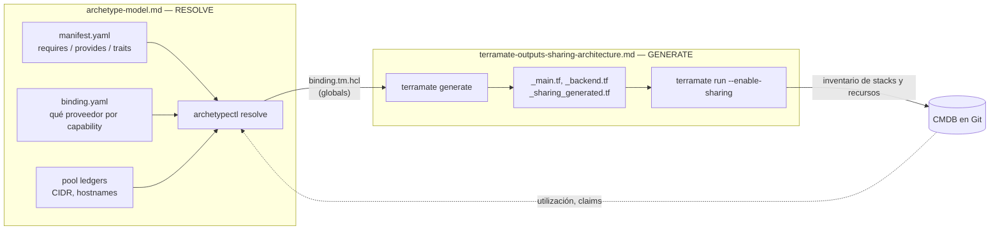

**La costura es `binding.tm.hcl`.** El resolver escribe globals; los generadores los consumen. Ninguna de las dos mitades conoce las internas de la otra.

---

## 2. Flujo completo de un pull request

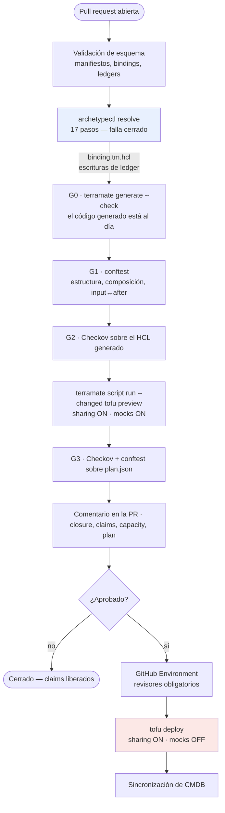

Dos cosas quedan visibles aquí: el resolver corre **antes** de la generación porque produce la entrada de esta, y `mock_on_fail` es true en preview y false en deploy — scripts nombrados por separado para que no se pueda confundir.

Especificado en: architecture §13, §14, companion §12.

---

## 3. Capas de archetype

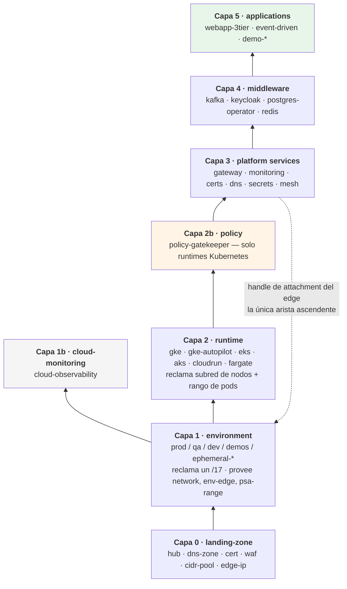

La arista punteada es la excepción que vale la pena recordar: el archetype `gateway` en la capa 3 publica el nombre del NEG / el ARN del target group / el frontend de AGFC que consume el stack de edge del environment en la capa 1.

Especificado en: companion §3.

---

## 4. De dónde viene un dato — globals o outputs sharing

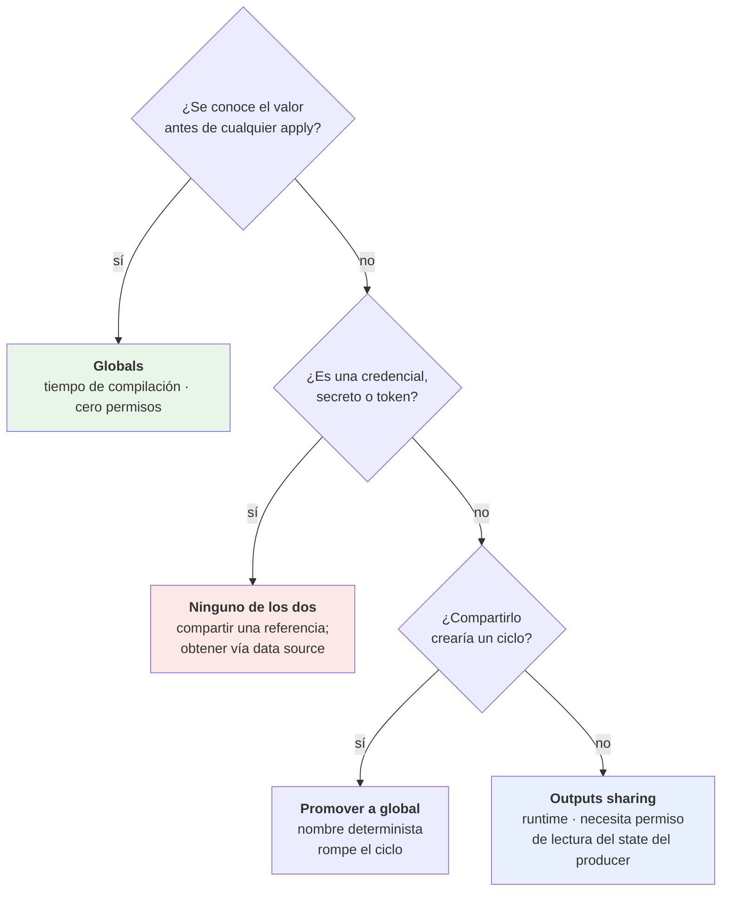

Cada arista de outputs sharing es un acoplamiento en runtime, un requisito de permiso en CI y un modo de fallo. Cada global es una constante en tiempo de compilación. Preferir globals.

Especificado en: architecture §4.6, §11.5, §11.6.

---

## 5. Cómo viaja realmente un valor compartido

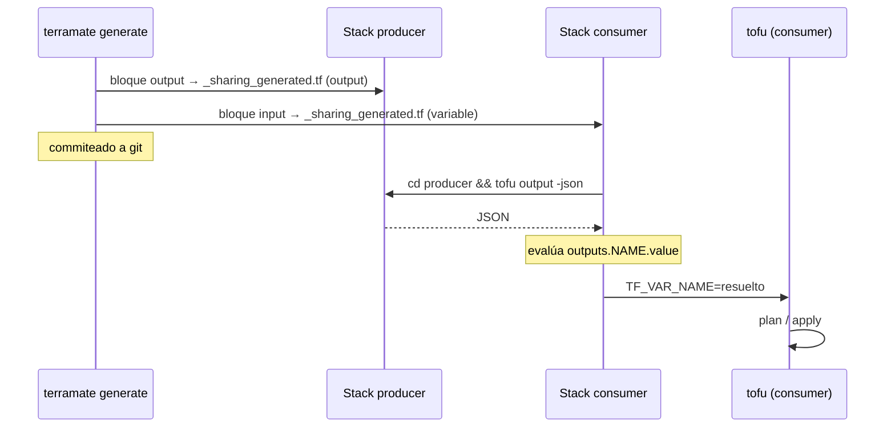

La tercera flecha es la que cuesta permisos: el job de CI del consumer necesita **acceso de lectura al state backend del producer**, y a su clave de cifrado si el cifrado de state está habilitado.

Especificado en: architecture §3.3, §11.5.

---

## 6. Pools jerárquicos y zonas de propósito

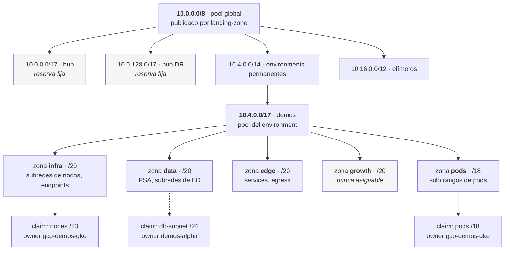

El hub es una **reserva fija, no un claim** — la landing zone publica el pool y necesita direcciones para sí misma, así que un claim crearía un ciclo de arranque.

Especificado en: companion §9.

---

## 7. Claim, capacity, o ninguno

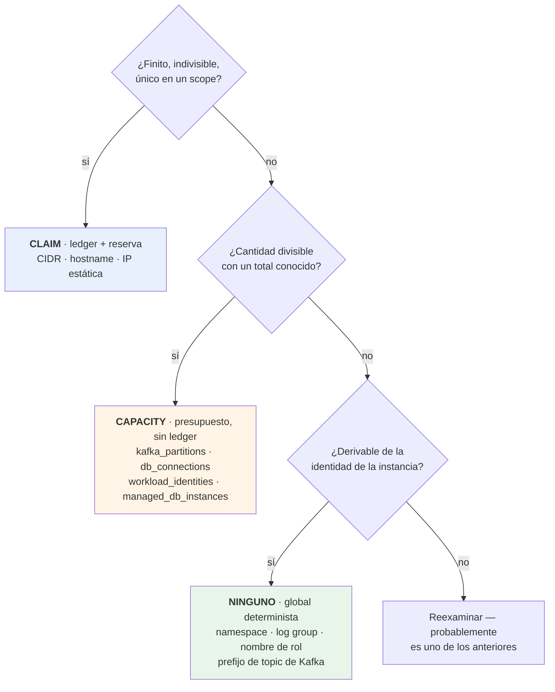

La asignación es idempotente sobre la tripla **`(pool, owner, purpose)`**, así que cinco reintentos de un deployment fallido no queman cinco rangos de pods.

Especificado en: companion §8.

---

## 8. Resolución — los 17 pasos, agrupados

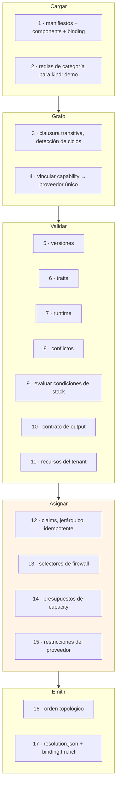

El paso 4 es una **búsqueda indexada, no una búsqueda general** — exactamente un proveedor por capability por environment — por eso la resolución es lineal y no NP-completa. El esfuerzo de ingeniería pertenece al diagnóstico, no al algoritmo.

Especificado en: companion §12, §13.

---

## 9. La forma que sigue cada guía de runtime

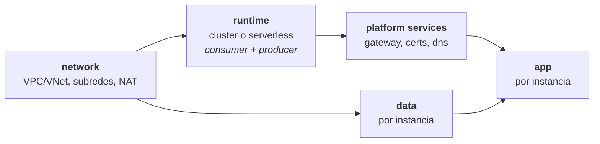

Las cinco guías — GKE, EKS, Cloud Run, ECS Fargate, AKS — son este mismo grafo. Lo que cambia es *qué datos cruzan cada arista*:

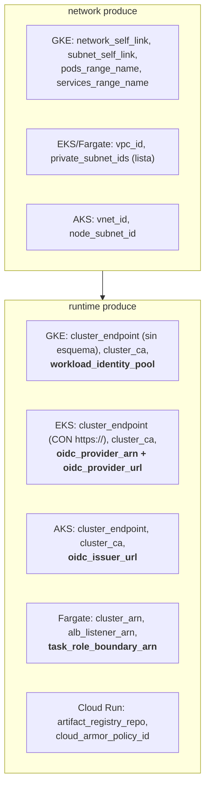

Dos asimetrías que causan bugs de copiar y pegar: GKE devuelve un endpoint **sin** esquema y EKS devuelve uno **con** `https://`; y AWS necesita dos datos de OIDC donde GCP y Azure necesitan uno.

**Nunca compartido, en ninguna nube:** el token de autenticación. Se obtiene localmente en cada consumer vía `google_client_config`, `aws_eks_cluster_auth` o el equivalente de Azure.

Especificado en: architecture §5–§9, §6.8.

---

## 10. Attachment del edge — el elemento menos portable

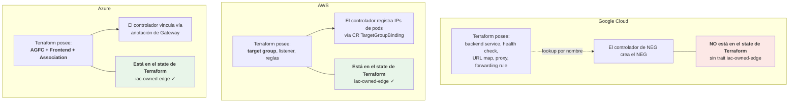

GCP es el más débil de los tres en cuanto a propiedad completa por IaC. Esa brecha se registra como la ausencia del trait `iac-owned-edge` en lugar de ocultarse, para que un futuro requisito de cumplimiento falle en la validación y no en la auditoría.

Especificado en: architecture §10, companion §4.3.

---

## 11. Por qué Gateway API elimina el problema del fan-in

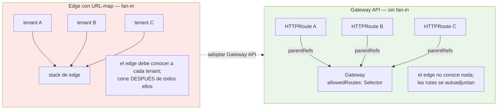

Adoptar Gateway API elimina tres cosas: el URL map generado a partir de una lista de tenants, el ledger de prioridad de listeners, y el stack de edge-routing que tenía que correr al final. Lo que sobrevive como claim es el **hostname** — solo un tenant puede ser dueño de `alpha.demos.disasterproject.com`.

Especificado en: architecture §10.6.

---

## 12. Límites de aislamiento por runtime

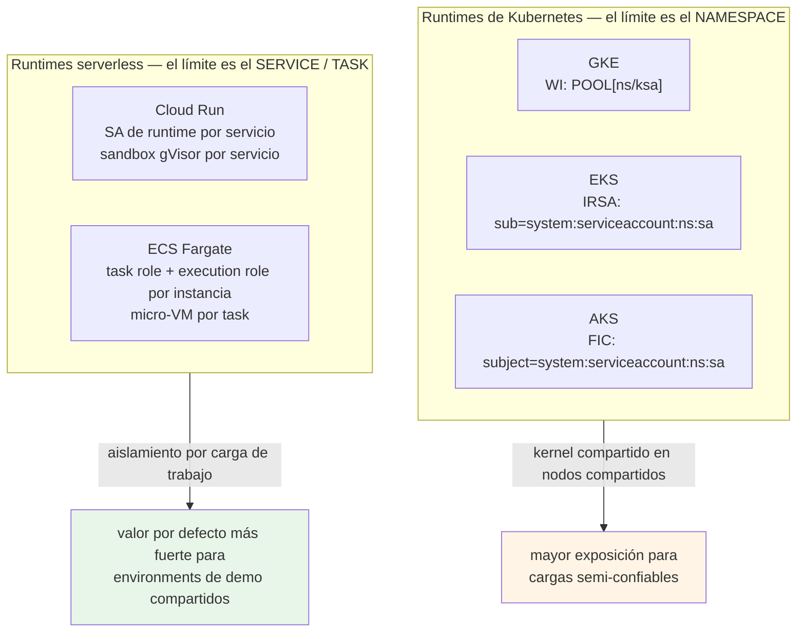

Un wildcard en cualquiera de esas tres condiciones de confianza (`POOL[*/*]`, `system:serviceaccount:*:*`) otorga silenciosamente la identidad a cada pod del cluster. Ese es el riesgo R15.

Especificado en: architecture §11.8, §12.3.

---

## 12b. Tres puntos de aplicación

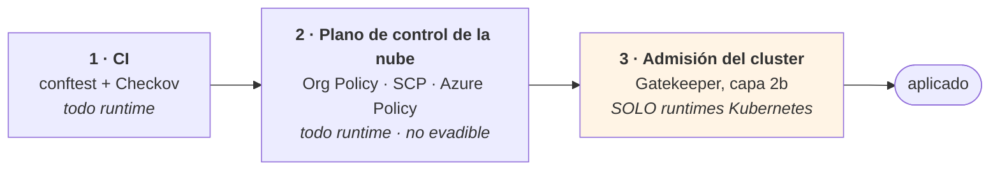

El tercer punto no existe en Cloud Run, ECS Fargate ni Container Apps — la capability `policy` vive solo donde vive `cluster`. La paridad de runtime no es alcanzable aquí, y la brecha queda escrita en lugar de asumida como resuelta.

El resolver **computa**; OPA **afirma**. No deben implementar la misma regla dos veces: el resolver posee la clausura, la asignación y el ordenamiento; OPA valida que lo que el resolver y los generadores produjeron es legal.

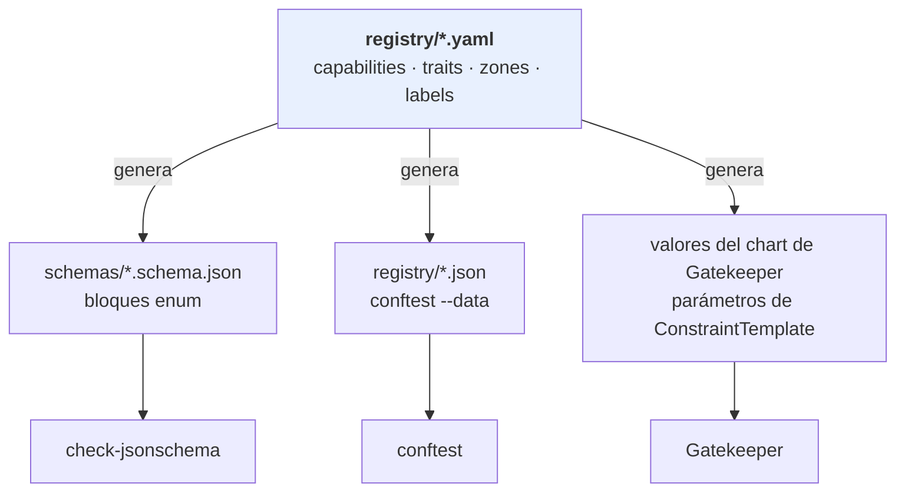

Una fuente, tres artefactos generados, una puerta `registry-generate --check`. Sin ella divergen — y el modo de fallo es una label que el generador dejó de emitir mientras el `Constraint` de admisión aún la exige, lo que bloquea deployments legítimos en el peor momento posible.

Especificado en: architecture §13, companion §4.4.

---

## 13. Tres capas de barandillas

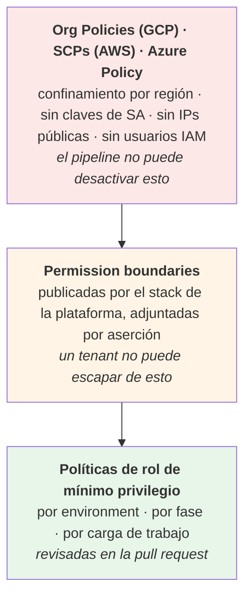

Especificado en: architecture §11.7.

---

## 14. Recursos de tenant en un operador compartido

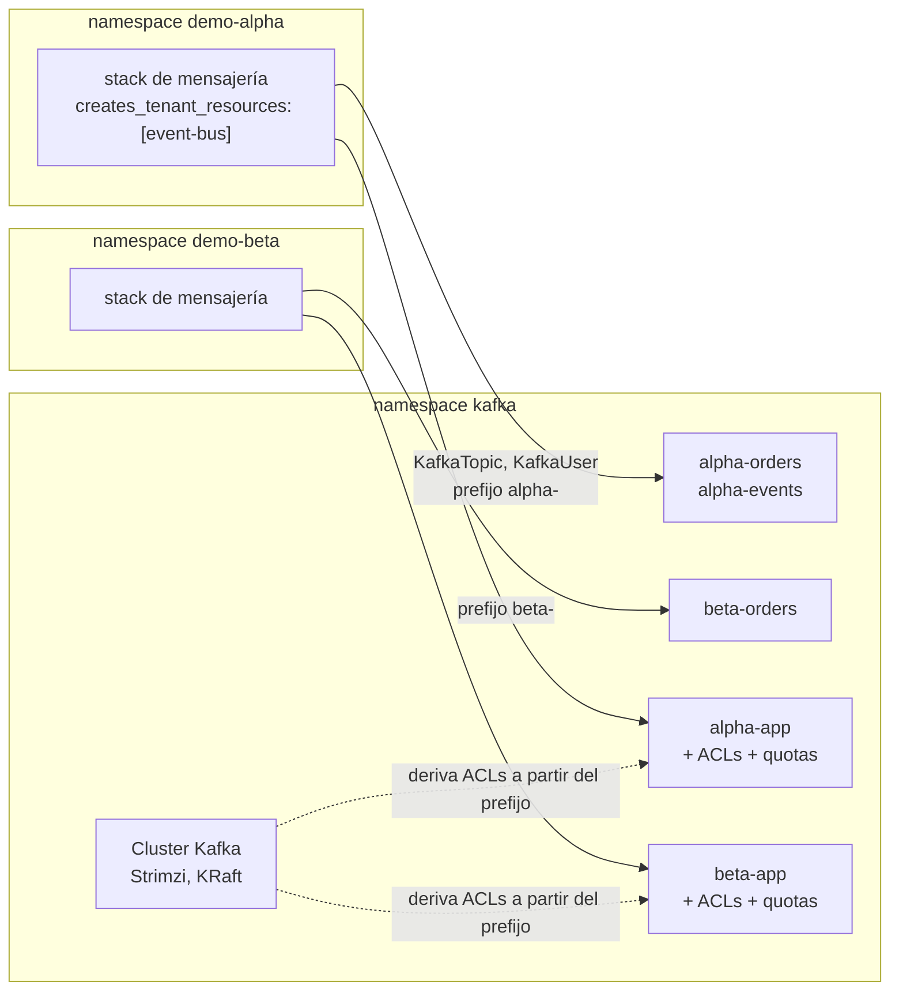

Tres reglas hacen esto seguro: prefijo obligatorio `{{ instance }}-`, ACLs **derivadas por el proveedor** en lugar de escritas por cada aplicación, y quotas de throughput de `KafkaUser` — porque ResourceQuota no limita bytes por segundo.

Especificado en: companion §10.

---

## 15. Catalog, demo y component

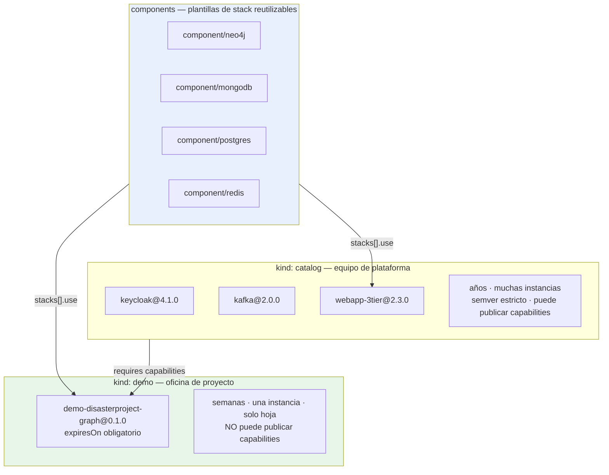

El catálogo de components es lo que hace viable la categoría demo: la oficina de proyecto escribe un stack a medida y un archivo de values, no infraestructura. Veinte minutos en lugar de un día.

Especificado en: companion §5.

---

## 16. Orden de lectura

```mermaid
flowchart LR
    S["Empezar aquí"] --> O["Esta visión general"]
    O --> A1["archetype-model §3 capas<br/>§4 capabilities y traits"]
    A1 --> A2["companion §5 anatomía<br/>§6 manifest"]
    A2 --> B1["architecture §3 arquitectura<br/>§4 referencia de elementos"]
    B1 --> B2["elegir UNA guía<br/>§5 GKE o §6 EKS"]
    B2 --> C1["architecture §11 identidad<br/>§12 environments"]
    C1 --> C2["companion §8 §9 pools<br/>§12 resolución"]
    C2 --> D1["architecture §13 policy<br/>§14 CI/CD"]
    D1 --> D2["risk-register.md<br/>primero los cinco principales"]
```

Leer una guía de runtime, no cinco. Son el mismo grafo con datos distintos en las aristas; §6.8 tabula las diferencias.
