# Seguridad del ciclo de vida del software y la IA en `qa` — DefectDojo, DAST y A.I.G

| | |
|---|---|
| **Estado** | Propuesta · revisión 1 |
| **Alcance** | Las cuatro fases de análisis que pide el ciclo de vida — código (SonarQube), dependencias (Trivy), infraestructura y contenedores (Checkov, Trivy), ejecución (OWASP ZAP, Nuclei, A.I.G) — y su consolidación en **DefectDojo**: dónde corre cada herramienta, cuándo bloquea, cómo llegan sus resultados a DefectDojo, y los tres arquetipos nuevos (`defectdojo`, `dast`, `aig`). Incluye la plantilla del workflow reutilizable de los repositorios de aplicación |
| **Por qué ahora** | SonarQube ya tiene propuesta y Checkov ya está en las puertas G1/G2 del pipeline de infraestructura, pero cada herramienta deja sus resultados en su sitio. Nadie ve el conjunto de una aplicación, ni lo que cambia entre dos versiones, ni qué se aceptó como riesgo |
| **Base** | `sonarqube-qa` (E1, E2) y su variante Cloud SQL; `keycloak-qa` §6 (clientes como tenant resources); `postgres-cloudsql-qa`; `edge-qa` §3 (Cloud Armor); `network-qa` (Cloud NAT, DW3); `gke-qa` §5 (pools `system` y `apps`, DN11); `gatekeeper-qa`; `cmdb-qa` (mitad observada); `infra-repo-qa` (workflows); `landing-zone-qa` §6 (copia de imágenes) |
| **Especificación de referencia** | `archetype-model.md` (AM §n), `terramate-outputs-sharing-architecture.md` (§n), `developer-guide.md` (DG §n) |
| **Diagramas** | `diagrams/*.mmd` (fuente Mermaid) y `diagrams/*.svg` (renderizados). El SVG se regenera desde el `.mmd`; no se edita a mano |
| **Identificadores propios** | Decisiones `DA1…`, riesgos candidatos `RA1…`, verificaciones `VA1…`, preguntas `QA1…` |

Fuente: [`diagrams/01-ciclo.mmd`](diagrams/01-ciclo.mmd)

No reabre ninguna decisión de `CLAUDE.md`. Al llevar el esquema pedido a `qa` aparecen seis cosas que el esquema no dice:

1. **Las herramientas no corren todas en el mismo sitio.** SonarQube (escáner), Trivy y Checkov corren en CI, en cada PR y en cada merge. En el cluster solo hay **dos servidores**: SonarQube, que ya existe, y DefectDojo, que es nuevo. ZAP y Nuclei son **jobs** programados en el cluster. A.I.G no puede ir al cluster (punto 3).
2. **No hay entorno `staging`: es `qa`.** Los nombres de entorno están normalizados (`CLAUDE.md`) y `qa` es el que replica producción. El DAST se lanza contra `qa` y **nunca contra `prod`**: un escaneo activo crea, modifica y borra datos.
3. **A.I.G no tiene autenticación y su agente pide `SYS_ADMIN` con seccomp desactivado** (`docker-compose.images.yml` del proyecto; el README advierte que no se publique en redes públicas). Ninguna de las dos cosas cabe en un cluster compartido con PSS `restricted`, y el agente además ejecuta código de terceros (MCP servers, skills). Va a una **VM aislada** en la VPC de `qa`, sin IP pública y accesible solo por IAP (§5).
4. **Un DAST que pasa por el borde público prueba Cloud Armor, no la aplicación.** Las reglas OWASP y `scannerdetection` bloquean a ZAP y Nuclei, y el límite por IP los frena. Hace falta una regla de Cloud Armor que deje pasar al escáner, y eso exige que su IP de salida sea fija (§4.2).
5. **DefectDojo con resultados de PR es ruido.** Cada PR produciría hallazgos que se cierran en el siguiente push. En DefectDojo solo entra lo que está en `main` y lo que encuentran los escaneos programados; los resultados de una PR se quedan en la PR, como puerta (DA6).
6. **Escanear la imagen al construirla no basta.** Una CVE publicada después del build no aparece en ningún escaneo de CI: la imagen ya no se reconstruye, se promueve (DG §5). Un escaneo nocturno de los **digests desplegados**, sacados de la CMDB, cierra ese hueco (§3.4).

---

## 0. Contexto

### 0.1 Las cuatro fases, en `qa`

| Fase | Herramienta | Qué encuentra | Dónde corre | Cuándo | ¿Bloquea? | A DefectDojo |
|---|---|---|---|---|---|---|
| Código | **SonarQube** (SAST) | Bugs, vulnerabilidades y *hotspots* en el código | Escáner en CI; servidor en el cluster (ya propuesto) | `push` a `main` (`sonarqube-qa` §4.11) | Quality gate | Parser **SonarQube API Import**: DefectDojo lee los issues del servidor por API, por proyecto |
| Dependencias | **Trivy** `fs` (SCA y secretos) | CVEs en librerías; secretos en el repositorio | CI | PR y `main` | PR: secretos siempre; CVEs `CRITICAL` con corrección disponible | **Trivy Scan** (JSON), solo desde `main` |
| Infra y contenedores | **Checkov** | Configuración insegura de OpenTofu, Dockerfile, Helm, workflows | CI (G1/G2 en `infra`; plantilla en las aplicaciones) | PR y `main` | En `infra`, la política de G1/G2; en aplicaciones, la lista `CHECKOV_BLOCKING_CHECKS` | **Checkov Scan** (JSON) |
| | **Trivy** `image` | CVEs del sistema operativo y de las librerías de la imagen | CI al construir; **nocturno sobre lo desplegado** | Build; cada noche | Build: `CRITICAL` con corrección | **Trivy Scan** |
| Ejecución (`qa`) | **OWASP ZAP** | Vulnerabilidades web y de API en ejecución (cabeceras, cookies, inyecciones, XSS…) | Jobs en el cluster, pool `apps` | Pasivo cada noche; activo bajo demanda | No: informa | **ZAP Scan** (XML) |
| | **Nuclei** | Exposiciones y CVEs conocidas por plantilla | Jobs en el cluster | Semanal | No | **Nuclei Scan** (JSONL) |
| | **A.I.G** (AI-Infra-Guard) | CVEs de componentes de IA, riesgos de MCP servers y skills, jailbreak de modelos | VM aislada (§5) | Bajo demanda del equipo de seguridad | No | **Generic Findings Import**, con un conversor (no hay parser de A.I.G) |
| Consolidación | **DefectDojo** | Deduplica, sigue el ciclo de vida de cada hallazgo, riesgos aceptados, SLA | Cluster, pool `apps` | Siempre | — | — |

Parsers comprobados en `dojo/tools/` del repositorio de DefectDojo el 2026-10-03: `sonarqube`, `trivy`, `checkov`, `zap`, `nuclei`, `generic`, `sarif`. Ninguno de A.I.G.

### 0.2 Versiones

| Herramienta | Versión | Licencia |
|---|---|---|
| DefectDojo | 3.3.300, chart `defectdojo` 1.9.54 | BSD-3-Clause |
| Trivy | 0.75.0 | Apache-2.0 |
| Checkov | 3.3.22 | Apache-2.0 |
| OWASP ZAP | 2.17.0 | Apache-2.0 |
| Nuclei | 3.11.1 (plantillas fijadas aparte) | MIT |
| A.I.G | 4.6.4 | Apache-2.0 |

Últimas versiones publicadas a 2026-10-03. Se fijan en `.mise.toml` (CLI) o por digest en `images/third-party.yaml` (imágenes, `landing-zone-qa` §6.2).

---

## 1. Dónde corre cada cosa (DA1)

Fuente: [`diagrams/02-despliegue.mmd`](diagrams/02-despliegue.mmd)

| Lugar | Qué | Por qué ahí |
|---|---|---|
| **CI** (GitHub Actions) | Escáner de SonarQube, Trivy `fs` e `image`, Checkov | El análisis estático necesita el código y la imagen recién construida, y su resultado es una puerta de la PR |
| **Cluster de `qa`, pool `apps`** | DefectDojo (`defectdojo`, capa 4); jobs de ZAP y Nuclei (`dast`, capa 5) | DefectDojo es un servicio con base de datos, SSO y API, como SonarQube. ZAP y Nuclei necesitan una IP de salida conocida (§4.2) y tiempo de ejecución largo |
| **VM aislada** en la VPC de `qa` | A.I.G, servidor y agente (`aig`, capa 5) | Sin autenticación y con un agente privilegiado que ejecuta código ajeno (§5) |
| **Programado en `infra`** | Trivy sobre los digests desplegados | La lista de digests sale de la CMDB (`cmdb-observed`), que vive en `infra` |

Ninguna herramienta corre en el pool `system`: son capa 4 y 5 (`gke-qa` DN11).

---

## 2. DefectDojo — arquetipo `defectdojo` (capa 4)

### 2.1 Por qué arquetipo y en qué capa

Lo consumen otros — los pipelines de todos los equipos y los arquetipos `dast` y `aig` — e impone un contrato multi-tenant: un *product type* por equipo, cuentas de importación por equipo, nadie escribe en los productos de otro. Por la regla de `CLAUDE.md` es un **arquetipo**, y como lo consumen arquetipos de capa 5 por outputs sharing, va en la **capa 4**, igual que `keycloak`. Provee una capacidad nueva, **`vuln-mgmt` 1.0.0** (DA9):

| Salida | Tipo | Para |
|---|---|---|
| `api_url` | Outputs sharing, de `app` | `dast`, `aig`, y la variable de organización `DEFECTDOJO_URL` |
| `importer_secret_ids` | Outputs sharing, de `tenants` | Mapa equipo → id del secreto de Secret Manager con el token de su cuenta de importación. Referencias, nunca valores (`CLAUDE.md`) |
| `internal_service` | Outputs sharing, de `app` | Los jobs de `dast` suben por el Service interno, sin pasar por el borde |

### 2.2 Instalación

Chart oficial `defectdojo` **1.9.54** (DefectDojo 3.3.300), envuelto en el chart del arquetipo como el resto (`CLAUDE.md`, "Avoid `kubernetes_manifest`"). Imágenes `defectdojo/defectdojo-django` y `defectdojo/defectdojo-nginx` copiadas por digest al repositorio `third-party` (P2 de Gatekeeper).

| Valor del chart | En `qa` | Motivo |
|---|---|---|
| `postgresql.enabled` | `false` | La base de datos es la del proveedor global de `database-platform` (§2.3) |
| `cloudsql.enabled` | `false` | El bloque del chart usa el proxy v1 (`gce-proxy` 1.38, en `gcr.io`). La plataforma usa el **Cloud SQL Auth Proxy v2** como sidecar nativo, igual que SonarQube y Keycloak (variante Cloud SQL), añadido por `extraInitContainers` en uwsgi, celery y el initializer |
| `valkey.enabled` | `true`, sin persistencia | Componente (§2.3, DA4) |
| `django.replicas` / HPA | 2–3 | Disponibilidad durante un upgrade del pool `apps` |
| `celery.worker` | 2 réplicas; `DD_ASYNC_FINDING_IMPORT=True` | Las importaciones grandes no bloquean la petición HTTP (§2.6) |
| `django.mediaPersistentVolume` | Bucket de GCS por el CSI de Cloud Storage FUSE (§2.4) | uwsgi y celery leen los mismos ficheros |
| `createSecret` y equivalentes | `false` | Los secretos los materializa ESO desde Secret Manager (`secrets`, trait `eso`) |
| `host`, `siteUrl` | `dojo.<public_id>.disasterproject.com` | Nombre público sin el nombre del entorno (`CLAUDE.md`) |
| `securityContext` | `runAsNonRoot`, `drop: [ALL]`, `seccompProfile: RuntimeDefault`; `readOnlyRootFilesystem` **por verificar (VA1)** | PSS `restricted`; si una imagen escribe fuera de los volúmenes, excepción por nombre a P3 (`gatekeeper-qa` §5.1), nunca para todo el namespace |

### 2.3 Datos

| Pieza | Diseño |
|---|---|
| PostgreSQL | Cloud SQL, el proveedor global de `database-platform` en `qa` (`CLAUDE.md`), camino `data`: instancia propia `qa-defectdojo`, `db-custom-2-7680`, `ZONAL`, backups automáticos con PITR de 7 días. El camino `data-tenant` (CloudNativePG) se mantiene para entornos que enlacen `postgres-operator`, como en SonarQube |
| Valkey | Broker de Celery y caché. **Componente** dentro del arquetipo: sin persistencia, una réplica. Perderlo reintenta tareas en curso; no pierde hallazgos, que están en PostgreSQL (DA4) |

**Por qué no Memorystore para Valkey.** "Gestionado primero" (`CLAUDE.md`) aplica donde el servicio es equivalente y la plataforma lo ofrece: la capacidad `cache` existe en el registro, pero ningún proveedor está propuesto. Valkey aquí es un broker efímero sin datos de los que depender. Cuando haya un proveedor de `cache`, DefectDojo lo consume y el componente desaparece.

### 2.4 Ficheros subidos (DA5)

DefectDojo guarda en `media` los informes que recibe y los adjuntos de los hallazgos. Con la importación asíncrona, uwsgi recibe el fichero y un worker de Celery lo procesa: **los dos pods necesitan el mismo volumen**, `ReadWriteMany`.

| Opción | Cómo | Coste |
|---|---|---|
| **A. Bucket por el CSI de Cloud Storage FUSE** (recomendada) | Bucket `disasterproject-<public_id>-defectdojo-media`, regional, *soft delete* de 7 días; montado en uwsgi y celery con el driver de GKE; acceso por Workload Identity del KSA `qa-defectdojo` | Activar el addon `GcsFuseCsiDriver` en `gke` (un cambio de `gke-qa` §4). El sidecar de FUSE lo inyecta GKE: hay que comprobar que pasa PSS `restricted` **(VA3)** |
| B. Filestore | NFS gestionado, RWX | El nivel mínimo es de 1 TiB para guardar unos pocos GiB |
| C. Un solo pod con disco RWO | uwsgi y celery en el mismo pod | Sin réplicas: el upgrade del pool corta DefectDojo y las importaciones |

### 2.5 Identidad y acceso

| Quién | Cómo |
|---|---|
| Personas | SSO con Keycloak, realm `disasterproject`, cliente OIDC confidencial `defectdojo` declarado como tenant resource (`keycloak-qa` §6.1, ConfigMap `client-defectdojo-main`). Secreto del cliente en Secret Manager, leído por ESO. El acceso de Keycloak a DefectDojo pasa por el Service interno, no por el borde |
| Grupos → permisos | Un reconciliador del arquetipo lee `teams.yaml` (la misma fuente que los grupos de SonarQube) y aplica por API: un *product type* por equipo, sus miembros con rol **Reader** y los responsables del equipo con **Owner**. Si DefectDojo 3.3 sincroniza grupos desde el claim OIDC, el reconciliador se limita a crear los *product types* **(VA2)** |
| Pipelines | Una cuenta de servicio por equipo, `importer-<equipo>`, con rol **Writer** solo en el *product type* de su equipo. Su token API v2 se guarda en Secret Manager y se publica como secreto `DEFECTDOJO_TOKEN` en los repositorios del equipo, por el mismo mecanismo que `SONAR_TOKEN` (`sonarqube-qa` D9). Los tokens de DefectDojo no caducan: el reconciliador los rota cada 90 días (RA8) |
| `dast` y `aig` | Su propia cuenta `importer-platform-dast` e `importer-platform-aig`, Writer en los *product types* de los equipos cuyas aplicaciones escanean, nada más |
| Administración | Un administrador local con contraseña en Secret Manager, solo para romper el cristal; el uso diario es por SSO |

### 2.6 Modelo de datos e importación (DA6)

| Concepto de DefectDojo | Qué es en la plataforma |
|---|---|
| *Product type* | Un equipo de `teams.yaml` |
| *Product* | Una aplicación (repositorio, DG §1) o un producto de plataforma (`infra`, `platform-images`) |
| *Engagement* | Uno continuo por producto: `ci-main` para CI, `dast-qa` para ejecución, `deployed-qa` y `deployed-prod` para las imágenes desplegadas |
| *Test* | Uno por herramienta y título estable (`trivy-fs`, `trivy-image`, `checkov`, `zap-baseline`, `nuclei`…). `reimport-scan` sobre el mismo test **cierra lo que ya no aparece** (`close_old_findings`): el estado de DefectDojo es el de la última ejecución, no la suma de todas |

Solo importa lo que está en `main`, las ejecuciones programadas y las lanzadas a mano desde `main`. La acción `defectdojo-upload` lo comprueba y no sube nada en otro caso: una PR puede fallar su puerta, pero no ensucia DefectDojo.

La importación es asíncrona. La petición de `reimport-scan` termina cuando el fichero está en `media`; un informe de 50 MB pasa por Cloud Armor, el GLB, Envoy y el nginx de DefectDojo **(VA4)**.

### 2.7 Publicación

| Pieza | Valor |
|---|---|
| Hostname | `dojo.<public_id>.disasterproject.com`, bajo el wildcard del entorno (`edge-qa`) |
| `HTTPRoute` | **Sin `SecurityPolicy`**: la API la usan pipelines con token, y la interfaz tiene su propio SSO. Igual que SonarQube |
| Cloud Armor | Exclusión de campos en `POST /api/v2/reimport-scan/` y `/api/v2/import-scan/`: un informe JSON de Trivy o un XML de ZAP contiene cargas de ataque **como texto** (las de los hallazgos) y dispara las reglas `sqli` y `xss`. Igual que `/api/ce/submit` de SonarQube (`edge-qa` §3.2): se excluye el campo `file` en esas rutas, nunca las reglas para todo el entorno |
| Timeouts | `timeouts.request: 120s` en la `HTTPRoute`; con importación asíncrona sobra |

### 2.8 Recursos

| Pod | Réplicas | `requests` | Límite de memoria |
|---|---|---|---|
| uwsgi (+ nginx en el mismo pod) | 2 | 500m / 1 GiB + 100m / 128 MiB | 1 GiB + 256 MiB |
| celery worker | 2 | 500m / 1 GiB | 2 GiB |
| celery beat | 1 | 100m / 256 MiB | 256 MiB |
| valkey | 1 | 100m / 256 MiB | 512 MiB |
| Auth Proxy (sidecar) | en cada pod con base de datos | 50m / 64 MiB | 128 MiB |

`capacity`: 3000 m de CPU y 6144 MiB, ya sumados en el pool `apps` (`gke-qa` §5.2). Sin límite de CPU (DG §8.3).

### 2.9 Observabilidad y copias

| Señal | Cómo |
|---|---|
| Disponibilidad | Sonda de Blackbox a `/login` por el borde (monitorización) |
| Cola de Celery | Longitud de la cola en Valkey por el exporter de Redis; alerta si crece durante 30 min: las importaciones no se procesan |
| Importaciones fallidas | Las acciones de CI fallan con `--fail-with-body`; un fallo de importación es un job rojo, no un silencio |
| Copias | Backups de Cloud SQL con PITR; *soft delete* del bucket de `media`. Todo lo demás se reconstruye: los hallazgos se vuelven a importar desde la siguiente ejecución |

---

## 3. Integración en CI

### 3.1 Workflow reutilizable de las aplicaciones

Un workflow central, `disasterproject/ci-workflows/.github/workflows/appsec.yml`, llamado desde cada repositorio de aplicación, igual que el de SonarQube (`sonarqube-qa` §4.11: 200 copias de un workflow divergen). Plantilla: [`templates/workflows/appsec.yml`](templates/workflows/appsec.yml), con la acción [`templates/actions/defectdojo-upload/action.yml`](templates/actions/defectdojo-upload/action.yml).

| Job | Herramienta | Puerta en PR | En `main` |
|---|---|---|---|
| `dependencies` | `trivy fs --scanners vuln,secret` | Cualquier secreto; CVE `CRITICAL` con versión corregida | Además, sube a DefectDojo (`trivy-fs`) |
| `iac` | Checkov sobre Dockerfile, Helm, Kubernetes y workflows | Solo los checks de `CHECKOV_BLOCKING_CHECKS` (variable de organización) | Sube todo (`checkov`) |
| `image` | `trivy image` sobre el digest recién construido | CVE `CRITICAL` con versión corregida | Sube (`trivy-image`) |

Las puertas leen el JSON con `jq` en lugar de repetir el escaneo con otras opciones. Comprobado con Trivy 0.75.0 el 2026-10-03: `.Results[].Vulnerabilities[]` con `Severity` y `FixedVersion`, `.Results[].Secrets[]` con un token de GitHub de prueba (las claves de ejemplo de AWS no cuentan: Trivy las ignora). La subida corre aunque la puerta falle (`if: !cancelled()`): un hallazgo bloqueante también tiene que estar en DefectDojo.

Validación de las plantillas: `actionlint` 1.7 con `shellcheck` 0.11 y el JSON Schema de GitHub, sin errores. No se han ejecutado en GitHub.

### 3.2 El repositorio `infra`

Checkov ya corre en `preview` como G1 (estático) y G2 (sobre el plan) (arquitectura §14.1). Lo que falta es la subida, y no va en ninguno de los dos workflows existentes: `preview` es de PR, que no se importan (DA6), y `deploy` mezclaría el token de DefectDojo con las identidades de apply. Un workflow programado nuevo, `appsec-infra.yml`, ejecuta cada noche Checkov sobre `main` y sube al producto `infra`, engagement `ci-main`. Es una línea más en la tabla de workflows de `infra-repo-qa` §5.

### 3.3 Base de datos de Trivy

Trivy descarga su base de datos de vulnerabilidades en cada ejecución. Con 200 repositorios y varios jobs por PR, eso son miles de descargas al día desde un registro externo, y un límite de peticiones rompe todas las PR a la vez. El workflow `image-mirror` de `infra` copia cada 6 horas `trivy-db` y `trivy-java-db` al repositorio `third-party` con `oras`, y los jobs usan `TRIVY_DB_REPOSITORY` y `TRIVY_JAVA_DB_REPOSITORY` **(VA8)**. Si la copia falla, los escaneos siguen con una base vieja sin avisar: un paso falla si la base tiene más de 48 horas (RA7).

### 3.4 Escaneo nocturno de lo desplegado

Un workflow programado en `infra`, `appsec-deployed.yml`, lee de la rama `cmdb-observed` los digests desplegados en `qa` y `prod`, y ejecuta `trivy image` sobre cada uno con la identidad de solo lectura `image-scan@`. Sube a los engagements `deployed-qa` y `deployed-prod` de cada producto. Es lo que encuentra una CVE publicada después del build en una imagen que ya está en producción.

---

## 4. DAST — arquetipo `dast` (capa 5)

### 4.1 Qué se escanea

Los objetivos **no se escriben a mano**: salen de la resolución. Cada instancia que reclama un hostname en `qa` (claims de `ingress`) es un objetivo de ZAP y de Nuclei, con su *product* de DefectDojo. Una instancia puede declarar una especificación OpenAPI para el escaneo de API, o excluirse con un motivo y una fecha de revisión. Las dos cosas necesitan un bloque nuevo en el manifiesto, `security.dast`, que se añade desde el registro, nunca a mano en el schema (`CLAUDE.md`; pendiente con DA9).

| Escaneo | Herramienta | Frecuencia | Agresividad |
|---|---|---|---|
| Línea base | `zap-baseline.py` (pasivo: arañar y observar) | Cada noche, todos los objetivos | No modifica nada |
| API | `zap-api-scan.py` con la especificación OpenAPI | Cada noche, objetivos con OpenAPI | Activo sobre la API: crea y borra recursos de prueba |
| Plantillas | Nuclei, severidad `medium` o mayor, sin las etiquetas `dos`, `fuzz` ni `intrusive` | Semanal | Bajo |
| Completo | `zap-full-scan.py` | **Solo bajo demanda**, por instancia que lo active (`security.dast.active: true`), con aprobación | Activo en todo: puede corromper datos de `qa` (RA5) |

Las plantillas de Nuclei van horneadas en una imagen propia con versión fija (`platform/nuclei:<versión>-templates-<versión>`), construida en CI. En ejecución, `-duc` desactiva la actualización: el escaneo de esta semana y el de la anterior usan las mismas plantillas, y un cambio de plantillas es un PR.

### 4.2 Por dónde pasa el escaneo (DA7)

| Opción | Cómo | Qué prueba | Coste |
|---|---|---|---|
| **A. Por el borde público, con Cloud Armor permitiéndolo** (recomendada) | Los jobs salen por el Cloud NAT de `qa` hacia `https://<app>.<public_id>.disasterproject.com`. Una regla de Cloud Armor de prioridad 800 (antes de las exclusiones y de OWASP) permite las IPs de salida de `qa` | La aplicación tal como la ve un usuario: TLS del GLB, cabeceras, cookies `Secure`, HSTS, redirecciones de Envoy | El NAT de `qa` pasa de `AUTO_ONLY` a `MANUAL_ONLY` con 2 IPs reservadas (cambio a `network-qa` DW3, que ya lo preveía "si un tercero filtra por IP") |
| B. Directo a Envoy dentro del cluster | El job habla con el Service de Envoy por HTTP con la cabecera `Host` | La aplicación, sin TLS ni lo que añade el GLB | ZAP y Nuclei construyen las URLs desde el hostname; reescribir `Host` en cada uno es frágil, y se pierden justo los hallazgos de TLS y cabeceras |
| C. Por el borde sin excepción | — | Cloud Armor | `scannerdetection` bloquea a ZAP: el escaneo mide el WAF |

**Lo que A concede.** Con `MANUAL_ONLY`, **todo** el tráfico de salida de `qa` usa esas 2 IPs, así que cualquier pod de `qa` salta el WAF hacia los hostnames de `qa`. Se acepta en `qa`: ya está dentro. La regla se limita a los hostnames del propio entorno y **nunca existe en `prod`** (RA4). Dos IPs: el NAT da 64 512 puertos por IP, y con la asignación dinámica de 256–8192 puertos por nodo (DW3), 15 nodos pueden pedir hasta 122 880.

### 4.3 Ejecución

| Pieza | Diseño |
|---|---|
| Namespace | `dast`, PSS `restricted`, sin Workload Identity: no necesita GCP |
| CronJobs | Uno por tipo de escaneo y objetivo, generados desde la resolución. `concurrencyPolicy: Forbid`; como mucho 2 a la vez en el namespace (`ResourceQuota`) |
| Contenedores | Escaneo en un init container que escribe el informe en un `emptyDir`; el contenedor principal lo sube a DefectDojo por el Service interno (`internal_service` de `vuln-mgmt`) con el token de `importer-platform-dast`, leído por ESO |
| ZAP | `ghcr.io/zaproxy/zaproxy:stable` 2.17.0 por digest; usuario `zap` (uid 1000), `HOME` en un `emptyDir`; JVM con `-Xmx2g`, `requests` 1 CPU / 3 GiB |
| `NetworkPolicy` | Salida solo a internet (el borde de `qa`, por NAT) y al Service de DefectDojo; nada hacia otros namespaces |
| Bajo demanda | Workflow `dast-active.yml` en `infra`, `workflow_dispatch` con la instancia, Environment `qa-dast` con revisores: crea el Job desde el CronJob de `zap-full-scan` |

### 4.4 Escaneo autenticado (QA1, abierta)

ZAP sin sesión solo ve la pantalla de login de una aplicación protegida por la `SecurityPolicy` OIDC de Envoy. Para entrar necesita un usuario. Keycloak no lo resuelve solo: los usuarios vienen de Entra ID y las cuentas de servicio de los clientes están prohibidas (`keycloak-qa` §6.2, `serviceAccountsEnabled: false`, por escalada de privilegios). La salida es un **usuario de prueba de Entra por aplicación**, solo con roles de `qa`, cuya contraseña guarda Secret Manager y que ZAP usa con su autenticación por navegador. Depende del equipo de identidad, como Q10 de SonarQube. Mientras tanto, el escaneo autenticado cubre solo APIs que acepten un JWT que el propio job pueda obtener.

---

## 5. A.I.G — arquetipo `aig` (capa 5)

### 5.1 Qué aporta

| Módulo | Para qué en `qa` |
|---|---|
| Escaneo de infraestructura de IA | CVEs conocidas (más de 2000 reglas, más de 100 componentes: vLLM, Ollama, ComfyUI, n8n…) en los servicios de IA desplegados |
| MCP servers y skills de agentes | 14 categorías de riesgo, sobre el código fuente o una URL |
| Agent Scan | Flujos de agentes (Dify, Coze y otros) |
| Evaluación de jailbreak | Robustez de un modelo ante conjuntos de ataques; necesita la URL y la clave del modelo objetivo |

Es una herramienta del **equipo de seguridad**, bajo demanda: no hay un escaneo de A.I.G por PR.

### 5.2 Por qué una VM y no el cluster (DA8)

| Hecho (repositorio de A.I.G, 2026-10-03) | Consecuencia |
|---|---|
| "Currently lacks an authentication mechanism and should not be deployed on public networks" | Ni `HTTPRoute` pública ni `SecurityPolicy`: no se publica por el borde |
| El agente se ejecuta con `cap_add: SYS_ADMIN`, `seccomp:unconfined` y `shm_size: 2gb` | Incompatible con PSS `restricted`. Una excepción por nombre pondría un contenedor con `SYS_ADMIN` en un nodo de `apps`, junto a SonarQube y Keycloak |
| El agente analiza MCP servers y skills, y en modo dinámico los ejecuta | Código de terceros, sin revisar, con privilegios |
| Servidor con SQLite (`DB_PATH=/app/db/tasks.db`) | Una réplica, disco propio |

Un tercer node pool con GKE Sandbox (gVisor) lo aislaría dentro del cluster, pero contradice los dos pools (`gke-qa` DN11) para una herramienta que se usa a ratos. **Si VA5 demuestra que el agente funciona sin `SYS_ADMIN`**, el servidor podría ir al cluster; el agente seguiría fuera, porque ejecuta código ajeno.

### 5.3 La VM

| Pieza | Valor |
|---|---|
| Máquina | `e2-standard-4` (4 vCPU, 16 GB): el proyecto pide 4 GB, y el agente lanza un navegador sin interfaz |
| SO | Container-Optimized OS, Shielded VM, sin IP pública (org policies de la landing zone) |
| Contenedores | `zhuquelab/aig-server` y `zhuquelab/aig-agent` 4.6.4, por digest desde `third-party` (el proyecto publica `latest`); dos unidades de systemd, sin docker-compose |
| Disco | 50 GiB `pd-balanced` para `db/`, `uploads/` y `logs/`; *snapshot* diario, 7 días |
| Subred | `/28` propia en la VPC de `qa`, reclamada por el arquetipo en el ledger del entorno (AM §9.5: quien reclama, crea y escribe el firewall) |
| Firewall | Entrada: solo el rango de IAP (`35.235.240.0/20`) a 8088 y 22. Salida: internet por NAT. **Nada** hacia el cluster ni hacia la subred de nodos |
| Acceso | Túnel TCP de IAP al puerto 8088 para el grupo `appsec-redteam@`, con `iap.tunnelResourceAccessor` solo sobre esta VM. Cada sesión queda en el log de auditoría |
| SA de la VM | `qa-aig-vm@`: lector del token `importer-platform-aig` en Secret Manager y lector de `third-party`. Nada más |
| Claves de modelos | Las introduce el equipo en la interfaz de A.I.G y quedan en su SQLite, en el disco de la VM. Se usan claves de **proyectos de prueba** de cada proveedor, con límite de gasto, nunca las de producción (RA9) |

### 5.4 Resultados a DefectDojo

DefectDojo no tiene parser de A.I.G. Un temporizador en la VM consulta la API de A.I.G (`GET` de resultados de tareas terminadas), convierte cada hallazgo al formato **Generic Findings Import** (título, severidad, descripción, componente, CVE si la hay, referencias) y lo sube al *product* del servicio escaneado, engagement `ai-redteam`. El conversor es pequeño y vive en `platform-tools` con sus tests **(VA7)**. Los resultados de jailbreak no son vulnerabilidades de un componente: van como un único hallazgo por modelo y conjunto de datos, con la tasa de éxito del ataque, para que el riesgo se acepte o se mitigue en DefectDojo como cualquier otro.

---

## 6. El arquetipo y los stacks

| Arquetipo | Capa | `requires` | `provides` | Stacks |
|---|---|---|---|---|
| `defectdojo` | 4 | `cluster`, `policy`, `ingress` (`http-route`), `secrets` (`eso`), `monitoring`, `database-platform`, `oidc-idp` | `vuln-mgmt` 1.0.0 | `iam` (KSA `qa-defectdojo`, bucket de `media`), `secrets`, `data` / `data-tenant`, `app`, `tenants` (reconciliador: equipos, cuentas, tokens), `frontdoor`, `observability` |
| `dast` | 5 | `cluster`, `policy`, `secrets` (`eso`), `vuln-mgmt` | — | `secrets`, `jobs` (CronJobs generados de la resolución) |
| `aig` | 5 | `network`, `vuln-mgmt` | — | `subnet` (claim y firewall), `vm`, `iam` |

| Entrada por sharing | Productor | Consumidores | Mock |
|---|---|---|---|
| `api_url` | `gcp-qa-defectdojo-app` | `dast-jobs`, `aig-vm` | `https://mock-dojo.example.invalid` |
| `internal_service` | `gcp-qa-defectdojo-app` | `dast-jobs` | `mock-defectdojo.mock.svc` |
| `importer_secret_ids` | `gcp-qa-defectdojo-tenants` | `dast-secrets`, `aig-iam` | `{ "platform-dast" = "mock-secret-dast", "platform-aig" = "mock-secret-aig" }` (mapa, como el real) |

Cada `input` con su `after = ["tag:vuln-mgmt"]` (`CLAUDE.md`: el `after` olvidado es R2).

---

## 7. Políticas

| Dónde | Regla |
|---|---|
| `assert` de `defectdojo` | `cloudsql.enabled == false` y `postgresql.enabled == false`: la base de datos es la de `database-platform`; `DD_ASYNC_FINDING_IMPORT` activo |
| `assert` de `dast` | Ningún objetivo fuera de los hostnames del entorno; `zap-full-scan` solo para instancias con `security.dast.active` |
| `assert` de `aig` | VM sin IP pública; regla de firewall de entrada solo desde `35.235.240.0/20` |
| G1 | El entorno `prod` no enlaza `dast`. La regla de Cloud Armor de prioridad 800 solo existe en entornos no productivos |
| G1 | Las listas de entornos de `DRIFT_ENVS`, `first-deploy` y `destroy` cubren también los de `dast-active` (`infra-repo-qa` RR4) |
| Gatekeeper | Sin reglas nuevas. P2 (registros por digest), P3 (raíz de solo lectura) y P11 (nadie de capa 4–5 en `system`) ya cubren DefectDojo, ZAP y Nuclei |

---

## 8. `prod` y `demos`

| | `qa` | `prod` | `demos` |
|---|---|---|---|
| DefectDojo | La única instancia, para todos los entornos (DA2) | No tiene: sus hallazgos van a la de `qa` (engagement `deployed-prod`) | No tiene |
| DAST | Sí | **Nunca** | Opcional, solo línea base, sin activo |
| A.I.G | La VM de §5 | No | No |
| Regla de Cloud Armor para el escáner | Sí | **Nunca** | Solo si se enlaza `dast` |

**DefectDojo en `qa` (DA2).** Es la misma decisión que con SonarQube: las herramientas de los equipos viven en `qa`. Pero DefectDojo guarda el **mapa de vulnerabilidades de producción** en un proyecto no productivo, donde la frontera entre entornos es de nombres y revisión, no de proyecto (`CLAUDE.md`, R54). Se acepta con SSO, permisos por equipo, sin acceso anónimo, auditoría y Cloud Armor. Cuando exista un entorno de herramientas compartidas, DefectDojo y SonarQube se mueven juntos.

---

## 9. Riesgos candidatos

| # | Riesgo | Probabilidad | Impacto | Mitigación |
|---|---|---|---|---|
| RA1 | **El mapa de vulnerabilidades de producción en un proyecto no productivo** | Media | Alta — un atacante en `qa` sabe por dónde entrar en `prod` | SSO y permisos por equipo; sin anónimos; auditoría; mover con SonarQube a un entorno de herramientas (DA2) |
| RA2 | **A.I.G publicado por error**: no tiene autenticación | Baja con la VM | Alta — cualquiera lanza escaneos o lee resultados | Sin IP pública ni ruta por el borde; firewall solo desde IAP; `assert` |
| RA3 | **Escape desde el agente de A.I.G**, privilegiado y ejecutando código ajeno | Media | Media — limitado a la VM | VM aislada; SA sin permisos útiles; sin red hacia el cluster |
| RA4 | **Cualquier pod de `qa` salta el WAF hacia `qa`** por la regla del escáner | Alta (es el diseño) | Baja en `qa` | La regla solo para los hostnames del entorno; nunca en `prod` (G1) |
| RA5 | **Un escaneo activo corrompe datos de `qa`** | Media | Media | Activo solo bajo demanda, por instancia que lo active, con aprobación |
| RA6 | **Ruido**: hallazgos duplicados o que nunca se cierran | Alta sin el modelo de §2.6 | Media — nadie mira DefectDojo | Un test por herramienta con título estable; `reimport-scan` con `close_old_findings`; solo `main` |
| RA7 | **Base de datos de Trivy obsoleta** sin aviso | Media | Alta — los escaneos pasan sin ver CVEs nuevas | Copia cada 6 horas; fallo si la base tiene más de 48 horas |
| RA8 | **Tokens de importación sin caducidad** filtrados | Media | Media — alguien escribe hallazgos falsos o cierra reales en los productos de un equipo | Una cuenta por equipo con Writer solo en su *product type*; rotación cada 90 días |
| RA9 | **Claves de modelos en el SQLite de A.I.G** | Media | Media — gasto o abuso de la cuenta del proveedor | Solo claves de proyectos de prueba, con límite de gasto |

---

## 10. Verificaciones

| # | Verificación | Resultado que la cierra |
|---|---|---|
| VA1 | DefectDojo 3.3.300 con PSS `restricted` y `readOnlyRootFilesystem` | Pods admitidos sin excepciones, o lista exacta de rutas que necesitan `emptyDir` |
| VA2 | SSO con Keycloak y grupos en DefectDojo | Un miembro de `team-<x>` entra y ve solo el *product type* de su equipo |
| VA3 | `media` por el CSI de Cloud Storage FUSE con PSS `restricted` | uwsgi recibe un informe, un worker de otro nodo lo procesa |
| VA4 | `reimport-scan` de un informe de 50 MB por Cloud Armor, GLB, Envoy y nginx | Importado sin 403 ni 413; la exclusión de `file` es suficiente |
| VA5 | Agente de A.I.G sin `SYS_ADMIN` ni `seccomp:unconfined` | Lista de módulos que dejan de funcionar |
| VA6 | Regla de Cloud Armor de prioridad 800 con las IPs del NAT | ZAP completa la línea base sin bloqueos; desde otra IP, `scannerdetection` sigue bloqueando |
| VA7 | Conversor de A.I.G a Generic Findings Import | Un escaneo de vLLM y uno de MCP aparecen como hallazgos con severidad y referencias |
| VA8 | Trivy con `TRIVY_DB_REPOSITORY` y `TRIVY_JAVA_DB_REPOSITORY` en Artifact Registry | Un escaneo sin acceso a registros externos encuentra las mismas CVEs |

Pregunta abierta **QA1**: usuarios de prueba de Entra para el DAST autenticado (§4.4), con el equipo de identidad.

---

## 11. Cambios a otros documentos

| Documento | Cambio | Estado |
|---|---|---|
| `gke-qa` §5.2 | Capacidad de `defectdojo` y `dast` en el pool `apps` | **Aplicado** (en la misma revisión que DN11) |
| `registry/capabilities.yaml` | Capacidad `vuln-mgmt` en la capa 4 | Propuesto (DA9) |
| Schema del manifiesto, desde el registro | Bloque `security.dast` (`openapi`, `active`, exclusión con motivo y fecha) | Propuesto (DA9) |
| `network-qa` DW3 | NAT de `qa` en `MANUAL_ONLY` con 2 IPs reservadas, claim `nat-egress` | Propuesto (DA7) |
| `edge-qa` §3 | Regla de prioridad 800: `allow` desde las IPs del NAT del entorno hacia sus hostnames; exclusiones del campo `file` en las rutas de importación de DefectDojo | Propuesto (DA7) |
| `gke-qa` §4 | Addon `GcsFuseCsiDriver` | Propuesto (DA5) |
| `infra-repo-qa` §5 | Workflows `appsec-infra.yml`, `appsec-deployed.yml` y `dast-active.yml`; Environment `qa-dast`; `image-mirror` copia también `trivy-db` y `trivy-java-db` | Propuesto |
| `landing-zone-qa` §6.2 | Imágenes de DefectDojo, ZAP, Nuclei y A.I.G en `images/third-party.yaml`; identidad `image-scan@` de solo lectura | Propuesto |

---

## 12. Decisiones

| # | Decisión | Estado | Recomendación | Alternativa |
|---|---|---|---|---|
| DA1 | Dónde corre cada herramienta | Propuesta | Análisis estático en CI; DefectDojo y DAST en el cluster (`apps`); A.I.G en una VM aislada | Todo en el cluster |
| DA2 | Dónde vive DefectDojo | Propuesta | En `qa`, una instancia para todos los entornos, como SonarQube | Un entorno de herramientas, aún inexistente |
| DA3 | Base de datos | Consecuencia | Proveedor global de `database-platform` (Cloud SQL en `qa`), con Auth Proxy v2 | PostgreSQL del chart |
| DA4 | Valkey | Propuesta | Componente en el cluster, sin persistencia | Memorystore cuando haya proveedor de `cache` |
| DA5 | Ficheros de `media` | Propuesta | Bucket por el CSI de Cloud Storage FUSE | Filestore; un pod con disco RWO |
| DA6 | Qué se importa | Propuesta | Solo `main`, programado y manual desde `main`; `reimport-scan` con `close_old_findings` | Todo, incluidas las PR |
| DA7 | Camino del DAST | Propuesta | Por el borde, con regla de Cloud Armor para 2 IPs de NAT reservadas | Directo a Envoy dentro del cluster |
| DA8 | A.I.G | Propuesta | VM aislada, sin IP pública, acceso por IAP | Excepción en el cluster; pool con GKE Sandbox |
| DA9 | Contrato | Propuesta | Capacidad nueva `vuln-mgmt` 1.0.0; bloque `security.dast` en el manifiesto | DefectDojo como aplicación sin contrato; objetivos de DAST a mano |

---

## 13. Plan de implementación

| Fase | Contenido | Criterio de salida | Estimación |
|---|---|---|---|
| **0 · Verificaciones** | VA1, VA3, VA5 en un efímero | Contexto de seguridad de DefectDojo y de `media` decidido; A.I.G confirmado fuera del cluster | 1 día |
| **1 · DefectDojo** | Arquetipo `defectdojo`, Cloud SQL, SSO, reconciliador de equipos; VA2, VA4 | Un equipo entra por SSO y una importación manual aparece en su producto | 3 días |
| **2 · CI** | `appsec.yml` y `defectdojo-upload` en `ci-workflows`; copia de la base de Trivy; `appsec-infra.yml`, `appsec-deployed.yml`; VA8 | Tres repositorios piloto suben en cada merge; el escaneo nocturno de lo desplegado funciona | 2 días |
| **3 · DAST** | NAT y regla de Cloud Armor (DA7); arquetipo `dast`; imagen de Nuclei; VA6 | Línea base nocturna de los tres pilotos en DefectDojo | 2 días |
| **4 · A.I.G** | Arquetipo `aig`, VM, IAP, conversor; VA7 | Un escaneo de un servicio de IA de `qa` aparece en DefectDojo | 2 días |

Diez días para una persona, sin contar QA1, que depende del equipo de identidad.
