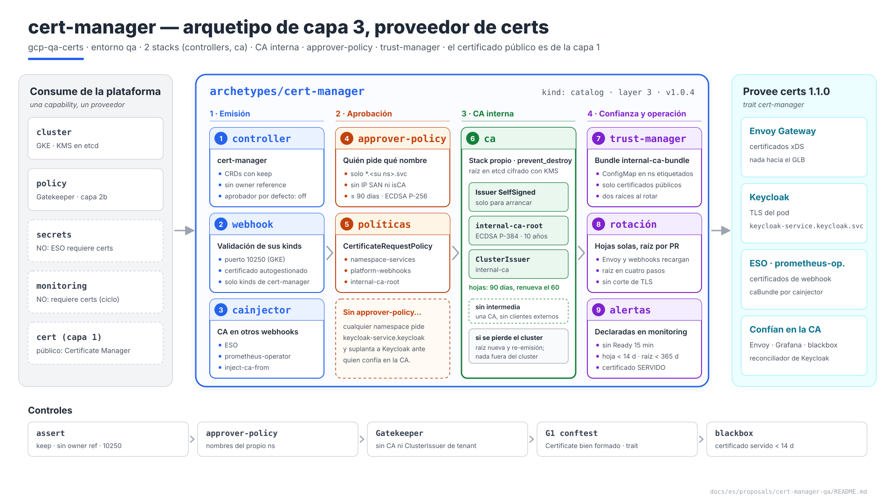
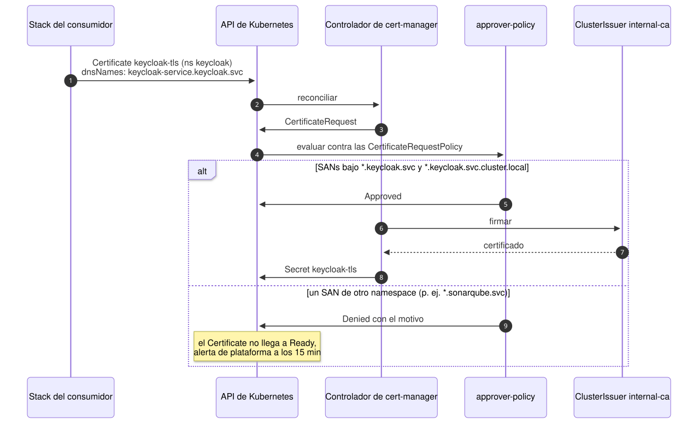

# cert-manager en `qa` — arquetipo `cert-manager` (capa 3), proveedor de `certs`

| | |
|---|---|
| **Estado** | Propuesta · revisión 2 |
| **Alcance** | El arquetipo de capa 3 `cert-manager` en `qa`: qué certificados emite y cuáles no, la CA interna, quién puede pedir qué nombre, cómo se reparte la confianza, renovación y rotación, red, contrato `certs`, stacks, políticas, ejecución y plan |
| **Por qué ahora** | ESO (§4.1), monitorización (§8.3), Keycloak (§4, §7, §8) y SonarQube (E1 §4.5) ya piden certificados al `ClusterIssuer` interno y confían en su CA, y cada uno lo daba por hecho |
| **Especificación de referencia** | `archetype-model.md` (AM §n), `terramate-outputs-sharing-architecture.md` (§n), `risk-register.md` |
| **Diagramas** | `diagrams/*.mmd` (fuente Mermaid) y `diagrams/*.svg` (renderizados). El SVG se regenera desde el `.mmd`; no se edita a mano. `diagrams/06-bloques-presentacion.svg` (1920×1080, para presentaciones) se genera con `06-bloques-presentacion.py`, no con Mermaid |
| **Identificadores propios** | Decisiones `DT1…`, riesgos candidatos `RT1…`, verificaciones `VT1…`. Los riesgos reciben número `R54+` en `risk-register.md` si se adopta, detrás de los de las propuestas anteriores |

Nada de este documento reabre decisiones de `CLAUDE.md` ni de E1 (sin ACME: el certificado público lo da Certificate Manager).



Fuente: [`diagrams/06-bloques-presentacion.py`](diagrams/06-bloques-presentacion.py) — vista de presentación; el detalle está en §2–§9.

---

## 0. Contexto

| Pregunta | Respuesta | Consecuencia |
|---|---|---|
| Qué es | Arquetipo `cert-manager`, `kind: catalog`, **capa 3**, provee **`certs` 1.1.0** con el trait nuevo **`cert-manager`** | El binding de `qa` ya lo enlaza: `certs: { archetype: cert-manager, version: 1.0.4, stack_id: gcp-qa-certs }` |
| Stacks | 2: `gcp-qa-certs-controllers` y `gcp-qa-certs-ca` en `stacks/platforms/gcp/qa/certs/` | La CA tiene un ciclo de vida distinto del de los controladores (§8.2) |
| Componentes | cert-manager (controlador, webhook, cainjector), **approver-policy**, **trust-manager** | Los dos últimos son del mismo proyecto que cert-manager |
| CA | Interna, autofirmada, en el cluster | §2 |
| Qué **no** hace | El certificado público del borde; ACME; el certificado del webhook de Gatekeeper | §1 |
| Modelo | `qa` dedicado | Sin budgets de `capacity` aplicados (E1 §0) |



Fuente: [`diagrams/01-contexto.mmd`](diagrams/01-contexto.mmd)

---

## 1. Qué certificados emite y cuáles no

| Certificado | Quién lo emite | Motivo |
|---|---|---|
| **Público** `*.qa.disasterproject.com` en el GLB | **Certificate Manager**, capability `cert` de la capa 1 (E1 §3.3) | Debe estar en el mismo proyecto que el balanceador; la validación es por DNS; nadie en el cluster lo toca |
| Backend que Envoy presenta al GLB | cert-manager | TLS en el tramo GLB → Envoy (E1 §4.5) |
| TLS del pod de Keycloak (`keycloak-service.keycloak.svc`) | cert-manager | Por el back-channel viajan tokens (Keycloak §4) |
| Webhooks de ESO y de prometheus-operator | cert-manager, con el CA inyectado por **cainjector** | ESO §4.1, monitorización §8.3 |
| Webhook de **Gatekeeper** | **Gatekeeper**, con su propio rotador | Gatekeeper está en la capa 2b, **antes** que cert-manager: no puede depender de él (AM §3) |
| Webhook del propio cert-manager | cert-manager, autogestionado | No puede pedirse un certificado a sí mismo antes de existir |
| Certificados de cara a internet emitidos por ACME | **Nadie** | Sin egress a internet; el borde ya tiene su certificado |

**Corrección a AM §14.2 (aplicada).** La tabla de proveedores por nube asignaba a `certs` "Certificate Manager / ACM / App Gateway certs". Eso describía la capability `cert` del borde, no `certs`: el propio AM enlaza `certs` a `cert-manager` en `demos` (AM §7). Las filas están ahora separadas: `cert` → Certificate Manager, ACM, App Gateway certs; `certs` → `cert-manager` en las tres nubes, como Kafka o Keycloak (§11).

**GLB → Envoy: cifrado, no autenticación.** El balanceador externo global cifra hacia el backend pero, salvo que se configure la autenticación de backend con un `TrustConfig`, no valida su certificado **(verificar, VT8)**. En `qa` se acepta así: el tramo va por la red de Google dentro de la VPC. Activar la validación ataría la raíz interna a un recurso de la capa 1, y cada rotación de raíz exigiría cambiar el borde (DT7).

---

## 2. La CA interna



Fuente: [`diagrams/02-cadena.mmd`](diagrams/02-cadena.mmd)

### 2.1 Opciones

| Opción | Veredicto |
|---|---|
| **A. Raíz autofirmada en el cluster** (`SelfSigned` → `Certificate` raíz → `ClusterIssuer` tipo CA) | **Sí** (DT1): nada fuera del cluster; la clave en un `Secret` cifrado en etcd con la clave KMS `gke-secrets` (E1 §4.14) |
| B. Certificate Authority Service de Google + `google-cas-issuer` | Para producción: clave en HSM, auditoría y revocación gestionadas. En `qa` añade coste mensual por CA y una dependencia más para un tráfico que no sale de la VPC |
| C. Raíz generada fuera y guardada en Secret Manager | La clave acaba igualmente en un `Secret` del cluster (ESO la materializa); solo sobrevive a la reconstrucción del cluster, y con la opción A basta con re-emitir (§2.3) |

### 2.2 Parámetros

| Ajuste | Valor | Motivo |
|---|---|---|
| Raíz | `internal-ca-root`, ECDSA P-384, **10 años**, `privateKey.rotationPolicy: Never` | Una rotación de raíz es un procedimiento (§5.2), no algo que deba pasar solo |
| Emisor | `ClusterIssuer` **`internal-ca`**, tipo CA sobre esa raíz | Salida del contrato (§7.1) |
| Hojas | ECDSA P-256, **90 días**, renovación a los **60**, `rotationPolicy: Always` | Clave nueva en cada renovación |
| Intermedia | No | Con una sola CA y sin clientes externos, una intermedia no aporta aislamiento y duplica la rotación |
| `enableCertificateOwnerRef` | **`false`** | El `Secret` de un certificado no tiene como propietario al `Certificate`: borrar el CRD no borra los `Secret` (la misma cascada que ESO RE1) |

### 2.3 Si se pierde el cluster

La raíz se pierde con él. Al recrear `gcp-qa-certs-ca` nace una raíz nueva; trust-manager reparte el bundle nuevo, todas las hojas se re-emiten y nadie fuera del cluster confía en la raíz vieja. Sin la validación del backend en el GLB (§1), la reconstrucción no toca nada fuera del cluster.

---

## 3. Quién puede pedir qué nombre



Fuente: [`diagrams/03-aprobacion.mmd`](diagrams/03-aprobacion.mmd)

Con un `ClusterIssuer` compartido y el aprobador por defecto de cert-manager, **cualquier namespace obtiene un certificado para cualquier nombre**: un consumidor podría pedir `keycloak-service.keycloak.svc` y, con cualquier forma de desviar tráfico dentro del cluster, suplantar a Keycloak ante Envoy y Grafana, que confían en la CA interna (RT1).

**approver-policy** sustituye al aprobador por defecto (se desactiva en el controlador) y solo aprueba lo que una `CertificateRequestPolicy` permite (DT2):

| Política | Quién | Qué permite |
|---|---|---|
| `namespace-services` | Cualquier namespace | `dnsNames` en `*.<su namespace>.svc` y `*.<su namespace>.svc.cluster.local`; sin IP SANs, sin URIs, sin `isCA`; ECDSA P-256; duración ≤ 90 días |
| `gateway-backend` | Solo el namespace del Gateway (`envoy-gateway-system`) | Además, el nombre que el GLB espera para el backend **(verificar el nombre que usa el GLB, VT8)** |
| `platform-webhooks` | Namespaces de ESO, monitorización y cert-manager | Los nombres de sus Services de webhook (ya cubiertos por `namespace-services`); se separa para poder endurecerla sin tocar al resto |
| `internal-ca-root` | Solo `cert-manager` | `isCA: true`, para la raíz (§2.2) |

Una solicitud que no encaja en ninguna queda **Denied** con el motivo; el `Certificate` no llega a `Ready` y salta la alerta de plataforma (§6).

**Por qué no bastaba Gatekeeper.** Un constraint sobre `Certificate` no ve los `CertificateRequest` creados directamente, que es lo que haría alguien que quiere saltárselo. approver-policy decide sobre la solicitud firmable, que es el único punto por el que pasa todo.

---

## 4. Cómo se reparte la confianza

Envoy (→ Keycloak), Grafana (→ Keycloak), el reconciliador de Keycloak y el módulo `http_2xx_internal_ca` del blackbox necesitan el certificado de la raíz. Si cada uno lo copia por su cuenta, la primera rotación los deja desconectados de uno en uno.

| Pieza | Diseño |
|---|---|
| `Bundle` de trust-manager | `internal-ca-bundle`: el certificado de la raíz vigente (y de la siguiente durante una rotación, §5.2) |
| Destino | `ConfigMap` `internal-ca-bundle`, clave `ca.crt`, en **cada namespace con la etiqueta** `trust.disasterproject.com/internal-ca: "true"` |
| Quién pone la etiqueta | El stack `iam` de cada consumidor, en su namespace |
| Uso | `BackendTLSPolicy` de Keycloak (`caCertificateRefs` a ese `ConfigMap`); volumen en Grafana, el blackbox y el reconciliador |
| Lo que no se reparte | Ninguna clave privada: trust-manager solo copia certificados públicos |

---

## 5. Renovación y rotación



Fuente: [`diagrams/05-rotacion.mmd`](diagrams/05-rotacion.mmd)

### 5.1 Hojas: automático, salvo quien no recarga

| Consumidor | ¿Recarga el certificado renovado? |
|---|---|
| Envoy | Sí, lo recibe por SDS desde Envoy Gateway |
| Webhooks de ESO, prometheus-operator, approver-policy, trust-manager | Sí, vigilan los ficheros **(verificar cada uno, VT5)** |
| Keycloak | Sí, recarga periódica de certificados en la versión 26 **(verificar la opción y su periodo, VT5)** |
| Cualquier consumidor que lea el certificado solo al arrancar | No: su procedimiento de renovación incluye un reinicio, y queda un mes de margen entre la renovación (día 60) y la caducidad (día 90) |

El riesgo no es que cert-manager no renueve, sino que alguien **siga sirviendo** el certificado viejo (RT3). Por eso se vigila también el certificado servido (§6).

### 5.2 Raíz: planificada

1. Nueva raíz `internal-ca-root-2`.
2. El `Bundle` incluye **las dos** raíces; trust-manager las reparte y todos confían en ambas.
3. El `ClusterIssuer` apunta a la nueva; se fuerza la re-emisión de todas las hojas.
4. Cuando ninguna hoja en uso esté firmada por la vieja, el `Bundle` se queda solo con la nueva.

Cada paso es un PR sobre `gcp-qa-certs-ca`. Con 10 años de vida, el caso realista no es la caducidad sino un compromiso de la clave; el procedimiento es el mismo, con el paso 4 el mismo día.

---

## 6. Observabilidad

Las reglas las declara el arquetipo de monitorización (monitorización §5.1): `monitoring` requiere `certs` para su webhook, así que `certs` no puede requerir `monitoring` (el mismo ciclo que ESO §9.1).

| Alerta | Señal | Umbral |
|---|---|---|
| Certificado sin `Ready` | `certmanager_certificate_ready_status` | > 15 min — casi siempre una solicitud denegada por approver-policy |
| Hoja a punto de caducar | `certmanager_certificate_expiration_timestamp_seconds` | < 14 días: la renovación del día 60 lleva dos semanas fallando (E1 §4.7) |
| Raíz a punto de caducar | Igual, para `internal-ca-root` | < 365 días |
| **Certificado servido** a punto de caducar | `probe_ssl_earliest_cert_expiry` del blackbox contra los endpoints internos (Keycloak, backend de Envoy) | < 14 días: detecta a quien no recargó aunque cert-manager sí renovara (RT3) |
| Solicitudes denegadas | Eventos de approver-policy | Cualquiera fuera de un despliegue |

---

## 7. El contrato `certs` 1.1.0

### 7.1 Salidas y trait

| Salida | Valor en `qa` | Uso |
|---|---|---|
| `namespace` | `cert-manager` | `NetworkPolicy` y RBAC |
| `cluster_issuer` | `internal-ca` | `issuerRef` de los `Certificate` y del webhook de ESO y de prometheus-operator |
| `ca_bundle_configmap` | `internal-ca-bundle` (clave `ca.crt`) | `BackendTLSPolicy`, volúmenes de confianza |
| `ca_bundle_label` | `trust.disasterproject.com/internal-ca: "true"` | Etiqueta del namespace para recibir el bundle |

Deterministas: salidas del contrato que los consumidores reciben como globals. Tres son nuevas respecto a la versión que ya consumen (`^1.0.0`), así que la versión del contrato sube a **1.1.0** (MINOR, AM §4.5).

**Trait `cert-manager`** (nuevo, en `registry/traits.yaml`): el proveedor de `certs` es cert-manager y existen sus CRDs y cainjector. ESO, monitorización y Keycloak lo exigen, igual que exigen `eso` o `prometheus-operator-crds`: un binding de `certs` a otra cosa falla en la resolución, no con un `Certificate` que nadie reconcilia.

### 7.2 Lo que escribe un consumidor

```yaml
apiVersion: cert-manager.io/v1
kind: Certificate
metadata: { name: keycloak-tls, namespace: keycloak }
spec:
  secretName: keycloak-tls
  issuerRef: { kind: ClusterIssuer, name: internal-ca }     # = salida cluster_issuer
  dnsNames:
    - keycloak-service.keycloak.svc
    - keycloak-service.keycloak.svc.cluster.local
  duration: 2160h                                          # 90 días
  renewBefore: 720h                                        # renueva el día 60
  privateKey: { algorithm: ECDSA, size: 256, rotationPolicy: Always }
```

| Regla | Por qué |
|---|---|
| Solo nombres del propio namespace | approver-policy (§3) |
| `duration` ≤ 90 días | Idem; limita el daño de una clave filtrada |
| Nada de `Issuer` propios de tipo CA para dar servicio a otros | Una CA de tenant no es de confianza para nadie; Gatekeeper lo impide (§9.2) |
| Namespace con la etiqueta del bundle si necesita confiar en la CA | §4 |

---

## 8. El arquetipo

### 8.1 Manifiesto

```yaml
# archetypes/cert-manager/manifest.yaml
apiVersion: archetype/v1
kind: Archetype

metadata:
  name: cert-manager
  version: 1.0.4
  layer: 3
  kind: catalog
  description: cert-manager con CA interna, approver-policy y trust-manager; certificados dentro del cluster
  owners: [team-platform]

runtimes: [gke, eks, aks]

requires:
  - capability: cluster
    version: "^2.0.0"
  - capability: policy
    version: "^1.0.0"

provides:
  - capability: certs
    version: 1.1.0
    traits: [cert-manager]
    outputs:
      - { name: namespace,           from: controllers }
      - { name: cluster_issuer,      from: ca }
      - { name: ca_bundle_configmap, from: ca }
      - { name: ca_bundle_label,     from: ca }

stacks:
  - name: controllers
  - name: ca
    after: [controllers]

capacity:
  cpu_millicores: 400
  memory_mib: 768
  pods: 8
  workload_identities: 0
```

La versión del arquetipo se queda en **1.0.4**, la que ya fija el binding de `qa` y de `demos`; lo que sube es la del contrato. `runtimes: [gke, eks, aks]`: nada de este arquetipo es de GCP. **Sin `secrets` ni `monitoring`**: los dos requieren `certs`.

### 8.2 Los stacks

| Stack | Contenido | Entradas por sharing |
|---|---|---|
| `controllers` | Namespace `cert-manager` (PSS `restricted`); `helm_release` de cert-manager (CRDs con `keep`, `enableCertificateOwnerRef: false`, aprobador por defecto desactivado, webhook en 10250), de approver-policy y de trust-manager; `NetworkPolicy` (§9.3) | `cluster_endpoint`, `cluster_ca` (gke) |
| `ca` | `Issuer` `SelfSigned`, `Certificate` raíz, `ClusterIssuer` `internal-ca`, `Bundle` `internal-ca-bundle`, las `CertificateRequestPolicy` de §3 y su RBAC; `prevent_destroy` sobre el `helm_release` | `cluster_*` |

**Por qué dos stacks.** Un upgrade de cert-manager es rutinario; tocar la raíz, no. En stacks separados, un PR de versión nunca planifica un cambio sobre la CA, y la destrucción de la CA exige un PR explícito que quite `prevent_destroy`.

---

## 9. Políticas y red

### 9.1 `assert` en generación

```hcl
assert {
  assertion = global.certmanager_values.crds.keep && !global.certmanager_values.enableCertificateOwnerRef
  message   = "certs: CRDs con keep y sin owner reference en los Secret — borrarlos no debe borrar certificados (RT4)"
}
assert {
  assertion = tm_contains(global.certmanager_values.disableControllers, "certificaterequests-approver")
  message   = "certs: el aprobador por defecto aprueba cualquier nombre; lo sustituye approver-policy (RT1)"
}
assert {
  assertion = global.certmanager_values.webhook.securePort == 10250
  message   = "certs: webhook en 10250; otro puerto necesita una regla de firewall hacia los nodos (RT5)"
}
```

### 9.2 Gatekeeper y conftest

| Regla | Dónde | Qué comprueba |
|---|---|---|
| **Nueva:** sin `ClusterIssuer` de tenants | Gatekeeper | Solo existen los `ClusterIssuer` de este arquetipo |
| **Nueva:** sin `Issuer` de tipo CA o `SelfSigned` fuera de `cert-manager` | Gatekeeper | Un tenant no monta su propia CA |
| **Nueva:** `Certificate` bien formado | G1 | `issuerRef` = `internal-ca`, `duration` ≤ 90 días, `dnsNames` del propio namespace (la misma regla que approver-policy, adelantada a la PR) |
| **Nueva:** trait | G1 | Un arquetipo cuyo chart contiene `Certificate` o la anotación `cert-manager.io/inject-ca-from` exige `certs` con el trait `cert-manager` |

### 9.3 Red



Fuente: [`diagrams/04-red.mmd`](diagrams/04-red.mmd)

| Origen | Destino | Puerto | Nota |
|---|---|---|---|
| Plano de control de GKE | Webhooks de cert-manager, approver-policy y trust-manager | **10250** | El puerto que GKE ya abre hacia nodos privados (como ESO §7 y monitorización §8.3) **(verificar el puerto por defecto de approver-policy y trust-manager, VT3)** |
| Prometheus | Controlador y componentes | 9402 y métricas | |
| Controlador, cainjector, approver-policy, trust-manager | API de Kubernetes | 443 | |
| Todos | kube-dns | 53 | |
| Todos | Internet | **Denegado** | Sin ACME |

---

## 10. Ejecución

| Qué | Cómo |
|---|---|
| Primer despliegue | Fase B de E1 §6: justo después de `gcp-qa-policy` y **antes** de ESO, monitorización, el Gateway y Keycloak, que le piden certificados. Criterio de salida: un `Certificate` de prueba del propio namespace en `Ready`, uno con un nombre ajeno en `Denied`, y el `ConfigMap` del bundle presente en un namespace etiquetado |
| Upgrade | Stack `controllers`; CRDs primero; ensayo en efímero |
| Rotación de la raíz | §5.2 |
| Destrucción | Se detiene en `prevent_destroy` de `ca`. Sin CA, ningún certificado se renueva: se desmonta en último lugar |

---

## 11. Cambios a otros documentos

| Documento | Cambio | Estado |
|---|---|---|
| `registry/traits.yaml` y el `enum` de `schemas/archetype-manifest.schema.json` | Trait `cert-manager`, en el mismo commit y de forma mecánica (R34) | **Aplicado** |
| Propuestas de ESO (§10.1), monitorización (§10.1) y Keycloak (§11.1) | `certs` pasa a exigir `traits: [cert-manager]` | **Aplicado** |
| AM §14.2 (`docs/en/` y `docs/es/`) | Separar `cert` (Certificate Manager, ACM, App Gateway certs) de `certs` (`cert-manager` en las tres nubes) | **Aplicado** |
| Consumidores (`iam` de Keycloak, monitorización y el Gateway) | Etiqueta `trust.disasterproject.com/internal-ca` en su namespace; uso de `internal-ca-bundle` | Propuesto, se recoge al implementar cada uno |

---

## 12. Decisiones

| # | Decisión | Estado | Recomendación | Alternativa |
|---|---|---|---|---|
| DT1 | CA | Propuesta | Raíz autofirmada en el cluster, 10 años, sin intermedia | Certificate Authority Service (producción) |
| DT2 | Aprobación | Propuesta | approver-policy; aprobador por defecto desactivado | Aprobador por defecto (cualquier nombre) |
| DT3 | Confianza | Propuesta | trust-manager con `ConfigMap` por namespace etiquetado | Cada consumidor copia la CA |
| DT4 | Hojas | Propuesta | ECDSA P-256, 90 días, renovación el día 60, clave nueva | 1 año; RSA |
| DT5 | Owner reference en `Secret` | Propuesta | Desactivada | Activada: el borrado del CRD arrastra los `Secret` |
| DT6 | Stacks | Propuesta | `controllers` y `ca` separados | Uno solo |
| DT7 | Validación del backend en el GLB | Propuesta | No en `qa` | `TrustConfig` con la raíz interna (ata la raíz a la capa 1) |
| DT8 | Gatekeeper | Consecuencia de AM §3 | Su propio rotador | — (capa 2b va antes) |
| DT9 | Trait `cert-manager` | Propuesta, aplicada al registro | Sí | Sin trait |

---

## 13. Riesgos candidatos

| # | Riesgo | Probabilidad | Impacto | Mitigación |
|---|---|---|---|---|
| RT1 | **Un namespace obtiene un certificado para un servicio de otro** y lo suplanta ante quien confía en la CA | Alta con el aprobador por defecto | Alta — robo de tokens del back-channel de Keycloak | approver-policy (§3); regla G1; VT1 |
| RT2 | **Pérdida o compromiso de la raíz** | Baja | Alta — todo el TLS interno a re-emitir | Procedimiento de §5.2; alerta a 365 días; reconstrucción documentada (§2.3) |
| RT3 | **Certificado renovado pero no recargado**: el consumidor sirve uno caducado | Media | Media — fallo de TLS en un tramo interno | Sonda del certificado servido (§6); VT5 |
| RT4 | **Borrado de los CRDs** arrastra los `Secret` | Baja | Alta | `keep`, sin owner reference, assert |
| RT5 | **Webhooks inalcanzables** desde el plano de control | Media si cambia el puerto | Media — ningún `Certificate` se aplica | 10250 con assert; VT3 |
| RT6 | **Orden de despliegue**: un consumidor aplica antes de que exista el `ClusterIssuer` | Media en el primer despliegue | Baja — reintenta solo | `after` a `gcp-qa-certs-ca` en los consumidores |

---

## 14. Verificaciones

| # | Verificación | Resultado que la cierra |
|---|---|---|
| VT1 | approver-policy con la política `namespace-services` | Un `Certificate` para `*.keycloak.svc` desde `sonarqube` queda `Denied`; el propio se aprueba |
| VT2 | trust-manager | El `ConfigMap` aparece en un namespace al etiquetarlo y desaparece al quitar la etiqueta; se actualiza al cambiar el `Bundle` |
| VT3 | Webhooks de cert-manager, approver-policy y trust-manager en 10250 | `apply` de cada uno de sus kinds sin timeout |
| VT4 | cainjector en los webhooks de ESO y prometheus-operator | `caBundle` inyectado y actualizado tras renovar |
| VT5 | Recarga de certificados en Envoy, Keycloak y cada webhook | Renovación forzada sin reinicio y sin errores de TLS |
| VT6 | Desinstalar los controladores en un entorno efímero | Los `Secret` de los certificados siguen existiendo |
| VT7 | Rotación de la raíz de §5.2 en un entorno efímero | Ningún corte de TLS en ninguno de los cuatro pasos |
| VT8 | GLB → Envoy con el certificado interno; nombre esperado; validación del backend | Health check en verde; confirmado que sin `TrustConfig` no valida |

---

## 15. Plan de implementación

| Fase | Contenido | Criterio de salida | Estimación |
|---|---|---|---|
| **0 · Prerrequisitos** | GKE y Gatekeeper de `qa`; VT3, VT8 | Verificaciones cerradas | Depende de la plataforma |
| **1 · Esqueleto** | Manifiesto, charts, asserts, reglas G1 y constraints | `archetypectl resolve --dry-run`, `terramate generate --check`, G1 y preview con mocks en verde | 1 día |
| **2 · Controladores** | `controllers` | cert-manager, approver-policy y trust-manager sanos; **VT6** | 1 día |
| **3 · CA** | `ca` | Criterio de §10; **VT1**, **VT2** | 1 día |
| **4 · Consumidores** | Webhooks de ESO y monitorización; Keycloak; Gateway | **VT4**, **VT5**; **VT7** en efímero | Con cada consumidor |

Tres días para una persona, más la verificación con cada consumidor. Es lo primero de la capa 3: ESO, monitorización, el Gateway y Keycloak le piden certificados.
