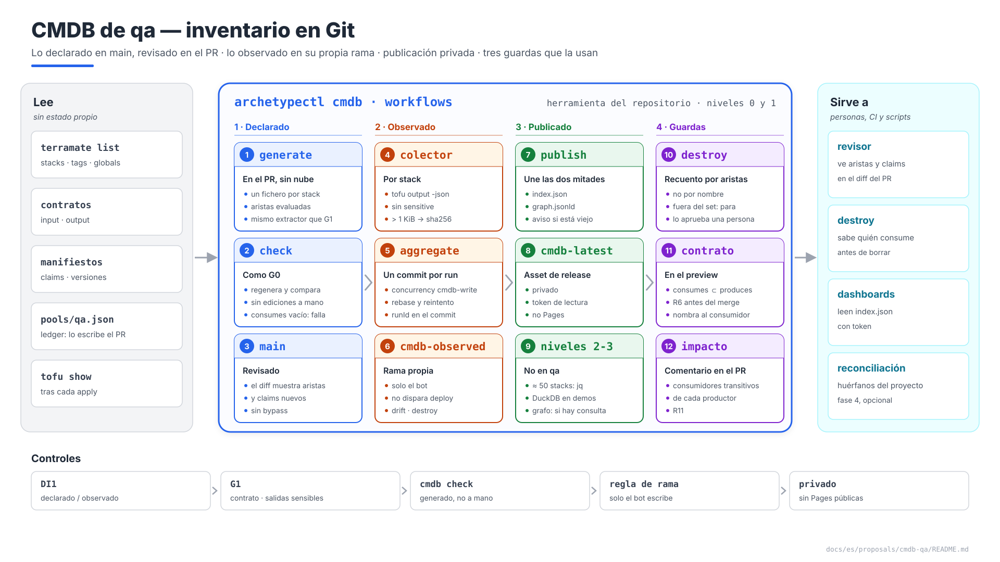
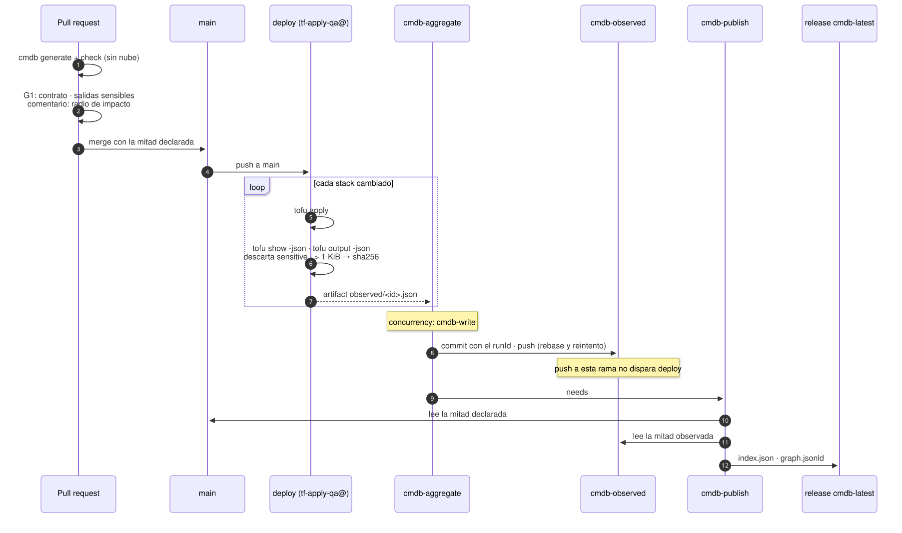

# CMDB de `qa` — inventario en Git, niveles 0 y 1

| | |
|---|---|
| **Estado** | Propuesta · revisión 2 · decisiones aprobadas y cambios aplicados a los documentos de referencia (§9) |
| **Alcance** | La CMDB del entorno `qa`: qué se inventaría, qué ficheros se escriben, quién los escribe y cuándo, dónde se publica el modelo de lectura, qué identidades lo hacen, y las tres guardas que la usan (recuento de referencias antes de un destroy, contrato roto en el PR, radio de impacto en el PR). Niveles 0 y 1 de AM §11; los niveles 2 y 3 no se construyen en `qa` (DI4) |
| **Por qué ahora** | Las propuestas anteriores publican salidas "para la CMDB" (SonarQube, variante Cloud SQL) y dejan el ledger en `cmdb-data/pools/qa.json` (red), pero nadie ha dicho cómo llegan ahí. La guarda 3 de la arquitectura (§12.4) remite a la CMDB para el recuento de referencias, y la CMDB no existe |
| **Base** | AM §11 (modelo en tres niveles), §9.6 (ledger); arquitectura §11.4 (identidades), §12.4 (guardas de destroy), §12.7, §14.2 (despliegue), §14.3 (drift); `schemas/cmdb-stack.schema.json`. No se repite lo que ya está allí |
| **Especificación de referencia** | `archetype-model.md` (AM §n), `terramate-outputs-sharing-architecture.md` (§n), `risk-register.md` |
| **Diagramas** | `diagrams/*.mmd` (fuente Mermaid) y `diagrams/*.svg` (renderizados). El SVG se regenera desde el `.mmd`; no se edita a mano. `diagrams/06-bloques-presentacion.svg` (1920×1080, para presentaciones) se genera con `06-bloques-presentacion.py`, no con Mermaid |
| **Identificadores propios** | Decisiones `DI1…`, riesgos candidatos `RI1…`, verificaciones `VI1…`. Los riesgos reciben número `R55+` en `risk-register.md` si se adoptan |

No reabre ninguna decisión de `CLAUDE.md`. Aplica AM §11 tal como está —Git es el sistema de registro, todo lo demás se reconstruye— y encuentra cuatro huecos al llevarlo a un repositorio real:

1. **El sync no puede escribir en `main`** sin saltarse su protección, y si lo hace dispara otra vez el workflow `deploy` (RI1). Se resuelve separando lo declarado de lo observado (§2).
2. **GitHub Pages es pública** salvo en Enterprise: publicar ahí el nivel 1 expone el inventario del entorno (RI2, §5).
3. **La guarda 3 cuenta stacks con `grep`** sobre un patrón de nombres (`^gcp-demos-.*-app$`) que en `qa` no casa con nada: el recuento sale 0 y el destroy pasa (§6.1).
4. **El extractor de aristas puede fallar en silencio**: si no evalúa un `from_stack_id`, el stack aparece sin consumidores y el recuento vuelve a salir 0 (RI3, VI1).



Fuente: [`diagrams/06-bloques-presentacion.py`](diagrams/06-bloques-presentacion.py) — vista de presentación; el detalle está en §1–§8.

---

## 0. Contexto

| Pregunta | Respuesta | Consecuencia |
|---|---|---|
| Qué es | **Herramienta del repositorio**, no un arquetipo: un subcomando de `archetypectl`, dos pasos en los workflows de despliegue y drift, una rama de datos y un asset de release | No tiene capa, ni stack, ni manifiesto. No aparece en el binding |
| Qué inventaría | Los stacks de `qa` (≈ 50, §1), sus aristas, sus claims, las instancias y las versiones de arquetipo | Un fichero por stack, como AM §11.1 |
| Qué **no** es | Gestión de cambios, incidencias ni CIs fuera del IaC (AM §11.5). Tampoco el estado vivo: refleja el **último apply con éxito** más lo que detecta el drift | Alimenta a la herramienta corporativa; no la sustituye |
| Proyecto | `qa` vive en `disasterproject-nonprod`, compartido con `dev`, `demos`, `sandbox` y `ephemeral-*` | Cada fichero lleva `environment` **y** `project` (§3.2): dentro del proyecto compartido, lo que separa a `qa` es el prefijo y la etiqueta, no el proyecto |



Fuente: [`diagrams/01-contexto.mmd`](diagrams/01-contexto.mmd)

### 0.1 Lo que le pidieron las propuestas anteriores

| Origen | Requisito | Dónde se cumple |
|---|---|---|
| SonarQube etapa 2 §5, §9 | Salidas `url`, `image_digest`, `chart_version`, `helm_revision`, `db_rw_service`, `backup_bucket`, `secret_ids` (nombres) "recogidas por el sync de la CMDB" | §4.2 |
| Variante Cloud SQL §7 | Salidas `db_instance_name`, `db_connection_name`, `db_name` | §4.2 |
| `network-qa` §7 | El ledger `cmdb-data/pools/qa.json` | §3.1: lo escribe el PR que reclama (AM §9.8), no el sync |
| Arquitectura §12.4, guarda 3 | Recuento de referencias "autoritativo, no inferido del repositorio" antes de destruir una plataforma | §6.1 |
| R5, R6, R11 | La CMDB dice quién consume a quién: destroy, renombrado de una salida, reconstrucción del cluster | §6 |
| Arquitectura §14.2, §14.3 | Paso `Sync CMDB` tras el apply; drift programado | §4 |

---

## 1. Qué se inventaría en `qa`

Los stacks salen de los manifiestos de cada propuesta, con los proveedores del binding de `qa` (E1 §7). Donde un consumidor lleva los dos caminos de `database-platform` (`data` y `data-tenant`), solo cuenta el del proveedor enlazado, `postgres-cloudsql`.

| Arquetipo | Capa | Stacks | Instancia |
|---|---|---|---|
| `environment` | 1 | `network`, `edge-base`, `edge`, `edge-l4` | — |
| `cloud-monitoring-gcp` | 1b | `cloudmon` | — |
| `gke` | 2 | `subnet`, `cluster`, `nodepools`, `baseline` | — |
| `policy-gatekeeper` | 2b | `controller`, `library`, `exemptions` | — |
| `cert-manager` | 3 | `controllers`, `ca` | — |
| `gateway-envoy-gke` | 3 | `controller`, `proxy` | — |
| `secrets-eso-gsm` | 3 | `eso` | — |
| `monitoring-oss` | 3 | 9 (`iam` … `frontdoor`) | — |
| `postgres-cloudsql` | 3 | `platform` | — |
| `kafka` | 3 | `iam`, `operator`, `cluster`, `policy`, `vpc-access` | — |
| `keycloak` | 3 | 9 (10 menos `data-tenant`) | `main` |
| `sonarqube` | 5 | 9 (10 menos `data-tenant`) | `main` |
| **Total** | | **≈ 50** | 2 |

Es una cifra de manifiestos: la definitiva es la de `terramate list --tags qa` cuando existan los stacks, y el generador la escribe sin que nadie la cuente.

| Fichero | Cuántos en `qa` | Tamaño aproximado |
|---|---|---|
| `stacks/<id>.json` | ≈ 50 | 2–4 KiB cada uno |
| `archetypes/<nombre>@<versión>.json` | 12 | 1–3 KiB |
| `instances/qa-<arquetipo>-<instancia>.json` | 2 | 1 KiB |
| `environments/qa.json`, `pools/qa.json` | 2 | 2 KiB |
| `edges/*.json` | 3 | 20 KiB en total |

Menos de 300 KiB. Cabe en memoria de cualquier script, que es lo que decide DI4.

---

## 2. Dos mitades: lo declarado y lo observado

AM §11.1 pone todo en `cmdb-data/` y deja que un job final "agregue en un único commit". En un repositorio con `main` protegido eso no funciona tal cual:

| Si el sync escribe en `main`… | Qué pasa |
|---|---|
| …con un push directo | Necesita un bypass de la protección de `main` (PR obligatorio, CODEOWNERS). Un job con ese bypass puede empujar cualquier cosa, no solo `cmdb-data/` |
| …y el workflow `deploy` es `on: push: branches: [main]` | El commit del sync dispara otro `deploy`. Con `--changed` no aplica nada, pero ejecuta otra vez el paso de sync: un bucle que solo corta un `paths-ignore` o un filtro por actor que alguien acabará quitando (RI1) |
| …con un PR automático por despliegue | Un PR por cada merge, que o revisa alguien (ruido) o se auto-aprueba (la revisión no significa nada) |

**Propuesta (DI1):** separar las dos mitades por **quién las escribe**.

| Mitad | Qué lleva | Quién la escribe | Cuándo | Dónde |
|---|---|---|---|---|
| **Declarada** | Todo lo que se sabe sin tocar la nube: `id`, `path`, `cloud`, `environment`, `project`, `capability`, `archetype`, `instance`, `model`, `tags`, `protected`, `produces`, `consumes`, `claims`, `createsTenantResources`, `expiresOn`; las aristas; las instancias; los manifiestos resueltos | `archetypectl cmdb generate`, en el PR | Antes del merge, con el cambio que la motiva | `cmdb-data/` en `main`, **revisada en el PR** |
| **Observada** | Lo que solo se sabe después del apply: `lastApply` (`at`, `commit`, `runId`, `outcome`), `resourceCount`, salidas publicadas, drift | El job de agregación, con `GITHUB_TOKEN` | Tras cada `deploy`, `drift` y `destroy` | Rama **`cmdb-observed`**, `cmdb-data/observed/<id>.json` |

Consecuencias:

- `main` no tiene ningún bypass. `cmdb-observed` tiene su propia regla (§5.2): solo escribe el bot, sin force-push ni borrado.
- Un push a `cmdb-observed` no dispara `deploy`, así que no hay bucle.
- `git blame` sigue funcionando en las dos mitades: la declarada, con el PR que la cambió; la observada, con el `runId` en cada commit.
- La declarada cambia **en el mismo PR** que el stack: un revisor ve en el diff que el PR añade una arista hacia `gcp-qa-gke` o un claim en la zona `data`. Eso es lo que AM §11.1 llama "el valor de un diff auditable", y con el sync tras el merge se perdía.

---

## 3. Lo declarado: ficheros en `main`

### 3.1 Estructura

```
cmdb-data/
├── archetypes/gke@2.5.0.json            # manifiesto resuelto, inmutable por versión
├── environments/qa.json                  # binding + cidr + capacity
├── instances/qa-sonarqube-main.json      # versiones, claims, stacks
├── instances/qa-keycloak-main.json
├── stacks/gcp-qa-gke.json                # UN FICHERO POR STACK — parte declarada
├── edges/
│   ├── depends-on.json                   # de los bloques input, evaluados (VI1)
│   ├── provides.json                     # capability → stack proveedor
│   └── tenant-resources.json             # quién escribe en el namespace de quién
├── pools/qa.json                         # ledger: lo escribe el PR que reclama (AM §9.8)
└── index.json
```

`pools/qa.json` no lo genera `archetypectl cmdb`: es el ledger, y su conflicto de merge es el cerrojo (AM §9.6). El generador lo lee para validar que cada claim de un stack está en el ledger.

### 3.2 Un stack

```json
{
  "apiVersion": "archetype/v1",
  "kind": "Stack",
  "id": "gcp-qa-gke",
  "path": "/stacks/platforms/gcp/qa/gke/cluster",
  "cloud": "gcp",
  "environment": "qa",
  "project": "disasterproject-nonprod",
  "capability": "cluster",
  "archetype": { "name": "gke", "version": "2.5.0", "kind": "catalog" },
  "model": "dedicated",
  "tags": ["gcp", "qa", "cluster", "platform", "producer", "protected"],
  "protected": true,
  "produces": ["cluster_endpoint", "cluster_ca", "cluster_name", "cluster_location",
               "workload_identity_pool", "node_service_account"],
  "consumes": [
    { "from_stack_id": "gcp-qa-network",    "output": "network_self_link" },
    { "from_stack_id": "gcp-qa-gke-subnet", "output": "subnet_self_link" }
  ],
  "claims": [
    { "kind": "cidr", "pool": "qa", "zone": "infra", "purpose": "nodes",    "value": "10.4.128.0/24" },
    { "kind": "cidr", "pool": "qa", "zone": "pods",  "purpose": "pods",     "value": "10.4.192.0/18" },
    { "kind": "cidr", "pool": "qa", "zone": "edge",  "purpose": "services", "value": "10.4.160.0/22" }
  ]
}
```

Los claims los hace el arquetipo; en el fichero se atribuyen al stack que crea el recurso (aquí, en realidad, `gcp-qa-gke-subnet`: el ejemplo simplifica). `project` **no existe hoy** en `schemas/cmdb-stack.schema.json` (§9).

### 3.3 Cómo se genera

| Campo | Fuente | Sin nube |
|---|---|---|
| `id`, `path`, `tags` | `ci/stacks-json.sh` (arquitectura §14.4) | Sí |
| `environment`, `project`, `cloud`, `capability`, `archetype`, `instance`, `model` | Globals del stack (`terramate debug show globals`) | Sí |
| `produces` | Bloques `output` del contrato importado | Sí |
| `consumes` | Bloques `input` del contrato, **con `from_stack_id` evaluado** | Sí, si el extractor evalúa globals (VI1) |
| `claims` | Manifiesto + ledger `pools/qa.json` | Sí |
| `createsTenantResources`, `expiresOn` | Manifiesto | Sí |

**Un extractor para dos consumidores.** La regla de G1 que comprueba que cada `input` tiene su `after` (R2) necesita exactamente los mismos pares `(stack, from_stack_id)`. Se escribe una vez, en `archetypectl`, y lo usan G1 y la CMDB: si el extractor se equivoca, se equivocan los dos a la vez y se nota antes.

**La comprobación (DI2).** `archetypectl cmdb check` regenera la mitad declarada y falla si difiere de lo que hay en el PR, igual que G0 con `terramate generate --detailed-exit-code`. Sin ella alguien corrige a mano un `consumes`, la revisión lo aprueba y la siguiente generación lo revierte en silencio.

La herramienta no existe todavía. La rama `claude/fervent-goodall-m3r9eg` tiene un `archetypectl` con el subcomando `enrich`, sin integrar; `cmdb` sería un subcomando nuevo.

---

## 4. Lo observado: rama `cmdb-observed`

### 4.1 El flujo



Fuente: [`diagrams/02-flujo.mmd`](diagrams/02-flujo.mmd)

| Paso | Job | Qué hace | Identidad |
|---|---|---|---|
| 1 | `deploy` (cada stack) | Tras el apply, `tofu show -json` y `tofu output -json`; escribe `observed/<id>.json` y lo sube como artifact | `tf-apply-qa@`, la que ya tiene |
| 2 | `cmdb-aggregate` | Descarga los artifacts, los copia en `cmdb-observed`, un commit con el `runId`, `push` con reintento y rebase | Sin nube; `GITHUB_TOKEN` con `contents: write` **solo en este job** |
| 3 | `cmdb-publish` | Une la mitad declarada de `main` y la observada; escribe `index.json` y `graph.jsonld`; los sube al release `cmdb-latest` | Sin nube; `contents: write` |
| — | `drift` (cron) | Si `tofu plan -detailed-exitcode` sale con 2: `outcome: drifted`, `driftAt` | `tf-plan-qa@` + paso 2 |
| — | `destroy` | Tras destruir: `outcome: destroyed` | `tf-destroy-qa@` + paso 2 |

`cmdb-aggregate` va con `concurrency: { group: cmdb-write, cancel-in-progress: false }`, como dice AM §11.1: dos despliegues seguidos se agregan en orden, sin perder ninguno (VI2).

### 4.2 Qué salidas se publican

Las propuestas anteriores publican salidas "para la CMDB". El colector las recoge así **(DI5)**:

| Regla | Motivo |
|---|---|
| Solo salidas sin `sensitive = true` | `tofu output -json` devuelve también las sensibles; el colector las descarta por la marca, no por el nombre |
| Valores > 1 KiB se guardan como `sha256:` | `cluster_ca` y similares: no son secretos, pero inflan el fichero y no se consultan por valor |
| La regla de nombres de secreto que G1 ya tiene (`terramate.contracts`, arquitectura §13.3) impide que una `output` llamada `password`, `token`, `private_key`… exista, salvo que acabe en `_id`, `_arn`, `_name` o `_uri` | La marca `sensitive` la pone una persona y se olvida (RI4); la regla no depende de ella. Los nombres de secreto (`secret_ids`) son referencias, no valores: se publican (`CLAUDE.md`, "Never share secrets through outputs sharing"). La revisión 1 proponía una regla nueva; la existente ya lo cubre |

```json
{
  "apiVersion": "archetype/v1",
  "kind": "StackObserved",
  "id": "gcp-qa-sonarqube-main-app",
  "lastApply": { "at": "2026-10-05T09:12:44Z", "commit": "4730c06", "runId": "11873120455", "outcome": "ok" },
  "resourceCount": 14,
  "outputs": {
    "url": "https://sonar.tqbvzkr.disasterproject.com",
    "image_digest": "sha256:9b1c…",
    "chart_version": "2025.4.2",
    "helm_revision": 7
  }
}
```

`StackObserved` es un `kind` nuevo, con su propio schema (§9).

---

## 5. Publicación y acceso

### 5.1 Dónde se publica el nivel 1 (DI3)

| Opción | Acceso | Problema |
|---|---|---|
| GitHub Pages | **Pública** salvo en Enterprise (AM §11.2) | Publica IPs internas, rangos, nombres de proyecto y de secretos, versiones y digests: el mapa del entorno para quien lo quiera atacar (RI2) |
| `raw.githubusercontent.com` sobre la rama | Token | Caché de ~5 min; hay que unir las dos mitades en el cliente |
| **Asset del release `cmdb-latest`** | Token de lectura del repositorio | Ninguno relevante con ≈ 50 stacks: un fichero, versionado, sustituido en cada publicación |

**Propuesta:** asset del release `cmdb-latest` (`index.json` y `graph.jsonld`); el historial lo da la rama `cmdb-observed`. Si el repositorio pasa a Enterprise con Pages privadas, se puede añadir Pages sin cambiar nada más.

### 5.2 Permisos

| Quién | Qué puede | Cómo se garantiza |
|---|---|---|
| Jobs de `preview` | Generar y comprobar la mitad declarada | Sin nube, `contents: read` |
| `cmdb-aggregate`, `cmdb-publish` | Escribir en `cmdb-observed` y en el release | `contents: write` a nivel de job; el resto del workflow sigue en `read` |
| Cualquier job con `contents: write` | **No** escribir en `main` | La regla de `main` no tiene bypass para `github-actions`; `GITHUB_TOKEN` no puede saltársela (VI3) |
| Personas | Leer `cmdb-observed`; no empujar ni borrar | Regla de la rama: solo `github-actions` empuja, sin force-push, sin borrado |
| Lectores (dashboards, scripts) | Leer el release | Token de GitHub App de solo lectura |

---

## 6. Las guardas que la usan

### 6.1 Recuento de referencias antes de un destroy (DI6)

La guarda 3 de la arquitectura (§12.4) cuenta `^gcp-demos-.*-app$`. En `qa` ningún consumidor de `gcp-qa-gke` se llama así (`gcp-qa-policy`, `gcp-qa-kafka-cluster`, `gcp-qa-keycloak-main-app`, …): el recuento sale 0 y el destroy pasa. Con la CMDB se cuentan **aristas**, no nombres:

```bash
# Consumidores vivos de un stack: aristas entrantes cuyo origen no está en el propio set de destroy
jq -r --arg p "$STACK" --argjson set "$DESTROY_SET" '
  . as $idx
  | [.edges[] | select(.producer == $p) | .consumer]
  | map(select(. as $c | ($set | index($c)) == null))
  | map(select($idx.stacks[.].observed.lastApply.outcome != "destroyed"))
  | .[]' index.json
```

Si sale algún nombre, el destroy se para con la lista. Destruir el productor **junto con** todos sus consumidores (el mismo set) sí se permite: es destruir el entorno, y lo aprueba el grupo de destroy (arquitectura §11.4).

Límite (RI5): solo se cuentan consumidores **que son stacks**. Los 200 pipelines que usan SonarQube por HTTP no están en la CMDB; destruir `sonarqube` los deja sin servicio aunque el recuento dé 0. Para eso sigue estando la aprobación humana del destroy.

### 6.2 Contrato roto en el PR (DI7)

Con `produces` y `consumes` en la mitad declarada, una regla de conftest sobre `index.json` del PR comprueba que **cada `consumes.output` existe en el `produces` de su productor**. Un PR que quita o renombra una salida que alguien lee falla en el preview, con el nombre del consumidor. Es R6 detectado antes del merge en vez de en el apply del consumidor.

### 6.3 Radio de impacto en el PR

El preview comenta en el PR los consumidores transitivos de cada stack productor que cambia, con la consulta recursiva de AM §11.3 hecha en `jq` sobre `edges/depends-on.json`. Un PR que toca `gcp-qa-gke` muestra que afecta a casi todos los demás stacks de `qa`, y el revisor lo ve antes de aprobar (R11).

---

## 7. Reconciliación con la nube (opcional, fase 4)

En el proyecto compartido, un recurso huérfano de `qa` —creado a mano, o que sobrevivió a un destroy fallido— se factura a `qa` por su etiqueta y no aparece en ningún estado.

| Qué | Cómo |
|---|---|
| Inventario de la nube | Cloud Asset Inventory: `gcloud asset search-all-resources --scope=projects/disasterproject-nonprod --query='labels.environment=qa'` |
| Inventario del IaC | Los IDs de recurso de `tofu show -json`, guardados por el colector en `observed/resources/<id>.json` |
| Resultado | Diferencia en los dos sentidos: en la nube sin estado (huérfano), y en el estado sin etiqueta `environment=qa` (etiqueta mal puesta) |
| Identidad | `cmdb-reader@` de la landing zone, `roles/cloudasset.viewer` en `disasterproject-nonprod`. Ve metadatos de todos los entornos del proyecto; filtra por etiqueta. No es `tf-plan-qa@`, que no debe ver `dev` |
| Límite | No todos los recursos de GCP admiten etiquetas; los que no, se comparan por nombre con el prefijo `qa-` |

---

## 8. `prod` y `demos`

| Ajuste | `qa` | `prod` | `demos` |
|---|---|---|---|
| Stacks | ≈ 50 | Parecido a `qa` | Plataforma + un conjunto por demo |
| Nivel 2 (DuckDB) | No (DI4) | No | **Sí** cuando haya varias demos: la consulta de caducidad (AM §11.3) es la que mantiene habitable el entorno |
| Reconciliación | Opcional | Recomendada: `prod` tiene su propio proyecto, y todo lo que hay en él debería estar en un estado | Recomendada: las demos caducan y dejan restos |
| Rama `cmdb-observed` | La misma para todos los entornos | La misma | La misma |

Una sola CMDB para todos los entornos: el radio de impacto cruza entornos cuando cruza la landing zone (clave `tofu-state`, registro de imágenes).

---

## 9. Cambios a otros documentos

| Documento | Cambio | Estado |
|---|---|---|
| AM §11.1 | Dos mitades: declarada en `main`, generada en el PR; observada en la rama `cmdb-observed` (DI1, DI2) | **Aplicado** |
| AM §11.2 | GitHub Pages no sirve si el repositorio no es Enterprise; asset de release (DI3) | **Aplicado** |
| AM §16 | Fila de `schemas/cmdb-observed.schema.json` | **Aplicado** |
| Arquitectura §12.4, guarda 3 | Recuento por aristas de la CMDB, no por nombre (DI6) | **Aplicado** |
| Arquitectura §12.7 | Resumen de las dos mitades y referencia a esta propuesta | **Aplicado** |
| Arquitectura §14.2, §14.3 | Colector por stack; workflow reutilizable `cmdb-sync` (`aggregate` + `publish`) llamado por `deploy` y `drift`; el drift escribe `drifted` | **Aplicado** |
| `schemas/cmdb-stack.schema.json` | Añadir `project`; sacar `lastApply` y `resourceCount` a un schema nuevo `cmdb-observed.schema.json` (`kind: StackObserved`, con `driftAt`, `outputs` y `outcome` que admite `destroyed`) | **Aplicado** |
| G1 (arquitectura §13.3) | Dos reglas en `terramate.contracts`: salida consumida que el productor no produce (DI7) y productor que no está en el inventario. La de nombres de secreto ya existía (DI5) | **Aplicado** |
| `risk-register.md`, glosario | RI1 → R55, RI3 → R56, RI4 → R57; entradas de mitad declarada y observada | **Aplicado** |
| `CLAUDE.md` | Decisión cerrada: dos mitades, publicación privada, guarda por aristas | **Aplicado** |

---

## 10. Riesgos candidatos

| # | Riesgo | Probabilidad | Impacto | Mitigación |
|---|---|---|---|---|
| RI1 | **El sync escribe en `main`**: bypass de la protección y bucle de `deploy` | Alta si se sigue AM §11.1 al pie de la letra | Media — un job que puede empujar a `main` sin revisión | DI1: lo observado en su propia rama |
| RI2 | **Nivel 1 en Pages pública** | Media | Alta — mapa del entorno expuesto | DI3: asset de release |
| RI3 | **Aristas vacías en silencio**: el extractor no evalúa un `from_stack_id` y el recuento da 0 | Media hasta cerrar VI1 | Crítico — permite destruir una plataforma con consumidores (R5) | `cmdb check` falla si un stack tiene bloques `input` y `consumes` vacío; VI1; el mismo extractor que G1 |
| RI4 | **Una salida sensible sin `sensitive = true`** acaba en la CMDB | Media | Alta — un secreto en un fichero que lee cualquiera con acceso al repositorio | La regla de nombres de secreto de G1 que ya existe; publicación privada; el colector nunca lee secretos, solo salidas |
| RI5 | **Consumidores fuera del repositorio** | Alta (SonarQube) | Media — el recuento da 0 con usuarios reales | Aprobación humana del destroy; los consumidores externos se listan en el manifiesto si hace falta (no se propone ahora) |
| RI6 | **CMDB que miente con confianza**: lo observado se queda viejo si el agregador falla | Media | Media | `lastApply.at` en el índice; `cmdb-publish` avisa de stacks sin observación en los últimos N días; el drift diario refresca |

---

## 11. Verificaciones

| # | Verificación | Resultado que la cierra |
|---|---|---|
| VI1 | Evaluar los bloques `input` con la versión fijada de Terramate | Para los stacks de la fase 0 de `CLAUDE.md`, el extractor devuelve los `from_stack_id` ya resueltos (global heredado e interpolado), igual que la lista escrita a mano |
| VI2 | Dos `deploy` casi simultáneos | Los dos commits llegan a `cmdb-observed`, en orden, sin perder ninguno |
| VI3 | Protección de `main` frente a `GITHUB_TOKEN` | Un push de prueba desde `cmdb-aggregate` a `main` es rechazado; a `cmdb-observed` entra |
| VI4 | Guarda de destroy | Destruir `gcp-qa-gke` con consumidores vivos se para con la lista; destruir el set completo pasa |
| VI5 | Colector y salidas sensibles | Una salida `sensitive` de prueba no aparece ni en el artifact ni en el índice |
| VI6 | Drift | Un cambio manual en un recurso de `qa` aparece como `drifted` en el índice del día siguiente |
| VI7 | Cloud Asset Inventory por etiqueta (fase 4) | Devuelve los recursos de `qa` y ninguno de `dev` |

---

## 12. Decisiones

| # | Decisión | Estado | Recomendación | Alternativa |
|---|---|---|---|---|
| DI1 | Dónde vive lo observado | **Aprobada** | Rama `cmdb-observed`; lo declarado en `main` | Todo en `main` con bypass y `paths-ignore`; un PR automático por despliegue; una base de datos |
| DI2 | Cuándo se escribe lo declarado | **Aprobada** | En el PR, generado y comprobado como G0 | Tras el merge; a mano |
| DI3 | Publicación del nivel 1 | **Aprobada** | Asset del release `cmdb-latest`, privado | GitHub Pages; lectura directa de la rama |
| DI4 | Niveles 2 y 3 en `qa` | **Aprobada** | No: ≈ 50 stacks, `jq` basta. Nivel 2 cuando `demos` tenga varias demos; nivel 3 cuando haya una consulta real que el 2 no resuelva (AM §11.4) | DuckDB desde el principio |
| DI5 | Qué salidas se publican | **Aprobada** | Todas las no sensibles; > 1 KiB como hash; la regla de nombres de secreto de G1 que ya existe | Lista explícita por manifiesto (`cmdb_outputs`) |
| DI6 | Recuento de referencias | **Aprobada** | Por aristas de la CMDB, excluyendo el propio set de destroy | `grep` por nombre (arquitectura §12.4) |
| DI7 | Contrato en el PR | **Aprobada** | Cada `consumes.output` existe en el `produces` del productor | Descubrirlo en el apply |
| DI8 | Reconciliación | **Aprobada** | Fase 4, opcional en `qa`, con `cmdb-reader@` | No reconciliar; usar `tf-plan-qa@` |

---

## 13. Plan de implementación

| Fase | Contenido | Criterio de salida | Estimación |
|---|---|---|---|
| **0 · Extractor** | **VI1**, junto con la fase 0 de `CLAUDE.md` | Aristas evaluadas de los stacks de prueba | 0,5 días |
| **1 · Declarado** | `archetypectl cmdb generate` y `check`; ficheros de `qa`; las dos reglas de contrato de G1 (DI7); comentario de radio de impacto | El preview de un PR que toca `gcp-qa-gke` lista sus consumidores y falla si rompe un contrato | 2 días |
| **2 · Observado** | Colector, `cmdb-aggregate`, rama y su regla, drift; **VI2**, **VI3**, **VI5**, **VI6** | Tras un `deploy`, `cmdb-observed` tiene un commit con el `runId` | 2 días |
| **3 · Publicación y guardas** | `cmdb-publish`, guarda de destroy; **VI4** | `index.json` en `cmdb-latest`; un destroy con consumidores vivos se para | 1,5 días |
| **4 · Reconciliación** (opcional) | `cmdb-reader@`, informe de huérfanos; **VI7** | Informe semanal sin diferencias en `qa` | 1 día |

Seis días para una persona sin la fase 4. Depende de que existan los stacks de la fase A de E1 §6 para tener algo que inventariar; las fases 0 y 1 pueden empezar con los de la fase 0 de `CLAUDE.md`.
