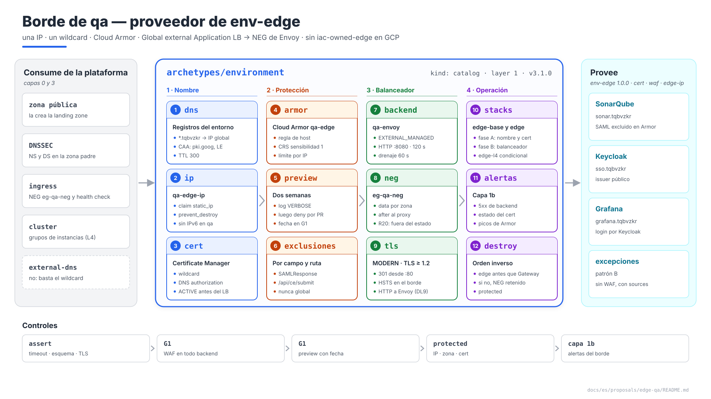

# Borde de `qa` — arquetipo `environment` (capa 1), proveedor de `env-edge`

| | |
|---|---|
| **Estado** | Propuesta · revisión 5 |
| **Alcance** | El borde público de `qa`: IP, zona DNS pública y registros, certificado, Cloud Armor, el Global external Application LB hacia el NEG de Envoy, TLS, las excepciones L4 (patrón B), observabilidad, el contrato `env-edge`, stacks, políticas, ejecución y plan |
| **Por qué ahora** | Es la última pieza para que SonarQube, Keycloak y Grafana sean alcanzables. La propuesta de Envoy Gateway le dejó requisitos (health check, drenaje, `after`, NEG como `data`) y la de SonarQube, dos más (timeout de 120 s y exclusiones de Cloud Armor) |
| **Base** | E1 §4.5 (publicación), §4.15 (VPC separada y borde propio); propuesta de Envoy Gateway §1, §2, §4.4, §5.2, §7.1; propuesta `network-qa`; arquitectura §10.2 y §10.8; AM §3 (capabilities de borde en la capa 1). No se repite lo que ya está allí |
| **Especificación de referencia** | `archetype-model.md` (AM §n), `terramate-outputs-sharing-architecture.md` (§n), `risk-register.md` |
| **Diagramas** | `diagrams/*.mmd` (fuente Mermaid) y `diagrams/*.svg` (renderizados). El SVG se regenera desde el `.mmd`; no se edita a mano. `diagrams/06-bloques-presentacion.svg` (1920×1080, para presentaciones) se genera con `06-bloques-presentacion.py`, no con Mermaid |
| **Identificadores propios** | Decisiones `DL1…`, riesgos candidatos `RL1…`, verificaciones `VL1…`. Los riesgos reciben número `R54+` en `risk-register.md` si se adopta, detrás de los de las propuestas anteriores |

No reabre ninguna decisión de `CLAUDE.md`. Aplica la de entornos fuera del proyecto de la landing zone: la IP, Cloud Armor y el certificado viven con el balanceador en el proyecto non-prod compartido (`disasterproject-nonprod`), con el prefijo `qa` en cada nombre. Añade al arquetipo `environment` lo que la propuesta de red dejó para después, en una versión menor.



Fuente: [`diagrams/06-bloques-presentacion.py`](diagrams/06-bloques-presentacion.py) — vista de presentación; el detalle está en §1–§8.

---

## 0. Contexto

| Pregunta | Respuesta | Consecuencia |
|---|---|---|
| Qué es | El borde del arquetipo `environment` (capa 1), versión **3.1.0**. Provee **`env-edge` 1.0.0**, y `cert`, `waf` y `edge-ip`, que pasan a la capa 1 con los entornos fuera del proyecto de la landing zone (AM §3) | Stacks `gcp-qa-edge-base` y `gcp-qa-edge`; `gcp-qa-edge-l4` solo si hay excepciones |
| Qué publica | `sonar.tqbvzkr.disasterproject.com`, `sso.tqbvzkr.disasterproject.com`, `grafana.tqbvzkr.disasterproject.com`: los hostnames reclamados | Un certificado wildcard, una IP, un Gateway |
| Qué **no** hace | Enrutar por host (lo hace Envoy), autenticar (cada aplicación, o `SecurityPolicy`), exponer Kafka (nunca sale de la VPC) | El URL map tiene un solo backend |
| Trait `iac-owned-edge` | **No** en GCP: el NEG lo crea el controlador de GKE (R20) | Se declara la ausencia en vez de ocultarla (AM §4.3) |



Fuente: [`diagrams/01-contexto.mmd`](diagrams/01-contexto.mmd)

### 0.1 Lo que le pidieron las propuestas anteriores

| Origen | Requisito | Dónde se cumple |
|---|---|---|
| E1 §4.5, R45 | Timeout del backend service de **120 s** | §4 |
| E2 §9 | Exclusiones de Cloud Armor en `/api/ce/submit` | §3.2 |
| Envoy Gateway §5.2, §7.1 | Health check HTTP al puerto de readiness (`health_check` del contrato); `connection_draining_timeout_sec: 60`; NEG `eg-qa-neg` como `data` por zona; `after` al stack `proxy` | §4 |
| Envoy Gateway §2.1 | HTTP → HTTPS en el URL map; HTTP hacia el backend (Envoy Gateway DG14) | §4, §6 |
| Envoy Gateway §4.4 | Balanceador passthrough por excepción (patrón B), con `sources` en la regla | §5 |
| E1 §4.15 | Zona `tqbvzkr.disasterproject.com` delegada; wildcard creado una vez | §1 |

---

## 1. DNS público

| Pieza | Diseño | Motivo |
|---|---|---|
| Identificador público `tqbvzkr` | 7 letras minúsculas **aleatorias**, generadas una vez por la landing zone (`random_string`, sin números ni mayúsculas) al dar de alta el entorno, y fijadas en el binding (`network.public_id`). El valor de este documento es un ejemplo | Todo nombre que se ve desde fuera lleva el identificador en vez de `qa`: la zona y los hostnames, el wildcard (que queda en los logs públicos de Certificate Transparency) y los nombres de bucket, que son globales. No puede derivarse del nombre: los 7 primeros caracteres de `sha256("qa")` los calcula cualquiera (DL10) |
| Zona `tqbvzkr.disasterproject.com` | Zona pública de Cloud DNS en `disasterproject-nonprod`, **creada por la landing zone**, igual que el proyecto; DNSSEC activado | La delegación necesita los name servers de la zona hija, que Cloud DNS asigna al crearla. Si la creara el entorno, la landing zone (capa 0) tendría que leer una salida de la capa 1 para escribir el `NS` en la zona padre. Creándola ella, zona, delegación y registro `DS` de DNSSEC están en un solo stack (DL2) |
| Quién escribe registros | El entorno (`gcp-qa-edge-base`), con `roles/dns.admin` **sobre esa zona** | La landing zone crea el contenedor; el contenido es del entorno |
| `*.tqbvzkr.disasterproject.com` | `A` → IP global de §2, TTL 300 | Un registro para todos los hostnames (E1 §4.5). Los hostnames siguen siendo claims: el wildcard resuelve, el ledger garantiza la unicidad |
| `CAA` | `0 issue "pki.goog"` y `0 issue "letsencrypt.org"` en `tqbvzkr.disasterproject.com` | Solo las dos CA que usa Certificate Manager para certificados gestionados pueden emitir para el dominio **(verificar, VL3)**. Sin `CAA`, cualquier CA pública puede |
| Registro de autorización | `CNAME` `_acme-challenge.tqbvzkr.disasterproject.com` del `google_certificate_manager_dns_authorization` | §2 |
| Sin external-dns | `dns` sin enlazar (E1 §3.3) | Un Gateway y una IP por entorno: el wildcard basta |

**Qué lleva el identificador y qué no (DL10).** Lo lleva lo que ve alguien sin credenciales: hostnames y zona pública, certificado, nombres de bucket y el nombre del realm de Keycloak, que sale en las URLs de OIDC y SAML (por eso el realm se llama `disasterproject` en todos los entornos, no `qa`). **No** lo llevan los nombres internos —recursos del proyecto, etiquetas (la facturación va por `environment`), prefijos de KSA, IDs de stack, namespaces, la zona privada `qa.internal`—: quien los ve ya tiene acceso al proyecto, y cambiarlos solo empeora la operación. El nombre del recurso de la zona pública es `qa-public`: interno, con el prefijo del entorno como el resto.

**Subdominio, no guion.** `sonar.tqbvzkr.disasterproject.com`, no `sonar-tqbvzkr.disasterproject.com`. Con subdominio, el wildcard `*.tqbvzkr…` es lo único que llega a los logs de CT; con guion haría falta un certificado con cada nombre (todos quedarían en CT, agrupados por el sufijo) o `*.disasterproject.com`, que también valdría para los nombres de `prod`. Además, la zona delegada sigue siendo del entorno y una cookie con `Domain=.tqbvzkr.disasterproject.com` no alcanza a otros entornos.

**Cambiarlo es renombrar el borde.** Certificado nuevo, cookies y sesiones invalidadas, URLs de SAML/OIDC y la redirección registrada en Entra ID, integraciones de CI que llaman a SonarQube. Se genera una vez y no rota.

---

## 2. IP y certificado

| Pieza | Diseño | Motivo |
|---|---|---|
| IP | `qa-edge-ip`, `google_compute_global_address` `EXTERNAL`, IPv4; **claim** del entorno (`kind: static_ip`) y `prevent_destroy` | Si se libera, el wildcard apunta a una IP que puede acabar en otro cliente de Google |
| IPv6 | No en `qa` | Sin requisito; se añade con otra dirección y otra forwarding rule sin tocar lo demás (DL8) |
| Certificado | Certificate Manager: `*.tqbvzkr.disasterproject.com` con **DNS authorization**, en un `certificate_map` con una entrada para el wildcard | La autorización por DNS no necesita que el balanceador exista ni que el tráfico llegue: el certificado queda `ACTIVE` antes que el Gateway (DL1) |
| Renovación | Automática, de Google | La alerta vigila el estado, no la fecha (§7) |

---

## 3. Cloud Armor

### 3.1 La política `qa-edge`

| Prioridad | Regla | Acción en `qa` | Motivo |
|---|---|---|---|
| 100 | Host fuera de `*.tqbvzkr.disasterproject.com` (`!request.headers['host'].endsWith('.tqbvzkr.disasterproject.com')`) | `deny(403)` | Los escáneres llegan por IP o con hosts inventados. Envoy devolvería 404, pero así no llegan al cluster (RL5) |
| 900–990 | Exclusiones de §3.2 | Excluyen campos de reglas concretas, no rutas enteras | — |
| 1000–1090 | Reglas preconfiguradas OWASP CRS: `sqli`, `xss`, `lfi`, `rfi`, `rce`, `scannerdetection`, `protocolattack`, `sessionfixation`, sensibilidad 1 | **Preview** dos semanas, luego `deny(403)` | Una regla nueva en `deny` sin haberla visto en tráfico real rompe el login antes que a un atacante (RL1) |
| 2000 | Límite por IP: 1200 peticiones/min, `throttle` | Preview | Un runner de GitHub hace pocas peticiones; 1200/min solo lo alcanza un abuso |
| 2147483647 | Por defecto | `allow` | — |

| Ajuste | Valor |
|---|---|
| Inspección de cuerpo | Primeros 64 KB (`request_body_inspection_size`) **(verificar el máximo en la fecha, VL1)** |
| Análisis JSON | `STANDARD` |
| Log | `VERBOSE` en `qa` mientras las reglas están en preview; `NORMAL` después |
| Adaptive Protection | Activado; sus alertas, en la capa 1b **(verificar qué ofrece sin Cloud Armor Enterprise)** |

### 3.2 Falsos positivos conocidos

| Ruta | Qué dispara | Exclusión |
|---|---|---|
| SonarQube `POST /api/ce/submit` | El informe de análisis es un ZIP binario: `protocolattack` y `rce` ven secuencias arbitrarias en el cuerpo (E2 §9) | Excluir el cuerpo de esas reglas en esa ruta; la ruta exige token de SonarQube |
| SonarQube `POST /oauth2/callback/saml` | La respuesta SAML es XML firmado en base64 en el campo `SAMLResponse`: `xss` y `protocolattack` saltan con XML | Excluir `SAMLResponse` de `xss` y `protocolattack` en esa ruta. **Sin esto, nadie entra en SonarQube** en cuanto las reglas pasan a `deny` (RL1) |
| Keycloak `POST /realms/disasterproject/broker/entra/endpoint` | Parámetros `code`, `state`, `id_token` de Entra ID | Excluir `id_token` de `sqli` y `xss` si la preview lo muestra |

La lista final sale de las dos semanas de preview: se excluye un campo en una ruta, nunca una regla para todo el entorno.

---

## 4. El balanceador



Fuente: [`diagrams/02-borde.mmd`](diagrams/02-borde.mmd)

| Pieza | Valor | Motivo |
|---|---|---|
| Esquema | `EXTERNAL_MANAGED` (Global external Application LB) | El clásico (`EXTERNAL`) es el anterior; el gestionado admite gestión de tráfico avanzada y es el que recibe las funciones nuevas (DL3) |
| Backend service | `qa-envoy`, `protocol = HTTP` hacia 8080, **120 s** de timeout (R45), `connection_draining_timeout_sec = 60`, `security_policy = qa-edge`, logs al 100 % en `qa` | Envoy Gateway §2.2 y §5.2 |
| Backends | Un NEG `eg-qa-neg` por zona (`b`, `c`, `d`), leídos con `data "google_compute_network_endpoint_group"`; `balancing_mode = RATE`, `max_rate_per_endpoint = 1000` | El NEG lo crea el controlador de GKE (R20). `RATE` es obligatorio con NEG; el valor reparte, no corta **(verificar el comportamiento a saturación, VL4)** |
| Health check | HTTP, `USE_FIXED_PORT` al puerto de `health_check` del contrato `ingress` (`/ready`) | Contra 8080 una petición sin host devuelve 404 (Envoy Gateway §5.2) |
| Cabeceras de respuesta | `Strict-Transport-Security: max-age=31536000; includeSubDomains` en `custom_response_headers` | Una vez en el borde, para todas las aplicaciones |
| URL map `qa-https` | Un solo backend por defecto, sin reglas de host | El host lo decide Envoy (Envoy Gateway DG2); duplicarlo aquí son dos sitios que se desincronizan |
| Proxy HTTPS | `certificate_map` de §2; `ssl_policy` `qa-modern`: perfil `MODERN`, TLS ≥ 1.2 | TLS 1.0 y 1.1 fuera |
| HTTP | Forwarding rule en el puerto 80 con URL map `qa-redirect` (`https_redirect = true`, 301) | Envoy Gateway §2.1: sin listener HTTP en Envoy |
| Forwarding rules | 443 y 80 en `qa-edge-ip` | — |
| Hacia el backend | **HTTP**, sin certificado | El TLS público termina aquí. El borde no depende de ningún certificado de la capa 3: con HTTPS, el de Envoy salía de cert-manager, una arista hacia arriba, y el GLB no lo validaba. Google cifra a nivel de red el tráfico del GLB a los backends de la VPC **(verificar, VL4)** (DL9) |
| Firewall | El de los rangos de health check y GFE lo declara Envoy Gateway (§5.2): quien reclama escribe la regla | — |

**`after` y mock.** El stack `gcp-qa-edge` declara `after` al stack `proxy` de Envoy Gateway: es la arista ascendente de AM §3. En la preview de una PR, el `data` del NEG falla si el Gateway aún no existe y se usa el mock (`--mock-on-fail`); en despliegue, el mock está prohibido (`CLAUDE.md`).

**Orden de destrucción.** `gcp-qa-edge` primero: el backend service suelta el NEG. Al revés, el NEG queda retenido (arquitectura §10.8).

---

## 5. Excepciones L4 (patrón B)

`qa` no tiene ninguna hoy. El diseño queda fijado para que la primera no invente el suyo.

| Pieza | Diseño |
|---|---|
| Stack | `gcp-qa-edge-l4`, que solo existe si alguna instancia enlazada declara `exposures` con `pattern: passthrough` (condición del resolver) |
| Por excepción | IP regional reclamada (`kind: static_ip`); backend service regional `EXTERNAL`, protocolo TCP o UDP; health check TCP al `nodePort`; forwarding rule al `port` publicado; regla de firewall desde `sources` hacia los nodos en `nodePort` (o `port` con `externalIPs`) |
| Backends | Los grupos de instancias de los nodos del pool donde corre el `Service`. Sus URLs **no** son deterministas (cambian si se recrea el pool): llegan por outputs sharing desde el stack `nodepools` de GKE, con su `after` (DL7) |
| Sin Cloud Armor | Los balanceadores passthrough no tienen WAF. Los controles compensatorios son del consumidor (Envoy Gateway §4.4) |
| Caducidad | `review_by` pasado falla la PR siguiente (G1, Envoy Gateway §4.4) |

---

## 6. TLS de extremo a extremo

| Tramo | Certificado | Quién valida |
|---|---|---|
| Cliente → GLB | Wildcard de Certificate Manager | El cliente |
| GLB → Envoy | **Ninguno**: HTTP; cifrado de red de Google (§4, DL9) | — |
| Envoy → aplicación | `internal-ca`, con `BackendTLSPolicy` donde el backend lo exige (trait `backend-tls`) | Envoy |
| Excepción L4 | El de la aplicación (Envoy Gateway §4.4, pregunta abierta sobre ACME) | El cliente |

---

## 7. Observabilidad

Todo en la capa 1b (`gcp-qa-cloudmon`): Prometheus no ve nada de lo que pasa antes de Envoy.

| Alerta | Señal | Umbral |
|---|---|---|
| Backends caídos vistos desde el GLB | `loadbalancing.googleapis.com/https/backend_request_count`, 5xx de origen `backend` | > 5 % durante 10 min (Envoy Gateway §6) |
| Latencia del borde | `https/total_latencies` p95 | > 5 s durante 15 min |
| Certificado | Estado de Certificate Manager distinto de `ACTIVE` | Cualquiera durante 1 h |
| Cloud Armor | Peticiones denegadas por regla | Salto de ×10 sobre la media de 7 días: un falso positivo nuevo o un ataque |
| Adaptive Protection | Alertas propias | Cualquiera |

Blackbox (monitorización §3) sigue sondeando los hostnames públicos desde el cluster: sale por NAT y vuelve por el GLB, así que cubre el camino completo.

---

## 8. El contrato y el arquetipo

### 8.1 `env-edge` 1.0.0

| Valor | Cómo llega | Valor en `qa` |
|---|---|---|
| `edge_ip` | Global (claim) | La IP asignada |
| `dns_suffix`, `public_zone` | Globals | `tqbvzkr.disasterproject.com`, `qa-public` |
| `certificate_map` | Global | `qa-edge` |
| `security_policy` | Global | `qa-edge` |

Nadie lo consume por sharing hoy: las aplicaciones solo necesitan su hostname, que ya es un claim. El contrato existe para que un arquetipo que publique algo fuera del Gateway (una excepción L4) sepa dónde está todo sin adivinarlo.

### 8.2 Manifiesto

```yaml
# archetypes/environment/manifest.yaml — 3.1.0: añade el borde a la red de 3.0.0
apiVersion: archetype/v1
kind: Archetype

metadata:
  name: environment
  version: 3.1.0
  layer: 1
  kind: catalog
  description: Entorno con su propia VPC (proyecto propio en prod, compartido en no producción) — red, borde público y DNS
  owners: [team-platform]

requires:
  - capability: cidr-pool
    version: "^1.0.0"

provides:
  - capability: network
    version: 3.0.0
    traits: [psa-shared]
    outputs:
      - { name: network_self_link,     from: network }
      - { name: private_service_range, from: network }
      - { name: project_id,            from: network }
  - capability: env-edge
    version: 1.0.0
    traits: [managed-cert, waf, global-anycast]          # sin iac-owned-edge: el NEG no está en el estado (R20)
  - capability: cert
    version: 1.0.0
    traits: [managed-cert]
  - capability: waf
    version: 1.0.0
    traits: [waf]
  - capability: edge-ip
    version: 1.0.0
    traits: [global-anycast]

claims:
  - kind: cidr
    zone: data
    purpose: psa
    size: 21
  - kind: static_ip
    purpose: edge

stacks:
  - name: network
  - name: edge-base
  - name: edge
    after: [edge-base]                                    # y el stack proxy de ingress: lo añade el resolver (§4)
  - name: edge-l4
    after: [edge-base]
    condition: "any_exposure(passthrough)"
```

### 8.3 Los stacks

| Stack | Contenido | Cuándo | Entradas por sharing |
|---|---|---|---|
| `edge-base` | IP, registros DNS (wildcard, `CAA`, autorización), certificado y mapa, política de Cloud Armor, política SSL | Fase A de E1 §6, con la red | — |
| `edge` | Health check, backend service, URL maps, proxies, forwarding rules | Fase B, después del stack `proxy` de Envoy Gateway | — (el NEG es `data`; `neg_name` y `health_check` son globals del contrato `ingress`) |
| `edge-l4` | §5 | Solo con excepciones | Grupos de instancias del stack `nodepools` de GKE |

**Por qué dos stacks.** El certificado tarda en pasar a `ACTIVE`, y la IP y Cloud Armor no dependen de nada del cluster. En un stack aparte se aplican en la fase A y están listos cuando llega el Gateway; `edge` solo espera al NEG (DL1).

---

## 9. Políticas, ejecución, riesgos y verificaciones

### 9.1 `assert`

```hcl
assert {
  assertion = global.edge.backend_timeout_sec >= 120
  message   = "env-edge: timeout del backend ≥ 120 s — el de 30 s corta las subidas de SonarQube (R45)"
}
assert {
  assertion = global.edge.load_balancing_scheme == "EXTERNAL_MANAGED" && global.edge.security_policy != ""
  message   = "env-edge: balanceador gestionado con Cloud Armor — ningún camino público sin WAF"
}
assert {
  assertion = global.edge.ssl_policy.min_tls_version == "TLS_1_2"
  message   = "env-edge: TLS ≥ 1.2 en el borde"
}
```

| Regla (conftest, G1) | Qué comprueba |
|---|---|
| Sin backend sin política | Todo `google_compute_backend_service` con esquema externo lleva `security_policy`, salvo los de `edge-l4` (passthrough, sin WAF posible) |
| Reglas en preview con fecha | Una regla de Cloud Armor en preview lleva un comentario con fecha de paso a `deny`; pasada la fecha, la PR falla. Una preview olvidada es un WAF que no bloquea nada |

### 9.2 Ejecución

| Qué | Cómo |
|---|---|
| Arranque | La landing zone crea la zona pública, la delega con `DS` y concede `dns.admin` sobre ella |
| Fase A | `edge-base` junto a la red: el certificado queda `ACTIVE` antes que el cluster |
| Fase B | `edge` después de `gcp-qa-gateway-proxy`. Criterio de salida: `https://sso.tqbvzkr.disasterproject.com/realms/disasterproject/.well-known/openid-configuration` responde 200 desde internet |
| Reglas de Cloud Armor | Preview dos semanas → revisión de logs → `deny` por PR |
| Destrucción | `edge` antes que el Gateway; `edge-base` y la zona, con la identidad de destroy y el tag `protected` |

### 9.3 Riesgos candidatos

| # | Riesgo | Probabilidad | Impacto | Mitigación |
|---|---|---|---|---|
| RL1 | **Falsos positivos del WAF en rutas críticas**: la respuesta SAML o el informe de análisis bloqueados | Alta si las reglas entran directamente en `deny` | Alta — nadie entra en SonarQube, o los análisis fallan con 403 | Preview de dos semanas; exclusiones por campo y ruta (§3.2); VL1 |
| RL2 | **Certificado sin activar** en el primer despliegue: la autorización DNS no resuelve porque la delegación no existe | Media | Alta — HTTPS no funciona | Zona y delegación de la landing zone antes que `edge-base`; alerta de estado; VL3 |
| RL3 | **Preview olvidada**: reglas que registran y nunca bloquean | Media | Alta — sensación de protección sin protección | Regla de G1 con fecha (§9.1) |
| RL4 | **DNSSEC roto** por un cambio de claves o de zona sin actualizar el `DS` en la padre | Baja | Crítico — ningún resolvedor con validación resuelve el entorno | Zona y `DS` en el mismo stack de la landing zone (DL2) |
| RL5 | **Tráfico con host arbitrario** hasta el cluster | Alta sin la regla | Baja — Envoy devuelve 404, pero consume y ensucia los logs | Regla 100 de Cloud Armor |
| RL6 | **IP de borde liberada** por un `destroy` o un cambio de nombre | Baja | Alta — el wildcard apunta a una IP que puede reasignarse | Claim, `prevent_destroy`, tag `protected` |
| RL7 | **Identificador público que delata el entorno**: derivado del nombre (un hash de `qa`), con el entorno en otra parte del nombre público, o una zona recorrible | Media | Media — el mapa de entornos y de lo que corre en cada uno, a la vista | Aleatorio y generado por la landing zone; regla de G1 que rechaza un `dns_suffix`, un nombre de bucket o un realm con el nombre de un entorno; NSEC3 en la zona (VL7) |

### 9.4 Verificaciones

| # | Verificación | Resultado que la cierra |
|---|---|---|
| VL1 | Login SAML en SonarQube y subida de un análisis con las reglas en `deny` y las exclusiones de §3.2 | Login correcto; `/api/ce/submit` de 100 MiB sin 403 (= VG11 de Envoy Gateway) |
| VL2 | Timeout de 120 s | Una petición de 90 s termina sin 502 (= V6 de E1) |
| VL3 | Certificado con DNS authorization en la zona delegada, con `CAA` | `ACTIVE` antes de que exista el balanceador; `CAA` no impide la emisión |
| VL4 | `EXTERNAL_MANAGED` con NEG standalone, HTTP a 8080; cifrado de red del GLB a los backends confirmado en la documentación vigente | Los tres NEG sanos; Envoy recibe el host correcto (= VG1) |
| VL5 | Regla de host | Petición a la IP con `Host` arbitrario → 403 en el borde; health checks no afectados |
| VL6 | `X-Forwarded-For` con el esquema gestionado | Envoy registra la IP real del cliente (= VG5) |
| VL7 | Identificador público | En crt.sh solo aparece `*.tqbvzkr.disasterproject.com`; la zona firmada con DNSSEC responde con NSEC3 y no se puede recorrer; ningún nombre público contiene `qa` |

---

## 10. `prod` y `demos`

| Ajuste | `qa` | `prod` | `demos` |
|---|---|---|---|
| Reglas CRS | Preview → `deny` | `deny` desde el primer día, con las exclusiones ya probadas en `qa` | Como `qa` |
| Log del backend | 100 % | 10 % | 100 % |
| Cloud Armor Enterprise | No | A valorar (protección DDoS con soporte, Threat Intelligence) | No |
| IPv6 | No | Si hay usuarios que lo necesiten | No |
| Identificador público | Sí | Sí: los nombres del producto de cara al cliente, si los hay, son alias delante del borde, decididos por el producto | Sí, uno para el entorno; las demos cuelgan de él |

---

## 11. Cambios a otros documentos

| Documento | Cambio | Estado |
|---|---|---|
| E1 §4.5, §4.15 y §6 | Dos stacks de borde (`gcp-qa-edge-base` en la fase A, `gcp-qa-edge` en la B); la zona pública y su delegación son de la landing zone | **Aplicado** (DL1, DL2) |
| Propuesta de Envoy Gateway §11 | El requisito a `gcp-qa-edge` queda resuelto aquí | **Aplicado** |
| E2 §9 | La fila de `gcp-qa-edge` queda resuelta (§3.2, §4) | **Aplicado** |
| Propuesta de GKE §7.1 y §7.3 | Salida nueva por sharing `node_pool_instance_groups` desde `nodepools`, para `edge-l4` | **Aplicado** (DL7) |
| Propuesta de monitorización §10.3 | Alertas del borde de §7 en la capa 1b | **Aplicado** |
| Propuesta `network-qa` §8.2 | El manifiesto pasa a 3.1.0 con el borde | **Aplicado** |
| Propuestas de Envoy Gateway (§1, §2.1, DG14), cert-manager (§1, DT7) y SonarQube E1 §4.5 | El tramo GLB → Envoy pasa a HTTP; desaparece `gateway-backend-tls` (DL9) | **Aplicado** |
| Todas las propuestas de `qa`, AM §7, §10 y §15, arquitectura §10.6, visión general; `schemas/environment-binding.schema.json`; `CLAUDE.md` | Hostnames bajo `tqbvzkr.disasterproject.com` (ejemplo); buckets `disasterproject-tqbvzkr-…`; realm `disasterproject`; zona `qa-public`; campo `network.public_id` en el binding (DL10) | **Aplicado** |

---

## 12. Decisiones

| # | Decisión | Estado | Recomendación | Alternativa |
|---|---|---|---|---|
| DL1 | Stacks | **Aprobada** | `edge-base` (fase A) y `edge` (tras el Gateway) | Un solo `gcp-qa-edge` en la fase B |
| DL2 | Zona pública | **Aprobada** | La crea la landing zone con la delegación y el `DS`; el entorno escribe registros | La crea el entorno y la landing zone lee sus name servers |
| DL3 | Esquema del balanceador | **Aprobada** | `EXTERNAL_MANAGED` | `EXTERNAL` clásico |
| DL4 | Cloud Armor | **Aprobada** | CRS con sensibilidad 1, preview → `deny`, exclusiones por campo y ruta, regla de host, límite por IP | Solo reglas propias |
| DL5 | TLS en el borde | **Aprobada** | Perfil `MODERN`, TLS ≥ 1.2, HSTS en el borde, redirección 301 | TLS 1.3 obligatorio (`RESTRICTED`) |
| DL6 | `CAA` | **Aprobada** | `pki.goog` y `letsencrypt.org` | Sin `CAA` |
| DL7 | Excepciones L4 | **Aprobada** | Stack condicional; grupos de instancias por sharing desde GKE | Grupos de instancias leídos como `data` por nombre |
| DL8 | IPv6 | **Aprobada** | No en `qa` | Doble pila |
| DL9 | Tramo GLB → Envoy | **Aprobada** | HTTP: el borde solo depende de la capa 0 y de sí mismo | HTTPS con la CA interna (arista hacia la capa 3); CAS + `TrustConfig` |
| DL10 | Nombre del entorno en lo público | **Aprobada** | Identificador aleatorio de 7 letras en lo visible desde fuera (zona, hostnames, certificado, buckets, realm); el nombre del entorno en lo interno; subdominio, no guion | El nombre del entorno en todo; un hash del nombre; el identificador también en los nombres internos |

---

## 13. Plan de implementación

| Fase | Contenido | Criterio de salida | Estimación |
|---|---|---|---|
| **0 · Landing zone** | Zona pública, delegación, DNSSEC, `dns.admin` | `dig NS tqbvzkr.disasterproject.com` y `DS` correctos | 0,5 días (de la landing zone) |
| **1 · Base** | `edge-base`; **VL3** | Certificado `ACTIVE`; Cloud Armor creado | 0,5 días |
| **2 · Balanceador** | `edge` tras el Gateway; **VL4**, **VL5**, **VL6**, **VL2** | Keycloak responde desde internet | 1 día |
| **3 · Cloud Armor** | Dos semanas de preview; exclusiones; **VL1**; paso a `deny` | Login SAML y análisis con las reglas en `deny` | 1 día de trabajo, repartido |

Tres días para una persona, más medio de la landing zone y las dos semanas de preview.
