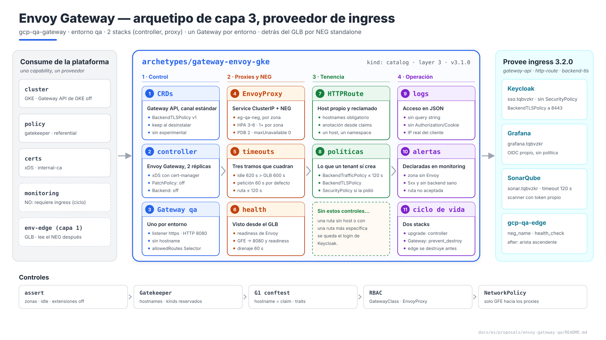
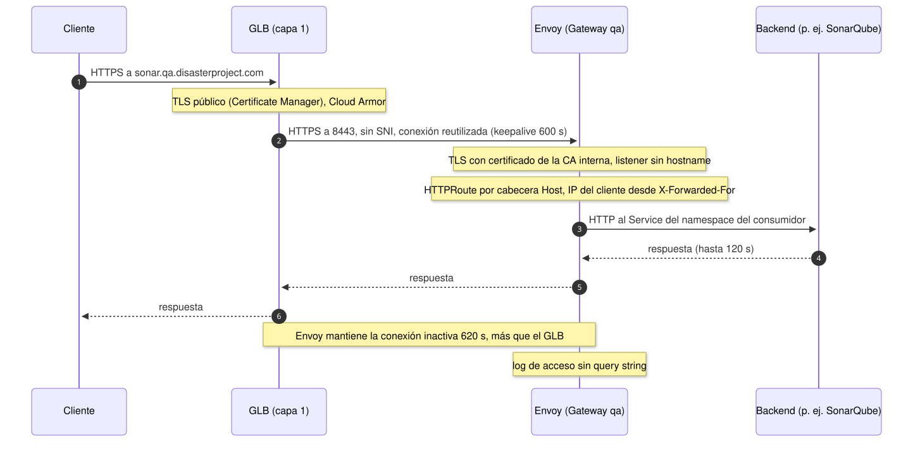

# Envoy Gateway en `qa` — arquetipo `gateway-envoy-gke` (capa 3), proveedor de `ingress`

| | |
|---|---|
| **Estado** | Propuesta · revisión 7 |
| **Alcance** | El arquetipo de capa 3 `gateway-envoy-gke` en `qa`: el camino de una petición desde el GLB hasta el pod, el Gateway único del entorno, quién puede enganchar qué ruta y con qué política, los CRDs de Gateway API, la flota de proxies y su relación con el NEG, tiempos de espera, observabilidad, red, contrato `ingress`, stacks, políticas, ejecución y plan |
| **Por qué ahora** | SonarQube (E1 §4.5, E2 §5.8), Keycloak (§8), monitorización (Grafana) y cert-manager (§1, §3) ya publican rutas en el Gateway `qa` o le emiten certificados, y cada uno lo daba por hecho. E2 §9 le dejó tres requisitos pendientes |
| **Especificación de referencia** | `archetype-model.md` (AM §n), `terramate-outputs-sharing-architecture.md` (§n), `risk-register.md` |
| **Diagramas** | `diagrams/*.mmd` (fuente Mermaid) y `diagrams/*.svg` (renderizados). El SVG se regenera desde el `.mmd`; no se edita a mano. `diagrams/06-bloques-presentacion.svg` (1920×1080, para presentaciones) se genera con `06-bloques-presentacion.py`, no con Mermaid |
| **Identificadores propios** | Decisiones `DG1…`, riesgos candidatos `RG1…`, verificaciones `VG1…`. Los riesgos reciben número `R54+` en `risk-register.md` si se adopta, detrás de los de las propuestas anteriores |

Nada de este documento reabre decisiones de `CLAUDE.md` (Envoy Gateway para ingress; un Gateway por entorno; recursos de Gateway API en el chart con `helm_release`, nunca `kubernetes_manifest`) ni de E1 (borde propio de `qa` en `disasterproject-nonprod`, NEG standalone, VPC separada).



Fuente: [`diagrams/06-bloques-presentacion.py`](diagrams/06-bloques-presentacion.py) — vista de presentación; el detalle está en §2–§9.

---

## 0. Contexto

| Pregunta | Respuesta | Consecuencia |
|---|---|---|
| Qué es | Arquetipo `gateway-envoy-gke`, `kind: catalog`, **capa 3**, provee **`ingress` 3.2.0** | El binding de `qa` ya lo enlaza: `ingress: { archetype: gateway-envoy-gke, version: 3.1.0, stack_id: gcp-qa-gateway }` |
| Stacks | 2: `gcp-qa-gateway-controller` y `gcp-qa-gateway-proxy` en `stacks/platforms/gcp/qa/gateway/` | Borrar el Gateway borra el NEG y deja el entorno sin borde: ciclo de vida propio (§8.2) |
| Componentes | Controlador de Envoy Gateway; flota de proxies Envoy; CRDs de Gateway API (canal estándar) y de Envoy Gateway | Todo Apache-2.0 |
| Qué **no** hace | El GLB, Cloud Armor, la IP y el certificado público (capa 1, `gcp-qa-edge`); el DNS (wildcard en `env-edge`); OIDC de SonarQube, Grafana o Keycloak, que se autentican solos | §1 |
| Consumidores en `qa` | Keycloak, Grafana y SonarQube: **tres rutas, ninguna con `SecurityPolicy`** | La maquinaria OIDC del Gateway queda preparada para aplicaciones futuras, sin uso el primer día |
| Modelo | `qa` dedicado | Sin budgets de `capacity` aplicados (E1 §0) |



Fuente: [`diagrams/01-contexto.mmd`](diagrams/01-contexto.mmd)

---

## 1. Qué hace el Gateway y qué no

| Tramo o función | Quién | Motivo |
|---|---|---|
| IP global, certificado `*.tqbvzkr.disasterproject.com`, Cloud Armor, backend service, URL map | **`gcp-qa-edge`**, capa 1 (E1 §4.15) | Deben estar en el mismo proyecto que el balanceador |
| NEG `eg-qa-neg` | El **controlador de NEG de GKE**, a partir de la anotación del Service que genera Envoy Gateway | Fuera del estado de Terraform (§10.2, R20); `gcp-qa-edge` lo lee como `data` |
| Tramo GLB → Envoy | **HTTP**, sin certificado (DG14) | El TLS público termina en el GLB con el certificado de la capa 1. Un certificado de la CA interna en este tramo hacía depender el borde (capa 1) de cert-manager (capa 3), y el GLB no lo validaba: cifraba sin autenticar |
| Enrutado por host y ruta, políticas de tráfico | Este arquetipo: Gateway `qa` y las `HTTPRoute` de los consumidores | Gateway API: la ruta vive con quien la publica (§10.6) |
| Autenticación de usuarios | **Cada aplicación**; la `SecurityPolicy` OIDC solo si el consumidor la pide (§4.3) | SonarQube (E1 §4.6), Grafana y Keycloak no pueden llevarla |
| Tráfico este-oeste | **Nadie**: DNS del Service | `CLAUDE.md`; Envoy no es un mesh |

**La arista ascendente.** `gcp-qa-edge` (capa 1) consume el NEG que crea esta capa 3: es la única arista hacia abajo en el grafo (AM §3) y se declara con `after` (§8.3).

---

## 2. El camino de una petición



Fuente: [`diagrams/02-camino-peticion.mmd`](diagrams/02-camino-peticion.mmd)

### 2.1 El listener

| Ajuste | Valor | Motivo |
|---|---|---|
| Listener | Uno, `http`, **puerto 8080**, `protocol: HTTP` | Por encima de 1024: sin remapeo de puertos y sin capacidades en el contenedor. Solo lo alcanzan los rangos del GFE (§5.2, §9.3) |
| `hostname` del listener | **Ninguno** | El host se decide en las `HTTPRoute`, por la cabecera `Host` (DG2): un solo sitio donde se declara qué nombre va a qué servicio |
| Certificado | **Ninguno** en el listener | cert-manager sigue emitiendo los certificados xDS del controlador (DG9) y los de `BackendTLSPolicy` hacia los backends que lo exigen; ninguno sale hacia el borde |
| Listener HTTPS | **No** | El cliente solo habla TLS con el GLB; la redirección de HTTP a HTTPS la hace el URL map del GLB. La aplicación sabe que el origen era HTTPS por `X-Forwarded-Proto` y por su URL base fijada (`sonar.core.serverBaseURL`, `hostname` de Keycloak) (VG1) |
| `allowedRoutes` | `kinds: [HTTPRoute]`, `namespaces.from: Selector` con `gateway.disasterproject.com/routes: "true"` | §4.1 |

### 2.2 Tiempos de espera

Tres tramos con tiempos propios. Si no cuadran, el fallo es un 502 intermitente sin nada en los logs de la aplicación.

| Tramo | Ajuste | Valor | Motivo |
|---|---|---|---|
| GLB → Envoy, keepalive | Fijo en el GLB | 600 s | Lo decide Google |
| Envoy, conexión de cliente inactiva | `ClientTrafficPolicy` `timeout.http.idleTimeout` | **620 s** | Debe superar al keepalive del GLB. Si Envoy cierra primero, el GLB reutiliza una conexión muerta y devuelve 502 (RG2, VG4) |
| GLB, respuesta del backend | Timeout del backend service (`gcp-qa-edge`) | 120 s | R45 |
| Envoy, petición | `BackendTrafficPolicy` sobre el **Gateway**: `timeout.http.requestTimeout: 60s` como valor por defecto | 60 s | Envoy aplica **15 s** por defecto a cada ruta si nadie lo cambia **(verificar en la versión fijada, VG6)**: la subida de un análisis grande se cortaría ahí (RG9) |
| Envoy, petición en una ruta concreta | `HTTPRoute` `rules[].timeouts.request` (canal estándar) | ≤ 120 s | La ruta manda sobre el valor del Gateway. Por encima de 120 s no sirve: el GLB corta antes |

### 2.3 Tamaño del cuerpo

E2 §9 pedía "un límite de cuerpo no inferior a 100 MiB". Envoy **no limita** el cuerpo mientras lo transmite en streaming: el límite aparece solo con filtros que lo almacenan (`ext_authz` con cuerpo, transformaciones, Wasm). El requisito se cumple **sin** configurar ningún límite y sin activar esos filtros en el Gateway; un assert lo protege (§9.1) y VG11 lo comprueba con una subida de 100 MiB a través del GLB.

### 2.4 IP del cliente

El GLB añade `<IP del cliente>,<IP del GLB>` a `X-Forwarded-For`. `ClientTrafficPolicy` con `clientIPDetection.xForwardedFor.numTrustedHops: 2` hace que Envoy registre y pase la IP real del cliente **(verificar el número exacto con una petición real, VG5)**. Sin esto, los logs de acceso y cualquier limitación por IP ven solo las IPs de los GFE.

---

## 3. CRDs de Gateway API

| Opción | Veredicto |
|---|---|
| **A. Los instala este arquetipo** (chart de CRDs de Envoy Gateway, **canal estándar**) y el Gateway API de GKE queda **desactivado** | **Sí** (DG3). Una sola versión, la que Envoy Gateway espera |
| B. Los instala GKE (`gateway_api_config.channel = CHANNEL_STANDARD`) | No: GKE gestiona los CRDs, los actualiza con el cluster y no permite modificarlos. La versión deja de ser la que pide Envoy Gateway, y además aparecen las `GatewayClass` `gke-l7-*`, con las que cualquiera que cree un `Gateway` obtendría un balanceador de Google sin Cloud Armor (RG5) |

| Ajuste | Valor |
|---|---|
| Canal | **Estándar**. `BackendTLSPolicy` está en él desde Gateway API v1.4, y es lo único que hace falta más allá de `Gateway`, `HTTPRoute` y `ReferenceGrant` |
| Canal experimental | **No**: sin `TCPRoute`, `TLSRoute` ni `UDPRoute`. Coherente con no ofrecer `tcp-route` (§7.1) |
| Versión de Envoy Gateway | La última minor estable al implementar, **≥ 1.6**, la primera que implementa Gateway API v1.4 **(verificar, VG10)** |
| Anotación de los CRDs | `helm.sh/resource-policy: keep`: desinstalar el chart no borra las `HTTPRoute` de nadie (el mismo patrón que ESO RE1 y cert-manager RT4) |
| GKE | `gateway_api_config { channel = "CHANNEL_DISABLED" }` en `gcp-qa-gke`: requisito nuevo a E1 §4.1 (§11) |

---

## 4. Quién puede enganchar qué



Fuente: [`diagrams/03-tenencia.mmd`](diagrams/03-tenencia.mmd)

Con un Gateway compartido, la precedencia de Gateway API decide entre rutas **de namespaces distintos**. La coincidencia de ruta más específica gana, venga de donde venga. Una `HTTPRoute` de un tenant con host `sso.tqbvzkr.disasterproject.com` y `Exact: /realms/disasterproject/protocol/openid-connect/auth` le quitaría a Keycloak la pantalla de login. Una `HTTPRoute` **sin `hostnames`** se aplica a todos los hosts del listener. Es el riesgo principal del arquetipo (RG1).

### 4.1 Enganchar una ruta

| Control | Dónde | Qué impide |
|---|---|---|
| Etiqueta `gateway.disasterproject.com/routes: "true"` en el namespace | `allowedRoutes` del Gateway | Que un namespace cualquiera publique. La pone el stack `iam` del consumidor |
| Anotación `gateway.disasterproject.com/hostnames` en el namespace, con los hostnames que la resolución adjudicó a la instancia | Stack `iam`, desde los claims (AM §8) | — (es el dato que usan las dos reglas siguientes) |
| `HTTPRoute` con `hostnames` obligatorio, sin comodines y contenido en esa anotación | Gatekeeper (§9.2) | Rutas sin host y hosts de otro |
| Un hostname, un namespace | Gatekeeper con `referential-constraints` (datos sincronizados de las `HTTPRoute`) | Que dos namespaces publiquen el mismo host, aunque sea con rutas distintas |
| El hostname es un claim de la instancia | conftest G1 contra el ledger de claims | Que el stack `iam` escriba en la anotación un host que no es suyo. Todos los stacks de `qa` se aplican con la misma identidad de pipeline, así que el control de fondo es este; Gatekeeper comprueba la forma (el mismo reparto que E2 §5.5) |
| `parentRefs` solo al Gateway `qa` de `envoy-gateway-system`, sección `https` | Gatekeeper | Rutas colgadas de otro Gateway |
| `backendRefs` solo a Services del propio namespace | Gatekeeper, salvo `ReferenceGrant` autorizado (§4.3) | Que una ruta sirva el Service de otro tenant |

### 4.2 Lo que un tenant **no** puede crear

| Kind | Motivo | Cómo |
|---|---|---|
| `Gateway` fuera de `envoy-gateway-system` | Cada `Gateway` crea su propia flota de Envoy y su Service. Un Gateway de tenant reintroduce el fan-in (§10.6) y podría intentar reclamar el mismo nombre de NEG | Gatekeeper |
| `GatewayClass`, `EnvoyProxy` | Configuran la flota y el Service del borde | RBAC (cluster-scoped o del namespace del Gateway) y Gatekeeper |
| `ClientTrafficPolicy` | Se asocia al Gateway: afecta a todos | Gatekeeper: solo en `envoy-gateway-system` |
| `EnvoyPatchPolicy` | Parchea xDS a mano: cualquier cosa, incluida otra ruta | **Desactivada** en el controlador (`extensionApis.enableEnvoyPatchPolicy: false`) y denegada por Gatekeeper |
| `Backend` (CRD de Envoy Gateway) | Un backend por IP o FQDN arbitrario: desde el Gateway se llegaría a `169.254.169.254` (servidor de metadatos) o a cualquier IP de la VPC | **Desactivado** (`extensionApis.enableBackend: false`) y denegado |
| `EnvoyExtensionPolicy` | Wasm, Lua o `ext_proc` corriendo **dentro** del proxy compartido | Gatekeeper: denegada fuera de `envoy-gateway-system` |
| `Service` de tipo `LoadBalancer` o `NodePort`, y `externalIPs` | Un balanceador de Google al lado del Gateway, sin Cloud Armor (RG5) | Reglas P5 y P6 de `policy-gatekeeper` (propuesta de Gatekeeper §4.1): no son kinds de este arquetipo. Para protocolos que no son HTTP, excepción por nombre con justificación de negocio (§4.4) |

### 4.3 Lo que un tenant sí puede crear, con límites

| Kind | Límite | Motivo |
|---|---|---|
| `HTTPRoute` | §4.1 | — |
| `BackendTrafficPolicy` sobre sus rutas | `requestTimeout` ≤ 120 s; sin `targetRefs` al Gateway | Por encima de 120 s el GLB corta antes (§2.2) |
| `BackendTLSPolicy` sobre sus Services | `caCertificateRefs` al `ConfigMap` `internal-ca-bundle` o a `WellKnownCACertificates: System` | Keycloak §8.1; confianza repartida por trust-manager (cert-manager §4) |
| `SecurityPolicy` OIDC o JWT sobre sus rutas | Solo en namespaces con `gateway.disasterproject.com/security-policy: "true"`, que el generador pone si el manifiesto exige el trait `oidc-security-policy` o `jwt-auth`. Nunca sobre la ruta de Keycloak (R22). Siempre con `provider.backendRefs` a `internal_service` (Keycloak §8.2) | Una `SecurityPolicy` rompe a los clientes máquina (R44); se opta por ella, no se hereda |
| `ReferenceGrant` | **Solo** en el namespace `keycloak`, con nombre `sp-<instancia>`, `from` = `SecurityPolicy` del propio namespace, `to` = el Service de Keycloak | `provider.backendRefs` cruza namespaces: sin `ReferenceGrant` en el destino, Envoy Gateway lo rechaza **(verificar, VG7)**. Tenant resource nuevo de Keycloak (§11) |

**Ninguna `SecurityPolicy` a nivel de Gateway.** Autenticaría todo, incluido el CI de SonarQube y el propio Keycloak (R22, R44). Lo impide un assert en `proxy` (§9.1).

**Fail-closed.** Con Keycloak caído, una ruta con `SecurityPolicy` deniega (Keycloak DK6). En `qa` no hay ninguna el primer día.

### 4.4 Tráfico que no es HTTP: excepciones a `LoadBalancer` y `NodePort`



Fuente: [`diagrams/07-excepciones.mmd`](diagrams/07-excepciones.mmd)

El borde de `qa` es un balanceador L7 y solo transporta HTTP(S). La regla por defecto de §4.2 (ningún `Service` `LoadBalancer` ni `NodePort`) deja sin salida a los protocolos que no son HTTP. Para esos casos se admite una **excepción por nombre**, con una justificación de negocio que se revisa en la PR y caduca (DG13). La excepción es siempre **comunicación directa L4** (patrón B): el balanceador no termina nada, la IP de origen llega intacta y el TLS, si lo hay, termina en la aplicación.

**Un `NodePort` por sí solo no publica nada.** Los nodos de `qa` son privados y la org policy prohíbe IPs públicas en ellos (E1 §5). Un `NodePort` abre un puerto del rango 30000–32767 en **todos** los nodos, visible solo desde la VPC. Para que un tercero llegue por SSH hace falta un balanceador delante, y la decisión real es cuál:

| Patrón | Qué hay delante | ¿En estado de Terraform? | IP del cliente en la aplicación | Veredicto |
|---|---|---|---|---|
| A. `Service` `LoadBalancer` | Un balanceador de red passthrough que crea GKE por cada Service | **No** | Sí | **No se admite**. Lo crea y lo borra un controlador: fuera del estado, sin revisión del borde en la PR y con la IP ligada al ciclo de vida del Service |
| **B. `NodePort` fijo + balanceador de red passthrough externo en `gcp-qa-edge`** | Backend service regional en Terraform sobre los grupos de instancias de los nodos | Sí | **Sí** | **Patrón elegido** (DG13) para todo tráfico que no es HTTP: comunicación directa, IP de origen sin cambios (auditoría, listas de origen), TCP y UDP, y TLS extremo a extremo |
| C. `ClusterIP` con NEG standalone + balanceador de red proxy externo (TCP) en `gcp-qa-edge` | El mismo modelo que el camino HTTP (§10.2) | Sí, salvo el NEG | Solo con PROXY protocol en la aplicación | **Descartado**: mete un proxy en medio, pierde la IP de origen salvo que la aplicación entienda PROXY protocol, no admite UDP y termina conexiones que deben ser directas |
| D. Interno (`networking.gke.io/load-balancer-type: Internal`) | Balanceador de red passthrough **interno** hacia el hub u on-premise | Sí, declarado en Terraform como el B | Sí | La variante interna del B. Solo si existe el peering o la VPN (E1 §4.15); pasa por la misma excepción |

**Un passthrough no traduce puertos.** El balanceador entrega el paquete con su IP y su puerto de destino originales. Si lo publicado es el puerto 22, el nodo recibe `IP del balanceador:22`, no el `nodePort`. Hay dos formas de que llegue al pod:

| Forma | Cuándo | Condición |
|---|---|---|
| El puerto publicado **es** el `nodePort` (30000–32767) | La contraparte puede usar un puerto alto | Ninguna |
| El `Service` declara `externalIPs: [IP del balanceador]` y kube-proxy captura ese destino en cada nodo | El puerto está impuesto (22 para SFTP, 25 para SMTP) | `externalIPs` permite a un `Service` secuestrar el tráfico hacia cualquier IP (CVE-2020-8554). Gatekeeper solo lo admite con la IP reclamada por esa misma excepción **(verificar, VG13)** |

**Certificado de una excepción con TLS (pregunta abierta, antes Q-B1 de la propuesta de Kafka).** Con el patrón B el TLS termina en el pod, y una contraparte de internet espera un nombre público. La CA interna no los firma (cert-manager DT10), y el certificado de Certificate Manager no se exporta a un pod. Hay dos opciones:
- un `ClusterIssuer` ACME con DNS-01, acotado a los nombres de las `exposures` aprobadas;
- una CA privada que la contraparte instala.

La primera es la recomendada, porque la contraparte no tiene que confiar en nada nuestro. Mientras no se decida, solo se admiten excepciones cuyo protocolo no dependa de nuestro certificado (SFTP autentica al servidor por su clave de host) o de patrón D.

**Casos admisibles**: el protocolo no es HTTP y la contraparte no puede cambiarlo.

| Caso | Puerto | Por qué no hay opción implícita | Justificación de negocio exigida | Patrón |
|---|---|---|---|---|
| **SFTP con terceros** (bancos, administraciones, proveedores) | 22 publicado; el contenedor escucha en 2222 | El tercero solo entrega o recoge por SFTP; no tiene API ni HTTPS | Contrato o especificación del tercero que lo exige; proceso de negocio que depende del intercambio; volumen y periodicidad; clasificación de los datos | B, con lista de IPs del tercero |
| **Git por SSH** hacia un servidor Git propio | 22 | Casi nunca: HTTPS con token cubre el caso a través del Gateway | Una herramienta externa que solo admite SSH, identificada por nombre y versión | B; se rechaza si HTTPS sirve |
| **MQTT o AMQP de dispositivos** | 8883, 5671 | Firmware fijado que no habla MQTT sobre WebSocket (la opción implícita, que sí pasa por el Gateway) | Flota de dispositivos, versión de firmware y fecha prevista de actualización | B, solo TLS |
| **mTLS terminado en la aplicación** (certificado de cliente regulado) | 443 en una IP propia | El GLB termina TLS. Su mTLS en el borde (con `TrustConfig`) pasa los datos del certificado en cabeceras, que es la opción implícita y suele bastar | Norma que obliga a que la aplicación valide la cadena completa del cliente, citada | B |
| **Correo entrante SMTP** | 25 (y 587 si hay envío autenticado de terceros) | Un proceso recibe documentos por correo (facturas, pedidos) | El proceso, el volumen y por qué no sirve un servicio de correo gestionado que entregue por webhook HTTP (la opción implícita) | B, con STARTTLS obligatorio |
| **LDAPS** hacia un directorio propio | 636 | Aplicaciones de terceros o legado que solo autentican contra LDAP | Aplicación, versión y por qué no admite OIDC ni SAML contra Keycloak (la opción implícita) | D si la aplicación está en la red corporativa; B solo con lista de IPs |
| **RADIUS** | UDP 1812/1813 | Equipos de red o Wi-Fi que autentican usuarios contra el entorno | Inventario de equipos y proceso de acceso que depende de ellos | D preferente; B con lista de IPs |
| **Protocolos industriales** (OPC UA) | 4840 | Equipos de planta y pasarelas que solo hablan OPC UA | Planta, equipos y datos que se recogen | B con OPC UA en modo `SignAndEncrypt`; los que no cifran (Modbus TCP 502), solo por D |
| **Salud** (HL7 v2 sobre MLLP, DICOM) | 2575, 104/11112 | Equipos clínicos e integraciones hospitalarias que no hablan FHIR/HTTP | Centro, equipos y flujo clínico; datos de salud, clasificación máxima | D o B con TLS; nunca en claro por internet |
| **Finanzas** (FIX, ISO 8583) | El acordado con la contraparte | Mercados o procesadores de pago con protocolo impuesto | Contrato con la contraparte y su especificación de conectividad | B con TLS y lista de IPs de la contraparte, o D por la línea dedicada |
| **Traps SNMP y syslog de equipos gestionados** | UDP 162, 514/6514 | Equipos que solo notifican por SNMP o syslog | Inventario de equipos y proceso de operación que depende de las alertas | B (el passthrough admite UDP) o D |
| **Voz** (SIP y RTP) | 5060/5061, rango RTP | Centralitas y troncales SIP de un operador | Contrato con el operador y rango de puertos RTP acotado | B, con SIP sobre TLS (5061) y SRTP |

**Nunca es una excepción válida:**

| Petición | Alternativa |
|---|---|
| SSH administrativo a nodos o pods | `kubectl exec` con el acceso del pipeline (E1 §4.13), IAP para nodos |
| Base de datos expuesta a herramientas externas (BI, clientes SQL) | Conectividad privada (patrón D) o exportación; nunca un puerto de base de datos en internet |
| Depuración, pruebas o "temporal" | Entorno efímero; `kubectl port-forward` |
| Saltarse Cloud Armor, los timeouts o el tamaño de cuerpo del Gateway | Resolverlo en el Gateway (§2.2, §2.3) |
| VPN terminada en un pod (IPsec, WireGuard) | Cloud VPN o Interconnect en la capa 0 o 1 |
| DNS autoritativo propio | Cloud DNS |
| Un protocolo sin cifrar por internet (Modbus, HL7 MLLP en claro, SNMPv1/v2c) | Patrón D por la red privada, o el mismo protocolo con TLS |
| gRPC o WebSocket | Son HTTP: pasan por el Gateway (gRPC con el trait `grpc-route` cuando se ofrezca, §7.1) |
| Kafka desde fuera de la VPC | Ninguna: Kafka es un bus interno. Los clientes de la VPC fuera del cluster los atiende el propio arquetipo con un balanceador interno (propuesta de Kafka §6.3, DB8) |

**Cómo se declara.** Un bloque nuevo `exposures` en el manifiesto. Es una extensión del esquema que entra por `registry/`, no a mano (R34); **propuesta, sin aplicar**:

```yaml
exposures:
  - name: sftp-partners
    service: sftp                   # Service del propio namespace
    protocol: TCP
    tls: true                       # SFTP cifra; sin TLS solo con pattern: internal
    port: 22                        # puerto publicado en el balanceador
    targetPort: 2222
    nodePort: 30022                 # fijo: reglas de firewall y health check deterministas
    externalIP: claim               # 22 impuesto: el Service declara externalIPs con la IP reclamada
    pattern: passthrough            # passthrough (B, externo) | internal (D, variante interna)
    sources: [203.0.113.0/28]       # 0.0.0.0/0 solo con public: true y segunda aprobación
    justification:
      business_owner: equipo-integraciones
      reason: "Entrega diaria de ficheros de <tercero> por SFTP (contrato <ref>)"
      alternative_rejected: "El tercero no ofrece API ni HTTPS (<ref>)"
      data_classification: confidencial
      review_by: 2027-03-31
```

| Control | Dónde | Qué comprueba |
|---|---|---|
| Declaración completa | G1 | Todo `Service` `LoadBalancer` o `NodePort` del chart tiene su `exposures`; los campos de `justification` no están vacíos; `review_by` no ha pasado. Una excepción caducada **falla la PR siguiente** y obliga a revisarla |
| Origen acotado | G1 | `sources` no es `0.0.0.0/0` salvo `public: true`, que exige la aprobación de seguridad además de la de plataforma |
| Cifrado | G1 | Un protocolo declarado sin TLS (`tls: false`) solo se admite con `pattern: internal` |
| Aprobación | `CODEOWNERS` sobre `exposures` | Plataforma y seguridad revisan la PR, como una subida de `capacity` en un entorno compartido (guía del desarrollador, `CLAUDE.md`) |
| Exención en admisión | Gatekeeper (`policy-gatekeeper`) | La exención es por `namespace/Service`, generada por el resolver en los parámetros del constraint, **nunca por namespace entero**. Tipo A (`LoadBalancer` sin `internal`) siempre denegado |
| `externalIPs` | Gatekeeper | Solo en un `Service` con excepción y solo con la IP reclamada por ella; en cualquier otro, denegado (CVE-2020-8554) |
| El balanceador | `gcp-qa-edge-l4` (propuesta `edge-qa` §5) | Forwarding rule, backend service y regla de firewall por excepción, con `sources` en la regla. La IP es un claim del entorno (AM §8) |
| Controles compensatorios | Arquetipo consumidor | Sin Cloud Armor L7, la aplicación autentica con claves, nunca con contraseña (SFTP), registra la IP de origen, y su `NetworkPolicy` solo admite el puerto publicado |

---

## 5. La flota de proxies y el NEG



Fuente: [`diagrams/05-despliegue.mmd`](diagrams/05-despliegue.mmd)

### 5.1 `EnvoyProxy`

| Ajuste | Valor | Motivo |
|---|---|---|
| Service | `type: ClusterIP` con `cloud.google.com/neg: '{"exposed_ports":{"8080":{"name":"eg-qa-neg"}}}'` | Sin balanceador por Service; nombre de NEG determinista (§10.2) |
| Réplicas | HPA **3–6**, CPU al 70 % | NEG zonal: ≥ 1 pod por zona de `europe-west1` (b, c, d); assert `minReplicas ≥ zonas` (§10.2, RG3) |
| Reparto | `topologySpreadConstraints` por `topology.kubernetes.io/zone`, `maxSkew: 1`, `DoNotSchedule`; por nodo, `ScheduleAnyway` | Una zona sin pods deja su NEG vacío |
| Node pool | `system`: Envoy es capa 3 | El generador pone el selector y la tolerancia (propuesta de GKE §5.3, DN11) |
| `PodDisruptionBudget` | `minAvailable: 2` | Un upgrade de nodos no deja una zona sin Envoy |
| Rollout | `maxUnavailable: 0`, `maxSurge: 1`, `minReadySeconds: 30` | El pod nuevo tarda en aparecer como sano en el GLB. Con NEG standalone no hay *readiness gate* que lo espere **(verificar, VG3)** y un rollout rápido deja al GLB sin backends sanos durante unos segundos (RG4) |
| Drenaje | `shutdown.drainTimeout: 60s`; `terminationGracePeriodSeconds: 90`; `connection_draining_timeout_sec: 60` en el backend service | El GLB deja de enviar antes de que Envoy cierre |
| Recursos por pod | Petición 500m / 512 MiB; límite de memoria 1 GiB | Punto de partida; se ajusta con las métricas de la fase 3 |
| Seguridad | PSS `restricted`: no root, `drop: [ALL]`, `seccompProfile: RuntimeDefault` | El puerto 8080 no necesita `NET_BIND_SERVICE` **(verificar el sidecar `shutdown-manager`, VG12)** |
| Log de acceso | JSON a stdout; ruta con **`%REQ_WITHOUT_QUERY(:PATH)%`**; `x-request-id`, nombre de la ruta, `%RESPONSE_FLAGS%`, IP del cliente (§2.4) | La query del callback OIDC lleva `code` y `state`, y la de Keycloak, códigos de sesión: no deben acabar en Loki (RG8). Sin cabeceras `Authorization` ni `Cookie` |

### 5.2 Salud vista desde el GLB

| Ajuste | Valor | Motivo |
|---|---|---|
| Health check | HTTP, `USE_FIXED_PORT` al puerto de readiness de Envoy, ruta `/ready` **(puerto a confirmar en la versión fijada, VG2)** | Contra 8080, una petición sin host conocido devuelve 404 y el GLB marcaría todos los backends como caídos |
| Firewall de la VPC | `35.191.0.0/16` y `130.211.0.0/22` → nodos, TCP 8080 y el puerto de readiness | Tráfico de datos y health checks del GLB llegan desde esos rangos. Selector `cidr:` legítimo (AM §6.3); lo declara este manifiesto (§8.1) |

### 5.3 El controlador

| Ajuste | Valor | Motivo |
|---|---|---|
| Réplicas | 2, con elección de líder | Si cae, los proxies siguen con la última configuración; solo se congelan los cambios |
| Certificados xDS (controlador ↔ proxies) | De **cert-manager** (`internal-ca`), en lugar del Job `certgen` del chart **(verificar el soporte en la versión fijada, VG8)** | Los certificados de `certgen` no se renuevan solos: al caducar, los proxies pierden el plano de control (RG10). Con cert-manager se renuevan y se vigilan con las alertas de cert-manager §6 |
| Extensiones | `enableEnvoyPatchPolicy: false`, `enableBackend: false` | §4.2 |
| `mergeGateways` | No | Un solo Gateway (§10.6) |

---

## 6. Observabilidad

Las reglas las declara el arquetipo de monitorización (monitorización §5.1): `monitoring` requiere `ingress` para publicar Grafana, así que `ingress` no puede requerir `monitoring`. Es el mismo ciclo que ESO §9.1 y cert-manager §6.

| Alerta | Señal | Umbral |
|---|---|---|
| Zona sin Envoy | kube-state-metrics: pods `Ready` del proxy por zona | 0 en alguna zona durante 5 min: su NEG queda vacío |
| Errores 5xx por ruta | `envoy_cluster_upstream_rq_xx{envoy_response_code_class="5"}` | > 5 % durante 10 min |
| Sin backend sano | `%RESPONSE_FLAGS%` `UH` y `UF` en el log de acceso, o `envoy_cluster_membership_healthy == 0` | Cualquiera durante 5 min |
| Rutas no aceptadas | kube-state-metrics (custom resource state) sobre `status.parents[].conditions` de `HTTPRoute` | `Accepted=False` o `ResolvedRefs=False` > 10 min: casi siempre un hostname o `parentRefs` mal puesto |
| Gateway no programado | Igual, sobre `Gateway` | `Programmed=False` > 5 min |
| Controlador | Métricas del controlador (errores de traducción xDS) **(nombres a confirmar, VG10)** | Cualquiera sostenido |
| Certificados xDS | cert-manager §6 | < 14 días |
| Backends caídos vistos desde el GLB | Cloud Monitoring, `loadbalancing.googleapis.com/https/backend_request_count` por clase de respuesta. Alerta basada en métricas de la **capa 1b** (`cloud-observability`) | 5xx de origen `backend` > 5 % durante 10 min |

La última es la única que ve lo que Prometheus no puede ver: el GLB sin backends sanos no llega a Envoy.

---

## 7. El contrato `ingress` 3.2.0

### 7.1 Salidas y traits

| Salida | Valor en `qa` | Uso |
|---|---|---|
| `gateway_name` | `qa` | `parentRefs` de las `HTTPRoute` (E2 §5.8) |
| `gateway_namespace` | `envoy-gateway-system` | Idem; `NetworkPolicy` de los consumidores (Envoy → su Service) |
| `listener_name` | `https` | `parentRefs[].sectionName` |
| `route_namespace_label` | `gateway.disasterproject.com/routes: "true"` | Etiqueta del namespace para poder enganchar rutas |
| `security_policy_label` | `gateway.disasterproject.com/security-policy: "true"` | Etiqueta del namespace para poder crear `SecurityPolicy` |
| `neg_name` | `eg-qa-neg` | `gcp-qa-edge`: `data "google_compute_network_endpoint_group"` por zona |
| `health_check` | `{ port: 19003, path: "/ready" }` (puerto a confirmar, VG2) | `gcp-qa-edge`: health check del backend service |

Todas son deterministas y los consumidores las reciben como globals. `gcp-qa-edge` necesita además `after`: el NEG no existe hasta que hay proxies listos (§8.3). Las cinco últimas son nuevas y compatibles con la versión que ya se consume (`>=3.0.0 <4.0.0`), así que el contrato sube a **3.2.0** (MINOR, AM §4.5).

| Trait | ¿Lo ofrece? | Motivo |
|---|---|---|
| `gateway-api`, `http-route` | Sí | — |
| `cross-namespace-refgrant` | Sí | `ReferenceGrant` hacia Keycloak (§4.3) |
| `oidc-security-policy`, `jwt-auth` | Sí | `SecurityPolicy` de Envoy Gateway |
| `local-rate-limit` | Sí | `BackendTrafficPolicy` |
| **`backend-tls`** (nuevo) | Sí | `BackendTLSPolicy`, canal estándar. Keycloak lo usa (§8.1 de su propuesta) y hasta ahora no había trait que lo expresara (DG11) |
| `grpc-route` | **No** | El backend service del GLB habla HTTPS (HTTP/1.1) con Envoy. gRPC exigiría protocolo HTTP/2 en el borde: se ofrecerá cuando alguien lo necesite |
| `tcp-route` | **No** | Canal experimental, y además no pasa por un balanceador L7 |
| `global-rate-limit` | **No** | Necesita el servicio de rate limit y Redis |
| `mtls-backend` | **No** | Nadie lo pide en `qa` |
| `ingress-api` | **No** | Sin `Ingress` clásico |

### 7.2 Lo que escribe un consumidor

```yaml
apiVersion: gateway.networking.k8s.io/v1
kind: HTTPRoute
metadata: { name: sonarqube, namespace: sonarqube }
spec:
  parentRefs:
    - { name: qa, namespace: envoy-gateway-system, sectionName: https }   # = gateway_name, gateway_namespace, listener_name
  hostnames: [sonar.tqbvzkr.disasterproject.com]                               # = claim de la instancia
  rules:
    - matches: [{ path: { type: PathPrefix, value: / } }]
      backendRefs: [{ name: sonarqube, port: 9000 }]
      timeouts: { request: 120s }                                         # ≤ timeout del backend service
```

| Regla | Por qué |
|---|---|
| `hostnames` obligatorio, sin comodines, igual a sus claims | §4.1 |
| `timeouts.request` en la ruta, no una `BackendTrafficPolicy` | Canal estándar; no ata al consumidor a un kind de Envoy (§11) |
| Namespace con `route_namespace_label` | `allowedRoutes` |
| `NetworkPolicy` del consumidor: entrada desde `envoy-gateway-system` al puerto del Service | Default-deny de cada namespace |

---

## 8. El arquetipo

### 8.1 Manifiesto

```yaml
# archetypes/gateway-envoy-gke/manifest.yaml
apiVersion: archetype/v1
kind: Archetype

metadata:
  name: gateway-envoy-gke
  version: 3.1.0
  layer: 3
  kind: catalog
  description: Envoy Gateway con un Gateway por entorno, detrás del GLB por NEG standalone
  owners: [team-platform]

runtimes: [gke]

requires:
  - capability: cluster
    version: "^2.0.0"
  - capability: policy
    version: "^1.0.0"
    traits: [gatekeeper, referential-constraints]
  - capability: certs
    version: "^1.1.0"
    traits: [cert-manager]

provides:
  - capability: ingress
    version: 3.2.0
    traits: [gateway-api, http-route, backend-tls, cross-namespace-refgrant,
             oidc-security-policy, jwt-auth, local-rate-limit]
    outputs:
      - { name: gateway_name,          from: proxy }
      - { name: gateway_namespace,     from: controller }
      - { name: listener_name,         from: proxy }
      - { name: route_namespace_label, from: proxy }
      - { name: security_policy_label, from: proxy }
      - { name: neg_name,              from: proxy }
      - { name: health_check,          from: proxy }

stacks:
  - name: controller
  - name: proxy
    after: [controller]

firewall:                             # hacia los nodos donde corren los proxies (self)
  - name: glb-gfe-to-envoy
    from: cidr:35.191.0.0/16
    to: self
    ports: [8080, 19003]              # 19003: readiness del proxy, a confirmar (VG2)
  - name: glb-legacy-to-envoy
    from: cidr:130.211.0.0/22
    to: self
    ports: [8080, 19003]

capacity:
  cpu_millicores: 3200
  memory_mib: 3584
  pods: 8
  workload_identities: 0
```

`runtimes: [gke]`: el NEG es de GKE; en EKS y AKS son otros arquetipos (`gateway-envoy-eks`, `gateway-agfc-aks`, AM §14.2). El arquetipo se queda en **3.1.0**, la versión que fijan los bindings de `qa` y `demos`; lo que sube es el contrato, igual que en cert-manager §8.1. **No requiere `monitoring`**, porque monitoring requiere `ingress`. Tampoco `secrets`: el Gateway no guarda ningún secreto, y los client secrets de OIDC son de cada consumidor (Keycloak §6.5). Ni `oidc-idp`, porque Keycloak requiere `ingress`.

### 8.2 Los stacks

| Stack | Contenido | Entradas por sharing |
|---|---|---|
| `controller` | Namespace `envoy-gateway-system` (PSS `restricted`); `helm_release` de los CRDs (canal estándar, `keep`) y del controlador de Envoy Gateway (§5.3); `Certificate` xDS; `NetworkPolicy` (§9.3); los `ConstraintTemplate` de los kinds de Gateway API y de Envoy Gateway | `cluster_endpoint`, `cluster_ca` |
| `proxy` | Chart propio con `GatewayClass` `envoy-qa`, `EnvoyProxy` `edge-proxy`, `Gateway` `qa`, `ClientTrafficPolicy`, `BackendTrafficPolicy` por defecto, HPA, PDB y los `Constraint` de §9.2; `prevent_destroy` sobre el `helm_release` | `cluster_*` |

**Por qué dos stacks.** Un upgrade de Envoy Gateway es rutinario. Borrar el Gateway, no: borra el Service, el controlador de NEG borra `eg-qa-neg` y el GLB se queda sin backends, con el entorno entero fuera de servicio. Con los stacks separados, un PR de versión nunca planifica un cambio sobre el Gateway, y destruirlo exige un PR explícito que quite `prevent_destroy`. Es el mismo razonamiento que la CA de cert-manager §8.2.

### 8.3 Orden

| Arista | Tipo | Motivo |
|---|---|---|
| `proxy` → `gcp-qa-certs-ca` | `after` | El `Certificate` del backend necesita el `ClusterIssuer` (cert-manager RT6) |
| `gcp-qa-edge` → `proxy` | `after` + `data` del NEG | La arista ascendente (§1). En la preview, el `data` falla y se usa el mock (`--mock-on-fail`, §10.2) |
| Consumidores (`frontdoor` de Keycloak, Grafana y SonarQube) → `proxy` | `after` | Una `HTTPRoute` antes que el Gateway queda `Accepted=False` hasta que existe. No rompe nada, pero confunde el criterio de salida |

Destrucción en orden inverso: `gcp-qa-edge` primero (el backend service suelta el NEG) y después el Gateway. Al revés, el NEG queda retenido porque sigue referenciado (§10.8).

---

## 9. Políticas y red

### 9.1 `assert` en generación

```hcl
assert {
  assertion = global.gateway_values.proxy.hpa.minReplicas >= length(global.cluster.zones)
  message   = "ingress: minReplicas por debajo del número de zonas deja un NEG vacío (RG3)"
}
assert {
  assertion = !tm_can(global.gateway_values.gateway.listeners[0].hostname)
  message   = "ingress: el listener no lleva hostname; el host lo deciden las rutas (DG2)"
}
assert {
  assertion = global.gateway_values.clientTrafficPolicy.idleTimeoutSeconds > 600
  message   = "ingress: idle timeout de Envoy por encima del keepalive de 600 s del GLB (RG2)"
}
assert {
  assertion = !global.gateway_values.controller.enableEnvoyPatchPolicy && !global.gateway_values.controller.enableBackend
  message   = "ingress: EnvoyPatchPolicy y Backend desactivados (RG6)"
}
assert {
  assertion = !tm_can(global.gateway_values.gateway.securityPolicy) && !tm_can(global.gateway_values.gateway.bodyBuffering)
  message   = "ingress: sin SecurityPolicy ni buffering a nivel de Gateway (R22, R44, E2 §9)"
}
```

### 9.2 Gatekeeper y conftest

Los `ConstraintTemplate` los despliega este arquetipo: quien define un kind define sus reglas de admisión (ESO §10.2). Por eso requiere `policy`.

| Regla | Dónde | Qué comprueba |
|---|---|---|
| **Nueva:** `HTTPRoute` con host propio | Gatekeeper | `hostnames` no vacío, sin comodín, contenido en la anotación del namespace (§4.1) |
| **Nueva:** host único | Gatekeeper (`referential-constraints`) | Ninguna otra `HTTPRoute` de otro namespace usa el mismo host |
| **Nueva:** `parentRefs` y `backendRefs` | Gatekeeper | Solo el Gateway `qa`; `backendRefs` del propio namespace salvo `ReferenceGrant` autorizado |
| **Nueva:** kinds reservados | Gatekeeper | `Gateway`, `ClientTrafficPolicy`, `EnvoyProxy`, `EnvoyPatchPolicy`, `EnvoyExtensionPolicy` y `Backend` solo en `envoy-gateway-system` |
| **Nueva:** `BackendTrafficPolicy` de tenant | Gatekeeper | `requestTimeout` ≤ 120 s; sin `targetRefs` a un `Gateway` |
| **Nueva:** `SecurityPolicy` solo donde se pidió | Gatekeeper | Namespace con `security_policy_label`. Sustituye a la regla genérica que proponía E2 §7.4. Las reglas de Keycloak §12 (nunca sobre su ruta; `backendRefs` a `internal_service`) se mantienen |
| **Nueva:** `ReferenceGrant` | Gatekeeper | Solo `sp-<instancia>` en `keycloak`, con la forma de §4.3 |
| **Nueva:** hostname reclamado | G1 | Cada `hostnames` de una `HTTPRoute` del chart es un claim de la instancia en `resolution.json` |
| **Nueva:** traits | G1 | Un chart con `SecurityPolicy` exige `oidc-security-policy` o `jwt-auth`; con `BackendTLSPolicy`, `backend-tls`; con `ReferenceGrant`, `cross-namespace-refgrant` |

### 9.3 Red



Fuente: [`diagrams/04-red.mmd`](diagrams/04-red.mmd)

`NetworkPolicy` default-deny de entrada y salida en `envoy-gateway-system`:

| Origen | Destino | Puerto | Nota |
|---|---|---|---|
| GFE del GLB (`35.191.0.0/16`, `130.211.0.0/22`) | Proxies | 8080 y readiness | `ipBlock`. Es la única entrada de fuera del cluster, y la única que alcanza el listener HTTP |
| Prometheus | Proxies y controlador | Métricas (19001 en el proxy) **(verificar, VG10)** | |
| Proxies | Controlador | 18000 (xDS) | |
| Proxies | Namespaces con `route_namespace_label` | Puertos de sus Services | La `NetworkPolicy` de cada consumidor restringe el puerto (§7.2) |
| Proxies | `keycloak` | 8443 | `SecurityPolicy` (`backendRefs`) y la ruta de Keycloak |
| Controlador | API de Kubernetes | 443 | |
| Todos | kube-dns | 53 | |
| Todos | Internet | **Denegado** | Sin OIDC contra IdP externos: el IdP es Keycloak, en el cluster |

**Ningún tráfico interno pasa por Envoy.** Grafana → Keycloak, el reconciliador → Keycloak y cualquier llamada entre servicios van por el Service (este-oeste por DNS, `CLAUDE.md`). Por eso la entrada a los proxies se limita a los GFE.

---

## 10. Ejecución

| Qué | Cómo |
|---|---|
| Primer despliegue | Fase B de E1 §6, después de `gcp-qa-policy` y `gcp-qa-certs-ca`, **antes** de `gcp-qa-edge`, Keycloak y monitorización. Criterio de salida: `Gateway` `Programmed=True`; `eg-qa-neg` en las tres zonas con endpoints sanos en el GLB; una `HTTPRoute` de prueba con un host reclamado responde a través del GLB; una sin `hostnames` es rechazada en admisión |
| Upgrade de Envoy Gateway | Stack `controller`: CRDs primero, después el controlador; el controlador actualiza la imagen de los proxies y hace un rollout con `maxUnavailable: 0`. Ensayo en efímero con carga (VG3) |
| Cambio de configuración del Gateway | Stack `proxy`; un PR de `ClientTrafficPolicy` o `EnvoyProxy` reinicia los proxies si cambia el Deployment |
| Destrucción | `gcp-qa-edge` primero (§8.3). El stack `proxy` se detiene en `prevent_destroy` |

---

## 11. Cambios a otros documentos

| Documento | Cambio | Estado |
|---|---|---|
| `registry/traits.yaml` y el `enum` de `schemas/archetype-manifest.schema.json` | Trait `backend-tls`, en el mismo commit y de forma mecánica (R34) | **Aplicado** |
| AM §4.3 (`docs/en/` y `docs/es/`) | Añadir `backend-tls` a la fila Ingress. La copia de lectura tampoco tenía `eso` ni `cert-manager`: filas Secrets y Certs añadidas, porque según el propio AM, si difiere del registro, la tabla es el error | **Aplicado** |
| Propuesta de Keycloak (§6.1, §8.2, §11.1, §12.3) | `ingress` `>=3.2.0` con `traits: [gateway-api, http-route, backend-tls, cross-namespace-refgrant]`; tenant resource nuevo `ReferenceGrant` `sp-{{ instance }}` (maxCount 1) para las `SecurityPolicy` de los consumidores, y su constraint de forma | **Aplicado** |
| SonarQube E2 §5.8 (y el árbol del chart, diagramas 11 y 14) | `timeouts.request: 120s` en la `HTTPRoute` en lugar de una `BackendTrafficPolicy` | **Aplicado** |
| SonarQube E2 §9, §7.4 y cambios respecto a E1; E1 §4.5 | Requisito del Gateway cumplido: sin límite de cuerpo (§2.3), `BackendTrafficPolicy` de tenant permitida con límites y `SecurityPolicy` solo en namespaces etiquetados (§9.2) | **Aplicado** |
| SonarQube E1 §4.1 | `gateway_api_config.channel = CHANNEL_DISABLED` en la tabla de GKE | **Aplicado** |
| Propuesta de cert-manager §1, §3, §4.1 | Política `gateway-backend` eliminada: la CA interna solo firma nombres internos, y la validación externa es de los balanceadores con SNI y comodines (cert-manager DT10). El certificado del backend `envoy-qa.envoy-gateway-system.svc` lo cubre `namespace-services` | **Aplicado** |
| `policy-gatekeeper`, `registry/` y el esquema de manifiesto, `gcp-qa-edge` | Regla sin `Service` `LoadBalancer` ni `NodePort` salvo excepción por nombre; bloque `exposures` con justificación de negocio y caducidad; un balanceador L4 por excepción en el borde (§4.4) | **Aplicado** en `policy-gatekeeper` (P5, P6) y en el esquema (`exposures`); el borde, pendiente de su propuesta |
| `gcp-qa-edge` (E1 §4.15) | Health check en el puerto de readiness de Envoy; `connection_draining_timeout_sec: 60`; `after` a `gcp-qa-gateway-proxy`; lee `neg_name` y `health_check` | **Resuelto** en la propuesta `edge-qa` (§4) |
| Stacks `iam` de SonarQube (E2 §5.1, generador `gen_tenant_namespace`), Keycloak (§11.2) y monitorización (§10.2) | Etiqueta `route_namespace_label` y anotación `gateway.disasterproject.com/hostnames` con los hostnames reclamados; sin `security_policy_label`, porque ninguno exige `oidc-security-policy` | **Aplicado** |

---

## 12. Decisiones

| # | Decisión | Estado | Recomendación | Alternativa |
|---|---|---|---|---|
| DG1 | Gateways | Consecuencia de §10.6 | Uno, `qa`, en `envoy-gateway-system` | Uno por tenant (fan-in, un NEG por Gateway) |
| DG2 | Listener | Propuesta | HTTP 8080 sin `hostname`; el host lo deciden las rutas | Listener con `*.tqbvzkr.disasterproject.com` |
| DG3 | CRDs de Gateway API | Propuesta | Los instala el arquetipo, canal estándar; Gateway API de GKE desactivado | Gestionados por GKE |
| DG4 | Propiedad de los hostnames | Propuesta | Claim + anotación del namespace + Gatekeeper referencial + G1 | Confianza en los tenants |
| DG5 | Extensiones de Envoy Gateway | Propuesta | `EnvoyPatchPolicy` y `Backend` desactivados; `EnvoyExtensionPolicy` solo en el namespace del Gateway | Disponibles para tenants |
| DG6 | Tiempos de espera | Propuesta | Idle 620 s; petición 60 s por defecto en el Gateway, ≤ 120 s por ruta | Los valores por defecto de Envoy (15 s de petición) |
| DG7 | Flota | Propuesta | HPA 3–6, reparto por zona, PDB 2, `maxUnavailable: 0`, drenaje 60 s | Réplicas fijas |
| DG8 | Health check del GLB | Propuesta | Puerto de readiness de Envoy | 8080 con una ruta `/healthz` de respuesta directa |
| DG9 | Certificados xDS | Propuesta, pendiente de VG8 | cert-manager | Job `certgen` sin renovación |
| DG10 | Stacks | Propuesta | `controller` y `proxy` separados, `prevent_destroy` en `proxy` | Uno solo |
| DG11 | Trait `backend-tls` | Propuesta, aplicada al registro | Sí | Sin trait (Keycloak no podría pedirlo) |
| DG12 | Log de acceso | Propuesta | Sin query string ni cabeceras de credenciales | Formato por defecto |
| DG13 | Tráfico que no es HTTP | **Decidida**: patrón B | Excepción por nombre, declarada en `exposures`, con justificación de negocio, origen acotado y caducidad; comunicación directa L4 con balanceador passthrough en `gcp-qa-edge` (D como variante interna) | Patrón C (proxy TCP con NEG); `Service` `LoadBalancer` creado por GKE |
| DG14 | Tramo GLB → Envoy | **Aprobada** | HTTP: el TLS público termina en el GLB; el borde no depende de ningún certificado de la capa 3 | HTTPS con la CA interna (dependencia hacia arriba, sin validar); HTTPS con una CA de plataforma (CAS) y `TrustConfig`, si algún día se exige autenticar el tramo |

---

## 13. Riesgos candidatos

| # | Riesgo | Probabilidad | Impacto | Mitigación |
|---|---|---|---|---|
| RG1 | **Secuestro de rutas**: una `HTTPRoute` de un tenant sin `hostnames`, o con el host de otro y una ruta más específica, captura su tráfico (por ejemplo el login de Keycloak) | Media sin controles | Alta — robo de credenciales | §4.1; Gatekeeper y G1; VG9 |
| RG2 | **502 intermitentes** porque Envoy cierra conexiones inactivas antes que el GLB | Alta con los valores por defecto | Media — errores aleatorios difíciles de diagnosticar | Idle 620 s con assert; VG4 |
| RG3 | **Zona sin proxy**: NEG vacío o ausente; `gcp-qa-edge` falla al aplicar o pierde capacidad | Media | Media | HPA ≥ zonas con assert; reparto `DoNotSchedule`; alerta; PDB |
| RG4 | **Rollout más rápido que el GLB**: 502 durante un upgrade | Media | Media | `maxUnavailable: 0`, `minReadySeconds`, drenaje; VG3 |
| RG5 | **Borde paralelo sin Cloud Armor**: un `Gateway` de tenant, una `GatewayClass` de GKE o un `Service` `LoadBalancer` | Baja con los controles | Alta — exposición sin WAF | Gateway API de GKE desactivado; Gatekeeper (§4.2) |
| RG6 | **Extensiones peligrosas**: `EnvoyPatchPolicy` reescribe cualquier ruta; `Backend` alcanza el servidor de metadatos | Baja si están desactivadas | Alta | Desactivadas en el controlador, asserts y Gatekeeper |
| RG7 | **Deriva de CRDs**: la versión de Gateway API no es la que espera Envoy Gateway tras un upgrade | Media | Media — rutas no aceptadas | CRDs del propio arquetipo, canal estándar, primero en el upgrade; VG10 |
| RG8 | **Códigos y tokens en los logs** de acceso | Alta con el formato por defecto | Media | `REQ_WITHOUT_QUERY`; sin cabeceras de credenciales |
| RG9 | **Timeout de 15 s** por defecto en rutas sin `timeouts` | Alta si VG6 lo confirma | Media — análisis grandes cortados | Valor por defecto de 60 s en el Gateway; `timeouts.request` en la ruta |
| RG10 | **Caducidad de los certificados xDS**: los proxies pierden el plano de control | Media con `certgen` | Alta — configuración congelada y, al reiniciar un proxy, sin configuración | cert-manager (DG9); alertas de cert-manager |
| RG11 | **Excepción L4 que se vuelve permanente**: un puerto expuesto sin WAF que nadie revisa cuando cambia el negocio | Media | Alta — superficie de ataque sin Cloud Armor | `review_by` que hace fallar la PR siguiente; `sources` acotado; aprobación de seguridad; controles compensatorios (§4.4) |

---

## 14. Verificaciones

| # | Verificación | Resultado que la cierra |
|---|---|---|
| VG1 | GLB → Envoy por HTTP a 8080 | Health check y tráfico en verde; la documentación vigente de Google confirma que el tráfico del GLB a backends en la VPC va cifrado a nivel de red; SonarQube y Keycloak reciben `X-Forwarded-Proto: https` y generan URLs `https://` (login SAML y OIDC completos) |
| VG2 | Puerto y ruta de readiness del proxy en la versión fijada | Health check del GLB en verde a través del firewall |
| VG3 | Rollout de los proxies con carga constante a través del GLB | Cero 502 durante un upgrade completo; confirmado si hay *readiness gate* para NEG standalone |
| VG4 | Keepalive: prueba de 30 min con conexiones inactivas intercaladas | Cero 502 |
| VG5 | `numTrustedHops` | La IP del cliente en el log de acceso es la real |
| VG6 | Timeout por defecto de una ruta; `timeouts.request` en canal estándar | Una petición de 90 s pasa con el valor del Gateway y otra de 130 s la corta el GLB, no Envoy |
| VG7 | `SecurityPolicy` con `backendRefs` a otro namespace | Sin `ReferenceGrant` se rechaza; con él, login correcto (junto con Keycloak VK2) |
| VG8 | Certificados xDS de cert-manager | Renovación forzada sin desconexión de los proxies |
| VG9 | Intentos de secuestro | `HTTPRoute` sin host, con host ajeno y con host duplicado: las tres denegadas en admisión |
| VG10 | Versión de Envoy Gateway ≥ 1.6, CRDs estándar v1.4, nombres de métricas | `BackendTLSPolicy` `v1` aceptada; alertas de §6 con series reales |
| VG11 | Subida de 100 MiB a través de GLB, Cloud Armor y Envoy | Sin 413 ni corte |
| VG12 | PSS `restricted` con los pods del proxy y `shutdown-manager` | Admitidos sin exención |
| VG13 | Patrón B con un SFTP de prueba en el puerto 22 (`externalIPs`) y con un servicio UDP | La IP de origen llega al servidor; una IP fuera de `sources` no conecta; un `Service` con `externalIPs` ajena es denegado; el datagrama UDP se entrega |

---

## 15. Plan de implementación

| Fase | Contenido | Criterio de salida | Estimación |
|---|---|---|---|
| **0 · Prerrequisitos** | GKE de `qa` con Gateway API desactivado; Gatekeeper; cert-manager; VG1, VG2, VG10 | Verificaciones cerradas | Depende de la plataforma |
| **1 · Esqueleto** | Manifiesto, charts, asserts, reglas G1 y constraints | `archetypectl resolve --dry-run`, `terramate generate --detailed-exit-code`, G1 y preview con mocks en verde | 1 día |
| **2 · Controlador** | `controller` | Controlador sano; certificados xDS de cert-manager (**VG8**); **VG12** | 1 día |
| **3 · Gateway** | `proxy`, luego `gcp-qa-edge` | Criterio de §10; **VG4**, **VG5**, **VG6**, **VG9**, **VG11** | 2 días |
| **4 · Consumidores** | Keycloak, Grafana y SonarQube; **VG3** en efímero con carga | Tres rutas `Accepted`; **VG7** con una aplicación de prueba | Con cada consumidor |

Cuatro días para una persona, más la verificación con cada consumidor. Va después de cert-manager y antes que todo lo que publica una ruta.
