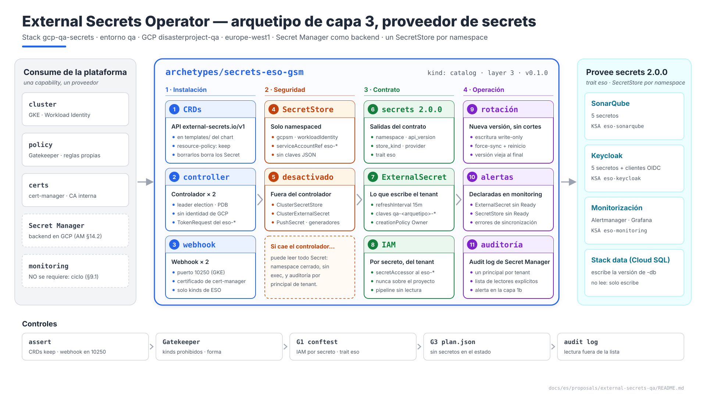
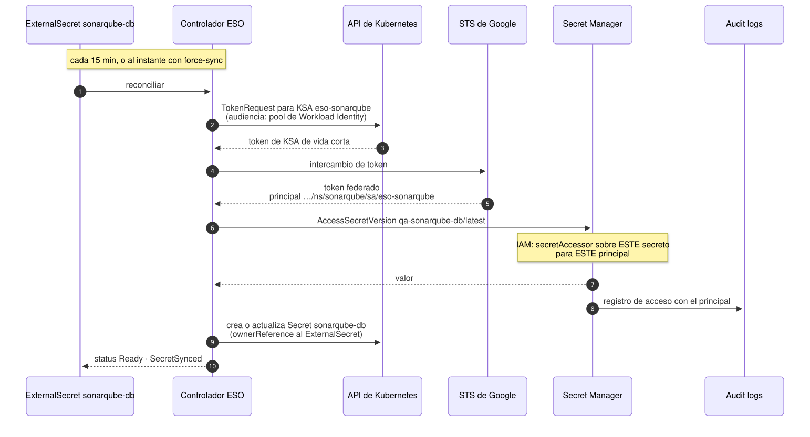
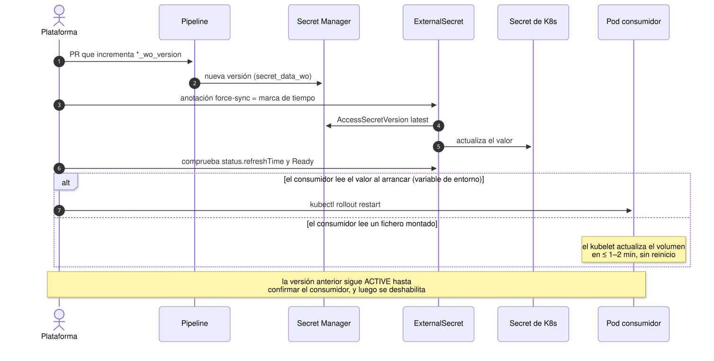

# External Secrets Operator en `qa` — arquetipo `secrets-eso-gsm` (capa 3), proveedor de `secrets`

| | |
|---|---|
| **Estado** | Propuesta · revisión 1 |
| **Alcance** | El arquetipo de capa 3 `secrets-eso-gsm` en `qa`: modelo de seguridad, instalación, el contrato `secrets` 2.0.0 que usan los consumidores, rotación, red, disponibilidad, observabilidad, políticas, ejecución y plan |
| **Por qué ahora** | SonarQube (E1 §4.3, E2 §5.2), la variante Cloud SQL (§5) y Keycloak (§6.5, §7) ya dependen de ESO y han fijado, cada uno por su lado, partes de su contrato. Aquí se reúnen en un solo sitio y se completan |
| **Especificación de referencia** | `archetype-model.md` (AM §n; AM §14.2 asigna Secret Manager a `secrets` en GCP), `terramate-outputs-sharing-architecture.md` (§n), `risk-register.md` |
| **Diagramas** | `diagrams/*.mmd` (fuente Mermaid) y `diagrams/*.svg` (renderizados). El SVG se regenera desde el `.mmd`; no se edita a mano. `diagrams/06-bloques-presentacion.svg` (1920×1080, para presentaciones) se genera con `06-bloques-presentacion.py`, no con Mermaid |
| **Identificadores propios** | Decisiones `DE1…`, riesgos candidatos `RE1…`, verificaciones `VE1…`. Los riesgos reciben número `R54+` en `risk-register.md` si se adopta, detrás de los de las propuestas anteriores |

Nada de este documento reabre decisiones de `CLAUDE.md` ni D1 de E1 (ESO + Secret Manager; OpenBao fuera de `qa`). Implementa la trampa "nunca compartir secretos por outputs sharing" (R8) desde el lado del proveedor.



Fuente: [`diagrams/06-bloques-presentacion.py`](diagrams/06-bloques-presentacion.py) — vista de presentación; el detalle está en §3–§10.

---

## 0. Contexto

| Pregunta | Respuesta | Consecuencia |
|---|---|---|
| Qué es | Arquetipo `secrets-eso-gsm`, `kind: catalog`, **capa 3**, provee **`secrets` 2.0.0** con el trait nuevo **`eso`** | El binding de `qa` ya lo enlaza: `secrets: { archetype: secrets-eso-gsm, version: 0.1.0, stack_id: gcp-qa-secrets }` |
| Stack | **Uno**: `gcp-qa-secrets` en `stacks/platforms/gcp/qa/secrets/` | Capa 3 vive en `stacks/platforms/` (`CLAUDE.md`, estructura) |
| Backend | **Secret Manager** de `disasterproject-qa`, replicación user-managed en `europe-west1` | AM §14.2; E1 D1 |
| Interfaz en el cluster | ESO: `SecretStore` y `ExternalSecret` en el namespace de cada consumidor; `Secret` de Kubernetes como resultado | Los charts leen `Secret` normales; nada en ellos conoce Secret Manager |
| Consumidores en `qa` | SonarQube (5 secretos), Keycloak (5), monitorización (credenciales de receptores de Alertmanager, admin de Grafana), los secretos de clientes OIDC de Keycloak (§6.5 de su propuesta) | Una docena de `ExternalSecret` al empezar; nada que exija dimensionar |
| Modelo | `qa` dedicado | Sin budgets de `capacity` aplicados (E1 §0) |



Fuente: [`diagrams/01-contexto.mmd`](diagrams/01-contexto.mmd)

---

## 1. Lo que ESO impone al diseño

Hechos de ESO en la versión estable actual; lo que depende de la versión fijada va marcado **(verificar)**.

| Hecho | Consecuencia en el diseño |
|---|---|
| Tres componentes: **controlador**, **webhook** de validación de sus CRDs y **cert-controller** que emite el certificado del webhook | El certificado del webhook lo emite cert-manager, que ya está (§4): un controlador menos |
| API **`external-secrets.io/v1`** estable; `v1beta1` obsoleta **(verificar en qué versión deja de servirse)** | La versión de la API es salida del contrato (§5.1); los charts de los consumidores la leen de ahí |
| Autenticación GCP por Workload Identity: el controlador pide a la API de Kubernetes un **token del KSA que nombra el `SecretStore`** (`TokenRequest`) y lo cambia en STS por un token federado | El controlador **no necesita identidad de GCP propia**: actúa siempre como el KSA de cada tenant (§3). Con el principal federado directo, sin cuenta de servicio de GCP **(verificar, VE1)** |
| Un `SecretStore` namespaced solo puede usar KSAs **de su propio namespace** | El aislamiento entre tenants lo da el namespace y el IAM por secreto, no una lista en ESO |
| El `Secret` generado lleva `ownerReference` al `ExternalSecret` (`creationPolicy: Owner`) | Borrar un `ExternalSecret` borra su `Secret`; **borrar el CRD borra todos** (§4.2, RE1) |
| Refresco periódico (`refreshInterval`) y forzado con la anotación `force-sync` **(verificar el nombre, VE5)** | Rotaciones sin esperar al siguiente ciclo (§6) |
| `ClusterSecretStore`, `ClusterExternalSecret` y `PushSecret` existen y se pueden desactivar en el controlador | Se desactivan (§3.3): ninguno hace falta y los tres amplían lo que un error o un abuso alcanza |
| Webhook en el puerto **10250** por defecto en el chart | En GKE con nodos privados, el plano de control solo llega a los nodos por 443 y 10250 sin reglas de firewall extra. **No se cambia** (§7, RE3) |
| Métricas Prometheus del estado de cada `ExternalSecret` y `SecretStore` | Alertas en §9 |

---

## 2. Por qué ESO

Decidido en E1 (D1). Se resume para que el contrato de §5 tenga contexto:

| Opción | Veredicto |
|---|---|
| **ESO + Secret Manager** | **Sí.** Los charts consumen `Secret` de Kubernetes sin saber de dónde vienen; cambiar de backend (OpenBao, AWS, Azure) es cambiar el arquetipo proveedor, no los consumidores |
| Add-on de Secret Manager para GKE (driver CSI) | No: monta ficheros; los charts de SonarQube y el CR de Keycloak leen variables de entorno o `Secret`, y CNPG exige un `Secret` (E1 §4.3) |
| La aplicación llama a Secret Manager | No: cada aplicación con su cliente, su caché y su lógica de rotación; imposible en charts de terceros |
| OpenBao | Fuera de `qa` (D1): unseal, Raft y recovery keys que operar para un entorno de pruebas |

---

## 3. Modelo de seguridad

### 3.1 Quién tiene qué



Fuente: [`diagrams/02-sincronizacion.mmd`](diagrams/02-sincronizacion.mmd)

| Actor | Permiso | Sobre qué |
|---|---|---|
| Pipeline (`tf-apply-qa@`) | Administrar **contenedores** de secreto y su IAM; añadir versiones (`secret_data_wo`) | Proyecto `disasterproject-qa`. **Sin** `secretAccessor`: nunca lee un valor (E1 §4.3) |
| KSA `eso-<arquetipo>` de cada tenant | `roles/secretmanager.secretAccessor` | **Cada secreto** de su arquetipo, uno a uno. Nunca a nivel de proyecto (§11) |
| Controlador ESO (su propio KSA) | Ninguno en GCP | — |
| Controlador ESO en Kubernetes | Leer sus CRDs; crear y actualizar `Secret`; **`create` de `serviceaccounts/token`** | Todo el cluster: así lo exige el diseño de ESO |
| SRE | `secretAccessor` just-in-time por PAM | Un secreto, máximo 1 h (E1 §4.3) |

### 3.2 Lo que el controlador podría hacer si se compromete

Hay que decirlo sin rodeos: el controlador **puede leer y escribir cualquier `Secret` del cluster y pedir un token de cualquier KSA**. Con el token de un `eso-*` obtiene lo que ese KSA puede leer en Secret Manager. Es decir, comprometer el controlador equivale a acceder a todos los secretos de `qa`. Es inherente a cualquier sincronizador de secretos con alcance de cluster, y lo que se hace es reducir la probabilidad y hacerlo visible:

| Medida | Efecto |
|---|---|
| Namespace `external-secrets` solo de la plataforma; PSS `restricted`; imagen por digest desde Artifact Registry | Superficie mínima |
| Sin `exec`/`attach`/`port-forward` en ese namespace para nadie salvo break-glass | Nadie entra al pod por la API |
| Controlador **sin identidad de GCP**: todo acceso sale con el principal de un tenant | El audit log de Secret Manager dice qué tenant se leyó, no "ESO" en general (§9.2) |
| Alerta de auditoría: acceso a un secreto por un principal fuera de la lista (`eso-*` y lectores explícitos) | Un uso anómalo de un token aparece en el log con su principal |

### 3.3 Lo que se desactiva

| Función | Por qué fuera |
|---|---|
| `ClusterSecretStore` | Un almacén de cluster usa una identidad compartida por todos los namespaces: rompe el aislamiento por principal (R15) |
| `ClusterExternalSecret` | Replica un secreto en muchos namespaces: justo lo que el IAM por secreto evita |
| `PushSecret` | Escribe desde el cluster **hacia** Secret Manager. Nadie lo necesita, y un KSA `eso-*` solo tiene lectura; mejor que el controlador ni lo intente |
| Generadores de ESO (contraseñas, tokens de registro) | Las contraseñas las genera OpenTofu con recursos `ephemeral` y atributos write-only (R40) |

Dos capas: los reconciliadores apagados en el controlador (§4.1) **y** Gatekeeper denegando esos kinds (§11). La segunda protege de que alguien vuelva a encender la primera.

---

## 4. Instalación

### 4.1 Chart y valores

Chart oficial `external-secrets/external-secrets`, versión fijada, en un `helm_release` del stack `gcp-qa-secrets`. Claves **(verificar contra la versión fijada)**:

```yaml
installCRDs: true
crds:
  annotations:
    helm.sh/resource-policy: keep          # §4.2 — sin esto, desinstalar borra todos los Secret
replicaCount: 2
leaderElect: true
processClusterStore: false                 # §3.3
processClusterExternalSecret: false
processPushSecret: false
image:
  repository: europe-docker.pkg.dev/disasterproject-lz/platform/external-secrets
  tag: "@sha256:<digest>"
resources:
  requests: { cpu: 50m, memory: 128Mi }
  limits:   { memory: 256Mi }
podDisruptionBudget: { enabled: true, minAvailable: 1 }
webhook:
  replicaCount: 2
  port: 10250                              # §7 — el plano de control de GKE ya llega a este puerto
  certManager:
    enabled: true
    cert:
      issuerRef: { kind: ClusterIssuer, name: internal-ca }   # global de gcp-qa-certs
  podDisruptionBudget: { enabled: true, minAvailable: 1 }
certController:
  create: false                            # el certificado del webhook lo emite cert-manager
serviceMonitor:
  enabled: false                           # el scrape lo declara el arquetipo de monitorización (§9.1)
```

`securityContext` del chart por defecto: no root, raíz de solo lectura, sin capabilities. Cumple PSS `restricted` tal cual **(verificar, VE6)**.

### 4.2 Los CRDs y la cascada de borrado

Cada `Secret` que genera ESO tiene como propietario a su `ExternalSecret`. Si el CRD `ExternalSecret` desaparece, Kubernetes borra todos los `ExternalSecret` y, por la `ownerReference`, **todos los `Secret` que alimentan a todas las aplicaciones de `qa`**, en segundos. Un `helm uninstall`, un `tofu destroy` del stack o un cambio de chart que mueva los CRDs de sitio bastan para dispararlo (RE1).

| Protección | Dónde |
|---|---|
| `helm.sh/resource-policy: keep` en los CRDs | Valores del chart (§4.1) |
| `assert` que falla la generación si falta esa anotación | §11.1 |
| `lifecycle { prevent_destroy = true }` en el `helm_release` | El destroy del stack se detiene; quitarlo es un PR explícito |
| Ensayo de desinstalación en un entorno efímero | VE3: los `Secret` sobreviven |

---

## 5. El contrato `secrets` 2.0.0

### 5.1 Salidas y trait

| Salida | Valor en `qa` | Uso |
|---|---|---|
| `namespace` | `external-secrets` | Selectores de `NetworkPolicy` y RBAC |
| `api_version` | `external-secrets.io/v1` | `apiVersion` de los `SecretStore` y `ExternalSecret` de los consumidores |
| `store_kind` | `SecretStore` | Único kind de almacén admitido (§3.3) |
| `provider` | `gcpsm` | Rama del generador `gen_secrets.tm.hcl` |

Todas deterministas: se publican como salidas del contrato (AM §5.1) y los consumidores las reciben como globals, sin arista de outputs sharing (E1 §6 ya lo anotaba así).

**Trait `eso`** (nuevo, en `registry/traits.yaml`): el proveedor de `secrets` es ESO y sus CRDs están instalados. Los consumidores cuyos charts crean `SecretStore` y `ExternalSecret` lo exigen, igual que exigen `prometheus-operator-crds` para crear `PodMonitor`. Un binding a otro proveedor (el driver CSI, por ejemplo) falla en la resolución, no en el primer `helm install`.

### 5.2 Lo que escribe un consumidor



Fuente: [`diagrams/03-propiedad.mmd`](diagrams/03-propiedad.mmd)

El stack `secrets` de cada arquetipo, generado por `gen_secrets.tm.hcl` (E2 §5.2), crea en Secret Manager los contenedores y su IAM, y en su chart:

```yaml
# un SecretStore por namespace
apiVersion: external-secrets.io/v1               # = salida api_version
kind: SecretStore
metadata: { name: gcpsm, namespace: sonarqube }
spec:
  provider:
    gcpsm:
      projectID: disasterproject-qa
      auth:
        workloadIdentity:
          clusterLocation: europe-west1
          clusterName: qa                        # global.platform.cluster_name
          clusterProjectID: disasterproject-qa
          serviceAccountRef: { name: eso-sonarqube }
---
# un ExternalSecret por secreto de Secret Manager
apiVersion: external-secrets.io/v1
kind: ExternalSecret
metadata: { name: sonarqube-db, namespace: sonarqube }
spec:
  refreshInterval: 15m
  secretStoreRef: { kind: SecretStore, name: gcpsm }
  target:
    name: sonarqube-db
    creationPolicy: Owner
    deletionPolicy: Retain                       # si el secreto desaparece de Secret Manager, el Secret se conserva
  dataFrom:
    - extract: { key: qa-sonarqube-db }          # JSON {"username", "password"}
```

| Regla | Por qué |
|---|---|
| Un `SecretStore` por namespace, `serviceAccountRef` a `eso-<arquetipo>` | Principal exacto (R15); el nombre `eso-` es lo que reconoce la alerta de auditoría |
| `remoteRef.key` / `extract.key` con el prefijo `qa-<arquetipo>-` | El IAM ya deniega el resto; la regla hace que el error salte en admisión y no como `SecretSyncedError` |
| `refreshInterval: 15m` | Un secreto rotado llega en ≤ 15 min sin intervención; la alerta de E1 §4.7 salta a los 15 min |
| `creationPolicy: Owner` | El `Secret` desaparece con su `ExternalSecret` al desmontar el consumidor |
| `deletionPolicy: Retain` | Un borrado accidental en Secret Manager no deja a la aplicación sin su `Secret` de inmediato |
| Versión `latest` | La versión se decide al escribir, con `*_wo_version` (variante Cloud SQL §5); fijar versiones en el `ExternalSecret` duplicaría esa decisión |

### 5.3 Coste de las lecturas

Cada refresco es un `AccessSecretVersion` y una entrada de *Data Access audit log*. Con una docena de secretos cada 15 min salen ≈ 1 150 accesos al día: coste y volumen de log despreciables. Bajar a 1 min multiplicaría por 15 ambos sin beneficio: para las rotaciones está `force-sync` (§6).

---

## 6. Rotación y recarga



Fuente: [`diagrams/05-rotacion.mmd`](diagrams/05-rotacion.mmd)

ESO actualiza el `Secret`; **no** reinicia a quien lo usa. Cómo le llega el valor nuevo depende de cómo lo lee:

| El consumidor lee… | Llega | Ejemplos en `qa` |
|---|---|---|
| Una variable de entorno | Solo al reiniciar el pod | Contraseña JDBC de SonarQube, credenciales de BD de Keycloak |
| Un fichero de un volumen `Secret` | El kubelet lo actualiza en 1–2 min | Certificados montados, `x509-certificate-exporter` |

Procedimiento: nueva versión en Secret Manager → `force-sync` en el `ExternalSecret` → comprobar `Ready` y `refreshTime` → reiniciar el consumidor si lee variables → deshabilitar la versión anterior en Secret Manager cuando el consumidor ya use la nueva. Es el mismo orden que ya exige la variante Cloud SQL (RC4); aquí se generaliza.

**Sin Reloader** (DE6). Un controlador que reinicia pods al cambiar un `Secret` necesita leer todos los `Secret` del cluster y decide reinicios por su cuenta. Con rotaciones planificadas y escasas, el reinicio explícito es más predecible.

---

## 7. Red



Fuente: [`diagrams/04-red.mmd`](diagrams/04-red.mmd)

`NetworkPolicy` default-deny en `external-secrets`:

| Origen | Destino | Puerto | Nota |
|---|---|---|---|
| Plano de control de GKE | Webhook | **10250** | Regla de firewall de VPC que GKE ya crea para nodos privados (443 y 10250). Cambiar el puerto a 9443 exigiría otra regla, y sin ella todo `apply` de un `ExternalSecret` falla por timeout del webhook (RE3) |
| Prometheus | Controlador, webhook | 8080 | Métricas |
| Controlador | API de Kubernetes | 443 | |
| Controlador | `secretmanager.googleapis.com`, `sts.googleapis.com` vía Private Google Access | 443 | Sin NAT ni internet |
| Controlador, webhook | kube-dns | 53 | |
| Todos | Internet | **Denegado** | |

---

## 8. Disponibilidad y comportamiento ante fallo

ESO **no está en el camino de las peticiones**: las aplicaciones leen `Secret` de Kubernetes que ya existen.

| Si cae… | Efecto | No afecta |
|---|---|---|
| El controlador | No se crean ni refrescan `Secret`; una rotación no llega | Todo lo que ya corre, y los reinicios de pods (el `Secret` sigue ahí) |
| El webhook | Falla el `apply` de cualquier `SecretStore` o `ExternalSecret` (su `failurePolicy` es `Fail`, pero **solo para los kinds de ESO**: no puede bloquear el cluster como Gatekeeper) | Todo lo demás |
| Secret Manager o STS | `ExternalSecret` en error; los `Secret` conservan el último valor | Las aplicaciones |
| Workload Identity de un tenant mal configurado | El `SecretStore` de ese namespace no llega a `Ready` | Los demás tenants |

2 réplicas de cada componente con PDB `minAvailable: 1`: un nodo o un upgrade de GKE no dejan la plataforma sin webhook durante un despliegue.

---

## 9. Observabilidad

### 9.1 Quién declara el scrape y las alertas

El arquetipo de monitorización necesita secretos (credenciales de receptores de Alertmanager, admin de Grafana): **requiere `secrets`**. Si `secrets-eso-gsm` requiriera `monitoring` para crear sus `PodMonitor` y `PrometheusRule`, habría un ciclo entre dos capabilities de capa 3, y el resolver lo rechaza (AM §12, paso 3). Por eso:

- `secrets-eso-gsm` **no** requiere `monitoring`; `serviceMonitor.enabled: false`.
- `monitoring-oss` incluye el scrape y las reglas de los componentes de plataforma que van antes que él (Gatekeeper, cert-manager, ESO), con los selectores publicados en el contrato de `secrets` (`namespace`).

La regla general queda escrita: **entre capabilities de la misma capa, la observabilidad la declara la de monitorización**.

### 9.2 Alertas

| Alerta | Señal | Umbral | Sustituye a |
|---|---|---|---|
| `ExternalSecret` sin sincronizar | Condición `Ready=False` del `ExternalSecret` | > 15 min, **en cualquier namespace**, enrutada al dueño por la etiqueta `archetype` del namespace | La alerta propia de SonarQube (E2 §5.9) y la equivalente de Keycloak |
| `SecretStore` no listo | Condición `Ready=False` | > 5 min — casi siempre IAM o Workload Identity del tenant | — |
| Errores de sincronización | Tasa de errores de llamadas al proveedor | > 10 % en 15 min | — |
| Controlador o webhook sin réplicas | kube-state-metrics | < 1 lista durante 5 min | — |
| **Lectura de un secreto por un principal no autorizado** | *Data Access audit log* de Secret Manager, alerta basada en logs de la capa 1b | Cualquier `AccessSecretVersion` cuyo principal no sea `…/sa/eso-*` ni esté en la lista de lectores explícitos | E1 §4.3, ampliada con la lista |

**Lista de lectores explícitos.** El reconciliador de Keycloak lee secretos de clientes OIDC con su propia identidad (propuesta de Keycloak §6.5), no por ESO: su principal `…/ns/keycloak/sa/keycloak-config` entra en la lista. Sin ella, la alerta de E1 §4.3 saltaría en cada pasada del reconciliador. Un lector nuevo es un PR a esa lista, revisado.

---

## 10. El arquetipo

### 10.1 Manifiesto

```yaml
# archetypes/secrets-eso-gsm/manifest.yaml
apiVersion: archetype/v1
kind: Archetype

metadata:
  name: secrets-eso-gsm
  version: 0.1.0
  layer: 3
  kind: catalog
  description: External Secrets Operator con GCP Secret Manager como backend; SecretStore por namespace
  owners: [team-platform]

runtimes: [gke]

requires:
  - capability: cluster
    version: "^2.0.0"
  - capability: policy
    version: "^1.0.0"
  - capability: certs
    version: "^1.0.0"

provides:
  - capability: secrets
    version: 2.0.0
    traits: [eso]
    outputs:
      - { name: namespace,   from: eso }
      - { name: api_version, from: eso }
      - { name: store_kind,  from: eso }
      - { name: provider,    from: eso }

stacks:
  - name: eso

capacity:
  cpu_millicores: 200
  memory_mib: 768
  pods: 4
  workload_identities: 0                             # el controlador no tiene identidad de GCP; los eso-* los cuenta cada tenant
```

`runtimes: [gke]`: la rama `gcpsm` es solo GCP. Las variantes para AWS (Secrets Manager) y Azure (Key Vault) serían arquetipos hermanos con el mismo contrato y el mismo trait, cambiando `provider`. **Sin `monitoring`** en `requires`, por el ciclo de §9.1.

### 10.2 El stack `gcp-qa-secrets`

| | |
|---|---|
| **Generador** | `gen_helm_stack.tm.hcl` |
| **Recursos** | Namespace `external-secrets` (PSS `restricted`, etiquetas obligatorias); `helm_release` de ESO (§4.1) con `prevent_destroy`; `helm_release` del chart del arquetipo con `NetworkPolicy` (§7) y los `ConstraintTemplate`/`Constraint` de Gatekeeper para los kinds de ESO (§11.2) |
| **Recursos de GCP** | Ninguno. El IAM lo crea cada tenant sobre sus propios secretos |
| **Entradas por sharing** | `cluster_endpoint`, `cluster_ca` (de `gcp-qa-gke`) |
| **Globals que usa** | `ClusterIssuer` interno (de `gcp-qa-certs`) |
| **`after`** | `gcp-qa-gke`, `gcp-qa-policy`, `gcp-qa-certs` |
| **Salidas** | §5.1 |

Los `ConstraintTemplate` los despliega el propio proveedor, igual que el arquetipo `gateway` restringe `SecurityPolicy`: **quien define un kind define sus reglas de admisión**. Requiere `policy` precisamente para eso.

---

## 11. Políticas

### 11.1 `assert` en generación

```hcl
assert {
  assertion = global.eso_values.crds.annotations["helm.sh/resource-policy"] == "keep"
  message   = "secrets: los CRDs de ESO deben llevar resource-policy keep — borrarlos borra todos los Secret (RE1)"
}
assert {
  assertion = global.eso_values.webhook.port == 10250
  message   = "secrets: el webhook en 10250; otro puerto necesita una regla de firewall hacia los nodos (RE3)"
}
assert {
  assertion = !global.eso_values.processClusterStore && !global.eso_values.processPushSecret
  message   = "secrets: ClusterSecretStore y PushSecret desactivados (§3.3)"
}
```

### 11.2 Gatekeeper (los despliega este arquetipo)

| Constraint | Qué deniega |
|---|---|
| Kinds prohibidos | Cualquier `ClusterSecretStore`, `ClusterExternalSecret` o `PushSecret` |
| Forma del `SecretStore` | Proveedor distinto de `gcpsm`; autenticación distinta de `workloadIdentity` (nada de `secretRef` a una clave JSON); `serviceAccountRef` sin el prefijo `eso-`; `projectID` distinto del proyecto del entorno |
| Forma del `ExternalSecret` | `secretStoreRef.kind` distinto de `SecretStore`; claves remotas sin el prefijo `qa-<etiqueta archetype del namespace>-`; `refreshInterval` fuera de 5 min – 1 h |
| Namespace `external-secrets` | Pods que no sean los del chart (por etiqueta), para que nadie use el KSA del controlador |

### 11.3 conftest (G1)

| Regla | Qué comprueba |
|---|---|
| **Nueva:** IAM de Secret Manager por recurso | En stacks de arquetipo, `secretmanager.*` solo como `google_secret_manager_secret_iam_member`; nunca `google_project_iam_*` (E2 §7.2, generalizada) |
| **Nueva:** miembro del IAM | El `member` de cada `secretAccessor` es `…/sa/eso-<el mismo arquetipo>` o un principal de la lista de lectores explícitos (§9.2) |
| **Nueva:** trait | Un arquetipo cuyo chart contiene `SecretStore` o `ExternalSecret` exige `secrets` con el trait `eso` |
| Existente (R8, R40) | Ninguna salida exporta valores; ningún `secret_data` en claro en `plan.json` |

---

## 12. Ejecución

### 12.1 Primer despliegue

Fase B de E1 §6: después de `gcp-qa-policy` y `gcp-qa-certs`, antes de monitorización, Keycloak y cualquier arquetipo de capa 4–5. Criterio de salida: un `ExternalSecret` de prueba en un namespace de prueba llega a `Ready` con su `eso-*` y queda registrado en el audit log con ese principal.

### 12.2 Upgrades

| Qué | Cuidado |
|---|---|
| Versión del chart | Leer las notas de versión por cambios de API. Primero en un entorno efímero con un `ExternalSecret` de cada forma usada en `qa` |
| Cambio de `api_version` (p. ej., retirada de `v1beta1`) | Es un cambio de la salida `api_version`: **MAJOR** del contrato `secrets` (AM §4.5). Los consumidores fijados a `^2.0.0` fallan en la resolución hasta que se actualizan, no en el `apply` |
| CRDs | Los actualiza el chart (están en `templates/` con `keep`). Un CRD que cambie de forma incompatible se trata como MAJOR |

### 12.3 Destrucción

Se detiene en `prevent_destroy`. Desmontar ESO sin desmontar a sus consumidores deja sus `Secret` en su sitio (CRDs con `keep`) pero sin refresco: se hace en último lugar y con un PR explícito.

---

## 13. Cambios a otros documentos

| Documento | Cambio | Estado |
|---|---|---|
| `registry/traits.yaml` y el `enum` de `schemas/archetype-manifest.schema.json` | Trait `eso`, en el mismo commit y de forma mecánica (R34) | **Aplicado** |
| E2 §3 (SonarQube), variante Cloud SQL §9.1, propuesta de Keycloak §11.1 | `secrets` pasa a exigir `traits: [eso]` | **Aplicado** |
| E1 §4.3 y §4.7 | La alerta de auditoría admite la lista de lectores explícitos (§9.2) | Propuesto |
| E2 §5.9 y propuesta de Keycloak §10 | La alerta "`ExternalSecret` sin sincronizar" pasa a ser de plataforma (§9.2) y sale de cada arquetipo | Propuesto |
| E2 §9, fila `secrets-eso-gsm` | Requisito cumplido: ESO con Workload Identity en `SecretStore` namespaced | — |

---

## 14. Decisiones

| # | Decisión | Estado | Recomendación | Alternativa |
|---|---|---|---|---|
| DE1 | Interfaz de secretos en el cluster | Heredada de D1 | ESO + Secret Manager | Driver CSI; OpenBao |
| DE2 | Tipo de almacén | Propuesta | Solo `SecretStore` namespaced | `ClusterSecretStore` con identidad compartida |
| DE3 | Identidad hacia GCP | Propuesta | KSA `eso-<arquetipo>` por tenant, principal federado directo; controlador sin identidad | Cuenta de servicio de GCP por tenant, con anotación en el KSA (si VE1 falla) |
| DE4 | Certificado del webhook | Propuesta | cert-manager, `ClusterIssuer` interno | cert-controller de ESO |
| DE5 | Refresco | Propuesta | 15 min + `force-sync` en rotaciones | 1 h (por defecto) |
| DE6 | Recarga de consumidores | Propuesta | Reinicio explícito en el procedimiento | Reloader |
| DE7 | Funciones de ESO | Propuesta | Sin `ClusterSecretStore`, `ClusterExternalSecret`, `PushSecret` ni generadores | Dejarlas disponibles |
| DE8 | Observabilidad | Propuesta | La declara el arquetipo de monitorización (ciclo, §9.1) | `PodMonitor` en este arquetipo con `monitoring` opcional |
| DE9 | Trait `eso` | Propuesta, aplicada al registro | Sí | Sin trait: fallo en `helm install` si el proveedor no es ESO |

---

## 15. Riesgos candidatos

| # | Riesgo | Probabilidad | Impacto | Mitigación |
|---|---|---|---|---|
| RE1 | **Borrado de los CRDs** arrastra todos los `ExternalSecret` y sus `Secret` | Baja con `keep` | Crítico — todas las aplicaciones de `qa` sin secretos | `keep`, assert, `prevent_destroy`, VE3 |
| RE2 | **Compromiso del controlador** = acceso a todos los secretos | Baja | Crítico | §3.2: namespace cerrado, sin `exec`, auditoría por principal |
| RE3 | **Webhook inalcanzable** desde el plano de control si alguien cambia su puerto | Media | Media — ningún `ExternalSecret` se puede aplicar | Puerto 10250 con assert; VE4 |
| RE4 | **Rotación que no llega** a un consumidor que lee variables de entorno | Media | Media — la aplicación sigue con el valor viejo hasta reiniciar, y falla si la versión vieja se deshabilita antes | Procedimiento de §6: deshabilitar la versión vieja al final |
| RE5 | **Alerta de auditoría ruidosa** por lectores legítimos fuera de ESO | Alta sin lista | Baja — la alerta se ignora y deja de proteger | Lista de lectores explícitos revisada por PR (§9.2) |
| RE6 | **Cambio de API de ESO** rompe los charts de los consumidores en un upgrade | Media | Media | `api_version` como salida del contrato; MAJOR; ensayo en efímero (§12.2) |
| RE7 | **`SecretStore` con credencial estática** (clave JSON) introducido por un consumidor | Baja | Alta — clave de larga duración en el cluster | Gatekeeper (§11.2); org policy que impide crear claves de cuenta de servicio (§11.7 de arquitectura) |

---

## 16. Verificaciones

| # | Verificación | Resultado que la cierra |
|---|---|---|
| VE1 | `gcpsm` con Workload Identity y principal federado directo, sin anotación de cuenta de servicio de GCP, en la versión fijada de ESO | `ExternalSecret` en `Ready`; el audit log muestra el principal `…/sa/eso-<arquetipo>`. Si no, DE3 alternativa |
| VE2 | Reconciliadores de `ClusterSecretStore`, `ClusterExternalSecret` y `PushSecret` apagados por los valores del chart | Un objeto de esos kinds creado con Gatekeeper en `dryrun` no se reconcilia |
| VE3 | Desinstalar el chart en un entorno efímero | CRDs, `ExternalSecret` y `Secret` siguen existiendo |
| VE4 | Webhook en 10250 alcanzable desde el plano de control con nodos privados | `apply` de un `ExternalSecret` sin timeout |
| VE5 | Anotación `force-sync` | Refresco inmediato visible en `status.refreshTime` |
| VE6 | ESO bajo PSS `restricted` con los valores por defecto del chart | Pods admitidos sin exenciones |
| VE7 | Filtro de la alerta de auditoría con la lista de lectores | Salta con un lector no listado; calla con `eso-*` y `keycloak-config` |
| VE8 | Certificado del webhook emitido por cert-manager e inyectado en la `ValidatingWebhookConfiguration` | Webhook sano tras renovar el certificado |

---

## 17. Plan de implementación

| Fase | Contenido | Criterio de salida | Estimación |
|---|---|---|---|
| **0 · Prerrequisitos** | GKE, Gatekeeper y cert-manager de `qa`; VE1, VE4 | Las dos verificaciones cerradas | Depende de la plataforma |
| **1 · Esqueleto** | Manifiesto, chart del arquetipo (NetworkPolicy, constraints), asserts, reglas conftest | `archetypectl resolve --dry-run`, `terramate generate --check`, G1 y preview con mocks en verde | 1 día |
| **2 · Despliegue** | Stack `gcp-qa-secrets` | ESO sano con 2 réplicas; VE2, VE3, VE6, VE8 | 1–2 días |
| **3 · Contrato** | Rama `gcpsm` de `gen_secrets.tm.hcl`; tenant de prueba | `ExternalSecret` de prueba en `Ready`; **VE5**, **VE7** | 1 día |
| **4 · Observabilidad** | Reglas y scrape en `monitoring-oss` | Cada alerta disparada una vez en prueba provocada | 0,5 días |

Una semana para una persona. Va antes que Keycloak y que SonarQube en la fase B: los dos lo necesitan para su primer despliegue.
