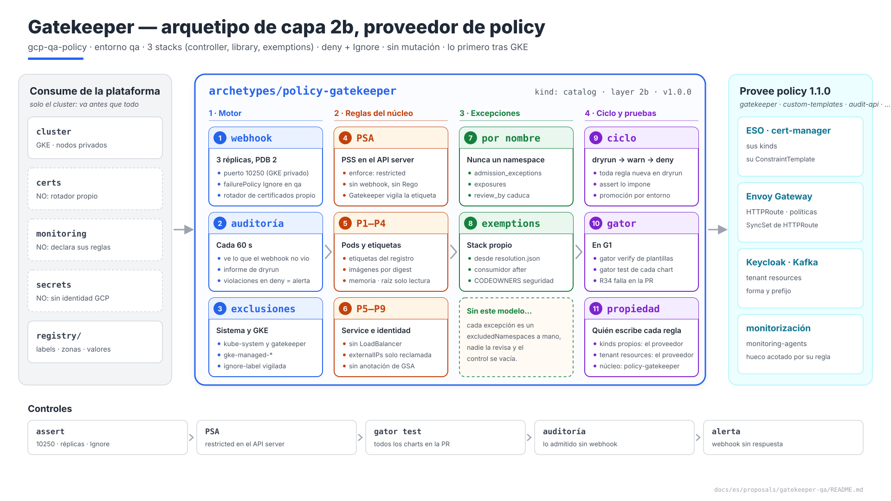

# Gatekeeper en `qa` — arquetipo `policy-gatekeeper` (capa 2b), proveedor de `policy`

| | |
|---|---|
| **Estado** | Propuesta · revisión 4 |
| **Alcance** | El arquetipo de capa 2b `policy-gatekeeper` en `qa`: instalación y alta disponibilidad, alcance del webhook, quién es dueño de cada regla, el catálogo consolidado de reglas de todas las propuestas, el ciclo de vida de una regla, el modelo de excepciones, datos del registro, pruebas en CI, observabilidad, red, contrato `policy`, stacks, ejecución y plan |
| **Por qué ahora** | Cada propuesta anterior le ha dejado reglas: SonarQube, Keycloak, ESO, monitorización, cert-manager, Envoy Gateway y Kafka. Hoy están repartidas en nueve documentos, nadie ha comprobado que encajen, y varias dependen de un mecanismo de excepciones que no está especificado |
| **Especificación de referencia** | `terramate-outputs-sharing-architecture.md` §13 (arquitectura), `archetype-model.md` (AM §n), `risk-register.md` (R33–R37) |
| **Diagramas** | `diagrams/*.mmd` (fuente Mermaid) y `diagrams/*.svg` (renderizados). El SVG se regenera desde el `.mmd`; no se edita a mano. `diagrams/06-bloques-presentacion.svg` (1920×1080, para presentaciones) se genera con `06-bloques-presentacion.py`, no con Mermaid |
| **Identificadores propios** | Decisiones `DP1…`, riesgos candidatos `RP1…`, verificaciones `VP1…`. Los riesgos reciben número `R54+` en `risk-register.md` si se adopta, detrás de los de las propuestas anteriores |

Nada de este documento reabre decisiones de `CLAUDE.md`: Gatekeeper y no Kyverno; autogestionado en las tres nubes; capa 2b; sin mutación; `failurePolicy: Fail` solo en producción; el registro como única fuente.



Fuente: [`diagrams/06-bloques-presentacion.py`](diagrams/06-bloques-presentacion.py) — vista de presentación; el detalle está en §2–§9.

---

## 0. Contexto

| Pregunta | Respuesta | Consecuencia |
|---|---|---|
| Qué es | Arquetipo `policy-gatekeeper`, `kind: catalog`, **capa 2b**, provee **`policy` 1.1.0** | El binding de `qa` ya lo enlaza: `policy: { archetype: policy-gatekeeper, version: 1.0.0, stack_id: gcp-qa-policy }`, con `gatekeeper_enforcement: deny` y `gatekeeper_failure_policy: Ignore` |
| Stacks | 3: `controller`, `library` y `exemptions` en `stacks/platforms/gcp/qa/policy/` | Ciclos de vida distintos (§8.3) |
| Componentes | Gatekeeper: webhook de validación, auditoría y rotador de certificados propio | Apache-2.0 |
| Qué **no** hace | Mutación; reglas de los kinds de otros arquetipos; Pod Security Standards en Rego | §1, §3 |
| Consume | Solo `cluster` | Va antes que cert-manager, secretos y monitorización: no puede depender de ninguno (cert-manager DT8) |
| Modelo | `qa` dedicado, `deny` + `Ignore` | Arquitectura §13.7 |



Fuente: [`diagrams/01-contexto.mmd`](diagrams/01-contexto.mmd)

---

## 1. Quién es dueño de cada regla

Las propuestas anteriores ya aplicaban un criterio sin nombrarlo: ESO despliega las reglas de `SecretStore`, Envoy Gateway las de `HTTPRoute`, Kafka las de `KafkaTopic`. Se fija aquí (DP2):

| Regla sobre… | Dueño | Motivo |
|---|---|---|
| Un kind que define un arquetipo (CRDs de Strimzi, ESO, cert-manager, Gateway API, Envoy Gateway) | **El arquetipo que instala el CRD** | Conoce su semántica; sus reglas cambian con su versión; se despliegan con su chart |
| Un tenant resource en el namespace de un proveedor (`ConfigMap` de clientes de Keycloak, `ReferenceGrant`, `ExternalSecret` en `kafka`) | **El proveedor** | Protege su contrato multi-tenant (AM §10) |
| Kinds del núcleo de Kubernetes aplicados a todos (`Pod`, `Service`, `Namespace`, `ServiceAccount`, `RoleBinding`) | **`policy-gatekeeper`** | Ningún otro arquetipo es dueño de `Service` |
| Un namespace con permisos especiales (`monitoring-agents`) | **El arquetipo del namespace**, sobre un hueco que abre `policy-gatekeeper` | La excepción la acota quien la necesita (§5) |

`policy-gatekeeper` **no** conoce los kinds de nadie más. Aporta el motor, el modelo de excepciones, la biblioteca Rego compartida y las reglas del núcleo. Así un upgrade de Strimzi no toca la capa 2b.

---

## 2. Instalación

### 2.1 El controlador

| Ajuste | Valor | Motivo |
|---|---|---|
| Versión | La última minor estable de Gatekeeper 3.x al implementar **(verificar, VP10)** | Una sola versión en las tres nubes (`CLAUDE.md`) |
| Réplicas del webhook | **3**, reparto por zona, `PodDisruptionBudget` `minAvailable: 2` | R33; una zona caída no deja el webhook sin quórum |
| Auditoría | 1 réplica, `auditInterval: 60s`, `constraintViolationsLimit: 50`, auditoría desde la caché | Es la que ve lo que el webhook no vio (webhook caído, objetos anteriores a la regla) |
| Puerto del webhook | **10250** (`controllerManager.port`) | En GKE con nodos privados el plano de control solo llega a los nodos por 443 y 10250. Con el 8443 por defecto el webhook es inalcanzable, y con `Ignore` eso significa **ninguna política aplicada, sin error** (RP1, VP1). El mismo ajuste que ESO y cert-manager |
| Certificado del webhook | Rotador propio de Gatekeeper | Va antes que cert-manager (cert-manager DT8) |
| `failurePolicy` | `global.policy.gatekeeper_failure_policy`: `Ignore` en `qa` | Arquitectura §13.7; `Fail` solo en producción |
| Mutación | **Desactivada** (`mutations.enable: false`); sin trait `mutation` | `CLAUDE.md` |
| Proveedores de datos externos | Desactivados | Nada de llamadas salientes desde la admisión |
| CRDs | `helm.sh/resource-policy: keep` | Desinstalar no borra los `Constraint` de los demás arquetipos |
| PSS del propio namespace | `restricted` | Gatekeeper cumple tal cual **(verificar, VP10)** |

### 2.2 Qué no pasa por el webhook

| Namespace | Mecanismo | Motivo |
|---|---|---|
| `kube-system`, `gatekeeper-system` | `--exempt-namespace` del controlador y `Config.spec.match` con `processes: ["*"]` | Gatekeeper no bloquea su propia recuperación (R33) |
| `kube-node-lease`, `kube-public`, `gke-managed-*`, `gke-gmp-system` | `Config.spec.match` | Los gestiona GKE; un upgrade del cluster no debe depender de nuestras reglas (RP6, VP5) |
| La etiqueta `admission.gatekeeper.sh/ignore` | Solo en los namespaces de las dos filas anteriores; en cualquier otro, denegada (P7) | Si no, cualquiera que pueda etiquetar un namespace se sale de todas las reglas |

---

## 3. Pod Security Standards: con PSA, no con Rego

| Opción | Veredicto |
|---|---|
| **A. Pod Security Admission** (integrado en Kubernetes) con la etiqueta `pod-security.kubernetes.io/enforce: restricted` en cada namespace, y Gatekeeper **vigilando la etiqueta** | **Sí** (DP3). Lo evalúa el propio API server: sin webhook, sin Rego que mantener y sin agujero si Gatekeeper cae |
| B. La biblioteca de Gatekeeper con las reglas de PSS reescritas en Rego | No: duplica lo que Kubernetes ya hace y cae con el webhook |

La etiqueta ya es obligatoria en `registry/labels.yaml`. Gatekeeper impide rebajarla: un namespace con `enforce` distinto de `restricted` se deniega, salvo los de la lista de §5.2 (`monitoring-agents`, `privileged`).

**Lo que PSS `restricted` no cubre** lo añade `policy-gatekeeper` (§4): raíz de solo lectura, registros permitidos, límites de memoria. Son las reglas que las propuestas daban por hechas.

---

## 4. El catálogo



Fuente: [`diagrams/05-propiedad.mmd`](diagrams/05-propiedad.mmd)

### 4.1 Reglas del núcleo (`policy-gatekeeper`)

| # | Regla | Kinds | Qué deniega | Origen | Modo inicial en `qa` |
|---|---|---|---|---|---|
| P1 | Etiquetas obligatorias | `Namespace`, workloads, `PersistentVolumeClaim` | Falta una etiqueta de `registry/labels.yaml` | Arquitectura §13.6, R34 | `deny` |
| P2 | Registros permitidos | `Pod` y plantillas de workloads | Imagen fuera del Artifact Registry de la landing zone, o **sin digest** (`@sha256:`) | E2 §7.4, Keycloak, cert-manager | `deny` |
| P3 | Raíz de solo lectura | Contenedores | `readOnlyRootFilesystem` distinto de `true` | E1 §4.2 | `dryrun` → `deny` tras revisar la auditoría |
| P4 | Límite de memoria | Contenedores | Sin `resources.limits.memory` o sin `requests.memory`. **No** exige límite de CPU | DG §8.3 (exit 137), E1 §4.12 | `deny` |
| P5 | Tipos de `Service` | `Service` | `LoadBalancer` siempre (patrón A); `NodePort` salvo excepción | Envoy Gateway §4.2, §4.4 | `deny` |
| P6 | `externalIPs` | `Service` | Cualquier `externalIPs` salvo la IP reclamada por una excepción (CVE-2020-8554) | Envoy Gateway §4.4 | `deny` |
| P7 | Etiquetas del namespace | `Namespace` | `pod-security.kubernetes.io/enforce` ≠ `restricted` fuera de §5.2; `admission.gatekeeper.sh/ignore` fuera de §2.2 | §2.2, §3 | `deny` |
| P8 | Anotación de identidad | `ServiceAccount` | `iam.gke.io/gcp-service-account`. La plataforma usa Workload Identity directa sobre el principal del KSA; esa anotación haría que un KSA suplantara una cuenta de servicio de GCP | E2 §5.1, R15 | `deny` |
| P9 | Accesos anónimos | `RoleBinding`, `ClusterRoleBinding` | Sujetos `system:anonymous` o `system:unauthenticated` | — | `deny` |
| P10 | `NetworkPolicy` por defecto | `Namespace` (referencial) | Namespace de tenant sin `NetworkPolicy` default-deny | Todas las propuestas | **Solo auditoría**: la política llega después del namespace en el mismo despliegue |
| P11 | Tolerancias a pools con taint | `Pod` y plantillas de workloads | Tolerancia al taint de un pool desde un namespace que no es de sus dueños (`cluster.node_pools[].owners` del binding, por el camino de §7.1). Con dos pools (GKE DN11), el único con taint es `system`, y sus dueños son los arquetipos de capa 2b y 3 más `kube-system`; donde existe el pool `gvisor`, su único dueño es el arquetipo que lo necesita (`aig`, `appsec-qa` DA8) | Propuesta de GKE §5.3, RN5 | `deny` |
| P12 | Prefijo de entorno en los KSA | `ServiceAccount` | Un nombre que empieza por el prefijo de **otro** entorno del mismo proyecto (`dev-`, `demos-`, `sandbox-`… en el cluster de `qa`). El pool de Workload Identity es uno por proyecto: sin esta regla, un KSA `qa-eso-sonarqube` creado en el cluster de `dev` sería la identidad de `qa` en GCP | `CLAUDE.md`, R54 | `deny` |
| P13 | Privilegios solo en gVisor | `Pod` y plantillas de workloads | Un contenedor que añade capacidades más allá de PSS `restricted`, o corre con seccomp `Unconfined`, fuera de un namespace dueño del pool `gvisor`, sin `runtimeClassName: gvisor` o sin el selector de ese pool. El privilegio actúa entonces sobre el kernel de gVisor, nunca sobre el del nodo | `appsec-qa` DA8, GKE §5.1 | `deny` |

### 4.2 Reglas de los proveedores (las despliega cada uno)

| Dueño | Reglas | Propuesta |
|---|---|---|
| `secrets-eso-gsm` | Kinds prohibidos (`ClusterSecretStore`, `ClusterExternalSecret`, `PushSecret`); forma de `SecretStore` y `ExternalSecret`; pods ajenos en `external-secrets` | ESO §11.2 |
| `monitoring-oss` | Etiqueta `prometheus=qa` en los CRDs de monitorización; `monitoring-agents` con sus dos imágenes por digest, sin `privileged`, `hostPath` cerrado | Monitorización §11 |
| `cert-manager` | Sin `ClusterIssuer` de tenants; sin `Issuer` de tipo CA o `SelfSigned` fuera de `cert-manager` | cert-manager §9.2 |
| `gateway-envoy-gke` | `HTTPRoute` con host propio y único; `parentRefs` y `backendRefs`; kinds reservados; `BackendTrafficPolicy` ≤ 120 s; `SecurityPolicy` solo donde se pidió; `ReferenceGrant` | Envoy Gateway §9.2 |
| `keycloak` | Forma del `ConfigMap` de cliente; sin `SecurityPolicy` sobre su ruta; forma del `ReferenceGrant` `sp-<instancia>` | Keycloak §12.3 |
| `kafka` | Forma de `KafkaTopic` (`topicName` fijado), `KafkaUser` (SCRAM, ACLs derivadas, cuotas) y `ExternalSecret` en `kafka`; kinds reservados; ninguna `HTTPRoute` hacia un `KafkaBridge` | Kafka §9.2 |

**Solapes resueltos.** Dos reglas del catálogo tocaban lo mismo:

| Solape | Resolución |
|---|---|
| La regla genérica de `SecurityPolicy` de E2 §7.4 y la de Envoy Gateway §9.2 | Queda la de Envoy Gateway (`security_policy_label`); E2 §7.4 ya remite a ella |
| La regla de `Service` `LoadBalancer` que Envoy Gateway pedía a "el arquetipo `policy`" | Es P5, aquí |

Un test de `gator` en CI comprueba que ninguna combinación de reglas deniega un chart que debería pasar (§6.2).

---

## 5. Excepciones



Fuente: [`diagrams/03-excepciones.mmd`](diagrams/03-excepciones.mmd)

### 5.1 Por nombre, derivadas de la resolución

Una excepción nunca se escribe a mano en un `Constraint`. Se declara en el manifiesto del consumidor, la resolución la valida, y un stack propio la genera (DP4).

| Pieza | Diseño |
|---|---|
| Dónde se declara | En el manifiesto del consumidor. `exposures` ya existe para P5 y P6 (Envoy Gateway §4.4); se añade `admission_exceptions` para el resto, con los mismos campos de justificación |
| Forma | `{ rule: P3, kind: StatefulSet, name: sonarqube, reason, business_owner, review_by }`. Siempre un objeto por nombre, **nunca un namespace entero** |
| Quién la genera | El stack `exemptions` (`gcp-qa-policy-exemptions`), a partir de `resolution.json`: escribe la lista en los parámetros de los `Constraint` de `policy-gatekeeper` |
| Orden | El stack del consumidor que necesita la excepción declara `after` a `gcp-qa-policy-exemptions`. `exemptions` depende solo de la resolución, no del consumidor: no hay ciclo |
| Caducidad | G1 falla la PR siguiente si `review_by` ha pasado (el mismo mecanismo que `exposures`) |
| Aprobación | `CODEOWNERS` de plataforma y seguridad sobre `admission_exceptions` y `exposures` |

Excepciones conocidas en `qa`:

| Consumidor | Regla | Objeto | Motivo | Estado |
|---|---|---|---|---|
| SonarQube | P3 | `StatefulSet` `sonarqube` | Solo si V2 demuestra que SonarQube no arranca con raíz de solo lectura (E1 §4.2) | Condicional |
| Cualquier excepción de patrón B con puerto impuesto | P5, P6 | El `Service` declarado | Envoy Gateway §4.4 | Por excepción |

### 5.2 Namespaces con PSS distinto de `restricted`

| Namespace | PSS | Quién acota el hueco |
|---|---|---|
| `monitoring-agents` | `privileged` | `monitoring-oss`: solo sus dos imágenes por digest, sin `privileged: true`, `hostPath` de una lista cerrada (monitorización §4) |

La lista vive en los valores del chart de `policy-gatekeeper`, generada desde el registro. Añadir un namespace es un PR a esa lista y exige que el arquetipo del namespace aporte su propia regla restrictiva.

---

## 6. Ciclo de vida de una regla y pruebas



Fuente: [`diagrams/02-ciclo-regla.mmd`](diagrams/02-ciclo-regla.mmd)

### 6.1 De `dryrun` a `deny`

| Paso | Qué | Quién decide |
|---|---|---|
| 1 | La regla entra con `enforcementAction: dryrun`, en todos los entornos | PR del dueño de la regla |
| 2 | La auditoría la evalúa contra lo que ya existe; los resultados se revisan | Dueño + plataforma |
| 3 | Se corrigen los objetos que la incumplen, o se declaran excepciones (§5) | Consumidores |
| 4 | Se promueve por entorno: `warn` en efímeros y `demos`, `deny` en `dev` y `qa`, `deny` en `prod` | PR que cambia el valor en los globals del entorno |

Cada `Constraint` lleva su acción en los valores del chart: `enforcement: { default: <del entorno>, overrides: { <constraint>: dryrun } }`. Promover es borrar la entrada de `overrides`. Un assert impide que una regla nueva entre directamente en `deny` sin haber pasado por `dryrun` en `qa` (§9.1).

### 6.2 Pruebas: `gator` en CI

| Prueba | Dónde | Qué detecta |
|---|---|---|
| `conftest verify` sobre `policy/*_test.rego` | G1, existente | Reglas de CI que nunca disparan (R36) |
| **`gator verify`** sobre los `ConstraintTemplate` con sus casos de prueba | G1, nueva | Reglas de admisión que nunca disparan o que disparan de más |
| **`gator test`**: los manifiestos renderizados de cada chart cambiado, contra **todos** los `Constraint` del entorno con sus parámetros | G1, nueva | Un despliegue que Gatekeeper va a rechazar, **en la PR** y no en el `apply` (RP4) |

La tercera es la que convierte R34 en un fallo de CI. Si el generador deja de emitir una etiqueta que el `Constraint` aún exige, la PR falla antes de llegar al cluster.

### 6.3 Rego compartido (pregunta abierta nº 5 de `CLAUDE.md`)

| Pieza | Diseño |
|---|---|
| Biblioteca | `policy/lib/`: parseo de referencias de imagen, etiquetas del registro, prefijos de instancia, helpers de excepciones |
| En conftest | Se importa directamente |
| En Gatekeeper | Se incrusta en el campo `libs` de cada `ConstraintTemplate` al construir el chart. Es generado, no copiado a mano, y G0 lo protege |
| Medida | Al cerrar la fase 3 se cuenta qué parte de cada regla de admisión es biblioteca compartida. Si es poca, se abandona la biblioteca común y cada lado mantiene lo suyo. Es la medida que pide `CLAUDE.md` antes de planificar un solo código de políticas |

---

## 7. Datos del registro y datos sincronizados

### 7.1 Del registro al chart

| Dato | Fuente | Llega a Gatekeeper como |
|---|---|---|
| Etiquetas obligatorias | `registry/labels.yaml` | Parámetros de P1 |
| Registros permitidos | Globals de la landing zone: el proyecto del Artifact Registry y los repositorios **de la región del entorno** (`multi-environment` DX6) | Parámetros de P2 |
| Namespaces con PSS especial | Valores de `policy-gatekeeper` (§5.2) | Parámetros de P7 |
| Excepciones | `resolution.json` | Parámetros escritos por el stack `exemptions` |
| Dueños de los pools con taint | Binding del entorno (`cluster.node_pools[].owners`), vía `resolution.json` | Parámetros de P11, escritos por el stack `exemptions` |
| Prefijos de los demás entornos del proyecto | Los bindings de los entornos que comparten proyecto, vía `resolution.json`. Los nombres son libres de prefijo (G1 `environment.names`), así que ningún prefijo de la lista coincide con las KSA del propio entorno (`multi-environment` DX3) | Parámetros de P12 |

Los tres primeros los genera `registry-generate` en el `values.yaml` del chart (arquitectura §13.8). La prueba de §6.2 corre sobre ese mismo `values.yaml`.

### 7.2 Datos sincronizados para reglas referenciales

Las reglas que miran otros objetos (el host único de Envoy Gateway, las anotaciones del namespace, P10) necesitan que Gatekeeper tenga esos objetos en caché.

| Mecanismo | `SyncSet` por arquetipo: cada dueño declara lo que su regla necesita **(verificar la disponibilidad de `SyncSet` en la versión fijada, VP6)** |
|---|---|
| `policy-gatekeeper` | `Namespace`, `NetworkPolicy` |
| `gateway-envoy-gke` | `HTTPRoute` |
| Nunca | `Secret`: la caché de Gatekeeper no debe contener secretos |

Cada kind sincronizado ocupa memoria en cada réplica del webhook. Los límites de §2.1 se revisan con la medida de VP7.

---

## 8. El contrato `policy` 1.1.0 y el arquetipo

### 8.1 Salidas y traits

| Salida | Valor en `qa` | Uso |
|---|---|---|
| `namespace` | `gatekeeper-system` | `NetworkPolicy` y exclusiones |
| `template_api_version` | `templates.gatekeeper.sh/v1` | Los `ConstraintTemplate` de los proveedores |
| `enforcement_action` | `deny` | Valor por defecto de los `Constraint` de los proveedores |
| `exemptions_stack_id` | `gcp-qa-policy-exemptions` | `after` de los consumidores con excepciones (§5.1) |

Las tres últimas son nuevas: MINOR, **1.1.0**.

| Trait | ¿Lo ofrece? |
|---|---|
| `gatekeeper`, `custom-templates`, `audit-api`, `referential-constraints` | Sí |
| `mutation` | **No** (`CLAUDE.md`) |

### 8.2 Manifiesto

```yaml
# archetypes/policy-gatekeeper/manifest.yaml
apiVersion: archetype/v1
kind: Archetype

metadata:
  name: policy-gatekeeper
  version: 1.0.0
  layer: 2b
  kind: catalog
  description: Gatekeeper autogestionado; reglas del núcleo, excepciones por nombre y biblioteca Rego compartida
  owners: [team-platform, team-security]

runtimes: [gke, eks, aks]

requires:
  - capability: cluster
    version: "^2.0.0"

provides:
  - capability: policy
    version: 1.1.0
    traits: [gatekeeper, custom-templates, audit-api, referential-constraints]
    outputs:
      - { name: namespace,            from: controller }
      - { name: template_api_version, from: controller }
      - { name: enforcement_action,   from: library }
      - { name: exemptions_stack_id,  from: exemptions }

conflicts:
  - archetype: policy-controller-gke
  - archetype: policy-azure-aks

stacks:
  - name: controller
  - name: library
    after: [controller]
  - name: exemptions
    after: [library]

capacity:
  cpu_millicores: 1600
  memory_mib: 2560
  pods: 4
  workload_identities: 0
```

La versión del arquetipo se queda en **1.0.0**, la que fijan los bindings; sube la del contrato. `runtimes: [gke, eks, aks]`: el motor y las reglas son los mismos en las tres nubes; solo cambian el puerto del webhook y los namespaces del proveedor de §2.2.

### 8.3 Los stacks

| Stack | Contenido | Entradas por sharing |
|---|---|---|
| `controller` | Namespace `gatekeeper-system`; `helm_release` de Gatekeeper (§2.1) con CRDs con `keep`; `Config` con exclusiones y `SyncSet` propio; `NetworkPolicy` | `cluster_endpoint`, `cluster_ca` |
| `library` | Chart propio con los `ConstraintTemplate` y `Constraint` de P1–P13, con los parámetros generados desde el registro (§7.1) | `cluster_*` |
| `exemptions` | Los parámetros de excepciones de P3, P5 y P6, generados desde `resolution.json` (§5.1) | `cluster_*` |

**Por qué tres stacks.** Un upgrade del motor no debe tocar las reglas; un cambio de reglas no debe reinstalar el motor; y una excepción nueva de un consumidor no debe replanificar ni el motor ni las reglas. Cada uno tiene su dueño en `CODEOWNERS`: plataforma, plataforma y seguridad, y seguridad.

---

## 9. Políticas sobre el propio arquetipo, red y observabilidad

### 9.1 `assert` en generación

```hcl
assert {
  assertion = global.gatekeeper_values.controllerManager.port == 10250
  message   = "policy: webhook en 10250 — con otro puerto, GKE con nodos privados no llega y Ignore deja todo sin aplicar (RP1)"
}
assert {
  assertion = global.gatekeeper_values.replicas >= 3 && global.gatekeeper_values.pdb.minAvailable >= 2
  message   = "policy: ≥ 3 réplicas del webhook con PDB (R33)"
}
assert {
  assertion = global.policy.gatekeeper_failure_policy == "Ignore" || global.platform.env == "prod"
  message   = "policy: failurePolicy Fail solo en producción (arquitectura §13.7, R33)"
}
assert {
  assertion = !global.gatekeeper_values.mutations.enable
  message   = "policy: sin mutación — el generador escribe las etiquetas, Gatekeeper las valida (CLAUDE.md)"
}
assert {
  assertion = alltrue([for c in global.policy.new_constraints : tm_contains(keys(global.policy.enforcement.overrides), c)])
  message   = "policy: una regla nueva entra en dryrun (§6.1)"
}
```

### 9.2 Red



Fuente: [`diagrams/04-red.mmd`](diagrams/04-red.mmd)

| Origen | Destino | Puerto | Nota |
|---|---|---|---|
| Plano de control de GKE | Webhook | **10250** | §2.1 |
| Webhook y auditoría | API de Kubernetes | 443 | |
| Prometheus | Webhook y auditoría | 8888 (métricas) | |
| kubelet | Webhook y auditoría | 9090 (salud) | |
| Todos | kube-dns | 53 | |
| Todos | Internet | **Denegado** | Sin proveedores de datos externos |

### 9.3 Observabilidad

Las reglas las declara el arquetipo de monitorización (monitorización §5.1), por el mismo ciclo que las capas 3: monitorización requiere `policy`.

| Alerta | Señal | Umbral | Por qué |
|---|---|---|---|
| **Webhook sin respuesta** | `gatekeeper_validation_request_count` a cero con tráfico en el API server, o `apiserver_admission_webhook_rejection_count` con `error_type` de llamada | Cualquiera durante 5 min | Con `Ignore`, un webhook caído no bloquea nada: **deja de aplicar**. Es la única forma de enterarse (RP1) |
| Auditoría parada | Marca de la última auditoría | > 10 min | Sin auditoría no hay red de seguridad |
| Violaciones en reglas `deny` | `gatekeeper_violations{enforcement_action="deny"}` | > 0 | Algo entró sin pasar por el webhook, o existía antes de la regla |
| Latencia del webhook | p99 de `gatekeeper_validation_request_duration_seconds` | > 1 s | Cada `apply` del cluster paga esa latencia |
| Violaciones en `dryrun` | Igual, `dryrun` | Informe semanal, **no** alerta | Es el material del paso 2 de §6.1 |

---

## 10. Ejecución

| Qué | Cómo |
|---|---|
| Primer despliegue | Fase B de E1 §6: **lo primero** después de `gcp-qa-gke`. `controller`, `library` y `exemptions` antes de cert-manager, ESO, el Gateway y monitorización. Criterio de salida: un pod con imagen sin digest rechazado; un namespace con `enforce: baseline` rechazado; el webhook alcanzable desde el plano de control (VP1) |
| Regla nueva | §6.1 |
| Upgrade de Gatekeeper | Stack `controller`, CRDs primero; ensayo en efímero con todas las reglas en `deny` y `gator test` de todos los charts |
| Recuperación si el webhook bloquea (en `prod`, con `Fail`) | `kube-system` y `gatekeeper-system` están exentos: se puede escalar o reinstalar Gatekeeper. Como último recurso, borrar el `ValidatingWebhookConfiguration`: la auditoría sigue funcionando y reporta lo que entre mientras tanto |
| Destrucción | Lo último del entorno. Los `Constraint` de los proveedores caen con los CRDs solo si se quita `keep` |

---

## 11. Cambios a otros documentos

| Documento | Cambio | Estado |
|---|---|---|
| `schemas/archetype-manifest.schema.json` | `metadata.layer` admite `"1b"` y `"2b"` además de 0–5. AM define esas subcapas (AM §3), pero el esquema no podía expresarlas, y este manifiesto no validaba | **Aplicado** |
| SonarQube E1 §4.2 | Pod Security con PSA y la etiqueta del namespace; Gatekeeper vigila la etiqueta (§3). La excepción por nombre de raíz de solo lectura pasa a `admission_exceptions` (§5.1) | **Aplicado** |
| SonarQube E2 §7.4 | Tabla de constraints: remite al catálogo (§4) | **Aplicado** |
| Envoy Gateway §4.2 y §11 | La regla de `Service` `LoadBalancer`/`NodePort` es P5 y la de `externalIPs` es P6, aquí | **Aplicado** |
| Esquema de manifiesto | Bloques `exposures` y `admission_exceptions` con una definición común de justificación (`review_by` obligatorio). Añadidos a mano, como `managed_db_instances`, hasta que `registry-generate` exista y los emita (R34) | **Aplicado** |
| Arquitectura §13.8 | `registry-generate` también emite los parámetros de P1, P2 y P7 | **Aplicado** |
| `CLAUDE.md`, pregunta abierta nº 5 | El método de medida de §6.3; la pregunta sigue abierta hasta medir | Sin cambio hasta la fase 3 |

---

## 12. Decisiones

| # | Decisión | Estado | Recomendación | Alternativa |
|---|---|---|---|---|
| DP1 | Motor | Consecuencia de `CLAUDE.md` | Gatekeeper autogestionado, sin mutación | Policy Controller gestionado |
| DP2 | Propiedad de las reglas | Propuesta | Kinds propios y tenant resources, del proveedor; núcleo de Kubernetes, de `policy-gatekeeper` | Todas las reglas en `policy-gatekeeper` |
| DP3 | Pod Security | Propuesta | PSA con la etiqueta del namespace; Gatekeeper vigila la etiqueta | PSS reescrito en Rego |
| DP4 | Excepciones | Propuesta | Por nombre, declaradas en el manifiesto, generadas por un stack desde la resolución, con caducidad | `excludedNamespaces` a mano en cada `Constraint` |
| DP5 | Ciclo de una regla | Consecuencia de arquitectura §13.7 | `dryrun` → revisión de auditoría → `warn`/`deny` por entorno, con assert | Entrar en `deny` |
| DP6 | Pruebas | Propuesta | `gator verify` y `gator test` de todos los charts en G1 | Solo `conftest verify` |
| DP7 | Puerto del webhook | Propuesta | 10250 | 8443 con una regla de firewall hacia los nodos |
| DP8 | Imágenes | Propuesta | Solo del Artifact Registry de la landing zone y por digest | Por etiqueta |
| DP9 | Datos sincronizados | Propuesta, pendiente de VP6 | `SyncSet` por dueño; nunca `Secret` | Un `Config` central con todo |
| DP10 | Rego compartido | Propuesta, a medir | Biblioteca incrustada en `libs` al construir; se mide en la fase 3 | Dos bases de código separadas desde el principio |

---

## 13. Riesgos candidatos

| # | Riesgo | Probabilidad | Impacto | Mitigación |
|---|---|---|---|---|
| RP1 | **Webhook inalcanzable con `Ignore`**: ninguna política aplicada y ningún error | Alta con el puerto por defecto en GKE privado | Alta — el entorno funciona sin controles y nadie lo sabe | Puerto 10250 con assert; alerta de webhook sin respuesta; auditoría; VP1 |
| RP2 | **Reglas contradictorias** entre proveedores y núcleo | Media | Media — despliegues legítimos rechazados | Catálogo único (§4); `gator test` de todos los charts contra todas las reglas |
| RP3 | **Excepciones que se acumulan** | Media | Media — el control se vacía | Por nombre, con `review_by` que falla la PR; aprobación de seguridad |
| RP4 | **Deriva del registro** (R34) descubierta en la admisión | Media | Alta | `gator test` en G1 con los mismos valores generados |
| RP5 | **Memoria de la caché** con muchos objetos sincronizados | Baja en `qa` | Media — webhook reiniciado por OOM, y con `Ignore`, sin controles | `SyncSet` mínimo; límites medidos (VP7); alerta de reinicios |
| RP6 | **Un upgrade de GKE bloqueado** por reglas sobre namespaces gestionados | Media sin exclusiones | Alta en `prod` con `Fail` | Exclusiones de §2.2; VP5 |
| RP7 | **Regla en `dryrun` olvidada** | Alta sin proceso | Baja — control que parece activo y no lo está | Informe semanal de `dryrun`; las reglas en `overrides` se listan en cada revisión de fase |

---

## 14. Verificaciones

| # | Verificación | Resultado que la cierra |
|---|---|---|
| VP1 | Webhook en 10250 en GKE con nodos privados | `apply` de un objeto que viola una regla rechazado; con el puerto por defecto, admitido sin error (reproduce RP1) |
| VP2 | PSA `restricted` + P7 | Un pod privilegiado rechazado por PSA; un namespace con `enforce: baseline` rechazado por Gatekeeper |
| VP3 | `gator test` en CI con un chart que omite una etiqueta obligatoria | La PR falla con el mismo mensaje que daría la admisión |
| VP4 | Webhook caído con `Ignore` | Los `apply` pasan, salta la alerta de §9.3, y la auditoría reporta después lo admitido |
| VP5 | Upgrade de nodos y del plano de control de GKE con todas las reglas en `deny` | Sin rechazos en namespaces gestionados |
| VP6 | `SyncSet` en la versión fijada | La regla de host único de Envoy Gateway ve las `HTTPRoute` de otros namespaces |
| VP7 | Memoria del webhook con los kinds sincronizados de `qa` | Límite fijado con margen sobre el consumo medido |
| VP8 | Una excepción de principio a fin | Declarada en el manifiesto, generada por `exemptions`, admitida solo para ese objeto; al vencer `review_by`, la PR siguiente falla |
| VP9 | P2 contra las imágenes de sistema de GKE | Sin rechazos en los namespaces excluidos; rechazo de una imagen sin digest en un namespace de tenant |
| VP10 | Versión de Gatekeeper; PSS `restricted` en su propio namespace; nombres de métricas | Alertas de §9.3 con series reales |

---

## 15. Plan de implementación

| Fase | Contenido | Criterio de salida | Estimación |
|---|---|---|---|
| **0 · Prerrequisitos** | GKE de `qa`; **VP1**, VP10 | Webhook alcanzable | 1 día |
| **1 · Motor** | `controller` | Webhook con 3 réplicas, auditoría, exclusiones; **VP4**, **VP5** | 1 día |
| **2 · Reglas del núcleo** | `library` con P1–P13 en `dryrun`; `registry-generate` de los parámetros; `gator` en CI | **VP2**, **VP3**, **VP9**; informe de auditoría revisado | 2 días |
| **3 · Excepciones y promoción** | `exemptions`; `admission_exceptions` en el registro; promoción a `deny` de lo revisado; medida del Rego compartido | **VP8**; P1, P2, P4–P9 en `deny` | 2 días |
| **4 · Proveedores** | Cada proveedor despliega sus reglas con su propio arquetipo; **VP6**, **VP7** | `gator test` de todos los charts en verde | Con cada proveedor |

Seis días para una persona. Es lo primero de la plataforma después de GKE: todo lo demás se admite a través de él.
