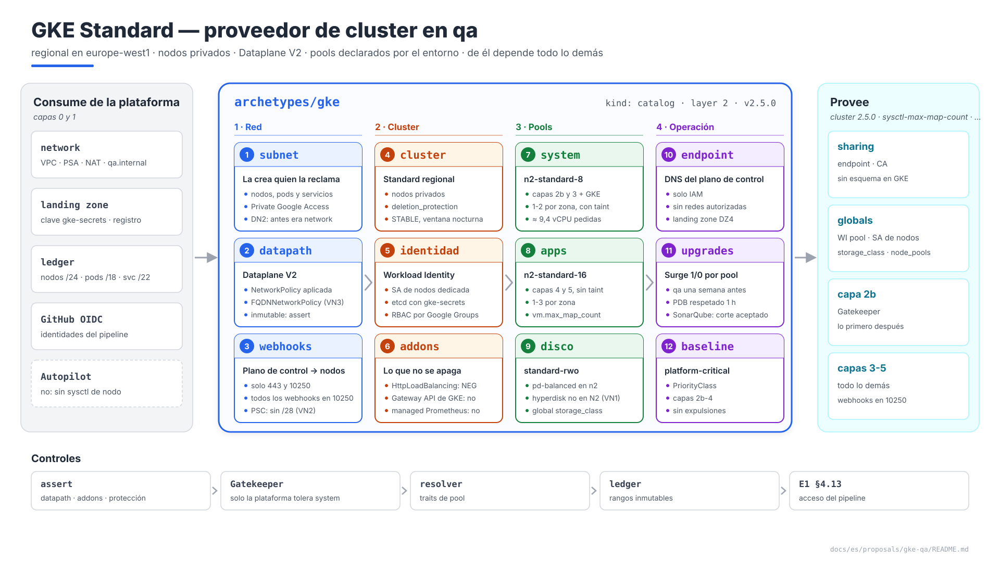

# GKE en `qa` — arquetipo `gke` (capa 2), proveedor de `cluster`

| | |
|---|---|
| **Estado** | Propuesta · revisión 4 |
| **Alcance** | El cluster de `qa` como arquetipo: direcciones y subred, plano de control y acceso, seguridad de nodos, node pools y su asignación a consumidores, almacenamiento, red del cluster, upgrades, el contrato `cluster`, stacks, políticas, ejecución y plan |
| **Por qué ahora** | Todo lo desplegado en las propuestas anteriores corre en él, y cada una le dejó un requisito (§0.1). Es la dependencia de todas: el último eslabón antes de la red y el borde |
| **Base** | E1 §4.1 (runtime), §4.13 (acceso del pipeline), §4.14 (KMS), §4.15 (VPC separada); arquitectura §5.2–§5.7 (guía GKE y línea base de seguridad); AM §9 (pools y rangos). Este documento **no repite** lo que ya está allí: lo concreta y cierra huecos |
| **Especificación de referencia** | `archetype-model.md` (AM §n), `terramate-outputs-sharing-architecture.md` (§n), `risk-register.md` |
| **Diagramas** | `diagrams/*.mmd` (fuente Mermaid) y `diagrams/*.svg` (renderizados). El SVG se regenera desde el `.mmd`; no se edita a mano. `diagrams/06-bloques-presentacion.svg` (1920×1080, para presentaciones) se genera con `06-bloques-presentacion.py`, no con Mermaid |
| **Identificadores propios** | Decisiones `DN1…`, riesgos candidatos `RN1…`, verificaciones `VN1…`. Los riesgos reciben número `R54+` en `risk-register.md` si se adopta, detrás de los de las propuestas anteriores |

No reabre ninguna decisión de `CLAUDE.md`. Sí corrige tres puntos de documentos ya cerrados, porque tal como estaban no funcionaban o se contradecían: el tipo de disco (§6), quién crea la subred de nodos (§1.2) y los traits que dependen de un node pool (§5.3). Los tres están **aplicados** (§11).



Fuente: [`diagrams/06-bloques-presentacion.py`](diagrams/06-bloques-presentacion.py) — vista de presentación; el detalle está en §1–§9.

---

## 0. Contexto

| Pregunta | Respuesta | Consecuencia |
|---|---|---|
| Qué es | Arquetipo `gke`, `kind: catalog`, **capa 2**, provee **`cluster` 2.5.0** | Stack `gcp-qa-gke` y sus hermanos (§7.3) |
| Modo | GKE **Standard**, **regional** en `europe-west1` (zonas `b`, `c`, `d`) | Autopilot no admite sysctl de nodo (E1 §4.1). La pregunta abierta nº 1 de `CLAUDE.md` no aplica a `qa` |
| Proyecto y red | `disasterproject-qa`, VPC propia de `qa` (E1 §4.15) | Sin Shared VPC ni tránsito por el hub |
| Quién lo consume | Todo lo de capa 2b en adelante: Gatekeeper, cert-manager, ESO, monitorización, Envoy Gateway, Kafka, Keycloak, SonarQube | Endpoint y CA por outputs sharing; el resto, globals (§7.1) |



Fuente: [`diagrams/01-contexto.mmd`](diagrams/01-contexto.mmd)

### 0.1 Lo que le pidieron las propuestas anteriores

| Origen | Requisito | Dónde se cumple |
|---|---|---|
| E1 §4.1 | Nodos privados, Workload Identity, `deletion_protection`, sysctl `vm.max_map_count` en `sonar` | §2, §3, §5 |
| E1 §4.13 | Endpoint público con redes autorizadas vacías; `ignore_changes` sobre ellas; servicio intermedio `open`/`close` | §2.2, stack `access` |
| E1 §4.14 | Cifrado de secretos de etcd con la clave `gke-secrets` de la landing zone | §3 |
| Monitorización §1 | `SYSTEM_COMPONENTS` en logs y métricas; `managed_prometheus.enabled = false` | §4 |
| Envoy Gateway §3 | `gateway_api_config { channel = "CHANNEL_DISABLED" }` | §4 |
| Envoy Gateway §5.1 | NEG standalone para el borde | §4: **exige** el addon `HttpLoadBalancing` (RN2) |
| Kafka §2.1 | Node pool `kafka`, uno por zona, con taint | §5 |
| SonarQube E2 §9 | Node pool `sonar`; salida `workload_identity_pool` | §5, §7.1 |
| Gatekeeper, ESO, monitorización, CNPG | Webhooks en **10250**: el plano de control solo llega a los nodos privados por 443 y 10250 | §2.3 (VN2) |
| Keycloak VK6 | `FQDNNetworkPolicy` hacia Entra ID | §4: Dataplane V2 (VN3) |

---

## 1. Direcciones y subred

### 1.1 Claims en el pool de `qa`

`qa` es `10.4.128.0/17` (AM §9.2). Las zonas de `registry/zones.yaml` lo reparten así: `infra` `10.4.128.0/20`, `data` `10.4.144.0/20`, `edge` `10.4.160.0/20`, `growth` `10.4.176.0/20`, `pods` `10.4.192.0/18`.

| Claim | Zona | Tamaño | Primer ajuste si `gke` es el primero en reclamar | Cálculo |
|---|---|---|---|---|
| Subred de nodos | `infra` | **/24** | `10.4.128.0/24` | `max_nodes × 4` con suelo /24 (AM §9.5): 32 × 4 = 128 → /25 → /24 |
| Rango de pods | `pods` | **/18**, la zona entera | `10.4.192.0/18` | 64 pods/nodo → /25 por nodo → 128 nodos. Un solo cluster por entorno: la zona no tiene otro uso, y el rango es inmutable (R26) |
| Rango de servicios | `edge` | **/22** | `10.4.160.0/22` | 1024 `Service`. Inmutable también; un /24 (256) se queda corto con los `Service` por broker de Kafka y los de cada `Cluster` de CNPG, y ampliarlo es reconstruir (DN6) |

Los valores exactos los asigna el ledger (AM §9.7); la tabla muestra el resultado si el cluster reclama antes que nadie. El `assert` de AM §9.4 comprueba `max_nodes × bloque ≤ rango de pods`: 32 × /25 = /20 ≤ /18.

**Sin /28 para el plano de control.** Los clusters privados nuevos usan Private Service Connect y no reclaman un rango para el plano de control **(verificar en la versión fijada del provider, VN2)**. Si el provider crea un cluster con peering, hace falta un /28 en `infra`.

### 1.2 Quién crea la subred

La arquitectura (§5.2) pone la subred y sus rangos secundarios en el stack de red, y el cluster recibe sus nombres por outputs sharing. AM (§3, §9.5) dice lo contrario: **el runtime reclama** la subred de nodos y el rango de pods, porque cada runtime tiene una forma distinta (GKE: subred + dos rangos; EKS: subredes; AKS Overlay: solo subred; Cloud Run: subred de egress). Con la versión de la arquitectura, el arquetipo `environment` tendría que conocer la forma de cada runtime.

**Propuesta (DN2):** la subred de nodos y sus dos rangos secundarios los crea el propio arquetipo `gke`, en su primer stack (`subnet`), sobre la VPC que publica `network`. Consecuencias:

| Antes (arquitectura §5.2) | Después |
|---|---|
| `network` crea subred y rangos; salidas `subnet_self_link`, `gke_pods_range_name`, `gke_services_range_name` | `network` publica la VPC, el rango PSA, Cloud NAT (`ALL_SUBNETWORKS_ALL_IP_RANGES`) y la zona `qa.internal`; **no** conoce el runtime |
| El dueño del claim (`gcp-qa-gke` en el ledger) no es quien crea el recurso | Dueño del claim = quien lo crea = quien escribe sus reglas de firewall (`CLAUDE.md`) |
| Reconstruir el cluster por R26 toca el stack de red | Toca solo stacks de `gke` |

Private Google Access se activa en la subred de nodos: la crea `gke`, así que lo activa `gke`.

**Solo GKE.** Las guías de EKS y AKS (arquitectura §6, §9) siguen con las subredes en `network`. El mismo argumento se les aplica, pero el ciclo de etiquetado de subredes de EKS ya tiene su propia solución (`cluster_name` como global) y cambiarlas queda fuera de esta propuesta: se revisa cuando se diseñe el primer entorno en esas nubes.

---

## 2. Plano de control y acceso

### 2.1 Cluster

| Ajuste | Valor | Motivo |
|---|---|---|
| Nombre | `qa` (global `cluster_name`) | Determinista: rompe ciclos y evita una salida por sharing |
| Ubicación | `europe-west1`, regional | Plano de control replicado en 3 zonas |
| Release channel | `STABLE` | E1 §4.1 (DN8) |
| Ventana de mantenimiento | Lunes a jueves, 22:00–04:00 `Europe/Madrid` | `qa` se actualiza en días laborables y antes que `prod`, que lleva su ventana una semana después (DN8) |
| `deletion_protection` | `true` | E1 §4.1; `assert` de §9.1 |
| Pool por defecto | `remove_default_node_pool = true`, `initial_node_count = 1` | Los pools se gestionan en su propio stack (§7.3) |
| Autoescalado del cluster | Perfil `BALANCED`; **sin** node auto-provisioning | Un pool creado por NAP no llevaría taints ni sysctl deliberados |

### 2.2 Endpoint

| Ajuste | Valor | Motivo |
|---|---|---|
| Nodos | `enable_private_nodes = true` | §5.7 |
| Endpoint público | Activo, `master_authorized_networks_config` **vacío** al crear | E1 §4.13 |
| Redes autorizadas | `lifecycle { ignore_changes = [master_authorized_networks_config] }` | Las abre y cierra el stack `access` (§7.3), no este |
| Endpoint DNS del plano de control | Anotado como alternativa (E1 §4.13); no se activa | Si el servicio intermedio cuesta más de lo previsto, sustituye a todo el procedimiento |

### 2.3 Firewall del plano de control

GKE crea la regla que deja al plano de control llegar a los nodos por **443 y 10250**. Por eso todos los webhooks de la plataforma escuchan en 10250 (Gatekeeper RP1, ESO RE3, monitorización VM3, CNPG VO1). El arquetipo no añade reglas: cualquier otro puerto de webhook necesitaría una, y los `assert` de cada proveedor lo impiden **(verificar con PSC, VN2)**.

---

## 3. Seguridad de nodos e identidad

| Control | Valor | Referencia |
|---|---|---|
| SA de nodos | `gke-nodes-qa@disasterproject-qa`, dedicada: `logging.logWriter`, `monitoring.metricWriter`, `stackdriver.resourceMetadata.writer`; `artifactregistry.reader` **sobre el repositorio** de la landing zone, no sobre el proyecto | §5.7 |
| Workload Identity | `workload_pool = "disasterproject-qa.svc.id.goog"`; `workload_metadata_config.mode = "GKE_METADATA"` en cada pool | §5.7, R15 |
| Metadatos | `disable-legacy-endpoints = true` | §5.7 |
| Nodos | Shielded (secure boot, integridad), `COS_CONTAINERD`, sin IP externa | §5.7, org policies §11.7 |
| Secretos en etcd | `database_encryption { state = "ENCRYPTED", key_name = <gke-secrets> }` | E1 §4.14 |
| Permiso sobre `gke-secrets` | Lo concede la **landing zone** al agente de servicio de GKE de `disasterproject-qa` | La identidad de `qa` no puede escribir IAM sobre una clave de la landing zone; la landing zone crea el proyecto y conoce su número |
| RBAC | Google Groups for RBAC (`authenticator_groups_config.security_group = gke-security-groups@<dominio>`); `cluster-admin` ligado a `gke-qa-admins@` | §5.7 **(verificar el grupo en el dominio, VN4)** |
| Binary Authorization | `PROJECT_SINGLETON_POLICY_ENFORCE`: en `qa`, lista de admisión del Artifact Registry de la landing zone **y** exigencia de atestación en modo *dry-run* | §5.7 pide atestación, y nada la genera todavía: la firma de E1 §4.10 es de cosign. Enforce en `prod` cuando el pipeline cree atestaciones (DN10) |

---

## 4. Red y addons del cluster

| Ajuste | Valor | Motivo |
|---|---|---|
| Datapath | **`ADVANCED_DATAPATH`** (Dataplane V2) | Aplica `NetworkPolicy` (E1 §4.8 y cada propuesta) y, con `enable_fqdn_network_policy`, `FQDNNetworkPolicy` (Keycloak VK6, VN3). **Inmutable**: sin él al crear, todas las `NetworkPolicy` de la plataforma son decorativas sin ningún error (RN3) |
| `HttpLoadBalancing` | **Activo** | El controlador de NEG que crea el NEG standalone de Envoy vive en este addon. Desactivarlo porque "no usamos Ingress de GKE" deja el borde sin backends (RN2) |
| Gateway API de GKE | `CHANNEL_DISABLED` | Envoy Gateway §3 |
| Logs y métricas | `SYSTEM_COMPONENTS`; `managed_prometheus.enabled = false` | Monitorización §1 |
| CSI de Persistent Disk | Activo | §6 |
| DNS | kube-dns (por defecto); **sin** NodeLocal DNSCache | Las reglas de DNS de todas las `NetworkPolicy` ya escritas apuntan a kube-dns. Activar la caché después obliga a revisarlas (DN9) |
| `qa.internal` | Resuelve desde los pods: kube-dns reenvía al servidor de metadatos, que resuelve las zonas privadas enlazadas a la VPC | E1 §4.15 |
| Asignación de costes | `cost_management_config.enabled = true` | Coste por namespace sin herramientas extra |

---

## 5. Node pools

### 5.1 Los tres pools de `qa`



Fuente: [`diagrams/03-node-pools.mmd`](diagrams/03-node-pools.mmd)

| Pool | Máquina | Zonas | Nodos | Taint | Específico | Upgrade |
|---|---|---|---|---|---|---|
| `general` | **n2-standard-8** (8 vCPU, 32 GB) | `b`, `c`, `d` | **1–3 por zona**, autoescalado | — | — | Surge `max_surge = 1`, `max_unavailable = 0` |
| `sonar` | n2-standard-8 | `b` | 1 | `dedicated=sonar:NoSchedule` | `linux_node_config.sysctls = { "vm.max_map_count" = "524288" }` | Surge 1/0: el nodo nuevo nace en la misma zona y el PVC zonal se vuelve a montar |
| `kafka` | n2-standard-4 (4 vCPU, 16 GB) | `b`, `c`, `d` | 1 por zona | `dedicated=kafka:NoSchedule` | — | Surge 1/0; el PDB de Strimzi (`maxUnavailable: 1`) serializa los brokers |

Todos: 64 pods por nodo, `COS_CONTAINERD`, Shielded, `GKE_METADATA`, SA `gke-nodes-qa@`, auto-upgrade y auto-repair activos. GKE respeta los PDB durante una hora y después fuerza el drenaje: un PDB que nunca se satisface no bloquea un upgrade, solo lo retrasa.

### 5.2 Tamaño de `general`

Suma de `capacity` de los manifiestos ya propuestos, sin lo que va a pools dedicados:

| Arquetipo | CPU (m) | Memoria (MiB) | Nota |
|---|---|---|---|
| `policy-gatekeeper` | 1600 | 2560 | |
| `cert-manager` | 400 | 768 | |
| `secrets-eso-gsm` | 200 | 768 | |
| `monitoring-oss` | 3000 | 8192 | |
| `gateway-envoy-gke` | 3200 | 3584 | |
| `keycloak` | 2300 | 4864 | |
| `kafka` sin brokers | 1200 | 3072 | 7200/27648 menos 3 brokers de 2000/8192, que van a `kafka` |
| `sonarqube` sin el pod principal | ≈ 0 | ≈ 128 | El pod va a `sonar`; la BD es Cloud SQL; queda el sidecar del proxy |
| Sistema de GKE | ≈ 1000 | ≈ 2048 | kube-dns, metrics-server, konnectivity, CSI, `anetd` |
| **Total** | **≈ 12 900** | **≈ 25 900** | |

Un n2-standard-8 deja ≈ 7,9 vCPU y ≈ 28 GiB asignables. Con un nodo por zona, 3 nodos dan ≈ 23,7 vCPU y ≈ 85 GiB: 54 % de CPU y 30 % de memoria pedidos. **Perdida una zona**, quedan 2 nodos con ≈ 15,8 vCPU, que siguen cubriendo las peticiones; el autoescalado añade nodos en las zonas vivas hasta 3 por zona. Los DaemonSets (node-exporter, Fluent Bit) suman por nodo, no por arquetipo, y caben en ese margen.

**Por qué n2-standard-8 y no el doble de n2-standard-4.** La misma capacidad, pero el default de 64 pods por nodo asume nodos de 32 GB (`CLAUDE.md`), y cada nodo repite el coste de los DaemonSets (DN4).

### 5.3 Cómo llega un consumidor a su pool

| Pieza | Diseño |
|---|---|
| Declaración | Los pools son del **entorno**: van en el binding (`cluster.node_pools`), no en el manifiesto de `gke` ni en el del consumidor. Así `prod` puede dimensionar distinto sin tocar ningún arquetipo |
| Selección | El consumidor pone `nodeSelector: { cloud.google.com/gke-nodepool: sonar }` y la tolerancia al taint. La etiqueta la pone GKE; no hace falta una propia |
| Quién puede tolerar | **Nueva regla de Gatekeeper (propuesta):** solo los namespaces del arquetipo dueño del pool pueden tolerar `dedicated=<pool>`. Sin ella, cualquier tenant añade la tolerancia y se instala en el nodo de SonarQube (RN5). Los dueños salen del binding, por el mismo camino registro → chart que el resto de parámetros (Gatekeeper §7.1) |
| Traits de pool | `sysctl-max-map-count`, `gpu`, `spot` y `arm64` no son propiedades del cluster sino de **un** pool. Hoy el manifiesto de `gke` declara `sysctl-max-map-count` y `gpu` siempre, y un consumidor que los pida resuelve aunque el binding no tenga el pool: falla al arrancar, justo lo que los traits existen para evitar (RN7). **Propuesta:** el resolver da por presentes esos traits solo si un pool del binding los declara (AM §4.2) |

```yaml
# environments/qa/binding.yaml — bloque cluster (DN5; aplicado en E1 §7)
cluster:
  max_nodes: 32
  max_pods_per_node: 64
  node_pools:
    - name: general
      machine_type: n2-standard-8
      zones: [europe-west1-b, europe-west1-c, europe-west1-d]
      autoscaling: { min_per_zone: 1, max_per_zone: 3 }
    - name: sonar
      machine_type: n2-standard-8
      zones: [europe-west1-b]
      autoscaling: { min_per_zone: 1, max_per_zone: 1 }
      taint: dedicated=sonar:NoSchedule
      sysctls: { vm.max_map_count: "524288" }
      traits: [sysctl-max-map-count]
      owners: [sonarqube]
    - name: kafka
      machine_type: n2-standard-4
      zones: [europe-west1-b, europe-west1-c, europe-west1-d]
      autoscaling: { min_per_zone: 1, max_per_zone: 1 }
      taint: dedicated=kafka:NoSchedule
      owners: [kafka]
```

`max_nodes: 32` es el techo del cluster, no el tamaño: 9 + 1 + 3 = 13 nodos como máximo, más uno de surge por pool durante un upgrade. Con 32 hay margen para un cuarto pool sin cambiar la subred.

---

## 6. Almacenamiento

**El problema.** E1 §4.1 fija la StorageClass `hyperdisk-balanced`, y los pools son n2. Según la tabla de compatibilidad de Compute Engine, **la serie N2 no admite Hyperdisk Balanced**: solo Persistent Disk, y Hyperdisk Extreme o Throughput en tamaños grandes **(verificar en la fecha de implementación, VN1)**. Con `WaitForFirstConsumer` no falla al crear la StorageClass ni el PVC: falla cuando el pod se programa, y el pod queda `Pending` (RN1). Afecta a SonarQube (ES y CNPG), a Prometheus y a los brokers de Kafka.

| Opción | Disco | Máquina | Rendimiento para E1 §4.12 (3000 IOPS en 50 GiB) | Coste del cambio |
|---|---|---|---|---|
| **A (recomendada)** | `pd-balanced` por la StorageClass `standard-rwo` que GKE ya trae (`WaitForFirstConsumer`, expansión activa) | n2, sin cambios | 3000 IOPS de base más 6 por GiB: ≈ 3300 en 50 GiB | Cambiar el nombre de la StorageClass en cuatro sitios |
| B | `hyperdisk-balanced` | n4 o c3 en los tres pools | IOPS configurables | Cambiar las máquinas; c3 ya se evalúa para el CE en E1 V4 |

**Y el nombre deja de estar en los consumidores (DN3).** El contrato `cluster` publica un global `storage_class` (`standard-rwo` en GKE con la opción A) y los consumidores lo usan, nunca un tipo de disco. E2 ya tenía un `global.storage_class`; lo que cambia es de dónde sale. La alternativa de alta disponibilidad de E1 §4.1 sigue existiendo con la opción A: `pd-balanced` regional (`replication-type: regional-pd`).

---

## 7. El contrato y el arquetipo

### 7.1 Contrato `cluster` 2.5.0

| Valor | Cómo llega | Valor en `qa` | Cambio |
|---|---|---|---|
| `cluster_endpoint` | Outputs sharing, de `cluster` | IP del endpoint, **sin esquema** (trampa de `CLAUDE.md`) | — |
| `cluster_ca` | Outputs sharing, de `cluster`, `sensitive` | Base64 | — |
| `cluster_name`, `cluster_location` | Global | `qa`, `europe-west1` | Siguen existiendo como salidas por compatibilidad |
| `workload_identity_pool` | **Global** | `disasterproject-qa.svc.id.goog` | Era salida por sharing. Es determinista (proyecto), así que pasa a global: una arista menos en cada consumidor (DN7). La salida se mantiene, obsoleta, hasta 3.0.0 |
| `node_service_account` | Global | `gke-nodes-qa@disasterproject-qa.iam.gserviceaccount.com` | Ídem |
| `node_pool_instance_groups` | Outputs sharing, de `nodepools`, **nuevo** | URLs de los grupos de instancias por pool | Para las excepciones L4 del borde (propuesta `edge-qa` §5). No son deterministas: cambian si se recrea un pool |
| `storage_class` | Global, **nuevo** | `standard-rwo` | §6 |
| `node_pools` | Global, **nuevo**, del binding | Nombre, taint y dueños de cada pool | §5.3 |

Una versión menor: nada desaparece, y los consumidores que piden `^2.0.0` siguen resolviendo.

### 7.2 Manifiesto

```yaml
# archetypes/gke/manifest.yaml
apiVersion: archetype/v1
kind: Archetype

metadata:
  name: gke
  version: 2.5.0
  layer: 2
  kind: catalog
  description: GKE Standard regional con nodos privados; pools declarados por el entorno
  owners: [team-platform]

runtimes: [gke]

requires:
  - capability: network
    version: "^3.0.0"

provides:
  - capability: cluster
    version: 2.5.0
    traits: [self-managed-nodes, daemonset-privileged, hostpath, node-agent, gpu, sysctl-max-map-count]
    outputs:
      - { name: cluster_endpoint,       from: cluster }
      - { name: cluster_ca,             from: cluster }
      - { name: cluster_name,           from: cluster }
      - { name: cluster_location,       from: cluster }
      - { name: workload_identity_pool, from: cluster }     # obsoleta: global desde 2.5.0
      - { name: node_service_account,   from: cluster }
      - { name: node_pool_instance_groups, from: nodepools }   # para edge-l4 (propuesta edge-qa §5)

claims:
  - kind: cidr
    zone: infra
    purpose: nodes
    computed: "from(max_nodes)"
  - kind: cidr
    zone: pods
    purpose: pods
    computed: "from(max_nodes, max_pods_per_node)"
  - kind: cidr
    zone: edge
    purpose: services
    size: 22

stacks:
  - name: subnet
  - name: cluster
    after: [subnet]
  - name: nodepools
    after: [cluster]
  - name: access
    after: [cluster]
  - name: baseline
    after: [nodepools]
```

`gpu` y `sysctl-max-map-count` siguen en `traits` porque el arquetipo **puede** ofrecerlos; con la propuesta de §5.3, el resolver solo los da por presentes si un pool del binding los declara.

### 7.3 Los stacks

| Stack | Contenido | Entradas por sharing |
|---|---|---|
| `subnet` | Subred de nodos con sus dos rangos secundarios, Private Google Access y flow logs con el global `flow_logs` del entorno (propuesta `network-qa` §2) | `network_self_link` |
| `cluster` | `google_container_cluster` (§2–§4), SA de nodos y sus roles | `network_self_link`, `subnet_self_link` (del propio `subnet`) |
| `nodepools` | Un `google_container_node_pool` por entrada de `cluster.node_pools`; publica `node_pool_instance_groups` | — (globals) |
| `access` | Servicio intermedio de E1 §4.13: Cloud Run function con un rol propio de solo `container.clusters.get` y `container.clusters.update`, con condición IAM sobre **este** cluster; Cloud Scheduler para el reconciliador de cada 15 min | — |
| `baseline` | `PriorityClass` `platform-critical` para las capas 2b–4, para que un tenant no expulse a Gatekeeper o al Gateway; nada más | `cluster_endpoint`, `cluster_ca` |

**Por qué `nodepools` aparte.** Un cambio de pool (tamaño, taint, un pool nuevo) no debe planificar el cluster, y un `plan` del cluster no debe mostrar los pools. Es también el stack que más cambia entre entornos.

**Por qué `access` aparte.** Tiene el único permiso capaz de cambiar cualquier ajuste del cluster (E1 §4.13, condición 4): aislarlo en un stack propio deja su IAM revisable en un solo sitio.

---

## 8. Ejecución

| Qué | Cómo |
|---|---|
| Primer despliegue | Fase A de E1 §6, después de `gcp-qa-network`: `subnet` → `cluster` → `nodepools` y `access` → `baseline`. Gatekeeper es lo siguiente |
| Upgrade del plano de control | Automático por el canal, en la ventana (§2.1). `qa` una semana antes que `prod` |
| Upgrade de pools | Automático tras el plano de control; surge 1/0 por pool. El pool `sonar` **corta SonarQube** durante el cambio de nodo: se acepta en `qa` (R53); la ventana lo deja fuera de horario |
| Cambio de tamaño de un pool | PR al binding → `nodepools` |
| Cambio de rango, datapath o pods por nodo | **Reconstrucción del cluster** (inmutables). Un `assert` falla en `generate` si el binding intenta cambiar `max_pods_per_node` de un cluster existente |
| Destrucción | `deletion_protection` y tag `protected`; solo con la identidad de destroy (§11.4) |

---

## 9. Políticas, riesgos y verificaciones

### 9.1 `assert`

```hcl
assert {
  assertion = global.gke.datapath_provider == "ADVANCED_DATAPATH"
  message   = "cluster: Dataplane V2 — sin él, las NetworkPolicy no se aplican y el cambio es reconstruir (RN3)"
}
assert {
  assertion = global.gke.addons.http_load_balancing
  message   = "cluster: HttpLoadBalancing activo — sin él no hay NEG standalone para el borde (RN2)"
}
assert {
  assertion = global.gke.deletion_protection && global.gke.private_nodes && global.gke.workload_identity_enabled
  message   = "cluster: deletion_protection, nodos privados y Workload Identity (§5.7)"
}
assert {
  assertion = alltrue([for p in global.cluster.node_pools : p.taint == null || length(p.owners) > 0])
  message   = "cluster: un pool con taint necesita dueños — si no, nadie puede usarlo o todos pueden (RN5)"
}
```

### 9.2 Riesgos candidatos

| # | Riesgo | Probabilidad | Impacto | Mitigación |
|---|---|---|---|---|
| RN1 | **Disco incompatible con la máquina**: los PVC de `hyperdisk-balanced` no se montan en n2 | Alta con el diseño actual | Alta — SonarQube, Prometheus y Kafka no arrancan; el error aparece al programar el pod | §6, opción A; `storage_class` como global; VN1 |
| RN2 | **Addon `HttpLoadBalancing` desactivado**: no se crea el NEG standalone | Media | Alta — el borde no tiene backends | `assert`; VN5 |
| RN3 | **Cluster sin Dataplane V2**: las `NetworkPolicy` se admiten y no se aplican | Baja con el `assert` | Crítico — ningún aislamiento de red, ningún error; arreglarlo es reconstruir | `assert` |
| RN4 | **Redes autorizadas revertidas** por un `apply` del cluster a mitad de un job | Baja con `ignore_changes` | Media | E1 §4.13 condición 3 |
| RN5 | **Un tenant se instala en un pool dedicado** añadiendo la tolerancia | Media sin la regla | Media — expulsa o ralentiza a SonarQube o Kafka | Regla de Gatekeeper de §5.3 |
| RN6 | **Upgrade automático de `sonar` en horario de uso** | Media | Baja en `qa` | Ventana de mantenimiento; exclusiones en fechas de entrega |
| RN7 | **Trait de pool resuelto sin el pool** | Alta sin la propuesta | Media — el consumidor falla al arrancar | §5.3: el resolver comprueba el pool |

### 9.3 Verificaciones

| # | Verificación | Resultado que la cierra |
|---|---|---|
| VN1 | Compatibilidad de Hyperdisk Balanced con N2 y rendimiento de `pd-balanced` en 50 GiB | Tabla de Compute Engine a la fecha; `fio` en el PVC de ES ≥ 3000 IOPS |
| VN2 | Cluster privado con PSC: sin /28; regla automática del plano de control a 443 y 10250 | Los webhooks de Gatekeeper, ESO, monitorización y CNPG responden (= VP1, VE4, VM3, VO1) |
| VN3 | `FQDNNetworkPolicy` en GKE Standard con Dataplane V2 | = VK6 de Keycloak |
| VN4 | Google Groups for RBAC con `gke-security-groups@<dominio>` | Un miembro de `gke-qa-admins@` es `cluster-admin`; otro usuario, nada |
| VN5 | NEG standalone con `HttpLoadBalancing` activo y `CHANNEL_DISABLED` | El NEG de Envoy existe y el backend service del borde lo ve sano |
| VN6 | `vm.max_map_count` por `linux_node_config` en `sonar` | = V1 de E1 |
| VN7 | Upgrade del pool `sonar` con surge 1/0 | El PVC se vuelve a montar en el nodo nuevo; se mide el corte |

---

## 10. `prod` y `demos`

| Ajuste | `qa` | `prod` | `demos` |
|---|---|---|---|
| Entorno | `/17` | `/16`: pods `/17`, 256 nodos | `/17` |
| Pools | `general`, `sonar`, `kafka` | Los mismos, con `sonar` en dos zonas si se adopta el disco regional | Autopilot (`gke-autopilot`), sin pools |
| Ventana | Lunes a jueves | Una semana después de `qa` | Cualquiera |
| Binary Authorization | Atestación en *dry-run* | **Enforce** | *Dry-run* |

---

## 11. Cambios a otros documentos

| Documento | Cambio | Estado |
|---|---|---|
| E1 §6 (`docs/en/` y `docs/es/`) | La arista `…-data-tenant → gcp-qa-postgres-operator` pasa de outputs sharing a global (`operator_version`, propuesta `postgres-operator-qa` §7.1): corrige lo que quedó sin actualizar en el commit anterior | **Aplicado** |
| E1 §4.1 y §4.12, E2 §4.2, §5.3 y §6.1, monitorización §3.1, diagrama 08 de E1 | `hyperdisk-balanced` → el global `storage_class` (`standard-rwo`, `pd-balanced`); la alternativa HA de E1 §4.1 pasa a `pd-balanced` regional | **Aplicado** (DN3) |
| Arquitectura §3.1, §4.3, §4.4, §5.1–§5.3 y §6.8; `platform-overview` | La subred y los rangos secundarios los crea `gke` en su stack `gke-subnet`, no `network`; el contrato de `network` pierde `subnet_self_link` y los nombres de rango y gana `private_service_range` | **Aplicado** (DN2) |
| `schemas/environment-binding.schema.json` y bindings de `qa` (E1 §7, variante Cloud SQL) | Bloque `cluster.node_pools` (§5.3), con `owners` obligatorio si hay taint; `gke` 2.5.0 en el binding | **Aplicado** (DN5) |
| AM §4.2 y `registry/traits.yaml` | Traits de pool: presentes solo si un pool del binding los declara; marcados en el registro | **Aplicado** (DN5) |
| Gatekeeper §4.1 y §7.1 | Regla P11: tolerar `dedicated=<pool>` solo desde los namespaces de sus dueños; sus parámetros salen del binding | **Aplicado** (DN5) |
| Consumidores de `workload_identity_pool` | Leerlo como global; la salida sigue hasta 3.0.0 | **Propuesto** (DN7) |

---

## 12. Decisiones

| # | Decisión | Estado | Recomendación | Alternativa |
|---|---|---|---|---|
| DN1 | Modo y acceso | Consecuencia de E1 §4.1 y §4.13 | Standard regional, nodos privados, endpoint público con redes vacías | Autopilot; endpoint DNS |
| DN2 | Quién crea la subred de nodos | **Aprobada** | `gke`, que la reclama | `network`, como en la arquitectura §5.2 |
| DN3 | Disco | **Aprobada**; VN1 lo confirma | `pd-balanced` (`standard-rwo`) en n2; `storage_class` como global | Hyperdisk Balanced con n4 o c3 |
| DN4 | Pool `general` | Propuesta | n2-standard-8, 1–3 por zona | n2-standard-4, 2–6 por zona |
| DN5 | Pools | **Aprobada** | Declarados en el binding; traits de pool comprobados por el resolver; tolerancias limitadas por Gatekeeper | Pools fijos en el manifiesto de `gke` |
| DN6 | Rango de servicios | Propuesta | /22 | /24 |
| DN7 | `workload_identity_pool` | Propuesta | Global | Outputs sharing |
| DN8 | Upgrades | Propuesta | `STABLE` en los dos entornos, ventana de `qa` una semana antes que la de `prod` | `REGULAR` en `qa`, `STABLE` en `prod` |
| DN9 | DNS del cluster | Propuesta | kube-dns sin NodeLocal DNSCache | Con caché, revisando todas las reglas de DNS |
| DN10 | Binary Authorization | Propuesta | Lista de registros en enforce; atestación en *dry-run* en `qa` | Sin Binary Authorization, solo la regla P2 de Gatekeeper |

---

## 13. Plan de implementación

| Fase | Contenido | Criterio de salida | Estimación |
|---|---|---|---|
| **0 · Verificaciones** | VN1 y VN2 en un efímero con un cluster mínimo | Disco decidido; webhook en 10250 alcanzable | 1 día |
| **1 · Cluster** | `subnet`, `cluster`, `nodepools`; `assert` de §9.1 | Tres pools sanos; `kubectl` desde un runner con la IP abierta | 1 día |
| **2 · Acceso** | Stack `access`; reconciliador; alerta de monitorización sobre cambios fuera del servicio (monitorización §10.3) | Dos jobs simultáneos sin perder acceso (E1 §4.13 condición 1); una IP huérfana retirada a los 60 min | 1,5 días |
| **3 · Base** | `baseline`; VN4, VN5, VN6, VN7 | Gatekeeper instalable (fase B de E1 §6) | 1 día |

Cuatro días y medio para una persona. Lo que desbloquea es todo lo demás.
