# Repositorio de despliegue — `disasterproject/infra`

| | |
|---|---|
| **Estado** | Propuesta · revisión 2 · G1 con `--all-namespaces` y el paquete del registro; inventario sobre `debug show metadata`; experimento `scripts`; `ci/fetch-observed.sh`; marcador de deploy atado al paso de apply (`poc/RESULTS.md` A8) |
| **Alcance** | Cómo se organiza el repositorio donde se despliega la plataforma: qué repositorios hay y qué va en cada uno, la estructura de directorios, el modelo de ramas (y por qué no hay rama `qa`), la configuración de GitHub (rulesets, Environments, variables, CODEOWNERS), los workflows y el ciclo de vida de un entorno. Incluye **plantillas** de los workflows, validadas, en [`templates/`](templates/) |
| **Por qué ahora** | Este repositorio (`proposal_documents`) es solo documentación y propuestas. Las propuestas de `qa` describen stacks, identidades y guardas, pero ninguna dice dónde viven ni qué workflow los aplica; el workflow de deploy de la arquitectura, además, no podía aplicar `qa` (§5.1) |
| **Base** | Arquitectura §4.11 (primer despliegue), §11.2–§11.4 (identidades del pipeline), §12.4 (destroy), §14 (CI/CD); `landing-zone-qa` §1, §5, §10; `cmdb-qa` §2–§6; `developer-guide.md` §1, §3; `poc/RESULTS.es.md`. No se repite lo que ya está allí |
| **Especificación de referencia** | `archetype-model.md` (AM §n), `terramate-outputs-sharing-architecture.md` (§n), `developer-guide.md` (DG §n) |
| **Diagramas** | `diagrams/*.mmd` (fuente Mermaid) y `diagrams/*.svg` (renderizados). El SVG se regenera desde el `.mmd`; no se edita a mano |
| **Identificadores propios** | Decisiones `DR1…`, riesgos candidatos `RR1…`, verificaciones `VR1…` |

No reabre ninguna decisión de `CLAUDE.md`. Al llevar la arquitectura a un repositorio real encuentra cuatro cosas:

1. **No hay rama `qa`, y no debe haberla.** En el repositorio de infraestructura un entorno es un **directorio** (`environments/qa/`, `stacks/platforms/gcp/qa/`) y un **GitHub Environment** (`qa`), no una rama. Una rama por entorno haría que `qa` y `prod` ejecutaran versiones distintas de los mismos generadores y módulos, y la diferencia se descubriría al fusionar (§3.2). Las ramas por entorno de la guía de desarrollo (`release/*` → `qa`) son de los repositorios de **aplicación**, y siguen siendo válidas allí.
2. **Un proyecto Terramate es un repositorio** (medido, `poc/RESULTS.es.md`). Todo lo que se pasa valores por outputs sharing — la landing zone, las plataformas, los arquetipos y sus instancias — tiene que vivir en el mismo repositorio. Eso choca con la guía de desarrollo, que pone los stacks de una aplicación en el repositorio de la aplicación (DR6, abierta, §8).
3. **El deploy de la arquitectura era un solo job con `environment: production`**, y la identidad de apply de cada entorno solo es suplantable desde el Environment de ese entorno (arquitectura §11.2). Con ese job no se podía aplicar `qa`. Corregido en la arquitectura §14.2: un job por entorno (§5.1).
4. **Hechos de Terramate medidos al escribir las plantillas** (0.16.0 y 0.17.3): los tags no admiten `:` (`instance:alpha` rompe la carga de la configuración; ahora `instance/alpha`), `terramate list` no tiene `--json`, y `experimental eval` no expone `after` (el inventario sale de `ci/stacks-json.sh`, sobre `debug show metadata`); los bloques `script` siguen necesitando el experimento `scripts` en 0.17.3 (`poc/RESULTS.md` A8). Corregidos en `CLAUDE.md`, la arquitectura, el glosario y las propuestas afectadas (§12).

---

## 0. Contexto



Fuente: [`diagrams/01-repositorios.mmd`](diagrams/01-repositorios.mmd)

Cuatro clases de repositorio, cada una con un solo propósito:

| Repositorio | Contiene | Quién escribe | Qué despliega |
|---|---|---|---|
| `aescanero/proposal_documents` (este) | Documentos de referencia, propuestas, `poc/` como evidencia | Plataforma, por PR | Nada |
| **`disasterproject/infra`** | Todo lo que Terramate aplica: landing zone, plataformas, arquetipos, instancias, una copia fijada del registro, políticas, CMDB | Plataforma; los equipos de aplicación por PR a sus instancias | **Todo**, desde sus workflows |
| `disasterproject/platform-tools` | `archetypectl`, `registry-generate`: código Go con sus tests y releases | Plataforma | Binarios versionados, que `infra` fija con `mise` |
| Repositorios de aplicación (`orders-app`, …) | Código, `manifest.yaml`, overlays de valores Helm (DG §1) | Cada equipo | Imágenes y charts al registro; **no** infraestructura (DR6) |

---

## 1. Qué va en cada repositorio

### 1.1 `infra` es un solo proyecto Terramate (DR1)

La PoC midió que Terramate toma la raíz del proyecto de la raíz de git y rechaza `required_version` y `config.experiments` en cualquier otro sitio: no se puede anidar un proyecto en otro ni partir uno en dos repositorios. Outputs sharing solo resuelve `from_stack_id` dentro del proyecto. Consecuencia:

- **La landing zone y los entornos van juntos.** `gcp-qa-gke` lee de `gcp-lz-*` (la SA de nodos, DZ5; el key ring) y de `gcp-qa-network`.
- **`qa` y `prod` van juntos.** Comparten generadores (`imports/generators/v<N>/`), contratos y módulos; un cambio en un generador es un PR con un plan por entorno (arquitectura §14.1), no N PRs en N repositorios.
- **Las instancias de arquetipo van en `infra`**, incluidas las de aplicación: consumen `cluster`, `ingress`, `database-platform`… por outputs sharing (§8).

### 1.2 Las herramientas van aparte (DR3)

`archetypectl` y `registry-generate` son programas con su propio ciclo de tests y versiones. En `infra` se usan como binarios fijados en `.mise.toml`; subir de versión es un PR que cambia una línea y cuya preview ejecuta G1 con la versión nueva. Así un cambio del resolver no llega a `prod` sin haber pasado por un PR de `infra`.

### 1.3 Semillas en ramas de este repositorio

Este repositorio tiene ramas con código que **no** se fusionan aquí: son implementación, y este repositorio es documentación. Quedan como semillas de los repositorios destino:

| Rama | Contenido | Destino |
|---|---|---|
| `claude/hopeful-gauss-572zzq` | `poc/`, la PoC de la fase 0 | **Integrada aquí** como evidencia (`poc/`), porque los documentos la citan |
| `claude/charming-fermat-mtdnfb` | `tools/registry-generate` y la puerta del registro bloqueante | `platform-tools` |
| `claude/fervent-goodall-m3r9eg` | `tools/archetypectl` con el subcomando `enrich` (hoja de ruta 2c.2) | `platform-tools` |
| `claude/docs-glossary-u5wfnz` | Políticas G1 en Rego (`policy/terramate_*.rego`, `archetype_composition.rego`) con sus tests | `infra/policy/` |
| `claude/focused-euler-avgf3y`, `dev` | Ya fusionadas en `main` (PR #1) o sin contenido propio | Borrar |

Las tres semillas parten de un `main` de hace más de 80 commits: se copian como punto de partida, no se fusionan, y se revisan contra lo que los documentos dicen hoy (tags `instance/<id>`, `ci/stacks-json.sh`, `--detailed-exit-code`).

### 1.4 `registry/` y `schemas/`: normativos aquí, una copia fijada en `infra` (DR4)

Este repositorio es la especificación normativa y lo sigue siendo: `registry/` se escribe aquí, y `schemas/` se genera a partir de él aquí (`CLAUDE.md`, "The registry is load-bearing"). Quien lo consume es `infra` — conftest, los `enum` de los schemas, los valores de Gatekeeper —, que lleva una **copia idéntica byte a byte fijada a un commit** de este repositorio. Una copia es la deriva que R34 describe salvo que algo la compruebe, así que en `gates` se ejecutan dos comprobaciones bloqueantes, en sentidos opuestos ([`ci/spec-sync.sh`](templates/ci/spec-sync.sh)):

| Comprobación | Detecta |
|---|---|
| `spec-sync.sh --check` — los ficheros contra `spec.lock.json` (`{spec_repo, commit, files: {path: sha256}}`) | Una edición a mano en `infra`, o un fichero añadido junto a la copia |
| `spec-sync.sh --upstream <clon>` — `spec.lock.json` contra el commit fijado de este repositorio | Un lock editado a mano para que pase la primera comprobación |

Un cambio del registro se hace **primero aquí**, por PR; subir el pin en `infra` es un segundo PR (`spec-sync.sh --update`) cuyo diff muestra exactamente qué capacidades, traits o campos de esquema cambiaron. Los schemas se copian sin anotar: JSON Schema no admite comentarios, y un `$comment` rompería la comprobación de igualdad exacta. La procedencia vive en el lock.

---

## 2. Estructura de `disasterproject/infra`

```
disasterproject/infra/
├── terramate.tm.hcl                 raíz única: versión, experimentos, sharing_backend
├── config.tm.hcl                    globals de la organización (dominio, región, proyecto lz)
├── .mise.toml                       terramate, tofu, checkov, conftest, platform-tools
├── spec.lock.json                   pin de registry/ y schemas/: commit de origen + sha256 por fichero (DR4)
├── registry/                        COPIA del registro de la especificación, nunca se edita aquí
├── schemas/                         COPIA de los schemas de la especificación, nunca se edita aquí
├── environments/
│   ├── qa/binding.yaml              el binding del entorno (AM §7)
│   └── prod/binding.yaml
├── archetypes/<name>/               manifest.yaml y chart de cada arquetipo del catálogo
├── imports/
│   ├── mixins/                      backend y providers por nube (_backend.tf, _providers.tf)
│   ├── generators/v1/               un generador por capacidad
│   ├── contracts/                   bloques output/input por capacidad
│   └── scripts/                     preview, deploy, destroy (arquitectura §4.8)
├── modules/                         módulos OpenTofu propios
├── stacks/
│   ├── landing-zone/gcp/
│   │   ├── bootstrap/               gcp-lz-bootstrap — lo aplica una persona (DZ8)
│   │   ├── org/  projects/  identities/  kms/  registry/  dns/  environments/  binauthz/
│   ├── platforms/gcp/
│   │   ├── qa/                      config.tm.hcl, binding.tm.hcl (generado), network/, edge/,
│   │   │                            gke-subnets/, gke/, policy/, certs/, secrets/, gateway/, monitoring/
│   │   └── prod/
│   └── archetypes/<archetype>/
│       ├── archetype.tm.hcl
│       └── instances/<instance>/    binding.tm.hcl (generado), instance.tm.hcl (digest, versión)
├── policy/                          Rego de conftest y sus *_test.rego
├── charts/policy-gatekeeper/        ConstraintTemplates y valores generados del registro
├── cmdb-data/                       mitad declarada de la CMDB (cmdb-qa §3); la observada, en su rama
├── images/third-party.yaml          imágenes de terceros que se copian (landing-zone-qa §6.2)
├── ci/                              g1.sh, changed-envs.sh, stacks-json.sh, fetch-observed.sh, spec-sync.sh
├── .gitattributes                   _*.tf linguist-generated: el diff se pliega, así que una edición a mano destaca
├── docs/runbooks/                   lz-bootstrap.md, env-onboarding.md, break-glass.md
└── .github/
    ├── workflows/                   §5
    ├── actions/setup/               herramientas fijadas + identidad de GCP
    └── CODEOWNERS
```

| Ruta | La escribe | Revisa |
|---|---|---|
| `archetypes/`, `imports/`, `modules/`, `policy/` | Personas, por PR | Plataforma (y seguridad en `policy/`) |
| `registry/`, `schemas/`, `spec.lock.json` | `ci/spec-sync.sh --update`, desde un commit de la especificación | Plataforma y seguridad; `spec-sync.sh --check` y `--upstream` hacen fallar una edición a mano |
| `environments/<env>/binding.yaml` | Personas, por PR | Plataforma; `prod` además sus aprobadores |
| `stacks/**/stack.tm.hcl`, `instance.tm.hcl` | Personas, por PR | Plataforma, o el equipo dueño de la instancia |
| `stacks/**/_*.tf`, `binding.tm.hcl`, `cmdb-data/` | **Generados**, commiteados en el mismo PR | G0 y `archetypectl cmdb check` fallan si difieren |
| Rama `cmdb-observed` | Solo `cmdb-sync` | Nadie: son observaciones |

Convenciones que cambian respecto a borradores anteriores y que las plantillas ya aplican: tags `instance/<id>` y `archetype/<name>` (no `:`); cada stack lleva su entorno como tag (`qa`, `prod`) y los de la landing zone llevan `landing-zone`; el stack de bootstrap lleva además `bootstrap`.

---

## 3. Ramas



Fuente: [`diagrams/02-flujo.mmd`](diagrams/02-flujo.mmd)

### 3.1 El modelo (DR2)

| Rama | Vida | Quién escribe | Qué dispara |
|---|---|---|---|
| `main` | Permanente | Solo por PR fusionado (squash), nunca push directo | `deploy`: cada entorno cambiado, con su Environment |
| `<tipo>/<descripción>` (`feat/`, `fix/`, `chore/`, `lz/`) | Horas o días | Personas | `preview`: G0, G1 y un plan por entorno tocado |
| `cmdb-observed` | Permanente, rama de datos | Solo `cmdb-sync` | Nada |

**Trunk-based.** `main` es la verdad de todos los entornos: lo que está en `main` es lo que debería estar desplegado en cada uno, y el drift diario (§5) comprueba que lo está. Un cambio que no debe llegar aún a `prod` no se retiene en una rama: se escribe en los ficheros de `qa` (`environments/qa/`, `stacks/platforms/gcp/qa/`), o en un generador nuevo `v<N+1>` que solo `qa` usa, y se promueve después con otro PR que lo lleva a `prod`.

### 3.2 Por qué no hay rama `qa`

| Con una rama por entorno (`qa`, `prod`) | Con directorios por entorno en `main` |
|---|---|
| `qa` y `prod` ejecutan **commits distintos** de los generadores, contratos, módulos y políticas compartidos. Lo que se probó en `qa` no es lo que se aplica en `prod`, igual que reconstruir una imagen en vez de promoverla (DG §5) | Los dos ejecutan el mismo código; solo difieren sus bindings y sus ficheros de entorno, y esa diferencia es visible en un `diff` de directorios |
| Promover es fusionar `qa` → `prod`: arrastra todo lo que hay en `qa`, lo quieras o no, y los conflictos aparecen en la fusión, lejos del cambio que los causó | Promover es un PR que toca los ficheros de `prod`; su preview planifica solo `prod`, y su revisión es la de sus aprobadores |
| El deploy sabe el entorno por la rama; los hotfix de `prod` hay que devolverlos a `qa` y a `dev` a mano, y alguno se pierde (DG §3 describe esa misma trampa) | El deploy sabe el entorno por los tags del stack (`--tags qa`) y el Environment de GitHub; no hay nada que devolver |
| Terramate calcula cambios contra una rama base: con ramas por entorno, `--changed` compara ramas que divergen por diseño | `--changed` compara contra el último deploy con éxito del entorno (arquitectura §14.2) |
| La protección de ramas, CODEOWNERS y rulesets se duplica por rama | Una rama protegida; CODEOWNERS protege `prod` por ruta |

Lo que una rama `qa` pretendía dar — que un cambio pase por `qa` antes de `prod` — lo dan tres cosas: el orden del deploy (no productivo primero, `prod` solo si nada falló), el Environment `prod` con sus revisores, y la posibilidad de escribir el cambio solo en los ficheros de `qa`.

**En los repositorios de aplicación sí hay ramas por entorno** (DG §3: `develop` → `dev`, `release/x.y` → `qa`, tag en `main` → `prod`). Allí la rama decide qué **imagen** se construye y a qué entorno se propone; el despliegue de esa imagen es un PR en `infra` que cambia un digest (§8). Son dos niveles distintos y no se contradicen.

---

## 4. Configuración de GitHub

### 4.1 Repositorio

| Ajuste | Valor | Por qué |
|---|---|---|
| Visibilidad | Privado | El árbol de stacks es el mapa del entorno (la misma razón que el asset privado de la CMDB, `cmdb-qa` §5) |
| Fusión | Solo squash; borrar la rama al fusionar | Un commit por cambio en `main`: el marcador de deploy y `--changed` trabajan por commit |
| Actions | Solo acciones de una lista permitida, **fijadas por SHA** (Renovate las mantiene) (DR8) | Una acción de terceros con `id-token: write` puede pedir tokens de cualquier identidad que el job alcance |
| `GITHUB_TOKEN` por defecto | Solo lectura | Cada workflow pide lo que necesita; solo `cmdb-sync` escribe |
| Workflows desde forks | Desactivados | Privado; sin forks externos |

### 4.2 Rulesets

| Ruleset | Objetivo | Reglas |
|---|---|---|
| `main` | `refs/heads/main` | PR obligatorio; 1 aprobación, 2 si toca `prod` (CODEOWNERS); revisión de CODEOWNERS; checks obligatorios `gates`, `plan` y `plan-prod` (un check saltado cuenta como correcto); historia lineal; sin force-push ni borrado; **sin bypass**, tampoco para administradores |
| `cmdb-observed` | `refs/heads/cmdb-observed` | Solo la app de GitHub Actions puede actualizarla; sin force-push ni borrado. Si se reescribe, el marcador de deploy apunta a un commit que no está en `main` y `changed-envs.sh` falla en vez de desplegar de más (RR2) |
| Ramas de trabajo | `refs/heads/*` salvo las anteriores | Nombres `<tipo>/<descripción>`; sin restricciones de push |

### 4.3 GitHub Environments (DR5)

| Environment | Lo usa | Revisores | Ramas | Variables | Identidad que habilita |
|---|---|---|---|---|---|
| `landing-zone` | `deploy`, `first-deploy` | Plataforma **y** seguridad | `main` | `GCP_APPLY_SA` | `tf-apply-lz@` |
| `landing-zone-destroy` | Ninguno previsto | Otro grupo | `main` | `GCP_DESTROY_SA` | `tf-destroy-lz@` |
| `qa` | `deploy`, `first-deploy` | Ninguno (automático) o plataforma | `main` | `GCP_APPLY_SA` | `tf-apply-qa@` |
| `qa-destroy` | `destroy` | Plataforma | `main` | `GCP_DESTROY_SA` | `tf-destroy-qa@` |
| `prod` | `deploy`, `first-deploy` | `prod-approvers`; espera de 5 min | `main` | `GCP_APPLY_SA` | `tf-apply-prod@` |
| `prod-destroy` | `destroy` | `prod-approvers` y seguridad | `main` | `GCP_DESTROY_SA` | `tf-destroy-prod@` |
| `prod-plan` | `preview` de `prod` (DR7) | `prod-approvers` | Todas | — | `tf-plan-prod@` |
| `prod-drift` | `drift` de `prod` (DR7) | Ninguno | Solo `main` | — | `tf-plan-prod@` |
| `image-mirror` | `image-mirror` | Ninguno | `main` | — | `image-mirror@` |

**Sin secretos.** Todo acceso a GCP es federado; las variables no son sensibles. Las variables de repositorio son `GCP_WIF_PROVIDER`, `GCP_LZ_PROJECT` y `DRIFT_ENVS` (`["landing-zone","qa"]`; `prod` tiene su propio job).

Los Environments se crean a mano en el alta de cada entorno (§6.1); son la única pieza de la configuración que no está en el repositorio. Un job semanal los compara con esta tabla (RR3).

### 4.4 CODEOWNERS

Plantilla: [`templates/CODEOWNERS`](templates/CODEOWNERS). Tres ideas: la capa 0, el pipeline (`.github/`, `ci/`) y las políticas exigen a seguridad, porque un cambio ahí cambia quién puede aplicar qué; el código generado exige a plataforma aunque nadie lo edite a mano, para que un `_main.tf` tocado a mano no pase sin que alguien lo mire (G0 lo detecta, CODEOWNERS lo hace visible); `prod` exige a sus aprobadores por ruta.

---

## 5. Workflows

| Workflow | Disparo | Jobs | Identidad | Environment | Escribe |
|---|---|---|---|---|---|
| [`preview.yml`](templates/workflows/preview.yml) | PR contra `main` | `gates` (G0, G1, Checkov) una vez; `plan` por entorno no productivo tocado; `plan-prod` | `tf-plan-<env>@` | `prod-plan` para `prod` (DR7) | Resumen del PR |
| [`deploy.yml`](templates/workflows/deploy.yml) | Push a `main` | `changes`; `landing-zone`; `nonprod` (matriz); `prod`; `cmdb` | `tf-apply-<env>@` | `<env>` | Artifacts de observación |
| [`apply-env.yml`](templates/workflows/apply-env.yml) | Llamado por `deploy` | `apply` de un entorno | La del Environment | `<env>` | — |
| [`first-deploy.yml`](templates/workflows/first-deploy.yml) | Manual, desde `main` | Apply escalonado de un entorno sin marcador (arquitectura §4.11) | `tf-apply-<env>@` | `<env>` | El primer marcador |
| [`destroy.yml`](templates/workflows/destroy.yml) | Manual, desde `main` | `guards` sin credenciales; `destroy` de una instancia | `tf-destroy-<env>@` | `<env>-destroy` | Observaciones `destroyed` |
| [`drift.yml`](templates/workflows/drift.yml) | Diario y manual | `drift` por entorno; `drift-prod` | `tf-plan-<env>@` | `prod-drift` para `prod` | Observaciones `drifted` |
| [`cmdb-sync.yml`](templates/workflows/cmdb-sync.yml) | Llamado por los anteriores | `aggregate`, `publish` | `GITHUB_TOKEN` con `contents: write` | — | `cmdb-observed`, release `cmdb-latest` |
| [`image-mirror.yml`](templates/workflows/image-mirror.yml) | Cambio en `images/third-party.yaml`; semanal | `mirror` | `image-mirror@` | `image-mirror` | Artifact Registry `third-party` |

Acción compuesta [`templates/actions/setup/action.yml`](templates/actions/setup/action.yml): instala las versiones de `.mise.toml` y, si recibe una cuenta de servicio, autentica con federación. Todos los jobs la usan, así que la versión de `terramate` o `tofu` no puede diferir entre la preview y el deploy.

### 5.1 Un job por entorno

Cada job que toca una nube actúa para **un** entorno con **su** identidad (arquitectura §14.1, §14.2). No es estética: `tf-apply-qa@` solo acepta tokens con `environment=qa`, y `tf-plan-qa@` solo lee el prefijo `qa/` del bucket de estado. Un job que se autenticara una vez y aplicara varios entornos necesitaría una identidad que pudiera con todos, que es lo que la segregación de §11.4 prohíbe.

Orden del deploy: la landing zone primero y sola; después los no productivos en paralelo (`fail-fast: false`: un fallo en `dev` no para `qa`); después `prod`, solo si nada anterior falló. Cada Environment serializa sus propias ejecuciones (`concurrency: deploy-<env>`, sin cancelar).

### 5.2 El marcador de deploy

`--changed` contra `HEAD^` pierde cambios: si un deploy falla o se cancela — y GitHub cancela las ejecuciones pendientes de un grupo de concurrencia cuando llega otra — el siguiente merge ya no ve los stacks que quedaron sin aplicar. Por eso la base de cambios de cada entorno es **su último deploy con éxito**, guardado en `cmdb-data/observed/deployed/<env>.json` de la rama `cmdb-observed`:

```json
{ "sha": "9f2c41e…", "run": 1284 }
```

Lo escribe `apply-env` solo si el paso de apply terminó bien, pase lo que pase con la observación que le sigue; `cmdb-sync` solo lo mueve hacia delante (`run` mayor); `changed-envs.sh` lo lee y falla si ese commit no está en la historia de `main`. Un entorno sin marcador no lo despliega `deploy`: su primer despliegue es `first-deploy`.

### 5.3 Antes del bootstrap

Mientras no exista `GCP_WIF_PROVIDER`, los jobs de plan se saltan (`if: vars.GCP_WIF_PROVIDER != ''`) y la preview solo ejecuta G0 y G1. Es lo que permite fusionar el PR del bootstrap antes de que haya federación (`landing-zone-qa` §1.2).

### 5.4 Plantillas y cómo se validaron

| Plantilla | Destino en `infra` |
|---|---|
| `templates/workflows/*.yml` | `.github/workflows/` |
| `templates/actions/setup/action.yml` | `.github/actions/setup/action.yml` |
| `templates/ci/*.sh` | `ci/` |
| `templates/CODEOWNERS` | `.github/CODEOWNERS` |
| `templates/mise.toml` | `.mise.toml` |
| `templates/terramate.tm.hcl` | `terramate.tm.hcl` |

Validadas el 2026-09-28: los workflows con `actionlint` 1.7 (con `shellcheck` 0.11 sobre cada `run:`) y contra el JSON Schema de GitHub (`check-jsonschema --builtin-schema vendor.github-workflows`), sin errores; los scripts de `ci/` con `shellcheck`; `terramate.tm.hcl` cargado por Terramate 0.17.3; el Rego de G1 de la arquitectura evaluado por conftest 0.70.1. No se han **ejecutado** en GitHub: eso es VR1–VR6. Las acciones aparecen por tag (`@v4`) para que se lean; en `infra` Renovate las fija por SHA (DR8).

Lo que las plantillas **no** incluyen: la configuración de Checkov (`.checkov/`), los scripts de Terramate (`imports/scripts/`, arquitectura §4.8) y los subcomandos de `archetypectl`, que son de `platform-tools`.

---

## 6. Ciclo de vida

### 6.1 Alta de un entorno

Es el paso 0 de la arquitectura §4.11, en orden:

| # | Qué | Dónde | Quién |
|---|---|---|---|
| 1 | Solo la primera vez en la organización: bootstrap de la landing zone | `landing-zone-qa` §1 (`docs/runbooks/lz-bootstrap.md`) | Cuenta *break-glass* |
| 2 | PR de alta: el entorno en `global.lz.environments`, `environments/<env>/binding.yaml`, el entorno en `DRIFT_ENVS` y en las opciones de `first-deploy` y `destroy` | `infra` | Plataforma; lo aplica `deploy` con `tf-apply-lz@` |
| 3 | GitHub Environments `<env>` y `<env>-destroy`, con revisores y `GCP_APPLY_SA` / `GCP_DESTROY_SA` | Ajustes del repositorio | Administrador del repositorio |
| 4 | PR con los stacks del entorno (`stacks/platforms/gcp/<env>/…`) | `infra` | Plataforma; su preview planifica con `tf-plan-<env>@`; `deploy` lo ignora (sin marcador) |
| 5 | `first-deploy` con `env=<env>`: apply por capas y primer marcador | Actions, manual | Revisores del Environment |
| 6 | Desde aquí, cada cambio es un PR y lo aplica `deploy` | — | — |

### 6.2 Un cambio normal

PR → `preview` (G0, G1, Checkov; un plan por entorno tocado) → revisión (CODEOWNERS) → squash a `main` → `deploy` (landing zone, no productivos, `prod`, cada uno con su aprobación) → `cmdb-sync` (observaciones y marcadores) → `drift` al día siguiente confirma que no hay diferencia.

### 6.3 Destruir una instancia

`destroy` manual con el entorno y el id de la instancia, repetido como confirmación. El job `guards`, sin credenciales, aplica las tres guardas de la arquitectura §12.4 **antes** de pedir aprobación: selector por tag (`<env>:instance/<id>`), ningún stack `protected` en el set, ningún consumidor vivo fuera del set según las aristas de la CMDB. Solo entonces el job `destroy` espera al Environment `<env>-destroy`. Destruir la plataforma de un entorno no es un workflow: es el runbook de *break-glass*.

---

## 7. Identidades por workflow

Resumen de quién suplanta a quién; el detalle de roles está en `landing-zone-qa` §5.1 y en la arquitectura §11.4.

| Principal de federación | Identidad | Desde |
|---|---|---|
| `attribute.repository/disasterproject/infra` | `tf-plan-lz@`, `tf-plan-qa@` (y el resto de no productivos) | Cualquier job del repositorio |
| `attribute.environment/prod-plan`, `attribute.environment/prod-drift` | `tf-plan-prod@` | Environments `prod-plan` (PR, con aprobación) y `prod-drift` (solo `main`) (DR7) |
| `attribute.environment/<env>` | `tf-apply-<env>@` | Environment `<env>` |
| `attribute.environment/<env>-destroy` | `tf-destroy-<env>@` | Environment `<env>-destroy` |
| `attribute.environment/landing-zone` | `tf-apply-lz@` | Environment `landing-zone` |
| `attribute.environment/image-mirror` | `image-mirror@` | Environment `image-mirror` |

---

## 8. Aplicaciones: dónde viven sus stacks (DR6, abierta)

La guía de desarrollo pone un stack por servicio **en el repositorio de la aplicación** (DG §1). La PoC mide que un proyecto Terramate es un repositorio y que `from_stack_id` solo resuelve dentro del proyecto. Un stack de `orders-app` no puede leer por outputs sharing el `cluster` o el `ingress` de `gcp-qa-*` si vive en otro repositorio.

| Opción | Cómo | Coste |
|---|---|---|
| **A. Las instancias viven en `infra`** (recomendada) | El repositorio de la aplicación construye, firma y publica imágenes y chart; su `manifest.yaml` se publica como artefacto versionado. Una release abre un PR en `infra` que cambia `stacks/archetypes/<app>/instances/<instancia>/instance.tm.hcl` (versión y digests del `release.lock.json`). Es el mismo patrón que SonarQube (`image_digest` en `instance.tm.hcl`) | El equipo de aplicación abre PRs en un repositorio que no es suyo; CODEOWNERS le da la propiedad de su directorio de instancias |
| B. Cada aplicación es su propio proyecto Terramate | Sus stacks leen la plataforma con `terraform_remote_state` o un data source de outputs publicados, no con outputs sharing | Se pierden los contratos de `imports/contracts/`, G1 no ve sus aristas, la CMDB no las cuenta y el guard de destroy cuenta 0 (R56) |

Con A, la promoción que DG §3 y §5 describen no cambia — `prod` despliega el digest que `qa` ya ejecutó —, solo cambia **dónde** se escribe el digest: en `infra`, donde la preview lo planifica y `deploy` lo aplica con la identidad del entorno. DG §1 y §3 necesitan ajustarse a esto si se aprueba; **no se ha cambiado aún**, porque es una decisión del equipo de aplicación tanto como de plataforma.

---

## 9. `prod` y `demos`

| | `qa` | `prod` | `demos` |
|---|---|---|---|
| Environment de apply | `qa`, sin revisores o con plataforma | `prod`, `prod-approvers`, espera de 5 min | `demos`, sin revisores |
| Plan en PR | `tf-plan-qa@`, sin aprobación | `tf-plan-prod@` vía `prod-plan`, con aprobación (DR7) | `tf-plan-demos@`, sin aprobación |
| Drift | En `DRIFT_ENVS` | Job propio, Environment `prod-drift` | En `DRIFT_ENVS` |
| Orden en `deploy` | Con los no productivos | Último, solo si nada falló | Con los no productivos |
| Destroy de instancias | `qa-destroy` | `prod-destroy`, más seguridad | `demos-destroy`; además la expiración de instancias efímeras (arquitectura §12.5) abre el PR |

---

## 10. Riesgos candidatos

| # | Riesgo | Probabilidad | Impacto | Mitigación |
|---|---|---|---|---|
| RR1 | **Las identidades de plan son alcanzables por cualquiera con escritura**: un workflow de `pull_request` ejecuta el código del PR, que puede pedir un token de `tf-plan-<env>@` y leer el estado de ese entorno | Media | Media en no producción; alta en `prod` | Identidades de solo lectura; nunca secretos en el estado (solo referencias, `CLAUDE.md`); `prod` solo con aprobación (`prod-plan`, DR7) |
| RR2 | **Marcador de deploy perdido o reescrito** | Baja | Alta — `deploy` no vería cambios, o vería todos | Ruleset de `cmdb-observed` sin force-push ni borrado; `changed-envs.sh` falla si el marcador no está en `main`; un entorno sin marcador no se despliega |
| RR3 | **Environments configurados a mano derivan** de esta tabla (revisores quitados, variable equivocada) | Media | Alta — un apply sin aprobación, o con la identidad de otro entorno | La identidad no depende de la variable sino del claim: una `GCP_APPLY_SA` equivocada falla en la federación. Job semanal que compara los Environments de la API con §4.3 |
| RR4 | **Lista de entornos repetida** en `DRIFT_ENVS` y en las opciones de `first-deploy` y `destroy` | Media | Baja — un entorno sin drift o sin destroy | Una regla de G1 compara esas listas con `environments/*` |
| RR5 | **Acción de terceros comprometida** con `id-token: write` | Baja | Crítica | Lista permitida y SHA fijado (DR8); `id-token: write` solo en los jobs que lo usan |

---

## 11. Verificaciones

| # | Verificación | Resultado que la cierra |
|---|---|---|
| VR1 | Preview antes del bootstrap | El PR de `gcp-lz-bootstrap` pasa `gates` y salta `plan` sin error |
| VR2 | Workflow reutilizable con matriz y `environment` | Un job de `nonprod` recibe un token con `environment=qa` y suplanta `tf-apply-qa@`; un job sin Environment no puede (con VZ3) |
| VR3 | Marcador bajo una ráfaga de merges | Tres merges seguidos con el segundo cancelado: el tercero aplica los cambios de los tres; el marcador acaba en el tercero |
| VR4 | `prod-plan` y `prod-drift` | Un PR que toca `prod` espera aprobación antes de planificar; uno que no lo toca no la pide. Un workflow de un PR que declare `environment: prod-drift` es rechazado por la política de ramas del Environment |
| VR5 | Guardas de destroy | Un selector que incluye un stack `protected` o con un consumidor vivo fuera del set se para en `guards`, antes de pedir aprobación |
| VR6 | Copia de imágenes | Un digest declarado que no coincide con el publicado hace fallar `image-mirror` sin copiar nada |

---

## 12. Cambios a otros documentos

Aplicados en esta revisión:

| Documento | Cambio |
|---|---|
| Arquitectura §4.11 | Paso 0: bootstrap de la landing zone y alta del entorno, antes del primer apply; el primer apply desde `first-deploy` |
| Arquitectura §11.4 | Environments por job: `landing-zone`, `<env>`, `<env>-destroy` |
| Arquitectura §12.4 | Guarda 2 con `--tags protected:instance/<id>` (dos `--tags` son O, no Y) |
| Arquitectura §14.1–§14.4 | Preview con un plan por entorno; deploy con un job por entorno, orden y marcador; drift por entorno; `ci/stacks-json.sh` |
| `landing-zone-qa` §1, §5, §14 | Runbook del bootstrap; `tf-plan-lz@`; `landing-zone-destroy`; DZ8 |
| `CLAUDE.md`, glosario, `sonarqube-qa`, `cmdb-qa` | Tags `instance/<id>`, `archetype/<name>`; `--detailed-exit-code`; sin `list --json`; resultados de la PoC |

Pendiente de aprobar DR6: DG §1 (estructura del repositorio de aplicación) y §3 (quién despliega cada rama).

---

## 13. Decisiones

| # | Decisión | Estado | Recomendación | Alternativa |
|---|---|---|---|---|
| DR1 | Repositorio de despliegue | **Propuesta** | Uno, `disasterproject/infra`, para la landing zone y todos los entornos | Uno por entorno o por capa: rompe outputs sharing, que solo resuelve dentro de un proyecto Terramate |
| DR2 | Ramas | **Propuesta** | Trunk-based; entornos como directorios y GitHub Environments; **sin rama `qa`** | Rama por entorno (§3.2) |
| DR3 | Herramientas | **Propuesta** | Repositorio `platform-tools`, binarios fijados con `mise` | Dentro de `infra` |
| DR4 | `registry/` y `schemas/` | **Propuesta** — revisión 2 | Normativos aquí; una copia idéntica byte a byte en `infra`, fijada en `spec.lock.json` y comprobada en los dos sentidos por `ci/spec-sync.sh` | Moverlos a `infra` (la especificación dejaría de ser el origen de lo que el pipeline admite); una copia sin comprobar (R34) |
| DR5 | Environments | **Propuesta** | `<env>`, `<env>-destroy`, `landing-zone`, `landing-zone-destroy`, `prod-plan`, `prod-drift`, `image-mirror` | Un Environment `production` para todo: no puede funcionar con identidades por entorno |
| DR6 | Stacks de aplicación | **Abierta** | En `infra`; la aplicación publica y abre un PR con digests (§8) | Cada aplicación, su proyecto Terramate |
| DR7 | Plan de `prod` | **Propuesta** | En PR, con aprobación vía `prod-plan`; el drift diario vía `prod-drift`, sin aprobación y solo desde `main` | Desde cualquier rama, como los no productivos: cualquiera con escritura lee el estado de `prod` (RR1) |
| DR8 | Acciones de terceros | **Propuesta** | Lista permitida, fijadas por SHA con Renovate | Por tag |

---

## 14. Plan de implementación

| Fase | Contenido | Criterio de salida | Estimación |
|---|---|---|---|
| **0 · Repositorio** | Crear `infra` y `platform-tools`; ajustes, rulesets, CODEOWNERS; copiar `registry/` y `schemas/` con `spec-sync.sh --update` (DR4); `.mise.toml`, `terramate.tm.hcl`, `ci/`, workflows | Un PR vacío pasa `gates`; **VR1** | 1 día |
| **1 · Semillas** | `registry-generate` y `archetypectl` desde sus ramas a `platform-tools`, con release; políticas G1 a `infra/policy/`, revisadas contra los tags `instance/` | `ci/g1.sh` verde en `infra` | 2 días |
| **2 · Landing zone** | `landing-zone-qa` §1 y sus fases; Environments `landing-zone*` | `first-deploy` de `landing-zone` con marcador; **VR2** | Lo de `landing-zone-qa` §15 |
| **3 · `qa`** | Alta de `qa` (§6.1); stacks de las propuestas de `qa` | `first-deploy` de `qa`; un cambio posterior lo aplica `deploy`; **VR3**, **VR5** | Lo de cada propuesta |
| **4 · Operación** | `drift`, `image-mirror`, auditoría de Environments | Una semana de drift sin falsos positivos; **VR6** | 1 día |

Fase 0 y 1: tres días para una persona. Lo demás está en las propuestas de cada pieza.
