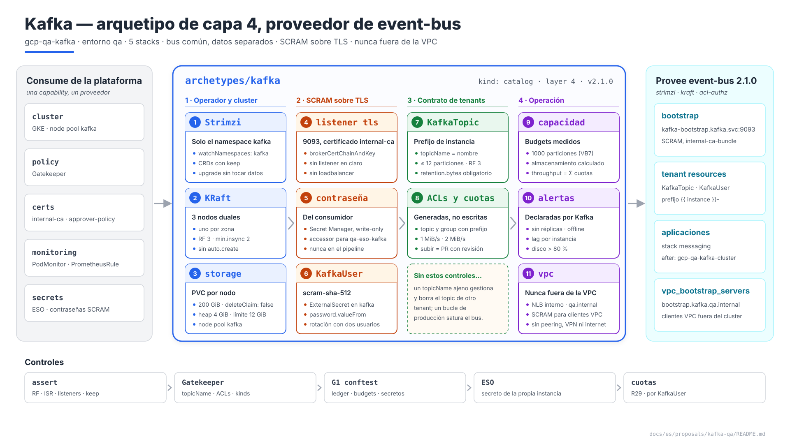
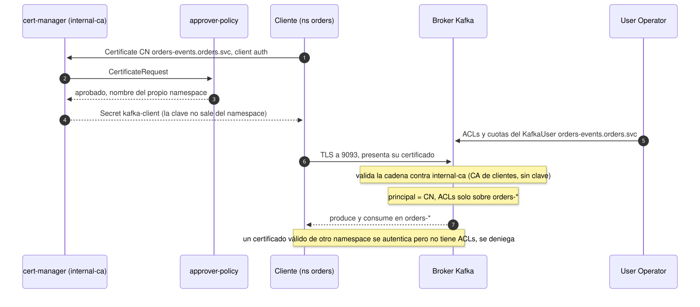

# Kafka en `qa` — arquetipo `kafka` (capa 4), proveedor de `event-bus`

| | |
|---|---|
| **Estado** | Propuesta · revisión 3 |
| **Alcance** | El arquetipo de capa 4 `kafka` en `qa`: operador, topología KRaft, almacenamiento y zonas, autenticación SCRAM sobre TLS con la CA interna, el contrato multi-tenant (topics, usuarios, ACLs y cuotas), capacidad, red, acceso desde fuera del cluster, observabilidad, stacks, políticas, ejecución y plan |
| **Por qué ahora** | AM §10 define Kafka como el bus común con datos separados, pero solo como ejemplo en `demos`. `qa` no lo tiene enlazado. Con la CA interna (cert-manager DT10) y el patrón B de exposición L4 (Envoy Gateway §4.4) ya decididos, se puede fijar cómo se autentica un cliente y hasta dónde llega el bus: nunca fuera de la VPC |
| **Especificación de referencia** | `archetype-model.md` (AM §n), `terramate-outputs-sharing-architecture.md` (§n), `risk-register.md` |
| **Diagramas** | `diagrams/*.mmd` (fuente Mermaid) y `diagrams/*.svg` (renderizados). El SVG se regenera desde el `.mmd`; no se edita a mano. `diagrams/06-bloques-presentacion.svg` (1920×1080, para presentaciones) se genera con `06-bloques-presentacion.py`, no con Mermaid |
| **Identificadores propios** | Decisiones `DB1…`, riesgos candidatos `RB1…`, verificaciones `VB1…`, preguntas `Q-B1…`. Los riesgos reciben número `R54+` en `risk-register.md` si se adopta, detrás de los de las propuestas anteriores |

Nada de este documento reabre decisiones de `CLAUDE.md`: Kafka es un arquetipo, no un componente; bus común y datos separados; prefijo obligatorio, ACLs derivadas y cuotas de `KafkaUser` (AM §10.2, R29, R30).



Fuente: [`diagrams/06-bloques-presentacion.py`](diagrams/06-bloques-presentacion.py) — vista de presentación; el detalle está en §2–§10.

---

## 0. Contexto

| Pregunta | Respuesta | Consecuencia |
|---|---|---|
| Qué es | Arquetipo `kafka`, `kind: catalog`, **capa 4**, provee **`event-bus` 2.1.0** | El binding de `qa` gana `event-bus: { archetype: kafka, version: 2.1.0, stack_id: gcp-qa-kafka }` (§12) |
| Entorno | `qa` (dedicado). El contrato es el mismo que en `demos`; §11 recoge lo que cambia allí | En `qa` también conviven varias aplicaciones: el contrato multi-tenant aplica igual |
| Stacks | 5: `iam`, `operator`, `cluster`, `policy` y `vpc-access` (vacío sin clientes de la VPC) en `stacks/archetypes/kafka/` | El operador y el cluster tienen ciclos de vida distintos (§8.2) |
| Componentes | Strimzi (Cluster Operator, Entity Operator con Topic y User Operator), Kafka en modo KRaft, Kafka Exporter, Cruise Control | Todo Apache-2.0 |
| Clientes | Todos por **SCRAM-SHA-512 sobre TLS**, con el TLS de la CA interna: aplicaciones del cluster y clientes de la VPC de `qa` fuera del cluster (por un balanceador **interno**). **Nunca fuera de la VPC** | §3, §6 |
| Qué **no** hace | Schema registry, Kafka Connect, MirrorMaker, Kafka Bridge como servicio de tenants | §7.1 |



Fuente: [`diagrams/01-contexto.mmd`](diagrams/01-contexto.mmd)

---

## 1. El operador

| Opción | Veredicto |
|---|---|
| **Strimzi** | **Sí**. Es el operador que ya fijan AM §10 y los traits `strimzi` y `kraft`. CNCF, Apache-2.0, y `KafkaTopic` y `KafkaUser` son justo los tenant resources del contrato |
| Kafka gestionado (Confluent Cloud, Managed Service for Apache Kafka de Google) | No en este arquetipo. Sería otro proveedor de `event-bus`, con otro contrato: las ACLs y cuotas no serían CRDs en el cluster |

| Ajuste | Valor | Motivo |
|---|---|---|
| Ámbito del operador | `watchNamespaces: [kafka]` | Solo ve su namespace. Un `Kafka` creado en otro namespace no existe para él |
| CRDs | `helm.sh/resource-policy: keep` | Borrar el CRD `KafkaTopic` borra todos los `KafkaTopic`, y el Topic Operator borra los topics en Kafka (RB2) |
| Versión | La última de Strimzi que soporte la versión de Kafka elegida y de Kubernetes de `qa` **(verificar, VB10)** | Strimzi publica cada versión con un rango de Kafka soportado |

---

## 2. El cluster



Fuente: [`diagrams/05-topologia.mmd`](diagrams/05-topologia.mmd)

### 2.1 Topología

| Ajuste | `qa` | Motivo |
|---|---|---|
| Modo | **KRaft**, sin ZooKeeper | Trait `kraft`; ZooKeeper ya no existe en Kafka 4 |
| `KafkaNodePool` | Uno, `dual`, **3 nodos con los roles `controller` y `broker`** | En `qa` basta: quórum de 3 y 3 réplicas. En `prod` y `demos`, pools separados de controladores y brokers (§11) |
| Zonas | Un nodo por zona de `europe-west1`; `rack.topologyKey: topology.kubernetes.io/zone` | Kafka reparte las réplicas de cada partición en zonas distintas: perder una zona no pierde datos |
| Node pool de GKE | **`kafka`**: 3 × `n2-standard-4` (4 vCPU, 16 GB), uno por zona, taint `dedicated=kafka:NoSchedule` | Kafka vive de la caché de páginas del sistema: compartir nodo con otras cargas la vacía. Requisito nuevo a E1 §4.1 (§12) |
| Recursos por nodo Kafka | Petición 2 CPU / 8 GiB; límite de memoria 12 GiB; heap `-Xms4g -Xmx4g` | Heap fijo y pequeño; el resto de la memoria es caché de páginas. Nunca `-Xmx` igual al límite (DG §8.3) |

### 2.2 Almacenamiento

| Ajuste | Valor | Motivo |
|---|---|---|
| Tipo | `jbod` con un volumen `persistent-claim` por nodo, 200 GiB | Punto de partida; lo fija `kafka_storage_gib` (§5) |
| StorageClass | La de E1 §4.1, `WaitForFirstConsumer`, `allowVolumeExpansion: true` | El disco se crea en la zona del pod |
| `deleteClaim` | `false` | Borrar el `Kafka` no borra los datos |
| Tiered storage | No | Trait `tiered-storage` no ofrecido |

### 2.3 Valores por defecto del broker

| Parámetro | Valor | Motivo |
|---|---|---|
| `default.replication.factor` | 3 | Una réplica por zona |
| `min.insync.replicas` | 2 | Con `acks=all`, una zona caída no para la escritura |
| `auto.create.topics.enable` | `false` | Todo topic es un `KafkaTopic` con prefijo; si no, un cliente crea `events` y se salta el contrato (R30) |
| `unclean.leader.election.enable` | `false` | Perder mensajes nunca es la salida por defecto |
| `offsets.topic.replication.factor`, `transaction.state.log.replication.factor` | 3 | Idem para los topics internos |
| `transaction.state.log.min.isr` | 2 | |

---

## 3. Autenticación: SCRAM sobre TLS



Fuente: [`diagrams/03-autenticacion.mmd`](diagrams/03-autenticacion.mmd)

**Todos los clientes usan SCRAM-SHA-512 (DB3)**, del cluster y de la VPC. El TLS del listener sigue siendo de la CA interna, así que el cliente valida al broker con `internal-ca-bundle`, que ya está en todos los namespaces (E2 §5.1).

| Tramo | Mecanismo | Motivo |
|---|---|---|
| Cliente → broker | TLS con certificado de `internal-ca` en los listeners `tls` y `vpc` (`brokerCertChainAndKey`), y SCRAM-SHA-512 dentro | Cifrado y autenticación del servidor con la CA única de la plataforma (cert-manager DT10); autenticación del cliente por contraseña |
| Broker ↔ broker y controlador | CA de cluster de **Strimzi** | Tráfico que no sale del namespace `kafka`; Strimzi la gestiona y la renueva |

**Por qué SCRAM y no mTLS.** El mTLS con `tls-external` obligaba a que Strimzi aceptara `internal-ca` como CA de clientes sin su clave privada, algo sin verificar. Además, los clientes de la VPC fuera del cluster necesitaban SCRAM de todos modos. Con un solo mecanismo, un usuario vale para cualquier listener, no hay dos formas de nombrar usuarios y Strimzi conserva su propia CA de clientes, que queda sin uso. La clave de `internal-ca` no sale de cert-manager.

### 3.1 La contraseña es del consumidor

El mismo patrón que los clientes OIDC de Keycloak (§6.5 de su propuesta): la crea y la posee el consumidor, y el valor nunca pasa por el pipeline ni por outputs sharing (R8).

| Paso | Quién |
|---|---|
| Secreto `qa-<instancia>-kafka-<propósito>` en Secret Manager, valor generado y **write-only** (`secret_data_wo`) | Stack `secrets` del consumidor |
| `secretAccessor` sobre **ese** secreto para el KSA `eso-kafka` del namespace `kafka` y para la identidad del cliente (su KSA, o su cuenta de servicio si está fuera del cluster) | Stack `secrets` del consumidor |
| `ExternalSecret` `<instancia>-<propósito>` en el namespace `kafka` (`SecretStore` `gsm` del arquetipo), que materializa el `Secret` del mismo nombre | Stack `messaging` del consumidor, como tenant resource |
| `KafkaUser` `<instancia>-<propósito>` con `authentication.password.valueFrom.secretKeyRef` a ese `Secret` | Stack `messaging` del consumidor |
| La aplicación lee la contraseña: con su propio `ExternalSecret` si está en el cluster; con su identidad de GCP si está en la VPC | Consumidor |

**Una contraseña, un usuario.** Strimzi aplica la contraseña del `Secret` como credencial SCRAM del usuario. Ni el arquetipo `kafka` ni la plataforma conocen el valor.

### 3.2 Rotación sin corte

Kafka guarda una sola credencial SCRAM por usuario y mecanismo. Si se cambia la contraseña, el cliente que aún usa la vieja falla hasta que recarga (RB3). Por eso la rotación usa dos usuarios:

1. Se crea `<instancia>-<propósito>-b` con una contraseña nueva, las mismas ACLs y la misma cuota. Durante la rotación cuenta contra `maxCount`.
2. La aplicación pasa a usar `-b`.
3. Cuando ninguna conexión usa el usuario antiguo (métrica de conexiones por principal), se borra.

La siguiente rotación vuelve al nombre sin sufijo. Cada paso es una PR del consumidor.

---

## 4. El contrato multi-tenant



Fuente: [`diagrams/02-tenencia.mmd`](diagrams/02-tenencia.mmd)

El consumidor crea sus `KafkaTopic`, `KafkaUser` y el `ExternalSecret` de cada contraseña **en el namespace `kafka`**, desde su stack `messaging` (`creates_tenant_resources: [event-bus]`, AM §10.1). Lo que puede escribir está acotado.

### 4.1 Topics

| Campo | Regla | Motivo |
|---|---|---|
| `metadata.name` | `<instancia>-<nombre>` | R30 |
| `spec.topicName` | **Ausente** o igual a `metadata.name` | Si no, un `KafkaTopic` llamado `alpha-x` con `topicName: beta-orders` gestionaría el topic de otro tenant, y podría borrarlo (RB1) |
| `partitions` | ≤ 12 | Cuenta contra `kafka_partitions` (§5) |
| `replicas` | Exactamente 3 | Una por zona |
| `config` | Lista blanca: `retention.ms` ≤ 7 días, `retention.bytes` **obligatorio** y ≤ 5 GiB por partición, `cleanup.policy` (`delete` o `compact`), `max.message.bytes` ≤ 1 MiB, `compression.type` | Un topic sin `retention.bytes` puede llenar el disco del broker y parar el bus de todos (RB5) |
| Prohibido en `config` | `min.insync.replicas` distinto de 2, `unclean.leader.election.enable` | Durabilidad no negociable por tenant |

### 4.2 Usuarios, ACLs y cuotas

| Campo | Regla | Motivo |
|---|---|---|
| `metadata.name` | `<instancia>-<propósito>`; `<instancia>-<propósito>-b` durante una rotación | §3.2 |
| `authentication` | `scram-sha-512` con `password.valueFrom` al `Secret` que materializa el `ExternalSecret` de la instancia; nunca `tls` ni `tls-external` | §3 |
| `authorization.acls` | **Generadas** por el generador `gen_messaging`, nunca escritas por el tenant | AM §10.2 |
| `quotas` | Obligatorias | R29 |

ACLs generadas para la instancia `alpha`:

```yaml
authorization:
  type: simple
  acls:
    - resource: { type: topic, name: "alpha-", patternType: prefix }
      operations: [Read, Write, Describe]
    - resource: { type: group, name: "alpha-", patternType: prefix }
      operations: [Read]
    - resource: { type: transactionalId, name: "alpha-", patternType: prefix }   # solo si declara transacciones
      operations: [Write, Describe]
```

| Cuota por `KafkaUser` | Por defecto | Motivo |
|---|---|---|
| `producerByteRate` | 1 MiB/s | Un bucle de producción no satura el bus (R29) |
| `consumerByteRate` | 2 MiB/s | |
| `requestPercentage` | 25 | Tiempo de CPU del broker |
| `controllerMutationRate` | 1 | Crear o borrar particiones en ráfaga carga al controlador |

Subir una cuota es una PR con revisión de plataforma: suma contra `kafka_throughput_mibs` (§5), igual que subir `capacity` en un entorno compartido.

### 4.3 Lo que un tenant no puede crear

| Kind | Motivo |
|---|---|
| `Kafka`, `KafkaNodePool` | El cluster es del arquetipo |
| `KafkaConnect`, `KafkaConnector`, `KafkaMirrorMaker2` | Ejecutan código y credenciales de terceros dentro del namespace `kafka`. Si una aplicación necesita Connect, despliega su propio `KafkaConnect` como componente en su namespace, contra el bus y con su propio `KafkaUser` |
| `KafkaBridge` | Tampoco en el namespace del consumidor si se publica: un puente HTTP con `HTTPRoute` sacaría el bus de la VPC (DB8). Gatekeeper deniega una `HTTPRoute` hacia un Service de `KafkaBridge` |
| `KafkaRebalance` | Cruise Control es de la plataforma |

Todos se deniegan con Gatekeeper fuera de lo que despliega el propio arquetipo (§9.2). AM §13 ya muestra el error de resolución para `KafkaConnector`.

---

## 5. Capacidad

| Clave | `qa` | Cómo se cuenta |
|---|---|---|
| `kafka_topics` | 200 | Número de `KafkaTopic` |
| `kafka_partitions` | **1000** | Particiones líder. Con réplica 3 son 3000 réplicas en 3 brokers: 1000 por broker |
| `kafka_storage_gib` | 450 (3 × 200 GiB × 75 %) | Σ `partitions × replicas × retention.bytes`: lo calcula el resolver; por encima, la PR falla |
| `kafka_throughput_mibs` | 60 | Σ `producerByteRate` de todos los `KafkaUser` |

**El techo de particiones (pregunta abierta nº 3 de `CLAUDE.md`).** El 1000 de `qa` es un punto de partida prudente, no una medida. VB7 lo mide: 3 brokers, con particiones crecientes, midiendo el tiempo de conmutación del controlador, la latencia p99 de producción y el tiempo de arranque de un broker. El número que salga fija el budget de `qa` y sustituye al 4000 provisional de `demos`.

En `qa` los budgets no se aplican (modelo dedicado, E1 §0), pero se calculan y se publican: son la medida que falta para `demos`.

---

## 6. Red: un bus interno, nunca fuera de la VPC



Fuente: [`diagrams/04-red.mmd`](diagrams/04-red.mmd)

**Kafka es un bus interno (DB8).** Lo consumen las aplicaciones del cluster y, si hace falta, clientes de la **VPC de `qa`** fuera del cluster (máquinas virtuales, Cloud Run con salida directa a la VPC, Dataflow). **Nunca se expone fuera de la VPC**: sin listener externo, sin patrón B y sin excepción que lo abra. Tampoco se alcanza por el peering con el hub, una VPN o Interconnect.

### 6.1 Listeners

| Listener | Puerto | Tipo | Autenticación | Quién |
|---|---|---|---|---|
| `tls` | 9093 | `internal` | SCRAM-SHA-512 sobre TLS | Aplicaciones del cluster |
| `vpc` | 32100 (bootstrap), 32101–32103 (brokers) | `nodeport` detrás de un balanceador **interno** | SCRAM-SHA-512 sobre TLS | Clientes de la VPC de `qa` fuera del cluster. **Sin configurar** mientras no haya ninguno |
| Replicación y controlador | 9090, 9091 | Internos de Strimzi | mTLS con la CA de Strimzi | Solo entre pods de `kafka` |

Sin listener en claro (9092) ni de tipo `loadbalancer`, que crearía un balanceador fuera del estado de Terraform (patrón A, Envoy Gateway §4.4).

### 6.2 `NetworkPolicy`

| Origen | Destino | Puerto | Nota |
|---|---|---|---|
| Namespaces con `kafka.disasterproject.com/client: "true"` | Brokers | 9093 | `networkPolicyPeers` del listener; Strimzi genera la política. La etiqueta la pone `gen_tenant_namespace` si el manifiesto requiere `event-bus` (E2 §5.1) |
| Subredes de la VPC autorizadas (§6.3) | Brokers | 32100–32103 | `ipBlock`: con `externalTrafficPolicy: Local` llega la IP del cliente |
| Operador y Entity Operator | Brokers y controladores | 9091, 9093 | Generadas por Strimzi |
| Brokers ↔ brokers ↔ controladores | | 9090, 9091 | Generadas por Strimzi |
| Prometheus | Brokers, Kafka Exporter, Cruise Control | 9404 y métricas | |
| Cruise Control | Brokers | 9091 | |
| Todos | Internet | **Denegado** | |

### 6.3 Clientes de la VPC fuera del cluster



Fuente: [`diagrams/07-acceso-vpc.mmd`](diagrams/07-acceso-vpc.mmd)

| Pieza | Valor | Motivo |
|---|---|---|
| Balanceador | Balanceador de red passthrough **interno** regional (la variante interna del patrón B, Envoy Gateway §4.4), en el stack `vpc-access` del propio arquetipo, sobre los grupos de instancias del node pool `kafka` | Un balanceador interno solo tiene una IP privada de la VPC |
| IP | Reservada en la subred de nodos (zona `infra`, propósito `endpoints`) | Estable ante cambios del Service |
| Puertos | Los `nodePort` fijos, sin traducción: 32100 para el bootstrap y 32101–32103 para cada broker | Un passthrough entrega el paquete con su puerto de destino original: el puerto anunciado **es** el `nodePort` |
| `externalTrafficPolicy` | `Local` | Sin salto extra entre nodos y con la IP de origen intacta. El health check TCP sobre el `nodePort` solo da por sano el nodo que tiene el broker |
| Acceso global | `allow_global_access = false` | Solo desde la región de `qa` |
| Firewall | Origen: solo las zonas o propósitos de la VPC de `qa` que alojan clientes (por ejemplo `zone:infra`, `purpose:serverless-egress`), nunca `cidr:` fuera del pool del entorno | Un balanceador interno es alcanzable por peering, VPN e Interconnect: el firewall es lo que lo deja dentro de la VPC. Un assert lo comprueba (§9.1) |
| Nombres | Zona privada de Cloud DNS `qa.internal`, enlazada solo a la VPC de `qa`: `bootstrap.kafka.qa.internal` y `broker-<n>.kafka.qa.internal` → IP del balanceador | El cliente valida el certificado por nombre. `.internal` está reservado para uso privado y no existe en internet |
| Certificado del listener `vpc` | `internal-ca`, con esos nombres | Son nombres privados, así que es coherente con cert-manager DT10. Requiere que approver-policy admita `*.<namespace>.qa.internal` al namespace que los pide (§12) |
| `advertisedHost` / `advertisedPort` | `broker-<n>.kafka.qa.internal` / `3210<n+1>` | Si se anunciara la IP del nodo, el cliente no pasaría por el balanceador |
| Autenticación | SCRAM-SHA-512, la misma que dentro (§3) | Un usuario vale en `tls` y en `vpc`; a qué listener llega lo decide la red |
| Contraseña | La del consumidor (§3.1); un cliente de la VPC la lee de Secret Manager con su cuenta de servicio | El valor nunca pasa por el pipeline |
| `KafkaUser` | `<instancia>-<propósito>`, como cualquier otro | Sin tipo de usuario propio para la VPC |

La pregunta Q-B1 de la revisión 1 (certificado público de un listener externo) ya no aplica a Kafka: pasa a Envoy Gateway §4.4, donde afecta a las excepciones de patrón B con TLS.

---

## 7. El contrato `event-bus` 2.1.0

### 7.1 Salidas y traits

| Salida | Valor en `qa` | Uso |
|---|---|---|
| `bootstrap_servers` | `qa-kafka-kafka-bootstrap.kafka.svc:9093` | Configuración del cliente |
| `namespace` | `kafka` | Tenant resources |
| `cluster_name` | `qa-kafka` | Etiqueta `strimzi.io/cluster` de `KafkaTopic` y `KafkaUser` |
| `client_auth` | `scram-sha-512` | Forma del `KafkaUser` y configuración SASL del cliente (§3) |
| `ca_bundle_configmap` | `internal-ca-bundle` | Truststore del cliente: ya está en su namespace |
| `client_namespace_label` | `kafka.disasterproject.com/client: "true"` | Para la `NetworkPolicy` del listener |
| `cluster_ca_secret` | Obsoleta; se elimina en 3.0.0 | Los clientes ya no confían en la CA de Strimzi |
| `vpc_bootstrap_servers` | `bootstrap.kafka.qa.internal:32100`, vacío mientras no haya clientes de la VPC | Clientes de la VPC fuera del cluster (§6.3) |

Las cinco últimas son nuevas o cambian de uso sin romper a quien consume `^2.0.0`: MINOR, **2.1.0**.

| Trait | ¿Lo ofrece? | Motivo |
|---|---|---|
| `strimzi`, `kraft`, `acl-authz` | Sí | — |
| `tls-mtls` | **No** | Los clientes se autentican por SCRAM (§3) |
| `schema-registry` | **No** | No hay registry en esta versión. AM §10.1 lo lista en su ejemplo; un consumidor que lo exija falla en resolución, que es lo correcto (Q-B2) |
| `tiered-storage` | No | §2.2 |

### 7.2 Lo que escribe un consumidor

En su stack `secrets`, el secreto `qa-orders-kafka-events` (write-only) y sus dos `secretAccessor` (§3.1). En su stack `messaging` (el generador rellena ACLs, cuotas y etiquetas):

```yaml
apiVersion: kafka.strimzi.io/v1beta2
kind: KafkaTopic
metadata:
  name: orders-events                       # <instancia>-<nombre>
  namespace: kafka
  labels: { strimzi.io/cluster: qa-kafka }
spec:
  partitions: 6
  replicas: 3
  config: { retention.ms: 604800000, retention.bytes: 1073741824, cleanup.policy: delete }
---
apiVersion: external-secrets.io/v1
kind: ExternalSecret
metadata: { name: orders-events, namespace: kafka }   # tenant resource, prefijo de instancia
spec:
  secretStoreRef: { kind: SecretStore, name: gsm }
  target: { name: orders-events }
  data:
    - secretKey: password
      remoteRef: { key: qa-orders-kafka-events }
---
apiVersion: kafka.strimzi.io/v1beta2
kind: KafkaUser
metadata:
  name: orders-events                       # <instancia>-<propósito>
  namespace: kafka
  labels: { strimzi.io/cluster: qa-kafka }
spec:
  authentication:
    type: scram-sha-512
    password:
      valueFrom: { secretKeyRef: { name: orders-events, key: password } }
  # authorization y quotas: las genera gen_messaging (§4.2)
```

La aplicación, con `security.protocol=SASL_SSL`, `sasl.mechanism=SCRAM-SHA-512`, `ssl.truststore.type=PEM` sobre `internal-ca-bundle` y la contraseña de su propio `ExternalSecret`, en su namespace, al mismo secreto de Secret Manager.

---

## 8. El arquetipo

### 8.1 Manifiesto

```yaml
# archetypes/kafka/manifest.yaml
apiVersion: archetype/v1
kind: Archetype

metadata:
  name: kafka
  version: 2.1.0
  layer: 4
  kind: catalog
  description: Bus Kafka común con datos separados; Strimzi, KRaft, SCRAM sobre TLS con la CA interna
  owners: [team-platform]

runtimes: [gke, eks, aks]

requires:
  - capability: cluster
    version: "^2.0.0"
  - capability: policy
    version: "^1.0.0"
    traits: [gatekeeper]
  - capability: certs
    version: "^1.1.0"
    traits: [cert-manager]
  - capability: monitoring
    version: "^1.5.0"
    traits: [prometheus-operator-crds]
  - capability: secrets
    version: "^2.0.0"
    traits: [eso]                                      # contraseñas SCRAM de los consumidores (§3.1)

provides:
  - capability: event-bus
    version: 2.1.0
    traits: [strimzi, kraft, acl-authz]
    outputs:
      - { name: bootstrap_servers,      from: cluster }
      - { name: namespace,              from: iam }
      - { name: cluster_name,           from: cluster }
      - { name: client_auth,            from: cluster }
      - { name: ca_bundle_configmap,    from: cluster }
      - { name: client_namespace_label, from: cluster }
      - { name: cluster_ca_secret,      from: cluster }    # obsoleta; se elimina en 3.0.0
      - { name: vpc_bootstrap_servers,  from: vpc-access }
    tenant_resources:
      - kind: KafkaTopic
        namePrefix: "{{ instance }}-"
        maxCount: 20
      - kind: KafkaUser
        namePrefix: "{{ instance }}-"
        maxCount: 3
      - kind: ExternalSecret
        namePrefix: "{{ instance }}-"
        maxCount: 3

stacks:
  - name: iam
  - name: operator
    after: [iam]
  - name: cluster
    after: [operator]
  - name: policy
    after: [cluster]
  - name: vpc-access                                   # vacío mientras no haya clientes de la VPC
    after: [cluster]

capacity:
  cpu_millicores: 7200
  memory_mib: 27648
  pods: 8
  workload_identities: 1                             # eso-kafka
```

`runtimes: [gke, eks, aks]`: nada es de GCP salvo la StorageClass (AM §14.2: `event-bus` es Strimzi en las tres nubes). **Sin `ingress`**: Kafka no habla HTTP. **Requiere `secrets`** con el trait `eso`: el `SecretStore` `gsm` del namespace `kafka` materializa las contraseñas de los consumidores (§3.1). El KSA `eso-kafka` es la única identidad de GCP del arquetipo, y solo lee los secretos que cada consumidor le concede.

**Sin claim de subred.** El ejemplo de AM §10.1 reclama una `/26` en la zona `data` con propósito `kafka-storage-subnet`. Kafka en Kubernetes guarda sus datos en volúmenes persistentes, no en una subred, y sus pods usan el rango de pods del cluster. Ya está quitado de AM (§12).

### 8.2 Los stacks

| Stack | Contenido | Entradas por sharing |
|---|---|---|
| `iam` | Namespace `kafka` (`gen_tenant_namespace`, PSS `restricted`); KSA `eso-kafka` y `SecretStore` `gsm` | `cluster_*`, `workload_identity_pool` |
| `operator` | `helm_release` de Strimzi con `watchNamespaces: [kafka]` y CRDs con `keep` | `cluster_*` |
| `cluster` | `Kafka`, `KafkaNodePool`, `Certificate` del listener (`internal-ca`), Kafka Exporter, Cruise Control, `PodMonitor` y `PrometheusRule`; `prevent_destroy` sobre el `helm_release` | `cluster_*` |
| `policy` | `ConstraintTemplate` y `Constraint` de los kinds de Strimzi (§9.2); los valores por defecto de cuotas y topics que usa `gen_messaging` | `cluster_*` |
| `vpc-access` | Si hay clientes de la VPC: IP interna, balanceador passthrough interno, health check, reglas de firewall y registros en la zona privada `qa.internal`. Sin clientes, no crea nada | `cluster_*` |

**Por qué `operator` y `cluster` separados.** Un upgrade de Strimzi no debe planificar cambios sobre el cluster de Kafka, que tiene datos. Destruir el cluster exige un PR explícito que quite `prevent_destroy` (el mismo razonamiento que cert-manager §8.2 y Envoy Gateway §8.2).

### 8.3 El lado del consumidor

| Pieza | Dónde |
|---|---|
| `requires: event-bus ^2.1.0` con `traits: [acl-authz]` | Manifiesto del consumidor |
| Stack `messaging` con `creates_tenant_resources: [event-bus]` y `after` a `gcp-qa-kafka-cluster` | Generado por `gen_messaging` |
| Secreto en Secret Manager y sus `secretAccessor`; `ExternalSecret` propio para la aplicación | Stack `secrets` del consumidor |
| Etiqueta `kafka.disasterproject.com/client` | `gen_tenant_namespace` (§12) |

---

## 9. Políticas

### 9.1 `assert` en generación

```hcl
assert {
  assertion = global.kafka_values.config["min.insync.replicas"] == 2 && global.kafka_values.config["default.replication.factor"] == 3
  message   = "event-bus: réplica 3 e ISR mínimo 2 — una zona caída no para la escritura"
}
assert {
  assertion = !global.kafka_values.config["auto.create.topics.enable"]
  message   = "event-bus: sin creación automática de topics — todo topic es un KafkaTopic con prefijo (R30)"
}
assert {
  assertion = alltrue([for l in global.kafka_values.listeners : l.tls && tm_contains(["internal", "nodeport"], l.type)])
  message   = "event-bus: solo listeners internal o nodeport, siempre con TLS; nada en claro ni loadbalancer"
}
assert {
  assertion = !global.kafka_vpc.allow_global_access && alltrue([for s in global.kafka_vpc.firewall_sources : tm_startswith(s, "zone:") || tm_startswith(s, "purpose:")])
  message   = "event-bus: el bus nunca sale de la VPC — sin acceso global y solo orígenes del pool del entorno (DB8)"
}
assert {
  assertion = global.kafka_values.crds.keep && global.kafka_values.watchNamespaces == ["kafka"]
  message   = "event-bus: CRDs con keep y operador limitado a su namespace (RB2)"
}
```

### 9.2 Gatekeeper y conftest

| Regla | Dónde | Qué comprueba |
|---|---|---|
| **Nueva:** forma del `KafkaTopic` | Gatekeeper | §4.1: prefijo = etiqueta de instancia; `spec.topicName` ausente o igual al nombre; límites de particiones, réplicas y `config` |
| **Nueva:** forma del `KafkaUser` | Gatekeeper | §4.2: nombre con prefijo; `scram-sha-512` con `password.valueFrom` a un `Secret` del mismo nombre; nunca `tls` ni `tls-external`; ACLs iguales a las derivadas del prefijo; cuotas presentes |
| **Nueva:** kinds reservados | Gatekeeper | §4.3 |
| **Nueva:** tenant resources | G1 | El stack `messaging` declara `creates_tenant_resources: [event-bus]`; prefijo de su instancia; `maxCount` |
| **Nueva:** capacidad | G1 | Particiones, almacenamiento y cuotas sumadas contra los budgets (§5) |
| **Nueva:** secreto y usuario | G1 y Gatekeeper | El `ExternalSecret` en `kafka` lleva prefijo, usa `SecretStore` `gsm` y su `remoteRef` es un secreto `qa-<misma instancia>-kafka-*`; el consumidor concede `secretAccessor` a `eso-kafka` solo sobre ese secreto |
| **Nueva:** `after` | G1 (existente, R2) | `messaging` tiene `after` a `gcp-qa-kafka-cluster` |

Todos los stacks de `qa` se aplican con la misma identidad de pipeline, así que el control de fondo sobre qué instancia escribe qué es G1 contra el ledger; Gatekeeper comprueba la forma (el mismo reparto que Keycloak §6.4).

---

## 10. Observabilidad

Kafka es capa 4 y requiere `monitoring`: declara sus propias reglas, a diferencia de las capacidades de capa 3.

| Alerta | Señal | Umbral |
|---|---|---|
| Particiones sin réplicas suficientes | `kafka_server_replicamanager_underreplicatedpartitions` | > 0 durante 5 min |
| Particiones fuera de línea | `kafka_controller_kafkacontroller_offlinepartitionscount` | > 0 |
| Controlador activo | Suma de `activecontrollercount` | ≠ 1 durante 1 min |
| Disco | `kubelet_volume_stats_used_bytes` del PVC | > 80 % |
| Retraso de consumo | `kafka_consumergroup_lag` de Kafka Exporter, **por instancia** | Umbral declarado por el consumidor; la alerta va al equipo de la instancia (monitorización §5.2) |
| Cuotas | Tiempo de throttling por usuario | Sostenido > 0: el tenant está en su límite |
| Certificados | cert-manager §6 | Listeners < 14 días |
| Budget | Particiones usadas / `kafka_partitions` | > 80 % |

Nombres de métricas según la configuración del exportador JMX de Strimzi **(verificar, VB10)**.

---

## 11. `demos` y `prod`

| Tema | `qa` | `demos` | `prod` |
|---|---|---|---|
| Nodos | 3 duales | 3 controladores + 3 brokers | 3 controladores + ≥ 3 brokers |
| Budgets | Calculados, no aplicados | **Aplicados** en la PR (AM §8) | Aplicados |
| Cuotas | Por defecto de §4.2 | Más bajas: muchos tenants pequeños | Por aplicación |
| GKE | Standard con node pool `kafka` | Autopilot: sin node pool dedicado; clase de cómputo con disco y memoria suficientes **(verificar Strimzi en Autopilot, VB11)** | Standard |
| Techo de particiones | Mide VB7 | El número de VB7 sustituye al 4000 provisional | Idem |
| Acceso | Cluster y VPC, nunca fuera | Igual | Igual |

---

## 12. Cambios a otros documentos

| Documento | Cambio | Estado |
|---|---|---|
| Binding de `qa` (E1 §7) | `event-bus: { archetype: kafka, version: 2.1.0, stack_id: gcp-qa-kafka }`; budgets de §5 | **Aplicado** |
| E1 §4.1 y §4.12 | Node pool `kafka`: 3 × `n2-standard-4`, uno por zona, taint `dedicated=kafka:NoSchedule` | **Aplicado** |
| `gen_tenant_namespace` (E2 §5.1) | Etiqueta `kafka.disasterproject.com/client: "true"` si el manifiesto requiere `event-bus` | **Aplicado** |
| AM §10.1 y `registry/zones.yaml` | Sin el claim `kafka-storage-subnet` (y sin ese propósito en la zona `data`); sin `schema-registry` ni `tls-mtls` en los traits del ejemplo; párrafo sobre la autenticación SCRAM y el contrato 2.1.0 | **Aplicado** |
| cert-manager §3 | Política `private-names`: approver-policy admite `*.<namespace>.qa.internal` al namespace que los pide; nombres de la zona privada, nunca públicos (DT10) | **Aplicado** |
| Envoy Gateway §4.4 | Kafka sale de los casos admisibles: nunca fuera de la VPC. Q-B1 pasa allí como pregunta de las excepciones con TLS | **Aplicado** |
| E1 §4.15 (red) | Zona privada de Cloud DNS `qa.internal`, enlazada solo a la VPC de `qa`, propiedad del stack de red | **Aplicado** |

---

## 13. Decisiones

| # | Decisión | Estado | Recomendación | Alternativa |
|---|---|---|---|---|
| DB1 | Operador | Consecuencia de AM §10 | Strimzi, limitado al namespace `kafka` | Kafka gestionado (otro proveedor) |
| DB2 | Topología en `qa` | Propuesta | KRaft, 3 nodos duales, uno por zona, node pool `kafka` | Controladores y brokers separados (en `demos` y `prod`) |
| DB3 | Autenticación | **Decidida** | SCRAM-SHA-512 sobre TLS para todos los clientes; contraseña del consumidor en Secret Manager (§3.1) | mTLS `tls-external` con `internal-ca` (descartado: dependía de una CA de clientes sin clave) |
| DB4 | CAs | Propuesta | `internal-ca` para el TLS de los listeners; CA de Strimzi solo entre brokers y controladores | CA de Strimzi repartida a los clientes |
| DB5 | Nombre del usuario | Propuesta | `<instancia>-<propósito>`, con `-b` durante una rotación | Nombre libre con prefijo |
| DB6 | ACLs y cuotas | Consecuencia de AM §10.2 | Generadas; Gatekeeper exige que coincidan | Escritas por el tenant |
| DB7 | Límites de topic | Propuesta | ≤ 12 particiones, réplica 3, `retention.bytes` obligatorio, ≤ 7 días | Sin límites por topic |
| DB8 | Alcance del bus | **Decidida** | Bus interno: listener `tls` en el cluster y `vpc` por un balanceador interno para clientes de la VPC; **nunca fuera de la VPC**, ni por peering, VPN o Interconnect | Listener externo por patrón B |
| DB9 | Budget inicial de particiones en `qa` | Propuesta | 1000, hasta que VB7 mida | 4000 como en `demos` |
| DB10 | Servicios extra | Propuesta | Kafka Exporter y Cruise Control de plataforma; sin registry, Connect ni Bridge compartidos | Ofrecerlos como servicio |
| DB11 | Rotación de contraseñas | Propuesta | Dos usuarios alternos (§3.2) | Cambio en sitio, con corte para quien no recarga |

---

## 14. Riesgos candidatos

| # | Riesgo | Probabilidad | Impacto | Mitigación |
|---|---|---|---|---|
| RB1 | **`spec.topicName` apunta al topic de otro tenant** y lo gestiona o lo borra | Media sin regla | Alta — pérdida de datos de otro tenant | Gatekeeper (§9.2); VB4 |
| RB2 | **Borrado de los CRDs de Strimzi** borra todos los topics | Baja | Alta — el bus entero | CRDs con `keep`, assert, VB9 |
| RB3 | **Rotación de la contraseña** que corta a los clientes que no recargan | Media | Media | Rotación con dos usuarios (§3.2); VB1 |
| RB4 | **Tenant ruidoso** | Media | Alta en `demos` | Cuotas obligatorias (R29) |
| RB5 | **Disco lleno** por un topic sin límite | Media sin `retention.bytes` | Alta — el broker se para y con él todos | `retention.bytes` obligatorio, budget de almacenamiento, alerta al 80 % |
| RB6 | **Renovación del certificado del listener** reinicia los brokers | Media | Baja con RF 3 e ISR 2 | Rolling de Strimzi; VB3 |
| RB7 | **Zona caída** | Baja | Media | Réplica 3 por zona, ISR 2; VB6 |
| RB8 | **Techo de particiones** alcanzado antes de lo previsto | Media | Media — no se pueden crear topics | Budget de 1000 hasta medir (VB7) |
| RB9 | **El bus alcanzable fuera de la VPC** por peering, VPN o Interconnect | Media si el firewall usa rangos amplios | Alta — datos del bus fuera del perímetro | Balanceador interno sin acceso global; firewall solo con orígenes del pool (assert §9.1); VB8 |

---

## 15. Verificaciones

| # | Verificación | Resultado que la cierra |
|---|---|---|
| VB1 | SCRAM con `password.valueFrom` desde el `Secret` de ESO | Un cliente se autentica con la contraseña del consumidor; un cambio en Secret Manager llega al usuario por ESO y Strimzi |
| VB2 | Principal de un usuario SCRAM | Las ACLs de §4.2 se aplican a `User:<nombre>` |
| VB3 | Listener con `brokerCertChainAndKey` desde el `Secret` de cert-manager | Renovación forzada: rolling de brokers sin errores de cliente con `acks=all` |
| VB4 | `KafkaTopic` con `topicName` ajeno; `KafkaUser` con ACLs no derivadas | Ambos denegados en admisión |
| VB5 | Cuotas | Un productor a 10 veces su cuota queda limitado; la latencia p99 de los demás no cambia |
| VB6 | Zona caída (cordon y drenado de una zona) | Cero particiones fuera de línea; los productores con `acks=all` siguen |
| VB7 | Techo de particiones con 3 brokers | Número publicado con tiempo de conmutación del controlador, latencia p99 y arranque de broker; fija el budget |
| VB8 | Listener `vpc` con balanceador interno | Una VM de la VPC llega a cada broker por nombre y con su IP de origen; desde una red con peering o por VPN, la conexión se rechaza |
| VB9 | Desinstalar el operador en un entorno efímero | Topics, usuarios y datos siguen existiendo |
| VB10 | Versión de Strimzi y Kafka; nombres de métricas | Alertas de §10 con series reales |
| VB11 | Strimzi en GKE Autopilot (`demos`) | Brokers con su PVC zonal y reparto por zona |
| VB12 | PSS `restricted` con los pods de Strimzi | Admitidos sin exención |

---

## 16. Preguntas abiertas

| # | Pregunta | Recomendación |
|---|---|---|
| Q-B1 | Certificado de un listener expuesto hacia internet | **No aplica**: Kafka nunca sale de la VPC. Trasladada a Envoy Gateway §4.4 |
| Q-B2 | ¿Hace falta schema registry? | No hasta que una aplicación lo pida; entonces Apicurio Registry como arquetipo aparte, con su propio contrato |

---

## 17. Plan de implementación

| Fase | Contenido | Criterio de salida | Estimación |
|---|---|---|---|
| **0 · Prerrequisitos** | Node pool `kafka`; binding de `qa`; VB10, VB12 | Versiones fijadas | 1 día |
| **1 · Esqueleto** | Manifiesto, charts, asserts, reglas G1 y constraints, `gen_messaging` | `archetypectl resolve --dry-run`, `terramate generate --check`, G1 y preview con mocks en verde | 2 días |
| **2 · Operador y cluster** | `iam`, `operator`, `cluster`, `policy` | Cluster `Ready`; **VB1**, **VB2**, **VB3**, **VB4**, **VB9** | 2 días |
| **3 · Pruebas de carga** | Aplicación de prueba con dos instancias | **VB5**, **VB6**, **VB7** | 2 días |
| **4 · Acceso desde la VPC** | Solo cuando un cliente de fuera del cluster lo necesite: zona `qa.internal`, política de approver-policy, `vpc-access` | **VB8** | 1 día, con el primer cliente |

Siete días para una persona.
