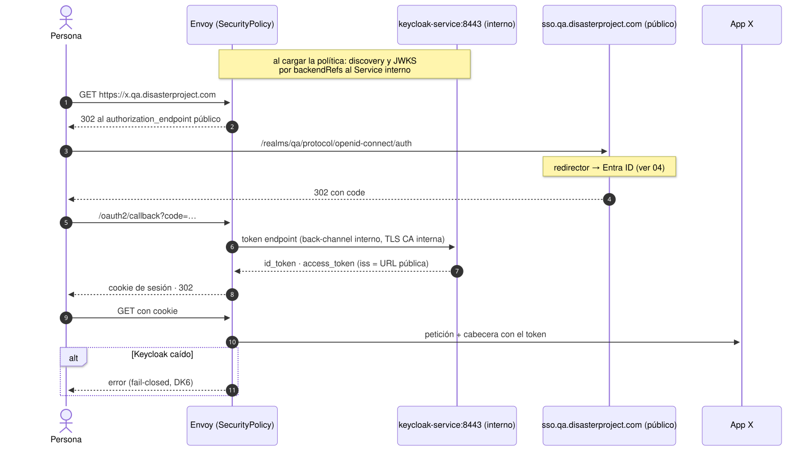

# Keycloak en `qa` — arquetipo `keycloak` (capa 4), proveedor de `oidc-idp`

| | |
|---|---|
| **Estado** | Propuesta · revisión 2 |
| **Alcance** | El arquetipo de capa 4 `keycloak` en `qa`: instalación, datos, configuración, realm `qa` con Entra ID como IdP de origen, clientes de los consumidores como tenant resources, claves, publicación, red, disponibilidad, observabilidad, stacks, políticas, ejecución y plan |
| **Supuesto de datos** | La variante Cloud SQL ([`../sonarqube-qa-cloudsql/`](../sonarqube-qa-cloudsql/README.md), DC1): `database-platform` sin enlazar en `qa`, así que Keycloak trae su propia instancia (DC8 de esa variante). Si DC1 se rechaza, el mismo manifiesto toma el camino `data-tenant` con un `Cluster` CNPG (AM §5.5) y solo cambia §3 |
| **Consumidores conocidos** | SonarQube por SAML ([`../sonarqube-qa/`](../sonarqube-qa/README.md), E1/E2), Grafana por OIDC, aplicaciones futuras con `SecurityPolicy` OIDC en el Gateway |
| **Especificación de referencia** | `archetype-model.md` (AM §n), `terramate-outputs-sharing-architecture.md` (§n), `developer-guide.md` (DG §n), `risk-register.md` |
| **Diagramas** | `diagrams/*.mmd` (fuente Mermaid) y `diagrams/*.svg` (renderizados). El SVG se regenera desde el `.mmd`; no se edita a mano |
| **Identificadores propios** | Decisiones `DK1…`, riesgos candidatos `RK1…`, verificaciones `VK1…`. Los riesgos reciben número `R54+` en `risk-register.md` si se adopta; los de la variante Cloud SQL (`RC*`) van delante |

Nada de este documento reabre decisiones de `CLAUDE.md`. Implementa dos de sus trampas como invariantes comprobados: el ciclo de arranque Keycloak ↔ Gateway (R22) y la `SecurityPolicy` que rompe clientes máquina (R44).

---

## 0. Contexto

| Pregunta | Respuesta | Consecuencia |
|---|---|---|
| Qué es | Arquetipo `keycloak`, `kind: catalog`, **capa 4**, provee **`oidc-idp` 4.2.0** con el trait `saml-idp` | Un proveedor por entorno (AM §7). Es lo que enlaza el binding de `qa` |
| Instancia | `keycloak-main` → stacks `gcp-qa-keycloak-main-<stack>` en `stacks/archetypes/keycloak/instances/main/` | Misma convención que `sonarqube-main` |
| Hostname | `sso.qa.disasterproject.com` — **claim** en el ledger | Ya lo usan E1 §4.6 y E2 §6.2 |
| Realm | `qa`, uno por entorno | Todos los consumidores de `qa` lo comparten |
| Origen de identidades | **Entra ID**, gestionado por el equipo de identidad; Keycloak hace de **broker** (E1 §4.6, D4) | Keycloak no guarda contraseñas de personas. MFA y acceso condicional ocurren en Entra |
| Datos | Cloud SQL for PostgreSQL dedicado, `qa-keycloak-main-g1` (§3) | Mismo generador `gen_data.tm.hcl` que SonarQube |
| Disponibilidad | **2 réplicas** repartidas entre zonas; BD zonal (§9) | Keycloak caído bloquea el login de todo `qa` salvo el CI de SonarQube |
| Modelo | `qa` dedicado | Sin budgets de `capacity` aplicados (E1 §0) |

---

## 1. Lo que Keycloak impone al diseño

Hechos de Keycloak 26.x. La versión exacta se fija en la fase 0; lo marcado **(verificar)** depende de ella.

| Hecho | Consecuencia en el diseño |
|---|---|
| Opciones de **build** (motor de BD, health, métricas, features) separadas de las de **arranque**; sin build previo, cada arranque recompila | **Imagen propia optimizada** (`kc.sh build`) y `startOptimized: true` (§2.2) |
| Health y métricas en el **puerto de gestión 9000**, no en el de servicio | `NetworkPolicy` y `PodMonitor` al 9000; ese puerto nunca se publica |
| **Sesiones de usuario persistentes** por defecto: cada login escribe en la BD **(verificar en la versión)** | Las sesiones sobreviven a un reinicio de los pods; la BD dimensionada para escrituras de sesión, no solo configuración |
| Caché distribuida con **`jdbc-ping`** por defecto: los pods se descubren a través de la BD **(verificar)** | Sin Service headless para descubrimiento; JGroups entre pods en 7800 y 57800 (§8.3) |
| **Hostname v2**: `hostname` es la URL pública completa; el `iss` de los tokens sale de ella | El issuer es siempre `https://sso.qa.disasterproject.com/realms/qa`, llegue la petición por donde llegue |
| **Admin temporal de arranque** (`KC_BOOTSTRAP_ADMIN_*`) | Se crea una vez desde Secret Manager y queda como cuenta break-glass (§5.4) |
| **Migraciones de BD al arrancar una versión nueva**, sin vuelta atrás | Mismo tratamiento que R52: backup bajo demanda antes de cada upgrade (§13.1) |
| El Keycloak Operator solo **importa** realms completos (`KeycloakRealmImport`), sin reconciliar cambios | Configuración del realm con **keycloak-config-cli** (E2 §5.5), no con el operador (§6) |
| La consola de administración y el realm `master` viven en el mismo hostname que el resto | La ruta pública solo expone `/realms/qa/` y `/resources/` (§8.1) |
| JVM con `MaxRAMPercentage=70` por defecto en la imagen oficial **(verificar)** | Límite de memoria = petición; sin `-Xmx` fijado a mano (DG §8.3) |

---

## 2. Instalación

### 2.1 Operador, chart o nada

| Opción | Qué es | Veredicto |
|---|---|---|
| **A. Keycloak Operator oficial** | Mantenido por el proyecto Keycloak; CR `Keycloak` para la instancia | **Sí** (DK1): sigue las versiones de Keycloak, gestiona la configuración del servidor y la estrategia de actualización. Coste: el sidecar del proxy entra por `unsupported.podTemplate` (§3.2) |
| B. Chart `keycloakx` (codecentric) | StatefulSet con valores | Alternativa válida: sidecars de primera clase (`extraContainers`). Mantenido por la comunidad, va por detrás de las versiones de Keycloak |
| C. Chart de Bitnami | StatefulSet con valores | **No**: Bitnami dejó de publicar gratis sus imágenes versionadas en 2025; el chart queda atado a imágenes que no controlamos |

Es un **arquetipo** y no un componente aunque despliegue un operador: lo que lo decide es que provee un servicio compartido con contrato multi-tenant (AM §5.4). El operador es un detalle de implementación.

### 2.2 El operador y sus CRDs

| Regla | Por qué |
|---|---|
| Stack `operator` propio, un `helm_release` del chart del arquetipo con `operator.enabled=true` | Actualizar el operador es un cambio distinto de actualizar Keycloak, con su propio PR y su propio plan |
| **CRDs en `templates/`, no en `crds/`**, con la anotación `helm.sh/resource-policy: keep` | Helm no actualiza nunca lo que hay en `crds/`: el operador nuevo con CRDs viejos falla. Y un CRD en `templates/` sin `keep` se borra al desinstalar el release, **llevándose por delante el CR `Keycloak`** |
| El operador vigila solo el namespace `keycloak` | Sin permisos de cluster más allá de sus CRDs |
| Imagen del operador por digest desde Artifact Registry | Constraint de registros permitidos (E2 §7.4) |

### 2.3 Imagen de Keycloak

`FROM quay.io/keycloak/keycloak:<versión>` + `kc.sh build --db=postgres --health-enabled=true --metrics-enabled=true`, construida, escaneada con Trivy y firmada con cosign en el mismo pipeline que la imagen de SonarQube (E1 §4.10). Desplegada por digest. Sin temas ni extensiones propias al inicio: cada extensión ata el upgrade de Keycloak a su ritmo.

---

## 3. Datos

### 3.1 Instancia Cloud SQL

`gen_data.tm.hcl` (variante Cloud SQL §9.3) con los globals de Keycloak. Todo lo que no se lista coincide con la instancia de SonarQube (variante Cloud SQL §3): privada, `ENCRYPTED_ONLY`, backups en `europe-west1`, PITR 7 días, backup final, doble protección de borrado, mantenimiento el domingo.

| Ajuste | Valor | Motivo |
|---|---|---|
| Nombre | `qa-keycloak-main-g1` | `${env}-${instance}-g${generación}` |
| Tier | `db-custom-1-3840` (1 vCPU, 3,75 GB) | Carga de `qa`: centenares de personas, logins dispersos. Revisar tras la fase 6 de SonarQube con datos reales (VK9) |
| Disponibilidad | `ZONAL` | Coherente con SonarQube; §9 explica por qué no se sube |
| `max_connections` | `100` | 2 pods × pool de 30 (`db-pool-max-size`) + reconciliador + margen |
| Secreto | `qa-keycloak-db`, versión escrita por `data` con el mismo patrón `*_wo` (variante Cloud SQL §5) | |

### 3.2 Conexión: Auth Proxy dentro del CR del operador

El CR `Keycloak` no tiene campo para sidecars. La vía es `spec.unsupported.podTemplate`, que el operador fusiona con el pod que genera. "Unsupported" significa sin garantía de compatibilidad entre versiones del operador, no que no funcione (DK3, RK4).

| Opción | Veredicto |
|---|---|
| **Auth Proxy como sidecar nativo vía `unsupported.podTemplate`** | **Sí**: el mismo patrón que SonarQube (autorización IAM + TLS sin gestión de CA). Se prueba en cada upgrade del operador (VK1) |
| IP privada directa con `sslmode=verify-ca` | Plan B si `podTemplate` no fusiona `initContainers` con `restartPolicy: Always`: sin sidecar, CA del servidor en un `ConfigMap` |

`db-url-host=127.0.0.1`, `db-url-port=5432`, `db-username` y `db-password` desde el `Secret` `keycloak-db` (ESO). El IAM del proxy es el de la variante Cloud SQL §4.2 con el KSA `keycloak`.

---

## 4. El servidor

```yaml
# chart del arquetipo, templates/keycloak.yaml — valores efectivos (claves: verificar contra el CRD fijado)
apiVersion: k8s.keycloak.org/v2alpha1
kind: Keycloak
metadata: { name: keycloak, namespace: keycloak }
spec:
  instances: 2
  image: europe-docker.pkg.dev/disasterproject-lz/platform/keycloak@sha256:<digest>
  startOptimized: true
  bootstrapAdmin:
    user: { secret: keycloak-admin }                 # §5.4 — break-glass
  db:
    vendor: postgres
    host: 127.0.0.1
    port: 5432
    database: keycloak
    usernameSecret: { name: keycloak-db, key: username }
    passwordSecret: { name: keycloak-db, key: password }
    poolMaxSize: 30
  http:
    httpEnabled: false
    tlsSecret: keycloak-tls                          # Certificate de la CA interna (§7)
  hostname:
    hostname: https://sso.qa.disasterproject.com
    strict: true
    backchannelDynamic: false
  proxy:
    headers: xforwarded
  additionalOptions:
    - { name: log-console-output, value: json }
    - { name: http-management-port, value: "9000" }
  resources:
    requests: { cpu: "1", memory: 2Gi }
    limits:   { memory: 2Gi }                        # sin límite de CPU (DG §8.3)
  scheduling:
    topologySpreadConstraints:
      - { maxSkew: 1, topologyKey: topology.kubernetes.io/zone, whenUnsatisfiable: DoNotSchedule }
  unsupported:
    podTemplate:
      spec:
        serviceAccountName: keycloak
        automountServiceAccountToken: false
        initContainers:
          - name: cloud-sql-proxy                    # sidecar nativo, igual que SonarQube
            image: europe-docker.pkg.dev/disasterproject-lz/platform/cloud-sql-proxy@sha256:<digest>
            restartPolicy: Always
            args: [--private-ip, --port=5432, --structured-logs, --health-check,
                   --http-address=0.0.0.0, --prometheus, --max-sigterm-delay=30s,
                   "disasterproject-qa:europe-west1:qa-keycloak-main-g1"]
```

| Elección | Por qué |
|---|---|
| Solo HTTPS en el pod (`httpEnabled: false`) | Por el back-channel viajan tokens y códigos de autorización. TLS con la CA interna de cert-manager, como GLB → Envoy (E1 §4.5) |
| `hostname` público y `strict: true` | Un solo `iss`; una petición con otro `Host` no cambia las URLs de frontend |
| `backchannelDynamic: false` | Envoy y Grafana llegan al Service interno pero piden las URLs públicas, que el enrutado interno resuelve (§8.2). Activarlo haría que el documento de discovery dependiera de por dónde llega la petición |
| 2 réplicas repartidas por zona | Un nodo o una zona del cluster no tiran el login. La BD zonal queda como punto único (§9) |
| `requests.memory == limits.memory` | DG §8.3 |

---

## 5. El realm `qa`

La configuración base del realm es código: un documento en el chart del arquetipo que aplica el reconciliador (§6.3). Nada se configura a mano en la consola.

### 5.1 Ajustes del realm

| Ajuste | Valor | Motivo |
|---|---|---|
| `sslRequired` | `all` | Todo el tráfico es HTTPS, también el interno |
| Registro de usuarios, recordarme, cambio de contraseña local | Desactivados | Las personas no tienen credencial en Keycloak |
| Flujo de navegador | **Identity Provider Redirector** con `defaultProvider = entra`; formulario local oculto | Un clic menos y ninguna pantalla de login propia que atacar |
| Protección de fuerza bruta | Activada | Por si alguien activa una credencial local por error |
| Vida del access token | 5 min | Corto; los consumidores renuevan |
| SSO idle / max | 30 min / 10 h | Una jornada |
| Eventos de login y admin | Activados, a stdout (JSON) → Loki | Auditoría sin almacenar eventos en BD |

### 5.2 Entra ID como identity provider

| Ajuste | Valor | Motivo |
|---|---|---|
| Tipo | OpenID Connect v1.0, alias `entra` | La redirect URI registrada en Entra es `https://sso.qa.disasterproject.com/realms/qa/broker/entra/endpoint` (E1 §4.6) |
| Discovery | `https://login.microsoftonline.com/<tenant-id>/v2.0/.well-known/openid-configuration` | Tenant único, no `common` |
| Autenticación del cliente | **`private_key_jwt`** con certificado (E1 §4.6, R42) | Sin client secret que caduque en silencio |
| `syncMode` | `FORCE` | Un cambio de app roles en Entra se refleja en el siguiente login |
| Primer login | Alta automática, sin pantalla de revisión de perfil; `trustEmail = true` | La identidad ya está verificada en Entra |
| Identificador | `sub` de Entra (por aplicación y estable) para el enlace; `preferred_username` como nombre de usuario | El UPN puede cambiar; el `sub` no |

### 5.3 De app roles a grupos, sin configurar cada rol

E1 §4.6 proponía al principio un mapper *claim to group* por cada app role; se simplificó así (DK5), y E1 §4.6 ya lo refleja:

| Paso | Mecanismo |
|---|---|
| 1 | Mapper **Attribute Importer** en el IdP `entra`: claim `roles` → atributo multivalor `entra_roles` del usuario, `syncMode FORCE` |
| 2 | El atributo `entra_roles` se **declara en el user profile** del realm, solo visible y editable por administración **(verificar el user profile en la versión, VK5)** |
| 3 | En cada cliente, un mapper de atributo de usuario → atributo SAML `groups` o claim OIDC `groups` |

Resultado: Keycloak no guarda una lista de roles. Dar de alta un equipo pasa de tres sitios (app role en Entra + mapper en Keycloak + `teams.yaml` en SonarQube) a **dos** (app role en Entra + `teams.yaml`), y los dos son necesarios. SonarQube recibe el mismo atributo `groups` que esperaba (E2 §6.2).

### 5.4 Administración

| Quién | Cómo | Dónde |
|---|---|---|
| Reconciliador | Cliente de cuenta de servicio `keycloak-config-cli` en el realm `master`, con los roles de administración del cliente `qa-realm` (solo el realm `qa`, no `master`) | Secreto `qa-keycloak-config-cli` |
| Break-glass | Usuario admin de `master` creado por `bootstrapAdmin` | Secreto `qa-keycloak-admin`; lectura just-in-time para SRE (E1 §4.3) |
| Consola | **No publicada.** `kubectl port-forward` al Service, con la identidad del SRE y el acceso al plano de control de E1 §4.13 | — |

El contrato 4.1.0 exportaba `admin_secret_id` (AM §5.1). Un consumidor no necesita credenciales de administración del IdP — E2 §5.5 ya rechazó que el pipeline las tuviera —, así que en 4.2.0 la salida queda **obsoleta**: se mantiene porque quitarla es MAJOR (AM §4.5), una regla conftest impide consumirla (§12.2), y se elimina en 5.0.0.

---

## 6. Clientes de los consumidores



Fuente: [`diagrams/05-clientes-tenant.mmd`](diagrams/05-clientes-tenant.mmd)

### 6.1 El tenant resource

AM §10.4 nombraba `KeycloakClient` como tenant resource. Ese CRD era del operador antiguo; el actual no lo tiene (E2 §5.5). AM §10.4 ya está actualizado. El manifiesto declara lo que de verdad se crea:

```yaml
tenant_resources:
  - kind: ConfigMap
    namePrefix: "client-{{ instance }}-"
    maxCount: 3
```

Cada `ConfigMap` lleva las etiquetas `keycloak.disasterproject.com/realm: qa` y `archetype.disasterproject.com/instance: <instancia>`, y en `data.client.json` la representación del cliente. `KeycloakRealmRole` (AM §10.4) no se ofrece: los grupos vienen de Entra (§5.3).

### 6.2 Qué puede declarar un cliente

Lista blanca. Cualquier otro campo se rechaza:

| Campo | Permitido |
|---|---|
| `clientId`, `name`, `description` | Sí |
| `protocol` | `saml` u `openid-connect` |
| `redirectUris`, `webOrigins`, atributos SAML de ACS y logout | Sí, **solo bajo hostnames reclamados por la misma instancia** (§6.4). Sin comodín `*` |
| `publicClient` | `false` |
| `standardFlowEnabled` | `true` |
| `serviceAccountsEnabled`, `directAccessGrantsEnabled`, `implicitFlowEnabled` | **`false`** — una cuenta de servicio con roles de `realm-management` es escalada de privilegios |
| `protocolMappers` | Solo tipos de una lista cerrada: propiedad de usuario (`username`, `email`, `firstName`, `lastName`), atributo `entra_roles` → `groups` |
| `secretRef` | Solo OIDC confidencial: nombre del secreto en Secret Manager (§6.5) |
| `fullScopeAllowed`, `defaultClientScopes`, roles, `authenticationFlowBindingOverrides` | **No** |

### 6.3 El reconciliador

| Elemento | Diseño |
|---|---|
| Qué | `CronJob` `keycloak-config` cada 5 min, `concurrencyPolicy: Forbid`, más un `Job` con nombre por hash que se ejecuta en cada despliegue del stack `realm` (`wait_for_jobs`) |
| Paso 1 | **Fusiona** la configuración base del realm (§5) y **todos** los `ConfigMap` etiquetados en un solo documento de realm |
| Paso 2 | keycloak-config-cli con `import.remote-state.enabled=true` y `import.managed.client=full`: gestiona **solo lo que él creó**. Un cliente creado a mano no se toca; un `ConfigMap` borrado borra su cliente |
| Por qué fusionar | keycloak-config-cli procesa ficheros uno a uno. Con varios ficheros parciales y gestión `full`, cada fichero podría borrar los clientes de los demás (RK1). Un solo documento elimina el problema de raíz |
| Si nada cambió | Compara el hash del documento fusionado con el de la última ejecución correcta y termina sin llamar a Keycloak |
| Identidad | KSA `keycloak-config`; credencial `qa-keycloak-config-cli` vía ESO; `get`/`list` de `ConfigMap` solo en el namespace `keycloak` |
| Retraso | Hasta 5 min entre el apply del `sso` de un consumidor y el cliente disponible. El primer login de SonarQube puede fallar durante ese intervalo; aceptable |

### 6.4 Controles sobre lo que declara un tenant

En `qa` todos los stacks se aplican con la misma identidad de pipeline (`tf-apply-qa@`): en la admisión no se puede saber qué instancia creó un `ConfigMap`. El control de fondo está en CI, que sí ve el ledger.

| Control | Dónde | Qué comprueba |
|---|---|---|
| Hostnames reclamados | **conftest (G1)** | Toda URI de `redirectUris`, `webOrigins` y ACS está bajo un hostname reclamado en el ledger **por la misma instancia** que firma la etiqueta y el prefijo. Es lo que impide que un tenant registre un cliente que redirija a otro |
| Forma | **Gatekeeper** | Prefijo del nombre = `client-<etiqueta de instancia>-`; `data.client.json` parsea y respeta la lista blanca de §6.2; ningún `ConfigMap` de cliente para el realm `master` |
| Declaración | Resolver (AM §12, paso 11) | El stack declara `creates_tenant_resources: [oidc-idp]` y no supera `maxCount` |

### 6.5 Secretos de clientes OIDC confidenciales

Envoy (`SecurityPolicy`) y Grafana necesitan un client secret. Lo **crea y posee el consumidor**:

| Paso | Quién |
|---|---|
| Secreto `qa-<instancia>-oidc`, valor write-only | Stack `secrets` del consumidor |
| `secretAccessor` sobre **ese** secreto para el principal del KSA `keycloak-config` | Stack `secrets` del consumidor |
| `secretRef: qa-<instancia>-oidc` en el `ConfigMap` del cliente | Stack `sso` del consumidor |
| Lectura del valor y alta del cliente con ese secreto | Reconciliador, con su identidad, en tiempo de ejecución |
| Materialización para Envoy o Grafana | ESO en el namespace del consumidor |

El valor nunca pasa por el pipeline ni por outputs sharing (R8). Rotar es cosa del consumidor: nueva versión del secreto, el reconciliador la aplica en su siguiente pasada, y ESO la lleva al consumidor.

### 6.6 Clientes de la plataforma

Los de Grafana y cualquier otro componente de plataforma los declara el stack `realm` en la configuración base, no como tenant resource: no tienen instancia ni hostname reclamado propio fuera del arquetipo de monitorización.

---

## 7. Claves y certificados



Fuente: [`diagrams/07-claves.mmd`](diagrams/07-claves.mmd)

| Clave | Uso | Origen | Rotación |
|---|---|---|---|
| Firma del realm (RSA 3072, RS256) | Firma SAML y de tokens OIDC | Script de arranque, una vez: clave privada + certificado en `qa-keycloak-realm-signing`; **el certificado público también en Git** como valor de `saml_idp_certificate` | Anual, §13.3 |
| Credencial ante Entra | `private_key_jwt` del IdP `entra` | Script de arranque: `qa-keycloak-entra-cert`; el certificado público lo sube el equipo de identidad a la app registration | Antes de caducar; Entra admite varios certificados a la vez, así que no hay corte |
| TLS interno | HTTPS del pod | `Certificate` de cert-manager con el `ClusterIssuer` interno, SAN `keycloak-service.keycloak.svc` | Automática |

**Por qué el certificado de firma se suministra y no lo genera Keycloak.** SonarQube necesita el certificado público de firma como valor estático (E2 §5.6). Si lo generase Keycloak, habría que leerlo del realm vivo en tiempo de plan, lo que falla en el primer despliegue y en las previsualizaciones. Suministrado, el certificado es **determinista**: vive en `instance.tm.hcl` y el stack `realm` lo publica como salida del contrato sin consultar nada. La clave privada nunca entra en el estado: la genera un script fuera de OpenTofu y la lleva a Keycloak el reconciliador.

**Separar la clave de Entra de la de firma.** Keycloak elige la clave activa por algoritmo. Si la firma del realm usa RS256 y la aserción ante Entra PS256, cada una tiene su clave y se rotan por separado. Si Entra o Keycloak no lo permiten (VK4), queda una sola clave y su rotación se coordina con el equipo de identidad y con SonarQube.

**Alerta de caducidad (R42).** `x509-certificate-exporter` lee el `Secret` que ESO materializa de `qa-keycloak-entra-cert` (RBAC limitado a ese `Secret` por `resourceNames`) y expone su fecha de caducidad; alerta a 30 días, dirigida al equipo de identidad.

---

## 8. Publicación y red

### 8.1 Ruta pública

| Elemento | Valor |
|---|---|
| `HTTPRoute` `keycloak` | Host `sso.qa.disasterproject.com`; `PathPrefix` **solo** `/realms/qa/` y `/resources/`; `parentRefs` al Gateway `qa` |
| `/admin/`, `/realms/master/`, puerto 9000 | **No enrutados**: 404 en Envoy |
| `SecurityPolicy` | **Ninguna** (R22). Lo imponen un assert y Gatekeeper (§12) |
| Envoy → Keycloak | `BackendTLSPolicy` con la CA interna y el hostname `keycloak-service.keycloak.svc` |
| Cloud Armor | Reglas por defecto del entorno. Sin credenciales locales, la superficie de fuerza bruta está en Entra |

### 8.2 Las dos invariantes del arranque en frío



Fuente: [`diagrams/03-arranque-en-frio.mmd`](diagrams/03-arranque-en-frio.mmd)

AM §10.5 y arquitectura §10.7 exigen dos cosas; así se cumplen:

| Invariante | Cómo |
|---|---|
| La ruta de Keycloak no lleva `SecurityPolicy` | §8.1; assert en el stack `frontdoor`; constraint de Gatekeeper que deniega una `SecurityPolicy` dirigida a esa ruta |
| El discovery OIDC del Gateway se resuelve por el Service interno, no por el hostname público | En la `SecurityPolicy` de cada consumidor: `provider.issuer` = URL pública (debe coincidir con el `iss`), y **`provider.backendRefs`** → `keycloak-service.keycloak:8443` con `BackendTLSPolicy`. Envoy pide las URLs públicas pero las conexiones van al Service **(verificar el soporte de `backendRefs` en el proveedor OIDC en la versión fijada de Envoy Gateway, VK2)** |

Así Envoy no necesita el GLB ni el DNS público para hablar con Keycloak, y un entorno en frío arranca en el orden de la figura. El arquetipo publica `internal_service` en su contrato para que los consumidores no escriban el nombre a mano.



Fuente: [`diagrams/08-oidc-gateway.mmd`](diagrams/08-oidc-gateway.mmd)

### 8.3 NetworkPolicies



Fuente: [`diagrams/06-red.mmd`](diagrams/06-red.mmd)

Default-deny de entrada y salida en `keycloak`:

| Origen | Destino | Puerto | Nota |
|---|---|---|---|
| Envoy | Keycloak | 8443 | Rutas y `backendRefs` de las `SecurityPolicy` |
| Namespaces con cliente OIDC confidencial (Grafana) | Keycloak | 8443 | Back-channel de token y JWKS por el Service interno. Selector por etiqueta de namespace |
| Prometheus | Keycloak / proxy | 9000 / 9090 | |
| Keycloak | Keycloak | 7800, 57800 | JGroups con `jdbc-ping` **(verificar puertos, VK3)** |
| Reconciliador | Keycloak | 8443 | |
| Pods de Keycloak (proxy) | Rango PSA `qa-psa` | 3307 | Como SonarQube |
| Proxy, reconciliador | `sqladmin` / `secretmanager.googleapis.com` vía Private Google Access | 443 | |
| Keycloak | `login.microsoftonline.com` vía Cloud NAT | 443 | **Por FQDN** (`FQDNNetworkPolicy` de GKE, **verificar disponibilidad en Standard, VK6**). Plan B: 443 a cualquier destino fuera de RFC 1918, solo para los pods de Keycloak |
| Operador | API de Kubernetes | 443 | |
| Todos | kube-dns | 53 | |

---

## 9. Disponibilidad y comportamiento ante fallo

| Si cae… | Qué deja de funcionar | Qué sigue funcionando |
|---|---|---|
| Un pod o un nodo | Nada: la otra réplica atiende; las sesiones están en BD | Todo |
| Una zona del cluster | Nada, salvo que sea la zona de Cloud SQL | Todo |
| **Cloud SQL** (zonal) o **Keycloak entero** | Nuevos logins en SonarQube, Grafana y las apps con `SecurityPolicy`. Las sesiones de Envoy caducan con el access token (5 min) y no se pueden renovar | **El CI de SonarQube**: los tokens de análisis no pasan por Keycloak (E1 §4.6). Las sesiones ya abiertas en SonarQube y Grafana hasta que caduquen |
| **Entra ID** | Igual que el anterior | Igual |

**Decisión fail-closed** (DK6, AM §10.5): con Keycloak caído, la `SecurityPolicy` deniega. Nunca fail-open: una app protegida por OIDC quedaría abierta a internet.

**Por qué BD zonal con Keycloak repartido.** Subir Cloud SQL a `REGIONAL` duplica su coste para cubrir la caída de una zona concreta, en `qa`. Se deja anotado como el primer cambio si `qa` pasa a ser crítico para alguien; en producción es obligatorio (AM §10.5).

---

## 10. Observabilidad

| Señal | Recogida | Alerta |
|---|---|---|
| Disponibilidad externa | Blackbox → `https://sso.qa.disasterproject.com/realms/qa/.well-known/openid-configuration` | ≠ 200 durante 5 min |
| Disponibilidad interna | Blackbox → `https://keycloak-service.keycloak:8443/realms/qa/.well-known/openid-configuration` | ≠ 200 durante 2 min. Distingue un fallo de Keycloak de uno del borde |
| Errores de login y de broker | Métricas de eventos de Keycloak en el 9000 **(verificar nombres de métrica)** | Tasa de `LOGIN_ERROR` o `IDENTITY_PROVIDER_LOGIN_ERROR` > 20 % en 15 min — suele ser Entra o la credencial ante Entra |
| JVM y contenedor | `PodMonitor` · kube-state-metrics | Heap > 90 %; `OOMKilled` |
| Réplicas | kube-state-metrics | Menos de 2 listas durante 10 min |
| Reconciliador | Estado del `CronJob` | Última ejecución correcta > 30 min |
| Credencial ante Entra | `x509-certificate-exporter` | Caducidad < 30 días (R42) |
| Cloud SQL | Alertas del stack `data` (variante Cloud SQL §8) | Las mismas que SonarQube |
| Logs | Fluent Bit → Loki | Eventos de admin fuera del reconciliador (alguien tocó la consola) |

---

## 11. El arquetipo

### 11.1 Manifiesto

```yaml
# archetypes/keycloak/manifest.yaml
apiVersion: archetype/v1
kind: Archetype

metadata:
  name: keycloak
  version: 4.2.0
  layer: 4
  kind: catalog
  description: Keycloak como broker de identidad del entorno; OIDC y SAML hacia los consumidores
  owners: [team-platform]

runtimes: [gke, eks, aks]

requires:
  - capability: cluster
    version: "^2.0.0"
  - capability: policy
    version: "^1.0.0"
  - capability: ingress
    version: ">=3.0.0 <4.0.0"
    traits: [gateway-api, http-route]
  - capability: certs
    version: "^1.0.0"
  - capability: secrets
    version: "^2.0.0"
  - capability: monitoring
    version: "^1.5.0"
    traits: [prometheus-operator-crds]
  - capability: database-platform
    version: "^1.0.0"
    traits: [cnpg]
    optional: true
    reason: "Sin database-platform, el arquetipo trae su instancia gestionada (AM §5.5)"

provides:
  - capability: oidc-idp
    version: 4.2.0
    traits: [saml-idp]
    outputs:
      - { name: issuer_url,           from: realm }
      - { name: realm_name,           from: realm }
      - { name: saml_sso_url,         from: realm }     # nueva en 4.2.0
      - { name: saml_idp_certificate, from: realm }     # nueva en 4.2.0
      - { name: internal_service,     from: app }       # nueva en 4.2.0
      - { name: admin_secret_id,      from: secrets }   # obsoleta; se elimina en 5.0.0 (§5.4)
    tenant_resources:
      - kind: ConfigMap
        namePrefix: "client-{{ instance }}-"
        maxCount: 3

stacks:
  - name: iam
  - name: secrets
    after: [iam]
  - name: data
    condition: "!resolved(database-platform)"
    after: [iam, secrets]
  - name: data-tenant
    condition: "resolved(database-platform)"
    after: [iam, secrets]
    creates_tenant_resources: [database-platform]
  - name: firewall
    after: [data, data-tenant]
  - name: operator
    after: [iam]
  - name: app
    after: [secrets, firewall, operator]
  - name: realm
    after: [app]
  - name: frontdoor
    after: [app]
  - name: observability
    after: [app]

claims:
  - kind: hostname
    pool: "{{ environment.dns_zone }}"
    value: "sso.{{ environment.dns_suffix }}"

firewall:
  - name: gateway-to-keycloak
    from: zone:pods
    to: self
    ports: [8443]

capacity:
  cpu_millicores: 2300                               # 2 × 1000 + proxy, operador, reconciliador
  memory_mib: 4864                                   # 2 × 2048 + 2 × 128 + operador + reconciliador
  managed_db_instances: 1
  ingress_routes: 1
  workload_identities: 3                             # proxy→Cloud SQL, ESO→Secret Manager, reconciliador→Secret Manager
```

Tres salidas nuevas son MINOR: `oidc-idp` pasa de 4.1.0 a **4.2.0**, que es la versión que ya exige SonarQube (E2 §3).

### 11.2 Los stacks



Fuente: [`diagrams/02-stacks-arquetipo.mmd`](diagrams/02-stacks-arquetipo.mmd)

| Stack | Generador | Contenido | Entradas por sharing |
|---|---|---|---|
| `iam` | `gen_tenant_namespace.tm.hcl` | Namespace `keycloak` (PSS `restricted`); KSAs `keycloak`, `eso-keycloak`, `keycloak-config` | `cluster_*` (gke) |
| `secrets` | `gen_secrets.tm.hcl` | `qa-keycloak-db` (sin versión), `-admin`, `-config-cli` (generados write-only), `-realm-signing`, `-entra-cert` (versión del script de arranque); `SecretStore` y `ExternalSecret` | `cluster_*`, `workload_identity_pool` |
| `data` | `gen_data.tm.hcl` | §3.1 | `workload_identity_pool`, `notification_channel_id` |
| `firewall` | `gen_helm_stack.tm.hcl` | §8.3 | `cluster_*` |
| `operator` | `gen_helm_stack.tm.hcl` | Operador y CRDs (§2.2) | `cluster_*` |
| `app` | `gen_app.tm.hcl`, rama helm | CR `Keycloak` (§4), `Certificate` interno, PDB `minAvailable: 1` | `cluster_*` |
| `realm` | `gen_helm_stack.tm.hcl` | Configuración base (§5), reconciliador (§6.3), clientes de plataforma (§6.6); **salidas del contrato** | `cluster_*` |
| `frontdoor` | `gen_helm_stack.tm.hcl` | `HTTPRoute`, `BackendTLSPolicy` | `cluster_*` |
| `observability` | `gen_helm_stack.tm.hcl` | `PodMonitor`, `PrometheusRule`, `Probe` × 2, `x509-certificate-exporter`, dashboard | `cluster_*` |

`data` sigue con su `after` a `gcp-qa-network` sin entrada (variante Cloud SQL §9.3).

### 11.3 Salidas del contrato

Todas son deterministas; se publican como salidas del contrato para que los consumidores no dependan de cómo se obtienen (AM §5.1).

| Salida | Valor en `qa` | Origen |
|---|---|---|
| `issuer_url` | `https://sso.qa.disasterproject.com/realms/qa` | Claim de hostname + realm |
| `realm_name` | `qa` | Global |
| `saml_sso_url` | `https://sso.qa.disasterproject.com/realms/qa/protocol/saml` | Idem |
| `saml_idp_certificate` | PEM del certificado público de firma | `instance.tm.hcl` (§7) |
| `internal_service` | `keycloak-service.keycloak.svc:8443` | Nombre del Service que crea el operador |
| `admin_secret_id` | `qa-keycloak-admin` | Obsoleta (§5.4) |

```hcl
# imports/contracts/contract_oidc_idp_saml.tm.hcl (E2 §2) — lado productor, stack realm
output "saml_sso_url"         { backend = "tofu"  value = "${global.keycloak.issuer_url}/protocol/saml" }
output "saml_idp_certificate" { backend = "tofu"  value = global.keycloak.saml_signing_certificate }
```

Ningún valor secreto: el certificado es público (R8).

---

## 12. Políticas

### 12.1 `assert` en generación

```hcl
assert {
  assertion = !tm_can(global.keycloak_values.frontdoor.securityPolicy)
  message   = "keycloak: su propia ruta no lleva SecurityPolicy — ciclo de arranque (R22)"
}
assert {
  assertion = tm_alltrue([for p in global.keycloak_values.frontdoor.paths : tm_contains(["/realms/qa/", "/resources/"], p)])
  message   = "keycloak: la ruta pública solo expone /realms/qa/ y /resources/ (§8.1)"
}
assert {
  assertion = tm_startswith(global.keycloak.hostname, "https://")
  message   = "keycloak: hostname v2 exige la URL pública completa"
}
```

### 12.2 conftest (G1)

| Regla | Qué comprueba |
|---|---|
| **Nueva:** hostnames de clientes | §6.4: URIs de cada `ConfigMap` de cliente bajo hostnames reclamados por la misma instancia |
| **Nueva:** `SecurityPolicy` por el Service interno | Toda `SecurityPolicy` OIDC en un arquetipo consumidor lleva `provider.backendRefs` a `internal_service` (segunda invariante de R22) |
| **Nueva:** salida obsoleta | Ningún `input` consume `admin_secret_id` |
| Tenant resources | `sso` de los consumidores declara `creates_tenant_resources: [oidc-idp]`; nombre con el prefijo de su instancia |
| `input` ↔ `after` | Existente (R2): un consumidor de `saml_*` tiene `after` al stack `realm` |

### 12.3 Gatekeeper

| Constraint | Efecto |
|---|---|
| **Nueva:** forma del `ConfigMap` de cliente | §6.4 |
| **Nueva:** sin `SecurityPolicy` sobre la ruta de Keycloak | Primera invariante de R22, también en admisión |
| Existentes | PSS `restricted`, etiquetas obligatorias, registros permitidos (operador, Keycloak, proxy por digest) |

---

## 13. Ejecución

### 13.1 Upgrades

| Qué | Procedimiento |
|---|---|
| **Operador** | PR que cambia su versión en el stack `operator`. Antes, en un entorno efímero: VK1 (el sidecar por `podTemplate` sigue funcionando) |
| **Keycloak** | Imagen nueva (§2.3) y PR que cambia el digest. Antes del merge, backup bajo demanda de `qa-keycloak-main-g1` (como SonarQube, variante Cloud SQL §13). Estrategia de actualización `Recreate` en cambios menores y mayores: 1–3 min sin login; el CI de SonarQube no se entera |
| Si falla después de migrar la BD | Restore en sitio del backup y PR con el digest anterior (R52) |

### 13.2 Primer despliegue

| Paso | Quién |
|---|---|
| 1 | Script de arranque: pares de claves de firma y de Entra → Secret Manager; certificado de firma → `instance.tm.hcl`; certificado de Entra → equipo de identidad (Q-K1) |
| 2 | Stacks `iam` → `secrets` → `data` → `firewall` → `operator` → `app` |
| 3 | `realm`: el `Job` de despliegue crea el cliente del reconciliador en `master` usando el admin de arranque, aplica la configuración base y termina. Desde ahí el reconciliador usa su propia credencial |
| 4 | `frontdoor`, `observability` |
| 5 | Consumidores (fase C de E1 §6) |

### 13.3 Rotación de la clave de firma

1. Script: par nuevo → nueva versión de `qa-keycloak-realm-signing`.
2. Un PR, un despliegue: el stack `realm` añade la clave nueva con **más prioridad** y deja la antigua activa solo para verificar; `saml_idp_certificate` cambia en `instance.tm.hcl`; SonarQube (`app`) recoge el nuevo certificado en la misma ejecución por su `after` al stack `realm`.
3. PR posterior: se retira la clave antigua.

Los consumidores OIDC leen el JWKS y no notan nada. SonarQube puede rechazar logins durante los minutos entre el paso de `realm` y el de su `app` (RK5).

### 13.4 Destrucción

Se detiene en la instancia Cloud SQL (doble protección) y en `qa-keycloak-realm-signing` y `qa-keycloak-entra-cert` (`prevent_destroy`): regenerarlas exige coordinar con el equipo de identidad y con todos los consumidores SAML.

---

## 14. Requisitos de SonarQube y cambios a otros documentos

### 14.1 Lo que E2 §9 pedía a `keycloak`

| Requisito (E2 §9) | Dónde se cumple |
|---|---|
| Reconciliador de clientes por `ConfigMap` | §6.3 |
| Salidas `saml_sso_url` y `saml_idp_certificate`; `oidc-idp` 4.2.0 | §11.1, §11.3 |
| Restringir qué `ConfigMap` crea cada tenant (prefijo `client-<instancia>-`) | §6.4 — con la precisión de que el control de fondo es conftest contra el ledger, no Gatekeeper |
| Grupos de Entra hacia SonarQube | §5.3 — sin mapper por rol |

### 14.2 Cambios

| Documento | Cambio | Estado |
|---|---|---|
| E2 §5 (patrón de `stack.tm.hcl` de `app`), en `docs/es/` y `docs/en/` | `after` a `/stacks/platforms/gcp/qa/keycloak` → `/stacks/archetypes/keycloak/instances/main/realm`: Keycloak es capa 4 y vive en `stacks/archetypes/` (`CLAUDE.md`, estructura) | **Aplicado** con esta propuesta |
| E1 §4.6, filas "Mapeo en Keycloak" y "Hacia SonarQube", y E2 §5.5 | Mapper por rol → importación del claim `roles` como atributo (§5.3) | **Aplicado** |
| AM §10.4, y E2 §5.5 y §7.2 | Tenant resource de `keycloak`: `KeycloakClient`, `KeycloakRealmRole` → `ConfigMap` con prefijo `client-{{ instance }}-` | **Aplicado** |
| `registry/` | Ningún trait nuevo | — |

---

## 15. Decisiones

| # | Decisión | Estado | Recomendación | Alternativa |
|---|---|---|---|---|
| DK1 | Instalación | Propuesta | Keycloak Operator oficial | Chart `keycloakx` |
| DK2 | Datos | Heredada de DC1/DC8 | Cloud SQL propio | `Cluster` CNPG si DC1 se rechaza |
| DK3 | Conexión a la BD | Propuesta | Auth Proxy por `unsupported.podTemplate` | IP privada con `verify-ca` |
| DK4 | Configuración del realm y clientes | Propuesta | keycloak-config-cli con documento fusionado y remote state | `KeycloakRealmImport` (solo crea); proveedor de OpenTofu (credenciales de admin en el pipeline, E2 §5.5) |
| DK5 | Grupos | Propuesta | Atributo `entra_roles` importado del claim `roles` | Mapper por app role (E1 §4.6) |
| DK6 | Fallo del IdP | Propuesta | Fail-closed | — (fail-open expone las apps) |
| DK7 | Consola de administración | Propuesta | No publicada; port-forward just-in-time | Ruta interna restringida por IP |
| DK8 | Clave de firma | Propuesta | Suministrada; certificado público en Git | Generada por Keycloak y leída en plan |
| DK9 | `admin_secret_id` | Propuesta | Obsoleta en 4.2.0, eliminada en 5.0.0 | Mantenerla |
| DK10 | Réplicas | Propuesta | 2, repartidas por zona | 1 (y aceptar que un reinicio corta el login) |

---

## 16. Riesgos candidatos

Los existentes que este arquetipo mitiga directamente: **R22** (§8.2), **R42** (§7), **R43** (sin cambios: reconciliación diaria de SonarQube), **R44** (§12).

| # | Riesgo | Probabilidad | Impacto | Mitigación |
|---|---|---|---|---|
| RK1 | **El reconciliador borra clientes** de otros tenants o creados a mano | Media sin fusión | Alta — consumidores sin login | Documento fusionado; remote state; VK7 |
| RK2 | **Un tenant registra un cliente con redirección a otro hostname** | Media | Alta — robo de códigos de autorización | conftest contra el ledger (§6.4); lista blanca |
| RK3 | **Escalada por cuenta de servicio de cliente** con roles de `realm-management` | Baja con lista blanca | Crítico | `serviceAccountsEnabled: false` obligatorio (§6.2) |
| RK4 | **`unsupported.podTemplate` deja de fusionar el sidecar** tras un upgrade del operador | Media | Alta — Keycloak sin BD | VK1 en entorno efímero antes de cada upgrade; plan B de §3.2 |
| RK5 | **Rotación de la clave de firma desincronizada** con SonarQube | Media | Media — minutos sin login en SonarQube | Un solo PR y despliegue (§13.3) |
| RK6 | **Consola o realm `master` expuestos** por una ruta más amplia | Baja con assert | Crítico | Assert de rutas; Gatekeeper; probe que espera 404 en `/admin/` |
| RK7 | **Dependencia de Entra ID**: su caída o un cambio de acceso condicional corta todo el login de `qa` | Baja | Alta | Aceptado; break-glass para administrar Keycloak; el CI no depende de ello |

---

## 17. Verificaciones

| # | Verificación | Resultado que la cierra |
|---|---|---|
| VK1 | `unsupported.podTemplate` fusiona un `initContainer` con `restartPolicy: Always` en la versión fijada del operador | Proxy arrancando antes que Keycloak; Keycloak conecta a Cloud SQL |
| VK2 | `SecurityPolicy` OIDC con `provider.backendRefs` al Service interno y `issuer` público | Login correcto; ninguna conexión de Envoy a la IP del GLB; arranque en frío sin DNS público |
| VK3 | Clúster de dos pods con `jdbc-ping` bajo las `NetworkPolicy` de §8.3 | Sesión que sobrevive a la caída de un pod; puertos confirmados |
| VK4 | Clave PS256 para `private_key_jwt` ante Entra, separada de la RS256 de firma | Login por Entra con la clave PS256; si no, una sola clave (§7) |
| VK5 | Attribute Importer del claim `roles` (array) a un atributo multivalor declarado en el user profile | Atributo con todos los roles; `groups` en la aserción SAML de SonarQube (cierra V8 de E1) |
| VK6 | `FQDNNetworkPolicy` hacia `login.microsoftonline.com` en GKE Standard | Keycloak llega a Entra; otro FQDN, denegado |
| VK7 | keycloak-config-cli con documento fusionado y remote state: alta, cambio y baja de un cliente, con otro creado a mano presente | Solo cambia el cliente gestionado (amplía V12 de E2) |
| VK8 | Consola no accesible: `/admin/` y `/realms/master/` por la URL pública | 404 |
| VK9 | Carga de BD con sesiones persistentes durante el piloto de SonarQube | `db-custom-1-3840` confirmado o ajustado |

Pregunta abierta con terceros:

- **Q-K1.** Con el equipo de identidad: alta del certificado de Keycloak en la app registration, plazo para renovarlo tras la alerta de 30 días, y si aceptan PS256 (VK4). Amplía Q10 de E1.

---

## 18. Plan de implementación

| Fase | Contenido | Criterio de salida | Estimación |
|---|---|---|---|
| **0 · Prerrequisitos** | Plataforma de `qa` hasta Gateway, cert-manager, ESO y monitorización; PSA; app registration en Entra (Q-K1); VK1, VK2, VK6 | Las tres verificaciones cerradas | Depende de la plataforma |
| **1 · Esqueleto** | Manifiesto, chart del arquetipo por partes, asserts y reglas nuevas, script de arranque de claves | `archetypectl resolve --dry-run`, `terramate generate --check`, G1 y preview con mocks en verde | 3 días |
| **2 · Servidor** | `iam`, `secrets`, `data`, `firewall`, `operator`, `app` | Dos pods listos contra Cloud SQL; **VK3**; restauración de la BD ensayada | 3 días |
| **3 · Realm y Entra** | `realm`, `frontdoor` | Login de una persona por Entra en la cuenta de prueba; **VK4**, **VK5**, **VK8** | 3 días |
| **4 · Tenants** | Reconciliador con clientes de prueba; reglas conftest y Gatekeeper | **VK7**; un cliente con hostname ajeno rechazado en CI | 2 días |
| **5 · Observabilidad** | `observability` | Cada alerta disparada una vez en prueba provocada | 1–2 días |

Unas dos semanas para una persona con la plataforma disponible. Es el camino crítico de SonarQube: su fase 4 (E2 §11) empieza cuando esta fase 4 termina.
