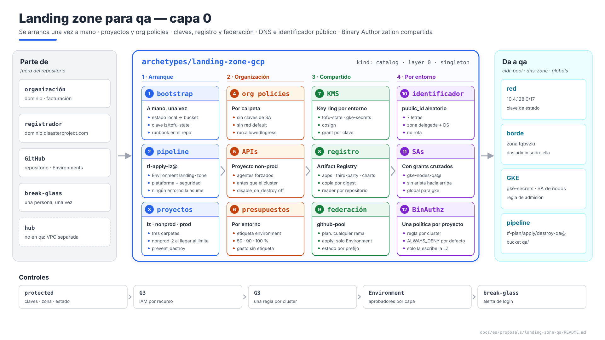
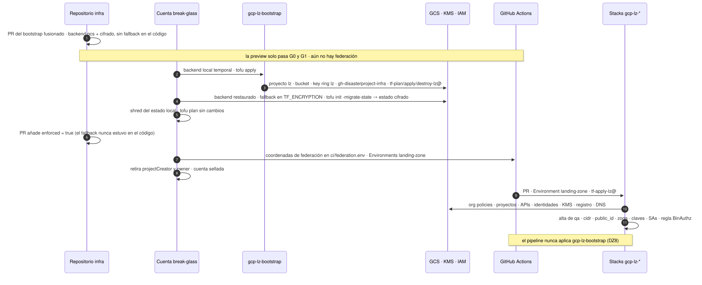

# Landing zone para `qa` — arquetipo `landing-zone-gcp` (capa 0)

| | |
|---|---|
| **Estado** | Propuesta · revisión 5 · revisión de seguridad: administración de IAM acotada, roles de plan enumerados, la condición de listado del estado, el fallback de migración solo en el entorno (medido, `poc/RESULTS.es.md` A9), coordenadas de federación commiteadas, la variante de acceso al plano de control (§3.2), DZ12–DZ16; revisión 4: DZ4, DZ5 y DZ6 aprobadas y aplicadas (§13); §1 ampliado a runbook del bootstrap, DZ8 nueva; revisión 4: comprobación previa, auditoría DATA_READ, la variante de proyecto adoptado (§1.5), conjunto mínimo de capa 0 (§15.1), DZ9–DZ11 |
| **Alcance** | Lo que la capa 0 tiene que dar para que `qa` arranque: arranque de la propia landing zone, proyectos y carpetas, org policies, APIs del proyecto non-prod, claves de Cloud KMS, Artifact Registry, federación de GitHub Actions e identidades del pipeline, bucket de estado, DNS padre y zona delegada, identificador público, pool global de direcciones, Binary Authorization, presupuestos. `hub` y `prod` solo donde cambian algo |
| **Por qué ahora** | Todas las propuestas de `qa` le dejan requisitos (§0.1) y ninguna la describe. Es lo primero que se aplica y lo único que se arranca a mano |
| **Base** | E1 §4.13 (acceso al plano de control), §4.14 (KMS), §4.15 (VPC separada); arquitectura §11.2 (identidad del pipeline), §11.4 (segregación), §11.5 (estado); AM §3 (capas), §7 (binding), §9.2 (pool global). No se repite lo que ya está allí |
| **Especificación de referencia** | `archetype-model.md` (AM §n), `terramate-outputs-sharing-architecture.md` (§n), `risk-register.md` |
| **Diagramas** | `diagrams/*.mmd` (fuente Mermaid) y `diagrams/*.svg` (renderizados). El SVG se regenera desde el `.mmd`; no se edita a mano. `diagrams/06-bloques-presentacion.svg` (1920×1080, para presentaciones) se genera con `06-bloques-presentacion.py`, no con Mermaid |
| **Identificadores propios** | Decisiones `DZ1…`, riesgos candidatos `RZ1…`, verificaciones `VZ1…`. Los riesgos reciben número `R58+` en `risk-register.md` si se adoptan |

No reabre ninguna decisión de `CLAUDE.md`. Reúne lo que las propuestas anteriores dejaron "a la landing zone" y encuentra tres problemas que ninguna podía ver por separado:

1. **Binary Authorization es una política por proyecto** (§8). Si cada stack `gke` escribe su regla, el último `apply` borra las de los demás entornos no productivos: un fan-in N→1 (`CLAUDE.md`, trampa de outputs sharing) en forma de recurso único.
2. **Grants entre proyectos sobre identidades que aún no existen** (§6.3). La landing zone concede `artifactregistry.reader` a la SA de nodos de `qa` y `cryptoKeyEncrypterDecrypter` al agente de GKE; si esas identidades las crea la capa 2, la capa 0 tiene que esperar a la 2 para aplicar: una arista hacia arriba.
3. **La org policy `run.allowedIngress` choca con el servicio `access` de GKE** (§3.2). E1 §4.13 lo expone a los runners de GitHub por internet; la política que protege R14 lo deja inalcanzable.



Fuente: [`diagrams/06-bloques-presentacion.py`](diagrams/06-bloques-presentacion.py) — vista de presentación; el detalle está en §1–§10.

---

## 0. Contexto

| Pregunta | Respuesta | Consecuencia |
|---|---|---|
| Qué es | Arquetipo `landing-zone-gcp`, `kind: catalog`, **capa 0**, instancia `disasterproject-gcp-lz` (el valor de `platform.landing_zone` en el binding de `qa`). Singleton por organización | Stacks `gcp-lz-*`; los aplica solo su propia identidad (§5.2) |
| Provee | `cidr-pool` (el `/8` y el ledger global, AM §9.2), `dns-zone` (la zona padre) y `hub` (fuera de alcance: `qa` no hace peering, E1 §4.15). `cert`, `waf` y `edge-ip` son de la capa 1 (AM §3) | Lo demás que da —claves, registro, federación, bucket de estado, identidades, proyectos— son **globals deterministas**, no capabilities: un solo proveedor posible, nombres conocidos sin leer estado (E1 §4.14) |
| Proyectos | `disasterproject-lz` (la propia landing zone), `disasterproject-nonprod` (`dev`, `qa`, `demos`, `sandbox`, `ephemeral-*`), `disasterproject-prod` | Los crea la landing zone; los entornos solo crean recursos dentro (`CLAUDE.md`) |
| Qué **no** hace | Nada dentro de la VPC de un entorno; ningún recurso con el nombre de un entorno fuera de lo que la capa 1 necesita para arrancar (claves, zona, identidades) | La capa 1 conserva su propiedad (`network-qa`, `edge-qa`) |



Fuente: [`diagrams/01-contexto.mmd`](diagrams/01-contexto.mmd)

### 0.1 Lo que le pidieron las propuestas anteriores

| Origen | Requisito | Dónde se cumple |
|---|---|---|
| E1 §4.14 | Key ring `qa` con `tofu-state`, `gke-secrets`, `cosign`; protección frente a destrucción | §4 |
| `network-qa` §1, §2, §5, §9.2 | Proyecto non-prod con APIs habilitadas; `compute.skipDefaultNetworkCreation`; `compute.restrictVpcPeering` que admita `servicenetworking` | §2, §3 |
| `edge-qa` §1, DL2, DL10 | Zona pública del entorno creada aquí, delegada con `DS` y DNSSEC, `dns.admin` al entorno sobre esa zona; identificador público aleatorio | §7 |
| `gke-qa` §3 | `gke-secrets` para el agente de GKE del proyecto; `artifactregistry.reader` sobre el repositorio para la SA de nodos; Binary Authorization por cluster | §4, §6.3, §8 |
| Gatekeeper P2, `postgres-operator-qa`, variante Cloud SQL | Artifact Registry único, imágenes por digest, copia de imágenes de terceros (CNPG, Cloud SQL Auth Proxy) | §6 |
| Arquitectura §11.2, §11.4 | Federación de GitHub Actions; `tf-plan-qa@`, `tf-apply-qa@`, `tf-destroy-qa@` | §5 |
| `cmdb-qa` §7 | `cmdb-reader@` con `cloudasset.viewer` en el proyecto non-prod | §5.1 |
| `CLAUDE.md` | Facturación por etiquetas en el proyecto compartido | §9 |

---

## 1. Arranque de la propia landing zone

La landing zone es lo único que no puede desplegar el pipeline, porque crea el pipeline: su bucket de estado, su clave de estado y la federación con la que GitHub se autentica. Antes del bootstrap no existe ninguna identidad que un job de GitHub pueda asumir, ni ningún sitio donde guardar estado. Por eso se arranca **una vez**, a mano, con estado local, y ese estado se muda después al bucket que el propio bootstrap acaba de crear.



Fuente: [`diagrams/02-arranque.mmd`](diagrams/02-arranque.mmd)

| Paso | Quién | Qué | Estado |
|---|---|---|---|
| 1 | Revisión normal por PR | El código del stack `gcp-lz-bootstrap` entra en `main` en su forma final: backend `gcs`, cifrado con `lz/tofu-state`, **sin fallback en claro y sin variables que rellenar**: las coordenadas de la federación están commiteadas en `ci/federation.env` (DZ12) | — |
| 2 | Cuenta *break-glass*, desde una estación | `tofu apply` del stack con un backend local temporal, sin cifrado: proyecto, bucket, key ring, federación, identidades de la landing zone | **Local**, sin cifrar: aún no hay dónde guardarlo |
| 3 | La misma cuenta | Restaura el backend generado y ejecuta `tofu init -migrate-state` con el fallback en claro **solo en `TF_ENCRYPTION`**, nunca en disco (DZ15); `tofu plan` sin él no muestra cambios | En el bucket, cifrado |
| 4 | Revisión normal por PR | Una línea: `enforced = true` en `state` y `plan`. No puede ir en el paso 1: prohíbe incluso un fallback inyectado por el entorno (`poc/RESULTS.es.md` A9c–d) | En el bucket, cifrado |
| 5 | Administrador del repositorio | Los GitHub Environments `landing-zone`, `landing-zone-destroy` y sus revisores. **Sin variables**: las identidades se derivan de las coordenadas commiteadas (DZ12) | — |
| 6 | Pipeline, `tf-apply-lz@` | El resto de stacks `gcp-lz-*` (§2–§10): la primera vez con el workflow manual `first-deploy` para `landing-zone`, que escribe su marcador de deploy; después por PR (`infra-repo-qa` §6) | En el bucket, cifrado |

El procedimiento de los pasos 2 y 3 se guarda en el repositorio de despliegue como `docs/runbooks/lz-bootstrap.md` (`infra-repo-qa` §2), porque la próxima vez que haga falta será para reconstruir la organización y nadie lo recordará (RZ1). Esta sección es ese runbook.

### 1.1 Qué crea el stack

`stacks/landing-zone/gcp/bootstrap/`, id `gcp-lz-bootstrap`, etiquetas `gcp`, `landing-zone`, `bootstrap`, `protected`. Crea **solo** lo que el pipeline necesita para existir; todo lo demás es de los stacks `gcp-lz-*` que aplica el pipeline.

| Recurso | Nombre | Detalle |
|---|---|---|
| Proyecto | `disasterproject-lz` | Directamente bajo la organización, no en una carpeta: así ningún stack posterior lo mueve y cambia su herencia de org policies. Cuenta de facturación de la organización |
| APIs | `storage`, `cloudkms`, `iam`, `iamcredentials`, `sts`, `cloudresourcemanager`, `serviceusage`, `cloudbilling`, `orgpolicy` | Las que usan los propios pasos 2–6. Las de los proyectos de entorno las habilita `gcp-lz-projects` (§2.1) |
| Bucket de estado | `disasterproject-tfstate-gcp` | `europe-west1`; acceso uniforme; *public access prevention* forzada; versionado, versiones anteriores 30 días; `prevent_destroy` |
| Auditoría de lecturas del estado | `google_project_iam_audit_config` en `disasterproject-lz`, servicio `storage.googleapis.com`, `DATA_READ` y `DATA_WRITE` | Responde *quién leyó el estado*: Cloud Audit Logs, que ningún ajuste del bucket puede desactivar. **No** el access logging de GCS: exige conceder el bucket a `group:cloud-storage-analytics@google.com`, que `iam.allowedPolicyMemberDomains` (§3.1) prohíbe; sin esa concesión un bloque `logging` queda configurado e inerte — nunca se escribe un log y el código parece correcto |
| Key ring y clave | `lz` / `tofu-state` | `europe-west1`; rotación 90 días; `prevent_destroy`. Los key rings de entorno los crea `gcp-lz-kms` (§4) |
| Pool y proveedor de federación | `gh-disasterproject-infra` / `github-oidc` | `attribute_condition` sobre el repositorio **y** el `repository_owner_id` numérico (arquitectura §11.2); mapeo de `repository`, `environment` y `ref` |
| Identidades | `tf-plan-lz@`, `tf-apply-lz@`, `tf-destroy-lz@` | En `disasterproject-lz`. `tf-plan-lz@` ← `attribute.repository/disasterproject/infra`; `tf-apply-lz@` ← `attribute.environment/landing-zone`; `tf-destroy-lz@` ← `attribute.environment/landing-zone-destroy` |
| Grants de `tf-apply-lz@` | Organización: `resourcemanager.folderCreator` (no `folderAdmin`, que lleva `setIamPolicy` sobre todos los proyectos de la carpeta), `resourcemanager.projectCreator`, `orgpolicy.policyAdmin`, `iam.organizationRoleAdmin`; cuenta de facturación: `billing.user`; `disasterproject-lz`: `cloudkms.admin`, `artifactregistry.admin`, `dns.admin`, `iam.serviceAccountAdmin`; bucket: `storage.admin` | `storage.admin` sobre el bucket, no el proyecto: es lo que le deja poner las condiciones por prefijo a las identidades de entorno (§5.1). En cada proyecto de entorno, `resourcemanager.projectIamAdmin` **acotado por rol** (DZ13): un binding por cada bloque de ≤10 roles de `global.identities`, cada uno con `api.getAttribute('iam.googleapis.com/modifiedGrantsByRole', []).hasOnly([...])`. Puede conceder exactamente los roles que tienen las identidades de la plataforma y nada más — ni `owner`, ni `editor`, ni a sí mismo |
| Grants de `tf-plan-lz@` | Organización: `browser`, `orgpolicy.policyViewer`, `iam.securityReviewer`; `disasterproject-lz`: la lista de lectura enumerada de §5.1, **nunca `roles/viewer`** (DZ14); bucket: lectura del prefijo `lz/` con la mitad de listado de la condición (§5.1) | Solo lectura, para la preview y el drift de la landing zone |
| Grants sobre `tofu-state` | `cryptoKeyEncrypterDecrypter` a las tres identidades `lz` | Por clave, nunca por key ring |
| Validaciones del módulo | — | Rechazadas al planificar: `owner`, `editor`, `resourcemanager.projectIamAdmin`, `iam.securityAdmin`, `iam.serviceAccountTokenCreator`, `iam.workloadIdentityPoolAdmin` o cualquier `resourcemanager.*` en la lista concedible; un id de pool que empiece por `gcp-` (reservado); un `display_name` de pool de más de 32 bytes; un nombre de bucket de estado de más de 63 caracteres. Cada una es un límite de la API o un camino de escalada, y cada una hace fallar el apply a medias si no se detecta aquí |

Las identidades de entorno (`tf-*-qa@`) **no** son del bootstrap: las crea `gcp-lz-identities` en el alta del entorno (§10).

El stack tiene dos particularidades en su código:

```hcl
# stacks/landing-zone/gcp/bootstrap/stack.tm.hcl
stack {
  id          = "gcp-lz-bootstrap"
  name        = "GCP landing zone — bootstrap"
  tags        = ["gcp", "landing-zone", "bootstrap", "protected"]
  description = "Applied by a person only (DZ8). Runbook: docs/runbooks/lz-bootstrap.md"
}
```

```hcl
# _backend.tf, generado por imports/mixins/backend_gcp.tm.hcl para este stack
terraform {
  backend "gcs" {
    bucket = "disasterproject-tfstate-gcp"
    prefix = "lz/bootstrap"
  }

  encryption {
    key_provider "gcp_kms" "lz" {
      kms_encryption_key = "projects/disasterproject-lz/locations/europe-west1/keyRings/lz/cryptoKeys/tofu-state"
      key_length         = 32
    }
    method "aes_gcm" "lz" {
      keys = key_provider.gcp_kms.lz
    }
    state {
      method = method.aes_gcm.lz       # sin fallback aquí: el paso 3 lo inyecta por TF_ENCRYPTION
    }
    plan {
      method = method.aes_gcm.lz
    }
  }
}
```

**Nunca lo aplica el pipeline (DZ8).** `deploy` selecciona la landing zone con `--tags landing-zone --no-tags bootstrap`; preview y drift sí lo planifican con `tf-plan-lz@`, así que una divergencia se ve. Un cambio al bootstrap (una API más, un grant de `tf-apply-lz@`) se revisa por PR y lo aplica la cuenta *break-glass* desde `main`, ya con estado remoto. La razón: `tf-apply-lz@` no debe poder ampliar sus propios permisos ni tocar la federación con la que se autentica.

### 1.2 Requisitos

| | |
|---|---|
| **Cuenta** | La cuenta *break-glass* (§5.3) — o una elevación temporal que concede esos roles solo durante la ejecución, aprobada y alertada —, nunca una cuenta de uso diario con `owner` permanente: `organizationAdmin` en la organización y `billing.admin` en la cuenta de facturación. Llave de seguridad física |
| **Roles temporales** | `organizationAdmin` no crea proyectos por sí mismo: la cuenta se concede `resourcemanager.projectCreator` en la organización antes del paso 2 y se lo retira al final. Al crear el proyecto queda como `owner` de `disasterproject-lz`, que también se retira |
| **Estación** | Un clon de `disasterproject/infra` en el commit de `main` del paso 1; `mise install` (versiones fijadas de `tofu` y `terramate`); `gcloud` |
| **Datos** | Id numérico de la organización, id de la cuenta de facturación, `repository_owner_id` numérico de la organización de GitHub. Van en `globals` del stack, revisados en el PR del paso 1 |
| **Paso 1 hecho** | El PR del bootstrap está fusionado. Su preview solo pasó G0 y G1: `ci/federation.env` aún tiene el número de proyecto de marcador, un estado commiteado y revisado, así que los jobs de plan se saltan. El PR posterior al bootstrap escribe el número real; desde entonces un job de plan que no puede autenticarse falla en lugar de saltarse (`infra-repo-qa` §5.3) |

### 1.3 Paso a paso

```bash
# --- 0. Preparación -----------------------------------------------------------
git clone git@github.com:disasterproject/infra.git && cd infra
git checkout <sha-del-merge-del-paso-1>
mise install
gcloud auth login breakglass-1@disasterproject.com
gcloud auth application-default login
gcloud organizations add-iam-policy-binding "$ORG_ID" \
  --member=user:breakglass-1@disasterproject.com --role=roles/resourcemanager.projectCreator

terramate generate --detailed-exit-code    # 0: el código generado es el de main
cd stacks/landing-zone/gcp/bootstrap

# --- 1b. Comprobación previa: nadie más tiene nuestros nombres ------------------
# Un nombre ya ocupado no está en nuestro estado: el plan dice "create", la API
# responde 409 treinta recursos después, y la landing zone queda aplicada a medias.
gcloud storage buckets describe gs://disasterproject-tfstate-gcp >/dev/null 2>&1 && echo "TAKEN bucket"
gcloud iam workload-identity-pools describe gh-disasterproject-infra \
  --location=global --project="$LZ_PROJECT" >/dev/null 2>&1 && echo "TAKEN pool (o borrado hace < 30 días)"
gcloud kms keyrings describe lz --location=europe-west1 --project="$LZ_PROJECT" >/dev/null 2>&1 && echo "TAKEN key ring"
for sa in tf-plan-lz tf-apply-lz tf-destroy-lz; do
  gcloud iam service-accounts describe "$sa@$LZ_PROJECT.iam.gserviceaccount.com" >/dev/null 2>&1 && echo "TAKEN $sa"
done
gcloud org-policies describe iam.allowedPolicyMemberDomains --organization="$ORG_ID"   # condiciona cada concesión (§1.1)

# --- 2. Apply con estado local ------------------------------------------------
mv _backend.tf _backend.tf.final           # backend gcs + cifrado: aún no existen
cat > _backend_local.tf <<'HCL'
terraform {
  backend "local" {}                       # temporal; nunca se commitea
}
HCL
tofu init
tofu apply                                 # revisar el plan: ~30 recursos, todos "create"

# --- 3. Migración al bucket, cifrada ------------------------------------------
rm _backend_local.tf
mv _backend.tf.final _backend.tf
TF_ENCRYPTION='
method "unencrypted" "migrate" {}
state {
  method = method.aes_gcm.lz
  fallback { method = method.unencrypted.migrate }
}' tofu init -migrate-state -force-copy     # el fallback vive solo en este proceso (A9b)
tofu plan                                  # sin TF_ENCRYPTION: "No changes." — lee el bucket, cifrado
gcloud storage cat gs://disasterproject-tfstate-gcp/lz/bootstrap/default.tfstate | head -c 300
                                           # debe verse "encrypted_data", no recursos en claro
shred -u terraform.tfstate*               # estado en claro: no debe sobrevivir
git status --porcelain                     # vacío: nada del paso 2 queda en el árbol

# --- las coordenadas commiteadas coinciden con lo creado -------------------------
diff <(tofu output -json federation | jq -r 'to_entries[] | "\(.key)=\(.value)"' | sort) \
     <(sed 's/ *#.*//; /^$/d' ../../../../ci/federation.env | sort)
```

Tras el paso 3, un PR (paso 4) añade `enforced = true` a los bloques `state` y `plan` del mixin de este stack — una línea; no hay fallback en el código que quitar. Desde ese momento OpenTofu rechaza cualquier método sin cifrar, también uno inyectado más tarde por `TF_ENCRYPTION` (`poc/RESULTS.es.md` A9e).

**Paso 5, en GitHub** (administrador del repositorio, `infra-repo-qa` §5): los Environments `landing-zone` (revisores de plataforma y seguridad, solo `main`) y `landing-zone-destroy` (otro grupo de aprobadores). Nada más: los workflows leen `ci/federation.env` y derivan `tf-<rol>-<env>@` (DZ12, §5.1).

**Cierre.** La cuenta retira su `projectCreator` y su `owner` sobre `disasterproject-lz`; conserva `organizationAdmin` y vuelve a quedar sellada, con alerta en cada inicio de sesión (§5.3). El primer PR que toque `gcp-lz-org` comprueba el resto: preview con `tf-plan-lz@`, apply con `tf-apply-lz@` desde el Environment `landing-zone` (VZ1, VZ3).

> **Medido (`poc/RESULTS.es.md` A9, OpenTofu 1.10.6).** Un estado en claro no se puede migrar a un backend cifrado sin fallback (A9a). Con el fallback solo en `TF_ENCRYPTION` migra, y la configuración commiteada sola no planifica cambios (A9b). `enforced = true` prohíbe incluso ese fallback inyectado y el entorno no puede relajarlo (A9c–d), por eso va en el paso 4 y no en el 1. VZ1 lo confirma aún contra GCS y KMS.

Los pasos 1b y 2 se ejecutan contra un proyecto que crea el propio bootstrap, así que en la forma de referencia solo puede colisionar el nombre del bucket, global en todo Google Cloud. En un proyecto adoptado (§1.5) importa cada línea de la comprobación previa, y un `TAKEN` detiene la ejecución: cambian nuestros nombres, nunca los suyos.

### 1.4 Si algo sale mal

| Situación | Qué hacer |
|---|---|
| El `apply` del paso 2 falla a medias | Repetir `tofu apply`: el estado local tiene lo creado. No borrar `terraform.tfstate` hasta que el paso 3 termine |
| Se perdió el estado local antes del paso 3 | Los recursos existen y el estado no. El stack lleva `import.tf.example` con un bloque `import` por recurso; copiarlo a `import.tf`, `tofu apply` con el backend local y seguir en el paso 3. Nunca volver a crear el bucket ni la clave a mano |
| La migración del paso 3 falla | El estado local sigue ahí; el bucket puede tener un objeto a medias. Borrar ese objeto (versionado: queda recuperable) y repetir `tofu init -migrate-state` |
| Se perdió la clave `tofu-state` | No debería poder ocurrir: `prevent_destroy`, 30 días mínimos para destruir una versión y nadie con `cloudkms.admin` salvo `tf-apply-lz@` (RZ5). Si ocurre, el estado cifrado es irrecuperable; se reconstruye con `import.tf.example` |
| Hay que rehacer la organización | El mismo runbook, desde el paso 2, contra la organización nueva. El código no cambia salvo los `globals` de ids |
| Un cambio posterior al bootstrap | PR revisado; lo aplica la cuenta *break-glass* desde `main` con `tofu apply`, ya con backend remoto. No se repiten los pasos 2–4 |
| El `apply` falla con **409 already exists** | El nombre pertenece a algo fuera de nuestro estado — se saltó la comprobación previa o el proyecto es compartido. **Nunca `import`**: un recurso ajeno en nuestro estado lo destruye nuestro próximo `destroy`. Renombrar el nuestro (el id del pool y los nombres de SA llevan el repositorio), volver a planificar y ejecutar antes la comprobación previa |
| Un **403** en una concesión de organización | La cuenta no tiene permiso sobre la organización — lo habitual en un proyecto adoptado (§1.5). `grant_org_roles = false`; el propietario de la organización aplica esas concesiones fuera del stack, y el runbook registra quién y cuándo |
| Un **412** *users do not belong to a permitted customer* | Una concesión a un miembro fuera de los dominios de la organización, bloqueada por `iam.allowedPolicyMemberDomains`. Quitar la concesión y lo que dependa de ella en el mismo cambio (el bloque `logging` de un bucket, por ejemplo); nunca pedir una excepción para una concesión del pipeline |


### 1.5 Variante: un proyecto adoptado

La forma de referencia da a la capa 0 su propio proyecto, creado por el bootstrap. Cuando nadie tiene `billing.user` y `resourcemanager.projectCreator`, no se puede crear un proyecto, y la landing zone **adopta** uno que ya existe: en la práctica el proyecto de no producción, junto a los entornos a los que sirve. Es una forma legítima para no producción; `prod` conserva su propio proyecto en cualquiera de las dos formas.

| Qué cambia | Forma de referencia | Proyecto adoptado |
|---|---|---|
| `create_project` | `true` | `false`; el id del proyecto es una entrada del bootstrap |
| `grant_org_roles` | `true` | `false`: las concesiones de organización las aplica su propietario, fuera del stack (§1.4) |
| `gcp-lz-org`, `gcp-lz-projects` | Se aplican | **No se aplican.** Las org policies de §3.1 pertenecen al propietario de la organización: pasan a ser requisitos, comprobados por VZ6, no escritos |
| Conjunto mínimo para desplegar un entorno | §15.1 | El mismo, sin `org` ni `projects` |
| Comprobación previa (§1.3, 1b) | Solo puede colisionar el nombre del bucket | **Obligatoria**: pools, key rings y cuentas de servicio pueden existir ya con nuestros nombres (RZ7) |
| Separación entre la landing zone y los entornos | El límite del proyecto | Solo la sostienen dos controles: el acceso al estado condicionado al **prefijo de objeto** del entorno, y el acceso a KMS a su **propia clave** |
| Identidades que ya están en el proyecto | Ninguna | Cualquier `owner`, `editor` o `storage.admin` concedido a nivel de **proyecto** lee y escribe todos los objetos de estado, los de la landing zone incluidos. Reducirlos a nivel de recurso es un **requisito** del paso 2, no higiene (RZ6) |
| `tf-apply-lz@` | En un proyecto que nadie más usa | En un proyecto que comparten varios entornos: un objetivo mayor. Las alertas *break-glass* de §5.3 cubren también los cambios en su política IAM |
| Identidades de entorno | Roles sobre **sus propios** recursos, o roles de proyecto en un proyecto que solo usan ellas | Si reciben roles de proyecto en el proyecto compartido, `tf-apply-qa@` puede cambiar el clúster, la red, los secretos y las bases de datos de `dev`: **movimiento lateral** entre entornos. No se acepta como diseño: condiciones IAM sobre `resource.name` por prefijo de entorno donde el servicio las admite (Secret Manager, KMS, Storage, Compute — verificar cada uno), y una alerta G3 ante cualquier cambio fuera del prefijo de la identidad |
| Política de Binary Authorization | La crea `gcp-lz-binauthz` | Puede **existir ya** con reglas de otros clústeres. La primera escritura la lee y la importa en un PR revisado — la única excepción a "nunca importar lo que no creamos", porque escribirla de cero borra esas reglas (§8) |
| `cloudkms.admin` y `owner` en manos de personas | Nadie fuera de la landing zone | Las personas con `owner` sobre el proyecto compartido pueden destruir versiones de clave y dejar ilegible todo estado. Listarlas, alertar ante `DestroyCryptoKeyVersion` y fijar `cloudkms.minimumDestroyScheduledDuration` donde la organización lo permita |

Cada fila es una consecuencia declarada de antemano en lugar de descubierta en el primer `apply`. Ninguna se da en la forma de referencia.

---

## 2. Organización, carpetas y proyectos

| Carpeta | Proyecto | Contiene | Motivo |
|---|---|---|---|
| `platform` | `disasterproject-lz` | Bucket de estado, claves, Artifact Registry, federación, identidades del pipeline, zona padre `disasterproject.com` | Lo que comparten todos los entornos; una identidad de entorno no puede tocarlo |
| `nonprod` | `disasterproject-nonprod` | Los recursos de `dev`, `qa`, `demos`, `sandbox`, `ephemeral-*`, cada uno con su prefijo; las zonas públicas delegadas de cada entorno | `CLAUDE.md`: proyecto compartido, VPC por entorno |
| `prod` | `disasterproject-prod` | Solo `prod` | Límite de aislamiento de `prod` |

Las org policies se aplican por carpeta (§3), así que `nonprod` y `prod` pueden diferir sin repetir la lista.

**Cuando el proyecto non-prod llegue a un límite** (cuotas de CPU, de IPs, de SAs por proyecto), se añade `disasterproject-nonprod-2` en la misma carpeta y los entornos nuevos van allí; ninguno se reparte entre dos proyectos (`CLAUDE.md`). El binding del entorno ya lleva `platform.project_id`, así que moverlo es cambiar ese valor y reconstruir, no rediseñar.

### 2.1 APIs del proyecto non-prod

Las que lista `network-qa` §1.1, habilitadas por el stack `gcp-lz-projects` con `disable_on_destroy = false`. A esa lista se suma una pieza que `network-qa` no podía ver:

| Pieza | Motivo |
|---|---|
| `google_project_service_identity` para `container.googleapis.com`, `sqladmin.googleapis.com`, `secretmanager.googleapis.com` y `storage` | El agente de servicio de un producto se crea **la primera vez que se usa**, no al habilitar la API. La landing zone tiene que concederle roles sobre claves (§4) antes de que el entorno cree el primer cluster; sin forzar su creación, el grant falla con "service account does not exist" **(verificar, VZ2)** |

---

## 3. Org policies

### 3.1 Lista

| Política | Valor | Carpetas | Origen |
|---|---|---|---|
| `iam.disableServiceAccountKeyCreation` | Enforce | Todas | Arquitectura §11.2 |
| `iam.allowedPolicyMemberDomains` | El dominio de la organización | Todas | Arquitectura §11.2 |
| `compute.skipDefaultNetworkCreation` | Enforce | Todas | `network-qa` §2 |
| `compute.restrictVpcPeering` | Solo `projects/*/global/networks/servicenetworking` y los hubs | `nonprod`, `prod` | `network-qa` §5, RW4 |
| `compute.vmExternalIpAccess` | Denegar todo | `nonprod`, `prod` | Nodos sin IP externa (`gke-qa`) |
| `compute.requireShieldedVm` | Enforce | `nonprod`, `prod` | Arquitectura §11.2 |
| `sql.restrictPublicIp` | Enforce | `nonprod`, `prod` | Cloud SQL solo por PSA |
| `storage.publicAccessPrevention` | Enforce | Todas | Ningún bucket público, tampoco el de estado |
| `storage.uniformBucketLevelAccess` | Enforce | Todas | IAM de bucket con condiciones por prefijo (§5.1) |
| `gcp.resourceLocations` | `in:europe-west1-locations` (y `global` para lo que no es regional) | Todas | Residencia; además KMS y buckets deben coincidir con el cluster (E1 §4.14) |
| `cloudkms.minimumDestroyScheduledDuration` | 30 días | `platform` | Ventana de rescate de una versión de clave (E1 §4.14) |
| `run.allowedIngress` | `internal-and-cloud-load-balancing` | `nonprod`, `prod` | R14; ver §3.2 |

### 3.2 `run.allowedIngress` y el servicio `access` de GKE

E1 §4.13 decidió abrir las redes autorizadas del plano de control con un servicio intermedio en Cloud Run (`gke-qa`, stack `access`), llamado por los runners de GitHub **desde internet**. Con `run.allowedIngress` a `internal-and-cloud-load-balancing`, ese servicio no es alcanzable: la política no distingue un servicio de otro.

| Opción | Qué hace | Coste |
|---|---|---|
| **A. Endpoint DNS del plano de control** (recomendada) | GKE expone el API server en un nombre DNS controlado **solo por IAM**, sin listas de IP. Desaparecen el servicio `access`, el reconciliador de IPs huérfanas y la carrera entre jobs de E1 §4.13 | Reabre E1 §4.13, que ya dejaba esta alternativa anotada. Hay que verificar que el proveedor `kubernetes`/`helm` y `kubectl` funcionan contra ese endpoint desde un runner alojado **(VZ5)** |
| B. Excepción de la política en `nonprod` | `run.allowedIngress` admite también `all` en la carpeta | Cualquier servicio Cloud Run del proyecto puede publicarse sin balanceador ni Cloud Armor: R14 vuelve para todos |
| C. Balanceador delante de `access` | Un GLB con backend serverless | Un balanceador, un certificado y una política de Cloud Armor para una función que abre y cierra una IP |
| D. Un `/32` por job (variante, solo donde la organización prohíbe cualquier endpoint de Kubernetes alcanzable desde internet) | Endpoint de IP pública con redes autorizadas siempre activas; cada job de apply o destroy añade la IP de su runner como `gha-<run_id>-<attempt>` y quita **su propia** entrada con `if: always()` | La IP pertenece al pool de runners **compartido** del proveedor: otros inquilinos de esa IP alcanzan el endpoint durante la ventana (IAM y RBAC lo siguen protegiendo). Un runner que muere deja su entrada. La identidad de apply necesita `container.clusters.update`. `preview` y `drift` no pueden planificar los stacks que hablan con el API server, porque una identidad de plan alcanzable desde cualquier PR no debe abrir la red. Controles obligatorios: un job programado que quita las entradas `gha-*` más antiguas que el job más largo; una alerta ante cualquier cambio en las redes autorizadas hecho fuera del pipeline; un tope de entradas. La salida es un runner propio en la VPC con el endpoint privado |

**Decisión (DZ4, aprobada):** A. Resuelve el choque y además elimina la parte más frágil de E1 §4.13, que queda revisada; R38 y R39 se retiran. **D es una variante documentada (DZ16)**, no una alternativa por defecto: se elige solo cuando la organización prohíbe A, con sus controles, y trae de vuelta R64.

---

## 4. Claves de Cloud KMS

El diseño de E1 §4.14 se aplica tal cual; aquí queda dónde y quién.

| Pieza | Valor |
|---|---|
| Proyecto | `disasterproject-lz` |
| Key ring | Uno por entorno: `qa`, en `europe-west1` (la clave de etcd debe estar en la ubicación del cluster). Más `lz`, del bootstrap |
| Claves de `qa` | `tofu-state`, `gke-secrets`, `cosign` (E1 §4.14). Las opcionales `gcs-cmek` y `secrets-cmek` no se crean en `qa` |
| Grants | Sobre **cada clave**, nunca sobre el key ring ni el proyecto: `tofu-state` → `tf-plan-qa@`, `tf-apply-qa@`, `tf-destroy-qa@`; `gke-secrets` → agente de GKE de `disasterproject-nonprod`; `cosign` → identidad del build |
| Protección | `prevent_destroy`; ninguna identidad de entorno tiene `cloudkms.admin`; destrucción de versiones con 30 días mínimos (§3.1) |

**El agente de GKE es uno por proyecto** (`gke-qa` §3): el grant de `gke-secrets` de `qa` también lo recibe, en la práctica, cualquier cluster no productivo. La clave por entorno separa por convención, no por IAM: aceptado en no producción, como R54.

---

## 5. Federación e identidades del pipeline

### 5.1 Identidades

Todas en `disasterproject-lz`, no en el proyecto del entorno: así una identidad de `qa` no puede modificar su propia política IAM ni la de otra.

| Identidad | Principal que la usa (federación) | Permisos, en `disasterproject-nonprod` salvo indicación |
|---|---|---|
| `tf-plan-qa@` | `attribute.repository/disasterproject/infra` (cualquier rama) | Una lista de lectura **enumerada** — `compute.viewer`, `compute.networkViewer`, `container.viewer`, `dns.reader`, `iam.serviceAccountViewer`, `iam.roleViewer`, `certificatemanager.viewer`, `cloudkms.viewer`, `secretmanager.viewer` (solo metadatos), `cloudsql.viewer`, `monitoring.viewer`, `serviceusage.serviceUsageViewer` — **nunca `roles/viewer`** (DZ14): esta identidad es alcanzable desde cualquier PR, y `roles/viewer` lee la configuración de todos los servicios. Nunca `secretmanager.secretAccessor`, nunca `cryptoKeyDecrypter` más allá de su propio `tofu-state`. Lectura del prefijo `qa/` del bucket de estado; `tofu-state` de `qa` |
| `tf-apply-qa@` | `attribute.environment/qa` (solo con el GitHub Environment `qa`) | Los roles de arquitectura §11.2; escritura en el prefijo `qa/`; `dns.admin` **sobre la zona de `qa`**; `tofu-state` de `qa` |
| `tf-destroy-qa@` | `attribute.environment/qa-destroy` (Environment con otro grupo de aprobadores) | Como `tf-apply-qa@`, más los `delete` que aquel no tiene (arquitectura §11.4) |
| `tf-plan-lz@` | `attribute.repository/disasterproject/infra` | Lectura de la organización y del prefijo `lz/`; preview y drift de la landing zone (§1.1) |
| `tf-apply-lz@` | `attribute.environment/landing-zone` | Organización, carpetas, proyectos, KMS, Artifact Registry, zona padre. Solo la landing zone; creada por el bootstrap (§1.1) |
| `tf-destroy-lz@` | `attribute.environment/landing-zone-destroy` | Como `tf-apply-lz@`, con otro grupo de aprobadores |
| `cmdb-reader@` | Job de reconciliación (`cmdb-qa` §7) | `cloudasset.viewer` en `disasterproject-nonprod` |
| `image-mirror@` | Workflow de copia de imágenes (§6.2) | `artifactregistry.writer` sobre el repositorio `third-party` |
| `image-build@` | Workflow de build | `artifactregistry.writer` sobre `apps`; `signerVerifier` sobre `cosign` |
| `image-scan@` | Repositorios de aplicación, a través de `github-apps` (abajo) | `artifactregistry.reader` sobre el repositorio `apps`; nada más |

**Bucket de estado.** `disasterproject-tfstate-gcp`, un prefijo por entorno (`qa/`, `dev/`…). Los permisos van con condición IAM sobre el prefijo: `resource.name.startsWith("projects/_/buckets/disasterproject-tfstate-gcp/objects/qa/") || api.getAttribute("storage.googleapis.com/objectListPrefix", "").startsWith("qa/")`. La segunda mitad no amplía nada: `storage.objects.list` se evalúa contra el bucket, no contra un objeto, así que sin ella el primer plan no puede listar su propio prefijo, y con ella el listado se queda dentro del prefijo. `tf-plan-qa@` puede leer el estado de productores de su propio entorno para outputs sharing; no el de otro entorno. Versionado activado y retención de 30 días para versiones anteriores: un `apply` que corrompe el estado se recupera desde la versión previa.

**Una lista de roles, leída dos veces.** Los roles de todas las identidades del pipeline y de nodos viven una vez, en `global.identities` (apply, plan, node). `gcp-lz-identities` los concede, y la cota de la administración de IAM de `tf-apply-lz@` (DZ13) se genera de la misma lista: un rol añadido en un sitio y no en el otro falla con un 403, a propósito, en lugar de desviarse. Los roles para alertas basadas en logs son el rol propio `logNotificationRuleEditor` (`logging.notificationRules.*`), nunca `logging.configWriter`, que además crea **sinks** — un canal para exportar todos los logs.

**Coordenadas de federación commiteadas (DZ12).** El pool, el proveedor, el proyecto de la landing zone y su número viven en `ci/federation.env`, revisado por seguridad (CODEOWNERS); los workflows derivan `tf-<rol>-<env>@` del GitHub Environment del job. Son identificadores, no secretos: lo que da acceso es el vínculo de cada identidad con `attribute.environment/<env>`, y lo que produce ese claim es la protección del GitHub Environment. Unas variables guardarían los mismos valores, editables sin revisión ni rastro. G1 falla si un workflow lee `vars.GCP_*`, si el fichero y los módulos no coinciden, o si un `env` usado para una identidad no es un directorio de `environments/`.

**Los repositorios de aplicación se federan con un segundo proveedor.** `github-oidc` admite solo `disasterproject/infra` (repositorio e id del propietario). Los repositorios de aplicación usan `github-apps` en el mismo pool: `attribute_condition` sobre `repository_owner_id` **y** `assertion.repository` dentro de una lista permitida generada de `teams.yaml`. Sus únicos vínculos son `image-scan@` (lee `apps`) e `image-build@`, este por repositorio (`attribute.repository/<org>/<app>`). Nunca una identidad del pipeline: un repositorio de aplicación nunca puede suplantar a un `tf-*@`, y una regla G1 falla ante cualquier vínculo de un `tf-*@` que nombre `github-apps`.

**Los entornos se descubren** de `environments/*/binding.yaml`, no se listan: un entorno nuevo recibe su key ring, su zona y sus identidades en el siguiente apply de la landing zone. Ese apply pasa por el Environment `landing-zone` con revisores, y `/environments/` tiene a plataforma y seguridad como CODEOWNERS: añadir un fichero es crear identidades.

### 5.2 Quién aplica la landing zone

Solo `tf-apply-lz@`, desde un GitHub Environment `landing-zone` con revisores del equipo de plataforma y de seguridad. Ninguna identidad de entorno puede asumirla. Los stacks `gcp-lz-*` llevan las etiquetas `landing-zone` y `protected`; los workflows de entorno seleccionan por `--tags qa`, que no los incluye, y aunque los incluyeran, sin `tf-apply-lz@` no podrían aplicarlos.

### 5.3 Break-glass

Una cuenta de persona con `organizationAdmin`, sin uso diario, con alerta en cada inicio de sesión (capa 1b de la landing zone). Es la que ejecutó el bootstrap, la única que puede rehacerlo y la única que aplica cambios a `gcp-lz-bootstrap` (DZ8). Fuera de esos momentos, sin `projectCreator` ni `owner` en ningún proyecto (§1.3). **Sin esa cuenta**, es aceptable una elevación temporal (Privileged Access Manager o equivalente): `owner` concedido solo para la ejecución, con aprobación y alerta. No lo es una cuenta de uso diario con `owner` permanente: su sesión o su token son la federación y todos los estados.

---

## 6. Artifact Registry

### 6.1 Repositorios

| Repositorio | Contenido | Quién escribe | Quién lee |
|---|---|---|---|
| `apps` | Imágenes de las aplicaciones, promovidas entre entornos por re-etiquetado (DG §5) | `image-build@` | SA de nodos de cada entorno |
| `third-party` | Copias por digest de imágenes de terceros: SonarQube, Keycloak, CNPG y su catálogo, Cloud SQL Auth Proxy, Envoy, Gatekeeper… | `image-mirror@` | SA de nodos de cada entorno |
| `charts` | Charts OCI propios de los arquetipos | `image-build@` | `tf-apply-<env>@` |

En `europe-docker.pkg.dev`, dentro del perímetro de la zona privada `pkg.dev` de cada VPC (`network-qa` §4). Gatekeeper P2 solo admite imágenes de estos repositorios y por digest.

### 6.2 Copia de imágenes de terceros

Un workflow programado lee una lista declarada en el repositorio (imagen, versión, digest esperado), copia con `crane copy` por digest y falla si el digest publicado no coincide con el declarado. Actualizar una versión es un PR que cambia la lista, revisado como cualquier otro. Las imágenes nunca se descargan de su registro de origen en tiempo de ejecución.

### 6.3 Grants a identidades que crean capas superiores

La landing zone concede `artifactregistry.reader` a la SA de nodos de `qa` y `cryptoKeyEncrypterDecrypter` al agente de GKE. Si la SA de nodos la crea el stack `gke` (capa 2), la capa 0 no puede aplicar ese grant hasta que exista: la landing zone dependería de la capa 2.

| Opción | Consecuencia |
|---|---|
| **A. La landing zone crea las SAs que reciben grants entre proyectos** (recomendada) | `gke-nodes-qa@disasterproject-nonprod` la crea `gcp-lz-identities`, con nombre determinista; el stack `gke` la usa como global, sin crearla. El agente de GKE existe desde §2.1. Ninguna arista hacia arriba |
| B. El stack `gke` concede el grant | La identidad de `qa` necesitaría `setIamPolicy` sobre un repositorio de la landing zone, y con él podría darse acceso a imágenes de otros entornos |
| C. Grant a nivel de proyecto (`artifactregistry.reader` sobre `disasterproject-lz`) | Cualquier SA con ese rol lee todos los repositorios, también los que no le corresponden |

**Decisión (DZ5, aprobada):** A. `gke-qa` §3 recibe la SA de nodos como global de la landing zone.

---

## 7. DNS e identificador público

| Pieza | Diseño |
|---|---|
| Zona padre | `disasterproject.com`, en `disasterproject-lz`, con DNSSEC. La registra el registrador del dominio; el `DS` del registrador se actualiza a mano en cada cambio de claves (RL4) |
| Identificador público | `random_string` de 7 letras minúsculas (sin números ni mayúsculas), uno por entorno, generado por `gcp-lz-environments` (`edge-qa` DL10). Si contiene una palabra de entorno, G1 rechaza el binding y se regenera (`taint`) |
| Zona del entorno | `<public_id>.disasterproject.com`, creada en `disasterproject-nonprod` con DNSSEC y NSEC3; el recurso se llama `qa-public`. La landing zone escribe en la padre el `NS` y el `DS` de la hija (DL2) |
| Permiso | `roles/dns.admin` para `tf-apply-qa@` **sobre esa zona**, no sobre el proyecto. Un `dns.admin` de proyecto dejaría a un entorno escribir el apex y las zonas de los demás entornos: toma de subdominios, cambio de sus `CAA`, certificados DNS-01 para sus nombres. Una regla G3 rechaza cualquier `roles/dns.admin` de proyecto para una identidad de entorno |
| Cómo llega al binding | La landing zone publica `public_id`, `public_zone` y `dns_suffix` como outputs; el PR que da de alta el entorno los copia al binding (`network.public_id`, `dns_zone`, `dns_suffix`), y G1 comprueba el binding (arquitectura §13.3). Son globals deterministas a partir de ese momento: nadie los lee por outputs sharing |

**El identificador no rota** (`edge-qa` DL10). Un `destroy` o un `taint` accidental del `random_string` cambiaría todos los nombres públicos del entorno: `prevent_destroy` y `lifecycle { ignore_changes = all }` sobre él.

---

## 8. Binary Authorization

La política de Binary Authorization es **una por proyecto** (`google_binary_authorization_policy`), con reglas de admisión por cluster (`cluster_admission_rules`, clave `<ubicación>.<cluster>`). En el proyecto non-prod, los clusters de `dev`, `qa`, `demos`… comparten ese único recurso.

| Si la escribe… | Qué pasa |
|---|---|
| Cada stack `gke` (lo que sugiere `gke-qa` §3) | Cada `apply` reescribe la política entera con **su** regla: el último entorno borra las reglas de los demás. Sin error, y el cluster afectado pasa a la regla por defecto |
| **La landing zone** (recomendada, DZ6) | `gcp-lz-binauthz` genera una regla por cluster a partir de los bindings de los entornos del proyecto (los nombres de cluster son deterministas). Un entorno nuevo es un cambio en la landing zone, revisado |

**La primera escritura lee la política.** En un proyecto que ya tiene clústeres, la política puede existir ya con sus reglas: `gcp-lz-binauthz` la importa en un PR revisado antes de su primer apply, y su plan muestra cada regla existente que conserva.

La regla por defecto del proyecto es **denegar**: un cluster sin regla propia no arranca pods, que es un fallo visible en vez de uno silencioso. En `qa`: lista de admisión del repositorio `apps` y `third-party`, atestación en *dry-run* (`gke-qa` DN10).

---

## 9. Facturación y presupuestos

| Pieza | Diseño |
|---|---|
| Cuenta de facturación | Una, enlazada a los tres proyectos |
| Reparto | Por la etiqueta `environment` que llevan todos los recursos (`registry/labels.yaml`); la exportación a BigQuery de la facturación agrupa por ella |
| Presupuestos | Uno por entorno, con filtro por la etiqueta `environment` y por el proyecto; avisos al 50, 90 y 100 %. `qa` tiene su propio umbral aunque comparta proyecto |
| Recursos sin etiqueta | Informe semanal de gasto sin `environment` en el proyecto non-prod: es gasto que no se reparte y, a menudo, un huérfano (`cmdb-qa` §7) |

---

## 10. Pool global y alta de un entorno

| Pieza | Valor |
|---|---|
| Pool | `10.0.0.0/8`, ledger `cmdb-data/pools/environments.json` (AM §9.2) |
| `qa` | `10.4.128.0/17`, asignado por el PR que da de alta el entorno |
| Reservas | El rango del hub y el de la landing zone, fijos, no reclamados (AM §9.2: un claim crearía un ciclo de arranque) |

**Alta de un entorno no productivo** — lo que la landing zone hace, en un solo PR que añade `environments/<env>/binding.yaml` (la landing zone descubre los entornos de ese directorio, §5.1):

1. Asigna el `/17` en el ledger global.
2. Genera el identificador público y crea la zona delegada (§7).
3. Crea el key ring con sus claves (§4).
4. Crea las identidades del entorno y sus enlaces de federación (§5), y la SA de nodos (§6.3).
5. Añade la regla de Binary Authorization del cluster (§8) y el presupuesto (§9).
6. Publica los globals del entorno; el PR del binding los copia.

---

## 11. Políticas, ejecución, riesgos y verificaciones

### 11.1 `assert` y conftest

```hcl
assert {
  assertion = tm_alltrue([for e in global.lz.environments : e.project_id != "disasterproject-prod" || e.name == "prod"])
  message   = "landing-zone: solo prod vive en disasterproject-prod (CLAUDE.md)"
}
assert {
  assertion = tm_alltrue([for k in global.lz.kms_keys : k.location == "europe-west1"])
  message   = "landing-zone: claves en europe-west1 — la de etcd debe estar en la ubicación del cluster (E1 §4.14)"
}
```

| Regla nueva (conftest) | Qué comprueba |
|---|---|
| G3: IAM de la landing zone a nivel de recurso | Ningún `google_project_iam_member` concede a una identidad de entorno un rol sobre `disasterproject-lz`; los grants de claves, repositorios y zonas son por recurso |
| G3: Binary Authorization | El plan de `gcp-lz-binauthz` tiene una regla por cada cluster declarado en los bindings del proyecto, y la regla por defecto es `ALWAYS_DENY` |
| G3: sin `dns.admin` de proyecto | Ningún `google_project_iam_member` concede `roles/dns.admin` a una identidad de entorno; las escrituras DNS son por zona |
| G3: identidades de plan enumeradas | Ningún `tf-plan-*@` tiene `roles/viewer`, `roles/editor`, `secretmanager.secretAccessor` ni un descifrador fuera de su propia clave de estado |
| G1: coordenadas de federación | `ci/check-federation.sh`: ningún workflow lee `vars.GCP_*`; `ci/federation.env` coincide con el módulo del bootstrap; todo `env` que nombra una identidad es un directorio de `environments/` |

### 11.2 Ejecución

| Qué | Cómo |
|---|---|
| Primer despliegue | Bootstrap a mano (§1); después `gcp-lz-org` → `gcp-lz-projects` → `gcp-lz-identities`, `gcp-lz-kms`, `gcp-lz-registry`, `gcp-lz-dns` → `gcp-lz-environments` → `gcp-lz-binauthz` |
| Cambios | Por PR, con el Environment `landing-zone`; el pipeline de un entorno nunca los selecciona |
| Destrucción | No se contempla fuera de un cierre de la organización. Claves, zona padre, bucket de estado y proyectos con `prevent_destroy` |

### 11.3 Riesgos candidatos

| # | Riesgo | Probabilidad | Impacto | Mitigación |
|---|---|---|---|---|
| RZ1 | **Bootstrap irrepetible**: nadie recuerda cómo se arrancó cuando hay que reconstruir | Media | Alta — la organización no se puede recrear desde el repositorio | Runbook en el repositorio; el stack de bootstrap sigue en el código y se aplica con estado remoto después |
| RZ2 | **Binary Authorization reescrita por un entorno** | Alta si cada `gke` la escribe | Alta — reglas de otros entornos borradas en silencio | La escribe solo la landing zone (§8); regla por defecto `ALWAYS_DENY` |
| RZ3 | **Grant de proyecto donde bastaba uno de recurso** | Media | Alta — una identidad de entorno lee o escribe recursos de otro | Regla de G3 (§11.1); SAs creadas por la landing zone (§6.3) |
| RZ4 | **Identificador público regenerado** por un `taint` o un `destroy` | Baja | Alta — todos los nombres públicos del entorno cambian | `prevent_destroy` e `ignore_changes` (§7) |
| RZ5 | **Pérdida de la clave de estado** | Baja | Crítico — estado ilegible, irrecuperable (E1 §4.14) | Sin `cloudkms.admin` fuera de la landing zone; 30 días mínimos para destruir una versión |
| RZ6 | **Estado legible por concesiones a nivel de proyecto** en un proyecto adoptado (§1.5): identidades previas con `owner`, `editor` o `storage.admin` sobre el proyecto | Alta en un proyecto adoptado | Crítico — el estado de todos los entornos, el de la landing zone incluido, legible y modificable fuera del pipeline | Reducirlas a nivel de recurso antes del paso 2; estado y claves concedidos por prefijo y por clave; la auditoría DATA_READ (§1.1) muestra quién leyó qué |
| RZ7 | **Colisión de nombres en un proyecto adoptado**: el bucket, el pool, un key ring o una SA ya existen con nuestro nombre | Media en un proyecto adoptado | Alto — `409` a mitad del bootstrap, una landing zone aplicada a medias | Comprobación previa (§1.3, 1b); nombres que llevan el repositorio (`gh-disasterproject-infra`); nunca `import` de un recurso que no creamos |
| RZ8 | **La cota de administración de IAM desacompasada de los roles que protege**: un rol añadido a `global.identities` sin actualizar la cota, o un rol privilegiado colado en la lista | Media | Alto — un 403 (seguro) en el primer caso; un camino de escalada en el segundo | Una lista leída por los dos (§5.1); las validaciones del módulo rechazan roles privilegiados (§1.1); el cambio del bootstrap lo revisa seguridad |
| RZ9 | **Redes autorizadas huérfanas** en la variante `/32` (§3.2, D): un runner que muere deja autorizada su IP de un pool compartido | Media en la variante | Medio — IAM y RBAC siguen protegiendo el endpoint, la barrera de red no | Limpieza programada de entradas `gha-*` antiguas, alerta ante cambios fuera del pipeline, un tope; la salida es un runner propio en la VPC |

### 11.4 Verificaciones

| # | Verificación | Resultado que la cierra |
|---|---|---|
| VZ1 | Bootstrap y migración de estado (§1.3) | `gcp-lz-bootstrap` con estado en el bucket, cifrado (`encrypted_data`, no recursos en claro), y `tofu plan` sin cambios; `enforced = true` tras el paso 4; la cuenta *break-glass* sin `projectCreator` ni `owner` |
| VZ2 | Agentes de servicio forzados | El grant de `gke-secrets` se aplica antes del primer cluster, sin "service account does not exist" |
| VZ3 | Federación | `tf-apply-qa@` no es asumible desde un job sin `environment: qa`; `tf-plan-qa@` no lee el prefijo `dev/` del bucket |
| VZ4 | Binary Authorization compartida | Dos clusters no productivos con reglas distintas; un `apply` de la landing zone no altera la regla de ninguno; un cluster sin regla no admite pods |
| VZ5 | Endpoint DNS del plano de control (DZ4) | `helm`, `kubernetes` y `kubectl` funcionan desde un runner alojado con solo IAM; sin redes autorizadas |
| VZ6 | Org policies | `run.allowedIngress` rechaza un servicio con `ingress=all`; `compute.restrictVpcPeering` admite la conexión de PSA (= VW5) |
| VZ7 | Comprobación previa y auditoría (§1.3, §1.5) | La comprobación previa no imprime ningún `TAKEN`; una lectura de `lz/` por `tf-plan-qa@` se rechaza y aparece en la auditoría DATA_READ; en un proyecto adoptado, ningún principal fuera de §5.1 tiene un rol de storage a nivel de proyecto |
| VZ8 | Pruebas negativas de identidad | `tf-apply-lz@` no puede conceder `roles/owner` (403 de la cota); `tf-plan-qa@` no puede leer el contenido de un secreto ni objetos de `dev/`; un job sin `environment: qa` no puede suplantar a `tf-apply-qa@`; un workflow que lee `vars.GCP_WIF_PROVIDER` falla en G1 |

---

## 12. `prod` y `demos`

| Ajuste | `qa` | `prod` | `demos` |
|---|---|---|---|
| Proyecto | `disasterproject-nonprod` | `disasterproject-prod`, solo | `disasterproject-nonprod` |
| Key ring | `qa` | `prod`, con `secrets-cmek` y `gcs-cmek` | `demos` |
| Binary Authorization | Regla del cluster en la política compartida, atestación en *dry-run* | Política propia del proyecto, atestación **exigida** | Regla del cluster en la política compartida |
| Agente de GKE | Compartido con los no productivos | Propio | Compartido |
| Aprobadores del Environment | Plataforma | Plataforma y seguridad | Plataforma |

---

## 13. Cambios a otros documentos

| Documento | Cambio | Estado |
|---|---|---|
| Propuesta `gke-qa` §3 y §7 | La SA de nodos `gke-nodes-qa@` la crea la landing zone y llega como global (DZ5); la regla de Binary Authorization la escribe la landing zone (DZ6) | **Aplicado** |
| E1 §4.13 y propuesta `gke-qa` (stack `access`) | Endpoint DNS del plano de control en lugar del servicio `access` y de las redes autorizadas (DZ4) | **Aplicado** |
| `network-qa` §1.1 | Agentes de servicio forzados con `google_project_service_identity` | **Aplicado** |
| Arquitectura §11.2 | Identidades del pipeline en el proyecto de la landing zone; condición IAM por prefijo en el bucket de estado | **Aplicado** |
| `risk-register.md` | RZ1–RZ3 como R58–R60 | **Aplicado** |
| `risk-register.md` | RZ6–RZ7 como R61–R62 | **Aplicado** |
| Arquitectura §11.2, §11.10 | Id de pool `gh-disasterproject-infra` (DZ9); auditoría DATA_READ del estado, no access logs del bucket (DZ11) | **Aplicado** |

---

## 14. Decisiones

| # | Decisión | Estado | Recomendación | Alternativa |
|---|---|---|---|---|
| DZ1 | Arranque | **Propuesta** | Stack de bootstrap aplicado una vez a mano, con estado migrado después; runbook en el repositorio | Consola; script fuera del repositorio |
| DZ2 | Proyectos | **Propuesta** | `lz`, `nonprod`, `prod` en tres carpetas; un `nonprod-2` al llegar a límites | Un proyecto por entorno |
| DZ3 | Identidades | **Propuesta** | En el proyecto de la landing zone; grants por recurso; estado con condición por prefijo | En el proyecto del entorno |
| DZ4 | Acceso al plano de control | **Aprobada** — revisa E1 §4.13 | Endpoint DNS, solo IAM | Excepción de `run.allowedIngress`; balanceador delante de `access` |
| DZ5 | SAs con grants entre proyectos | **Aprobada** | Las crea la landing zone | Las crea la capa 2 (arista hacia arriba) |
| DZ6 | Binary Authorization | **Aprobada** | Política del proyecto escrita solo por la landing zone; `ALWAYS_DENY` por defecto | Cada `gke` escribe su regla |
| DZ7 | Presupuestos | **Propuesta** | Por entorno, filtrados por la etiqueta `environment` | Uno por proyecto |
| DZ8 | Quién aplica `gcp-lz-bootstrap` después del arranque | **Propuesta** | Solo la cuenta *break-glass*, desde `main` tras PR; el pipeline lo planifica pero nunca lo aplica (`--no-tags bootstrap`) | `tf-apply-lz@`, que podría ampliar sus propios permisos y tocar la federación con la que se autentica |
| DZ9 | Id del pool de federación | **Propuesta** | Uno por repositorio, `gh-disasterproject-infra`: los ids de pool son por proyecto y un pool borrado conserva su id 30 días | Un `github-pool` genérico, que colisiona con cualquier otro pool del mismo proyecto |
| DZ10 | Proyecto para la capa 0 cuando no se puede crear uno | **Propuesta** | Adoptar el proyecto de no producción con las consecuencias de §1.5 declaradas de antemano | Esperar a `billing.user`; la capa 0 en el proyecto de un entorno |
| DZ11 | Quién leyó el estado | **Propuesta** | Logs de auditoría DATA_READ sobre `storage.googleapis.com` | Access logging de GCS: imposible con `iam.allowedPolicyMemberDomains`, e inerte sin su concesión |
| DZ12 | Coordenadas de federación | **Propuesta** | Commiteadas en `ci/federation.env`, seguridad como CODEOWNER; identidades derivadas del GitHub Environment del job; G1 prohíbe `vars.GCP_*` | Variables de repositorio y de Environment: los mismos valores, editables sin revisión |
| DZ13 | Administración de IAM de `tf-apply-lz@` | **Propuesta** | `projectIamAdmin` acotado con `modifiedGrantsByRole` a `global.identities`, ≤10 roles por binding; `folderCreator` en lugar de `folderAdmin` | `folderAdmin` o `projectIamAdmin` sin cota: un camino de escalada |
| DZ14 | Identidades de plan | **Propuesta** | Una lista de lectura enumerada, nunca `roles/viewer`, para todo `tf-plan-*@` | `roles/viewer`: lee la configuración de todos los servicios desde cualquier PR |
| DZ15 | El fallback de la migración | **Propuesta** — medida (A9) | Solo en `TF_ENCRYPTION` durante el paso 3; `enforced = true` en el paso 4 | Un fallback en el código commiteado hasta que un PR posterior lo quite |
| DZ16 | Acceso al plano de control donde A está prohibido | **Propuesta** — variante | D, el `/32` por job, con sus cuatro controles (§3.2) | Una excepción de política (B) o un intermediario (C) |

---

## 15. Plan de implementación

| Fase | Contenido | Criterio de salida | Estimación |
|---|---|---|---|
| **0 · Bootstrap** | §1; **VZ1** | Estado de la landing zone en el bucket, cifrado | 0,5 días |
| **1 · Organización** | Carpetas, proyectos, org policies, APIs y agentes; **VZ2**, **VZ6** | `plan` de `gcp-qa-network` sin errores de política ni de API | 1 día |
| **2 · Pipeline** | Federación, identidades, bucket con condiciones; **VZ3** | Un PR de `qa` hace `plan` con `tf-plan-qa@`; el `apply` solo desde el Environment | 1 día |
| **3 · Servicios compartidos** | KMS, Artifact Registry y copia de imágenes, DNS e identificador, Binary Authorization, presupuestos; **VZ4** | Alta de `qa` completa (§10) | 2 días |
| **4 · Acceso** | Endpoint DNS (DZ4); **VZ5** | `helm` y `kubectl` contra el cluster de `qa` desde un runner alojado | 0,5 días |

Cinco días para una persona. Es la fase 0 de E1 §6: bloquea todo lo demás.

### 15.1 Conjunto mínimo de capa 0 para un entorno

Las fases anteriores construyen la landing zone entera. Un entorno nuevo no la espera completa: cada capa del entorno necesita un conjunto concreto de stacks de la landing zone, y nada más.

| Para que el entorno llegue a… | Stacks de la landing zone aplicados | Por qué |
|---|---|---|
| Su primer `tofu init` | `bootstrap`, `kms` | El backend nombra la clave del entorno; sin ella `init` falla |
| Un job de deploy | `identities` | `tf-plan-<env>@`, `tf-apply-<env>@` y sus vínculos de federación |
| Capa 1 (`network`, `edge-base`) | `dns` | El certificado comodín se valida por DNS en la zona delegada del entorno |
| Capa 2 (`gke`) | `identities` (SA de nodos, DZ5), `binauthz` | Un clúster sin su regla de Binary Authorization no admite pods (DZ6) |
| Capa 2b y superiores (pods) | `registry` | Imágenes por digest desde el espejo (§6.2) |
| Fuera del camino | `org`, `projects` (en un proyecto adoptado, §1.5), presupuestos | Los presupuestos son recomendables, no bloqueantes |

La secuencia habitual para un entorno nuevo: bootstrap (a mano) → el número de proyecto real en `ci/federation.env` y los GitHub Environments (paso 5) → `first-deploy` de `landing-zone` con `kms`, `identities`, `dns`, `binauthz`, `registry` → `first-deploy` del entorno.
