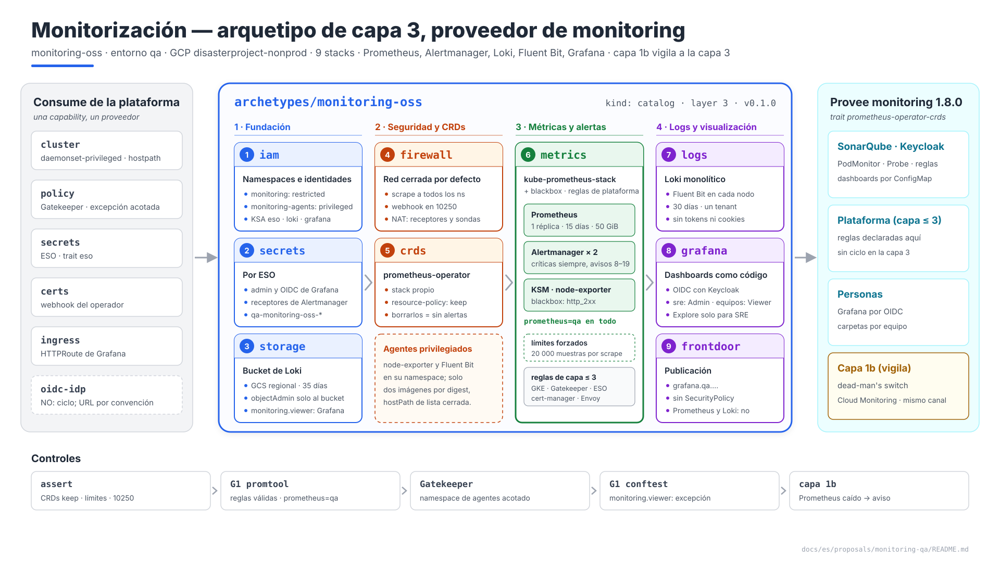

# Monitorización en `qa` — arquetipo `monitoring-oss` (capa 3) y capa 1b

| | |
|---|---|
| **Estado** | Propuesta · revisión 4 |
| **Alcance** | El arquetipo de capa 3 `monitoring-oss` en `qa` (métricas, alertas, logs, dashboards, sondas) y lo que la capa 1b `cloud-monitoring-gcp` aporta junto a él: frontera entre ambos, pila, seguridad, contrato `monitoring`, enrutado de alertas, quién vigila al vigilante, red, stacks, políticas, ejecución y plan |
| **Por qué ahora** | SonarQube (E1 §4.7, E2 §5.9), la variante Cloud SQL (§8), Keycloak (§10) y ESO (§9) ya dan por hechos el selector `prometheus=qa`, el sidecar de dashboards, el blackbox exporter, Loki y el canal de notificación compartido. ESO además dejó aquí las reglas de los componentes de capa 3 |
| **Especificación de referencia** | `archetype-model.md` (AM §n; §3 capa 1b, §4.2 traits de `monitoring`), `terramate-outputs-sharing-architecture.md` (§n), `risk-register.md` |
| **Diagramas** | `diagrams/*.mmd` (fuente Mermaid) y `diagrams/*.svg` (renderizados). El SVG se regenera desde el `.mmd`; no se edita a mano. `diagrams/06-bloques-presentacion.svg` (1920×1080, para presentaciones) se genera con `06-bloques-presentacion.py`, no con Mermaid |
| **Identificadores propios** | Decisiones `DM1…`, riesgos candidatos `RM1…`, verificaciones `VM1…`. Los riesgos reciben número `R54+` en `risk-register.md` si se adopta, detrás de los de las propuestas anteriores |

Nada de este documento reabre decisiones de `CLAUDE.md` ni D7 de E1 (logs con Fluent Bit → Loki).



Fuente: [`diagrams/06-bloques-presentacion.py`](diagrams/06-bloques-presentacion.py) — vista de presentación; el detalle está en §2–§10.

---

## 0. Contexto

| Pregunta | Respuesta | Consecuencia |
|---|---|---|
| Qué es | Arquetipo `monitoring-oss`, `kind: catalog`, **capa 3**, provee **`monitoring` 1.8.0** con el trait `prometheus-operator-crds` | El binding de `qa` ya lo enlaza: `monitoring: { archetype: monitoring-oss, version: 0.1.0, stack_id: gcp-qa-monitoring }` |
| Stacks | 9, `gcp-qa-monitoring-<stack>` en `stacks/platforms/gcp/qa/monitoring/` | Capa 3 vive en `stacks/platforms/` |
| Pila | kube-prometheus-stack (operador, Prometheus, Alertmanager, kube-state-metrics, node-exporter), blackbox exporter, Loki, Fluent Bit, Grafana | E1 §3.3, sin cambios |
| Junto a él | Capa 1b `cloud-monitoring-gcp` (`gcp-qa-cloudmon`): canal de notificación, alertas basadas en logs, vigilancia del propio Prometheus | §1 fija la frontera |
| Tamaño de `qa` | Un cluster regional, ~6–10 nodos, una docena de namespaces | Un solo Prometheus sin federación ni almacenamiento a largo plazo (§3.2) |
| Modelo | `qa` dedicado | Sin budgets de `capacity` aplicados (E1 §0) |



Fuente: [`diagrams/01-contexto.mmd`](diagrams/01-contexto.mmd)

---

## 1. Capa 3 y capa 1b: quién hace qué

AM §3 pone la monitorización nativa de la nube en la **capa 1b**, en paralelo al runtime, y la del cluster en la **capa 3**. En `qa` las dos existen y cada señal tiene un solo dueño:

| Señal | Dueño | Por qué ahí |
|---|---|---|
| Métricas de pods, nodos y aplicaciones; alertas sobre ellas | Capa 3 (Prometheus + Alertmanager) | Es donde están los `PodMonitor` y `PrometheusRule` de los consumidores |
| Logs de las aplicaciones | Capa 3 (Fluent Bit → Loki) | D7 de E1 |
| Métricas de servicios gestionados (Cloud SQL) | Capa 1b, pero **las alertas las crea el stack `data` de cada consumidor** (variante Cloud SQL §8) | Métricas nativas de Cloud Monitoring; nada que operar |
| Logs de auditoría de GCP y sus alertas (secretos, redes autorizadas, KMS) | Capa 1b | No pasan por el cluster; E1 §4.7 |
| **¿Está vivo Prometheus? ¿Y Alertmanager?** | **Capa 1b** (§6) | Si el sistema de alertas cae, no puede avisar de que ha caído |
| Canal de notificación | Capa 1b lo crea y lo publica (`notification_channel_id`); Alertmanager entrega al **mismo destino** | Un solo sitio donde llegan todas las alertas |
| Logs del plano de control y de componentes del sistema de GKE | Cloud Logging (capa 1b) | Los recoge GKE; no hay alternativa en el cluster |

**Lo que deja de estar en Cloud Logging.** GKE se configura con `logging_config.enable_components = ["SYSTEM_COMPONENTS"]`: los logs de las cargas de trabajo van solo a Loki. Enviarlos también a Cloud Logging duplicaría el coste de ingesta sin ganar nada (E1 §3.3: "Cloud Logging reducido a auditoría y plano de control").

**Managed Service for Prometheus desactivado.** GKE Standard activa por defecto la recogida gestionada en clusters nuevos **(verificar en la versión fijada, VM1)**. Con Prometheus propio, dos sistemas recogerían las mismas métricas y se pagaría la ingesta gestionada para no usarla. `monitoring_config.managed_prometheus.enabled = false` en `gcp-qa-gke` (§12).

---

## 2. Por qué `monitoring-oss` y no `monitoring-managed`

AM §4.2 describe dos proveedores de `monitoring`: `monitoring-nodeagent` y `monitoring-managed` (Managed Service for Prometheus, trait `managed-prometheus`). `qa` enlaza un tercero, y la razón es un trait:

| | `monitoring-managed` (GMP) | **`monitoring-oss`** |
|---|---|---|
| CRDs que crean los consumidores | `PodMonitoring`, `Rules` (propios de GMP) | **`PodMonitor`, `PrometheusRule`, `Probe`** (prometheus-operator) |
| ¿Cumple `prometheus-operator-crds`? | **No** | Sí |
| Almacenamiento | Gestionado, 24 meses | PVC, 15 días |
| Coste | Por muestra ingerida; crece con la cardinalidad sin techo propio | Nodos y discos, fijo |
| Alertmanager | Gestionado, configuración limitada | Propio, rutas completas (§5) |
| Logs y dashboards | Aparte (Cloud Logging, Grafana aparte) | Loki y Grafana en la misma pila |

SonarQube (E2 §3) y Keycloak (§11.1 de su propuesta) exigen `monitoring` con `prometheus-operator-crds`: un binding a `monitoring-managed` fallaría en la resolución, que es exactamente para lo que existe el trait. Para cambiar de proveedor habría que cambiar antes los charts de los consumidores, y eso no compensa en `qa`.

---

## 3. La pila

### 3.1 Componentes

| Componente | Réplicas | Recursos (petición = límite de memoria) | Almacenamiento |
|---|---|---|---|
| Operador de Prometheus | 1 | 100m / 256 MiB | — |
| Prometheus | **1** | 1 vCPU / 4 GiB | PVC 50 GiB `standard-rwo` (global `storage_class`), `retention: 15d`, `retentionSize: 45GB` |
| Alertmanager | 2 (clúster gossip) | 50m / 128 MiB | PVC 1 GiB (silencios) |
| kube-state-metrics | 1 | 100m / 256 MiB | — |
| node-exporter | 1 por nodo | 50m / 64 MiB | — |
| blackbox exporter | 1 | 50m / 64 MiB | — |
| Loki (monolítico) | 1 | 500m / 1 GiB | PVC 20 GiB (WAL) + bucket GCS |
| Fluent Bit | 1 por nodo | 100m / 128 MiB | `hostPath` para posiciones |
| Grafana | 1 | 100m / 256 MiB | PVC 5 GiB (SQLite) |

Valores iniciales; se revisan con los datos de la fase 6 de SonarQube.

### 3.2 Lo que no se incluye

| Pieza | Por qué no |
|---|---|
| Segunda réplica de Prometheus | Duplica disco y memoria para cubrir un reinicio de minutos. La caída de Prometheus la detecta la capa 1b (§6), que es lo que importa |
| Thanos o Mimir | Retención larga y consulta global: `qa` no necesita más de 15 días de métricas |
| Tracing (Tempo) | Ninguna aplicación de `qa` emite trazas todavía; se añade cuando alguna lo haga, con el trait `otlp-native` |
| Loki escalable (lectura/escritura separadas) | El volumen de `qa` cabe en un monolítico |

### 3.3 Límites que protegen a Prometheus de sus consumidores

Un `PodMonitor` que expone métricas con una etiqueta de alta cardinalidad (un ID de usuario, una URL con parámetros) puede dejar a Prometheus sin memoria, y con él todas las alertas de `qa` (RM2).

| Límite | Valor | Efecto |
|---|---|---|
| `enforcedSampleLimit` | 20 000 muestras por scrape | Un target que lo supera se descarta entero y salta `TargetScrapeSampleLimit` |
| `enforcedLabelLimit` / `enforcedLabelValueLengthLimit` | 30 / 200 | Etiquetas absurdas descartadas |
| `enforcedTargetLimit` | 50 por `PodMonitor` | Un selector demasiado amplio no multiplica targets |
| `promtool check rules` | Puerta de CI | Una regla mal escrita falla en la PR, no al cargarla (§11.2) |

---

## 4. Seguridad

### 4.1 Dos namespaces



Fuente: [`diagrams/04-namespaces.mmd`](diagrams/04-namespaces.mmd)

node-exporter necesita `hostPID`, `hostNetwork` y `/proc`, `/sys` del nodo; Fluent Bit necesita leer `/var/log` y escribir sus posiciones en el nodo. Ninguno cabe en PSS `restricted`, ni siquiera en `baseline`. En vez de relajar todo el namespace:

| Namespace | PSS | Contenido |
|---|---|---|
| `monitoring` | `restricted` | Todo lo demás |
| `monitoring-agents` | `privileged` | node-exporter y Fluent Bit, nada más |

Gatekeeper acota la excepción: en `monitoring-agents` solo se admiten las dos imágenes por digest, sin `privileged: true`, con `hostPath` de una lista cerrada (solo lectura salvo `/var/lib/fluent-bit`). Es la exención por nombre que E1 §4.2 exige frente a relajar un constraint para todo el entorno. Por eso el arquetipo requiere `cluster` con los traits **`daemonset-privileged`** y **`hostpath`**, como `monitoring-nodeagent` en AM §4.2.

### 4.2 Accesos

| Quién | Qué ve | Cómo |
|---|---|---|
| Personas con rol `sre` | Todo: Grafana como Admin, Explore sobre métricas y logs | OIDC con Keycloak |
| Equipos (`team-*`) | Dashboards de su equipo; **sin Explore** | OIDC; carpetas de Grafana por equipo |
| Prometheus, Alertmanager, Loki | No publicados | `kubectl port-forward` (SRE) |
| Grafana a Cloud Monitoring | Métricas del proyecto, solo lectura | KSA `grafana` con `roles/monitoring.viewer` a nivel de proyecto (§11.2, excepción justificada) |

**Logs en un solo tenant de Loki** (DM4). Loki multi-tenant por equipo exigiría que Fluent Bit etiquete el tenant, un datasource por equipo y cabeceras por usuario. En `qa` se opta por un solo tenant y por **quitar Explore a los equipos**: un panel de logs en el dashboard de un equipo filtra por sus namespaces, pero nadie fuera de SRE consulta Loki libremente. Queda el riesgo de que un log contenga un dato sensible de otro equipo (RM3); Fluent Bit elimina las cabeceras `Authorization`, `Cookie` y los patrones de token conocidos antes de enviar.

### 4.3 Grafana y Keycloak sin arista hacia arriba

Grafana hace login con OIDC contra Keycloak, pero Keycloak (capa 4) requiere `monitoring` (capa 3). Si `monitoring-oss` requiriera `oidc-idp`, habría un ciclo. Así se evita:

| Pieza | Cómo |
|---|---|
| URLs de Keycloak | Por convención del entorno: `https://sso.<dns_suffix>/realms/<env>`, lo mismo que publica el contrato `oidc-idp` (§11.3 de Keycloak). Un assert en `keycloak` comprueba que su hostname y su realm siguen la convención |
| Cliente OIDC de Grafana | Lo declara el stack `realm` de Keycloak como cliente de plataforma (§6.6 de Keycloak) |
| Secreto del cliente | `qa-monitoring-oss-grafana-oidc`, creado por el stack `secrets` de este arquetipo con `secretAccessor` para el principal de `keycloak-config` (§6.5 de Keycloak). El principal se puede conceder antes de que exista el KSA |
| Antes de que exista Keycloak | Grafana arranca; el login OIDC falla hasta entonces. Cuenta local `admin` (`qa-monitoring-oss-grafana-admin`) como break-glass |
| Grupos → roles | Claim `groups` (atributo `entra_roles`, §5.3 de Keycloak): `sre` → Admin, `team-*` → Viewer en su carpeta |

La convención acopla dos arquetipos sin que el resolver lo vea (RM6). Es el precio de evitar el ciclo, y queda cubierto por el assert y por VM7.

---

## 5. Alertas



Fuente: [`diagrams/03-alertas.mmd`](diagrams/03-alertas.mmd)

### 5.1 Reglas

| Origen | Quién las escribe | Ejemplos |
|---|---|---|
| Cada arquetipo de capa 4–5 | Su stack `observability` (`PrometheusRule` con `prometheus=qa`) | Cola del CE de SonarQube, errores de broker de Keycloak |
| Componentes de capa ≤ 3 | **Este arquetipo** (ESO §9.1): una capability de capa 3 no requiere `monitoring`, así que sus reglas viven aquí | GKE (nodos, PVC, `OOMKilled`), Gatekeeper, cert-manager (certificados < 14 días), ESO (`ExternalSecret` sin `Ready`), Envoy Gateway |
| La propia monitorización | Este arquetipo | Targets caídos, `TargetScrapeSampleLimit`, Loki sin ingesta, Fluent Bit con reintentos, disco de Prometheus > 80 % |
| **Watchdog** | kube-prometheus-stack | Siempre disparada; sirve para comprobar que la cadena funciona (§6) |

### 5.2 Rutas de Alertmanager

| Ruta | Condición | Destino | Horario |
|---|---|---|---|
| Crítica | `severity=critical` | Canal SRE | Siempre. En `qa` son pocas: pérdida de datos o de acceso (backup fallido, BD caída, credencial de Entra a punto de caducar) |
| Aviso | `severity=warning` | Canal SRE | Días laborables 08:00–19:00; fuera de ese horario se agrupan y se entregan al empezar el siguiente |
| Equipo | `team=<equipo>` (de la etiqueta del namespace) | **También** el canal del equipo | El de su severidad |
| Identidad | `team=identity` | Equipo de identidad | Caducidad de la credencial de Keycloak en Entra (R42) |
| Watchdog | `alertname=Watchdog` | Receptor nulo | — (§6) |

**En `qa` nada despierta a nadie.** No hay guardia. El destino concreto de cada canal (SRE, equipos, identidad) **no lo fija esta propuesta**: es configuración del despliegue, y el diseño no depende de él. Las credenciales de los receptores (URL de webhook, SMTP, según el destino) son secretos de Secret Manager llevados por ESO (§8.2).

Inhibiciones: `NodeNotReady` inhibe las alertas de los pods de ese nodo; `KubeAPIDown` inhibe las de todo lo que depende del API server.

---

## 6. Quién vigila al vigilante

Si Prometheus o Alertmanager caen, no sale ninguna alerta, **tampoco la que diría que han caído** (RM1). La vigilancia tiene que estar fuera de la pila:

| Mecanismo | Dónde | Qué detecta |
|---|---|---|
| **Dead-man's switch en Cloud Monitoring** | Capa 1b | Política de alerta sobre las métricas de sistema que GKE ya recoge de cada contenedor: ausencia de los contenedores `prometheus` o `alertmanager` en `monitoring` durante 10 min, o reinicios repetidos. Notifica por el canal de la capa 1b, que no pasa por Alertmanager **(verificar la métrica y la condición de ausencia, VM4)** |
| Watchdog | Capa 3 | Hoy va a un receptor nulo. Si más adelante se contrata un servicio externo de heartbeat, el Watchdog se envía allí y detecta también un Prometheus vivo pero que no evalúa reglas |

El dead-man's switch no ve un Prometheus en marcha que no evalúa reglas o un Alertmanager que no consigue entregar. Para `qa` se acepta; el heartbeat externo queda como mejora (DM6).

---

## 7. Logs

| Paso | Diseño |
|---|---|
| Recogida | Fluent Bit (DaemonSet en `monitoring-agents`) lee `/var/log/containers`; añade `namespace`, `pod`, `container` y las etiquetas `app.kubernetes.io/*` y `archetype` |
| Procesado | Parsea JSON cuando la línea lo es (SonarQube, Keycloak, ESO la emiten así); elimina cabeceras sensibles y patrones de token; descarta las comprobaciones de salud de los probes |
| Envío | Salida `loki` al Service `loki.monitoring:3100` |
| Almacenamiento | Loki monolítico; chunks en `gs://disasterproject-qa-loki` (regional `europe-west1`, acceso uniforme, sin acceso público), por Workload Identity con `objectAdmin` **solo en ese bucket** |
| Retención | **30 días** con el compactor de Loki; regla de ciclo de vida del bucket a 35 días como red de seguridad. Sin retention lock ni versionado: impedirían que el compactor borre (mismo motivo que E1 §4.9) |
| Etiquetas | Solo las de baja cardinalidad como etiquetas de Loki (`namespace`, `container`, `archetype`); el resto, en el contenido de la línea |

---

## 8. Contrato, secretos y red

### 8.1 Contrato `monitoring` 1.8.0

| Salida | Valor en `qa` | Uso |
|---|---|---|
| `namespace` | `monitoring` | Selectores de `NetworkPolicy` en los consumidores (entrada desde Prometheus) |
| `rules_selector` | `{ prometheus = "qa" }` | Etiqueta obligatoria en `PodMonitor`, `ServiceMonitor`, `Probe` y `PrometheusRule` (E2 §4.1 ya la usa como global) |
| `dashboard_label` | `{ grafana_dashboard = "1" }` | Etiqueta del `ConfigMap` de dashboard que recoge el sidecar de Grafana |
| `prober_url` | `blackbox-exporter.monitoring.svc:9115` | Campo `prober` de los `Probe` |
| `probe_modules` | `http_2xx`, `http_2xx_internal_ca` | El segundo confía en la CA interna, para sondas contra Services con TLS interno (Keycloak §10) |

Todas deterministas: salidas del contrato que los consumidores reciben como globals. Versión **1.8.0**, la misma que publica `monitoring-managed` en `demos` (AM §7): es la versión del contrato, no del proveedor.

### 8.2 Secretos

| Secreto | Consumidor | Nota |
|---|---|---|
| `qa-monitoring-oss-grafana-admin` | Grafana | Break-glass (§4.3) |
| `qa-monitoring-oss-grafana-oidc` | Grafana y el reconciliador de Keycloak | IAM para `eso-monitoring-oss` y para `keycloak-config` (lista de lectores explícitos de ESO §9.2). El cliente de plataforma de Grafana en el realm (§6.6 de Keycloak) lo referencia con `secretRef` |
| `qa-monitoring-oss-alertmanager-receivers` | Alertmanager | URL del webhook del chat y credenciales SMTP, en JSON |

Todo por ESO con el KSA `eso-monitoring-oss` (ESO §5.2); los nombres siguen el prefijo `qa-<arquetipo>-` que exige ESO §5.2. **Requiere `secrets` con el trait `eso`.**

### 8.3 Red



Fuente: [`diagrams/05-red.mmd`](diagrams/05-red.mmd)

| Origen | Destino | Puerto | Nota |
|---|---|---|---|
| Plano de control de GKE | Webhook del operador | **10250** | kube-prometheus-stack usa ese puerto precisamente por los nodos privados de GKE (como ESO §7). Certificado de cert-manager |
| Envoy | Grafana | 3000 | Única ruta publicada |
| Prometheus | Pods de todos los namespaces | Puertos de métricas | La entrada la autoriza cada consumidor en su `NetworkPolicy` (E1 §4.8) |
| Prometheus | node-exporter | 9100 | Red del host |
| Fluent Bit | Loki | 3100 | |
| Grafana | Prometheus, Loki | 9090, 3100 | |
| Grafana | Keycloak | 8443 | Back-channel OIDC por el Service interno (§8.3 de Keycloak) |
| Loki, Grafana | `storage` / `monitoring.googleapis.com` vía Private Google Access | 443 | |
| Alertmanager, blackbox | Internet vía Cloud NAT | 443 (y 587 si SMTP) | Receptores y sondas contra las URLs públicas |

---

## 9. Publicación de Grafana

| Elemento | Valor |
|---|---|
| Hostname | `grafana.qa.disasterproject.com` — claim en el ledger |
| `HTTPRoute` | Todo el host hacia Grafana; **sin `SecurityPolicy`**: Grafana hace su propio OIDC porque necesita la identidad para sus roles |
| Rutas no publicadas | Prometheus, Alertmanager, Loki |
| Anónimos | Prohibidos; sin dashboards públicos ni snapshots externos |

---

## 10. El arquetipo

### 10.1 Manifiesto

```yaml
# archetypes/monitoring-oss/manifest.yaml
apiVersion: archetype/v1
kind: Archetype

metadata:
  name: monitoring-oss
  version: 0.1.0
  layer: 3
  kind: catalog
  description: kube-prometheus-stack, Loki, Fluent Bit, blackbox y Grafana; reglas de los componentes de plataforma
  owners: [team-platform]

runtimes: [gke, eks, aks]

requires:
  - capability: cluster
    version: "^2.0.0"
    traits: [daemonset-privileged, hostpath]        # node-exporter y Fluent Bit (§4.1)
  - capability: policy
    version: "^1.0.0"
  - capability: secrets
    version: "^2.0.0"
    traits: [eso]
  - capability: certs
    version: "^1.0.0"
    traits: [cert-manager]
  - capability: ingress
    version: ">=3.0.0 <4.0.0"
    traits: [gateway-api, http-route]
  # oidc-idp NO: Keycloak requiere monitoring; la URL va por convención (§4.3)

provides:
  - capability: monitoring
    version: 1.8.0
    traits: [prometheus-operator-crds]
    outputs:
      - { name: namespace,       from: metrics }
      - { name: rules_selector,  from: metrics }
      - { name: dashboard_label, from: grafana }
      - { name: prober_url,      from: metrics }
      - { name: probe_modules,   from: metrics }

stacks:
  - name: iam
  - name: secrets
    after: [iam]
  - name: storage
    after: [iam]
  - name: firewall
    after: [iam]
  - name: crds
    after: [iam]
  - name: metrics
    after: [secrets, firewall, crds]
  - name: logs
    after: [storage, firewall]
  - name: grafana
    after: [secrets, metrics, logs]
  - name: frontdoor
    after: [grafana]

claims:
  - kind: hostname
    pool: "{{ environment.dns_zone }}"
    value: "grafana.{{ environment.dns_suffix }}"

capacity:
  cpu_millicores: 3000
  memory_mib: 8192
  pvc_gib: 80
  ingress_routes: 1
  workload_identities: 3                              # eso-monitoring-oss, loki→GCS, grafana→Cloud Monitoring
```

`runtimes: [gke, eks, aks]`: la pila es la misma; solo cambian el bucket de Loki (GCS, S3, Blob) y la identidad, ramas del generador `storage`.

### 10.2 Los stacks



Fuente: [`diagrams/02-stacks-arquetipo.mmd`](diagrams/02-stacks-arquetipo.mmd)

| Stack | Contenido | Entradas por sharing |
|---|---|---|
| `iam` | Namespaces `monitoring` (`restricted`; etiquetas `trust.disasterproject.com/internal-ca: "true"` y `gateway.disasterproject.com/routes: "true"` y anotación `gateway.disasterproject.com/hostnames: grafana.qa.disasterproject.com`, E2 §5.1) y `monitoring-agents` (`privileged`; `trust.disasterproject.com/internal-ca: "true"`, sin etiqueta de rutas porque no publica ninguna); KSAs `eso-monitoring-oss`, `loki`, `grafana` | `cluster_*` |
| `secrets` | §8.2: contenedores, IAM por secreto, `SecretStore` y `ExternalSecret` | `cluster_*`, `workload_identity_pool` |
| `storage` | Bucket de Loki, ciclo de vida, `objectAdmin` para `loki`; `monitoring.viewer` para `grafana` | `workload_identity_pool` |
| `firewall` | §8.3 | `cluster_*` |
| `crds` | CRDs de prometheus-operator con `helm.sh/resource-policy: keep` | `cluster_*` |
| `metrics` | Operador, Prometheus, Alertmanager, kube-state-metrics, node-exporter, blackbox; reglas de plataforma (§5.1); constraints de Gatekeeper de `monitoring-agents` | `cluster_*` |
| `logs` | Loki y Fluent Bit | `cluster_*` |
| `grafana` | Grafana, datasources (Prometheus, Loki, Cloud Monitoring), OIDC, carpetas por equipo, dashboards de plataforma | `cluster_*` |
| `frontdoor` | `HTTPRoute` de Grafana | `cluster_*` |

**CRDs en su propio stack con `keep`.** Borrar el CRD `PrometheusRule` borra todas las reglas de todos los arquetipos, y `PodMonitor` todos los scrapes: `qa` se quedaría sin alertas sin que nada falle (RM5). Stack aparte para que un upgrade de la pila no toque los CRDs sin un PR explícito.

### 10.3 La capa 1b en `qa` (`gcp-qa-cloudmon`)

| Recurso | Nota |
|---|---|
| Canales de notificación, con el destino que se configure al desplegar (§16) | Salida `notification_channel_id` (variante Cloud SQL §8) |
| Alertas basadas en logs | Lectura de secretos fuera de la lista (ESO §9.2), cambios en redes autorizadas fuera del servicio intermedio (E1 §4.13), destrucción de versiones de clave KMS (E1 §4.14) |
| Dead-man's switch | §6 |
| *Data Access audit logs* | Activados para Secret Manager y Cloud KMS; no para el resto (coste) |

---

## 11. Políticas

### 11.1 `assert` en generación

```hcl
assert {
  assertion = global.monitoring_values.crds.annotations["helm.sh/resource-policy"] == "keep"
  message   = "monitoring: los CRDs de prometheus-operator llevan resource-policy keep (RM5)"
}
assert {
  assertion = global.monitoring_values.prometheus.enforcedSampleLimit > 0
  message   = "monitoring: Prometheus sin límite de muestras por scrape queda expuesto a la cardinalidad de cualquier consumidor (RM2)"
}
assert {
  assertion = global.monitoring_values.prometheusOperator.tls.internalPort == 10250
  message   = "monitoring: webhook del operador en 10250; otro puerto necesita una regla de firewall hacia los nodos"
}
```

### 11.2 CI y admisión

| Regla | Dónde | Qué comprueba |
|---|---|---|
| **Nueva:** reglas válidas | G1 | `promtool check rules` sobre todas las `PrometheusRule` renderizadas de los charts de la PR |
| **Nueva:** etiqueta del selector | G1 y Gatekeeper | Todo `PodMonitor`, `ServiceMonitor`, `Probe` y `PrometheusRule` lleva `prometheus=qa`; sin ella, Prometheus lo ignora en silencio |
| **Nueva:** excepción de IAM de proyecto | G1 | La regla "IAM de proyecto solo con condición de recurso" (variante Cloud SQL §10.2) admite una excepción nombrada: `roles/monitoring.viewer` para el principal de `grafana`. Es de solo lectura y no admite binding por recurso |
| **Nueva:** namespace de agentes | Gatekeeper | En `monitoring-agents`, solo las dos imágenes por digest, sin `privileged: true`, `hostPath` de la lista cerrada |
| Existentes | — | PSS `restricted` en `monitoring`; etiquetas obligatorias; registros permitidos |

---

## 12. Requisitos a otros arquetipos

| Arquetipo / stack | Requisito |
|---|---|
| `gcp-qa-gke` | `logging_config.enable_components = ["SYSTEM_COMPONENTS"]`; `monitoring_config` con `SYSTEM_COMPONENTS` y **`managed_prometheus.enabled = false`** (§1) |
| `cloud-monitoring-gcp` (`gcp-qa-cloudmon`) | §10.3 |
| `keycloak` | Assert de convención de hostname y realm (§4.3); cliente de plataforma de Grafana (ya en §6.6 de su propuesta) |
| Todos los consumidores | Etiqueta `prometheus=qa`; entrada desde `monitoring` en su `NetworkPolicy`; etiquetas `archetype` y `team` en el namespace para el enrutado (§5.2) |

Requisitos **aceptados**. El de `gcp-qa-gke` queda recogido en E1 §4.1 y el assert de convención en la propuesta de Keycloak (§12.1).

---

## 13. Ejecución

| Qué | Cómo |
|---|---|
| Primer despliegue | Fase B de E1 §6: después de `gcp-qa-secrets` y antes de Keycloak y de cualquier arquetipo de capa 4–5. Criterio de salida: el Watchdog llega al receptor nulo, una alerta de prueba llega al canal SRE y el dead-man's switch salta al escalar Prometheus a 0 |
| Upgrade de kube-prometheus-stack | Los CRDs primero, en su stack; luego `metrics`. Ensayo en un entorno efímero |
| Pérdida del PVC de Prometheus | Se pierden hasta 15 días de métricas; las alertas vuelven en cuanto arranca. Aceptado en `qa` |
| Pérdida del bucket de Loki | `prevent_destroy` en el bucket; soft delete de GCS de 7 días |

---

## 14. Decisiones

| # | Decisión | Estado | Recomendación | Alternativa |
|---|---|---|---|---|
| DM1 | Proveedor de `monitoring` | Heredada de E1 §3.3 | `monitoring-oss` | `monitoring-managed` (GMP): no cumple `prometheus-operator-crds` |
| DM2 | Namespaces | Propuesta | `monitoring` (`restricted`) + `monitoring-agents` (`privileged`, acotado) | Un solo namespace `privileged` |
| DM3 | Prometheus | Propuesta | 1 réplica, 15 días, sin almacenamiento a largo plazo | 2 réplicas; Thanos |
| DM4 | Logs | Propuesta | Loki monolítico sobre GCS, un tenant, sin Explore para los equipos | Multi-tenant por equipo |
| DM5 | Notificación | Propuesta | Sin guardia en `qa`; críticas siempre, avisos en horario laboral | Guardia |
| DM6 | Vigilancia de la vigilancia | Propuesta | Dead-man's switch en Cloud Monitoring | Heartbeat externo del Watchdog (mejora posterior) |
| DM7 | Grafana ↔ Keycloak | Propuesta | Convención de URL + assert en Keycloak; sin requisito `oidc-idp` | Requisito: ciclo |
| DM8 | Recogida gestionada de GKE | Propuesta | Desactivada | Dejarla: doble recogida y coste |
| DM9 | Protección de Prometheus | Propuesta | Límites forzados por scrape + `promtool` en CI | Confiar en los consumidores |
| DM10 | Reglas de capa ≤ 3 | Heredada de ESO DE8 | En este arquetipo | En cada arquetipo de capa 3: ciclo |

---

## 15. Riesgos candidatos

| # | Riesgo | Probabilidad | Impacto | Mitigación |
|---|---|---|---|---|
| RM1 | **Prometheus o Alertmanager caídos** y nadie se entera | Media | Alta — `qa` sin alertas | Dead-man's switch en la capa 1b (§6); VM4 |
| RM2 | **Explosión de cardinalidad** de un consumidor deja a Prometheus sin memoria | Media | Alta | Límites forzados (§3.3); alerta `TargetScrapeSampleLimit` |
| RM3 | **Logs con datos sensibles visibles** para otros equipos | Media | Media | Sin Explore para equipos; redacción en Fluent Bit; VM8 |
| RM4 | **Abuso del namespace privilegiado** para ejecutar otra cosa | Baja | Alta — acceso al nodo | Gatekeeper: imágenes por digest y `hostPath` cerrado |
| RM5 | **Borrado de los CRDs** de prometheus-operator elimina todas las reglas y scrapes | Baja | Alta — silencio total | `keep`, stack propio, assert |
| RM6 | **La convención Grafana → Keycloak diverge** (otro hostname o realm) | Baja | Media — Grafana sin login OIDC | Assert en Keycloak; VM7 |
| RM7 | **Doble recogida** con la recogida gestionada de GKE activa | Media por defecto | Baja — coste | `managed_prometheus.enabled = false`; VM1 |

---

## 16. Verificaciones

| # | Verificación | Resultado que la cierra |
|---|---|---|
| VM1 | Recogida gestionada desactivada en la versión fijada de GKE | Ninguna métrica de Managed Service for Prometheus facturada en el proyecto tras 24 h |
| VM2 | node-exporter y Fluent Bit admitidos en `monitoring-agents`; el resto, en `restricted` sin exenciones | Pods admitidos; un pod extra en `monitoring-agents` rechazado |
| VM3 | Webhook del operador en 10250 con certificado de cert-manager | `apply` de una `PrometheusRule` sin timeout |
| VM4 | Métrica de sistema y condición de ausencia del dead-man's switch | Alerta en el canal SRE a los 10 min de escalar Prometheus a 0 |
| VM5 | `enforcedSampleLimit` con un target ruidoso de prueba | Target descartado y `TargetScrapeSampleLimit` disparada |
| VM6 | Retención de Loki | Chunks de más de 30 días desaparecen del bucket |
| VM7 | Login en Grafana con Keycloak y roles por grupo | `sre` entra como Admin; `team-x` ve solo su carpeta y no tiene Explore |
| VM8 | Redacción en Fluent Bit | Una línea con `Authorization: Bearer …` llega a Loki sin el token |
| VM9 | Rutas de Alertmanager | Alerta con `team=identity` en el canal de identidad; `warning` fuera de horario, retenida hasta la mañana |

**Fuera de alcance: el destino de las notificaciones.** Qué grupo de correo, espacio de chat o canal reciben las alertas del equipo SRE, de cada equipo y del equipo de identidad no se decide aquí. Alertmanager lee sus receptores del secreto `qa-monitoring-oss-alertmanager-receivers` y la capa 1b crea los canales de Cloud Monitoring con el destino que se configure al desplegar; cambiarlo no cambia ningún stack ni ninguna regla.

---

## 17. Plan de implementación

| Fase | Contenido | Criterio de salida | Estimación |
|---|---|---|---|
| **0 · Prerrequisitos** | GKE con los ajustes de §12; ESO; destinos de notificación configurados (§16); VM1, VM3 | Verificaciones cerradas | Depende de la plataforma |
| **1 · Esqueleto** | Manifiesto, charts, asserts, reglas de CI y constraints | `archetypectl resolve --dry-run`, `terramate generate --check`, G1 y preview con mocks en verde | 2 días |
| **2 · Métricas y alertas** | `iam`, `secrets`, `firewall`, `crds`, `metrics`; capa 1b | Watchdog y alerta de prueba entregados; **VM2**, **VM4**, **VM5**, **VM9** | 3 días |
| **3 · Logs** | `storage`, `logs` | Logs de todos los namespaces en Loki; **VM6**, **VM8** | 2 días |
| **4 · Grafana** | `grafana`, `frontdoor` | Login con cuenta local; dashboards de plataforma; **VM7** cuando exista Keycloak | 2 días |

Algo más de dos semanas para una persona. Va en la fase B, antes que Keycloak y SonarQube, que crean sus `PodMonitor` y `PrometheusRule` contra estos CRDs.
