# Múltiples entornos, en regiones distintas — un entorno es su binding

| | |
|---|---|
| **Estado** | Propuesta · revisión 2 · jurisdicción sin residencia, árbol emitido, nombres acotados, ninguna lista a mano, clave de estado por id, federación atada a `main` (§1, §3, §4, §7, DX8, DX9); revisión 1: el entorno es su binding |
| **Alcance** | Cómo la plataforma sostiene N entornos que **no son copias** unos de otros: composición, proveedores, tamaño, región y jurisdicción distintos. Qué se escribe a mano por entorno y qué se deriva; qué puede variar y qué no; cómo se nombran; qué es regional, qué es de la jurisdicción y qué es global; qué cambia en la landing zone; cómo se comprueba la ubicación; y cómo se introduce la derivación sin tocar `qa` |
| **Por qué ahora** | Las propuestas de `qa` describen un entorno. El segundo entorno, en otra región y con otra composición, es el que demuestra si el modelo de arquetipos generaliza o si `qa` estaba escrito a mano con forma de plantilla. Tres cosas del diseño solo funcionaban con un entorno (§3, §6) |
| **Base** | AM §7 (binding), §9 (pools), §12 (resolución); arquitectura §4.11 (primer despliegue), §12 (gestión de entornos), §13.3–§13.4 (G1, G3); `landing-zone-qa` §2–§6; `gatekeeper-qa` P2, P12; `network-qa` DW8. No se repite lo que ya está allí |
| **Especificación de referencia** | `archetype-model.md` (AM §n), `terramate-outputs-sharing-architecture.md` (§n), `risk-register.md` |
| **Diagramas** | `diagrams/*.mmd` (fuente Mermaid) y `diagrams/*.svg` (renderizados). El SVG se regenera desde el `.mmd`; no se edita a mano |
| **Identificadores propios** | Decisiones `DX1…`, riesgos candidatos `RX1…`, verificaciones `VX1…` |

No reabre ninguna decisión de `CLAUDE.md`: `prod` sigue con su proyecto, los no productivos comparten uno — ahora uno **por jurisdicción** —, un proveedor por capacidad y entorno. Encuentra cuatro cosas:

1. **Un fallo en una regla de G1.** `terramate.order` sacaba el entorno del id del stack con `split(id, "-")[1]`. Con un entorno `sandbox` y otro `sandbox-eu`, bien cableados, da dos falsos positivos (medido con conftest 0.70.1); con cualquier `ephemeral-*`, siempre. El entorno nunca se extrae de un id (§3).
2. **Los prefijos sin separador confunden entornos y regiones.** `sandbox-` es prefijo de `sandbox-eu-`: P12, la condición IAM de `network-qa` DW8 y la regla `terraform.own_network` darían a `sandbox` las KSA y las zonas de `sandbox-eu`. `europe-west1` es prefijo de `europe-west10`. Los nombres de entorno son libres de prefijo, y toda comparación de prefijo lleva su separador (§3).
3. **Una contradicción en la landing zone.** El registro de imágenes estaba en `europe-docker.pkg.dev`, una ubicación multirregión que la propia org policy `gcp.resourceLocations` (`in:europe-west1-locations`) prohíbe; la plantilla de réplica usaba `europe-west1`. Pasa a un repositorio regional por región de entorno (§6).
4. **La región no basta: hace falta la jurisdicción.** Si un entorno está en otra región porque sus datos deben quedarse en otro territorio, compartir proyecto y bucket de estado con los demás convierte la residencia en una cuestión de cuidado. La jurisdicción pasa a ser un atributo del binding, con su carpeta, su proyecto no productivo y su bucket de estado (§4).



Fuente: [`diagrams/01-jurisdictions.mmd`](diagrams/01-jurisdictions.mmd)

---

## 0. Contexto

| Lo que ya existe | Dónde | Lo que no resolvía |
|---|---|---|
| El binding elige arquetipo, versión y proveedor por capacidad y entorno | AM §7 | Nada sobre región más allá de `metadata.region`, y nada sobre residencia |
| El resolver calcula el conjunto concreto de stacks, los claims y el orden, y emite `binding.tm.hcl` | AM §12 | Los nombres que no son claims (rangos, zonas, NEG, `GatewayClass`, clave de estado) quedaban escritos a mano en la configuración de cada entorno |
| La landing zone descubre los entornos en `environments/*/binding.yaml` | `landing-zone-qa` §5, arquitectura §4.11 0b | Una sola región: claves, registro, bucket y `resourceLocations` en `europe-west1` |
| `own_network` mantiene los recursos de red de un entorno en su VPC | `network-qa` DW8 | La ubicación de los recursos regionales no la comprueba nadie |

---

## 1. Un entorno es su binding (DX1)

Lo único escrito a mano por entorno es `environments/<env>/binding.yaml`. Todo lo demás es salida: del resolver (`binding.tm.hcl`, ledger, `resolution.json`) o de una derivación común, `imports/platform/environment.tm.hcl`, que lee `global.env`, `global.region` y el binding.

| Qué | Origen | Ejemplo en `qa` |
|---|---|---|
| Composición, versiones, proveedor de cada capacidad, ids de stack de plataforma | Binding (`bindings.*`) | `database-platform: postgres-cloudsql` |
| Región, jurisdicción, proyecto, nivel (`prod`/`nonprod`) | Binding (`metadata`, `platform`) | `europe-west1`, `eu`, `disasterproject-nonprod` |
| Rangos CIDR | Ledger, por claim (AM §9); literales en los globals, comparados con el ledger en G1 (`network-qa` DW9) | `10.4.144.0/21` |
| Tamaño, capacidades, modo de Gatekeeper | Binding | `max_nodes`, `capacity.*`, `policy.*` |
| Nombres de recursos que no son claims | **Derivación**, de `global.env` | `qa-psa`, `qa-internal`, `qa-pods`, `eg-qa-neg`, `envoy-qa`, `qa-edge` |
| Zonas de la región | Derivación de `global.region`, con el `assert` de tres zonas | `europe-west1-b`, `-c`, `-d` |
| Key ring del entorno y clave de estado | Derivación: `<env>` en la región del entorno (§6) | `keyRings/qa` en `europe-west1` |
| Registros admitidos por P2 | Derivación: los repositorios de la región del entorno (§6) | `europe-west1-docker.pkg.dev/disasterproject-lz/{apps,third-party}/` |
| Prefijos ajenos de P12 | Derivación: los demás bindings **del mismo proyecto** | `dev-`, `demos-`, `sandbox-` |
| Ids de stack de instancia (`keycloak_data_stack_id`…) | El `binding.tm.hcl` de la instancia | `gcp-qa-keycloak-main-data` |
| Clave del estado de cada stack | Derivación: `<env>/<stack id>`, **nunca la ruta del stack** (DX8) | `qa/gcp-qa-network` |

**Composición distinta, árbol distinto.** Un entorno solo tiene los stacks de lo que enlaza: un `sandbox` sin `sonarqube` no tiene stacks de SonarQube, no tiene su cliente SAML y no tiene sus secretos. Dos consecuencias para quien escribe arquetipos:

- **Un módulo de plataforma no conoce a sus consumidores.** El realm de Keycloak no crea el cliente de SonarQube: lo declara SonarQube como recurso del tenant (`keycloak-qa` §6). Un módulo que nombra a un consumidor convierte a ese consumidor en obligatorio en todos los entornos.
- **El árbol de stacks se emite, nunca se copia.** Lo emite el resolver desde el binding y los `stacks[]` de los manifiestos (AM §12, pasos 9 y 17). Un andamiaje que copia los `stack.tm.hcl` de otro entorno y reescribe `"qa"` por `"<env>"` falla por exceso y por defecto (`qa.internal`, prefijos dentro de valores, `ksa_prefix`) y diverge del original con cada cambio posterior (RX5).
- **Un contrato nunca lleva un `from_stack_id` literal.** Lee `global.platform.*_stack_id` (AM §7, "late binding"). Una regla de G1 falla con `from_stack_id = "<cloud>-` en `imports/`.

**Ningún valor por defecto es el de un entorno real (DX2).** Un chart con `gatewayClassName: envoy-qa` por defecto funciona en `qa` aunque el generador no pase el valor, y en el segundo entorno crea silenciosamente un `envoy-qa`. Los defaults de charts y módulos son marcadores neutros (`envoy`, `gateway`, `eg-neg`, `internal`) o no existen; el generador pasa siempre el valor derivado. Un override que falta se ve en el primer entorno, no en el segundo.

---

## 2. Qué puede variar entre entornos

| Eje | Declarado en | ¿Varía por entorno? | Consecuencia |
|---|---|---|---|
| Composición (qué arquetipos) | `bindings` | Sí | Árbol de stacks distinto; la paridad es "mismos generadores", no "mismos stacks" |
| Proveedor de cada capacidad | `bindings.<cap>.archetype` | Sí, uno por capacidad (`CLAUDE.md`) | `postgres-cloudsql` en `qa`, `postgres-operator` donde se elija |
| Versión de cada arquetipo | `bindings.<cap>.version` | Sí | Es lo que permite promover una versión entre entornos |
| Región | `metadata.region` | Sí, dentro de su jurisdicción | §4–§6 |
| Jurisdicción | `metadata.jurisdiction` | Sí | Carpeta, proyecto no productivo y bucket de estado (§4) |
| Proyecto | `platform.project_id` | Determinado por jurisdicción y nivel | G1 lo comprueba (§5) |
| Tamaño y capacidades | `cluster`, `capacity` | Sí | — |
| Pools de nodos | `cluster.node_pools` | Su tamaño sí; **los dos pools, no** | `system` y `apps` existen siempre (`CLAUDE.md`, `gke-qa` DN11): el generador lleva las capas 2b y 3 a `system`, y Keycloak (capa 4) corre en `apps`. Un entorno sin aplicaciones de capa 5 reduce `apps`, no lo elimina |
| Exposición, modo de Gatekeeper, caducidad | `policy`, manifiestos | Sí | Arquitectura §13.7 |
| Convenciones de nombre, contratos, generadores, reglas de G1/G3 | La plataforma | **No** | Si un entorno necesita otra convención, es otra plataforma |

---

## 3. Nombres (DX3)

| Regla | Por qué | Comprobación |
|---|---|---|
| **Los nombres de entorno son libres de prefijo**: ningún `<a>-` es prefijo de `<b>-` (`sandbox` y `sandbox-eu` no pueden coexistir; `ephemeral-pr12` y `ephemeral-pr123` sí, porque `ephemeral-pr12-` no es prefijo de `ephemeral-pr123-`; no existe un entorno llamado `ephemeral`) | El prefijo `<env>-` es una frontera de seguridad en el proyecto compartido: KSA y Workload Identity (P12), zonas DNS (`network-qa` DW8), nombres de recursos. Un prefijo ambiguo da a un entorno los recursos de otro | G1 `environment.names` sobre todos los `environments/*/binding.yaml`; un `assert` en la derivación |
| **La región es un atributo, no parte del nombre.** Se puede llamar `lab` a un entorno de `us-central1`; si el nombre incluye la región, es solo un nombre | El nombre no cambia cuando cambia la región, y las reglas no deducen la región de él | — |
| **El entorno nunca se extrae del id de un stack.** Se lee de `global.env` o del tag del entorno; para emparejar stacks del mismo entorno se compara todo lo que precede a su sufijo | `<cloud>-<env>-<capability>` es ambiguo en cuanto `<env>` o `<capability>` llevan `-` | La regla `terramate.order` corregida y sus fixtures (arquitectura §13.3) |
| **Toda comparación de prefijo lleva su separador.** `<env>-`, `<region>-`, `managedZones/<env>-` | `europe-west1` es prefijo de `europe-west10`; `sandbox` de `sandbox-eu` | En cada regla que compara prefijos |
| **Longitud ≤ 19 y `^[a-z][a-z0-9-]*[a-z0-9]$`** | El id de una cuenta de servicio tiene 6–30 caracteres: `tf-destroy-<env>` deja 19 para el nombre, `<env>-gke-nodes` 20. Un nombre más largo pasa el binding y falla en la landing zone, a mitad de su `apply` | G1 `environment.names` |

**Ninguna lista de entornos se escribe a mano (DX8).** La única lista es `environments/*/`. Las entradas de los workflows manuales son un `string` validado contra ese directorio, no un `choice` con opciones que hay que ampliar en cada alta; los recuentos esperados se derivan; las palabras prohibidas en nombres públicos son las fijas **más el nombre de cada binding** (arquitectura §13.3–§13.4), no una lista a la que alguien añade el nuevo. Una lista a mano es una segunda fuente que deriva, y la de palabras deriva en silencio: un nombre público con el nombre de otro entorno pasaba.

**Un entorno no tiene identidad hasta que tiene su GitHub Environment protegido (DX9).** GitHub crea al vuelo, **sin reglas de protección**, un Environment que un job nombra y no existe. Si la landing zone federa `tf-apply-<env>@` con `attribute.environment/<env>` antes de que un administrador cree ese Environment, cualquiera con escritura en el repositorio la suplanta desde un workflow de su rama. Dos defensas: las identidades de `apply` y `destroy` se atan al Environment **y** a `refs/heads/main` en el propio atributo (`attribute.env_ref = assertion.environment + "@" + assertion.ref`, arquitectura §11.2), y el alta crea los Environments antes de que se fusione el binding (§4.11 0b). Un workflow que recibe el entorno como texto lo valida en un job **sin** `environment:` antes de que otro lo nombre, y nunca lo interpola en un script.

---

## 4. Región y jurisdicción (DX4)

Una **jurisdicción** es un territorio del que los datos de un entorno no salen: `eu` hoy; `us` u otra cuando haga falta. Cada binding la declara, junto con su región:

```yaml
metadata:
  name: lab
  cloud: gcp
  jurisdiction: us          # carpeta, proyecto no productivo y bucket de estado
  region: us-central1       # una de las regiones de la jurisdicción
platform:
  project_id: disasterproject-nonprod-us
```

La landing zone describe las jurisdicciones una vez; nada más las enumera:

```hcl
# stacks/landing-zone/config.tm.hcl — la única lista de jurisdicciones
globals "lz" {
  region = "europe-west1"                     # región de la landing zone: ring lz, su estado, la federación
  jurisdictions = {
    eu = {
      residency       = true
      regions         = ["europe-west1"]
      nonprod_project = "disasterproject-nonprod"        # el existente: no se renombra
      state_bucket    = "disasterproject-tfstate-gcp"
      state_region    = "europe-west1"
    }
    us = {
      residency       = true
      regions         = ["us-central1"]
      nonprod_project = "disasterproject-nonprod-us"
      state_bucket    = "disasterproject-tfstate-gcp-us"
      state_region    = "us-central1"
    }
  }
}
```

| Pieza | Dónde vive | Por qué |
|---|---|---|
| Subredes, Cloud Router y NAT, cluster, Cloud SQL, buckets del entorno, discos | **Región del entorno** | Son el entorno |
| Key ring del entorno (`tofu-state`, `gke-secrets`, `cosign`) | **Región del entorno**, en `disasterproject-lz` | `gke-secrets` tiene que estar en la ubicación del cluster; un key ring tiene una sola ubicación, así que todo el ring va con él. **Los key rings y las claves de KMS no se borran nunca**: su ubicación se decide antes del primer `apply`, y un error deja un ring huérfano para siempre |
| Estado del entorno | **Bucket de su jurisdicción**, prefijo `<env>/` | El estado lleva la topología y los nombres del entorno; no sale de la jurisdicción |
| Proyecto no productivo | **Uno por jurisdicción** (y `-2` dentro de ella al llegar a un límite, `landing-zone-qa` §2) | `resourceLocations` se aplica por carpeta: un proyecto compartido entre jurisdicciones solo podría tener la unión |
| `prod` | Su proyecto, en la carpeta `prod` de su jurisdicción | Como hoy |
| Registro de imágenes (`apps`, `third-party`, `charts`) | **Uno regional por región distinta** de los bindings, en `disasterproject-lz` | Pull en la misma región; las imágenes no son datos de las personas, así que no necesitan jurisdicción, pero sí región permitida |
| Ring `lz`, estado de la landing zone, federación, identidades del pipeline | `global.lz.region`, una vez | Lo que comparten todos los entornos |
| Balanceador global, Cloud Armor, certificados, zonas DNS (públicas y privadas) | Global | No tienen región |
| Pool de direcciones `/8` | Global, un ledger | Los rangos no se solapan entre jurisdicciones: una interconexión futura no exige renumerar |

**Carpetas.** `platform` (proyecto `disasterproject-lz`, `resourceLocations` = la unión de las regiones de todas las jurisdicciones, porque aloja los registros y los rings de todas) y una carpeta por jurisdicción, `eu` y `us`, con `nonprod` y `prod` dentro. `gcp.resourceLocations` se fija en la carpeta de la jurisdicción con sus regiones; las demás políticas, en `nonprod` y `prod` como hoy (`landing-zone-qa` §3).

**Región por latencia, no por residencia.** Una región elegida por cercanía o coste, no porque los datos deban quedarse allí, no crea jurisdicción: va en una jurisdicción con `residency = false`, cuyas `regions` pueden estar en varios continentes, y su estado puede vivir en el bucket de esa jurisdicción aunque esté en otra región. Su key ring, no: `gke-secrets` sigue al cluster. Lo que no vale es la mezcla — una región elegida por residencia con el estado fuera de ella —: o la jurisdicción tiene residencia, con su proyecto, su bucket y su ring, o no la tiene y se declara así.

**Modo degradado.** Donde las org policies no son nuestras (un proyecto adoptado con `gcp.resourceLocations` sin restricción), la residencia descansa solo en G1 `environment.placement` y G3 `own_location`. Se anota como supuesto del despliegue, con la fecha en que se midió la política; nunca es el diseño por defecto.

---

## 5. Comprobar la ubicación (DX5)

`resourceLocations` impide salir de la jurisdicción; dentro de ella, nada impide que un recurso de `lab` caiga en otra región de la misma. Dos reglas lo cierran:

| Regla | Qué comprueba |
|---|---|
| G1 `environment.placement` | En cada binding: `jurisdiction` existe en `global.lz.jurisdictions`; `region` está en sus `regions`; `project_id` es el `nonprod_project` de la jurisdicción (o un proyecto `prod` de su carpeta); el nombre es libre de prefijo frente a todos los demás (§3) |
| G3 `terraform.own_location` | En el plan de un entorno, todo recurso con `region`, `location` o `zone` está en la región del binding o en una de sus zonas (`europe-west1` o `europe-west1-*`, nunca `europe-west10`); `global` se admite. Arquitectura §13.4 |

La regla G3 se ejecuta sobre los stacks de entorno; los de la landing zone crean a propósito recursos en varias regiones y tienen sus propias reglas (`landing-zone-qa` §11.1). Probada con conftest 0.70.1: un cluster, un bucket en mayúsculas (`EUROPE-WEST1`), un router, una instancia zonal y un certificado `global` pasan; una instancia de Cloud SQL en otra región, un bucket multirregión `EU` y un router en `europe-west10` fallan.

---

## 6. La landing zone, multirregión (DX6)

| Pieza | Antes | Ahora |
|---|---|---|
| Key rings | Todos en `europe-west1`; `assert` "keys in europe-west1" | El del entorno, en su región; `lz`, en `global.lz.region`. El `assert` comprueba cada ring frente a su dueño |
| Bucket de estado | Uno | Uno por jurisdicción, en `state_region`; la condición por prefijo de cada identidad (`landing-zone-qa` §5.1) se aplica en el bucket de su jurisdicción |
| Proyectos no productivos | `disasterproject-nonprod` | Uno por jurisdicción, de `global.lz.jurisdictions` |
| Registro | `europe-docker.pkg.dev` (multirregión, fuera de `resourceLocations`) | `<region>-docker.pkg.dev/disasterproject-lz/{apps,third-party,charts}`, una vez por región distinta de los bindings. Lector: la SA de nodos de cada entorno **de esa región** |
| Réplica de imágenes | Una copia a `europe-west1` | Matriz sobre `yq '.metadata.region' environments/*/binding.yaml \| sort -u` (plantilla `image-mirror.yml`); el mismo digest en cada región |
| Promoción de imágenes de aplicación | Re-tag en el registro (DG §5) | Igual dentro de una región; **entre regiones, copia por digest** (`crane copy`): el digest y las firmas se conservan, los bytes viajan |
| P2 (registros admitidos) | Una lista | Los repositorios de la región del entorno, derivados (§1) |
| `resourceLocations` | `europe-west1` en todas las carpetas | Las regiones de la jurisdicción en su carpeta; la unión en `platform` |
| Binary Authorization | Una política en `disasterproject-nonprod` | Una por proyecto, con una regla por cluster `<location>.<cluster>` de los bindings de ese proyecto |
| P12 (prefijos ajenos) | Los entornos del proyecto | Igual, ahora de los bindings con el mismo `project_id` |
| Destino de los logs de auditoría | Un proyecto de sinks | Un bucket de logs por jurisdicción en ese proyecto |

Todo sigue saliendo de `environments/*/binding.yaml` y de `global.lz.jurisdictions`: añadir un entorno en una región nueva de una jurisdicción existente no toca la landing zone a mano; añadir una jurisdicción es una entrada en ese mapa, revisada por plataforma y seguridad (`CODEOWNERS`).

---

## 7. Introducir la derivación sin cambiar `qa` (DX7)

`qa` existe con sus nombres escritos a mano. La derivación se introduce en un pull request propio, y su criterio de aceptación es que **no cambia nada**:

| Paso | Criterio |
|---|---|
| `imports/platform/environment.tm.hcl` con las derivaciones de §1; la configuración de `qa` conserva solo la ruta del binding, los literales del ledger y el tamaño | `terramate generate` deja `git diff --exit-code` vacío en todo `stacks/` |
| Contratos con `global.platform.*` en vez de ids literales | Igual; G1 falla con un `from_stack_id = "<cloud>-` en `imports/` |
| `GatewayClass` y demás valores pasados por el generador; defaults neutros (DX2) | Igual (`envoy-qa` sale ahora de `"envoy-${global.env}"`) |
| `preview` de `qa` | "No changes" en todos los stacks |
| Clave de estado por id (DX8), si `qa` ya está desplegado con claves por ruta | **Fuera** de ese pull request: un cambio de clave es un movimiento de estado, uno por stack (`tofu init -migrate-state`), en su propio pull request y con el entorno quieto; después, mover un directorio no cambia ningún `plan` |
| Fixtures de un **segundo entorno distinto** (otra jurisdicción, otra composición, nombre con `-`) en `policy/fixtures/` | G1 y G3 pasan con él y fallan con sus variantes rotas |

**Los fixtures nunca van en `environments/`.** La landing zone descubre los entornos ahí (§6): un binding de prueba crearía identidades, un key ring y una zona pública.

---

## 8. Dos entornos que no son copias

| | `qa` | `lab` (ejemplo) |
|---|---|---|
| Jurisdicción, región | `eu`, `europe-west1` | `us`, `us-central1` |
| Proyecto | `disasterproject-nonprod` | `disasterproject-nonprod-us` |
| Composición | Plataforma completa, Keycloak, SonarQube, Kafka | Plataforma, Keycloak; sin SonarQube ni Kafka |
| `database-platform` | `postgres-cloudsql` | `postgres-operator` |
| Estado | `gs://disasterproject-tfstate-gcp/qa/` | `gs://disasterproject-tfstate-gcp-us/lab/` |
| Key ring | `keyRings/qa`, `europe-west1` | `keyRings/lab`, `us-central1` |
| Registro | `europe-west1-docker.pkg.dev/disasterproject-lz/…` | `us-central1-docker.pkg.dev/disasterproject-lz/…` |
| Prefijos ajenos de P12 | `dev-`, `demos-`, `sandbox-` | Ninguno (único entorno de su proyecto) |
| Pools de nodos | `system`, `apps` | `system`, `apps`, más pequeños |
| Lo que es igual | Generadores, contratos, convenciones, reglas | Lo mismo |

---

## 9. Riesgos y verificaciones

### 9.1 Riesgos candidatos

| # | Riesgo | Probabilidad | Impacto | Mitigación |
|---|---|---|---|---|
| RX1 | **Nombres de entorno o de región que son prefijo de otros**: `sandbox` y `sandbox-eu`, `europe-west1` y `europe-west10` | Media en cuanto hay varios entornos | Alto — KSA, zonas DNS y permisos condicionados de un entorno alcanzan los del otro; una regla de ubicación deja pasar otra región | Nombres libres de prefijo (G1 `environment.names`); separador en toda comparación de prefijo (DX3) |
| RX2 | **Una regla que extrae el entorno del id del stack** | Cierta con nombres con `-` | Medio — falsos positivos que bloquean, o un falso negativo que deja pasar una arista que falta | Nunca se extrae; fixtures con un segundo entorno y nombres con `-` (DX3, VX1) |
| RX3 | **Un recurso fuera de la región o de la jurisdicción de su entorno** | Media con varias regiones | Alto — datos fuera de su territorio; latencia y coste entre regiones | `resourceLocations` por carpeta de jurisdicción; G3 `own_location`; G1 `environment.placement` (DX4, DX5) |
| RX4 | **Un valor por defecto igual al de un entorno real**: el override que falta no se ve hasta el segundo entorno | Alta sin la regla | Medio — el segundo entorno crea recursos con el nombre del primero, o choca con ellos | Defaults neutros; aceptación por diff vacío y fixtures de un segundo entorno (DX2, DX7) |
| RX5 | **Un entorno creado copiando los stacks de otro, o una lista de entornos mantenida a mano** | Alta en el segundo entorno | Medio — copias que divergen; un nombre público con el nombre de otro entorno que pasa; un workflow que no ofrece el entorno nuevo | Árbol emitido por el resolver; listas derivadas de `environments/` (DX1, DX8) |
| RX6 | **Una identidad de entorno federada antes de que exista su GitHub Environment protegido**, o federada sin atar la rama | Media en cada alta | Crítico — `tf-apply-<env>@` o `tf-destroy-<env>@` suplantables desde cualquier rama: GitHub crea al vuelo el Environment, sin protección | `attribute.env_ref` con `@refs/heads/main`; Environments creados antes de fusionar el binding; validación sin `environment:` (DX9, VX7) |

### 9.2 Verificaciones

| # | Verificación | Resultado que la cierra |
|---|---|---|
| VX1 | `terramate.order` corregida | `conftest verify`: dos entornos `sandbox`/`sandbox-eu` cableados pasan; un `after` que falta y un `after` cruzado entre entornos fallan (hecho en el diseño, arquitectura §13.3) |
| VX2 | `own_location` | Pasa y falla como en §5 (hecho en el diseño); sobre el primer plan real de `qa`, cero falsos positivos |
| VX3 | Introducir la derivación | Diff vacío tras `terramate generate` y `preview` sin cambios para `qa` (§7) |
| VX4 | `resourceLocations` por carpeta | Un recurso de prueba en una región de otra jurisdicción se rechaza en su carpeta |
| VX5 | Registro regional | Un nodo de `europe-west1` descarga de `europe-west1-docker.pkg.dev` por la zona privada `pkg.dev` (`network-qa` §4); P2 rechaza una imagen del registro de otra región |
| VX6 | Clave de estado por id | Mover el directorio de un stack y regenerar: su `plan` no cambia |
| VX7 | Federación atada a `main` | Un workflow en una rama con `environment: <env>` obtiene un token pero **no** puede suplantar `tf-apply-<env>@` (`Permission 'iam.serviceAccounts.getAccessToken' denied`); desde `main`, sí; un job de plan sin `environment:` sigue intercambiando su token (la guarda `has()` del mapeo) |

---

## 10. Cambios a otros documentos

| Documento | Cambio | Estado |
|---|---|---|
| AM §7 | `metadata.jurisdiction`; nombres libres de prefijo; qué se escribe a mano y qué se deriva | **Aplicado** (DX1, DX3, DX4) |
| Arquitectura §4.11 0b | El onboarding deriva jurisdicción, región, bucket de estado y ring | **Aplicado** (DX6) |
| Arquitectura §12.8 (nueva) | Muchos entornos, muchas regiones | **Aplicado** |
| Arquitectura §13.3 | `terramate.order` sin extraer el entorno del id, con fixtures; reglas G1 `environment.names`, `environment.placement`, contratos sin ids literales | **Aplicado** (DX3, DX5) |
| Arquitectura §13.4 | Regla G3 `terraform.own_location` | **Aplicado** (DX5) |
| `landing-zone-qa` §2, §3, §4, §6, §11.1 | Carpetas por jurisdicción, `resourceLocations` por carpeta, rings en la región de su dueño, registro regional por región, bucket de estado por jurisdicción | **Aplicado** (DX4, DX6) |
| `gatekeeper-qa` P2, P12 | Registros de la región del entorno; prefijos de los entornos del mismo proyecto, libres de prefijo | **Aplicado** |
| `envoy-gateway-qa` | `GatewayClass` `envoy-<env>`, pasada por el generador; defaults neutros | **Aplicado** (DX2) |
| `infra-repo-qa` (plantilla `image-mirror.yml`) | Matriz sobre las regiones de los bindings | **Aplicado** (DX6) |
| Arquitectura §11.2 | `attribute.env_ref`; las identidades de `apply` y `destroy` atadas al Environment y a `main` | **Aplicado** (DX9) |
| Arquitectura §13.3–§13.4 | Las palabras prohibidas en nombres públicos incluyen el nombre de cada binding, en G1 y en G3 | **Aplicado** (DX8) |
| `landing-zone-qa` §5.1, `infra-repo-qa` §4.3 | Principales `attribute.env_ref/<env>@refs/heads/main` | **Aplicado** (DX9) |
| `infra-repo-qa` (plantillas `first-deploy.yml`, `destroy.yml`, `ci/g1.sh`) | Entorno como texto validado en un job sin `environment:`; `environments.json` para G1 y G3 | **Aplicado** (DX8, DX9) |
| Registro de riesgos | R67 (RX1, RX2), R68 (RX3), R69 (RX4), R70 (RX5), R71 (RX6) | **Aplicado** |

---

## 11. Decisiones

| # | Decisión | Estado | Recomendación | Alternativa |
|---|---|---|---|---|
| DX1 | Qué es un entorno | **Propuesta** | Su binding; todo lo demás, derivado o resuelto | Un directorio copiado de `qa` y editado: cada copia diverge en silencio |
| DX2 | Valores por defecto | **Propuesta** | Neutros o ausentes; el generador pasa siempre el valor | Defaults de `qa`: funcionan en `qa` y fallan en el segundo entorno |
| DX3 | Nombres | **Propuesta** | Libres de prefijo; región como atributo; nunca extraer el entorno de un id; separador en todo prefijo | Validar nombre a nombre en cada regla |
| DX4 | Región y jurisdicción | **Aprobada** | Jurisdicción explícita: carpeta, proyecto no productivo y bucket de estado por jurisdicción; ring del entorno en su región | Solo región, un proyecto y un bucket (la residencia depende de G3); un proyecto por región (multiplica proyectos sin necesidad) |
| DX5 | Comprobar la ubicación | **Propuesta** | G1 `environment.placement` y G3 `own_location`, además de `resourceLocations` | Solo la org policy, que no distingue regiones dentro de la jurisdicción |
| DX6 | Landing zone multirregión | **Propuesta** | Todo derivado de los bindings y de `global.lz.jurisdictions`; registro regional por región | Registro multirregión (fuera de `resourceLocations`) |
| DX7 | Introducir la derivación | **Propuesta** | Un pull request cuyo criterio de aceptación es diff vacío y `preview` sin cambios; fixtures de un segundo entorno fuera de `environments/` | Derivar y renombrar a la vez |
| DX8 | Lo que se deriva de la lista de entornos | **Propuesta** | Ninguna lista a mano: entradas de workflow validadas contra `environments/`, recuentos derivados, palabras de nombres públicos con todos los bindings; clave de estado `<env>/<stack id>` | Listas ampliadas en cada alta; clave por ruta (mover un stack es mover su estado) |
| DX9 | Federación de las identidades de entorno | **Propuesta** | `apply` y `destroy` atadas a `attribute.env_ref/<env>@refs/heads/main`; Environments creados antes de fusionar el binding | Solo `attribute.environment/<env>`: depende de que el Environment exista y tenga política de ramas |

---

## 12. Plan de implementación

| Fase | Contenido | Criterio de salida |
|---|---|---|
| **1 · Reglas** | `terramate.order` corregida, `environment.names` (con longitud), `environment.placement`, `own_location`, `public_names` con todos los bindings, guarda de `from_stack_id`; fixtures del segundo entorno; `attribute.env_ref` (**VX7**) | `conftest verify` en verde; cada regla vista fallar con su fixture roto |
| **2 · Derivación** | `imports/platform/environment.tm.hcl`; contratos con `global.platform.*`; defaults neutros | **VX3**: diff vacío y `preview` sin cambios para `qa` |
| **3 · Landing zone** | `global.lz.jurisdictions`; carpetas por jurisdicción; rings por región; registros regionales; réplica en matriz | `plan` de la landing zone sin cambios para `eu`, salvo el registro regional nuevo; **VX4**, **VX5** |
| **4 · Segundo entorno** | Un binding real en otra región o jurisdicción | Su primer despliegue (arquitectura §4.11) sin tocar a mano nada fuera de `environments/<env>/` y del ledger |

El registro multirregión se migra en la fase 3: se crean los repositorios regionales, se replica, se cambia P2 y se retira el antiguo cuando ningún pod lo use. Un `prevent_destroy` en el antiguo hasta entonces.
