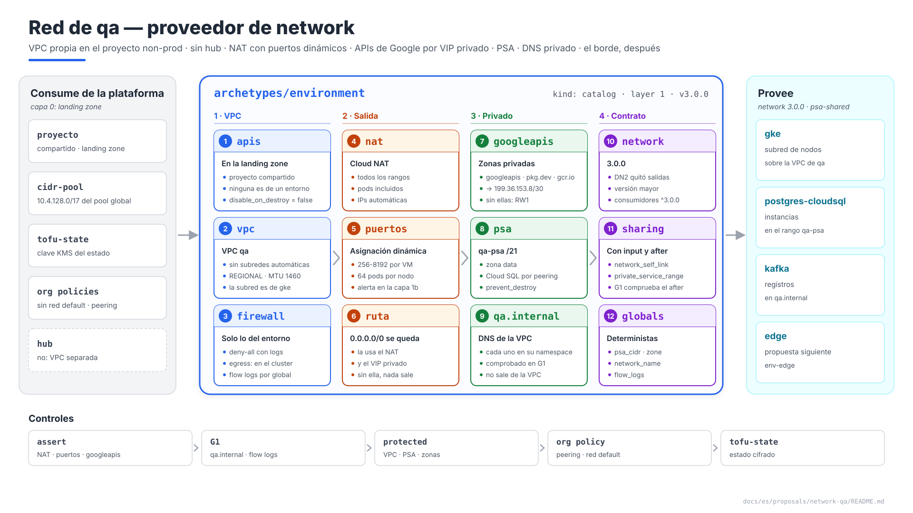

# Red de `qa` — arquetipo `environment` (capa 1), proveedor de `network`

| | |
|---|---|
| **Estado** | Propuesta · revisión 5 |
| **Alcance** | La parte de red del arquetipo de entorno en `qa`: APIs del proyecto, VPC, firewall base, Cloud NAT, acceso privado a las APIs de Google, acceso privado a servicios (PSA), zonas DNS privadas, el pool de direcciones del entorno, el contrato `network`, stacks, políticas, ejecución y plan. El borde (`env-edge`, `gcp-qa-edge`) es la propuesta siguiente |
| **Por qué ahora** | Es lo primero que se aplica en `qa` después de la landing zone, y seis propuestas le han dejado requisitos (§0.1). La propuesta de GKE le quitó la subred de nodos (DN2), así que su contrato cambia |
| **Base** | E1 §4.14 (KMS), §4.15 (VPC separada); arquitectura §5.2 (stack de red), §11.7 (org policies), §11.9 (línea base de red); AM §8–§9 (claims y pools). No se repite lo que ya está allí |
| **Especificación de referencia** | `archetype-model.md` (AM §n), `terramate-outputs-sharing-architecture.md` (§n), `risk-register.md` |
| **Diagramas** | `diagrams/*.mmd` (fuente Mermaid) y `diagrams/*.svg` (renderizados). El SVG se regenera desde el `.mmd`; no se edita a mano. `diagrams/06-bloques-presentacion.svg` (1920×1080, para presentaciones) se genera con `06-bloques-presentacion.py`, no con Mermaid |
| **Identificadores propios** | Decisiones `DW1…`, riesgos candidatos `RW1…`, verificaciones `VW1…`. Los riesgos reciben número `R54+` en `risk-register.md` si se adopta, detrás de los de las propuestas anteriores |

No reabre ninguna decisión de `CLAUDE.md`: aplica la VPC separada que `CLAUDE.md` ya da por cerrada para `qa`. Encuentra un hueco que afecta a todas las `NetworkPolicy` hacia las APIs de Google (§4, RW1) y un cambio de versión que se debe a la corrección DN2 (§8.1).

La revisión 5 deniega por defecto el egress de la VPC con una lista explícita de permisos (DW6), resuelve el permiso DNS de las zonas privadas sin `dns.admin` a nivel de proyecto y mantiene cada recurso de red del entorno en su propia VPC (DW8), ata los CIDR literales al ledger (DW9), y hace de los `assert` y de las reglas de G1 y G3 parte del criterio de salida de la fase 1 (§13).



Fuente: [`diagrams/06-bloques-presentacion.py`](diagrams/06-bloques-presentacion.py) — vista de presentación; el detalle está en §1–§9.

---

## 0. Contexto

| Pregunta | Respuesta | Consecuencia |
|---|---|---|
| Qué es | Arquetipo `environment`, `kind: catalog`, **capa 1**, instancia `qa`. Provee **`network` 3.0.0** y, en la propuesta siguiente, `env-edge` | Stack `gcp-qa-network`; `gcp-qa-edge` después. Las APIs son del proyecto, no del entorno: las habilita la landing zone (§1) |
| Proyecto | `disasterproject-nonprod`, el proyecto **compartido** por los entornos no productivos (`CLAUDE.md`), **creado por la landing zone** con su número de proyecto, cuenta de facturación, org policies y APIs | El entorno no tiene permisos de organización ni es dueño del proyecto: crea sus recursos dentro, todos con el prefijo `qa`, y la facturación se reparte por la etiqueta `environment` — salvo lo que no admite etiquetas (`google_compute_network`, reglas de firewall, rutas, Cloud NAT), que se atribuye por el prefijo de nombre `qa-` |
| VPC | Propia de `qa`, sin Shared VPC ni peering con el hub (E1 §4.15) | Nada transita por el hub; R23 no aplica |
| Qué **no** hace | No crea subredes de runtime (las crea `gke`, DN2), ni el borde, ni el canal de alertas (capa 1b, `gcp-qa-cloudmon`) | Su contrato solo lleva lo que comparten todos los runtimes |



Fuente: [`diagrams/01-contexto.mmd`](diagrams/01-contexto.mmd)

### 0.1 Lo que le pidieron las propuestas anteriores

| Origen | Requisito | Dónde se cumple |
|---|---|---|
| E1 §4.15, Kafka §6.3 | Zona privada `qa.internal`, enlazada solo a la VPC de `qa` | §6 |
| E1 §4.15, Keycloak, monitorización | Cloud NAT: Keycloak → Entra ID, Alertmanager y blackbox → internet | §3, y los permisos de egress de §2 |
| E1 §4.8, ESO, monitorización, CNPG, variante Cloud SQL | APIs de Google sin internet (Private Google Access) | §4 |
| Variante Cloud SQL, `postgres-cloudsql` | PSA: rango `qa-psa` en la zona `data` y `google_service_networking_connection`; API `sqladmin` | §5 |
| E1 §4.14 | `gcp-qa-network` es el primer stack cifrado con la clave `tofu-state` de `qa` | §9.3 |
| GKE DN2 | La red publica la VPC; no crea subredes de runtime | §8 |

---

## 1. El arquetipo y sus stacks

| Stack | Contenido | Por qué aparte |
|---|---|---|
| APIs (**en la landing zone**) | `google_project_service` de las APIs que usan los entornos del proyecto (§1.1), con `disable_on_destroy = false`, en el stack que crea el proyecto | En un proyecto compartido, una API no es de ningún entorno: si la habilitara el stack de `qa`, destruir `qa` podría dejar sin ella a `dev`. Habilitarla tarda minutos; hacerlo al crear el proyecto evita reintentos en `network` |
| `network` | VPC, firewall base, Cloud Router y Cloud NAT, PSA, zonas DNS privadas | El núcleo; cambia poco y lo consume todo |
| `edge` | IP global, certificado, Cloud Armor, balanceador, zona pública | **Propuesta siguiente** |

### 1.1 APIs del proyecto

| API | Quién la necesita |
|---|---|
| `compute`, `container`, `servicenetworking`, `dns` | Red, GKE, PSA, zonas privadas |
| `sqladmin` | `postgres-cloudsql` y sus consumidores |
| `secretmanager`, `iamcredentials`, `sts` | ESO, Workload Identity |
| `logging`, `monitoring` | GKE (`SYSTEM_COMPONENTS`), capa 1b |
| `certificatemanager` | Borde |
| Agentes de servicio | Forzados con `google_project_service_identity` antes del primer cluster, para que la landing zone pueda concederles roles sobre claves (landing zone §2.1). `run` y `cloudscheduler` ya no hacen falta: el stack `access` de GKE desapareció (landing zone DZ4) |
| `binaryauthorization`, `containeranalysis` | GKE DN10 |
| `cloudkms` | El cifrado del estado y de etcd usa claves de la landing zone; se habilita aquí por si las llamadas cuentan contra el proyecto que las hace **(verificar)** |

La lista debería derivarla el resolver de los arquetipos enlazados, para que un arquetipo nuevo no dependa de que alguien se acuerde de editarla: cada manifiesto declararía las APIs que usa en un campo nuevo (`cloud_apis`), que hoy no existe en el schema **(DW1)**. Mientras no exista, es la tabla anterior en globals del proyecto, en la landing zone.

**Venga de donde venga la lista, el plan la comprueba.** Un paso de solo lectura del job de plan compara `gcloud services list --enabled` con la lista (la identidad de plan tiene `serviceusage.serviceUsageViewer`) y falla nombrando cada API que falta. Una API que nadie habilitó falla entonces en el pull request, no treinta recursos dentro del `apply`, y la comprobación funciona igual si la landing zone creó el proyecto o lo adoptó.

---

## 2. VPC y firewall base

| Ajuste | Valor | Motivo |
|---|---|---|
| Nombre | `qa` (global `network_name`); self link `projects/disasterproject-nonprod/global/networks/qa` | Determinista |
| Modo | `auto_create_subnetworks = false` | Cada subred es un claim con dueño (AM §8.1) |
| Enrutamiento | `REGIONAL` | Todo está en `europe-west1` |
| MTU | 1460 (por defecto) | Cambiarla después exige que no haya VMs en la VPC: se fija ahora y no se toca |
| Ruta por defecto | `0.0.0.0/0` hacia el internet gateway, **se mantiene** | Cloud NAT y los VIP de `private.googleapis.com` la necesitan; sin ella no hay salida ni APIs de Google |
| Red `default` | No existe: org policy `compute.skipDefaultNetworkCreation` en la landing zone | Una red `default` con sus reglas `allow-internal` y `allow-ssh` abiertas es la primera fuga de cualquier proyecto nuevo |

**Firewall base del entorno.** Solo lo que es del entorno; las reglas de cada rango las escribe quien lo reclama (`CLAUDE.md`): GKE las de sus nodos, Envoy Gateway las de los health checks del GLB, Kafka las de su balanceador interno.

| Regla | Prioridad | Qué hace | Motivo |
|---|---|---|---|
| `qa-deny-all-ingress` | 65534 | Deniega todo ingress, **con logs** | Igual que la regla implícita, pero visible en los logs: un health check o un cliente bloqueado aparece como denegado en vez de como un timeout sin rastro |
| `qa-deny-all-egress` | 65534 | Deniega todo egress, **con logs** | Defensa en profundidad bajo las `NetworkPolicy` del cluster: un pod `hostNetwork` o un nodo comprometido escapa de la `NetworkPolicy`, no del firewall de la VPC. Con logs, para que un permiso que falta aparezca como denegación y no como timeout (RW7) |
| `qa-allow-egress-https` | 1000 | tcp:443 a `0.0.0.0/0` | Todo lo que los arquetipos del entorno mandan fuera (Entra ID, receptores de alertas, sondas) es HTTPS. Qué pod puede salir lo sigue decidiendo el cluster (`FQDNNetworkPolicy`) |
| `qa-allow-egress-internal` | 1000 | Todos los protocolos al `/17` del entorno | El tráfico dentro del entorno también es egress: un pod hacia kube-dns en otro nodo, los nodos hacia el endpoint privado del plano de control (una dirección de la subred de nodos con PSC, `gke-qa` §2.3), un pod hacia Cloud SQL por el rango PSA |
| `qa-allow-egress-google-apis` | 900 | tcp:443 a `199.36.153.8/30` | El VIP privado (§4). Redundante mientras 443 esté abierto a cualquier destino; mantiene las APIs de Google el día que se estreche 443 (§10) |
| Cualquier otro puerto | 1000 | Una regla por entrada de `global.network.egress_extra` (`{ port, protocol, owner, reason }`), declarada por el arquetipo que la necesita y revisada | El envío SMTP (587) de Alertmanager cuando un receptor es correo (`monitoring-qa` §8.3). La regla de la VPC abre el puerto a los nodos; la `NetworkPolicy` lo estrecha al pod |
| SSH por IAP (`35.235.240.0/20` → 22) | — | **No se crea** | Acceso de emergencia a nodos: se abre con una excepción temporal, como el acceso del pipeline al plano de control |

**El permiso interno es el que duele olvidar.** Sin él nada falla en el `apply`: el cluster se crea, y el primer webhook de admisión expira. Con `failurePolicy: Fail` es el bloqueo de `CLAUDE.md`: el webhook lo rechaza todo, su propia recuperación incluida. Un plano de control fuera del `/17` (el `/28` de un cluster con peering) necesita su propio permiso de egress a tcp 443 y **8132**, el túnel de konnectivity por el que el plano de control llega a los webhooks, a `logs` y a `exec`; lo escribe GKE, porque reclama el rango (`gke-qa` §2.3). VW6 comprueba la lista antes de instalar Gatekeeper.

**Flow logs.** Los activa quien crea cada subred, con los valores del entorno: global `flow_logs = { aggregation_interval = "INTERVAL_5_SEC", flow_sampling = 0.5, metadata = "INCLUDE_ALL_METADATA" }` y un `assert` en los generadores de subred (DW6). En `qa` la única subred es la de nodos de GKE.

---

## 3. Salida a internet: Cloud NAT

| Ajuste | Valor | Motivo |
|---|---|---|
| Cloud Router | `qa-router`, `europe-west1` | Uno por región |
| Ámbito | `ALL_SUBNETWORKS_ALL_IP_RANGES` | Incluye los rangos secundarios: los pods salen con su propia IP de alias, y sin esto Keycloak no llega a Entra ID. Cubre también cualquier subred futura sin tocar este stack |
| IPs | `AUTO_ONLY` | E1 §0: sin filtrado por IP en `qa`, nadie necesita que la IP de salida sea fija. Si un tercero exige una lista de IPs, se pasa a `MANUAL_ONLY` con IPs reservadas como claim del entorno |
| Puertos | **Asignación dinámica**: mínimo 256, máximo 8192 por VM; `enable_endpoint_independent_mapping = false` (lo exige la asignación dinámica) | Con 64 pods por nodo, todos los pods de un nodo comparten los puertos de **esa VM**. Con el mínimo por defecto de 64 puertos, una ráfaga de conexiones a Entra ID o a un receptor de alertas agota los puertos y aparece como timeouts de aplicación (AM §8.2, RW2) |
| Timeouts | Por defecto, salvo `tcp_time_wait_timeout_sec = 30` | Libera antes los puertos de conexiones cortas |
| Logs | Solo errores | Los logs de traducción de todas las conexiones son caros y no se miran |

La alerta de puertos agotados (`nat/dropped_sent_packets_count` con motivo `OUT_OF_RESOURCES`) la declara la capa 1b (`gcp-qa-cloudmon`), no este stack: es monitorización de la nube, no del cluster.

---

## 4. APIs de Google sin internet

**El hueco.** E1 §4.8 y las propuestas de ESO, monitorización, CNPG y la variante Cloud SQL dejan salir a sus pods hacia las APIs de Google "por Private Google Access". Hay dos formas de escribir esa regla, y solo una funciona sin más:

| Regla en la `NetworkPolicy` | Qué pasa sin zona DNS privada | Qué pasa con ella |
|---|---|---|
| `ipBlock` a `199.36.153.8/30` (`private.googleapis.com`) | `secretmanager.googleapis.com` resuelve a una IP pública de Google, **fuera** de ese /30: la política lo bloquea. ESO no sincroniza, Loki no escribe, los backups fallan (RW1) | Resuelve a `199.36.153.8/30` y la regla permite exactamente eso |
| `FQDNNetworkPolicy` por nombre | Funciona, pero depende de VN3 (disponibilidad en GKE Standard) y hay que enumerar cada API | Igual |

**Propuesta (DW2):** zonas privadas de Cloud DNS enlazadas a la VPC de `qa` que mandan las APIs de Google al VIP privado. Así el `ipBlock` es un destino estable, y el tráfico nunca sale por NAT.

| Zona privada | Registros |
|---|---|
| `googleapis.com.` | `private.googleapis.com.` A `199.36.153.8`–`.11`; `*.googleapis.com.` CNAME `private.googleapis.com.` |
| `pkg.dev.` | `A` en el apex a los cuatro VIP; `*.pkg.dev.` CNAME `pkg.dev.` — Artifact Registry (`europe-west1-docker.pkg.dev`) para los pulls de los nodos |
| `gcr.io.` | `A` en el apex a los cuatro VIP; `*.gcr.io.` CNAME `gcr.io.` — imágenes de sistema de GKE que aún se sirven desde ahí **(verificar, VW1)** |

Un `CNAME` no puede estar en el apex de una zona, y `gcr.io` es en sí un host de registro (`gcr.io/<proyecto>/<imagen>`), así que el apex lleva los registros `A` y el comodín apunta al apex de su propia zona. Todo nombre de las tres zonas resuelve a los cuatro VIP, y cada zona resuelve sin depender de otra.

**En el proyecto compartido**, cada entorno tiene sus propias zonas (recursos `qa-googleapis`, `qa-pkg-dev`, `qa-gcr-io`), enlazadas solo a su VPC: el mismo nombre DNS puede estar en varias zonas privadas del proyecto si cada una se enlaza a una VPC distinta. La otra cara: una zona enlazada a una segunda VPC cambia la resolución de ese entorno — las APIs de Google de `dev` respondidas con direcciones que eligió `qa`. La regla G3 `terraform.own_network` lo rechaza (§9.1, DW8).

`restricted.googleapis.com` (VPC Service Controls) no se usa: `qa` no tiene perímetro de VPC-SC, y el VIP restringido rechaza las APIs que no lo soportan.

Los nodos resuelven por el servidor de metadatos, que usa las zonas privadas de la VPC; los pods, por kube-dns, que reenvía al mismo servidor. Los dos ven la misma respuesta. Private Google Access se activa en cada subred (GKE §1.2).

---

## 5. Acceso privado a servicios (PSA)

| Ajuste | Valor | Motivo |
|---|---|---|
| Rango | `qa-psa`, `google_compute_global_address` con `purpose = VPC_PEERING` | Nombre determinista: global `psa_range_name` |
| Tamaño | **/21** en la zona `data`: `10.4.144.0/21` si es el primer claim de la zona | Cloud SQL reserva un bloque por región y servicio dentro del rango; un /24 se agota con unas pocas instancias en `prod` (AM §8.1, `managed_db_instances`). /21 deja 2048 direcciones y la mitad de la zona libre (DW4) |
| Conexión | `google_service_networking_connection` a `servicenetworking.googleapis.com` con `[qa-psa]` | Una por VPC (AM §9.3) |
| Ampliación | Añadir otro rango a la misma conexión, sin recrearla | El rango no es inmutable como los de GKE: una conexión admite varios |
| Rutas | Peering con exportación de rutas de subred por defecto: los rangos secundarios (pods) llegan a Cloud SQL | El proxy de Cloud SQL corre en el pod **(verificar, VW3)** |
| Protección | `prevent_destroy` en rango y conexión; tag `protected` | Borrar la conexión deja inalcanzables todas las instancias de Cloud SQL del entorno (RW5) |

La org policy `compute.restrictVpcPeering` de la landing zone debe permitir `projects/<proyecto de servicenetworking>/global/networks/servicenetworking` o la conexión falla al crearse (RW4, VW5).

---

## 6. DNS privado: `qa.internal`

| Ajuste | Valor |
|---|---|
| Zona | `qa-internal`, DNS `qa.internal.`, **privada**, enlazada solo a la VPC de `qa` |
| Quién escribe registros | Cada arquetipo, solo bajo `<su namespace>.qa.internal` (Kafka: `bootstrap.kafka.qa.internal`, `broker-<n>.kafka.qa.internal`) |
| Cómo se comprueba | Regla de conftest nueva (G1): un stack solo declara `google_dns_record_set` en `qa-internal` con nombre bajo su namespace. Gatekeeper no ve Cloud DNS, así que la comprobación está en el plan (DW7) |
| Permisos | Crear una zona privada es un permiso de proyecto, y `dns.admin` a nivel de proyecto alcanzaría las zonas públicas de los demás entornos, que viven en el mismo proyecto (`landing-zone-qa` §7: certificados DNS-01 para sus nombres). `tf-apply-qa@` recibe `dns.admin` en el proyecto **condicionado al nombre de la zona** (`managedZones/qa-`), nunca sin condición **(verificar, VW7)**; DW8 tiene la alternativa si Cloud DNS no respeta la condición. No hay una identidad por arquetipo, así que dentro de las zonas de `qa` el límite es la regla de G1, no IAM |
| Fuera de la VPC | No resuelve: ni desde el hub ni desde internet. Si algún día hay peering con el hub, se enlaza allí a propósito (E1 §4.15) |
| Registros de clientes | Los certificados de esos nombres los emite `internal-ca` con la política `private-names` (cert-manager DT10) |

La zona pública `tqbvzkr.disasterproject.com` (delegada desde la landing zone) es del borde: propuesta siguiente.

---

## 7. El pool de direcciones del entorno



Fuente: [`diagrams/02-red.mmd`](diagrams/02-red.mmd)

| Nivel | Qué | Dónde se declara |
|---|---|---|
| Global → entorno | `10.4.128.0/17` desde `10.4.0.0/14` (AM §9.2) | Binding del entorno: `network.pool` y `network.cidr` (lo asigna el ledger global). El esquema de claims del manifiesto solo conoce zonas del entorno, así que este claim es del binding, no del manifiesto |
| Zonas | `infra` `10.4.128.0/20` · `data` `10.4.144.0/20` · `edge` `10.4.160.0/20` · `growth` `10.4.176.0/20` · `pods` `10.4.192.0/18` | `registry/zones.yaml`; el ledger `cmdb-data/pools/qa.json` |
| Claims en `qa` | PSA `/21` (este arquetipo); nodos `/24`, pods `/18`, servicios `/22` (GKE §1.1); IP interna de Kafka si hay clientes de la VPC | Manifiesto de cada arquetipo |

El entorno **publica** el pool (el ledger) y **reclama** en él solo el PSA. Todo lo demás es de quien lo usa (AM §9.1).

**Un CIDR escrito como literal sigue siendo del ledger.** El resolver escribe los rangos en los globals como literales, para que una edición del ledger no pueda mover un rango vivo; el precio es que un literal puede desviarse del ledger. Un rango de los globals sin una asignación `active` para su `(pool, owner, purpose)` es un claim que nadie más ve, y la siguiente asignación puede volver a darlo. Una regla de G1 compara los dos en ambos sentidos (DW9).

---

## 8. El contrato y el arquetipo

### 8.1 Contrato `network` 3.0.0

La corrección DN2 de GKE ya quitó `subnet_self_link`, `gke_pods_range_name` y `gke_services_range_name` del contrato de red (arquitectura §5.2). Quitar salidas **rompe** a quien las leía: es una versión mayor, no una corrección. Los consumidores pasan a pedir `^3.0.0` (DW5).

| Valor | Cómo llega | Valor en `qa` |
|---|---|---|
| `network_self_link` | Outputs sharing, de `network` | `projects/disasterproject-nonprod/global/networks/qa` |
| `private_service_range` | Outputs sharing, de `network` | `qa-psa` |
| `project_id` | Outputs sharing y global | `disasterproject-nonprod` |
| `network_name`, `psa_range_name`, `psa_cidr`, `internal_zone` | Globals deterministas | `qa`, `qa-psa`, `10.4.144.0/21`, `qa-internal` |
| `flow_logs` | Global | §2 |

`network_self_link` y `private_service_range` siguen por sharing aunque sean deterministas: con una `input`, G1 comprueba que el consumidor tiene su `after` (R2). Un `after` sin `input` no lo comprueba nadie (variante Cloud SQL §9.3).

### 8.2 Manifiesto

```yaml
# archetypes/environment/manifest.yaml
apiVersion: archetype/v1
kind: Archetype

metadata:
  name: environment
  version: 3.0.0
  layer: 1
  kind: catalog
  description: Entorno con su propia VPC (proyecto propio en prod, compartido en no producción) — VPC, NAT, APIs de Google privadas, PSA y DNS privado
  owners: [team-platform]

requires:
  - capability: cidr-pool
    version: "^1.0.0"

provides:
  - capability: network
    version: 3.0.0
    traits: [psa-shared]
    outputs:
      - { name: network_self_link,     from: network }
      - { name: private_service_range, from: network }
      - { name: project_id,            from: network }

claims:
  - kind: cidr
    zone: data
    purpose: psa
    size: 21

stacks:
  - name: network
```

`env-edge` y los stacks del borde los añade la versión **3.1.0** de este mismo arquetipo: el manifiesto completo está en la propuesta `edge-qa` §8.2.

---

## 9. Políticas, ejecución, riesgos y verificaciones

### 9.1 `assert` y conftest

```hcl
assert {
  assertion = global.network.nat.enable_dynamic_port_allocation && global.network.nat.min_ports_per_vm >= 256
  message   = "network: NAT con asignación dinámica y ≥ 256 puertos por VM — 64 pods comparten los puertos del nodo (RW2)"
}
assert {
  assertion = global.network.nat.source_subnetwork_ip_ranges_to_nat == "ALL_SUBNETWORKS_ALL_IP_RANGES"
  message   = "network: NAT para todos los rangos — si no, los pods no salen (§3)"
}
assert {
  assertion = contains(global.network.private_zones, "googleapis.com.")
  message   = "network: zona privada de googleapis.com — sin ella, las NetworkPolicy hacia 199.36.153.8/30 bloquean las APIs de Google (RW1)"
}
```

| Regla nueva (conftest) | Qué comprueba |
|---|---|
| G1: registros de `qa.internal` | Un stack solo escribe nombres bajo `<su namespace>.qa.internal` (§6) |
| G1: flow logs | Toda `google_compute_subnetwork` lleva el `log_config` del global `flow_logs` (§2) |
| G1: ledger | Todo CIDR de los globals de un entorno tiene una asignación `active` en el ledger con el mismo `(pool, owner, purpose)`, y toda asignación `active` está en algún global (§7, DW9) |
| G1: egress adicional | Cada entrada de `egress_extra` lleva `owner` y `reason`, nombra un puerto y un protocolo, y ninguna es `all` (§2) |
| G3: `terraform.own_network` | En el plan de un entorno, toda regla de firewall, subred, router, ruta y conexión PSA nombra la VPC de ese entorno; toda zona privada solo es visible para ella; todo registro y zona DNS lleva su prefijo (§4, §6, DW8; arquitectura §13.4) |

### 9.2 Ejecución

| Qué | Cómo |
|---|---|
| Arranque | La landing zone crea el proyecto, concede los permisos entre proyectos y la clave `tofu-state` (E1 §4.14) |
| Primer despliegue | Fase A de E1 §6: APIs del proyecto (landing zone) → `network` → GKE. `postgres-cloudsql` puede ir en paralelo con GKE en cuanto existe el PSA |
| Cambios | Poco frecuentes; `plan` revisado por el equipo de plataforma (CODEOWNERS) |
| Destrucción | Tag `protected`, `prevent_destroy` en la VPC, el rango y la conexión PSA, y las zonas; solo con la identidad de destroy. Destruir la red es destruir el entorno |

### 9.3 Estado cifrado

`gcp-qa-network` es el primer stack de `qa` con estado cifrado, con la clave `tofu-state` propia de `qa` — key ring `qa`, creado por la landing zone (`landing-zone-qa` §4; E1 §4.14), no la clave `lz` de la landing zone. Ningún stack de `qa` escribe estado en claro, y el permiso es por clave: las identidades de `qa` descifran el estado de `qa` y nada más, así que ni en el proyecto compartido el estado de `dev` se descifra con la clave de `qa`.

### 9.4 Riesgos candidatos

| # | Riesgo | Probabilidad | Impacto | Mitigación |
|---|---|---|---|---|
| RW1 | **`NetworkPolicy` hacia `199.36.153.8/30` sin zona privada**: las APIs de Google resuelven a IPs públicas y la política las bloquea | Alta sin §4 | Alta — ESO, backups, Loki y el proxy de Cloud SQL fallan a la vez | Zonas privadas de §4; `assert`; VW1 |
| RW2 | **Agotamiento de puertos de NAT**: los pods de un nodo comparten sus puertos | Media con valores por defecto | Media — timeouts intermitentes hacia Entra ID y receptores, difíciles de atribuir | Asignación dinámica 256–8192; alerta en la capa 1b; VW2 |
| RW3 | **Rango PSA agotado** | Baja en `qa` | Media — no se pueden crear instancias de Cloud SQL | /21; ampliable con otro rango en la misma conexión |
| RW4 | **Org policy bloquea el peering de PSA** | Media en el primer despliegue | Alta — nada de Cloud SQL | Lista de peerings permitidos en la landing zone; VW5 |
| RW5 | **Borrado de la conexión PSA o de la VPC** | Baja | Crítico — todas las bases del entorno inalcanzables, o el entorno entero | `prevent_destroy`, tag `protected`, identidad de destroy separada |
| RW6 | **Un arquetipo escribe en `qa.internal` fuera de su namespace** | Media | Media — suplantación de un nombre interno dentro de la VPC; el TLS con `internal-ca` lo detecta, un cliente sin verificación no | Regla de G1 (§6) |
| RW7 | **El egress denegado por defecto bloquea un flujo legítimo**: un puerto distinto de 443, o falta el permiso interno | Media con cada arquetipo nuevo | Alto si es el permiso interno (los webhooks de admisión expiran; con `failurePolicy: Fail`, bloqueo); Medio en otro caso | Regla de denegación con logs; la lista de permisos de §2 escrita antes del cluster; `egress_extra` por arquetipo; VW6 antes de Gatekeeper |
| RW8 | **Un recurso de red o DNS de un entorno enlazado al de otro** en el proyecto compartido: una zona privada visible para la VPC de `dev`, una regla de firewall o una ruta sobre ella, un registro en sus zonas | Baja por error, posible a propósito | Alto — las APIs de Google o los nombres internos de otro entorno respondidos con direcciones que eligió este; su tráfico abierto o desviado; con escritura en su zona pública, certificados para sus nombres | G3 `terraform.own_network`; `dns.admin` condicionado al prefijo de zona, nunca sin condición (VW7); prefijo de estado por entorno; revisión (DW8) |

### 9.5 Verificaciones

| # | Verificación | Resultado que la cierra |
|---|---|---|
| VW1 | Zonas privadas `googleapis.com`, `pkg.dev`, `gcr.io` | Desde un pod: `secretmanager.googleapis.com` resuelve a `199.36.153.8/30` y ESO sincroniza con la `NetworkPolicy` aplicada; los nodos descargan imágenes de `europe-west1-docker.pkg.dev` y de las imágenes de sistema de GKE |
| VW2 | NAT con asignación dinámica bajo carga | Ráfaga de 1000 conexiones salientes desde un nodo sin paquetes descartados por `OUT_OF_RESOURCES` |
| VW3 | PSA alcanzable desde el rango de pods | El proxy de Cloud SQL conecta desde un pod (= VC1 y VC9 de la variante Cloud SQL) |
| VW4 | `qa.internal` | Resuelve desde un pod y desde una VM de la VPC; no desde fuera |
| VW5 | Org policy de peering | `google_service_networking_connection` se crea sin error |
| VW6 | Lista de permisos de egress, **antes de Gatekeeper** | Con el egress denegado, desde un nodo y desde un pod: responden kube-dns en otro nodo, el endpoint del plano de control, la IP privada de un Cloud SQL, `199.36.153.8:443` y un `:443` externo; no responden un `:80` ni un `:22` externos, que aparecen en los logs bajo `qa-deny-all-egress` |
| VW7 | `dns.admin` condicionado al nombre de zona | Con el permiso de proyecto condicionado a `managedZones/qa-`, `tf-apply-qa@` crea `qa-googleapis` y escribe registros en ella, y se le rechaza en una zona llamada `dev-…`. Si la condición no se respeta, se aplica la alternativa de DW8 |

---

## 10. `prod` y `demos`

| Ajuste | `qa` | `prod` | `demos` |
|---|---|---|---|
| Pool | `/17` | `/16`, PSA `/20` | `/17` |
| NAT | `AUTO_ONLY` | `MANUAL_ONLY` si algún tercero filtra por IP | `AUTO_ONLY` |
| Egress de la VPC | Denegado por defecto; permitidos 443, el `/17` y el VIP | Denegado por defecto; 443 estrechado a destinos conocidos donde se pueda | Como `qa` |
| Zonas privadas de Google | Sí | Sí | Sí |
| Peering con el hub | No | Según lo que necesite de on-premise | Pregunta abierta nº 2 de `CLAUDE.md` |

---

## 11. Cambios a otros documentos

| Documento | Cambio | Estado |
|---|---|---|
| Arquitectura §5.2 | El contrato de red pasa a 3.0.0: versión mayor por las salidas que quitó DN2 | **Aplicado** (DW5) |
| Manifiestos de GKE (§7.2) y `postgres-cloudsql` (§7) | `network` `^3.0.0` | **Aplicado** (DW5) |
| Bindings de `qa` (E1 §7 y variante Cloud SQL) | `environment` 3.0.0 | **Aplicado** (DW5) |
| E1 §4.8 y propuestas con egress a las APIs de Google | La regla a `199.36.153.8/30` depende de las zonas privadas de §4; se cita esta propuesta | **Aplicado** (DW2) |
| Propuesta de GKE §7.3 | El stack `subnet` aplica el global `flow_logs` | **Aplicado** (DW6) |
| Landing zone | Org policies `compute.skipDefaultNetworkCreation` y `compute.restrictVpcPeering` con `servicenetworking` permitido | **Aplicado** (requisito a la landing zone) |
| Arquitectura §11.9 | Egress de cargas en GKE: egress de la VPC denegado por defecto, con el rango del entorno, 443 y el VIP privado permitidos | **Aplicado** (DW6) |
| Arquitectura §13.4 | Regla G3 `terraform.own_network` | **Aplicado** (DW8) |
| `gke-qa` §2.3 | Los nodos llegan al plano de control por el permiso interno; el permiso de egress de un plano de control con peering (443, 8132) es de GKE | **Aplicado** (DW6) |
| `monitoring-qa` §8.3 | SMTP (587) es una entrada de `egress_extra` | **Aplicado** (DW6) |
| `landing-zone-qa` §5.1, §7, §11.1 | `dns.admin` en el proyecto solo condicionado al prefijo de zona del entorno; la regla G3 rechaza un permiso sin condición | **Aplicado** (DW8) |
| Registro de riesgos | R65 (RW8), R66 (RW7) | **Aplicado** |

---

## 12. Decisiones

| # | Decisión | Estado | Recomendación | Alternativa |
|---|---|---|---|---|
| DW1 | Stacks y APIs | **Aprobada**; revisada con el proyecto compartido | `network` en el entorno; las APIs, en la landing zone al crear el proyecto; lista derivada de los arquetipos enlazados | APIs en un stack del entorno |
| DW2 | APIs de Google | **Aprobada** | Zonas privadas hacia `private.googleapis.com` | VIP público con `FQDNNetworkPolicy`; `restricted.googleapis.com` con VPC-SC |
| DW3 | Cloud NAT | **Aprobada** | `AUTO_ONLY`, asignación dinámica 256–8192, logs de errores | IPs fijas; puertos estáticos por defecto |
| DW4 | PSA | **Aprobada** | `/21` en `data` | `/24` |
| DW5 | Versión del contrato | **Aprobada** | `network` 3.0.0 | 2.x sin las salidas, rompiendo en silencio |
| DW6 | Firewall y flow logs | **Revisada** (revisión 5) | Deny-all de ingress **y de egress** con logs a prioridad 65534; permisos para 443, el `/17` del entorno y el VIP privado; cualquier otro puerto, por arquetipo en `egress_extra`; flow logs por global | Egress abierto en la VPC y controlado solo en el cluster (revisión 4): un pod `hostNetwork` o un nodo comprometido escapa de él |
| DW7 | Registros en `qa.internal` | **Aprobada** | Cada arquetipo bajo su namespace, comprobado en G1 | Una zona por arquetipo |
| DW8 | Recursos de red y DNS en el proyecto compartido | **Propuesta** | G3 `terraform.own_network`; `dns.admin` en el proyecto condicionado al prefijo de zona (VW7) | Si la condición no se respeta: la landing zone crea las zonas privadas, enlazadas a la VPC por su URL determinista, en un stack que corre después de `gcp-<env>-network` (una arista hacia arriba, nombrada en G1 como la del NEG) y concede `dns.admin` por zona. Nunca `dns.admin` de proyecto sin condición |
| DW9 | CIDR y el ledger | **Propuesta** | Literales en los globals, comparados con el ledger en G1 en ambos sentidos | CIDR calculados desde el ledger al generar (una edición del ledger mueve un rango vivo) |

---

## 13. Plan de implementación

| Fase | Contenido | Criterio de salida | Estimación |
|---|---|---|---|
| **0 · Landing zone** | Proyecto, org policies, clave `tofu-state`, identidades de `qa`; **VW5** | APIs habilitadas; `plan` de `gcp-qa-network` con estado cifrado | 1 día (de la landing zone) |
| **1 · Red** | `network`; `assert`, reglas de G1 y G3; **VW7** | VPC, NAT, PSA y zonas creadas; los tres `assert` y las reglas de G1 y G3 de §9.1 bloqueando, cada una vista fallar con un caso negativo; `prevent_destroy` en la VPC, el rango y la conexión PSA, y las zonas | 1,5 días |
| **2 · Con GKE** | **VW6** antes de Gatekeeper; **VW1**, **VW2**, **VW4** con el cluster de la propuesta de GKE | Pods que salen por NAT y llegan a las APIs de Google por el VIP privado | 0,5 días |
| **3 · Con Cloud SQL** | **VW3** con la primera instancia | El proxy conecta desde un pod | 0,5 días |

Dos días y medio para una persona, más el de la landing zone. **Un control que no está en ningún criterio de salida no se construye**: una fase se cierra cuando existen sus recursos, y nada pide después los `assert` ni las reglas. Por eso la fase 1 los nombra.
