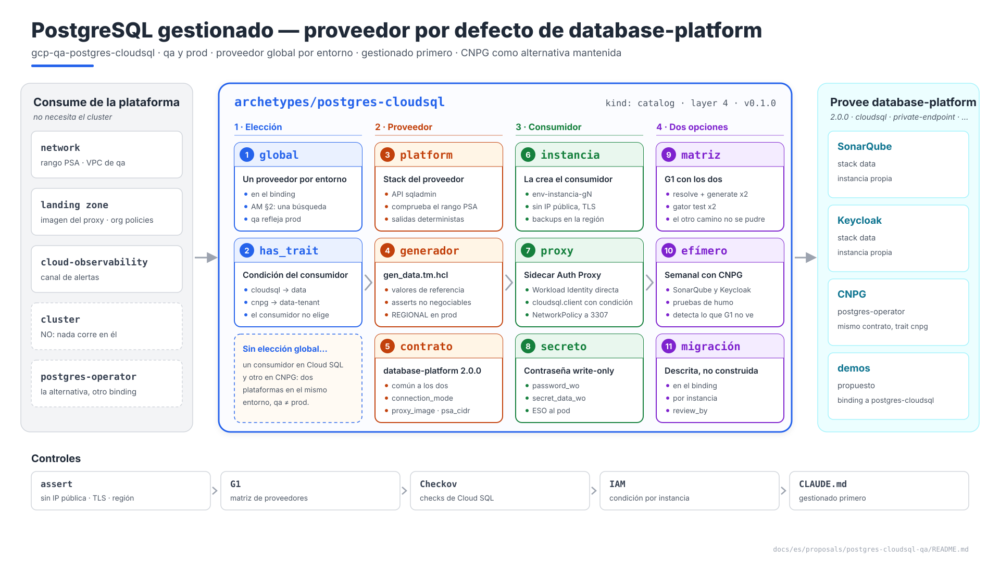

# PostgreSQL en `qa` — arquetipo `postgres-cloudsql` (capa 4), proveedor por defecto de `database-platform`

| | |
|---|---|
| **Estado** | Propuesta · revisión 1 |
| **Alcance** | El proveedor gestionado de `database-platform`: la regla de proveedor global por entorno, el contrato común con CloudNativePG, lo que aporta el proveedor y lo que crea cada consumidor, la instancia Cloud SQL de referencia, identidad, red, backup, observabilidad, la matriz de proveedores en CI, stacks, políticas, ejecución y plan |
| **Por qué ahora** | La estrategia es agnóstica con los servicios gestionados primero (`CLAUDE.md`): en producción PostgreSQL es Cloud SQL, y `qa` refleja producción. CloudNativePG se mantiene como alternativa soportada. Hasta ahora Cloud SQL no era un proveedor, sino el caso "`database-platform` sin enlazar" (AM §5.5), y SonarQube y Keycloak habían tomado caminos distintos |
| **Base** | La variante Cloud SQL de SonarQube ([`../sonarqube-qa-cloudsql/`](../sonarqube-qa-cloudsql/README.md), DC §n) ya resolvió la instancia, la conexión, los secretos y el backup. Este documento los generaliza para cualquier consumidor y **no repite** lo que allí está |
| **Especificación de referencia** | `archetype-model.md` (AM §n), `terramate-outputs-sharing-architecture.md` (§n), `risk-register.md` |
| **Diagramas** | `diagrams/*.mmd` (fuente Mermaid) y `diagrams/*.svg` (renderizados). El SVG se regenera desde el `.mmd`; no se edita a mano. `diagrams/06-bloques-presentacion.svg` (1920×1080, para presentaciones) se genera con `06-bloques-presentacion.py`, no con Mermaid |
| **Identificadores propios** | Decisiones `DQ1…`, riesgos candidatos `RQ1…`, verificaciones `VQ1…`. Los riesgos reciben número `R54+` en `risk-register.md` si se adopta, detrás de los de las propuestas anteriores |

No reabre ninguna decisión de `CLAUDE.md`: aplica las tres que se registraron con ella (gestionado primero, proveedor global por entorno y dos proveedores de `database-platform`).



Fuente: [`diagrams/06-bloques-presentacion.py`](diagrams/06-bloques-presentacion.py) — vista de presentación; el detalle está en §1–§8.

---

## 0. Contexto

| Pregunta | Respuesta | Consecuencia |
|---|---|---|
| Qué es | Arquetipo `postgres-cloudsql`, `kind: catalog`, **capa 4**, provee **`database-platform` 2.0.0** con el trait `cloudsql` | El binding de `qa` pasa a `database-platform: { archetype: postgres-cloudsql, version: 0.1.0, stack_id: gcp-qa-postgres-cloudsql }` |
| El otro proveedor | `postgres-operator` (CloudNativePG), trait `cnpg`, mismo contrato | Su propuesta va a continuación de esta |
| Quién elige | **El binding del entorno**, uno por entorno (AM §2) | Ningún consumidor elige proveedor |
| Consumidores en `qa` | SonarQube y Keycloak, cada uno con **su propia instancia** | Los datos nunca se comparten, con cualquiera de los dos proveedores |
| Qué **no** hace | No ejecuta nada en el cluster; no crea instancias: las crea cada consumidor en su stack `data` | §2 |



Fuente: [`diagrams/01-contexto.mmd`](diagrams/01-contexto.mmd)

---

## 1. Proveedor global por entorno

### 1.1 La regla



Fuente: [`diagrams/02-eleccion.mmd`](diagrams/02-eleccion.mmd)

| Pieza | Diseño |
|---|---|
| Quién elige | El binding del entorno, con una entrada `database-platform` como cualquier otra capability |
| Qué elige | `postgres-cloudsql` por defecto (gestionado primero); `postgres-operator` si el cliente lo prefiere todo en el cluster |
| Resolución | Sigue siendo una búsqueda: el paso 4 de AM §12 encuentra un único proveedor, y el paso 9 evalúa las condiciones con sus traits |
| Consumidor | Lleva los **dos caminos** y no elige: `data` con `has_trait(database-platform, cloudsql)` y `data-tenant` con `has_trait(database-platform, cnpg)` (AM §5.5) |
| Paridad | `qa` usa el mismo proveedor que `prod`. Un cliente que elige CNPG lo elige en todos sus entornos |

**Sin selección por consumidor (DQ1).** Rompería la paridad (lo que se prueba en `qa` no sería lo que corre en `prod`), obligaría a operar dos plataformas en un mismo entorno y repartiría los budgets de capacidad. Si un consumidor **necesita** un proveedor concreto, lo expresa como restricción: exige el trait `cloudsql` o `cnpg`, y la resolución falla en la PR si el entorno enlaza el otro.

### 1.2 La excepción de migración (descrita, no construida)

El único caso en que dos proveedores conviven con sentido es una migración de uno a otro, consumidor a consumidor. Queda descrita para que, si llega, no se improvise:

```yaml
# Extensión NO implementada del binding de un entorno
bindings:
  database-platform: { archetype: postgres-operator, version: 0.1.0, stack_id: <env>-postgres-operator }
  migrations:
    database-platform:
      to: { archetype: postgres-cloudsql, version: 0.1.0, stack_id: <env>-postgres-cloudsql }
      instances: [sonarqube-main]           # los que ya se migraron
      review_by: 2027-06-30                 # G1 falla después: la migración debe terminar
```

La declara la plataforma en el binding, nunca el consumidor; es por instancia y caduca. Al terminar, el binding vuelve a un solo proveedor. No se construye hasta que haya una migración real (DQ7).

### 1.3 `demos`

`demos` deja hoy `database-platform` sin enlazar para que cada demo tenga su instancia gestionada (AM §5.5, §7). Con este proveedor, `demos` enlazado a `postgres-cloudsql` significa exactamente lo mismo, y la resolución deja de depender del caso "sin enlazar". Se propone, sin aplicar (§10).

---

## 2. Qué aporta el proveedor y qué crea cada consumidor



Fuente: [`diagrams/03-proveedor-consumidor.mmd`](diagrams/03-proveedor-consumidor.mmd)

| Pieza | Quién | Dónde |
|---|---|---|
| Rango PSA `qa-psa` y `google_service_networking_connection` | Entorno (`gcp-qa-network`) | E1 §4.15, variante §11 |
| API `sqladmin.googleapis.com`; comprobación de que PSA existe | **Proveedor**, stack `platform` | §7.2 |
| Imagen de Cloud SQL Auth Proxy copiada por digest y firmada | Landing zone; el proveedor publica el digest | Salida `proxy_image` |
| Org policies `sql.restrictPublicIp` y `sql.restrictAuthorizedNetworks` | Landing zone (por encima del pipeline, arquitectura §11.7) | — |
| Valores de referencia de la instancia (§3) y **el generador** `gen_data.tm.hcl`, rama GCP | **Proveedor** | La versión del arquetipo fija la del generador |
| Instancia, base de datos, usuario, contraseña write-only, IAM del proxy, alertas | **Cada consumidor**, stack `data` | Variante §3–§8 |
| Sidecar del Auth Proxy en el pod | Cada consumidor, stack `app` | Variante §4.1 |

**Por qué el proveedor no crea las instancias.** Una instancia por consumidor, en su stack, con su ciclo de vida: destruir la aplicación destruye su base (AM §5.1), y el estado de una no está en el mismo fichero que el de otra. Es el mismo reparto que con CNPG, donde el operador es compartido y cada `Cluster` es del consumidor.

---

## 3. La instancia de referencia

Los valores de la variante §3 pasan a ser **los valores por defecto del generador**, y cada consumidor ajusta solo lo que declara.

| Ajuste | `qa` | `prod` | Por qué la diferencia |
|---|---|---|---|
| Edición | `ENTERPRISE` | `ENTERPRISE_PLUS` si el SLA de la aplicación lo exige | 99,99 % y mantenimiento casi sin corte (DC2) |
| Disponibilidad | `ZONAL`, zona del workload | `REGIONAL` | Réplica síncrona en otra zona |
| Red | Sin IP pública, PSA, `ssl_mode = ENCRYPTED_ONLY` | Igual | — |
| Backups | Diarios, **`location` = región del entorno**, PITR 7 días, backup final 30 días | PITR según edición | Sin `location` van a la multirregión (RC6) |
| Protección | `deletion_protection` y `deletion_protection_enabled` | Igual | Las dos protecciones (variante §3) |
| Nombre | `<env>-<instancia>-g<generación>` | Igual | Un nombre borrado no se reutiliza en una semana (RC5) |
| Mantenimiento | Domingo 03:00 UTC, `stable` | Igual, avisado | Reinicia la instancia (RC2) |
| Tamaño | Lo declara el consumidor (`db-custom-*`) | Igual | Cuenta contra `managed_db_instances` |

Los asserts de §8.1 impiden que un consumidor desactive lo que no es negociable (IP pública, `location` de backups, las dos protecciones, TLS).

---

## 4. El contrato `database-platform` 2.0.0

Un solo contrato para los dos proveedores. Pasa a **2.0.0** (MAJOR): cambia el significado de estar enlazado, y los consumidores que exigían `^1.0.0` con el trait `cnpg` deben revisarse.

### 4.1 Salidas del proveedor

| Salida | `postgres-cloudsql` | `postgres-operator` |
|---|---|---|
| `provider` | `cloudsql` | `cnpg` |
| `connection_mode` | `proxy-sidecar` | `service` |
| `postgres_versions` | Mayores que ofrece Cloud SQL | Mayores de las imágenes de CNPG soportadas |
| `backup_region` | La región del entorno | La región del bucket de backups |
| `proxy_image` | Digest de la imagen del Auth Proxy | — |
| `psa_cidr` | CIDR del rango PSA, para la `NetworkPolicy` del consumidor | — |
| `operator_version` | — | Versión de CNPG (la antigua `cnpg_version`, E2 §5.3) |

Todas son deterministas y llegan como globals.

### 4.2 Lo que cada consumidor obtiene de su propio stack

| Valor | Camino `data` (Cloud SQL) | Camino `data-tenant` (CNPG) |
|---|---|---|
| Endpoint | `127.0.0.1:5432`, a través del sidecar | `<nombre>-rw.<namespace>.svc:5432` |
| Base de datos | `<archetype>` | Igual |
| Secreto | `qa-<instancia>-db` en Secret Manager; ESO lo materializa | Igual |
| TLS | Lo pone el proxy | Certificado del `Cluster` |

Son deterministas a partir de la instancia y del proveedor, así que la aplicación no necesita outputs sharing para conectarse: su chart elige la rama por `global.database_platform.connection_mode`.

### 4.3 Traits

| Trait | `postgres-cloudsql` | `postgres-operator` |
|---|---|---|
| `cloudsql` (nuevo) | Sí | — |
| `cnpg` | — | Sí |
| `private-endpoint` | Sí (PSA) | — |
| `iam-auth` | Sí, para acceso humano (variante §4.3) | — |
| `multi-az` | Sí, con `REGIONAL` | Sí, con instancias en varias zonas |

Un consumidor agnóstico **no exige** `cloudsql` ni `cnpg`: exige como mucho traits comunes (`multi-az` en producción).

---

## 5. Identidad y red

Sin cambios respecto a la variante, generalizados por consumidor:

| Pieza | Diseño | Referencia |
|---|---|---|
| Identidad del proxy | KSA del consumidor por Workload Identity directa; sin cuenta de servicio de GCP salvo que VQ2 falle | Variante §4.2, VC1 |
| IAM | `roles/cloudsql.client` a nivel de proyecto con condición `resource.name == "projects/<p>/instances/<instancia>"` | Arquitectura §7.4 (corregida) |
| Acceso humano | Privileged Access Manager y autenticación IAM de base de datos del grupo SRE | Variante §4.3 |
| `NetworkPolicy` | Egress del pod al CIDR `psa_cidr` en **3307** y a `sqladmin.googleapis.com` por Private Google Access en 443 | Variante §6 |
| Imagen del proxy | `proxy_image` por digest: la admite la regla P2 de Gatekeeper | Gatekeeper §4.1 |

---

## 6. Mantener dos proveedores: la matriz en CI



Fuente: [`diagrams/04-matriz.mmd`](diagrams/04-matriz.mmd)

Mantener dos opciones tiene un coste concreto. El camino que ningún entorno usa **se estropea en silencio**: un cambio en el chart de SonarQube pensado para Cloud SQL rompe la rama CNPG y nadie lo ve hasta que un cliente la elige (RQ1).

| Control | Dónde | Qué comprueba |
|---|---|---|
| **Matriz de resolución** | G1, en cada PR que toque un consumidor de `database-platform` | `archetypectl resolve --dry-run` y `terramate generate` contra un binding con cada proveedor. Los dos deben resolver y generar |
| **`gator test` de los dos caminos** | G1 | El chart renderizado con `connection_mode: proxy-sidecar` y con `service` pasa las reglas de admisión (Gatekeeper §6.2) |
| **Entorno efímero CNPG** | Programado, semanal | Un efímero con `postgres-operator` despliega SonarQube y Keycloak y ejecuta sus pruebas de humo |
| **Regla de consumidor** | G1 | Un consumidor que requiere `database-platform` declara los dos stacks condicionales, o exige explícitamente un trait de proveedor |

---

## 7. El arquetipo

### 7.1 Manifiesto

```yaml
# archetypes/postgres-cloudsql/manifest.yaml
apiVersion: archetype/v1
kind: Archetype

metadata:
  name: postgres-cloudsql
  version: 0.1.0
  layer: 4
  kind: catalog
  description: PostgreSQL gestionado (Cloud SQL); prerrequisitos y generador; cada consumidor crea su instancia
  owners: [team-platform]

runtimes: [gke, eks, aks]

requires:
  - capability: network
    version: "^2.0.0"

provides:
  - capability: database-platform
    version: 2.0.0
    traits: [cloudsql, private-endpoint, iam-auth, multi-az]
    outputs:
      - { name: provider,          from: platform }
      - { name: connection_mode,   from: platform }
      - { name: postgres_versions, from: platform }
      - { name: backup_region,     from: platform }
      - { name: proxy_image,       from: platform }
      - { name: psa_cidr,          from: platform }

stacks:
  - name: platform

capacity:
  workload_identities: 0
```

`runtimes: [gke, eks, aks]` describe dónde corren los **consumidores**. El recurso gestionado depende de la nube: RDS en AWS y Flexible Server en Azure son otras ramas del generador, que hoy no existen. Un assert hace fallar `generate` si se intenta (variante §9.3). El proveedor **no requiere `cluster`**: no ejecuta nada en él.

### 7.2 El stack `platform`

| | |
|---|---|
| **Recursos** | `google_project_service` `sqladmin.googleapis.com`; `data "google_compute_global_address"` del rango PSA (falla si el entorno no lo creó); las salidas de §4.1 |
| **Entradas** | Ninguna por sharing: todo es determinista desde el binding |
| **Consumidores** | Su stack `data` declara `after` a `gcp-qa-postgres-cloudsql-platform` y a `gcp-qa-network` |

---

## 8. Políticas y observabilidad

### 8.1 `assert` en el generador

```hcl
assert {
  assertion = !global.db.ipv4_enabled && global.db.ssl_mode == "ENCRYPTED_ONLY"
  message   = "database-platform: Cloud SQL sin IP pública y solo TLS"
}
assert {
  assertion = global.db.backup_location == global.platform.region
  message   = "database-platform: backups en la región del entorno; sin location van a la multirregión (RC6)"
}
assert {
  assertion = global.db.deletion_protection && global.db.deletion_protection_enabled
  message   = "database-platform: las dos protecciones de borrado (OpenTofu y API)"
}
assert {
  assertion = global.platform.env != "prod" || global.db.availability_type == "REGIONAL"
  message   = "database-platform: REGIONAL en producción"
}
```

### 8.2 conftest y Checkov

| Regla | Dónde | Qué comprueba |
|---|---|---|
| **Nueva:** consumidor agnóstico | G1 | §6, regla de consumidor |
| **Nueva:** matriz de proveedores | G1 | §6 |
| Existente | G2 y G3 | Checks de Cloud SQL de Checkov: sin IP pública, TLS, backups, flags de log |
| Existente | G1 | IAM de `cloudsql.client` con condición por instancia, nunca sin condición (variante §10.2) |

### 8.3 Observabilidad

Las alertas por instancia las crea el stack `data` del consumidor en Cloud Monitoring, capa 1b (variante §8): CPU, disco, conexiones, retraso de replicación en `REGIONAL`, último backup y mantenimiento programado. Van al canal que también usa Alertmanager. En Grafana, un datasource de Cloud Monitoring es opcional (monitorización §1).

---

## 9. Ejecución

| Qué | Cómo |
|---|---|
| Primer despliegue | Tras `gcp-qa-network` (PSA). El stack `platform` no depende de GKE; puede aplicarse en la fase A de E1 §6 |
| Consumidor nuevo | Su stack `data` crea la instancia; `after` a `platform` y a la red |
| Cambio de proveedor de un entorno | Es una migración de datos de cada consumidor (volcado y restauración, con corte), no un cambio de binding. Sin la excepción de §1.2, se hace con el entorno en mantenimiento |
| Destrucción | El stack `platform` solo se destruye cuando ningún consumidor tiene una instancia viva: un assert lo comprueba contra el ledger |

---

## 10. Cambios a otros documentos

| Documento | Cambio | Estado |
|---|---|---|
| `CLAUDE.md` y `CLAUDE.es.md` | Gestionado primero; proveedor global por entorno; dos proveedores de `database-platform` | **Aplicado** |
| AM §4.3, §5.5 y §14.2 (`docs/en/` y `docs/es/`) | Trait `cloudsql`; condiciones por trait de proveedor; fila `database-platform` por nube; el párrafo que prefería operadores se corrige a "gestionado primero" | **Aplicado** |
| `registry/traits.yaml` y el `enum` del esquema | Trait `cloudsql` (R34) | **Aplicado** |
| Binding de `qa` (E1 §7) | `database-platform: postgres-cloudsql` | **Aplicado** |
| SonarQube E1 §4.4 y D2 | El motor lo decide el proveedor global; en `qa`, Cloud SQL (variante); CNPG como camino soportado | **Aplicado** |
| SonarQube E2 §3 | `database-platform ^2.0.0` sin trait de proveedor; stacks `data` y `data-tenant` con `has_trait` | **Aplicado** |
| Variante Cloud SQL | Deja de ser una alternativa: es el camino de `qa` con el proveedor por defecto. DC1 y DC8 pasan a consecuencia de esta propuesta | **Aplicado** |
| Propuesta de Keycloak | `database-platform ^2.0.0`; stacks con `has_trait`; su supuesto de datos y DK2 remiten aquí | **Aplicado** |
| AM §7 (`demos`) | Enlazar `database-platform` a `postgres-cloudsql`, con la misma semántica que hoy | Propuesto |
| AM §10.4 | Tenant resources de `postgres-operator`: `Cluster` y `ScheduledBackup` en lugar de `Database` y `Role` | En la propuesta de CNPG |

---

## 11. Decisiones

| # | Decisión | Estado | Recomendación | Alternativa |
|---|---|---|---|---|
| DQ1 | Elección del proveedor | **Decidida** (`CLAUDE.md`) | Global por entorno, en el binding | Selección por consumidor |
| DQ2 | Proveedor de `qa` y `prod` | **Decidida** (`CLAUDE.md`) | `postgres-cloudsql` | `postgres-operator` |
| DQ3 | Proveedores mantenidos | **Decidida** (`CLAUDE.md`) | Los dos, tras un contrato común 2.0.0 | Solo Cloud SQL |
| DQ4 | Condiciones del consumidor | Propuesta | `has_trait(database-platform, cloudsql|cnpg)` | `!resolved` / `resolved` |
| DQ5 | Reparto proveedor/consumidor | Propuesta | El proveedor aporta prerrequisitos y generador; cada consumidor crea su instancia | Instancias creadas por el proveedor |
| DQ6 | Mantener el camino no usado | Propuesta | Matriz de resolución en G1 y efímero CNPG semanal | Confiar en que nadie lo rompa |
| DQ7 | Migración entre proveedores | Propuesta | Excepción descrita y no construida | Construirla ya |
| DQ8 | `demos` | Propuesta | Enlazar a `postgres-cloudsql` | Dejarlo sin enlazar |

---

## 12. Riesgos candidatos

| # | Riesgo | Probabilidad | Impacto | Mitigación |
|---|---|---|---|---|
| RQ1 | **El camino no usado se estropea** sin que nadie lo note | Alta sin control | Alta — el primer cliente CNPG encuentra un chart roto | Matriz en G1; efímero semanal (§6) |
| RQ2 | **Diferencias de comportamiento** entre proveedores: extensiones, versiones, `max_connections`, collations | Media | Media — una aplicación probada en uno falla en el otro | `postgres_versions` en el contrato; pruebas de humo en el efímero CNPG |
| RQ3 | **Coste por instancia** con muchos consumidores pequeños | Media | Media | `managed_db_instances` como budget; tamaños mínimos por consumidor |
| RQ4 | **Cambio de proveedor de un entorno** tratado como un cambio de binding | Baja | Alta — datos huérfanos o pérdida | §9: es una migración de datos por consumidor, con procedimiento |
| RQ5 | **Un consumidor exige un trait de proveedor** sin necesitarlo | Media | Baja — ata al consumidor a un proveedor | Regla de G1 que pide justificar el trait |

---

## 13. Verificaciones

| # | Verificación | Resultado que la cierra |
|---|---|---|
| VQ1 | Condiciones `has_trait` en el resolver | Un mismo consumidor genera `data` con un binding y `data-tenant` con el otro |
| VQ2 | Auth Proxy con principal federado directo | = VC1 de la variante |
| VQ3 | `final_backup_config` en la versión del proveedor de OpenTofu | = VC6 |
| VQ4 | `password_wo` y `secret_data_wo` en el mismo apply | = VC3 |
| VQ5 | Conectividad de un pod de GKE al rango PSA en 3307 con la `NetworkPolicy` | Conexión establecida; sin la regla, denegada |
| VQ6 | Restauración por clon a una generación nueva | = procedimiento de la variante §7 |
| VQ7 | Matriz en CI con SonarQube y Keycloak | Los dos proveedores resuelven y generan en la misma PR |

---

## 14. Plan de implementación

| Fase | Contenido | Criterio de salida | Estimación |
|---|---|---|---|
| **0 · Prerrequisitos** | PSA en `gcp-qa-network`; imagen del proxy en Artifact Registry; org policies | **VQ5** | 1 día |
| **1 · Proveedor** | Manifiesto, stack `platform`, generador `gen_data.tm.hcl` con los valores de §3 y los asserts | `resolve` y `generate` con el binding de `qa` | 1 día |
| **2 · Matriz** | Binding de prueba con `postgres-operator`; matriz en G1; efímero programado | **VQ1**, **VQ7** | 2 días |
| **3 · Consumidores** | SonarQube y Keycloak por el camino `data` | VQ2–VQ4, VQ6 (las de la variante) | Con cada consumidor |

Cuatro días para una persona, más la verificación con cada consumidor.
