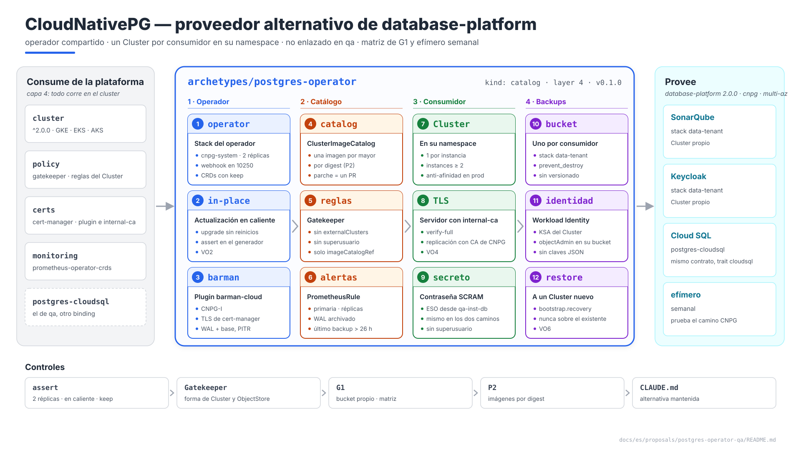

# PostgreSQL con CloudNativePG — arquetipo `postgres-operator` (capa 4), proveedor alternativo de `database-platform`

| | |
|---|---|
| **Estado** | Propuesta · revisión 2 |
| **Alcance** | El proveedor CloudNativePG de `database-platform`: el operador y su plugin de backups, lo que un consumidor puede crear, la forma de un `Cluster`, imágenes, TLS, backups, alta disponibilidad del operador, upgrades, observabilidad, red, contrato, stacks, políticas, ejecución y plan |
| **Por qué ahora** | Es el proveedor para los clientes que lo quieren todo en el cluster (`CLAUDE.md`: gestionado primero, CNPG como alternativa mantenida). SonarQube ya diseñó su camino CNPG (E2 §5.3) y le dejó requisitos (E2 §9). `qa` **no** lo enlaza: se prueba con la matriz de G1 y el efímero semanal (propuesta `postgres-cloudsql` §6) |
| **Especificación de referencia** | `archetype-model.md` (AM §n), `terramate-outputs-sharing-architecture.md` (§n), `risk-register.md` |
| **Diagramas** | `diagrams/*.mmd` (fuente Mermaid) y `diagrams/*.svg` (renderizados). El SVG se regenera desde el `.mmd`; no se edita a mano. `diagrams/06-bloques-presentacion.svg` (1920×1080, para presentaciones) se genera con `06-bloques-presentacion.py`, no con Mermaid |
| **Identificadores propios** | Decisiones `DO1…`, riesgos candidatos `RO1…`, verificaciones `VO1…`. Los riesgos reciben número `R54+` en `risk-register.md` si se adopta, detrás de los de las propuestas anteriores |

No reabre ninguna decisión de `CLAUDE.md`. El contrato es el de la propuesta `postgres-cloudsql` (§4): aquí se especifica el lado CNPG.



Fuente: [`diagrams/06-bloques-presentacion.py`](diagrams/06-bloques-presentacion.py) — vista de presentación; el detalle está en §1–§8.

---

## 0. Contexto

| Pregunta | Respuesta | Consecuencia |
|---|---|---|
| Qué es | Arquetipo `postgres-operator`, `kind: catalog`, **capa 4**, provee **`database-platform` 2.0.0** con el trait `cnpg` | Mismo contrato que `postgres-cloudsql` |
| Dónde se enlaza | En los entornos de los clientes que eligen CNPG. **No en `qa` ni en `prod` de esta plataforma** | Su calidad la sostienen la matriz de G1 y el efímero semanal |
| Stacks | 2: `operator` y `catalog` | Upgrade del operador separado de las imágenes y reglas (§7.2) |
| Componentes | Operador CloudNativePG, plugin **barman-cloud** (CNPG-I) para backups a almacenamiento de objetos | Apache-2.0 |
| Qué **no** hace | No crea bases de datos: cada consumidor crea su `Cluster` en **su** namespace | §1 |



Fuente: [`diagrams/01-contexto.mmd`](diagrams/01-contexto.mmd)

---

## 1. Lo que crea un consumidor

### 1.1 En su propio namespace

A diferencia de Kafka o Keycloak, los tenant resources de CNPG **no** viven en el namespace del proveedor: el operador reconcilia en todos los namespaces, y cada consumidor crea su `Cluster` en el suyo. Datos separados por construcción: un namespace, un `Cluster`, un bucket, una identidad.

| Kind | Para qué | Límite |
|---|---|---|
| `Cluster` | La instancia PostgreSQL del consumidor | 1 por instancia del consumidor |
| `ObjectStore` (`barmancloud.cnpg.io`) | Destino de sus backups: **su** bucket | 1 |
| `ScheduledBackup` | Backup base diario | 1 |
| `Backup` | Backup bajo demanda antes de un upgrade (E2 §8.3) | Sin límite; se purgan con la retención |
| `Pooler` | PgBouncer delante del `Cluster`, si el consumidor lo necesita | 1 |

**Corrección a AM §10.4.** Allí el proveedor `postgres-operator` autorizaba `Database` y `Role`, el modelo de una base lógica en un `Cluster` compartido. SonarQube lo descartó (E1 §4.4, opción A: vecino ruidoso en ambos sentidos) y ningún consumidor lo usa. La fila pasa a los kinds de la tabla anterior, y AM §10.4 aclara que, en un operador que reconcilia en todos los namespaces, los tenant resources se crean en el namespace del consumidor (§11).

### 1.2 Lo que un consumidor no puede hacer

| Prohibido | Motivo | Cómo |
|---|---|---|
| `externalClusters` hacia otro namespace o fuera del cluster | Un `Cluster` que se inicializa o replica desde otro lee los datos de otro tenant | Gatekeeper; solo se admite la restauración desde **su** `ObjectStore` |
| `enableSuperuserAccess: true` | Un superusuario con contraseña en un `Secret` | Gatekeeper |
| `imageName` libre | Imágenes sin controlar | Solo `imageCatalogRef` al catálogo de la plataforma (§2) |
| `barmanObjectStore` dentro del `Cluster` | Configuración antigua de backups, sustituida por el plugin | Gatekeeper |
| `postgresql.parameters` peligrosos | `archive_command`, `shared_preload_libraries` fuera de la lista blanca, `ssl*` | Gatekeeper, lista blanca |
| Credenciales estáticas de GCS en el `ObjectStore` | Clave JSON de larga duración | Gatekeeper: solo `googleCredentials.gkeEnvironment: true` (Workload Identity) |

---

## 2. Imágenes: un catálogo de la plataforma

| Pieza | Diseño |
|---|---|
| `ClusterImageCatalog` `postgresql` | Lo publica el stack `catalog`: una imagen por versión mayor soportada, **por digest**, copiada al Artifact Registry de la landing zone (regla P2 de Gatekeeper) |
| El consumidor | Referencia `imageCatalogRef: { kind: ClusterImageCatalog, name: postgresql, major: <N> }`, nunca `imageName` |
| Actualización de parches | La plataforma cambia el digest en el catálogo; CNPG hace el rolling de todos los `Cluster` de esa mayor, réplica a réplica y con switchover al final |
| Salida del contrato | `postgres_versions`: las mayores del catálogo |

Así una CVE en PostgreSQL es **un** PR de la plataforma, no uno por consumidor (DO3).

---

## 3. TLS y autenticación

| Tramo | Diseño | Motivo |
|---|---|---|
| Aplicación → `Cluster` | Certificado de servidor de **`internal-ca`**: el consumidor crea un `Certificate` para `<cluster>-rw.<namespace>.svc` y lo pasa en `spec.certificates.serverTLSSecret` y `serverCASecret` **(verificar, VO4)** | La CA única de la plataforma para el TLS interno (cert-manager DT10); el cliente ya confía en `internal-ca-bundle` |
| Replicación entre instancias | Certificados que gestiona CNPG | Tráfico interno del `Cluster` |
| Autenticación de la aplicación | Contraseña (SCRAM) del `Secret` que materializa ESO desde `qa-<instancia>-db` | El mismo secreto en los dos caminos (propuesta `postgres-cloudsql` §4.2) |
| `ssl_min_protocol_version` | `TLSv1.3` | Nada que negociar dentro del cluster |

---

## 4. Backups



Fuente: [`diagrams/03-backups.mmd`](diagrams/03-backups.mmd)

| Pieza | Diseño | Referencia |
|---|---|---|
| Destino | Un bucket **por consumidor**, `gs://disasterproject-<env>-<instancia>-pgbackup` (con el entorno: el proyecto non-prod es compartido), creado por el stack `data-tenant` del consumidor | E2 §5.3 |
| Identidad | Un KSA con el prefijo del entorno (`qa-<instancia>-db`, R54), creado por el stack `iam` del consumidor y referenciado con `spec.serviceAccountName` (§5), por Workload Identity directa; `objectAdmin` sobre **ese** bucket | E1 §4.4 |
| Plugin | barman-cloud: base diaria (`ScheduledBackup`) y WAL continuo, con PITR | — |
| Retención | 14 días en el `ObjectStore`; soft delete de GCS 7 días; **sin** versionado ni retention lock, que rompen la purga de barman | E1 §4.9 |
| Borrado del `Cluster` | El bucket es de otro stack y lleva `prevent_destroy`: los backups sobreviven al `Cluster` | RO1 |
| Restauración | A un `Cluster` **nuevo** con `bootstrap.recovery` desde su `ObjectStore`, nunca sobre el existente | E1 V5 |

---

## 5. El operador

| Ajuste | Valor | Motivo |
|---|---|---|
| Namespace | `cnpg-system`, PSS `restricted` | — |
| Versión mínima | **1.29** | Es la primera con `spec.serviceAccountName` (comprobado en el código de las ramas `release-1.28` y `release-1.29`). Hasta 1.28 el operador crea y usa un KSA con el nombre del `Cluster`, e ignora el `name` de `serviceAccountTemplate`; en el proyecto non-prod compartido eso obligaría a llamar al `Cluster` `qa-<instancia>-db` para tener el prefijo del entorno (R54). Desde 1.29 el operador usa el KSA indicado, que debe existir (si no, el `Cluster` falla con `serviceAccount not found`), no crea otro, y enlaza a él su `RoleBinding`. El campo es inmutable y excluyente con `serviceAccountTemplate` |
| Réplicas | **2**, elección de líder, `PodDisruptionBudget` | El failover de un `Cluster` lo decide el operador: sin operador, una primaria caída no se sustituye (RO2) |
| Webhook | Puerto **10250** **(verificar la opción del chart, VO1)** | El mismo motivo que Gatekeeper, ESO y cert-manager: GKE con nodos privados |
| Actualización del instance manager | En caliente (`ENABLE_INSTANCE_MANAGER_INPLACE_UPDATES`) **(verificar, VO2)** | Sin ella, **cada upgrade del operador reinicia todas las bases de todos los consumidores** (RO3) |
| Plugin barman-cloud | En `cnpg-system`; su TLS con el operador lo emite **cert-manager** | Requisito del plugin: por eso el arquetipo requiere `certs` |
| CRDs | `helm.sh/resource-policy: keep` | Borrar el CRD `Cluster` borra todos los `Cluster`, y con ellos sus PVC (RO1) |

---

## 6. Observabilidad y red

### 6.1 Alertas

Este proveedor es capa 4 y requiere `monitoring`: declara sus propias reglas, para **todos** los `Cluster`, enrutadas al dueño por la etiqueta del namespace (monitorización §5.2).

| Alerta | Señal | Umbral |
|---|---|---|
| Sin primaria o sin réplicas | Estado del `Cluster` (`cnpg_collector_*`) | Cualquiera durante 5 min |
| Retraso de réplica | `cnpg_pg_replication_lag` | > 30 s |
| Archivado de WAL fallando | `cnpg_pg_stat_archiver_failed_count` creciendo | Cualquiera: sin WAL no hay PITR |
| Último backup correcto | Marca del último backup | > 26 h (E1 §4.7) |
| Disco | PVC > 80 % | — |
| Conexiones | > 80 % de `max_connections` | — |
| Operador | Réplicas listas del operador | < 1 durante 5 min |

### 6.2 Red

| Origen | Destino | Puerto | Nota |
|---|---|---|---|
| Plano de control de GKE | Webhook del operador | 10250 | §5 |
| Operador | Instancias de cada `Cluster` | 8000 | Estado del instance manager; la `NetworkPolicy` del consumidor lo admite (E1 §4.8) |
| Operador y plugin | API de Kubernetes | 443 | |
| Operador ↔ plugin | gRPC con TLS de cert-manager | Puerto del plugin **(verificar, VO3)** | |
| Instancias | `storage.googleapis.com` por Private Google Access | 443 | Backups |
| Prometheus | Instancias | 9187 | |

---

## 7. El contrato y el arquetipo

### 7.1 Salidas (contrato `database-platform` 2.0.0)

| Salida | Valor | Uso |
|---|---|---|
| `provider` | `cnpg` | Rama del chart del consumidor |
| `connection_mode` | `service` | Endpoint `<cluster>-rw.<namespace>.svc:5432` |
| `postgres_versions` | Mayores del `ClusterImageCatalog` | El consumidor elige la suya |
| `backup_region` | La del entorno | Ubicación del bucket |
| `operator_version` | La versión de CNPG que fija el arquetipo | Assert del consumidor sobre la API que usa su chart (E2 §5.3). **Es un global**, no outputs sharing: la fija la versión del arquetipo, y con ella desaparece la excepción de mock de E2 §5.10 |
| `image_catalog` | `postgresql` | `imageCatalogRef` |

### 7.2 Manifiesto

```yaml
# archetypes/postgres-operator/manifest.yaml
apiVersion: archetype/v1
kind: Archetype

metadata:
  name: postgres-operator
  version: 0.1.0
  layer: 4
  kind: catalog
  description: CloudNativePG compartido; cada consumidor crea su propio Cluster en su namespace
  owners: [team-platform]

runtimes: [gke, eks, aks]

requires:
  - capability: cluster
    version: "^2.0.0"
  - capability: policy
    version: "^1.1.0"
    traits: [gatekeeper]
  - capability: certs
    version: "^1.1.0"
    traits: [cert-manager]
  - capability: monitoring
    version: "^1.5.0"
    traits: [prometheus-operator-crds]

provides:
  - capability: database-platform
    version: 2.0.0
    traits: [cnpg, multi-az]
    outputs:
      - { name: provider,          from: catalog }
      - { name: connection_mode,   from: catalog }
      - { name: postgres_versions, from: catalog }
      - { name: backup_region,     from: catalog }
      - { name: operator_version,  from: operator }
      - { name: image_catalog,     from: catalog }
    tenant_resources:                                  # en el namespace del consumidor (§1.1)
      - kind: Cluster
        namePrefix: "{{ archetype }}-"
        maxCount: 1
      - kind: ObjectStore
        namePrefix: "{{ archetype }}-"
        maxCount: 1
      - kind: ScheduledBackup
        namePrefix: "{{ archetype }}-"
        maxCount: 1
      - kind: Backup
        namePrefix: "{{ archetype }}-"
        maxCount: 20
      - kind: Pooler
        namePrefix: "{{ archetype }}-"
        maxCount: 1

stacks:
  - name: operator
  - name: catalog
    after: [operator]

capacity:
  cpu_millicores: 600
  memory_mib: 1024
  pods: 3
  workload_identities: 0
```

`runtimes: [gke, eks, aks]`: lo único de GCP es el destino de los backups y su identidad, que son ramas del generador `data-tenant`. El proveedor no tiene identidad de GCP: cada `Cluster` usa la suya.

### 7.3 Los stacks

| Stack | Contenido | Entradas por sharing |
|---|---|---|
| `operator` | Namespace `cnpg-system`; `helm_release` de CNPG (CRDs con `keep`, 2 réplicas, webhook en 10250, instance manager en caliente) y del plugin barman-cloud con su `Certificate`; `NetworkPolicy` | `cluster_*` |
| `catalog` | `ClusterImageCatalog` `postgresql`; `ConstraintTemplate` y `Constraint` de §1.2; `PrometheusRule` de §6.1 | `cluster_*` |

**Por qué dos stacks.** Un parche de PostgreSQL (cambio de digest en el catálogo) no debe replanificar el operador, y un upgrade del operador no debe tocar el catálogo ni las reglas.

---

## 8. Políticas y ejecución

### 8.1 `assert`

```hcl
assert {
  assertion = global.cnpg_values.replicaCount >= 2
  message   = "database-platform: 2 réplicas del operador — sin él no hay failover (RO2)"
}
assert {
  assertion = global.cnpg_values.config.data.ENABLE_INSTANCE_MANAGER_INPLACE_UPDATES == "true"
  message   = "database-platform: instance manager en caliente — si no, cada upgrade reinicia todas las bases (RO3)"
}
assert {
  assertion = global.cnpg_values.crds.keep
  message   = "database-platform: CRDs con keep — borrar el CRD Cluster borra los datos (RO1)"
}
```

### 8.2 Gatekeeper y conftest

| Regla | Dónde | Qué comprueba |
|---|---|---|
| **Nueva:** forma del `Cluster` | Gatekeeper | §1.2; `instances` ≥ 2 salvo en efímeros; `imageCatalogRef` obligatorio; `serviceAccountName` obligatorio y con el prefijo del entorno, sin `serviceAccountTemplate`; anti-afinidad por zona en `prod` |
| **Nueva:** forma del `ObjectStore` | Gatekeeper | Destino `gs://…-<instancia>-pgbackup`; solo Workload Identity |
| **Nueva:** bucket propio | G1 | El destino del `ObjectStore` es el bucket del stack `data-tenant` de la misma instancia |
| Existente | Gatekeeper | P2 (imágenes del catálogo por digest), P4 (límite de memoria del `Cluster`) |

### 8.3 Ejecución

| Qué | Cómo |
|---|---|
| Primer despliegue | En un entorno que enlaza CNPG: después de Gatekeeper y cert-manager, antes de cualquier consumidor. En esta plataforma, solo en el efímero semanal |
| Upgrade del operador | Stack `operator`; en caliente, sin reiniciar las bases (VO2); ensayo en el efímero |
| Parche de PostgreSQL | Stack `catalog`: nuevo digest; rolling con switchover |
| Mayor de PostgreSQL | Del consumidor: nuevo `Cluster` con importación, o upgrade mayor declarativo si la versión fijada de CNPG lo soporta **(verificar, VO5)**; siempre con un `Backup` antes (E2 §8.3) |
| Destrucción del proveedor | Solo sin ningún `Cluster` vivo: un assert lo comprueba contra el ledger |

---

## 9. Riesgos candidatos

| # | Riesgo | Probabilidad | Impacto | Mitigación |
|---|---|---|---|---|
| RO1 | **Borrado de datos por cascada**: el CRD `Cluster`, o un `Cluster`, se borra y arrastra sus PVC | Baja | Crítico | CRDs con `keep`; backups en un bucket con `prevent_destroy`; restauración a un `Cluster` nuevo |
| RO2 | **Operador caído**: sin failover automático | Media | Alta | 2 réplicas con PDB; alerta |
| RO3 | **Upgrade del operador reinicia todas las bases** | Alta sin el ajuste | Alta — corte simultáneo de todos los consumidores | Instance manager en caliente con assert; VO2 |
| RO4 | **Un `Cluster` lee los datos de otro** por `externalClusters` | Baja con la regla | Crítico | Gatekeeper (§1.2) |
| RO5 | **Camino no usado roto** en esta plataforma | Alta sin control | Alta | Matriz de G1 y efímero semanal (propuesta `postgres-cloudsql` §6) |

---

## 10. Verificaciones

| # | Verificación | Resultado que la cierra |
|---|---|---|
| VO1 | Webhook del operador en 10250 en GKE con nodos privados | `apply` de un `Cluster` inválido rechazado por el webhook |
| VO2 | Upgrade del operador con instance manager en caliente | Ningún pod de PostgreSQL reiniciado |
| VO3 | Plugin barman-cloud con TLS de cert-manager | `ScheduledBackup` completo y en el bucket (= V11 de E2) |
| VO4 | Certificado de servidor de `internal-ca` en `spec.certificates` | El cliente conecta con `sslmode=verify-full` contra `internal-ca-bundle` |
| VO5 | Upgrade mayor declarativo en la versión fijada | Mayor nueva sin pérdida de datos en un efímero; si no se soporta, procedimiento de importación |
| VO6 | Restauración a un `Cluster` nuevo | = V5 de E1 |
| VO7 | `spec.serviceAccountName` con un KSA de Workload Identity en la versión fijada (≥ 1.29) | Backup en el bucket con el principal `…/sa/qa-<instancia>-db`; el operador no crea un KSA con el nombre del `Cluster`. **Comprobado en el código**; falta la prueba en un cluster |

---

## 11. Cambios a otros documentos

| Documento | Cambio | Estado |
|---|---|---|
| AM §10.4 (`docs/en/` y `docs/es/`) | Fila `postgres-operator`: `Cluster`, `ObjectStore`, `ScheduledBackup`, `Backup`, `Pooler`; nota sobre tenant resources en el namespace del consumidor | **Aplicado** |
| SonarQube E2 §5.3 y §5.10 | `cnpg_version` pasa a ser `operator_version`, un global: desaparecen la entrada por sharing y la excepción de mock. `imageName` pasa a `imageCatalogRef` | **Aplicado** |
| SonarQube E2 §9 | El requisito a `postgres-operator` queda resuelto aquí | **Aplicado** |

---

## 12. Decisiones

| # | Decisión | Estado | Recomendación | Alternativa |
|---|---|---|---|---|
| DO1 | Modelo de datos | Consecuencia de E1 §4.4 | Un `Cluster` por consumidor en su namespace | `Database` y `Role` en un `Cluster` compartido |
| DO2 | Backups | Propuesta | Plugin barman-cloud, un bucket por consumidor, Workload Identity | `barmanObjectStore` en el `Cluster` |
| DO3 | Imágenes | Propuesta | `ClusterImageCatalog` de la plataforma, por digest | `imageName` por consumidor |
| DO4 | TLS | Propuesta, pendiente de VO4 | Servidor con `internal-ca`; replicación con la CA de CNPG | Todo con la CA de CNPG |
| DO5 | Operador | Propuesta | 2 réplicas; instance manager en caliente; webhook en 10250 | 1 réplica; rolling de todas las bases en cada upgrade |
| DO6 | `operator_version` | Propuesta | Global determinista | Outputs sharing con mock excepcional |

---

## 13. Plan de implementación

| Fase | Contenido | Criterio de salida | Estimación |
|---|---|---|---|
| **0 · Prerrequisitos** | GKE, Gatekeeper y cert-manager en un efímero; **VO1** | Webhook alcanzable | 1 día |
| **1 · Operador** | Stack `operator`; **VO2**, **VO3** | Operador y plugin sanos; upgrade sin reinicios | 1 día |
| **2 · Catálogo y reglas** | Stack `catalog`; reglas de §8.2 | `gator test` del chart de SonarQube en rama CNPG en verde | 1 día |
| **3 · Consumidores** | SonarQube y Keycloak por `data-tenant` en el efímero; **VO4**, **VO6**, **VO7**; VO5 | Pruebas de humo en verde; efímero semanal programado | 2 días |

Cinco días para una persona. Su uso continuo en esta plataforma es el efímero semanal.
