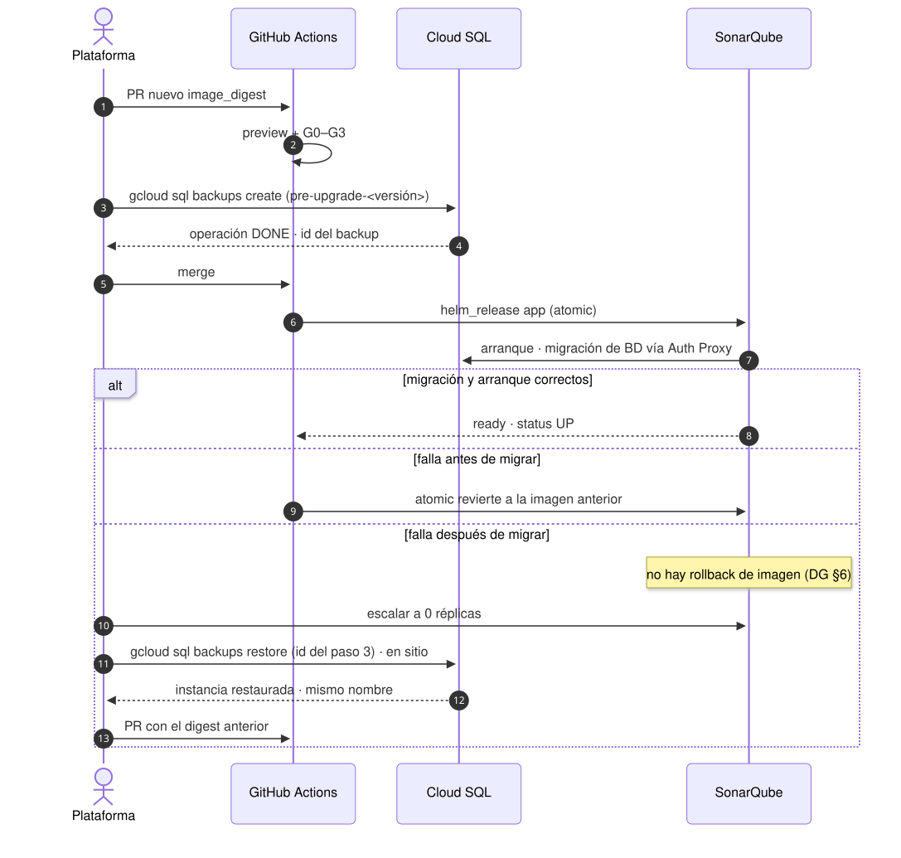

# SonarQube Community en `qa` con Cloud SQL for PostgreSQL — variante de datos

| | |
|---|---|
| **Estado** | Propuesta · revisión 2 · **variante** de [`../sonarqube-qa/`](../sonarqube-qa/README.md) |
| **Alcance** | Sustituir el `Cluster` de CloudNativePG de SonarQube por una instancia **Cloud SQL for PostgreSQL** dedicada: modelo, instancia, conectividad, identidad, secretos, red, backup, observabilidad, stacks, políticas, ejecución y plan |
| **Base** | Etapa 1 [`README.md`](../sonarqube-qa/README.md) (E1 §n) y etapa 2 [`02-archetype-sonarqube.md`](../sonarqube-qa/02-archetype-sonarqube.md) (E2 §n). **Todo lo que este documento no menciona queda igual que en la base** |
| **Especificación de referencia** | `archetype-model.md` (AM §n), `terramate-outputs-sharing-architecture.md` (§n), `developer-guide.md` (DG §n), `risk-register.md` |
| **Diagramas** | `diagrams/*.mmd` (fuente Mermaid) y `diagrams/*.svg` (renderizados). El SVG se regenera desde el `.mmd`; no se edita a mano |
| **Identificadores propios** | Decisiones `DC1…`, riesgos candidatos `RC1…`, verificaciones `VC1…`. Los riesgos candidatos reciben número `R54+` en `risk-register.md` si la variante se adopta |

Nada de este documento reabre decisiones de `CLAUDE.md`. Sí reabre **D2** de la base (E1 §8), que eligió CNPG y dejaba Cloud SQL como alternativa "solo si se abandona el requisito OSS para datos". Esta variante es exactamente esa alternativa, desarrollada; §1 dice qué se gana y qué se pierde.

---

## 0. Resumen

**La base de datos de SonarQube pasa de un `Cluster` CNPG dentro de GKE a una instancia Cloud SQL for PostgreSQL dedicada en `disasterproject-qa`, con IP privada por Private Services Access (PSA) y conexión a través de Cloud SQL Auth Proxy como sidecar.**

**No hace falta ningún mecanismo nuevo.** AM §5.5 ya define el caso: `database-platform` es `optional`, y el arquetipo declara dos stacks condicionales — `data` (instancia gestionada dedicada) cuando la capability no está enlazada, `data-tenant` (tenant del operador) cuando sí. Qué camino se toma lo decide el **binding del entorno**, no el arquetipo. Consecuencia: el mismo arquetipo `sonarqube` 0.2.0 sirve a la base y a esta variante; la diferencia entre ambas propuestas es una línea del binding de `qa` y la implementación del stack `data`.

| Cambia | No cambia |
|---|---|
| Binding de `qa`: `database-platform` **sin enlazar**, como en `demos` (AM §7) | Runtime, node pool `sonar`, sysctl, PSS `restricted` (E1 §4.1–4.2) |
| Stack `data-tenant` (CNPG) → stack `data` (Cloud SQL), generador `gen_data.tm.hcl` rama GCP | Autenticación SAML, Keycloak como broker de Entra ID (E1 §4.6) |
| Pod de SonarQube: sidecar **Cloud SQL Auth Proxy**; JDBC a `127.0.0.1` | Publicación, Gateway, GLB, Cloud Armor (E1 §4.5) |
| La versión del secreto `qa-sonarqube-db` la escribe `data`, no `secrets` (§5) | Resto de secretos y su modelo ESO + Secret Manager (E1 §4.3) |
| `NetworkPolicy`: salen las reglas de CNPG, entra egress al rango PSA (§6) | Cadena de suministro de la imagen propia (E1 §4.10) — se añade la imagen del proxy |
| Backup: gestionado por Cloud SQL; **desaparece el bucket** `…-pgbackup` (§7) | Integración con GitHub Actions y dimensionamiento del CE (E1 §4.11–4.12) |
| Métricas y alertas de PostgreSQL: Cloud Monitoring en vez del exporter de CNPG (§8) | Acceso del pipeline al plano de control (E1 §4.13), KMS (E1 §4.14), VPC separada (E1 §4.15) |
| Fase B de la plataforma: **sin** `gcp-qa-postgres-operator`; Keycloak también toma Cloud SQL (§2.2) | Stacks `iam`, `secrets`, `sso`, `config`, `frontdoor`, `observability` en lo esencial |

---

## 1. Qué se gana y qué se pierde

| Aspecto | CNPG (base) | Cloud SQL (esta variante) |
|---|---|---|
| Operación | Operador, plugin barman-cloud, PVCs, upgrades del operador y de PostgreSQL a cargo de la plataforma | Gestionado. Parches y mantenimiento de Google, dentro de una ventana fijada |
| Requisito "OSS para datos" | Se cumple | **Se abandona para datos.** El principio de E1 §3.3 "todo lo que corre en el cluster es OSS" se mantiene: Cloud SQL no corre en el cluster; pasa a la lista de "lo que queda en GCP" junto a KMS, Secret Manager y GCS |
| Disponibilidad | 2 instancias (primaria + réplica síncrona) en el cluster | `ZONAL`, en la zona del node pool `sonar` (DC3). SonarQube ya es zonal (R53); una BD regional no sube la disponibilidad del conjunto |
| Ventana de PITR | 14 días (WAL en GCS, §12.6) | **7 días**: máximo de `transaction_log_retention_days` en edición Enterprise. 14 backups diarios retenidos (RC7) |
| Backups y borrado | En un bucket que sobrevive al `Cluster` | Ligados a la instancia: **se borran con ella** salvo el backup final (RC1) |
| Restauración | `Cluster` nuevo con `bootstrap.recovery` | Restore **en sitio** de un backup (rollback de upgrade) o **clon** a una instancia nueva (PITR) (§7) |
| Upgrade mayor de PostgreSQL | `Cluster` nuevo e importación, o upgrade declarativo según versión del operador | En sitio, cambiando `database_version` (VC10) |
| Red | Service dentro del namespace | IP privada en el rango PSA + Auth Proxy; egress por `ipBlock` (§6) |
| Portabilidad | El camino `data-tenant` funciona igual en `eks` y `aks` | El camino `data` solo tiene rama GCP; un binding `eks`/`aks` sin `database-platform` falla en `generate` hasta que existan sus ramas (§9.3) |
| Coste | Consume capacidad del cluster: 2 × (2 vCPU, 8 GiB) + 2 × 100 GiB de disco | Instancia facturada 24 × 7: vCPU, memoria, SSD y almacenamiento de backups por encima del tamaño del disco. **Comparar con la calculadora de precios antes de cerrar DC1**; no se da cifra aquí |
| Capacidad del cluster | El node pool `general` necesita hueco para 2 pods de 8 GiB | Se libera ese hueco; el proxy añade ≈ 128 MiB al pod de SonarQube |

**Recomendación.** Cloud SQL si el equipo prefiere no operar PostgreSQL y acepta dos cosas: el abandono del requisito OSS para datos y una ventana de PITR de 7 días en `qa`. Si cualquiera de las dos es inaceptable, la base (CNPG) sigue siendo válida, y el arquetipo soporta las dos sin cambios (§0).

---

## 2. Encaje en el modelo de arquetipos

### 2.1 Qué se resuelve distinto

| Paso de resolución (AM §12) | Resultado en `qa` |
|---|---|
| 4 · vincular capability → proveedor | `database-platform` **sin proveedor**. Es `optional`: aviso, no error |
| 9 · evaluar condiciones de stack | `!resolved(database-platform)` es verdadero: se genera `data`, se **omite** `data-tenant` |
| 12 · claims | **Ninguno nuevo.** La IP de Cloud SQL sale del rango PSA, que reclama el entorno en la zona `data`; una base de datos dentro de ese rango no es un claim de CIDR (AM §9.3) |
| 14 · capacity | `managed_db_instances: 1`. En un entorno dedicado no se aplican budgets (E1 §0); se declara para que el mismo manifiesto funcione en un entorno compartido |

### 2.2 Keycloak toma el mismo camino — por diseño, no por elección

El binding decide **por entorno**, no por arquetipo: hay exactamente un proveedor por capability y entorno (AM §7). Si `qa` deja `database-platform` sin enlazar, **todo** arquetipo con el par de stacks condicionales toma el camino dedicado. Keycloak lo tiene (AM §5.1: *"data — its own Cloud SQL instance"*), así que en `qa` Keycloak también tendrá su Cloud SQL, y `gcp-qa-postgres-operator` **no se despliega**: no queda ningún consumidor.

Mezclar — Cloud SQL para SonarQube y CNPG para Keycloak — no es posible con el mecanismo de binding, y es deliberado: la decisión es de aislamiento de datos del entorno, no de cada aplicación (AM §5.5). El detalle de Keycloak queda para su propuesta; aquí solo se registra la consecuencia (DC8).

### 2.3 Capas y orden de despliegue



Fuente: [`diagrams/01-capas-dependencias.mmd`](diagrams/01-capas-dependencias.mmd)



Fuente: [`diagrams/02-orden-despliegue.mmd`](diagrams/02-orden-despliegue.mmd)

| Fase (E1 §6) | Cambio |
|---|---|
| **A** | `gcp-qa-network` configura PSA: rango `qa-psa` en la zona `data` y `google_service_networking_connection`. `gcp-qa-cloudmon` publica `notification_channel_id` |
| **B** | Sale `gcp-qa-postgres-operator`. `gcp-qa-keycloak` crea su propio Cloud SQL |
| **C** | `data-tenant` → `data`. Mismos 9 stacks |

---

## 3. La instancia Cloud SQL

| Ajuste | Valor | Motivo |
|---|---|---|
| Nombre | `qa-sonarqube-main-g<generación>`, empezando en `g1` | **Un nombre de instancia borrada no se puede reutilizar durante una semana.** El sufijo de generación permite restaurar por clon (§7) sin chocar con esa regla (RC5) |
| Nombre de conexión | `disasterproject-qa:europe-west1:qa-sonarqube-main-g1` | Determinista: **global**, no outputs sharing (platform-overview §4) |
| Edición | `ENTERPRISE` | Enterprise Plus (99,99 %, mantenimiento casi sin corte, PITR hasta 35 días) no se justifica en `qa` (DC2) |
| Versión | `POSTGRES_<mayor>`: la mayor que soporte la versión fijada de SonarQube **(verificar la matriz de SonarQube)** | Igual que la imagen de CNPG en E2 §5.3 |
| Tier | `db-custom-2-8192` (2 vCPU, 8 GB) | El mismo tamaño por instancia que la base (E1 §4.12) |
| Disponibilidad | `ZONAL`, `location_preference.zone` = zona del node pool `sonar` | DC3. Misma zona: latencia mínima y ningún modo de fallo nuevo |
| Disco | SSD, 100 GB, `disk_autoresize = true`, `disk_autoresize_limit = 500` | El disco crece solo pero **nunca encoge**; el límite evita que un bucle de escritura lo lleve al máximo del producto |
| Red | `ipv4_enabled = false`, `private_network` = VPC de `qa`, `allocated_ip_range = "qa-psa"` | Sin IP pública. Además, org policy `constraints/sql.restrictPublicIp` en el proyecto (§7.4 arquitectura) |
| TLS | `ssl_mode = "ENCRYPTED_ONLY"` | Rechaza conexiones directas sin cifrar; el proxy cifra siempre |
| Flags | `max_connections = 200`; `cloudsql.iam_authentication = on` | Conexiones como en la base. IAM auth solo para acceso humano just-in-time (§4.3), no para la aplicación |
| Backups | Diarios a las 02:00 UTC, **`location = "europe-west1"`**, 14 retenidos | **Sin `location`, Cloud SQL guarda los backups en la multirregión más cercana (`eu`)**, que choca con el confinamiento de región (RC6) |
| PITR | `point_in_time_recovery_enabled = true`, `transaction_log_retention_days = 7` | Máximo en Enterprise (RC7) |
| Backup final | `final_backup_config { enabled = true, retention_days = 30 }` **(verificar en la versión del proveedor, VC6)** | Sin él, borrar la instancia borra todos sus backups (RC1) |
| Mantenimiento | Domingo 03:00 UTC, `update_track = "stable"` | El mantenimiento reinicia la instancia; fuera de la jornada (RC2) |
| Protección | `deletion_protection = true` **y** `settings.deletion_protection_enabled = true` | Son dos protecciones distintas: la primera es solo de OpenTofu; la segunda es de la API y protege también frente a la consola y `gcloud` |
| Query Insights | Activado | Diagnóstico de consultas lentas sin coste en Enterprise |
| Usuario `postgres` | Sin contraseña fijada; nadie lo usa | El acceso administrativo humano es por IAM, just-in-time (§4.3) |

---

## 4. Conectividad e identidad



Fuente: [`diagrams/04-conexion-cloudsql.mmd`](diagrams/04-conexion-cloudsql.mmd)

### 4.1 Cómo se conecta SonarQube

| Opción | Cómo | Veredicto |
|---|---|---|
| A. IP privada directa | JDBC a la IP de la instancia con `sslmode=verify-ca` y la CA del servidor en un `ConfigMap` | No: la única barrera además de la red es la contraseña; la CA del servidor rota y hay que seguirla |
| **B. Cloud SQL Auth Proxy como sidecar** | El proxy abre `127.0.0.1:5432`; SonarQube se conecta ahí sin TLS; el proxy cifra hacia la instancia con un certificado efímero | **Sí** (DC4): autorización IAM además de la contraseña, TLS sin gestión de certificados, rotación transparente |
| C. Cloud SQL Java Connector | *Socket factory* en la URL JDBC | No: exige añadir el jar al classpath de SonarQube en la imagen, fuera de `extensions/plugins`; frágil en cada upgrade |

El proxy va como **sidecar nativo** (`initContainers` con `restartPolicy: Always`, Kubernetes ≥ 1.29): arranca antes que SonarQube, que así no falla la primera conexión, y termina después, de modo que no corta las conexiones durante el apagado.

```yaml
# valores del chart del arquetipo, parte del stack app (claves exactas: verificar, VC4)
sonarqube:
  initContainers:                      # o extraInitContainers, según la versión del chart
    - name: cloud-sql-proxy
      image: europe-docker.pkg.dev/disasterproject-lz/platform/cloud-sql-proxy@sha256:<digest>
      restartPolicy: Always            # sidecar nativo
      args:
        - --private-ip
        - --port=5432
        - --structured-logs
        - --health-check
        - --http-address=0.0.0.0
        - --prometheus
        - --max-sigterm-delay=30s
        - disasterproject-qa:europe-west1:qa-sonarqube-main-g1
      startupProbe: { httpGet: { path: /startup, port: 9090 }, periodSeconds: 1, failureThreshold: 30 }
      resources:
        requests: { cpu: 100m, memory: 128Mi }
        limits:   { memory: 128Mi }
      securityContext:
        runAsNonRoot: true
        allowPrivilegeEscalation: false
        readOnlyRootFilesystem: true
        capabilities: { drop: [ALL] }
        seccompProfile: { type: RuntimeDefault }
  jdbcOverwrite:
    enabled: true
    jdbcUrl: jdbc:postgresql://127.0.0.1:5432/sonarqube
    jdbcUsername: sonarqube
    jdbcSecretName: sonarqube-db
    jdbcSecretPasswordKey: password
```

El resto de §6.1 de E2 no cambia. El límite de memoria de 12 GiB es del contenedor `sonarqube`; el proxy tiene el suyo, y el assert de heaps (E2 §7.1) sigue siendo válido tal cual.

### 4.2 Identidad del proxy e IAM

| Elemento | Valor |
|---|---|
| Identidad | KSA `sonarqube` por Workload Identity, principal directo `principal://…/subject/ns/sonarqube/sa/sonarqube`, sin cuenta de servicio de GCP. `automount_service_account_token` sigue en `false`: Workload Identity usa el servidor de metadatos, no el token del KSA |
| Rol | `roles/cloudsql.client` (`cloudsql.instances.connect`, `cloudsql.instances.get`) |
| Ámbito | **A nivel de proyecto con condición**: el rol no admite binding sobre la instancia. `resource.type == "sqladmin.googleapis.com/Instance" && resource.name == "projects/disasterproject-qa/instances/qa-sonarqube-main-g1"` |
| Si VC1 falla | Si el proxy o Cloud SQL no aceptan el principal federado directo: cuenta de servicio `sonarqube-sql@disasterproject-qa`, `roles/iam.workloadIdentityUser` para el KSA y anotación en el KSA. El rol y la condición no cambian |

**La condición de arquitectura §7.4 no funcionaba tal como estaba escrita.** Usaba `resource.name.endsWith('${var.db_connection_name}')`, pero el nombre de conexión tiene forma `proyecto:región:instancia` y el nombre de recurso que evalúa IAM es `projects/<p>/instances/<i>`. Nunca coincide: el grant queda sin efecto y la conexión se deniega. Aquí se usa la forma correcta (VC2); §7.4 está corregida en los dos idiomas (§12).

### 4.3 Acceso humano

Sin contraseña compartida de administración. Un SRE que necesita entrar a la BD recibe, just-in-time por Privileged Access Manager (como la lectura de secretos, E1 §4.3), `roles/cloudsql.instanceUser` y `roles/cloudsql.client` con la misma condición, y se conecta con su identidad mediante `cloudsql.iam_authentication`. El usuario IAM de base de datos se crea una vez para el grupo de SRE (`google_sql_user` de tipo `CLOUD_IAM_GROUP`) **(verificar disponibilidad del tipo grupo en la versión del proveedor)**.

La aplicación **no** usa autenticación IAM de base de datos (DC5): exigiría una cuenta de servicio de GCP — los usuarios IAM de Cloud SQL son usuarios, cuentas de servicio o grupos, no principales federados — y que SonarQube arranque con `sonar.jdbc.password` vacío, sin verificar. Queda como mejora posterior.

---

## 5. Secretos: la contraseña de la base de datos



Fuente: [`diagrams/08-secreto-db.mmd`](diagrams/08-secreto-db.mmd)

La contraseña debe ser **idéntica** en dos sitios: el usuario de Cloud SQL y el secreto `qa-sonarqube-db` que ESO lleva al pod. Un valor `ephemeral` no cruza stacks, y leer el secreto desde el pipeline exigiría `secretAccessor`, que E1 §4.3 prohíbe. Por eso:

| Pieza | Stack | Qué hace |
|---|---|---|
| Contenedor `qa-sonarqube-db` | `secrets` (sin cambios) | Existe, con su IAM para ESO. En el mapa de secretos pasa a `generate = false`: `secrets` **no** escribe versión |
| Contraseña | `data` | Un `ephemeral "random_password"`, escrito en el mismo apply en `google_sql_user.password_wo` y en `google_secret_manager_secret_version.secret_data_wo` |
| Versión de escritura | `data` | `v = generation × 1000 + password_version`, la misma en los dos atributos `*_wo_version`. Una generación nueva (clon, §7) o una rotación reescribe los dos lados a la vez; sin cambios, ninguno se reenvía |
| `ExternalSecret sonarqube-db` | `secrets` (sin cambios) | Materializa el `Secret`. En el primer despliegue queda sin sincronizar hasta que `data` escribe la versión; ESO reintenta |

Formato del valor: JSON `{"username": "sonarqube", "password": "…"}`, igual que el "usuario y password JDBC" de la base (E1 §4.3).

**Rotación** (RC4). PostgreSQL no corta las sesiones abiertas al cambiar la contraseña; SonarQube lee la suya al arrancar. Procedimiento: PR que incrementa `password_version` → apply de `data` → esperar a que el `ExternalSecret` refleje la versión nueva → reiniciar el pod. Reiniciar antes de que ESO sincronice deja a SonarQube con la contraseña vieja y sin conexión.

`password_wo` en `google_sql_user` y `secret_data_wo` se verifican juntos en VC3 (amplía V9).

---

## 6. Red



Fuente: [`diagrams/05-red.mmd`](diagrams/05-red.mmd)

`NetworkPolicy` default-deny de entrada y salida en `sonarqube`, sustituye a la tabla de E1 §4.8:

| Origen | Destino | Puerto | Cambio |
|---|---|---|---|
| Envoy | SonarQube | 9000 | = |
| Prometheus | SonarQube / proxy | 9000 / 9090 | Sale 9187 (exporter CNPG); entra 9090 (métricas del proxy) |
| Pod SonarQube (proxy) | Rango PSA `qa-psa` | **3307** | Nuevo. `ipBlock` con el CIDR del rango: selector `cidr:` legítimo, como los rangos de health check (AM §6.3). El proxy usa 3307, no 5432 |
| Pod SonarQube (proxy) | `sqladmin.googleapis.com` vía Private Google Access | 443 | Nuevo |
| Todos | kube-dns | 53 | = |
| SonarQube | Internet | **Denegado** | = |
| ~~SonarQube → CNPG, CNPG ↔ CNPG, operador → CNPG, CNPG → GCS~~ | | | **Salen** |

El CIDR de `qa-psa` es determinista (lo asigna el ledger al entorno): global, no sharing. Sin reglas de firewall de VPC nuevas: el egress de los nodos está permitido y el lado de Cloud SQL lo gestiona Google.

---

## 7. Backup y recuperación



Fuente: [`diagrams/06-datos-backup.mmd`](diagrams/06-datos-backup.mmd)

Sustituye la fila de PostgreSQL de E1 §4.9:

| Qué | Cómo | Dónde | Retención |
|---|---|---|---|
| PostgreSQL | Backups automáticos diarios + logs de transacciones (PITR) | Almacenamiento de backups de Cloud SQL, `europe-west1` | 14 backups; PITR 7 días |
| Antes de cada upgrade | Backup bajo demanda | Idem | Hasta que se borre a mano |
| Al borrar la instancia | Backup final | Idem | 30 días |

**Desaparece el bucket** `disasterproject-qa-sonarqube-main-pgbackup` y con él su IAM y la excepción de Checkov por versionado (E2 §7.3).

| Situación | Procedimiento | Efecto |
|---|---|---|
| Rollback de un upgrade fallido (R52) | **Restore en sitio** del backup bajo demanda (`gcloud sql backups restore`) | Sobrescribe la instancia; mismo nombre, misma conexión, sin cambios de configuración. Rápido |
| Incidente de datos, PITR | **Clon** por OpenTofu: PR que pone `db.generation = 2` y `db.clone_from = { instance = "…-g1", point_in_time = "<RFC 3339>" }` | Nace `qa-sonarqube-main-g2`; `app` pasa a apuntar a ella en el mismo PR. `g1` se borra en un PR posterior, quitando sus dos protecciones |

El clon por OpenTofu (bloque `clone` de `google_sql_database_instance`) mantiene la instancia restaurada dentro del estado, en vez de crearla con `gcloud` y tener que importarla. Ensayo de las dos rutas antes de dar el entorno por bueno (VC5, sustituye V5 y V11).

---

## 8. Observabilidad

Sustituye la fila de PostgreSQL de E1 §4.7. Las métricas de Cloud SQL están en Cloud Monitoring, no en Prometheus.

| Opción | Veredicto |
|---|---|
| **Alertas de Cloud Monitoring creadas por el stack `data`**, al mismo canal de notificación que Alertmanager | **Sí** (DC6): métricas nativas, nada que operar. La capa 1b ya es la vía de alertas de GCP (alertas de auditoría, E1 §4.7) |
| `stackdriver-exporter` en el arquetipo de monitorización | No por ahora: un componente más, lecturas de la API de Monitoring y una identidad más, para ver en Prometheus lo que Cloud Monitoring ya alerta |

| Alerta | Señal | Umbral |
|---|---|---|
| Instancia caída | `cloudsql.googleapis.com/database/up` | 0 durante 5 min |
| CPU | `database/cpu/utilization` | > 80 % durante 15 min |
| Memoria | `database/memory/utilization` | > 90 % durante 15 min |
| Disco | `database/disk/utilization` | > 80 % (el autoresize amortigua; el límite de 500 GB no) |
| Conexiones | `database/postgresql/num_backends` | > 160 (80 % de `max_connections`) |
| Backup fallido | Alerta basada en logs sobre las operaciones de backup de la instancia | Cualquier fallo **(verificar el filtro, VC8)** |
| Proxy | Métricas Prometheus del proxy vía `PodMonitor` | Errores de conexión sostenidos (en el stack `observability`) |

El canal de notificación no es determinista (lo genera la API): llega por outputs sharing desde `gcp-qa-cloudmon` (§9.4). En Grafana, un datasource de Cloud Monitoring es opcional y requiere `monitoring.viewer` para su KSA (§11).

---

## 9. El arquetipo

### 9.1 Manifiesto — cambios sobre E2 §3

`sonarqube` pasa a **0.2.0**: hacer opcional una capability requerida y añadir un stack es MINOR (DG §4.2).

```yaml
# archetypes/sonarqube/manifest.yaml — solo las partes que cambian respecto a E2 §3
apiVersion: archetype/v1
kind: Archetype

metadata:
  name: sonarqube
  version: 0.2.0
  layer: 5
  kind: catalog
  description: SonarQube Community Build, single node, SAML contra oidc-idp, PostgreSQL dedicado (CNPG o gestionado)
  owners: [team-platform]

runtimes: [gke, eks, aks]

requires:
  - capability: cluster
    version: "^2.0.0"
    traits: [sysctl-max-map-count]
  - capability: policy
    version: "^1.0.0"
  - capability: ingress
    version: ">=3.0.0 <4.0.0"
    traits: [gateway-api, http-route]
  - capability: secrets
    version: "^2.0.0"
  - capability: oidc-idp
    version: "^4.2.0"
    traits: [saml-idp]
  - capability: database-platform
    version: "^1.0.0"
    traits: [cnpg]
    optional: true                                 # sin enlazar → stack data (Cloud SQL)
    reason: "Sin database-platform, el arquetipo trae su instancia gestionada (AM §5.5)"
  - capability: monitoring
    version: "^1.5.0"
    traits: [prometheus-operator-crds]

stacks:
  - name: iam
  - name: secrets
    after: [iam]
  - name: data
    condition: "!resolved(database-platform)"      # Cloud SQL dedicado
    after: [iam, secrets]
  - name: data-tenant
    condition: "resolved(database-platform)"       # Cluster CNPG, como en la base
    after: [iam, secrets]
    creates_tenant_resources: [database-platform]
  - name: firewall
    after: [data, data-tenant]                     # el resolver descarta el omitido
  - name: sso
    after: [iam]
    creates_tenant_resources: [oidc-idp]
  - name: app
    after: [secrets, firewall, sso]
  - name: config
    after: [app]
  - name: frontdoor
    after: [app]
  - name: observability
    after: [app]

claims:
  - kind: hostname
    pool: "{{ environment.dns_zone }}"
    value: "sonar.{{ environment.dns_suffix }}"

firewall:
  - name: gateway-to-sonar
    from: zone:pods
    to: self
    ports: [9000]

capacity:
  cpu_millicores: 8000                             # el mayor de los dos caminos (CNPG)
  memory_mib: 28672
  pvc_gib: 250
  managed_db_instances: 1                          # camino data; nuevo en el schema (§12)
  ingress_routes: 1
  workload_identities: 2                           # ESO→Secret Manager; proxy→Cloud SQL o CNPG→GCS
```

`capacity` no admite condiciones: se declara el mayor de los dos caminos. En `qa`, dedicado, no se aplica (E1 §0). Valida contra `schemas/archetype-manifest.schema.json` una vez añadido `managed_db_instances` (§12).

### 9.2 Binding de `qa` — cambio sobre E1 §7

```yaml
# environments/qa/binding.yaml — borrador, variante Cloud SQL
apiVersion: archetype/v1
kind: EnvironmentBinding
metadata: { name: qa, model: dedicated, cloud: gcp, region: europe-west1 }
platform:
  landing_zone: disasterproject-gcp-lz
  project_id: disasterproject-qa
bindings:
  network:             { archetype: environment, version: 2.1.0,          stack_id: gcp-qa-network }
  cluster:             { archetype: gke, version: 2.4.0,                  stack_id: gcp-qa-gke }
  cloud-observability: { archetype: cloud-monitoring-gcp, version: 1.2.0, stack_id: gcp-qa-cloudmon }
  policy:              { archetype: policy-gatekeeper, version: 1.0.0,    stack_id: gcp-qa-policy }
  ingress:             { archetype: gateway-envoy-gke, version: 3.1.0,    stack_id: gcp-qa-gateway }
  certs:               { archetype: cert-manager, version: 1.0.4,         stack_id: gcp-qa-certs }
  secrets:             { archetype: secrets-eso-gsm, version: 0.1.0,      stack_id: gcp-qa-secrets }
  monitoring:          { archetype: monitoring-oss, version: 0.1.0,       stack_id: gcp-qa-monitoring }
  oidc-idp:            { archetype: keycloak, version: 4.1.0,             stack_id: gcp-qa-keycloak }
  # database-platform: SIN ENLAZAR — cada arquetipo trae su Cloud SQL (AM §5.5), como en demos
  # dns: sin enlazar — wildcard en env-edge
network:
  cidr: 10.4.128.0/17
  dns_zone: qa-disasterproject-com
  dns_suffix: qa.disasterproject.com
cluster:
  max_pods_per_node: 64
policy:
  gatekeeper_enforcement: deny
  gatekeeper_failure_policy: Ignore
```

### 9.3 Stack `data` y su generador

| | |
|---|---|
| **Propósito** | Instancia Cloud SQL, base de datos, usuario, versión del secreto de la contraseña, IAM del proxy y alertas |
| **Generador** | `gen_data.tm.hcl`, rama GCP. Genérico por capability: Keycloak lo reutiliza con otros globals. Las ramas `eks` (RDS) y `aks` (Flexible Server) no existen aún: un assert hace fallar `generate` si se intenta |
| **Recursos** | `google_sql_database_instance`, `google_sql_database` `sonarqube`, `google_sql_user` `sonarqube` (`password_wo`), `google_secret_manager_secret_version` de `qa-sonarqube-db` (`secret_data_wo`), `google_project_iam_member` `cloudsql.client` con condición, `google_sql_user` del grupo SRE (`CLOUD_IAM_GROUP`), 6 × `google_monitoring_alert_policy` |
| **Sin Kubernetes** | Es un stack solo de GCP: no necesita endpoint ni CA del cluster |
| **Entradas** | `workload_identity_pool` (`gcp-qa-gke`); `notification_channel_id` (`gcp-qa-cloudmon`) |
| **`after` sin entrada** | `gcp-qa-network`: la conexión PSA debe existir antes que la instancia. G1 no lo comprueba (no hay `input`); lo declara el generador del stack a partir del binding |
| **Salidas (CMDB)** | `db_instance_name`, `db_connection_name`, `db_name` |

```hcl
# imports/generators/v1/gen_data.tm.hcl (rama GCP, extracto)
generate_hcl "_data.tf" {
  condition = global.capability == "data" && global.platform.cloud == "gcp"
  content {
    locals {
      instance_name = "${global.platform.env}-${global.instance}-g${global.db.generation}"
      wo_version    = global.db.generation * 1000 + global.db.password_version
      app_principal = "principal://iam.googleapis.com/projects/${data.google_project.this.number}/locations/global/workloadIdentityPools/${var.workload_identity_pool}/subject/ns/${global.platform.namespace}/sa/${global.archetype}"
    }

    data "google_project" "this" { project_id = global.platform.project_id }

    resource "google_sql_database_instance" "this" {
      name                = local.instance_name
      project             = global.platform.project_id
      region              = global.platform.region
      database_version    = global.db.version
      deletion_protection = true                                  # OpenTofu

      settings {
        edition                     = "ENTERPRISE"
        tier                        = global.db.tier
        availability_type           = global.db.availability_type # ZONAL en qa
        disk_type                   = "PD_SSD"
        disk_size                   = global.db.disk_gib
        disk_autoresize             = true
        disk_autoresize_limit       = global.db.disk_limit_gib
        deletion_protection_enabled = true                         # API: también frente a consola y gcloud
        user_labels                 = global.labels.cloud_resource

        location_preference { zone = global.db.zone }

        ip_configuration {
          ipv4_enabled       = false
          private_network    = global.platform.network_id
          allocated_ip_range = global.platform.psa_range_name
          ssl_mode           = "ENCRYPTED_ONLY"
        }

        backup_configuration {
          enabled                        = true
          start_time                     = "02:00"
          location                       = global.platform.region  # sin esto: multirregión eu (RC6)
          point_in_time_recovery_enabled = true
          transaction_log_retention_days = 7
          backup_retention_settings {
            retained_backups = global.db.retained_backups
            retention_unit   = "COUNT"
          }
        }

        maintenance_window {
          day          = 7
          hour         = 3
          update_track = "stable"
        }

        database_flags {
          name  = "max_connections"
          value = "200"
        }
        database_flags {
          name  = "cloudsql.iam_authentication"
          value = "on"
        }

        insights_config { query_insights_enabled = true }
      }

      tm_dynamic "clone" {                                        # verificar: evaluación de attributes con condition falsa
        condition  = tm_try(global.db.clone_from, null) != null
        attributes = {
          source_instance_name = global.db.clone_from.instance
          point_in_time        = global.db.clone_from.point_in_time
        }
      }
    }

    resource "google_sql_database" "this" {
      name     = global.archetype
      project  = global.platform.project_id
      instance = google_sql_database_instance.this.name
    }

    ephemeral "random_password" "db" {
      length  = 32
      special = false
    }

    resource "google_sql_user" "app" {
      name                = global.archetype
      project             = global.platform.project_id
      instance            = google_sql_database_instance.this.name
      password_wo         = ephemeral.random_password.db.result   # nunca entra en el estado (R40)
      password_wo_version = local.wo_version
    }

    resource "google_secret_manager_secret_version" "db" {
      secret                 = "projects/${global.platform.project_id}/secrets/${global.platform.env}-${global.archetype}-db"
      secret_data_wo         = jsonencode({ username = global.archetype, password = ephemeral.random_password.db.result })
      secret_data_wo_version = local.wo_version
    }

    resource "google_project_iam_member" "sql_client" {
      project = global.platform.project_id
      role    = "roles/cloudsql.client"
      member  = local.app_principal
      condition {                                                 # sin binding por instancia: condición
        title      = "solo-${local.instance_name}"
        expression = "resource.type == \"sqladmin.googleapis.com/Instance\" && resource.name == \"projects/${global.platform.project_id}/instances/${local.instance_name}\""
      }
    }
  }
}
```

`final_backup_config`, el usuario del grupo SRE y las políticas de alerta se omiten del extracto. Los dos globals nuevos de la instancia van en `instance.tm.hcl`; los valores por defecto, en `archetype.tm.hcl`:

```hcl
# stacks/archetypes/sonarqube/archetype.tm.hcl — sustituye db_* de E2 §4.2
globals "db" {
  version           = "POSTGRES_17"        # verificar contra la matriz de SonarQube
  tier              = "db-custom-2-8192"
  availability_type = "ZONAL"
  zone              = "europe-west1-b"     # = zona del node pool sonar
  disk_gib          = 100
  disk_limit_gib    = 500
  retained_backups  = 14                   # §12.6, columna qa
  generation        = 1
  password_version  = 1
}

# stacks/archetypes/sonarqube/instances/main/instance.tm.hcl — solo al restaurar por clon (§7)
# globals "db" {
#   generation = 2
#   clone_from = { instance = "qa-sonarqube-main-g1", point_in_time = "2026-10-20T08:00:00Z" }
# }
```

`global.platform.network_id` y `global.platform.psa_range_name` son deterministas (`projects/disasterproject-qa/global/networks/qa`, `qa-psa`) y los escribe el resolver en `binding.tm.hcl`, junto a los demás hechos deterministas de productores (E2 §4.1).

### 9.4 Tabla de entradas por sharing — sustituye E2 §5.10

| Stack | `input` | Productor | Mock |
|---|---|---|---|
| los que usan Kubernetes | `cluster_endpoint` | `gcp-qa-gke` | `mock-endpoint.example.invalid` |
| los que usan Kubernetes | `cluster_ca` (sensitive) | `gcp-qa-gke` | `bW9jaw==` |
| `secrets`, `data` | `workload_identity_pool` | `gcp-qa-gke` | `mock-project.svc.id.goog` |
| `data` | `notification_channel_id` | `gcp-qa-cloudmon` | `projects/mock-project/notificationChannels/mock-channel` |
| `app` | `saml_sso_url` | `gcp-qa-keycloak` | `https://mock-idp.example.invalid/realms/mock/protocol/saml` |
| `app` | `saml_idp_certificate` | `gcp-qa-keycloak` | certificado PEM de prueba válido, CN `mock-idp` |

Sale `cnpg_version` y con él la excepción al prefijo `mock-` que anotaba E2 §5.10: todos los mocks de esta variante llevan el prefijo.

### 9.5 Otros stacks

| Stack | Cambio |
|---|---|
| `iam` | Salen el KSA `sonarqube-db` (era la identidad de CNPG hacia GCS). Quedan `sonarqube` y `eso-sonarqube` |
| `secrets` | `qa-sonarqube-db` con `generate = false` (§5). Sin más cambios |
| `firewall` | Tabla de §6 |
| `app` | Sidecar del proxy y JDBC a `127.0.0.1` (§4.1). Entradas sin cambios |
| `observability` | `PodMonitor` del proxy; salen las alertas de réplica y de último backup de CNPG (las cubre §8) |
| `sso`, `config`, `frontdoor` | Sin cambios |



Fuente: [`diagrams/03-stacks-arquetipo.mmd`](diagrams/03-stacks-arquetipo.mmd)

---

## 10. Políticas — cambios sobre E2 §7

### 10.1 `assert` en generación

```hcl
assert {
  assertion = global.capability != "data" || global.platform.cloud == "gcp"
  message   = "data: solo existe la rama GCP (Cloud SQL); en eks/aks enlazar database-platform"
}
assert {
  assertion = tm_contains(["ZONAL", "REGIONAL"], global.db.availability_type)
  message   = "data: availability_type debe ser ZONAL o REGIONAL"
}
assert {
  assertion = global.db.password_version >= 1 && global.db.password_version < 1000
  message   = "data: password_version fuera de rango; rompería generation × 1000 + password_version"
}
```

### 10.2 conftest (G1/G3)

| Regla | Qué comprueba |
|---|---|
| **Nueva:** Cloud SQL privado y protegido | Todo `google_sql_database_instance` con `ipv4_enabled = false`, `deletion_protection_enabled = true`, `backup_configuration.location` fijado y `point_in_time_recovery_enabled = true` |
| **Nueva:** IAM de proyecto solo con condición de recurso | En stacks de arquetipo, un `google_project_iam_*` solo se admite con `condition` cuya expresión nombra un único recurso con `resource.name ==`. Detecta también la forma `endsWith(<nombre de conexión>)` de §4.2 |
| Sin valores de secreto en el estado (R40) | Se amplía a `google_sql_user`: `plan.json` sin `password` en claro; solo `password_wo` |
| Tenant resources autorizados | Deja de aplicar a `data-tenant` en `qa` (omitido) |

### 10.3 Checkov

| Check | Resultado esperado |
|---|---|
| Cloud SQL sin IP pública, con SSL exigido y backups | Pasa |
| Flags de logging de PostgreSQL del benchmark CIS (`log_connections`, `log_disconnections`, `log_lock_waits`, …) | Activarlos en `database_flags` o excepción justificada; decidir en la fase 1 |
| CMEK en Cloud SQL | Excepción mientras las claves CMEK sean opcionales (E1 §4.14) |
| Versionado del bucket de backups | **Ya no aplica**: no hay bucket |

### 10.4 Gatekeeper

La imagen del proxy debe estar en el Artifact Registry de la landing zone (constraint de registros permitidos, E2 §7.4); se copia por digest desde el registro de Google y se firma como la imagen propia (E1 §4.10). El sidecar cumple PSS `restricted` con el `securityContext` de §4.1.

---

## 11. Requisitos a la plataforma — cambios sobre E2 §9

| Arquetipo / stack | Requisito | Afecta a |
|---|---|---|
| `environment` (`gcp-qa-network`) | PSA configurado: rango `qa-psa` en la zona `data` y `google_service_networking_connection`; API `sqladmin.googleapis.com` habilitada; org policy `constraints/sql.restrictPublicIp` | `data` |
| `cloud-monitoring-gcp` (`gcp-qa-cloudmon`) | Salida `notification_channel_id` (el canal al que también entrega Alertmanager) | `data` |
| Landing zone | Imagen de Cloud SQL Auth Proxy copiada por digest y firmada en Artifact Registry | `app` |
| `postgres-operator` | **No se despliega en `qa`** (§2.2) | — |
| `keycloak` | Su propio stack `data` con Cloud SQL; reutiliza `gen_data.tm.hcl` | Propuesta de Keycloak |
| `monitoring-oss` | Opcional: datasource de Cloud Monitoring en Grafana, KSA con `monitoring.viewer` | Dashboards |
| Arquitectura §7.4 | Condición de `cloudsql.client` corregida (§4.2, §12) | Todo consumidor de Cloud SQL |

---

## 12. Cambios al repositorio

| Fichero | Cambio | Estado |
|---|---|---|
| `schemas/archetype-manifest.schema.json` | Añadir `managed_db_instances` a `capacity`. AM §7 y §8.2 lo definen y el binding de `demos` lo presupuesta, pero el schema no lo listaba y `additionalProperties: false` rechazaba cualquier manifiesto que lo declarara. Es estructura escrita a mano, no un `enum` generado desde `registry/` | **Aplicado** con esta propuesta |
| `docs/en/terramate-outputs-sharing-architecture.md` §7.4 y su copia en `docs/es/` | Condición de `cloudsql.client`: `resource.name == "projects/<p>/instances/<i>"` en vez de `endsWith(<nombre de conexión>)` | **Aplicado** |
| `registry/` | Ningún trait nuevo: el camino gestionado no requiere traits de `database-platform` | — |

---

## 13. Ejecución — cambios sobre E2 §8



Fuente: [`diagrams/07-upgrade.mmd`](diagrams/07-upgrade.mmd)

| Paso (E2 §8.3) | Con Cloud SQL |
|---|---|
| 3 | `gcloud sql backups create --instance=qa-sonarqube-main-g1 --description=pre-upgrade-<versión>` y esperar a que la operación termine (`DONE`) |
| 5 | Si falla **después** de migrar: escalar SonarQube a 0, `gcloud sql backups restore <id> --restore-instance=qa-sonarqube-main-g1`, PR con el digest anterior. Mismo nombre y conexión: nada más cambia |

**Upgrade mayor de PostgreSQL**: PR que cambia `global.db.version`; el proveedor lo aplica en sitio y Cloud SQL toma un backup previo automático **(verificar que el proveedor no planifica reemplazo, VC10)**. Un `plan` con `destroy` sobre la instancia se detiene en las dos protecciones de borrado; aun así, leer el plan (DG §6.3).

**Destrucción** (E2 §8.4): se detiene en `qa-sonarqube-secret-key` (`prevent_destroy`) y, además, en la instancia (`deletion_protection` y `deletion_protection_enabled`). Destruir exige un PR que quite las tres. El backup final queda 30 días.

---

## 14. Decisiones

| # | Decisión | Estado | Recomendación | Alternativa |
|---|---|---|---|---|
| DC1 | Motor de PostgreSQL de SonarQube en `qa` | **Propuesta** — reabre D2 | Cloud SQL, `database-platform` sin enlazar | CNPG (la base) |
| DC2 | Edición | Propuesta | Enterprise | Enterprise Plus: PITR 35 días y mantenimiento casi sin corte, más cara |
| DC3 | Disponibilidad | Propuesta | `ZONAL` en la zona de `sonar` | `REGIONAL`, solo junto con el disco HA de E1 §4.1 |
| DC4 | Conexión | Propuesta | Auth Proxy como sidecar nativo | IP privada directa con `verify-ca`; Java Connector |
| DC5 | Autenticación de la aplicación | Propuesta | Contraseña (en Secret Manager) + autorización IAM del proxy | Autenticación IAM de base de datos, con cuenta de servicio de GCP |
| DC6 | Alertas de PostgreSQL | Propuesta | Cloud Monitoring desde el stack `data` | `stackdriver-exporter` hacia Prometheus |
| DC7 | Restauración | Propuesta | Restore en sitio para rollback de upgrade; clon con generación para PITR | Solo clon |
| DC8 | Keycloak en `qa` | **Consecuencia** de DC1 | Cloud SQL propio | — (el binding no permite mezclar, §2.2) |

---

## 15. Riesgos candidatos

Se suman a R38–R53 de la base. Reciben número `R54+` en `risk-register.md` si la variante se adopta. R52 (migración sin retorno) sigue aplicando; cambia su mitigación (§13).

| # | Riesgo | Probabilidad | Impacto | Mitigación |
|---|---|---|---|---|
| RC1 | **Backups borrados con la instancia** | Baja | Crítico — pérdida total de datos | Backup final 30 días; doble protección de borrado; sin `cloudsql.instances.delete` en identidades de pipeline salvo la de destroy |
| RC2 | **Mantenimiento reinicia la BD** en horario de uso | Media | Baja — análisis en curso fallan y se reintentan | Ventana domingo 03:00 UTC; VC7 |
| RC3 | **Condición IAM mal formada** (`endsWith` del nombre de conexión) | Alta si se copia §7.4 | Alta — SonarQube no conecta en el primer despliegue | Forma correcta; regla conftest (§10.2); §7.4 corregida; VC2 |
| RC4 | **Rotación de contraseña desincronizada** | Media | Media — SonarQube sin BD hasta reiniciar con el valor correcto | Un solo valor efímero para los dos lados; esperar a ESO antes de reiniciar (§5) |
| RC5 | **Nombre de instancia no reutilizable** una semana tras borrarla | Media en restauraciones | Media — la restauración falla al crear la instancia | Sufijo de generación (§3, §7) |
| RC6 | **Backups en la multirregión `eu`** por omisión | Alta sin `location` | Media — choca con el confinamiento de región | `location` explícito; regla conftest (§10.2) |
| RC7 | **PITR de 7 días** frente a 14 con CNPG | Cierta | Baja en `qa` | Aceptado; 14 backups diarios; Enterprise Plus si hace falta más |

---

## 16. Verificaciones

Sustituyen a V5 y V11 de la base. V1–V4, V6–V10, V12 y V13 no cambian; V9 se amplía con VC3.

| # | Verificación | Resultado que la cierra |
|---|---|---|
| VC1 | Auth Proxy con el principal directo de Workload Identity, sin cuenta de servicio de GCP | Conexión establecida; si no, la variante con cuenta de servicio de §4.2 |
| VC2 | Condición IAM `resource.name == "projects/<p>/instances/<i>"` | El proxy conecta a esta instancia y se le deniega otra del mismo proyecto |
| VC3 | `password_wo` + `secret_data_wo` con la misma versión en un apply, y una rotación | `tofu show` sin el valor; SonarQube conecta tras la rotación siguiendo §5 |
| VC4 | Sidecar nativo con el chart oficial en la versión fijada, bajo PSS `restricted` y Gatekeeper `deny` | Pod admitido; el proxy arranca antes y termina después de SonarQube |
| VC5 | Restore en sitio de un backup bajo demanda **y** clon PITR a `-g2` por OpenTofu | SonarQube arrancando contra cada una |
| VC6 | `final_backup_config` en la versión fijada del proveedor `google` | Backup final visible tras borrar una instancia de prueba |
| VC7 | SonarQube durante un reinicio de la instancia (mantenimiento simulado) | Reconexión sin reiniciar el pod |
| VC8 | Filtro de la alerta basada en logs de backup fallido | La alerta dispara ante un backup fallido provocado |
| VC9 | `NetworkPolicy` con `ipBlock` al rango PSA en Dataplane V2, puerto 3307 | Conexión permitida; cualquier otro destino, denegado |
| VC10 | Cambio de `database_version` en el proveedor | `plan` en sitio, sin reemplazo |

---

## 17. Plan de implementación — cambios sobre E2 §11

| Fase | Cambio |
|---|---|
| **0 · Prerrequisitos** | Plataforma sin `postgres-operator`; PSA en `gcp-qa-network`; VC1, VC2 y VC4 se suman a V1, V2, V3, V9 |
| **1 · Esqueleto** | Manifiesto 0.2.0 con los dos caminos; `gen_data.tm.hcl` rama GCP; asserts y reglas conftest de §10 |
| **2 · Identidad, secretos y datos** | `iam`, `secrets`, `data`. Criterio de salida: instancia sana, secreto sincronizado por ESO, **VC3** y **VC5** superadas. Estimación igual: 3 días |
| **3 · Aplicación** | `firewall`, `app` con el sidecar. Se añaden VC7 y VC9 al criterio de salida |
| 4–7 | Sin cambios |

La fase 4 sigue siendo el camino crítico: depende del arquetipo `keycloak`, que en esta variante además necesita su stack `data`.

---

## 18. Siguiente paso

La propuesta de Keycloak en `qa` hereda de aquí el camino `data` y el generador `gen_data.tm.hcl`: su instancia Cloud SQL es la segunda del entorno y usa el mismo patrón de contraseña, conexión e IAM.
