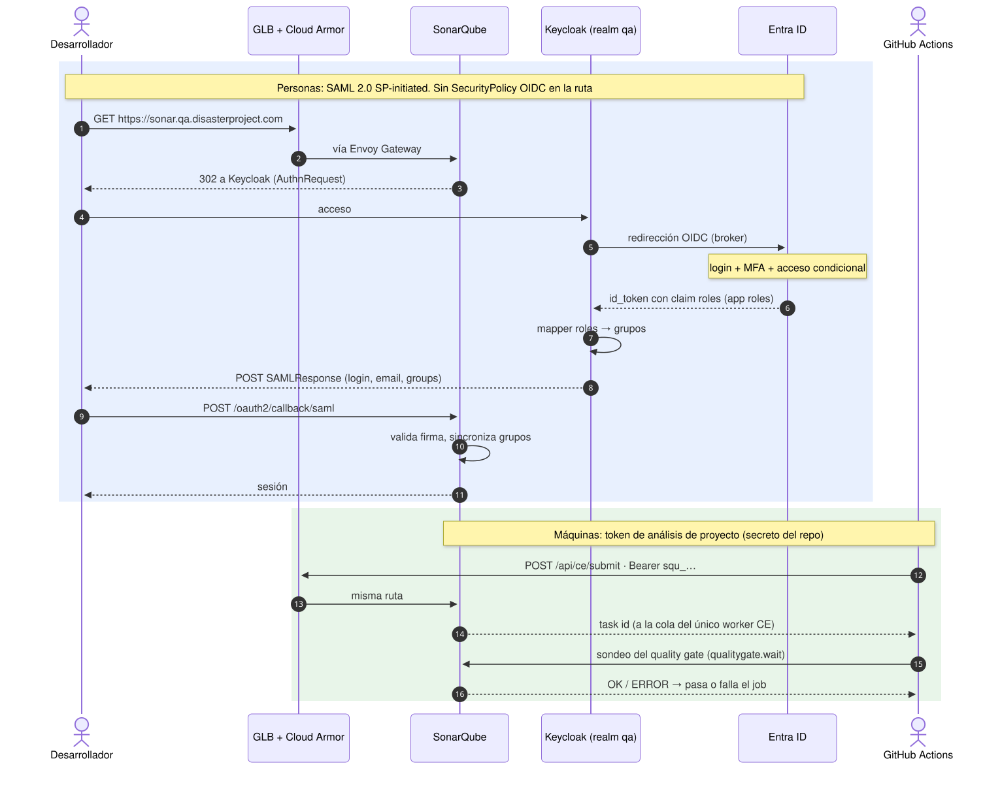

# SonarQube Community en el entorno `qa` — Etapa 1: elementos y dependencias

| | |
|---|---|
| **Estado** | Propuesta · etapa 1 de N · **etapa 1 cerrada** · revisión 12 (alineada con la etapa 2) |
| **Alcance** | Qué elementos necesita SonarQube Community Build en un entorno `qa` completo, de qué depende cada uno y con qué herramienta open source se cubre |
| **Fuera de alcance** | Código (generadores, contratos, charts), integración detallada de cada pipeline, procedimiento de upgrade. Son etapas posteriores |
| **Especificación de referencia** | `docs/archetype-model.md` (AM §n), `docs/terramate-outputs-sharing-architecture.md` (§n), `docs/developer-guide.md` (DG §n), `docs/risk-register.md` |
| **Etapa 2** | [`02-archetype-sonarqube.md`](02-archetype-sonarqube.md): arquetipo, stacks, plantillas y plan de implementación. Donde difieren, manda la etapa 2 |
| **Variante** | [`../sonarqube-qa-cloudsql/`](../sonarqube-qa-cloudsql/README.md): PostgreSQL en Cloud SQL en vez de CloudNativePG (reabre D2) |
| **Diagramas** | `diagrams/*.mmd` (fuente Mermaid) y `diagrams/*.svg` (renderizados). El SVG se regenera desde el `.mmd`; no se edita a mano |

Nada de este documento reabre decisiones de `CLAUDE.md`. Donde SonarQube choca con una de ellas (PSS `restricted`, OIDC en el Gateway, `database-platform`), se dice y se propone cómo encajar sin cambiarla.

---

## 0. Contexto confirmado

| Pregunta | Respuesta | Consecuencia principal |
|---|---|---|
| Cloud | **GCP** | GKE **Standard** (no Autopilot, §4.1); borde con NEG standalone + Global external Application LB; GCS, Cloud KMS, Cloud DNS, Certificate Manager, Artifact Registry |
| CI y código | **GitHub** / GitHub Actions | SonarQube se publica a internet detrás de Cloud Armor (D3); tokens de proyecto como secretos de repositorio (D9); en Community solo se analiza `main` (§4.11) |
| Entorno | **Nuevo** — no existe nada | SonarQube es el **primer consumidor** y arrastra el cierre completo de la plataforma: landing zone, entorno, GKE, Gatekeeper, secretos, monitorización, CNPG y Keycloak (§6). Lo gobierna la fase 0 del roadmap |
| Volumen | **200 proyectos**, ≈ 10 M líneas, ≈ 4 merges/día por proyecto | Sizing en §4.12. El cuello de botella no es la memoria sino la **cola del compute engine, de un solo worker** en Community |
| Identidad de personas | **Entra ID** | Keycloak como broker OIDC hacia Entra ID; grupos por *app roles* (§4.6) |
| Región | **`europe-west1`** (Bélgica) | Todo lo regional en la misma región: cluster, discos, buckets, key ring de KMS, Artifact Registry. GCP no tiene región en Irlanda |
| Proyecto GCP | **Propio**: `disasterproject-qa`. Un proyecto por entorno; el hub y la landing zone en el suyo | El borde (IP, Cloud Armor, certificado, LB) vive en `disasterproject-qa`; KMS, Artifact Registry y WIF de GitHub quedan en el proyecto de landing zone con permisos entre proyectos (§4.15) |
| Red | **VPC separada** para `qa`, no Shared VPC | El borde de `qa` vive en su propia VPC; no hay tránsito por el hub (§4.15). Cierra la pregunta abierta nº 2 de `CLAUDE.md` **para `qa`** |
| Modelo | **Dedicado**, no shared | Una plataforma, una instancia (§12.1). No se generan las salvaguardas multi-tenant de §12.3 (ResourceQuota por tenant, budgets de `capacity`); el aislamiento es la VPC y el cluster |
| Secretos | **GCP Secret Manager**; **OpenBao no se usa en `qa`** | ESO como interfaz en el cluster, Secret Manager como backend (lo que AM §14.2 ya asigna a GCP). Sin unseal, sin Raft, sin recovery keys (§4.3) |
| Entra ID | Lo gestiona el **equipo de identidad** | App registration, app roles y asignación de grupos son suyos; la plataforma solo consume el claim `roles` (§4.6) |
| Filtrado por IP | **No** en SonarQube | D3 cerrada: SonarQube público tras Cloud Armor sin listas de IP |
| Acceso del pipeline al cluster | La IP del runner se **abre en las redes autorizadas** de GKE al empezar y se **cierra** al terminar | Procedimiento aceptado; cuatro condiciones para que sea seguro (§4.13) |

Preguntas que siguen abiertas: §10.

---

## 1. Lo que SonarQube Community impone al diseño

| Hecho | Consecuencia en el diseño | Verificar |
|---|---|---|
| **Un solo nodo.** La alta disponibilidad es de Data Center Edition (comercial) | `replicas: 1`, StatefulSet. En `qa` se acepta; RTO ≈ reinicio (2–5 min) más reindexado si se pierde el PVC | — |
| **Un solo worker de compute engine.** Configurar más es de Enterprise Edition (comercial) | Todos los análisis de los 200 proyectos pasan por una cola FIFO. Es el límite de capacidad real (§4.12) | Límite de workers por edición en la versión fijada |
| **Tres JVM en un contenedor**: web, compute engine y search (Elasticsearch embebido) | El límite de memoria cubre tres heaps, tres non-heap y el mmap de ES. Es DG §8.3 multiplicado por tres | Heaps por defecto de la versión fijada |
| **Elasticsearch exige `vm.max_map_count ≥ 524288`** en el host | El chart lo resuelve con un init container **privilegiado**, incompatible con PSS `restricted` y Gatekeeper. Se resuelve **a nivel de nodo** (§4.1) | Que GKE admita el sysctl en el node pool (V1) |
| **Base de datos externa obligatoria.** PostgreSQL soportado | Dependencia de `database-platform` (CloudNativePG) | Rango de versiones PostgreSQL soportado |
| **El único estado real es PostgreSQL.** Los índices de ES se reconstruyen desde la BD | Backup solo de PostgreSQL y de la clave de cifrado | Tiempo de reindexado con 200 proyectos |
| **Sin análisis de ramas ni decoración de PR** en Community | Solo `main`. Un análisis lanzado desde una PR **sobrescribe la historia de `main`** (§4.11) | — |
| **Autenticación integrada: local, SAML, LDAP, GitHub, GitLab.** OIDC genérico solo con plugin de terceros | Keycloak se integra por **SAML** (§4.6) | SAML y sincronización de grupos en Community (V3) |
| **Métricas Prometheus en `/api/monitoring/metrics`**, protegidas por passcode | Scrape con `X-Sonar-Passcode` desde un Secret | — |
| **Logs a stdout** en la imagen de contenedor | Recogida por DaemonSet | — |
| **Plugins desde el update center** por defecto | Plugins horneados en la imagen; egress a internet denegado | — |

---

## 2. Dónde encaja en el modelo de arquetipos

| Pregunta | Respuesta | Razón |
|---|---|---|
| ¿Arquetipo o componente? | **Arquetipo `sonarqube`**, `kind: catalog`, **capa 5** | No despliega un operador ni impone contrato multi-tenant (AM §5.4). Lo consumen pipelines por HTTP, no stacks por outputs sharing; no publica `provides` |
| ¿Modelo de entorno? | `qa` **dedicado** (§12.1) | Una instancia de SonarQube por entorno |
| ¿Instancia y stack IDs? | `sonarqube-main` → `gcp-qa-sonarqube-main-<stack>` | Convención `<cloud>-<env>-<capability>[-<instance>]` |
| ¿Runtime? | **`gke`** (Standard) | ES necesita disco persistente de baja latencia y sysctl de nodo. Cloud Run no da ninguno; Autopilot no da el segundo |

---

## 3. Inventario de elementos

### 3.1 Vista de contexto



Fuente: [`diagrams/01-contexto.mmd`](diagrams/01-contexto.mmd)

### 3.2 Cierre de dependencias por capas


Fuente: [`diagrams/02-capas-dependencias.mmd`](diagrams/02-capas-dependencias.mmd)

### 3.3 Tabla de elementos

Todo se construye de cero. **Registro** indica si la capability existe en `registry/capabilities.yaml`.

| Capa | Capability | Implementación en GCP | Licencia | Por qué la necesita SonarQube | Registro |
|---|---|---|---|---|---|
| 0 | `dns-zone` | Cloud DNS, zona `disasterproject.com` en el proyecto de landing zone, que **delega** `qa.disasterproject.com` a una zona en `disasterproject-qa` | cloud | Registro wildcard `*.qa.disasterproject.com` | ✓ |
| 0 | `cidr-pool` | Ledger del modelo (AM §9) | — | Una `/17` del bloque permanente `10.4.0.0/14` (ejemplo de AM §9.2: `10.4.128.0/17`) | ✓ |
| 1 | `cert` | Certificate Manager en `disasterproject-qa`, certificado **wildcard** `*.qa.disasterproject.com` con DNS authorization | cloud | TLS público en el borde | ✓ |
| 1 | `waf` | Cloud Armor en `disasterproject-qa` | cloud | Única protección de red posible con runners alojados por GitHub (D3) | ✓ |
| 1 | `edge-ip` | IP global reservada en `disasterproject-qa` | cloud | Destino del wildcard | ✓ |
| 0 | *(KMS)* | Cloud KMS en el proyecto de landing zone, key ring `qa` en `europe-west1` | cloud | Estado de OpenTofu, secretos de etcd, firma de imágenes (§4.14) | ✗ — deliberado, §4.14 |
| 0 | *(registro)* | Artifact Registry en el proyecto de landing zone: repo remoto de Docker Hub + repo estándar; `artifactregistry.reader` para la SA de nodos de `disasterproject-qa` | cloud | Imagen propia con plugins, pull por digest | ✗ — mismo criterio que KMS |
| 0 | *(identidad CI)* | Workload Identity Federation para GitHub Actions (§11.2) | cloud | Despliegue de la plataforma sin claves | — |
| 1 | `network` | **VPC propia** de `qa`, subredes, Cloud NAT, **Private Google Access** | cloud | Nodos, pods, acceso a APIs de Google sin internet | ✓ |
| 1 | `env-edge` | Backend service + URL map + proxy + forwarding rule **del propio entorno**, con el NEG en la VPC de `qa` | cloud | Entrada hacia el NEG del Gateway | ✓ |
| 1b | `cloud-observability` | Cloud Logging **reducido** a auditoría y plano de control de GKE, con alertas basadas en logs | cloud | Alertas de acceso a secretos, redes autorizadas y KMS (§4.7) | ✓ |
| 2 | `cluster` | **GKE Standard** regional, node pools `general` y `sonar` | cloud | Donde corre; `sonar` aporta el sysctl | ✓ (+ trait) |
| 2b | `policy` | **OPA Gatekeeper** | Apache-2.0 | PSS `restricted`, etiquetas, registros permitidos | ✓ |
| 3 | `ingress` | **Envoy Gateway** (`gateway-envoy-gke`) | Apache-2.0 | `HTTPRoute`, políticas de tráfico | ✓ |
| 3 | `certs` | **cert-manager** con **CA interna** (`ClusterIssuer` CA) | Apache-2.0 | TLS GLB→Envoy. Sin ACME: el certificado público lo da Certificate Manager | ✓ |
| 3 | `dns` | **No se enlaza** | — | El wildcard de `env-edge` lo cubre; external-dns no aporta nada con un Gateway y una IP por entorno (igual que `demos`, AM §7) | ✓ sin uso |
| 3 | `secrets` | **External Secrets Operator** (interfaz) + **Secret Manager** (backend) | Apache-2.0 / cloud | Credenciales, passcode, clave de cifrado, SAML | ✓ |
| 3 | `monitoring` | **kube-prometheus-stack**, **Grafana**, **Loki** (sobre GCS), **Fluent Bit**, **Blackbox exporter** | Apache-2.0 / AGPL-3.0 | Métricas, logs, alertas, sonda externa | ✓ (+ trait) |
| 4 | `object-store` | **No se enlaza** | — | El bucket de backups lo crea el propio arquetipo (etapa 2 §1); el de Loki, el arquetipo de monitorización | ✓ sin uso |
| 4 | `database-platform` | **CloudNativePG** | Apache-2.0 | SonarQube y Keycloak crean su propio `Cluster` | ✓ (+ trait) |
| 4 | `oidc-idp` | **Keycloak**, realm `qa` | Apache-2.0 | Personas vía **SAML** | ✓ (+ trait) |
| 5 | — | **SonarQube Community Build**, chart oficial `sonarqube/sonarqube` | LGPL-3.0 | La aplicación | — |
| CI | — | **GitHub Actions** + `SonarSource/sonarqube-scan-action`, **Trivy**, **cosign** | — / Apache-2.0 | Análisis; build, escaneo y firma de la imagen propia | — |

Herramientas de plataforma sin cambios: Terramate, OpenTofu, conftest, Checkov.

**Qué es cloud y qué es OSS.** Todo lo que corre en el cluster es open source. Lo que queda en GCP es lo que no se puede o no conviene operar uno mismo: borde (LB, Cloud Armor, certificado público), KMS, **almacén de secretos**, almacenamiento de objetos y registro. Sustituir GCS o Artifact Registry por equivalentes OSS en el propio cluster crearía dependencias circulares (un backup dentro del cluster que protege no es un backup) y más superficie que operar. Se descarta Harbor por el mismo motivo, y MinIO además porque su edición comunitaria dejó de distribuir binarios e imágenes en 2025.

**Licencias.** Grafana y Loki son AGPL-3.0: sin impacto para uso interno sin modificar; que lo confirme quien gestione licencias.

---

## 4. Dependencias por dominio

### 4.1 Runtime: GKE Standard y node pool `sonar`

| Elemento | Propuesta | Motivo |
|---|---|---|
| Cluster | GKE Standard **regional**, **nodos privados**, endpoint del plano de control con redes autorizadas vacías por defecto (§4.13), Workload Identity, release channel `STABLE`, `deletion_protection: true` (§12.6) | Línea base de §5.7 |
| Pods por nodo | 64 (default de plataforma) | No aplica la pregunta abierta de Autopilot |
| Node pool `sonar` | 1 nodo **n2-standard-8** (8 vCPU, 32 GB) en **una zona**, taint `dedicated=sonar:NoSchedule` | Aísla sysctl y presión de memoria. Zona única porque el PVC es zonal |
| Sysctl | `node_config.linux_node_config.sysctls = { "vm.max_map_count" = "524288" }` | Elimina el init container privilegiado |
| `fs.file-max` | Sin acción: el kernel lo dimensiona con la RAM y en 32 GB supera 131072 de sobra | Verificar en V1 |
| StorageClass | `hyperdisk-balanced`, `WaitForFirstConsumer`, `allowVolumeExpansion: true` | IOPS configurables sin sobredimensionar disco |
| Acceso del pipeline al plano de control | Endpoint público del plano de control con **redes autorizadas vacías por defecto**; la IP del runner se abre y cierra por job | Decisión del equipo (§4.13); cubre R18 |

**Por qué no Autopilot.** No permite configurar sysctl de nodo ni contenedores privilegiados. Se propone el trait **`sysctl-max-map-count`** en `cluster`: `gke` lo tiene, `gke-autopilot` no, y un binding equivocado falla en resolución en vez de en el primer arranque con `max virtual memory areas vm.max_map_count [65530] is too low`.

**Plan B** si V1 falla: `SONAR_SEARCH_JAVAADDITIONALOPTS=-Dnode.store.allow_mmap=false`, a costa de rendimiento de ES. Con 200 proyectos habría que medirlo antes de aceptarlo.

**Zona única.** Si cae la zona, SonarQube queda caído hasta que vuelva. Para `qa` se acepta. La alternativa es `hyperdisk-balanced-high-availability` (réplica síncrona entre dos zonas) con el node pool en esas dos zonas: RTO de minutos ante caída de zona, a costa del doble de coste de disco.

### 4.2 Política de admisión (capa 2b)

`qa`: `enforcementAction: deny`, `failurePolicy: Ignore` (§13.7).


| Requisito PSS `restricted` / Gatekeeper | Ajuste en el chart |
|---|---|
| Sin contenedores privilegiados | `initSysctl.enabled: false` |
| Sin ejecución como root | `initFs.enabled: false`; permisos vía `fsGroup` |
| `runAsNonRoot`, `seccompProfile: RuntimeDefault`, `drop: [ALL]`, `allowPrivilegeEscalation: false` | `securityContext` y `containerSecurityContext` explícitos |
| Etiquetas obligatorias (`registry/labels.yaml`) | Emitidas por el generador en namespace y workload |
| `readOnlyRootFilesystem` (si hay constraint) | `emptyDir` en `temp` y `logs`; verificar qué más escribe (V2) |
| Imágenes solo de registros permitidos | `europe-docker.pkg.dev/<proyecto>/…` por digest |

Si SonarQube no puede correr con raíz de solo lectura, la salida es una **exención por nombre** para `sonarqube/sonarqube-0`, revisada en PR — nunca relajar el constraint para todo `qa`.

### 4.3 Secretos


| Secreto | Secreto en Secret Manager | Consumidor | Notas |
|---|---|---|---|
| Usuario y password JDBC | `qa-sonarqube-db` | CNPG (`bootstrap.initdb.secret`) y SonarQube | Un único origen para ambos lados |
| Monitoring passcode | `qa-sonarqube-passcode` | SonarQube y `PodMonitor` | Mismo namespace que el `PodMonitor` |
| Password admin | `qa-sonarqube-admin` | Job del chart | Break-glass tras activar SAML |
| Clave de cifrado de settings | `qa-sonarqube-secret-key` | `sonar.secretKeyPath` | Si se pierde, los settings cifrados son irrecuperables |
| Material SAML | `qa-sonarqube-saml` | Certificado del IdP; clave del SP si se firman peticiones | — |
| Tokens de análisis | **Secretos de repositorio en GitHub** (D9) | GitHub Actions | Los runners alojados no tienen identidad en `qa` que les dé acceso a Secret Manager, ni hace falta |

Tres piezas, cada una con una sola responsabilidad:

| Pieza | Responsabilidad | Identidad |
|---|---|---|
| **Stack `sonarqube-main-secrets`** (OpenTofu, pipeline por WIF) | Crea los **contenedores** de secreto, sus etiquetas obligatorias (`registry/labels.yaml`) y su IAM | `tf-apply-qa@`: administra secretos, **no** tiene `secretAccessor` |
| **Valores** | Generados con recurso `ephemeral` y escritos con el atributo **write-only** `secret_data_wo`, de modo que el valor **nunca entra en el estado** de OpenTofu | La misma, en el mismo apply. Verificar el soporte en la versión de OpenTofu y del proveedor `google` fijadas (V9). Si no está, la versión inicial la crea un script fuera de OpenTofu |
| **ESO** en el namespace `sonarqube` | Lee los valores y los materializa como `Secret` de Kubernetes | KSA `eso-sonarqube` vía Workload Identity, `secretAccessor` **sobre cada secreto**, nunca sobre el proyecto (§7.4: un permiso de proyecto expone los secretos de todos) |

- **`SecretStore` por namespace**, no `ClusterSecretStore`: el principal de Workload Identity es exactamente `ns/sonarqube/sa/eso-sonarqube` (R15).
- **Los `Secret` de Kubernetes quedan en etcd cifrados con la clave KMS `gke-secrets`** (§4.14, arquitectura §5.7). Son copia, no fuente de verdad.
- **Por qué ESO y no el add-on de Secret Manager para GKE** (driver CSI): el add-on monta ficheros, pero el chart de SonarQube lee la password JDBC de una variable de entorno y CNPG exige un `Secret` de Kubernetes.
- **Por outputs sharing solo viajan nombres de secreto**, nunca valores (§11.6, R8).
- **Secretos en el proyecto de `qa`**, replicación **user-managed** en `europe-west1`.

**Acceso humano y del pipeline.** El pipeline accede por WIF para **gestionar** secretos; leer valores no forma parte de ningún despliegue. Lectura humana solo para SRE, **just-in-time** con Privileged Access Manager (justificación, máximo 1 h, aprobación de otro miembro de SRE). *Data Access audit logs* en Secret Manager y alerta ante cualquier `AccessSecretVersion` cuyo principal no sea un KSA `eso-*` ni esté en la lista de lectores explícitos, revisada por PR (propuesta de ESO §9.2; el reconciliador de Keycloak lee con su propia identidad).

**Protección frente a borrado.** Borrar un secreto en Secret Manager es inmediato e irreversible. Por eso: ninguna identidad de pipeline salvo la de destroy tiene `secretmanager.secrets.delete`; `lifecycle { prevent_destroy = true }` en `qa-sonarqube-secret-key`; y destrucción diferida de versiones (`version_destroy_ttl`, 30 días) para poder deshacer una rotación equivocada.

### 4.4 Datos: PostgreSQL con CloudNativePG

`database-platform` sin enlazar es la decisión de `demos`. En `qa` se propone **enlazarlo** a CloudNativePG, con una instancia **propia** por consumidor:

| Opción | Qué crea SonarQube | Recomendación |
|---|---|---|
| A. `Database` + `Role` en un `Cluster` compartido | BD lógica | No: SonarQube es intensivo en BD; vecino ruidoso en ambos sentidos |
| **B. `Cluster` CNPG propio en `sonarqube`** | Instancia dedicada, operador compartido | **Sí** — bus común, datos separados, como Kafka |
| C. Cloud SQL (`data` condicional) | Servicio gestionado | Solo si se abandona el requisito OSS para datos |

Requiere que `postgres-operator` autorice `Cluster` y `ScheduledBackup` en `tenant_resources` (AM §10.4). Keycloak usa el mismo patrón: es el segundo `Cluster` del entorno.

Backups a GCS con **Workload Identity**: IAM `roles/storage.objectAdmin` sobre el bucket para el principal exacto `principal://iam.googleapis.com/projects/<n>/locations/global/workloadIdentityPools/<proyecto>.svc.id.goog/subject/ns/sonarqube/sa/sonarqube-db`. Sin clave JSON; sin comodín.

### 4.5 Publicación

| Elemento | Propuesta |
|---|---|
| Hostname | `sonar.qa.disasterproject.com` — **claim** en el ledger aunque el DNS sea wildcard: la unicidad del nombre sigue siendo escasa |
| DNS | Registro wildcard `*.qa.disasterproject.com` → IP global, creado una vez por `gcp-qa-edge` |
| TLS público | Certificate Manager, wildcard, en el GLB |
| TLS interno | GLB → Envoy por HTTPS con certificado de la CA interna de cert-manager |
| Gateway | Uno por entorno, `allowedRoutes.namespaces.from: Selector` (§10.6); NEG standalone `eg-qa-neg` (§10.2, R20) |
| Timeout del backend service | **120 s** (por defecto 30 s): la subida del informe de un proyecto grande los supera |
| Envoy | `BackendTrafficPolicy` en la ruta con timeout ≥ 120 s. El límite de cuerpo es una `ClientTrafficPolicy` del **Gateway**: requisito al arquetipo `gateway` de no bajar de 100 MiB (etapa 2 §9) |
| Firewall VPC | Rangos de health check del GLB (`35.191.0.0/16`, `130.211.0.0/22`) hacia los pods de Envoy — selector `cidr:` legítimo (AM §6.3) |

Recursos Gateway API empaquetados en el chart y desplegados con `helm_release`, nunca `kubernetes_manifest` (R24).

### 4.6 Autenticación y autorización



La plataforma prevé OIDC en el Gateway con `SecurityPolicy`. **No sirve para SonarQube**: la misma ruta la usan personas y GitHub Actions, y el scanner envía `Authorization: Bearer <token de SonarQube>` a `/api/*`. Una `SecurityPolicy` OIDC lo redirigiría a Keycloak y todos los análisis fallarían.

| Quién | Mecanismo | Dónde se valida |
|---|---|---|
| Personas | **SAML 2.0** contra Keycloak (realm `qa`, cliente `sonarqube`) | SonarQube |
| GitHub Actions | **Token de análisis de proyecto** (D9) | SonarQube |
| Break-glass | Cuenta local `admin` | SonarQube |
| Anónimos | Prohibidos: `sonar.forceAuthentication=true` | SonarQube |

`HTTPRoute` de SonarQube **sin `SecurityPolicy` OIDC**, igual que la de Keycloak. SAML es front-channel: SonarQube no necesita red hacia Keycloak.

**Identidades en Entra ID.** Keycloak no es fuente de verdad de usuarios: hace de **broker** hacia Entra ID (identity provider OpenID Connect en el realm `qa`) y emite SAML hacia SonarQube. MFA y acceso condicional se aplican en Entra ID, antes de llegar a Keycloak.

| Tema | Propuesta | Por qué |
|---|---|---|
| Registro en Entra ID | Una *app registration* `keycloak-qa`, redirect URI `https://sso.qa.disasterproject.com/realms/qa/broker/entra/endpoint` | Un solo punto de confianza con Entra para todas las aplicaciones de `qa` |
| Credencial de Keycloak ante Entra | **Certificado** (client assertion firmada), no client secret | Los client secrets de Entra caducan (≤ 24 meses) y suelen caducar en producción sin aviso. Clave privada en Secret Manager (`qa-keycloak-entra-cert`) |
| Grupos | **App roles** en la app registration (`sonar-administrators`, `sonar-users`, `team-<x>`), asignados a grupos de Entra | El claim `groups` de Entra trae **GUIDs**, no nombres, y con más de 200 grupos se sustituye por un *overage* que exige llamar a Graph. El claim `roles` trae nombres estables y solo los de esta aplicación |
| Mapeo en Keycloak | Un mapper *Attribute Importer* copia el claim `roles` al atributo multivalor de usuario `entra_roles`; sincronización `force` en cada login. Sin mapper por rol ni grupos de Keycloak (propuesta de Keycloak §5.3) | Un cambio de pertenencia en Entra se refleja en el siguiente login. Dar de alta un equipo toca solo Entra y `teams.yaml` |
| Hacia SonarQube | SAML con atributo `groups` = los valores de `entra_roles` | SonarQube recibe el mismo atributo `groups` que esperaba |
| Red | Keycloak necesita **egress** a `login.microsoftonline.com` (intercambio de código back-channel) vía Cloud NAT | SonarQube sigue sin necesitar red hacia Keycloak ni Entra |

Se mantiene Keycloak como intermediario (D4) aunque SonarQube podría hacer SAML directo contra Entra ID: Grafana y las aplicaciones futuras de `qa` usan el mismo realm, y la `SecurityPolicy` OIDC de Envoy para el resto de aplicaciones se diseñó contra Keycloak. El coste es que Keycloak queda en el camino crítico de login.

**Baja de usuarios.** Community no tiene SCIM (es de Enterprise). Deshabilitar a alguien en Entra ID impide su login, pero su usuario de SonarQube y **sus tokens personales siguen activos**. Mitigación: prohibir tokens personales en CI (solo tokens de proyecto, D9) y un job de reconciliación diario que desactive en SonarQube los usuarios cuyo login ya no exista o esté deshabilitado en Entra ID (Graph API + Web API de SonarQube).

| Grupo | Permisos en SonarQube |
|---|---|
| `sonar-administrators` | Administración global |
| `sonar-users` | Navegar |
| `team-<x>` | Plantilla de permisos por prefijo de clave de proyecto `<x>_*` |

Cada grupo de SonarQube corresponde a un app role de Entra ID; alta de un equipo = app role nuevo + grupo de Entra asignado + plantilla de permisos.

Con 200 proyectos, los permisos **solo** por plantillas: un proyecto nuevo nace con los de su equipo.

### 4.7 Observabilidad



| Señal | Recogida | Alertas propuestas |
|---|---|---|
| Disponibilidad externa | Blackbox → `https://sonar.qa.disasterproject.com/api/system/status` (pasa por GLB, Cloud Armor y Gateway) | ≠ `UP` durante 5 min |
| **Cola del compute engine** | `PodMonitor` sobre `/api/monitoring/metrics` | Pendientes > 20 durante 15 min; tarea más antigua > 10 min. **La alerta clave con 200 proyectos** |
| Tareas CE fallidas | Idem | Tasa de fallos > 5 % en 1 h |
| JVM | Idem | Heap > 90 % sostenido |
| Contenedor | kube-state-metrics | `OOMKilled` (exit 137, DG §8.3); memoria > 90 % |
| Disco | kubelet | PVC de ES > 80 % (ES pasa a solo lectura por encima de su watermark); PVC de BD > 80 % |
| PostgreSQL | Exporter CNPG | Retraso de réplica; conexiones > 80 %; último backup correcto > 26 h |
| Logs | Fluent Bit → Loki (GCS) | Tasa de `ERROR` |
| Certificados | cert-manager | CA interna o certificado de Envoy < 14 días |
| Secretos | Métricas de ESO | `ExternalSecret` sin sincronizar > 15 min (un secreto rotado en Secret Manager no llega al pod). **Regla de plataforma** para todos los namespaces, declarada por el arquetipo de monitorización (propuesta de ESO §9.2), no por SonarQube |

Las alertas que nacen de **logs de auditoría de GCP** no pasan por Prometheus: son alertas basadas en logs de la capa 1b (`cloud-observability`). Tres: lectura de un secreto por un principal fuera de la lista de lectores autorizados (§4.3), cambios en las redes autorizadas fuera del servicio intermedio (§4.13) y cualquier operación de destrucción sobre claves KMS (§4.14). Por eso la capa 1b no se reduce a cero.

`PodMonitor` y `PrometheusRule` van en el chart del arquetipo (CRD en plan, R24); de ahí el trait **`prometheus-operator-crds`**. Grafana entra por OIDC con Keycloak, sin ciclo.

### 4.8 Red



`NetworkPolicy` default-deny de entrada y salida en `sonarqube`:

| Origen | Destino | Puerto |
|---|---|---|
| Envoy | SonarQube | 9000 |
| Prometheus | SonarQube / CNPG | 9000 / 9187 |
| SonarQube | CNPG | 5432 |
| CNPG | CNPG | 5432 (replicación) |
| Operador CNPG | CNPG | 8000 |
| CNPG | `storage.googleapis.com` vía Private Google Access | 443 |
| Todos | kube-dns | 53 |
| SonarQube | Internet | **Denegado**; `sonar.updatecenter.activate=false` |

GKE aplica `NetworkPolicy` con Dataplane V2; el egress a las APIs de Google se expresa por FQDN (`FQDNNetworkPolicy`) o por los rangos de Private Google Access — verificar cuál soporta la versión.

### 4.9 Backup y recuperación

| Qué | Cómo | Dónde | Retención |
|---|---|---|---|
| PostgreSQL | CNPG barman-cloud: base diaria + WAL continuo (PITR) | `gs://disasterproject-qa-sonarqube-main-pgbackup` (del arquetipo) | 14 días (§12.6) |
| Secretos (incluye la clave de cifrado de SonarQube) | Versiones de Secret Manager; sin backup adicional | Secret Manager | Protección frente a borrado (§4.3) |
| Índices de ES | No se respaldan | — | Reindexado |
| Configuración | Git | — | — |

Buckets regionales en `europe-west1` con *soft delete* de GCS (7 días) como red de seguridad. **Sin** retention policy bloqueante ni versionado de objetos en el bucket de CNPG: barman purga sus backups según su propia retención, y una política que impida borrar hace fallar esa purga (o, con versionado, acumula versiones no actuales sin límite). Velero no hace falta: todo el estado está en PostgreSQL, Secret Manager o Git.

Restauración ensayada una vez antes de dar el entorno por bueno (V5).

### 4.10 Cadena de suministro de la imagen

| Paso | Herramienta |
|---|---|
| Imagen `FROM sonarqube:<versión>-community` + plugins en `extensions/plugins` | GitHub Actions en el repo del arquetipo |
| Escaneo | Trivy, bloqueante en `CRITICAL` con fix |
| Firma | cosign con clave en Cloud KMS (evita publicar en el log público de Rekor) |
| Registro | Artifact Registry; base desde el repo remoto de Docker Hub (evita límites de pull) |
| Despliegue | Por digest (DG: la imagen se promueve, no se reconstruye) |

### 4.11 Integración con GitHub Actions


| Regla | Motivo |
|---|---|
| **Analizar solo en `push` a `main`**, nunca en `pull_request` | Community no tiene ramas: un análisis desde una PR **se registra como `main`** y contamina su historia y el quality gate. Error silencioso; se impone con una regla de conftest/actionlint sobre los workflows |
| `concurrency: { group: sonar-${{ github.repository }}, cancel-in-progress: true }` | Dos merges seguidos: solo se analiza el último. Alivia la cola |
| `sonar.qualitygate.wait=true` con `timeout` 300 s | El job falla si el gate falla; con la cola llena el job espera y consume minutos: vigilar |
| Clave de proyecto `<org>_<repo>` | Plantillas de permisos por prefijo |
| Workflow reutilizable en un repo central | 200 copias de un workflow divergen; uno reutilizable se cambia una vez |
| Onboarding automatizado | Crear proyecto + token de proyecto con caducidad + secreto `SONAR_TOKEN` en el repo, por API de SonarQube y de GitHub (D9) |

Los runners alojados por GitHub salen desde rangos enormes y cambiantes: filtrar por IP en Cloud Armor no es útil. Cloud Armor aporta reglas OWASP (con exclusiones en `/api/ce/submit`, cuyo multipart dispara falsos positivos — verificar) y rate limit por IP; la autenticación la hace SonarQube.

### 4.12 Dimensionamiento para 200 proyectos

Estimación confirmada: mediana de 50 k líneas por proyecto, ≈ 10 M líneas en total, ≈ 4 merges a `main` por proyecto y día.

| Recurso | Valor inicial | Base |
|---|---|---|
| Node pool `sonar` | 1 × n2-standard-8 (8 vCPU, 32 GB) | Contenedor de 12 GiB + page cache para ES |
| Pod SonarQube | request 4 vCPU / 12 GiB, limit 12 GiB, **sin límite de CPU** | Con `limits.cpu` bajo, las JVM eligen SerialGC y el CE se ralentiza (DG §8.3) |
| Heaps | web `-Xmx2g`, CE `-Xmx3g`, search `-Xmx3g` | Σ 8 GiB + ≈ 1,5 GiB non-heap + margen = 12 GiB. **Nunca** heap = límite |
| PVC de ES | 50 GiB `hyperdisk-balanced`, 3000 IOPS | Expandible |
| PostgreSQL | 2 instancias (primaria + réplica), 2 vCPU / 8 GiB, 100 GiB, `max_connections` 200 | Pool de SonarQube ≈ 60 por proceso |
| GCS backups | ≈ 2–3× el tamaño de la BD con 14 días de WAL | — |

**La cola del compute engine es el límite.** 200 proyectos × 4 análisis/día = 800 tareas diarias. Con 20–60 s por tarea son **4,5–13 h de trabajo en serie**, concentradas en la jornada. En la parte alta, la cola crece en horas punta y los jobs de GitHub esperan al quality gate. Palancas, en orden:

1. Solo `main` y `cancel-in-progress` (ya incluidos).
2. CPU suficiente para el CE: la tarea es mayoritariamente monohilo; más núcleos no la aceleran, frecuencia sí (valorar c3 frente a n2 en V4).
3. Monorepos grandes fuera de horas punta.
4. Si la alerta de cola salta de forma sostenida: Enterprise Edition (varios workers, comercial) o separar en dos instancias por grupo de equipos.

V4 mide el tiempo real por tarea con proyectos representativos antes de fijar nada.

### 4.13 Acceso del pipeline al plano de control de GKE

Procedimiento decidido: el endpoint del plano de control es público pero con **redes autorizadas vacías** por defecto; cada job de GitHub Actions que necesita la API de Kubernetes añade la IP de su runner, ejecuta y la retira. Cubre R18 sin runners self-hosted.


Funciona, con cuatro condiciones. Sin ellas falla de formas poco evidentes:

| # | Problema | Condición |
|---|---|---|
| 1 | **Carrera entre jobs.** La lista de redes autorizadas se actualiza **reemplazándola entera**: dos jobs simultáneos leen, añaden su IP y escriben, y el segundo borra la del primero, que pierde el acceso a mitad de un `apply` | Serializar: `concurrency: { group: gke-qa-api, cancel-in-progress: false }` en **todos** los workflows que abren la IP. Un job espera al anterior |
| 2 | **IP huérfana.** Un runner que muere o un job cancelado a destiempo no ejecuta el paso de cierre | Cierre en un paso `if: always()` **y** un reconciliador programado (cada 15 min) que retira toda entrada con más de 60 min. Cada entrada lleva `display_name = gha-<run_id>-<epoch>` para poder caducarla |
| 3 | **Deriva con OpenTofu.** Si `gcp-qa-gke` gestiona `master_authorized_networks_config`, un `apply` de ese stack revierte la IP del propio runner a mitad de ejecución, y cada `plan` muestra diferencias | `lifecycle { ignore_changes = [master_authorized_networks_config] }` en el cluster: la lista la gestiona solo el procedimiento; la línea base (vacía) se fija en la creación |
| 4 | **Escalada de privilegios.** Abrir la IP requiere `container.clusters.update`, que permite cambiar **cualquier** ajuste del cluster. La identidad de *preview* (PR, cualquier rama, §11.2) también la necesita, porque el plan de los proveedores `helm`/`kubernetes` consulta la API | **No dar `clusters.update` a las identidades del pipeline.** Un servicio intermedio mínimo (Cloud Run function) con esa permisión expone solo `open(ip)` / `close(ip)`, valida que la IP sea una /32, fija la caducidad y registra quién la pidió. El pipeline lo invoca con su identidad OIDC de GitHub |

Aun así, abrir la IP no autentica a nadie: la API sigue exigiendo IAM. Las redes autorizadas son una segunda barrera, no la primera. Y la IP de un runner alojado es compartida con otros clientes de GitHub durante la ventana abierta, aunque sin credenciales de IAM no obtienen nada.

La alternativa que haría innecesario todo lo anterior es el **endpoint DNS del plano de control** de GKE, controlado solo por IAM y sin listas de IP. Queda anotada por si el reconciliador o el servicio intermedio resultan más costosos de operar de lo previsto.

### 4.14 Claves de Cloud KMS

**Qué dice la documentación.** KMS aparece como requisito en cuatro sitios, pero **no como capability** ni con dueño asignado:

| Referencia | Qué exige |
|---|---|
| Arquitectura §5.7 (línea base GKE) | Cifrado de secretos de Kubernetes en etcd (*application-layer secrets encryption*) con una clave de Cloud KMS propia |
| Arquitectura §11.5, R17, checklist de fase 0 | Cifrado del estado de OpenTofu (bloque `encryption`, `key_provider "gcp_kms"`), **recomendado**, con **una clave por entorno**, no por stack: el consumidor de outputs sharing necesita la clave del productor. Si el bucket de estado usa CMEK, además `cryptoKeyDecrypter` |
| Arquitectura §11.6 | El material de clave nunca cruza outputs sharing; se comparte el nombre del recurso |
| Arquitectura §11.3 (AWS) | SCP que deniega `kms:ScheduleKeyDeletion` sobre las claves de estado. **No tiene equivalente escrito para GCP** |

Lo que la documentación **no** dice: qué stack crea las claves, en qué capa, con qué rotación y cómo se protegen de la destrucción en GCP. Es un hueco, y aparece al construir el primer entorno.

**Propuesta: key ring por entorno en capa 0.**

| Clave | Tipo | Consumidor | Rol IAM, sobre esa clave solamente | Rotación |
|---|---|---|---|---|
| `tofu-state` | Simétrica | Todas las identidades de pipeline de `qa` (`tf-plan-qa@`, `tf-apply-qa@`, `tf-destroy-qa@`) | `cryptoKeyEncrypterDecrypter` — también la de *plan*: el bloque `plan { }` **cifra** el fichero de plan | 90 días automática |
| `gke-secrets` | Simétrica | Agente de servicio de GKE (`service-<n>@container-engine-robot`) | `cryptoKeyEncrypterDecrypter` | 90 días |
| `cosign` | Asimétrica de firma (EC P-256) | Identidad del build de imágenes | `signerVerifier` | Manual, con solapamiento |
| *(opcional)* `gcs-cmek` | Simétrica | Agente de servicio de Cloud Storage | `cryptoKeyEncrypterDecrypter` | 90 días |
| *(opcional)* `secrets-cmek` | Simétrica | Agente de servicio de Secret Manager | `cryptoKeyEncrypterDecrypter` | 90 días |

**Por qué capa 0 y no capa 1.** La clave de estado debe existir **antes** del primer stack cifrado de `qa`, que es el propio `gcp-qa-network`. Si la creara el stack de entorno, su estado se cifraría con una clave que él mismo crea. La landing zone ya es el singleton que se arranca a mano; su propia clave de estado es la única que se crea fuera del pipeline (bootstrap documentado, una vez).

**Por qué no es una capability.** Los nombres son deterministas (`projects/<p>/locations/europe-west1/keyRings/qa/cryptoKeys/<propósito>`): por el árbol de platform-overview §4, son **globals**, sin permisos de lectura de estado ni aristas de outputs sharing. Una capability solo tendría sentido si hubiera varios proveedores entre los que elegir (Cloud HSM, EKM). Si aparece ese requisito, se añade entonces, con traits como `hsm`. El mismo razonamiento vale para Artifact Registry.

**Restricciones de GCP a tener en cuenta:**

| Restricción | Consecuencia |
|---|---|
| La clave de etcd debe estar en la **misma ubicación que el cluster** | Key ring regional en `europe-west1`, no `global` ni `europe` |
| La clave CMEK de un bucket debe coincidir con la ubicación del bucket | Buckets regionales en `europe-west1` |
| **Un key ring y una clave no se pueden borrar** en Cloud KMS, solo sus versiones | Nombres definitivos desde el principio; un error de nombre queda para siempre |
| Destruir una versión es programado (por defecto 30 días) | Es la ventana de rescate. Org policy `constraints/cloudkms.minimumDestroyScheduledDuration` para imponer un mínimo |

**Protección frente a destrucción** — el equivalente GCP que falta de la SCP de AWS:

- Ninguna identidad de pipeline tiene `cloudkms.admin` ni `cryptoKeyVersions.destroy`. Solo el stack de landing zone, con su identidad de destroy separada (§11.4).
- `lifecycle { prevent_destroy = true }` en las claves.
- Perder `tofu-state` deja el estado ilegible, y es irrecuperable: es el activo más crítico del entorno. Si se activa `secrets-cmek`, perderla deja ilegibles todos los secretos de `qa`: mismo tratamiento.

### 4.15 Red: VPC separada y borde propio

`qa` es un entorno **dedicado**, con **proyecto GCP propio** (`disasterproject-qa`) y **VPC propia**. R23 describe el problema de una topología hub-and-spoke: el peering de VPC no es transitivo y los backends de un balanceador deben estar en su misma VPC, así que un balanceador **en el hub** no alcanza un NEG **en `qa`**. La salida para `qa` es no pasar por el hub: todo el borde vive en `disasterproject-qa`.

| Elemento | Dónde | Por qué |
|---|---|---|
| Global external Application LB (backend service, URL map, proxy, forwarding rule) | Stack `gcp-qa-edge`, capa 1, en `disasterproject-qa` | El backend service y el NEG de Envoy quedan en la misma VPC. Un LB externo global no necesita subred proxy-only |
| IP global, política de Cloud Armor, certificado wildcard | Stack `gcp-qa-edge`, capa 1, en `disasterproject-qa` | Deben estar en el **mismo proyecto que el LB**. Con un proyecto por entorno, las capabilities `cert`, `waf` y `edge-ip` las provee el entorno, no la landing zone |
| Zona `qa.disasterproject.com` | En `disasterproject-qa`, delegada desde `disasterproject.com` (proyecto de landing zone) | El wildcard y los registros de DNS authorization del certificado se escriben sin permisos sobre la zona padre |
| KMS, Artifact Registry, WIF de GitHub | Proyecto de landing zone | Permisos entre proyectos: agente de GKE de `disasterproject-qa` sobre la clave `gke-secrets`; SA de nodos lectora del registro; identidades de pipeline por WIF |
| Plano de control de GKE | Endpoint público con redes autorizadas vacías; nodos privados en la VPC de `qa` | Acceso del pipeline según §4.13 |
| Egress | Cloud NAT de `qa` | Keycloak → Entra ID; Cloud Armor y el LB no lo usan |
| APIs de Google (Secret Manager, GCS, Artifact Registry, KMS) | Private Google Access en las subredes de `qa` | Sin NAT ni internet |
| Peering con el hub | **No se necesita para SonarQube** | Ningún flujo de §4.8 cruza al hub. Si más adelante `qa` necesita on-premise u otro servicio del hub, se añade el peering sabiendo que no es transitivo |

Direccionamiento: una `/17` del bloque permanente `10.4.0.0/14` por resolución (AM §9), con las zonas de `registry/zones.yaml`. La VPC separada no cambia el plan de direcciones; sí obliga a que la `/17` no solape con el hub si algún día se hace el peering, algo que el ledger ya garantiza.

---

## 5. Especificidades de GCP que afectan a SonarQube

| Tema | Decisión | Referencia |
|---|---|---|
| NEG fuera del estado de Terraform | Declarado como `data`, nombrado explícitamente | §10.2, R20 |
| VPC | **Separada**; el borde de `qa` y su NEG en la misma VPC | §4.15, R23 |
| Cuenta de servicio de nodos | Dedicada, con `artifactregistry.reader`, logging y monitoring writer | §5.7 |
| Workload Identity | Principal exacto por namespace y KSA | R15 |
| Pipeline de plataforma | WIF de GitHub con `attribute_condition` sobre repo y environment exactos | §11.2, R12 |
| Acceso a la API de GKE | Redes autorizadas abiertas por job a través del servicio intermedio | §4.13, R18 |
| Región | `europe-west1` | Contexto (§0) |
| KMS | Key ring `qa` regional en el proyecto de landing zone, sin capability, protegido frente a destrucción | §4.14 |
| Proyecto | `disasterproject-qa`, uno por entorno | §0, §4.15 |
| Org policies | Sin claves de SA, región confinada, sin IPs públicas en nodos | §11.7 |

---

## 6. Orden de despliegue y ciclos

Como el entorno es nuevo, el despliegue de SonarQube es el despliegue de la plataforma entera. Una fase previa de verificación y tres de despliegue, cada una aplicada por etiquetas con mocks OFF (arquitectura §4.11):



| Fase | Stacks | Bloqueada por |
|---|---|---|
| **0** | Repositorio desechable, verificaciones de `CLAUDE.md` | Nada. Hay que hacerla primero |
| **A** | Landing zone, red, GKE | Fase 0 |
| **B** | Gatekeeper, cert-manager, monitorización, ESO, buckets, CNPG, Keycloak, Gateway, borde | A |
| **C** | Los 9 stacks de `gcp-qa-sonarqube-main` (etapa 2 §5) | B; V1–V3 |

Aristas nuevas que introduce SonarQube (cada una con su `after`, R2):

| Consumidor | Productor | Qué cruza | Tipo |
|---|---|---|---|
| `…-iam` | `gcp-qa-gke` | `workload_identity_pool` | outputs sharing |
| `…-secrets` | `gcp-qa-secrets` | Namespace de ESO y versión de sus CRD | global |
| `…-data-tenant` | `gcp-qa-postgres-operator` | Versión del operador | outputs sharing |
| `…-frontdoor` | `gcp-qa-gateway` | Nombre y namespace del `Gateway` | global |
| `…-sso` | `gcp-qa-keycloak` | Realm, URL de metadatos SAML | outputs sharing |
| `…-observability` | `gcp-qa-monitoring` | Selector de reglas | global |

Ciclos y cómo se rompen:

| Ciclo | Ruptura |
|---|---|
| Keycloak ↔ Gateway (R22) | Resuelto en la plataforma; SonarQube tampoco lleva `SecurityPolicy` |
| Keycloak → secretos → Keycloak | Desaparece con Secret Manager: ESO se autentica por Workload Identity, sin pasar por Keycloak |
| Estado cifrado de `gcp-qa-network` → clave `tofu-state` | La clave la crea la landing zone, no el entorno (§4.14) |
| SonarQube SAML ↔ Keycloak | No existe: front-channel |
| Gateway → NEG → `env-edge` (capa 1) | La arista ascendente de §10: `gcp-qa-edge` se aplica tras `gcp-qa-gateway` |

---

## 7. Borradores ilustrativos

No son ficheros del repositorio. **El manifiesto de abajo queda como histórico: lo sustituye etapa 2 §3** (9 stacks, `sso` antes de `app`, sin `object-store`, `oidc-idp` ^4.2.0).

```yaml
# archetypes/sonarqube/manifest.yaml — borrador
apiVersion: archetype/v1
kind: Archetype
metadata:
  name: sonarqube
  version: 0.1.0
  layer: 5
  kind: catalog
  description: SonarQube Community Build, single node, SAML contra oidc-idp
  owners: [team-platform]

runtimes: [gke, eks, aks]                     # no gke-autopilot: le falta el trait

requires:
  - capability: cluster
    version: "^2.0.0"
    traits: [sysctl-max-map-count]            # NUEVO
  - capability: policy
    version: "^1.0.0"
  - capability: ingress
    version: ">=3.0.0 <4.0.0"
    traits: [gateway-api, http-route]
  - capability: secrets
    version: "^2.0.0"
  - capability: oidc-idp
    version: "^4.0.0"
    traits: [saml-idp]                        # NUEVO
  - capability: database-platform
    version: "^1.0.0"
    traits: [cnpg]                            # NUEVO
  - capability: object-store
    version: "^1.0.0"
  - capability: monitoring
    version: "^1.5.0"
    traits: [prometheus-operator-crds]        # NUEVO

stacks:
  - name: iam
  - name: secrets
    after: [iam]
  - name: data-tenant
    after: [iam, secrets]
    creates_tenant_resources: [database-platform]
  - name: firewall
    after: [data-tenant]
  - name: app
    after: [secrets, firewall]
  - name: sso
    after: [app]
    creates_tenant_resources: [oidc-idp]
  - name: frontdoor
    after: [app]
  - name: observability
    after: [app]

claims:
  - kind: hostname
    pool: "{{ environment.dns_zone }}"
    value: "sonar.{{ environment.dns_suffix }}"

firewall:
  - name: gateway-to-sonar
    from: zone:pods
    to: self
    ports: [9000]

capacity:
  cpu_millicores: 8000                        # 4000 SonarQube + 2 × 2000 PostgreSQL
  memory_mib: 28672                           # 12 GiB + 2 × 8 GiB
  pvc_gib: 250                                # 50 ES + 2 × 100 PostgreSQL
  ingress_routes: 1
  workload_identities: 2                      # ESO→Secret Manager, CNPG→GCS
```

```yaml
# environments/qa/binding.yaml — borrador (versiones: las de `demos` donde existe el arquetipo; 0.1.0 para los nuevos)
apiVersion: archetype/v1
kind: EnvironmentBinding
metadata: { name: qa, model: dedicated, cloud: gcp, region: europe-west1 }
platform:
  landing_zone: disasterproject-gcp-lz
  project_id: disasterproject-qa
bindings:
  network:             { archetype: environment, version: 2.1.0,          stack_id: gcp-qa-network }
  cluster:             { archetype: gke, version: 2.4.0,                  stack_id: gcp-qa-gke }
  cloud-observability: { archetype: cloud-monitoring-gcp, version: 1.2.0, stack_id: gcp-qa-cloudmon }
  policy:              { archetype: policy-gatekeeper, version: 1.0.0,    stack_id: gcp-qa-policy }
  ingress:             { archetype: gateway-envoy-gke, version: 3.1.0,    stack_id: gcp-qa-gateway }
  certs:               { archetype: cert-manager, version: 1.0.4,         stack_id: gcp-qa-certs }
  secrets:             { archetype: secrets-eso-gsm, version: 0.1.0,      stack_id: gcp-qa-secrets }
  monitoring:          { archetype: monitoring-oss, version: 0.1.0,       stack_id: gcp-qa-monitoring }
  database-platform:   { archetype: postgres-operator, version: 0.1.0,    stack_id: gcp-qa-postgres-operator }  # SÍ en qa
  oidc-idp:            { archetype: keycloak, version: 4.1.0,             stack_id: gcp-qa-keycloak }
  # dns: sin enlazar — wildcard en env-edge
network:
  cidr: 10.4.128.0/17               # ejemplo de AM §9.2; la asigna el ledger
  dns_zone: qa-disasterproject-com
  dns_suffix: qa.disasterproject.com
cluster:
  max_pods_per_node: 64
policy:
  gatekeeper_enforcement: deny
  gatekeeper_failure_policy: Ignore
```

### Cambios al registro (aplicados)

Añadidos en `registry/traits.yaml`, con el `enum` de `schemas/archetype-manifest.schema.json` sincronizado en el mismo commit (R34):

| Fichero | Alta | Motivo |
|---|---|---|
| `traits.yaml` · compute | `sysctl-max-map-count` | Sysctl de nodo sin pods privilegiados |
| `traits.yaml` · identity | `saml-idp` | El `oidc-idp` también sirve SAML 2.0 |
| `traits.yaml` · data | `cnpg` | `database-platform` es CloudNativePG y admite `Cluster` como tenant resource |
| `traits.yaml` · observability | `prometheus-operator-crds` | Existen `PodMonitor` / `PrometheusRule` |
| `capabilities.yaml` | *(ninguna)* | KMS y registro se resuelven con globals deterministas de la landing zone (§4.14) |

---

## 8. Decisiones

| # | Decisión | Estado | Recomendación | Alternativa |
|---|---|---|---|---|
| D1 | Backend de secretos | **Cerrada** | ESO + Secret Manager; OpenBao fuera de `qa` | — |
| D2 | PostgreSQL | **Cerrada** | `Cluster` CNPG propio | Cloud SQL |
| D3 | Exposición | **Cerrada** | Pública tras GLB + Cloud Armor, sin filtrado por IP; auth en SonarQube | — |
| D4 | Autenticación de personas | **Cerrada** | SAML desde Keycloak, que hace broker OIDC hacia Entra ID; grupos por app roles | SAML directo SonarQube ↔ Entra ID: menos piezas, pero rompe la uniformidad del realm `qa` |
| D5 | Runtime | **Cerrada** | GKE Standard | — (Autopilot sin sysctl) |
| D6 | Ramas / PR | **Cerrada** | Solo `main` | Plugin comunitario de ramas (acoplado a versión); Developer Edition |
| D7 | Logs | **Cerrada** | Fluent Bit → Loki | Grafana Alloy |
| D8 | Registro de imágenes | **Cerrada** | Artifact Registry | Harbor |
| D9 | Tokens de CI | **Cerrada** | Token de proyecto por repo, con caducidad, creado por onboarding automatizado | Un token global de análisis como secreto de organización: más simple, pero una fuga da acceso a los 200 proyectos |
| D10 | DNS del entorno | **Cerrada** | Wildcard + certificado wildcard; `dns` sin enlazar | external-dns por hostname |
| D11 | Acceso del pipeline a GKE | **Cerrada** | Apertura temporal de la IP del runner, con las condiciones de §4.13 | Endpoint DNS del plano de control |
| D12 | Grupos de Entra ID | **Cerrada** | App roles | Claim `groups` (GUIDs y overage) |

---

## 9. Riesgos nuevos

Incorporados a `docs/risk-register.md`: los genéricos de plataforma en su dominio (R38–R46) y los propios de SonarQube en el dominio 8 (R47–R53).

| # | Riesgo | Probabilidad | Impacto | Mitigación |
|---|---|---|---|---|
| R47 | **Cola del CE saturada** con 200 proyectos | Media-alta | Media — CI lento, jobs esperando el gate | Solo `main`, `cancel-in-progress`, alerta de cola, V4; salida comercial documentada |
| R48 | **Análisis lanzado desde una PR** contamina `main` | Alta sin control | Media — historia y gate de `main` incorrectos, en silencio | Workflow reutilizable solo con `push` a `main`; política sobre los workflows |
| R46 | **Init container privilegiado del chart** activo | Alta | Media | Valores del arquetipo; sysctl de nodo; trait en resolución |
| R49 | **OOMKill silencioso** por heaps que suman más que el límite | Alta sin cálculo | Alta — exit 137 sin log | Heaps explícitos; límite = Σ heaps + margen; alerta |
| R44 | **`SecurityPolicy` OIDC añadida a la ruta** por homogeneidad | Media | Alta — todos los análisis fallan | Assertion en el generador; documentado junto a la excepción de Keycloak |
| R45 | **Timeout de 30 s del backend service** del GLB | Alta en proyectos grandes | Media — análisis fallan con 502 intermitente | 120 s en `env-edge`; V6 |
| R50 | **Pérdida de `sonar-secret.txt`** | Baja | Alta | Secret Manager con `prevent_destroy` y destrucción diferida de versiones |
| R51 | **Token global filtrado** desde un repo | Media si se elige | Alta | Tokens de proyecto (D9) |
| R52 | **Upgrade con migración de BD sin retorno** | Media | Alta | Backup CNPG verificado antes; rollback = restaurar BD + imagen anterior (DG §6) |
| R53 | **Caída de la zona** del PVC | Baja | Media | Aceptado en `qa`; disco HA como opción (§4.1) |
| R38 | **Carrera en redes autorizadas**: un job borra la IP de otro | Alta sin serializar | Media — `apply` cortado a medias | Grupo de `concurrency` único para la API de GKE (§4.13) |
| R38 | **IP de runner olvidada abierta** | Media | Baja — IAM sigue protegiendo | `if: always()` + reconciliador con caducidad de 60 min |
| R39 | **`container.clusters.update` en la identidad de preview** | Alta si se hace por la vía directa | Crítico — cualquier PR puede reconfigurar el cluster | Servicio intermedio con permiso mínimo (§4.13) |
| R43 | **Usuario dado de baja en Entra ID conserva tokens** en SonarQube | Media | Media | Reconciliación diaria; sin tokens personales en CI |
| R41 | **Destrucción de `tofu-state`** | Baja | Crítico — estado ilegible | Sin permisos de destroy en pipelines, `prevent_destroy`, org policy de duración mínima (§4.14) |
| R42 | **Caducidad de la credencial de Keycloak en Entra ID** | Media | Alta — nadie puede entrar | Certificado en vez de secreto; alerta 30 días antes de la caducidad, dirigida al equipo de identidad |
| R40 | **Valores de secreto en el estado de OpenTofu** | Alta si se usa `random_password` normal | Alta — el estado cifrado se vuelve un almacén de secretos paralelo | Recursos `ephemeral` y atributos write-only (V9) |

---

## 10. Qué verificar y qué sigue abierto

| # | Verificación | Resultado que la cierra |
|---|---|---|
| V1 | `vm.max_map_count` en `linux_node_config.sysctls` de GKE | Nodo con el valor y SonarQube arrancando sin `initSysctl` |
| V2 | SonarQube con PSS `restricted` y Gatekeeper en `deny` | Pod admitido sin exenciones |
| V3 | SAML en Community con sincronización de grupos | Usuario de Keycloak con su grupo aplicado |
| V4 | Tiempo por tarea del CE con 5–10 proyectos representativos; memoria real de las tres JVM | Capacidad de cola y límites justificados con datos |
| V5 | Restauración CNPG desde GCS a un `Cluster` nuevo | SonarQube arrancando contra la BD restaurada |
| V6 | Análisis grande a través de GLB + Cloud Armor + Gateway | Sin 413, 502 ni bloqueo de WAF |
| V7 | Apertura/cierre de IP con dos workflows simultáneos y un job cancelado | Ningún job pierde acceso a mitad; el reconciliador retira la entrada huérfana |
| V8 | Login Entra ID → Keycloak → SonarQube con app roles | Usuario con su grupo `team-<x>` aplicado; baja en Entra reflejada tras la reconciliación |
| V9 | `ephemeral` + `secret_data_wo` en la versión fijada de OpenTofu y del proveedor `google` | `tofu show` sin rastro del valor; ESO sincroniza el secreto |

Preguntas abiertas:

- **Q10.** Acuerdo con el equipo de identidad, **estimado** a falta de confirmar: app role de equipo en ≤ 2 días laborables; renovación del certificado de Keycloak en la app registration a cargo de identidad, disparada por la alerta de 30 días de la plataforma. El alta de un equipo en SonarQube hereda ese plazo.

---

## 11. Cierre de la etapa 1

| Estado | Elementos |
|---|---|
| **Cerrado** | Contexto de §0 y decisiones D1–D12 |
| **Aplicado al repositorio** | Traits nuevos en `registry/` y `schemas/`; riesgos R38–R53 en `docs/risk-register.md`; VPC separada de `qa` en `CLAUDE.md` |
| **Pendiente de terceros** | Q10, acuerdo con el equipo de identidad (estimado) |
| **Pendiente de verificar** | V1–V9, en la fase 0 o antes de la fase C |

## 12. Siguiente etapa

Etapa 2 en curso: [`02-archetype-sonarqube.md`](02-archetype-sonarqube.md).
