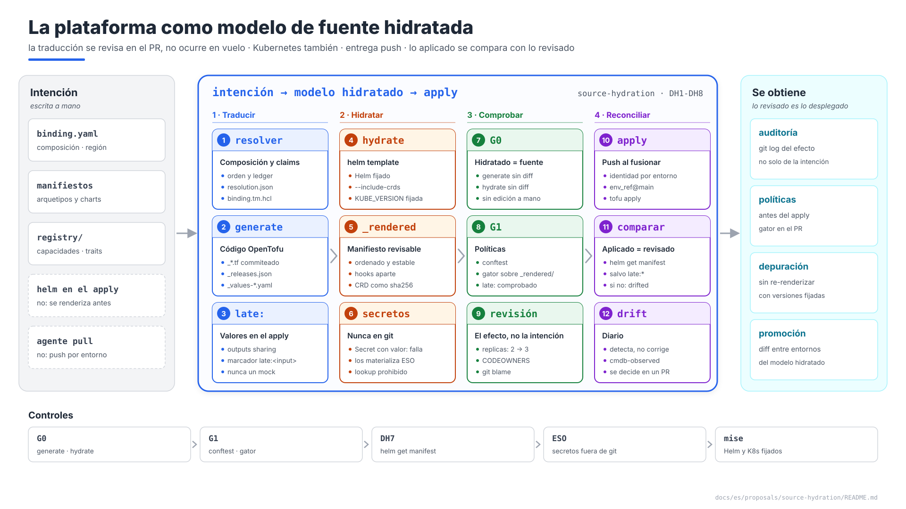

# La plataforma como modelo de fuente hidratada — y la capa Kubernetes hidratada en el PR

| | |
|---|---|
| **Estado** | Propuesta · revisión 1 |
| **Alcance** | Qué es un modelo de infraestructura de fuente hidratada (SHIM) y en qué se diferencia del GitOps clásico; dónde está la plataforma respecto a él; y cómo cerrar el hueco que queda — la capa Kubernetes, que hoy se renderiza en el `apply` —: renderizado en el PR, puerta de integridad, admisión antes del `apply`, comparación de lo aplicado con lo revisado, y por qué la entrega sigue siendo push |
| **Por qué ahora** | La plataforma ya guarda en git la traducción de la intención a infraestructura, pero no la de los charts: un revisor ve "cambia el chart X" o "cambia el valor Y", nunca los manifiestos, y Gatekeeper los ve por primera vez al admitirlos. Es exactamente el renderizado "en vuelo" que el modelo hidratado elimina |
| **Base** | Arquitectura §4 (generación), §13.3–§13.4 (G1, G3), §14 (CI/CD); AM §12 (resolución); `gatekeeper-qa` §6.2 (`gator` en CI); `infra-repo-qa` §5 y plantillas; `cmdb-qa` (mitad observada); `multi-environment` DX1, DX9 |
| **Especificación de referencia** | `archetype-model.md` (AM §n), `terramate-outputs-sharing-architecture.md` (§n), `risk-register.md` |
| **Diagramas** | `diagrams/*.mmd` (fuente Mermaid) y `diagrams/*.svg` (renderizados). El SVG se regenera desde el `.mmd`; no se edita a mano. `diagrams/02-presentation-blocks.svg` (1920×1080, para presentaciones) se genera con `02-presentation-blocks.py`, no con Mermaid |
| **Identificadores propios** | Decisiones `DH1…`, riesgos candidatos `RH1…`, verificaciones `VH1…` |

No reabre ninguna decisión de `CLAUDE.md`: la entrega sigue siendo push con identidades por entorno (`multi-environment` DX9), el código generado se commitea, y los charts se siguen aplicando con `helm_release`. Encuentra cuatro cosas, tres de ellas medidas con Helm 3.19.0 sobre el chart de cert-manager v1.16.2:

1. **La plataforma ya es un modelo de fuente hidratada en la infraestructura, no en Kubernetes** (§1).
2. **`--skip-crds` no basta para separar los CRD.** Con `crds.enabled=true`, cert-manager renderiza sus 6 CRD desde `templates/`, y `helm template --skip-crds` los sigue emitiendo: hay que separarlos por `kind` (medido).
3. **Los CRD son el 97 % del render.** 1,25 MB de 1,29 MB; el resto son 38 KB revisables. Se guardan como resumen (`nombre` y `sha256`), no enteros (medido).
4. **Los hooks salen en `helm template` y no en `helm get manifest`.** Los cuatro recursos del `startupapicheck` llevan `helm.sh/hook: post-install` (medido); Helm los devuelve por `helm get hooks`. Comparar lo aplicado con lo revisado exige separarlos.

Fuente: [`diagrams/01-hydration.mmd`](diagrams/01-hydration.mmd)

Fuente: [`diagrams/02-presentation-blocks.py`](diagrams/02-presentation-blocks.py) — vista de presentación; el detalle está en §1–§5.

---

## 0. Fuente hidratada frente a GitOps clásico

Un **modelo de infraestructura de fuente hidratada** guarda en git, versionado, el estado completamente traducido que queda entre la intención abstracta del tenant y lo desplegado, y lo hace **antes** de reconciliar. El GitOps clásico guarda la intención y deja la traducción al controlador, en el momento de sincronizar.

| | GitOps clásico | Fuente hidratada |
|---|---|---|
| Qué hay en git | La intención: charts, Kustomize, valores | La intención **y** su traducción, en crudo, versionada |
| Dónde se traduce | En el controlador, al sincronizar | En el pipeline, antes de fusionar; el resultado se commitea |
| Qué se revisa | El cambio de intención | El cambio de intención y su efecto exacto |
| "¿Por qué ocurrió X?" | Hay que reproducir el renderizado, con la versión del controlador de entonces | Está en el diff y en `git log` |
| Políticas | Sobre lo que llega a la admisión | También sobre la traducción, en el PR |
| Reconciliación | Agente pull, continua, autocorrige la deriva | Separada de la traducción: pull o push |

| | Ventajas | Inconvenientes |
|---|---|---|
| **GitOps clásico** | Sencillo; reconciliación continua; sin credenciales del destino en CI | El efecto real no se revisa; la versión del motor de plantillas del controlador decide el resultado; para infraestructura de nube hacen falta operadores |
| **Fuente hidratada** | Revisión del efecto; nada se renderiza en vuelo; auditoría completa; políticas antes del despliegue; promoción como diff | Diffs grandes y conflictos en lo generado; necesita una puerta de integridad; los secretos no se hidratan nunca; más CI; lo que solo se conoce al aplicar no se puede renderizar antes |

---

## 1. Dónde está la plataforma (DH1)

La plataforma es un **modelo de fuente hidratada con entrega push**: la intención se traduce en el PR, el resultado se revisa y se fusiona, y CI reconcilia al fusionar.

| Etapa | En la plataforma | ¿Hidratado en `main`? |
|---|---|---|
| Intención | Manifiestos de arquetipo, `environments/<env>/binding.yaml` (lo único escrito a mano, `multi-environment` DX1), `registry/` | Es la fuente |
| Traducción | Resolver (AM §12): composición, orden, claims; `terramate generate` con generadores y contratos | — |
| Modelo traducido | `resolution.json`, `binding.tm.hcl`, ledger, mitad declarada de la CMDB, `_*.tf` | **Sí**, en el mismo commit que la intención, con CODEOWNERS |
| Puerta de integridad | G0 (`terramate generate --detailed-exit-code`), `archetypectl cmdb check` | — |
| Valores entre stacks | Outputs sharing: el consumidor recibe el valor del productor en el `apply` | **No**: *late-bound*. El código hidratado lleva la referencia, no el valor |
| Manifiestos de Kubernetes | `helm_release` renderiza el chart en el `apply` | **No** — el hueco que cierra esta propuesta |
| Reconciliación | `tofu apply` por entorno al fusionar, con su identidad; deriva detectada a diario (`drift.yml`), anotada en `cmdb-observed`, no autocorregida | — |

Lo único completamente resuelto es el **plan**: se revisa en el PR, pero no se versiona, porque cambia con el estado.

---

## 2. Hidratar la capa Kubernetes (DH2–DH5)

### 2.1 Qué se escribe y dónde (DH2)

Cada stack que despliega charts lleva, generado por `terramate generate` junto a sus `_*.tf`:

| Fichero | Contenido | Lo escribe |
|---|---|---|
| `_releases.json` | Una entrada por `helm_release`: nombre, namespace, chart (por digest, del repositorio `charts`), versión, fichero de valores | El generador |
| `_values-<release>.yaml` | Los valores derivados que recibe el `helm_release`, los mismos | El generador |
| `_rendered/<release>.yaml` | Lo que devolverá `helm get manifest`, sin los CRD, ordenado por `kind`, namespace y nombre | `ci/hydrate.sh` |
| `_rendered/<release>.hooks.yaml` | Los hooks: `helm template` los renderiza y `helm get manifest` no | `ci/hydrate.sh` |
| `_rendered/<release>.crds.sha256` | Una línea por CRD: nombre y `sha256` | `ci/hydrate.sh` |

`ci/hydrate.sh` recorre los `_releases.json`, ejecuta `helm template --include-crds --kube-version "$KUBE_VERSION"` con la versión de Helm fijada en `.mise.toml` y reparte el resultado con `ci/split-rendered.py` (plantillas en `infra-repo-qa/templates/ci/`). Falla si no encuentra ningún `_releases.json`: una puerta que no renderiza nada no puede pasar (arquitectura §14.4).

### 2.2 G0 cubre lo renderizado (DH3)

G0 pasa a ser dos comprobaciones: `terramate generate --detailed-exit-code`, y `ci/hydrate.sh` seguido de `git status --porcelain -- '*/_rendered/*'` vacío. Una edición a mano en `_rendered/`, o un chart que sube de versión sin volver a hidratar, falla el PR. Probado sobre un stack de ejemplo: dos renderizados seguidos dan ficheros idénticos byte a byte, y cambiar `replicaCount` de 2 a 3 aparece en el diff exactamente como `replicas: 2 → 3`.

### 2.3 Los valores *late-bound* (DH4)

Un valor de chart que llega por outputs sharing no se conoce en el PR. El generador lo pasa como entrada `set` y lo escribe en `_values-<release>.yaml` con un marcador con nombre, `late:<input>` — nunca un mock, que haría pasar por real un valor inventado, y nunca el valor real. El revisor ve exactamente qué campos se resuelven en el `apply`. Una regla de G1 rechaza un valor de chart que venga de un `input` sin ese marcador.

### 2.4 Lo que no se hidrata, a propósito (DH5)

| Qué | Por qué | Cómo |
|---|---|---|
| CRD | Son el 97 % del render; enteros harían ilegible el diff | Resumen `nombre sha256`: un cambio de CRD aparece como un hash distinto |
| `Secret` con `data` o `stringData` | Un secreto en git no se retira nunca del historial | `split-rendered.py` falla (probado): los secretos los materializa ESO |
| Charts que usan la función `lookup` | Renderizan distinto sin cluster | Prohibida en nuestros charts (G1); en los de terceros, anotada por chart y vigilada por DH7 |

---

## 3. Admisión antes del `apply` (DH6)

`gator test` con los `ConstraintTemplate` y `Constraint` de `library` corre sobre `_rendered/` en G1, como amplía `gatekeeper-qa` §6.2: un pod que incumple P11 o P13, una imagen sin digest (P2) o un KSA con el prefijo de otro entorno (P12) fallan el PR, no el `apply`. La admisión sigue siendo la última línea; esta es la primera.

---

## 4. Lo aplicado es lo revisado (DH7)

Después de cada `helm_release`, el deploy compara `helm get manifest` con `_rendered/<release>.yaml` (y `helm get hooks` con `.hooks.yaml`), enmascarando solo los campos `late:*`. Una diferencia marca la observación como `drifted` en la CMDB (`cmdb-observed`) y falla el paso: detecta una versión de Helm del proveedor distinta de la del CLI, un `lookup` de un chart de terceros o un `KUBE_VERSION` desalineado con el cluster. Sin esta comparación, lo hidratado sería una afirmación que nadie comprueba.

---

## 5. La entrega sigue siendo push (DH8)

El modelo hidratado separa la traducción de la reconciliación; no exige un agente pull. La plataforma mantiene la entrega push porque cada `apply` lo hace la identidad de su entorno, atada a su GitHub Environment y a `main` (`multi-environment` DX9), y porque un `apply` automático y continuo sobre infraestructura con estado — bases de datos, claves, redes — corrige deriva destruyendo. La deriva se detecta cada día y se decide en un PR.

---

## 6. Riesgos y verificaciones

### 6.1 Riesgos candidatos

| # | Riesgo | Probabilidad | Impacto | Mitigación |
|---|---|---|---|---|
| RH1 | **Lo renderizado no es lo aplicado**: Helm del proveedor distinto del CLI, `lookup`, `KUBE_VERSION` desalineado | Media | Alto — se revisa una cosa y se aplica otra, y nadie lo sabe | Versiones fijadas en `.mise.toml`; comparación tras el `apply` (DH7); VH1, VH2 |
| RH2 | **Ruido y conflictos en `_rendered/`** | Alta con muchos PR | Bajo — revisiones lentas | CRD como hash; orden estable; ante un conflicto se vuelve a hidratar, nunca se fusiona a mano |
| RH3 | **Un valor secreto hidratado en git** | Baja con la regla | Crítico — no sale nunca del historial | `split-rendered.py` falla con un `Secret` con valor; secretos solo por ESO; la plantilla de valores no recibe secretos (`CLAUDE.md`, outputs sharing) |

### 6.2 Verificaciones

| # | Verificación | Resultado que la cierra |
|---|---|---|
| VH1 | Renderizado igual a lo aplicado | Para cada chart de plataforma en `qa`: `helm get manifest` igual a `_rendered/<release>.yaml`, enmascarando `late:*` |
| VH2 | Versión de Helm del proveedor | La versión de Helm que incrusta el proveedor `helm` fijado coincide con la del CLI de `.mise.toml` |
| VH3 | `gator` sobre lo renderizado | Un chart con una toleración de `system` desde un namespace ajeno falla G1 por P11 |
| VH4 | `hydrate.sh` | Determinista; separa CRD y hooks; falla sin `_releases.json` y con un `Secret` con valor — **hecho en el diseño** (Helm 3.19.0, cert-manager v1.16.2) |

---

## 7. Cambios a otros documentos

| Documento | Cambio | Estado |
|---|---|---|
| Arquitectura §14.4 | G0 incluye `_rendered/`; convención de ficheros generados (`_releases.json`, `_values-*.yaml`, `_rendered/`) | **Aplicado** (DH2, DH3) |
| Arquitectura §14.5 (nueva) | La plataforma como modelo de fuente hidratada | **Aplicado** (DH1, DH8) |
| `gatekeeper-qa` §6.2 | `gator test` también sobre `_rendered/` | **Aplicado** (DH6) |
| `infra-repo-qa` (plantillas `ci/hydrate.sh`, `ci/split-rendered.py`, `ci/g1.sh`, `preview.yml`, `.mise.toml`) | Hidratación, G0 ampliado, `gator`, Helm fijado | **Aplicado** (DH2, DH3, DH6) |
| Registro de riesgos | R72 (RH1), R73 (RH3) | **Aplicado** |

---

## 8. Decisiones

| # | Decisión | Estado | Recomendación | Alternativa |
|---|---|---|---|---|
| DH1 | Qué modelo es la plataforma | **Propuesta** | Fuente hidratada con entrega push; tabla de lo hidratado, lo *late-bound* y lo no hidratado | Llamarlo GitOps sin más, ocultando qué se revisa y qué no |
| DH2 | Hidratar Kubernetes | **Propuesta** | `helm template` en el PR con los mismos valores y la misma versión; `_rendered/` commiteado | Seguir renderizando solo en el `apply` |
| DH3 | Integridad | **Propuesta** | G0 ampliado a `_rendered/` | Confiar en que alguien hidrate |
| DH4 | Valores *late-bound* | **Propuesta** | Marcador `late:<input>`, comprobado en G1 | Mocks: un valor inventado que parece real |
| DH5 | Lo que no se hidrata | **Propuesta** | CRD como hash; nunca un `Secret` con valor; `lookup` prohibido en nuestros charts | CRD enteros (97 % del render) |
| DH6 | Admisión antes del `apply` | **Propuesta** | `gator test` sobre `_rendered/` en G1 | Solo admisión en el cluster |
| DH7 | Lo aplicado es lo revisado | **Propuesta** | Comparación `helm get manifest` / `_rendered/` tras cada `apply` | Suponerlo |
| DH8 | Entrega | **Propuesta** | Push, como hoy | Un agente pull que reconcilie de forma continua |

---

## 9. Plan de implementación

| Fase | Contenido | Criterio de salida |
|---|---|---|
| **1 · Generadores** | `_releases.json` y `_values-<release>.yaml` desde los generadores de los arquetipos con charts; marcador `late:` y su regla de G1 | `terramate generate` los emite para todos los stacks con `helm_release`; la regla falla con un `input` sin marcador |
| **2 · Hidratación y G0** | `ci/hydrate.sh`, `ci/split-rendered.py`, Helm fijado, G0 ampliado | Un PR que cambia un valor muestra el cambio en `_rendered/`; una edición a mano falla G0 |
| **3 · Admisión en el PR** | `gator test` sobre `_rendered/` | **VH3** |
| **4 · Comparación tras el `apply`** | DH7 en `apply-env` y en `first-deploy` | **VH1**, **VH2** en `qa` |
