# Arquetipos Terramate con Outputs Sharing

**Una arquitectura de referencia para infraestructura multi-cloud y multi-entorno usando Terramate CLI + OpenTofu**

| | |
|---|---|
| **Alcance** | Terramate CLI (OSS) + OpenTofu, sin HCP Terraform, sin Terraform Stacks |
| **Mecanismo central** | Terramate Outputs Sharing (`sharing_backend` / `output` / `input`) |
| **Clouds cubiertas** | Google Cloud, AWS y Azure a la par; extensible a una cuarta |
| **Audiencia** | Ingeniería de plataforma, arquitectura tecnológica |
| **Estado de la dependencia clave** | Outputs Sharing es una funcionalidad **experimental** de Terramate — ver [§15 Registro de riesgos](#15-risk-register) |

---

## Índice

1. [Por qué existe este documento](#1-why-this-document-exists)
2. [Conceptos centrales y vocabulario](#2-core-concepts-and-vocabulary)
3. [Arquitectura](#3-architecture)
4. [Referencia elemento por elemento](#4-element-by-element-reference)
5. [Guía A — Plataforma GKE y su cadena de dependencias](#5-guide-a--gke-platform-and-its-dependency-chain)
6. [Guía B — Plataforma EKS y su cadena de dependencias](#6-guide-b--eks-platform-and-its-dependency-chain)
7. [Guía C — Plataforma Cloud Run y su cadena de dependencias](#7-guide-c--cloud-run-platform-and-its-dependency-chain)
8. [Guía D — Plataforma ECS Fargate y su cadena de dependencias](#8-guide-d--ecs-fargate-platform-and-its-dependency-chain)
9. [Guía E — Plataforma AKS y su cadena de dependencias](#9-guide-e--aks-platform-and-its-dependency-chain)
10. [Adjunto de borde entre clouds](#10-edge-attachment-across-clouds)
11. [Identidad, acceso y línea base de seguridad](#11-identity-access-and-security-baseline)
12. [Gestión de entornos: dedicados y compartidos](#12-environment-management-dedicated-and-shared)
13. [Validación de políticas y seguridad](#13-policy-and-security-validation)
14. [CI/CD con GitHub Actions](#14-cicd-with-github-actions)
15. [Registro de riesgos](#15-risk-register) — registro completo en `risk-register.md`
16. [Hoja de ruta de adopción](#16-adoption-roadmap)
17. [Apéndice — chuleta de convenciones](#17-appendix--conventions-cheat-sheet)

> **Empieza por `platform-overview.md`** para un mapa del conjunto de documentos guiado por diagramas.
>
> **Los riesgos** viven en `risk-register.md`, agrupados por dominio y revisados en cada hito de fase.
>
> **Documento complementario.** `archetype-model.md` especifica el modelo de
> empaquetado de arquetipos — manifiestos, resolución de capability/trait,
> arquetipos multi-stack, el catálogo de componentes, pools jerárquicos de
> CIDR, recursos de tenant sobre operadores compartidos, la CMDB basada en
> Git, y el resolver que valida una composición y escribe `binding.tm.hcl`
> *antes* de que se ejecuten los generadores de este documento.

---

## 1. Por qué existe este documento

Terraform Stacks — el modelo de bloques `component` / `stack` / `deployment` publicado por HashiCorp — es una funcionalidad de la **plataforma alojada** (HCP Terraform y Terraform Enterprise 2.0+). No está disponible en el CLI de Terraform de código abierto, y no está disponible en absoluto en OpenTofu. El patrón por capas de "stacks dentro de stacks" que circula en la comunidad no puede, por tanto, ejecutarse sobre una cadena de herramientas solo-CLI.

Terramate resuelve la misma clase de problema con un modelo fundamentalmente distinto:

| Terraform Stacks (HCP) | Terramate (CLI) |
|---|---|
| Los stacks se componen anidando bloques `stack` | Los stacks son planos; **la abstracción vive en la generación de código** |
| Los inputs se pasan explícitamente entre capas de stack | Los datos fluyen mediante **globals** (tiempo de compilación) u **outputs sharing** (tiempo de ejecución) |
| Orquestación por la plataforma | Orquestación mediante `terramate run` en tu propia CI |
| Artefactos versionados y publicados en un registro | Generadores y módulos versionados en Git en un monorepo |

La consecuencia es que "una capa base de landing zone envuelta por una capa específica de cloud" **no** se convierte en stacks anidados. Se convierte en:

- **Generadores** (`generate_hcl`) que emiten el código Terraform/OpenTofu — la capa base.
- **Globals** sobrescritos a lo largo del árbol de directorios — las capas específicas de cloud y de entorno.
- **Outputs sharing** para pasar hechos de tiempo de ejecución (IDs de VPC, endpoints de cluster, ARNs de proveedor OIDC) entre stacks que no pueden conocerse en el momento de generar el código.

Este documento especifica esa arquitectura por completo.

---

## 2. Conceptos centrales y vocabulario

El vocabulario consistente importa aquí porque Terraform, Terragrunt y Terramate usan todos la palabra *stack* para cosas distintas.

| Término | Definición en esta arquitectura |
|---|---|
| **Módulo (Module)** | Un módulo OpenTofu reutilizable — recursos, variables, outputs, restricciones de proveedor. Sin backend. Vive en `modules/` o en un registro. |
| **Stack** | Un directorio que contiene un `stack.tm.hcl`, una configuración de backend y su propio fichero de estado. La unidad más pequeña que orquesta Terramate. |
| **Capability** | Un rol funcional que juega un stack: `network`, `cluster`, `data`, `platform-services`, `app`. Determina qué generador aplica. |
| **Platform** | Un conjunto de stacks que provee fundamentos compartidos para una cloud y un entorno: network + cluster + servicios de plataforma. Produce outputs. |
| **Archetype** | Una composición reutilizable y parametrizada de stacks de aplicación (p. ej. `webapp-3tier`). Una plantilla, no un despliegue. |
| **Archetype instance** | Un despliegue concreto de un arquetipo, ligado a una plataforma y un entorno. Consume outputs. |
| **Producer stack** | Un stack que declara bloques `output`. |
| **Consumer stack** | Un stack que declara bloques `input`. |
| **Binding** | El acto de apuntar una instancia de arquetipo a una plataforma específica, fijando los IDs de stack `global.platform.*`. |
| **Dedicated environment** | Una plataforma que sirve exactamente a una instancia de arquetipo. |
| **Shared environment** | Una plataforma que sirve a muchas instancias de arquetipo simultáneamente (típico en demos). |

### Cómo se localiza un stack

Todo stack se sitúa en la intersección de ejes independientes, y mantenerlos ortogonales es lo que hace que el modelo escale:

| Eje | Valores | Resuelto por |
|---|---|---|
| **Cloud** | gcp \| aws \| azure | globals + `condition` del generador — qué proveedor y backend se generan |
| **Environment** | prod \| qa \| dev \| demos \| ephemeral-* | posición del directorio + globals — dimensionamiento, proyecto/cuenta |
| **Capability** | network \| cluster \| platform-services \| data \| app | generadores + filtros de stack — qué módulo se invoca |
| **Archetype instance** | webapp-3tier/alpha, keycloak, … | subárbol de directorios — qué conjunto de stacks existe |

El eje de arquetipo lo especifica por completo el documento complementario: capabilities, traits, capas y la gramática del manifiesto que decide qué arquetipo puede satisfacer qué requisito. Este documento lo trata como dado y cubre la generación.

---

## 3. Arquitectura

### 3.1 Vista lógica

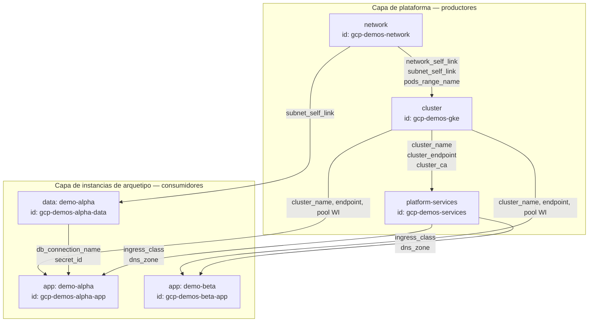

Dos propiedades de este grafo dirigen cada decisión de diseño posterior:

1. **La capa de plataforma es un publicador compartido.** Muchas instancias de arquetipo consumen de los mismos productores. Un cambio en un output de plataforma es un cambio disruptivo para cada consumidor.
2. **Las aristas son de tiempo de ejecución, no de tiempo de compilación.** Un `cluster_endpoint` no existe hasta que el cluster se aplica. Esto es exactamente lo que aborda outputs sharing y lo que los globals no pueden abordar.

### 3.2 Vista física — disposición del repositorio

```
repo/
├── terramate.tm.hcl                       # config raíz: experiments, sharing_backend, run env
├── mise.toml                              # versiones fijadas de terramate / tofu / checkov
├── .checkov/
│   ├── gcp.yaml
│   └── aws.yaml
│
├── modules/                               # módulos OpenTofu (o un registro remoto)
│   ├── gcp-network/
│   ├── gcp-gke/
│   ├── aws-network/
│   ├── aws-eks/
│   ├── app-workload/
│   └── ...
│
├── imports/                               # nunca contiene stacks; solo config importable
│   ├── mixins/
│   │   ├── backend_gcp.tm.hcl             # generate_hcl "_backend.tf" para GCS
│   │   ├── backend_aws.tm.hcl             # generate_hcl "_backend.tf" para S3
│   │   ├── provider_gcp.tm.hcl
│   │   ├── provider_aws.tm.hcl
│   │   └── labels.tm.hcl                  # labels/tags comunes inyectados en cada stack
│   │
│   ├── generators/v1/                     # "la capa base": un generador por capability
│   │   ├── gen_network.tm.hcl
│   │   ├── gen_cluster.tm.hcl
│   │   ├── gen_data.tm.hcl
│   │   ├── gen_platform_services.tm.hcl
│   │   └── gen_app.tm.hcl
│   │
│   └── contracts/                         # contratos output/input por capability
│       ├── contract_network_gcp.tm.hcl
│       ├── contract_network_aws.tm.hcl
│       ├── contract_cluster_gke.tm.hcl
│       ├── contract_cluster_eks.tm.hcl
│       └── contract_data.tm.hcl
│
└── stacks/
    ├── platforms/
    │   ├── gcp/
    │   │   ├── config.tm.hcl              # globals: cloud = "gcp"
    │   │   ├── demos/               # entorno COMPARTIDO
    │   │   │   ├── config.tm.hcl          # globals: env, project_id, cidrs, sizing
    │   │   │   ├── network/     stack.tm.hcl
    │   │   │   ├── gke/         stack.tm.hcl
    │   │   │   └── services/    stack.tm.hcl
    │   │   └── prod/                       # entorno DEDICADO
    │   │       ├── config.tm.hcl
    │   │       ├── network/ gke/ services/
    │   └── aws/
    │       ├── config.tm.hcl              # globals: cloud = "aws"
    │       ├── demos/
    │       │   ├── config.tm.hcl
    │       │   ├── network/ eks/ services/
    │       └── prod/
    │           └── network/ eks/ services/
    │
    └── archetypes/
        ├── webapp-3tier/
        │   ├── manifest.yaml              # requires / provides / stacks / claims
        │   ├── archetype.tm.hcl           # globals comunes al arquetipo
        │   └── instances/
        │       ├── alpha/                 # ligada a gcp/demos
        │       │   ├── binding.tm.hcl     # ESCRITO POR EL RESOLVER
        │       │   ├── iam/       stack.tm.hcl
        │       │   ├── secrets/   stack.tm.hcl
        │       │   ├── data/      stack.tm.hcl
        │       │   ├── messaging/ stack.tm.hcl
        │       │   ├── firewall/  stack.tm.hcl
        │       │   ├── app/       stack.tm.hcl
        │       │   └── frontdoor/ stack.tm.hcl
        │       ├── beta/                  # ligada a la MISMA gcp/demos
        │       └── disasterproject-prod/             # ligada a aws/prod — dedicada
        └── event-driven/
            └── ...
```

Los directorios de stack de una instancia se **generan a partir de `stacks[]` del arquetipo**, y un stack cuya `condition` sea falsa no tiene directorio alguno. `binding.tm.hcl` es la salida del resolver, nunca editado a mano.

Tres reglas que hacen funcionar esta disposición:

- **`imports/` no contiene stacks.** Terramate nunca debe orquestar nada bajo este directorio. Solo contiene bloques `generate_hcl`, `globals` y de contrato que los stacks importan.
- **Un stack de plataforma nunca importa configuración de arquetipo, y viceversa.** El único acoplamiento es a través de outputs sharing.
- **Los ficheros generados se commitean en git** y llevan el prefijo `_` para que se ordenen juntos y sean fáciles de emparejar en `CODEOWNERS`.

### 3.3 Vista de flujo de datos — cómo viaja un valor

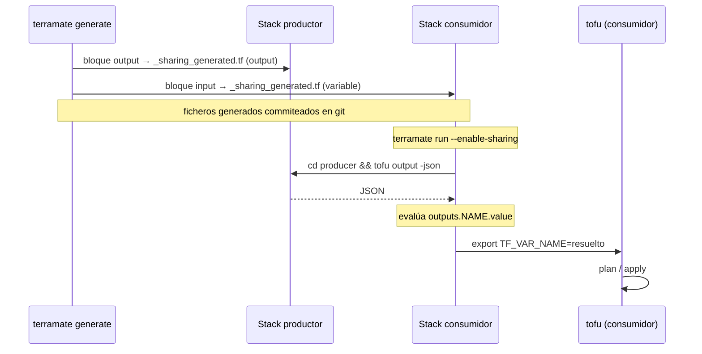

La implicación crítica de la tercera flecha: **el job de CI que ejecuta un stack consumidor necesita acceso de lectura al backend de estado del stack productor.** En una topología multi-cuenta o multi-proyecto esto es un requisito de IAM concreto, cubierto en §11.5, y por guía en §5.6, §6.6, §7.7, §8.7 y §9.5.

---

## 4. Referencia elemento por elemento

### 4.1 `terramate.tm.hcl` — configuración raíz

```hcl
# /terramate.tm.hcl
terramate {
  # Fija una versión que hayas verificado. La semántica de bloques de
  # Outputs Sharing cambió en 0.10.9 (el campo `sensitive` perdió su valor por defecto).
  required_version = ">= 0.11.0"

  config {
    # Outputs Sharing es experimental y debe activarse explícitamente.
    experiments = ["outputs-sharing"]

    git {
      default_branch = "main"
      default_remote = "origin"
    }

    run {
      env {
        TF_PLUGIN_CACHE_DIR = "${terramate.root.path.fs.absolute}/.tofu-plugin-cache"
        TF_IN_AUTOMATION    = "1"
      }
    }
  }
}
```

| Elemento | Propósito | Notas |
|---|---|---|
| `required_version` | Protege contra la deriva del CLI entre los portátiles de los desarrolladores y la CI | Fíjala; no uses `latest` en CI |
| `experiments` | Habilita `sharing_backend`, `input`, `output` | Sin esto, los bloques son errores de parseo |
| `config.git` | Línea base para la detección de cambios | `--changed` compara contra `default_branch` |
| `config.run.env` | Entorno inyectado en cada `terramate run` | Buen lugar para la caché de plugins; una caché compartida reduce materialmente el tiempo de CI cuando tienes docenas de stacks |

### 4.2 `sharing_backend` — el transporte

```hcl
# /terramate.tm.hcl (mismo fichero o un .tm.hcl hermano en la raíz)
sharing_backend "tofu" {
  type     = terraform                       # palabra clave, NO una cadena; funciona también para OpenTofu
  filename = "_sharing_generated.tf"
  command  = ["tofu", "output", "-json"]
}
```

| Atributo | Tipo | Significado |
|---|---|---|
| label (`"tofu"`) | string | Nombre referenciado por cada `input.backend` y `output.backend`. Usa un backend por motor de IaC, no por cloud. |
| `type` | keyword | Solo `terraform` está soportado hoy. Es una palabra clave desnuda — entrecomillarla es un error de sintaxis. |
| `filename` | string | El fichero que Terramate genera en cada stack, conteniendo los bloques `variable` / `output` derivados. |
| `command` | list(string) | Ejecutado **dentro del directorio del stack productor**; la salida estándar debe ser un objeto JSON. |

**Guía de diseño**

- Define el `sharing_backend` **una vez en la raíz del repositorio** para que sea visible a cada stack. Definirlo por cloud crea dos espacios de nombres que no pueden referenciarse entre sí, lo que rompe los arquetipos entre clouds.
- El `command` debe ser *barato y sin efectos secundarios*. `tofu output -json` requiere un directorio de trabajo inicializado; asegúrate de que tu CI ejecuta `tofu init` en los productores antes que en los consumidores, o envuelve el comando en un script que inicialice bajo demanda.
- Como es solo un comando que produce JSON, puedes sustituir más adelante una ruta más rápida (p. ej. leer un artefacto de outputs publicado en almacenamiento de objetos) sin cambiar ningún bloque `input`/`output`.

### 4.3 `output` — el contrato del productor

```hcl
# stacks/platforms/gcp/demos/network/outputs.tm.hcl
output "network_self_link" {
  backend     = "tofu"
  value       = module.network.network_self_link
  description = "Self link de la VPC compartida"
}

output "gke_pods_range_name" {
  backend = "tofu"
  value   = module.network.secondary_range_names.pods
}
```

| Atributo | Requerido | Significado |
|---|---|---|
| label | sí | Nombre del output. Es la **clave pública del contrato** — trata los renombrados como cambios disruptivos. |
| `backend` | sí | Debe coincidir con un label de `sharing_backend`. |
| `value` | sí | Expresión evaluada **en el código OpenTofu generado**, así que puede referenciar `module.*`, `resource.*`, `data.*`. |
| `description` | no | Se emite en el bloque `output` generado. Úsala — se convierte en la documentación de tu contrato. |
| `sensitive` | no | Solo se emite cuando se fija. Ver la advertencia más abajo. |

> **Valores sensibles.** Outputs sharing resuelve valores en variables de entorno `TF_VAR_<name>` en el proceso del consumidor. Las variables de entorno son visibles para cualquier cosa en ese árbol de procesos y se filtran fácilmente a los logs de CI. **Nunca compartas secretos a través de outputs sharing.** Comparte *referencias* — un ID de secreto de Secret Manager, un nombre de parámetro SSM, un ARN de clave KMS — y deja que el stack consumidor lea el secreto mediante un data source bajo su propia identidad IAM.

**Dónde poner los bloques `output`.** Ponlos en `imports/contracts/` e impórtalos en el stack productor, no inline. Esto te da un único lugar donde revisar el contrato, y hace el contrato reutilizable en cada entorno que instancia la misma capability.

```hcl
# imports/contracts/contract_network_gcp.tm.hcl
# Importado por cada stack de network de GCP.
output "network_self_link" { backend = "tofu"  value = module.network.network_self_link }
output "subnet_self_link"  { backend = "tofu"  value = module.network.subnet_self_link }
output "gke_pods_range_name"     { backend = "tofu"  value = module.network.range_pods }
output "gke_services_range_name" { backend = "tofu"  value = module.network.range_services }
output "project_id"        { backend = "tofu"  value = var.project_id }
```

```hcl
# stacks/platforms/gcp/demos/network/stack.tm.hcl
stack {
  id   = "gcp-demos-network"
  name = "GCP demos — network"
  tags = ["gcp", "demos", "network", "platform", "producer"]
}

import { source = "/imports/contracts/contract_network_gcp.tm.hcl" }
import { source = "/imports/mixins/backend_gcp.tm.hcl" }
import { source = "/imports/mixins/provider_gcp.tm.hcl" }
import { source = "/imports/generators/v1/gen_network.tm.hcl" }
```

### 4.4 `input` — el contrato del consumidor

```hcl
# imports/contracts/contract_cluster_gke.tm.hcl — importado por los stacks de cluster GKE
input "network_self_link" {
  backend       = "tofu"
  from_stack_id = global.platform.network_stack_id
  value         = outputs.network_self_link.value
  mock          = "projects/mock-project/global/networks/mock-vpc"
}

input "subnet_self_link" {
  backend       = "tofu"
  from_stack_id = global.platform.network_stack_id
  value         = outputs.subnet_self_link.value
  mock          = "projects/mock-project/regions/europe-west1/subnetworks/mock-subnet"
}
```

| Atributo | Requerido | Significado |
|---|---|---|
| label | sí | Se convierte en una `variable "<label>"` generada en el consumidor. Referénciala como `var.<label>` en tu código generado. |
| `backend` | sí | Debe coincidir con un label de `sharing_backend`. |
| `from_stack_id` | sí | El **ID de stack** del productor. Es una expresión de cadena — y es la palanca más importante de esta arquitectura. |
| `value` | sí | Expresión sobre el espacio de nombres `outputs.*` construido a partir del JSON del productor. |
| `mock` | no | Valor de reserva usado solo cuando se pasa `--mock-on-fail`. Esencial para las previews de PR. |
| `sensitive` | no | Solo se emite cuando se fija. |

#### La palanca `from_stack_id`

Como `from_stack_id` acepta una expresión, puede pilotarse mediante un global:

```hcl
# stacks/archetypes/webapp-3tier/instances/alpha/binding.tm.hcl
globals "platform" {
  cloud              = "gcp"
  env                = "demos"
  network_stack_id   = "gcp-demos-network"
  cluster_stack_id   = "gcp-demos-gke"
  services_stack_id  = "gcp-demos-services"
  # Dónde viven las cargas de trabajo de esta instancia dentro de un cluster compartido:
  namespace          = "demo-alpha"
}
```

```hcl
# stacks/archetypes/webapp-3tier/instances/disasterproject-prod/binding.tm.hcl
globals "platform" {
  cloud              = "aws"
  env                = "prod"
  network_stack_id   = "aws-prod-network"
  cluster_stack_id   = "aws-prod-eks"
  services_stack_id  = "aws-prod-services"
  namespace          = "disasterproject"
}
```

Los bloques `input` del arquetipo se escriben **una sola vez**, en `imports/contracts/`, referenciando `global.platform.cluster_stack_id`. Ligar una instancia a una plataforma demo compartida o a una plataforma de producción dedicada es entonces un **fichero de cinco líneas**. Esto es lo que reemplaza la capa de "configuración del componente wrapper del stack" del patrón HCP Stacks — binding tardío mediante globals en lugar de anidamiento.

> **Decisión de diseño: `from_stack_id` es una expresión.** Esta arquitectura asume
> que `from_stack_id` resuelve globals, que es lo que permite que un único fichero
> de contrato por capability sirva a cada instancia. Tres variantes aún necesitan
> confirmarse contra tu versión fijada de Terramate, porque que la forma básica
> funcione no las garantiza: globals **heredados** de un directorio padre en lugar
> de definidos en el stack; **interpolación** (`"${global.env}-gke"`) en lugar de
> una referencia desnuda; y el comportamiento de `mock` bajo `--mock-on-fail` cuando
> el productor todavía no tiene estado.
>
> Los globals en `stack.after` siguen siendo una cuestión abierta, y falla **de
> forma silenciosa** — una expresión no resuelta deja el ordenamiento vacío en
> lugar de lanzar un error, así que un consumidor puede ejecutarse antes que su
> productor. Ese es el riesgo R2. El lint de §14.4 lo detecta; si los globals no
> se resuelven ahí, recurre al ordenamiento basado en tags (§4.5).

#### Los mocks no son opcionales

En cualquier repositorio donde un productor y un consumidor puedan cambiar en el mismo pull request, las previews de plan del consumidor fallarán — los nuevos outputs todavía no existen. Cada bloque `input` debería llevar un `mock` cuya **forma y tipo** coincidan con el valor real. Un mock del tipo equivocado produce un plan que tiene éxito localmente y falla al aplicar.

Convención: prefija cada mock con `mock-` para que un valor mockeado que aparezca en un log de *despliegue* sea reconocible de inmediato como un bug.

### 4.5 `stack` — identidad y ordenamiento

```hcl
stack {
  id    = "gcp-demos-gke"
  name  = "GCP demos — GKE cluster"
  tags  = ["gcp", "demos", "cluster", "gke", "platform", "producer"]
  after = ["/stacks/platforms/gcp/demos/network"]
}
```

> **Esta es la fuente más común de incidentes de producción en esta arquitectura.**
> Outputs sharing **no crea orden de ejecución**. Terramate ordena los stacks por
> anidamiento de directorios y solo por `before` / `after` explícitos. Un bloque
> `input` que referencia un productor se ejecutará alegremente antes que ese
> productor, resolverá contra un estado obsoleto (o fallará), y aplicará el valor
> equivocado.
>
> **Cada bloque `input` debe tener una entrada `after` correspondiente.** Refuérzalo
> con un lint del repositorio (§14.4).

Requisitos de `stack.id`:

- **Globalmente único** en todo el repositorio.
- **Estable.** Es la clave de cable del contrato de sharing. Renombrar un ID de stack rompe a cada consumidor ligado a él.
- **Derivable por humanos**, porque lo escribirás a mano en los ficheros de binding.

Convención: `<cloud>-<env>-<capability>[-<instance>]`

| Ejemplo | Significado |
|---|---|
| `gcp-demos-network` | Network compartida de la demo GCP |
| `aws-prod-eks` | Cluster EKS de producción en AWS |
| `gcp-demos-alpha-data` | Stack de datos de la instancia `alpha` en la plataforma demo compartida |

### 4.6 `globals` — la capa de tiempo de compilación

Los globals son el mecanismo que reemplaza la "capa wrapper específica de cloud" del patrón HCP. Se heredan a lo largo del árbol de directorios y pueden sobrescribirse en cualquier nivel.

```hcl
# stacks/platforms/gcp/config.tm.hcl                      ← capa de cloud
globals {
  cloud             = "gcp"
  state_bucket      = "disasterproject-tfstate-gcp"
  oidc_provider_var = "GOOGLE_WORKLOAD_IDENTITY_PROVIDER"
}
```

```hcl
# stacks/platforms/gcp/demos/config.tm.hcl          ← capa de entorno
globals {
  env        = "demos"
  project_id = "disasterproject-demos"
  region     = "europe-west1"
  vpc_cidr   = "10.4.0.0/17"             # reclamado del bloque permanente (AM §9.2)
}

globals "cluster" {
  min_nodes       = 1
  max_nodes       = 12
  machine_type    = "e2-standard-4"
  release_channel = "REGULAR"
  deletion_protection = false      # demo compartida: intencionadamente destruible
}

globals "policy" {
  # Las plataformas demo compartidas son multi-tenant; las cuotas son obligatorias.
  enforce_namespace_quota = true
  enforce_network_policy  = true
}
```

```hcl
# stacks/platforms/gcp/prod/config.tm.hcl                  ← capa de entorno (dedicada)
globals {
  env        = "prod"
  project_id = "disasterproject-prod"
  region     = "europe-west1"
  vpc_cidr   = "10.6.0.0/16"             # producción recibe una /16
}

globals "cluster" {
  min_nodes           = 3
  max_nodes           = 60
  machine_type        = "n2-standard-8"
  release_channel     = "STABLE"
  deletion_protection = true
}
```

**Regla general para elegir entre globals y outputs sharing:**

| El valor es... | Usa |
|---|---|
| Conocido antes del apply (CIDR, región, tipo de máquina, convención de nombres, un nombre de recurso determinista) | **Globals** |
| Solo conocible después del apply (ID generado, endpoint, certificado CA, ARN de proveedor OIDC) | **Outputs sharing** |
| Conocido antes del apply pero producido por el pipeline de otro equipo | **Globals**, poblados desde un fichero commiteado — no acoples pipelines innecesariamente |

Prefiere los globals siempre que sea posible. Cada arista de outputs sharing es un acoplamiento de tiempo de ejecución, un requisito de permiso de CI, y un modo de fallo. Cada global es una constante de tiempo de compilación.

### 4.7 `generate_hcl` — la capa base

Los generadores son donde vive la "landing zone generalizada". Un generador por capability, que selecciona el comportamiento a partir de globals.

```hcl
# imports/generators/v1/gen_cluster.tm.hcl
generate_hcl "_main.tf" {
  condition = global.capability == "cluster" && global.cloud == "gcp"

  content {
    module "gke" {
      source = "${terramate.stack.path.to_root}/modules/gcp-gke"

      project_id = global.project_id
      region     = global.region
      name       = "${global.env}-gke"

      # Valores de tiempo de compilación desde globals
      min_nodes       = global.cluster.min_nodes
      max_nodes       = global.cluster.max_nodes
      machine_type    = global.cluster.machine_type
      release_channel = global.cluster.release_channel

      # Valores de tiempo de ejecución que llegan vía outputs sharing como variables generadas
      network    = var.network_self_link
      subnetwork = var.subnet_self_link
      pods_range_name     = var.gke_pods_range_name
      services_range_name = var.gke_services_range_name

      labels = global.labels
    }
  }
}
```

| Atributo | Propósito |
|---|---|
| label | Nombre de fichero generado dentro de cada stack que coincide. Por convención se prefija con `_`. |
| `condition` | Expresión booleana sobre globals — la forma más limpia de ramificar por cloud y capability. |
| `stack_filter` | Selección basada en rutas (`project_paths`, `repository_paths`) cuando una condición resulta forzada. |
| `content` | El HCL a emitir. Las variables y funciones de Terramate se interpolan; todo lo demás pasa sin cambios. |

**Versionado de generadores.** Pon los generadores bajo `imports/generators/v1/` y protégelos con `condition = global.generators.version == "v1"`. Cuando necesites un cambio disruptivo, añade `v2/` al lado y migra los entornos uno a uno cambiando un global. Este es el equivalente en CLI a publicar una nueva versión de una configuración de componente de stack.

### 4.8 `script` — flujos de trabajo reutilizables

Los bloques `terramate script` te permiten nombrar un flujo de trabajo de varios pasos una sola vez e invocarlo de forma idéntica desde un portátil y desde CI. Fundamentalmente, los flags de sharing son expresables aquí.

```hcl
# /imports/scripts/tofu.tm.hcl (importado en la raíz)
script "tofu" "preview" {
  name        = "Plan changed stacks"
  description = "init, validate, plan con sharing y mocks"
  job {
    commands = [
      ["tofu", "init", "-lock-timeout=5m", "-input=false"],
      ["tofu", "validate"],
      ["tofu", "plan", "-out", "out.tfplan", "-lock=false", "-input=false", {
        enable_sharing = true
        mock_on_fail   = true
      }],
    ]
  }
}

script "tofu" "deploy" {
  name        = "Apply changed stacks"
  description = "init, plan, apply con sharing; mocks deshabilitados"
  job {
    commands = [
      ["tofu", "init", "-lock-timeout=5m", "-input=false"],
      ["tofu", "plan", "-out", "out.tfplan", "-input=false", {
        enable_sharing = true
      }],
      ["tofu", "apply", "-input=false", "-auto-approve", "-lock-timeout=5m", "out.tfplan"],
    ]
  }
}
```

> **`mock_on_fail` debe ser `true` para las previews y `false` para los despliegues.** Un despliegue que caiga silenciosamente a un valor mock aplicará un disparate. Mantener los dos caminos en scripts nombrados separados hace imposible equivocarse por accidente.

### 4.9 `assert` — barandillas en el momento de generar

Los bloques `assert` hacen fallar `terramate generate` cuando se viola un invariante. Úsalos para reforzar la arquitectura en lugar de solo documentarla.

```hcl
# imports/contracts/guards.tm.hcl
assert {
  assertion = global.platform.cloud == global.cloud
  message   = "La instancia de arquetipo está ligada a una plataforma ${global.platform.cloud} pero está en un árbol ${global.cloud}"
}

assert {
  assertion = global.env != "prod" || global.cluster.deletion_protection
  message   = "Los clusters de producción deben habilitar la protección contra borrado"
}

assert {
  assertion = !tm_contains(["demos"], global.env) || global.policy.enforce_namespace_quota
  message   = "Los entornos compartidos deben reforzar las cuotas de namespace"
}
```

### 4.10 Un arquetipo mapea a varios stacks

El documento complementario modela un arquetipo como un **conjunto de stacks con
ordenamiento interno** — Keycloak posee sus stacks de identidad, secretos, base de
datos, firewall, aplicación y front-door. Esto mapea directamente a las
primitivas de este documento:

| Modelo complementario | Este documento |
|---|---|
| `stacks[].name` | Un directorio con un `stack.tm.hcl` bajo la instancia |
| `stacks[].after` | `stack.after` |
| `stacks[].use: component/x` | Los generadores emiten el chart y los recursos del componente |
| `stacks[].condition` | Qué directorios de stack genera el resolver en absoluto |
| `provides[].outputs[].from` | A qué stack interno apunta el `from_stack_id` del consumidor |
| `claims[]` | Valores escritos en `binding.tm.hcl` como globals |

El resolver se ejecuta **antes** de `terramate generate` y produce el
`binding.tm.hcl` que consumen §4.4 y §4.6. Un stack cuya `condition` evalúa a
falso no se genera, así que su directorio no existe y Terramate nunca lo
orquesta.

El encapsulamiento importa aquí: `provides` pertenece al arquetipo, no a un
stack. Los consumidores referencian una capability; el resolver mapea cada
output al stack interno que lo produce. Reorganizar los stacks internos de un
arquetipo no es, por tanto, un cambio disruptivo, siempre que los nombres de
output se mantengan.

### 4.11 Primer despliegue de un entorno nuevo

La misma secuencia aplica a cada cloud y runtime; solo cambian los selectores de tag.

```bash
terramate generate
git diff --exit-code                  # el código generado debe estar commiteado

# Apply escalonado — sharing habilitado, mocks DESACTIVADOS. Capas de plataforma primero.
terramate run --tags <cloud>:<env>:network  --enable-sharing -- tofu init -input=false
terramate run --tags <cloud>:<env>:network  --enable-sharing -- tofu apply -auto-approve
terramate run --tags <cloud>:<env>:cluster  --enable-sharing -- tofu init -input=false
terramate run --tags <cloud>:<env>:cluster  --enable-sharing -- tofu apply -auto-approve
terramate run --tags <cloud>:<env>:platform-services --enable-sharing -- tofu apply -auto-approve

# Una vez que la plataforma existe, una instancia se despliega en una sola ejecución ordenada.
terramate run --tags instance:<name> --enable-sharing -- tofu apply -auto-approve
```

El escalonamiento solo se requiere en un **primer** apply de un entorno nuevo, porque
el bloque provider de un consumidor no puede alcanzar un cluster que todavía no
existe. Después de eso, `terramate run --changed` resuelve todo el grafo en una
sola pasada.

### 4.12 Tabla resumen de elementos

| Elemento | Convención de fichero | Capa que implementa | Evaluado |
|---|---|---|---|
| `terramate` | `/terramate.tm.hcl` | Configuración del repositorio | generate + run |
| `sharing_backend` | `/terramate.tm.hcl` | Transporte para datos de tiempo de ejecución | generate + run |
| `globals` | `config.tm.hcl`, `binding.tm.hcl` | Capas de cloud / entorno / instancia | generate |
| `generate_hcl` | `imports/generators/vN/` | Capa base de landing zone | generate |
| `output` | `imports/contracts/` | Contrato del productor | generate + run |
| `input` | `imports/contracts/` | Contrato del consumidor, binding tardío | generate + run |
| `stack` | `<stack>/stack.tm.hcl` | Identidad, tags, ordenamiento | generate + run |
| `assert` | `imports/contracts/guards.tm.hcl` | Invariantes arquitectónicos | generate |
| `script` | `imports/scripts/` | Flujos de trabajo nombrados | run |

---

## 5. Guía A — Plataforma GKE y su cadena de dependencias

### 5.1 Grafo de dependencias

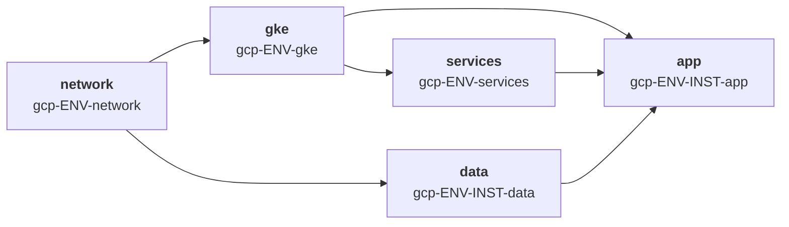

Cuatro stacks, cuatro applies, en este orden. Los stacks del mismo nivel se ejecutan en paralelo.

| # | Stack | Capability | Produce | Consume |
|---|---|---|---|---|
| 1 | `gcp-ENV-network` | network | VPC, subred, rangos secundarios, Cloud NAT, acceso privado a servicios | — |
| 2 | `gcp-ENV-gke` | cluster | Cluster, node pools, pool de Workload Identity | network |
| 3 | `gcp-ENV-services` | platform-services | Controlador de ingress, external-dns, cert-manager, namespaces | gke |
| 4a | `gcp-ENV-INST-data` | data | Cloud SQL, entradas de Secret Manager | network |
| 4b | `gcp-ENV-INST-app` | app | Workload, service account, bindings de IAM | gke, services, data |

### 5.2 Stack 1 — network (solo productor)

GKE en modo VPC-native requiere que existan **rangos IP secundarios para pods y servicios** en la subred antes de crear el cluster. Esos *nombres* de rango son el contrato.

```hcl
# imports/contracts/contract_network_gcp.tm.hcl
output "project_id"              { backend = "tofu"  value = var.project_id }
output "region"                  { backend = "tofu"  value = var.region }
output "network_self_link"       { backend = "tofu"  value = module.network.network_self_link }
output "network_name"            { backend = "tofu"  value = module.network.network_name }
output "subnet_self_link"        { backend = "tofu"  value = module.network.subnet_self_link }
output "gke_pods_range_name"     { backend = "tofu"  value = module.network.range_pods_name }
output "gke_services_range_name" { backend = "tofu"  value = module.network.range_services_name }
output "private_service_range"   { backend = "tofu"  value = module.network.psa_range_name }
```

```hcl
# stacks/platforms/gcp/demos/network/stack.tm.hcl
stack {
  id   = "gcp-demos-network"
  name = "GCP demos — network"
  tags = ["gcp", "demos", "network", "platform", "producer"]
}

globals { capability = "network" }

import { source = "/imports/mixins/backend_gcp.tm.hcl" }
import { source = "/imports/mixins/provider_gcp.tm.hcl" }
import { source = "/imports/generators/v1/gen_network.tm.hcl" }
import { source = "/imports/contracts/contract_network_gcp.tm.hcl" }
```

**Dimensionar los rangos es un asunto de globals, no de sharing.** Los rangos de pods deben dimensionarse para el número máximo de nodos multiplicado por pods-por-nodo; hacerlo mal requiere reconstruir el cluster. Calcúlalo de forma determinista:

```hcl
# stacks/platforms/gcp/demos/config.tm.hcl
globals {
  vpc_cidr           = "10.4.0.0/17"
  subnet_cidr        = tm_cidrsubnet(global.vpc_cidr, 3, 0)   # 10.4.0.0/20  — infra de zona
  pods_cidr          = tm_cidrsubnet(global.vpc_cidr, 1, 1)   # 10.4.64.0/18 — pods de zona
  services_cidr      = tm_cidrsubnet(global.vpc_cidr, 7, 32)  # 10.4.32.0/24 — borde de zona, como en el ledger de AM §9.6
}
```

### 5.3 Stack 2 — cluster GKE (consumidor y productor)

```hcl
# imports/contracts/contract_cluster_gke.tm.hcl

## ---- consume del stack de network ----
input "network_self_link" {
  backend       = "tofu"
  from_stack_id = global.platform.network_stack_id
  value         = outputs.network_self_link.value
  mock          = "projects/mock-project/global/networks/mock-vpc"
}
input "subnet_self_link" {
  backend       = "tofu"
  from_stack_id = global.platform.network_stack_id
  value         = outputs.subnet_self_link.value
  mock          = "projects/mock-project/regions/europe-west1/subnetworks/mock-subnet"
}
input "gke_pods_range_name" {
  backend       = "tofu"
  from_stack_id = global.platform.network_stack_id
  value         = outputs.gke_pods_range_name.value
  mock          = "mock-pods"
}
input "gke_services_range_name" {
  backend       = "tofu"
  from_stack_id = global.platform.network_stack_id
  value         = outputs.gke_services_range_name.value
  mock          = "mock-services"
}

## ---- produce para los stacks de services y app ----
output "cluster_name"     { backend = "tofu"  value = module.gke.name }
output "cluster_location" { backend = "tofu"  value = module.gke.location }
output "cluster_endpoint" { backend = "tofu"  value = module.gke.endpoint }
output "cluster_ca" {
  backend   = "tofu"
  value     = module.gke.ca_certificate
  sensitive = true
}
output "workload_identity_pool" {
  backend = "tofu"
  value   = "${var.project_id}.svc.id.goog"
}
output "node_service_account" { backend = "tofu"  value = module.gke.node_sa_email }
```

```hcl
# stacks/platforms/gcp/demos/gke/stack.tm.hcl
stack {
  id    = "gcp-demos-gke"
  name  = "GCP demos — GKE"
  tags  = ["gcp", "demos", "cluster", "gke", "platform", "producer", "consumer"]
  after = ["/stacks/platforms/gcp/demos/network"]   # OBLIGATORIO
}

globals {
  capability = "cluster"
}

globals "platform" {
  network_stack_id = "gcp-demos-network"
}
```

Nótese que los *propios stacks de plataforma* usan la misma convención de binding `global.platform.*` que las instancias de arquetipo. Esto mantiene un único modelo mental y permite construir un segundo cluster sobre la misma network copiando un directorio y cambiando un global.

### 5.4 Stack 3 — servicios de plataforma (consumidor y productor)

Aquí es donde aparecen por primera vez los providers de Kubernetes y Helm, y contiene la advertencia específica de GKE más importante.

```hcl
# imports/generators/v1/gen_platform_services.tm.hcl
generate_hcl "_providers.tf" {
  condition = global.capability == "platform-services" && global.cloud == "gcp"

  content {
    # Token de corta duración obtenido en el momento del plan/apply. NUNCA compartido como output.
    data "google_client_config" "default" {}

    provider "kubernetes" {
      host                   = "https://${var.cluster_endpoint}"
      cluster_ca_certificate = base64decode(var.cluster_ca)
      token                  = data.google_client_config.default.access_token
    }

    provider "helm" {
      kubernetes {
        host                   = "https://${var.cluster_endpoint}"
        cluster_ca_certificate = base64decode(var.cluster_ca)
        token                  = data.google_client_config.default.access_token
      }
    }
  }
}
```

> **Nunca compartas credenciales como outputs.** El endpoint y el certificado CA son hechos estables y pertenecen al contrato de sharing. El token portador es una credencial de 60 minutos y debe obtenerlo cada consumidor mediante `google_client_config` bajo su propia identidad. Compartir un token a través de `TF_VAR_*` lo filtraría al entorno del proceso y, tarde o temprano, a un log de CI.

Contrato del stack de services:

```hcl
# imports/contracts/contract_services_gcp.tm.hcl
input "cluster_endpoint" {
  backend       = "tofu"
  from_stack_id = global.platform.cluster_stack_id
  value         = outputs.cluster_endpoint.value
  mock          = "mock-endpoint.example.invalid"
}
input "cluster_ca" {
  backend       = "tofu"
  from_stack_id = global.platform.cluster_stack_id
  value         = outputs.cluster_ca.value
  sensitive     = true
  mock          = "bW9jaw=="              # base64("mock") — mock con el tipo correcto
}
input "workload_identity_pool" {
  backend       = "tofu"
  from_stack_id = global.platform.cluster_stack_id
  value         = outputs.workload_identity_pool.value
  mock          = "mock-project.svc.id.goog"
}

output "ingress_class"       { backend = "tofu"  value = "gce" }
output "dns_zone_name"       { backend = "tofu"  value = module.external_dns.zone_name }
output "cert_issuer_name"    { backend = "tofu"  value = module.cert_manager.cluster_issuer_name }
```

### 5.5 Stack 4 — instancia de arquetipo (consumidores)

El stack de aplicación es donde ocurre el binding de Workload Identity, y necesita hechos de tres productores a la vez.

```hcl
# imports/contracts/contract_app_gcp.tm.hcl
input "cluster_endpoint" {
  backend = "tofu"  from_stack_id = global.platform.cluster_stack_id
  value = outputs.cluster_endpoint.value  mock = "mock-endpoint.example.invalid"
}
input "cluster_ca" {
  backend = "tofu"  from_stack_id = global.platform.cluster_stack_id
  value = outputs.cluster_ca.value  sensitive = true  mock = "bW9jaw=="
}
input "workload_identity_pool" {
  backend = "tofu"  from_stack_id = global.platform.cluster_stack_id
  value = outputs.workload_identity_pool.value  mock = "mock-project.svc.id.goog"
}
input "ingress_class" {
  backend = "tofu"  from_stack_id = global.platform.services_stack_id
  value = outputs.ingress_class.value  mock = "mock-ingress"
}
input "db_connection_name" {
  backend = "tofu"  from_stack_id = global.platform.data_stack_id
  value = outputs.db_connection_name.value  mock = "mock:europe-west1:mock-db"
}
input "db_secret_id" {
  backend = "tofu"  from_stack_id = global.platform.data_stack_id
  value = outputs.db_secret_id.value  mock = "projects/mock/secrets/mock"
}
```

Binding de Workload Identity en el código generado:

```hcl
# imports/generators/v1/gen_app.tm.hcl (rama GCP, extracto)
generate_hcl "_workload_identity.tf" {
  condition = global.capability == "app" && global.platform.cloud == "gcp"

  content {
    resource "google_service_account" "app" {
      account_id = "${global.instance}-${global.app.name}"
      project    = global.project_id
    }

    resource "google_service_account_iam_member" "wi" {
      service_account_id = google_service_account.app.name
      role               = "roles/iam.workloadIdentityUser"
      member             = "serviceAccount:${var.workload_identity_pool}[${global.platform.namespace}/${global.app.name}]"
    }

    resource "kubernetes_service_account" "app" {
      metadata {
        name      = global.app.name
        namespace = global.platform.namespace
        annotations = {
          "iam.gke.io/gcp-service-account" = google_service_account.app.email
        }
      }
    }
  }
}
```

Nótese `global.platform.namespace` — esto es lo que permite que dos instancias de arquetipo coexistan en un cluster compartido. Cubierto completamente en §12.

### 5.6 Advertencias específicas de GKE

| Advertencia | Impacto | Mitigación |
|---|---|---|
| **Los rangos secundarios son inmutables** | Cambiar los CIDR de pods/servicios requiere recrear el cluster | Dimensiona generosamente en globals desde el primer día; calcula con `tm_cidrsubnet` para que sea revisable |
| **El provider de Kubernetes necesita un cluster vivo en el momento del plan** | `tofu plan` en el stack de services falla si el cluster todavía no se ha aplicado | Usa `--mock-on-fail` para las previews de PR; acepta que un primer despliegue de un entorno nuevo requiere un apply escalonado (network → cluster → services) |
| **`tofu output -json` en el stack de network requiere acceso de lectura al estado** | El job de CI que aplica el cluster debe leer el objeto de estado GCS del stack de network | Concede al job del cluster `roles/storage.objectViewer` sobre el prefijo de estado de network. Si network y cluster viven en proyectos distintos, esto es una concesión entre proyectos |
| **Endpoints de cluster privados** | Si el plano de control es privado, el runner de CI no puede alcanzar `cluster_endpoint` | O ejecuta la CI en un runner privado dentro de la VPC, o autoriza la IP de salida del runner en `master_authorized_networks` |
| **`cluster_ca` es base64** | Un mock de `"mock"` rompe `base64decode()` en el momento del plan | Usa un mock con una cadena base64 válida (`"bW9jaw=="`) |
| **Protección contra borrado** | `deletion_protection = true` bloquea `tofu destroy` | Fíjala desde `global.cluster.deletion_protection`; `false` para demos, `true` para prod, reforzado con un `assert` |

### 5.7 Línea base de IAM y seguridad de GKE

| Control | Requisito | Justificación |
|---|---|---|
| Service account del nodo | SA dedicada con `roles/logging.logWriter`, `roles/monitoring.metricWriter`, `roles/stackdriver.resourceMetadata.writer`, `roles/artifactregistry.reader` | La SA de compute por defecto tiene `roles/editor`; cada nodo llevaría escritura a nivel de proyecto |
| Workload Identity | Habilitado a nivel de cluster y en cada node pool | Sin ello, los pods caen en la SA del nodo y todos los tenants comparten una identidad |
| Ocultación de metadatos | Endpoints de metadatos legacy deshabilitados (`metadata.disable-legacy-endpoints = true`) | Los endpoints legacy dejan que un pod lea directamente el token de la SA del nodo, anulando Workload Identity |
| Plano de control | Cluster privado, `master_authorized_networks` restringido | |
| Nodos | Nodos GKE blindados (shielded), Container-Optimized OS, secure boot, monitorización de integridad | |
| Node pool | `enable_private_nodes = true`, sin IPs externas | |
| Secretos | Cifrado de secretos a nivel de aplicación con una clave de Cloud KMS | Cifrado de etcd en reposo con una clave que controlas |
| Procedencia de imagen | Binary Authorization requiriendo atestación | Bloquea imágenes no escaneadas o no confiables |
| RBAC | Cluster-admin ligado a un **Google Group**, nunca a usuarios individuales | La pertenencia a un grupo es auditable y revocable centralmente |
| Tenencia de namespace | Un namespace por instancia de arquetipo, `pod-security.kubernetes.io/enforce = restricted` | §12.3 |
| Permisos del deployer | `roles/container.admin` **más** `roles/iam.serviceAccountUser` sobre la SA del nodo | Crear un cluster que se ejecuta como una SA requiere `actAs` |
| Binding de Workload Identity | `serviceAccount:POOL[${global.platform.namespace}/${ksa}]` — nunca un comodín | Un comodín concede a cada pod del cluster los permisos de la GSA |

```hcl
assert {
  assertion = global.capability != "cluster" || global.cloud != "gcp" || global.gke.workload_identity_enabled
  message   = "Los clusters GKE deben habilitar Workload Identity"
}

assert {
  assertion = global.capability != "cluster" || global.cloud != "gcp" || global.gke.private_nodes
  message   = "Los node pools de GKE deben usar nodos privados"
}
```

Políticas de organización que respaldan esto (§11.7): `constraints/compute.requireShieldedVm`, `constraints/compute.vmExternalIpAccess`, `constraints/iam.disableServiceAccountKeyCreation`.

---

## 6. Guía B — Plataforma EKS y su cadena de dependencias

### 6.1 Grafo de dependencias

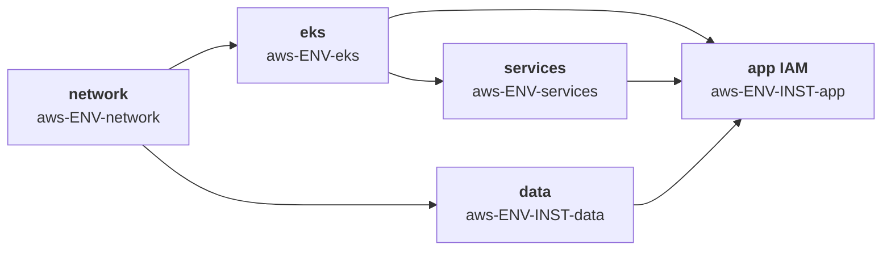

Estructuralmente idéntico a GKE. Las diferencias están enteramente en *qué hechos* cruzan las fronteras.

| # | Stack | Produce | Consume |
|---|---|---|---|
| 1 | `aws-ENV-network` | VPC, subredes, NAT, tablas de rutas, tags de subred | — |
| 2 | `aws-ENV-eks` | Cluster, node groups, **proveedor OIDC**, access entries | network |
| 3 | `aws-ENV-services` | AWS Load Balancer Controller, external-dns, karpenter | eks |
| 4a | `aws-ENV-INST-data` | RDS, ElastiCache, entradas de Secrets Manager | network |
| 4b | `aws-ENV-INST-app` | Workload, **rol IRSA**, recursos de namespace | eks, services, data |

### 6.2 Stack 1 — network, y la trampa de la dependencia circular

```hcl
# imports/contracts/contract_network_aws.tm.hcl
output "vpc_id"             { backend = "tofu"  value = module.vpc.vpc_id }
output "vpc_cidr"           { backend = "tofu"  value = module.vpc.vpc_cidr_block }
output "private_subnet_ids" { backend = "tofu"  value = module.vpc.private_subnets }
output "public_subnet_ids"  { backend = "tofu"  value = module.vpc.public_subnets }
output "intra_subnet_ids"   { backend = "tofu"  value = module.vpc.intra_subnets }
output "azs"                { backend = "tofu"  value = module.vpc.azs }
output "nat_gateway_ips"    { backend = "tofu"  value = module.vpc.nat_public_ips }
```

> **La trampa del etiquetado de subredes.** El AWS Load Balancer Controller requiere que las subredes lleven la etiqueta `kubernetes.io/cluster/<CLUSTER_NAME> = shared`, más `kubernetes.io/role/elb` y `kubernetes.io/role/internal-elb`. Esas etiquetas pertenecen a las subredes — propiedad del stack de **network** — pero referencian el nombre del **cluster**, producido por el stack **eks**. Cablear eso con outputs sharing crea un ciclo: network → eks → network.
>
> **Solución: derivar el nombre del cluster de forma determinista a partir de globals, no de un output.**

```hcl
# stacks/platforms/aws/config.tm.hcl
globals {
  cloud = "aws"
}

# stacks/platforms/aws/demos/config.tm.hcl
globals {
  env          = "demos"
  account_id   = "111122223333"
  region       = "eu-west-1"
  # Determinista: conocido en el momento de generar por AMBOS stacks. Rompe el ciclo.
  cluster_name = "disasterproject-demos-eks"
}
```

Tanto el generador de network (para las etiquetas) como el de cluster (para el recurso del cluster) leen `global.cluster_name`. No hace falta ninguna arista de tiempo de ejecución, y el ciclo desaparece. Este es el remedio general siempre que outputs sharing parece requerir un ciclo: **promociona el hecho compartido a un global**.

Añade una aserción para que los dos nunca puedan divergir:

```hcl
assert {
  assertion = tm_can(tm_regex("^[a-z0-9-]{1,38}$", global.cluster_name))
  message   = "cluster_name debe ser un nombre de cluster EKS válido"
}
```

### 6.3 Stack 2 — cluster EKS

```hcl
# imports/contracts/contract_cluster_eks.tm.hcl

## ---- consume ----
input "vpc_id" {
  backend = "tofu"  from_stack_id = global.platform.network_stack_id
  value = outputs.vpc_id.value  mock = "vpc-mock00000000000"
}
input "private_subnet_ids" {
  backend = "tofu"  from_stack_id = global.platform.network_stack_id
  value = outputs.private_subnet_ids.value
  mock  = ["subnet-mock0000000000a", "subnet-mock0000000000b", "subnet-mock0000000000c"]
}
input "intra_subnet_ids" {
  backend = "tofu"  from_stack_id = global.platform.network_stack_id
  value = outputs.intra_subnet_ids.value
  mock  = ["subnet-mock0000000000d", "subnet-mock0000000000e"]
}

## ---- produce ----
output "cluster_name"     { backend = "tofu"  value = module.eks.cluster_name }
output "cluster_endpoint" { backend = "tofu"  value = module.eks.cluster_endpoint }
output "cluster_ca" {
  backend = "tofu"  value = module.eks.cluster_certificate_authority_data  sensitive = true
}
output "cluster_version"            { backend = "tofu"  value = module.eks.cluster_version }
output "cluster_security_group_id"  { backend = "tofu"  value = module.eks.cluster_security_group_id }
output "node_security_group_id"     { backend = "tofu"  value = module.eks.node_security_group_id }
# Los dos hechos de los que depende cada rol IRSA en cada instancia de arquetipo:
output "oidc_provider_arn" { backend = "tofu"  value = module.eks.oidc_provider_arn }
output "oidc_provider_url" { backend = "tofu"  value = module.eks.oidc_provider }
```

Nótese que el mock de `private_subnet_ids` es una **lista**, coincidiendo con el tipo real. Un mock de cadena aquí produce un plan que tipa correctamente en local y explota al aplicar.

```hcl
# stacks/platforms/aws/demos/eks/stack.tm.hcl
stack {
  id    = "aws-demos-eks"
  name  = "AWS demos — EKS"
  tags  = ["aws", "demos", "cluster", "eks", "platform", "producer", "consumer"]
  after = ["/stacks/platforms/aws/demos/network"]
}

globals { capability = "cluster" }
globals "platform" { network_stack_id = "aws-demos-network" }
```

### 6.4 Stack 3 — servicios de plataforma

Mismo patrón de provider que GKE, con obtención de token específica de AWS:

```hcl
generate_hcl "_providers.tf" {
  condition = global.capability == "platform-services" && global.cloud == "aws"

  content {
    data "aws_eks_cluster_auth" "this" {
      name = var.cluster_name
    }

    provider "kubernetes" {
      host                   = var.cluster_endpoint
      cluster_ca_certificate = base64decode(var.cluster_ca)
      token                  = data.aws_eks_cluster_auth.this.token
    }

    provider "helm" {
      kubernetes {
        host                   = var.cluster_endpoint
        cluster_ca_certificate = base64decode(var.cluster_ca)
        token                  = data.aws_eks_cluster_auth.this.token
      }
    }
  }
}
```

De nuevo: el endpoint y el CA viajan por sharing; el token lo obtiene localmente cada consumidor.

El propio AWS Load Balancer Controller necesita IRSA, así que el stack de services también es consumidor de los outputs OIDC:

```hcl
input "oidc_provider_arn" {
  backend = "tofu"  from_stack_id = global.platform.cluster_stack_id
  value = outputs.oidc_provider_arn.value
  mock  = "arn:aws:iam::000000000000:oidc-provider/oidc.eks.eu-west-1.amazonaws.com/id/MOCK"
}
input "oidc_provider_url" {
  backend = "tofu"  from_stack_id = global.platform.cluster_stack_id
  value = outputs.oidc_provider_url.value
  mock  = "oidc.eks.eu-west-1.amazonaws.com/id/MOCK"
}

output "alb_controller_ready" { backend = "tofu"  value = helm_release.alb_controller.status }
output "ingress_class"        { backend = "tofu"  value = "alb" }
output "external_dns_zone_id" { backend = "tofu"  value = var.hosted_zone_id }
```

### 6.5 Stack 4 — instancia de arquetipo e IRSA

IRSA es el caso de uso canónico de outputs sharing en AWS: una trust policy que literalmente no puede escribirse sin un valor producido por el apply de otro stack.

```hcl
# imports/generators/v1/gen_app.tm.hcl (rama AWS, extracto)
generate_hcl "_irsa.tf" {
  condition = global.capability == "app" && global.platform.cloud == "aws"

  content {
    data "aws_iam_policy_document" "assume" {
      statement {
        effect  = "Allow"
        actions = ["sts:AssumeRoleWithWebIdentity"]

        principals {
          type        = "Federated"
          identifiers = [var.oidc_provider_arn]
        }

        condition {
          test     = "StringEquals"
          variable = "${var.oidc_provider_url}:sub"
          values   = ["system:serviceaccount:${global.platform.namespace}:${global.app.name}"]
        }

        condition {
          test     = "StringEquals"
          variable = "${var.oidc_provider_url}:aud"
          values   = ["sts.amazonaws.com"]
        }
      }
    }

    resource "aws_iam_role" "app" {
      name               = "${global.instance}-${global.app.name}-irsa"
      assume_role_policy = data.aws_iam_policy_document.assume.json
      tags               = global.tags
    }

    resource "kubernetes_service_account" "app" {
      metadata {
        name      = global.app.name
        namespace = global.platform.namespace
        annotations = {
          "eks.amazonaws.com/role-arn" = aws_iam_role.app.arn
        }
      }
    }
  }
}
```

La condición `sub` embebe `global.platform.namespace`. En un cluster compartido, esto es precisamente lo que evita que el rol IRSA de `demo-alpha` pueda ser asumido por los pods de `demo-beta`.

### 6.6 Advertencias específicas de EKS

| Advertencia | Impacto | Mitigación |
|---|---|---|
| **Ciclo del etiquetado de subredes** | Dependencia circular network ↔ eks | `global.cluster_name` determinista (§6.2) |
| **El proveedor OIDC es por cluster** | Cada instancia de arquetipo en un cluster compartido consume los *mismos* dos outputs | Está bien — pero significa que reconstruir el cluster invalida cada rol IRSA en cada instancia. Trata el reemplazo del cluster como un evento a nivel de flota |
| **`aws-auth` / access entries** | Escrituras concurrentes de múltiples stacks corrompen el ConfigMap | Posee el acceso al cluster **solo** en el stack eks. Usa EKS Access Entries (modo API) en lugar del ConfigMap `aws-auth`; las instancias de arquetipo nunca deben escribir en él |
| **Lecturas de estado entre cuentas** | El job de eks ejecuta `tofu output -json` en el directorio del stack de network | El rol de CI para el job del cluster necesita `s3:GetObject` sobre la clave de estado de network y `kms:Decrypt` sobre su clave KMS. Añade estos explícitamente a la trust policy del rol OIDC |
| **`cluster_endpoint` incluye el esquema** | A diferencia de GKE, EKS ya devuelve `https://...` | **No** prefijes `https://` de nuevo en el bloque provider. Esta asimetría entre las dos clouds es un bug de copiar-pegar común |
| **Endpoint API privado** | El runner de CI no puede alcanzar el plano de control | Runner privado de GitHub en la VPC, o `public_access_cidrs` permitiendo la salida del runner |
| **Ordenamiento de `private_subnet_ids`** | El orden de la lista desde el módulo VPC está ordenado por AZ pero no se garantiza estable entre actualizaciones del módulo | Ordena explícitamente en la expresión del output si algún consumidor indexa la lista |

### 6.7 Línea base de IAM y seguridad de EKS

| Control | Requisito | Justificación |
|---|---|---|
| Rol de cluster y rol de nodo | Roles separados, nunca fusionados | Principales de confianza y ciclos de vida distintos |
| Políticas del rol de nodo | `AmazonEKSWorkerNodePolicy`, `AmazonEC2ContainerRegistryReadOnly` | Mantén `AmazonEKS_CNI_Policy` **fuera** del rol de nodo — adjúntala vía IRSA a la service account `aws-node` en su lugar, para que los pods no puedan asumir permisos CNI a través del instance profile |
| IMDS | Hop limit 1, IMDSv2 requerido | Evita que un pod comprometido alcance el instance profile del nodo |
| Acceso al cluster | **EKS Access Entries** (modo de autenticación API), no el ConfigMap `aws-auth` | El ConfigMap no tiene rastro de auditoría IAM y se corrompe con escrituras concurrentes |
| Propiedad de access entries | Solo el stack `eks` escribe access entries | Las instancias de arquetipo nunca deben tocar el acceso al cluster |
| Condición de confianza IRSA | `StringEquals` tanto en `:sub` como `:aud`; `sub` fijado a `system:serviceaccount:NAMESPACE:SA` | `StringLike` con `*` concede el rol a cada pod del cluster |
| Límite de permisos | Adjuntado a cada rol IRSA creado por una instancia de arquetipo | Evita que un tenant escale privilegios a través de su propio stack |
| Cifrado de secretos | Cifrado envelope con una clave KMS gestionada por el cliente | Cifrado de etcd en reposo bajo una clave que controlas |
| Plano de control | Endpoint privado, o `public_access_cidrs` limitado a rangos de CI y admin | |
| Registro del plano de control | `api`, `audit`, `authenticator`, `controllerManager`, `scheduler` habilitados | El log de auditoría es el único registro de las decisiones de RBAC |
| Node groups | Bottlerocket o AL2023, launch template con EBS cifrado | |
| Tenencia de namespace | Un namespace por instancia, Pod Security Standard `restricted`, NetworkPolicy default-deny | §12.3 |

```hcl
data "aws_iam_policy_document" "assume" {
  statement {
    # ...
    condition {
      test     = "StringEquals"                      # NO StringLike
      variable = "${var.oidc_provider_url}:sub"
      values   = ["system:serviceaccount:${global.platform.namespace}:${global.app.name}"]
    }
    condition {
      test     = "StringEquals"
      variable = "${var.oidc_provider_url}:aud"
      values   = ["sts.amazonaws.com"]
    }
  }
}

resource "aws_iam_role" "app" {
  name                 = "${global.instance}-${global.app.name}-irsa"
  assume_role_policy   = data.aws_iam_policy_document.assume.json
  permissions_boundary = var.task_role_boundary_arn   # publicado por el stack de plataforma
}
```

```hcl
assert {
  assertion = global.capability != "app" || global.platform.cloud != "aws" || tm_can(global.iam.permission_boundary)
  message   = "Los roles IRSA deben adjuntar el límite de permisos de la plataforma"
}
```

**EKS Pod Identity** es la alternativa más reciente a IRSA y elimina por completo la complejidad de la trust policy OIDC — la asociación se hace a través de la API de EKS en lugar de un documento de confianza IAM. Si la adoptas, el stack de cluster produce un flag `pod_identity_agent_ready` en lugar de los dos hechos OIDC, y el stack de app crea una asociación en lugar de una trust policy federada. La propiedad de alcance por namespace es idéntica.

SCPs de respaldo (§11.7): denegar `iam:CreateUser`, denegar `iam:DeleteRolePermissionsBoundary`, confinar regiones.

### 6.8 Comparación de contratos entre runtimes

| Concepto | Output GKE | Output EKS | Notas |
|---|---|---|---|
| Identidad de cluster | `cluster_name`, `cluster_location` | `cluster_name`, `cluster_version` | |
| Endpoint API | `cluster_endpoint` (sin esquema) | `cluster_endpoint` (**con** `https://`) | Asimetría — normalizar en el generador |
| Certificado CA | `cluster_ca` (base64) | `cluster_ca` (base64) | Misma forma |
| Token de autenticación | *no se comparte* — `google_client_config` | *no se comparte* — `aws_eks_cluster_auth` | Nunca compartir |
| Identidad de workload | `workload_identity_pool` | `oidc_provider_arn` + `oidc_provider_url` | AWS necesita dos hechos, GCP uno |
| Handle de network | `network_self_link`, `subnet_self_link` | `vpc_id`, `private_subnet_ids` (lista) | Los self-links de GCP son cadenas, las subredes de AWS son listas |
| Networking de pods | `gke_pods_range_name`, `gke_services_range_name` | — (VPC CNI usa los CIDR de subred) | GCP requiere rangos secundarios con nombre |
| Clase de ingress | `"gce"` | `"alb"` | Ambos desde el stack de services |

Mantener los *nombres* alineados donde el *significado* está alineado (`cluster_name`, `cluster_endpoint`, `cluster_ca`, `ingress_class`) es lo que permite que un único generador `gen_app.tm.hcl` sirva a ambas clouds con una sola rama `condition` para las partes específicas de cloud.

---

## 7. Guía C — Plataforma Cloud Run y su cadena de dependencias

Cloud Run elimina el cluster de la topología, lo que cambia la forma de la capa de plataforma pero no el patrón. El límite de aislamiento se mueve de *namespace de Kubernetes* a *servicio más su service account de runtime*, y eso resulta hacer que los entornos compartidos sean considerablemente más baratos — Cloud Run escala a cero, así que una instancia demo inactiva cuesta casi nada.

### 7.1 Grafo de dependencias

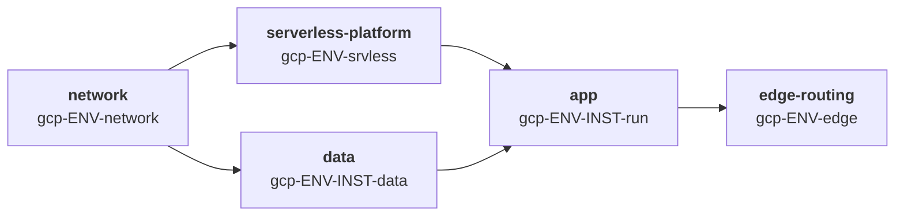

| # | Stack | Produce | Consume |
|---|---|---|---|
| 1 | `gcp-ENV-network` | VPC, subred, subred de Direct VPC egress o conector Serverless VPC, Cloud NAT, rango PSA | — |
| 2 | `gcp-ENV-srvless` | Artifact Registry, IP estática, mapa de Certificate Manager, política Cloud Armor, log sink | network |
| 3a | `gcp-ENV-INST-data` | Cloud SQL (IP privada), secretos de Secret Manager | network |
| 3b | `gcp-ENV-INST-run` | Servicio Cloud Run, SA de runtime, NEG serverless, backend service | srvless, data |
| 4 | `gcp-ENV-edge` | URL map, HTTPS proxy, forwarding rule | *ver §7.5 — fan-in* |

Nótese la inversión de orden en el paso 4: el stack de edge-routing se ejecuta **después** de cada instancia, porque agrega sus backends. Ese fan-in es la única forma que outputs sharing maneja mal, y §7.5 cubre el remedio.

### 7.2 Stack 1 — network

Cloud Run alcanza recursos privados de una de dos formas. Elige una vez, en globals, y genera en consecuencia.

| Mecanismo | Cuándo | Qué debe producir el stack de network |
|---|---|---|
| **Direct VPC egress** | Preferido para builds nuevos — sin conector que dimensionar ni pagar | `direct_egress_subnet_id` (una subred reservada para Cloud Run) |
| **Conector Serverless VPC Access** | Legacy, o cuando necesitas un CIDR de conector fijo para reglas de firewall | `vpc_connector_id` |

```hcl
# imports/contracts/contract_network_gcp_serverless.tm.hcl
output "network_self_link"        { backend = "tofu"  value = module.network.network_self_link }
output "direct_egress_subnet_id"  { backend = "tofu"  value = module.network.serverless_subnet_id }
output "vpc_connector_id"         { backend = "tofu"  value = try(module.network.connector_id, "") }
output "psa_range_name"           { backend = "tofu"  value = module.network.psa_range_name }
output "project_id"               { backend = "tofu"  value = var.project_id }
```

```hcl
# stacks/platforms/gcp/demos/config.tm.hcl (adiciones serverless)
globals "serverless" {
  egress_mode          = "direct"                # "direct" | "connector"
  egress_setting       = "PRIVATE_RANGES_ONLY"   # evita ALL_TRAFFIC a menos que el egress deba inspeccionarse
  serverless_subnet    = "10.4.40.0/24"          # borde de zona; /24 mínimo para Direct VPC egress
  ingress              = "INTERNAL_AND_CLOUD_LOAD_BALANCING"
}
```

> **Línea base de seguridad.** `ingress = "ALL"` en un servicio Cloud Run evita tu load balancer, y con él Cloud Armor, tus reglas WAF y tu logging. Fija `INTERNAL_AND_CLOUD_LOAD_BALANCING` en globals y refuérzalo con una aserción — esta es la configuración de Cloud Run mal configurada con más frecuencia.

```hcl
assert {
  assertion = global.serverless.ingress != "ALL"
  message   = "Cloud Run ingress=ALL evita el load balancer y Cloud Armor"
}
```

### 7.3 Stack 2 — plataforma serverless

```hcl
# imports/contracts/contract_serverless_platform.tm.hcl
input "network_self_link" {
  backend = "tofu"  from_stack_id = global.platform.network_stack_id
  value = outputs.network_self_link.value
  mock  = "projects/mock-project/global/networks/mock-vpc"
}

output "artifact_registry_repo" { backend = "tofu"  value = module.registry.repository_url }
output "artifact_registry_id"   { backend = "tofu"  value = module.registry.id }
output "static_ip_address"      { backend = "tofu"  value = module.edge.global_ip_address }
output "static_ip_name"         { backend = "tofu"  value = module.edge.global_ip_name }
output "cert_map_id"            { backend = "tofu"  value = module.edge.certificate_map_id }
output "cloud_armor_policy_id"  { backend = "tofu"  value = module.edge.security_policy_id }
output "dns_zone_name"          { backend = "tofu"  value = module.dns.zone_name }
output "run_service_agent"      { backend = "tofu"  value = "service-${var.project_number}@serverless-robot-prod.iam.gserviceaccount.com" }
```

`run_service_agent` importa: el **agente de servicio de Cloud Run**, no la service account de runtime, es quien extrae imágenes de Artifact Registry. Conceder `roles/artifactregistry.reader` al principal equivocado es un fallo clásico del primer despliegue.

### 7.4 Stack 3b — el servicio Cloud Run, y su IAM

Aquí es donde vive casi toda la postura de seguridad de Cloud Run.

```hcl
# imports/contracts/contract_app_cloudrun.tm.hcl
input "artifact_registry_repo" {
  backend = "tofu"  from_stack_id = global.platform.services_stack_id
  value = outputs.artifact_registry_repo.value
  mock  = "europe-west1-docker.pkg.dev/mock-project/mock-repo"
}
input "direct_egress_subnet_id" {
  backend = "tofu"  from_stack_id = global.platform.network_stack_id
  value = outputs.direct_egress_subnet_id.value
  mock  = "projects/mock-project/regions/europe-west1/subnetworks/mock-serverless"
}
input "cloud_armor_policy_id" {
  backend = "tofu"  from_stack_id = global.platform.services_stack_id
  value = outputs.cloud_armor_policy_id.value
  mock  = "projects/mock-project/global/securityPolicies/mock-policy"
}
input "db_connection_name" {
  backend = "tofu"  from_stack_id = global.platform.data_stack_id
  value = outputs.db_connection_name.value
  mock  = "mock-project:europe-west1:mock-db"
}
input "db_secret_id" {
  backend = "tofu"  from_stack_id = global.platform.data_stack_id
  value = outputs.db_secret_id.value
  mock  = "projects/mock-project/secrets/mock-secret"
}

# producido para el stack de edge-routing y para la CMDB
output "service_name"          { backend = "tofu"  value = google_cloud_run_v2_service.this.name }
output "service_uri"           { backend = "tofu"  value = google_cloud_run_v2_service.this.uri }
output "runtime_sa_email"      { backend = "tofu"  value = google_service_account.runtime.email }
output "backend_service_id"    { backend = "tofu"  value = google_compute_backend_service.this.id }
output "neg_id"                { backend = "tofu"  value = google_compute_region_network_endpoint_group.this.id }
```

```hcl
# imports/generators/v1/gen_app_cloudrun.tm.hcl (extracto)
generate_hcl "_service.tf" {
  condition = global.capability == "app" && global.platform.runtime == "cloudrun"

  content {
    # --- Identidad de runtime dedicada. NUNCA la service account de compute por defecto. ---
    resource "google_service_account" "runtime" {
      account_id   = "run-${global.instance}-${global.app.name}"
      display_name = "Cloud Run runtime — ${global.instance}/${global.app.name}"
      project      = global.project_id
    }

    # --- Concesiones de mínimo privilegio, ligadas al recurso exacto, nunca a nivel de proyecto ---
    resource "google_secret_manager_secret_iam_member" "db" {
      secret_id = var.db_secret_id
      role      = "roles/secretmanager.secretAccessor"
      member    = "serviceAccount:${google_service_account.runtime.email}"
    }

    resource "google_project_iam_member" "sql_client" {
      project = global.project_id
      role    = "roles/cloudsql.client"
      member  = "serviceAccount:${google_service_account.runtime.email}"
      # cloudsql.client no tiene binding a nivel de recurso; restringe con una condition en su lugar.
      # IAM evalúa projects/<p>/instances/<i>, NO el nombre de conexión <p>:<región>:<i> —
      # comparar con el nombre de conexión nunca coincide y el grant no hace nada, en silencio.
      condition {
        title      = "only-this-instance"
        expression = "resource.type == \"sqladmin.googleapis.com/Instance\" && resource.name == \"projects/${global.project_id}/instances/${element(split(":", var.db_connection_name), 2)}\""
      }
    }

    resource "google_cloud_run_v2_service" "this" {
      name     = "${global.instance}-${global.app.name}"
      location = global.region
      project  = global.project_id
      ingress  = global.serverless.ingress

      template {
        service_account = google_service_account.runtime.email

        # Direct VPC egress — sin recurso de conector que gestionar
        vpc_access {
          network_interfaces {
            subnetwork = var.direct_egress_subnet_id
          }
          egress = global.serverless.egress_setting
        }

        scaling {
          min_instance_count = global.app.min_instances
          max_instance_count = global.app.max_instances
        }

        containers {
          image = "${var.artifact_registry_repo}/${global.app.name}:${global.app.image_tag}"

          # Los secretos llegan por referencia, resueltos por Cloud Run al arrancar.
          # NO son variables de entorno en texto plano en la spec del servicio.
          env {
            name = "DB_PASSWORD"
            value_source {
              secret_key_ref {
                secret  = var.db_secret_id
                version = "latest"
              }
            }
          }

          resources {
            limits = {
              cpu    = global.app.cpu
              memory = global.app.memory
            }
          }
        }
      }

      # Tráfico fijado a la última revisión sana
      traffic {
        type    = "TRAFFIC_TARGET_ALLOCATION_TYPE_LATEST"
        percent = 100
      }
    }

    # --- Invoker: solo el agente de servicio del LB, nunca allUsers cuando está detrás de un LB ---
    resource "google_cloud_run_v2_service_iam_member" "invoker" {
      name     = google_cloud_run_v2_service.this.name
      location = google_cloud_run_v2_service.this.location
      project  = global.project_id
      role     = "roles/run.invoker"
      member   = global.app.public ? "allUsers" : "serviceAccount:${global.app.invoker_sa}"
    }
  }
}
```

**Checklist de IAM de Cloud Run**

| Control | Requisito | Por qué |
|---|---|---|
| Service account de runtime | Dedicada por servicio; nunca la SA de compute por defecto | La SA de compute por defecto tiene `roles/editor` a nivel de proyecto |
| Permisos del deployer | `roles/run.admin` **más** `roles/iam.serviceAccountUser` sobre la SA de runtime | Desplegar un servicio que se ejecuta *como* una SA requiere `actAs`; que falte esto es el fallo de pipeline más común |
| Acceso a secretos | `roles/secretmanager.secretAccessor` sobre el **secreto específico** | Las concesiones a nivel de proyecto exponen los secretos de todos los tenants en una plataforma compartida |
| Cloud SQL | `roles/cloudsql.client` con una condition de IAM que restrinja a la instancia | El rol no tiene binding a nivel de recurso; las conditions son el único mecanismo de restricción |
| Extracción de imagen | `roles/artifactregistry.reader` al **agente de servicio de Cloud Run** | La SA de runtime no extrae imágenes |
| Invoker | Nunca `allUsers` en un servicio detrás de un LB | `allUsers` más `ingress=ALL` hace el servicio directamente alcanzable, evadiendo Cloud Armor |
| Procedencia de imagen | Política de Binary Authorization requiriendo atestación | Evita desplegar imágenes no escaneadas |
| Egress | `PRIVATE_RANGES_ONLY` a menos que se requiera inspección de egress | `ALL_TRAFFIC` enruta el tráfico hacia internet a través de la VPC y tu NAT, cambiando tu superficie de ataque de egress y el coste |

Restricciones de política de organización que merece la pena reforzar por encima del pipeline (§11.7): `constraints/iam.disableServiceAccountKeyCreation`, `constraints/run.allowedIngress`, `constraints/sql.restrictPublicIp`.

### 7.5 Stack 4 — enrutamiento de borde, y el límite de fan-in

El URL map debe referenciar el backend service de cada instancia. Expresado como outputs sharing, eso necesitaría un bloque `input` por tenant — pero la lista de tenants es dinámica, y los bloques `input` son declaraciones estáticas. **Aquí es donde outputs sharing deja de ser la herramienta adecuada.**

Dos remedios viables:

**Remedio A — nombres deterministas más data sources (recomendado).**

```hcl
# imports/generators/v1/gen_edge_routing.tm.hcl
generate_hcl "_url_map.tf" {
  condition = global.capability == "edge-routing"

  content {
    tm_dynamic "data" {
      for_each   = global.tenants
      labels     = ["google_compute_backend_service", tm_element(each.value, 0)]
      attributes = {
        name    = "bes-${each.value.instance}-${each.value.app}"
        project = global.project_id
      }
    }

    resource "google_compute_url_map" "this" {
      name            = "${global.env}-urlmap"
      default_service = data.google_compute_backend_service.default.id

      tm_dynamic "host_rule" {
        for_each = global.tenants
        content {
          hosts        = ["${host_rule.value.instance}.${global.dns_suffix}"]
          path_matcher = host_rule.value.instance
        }
      }
    }
  }
}
```

El stack de instancia nombra su backend service de forma determinista (`bes-<instance>-<app>`), el stack de edge lo busca. `global.tenants` es una lista de tiempo de compilación mantenida en el `config.tm.hcl` de la plataforma — añadir un tenant es un cambio revisable de una línea, y `terramate generate` muestra el diff.

**Remedio B — load balancer por instancia.** Cada instancia posee una forwarding rule completa que solo comparte la IP estática y el mapa de certificados. Más recursos y más coste, pero cero acoplamiento: destruir una instancia no puede romper el enrutamiento de otra. Preferible para entornos dedicados regulados; derrochador para una plataforma demo compartida.

> **La regla general.** Outputs sharing modela **1-a-N** (un productor, muchos consumidores) limpiamente. No modela el fan-in **N-a-1**, porque los bloques `input` no pueden generarse a partir de una lista dinámica. Cuando te topas con fan-in, recurre a nombres deterministas más data sources — el mismo remedio que el ciclo de etiquetado de subredes de EKS en §6.2.
>
> **En la arquitectura objetivo este problema no surge.** Gateway API invierte la dependencia de enrutamiento: un `HTTPRoute` vive en el namespace de la aplicación y se adjunta al Gateway, así que el borde nunca necesita conocer a sus tenants (§10.6). Los remedios A y B anteriores son para un borde basado en URL map, que es el fallback, no el plan.

### 7.6 Compartido y dedicado para Cloud Run

| Dimensión | Plataforma demo compartida | Producción dedicada |
|---|---|---|
| Límite de aislamiento | Servicio + service account de runtime | Proyecto |
| Aislamiento de cómputo | Sandbox por servicio (gVisor) — fuerte por defecto | Igual, más el límite de proyecto |
| Aislamiento de datos | *Database* de Cloud SQL separada en una instancia compartida, secretos separados | Instancia de Cloud SQL separada |
| Network | VPC compartida, subred de egress compartida | VPC dedicada |
| Coste en reposo | Casi cero — escala a cero | Cloud SQL y NAT siguen facturando |
| Control de cuotas | `max_instance_count` por servicio | Igual, más cuotas de proyecto |
| Radio de impacto de un cambio de plataforma | Todos los tenants | Un tenant |

El modelo general, las barandillas de ciclo de vida y la seguridad del destroy están en §12; esta tabla solo registra lo específico de Cloud Run.

Como Cloud Run aísla las cargas de trabajo en un sandbox por servicio en lugar de en nodos de kernel compartido, una plataforma Cloud Run compartida es **materialmente más segura que un node pool GKE compartido** para cargas de trabajo demo no confiables o semi-confiables. Las superficies compartidas restantes son la VPC, la instancia de base de datos y el load balancer — todo lo que cubre la tabla anterior.

Barandillas por tenant en una plataforma compartida:

```hcl
assert {
  assertion = global.platform.model != "shared" || global.app.max_instances <= 10
  message   = "Los tenants de Cloud Run compartido deben limitar max_instances para proteger el egress y las conexiones de BD compartidas"
}

assert {
  assertion = global.platform.model != "shared" || !global.app.public || global.app.cloud_armor_required
  message   = "Los servicios públicos en una plataforma compartida deben estar detrás de Cloud Armor"
}
```

Los límites de conexión de Cloud SQL son el fallo habitual de las plataformas compartidas: diez tenants escalando cada uno hasta 10 instancias con un pool de 5 agotarán una instancia pequeña. Limita `max_instances` y dimensiona la base de datos a partir de la suma, no de la media.

### 7.7 Advertencias de Cloud Run

| Advertencia | Impacto | Mitigación |
|---|---|---|
| `ingress = ALL` evade el LB | Cloud Armor, WAF y logs de acceso todos evadidos | Valor por defecto en globals + aserción + política de organización `constraints/run.allowedIngress` |
| SA de compute por defecto | El servicio se ejecuta con Editor de proyecto | SA de runtime dedicada, reforzada con una política personalizada de Checkov |
| Falta `iam.serviceAccountUser` | El deploy falla con un error confuso de `actAs` | Concédelo sobre la SA de runtime en el mismo stack que la crea |
| Dimensionamiento de la subred de Direct VPC egress | `/24` mínimo; el agotamiento estrangula el escalado | Dimensiona en globals con `tm_cidrsubnet`, revisa a nivel de plataforma |
| Fan-in en el URL map | Ciclo o lista de inputs inmanejable | Nombres deterministas + data sources (§7.5) |
| Proliferación de revisiones | Las revisiones antiguas retienen configuración de tráfico y confunden los rollbacks | Fija `traffic` a la última; poda revisiones según un calendario |
| Agotamiento de conexiones de Cloud SQL en plataformas compartidas | Un pico de tráfico del tenant A tumba al tenant B | Limita `max_instances`; usa el conector de Cloud SQL con pooling |

---

## 8. Guía D — Plataforma ECS Fargate y su cadena de dependencias

ECS sobre Fargate es la contrapartida AWS de Cloud Run en esta arquitectura: sin nodos que gestionar, aislamiento de kernel por tarea, y un límite de aislamiento que se sitúa en el *rol de tarea* en lugar de en un namespace. El modelo de IAM es la parte más distintiva — ECS separa los permisos de tiempo de ejecución y de tiempo de arranque en **dos roles separados**, y equivocarse en esa separación es el defecto de seguridad más común en los despliegues ECS.

> Esta guía cubre **ECS sobre Fargate**. Los perfiles de EKS Fargate son un producto distinto — ver §8.8 sobre cómo encajan en la guía EKS en su lugar.

### 8.1 Grafo de dependencias

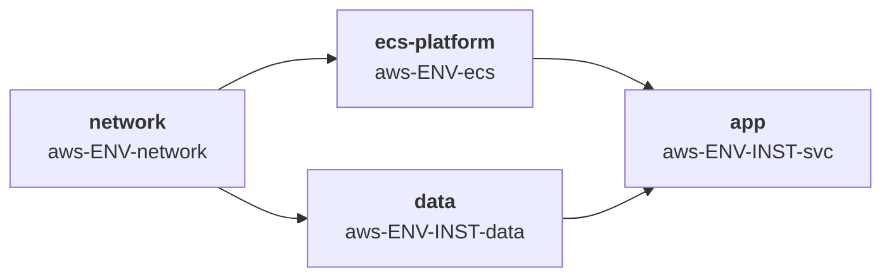

| # | Stack | Produce | Consume |
|---|---|---|---|
| 1 | `aws-ENV-network` | VPC, subredes privadas/públicas, NAT, **endpoints de VPC**, SG del endpoint | — |
| 2 | `aws-ENV-ecs` | Cluster ECS, ALB, WAF, repos ECR, namespace de Cloud Map, log groups, SG del ALB | network |
| 3a | `aws-ENV-INST-data` | RDS, secreto de Secrets Manager, security group de BD | network |
| 3b | `aws-ENV-INST-svc` | Definición de tarea, **rol de tarea**, **rol de ejecución**, servicio, target group, listener rule, SG del servicio | ecs, data |

A diferencia de Cloud Run, no hay stack de fan-in: las listener rules del ALB son recursos separados que posee cada instancia, adjuntados al listener compartido por ARN. Añadir o eliminar un tenant solo toca el stack de ese tenant.

### 8.2 Stack 1 — network, con endpoints de VPC

Las tareas Fargate en subredes privadas deben alcanzar ECR, CloudWatch Logs y Secrets Manager. Enrutar eso a través de un NAT gateway funciona pero cuesta dinero y envía tráfico de plano de control por internet. **Los endpoints de VPC son la línea base de mejores prácticas** y son un asunto del stack de network.

```hcl
# imports/contracts/contract_network_aws_fargate.tm.hcl
output "vpc_id"              { backend = "tofu"  value = module.vpc.vpc_id }
output "vpc_cidr"            { backend = "tofu"  value = module.vpc.vpc_cidr_block }
output "private_subnet_ids"  { backend = "tofu"  value = module.vpc.private_subnets }
output "public_subnet_ids"   { backend = "tofu"  value = module.vpc.public_subnets }
output "endpoint_sg_id"      { backend = "tofu"  value = module.vpc.vpc_endpoint_security_group_id }
output "azs"                 { backend = "tofu"  value = module.vpc.azs }
```

Endpoints requeridos, generados a partir de globals:

| Endpoint | Tipo | Por qué |
|---|---|---|
| `ecr.api`, `ecr.dkr` | Interface | Extracción de imagen sin NAT |
| `s3` | Gateway | Las capas de ECR se almacenan en S3 |
| `logs` | Interface | Driver `awslogs` |
| `secretsmanager` / `ssm` | Interface | Inyección de secretos al arrancar la tarea |
| `sts` | Interface | Emisión de credenciales del rol de tarea |
| `ssmmessages` | Interface | Solo si ECS Exec está habilitado |

```hcl
assert {
  assertion = global.env == "demos" || tm_contains(global.network.vpc_endpoints, "secretsmanager")
  message   = "Los entornos no-demo deben alcanzar Secrets Manager por un endpoint de VPC, no por NAT"
}
```

### 8.3 Stack 2 — plataforma ECS

```hcl
# imports/contracts/contract_ecs_platform.tm.hcl
input "vpc_id" {
  backend = "tofu"  from_stack_id = global.platform.network_stack_id
  value = outputs.vpc_id.value  mock = "vpc-mock00000000000"
}
input "private_subnet_ids" {
  backend = "tofu"  from_stack_id = global.platform.network_stack_id
  value = outputs.private_subnet_ids.value
  mock  = ["subnet-mock0000000000a", "subnet-mock0000000000b"]
}
input "public_subnet_ids" {
  backend = "tofu"  from_stack_id = global.platform.network_stack_id
  value = outputs.public_subnet_ids.value
  mock  = ["subnet-mock0000000000c", "subnet-mock0000000000d"]
}

output "cluster_arn"            { backend = "tofu"  value = module.ecs.cluster_arn }
output "cluster_name"           { backend = "tofu"  value = module.ecs.cluster_name }
output "alb_arn"                { backend = "tofu"  value = module.alb.arn }
output "alb_dns_name"           { backend = "tofu"  value = module.alb.dns_name }
output "alb_zone_id"            { backend = "tofu"  value = module.alb.zone_id }
output "alb_https_listener_arn" { backend = "tofu"  value = module.alb.https_listener_arn }
output "alb_security_group_id"  { backend = "tofu"  value = module.alb.security_group_id }
output "ecr_registry_url"       { backend = "tofu"  value = module.ecr.registry_url }
output "cloudmap_namespace_id"  { backend = "tofu"  value = module.ecs.cloudmap_namespace_id }
output "log_group_prefix"       { backend = "tofu"  value = "/ecs/${var.cluster_name}" }
output "task_role_boundary_arn" { backend = "tofu"  value = aws_iam_policy.tenant_boundary.arn }
```

Ese último output es la piedra angular de la multi-tenencia. La plataforma publica una **política de límite de permisos**, y cada instancia de arquetipo está obligada a adjuntarla a cualquier rol IAM que cree. Un tenant no puede entonces concederse a sí mismo más de lo que permite el límite, aunque su propio stack esté comprometido o mal escrito.

```hcl
# imports/generators/v1/gen_ecs_platform.tm.hcl (extracto)
resource "aws_iam_policy" "tenant_boundary" {
  name = "${global.env}-tenant-boundary"
  policy = jsonencode({
    Version = "2012-10-17"
    Statement = [
      {
        # Permite solo los namespaces de servicio que un workload de tenant necesita legítimamente
        Effect = "Allow"
        Action = [
          "s3:*", "sqs:*", "sns:*", "dynamodb:*",
          "secretsmanager:GetSecretValue", "kms:Decrypt",
          "logs:CreateLogStream", "logs:PutLogEvents",
          "xray:PutTraceSegments", "xray:PutTelemetryRecords"
        ]
        Resource = "*"
      },
      {
        # Denegaciones duras que ninguna política de tenant puede sobrescribir
        Effect = "Deny"
        Action = [
          "iam:CreateUser", "iam:CreateAccessKey", "iam:AttachUserPolicy",
          "iam:PutRolePolicy", "iam:AttachRolePolicy", "iam:DeleteRolePermissionsBoundary",
          "organizations:*", "account:*"
        ]
        Resource = "*"
      },
      {
        # Confinamiento de región
        Effect = "Deny"
        NotAction = ["iam:*", "sts:*", "cloudfront:*", "route53:*"]
        Resource = "*"
        Condition = { StringNotEquals = { "aws:RequestedRegion" = global.region } }
      }
    ]
  })
}
```

### 8.4 Stack 3b — el servicio, y el modelo de dos roles

**Esta es la sección que hay que leer dos veces.** ECS separa los permisos en dos roles con ciclos de vida y modelos de amenaza completamente distintos.

| | **Rol de ejecución de tarea** | **Rol de tarea** |
|---|---|---|
| Usado por | El agente ECS / la infraestructura de Fargate | El código de tu aplicación |
| Cuándo | Antes de que arranque el contenedor | Durante toda la vida del contenedor |
| Permisos típicos | Extraer imagen de ECR, crear log streams, leer secretos referenciados en la definición de tarea | S3, SQS, DynamoDB — lo que sea que llame la app |
| ¿Alcanzable desde dentro del contenedor? | **No** | **Sí**, vía el endpoint de metadatos de la tarea |
| Impacto de un compromiso | El atacante necesita ejecución de código *antes* de arrancar — raro | Un atacante con RCE en el contenedor tiene estos permisos inmediatamente |

> **En un cluster compartido, no compartas el rol de ejecución entre tenants.** Un rol de ejecución compartido debe poder leer los secretos de cada tenant, lo que significa que los ARNs de secreto del tenant B son legibles por el rol que arranca las tareas del tenant A. Crea un **rol de ejecución por instancia** restringido a los secretos de esa instancia, aunque duplique los permisos de ECR y logs. La duplicación es barata; la exposición de secretos entre tenants no lo es.

```hcl
# imports/generators/v1/gen_app_fargate.tm.hcl (extracto)
generate_hcl "_iam.tf" {
  condition = global.capability == "app" && global.platform.runtime == "fargate"

  content {
    data "aws_iam_policy_document" "ecs_assume" {
      statement {
        effect  = "Allow"
        actions = ["sts:AssumeRole"]
        principals {
          type        = "Service"
          identifiers = ["ecs-tasks.amazonaws.com"]
        }
        # Protección contra el "confused deputy": fijado a esta cuenta y este cluster
        condition {
          test     = "ArnLike"
          variable = "aws:SourceArn"
          values   = ["arn:aws:ecs:${global.region}:${global.account_id}:*"]
        }
        condition {
          test     = "StringEquals"
          variable = "aws:SourceAccount"
          values   = [global.account_id]
        }
      }
    }

    # ---------- ROL DE EJECUCIÓN — por instancia, no compartido ----------
    resource "aws_iam_role" "execution" {
      name                 = "${global.instance}-${global.app.name}-exec"
      assume_role_policy   = data.aws_iam_policy_document.ecs_assume.json
      permissions_boundary = var.task_role_boundary_arn
      tags                 = global.tags
    }

    resource "aws_iam_role_policy" "execution" {
      role = aws_iam_role.execution.id
      policy = jsonencode({
        Version = "2012-10-17"
        Statement = [
          {
            Effect   = "Allow"
            Action   = ["ecr:GetAuthorizationToken"]
            Resource = "*"                                   # esta acción no tiene alcance de recurso
          },
          {
            Effect   = "Allow"
            Action   = ["ecr:BatchGetImage", "ecr:GetDownloadUrlForLayer", "ecr:BatchCheckLayerAvailability"]
            Resource = ["arn:aws:ecr:${global.region}:${global.account_id}:repository/${global.app.name}"]
          },
          {
            Effect   = "Allow"
            Action   = ["logs:CreateLogStream", "logs:PutLogEvents"]
            Resource = ["${var.log_group_prefix}/${global.instance}/*"]
          },
          {
            # SOLO los secretos de esta instancia
            Effect   = "Allow"
            Action   = ["secretsmanager:GetSecretValue"]
            Resource = [var.db_secret_arn]
          },
          {
            Effect   = "Allow"
            Action   = ["kms:Decrypt"]
            Resource = [var.secrets_kms_key_arn]
            Condition = {
              StringEquals = { "kms:ViaService" = "secretsmanager.${global.region}.amazonaws.com" }
            }
          }
        ]
      })
    }

    # ---------- ROL DE TAREA — lo que la propia aplicación puede hacer ----------
    resource "aws_iam_role" "task" {
      name                 = "${global.instance}-${global.app.name}-task"
      assume_role_policy   = data.aws_iam_policy_document.ecs_assume.json
      permissions_boundary = var.task_role_boundary_arn
      tags                 = global.tags
    }

    resource "aws_iam_role_policy" "task" {
      role = aws_iam_role.task.id
      policy = jsonencode({
        Version = "2012-10-17"
        Statement = [
          {
            Effect   = "Allow"
            Action   = ["s3:GetObject", "s3:PutObject"]
            Resource = ["arn:aws:s3:::${global.instance}-${global.app.name}-data/*"]
          }
        ]
      })
    }
  }
}
```

Definición de tarea — nótese que los secretos van en `secrets`, nunca en `environment`:

```hcl
generate_hcl "_task_definition.tf" {
  condition = global.capability == "app" && global.platform.runtime == "fargate"

  content {
    resource "aws_ecs_task_definition" "this" {
      family                   = "${global.instance}-${global.app.name}"
      requires_compatibilities = ["FARGATE"]
      network_mode             = "awsvpc"
      cpu                      = global.app.cpu
      memory                   = global.app.memory

      execution_role_arn = aws_iam_role.execution.arn
      task_role_arn      = aws_iam_role.task.arn

      runtime_platform {
        operating_system_family = "LINUX"
        cpu_architecture        = global.app.architecture   # ARM64 cuando sea posible: más barato, menor superficie de ataque
      }

      container_definitions = jsonencode([{
        name      = global.app.name
        image     = "${var.ecr_registry_url}/${global.app.name}:${global.app.image_tag}"
        essential = true

        readonlyRootFilesystem = true
        user                   = "10001:10001"           # nunca root
        linuxParameters = {
          capabilities = { drop = ["ALL"] }
          initProcessEnabled = true
        }

        portMappings = [{ containerPort = global.app.port, protocol = "tcp" }]

        # Solo configuración no sensible
        environment = [
          { name = "DB_HOST", value = var.db_endpoint },
          { name = "ENV",     value = global.env }
        ]

        # Valores sensibles por referencia — resueltos por el rol de ejecución al arrancar.
        # Nunca aparecen en la salida de DescribeTaskDefinition.
        secrets = [
          { name = "DB_PASSWORD", valueFrom = "${var.db_secret_arn}:password::" }
        ]

        logConfiguration = {
          logDriver = "awslogs"
          options = {
            "awslogs-group"         = "${var.log_group_prefix}/${global.instance}"
            "awslogs-region"        = global.region
            "awslogs-stream-prefix" = global.app.name
          }
        }
      }])
    }

    resource "aws_ecs_service" "this" {
      name            = "${global.instance}-${global.app.name}"
      cluster         = var.cluster_arn
      task_definition = aws_ecs_task_definition.this.arn
      desired_count   = global.app.desired_count
      launch_type     = "FARGATE"
      platform_version = "LATEST"

      enable_execute_command = global.app.ecs_exec_enabled   # false por defecto

      network_configuration {
        subnets          = var.private_subnet_ids
        security_groups  = [aws_security_group.service.id]
        assign_public_ip = false                             # siempre false en subredes privadas
      }

      load_balancer {
        target_group_arn = aws_lb_target_group.this.arn
        container_name   = global.app.name
        container_port   = global.app.port
      }
    }
  }
}
```

Los security groups se referencian entre sí, nunca por CIDR:

```hcl
resource "aws_security_group" "service" {
  name   = "${global.instance}-${global.app.name}-svc"
  vpc_id = var.vpc_id
}

resource "aws_vpc_security_group_ingress_rule" "from_alb" {
  security_group_id            = aws_security_group.service.id
  referenced_security_group_id = var.alb_security_group_id   # solo el ALB compartido
  from_port                    = global.app.port
  to_port                      = global.app.port
  ip_protocol                  = "tcp"
}

resource "aws_vpc_security_group_egress_rule" "to_db" {
  security_group_id            = aws_security_group.service.id
  referenced_security_group_id = var.db_security_group_id
  from_port                    = 5432
  to_port                      = 5432
  ip_protocol                  = "tcp"
}
```

### 8.5 Checklist de IAM y seguridad de Fargate

| Control | Requisito | Justificación |
|---|---|---|
| Separación en dos roles | Rol de ejecución y rol de tarea siempre distintos | El rol de tarea es alcanzable desde dentro del contenedor; el de ejecución no |
| Rol de ejecución por instancia | En clusters compartidos, nunca compartirlo | Un rol de ejecución compartido puede leer los secretos de cada tenant |
| Límite de permisos | Adjuntado a ambos roles, publicado por la plataforma | Evita la escalada de privilegios desde el propio stack de un tenant |
| Confused deputy | `aws:SourceArn` + `aws:SourceAccount` en la trust policy | Bloquea la asunción de rol entre cuentas vía el principal de servicio ECS |
| Secretos | Bloque `secrets`, nunca `environment` | Los valores de `environment` son visibles en `DescribeTaskDefinition` para cualquiera con acceso de lectura |
| Sistema de ficheros raíz | `readonlyRootFilesystem = true` | Bloquea la mayoría de las herramientas post-explotación |
| Usuario del contenedor | UID no-root, `capabilities.drop = ["ALL"]` | Fargate aísla las tareas, pero la defensa en profundidad sigue aplicando |
| IP pública | `assign_public_ip = false` | Las tareas en subredes privadas salen solo vía NAT o endpoints |
| ECS Exec | Deshabilitado a menos que esté justificado; cuando esté habilitado, requiere logging a CloudWatch/S3 y `ssmmessages` en el rol de **tarea** | Exec es una shell interactiva hacia producción |
| ECR | Escaneo al push, tags inmutables, política de ciclo de vida | Los tags inmutables evitan la sustitución silenciosa de imágenes |
| Log groups | Prefijo por instancia, retención fijada, cifrado con KMS | Evita la lectura de logs entre tenants |
| Arquitectura | ARM64 donde la carga de trabajo lo permita | Menor coste y una cadena de suministro de imagen distinta |

Barandillas complementarias por encima del pipeline (§11.7): SCPs denegando `iam:CreateUser`, denegando el borrado de límites de permisos, y confinando regiones.

### 8.6 Compartido y dedicado para ECS Fargate

| Dimensión | Cluster demo compartido | Producción dedicada |
|---|---|---|
| Límite de aislamiento | Rol de tarea + rol de ejecución + security group | Cuenta |
| Aislamiento de cómputo | **Aislamiento a nivel de VM por tarea** — más fuerte que los nodos EKS compartidos | Igual |
| Network | VPC compartida, SG por servicio | VPC dedicada |
| Ingress | ALB compartido, listener rule por tenant basada en host | ALB dedicado |
| Secretos | Secreto por tenant + rol de ejecución por tenant | Por cuenta |
| Control de escalada | Límite de permisos publicado por la plataforma | Límite + SCP |
| Coste en reposo | `desired_count = 0` fuera del horario de demos | Siempre encendido |

El modelo general y la seguridad del destroy están en §12; esta tabla solo registra lo específico de Fargate.

El argumento de aislamiento merece decirse claramente: **Fargate da a cada tarea su propia micro-VM.** Un cluster Fargate compartido no tiene la exposición de kernel compartido de un node pool EKS compartido, lo que lo convierte en el valor por defecto más fuerte para entornos demo multi-tenant donde el código del tenant no es totalmente confiable.

Listener rules por tenant en el ALB compartido:

```hcl
resource "aws_lb_listener_rule" "this" {
  listener_arn = var.alb_https_listener_arn
  priority     = global.app.listener_priority        # desde globals — debe ser única por tenant

  action {
    type             = "forward"
    target_group_arn = aws_lb_target_group.this.arn
  }

  condition {
    host_header {
      values = ["${global.instance}.${global.dns_suffix}"]
    }
  }
}
```

```hcl
assert {
  assertion = global.platform.model != "shared" || tm_can(global.app.listener_priority)
  message   = "Los tenants de cluster compartido deben declarar una listener priority única de ALB"
}
```

Las prioridades de listener rule son un espacio de nombres compartido y finito. Asígnalas desde un bloque por tenant en el `config.tm.hcl` de la plataforma (`alpha = 100–199`, `beta = 200–299`) para que dos pull requests no puedan colisionar.

### 8.7 Advertencias de Fargate

| Advertencia | Impacto | Mitigación |
|---|---|---|
| Rol de ejecución compartido | Exposición de secretos entre tenants | Rol de ejecución por instancia (§8.4) |
| Secretos en `environment` | Texto plano en `DescribeTaskDefinition` y en la consola | Usa `secrets`; añade una política personalizada de Checkov que falle ante nombres de secreto probables en `environment` |
| Colisiones de listener priority | El segundo apply falla, o peor, enruta el tráfico mal | Asigna rangos por tenant en globals; refuerza con una aserción |
| Sin endpoints de VPC | La extracción de imagen y la obtención de secretos atraviesan NAT | Lista de endpoints en globals, con aserción para entornos no-demo |
| Las revisiones de la definición de tarea se acumulan | Difícil auditar qué revisión está viva | Etiqueta las revisiones; poda según un calendario; registra la revisión viva en la CMDB |
| `ecr:GetAuthorizationToken` no puede restringirse por recurso | Parece una concesión demasiado amplia en la revisión | Documéntalo; solo concede un token, y las acciones de extracción están restringidas |
| ECS Exec dejado habilitado | Shell interactiva hacia producción | `false` por defecto en globals; aserción bloqueándolo para `prod` |
| Fargate no tiene daemonsets | Los agentes basados en sidecar deben añadirse por definición de tarea | Genera el sidecar desde la capa de plataforma para que cada tenant lo reciba uniformemente |

### 8.8 Variante — perfiles EKS Fargate

Los perfiles EKS Fargate son una *opción de cómputo para la guía EKS*, no una plataforma separada. Si los adoptas, los cambios a §6 son:

- El stack `eks` produce adicionalmente `fargate_profile_arn` y el **ARN del rol de ejecución de pods de Fargate**.
- Ese rol de ejecución de pods reemplaza al rol de nodo para los namespaces seleccionados; concédele solo extracción de ECR y logs de CloudWatch.
- Los perfiles de Fargate seleccionan por **namespace y labels**, lo que mapea directamente a `global.platform.namespace` — un perfil por namespace de tenant en un cluster compartido da aislamiento de cómputo por tenant sin un cluster separado.
- IRSA no cambia: `oidc_provider_arn` y `oidc_provider_url` siguen viniendo del stack de cluster.
- Advertencias: sin DaemonSets, sin contenedores privilegiados, sin host networking, y una demanda de IP a escala `/16` en las subredes de pods. Dimensiona las subredes en globals en consecuencia.

---

## 9. Guía E — Plataforma AKS y su cadena de dependencias

AKS completa la paridad de tres clouds. Estructuralmente refleja la guía EKS; las diferencias son el modelo de identidad (Workload Identity vía Entra ID en lugar de IRSA), la decisión del modo de networking, y el adjunto de borde.

### 9.1 Grafo de dependencias

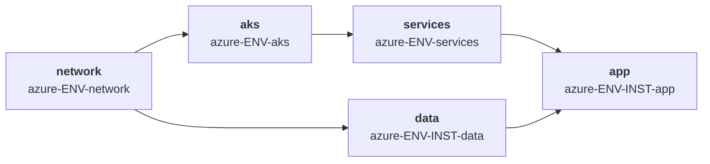

| # | Stack | Produce | Consume |
|---|---|---|---|
| 1 | `azure-ENV-network` | VNet, subredes, NAT gateway, zonas DNS privadas, subred de endpoint privado | — |
| 2 | `azure-ENV-aks` | Cluster, node pools, URL del emisor OIDC, identidad de kubelet | network |
| 3 | `azure-ENV-services` | AGFC o Envoy Gateway, integración de certificados, monitorización | aks |
| 4a | `azure-ENV-INST-data` | Flexible Server, secretos de Key Vault, endpoint privado | network |
| 4b | `azure-ENV-INST-app` | Workload, identidad gestionada asignada por el usuario, credencial federada | aks, services, data |

### 9.2 Modo de networking — decide una vez, en globals

| Modo | Direccionamiento de pods | Cuándo |
|---|---|---|
| **Azure CNI Overlay** | Pods en un CIDR overlay privado, no en IPs de VNet | **Elección por defecto.** Elimina por completo la presión de IPs de VNet |
| Azure CNI (tradicional) | Cada pod recibe una IP de VNet | Solo cuando los pods deben ser directamente enrutables desde fuera del cluster |
| Azure CNI potenciado por Cilium | Overlay más plano de datos eBPF | Cuando quieres NetworkPolicy con rendimiento eBPF |

El modo overlay cambia significativamente el plan de direcciones: la mitad de pods de la `/17` pasa a ser reserva en lugar de consumida, porque las direcciones de pod provienen de un espacio overlay separado y no enrutable que puede reutilizarse entre entornos. Esa es una ventaja genuina sobre EKS con VPC CNI, y debería registrarse como un trait para que la planificación de capacidad la refleje.

### 9.3 Identidad — Workload Identity con Entra ID

```hcl
# imports/contracts/contract_cluster_aks.tm.hcl
input "vnet_id" {
  backend = "tofu"  from_stack_id = global.platform.network_stack_id
  value = outputs.vnet_id.value
  mock  = "/subscriptions/mock/resourceGroups/mock/providers/Microsoft.Network/virtualNetworks/mock"
}
input "node_subnet_id" {
  backend = "tofu"  from_stack_id = global.platform.network_stack_id
  value = outputs.node_subnet_id.value
  mock  = "/subscriptions/mock/.../subnets/mock-nodes"
}

output "cluster_name"     { backend = "tofu"  value = azurerm_kubernetes_cluster.this.name }
output "cluster_endpoint" { backend = "tofu"  value = azurerm_kubernetes_cluster.this.kube_config.0.host }
output "cluster_ca" {
  backend = "tofu"  value = azurerm_kubernetes_cluster.this.kube_config.0.cluster_ca_certificate
  sensitive = true
}
# El único hecho del que depende cada workload identity en cada instancia:
output "oidc_issuer_url"  { backend = "tofu"  value = azurerm_kubernetes_cluster.this.oidc_issuer_url }
output "kubelet_identity_object_id" {
  backend = "tofu"  value = azurerm_kubernetes_cluster.this.kubelet_identity.0.object_id
}
```

El stack de aplicación crea una identidad gestionada asignada por el usuario y una credencial federada restringida a exactamente un namespace y una service account:

```hcl
resource "azurerm_user_assigned_identity" "app" {
  name                = "${global.instance}-${global.app.name}"
  resource_group_name = global.resource_group
  location            = global.region
}

resource "azurerm_federated_identity_credential" "app" {
  name                = "${global.instance}-${global.app.name}-fic"
  resource_group_name = global.resource_group
  parent_id           = azurerm_user_assigned_identity.app.id
  audience            = ["api://AzureADTokenExchange"]
  issuer              = var.oidc_issuer_url
  # Restringido por namespace, nunca un comodín
  subject             = "system:serviceaccount:${global.platform.namespace}:${global.app.name}"
}
```

El campo `subject` es el análogo exacto de la condition `sub` de EKS y de la cadena de miembro de Workload Identity de GKE. Los tres están restringidos por namespace, y en los tres un comodín concede silenciosamente la identidad a cada pod del cluster.

### 9.4 Línea base de IAM y seguridad de AKS

| Control | Requisito | Justificación |
|---|---|---|
| Identidad del cluster | Identidad gestionada asignada por el usuario, no asignada por el sistema | Sobrevive a la recreación del cluster; concedible por adelantado |
| Workload identity | Habilitada con emisor OIDC; una UAMI por workload | La identidad de kubelet nunca debe ser la identidad de workload |
| Identidad de kubelet | Restringida solo a extracción de ACR | Es alcanzable desde el nodo |
| Acceso al cluster | **Integración de Entra ID con Azure RBAC**, cuentas locales deshabilitadas | `local_account_disabled = true` elimina el kubeconfig admin estático |
| Acceso admin | Grupo de Entra, nunca usuarios individuales | Auditable y revocable centralmente |
| Servidor API | Cluster privado, o rangos de IP autorizados | |
| Secretos | Key Vault vía el driver CSI de Secrets Store, usando workload identity | Nunca Kubernetes Secrets como fuente de verdad |
| Node pools | Discos de SO efímeros, `enable_host_encryption`, Azure Linux o Ubuntu con parcheado automático | |
| Registro | ACR con content trust y escaneo de vulnerabilidades; extracción de ACR vía identidad gestionada | |
| Política | Add-on de Azure Policy reforzando los Pod Security Standards | Equivalente al PSS `restricted` en otros lugares |
| Permisos del deployer | Rol personalizado restringido, no Owner ni Contributor a nivel de suscripción | |

Las asignaciones de Azure Policy a nivel de grupo de gestión son el equivalente de las Organisation Policies de GCP y las SCP de AWS: denegar IPs públicas en node pools, requerir endpoints privados en servicios de datos PaaS, confinar regiones, y denegar la creación de clusters con cuentas locales habilitadas.

### 9.5 Advertencias de AKS

| Advertencia | Impacto | Mitigación |
|---|---|---|
| `kube_config` es sensible y queda en el estado | El estado se convierte en un almacén de credenciales | Usa `local_account_disabled = true` y autenticación Entra; nunca compartas `kube_config` como output |
| Grupo de recursos del nodo | AKS crea un segundo grupo de recursos, gestionado por AKS | No gestiones su contenido en Terraform; el reconciliador del cluster luchará contra ti |
| Delegación de subred para AGFC | La subred de App Gateway for Containers necesita delegación a `Microsoft.ServiceNetworking/TrafficController` | Resérvala en el layout de direcciones del entorno |
| Zonas DNS privadas para endpoints privados | Cada servicio PaaS necesita su propia zona enlazada a la VNet | Poséelas en el stack de network; se comparten entre instancias |
| Overlay vs CNI es inmutable | Cambiar el modo de networking requiere recrear el cluster | Decídelo en globals antes del primer apply |
| Funcionalidades preview | Varias capacidades de AKS se lanzan detrás de flags `--enable-preview` | Fija el provider y registra la dependencia preview en el manifiesto del arquetipo |

---

## 10. Adjunto de borde entre clouds

Este es el elemento menos portable de la arquitectura, y el que decide si un entorno se gana el trait `iac-owned-edge` en el modelo de arquetipos. El patrón es el mismo en todas partes — Envoy Gateway (o AGFC) dentro del cluster, un load balancer de cloud delante, ningún LB externo gestionado por la cloud por Service — pero el mecanismo de adjunto difiere estructuralmente.

### 10.1 Comparación

| | GCP | AWS | Azure |
|---|---|---|---|
| Mecanismo | NEG independiente | CRD `TargetGroupBinding` | AGFC en modo **BYO** |
| Creado por | Controlador NEG de GKE | **Terraform** crea el target group | **Terraform** crea ALB + Frontend + Association |
| ¿En el estado de Terraform? | **No** | **Sí** | **Sí** |
| Disparador | Anotación en el Service | Recurso personalizado `TargetGroupBinding` | Anotación en `Gateway` / `Ingress` |
| Ligado por | Nombre del NEG | ARN o nombre del target group | ID del recurso Frontend |
| Zonalidad | Un NEG por zona | Target group único | Frontend único |
| Trait `iac-owned-edge` | No | Sí | Sí |

### 10.2 GCP — NEG independiente

Terraform posee el backend service, el health check, el URL map, el target proxy, la forwarding rule, el certificado y las reglas de firewall. **No** posee el NEG.

- Declara el NEG como un data source, nunca como un `resource`, o Terraform y el controlador lucharán en cada plan.
- Nómbralo explícitamente en la anotación `EnvoyProxy` para que la búsqueda sea determinista.
- Los NEG son **zonales**. Refuerza `minReplicas ≥ número de zonas` más topology spread con una aserción, o una zona sin pods de Envoy produce un NEG ausente y un apply fallido.
- Arranque en frío: el NEG no existe hasta que los pods de Envoy están Ready. Divide en tres stacks (`aks`/`gke` → `gateway` → `edge`) con `after`, y confía en `--mock-on-fail` para las previews de PR.

### 10.3 AWS — TargetGroupBinding

El más fuerte de los tres para propiedad IaC completa. `TargetGroupBinding` expone pods a través de un target group de ALB o NLB aprovisionado enteramente fuera de Kubernetes, mientras el controlador gestiona el registro de targets desde el Service de Kubernetes.

Dos precauciones:

- **Nunca uses `aws_lb_target_group_attachment` junto a él.** El controlador registra y desregistra targets dinámicamente conforme los pods aparecen y desaparecen; que Terraform gestione los mismos targets garantiza una lucha en cada plan.
- **Restringe la creación con RBAC en clusters compartidos.** El CRD puede referenciar cualquier target group de la cuenta donde reside el cluster, así que un tenant podría importar el target group de otra carga de trabajo a su namespace y redirigir el tráfico. En esta arquitectura, solo el arquetipo `gateway` crea recursos `TargetGroupBinding`, y RBAC deniega `create` y `update` sobre el CRD a los namespaces de aplicación. Restringe la política IAM del controlador a los target groups específicos en lugar de `Resource: "*"`.

### 10.4 Azure — AGFC bring-your-own

El modo BYO pone el recurso Application Gateway for Containers, su Association y sus hijos Frontend en Terraform. La contrapartida es un ciclo de vida acoplado: cada objeto `Gateway` o `Ingress` requiere un Frontend aprovisionado de antemano y referenciado por anotación, y borrado después de eliminar el objeto de Kubernetes.

Con un Gateway por entorno — que el diseño de plataforma compartida ya exige — eso es un Frontend por entorno. Con un Gateway por tenant no escalaría.

Una diferencia arquitectónica que merece decidirse pronto: **AGFC es en sí misma una implementación de Gateway API.** Colocar Envoy Gateway detrás de ella es un doble salto L7 sin ganancia. En Azure, la elección real es AGFC directamente, o Envoy Gateway detrás de un Load Balancer interno estándar. AGFC no expone el `SecurityPolicy` OIDC nativo de Envoy, así que una integración con Keycloak necesita ahí un mecanismo distinto.

### 10.5 Configuración de Envoy Gateway

El Service que lleva la anotación de borde es **generado por el controlador de Envoy Gateway**, no escrito en tu chart. Configúralo mediante `EnvoyProxy`, referenciado desde la `GatewayClass`:

```yaml
apiVersion: gateway.envoyproxy.io/v1alpha1
kind: EnvoyProxy
metadata: { name: edge-proxy, namespace: envoy-gateway-system }
spec:
  provider:
    type: Kubernetes
    kubernetes:
      envoyService:
        type: ClusterIP                      # sin LB de cloud por Service
        annotations:
          # GCP
          cloud.google.com/neg: '{"exposed_ports":{"8443":{"name":"eg-demos-neg"}}}'
      envoyDeployment:
        replicas: 3
        pod:
          topologySpreadConstraints: [ ... ]
```

**Evita el recurso `kubernetes_manifest`** para `GatewayClass`, `EnvoyProxy` y `Gateway`. Requiere que el CRD exista y que el API server sea alcanzable *en el momento del plan*, lo que rompe las previews de PR y `--mock-on-fail`. Empaqueta los recursos personalizados en el propio chart de Helm del arquetipo `gateway` y despliega con `helm_release`, de modo que un plan sea un diff de values en lugar de una llamada a la API.

### 10.6 Por qué esto elimina el problema del fan-in

Gateway API invierte la dirección de la dependencia de enrutamiento. Un `HTTPRoute` vive en el namespace de la aplicación y se adjunta al Gateway con `parentRefs`; el Gateway controla quién puede adjuntarse vía `allowedRoutes`. **El borde ya no necesita conocer a sus tenants.**

Eso elimina tres cosas de la arquitectura: el URL map generado a partir de una lista `global.tenants` (§7.5), el ledger de listener-priority, y el stack de edge-routing que tenía que ejecutarse después de cada instancia. Lo que sigue siendo un claim es el hostname, porque solo un tenant puede poseer `alpha.demos.disasterproject.com`.

Usa **un Gateway por entorno** con `allowedRoutes.namespaces.from: Selector`, no uno por tenant — cada `Gateway` genera su propio Deployment de Envoy, Service y NEG, así que los Gateways por tenant reintroducen exactamente el fan-in que pretendían eliminar. Si más adelante necesitas varios (interno y externo, por ejemplo), `mergeGateways` en `EnvoyProxy` permite que compartan una flota de proxies.

### 10.7 El ciclo de arranque de Keycloak

Envoy Gateway provee OIDC nativo mediante `SecurityPolicy`, lo que probablemente elimina la necesidad de autorización externa. Pero hay un ciclo que hay que diseñar explícitamente:

> El Gateway necesita a Keycloak para autenticar, y Keycloak se expone a través del Gateway.

Dos invariantes:

- El propio `HTTPRoute` de Keycloak no lleva **ningún** `SecurityPolicy`.
- El endpoint de descubrimiento OIDC del Gateway se resuelve a través del Service dentro del cluster, no del hostname público.

Sin esto, un entorno en frío no arranca y la causa no es obvia. Decide también el comportamiento ante el fallo del IdP: si Keycloak está caído, el Gateway deja de autenticar todo lo demás. Aceptable en `demos`; en producción requiere Keycloak en alta disponibilidad y una decisión explícita entre fail-open y fail-closed.

### 10.8 Riesgos de borde

| Riesgo | Mitigación |
|---|---|
| NEG ausente en una zona sin pods de Envoy | `minReplicas ≥ zonas`, topology spread, aserción |
| Redirección de tráfico entre tenants por `TargetGroupBinding` | RBAC denegando el CRD a los namespaces de tenant; IAM del controlador restringido |
| Frontend de AGFC huérfano tras borrar el Gateway | Ciclo de vida del Frontend poseído por el mismo stack que el Gateway; destruir en orden inverso |
| Envoy Gateway es un SPOF por entorno | PDB, despliegue surge, `minReplicas ≥ 3` |
| Cadencia de release de Envoy Gateway; APIs alfa en `EnvoyProxy` y `SecurityPolicy` | Fija las versiones del chart y de Gateway API; actualiza primero en un entorno efímero |
| NEG retenido en `tofu destroy` | Orden inverso correcto — el backend service debe borrarse antes que el Service de Kubernetes |
| Doble salto L7 sin justificar | Confirma la necesidad de `SecurityPolicy` OIDC, mTLS o rate limiting por ruta antes de comprometerte |

---

## 11. Identidad, acceso y línea base de seguridad

Todo lo anterior asume una identidad de pipeline que puede leer y escribir recursos de cloud en varias cuentas y proyectos. Esa identidad es el objetivo de mayor valor de todo el sistema: por construcción, posee más privilegio que cualquier workload individual que despliegue. Esta sección especifica cómo se concede, se acota y se audita.

### 11.1 Principios

1. **Ninguna credencial de larga duración en ningún sitio.** Sin claves JSON de service account, sin claves de acceso IAM en secretos de GitHub. Solo federación OIDC.
2. **Separa la identidad de plan de la identidad de apply.** Plan es de solo lectura; apply es de escritura. Un pull request desde un fork nunca debe poder alcanzar un rol de apply.
3. **Identidad separada por entorno.** El rol que despliega `demos` no debe poder tocar `prod`.
4. **Acota el radio de impacto por encima del pipeline.** Las Organisation Policies y las SCP son el control que el pipeline no puede deshabilitar; los límites de permisos son el control que el propio código de un tenant no puede escapar.
5. **Los workloads nunca heredan el privilegio del pipeline.** El rol que crea un servicio Cloud Run y la service account con la que se ejecuta ese servicio son principales distintos con permisos disjuntos.
6. **Los secretos se referencian, nunca se transportan.** Nada sensible cruza la frontera de outputs sharing.

### 11.2 Identidad de pipeline — GitHub Actions hacia Google Cloud

Workload Identity Federation, con el pool y el provider poseídos por un stack de bootstrap que el propio pipeline no gestiona.

```hcl
resource "google_iam_workload_identity_pool" "github" {
  workload_identity_pool_id = "github-pool"
  project                   = var.bootstrap_project_id
}

resource "google_iam_workload_identity_pool_provider" "github" {
  workload_identity_pool_id          = google_iam_workload_identity_pool.github.workload_identity_pool_id
  workload_identity_pool_provider_id = "github-oidc"

  attribute_mapping = {
    "google.subject"         = "assertion.sub"
    "attribute.repository"   = "assertion.repository"
    "attribute.environment"  = "assertion.environment"
    "attribute.ref"          = "assertion.ref"
  }

  # SIN ESTA CONDICIÓN, CUALQUIER REPOSITORIO DE GITHUB EN EL MUNDO PUEDE
  # SUPLANTAR ESTE POOL. No es opcional.
  attribute_condition = "assertion.repository == 'disasterproject/infra' && assertion.repository_owner_id == '123456'"

  oidc {
    issuer_uri = "https://token.actions.githubusercontent.com"
  }
}
```

Dos service accounts por entorno, ligadas a conjuntos de principales *distintos*:

```hcl
# Plan: solo lectura, permitido desde cualquier rama (para que funcionen las PR de ramas feature)
resource "google_service_account_iam_member" "plan" {
  service_account_id = google_service_account.tf_plan_shared_demo.name
  role               = "roles/iam.workloadIdentityUser"
  member = "principalSet://iam.googleapis.com/${google_iam_workload_identity_pool.github.name}/attribute.repository/disasterproject/infra"
}

# Apply: escritura, permitido SOLO desde el GitHub Environment protegido
resource "google_service_account_iam_member" "apply" {
  service_account_id = google_service_account.tf_apply_shared_demo.name
  role               = "roles/iam.workloadIdentityUser"
  member = "principalSet://iam.googleapis.com/${google_iam_workload_identity_pool.github.name}/attribute.environment/demos"
}
```

El claim `attribute.environment` solo está presente cuando el job del workflow declara `environment:`. Ligar la SA de apply a ese atributo significa que **el rol de apply es inalcanzable desde un job sin la puerta de entorno**, lo que hace que el control de required-reviewers de GitHub sea un límite de seguridad real en lugar de una conveniencia de UI.

| Identidad | Roles | Alcance |
|---|---|---|
| `tf-plan-<env>@` | `roles/viewer`, `roles/storage.objectViewer` sobre el prefijo del bucket de estado | Solo lectura; puede leer el estado del productor para outputs sharing |
| `tf-apply-<env>@` | Conjunto de mínimo privilegio por entorno (`roles/container.admin`, `roles/run.admin`, `roles/compute.networkAdmin`, …) más `roles/storage.objectAdmin` sobre el prefijo de estado | Nunca `roles/owner`, nunca `roles/editor` |
| `tf-apply-<env>@` extras | `roles/iam.serviceAccountUser` sobre cada SA de runtime que deba `actAs` | Restringido por SA, no a nivel de proyecto |
| SAs de runtime (`run-*`, SA de nodo GKE) | Específicas del workload, mínimas | Creadas por el pipeline, nunca asumibles por él más allá de `actAs` |

Políticas de organización que el pipeline no puede anular:

```
constraints/iam.disableServiceAccountKeyCreation      # sin claves exportables, nunca
constraints/iam.allowedPolicyMemberDomains            # sin identidades externas en políticas IAM
constraints/compute.vmExternalIpAccess                # denegar por defecto
constraints/sql.restrictPublicIp                      # Cloud SQL solo con IP privada
constraints/run.allowedIngress                        # bloquea ingress=ALL en toda la flota
constraints/compute.requireShieldedVm                 # nodos GKE
constraints/gcp.resourceLocations                     # residencia de datos
```

### 11.3 Identidad de pipeline — GitHub Actions hacia AWS

```hcl
resource "aws_iam_openid_connect_provider" "github" {
  url             = "https://token.actions.githubusercontent.com"
  client_id_list  = ["sts.amazonaws.com"]
  thumbprint_list = [var.github_oidc_thumbprint]
}

data "aws_iam_policy_document" "apply_trust" {
  statement {
    effect  = "Allow"
    actions = ["sts:AssumeRoleWithWebIdentity"]

    principals {
      type        = "Federated"
      identifiers = [aws_iam_openid_connect_provider.github.arn]
    }

    condition {
      test     = "StringEquals"
      variable = "token.actions.githubusercontent.com:aud"
      values   = ["sts.amazonaws.com"]
    }

    # StringEquals sobre el sub completo, fijado al entorno protegido.
    # NUNCA uses StringLike con "repo:disasterproject/infra:*" — eso concede
    # cada rama, cada PR de fork y cada workflow del repositorio.
    condition {
      test     = "StringEquals"
      variable = "token.actions.githubusercontent.com:sub"
      values   = ["repo:disasterproject/infra:environment:${var.environment}"]
    }
  }
}

resource "aws_iam_role" "tf_apply" {
  name                 = "tf-apply-${var.environment}"
  assume_role_policy   = data.aws_iam_policy_document.apply_trust.json
  permissions_boundary = aws_iam_policy.pipeline_boundary.arn
  max_session_duration = 3600
}
```

| Control | Ajuste | Por qué |
|---|---|---|
| Condition `sub` | `StringEquals` sobre el `repo:ORG/REPO:environment:ENV` exacto | `StringLike` con un comodín es la mala configuración OIDC de AWS más común |
| Condition `aud` | Siempre presente | Sin ella, la trust policy acepta tokens emitidos para otras audiencias |
| Límite de permisos sobre el rol del pipeline | Deniega `iam:DeleteRolePermissionsBoundary`, `organizations:*`, `iam:CreateUser` | El pipeline crea roles IAM; no debe poder crear unos más poderosos que él mismo |
| `max_session_duration` | 1 hora | Limita la ventana de un token de sesión filtrado |
| Nombre de sesión | Fijado al ID de ejecución del workflow | Cada evento de CloudTrail traza de vuelta a una ejecución de pipeline y un commit específicos |
| Rol de plan | Rol separado, `ReadOnlyAccess` + lectura de estado | Alcanzable sin la puerta de entorno |

```yaml
- uses: aws-actions/configure-aws-credentials@v4
  with:
    role-to-assume: ${{ vars.AWS_APPLY_ROLE }}
    role-session-name: gha-${{ github.run_id }}-${{ github.run_attempt }}
    aws-region: eu-west-1
```

Service Control Policies a nivel de organización o de OU:

```
Deny  iam:CreateUser, iam:CreateAccessKey                 # solo federación
Deny  iam:DeleteRolePermissionsBoundary                   # los límites son inmutables para los workloads
Deny  organizations:LeaveOrganization
Deny  * fuera de las regiones aprobadas (con las excepciones habituales de servicios globales)
Deny  ec2:* cuando aws:RequestedRegion no está aprobada
Deny  s3:PutBucketPolicy que conceda Principal "*"
Deny  kms:ScheduleKeyDeletion para las claves de cifrado de estado
```

### 11.4 Matriz de segregación de roles

| Job | Identidad GCP | Identidad AWS | Puerta de entorno de GitHub | Acceso al estado |
|---|---|---|---|---|
| `preview` (PR) | `tf-plan-<env>@` | `tf-plan-<env>` | ninguna | lectura |
| `deploy` (main) | `tf-apply-<env>@` | `tf-apply-<env>` | **reviewers requeridos** | lectura + escritura |
| `drift` (cron) | `tf-plan-<env>@` | `tf-plan-<env>` | ninguna | lectura |
| `destroy` (manual) | `tf-destroy-<env>@` | `tf-destroy-<env>` | **reviewers requeridos + grupo aprobador separado** | lectura + escritura |

El destroy merece su propia identidad. En una plataforma compartida es la operación que puede tumbar a cada tenant (§12.4), y separarla significa que un camino de deploy comprometido no puede borrar infraestructura.

Las ejecuciones de plan deben usar `-lock=false`, así que la identidad de plan no necesita escritura sobre la tabla de lock ni el objeto de estado. Eso es lo que hace posible un rol de plan genuinamente de solo lectura:

```bash
tofu plan -lock=false -out out.tfplan
```

### 11.5 Permisos del backend de estado y el requisito de outputs sharing

Outputs sharing ejecuta `tofu output -json` **dentro del directorio del productor**, lo que lee el estado del productor. Este es un requisito de permiso que no existe en un repositorio sin sharing, y es el bloqueador más común en la primera semana de adopción.

| El consumidor necesita | GCS | S3 |
|---|---|---|
| Leer el estado del productor | `roles/storage.objectViewer` sobre `gs://BUCKET/PREFIX/producer/*` | `s3:GetObject` sobre `arn:aws:s3:::BUCKET/PREFIX/producer/*` |
| Descifrar el estado del productor | `roles/cloudkms.cryptoKeyDecrypter` si es CMEK | `kms:Decrypt` sobre la clave del bucket |
| Descifrar el cifrado de estado de OpenTofu | La clave de cifrado de estado del productor | Igual |
| Lock | **No requerido** — `tofu output` no bloquea | No requerido |

> **El cifrado de estado del lado del cliente de OpenTofu cambia el cálculo.** Si habilitas el bloque `encryption` (recomendado), el consumidor necesita la *clave de cifrado* del productor, no solo lectura del objeto. Usa una clave por entorno en lugar de una por stack, o el sharing entre stacks se convierte en un problema de gestión de claves. Documenta explícitamente el alcance de la clave.

```hcl
# generado por el mixin de backend
terraform {
  encryption {
    key_provider "gcp_kms" "env" {
      kms_encryption_key = var.state_kms_key      # una clave por ENTORNO
      key_length         = 32
    }
    method "aes_gcm" "default" {
      keys = key_provider.gcp_kms.env
    }
    state    { method = method.aes_gcm.default }
    plan     { method = method.aes_gcm.default }
  }
}
```

Topologías entre cuentas y entre proyectos:

- **Entre proyectos (GCP).** La SA del consumidor necesita la concesión de viewer sobre el bucket del *productor*. Concédela sobre el prefijo del bucket, no sobre el bucket, para que un consumidor de `demos` no pueda leer el estado de `prod`.
- **Entre cuentas (AWS).** O la política del bucket de estado concede al rol consumidor directamente, o el consumidor asume un rol en la cuenta del productor. La primera es más simple; la segunda es auditable por cuenta. Elige una convención y aplícala en todas partes.
- **Nota sobre el radio de impacto.** Cada arista de sharing es también un permiso de lectura de estado. Antes de añadir una, pregúntate si el valor podría ser un global en su lugar (§4.6) — eso cuesta cero permisos.

### 11.6 Lo que nunca cruza la frontera de sharing

Outputs sharing resuelve valores en variables de entorno `TF_VAR_<name>` en el proceso del consumidor. Las variables de entorno se filtran: a volcados de memoria, a entornos de subprocesos, a logs de depuración de CI, a la salida de `ps`.

| Valor | ¿Compartir? | En su lugar |
|---|---|---|
| Contraseña de base de datos | **No** | ID de secreto de Secret Manager / ARN de Secrets Manager |
| Token de autenticación de cloud | **No** | `google_client_config` / `aws_eks_cluster_auth` por consumidor |
| Clave privada TLS | **No** | ID de mapa de Certificate Manager / ARN de certificado ACM |
| Clave API | **No** | La referencia del secreto |
| Material de clave KMS | **No** | ARN o nombre de recurso de la clave |
| Certificado CA del cluster | Sí, marcado `sensitive` | Es un certificado público |
| Endpoint de cluster, ID de VPC, IDs de subred, ARN de proveedor OIDC | Sí | — |

Refuérzalo mecánicamente en lugar de por revisión:

```bash
# scripts/lint-no-secrets-shared.sh
if grep -rEn 'output\s+"[^"]*(password|secret_value|private_key|token|credential)' \
     imports/contracts/ | grep -v '_id"\|_arn"\|_name"'; then
  echo "::error::Un bloque output parece exportar un valor secreto. Comparte una referencia en su lugar."
  exit 1
fi
```

### 11.7 Barandillas por encima del pipeline

Tres capas, cada una reforzando lo que la capa de abajo no puede evadir:

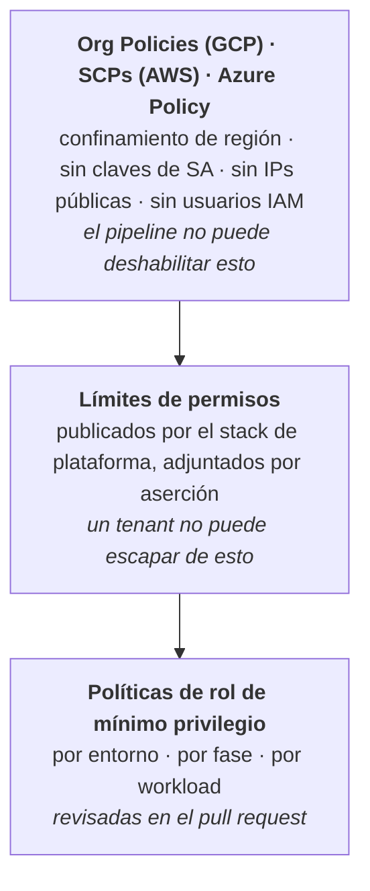

Aserción que refuerza la capa intermedia:

```hcl
assert {
  assertion = global.capability != "app" || tm_can(global.iam.permission_boundary)
  message   = "Los stacks de aplicación deben adjuntar el límite de permisos de la plataforma a cada rol IAM"
}

assert {
  assertion = global.env != "prod" || !global.app.ecs_exec_enabled
  message   = "ECS Exec no debe habilitarse en producción"
}
```

### 11.8 Workload identity a través de las guías

| Guía | Mecanismo de workload identity | Hechos compartidos desde la plataforma | Dónde se restringe el binding |
|---|---|---|---|
| **GKE** (§5) | Workload Identity Federation para GKE | `workload_identity_pool` | `serviceAccount:POOL[NAMESPACE/KSA]` — restringido por namespace |
| **EKS** (§6) | IRSA (o EKS Pod Identity) | `oidc_provider_arn`, `oidc_provider_url` | `sub = system:serviceaccount:NAMESPACE:SA` — restringido por namespace + SA |
| **Cloud Run** (§7) | Service account de runtime por servicio | *ninguno* — la identidad la crea el stack de app | El propio servicio es el límite |
| **ECS Fargate** (§8) | Rol de tarea (+ rol de ejecución separado) | `task_role_boundary_arn` | La definición de tarea es el límite |
| **AKS** (§9) | Workload Identity (Entra ID) | `oidc_issuer_url` | `subject = system:serviceaccount:NAMESPACE:SA` — restringido por namespace + SA |

Dos observaciones que dan forma al diseño multi-tenant:

- **GKE y EKS restringen la identidad por namespace**, así que el namespace *es* el límite de tenencia y nunca debe compartirse entre instancias.
- **Cloud Run y Fargate restringen la identidad por servicio o tarea**, un límite más fino que no requiere RBAC a nivel de cluster — una razón por la que ambos son mejores valores por defecto para entornos demo compartidos.

Nunca escribas un comodín en una condición de confianza de workload identity. `system:serviceaccount:*:*` o `POOL[*/*]` concede el rol a cada pod del cluster, anulando silenciosamente todo el modelo.

### 11.9 Línea base de seguridad de red

| Control | GKE | EKS | AKS | Cloud Run | ECS Fargate |
|---|---|---|---|---|
| Plano de control privado | Cluster privado + redes autorizadas | Endpoint privado + `public_access_cidrs` | Cluster privado + rangos de IP autorizados | n/a | n/a |
| Egress de workload | Cloud NAT, sin IPs externas | NAT, `assign_public_ip=false` | NAT gateway, sin IPs públicas de nodo | `PRIVATE_RANGES_ONLY` | `assign_public_ip=false` |
| Acceso privado a servicios | Rango PSA para Cloud SQL | Endpoints de VPC | Endpoints privados + zonas DNS privadas | PSA + Direct VPC egress | Endpoints de VPC |
| Política este-oeste | NetworkPolicy default-deny | NetworkPolicy default-deny | NetworkPolicy (Cilium o Calico) | IAM servicio-a-servicio | Referencias a security groups |
| Filtrado de ingress | Cloud Armor en el LB | AWS WAF en el ALB | Azure WAF en App Gateway / AGFC | Cloud Armor + configuración `ingress` | AWS WAF en el ALB |
| Alcanzabilidad del runner de CI | Runner privado o network autorizada | Runner privado o CIDR público permitido | Runner privado o rango de IP autorizado | API pública | API pública |

La fila del runner de CI es la que muerde durante el despliegue: un plano de control totalmente privado significa que los runners alojados por GitHub no pueden planificar ni aplicar. Decide pronto entre runners autoalojados dentro de la VPC y una autorización de redes para el rango de egress del runner, porque cambia el diseño del pipeline.

### 11.10 Auditoría y trazabilidad

- **Nombrado de sesión.** `gha-<run_id>-<run_attempt>` en AWS, y el claim `google.subject` de WIF en GCP, atan cada llamada a la API de cloud a una ejecución de workflow y por tanto a un commit.
- **Etiquetado de recursos.** Cada recurso generado lleva `Archetype`, `Instance`, `Environment`, `ManagedBy=terramate`, `CommitSha`. Esto es lo que permite que la CMDB reconcilie la realidad de la cloud contra el repositorio.
- **Log sinks.** GCP Audit Logs y AWS CloudTrail exportados a un proyecto o cuenta separado, de solo anexado, en el que la identidad del pipeline no puede escribir.
- **Procedencia del código generado.** Como los ficheros generados se commitean, `git blame` en una línea de `_main.tf` apunta al cambio del generador que la produjo — una propiedad que los orquestadores basados en wrappers no tienen.
- **`CODEOWNERS`** sobre `imports/contracts/**` e `imports/generators/**` que requiere revisión del equipo de plataforma: esos dos directorios son donde un único cambio alcanza a cada entorno.

---

## 12. Gestión de entornos: dedicados y compartidos

Aquí es donde la arquitectura se gana su sitio. Las cargas de trabajo de demo, ingeniería de ventas y evaluación necesitan muchas instancias de arquetipo en **una** plataforma; producción necesita **una** instancia de arquetipo por plataforma. La misma definición de arquetipo debe servir a ambas.

### 12.1 Los tres modelos

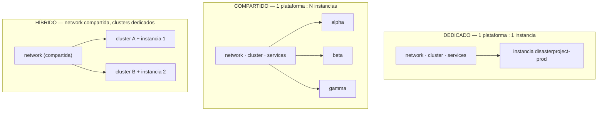

| | Dedicado | Compartido | Híbrido |
|---|---|---|---|
| **Límite de aislamiento** | Cuenta/proyecto/suscripción de cloud | Namespace de Kubernetes + IAM | Cluster |
| **Radio de impacto de un cambio de plataforma** | 1 instancia | Todas las instancias | Instancias en ese cluster |
| **Coste por instancia** | Alto | Muy bajo | Medio |
| **Tiempo de aprovisionar una instancia** | 20–40 min (plataforma completa) | 2–5 min (solo stacks de app) | 10–20 min |
| **Uso típico** | prod, qa, regulado | demos, formación, PoC | dev, integración |
| **Acoplamiento del ciclo de vida** | Destroy de instancia = destroy de plataforma | El destroy de instancia **no debe** tocar la plataforma | Destroy de cluster = sus instancias |

### 12.2 El mecanismo de binding

Todo lo anterior se expresa mediante un fichero por instancia de arquetipo. Este es todo el truco.

```hcl
# stacks/archetypes/webapp-3tier/instances/disasterproject-prod/binding.tm.hcl
# ---- DEDICADO: esta instancia posee su plataforma ----
globals "platform" {
  cloud             = "aws"
  env               = "prod"
  model             = "dedicated"

  network_stack_id  = "aws-prod-network"
  cluster_stack_id  = "aws-prod-eks"
  services_stack_id = "aws-prod-services"
  data_stack_id     = "aws-prod-disasterproject-data"

  namespace         = "disasterproject"
}

globals {
  instance = "disasterproject"
  tags = {
    Environment = "prod"
    Instance    = "disasterproject"
    Model       = "dedicated"
    Archetype   = "webapp-3tier"
  }
}
```

```hcl
# stacks/archetypes/webapp-3tier/instances/alpha/binding.tm.hcl
# ---- COMPARTIDO: esta instancia alquila espacio en la plataforma demo compartida ----
globals "platform" {
  cloud             = "gcp"
  env               = "demos"
  model             = "shared"

  network_stack_id  = "gcp-demos-network"
  cluster_stack_id  = "gcp-demos-gke"
  services_stack_id = "gcp-demos-services"
  data_stack_id     = "gcp-demos-alpha-data"

  namespace         = "demo-alpha"        # límite de aislamiento
}

globals {
  instance = "alpha"
  ttl_days = 14                            # las demos expiran
  tags = {
    Environment = "demos"
    Instance    = "alpha"
    Model       = "shared"
    Archetype   = "webapp-3tier"
    ExpiresOn   = tm_formatdate("YYYY-MM-DD", tm_timeadd(tm_timestamp(), "336h"))
  }
}
```

Ni una línea de los generadores, contratos o módulos del arquetipo cambia entre los dos. Solo el binding.

### 12.3 Aislamiento en un entorno compartido

Una plataforma compartida es un sistema multi-tenant, y debe construirse como tal. El generador del arquetipo emite esto por instancia siempre que `global.platform.model == "shared"`:

```hcl
# imports/generators/v1/gen_app.tm.hcl (barandillas del modelo compartido)
generate_hcl "_tenancy.tf" {
  condition = global.capability == "app" && global.platform.model == "shared"

  content {
    resource "kubernetes_namespace" "this" {
      metadata {
        name = global.platform.namespace
        labels = {
          "archetype"                          = global.archetype
          "instance"                           = global.instance
          "pod-security.kubernetes.io/enforce" = "restricted"
        }
      }
    }

    resource "kubernetes_resource_quota" "this" {
      metadata {
        name      = "tenant-quota"
        namespace = kubernetes_namespace.this.metadata[0].name
      }
      spec {
        hard = {
          "requests.cpu"    = global.quota.cpu
          "requests.memory" = global.quota.memory
          "pods"            = global.quota.pods
          "count/services.loadbalancers" = global.quota.loadbalancers
        }
      }
    }

    resource "kubernetes_limit_range" "this" {
      metadata {
        name      = "tenant-limits"
        namespace = kubernetes_namespace.this.metadata[0].name
      }
      spec {
        limit {
          type            = "Container"
          default         = { cpu = "500m", memory = "512Mi" }
          default_request = { cpu = "100m", memory = "128Mi" }
        }
      }
    }

    resource "kubernetes_network_policy" "default_deny" {
      metadata {
        name      = "default-deny-ingress"
        namespace = kubernetes_namespace.this.metadata[0].name
      }
      spec {
        pod_selector {}
        policy_types = ["Ingress"]
      }
    }
  }
}
```

Reforzado mediante aserción, para que una instancia compartida no pueda fusionarse sin cuotas:

```hcl
assert {
  assertion = global.platform.model != "shared" || tm_can(global.quota.cpu)
  message   = "Las instancias de modelo compartido deben definir global.quota"
}

assert {
  assertion = global.platform.model != "shared" || global.platform.namespace != "default"
  message   = "Las instancias de modelo compartido no deben desplegarse en el namespace default"
}
```

| Dimensión de aislamiento | Dedicado | Compartido |
|---|---|---|
| Cómputo | Cluster separado | Namespace + ResourceQuota + LimitRange |
| Network | VPC separada | NetworkPolicy default-deny + permisos explícitos |
| Identidad | Cuenta/proyecto de cloud separado | Binding de IRSA / Workload Identity por namespace |
| Datos | Instancia de base de datos separada | Base de datos separada *dentro* de una instancia compartida, secretos separados |
| Ingress | Load balancer dedicado | Controlador compartido, hostname por instancia |
| Atribución de coste | A nivel de cuenta | Labels de namespace + tags de asignación de coste |

### 12.4 Ciclo de vida: el problema del destroy

La operación más peligrosa en un entorno compartido es desmontar una demo. `terramate run -- tofu destroy --reverse` contra el selector de tag equivocado tumbará la plataforma junto con la instancia, matando cada otra demo que haya en ella.

**Barandilla 1 — destroy restringido por tag, nunca por ruta.**

```bash
# CORRECTO: destruye solo los stacks propios de la instancia
terramate run \
  --tags instance:alpha \
  --reverse \
  --enable-sharing \
  -- tofu destroy -auto-approve

# INCORRECTO: --changed o un selector de directorio puede arrastrar stacks de plataforma
```

**Barandilla 2 — los stacks de plataforma llevan un tag protector y la CI se niega a destruirlos fuera de un flujo de break-glass.**

```hcl
stack {
  id   = "gcp-demos-gke"
  tags = ["gcp", "demos", "cluster", "platform", "protected"]
}
```

```bash
# En el job de destroy, antes de ejecutar nada:
if terramate list --tags protected --tags instance:${INSTANCE} | grep -q .; then
  echo "::error::El selector de destroy coincidió con un stack de plataforma protegido. Abortando."
  exit 1
fi
```

**Barandilla 3 — conteo de referencias antes de destruir la plataforma.** Una plataforma compartida no debe destruirse mientras haya instancias ligadas a ella. Como los bindings son solo globals, puedes contarlos:

```bash
# ¿Cuántas instancias están ligadas a esta plataforma?
terramate list --json \
  | jq -r '.stacks[].id' \
  | grep -c '^gcp-demos-.*-app$'
```

Conéctalo a la CMDB (§12.7) para que el conteo sea autoritativo en lugar de inferido del repositorio.

### 12.5 Entornos compartidos efímeros

Las demos son el caso arquetípico de los entornos compartidos, y deberían expirar.

```
stacks/platforms/gcp/
├── demos/          # de larga duración, siempre encendido
└── ephemeral/
    ├── conf-2026-q3/     # creado para un evento, destruido después
    └── poc-disasterproject/
```

Una plataforma efímera se crea copiando `demos/` y cambiando tres globals (`env`, `project_id`, `vpc_cidr`). Un workflow programado lista los stacks cuyo tag `ExpiresOn` está en el pasado y abre una PR de destroy — nunca destruyendo automáticamente, siempre con un humano aprobando.

```bash
terramate list --tags ephemeral --json \
  | jq -r '.stacks[] | select(.tags[] | startswith("expires:")) | .id'
```

### 12.6 Promoción entre entornos

La promoción es un **diff de globals**, no un diff de código. Los mismos generadores y contratos aplican en todas partes; solo difiere `config.tm.hcl`.

| Global | demos | dev | qa | prod |
|---|---|---|---|---|
| `cluster.min_nodes` | 1 | 2 | 3 | 3 |
| `cluster.max_nodes` | 12 | 20 | 40 | 60 |
| `cluster.release_channel` | `REGULAR` | `REGULAR` | `STABLE` | `STABLE` |
| `cluster.deletion_protection` | `false` | `false` | `true` | `true` |
| `policy.enforce_namespace_quota` | `true` | `false` | `false` | `false` |
| `data.backup_retention_days` | 1 | 7 | 14 | 35 |
| `data.multi_az` | `false` | `false` | `true` | `true` |
| Presupuesto de `managed_db_instances` | 25 | 10 | 10 | por instancia |

Como `generate_hcl` es compartido, un cambio en cómo se construye un cluster llega a todos los entornos a la vez. Ese es precisamente el punto — y también por qué los cambios de generador necesitan la disciplina de versionado `v1`/`v2` de §4.7, para poder desplegarlos entorno por entorno.

### 12.7 Integración con la CMDB

Terramate ofrece un inventario declarativo independiente del estado, que es una mejor fuente de CMDB que analizar los ficheros de estado. Dos comandos lo transportan:

```bash
terramate list --json                                   # inventario lógico, pre-apply
terramate run --changed -- tofu show -json              # inventario físico, post-apply
```

El modelo completo — disposición de ficheros, los tres niveles, los tipos de arista extraídos estáticamente de los bloques `input`, y el conteo de referencias que protege a una plataforma compartida del desmontaje de una instancia — está especificado en el documento complementario, `archetype-model.md` §11. No se repite aquí.

## 13. Validación de políticas y seguridad

Tres puntos de refuerzo, aplicados en el orden en que capturan un problema tanto antes como sea posible. Ninguno de los tres subsume a los otros.

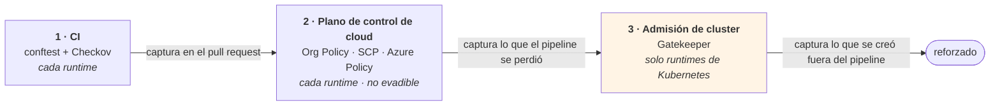

> **La paridad de runtimes no es alcanzable, y la brecha debería documentarse en lugar de descubrirse.** Cloud Run y ECS Fargate no tienen capa de admisión de Kubernetes, así que la capability `policy` solo existe donde existe `cluster`. Para los runtimes serverless, el tercer punto se reemplaza por controles del plano de control de la cloud — más gruesos, pero no evadibles desde dentro de un workload.

### 13.1 División del trabajo entre el resolver y OPA

El resolver y OPA no deben implementar las mismas reglas dos veces.

| | Resolver | OPA |
|---|---|---|
| Naturaleza | **Computa** — cierre, asignación, ordenamiento | **Asegura** — invariantes sobre lo computado |
| Estado | Escribe ledgers | Sin estado, sin efectos secundarios |
| Entrada | Manifiestos, bindings, ledgers | `resolution.json`, `terramate list --json`, `.tf` generado, plan JSON |
| Falla en | Pasos 1–17 | Después de la resolución y después de la generación |
| Autoría | Equipo de plataforma, en código | Plataforma **y** seguridad, sin tocar el resolver |

OPA no vuelve a resolver nada. Valida que lo que el resolver y los generadores produjeron es legal. Eso es defensa en profundidad — un bug del resolver no pasa desapercibido — y es donde viven las reglas específicas de la organización sin recompilar nada.

### 13.2 Cuatro puertas

| Puerta | Cuándo | Comando | Bloqueante |
|---|---|---|---|
| **G0 — integridad de la generación** | Cada PR | `terramate generate && git diff --exit-code` | Siempre |
| **G1 — estructura y composición** | Cada PR | `conftest test --policy policy/ --data registry/ …` | Siempre |
| **G2 — escaneo estático de seguridad** | Cada PR | `checkov -d . --framework terraform` | HIGH/CRITICAL |
| **G3 — escaneo del plan** | Antes del apply | `checkov -f plan.json --framework terraform_plan` + `conftest --namespace terraform` | HIGH/CRITICAL |

G0 existe porque el código generado se commitea. Sin ella, alguien edita a mano un `_main.tf`, el escaneo pasa, y el siguiente `terramate generate` revierte silenciosamente el arreglo.

**Checkov y OPA son complementarios, no alternativas.** Checkov aporta la biblioteca estándar de malas configuraciones de cloud conocidas — cientos de comprobaciones que nadie de tu equipo tiene que escribir. OPA lleva lo que es específico de esta plataforma y no puede expresarse como una comprobación genérica: el invariante `input`↔`after`, las reglas de composición de capabilities, las reglas de categoría demo, los presupuestos de tenant.

### 13.3 G1 — políticas de estructura y composición

Esta puerta **reemplaza** el lint de shell que antes protegía el invariante de ordenamiento. Ese invariante es el caso de uso canónico de Rego, y es el riesgo R2.

```rego
package terramate.stacks

# Cada stack que consume un output debe declarar al productor en 'after'.
deny contains msg if {
    some stack in input.stacks
    some dep in stack.consumes
    not dep.from_stack_id in stack.after_ids
    msg := sprintf(
        "el stack %q consume el output %q de %q pero no lo declara en 'after'",
        [stack.id, dep.output, dep.from_stack_id])
}

# Los IDs de stack siguen la convención de nombres.
deny contains msg if {
    some s in input.stacks
    not regex.match(`^[a-z0-9]+-[a-z0-9-]+-[a-z0-9-]+$`, s.id)
    msg := sprintf("el id de stack %q no sigue <cloud>-<env>-<capability>", [s.id])
}

# Los stacks de aplicación llevan un tag de instance, para que el destroy restringido por tag sea seguro.
deny contains msg if {
    some s in input.stacks
    s.capability == "app"
    count({t | some t in s.tags; startswith(t, "instance:")}) == 0
    msg := sprintf("el stack de aplicación %q no tiene tag instance:", [s.id])
}
```

```rego
package terramate.contracts

secret_fragments := {"password", "private_key", "token", "credential", "secret_value"}
reference_suffixes := {"_id", "_arn", "_name", "_uri"}

# Un bloque output nunca debe exportar un valor secreto — solo una referencia.
deny contains msg if {
    some s in input.stacks
    some o in s.produces
    some frag in secret_fragments
    contains(o, frag)
    every suffix in reference_suffixes { not endswith(o, suffix) }
    msg := sprintf("el stack %q exporta %q — comparte una referencia, no un valor", [s.id, o])
}
```

```rego
package archetype.composition

# Los arquetipos demo son hojas con una expiración obligatoria.
deny contains msg if {
    input.metadata.kind == "demo"
    count(input.provides) > 0
    msg := "los arquetipos demo no deben publicar capabilities"
}

deny contains msg if {
    input.metadata.kind == "demo"
    not input.metadata.expiresOn
    msg := "los arquetipos demo deben fijar metadata.expiresOn"
}

deny contains msg if {
    input.metadata.kind == "demo"
    time.parse_rfc3339_ns(sprintf("%sT00:00:00Z", [input.metadata.expiresOn])) < time.now_ns()
    msg := sprintf("expiresOn %q está en el pasado", [input.metadata.expiresOn])
}

# Los traits deben existir en el registro — una errata que no coincide con nada es peor que no comprobar.
deny contains msg if {
    some p in input.provides
    some t in p.traits
    not t in data.registry.traits
    msg := sprintf("trait no registrado %q en provides", [t])
}
```

**Las políticas necesitan sus propios tests.** Una regla que nunca se dispara da una falsa confianza. Mantén `policy/*_test.rego` junto a las reglas y ejecuta `conftest verify` en el mismo job.

### 13.4 G2 y G3 — escaneo de seguridad

El escaneo estático ve la *llamada* al módulo; el escaneo del plan ve el *resultado* del módulo. Una mala configuración dentro de un módulo alcanzable solo con una combinación particular de globals aparece solo en G3. En una plataforma compartida donde un generador sirve a cinco entornos, eso importa.

```bash
terramate run --changed --enable-sharing --mock-on-fail -- \
  sh -c 'tofu show -json out.tfplan > plan.json'

terramate run --changed -- \
  checkov -f plan.json --framework terraform_plan \
          --config-file "${TM_ROOT}/.checkov/${TM_CLOUD}.yaml"

conftest test --policy policy/ --data registry/ --namespace terraform plan.json
```

Configuración de Checkov por cloud, ya que las comprobaciones difieren:

```yaml
# .checkov/gcp.yaml
framework: [terraform, terraform_plan]
skip-check:
  # Los clusters demo permiten intencionadamente endpoints públicos para el acceso del presentador.
  # Restringido por directorio, no globalmente.
  - CKV_GCP_69
directory: [stacks/platforms/gcp, stacks/archetypes]
soft-fail-on: [LOW, MEDIUM]
hard-fail-on: [HIGH, CRITICAL]
```

Cada `skip-check` necesita un comentario que nombre la razón y el alcance. Las supresiones para `demos` no deben filtrarse a producción — divide los ficheros de configuración por entorno si una única lista de skip empieza a servir a ambos.

### 13.5 Admisión de cluster — Gatekeeper como capa 2b

El control de admisión pertenece a la **capa 2b**, entre el runtime y los servicios de plataforma. No puede estar en la capa 3: si Gatekeeper refuerza los Pod Security Standards, debe estar en su sitio antes de que se admitan las cargas de trabajo de gateway y monitorización. También tiene alcance de cluster en lugar de ser un servicio consumido por nombre. El precedente es la capa 1b para la monitorización de cloud.

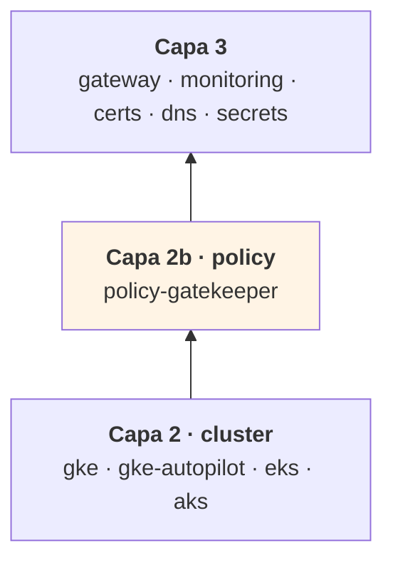

**Gatekeeper autogestionado en las tres clouds.** Las alternativas gestionadas — Policy Controller en GKE, el add-on de Azure Policy en AKS — son mutuamente excluyentes con una instalación autogestionada: AKS rechaza el add-on si Gatekeeper v3 ya está presente. Elegirlas significa tres comportamientos distintos que depurar, una versión que no controlas, plantillas personalizadas restringidas en Azure, y una licencia de GKE Enterprise. Autogestionado da una versión, un conjunto de `ConstraintTemplate`s y un modelo de exención en todas partes. Mantener la actualización vosotros mismos es barato en comparación.

Los proveedores alternativos se modelan de todos modos, por si el cumplimiento normativo alguna vez exige uno:

```yaml
# archetypes/policy-gatekeeper/manifest.yaml   ← portable, recomendado
provides:
  - capability: policy
    version: 1.0.0
    traits: [gatekeeper, custom-templates, audit-api, referential-constraints]
conflicts:
  - archetype: policy-controller-gke
  - archetype: policy-azure-aks

# archetypes/policy-azure-aks/manifest.yaml    ← solo si el cumplimiento lo requiere
provides:
  - capability: policy
    version: 1.0.0
    traits: [gatekeeper, audit-api]            # SIN custom-templates
```

Un arquetipo que necesita sus propias plantillas declara `traits: [custom-templates]`, y el resolver rechaza el binding gestionado de Azure. Para eso están exactamente los traits.

**Rego se comparte como lenguaje, no como reglas.** Gatekeeper envuelve las políticas en `ConstraintTemplate` y la entrada es un `AdmissionReview`, no `resolution.json`. El equipo mantiene un lenguaje de políticas y un conjunto de bibliotecas auxiliares; las reglas en sí son separadas.

### 13.6 Sin mutación

Gatekeeper puede inyectar labels y anotaciones automáticamente. No lo uses.

La mutación introduce una fuente de cambio invisible en los diffs de Terraform, y divide la propiedad de las labels requeridas entre el generador y el controlador de admisión. El generador emite las labels; Gatekeeper las valida. Un escritor, un validador.

Esto es también lo que hace que el registro único sea load-bearing: si la lista de labels obligatorias vive en dos sitios, cualquier divergencia bloquea despliegues legítimos en la admisión — el peor lugar posible para descubrirlo.

### 13.7 Modo de refuerzo por entorno

Empezar cada regla en `deny` en un cluster que ya lleva cargas de trabajo va mal. Pilota ambos ajustes desde globals:

| Entorno | `enforcementAction` | `failurePolicy` |
|---|---|---|
| ephemeral, demos | `warn` | `Ignore` |
| dev, qa | `deny` | `Ignore` |
| prod | `deny` | `Fail` |

Las reglas nuevas siempre entran en `dryrun`, se revisan los resultados de auditoría, y se promueven una a una. Una política mal escrita entonces no puede bloquear producción el día que se fusiona.

> **`failurePolicy: Fail` puede dejarte fuera del cluster.** Si el webhook de Gatekeeper está caído, el cluster rechaza toda admisión — incluida la propia recuperación de Gatekeeper. Mitígalo con `exemptNamespaces` para `kube-system` y el namespace de Gatekeeper, al menos tres réplicas con un PodDisruptionBudget, y `Ignore` en todas partes excepto producción.

**Despliega los recursos `ConstraintTemplate` y `Constraint` mediante el propio chart de Helm del arquetipo**, nunca con `kubernetes_manifest`. Ese provider requiere que el CRD exista y que el API server sea alcanzable en el momento del plan, lo que rompe las previews de PR y `--mock-on-fail` — la misma razón por la que se evita para los recursos de Gateway API (§10.5).

### 13.8 El registro único

Las capabilities, los traits, los nombres de zona de pool y las labels obligatorias se expresan actualmente en varios sitios: como `enum`s en los JSON Schemas, como `data` para conftest, y como valores para el chart de Gatekeeper. Dejados así, divergen en cuestión de meses.

```
registry/
├── capabilities.yaml     # enum de capability
├── traits.yaml           # vocabulario de traits
├── zones.yaml            # nombres de zona de pool
└── labels.yaml           # labels obligatorias por tipo de recurso
```

Todo lo demás se **genera** a partir de estos:

| Artefacto generado | Consumidor |
|---|---|
| Bloques `enum` en `schemas/*.schema.json` | `check-jsonschema` |
| Bundle `registry/*.json` | `conftest --data` |
| `values.yaml` del chart de Gatekeeper | Parámetros de `ConstraintTemplate` |

Protégelo con una puerta `registry-generate --check` en CI, exactamente igual que `terramate generate --check`. El YAML es la fuente; un schema editado a mano es un bug.

---

## 14. CI/CD con GitHub Actions

### 14.1 Workflow de preview (pull request)

```yaml
name: preview
on:
  pull_request:
    branches: [main]

permissions:
  contents: read
  pull-requests: write
  id-token: write            # OIDC hacia GCP y AWS

jobs:
  preview:
    runs-on: ubuntu-latest
    steps:
      - uses: actions/checkout@v4
        with:
          fetch-depth: 0     # la detección de cambios necesita historial

      - uses: jdx/mise-action@v2       # fija terramate, tofu, checkov

      # --- G0: integridad de la generación ---
      - name: Check generated code is current
        run: |
          terramate generate
          git diff --exit-code || {
            echo "::error::El código generado está obsoleto. Ejecuta 'terramate generate' y commitea."
            exit 1
          }

      - name: List changed stacks
        id: list
        run: |
          echo "stacks<<EOF" >> "$GITHUB_OUTPUT"
          terramate list --changed >> "$GITHUB_OUTPUT"
          echo "EOF" >> "$GITHUB_OUTPUT"

      # --- G1: escaneo estático ---
      - name: Checkov (static)
        if: steps.list.outputs.stacks != ''
        run: |
          checkov -d stacks --framework terraform \
                  --config-file .checkov/gcp.yaml
          checkov -d stacks --framework terraform \
                  --config-file .checkov/aws.yaml

      - uses: google-github-actions/auth@v2
        with:
          workload_identity_provider: ${{ vars.GCP_WIF_PROVIDER }}
          service_account: ${{ vars.GCP_PLAN_SA }}

      - uses: aws-actions/configure-aws-credentials@v4
        with:
          role-to-assume: ${{ vars.AWS_PLAN_ROLE }}
          aws-region: eu-west-1

      # --- plan con sharing + mocks ---
      - name: Plan changed stacks
        run: terramate script run --changed tofu preview

      # --- G2: escaneo del plan ---
      - name: Checkov (plan)
        run: |
          terramate run --changed -- sh -c '
            tofu show -json out.tfplan > plan.json &&
            checkov -f plan.json --framework terraform_plan
          '

      - name: Comment plan on PR
        run: |
          {
            echo "### Changed stacks"
            echo '```'
            terramate list --changed
            echo '```'
          } >> "$GITHUB_STEP_SUMMARY"
```

Puntos clave:

- **`terramate script run --changed tofu preview`** usa el script de §4.8, así que `enable_sharing = true` y `mock_on_fail = true` están garantizados. Una invocación cruda de `terramate run` que olvide `--enable-sharing` produce un plan contra variables sin fijar.
- **`fetch-depth: 0`** — la detección de cambios compara contra `main`; un clon superficial reporta silenciosamente cero stacks cambiados.
- **La autenticación dual de cloud en un solo job** funciona porque el token OIDC se intercambia por proveedor. Si tus cuentas están estrictamente segregadas, divide en dos jobs seleccionados por `terramate list --changed --tags gcp` / `--tags aws`.

### 14.2 Workflow de despliegue (merge a main)

```yaml
name: deploy
on:
  push:
    branches: [main]

permissions:
  contents: read
  id-token: write

jobs:
  deploy:
    runs-on: ubuntu-latest
    environment: production        # la puerta de reviewers requeridos está aquí
    steps:
      - uses: actions/checkout@v4
        with: { fetch-depth: 0 }
      - uses: jdx/mise-action@v2

      - name: Verify generated code
        run: terramate generate && git diff --exit-code

      # ... auth de cloud ...

      - name: Apply changed stacks
        run: terramate script run --changed tofu deploy   # mocks DESACTIVADOS

      - name: Sync CMDB
        run: ./scripts/sync-cmdb.sh
```

> **`terramate run --changed` respeta el orden de dependencia** derivado del anidamiento y de `after`. **No** deriva el orden de los bloques `input`. Si una PR cambia solo el stack de app pero los outputs de la plataforma también cambiaron en una fusión anterior, el stack de app leerá los outputs actuales (correctos) — pero si ambos cambian en la misma PR, el orden viene enteramente de tus declaraciones `after`. Esta es la razón por la que §4.5 insiste en el invariante input↔after.

### 14.3 Workflow de drift (programado)

```yaml
name: drift
on:
  schedule:
    - cron: '0 5 * * *'

jobs:
  drift:
    runs-on: ubuntu-latest
    strategy:
      matrix:
        selector: ["gcp", "aws"]
    steps:
      - uses: actions/checkout@v4
        with: { fetch-depth: 0 }
      - uses: jdx/mise-action@v2
      # ... auth ...
      - name: Detect drift
        run: |
          terramate run --tags ${{ matrix.selector }} --enable-sharing -- \
            tofu plan -detailed-exitcode -lock=false || \
          if [ $? -eq 2 ]; then
            echo "::warning::Drift detectado en ${{ matrix.selector }}"
            exit 1
          fi
```

### 14.4 Puerta de políticas en el pipeline

El invariante de ordenamiento que antes dependía de un script de shell es ahora una política Rego (§13.3). El pipeline ejecuta conftest sobre tres artefactos:

```yaml
- name: Build policy inputs
  run: |
    registry-generate --check                 # el registro es la fuente de verdad
    archetypectl resolve --dry-run > resolution.json
    terramate list --json > stacks.json
    archetypectl enrich stacks.json           # añade consumes[] y after_ids[]

- name: G1 — structure and composition
  run: |
    conftest verify --policy policy/          # los tests propios de las políticas
    conftest test --policy policy/ --data registry/ resolution.json stacks.json
    for m in archetypes/*/manifest.yaml; do
      conftest test --policy policy/ --data registry/ "$m"
    done
```

`archetypectl enrich` es la única pieza a medida: `terramate list --json` no expone los bloques `input`, así que el enriquecedor escanea cada stack en busca de `from_stack_id` y `after`, produciendo los campos `consumes[]` y `after_ids[]` que la política compara. Mantener esa extracción en una pequeña herramienta, en lugar de en la política, mantiene el Rego portable y testable contra fixtures.


---

## 15. Registro de riesgos

El registro completo — 53 riesgos agrupados por dominio (52 activos; R28 retirado como duplicado de R26), con probabilidad, impacto, mitigación y la sección que especifica cada control — se mantiene en su propio documento, `risk-register.md`. Se revisa en cada hito de fase de la hoja de ruta en lugar de leerse de principio a fin.

Los cinco sobre los que actuar primero:

| Puesto | Riesgo | Por qué encabeza la lista |
|---|---|---|
| 1 | **R2** — falta `after` en un stack consumidor | Fallo silencioso; aplica un valor incorrecto sin error (§14.4) |
| 2 | **R12** — `sub` comodín en una trust policy OIDC | Cualquier rama o PR de fork puede asumir el rol de apply (§11.3) |
| 3 | **R26** — rango de pods dimensionado para muy pocos nodos | Inmutable; solo se arregla reconstruyendo el cluster (§9.2, AM §9.4) |
| 4 | **R34** — deriva del registro | Falla en la admisión, después de que el generador y el `Constraint` divergieran (§13.8) |
| 5 | **R5** — plataforma compartida destruida por el desmontaje de una instancia | Un selector de tag equivocado tumba a cada tenant (§12.4) |

---

## 16. Hoja de ruta de adopción

### Fase 0 — Validar suposiciones (1 semana)

Construye un repositorio desechable con dos stacks y confirma, contra tu versión fijada de Terramate. El soporte de expresiones en `from_stack_id` se toma como una decisión de diseño; lo que queda es confirmar sus variantes:

- [ ] `from_stack_id` resuelve un global **heredado de un directorio padre**, no solo uno definido en el propio stack
- [ ] `from_stack_id` acepta **interpolación** (`"${global.env}-gke"`), no solo una referencia desnuda
- [ ] `stack.after` acepta una ruta derivada de globals, **o** los filtros de tag (`after = ["tag:network"]`) funcionan como fallback — este falla silenciosamente, así que pruébalo deliberadamente
- [ ] `--mock-on-fail` se comporta como está documentado cuando el productor no tiene estado
- [ ] `tofu output -json` se ejecuta con éxito como `sharing_backend.command` en tu imagen de CI
- [ ] Las lecturas de estado entre proyectos / entre cuentas funcionan con tus roles OIDC
- [ ] La federación OIDC funciona de extremo a extremo con una condición de confianza **sin comodines** (§11.2, §11.3)
- [ ] Un plano de control privado es alcanzable desde el tipo de runner elegido, o has aceptado runners autoalojados (§11.9)
- [ ] Las claves de cifrado de estado de OpenTofu están restringidas por entorno, no por stack (§11.5)

Si las variantes de globals heredados o de interpolación fallan, el modelo de binding tardío de §12.2 necesita reemplazarse por un fichero de contrato generado por instancia por el resolver — más maquinaria y pull requests más ruidosas, pero no un rediseño. Mejor averiguarlo ahora.

### Fase 0b — Esqueleto del resolver (1 semana, en paralelo a la Fase 1)

- Validación de JSON Schema de manifiestos, bindings y ledgers en CI
- Pasos 1–8 del algoritmo de resolución (sin escrituras de ledger)
- Un arquetipo de catálogo y un binding de entorno, escritos a mano
- Demostrar que el `binding.tm.hcl` generado por el resolver pilota `terramate generate` sin cambios

### Fase 1 — Una cloud, una plataforma compartida (2–3 semanas)

- Configuración raíz, `sharing_backend`, mixins, `gen_network` + `gen_cluster`
- Plataforma `gcp/demos` o `aws/demos`, tres stacks
- Workflows de preview + deploy con G0 y G1
- Un arquetipo con una instancia

### Fase 2 — Segunda cloud (1–2 semanas)

- Segundo conjunto de mixins y ramas de generador
- Demostrar que los ficheros de contrato del arquetipo son genuinamente agnósticos de cloud donde §6.8 dice que deberían serlo
- Escaneo del plan G2
- Límites de permisos publicados por el stack de plataforma y asegurados en los stacks de app

### Fase 2a — Paridad de Azure (2 semanas)

- Arquetipos `landing-zone-azure`, `environment-azure`, `aks`
- Decide Azure CNI Overlay frente a CNI tradicional **antes** del primer cluster; es inmutable
- Borde: AGFC en modo BYO, o Envoy Gateway detrás de un Load Balancer interno — no ambos
- Resuelve la brecha AGFC/Keycloak OIDC si la capa 4 está en alcance en Azure
- Test de aceptación: un manifiesto de aplicación de capa 5 se despliega en Azure **sin ser editado**

### Fase 2b — Runtimes serverless (1–2 semanas, opcional pero barato)

Cloud Run y ECS Fargate reutilizan los mismos stacks de network y data, así que añadirlos es sobre todo una nueva rama de generador más un switch `global.platform.runtime`.

- `gen_app_cloudrun.tm.hcl` y `gen_app_fargate.tm.hcl` junto a los generadores de Kubernetes
- Demostrar el switch de runtime: la misma instancia de arquetipo desplegable con `runtime = "gke"` o `runtime = "cloudrun"` cambiando un global
- Validar la separación en dos roles en Fargate y el patrón de SA de runtime en Cloud Run
- Confirmar el remedio de fan-in para el stack de edge-routing de Cloud Run (§7.5)

### Fase 2c — Capa de políticas (2–3 semanas)

Secuenciada para que nada bloquee un despliegue real hasta que se haya observado primero en modo auditoría.

**2c.1 — Registro (2–3 días).** `registry/{capabilities,traits,zones,labels}.yaml`, los tres generadores (`enum`s de schema, bundle `--data` de conftest, values del chart de Gatekeeper), y la puerta `registry-generate --check`. Esto va primero porque todo lo que sigue consume el registro. Retroadaptar una única fuente una vez existen tres copias es materialmente más difícil (R34).

**2c.2 — `archetypectl enrich` (2 días).** `terramate list --json` no expone los bloques `input`, así que el enriquecedor escanea cada stack en busca de `from_stack_id` y `after` y emite `consumes[]` y `after_ids[]`. Mantén la extracción aquí, no en Rego, para que las políticas sigan siendo portables y testables contra fixtures.

**2c.3 — Puerta G1, consultiva (3 días).** La política `input`↔`after` más las reglas de nombrado de stacks y de outputs secretos, ejecutándose **sin bloquear**. Mide la tasa de falsos positivos contra el repositorio existente antes de activarla.

**2c.4 — Puerta G1, bloqueante (1 día).** Retira el lint de shell. R2 solo se mitiga una vez que esto bloquea.

**2c.5 — Tests de políticas (2 días).** `policy/*_test.rego` con `conftest verify` en el mismo job. Una regla que nunca se dispara da una falsa confianza (R36); los fixtures deben cubrir tanto el caso de aprobación como el de fallo para cada regla.

**2c.6 — `policy-gatekeeper` en la capa 2b (1 semana).** Autogestionado, desplegado vía el propio chart de Helm del arquetipo — nunca `kubernetes_manifest`. Aterrízalo primero en un **entorno efímero**, con `enforcementAction: dryrun` y `failurePolicy: Ignore`. Revisa la salida de auditoría durante una semana laboral completa antes de promover cualquier regla a `warn`, y promuévela a `deny` una regla a la vez.

**Criterios de salida, todos requeridos:**

- [ ] `registry-generate --check` bloqueante; no queda ningún `enum` editado a mano
- [ ] G1 bloqueante; lint de shell borrado
- [ ] Cada regla Rego tiene un fixture de aprobación y uno de fallo
- [ ] Gatekeeper ejecutándose en un entorno efímero con una auditoría limpia durante cinco días laborables
- [ ] Simulacro de bloqueo ensayado: mata el webhook con `failurePolicy: Fail` y recupera, para que el runbook esté probado en lugar de teórico (R33)
- [ ] Respuesta medida a la pregunta abierta: **cuánto Rego se comparte genuinamente** entre conftest y los `ConstraintTemplate`s, dado que las entradas difieren (`resolution.json` frente a `AdmissionReview`). Si la respuesta es "solo la biblioteca auxiliar", dilo y deja de planificar más

### Fase 3 — Multi-tenencia (2 semanas)

- Segunda y tercera instancia en la plataforma compartida
- Generación de namespace/cuota/NetworkPolicy
- Barandillas de destroy y el lint de §14.4

### Fase 4 — Entornos dedicados y CMDB (2–3 semanas)

- Plataforma `prod` dedicada por cloud
- Matriz de globals de promoción
- Sincronización de CMDB nivel 1 y nivel 2
- Workflow de drift

### Fase 5 — Endurecimiento

- Ensayo de migración de generador `v2`
- Runbooks de break-glass
- Proceso de deprecación de contratos

---

## 17. Apéndice — chuleta de convenciones

### Nomenclatura

| Cosa | Patrón | Ejemplo |
|---|---|---|
| ID de stack | `<cloud>-<env>-<capability>[-<instance>]` | `aws-demos-eks`, `gcp-prod-disasterproject-app` |
| Tags de stack | `<cloud>`, `<env>`, `<capability>`, `platform`\|`archetype:<name>`, `instance:<id>`, `producer`\|`consumer`, `protected` | |
| Ficheros generados | `_<purpose>.tf` | `_main.tf`, `_backend.tf`, `_sharing_generated.tf` |
| Directorio de generador | `imports/generators/v<N>/gen_<capability>.tm.hcl` | `imports/generators/v1/gen_cluster.tm.hcl` |
| Fichero de contrato | `imports/contracts/contract_<capability>[_<cloud>].tm.hcl` | `contract_cluster_eks.tm.hcl` |
| Valores mock | prefijados `mock-` / `mock` | `mock-endpoint.example.invalid` |

### Referencia de comandos

| Tarea | Comando |
|---|---|
| Regenerar todo el código | `terramate generate` |
| Verificar que la generación está al día | `terramate generate && git diff --exit-code` |
| Listar todos los stacks | `terramate list` |
| Listar stacks cambiados | `terramate list --changed` |
| Inspeccionar los globals resueltos | `terramate debug show globals` |
| Inspeccionar el orden de ejecución | `terramate experimental run-graph` |
| Plan con sharing + mocks | `terramate script run --changed tofu preview` |
| Apply con sharing | `terramate script run --changed tofu deploy` |
| Desplegar una instancia | `terramate run --tags instance:alpha --enable-sharing -- tofu apply -auto-approve` |
| Destruir una instancia | `terramate run --tags instance:alpha --reverse --enable-sharing -- tofu destroy -auto-approve` |
| Comprobación de drift | `terramate run --tags prod --enable-sharing -- tofu plan -detailed-exitcode` |
| Regenerar el registro | `registry-generate` |
| Verificar que el registro está al día | `registry-generate --check` |
| Ejecutar los tests de políticas | `conftest verify --policy policy/` |
| Ejecutar la puerta de políticas | `conftest test --policy policy/ --data registry/ resolution.json stacks.json` |
| Resultados de auditoría de Gatekeeper | `kubectl get constraints -o json \| jq '.items[].status.violations'` |

### Tabla de decisión — ¿globals u outputs sharing?

| Pregunta | Respuesta | Usa |
|---|---|---|
| ¿Se conoce el valor antes de cualquier apply? | Sí | Globals |
| ¿Es un nombre que puedes hacer determinista? | Sí | Globals (y rompe los ciclos de dependencia de este modo) |
| ¿Lo genera el proveedor de cloud en el momento del apply? | Sí | Outputs sharing |
| ¿Es una credencial o un valor secreto? | Sí | **Ninguno** — comparte una referencia, obtenla mediante un data source |
| ¿Es un token de corta duración? | Sí | **Ninguno** — obtenlo localmente por consumidor |
| ¿Compartirlo crearía un ciclo? | Sí | Promuévelo a un global |

### Ficheros que deben existir antes del primer `terramate generate`

```
/terramate.tm.hcl                        # bloque terramate + sharing_backend
/mise.toml                               # versiones de herramientas fijadas
/imports/mixins/backend_<cloud>.tm.hcl
/imports/mixins/provider_<cloud>.tm.hcl
/imports/generators/v1/gen_<capability>.tm.hcl
/imports/contracts/contract_<capability>.tm.hcl
/imports/contracts/guards.tm.hcl         # bloques assert
/stacks/platforms/<cloud>/config.tm.hcl  # globals: cloud
```

---

## Fuentes y lecturas adicionales

- Terramate — Outputs Sharing: `https://terramate.io/docs/cli/orchestration/outputs-sharing`
- Terramate — referencias de bloques `sharing_backend`, `input`, `output`: `https://terramate.io/docs/cli/reference/blocks/`
- Terramate — Orden de ejecución: `https://terramate.io/docs/cli/orchestration/order-of-execution`
- Terramate — Generación de código HCL: `https://terramate.io/docs/cli/code-generation/generate-hcl`
- Arquitectura de referencia de Terramate para AWS: `https://github.com/terramate-io/terramate-quickstart-aws`
- Arquitectura de referencia de Terramate para Azure: `https://github.com/terramate-io/terramate-quickstart-azure`
- Mattias Fjellström, *A pattern for Terraform stacks* (el patrón nativo de HCP que adapta esta arquitectura): `https://mattias.engineer/blog/2026/terraform-stacks-pattern/`

**Nota sobre las fuentes.** Las afirmaciones comparativas sobre Terramate frente a otros orquestadores que circulan públicamente son en su mayoría publicadas por proveedores. La semántica técnica de los bloques documentada más arriba proviene de la propia documentación de referencia de Terramate y debería reverificarse contra la versión exacta del CLI que fijes, particularmente para la superficie experimental de outputs sharing.
