# Platform Overview — Read This First

Visual map of the two reference documents. Nothing here is normative; every diagram points at the section that specifies it.

| Document | Answers |
|---|---|
| `archetype-model.md` | *What may be composed with what?* Manifests, capabilities, traits, pools, CMDB, resolution |
| `terramate-outputs-sharing-architecture.md` | *How is it generated and applied?* Generators, outputs sharing, IAM, policy, CI/CD, per-cloud guides |
| `risk-register.md` | *What can go wrong, and is the control actually in place?* 37 risks by domain, reviewed at each phase gate |

---

## 1. The two halves, and the seam between them

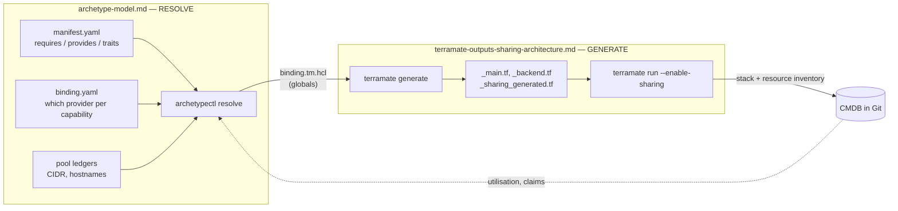

**The seam is `binding.tm.hcl`.** The resolver writes globals; the generators consume them. Neither half knows the other's internals.

---

## 2. End-to-end flow of a pull request

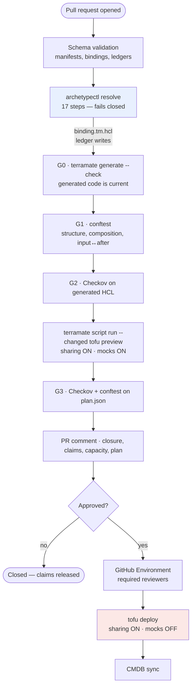

Two things this makes visible: the resolver runs **before** generation because it produces generation's input, and `mock_on_fail` is true in preview and false in deploy — separate named scripts so it cannot be got wrong.

Specified in: architecture §13, §14, companion §12.

---

## 3. Archetype layers

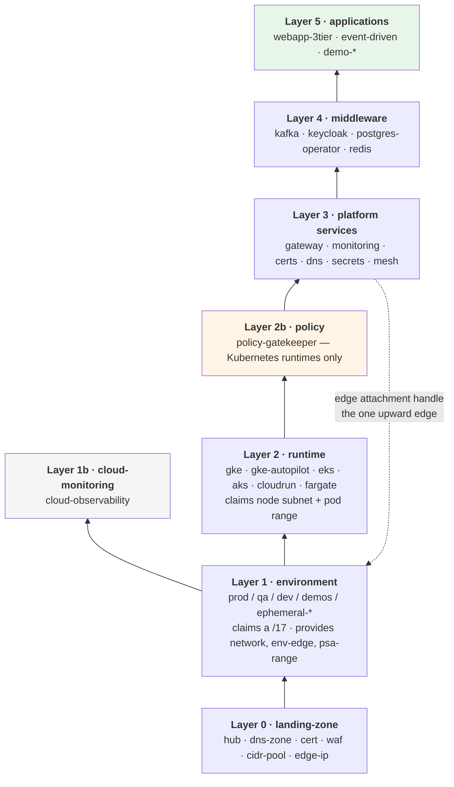

The dotted edge is the exception worth remembering: the `gateway` archetype at layer 3 publishes the NEG name / target group ARN / AGFC frontend that the environment's edge stack at layer 1 consumes.

Specified in: companion §3.

---

## 4. Where a fact comes from — globals or outputs sharing

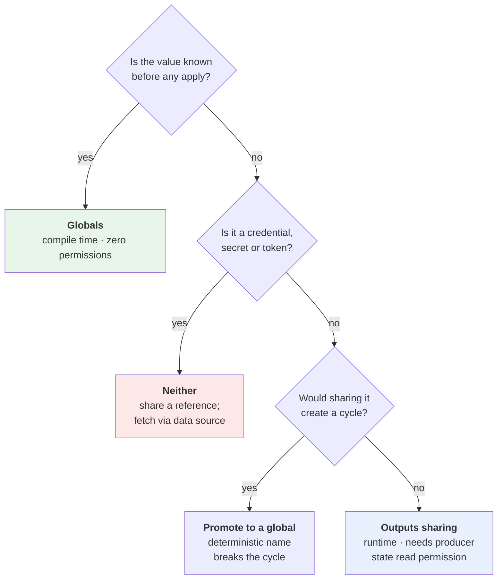

Every outputs-sharing edge is a runtime coupling, a CI permission requirement and a failure mode. Every global is a compile-time constant. Prefer globals.

Specified in: architecture §4.6, §11.5, §11.6.

---

## 5. How a shared value actually travels

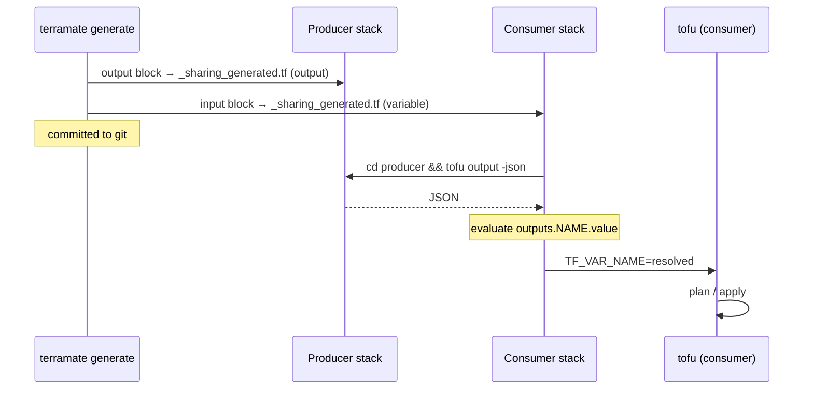

The third arrow is the one that costs permissions: the consumer's CI job needs **read access to the producer's state backend**, and its encryption key if state encryption is enabled.

Specified in: architecture §3.3, §11.5.

---

## 6. Hierarchical pools and purpose zones

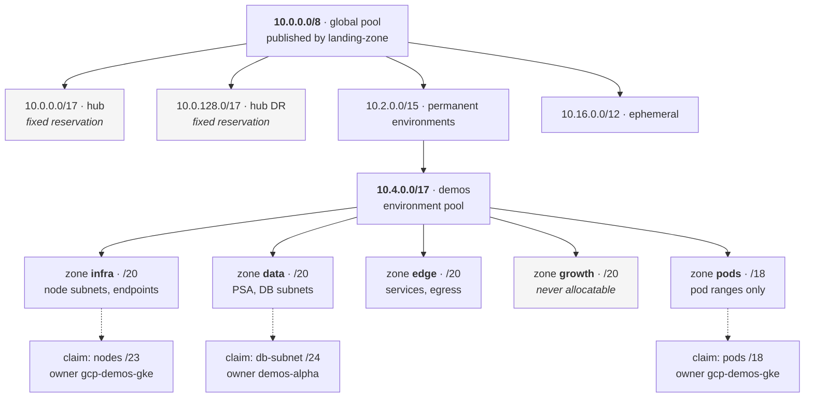

The hub is a **fixed reservation, not a claim** — the landing zone publishes the pool and needs addresses itself, so a claim would create a bootstrap cycle.

Specified in: companion §9.

---

## 7. Claim, capacity, or neither

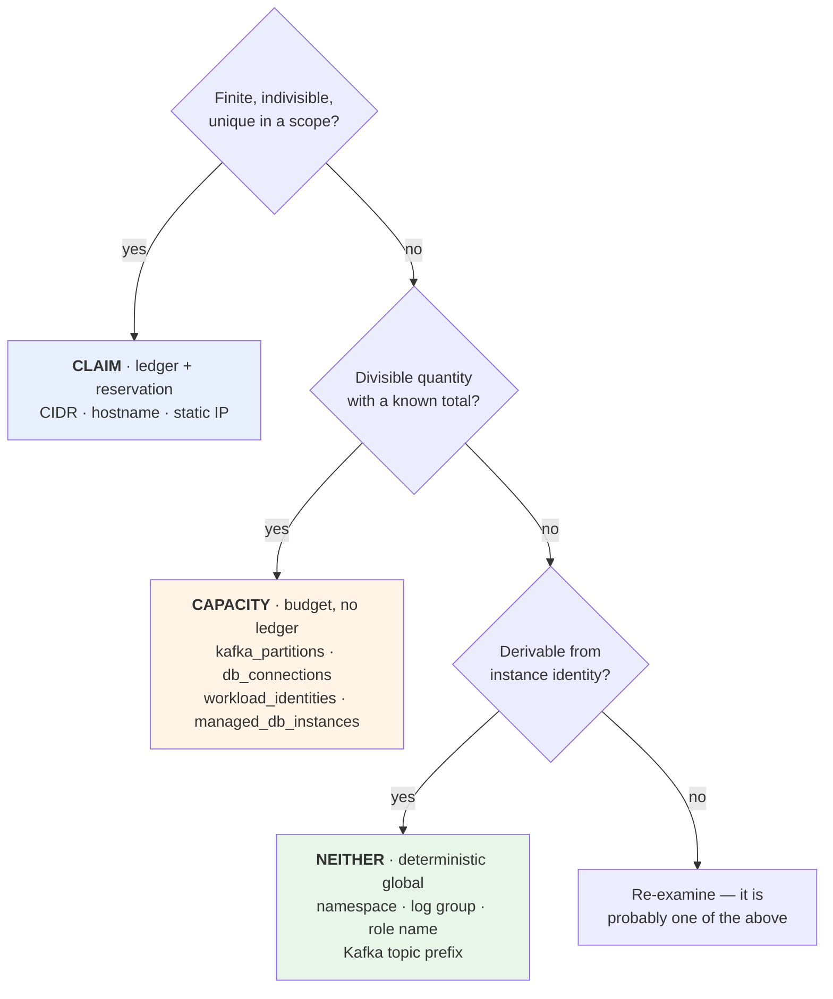

Allocation is idempotent on the triple **`(pool, owner, purpose)`**, so five retries of a failed deployment do not burn five pod ranges.

Specified in: companion §8.

---

## 8. Resolution — the 17 steps, grouped

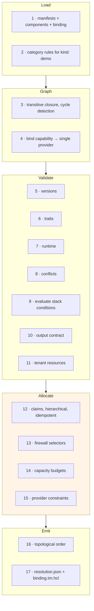

Step 4 is a **lookup, not a search** — exactly one provider per capability per environment — which is why resolution is linear rather than NP-complete. The engineering effort belongs in the diagnostics, not the algorithm.

Specified in: companion §12, §13.

---

## 9. The shape every runtime guide follows

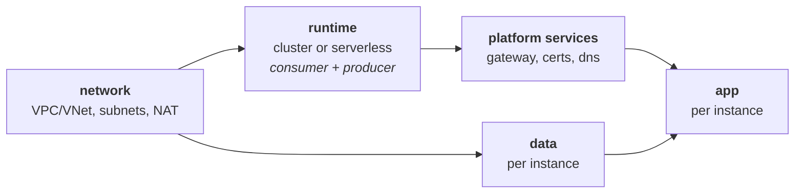

All five guides — GKE, EKS, Cloud Run, ECS Fargate, AKS — are this graph. What differs is *which facts cross each edge*:

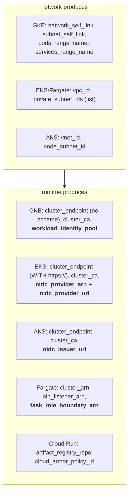

Two asymmetries that cause copy-paste bugs: GKE returns an endpoint **without** a scheme and EKS returns one **with** `https://`; and AWS needs two OIDC facts where GCP and Azure need one.

**Never shared, on any cloud:** the auth token. Fetched locally by each consumer via `google_client_config`, `aws_eks_cluster_auth` or the Azure equivalent.

Specified in: architecture §5–§9, §6.8.

---

## 10. Edge attachment — the least portable element

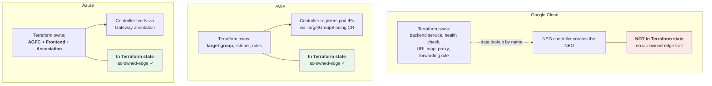

GCP is the weakest of the three for full IaC ownership. That gap is recorded as the absence of the `iac-owned-edge` trait rather than hidden, so a future compliance requirement fails at validation rather than at audit.

Specified in: architecture §10, companion §4.3.

---

## 11. Why Gateway API removes the fan-in problem

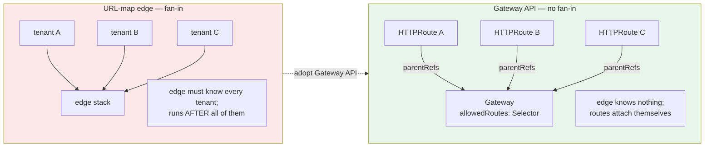

Adopting Gateway API removes three things: the URL map generated from a tenant list, the listener-priority ledger, and the edge-routing stack that had to run last. What survives as a claim is the **hostname** — only one tenant can own `alpha.demos.acme.com`.

Specified in: architecture §10.6.

---

## 12. Isolation boundaries by runtime

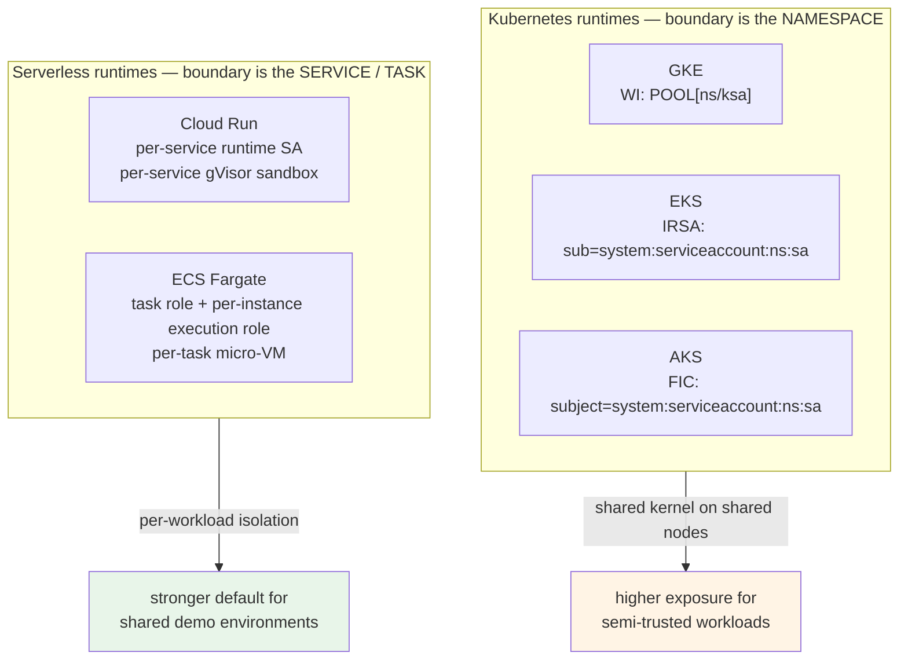

A wildcard in any of those three trust conditions (`POOL[*/*]`, `system:serviceaccount:*:*`) silently grants every pod in the cluster the identity. That is risk R15.

Specified in: architecture §11.8, §12.3.

---

## 12b. Three enforcement points

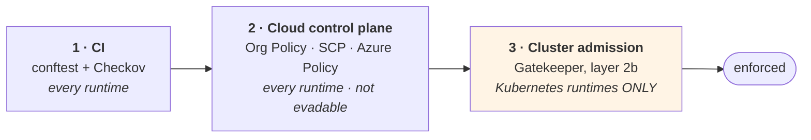

The third point does not exist on Cloud Run, ECS Fargate or Container Apps — the `policy` capability lives only where `cluster` does. Runtime parity is not achievable here, and the gap is written down rather than assumed away.

The resolver **computes**; OPA **asserts**. They must not implement the same rule twice: the resolver owns closure, allocation and ordering; OPA validates that what the resolver and generators produced is legal.

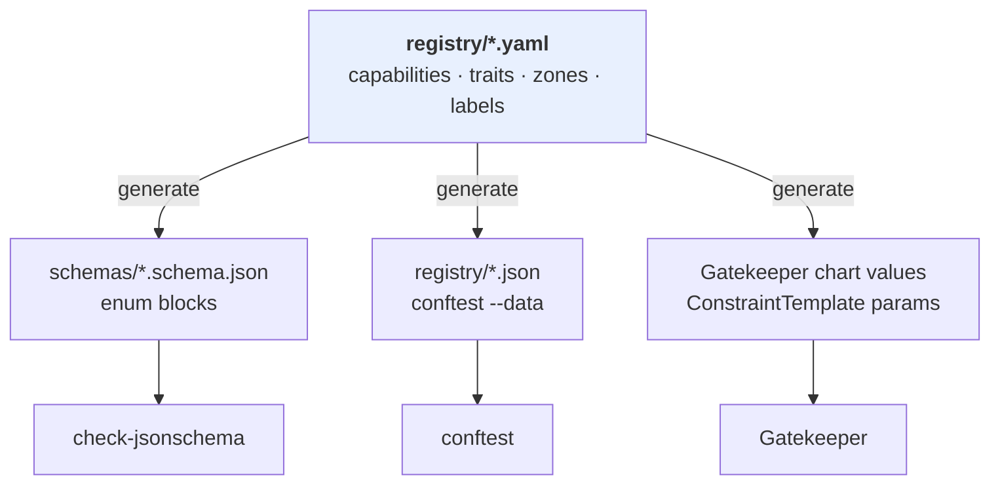

One source, three generated artefacts, a `registry-generate --check` gate. Without it they diverge — and the failure mode is a label the generator stopped emitting while the admission `Constraint` still demands it, which blocks legitimate deployments at the worst possible moment.

Specified in: architecture §13, companion §4.5.

---

## 13. Three layers of guard rails

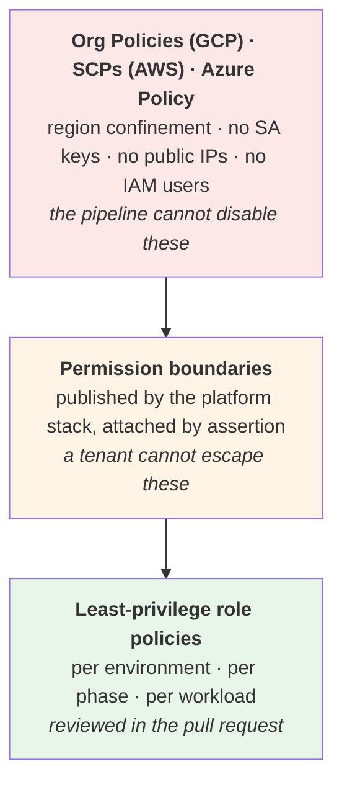

Specified in: architecture §11.7.

---

## 14. Tenant resources on a shared operator

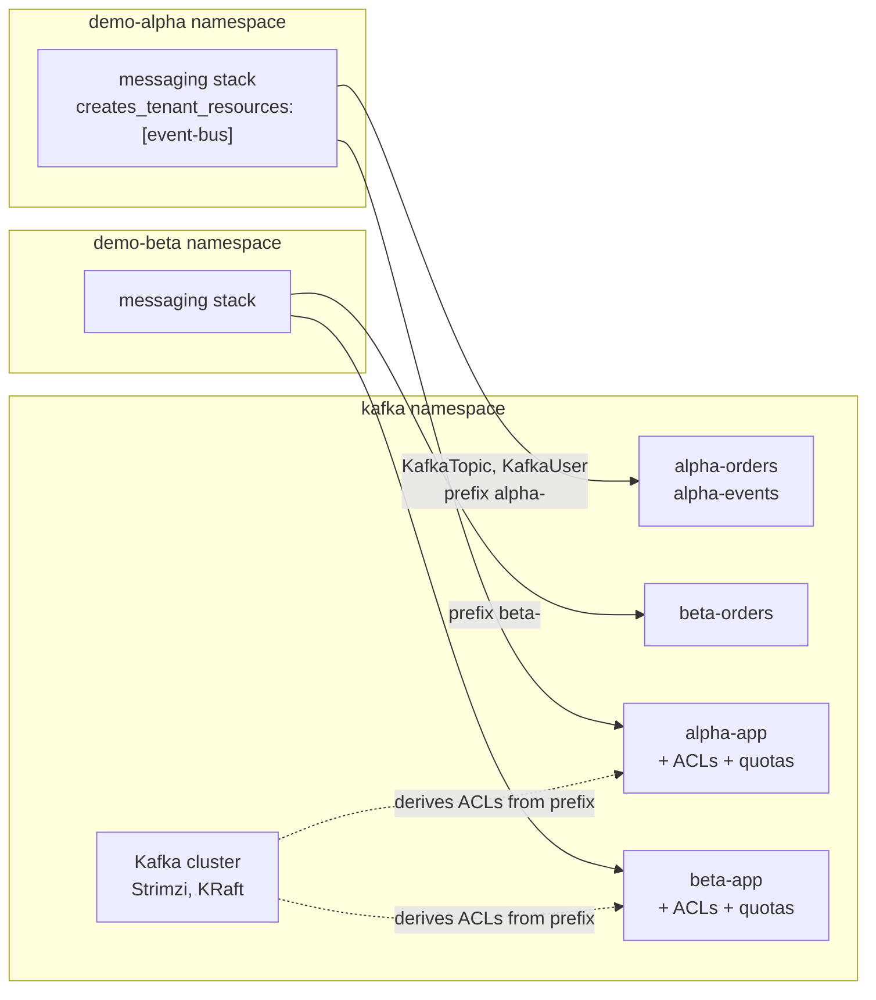

Three rules make this safe: mandatory `{{ instance }}-` prefix, ACLs **derived by the provider** rather than written by each application, and `KafkaUser` throughput quotas — because ResourceQuota does not limit bytes per second.

Specified in: companion §10.

---

## 15. Catalog, demo and component

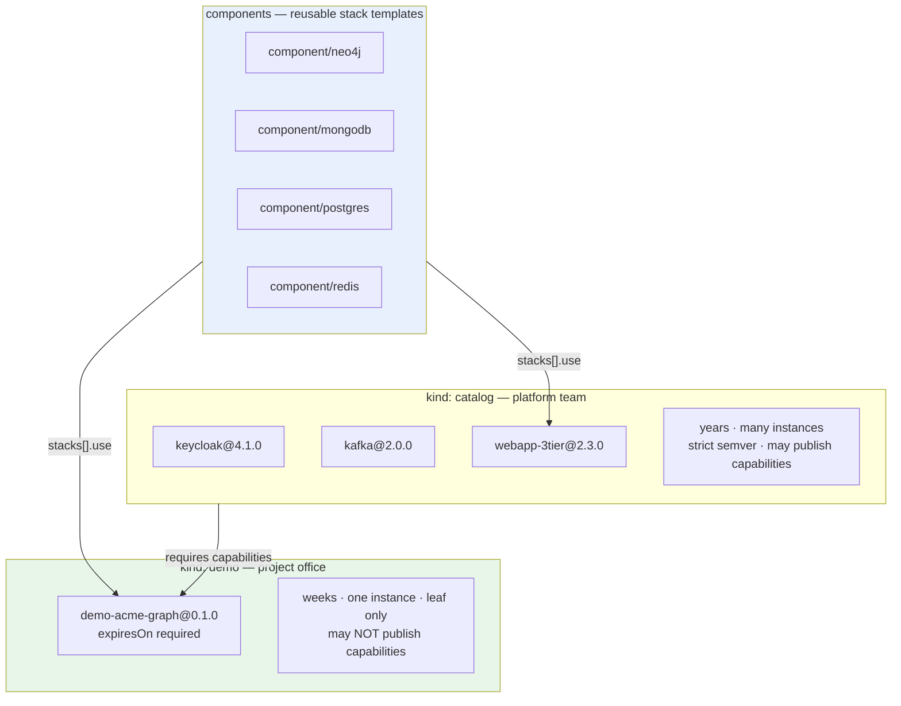

The component catalog is what makes the demo category viable: the project office writes one bespoke stack and a values file, not infrastructure. Twenty minutes instead of a day.

Specified in: companion §5.

---

## 16. Reading order

```mermaid
flowchart LR
    S["Start here"] --> O["This overview"]
    O --> A1["archetype-model §3 layers<br/>§4 capabilities and traits"]
    A1 --> A2["companion §5 anatomy<br/>§6 manifest"]
    A2 --> B1["architecture §3 architecture<br/>§4 element reference"]
    B1 --> B2["pick ONE guide<br/>§5 GKE or §6 EKS"]
    B2 --> C1["architecture §11 identity<br/>§12 environments"]
    C1 --> C2["companion §8 §9 pools<br/>§12 resolution"]
    C2 --> D1["architecture §13 policy<br/>§14 CI/CD"]
    D1 --> D2["risk-register.md<br/>top five first"]
```

Read one runtime guide, not five. They are the same graph with different facts on the edges; §6.8 tabulates the differences.
